# final 关键字的线程安全性深度分析

## 1. 多CPU并发编程的问题场景

### 1.1 多CPU架构与缓存层次

现代计算机系统采用多核CPU架构，每个CPU核心都有自己的缓存系统，这带来了性能提升，但也引入了复杂的并发问题。

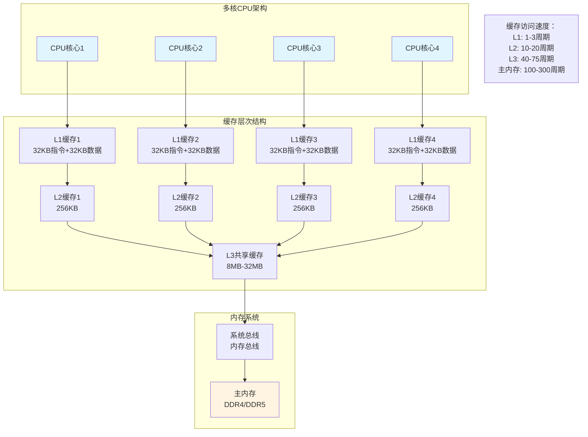
```mermaid
graph TB
    subgraph "多核CPU架构"
        CPU1[CPU核心1]
        CPU2[CPU核心2]
        CPU3[CPU核心3]
        CPU4[CPU核心4]
    end
    
    subgraph "缓存层次结构"
        L1_1[L1缓存1<br/>32KB指令+32KB数据]
        L1_2[L1缓存2<br/>32KB指令+32KB数据]
        L1_3[L1缓存3<br/>32KB指令+32KB数据]
        L1_4[L1缓存4<br/>32KB指令+32KB数据]
        L2_1[L2缓存1<br/>256KB]
        L2_2[L2缓存2<br/>256KB]
        L2_3[L2缓存3<br/>256KB]
        L2_4[L2缓存4<br/>256KB]
        L3[L3共享缓存<br/>8MB-32MB]
    end
    
    subgraph "内存系统"
        Memory[主内存<br/>DDR4/DDR5]
        Bus[系统总线<br/>内存总线]
    end
    
    CPU1 --> L1_1
    CPU2 --> L1_2
    CPU3 --> L1_3
    CPU4 --> L1_4
    
    L1_1 --> L2_1
    L1_2 --> L2_2
    L1_3 --> L2_3
    L1_4 --> L2_4
    
    L2_1 --> L3
    L2_2 --> L3
    L2_3 --> L3
    L2_4 --> L3
    
    L3 --> Bus
    Bus --> Memory
    
    Note1[缓存访问速度：<br/>L1: 1-3周期<br/>L2: 10-20周期<br/>L3: 40-75周期<br/>主内存: 100-300周期]
    
    style CPU1 fill:#e1f5ff
    style CPU2 fill:#e1f5ff
    style CPU3 fill:#e1f5ff
    style CPU4 fill:#e1f5ff
    style Memory fill:#fff4e1
```

**缓存层次的特点：**
- **L1缓存**：最快，但容量小，每个核心独享
- **L2缓存**：较快，容量中等，每个核心独享
- **L3缓存**：较慢，容量大，所有核心共享
- **主内存**：最慢，但容量最大，所有核心共享

### 1.2 问题场景一：缓存不一致导致的可见性问题

**场景描述：** 多个CPU核心同时访问同一个内存位置，由于每个核心都有自己的缓存，可能导致不同核心看到不同的数据值。

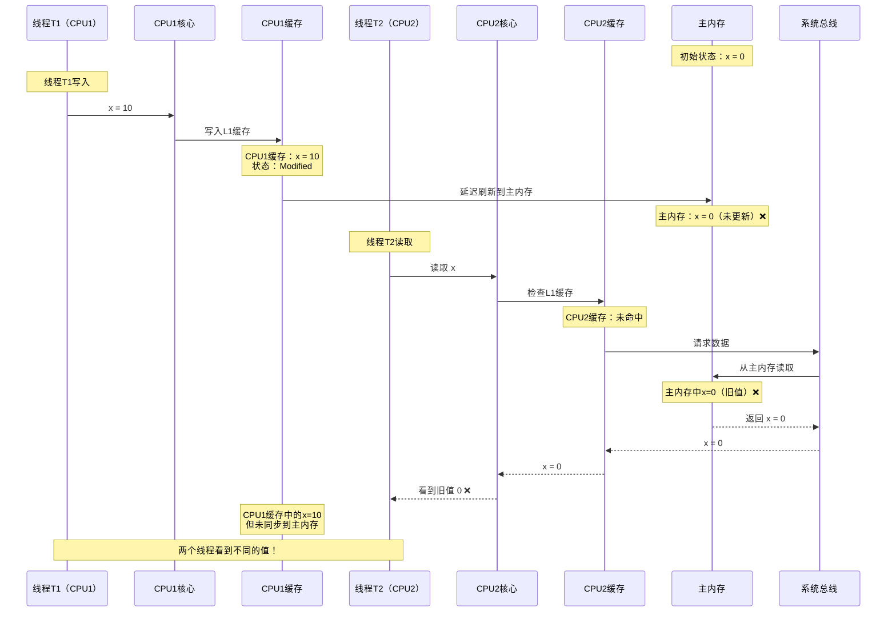
```mermaid
sequenceDiagram
    participant T1 as 线程T1（CPU1）
    participant CPU1 as CPU1核心
    participant Cache1 as CPU1缓存
    participant T2 as 线程T2（CPU2）
    participant CPU2 as CPU2核心
    participant Cache2 as CPU2缓存
    participant Memory as 主内存
    participant Bus as 系统总线
    
    Note over Memory: 初始状态：x = 0
    
    Note over T1: 线程T1写入
    T1->>CPU1: x = 10
    CPU1->>Cache1: 写入L1缓存
    Note over Cache1: CPU1缓存：x = 10<br/>状态：Modified
    Cache1->>Memory: 延迟刷新到主内存
    Note over Memory: 主内存：x = 0（未更新）❌
    
    Note over T2: 线程T2读取
    T2->>CPU2: 读取 x
    CPU2->>Cache2: 检查L1缓存
    Note over Cache2: CPU2缓存：未命中
    Cache2->>Bus: 请求数据
    Bus->>Memory: 从主内存读取
    Note over Memory: 主内存中x=0（旧值）❌
    Memory-->>Bus: 返回 x = 0
    Bus-->>Cache2: x = 0
    Cache2-->>CPU2: x = 0
    CPU2-->>T2: 看到旧值 0 ❌
    
    Note over Cache1: CPU1缓存中的x=10<br/>但未同步到主内存
    Note over T1,T2: 两个线程看到不同的值！
```

**问题分析：**
- ❌ **缓存不一致**：CPU1的缓存已更新（x=10），但主内存未更新（x=0）
- ❌ **可见性延迟**：CPU2从主内存读取到旧值（x=0）
- ❌ **数据竞争**：两个线程看到不同的数据值

### 1.3 写缓冲器和失效队列的工作原理

**《Java并发编程的艺术》中详细说明的写缓冲器和失效队列：**

现代CPU为了提高性能，使用了两个关键组件：
- **写缓冲器（Store Buffer）**：临时存储写入操作，异步刷新到缓存
- **失效队列（Invalidate Queue）**：临时存储失效请求，异步处理

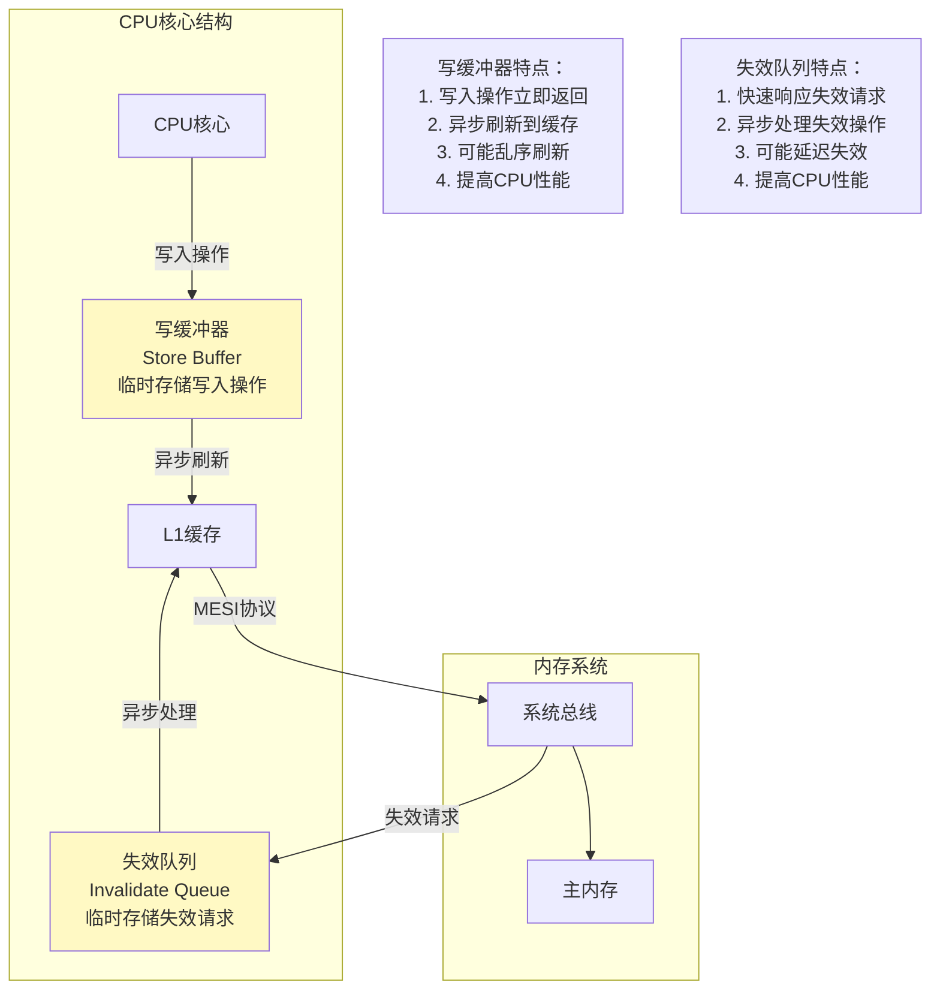
```mermaid
graph TB
    subgraph "CPU核心结构"
        CPU[CPU核心]
        SB[写缓冲器<br/>Store Buffer<br/>临时存储写入操作]
        IQ[失效队列<br/>Invalidate Queue<br/>临时存储失效请求]
        Cache[L1缓存]
    end
    
    subgraph "内存系统"
        Memory[主内存]
        Bus[系统总线]
    end
    
    CPU -->|写入操作| SB
    SB -->|异步刷新| Cache
    Cache -->|MESI协议| Bus
    Bus --> Memory
    
    Bus -->|失效请求| IQ
    IQ -->|异步处理| Cache
    
    Note1[写缓冲器特点：<br/>1. 写入操作立即返回<br/>2. 异步刷新到缓存<br/>3. 可能乱序刷新<br/>4. 提高CPU性能]
    
    Note2[失效队列特点：<br/>1. 快速响应失效请求<br/>2. 异步处理失效操作<br/>3. 可能延迟失效<br/>4. 提高CPU性能]
    
    style SB fill:#fff9c4
    style IQ fill:#fff9c4
```

#### 1.3.1 写缓冲器（Store Buffer）的工作流程

**写缓冲器的作用：**
- CPU执行写入操作时，不等待缓存响应，而是立即将写入操作放入写缓冲器
- 写缓冲器异步将数据刷新到缓存，提高CPU性能
- 但可能导致写入操作的顺序问题和可见性问题

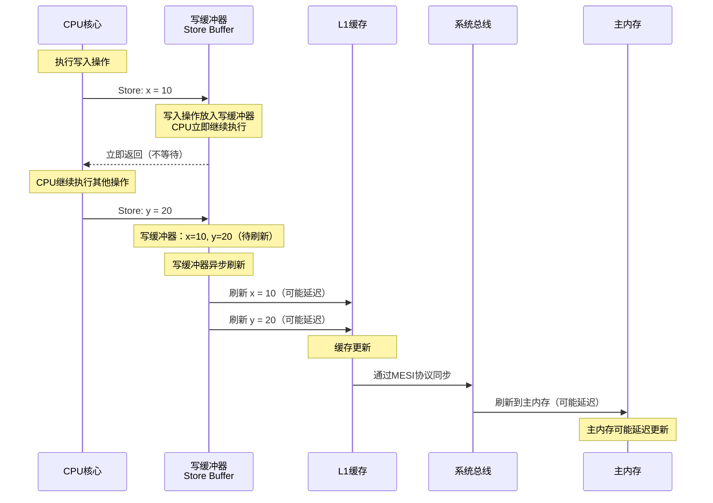
```mermaid
sequenceDiagram
    participant CPU as CPU核心
    participant SB as 写缓冲器<br/>Store Buffer
    participant Cache as L1缓存
    participant Bus as 系统总线
    participant Memory as 主内存
    
    Note over CPU: 执行写入操作
    CPU->>SB: Store: x = 10
    Note over SB: 写入操作放入写缓冲器<br/>CPU立即继续执行
    SB-->>CPU: 立即返回（不等待）
    
    Note over CPU: CPU继续执行其他操作
    CPU->>SB: Store: y = 20
    Note over SB: 写缓冲器：x=10, y=20（待刷新）
    
    Note over SB: 写缓冲器异步刷新
    SB->>Cache: 刷新 x = 10（可能延迟）
    SB->>Cache: 刷新 y = 20（可能延迟）
    
    Note over Cache: 缓存更新
    Cache->>Bus: 通过MESI协议同步
    Bus->>Memory: 刷新到主内存（可能延迟）
    
    Note over Memory: 主内存可能延迟更新
```

**写缓冲器导致的问题：**
1. **写入顺序问题**：写缓冲器可能乱序刷新，导致写入顺序改变
2. **可见性延迟**：写入操作在写缓冲器中，其他CPU看不到
3. **部分更新可见**：部分写入已刷新，部分还在写缓冲器中

#### 1.3.2 失效队列（Invalidate Queue）的工作流程

**失效队列的作用：**
- 当其他CPU需要使当前CPU的缓存失效时，失效请求放入失效队列
- CPU快速响应失效请求（不等待实际失效完成），继续执行
- 失效队列异步处理失效操作，提高CPU性能
- 但可能导致读取到已失效的缓存数据

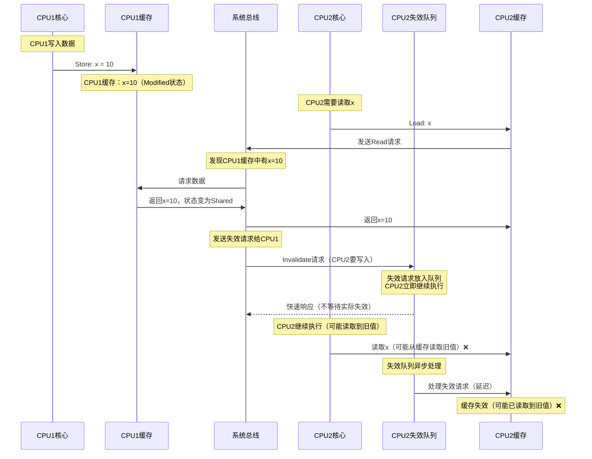
```mermaid
sequenceDiagram
    participant CPU1 as CPU1核心
    participant Cache1 as CPU1缓存
    participant Bus as 系统总线
    participant CPU2 as CPU2核心
    participant IQ2 as CPU2失效队列
    participant Cache2 as CPU2缓存
    
    Note over CPU1: CPU1写入数据
    CPU1->>Cache1: Store: x = 10
    Note over Cache1: CPU1缓存：x=10（Modified状态）
    
    Note over CPU2: CPU2需要读取x
    CPU2->>Cache2: Load: x
    Cache2->>Bus: 发送Read请求
    
    Note over Bus: 发现CPU1缓存中有x=10
    Bus->>Cache1: 请求数据
    Cache1->>Bus: 返回x=10，状态变为Shared
    Bus->>Cache2: 返回x=10
    
    Note over Bus: 发送失效请求给CPU1
    Bus->>IQ2: Invalidate请求（CPU2要写入）
    Note over IQ2: 失效请求放入队列<br/>CPU2立即继续执行
    IQ2-->>Bus: 快速响应（不等待实际失效）
    
    Note over CPU2: CPU2继续执行（可能读取到旧值）
    CPU2->>Cache2: 读取x（可能从缓存读取旧值）❌
    
    Note over IQ2: 失效队列异步处理
    IQ2->>Cache2: 处理失效请求（延迟）
    Note over Cache2: 缓存失效（可能已读取到旧值）❌
```

**失效队列导致的问题：**
1. **读取到旧值**：失效请求在队列中，但CPU可能已读取到旧值
2. **失效延迟**：失效操作异步处理，可能延迟
3. **可见性延迟**：其他CPU的写入可能还未生效

### 1.4 问题场景二：写缓冲器和失效队列导致的可见性问题

**场景描述：** 写缓冲器和失效队列的组合使用，导致严重的可见性问题。

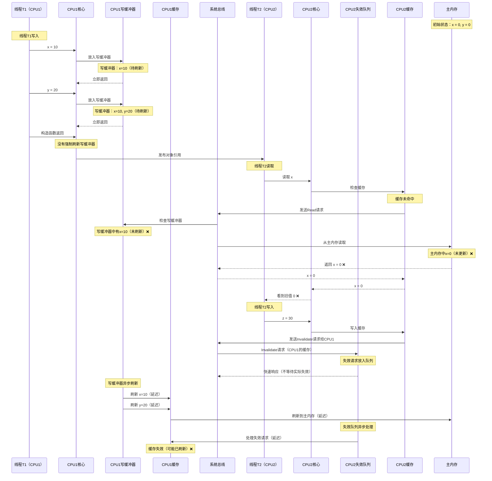
```mermaid
sequenceDiagram
    participant T1 as 线程T1（CPU1）
    participant CPU1 as CPU1核心
    participant SB1 as CPU1写缓冲器
    participant Cache1 as CPU1缓存
    participant Bus as 系统总线
    participant T2 as 线程T2（CPU2）
    participant CPU2 as CPU2核心
    participant IQ2 as CPU2失效队列
    participant Cache2 as CPU2缓存
    participant Memory as 主内存
    
    Note over Memory: 初始状态：x = 0, y = 0
    
    Note over T1: 线程T1写入
    T1->>CPU1: x = 10
    CPU1->>SB1: 放入写缓冲器
    Note over SB1: 写缓冲器：x=10（待刷新）
    SB1-->>CPU1: 立即返回
    
    T1->>CPU1: y = 20
    CPU1->>SB1: 放入写缓冲器
    Note over SB1: 写缓冲器：x=10, y=20（待刷新）
    SB1-->>CPU1: 立即返回
    
    T1->>CPU1: 构造函数返回
    Note over CPU1: 没有强制刷新写缓冲器
    CPU1->>T2: 发布对象引用
    
    Note over T2: 线程T2读取
    T2->>CPU2: 读取 x
    CPU2->>Cache2: 检查缓存
    Note over Cache2: 缓存未命中
    Cache2->>Bus: 发送Read请求
    Bus->>SB1: 检查写缓冲器
    Note over SB1: 写缓冲器中有x=10（未刷新）❌
    Bus->>Memory: 从主内存读取
    Note over Memory: 主内存中x=0（未更新）❌
    Memory-->>Bus: 返回 x = 0 ❌
    Bus-->>Cache2: x = 0
    Cache2-->>CPU2: x = 0
    CPU2-->>T2: 看到旧值 0 ❌
    
    Note over T2: 线程T2写入
    T2->>CPU2: z = 30
    CPU2->>Cache2: 写入缓存
    Cache2->>Bus: 发送Invalidate请求给CPU1
    Bus->>IQ2: Invalidate请求（CPU1的缓存）
    Note over IQ2: 失效请求放入队列
    IQ2-->>Bus: 快速响应（不等待实际失效）
    
    Note over SB1: 写缓冲器异步刷新
    SB1->>Cache1: 刷新 x=10（延迟）
    SB1->>Cache1: 刷新 y=20（延迟）
    Cache1->>Memory: 刷新到主内存（延迟）
    
    Note over IQ2: 失效队列异步处理
    IQ2->>Cache1: 处理失效请求（延迟）
    Note over Cache1: 缓存失效（可能已刷新）❌
```

**问题分析：**
- ❌ **写缓冲器延迟**：写入操作在写缓冲器中，其他CPU看不到
- ❌ **失效队列延迟**：失效请求在队列中，但缓存可能还未失效
- ❌ **可见性延迟**：两个延迟叠加，导致严重的可见性问题
- ❌ **数据不一致**：不同CPU看到不同的数据值

**写缓冲器导致的问题：**

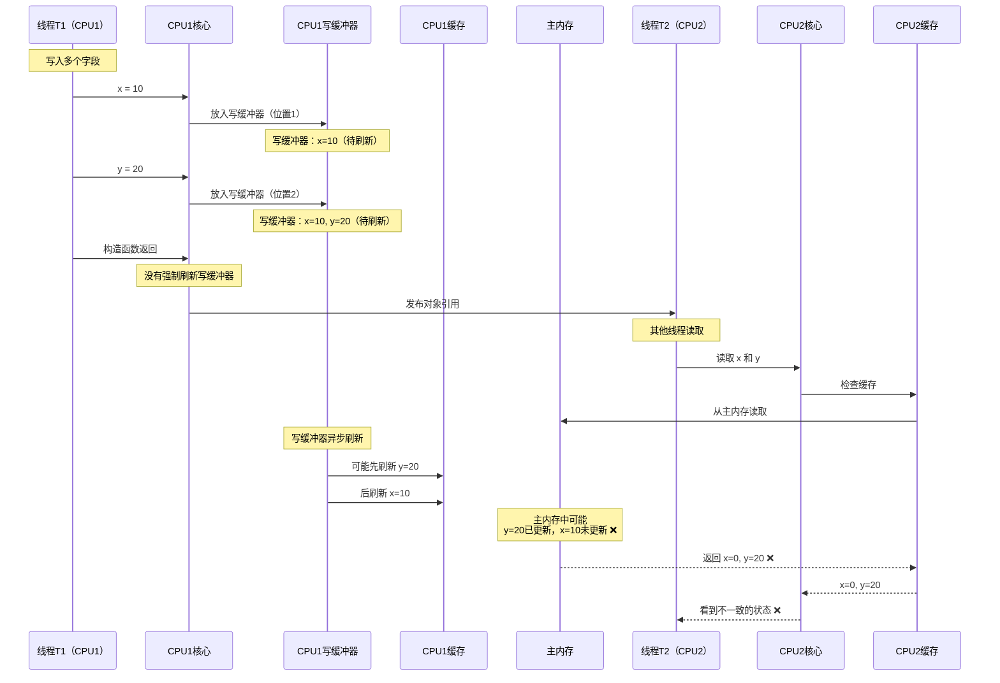
```mermaid
sequenceDiagram
    participant T1 as 线程T1（CPU1）
    participant CPU1 as CPU1核心
    participant SB1 as CPU1写缓冲器
    participant Cache1 as CPU1缓存
    participant Memory as 主内存
    participant T2 as 线程T2（CPU2）
    participant CPU2 as CPU2核心
    participant Cache2 as CPU2缓存
    
    Note over T1: 写入多个字段
    T1->>CPU1: x = 10
    CPU1->>SB1: 放入写缓冲器（位置1）
    Note over SB1: 写缓冲器：x=10（待刷新）
    
    T1->>CPU1: y = 20
    CPU1->>SB1: 放入写缓冲器（位置2）
    Note over SB1: 写缓冲器：x=10, y=20（待刷新）
    
    T1->>CPU1: 构造函数返回
    Note over CPU1: 没有强制刷新写缓冲器
    CPU1->>T2: 发布对象引用
    
    Note over T2: 其他线程读取
    T2->>CPU2: 读取 x 和 y
    CPU2->>Cache2: 检查缓存
    Cache2->>Memory: 从主内存读取
    
    Note over SB1: 写缓冲器异步刷新
    SB1->>Cache1: 可能先刷新 y=20
    SB1->>Cache1: 后刷新 x=10
    Note over Memory: 主内存中可能<br/>y=20已更新，x=10未更新 ❌
    
    Memory-->>Cache2: 返回 x=0, y=20 ❌
    Cache2-->>CPU2: x=0, y=20
    CPU2-->>T2: 看到不一致的状态 ❌
```

**问题分析：**
- ❌ **写缓冲器乱序**：写缓冲器可能不按顺序刷新
- ❌ **部分更新可见**：其他线程可能看到部分字段已更新，部分未更新
- ❌ **对象状态不一致**：对象处于不一致的中间状态

### 1.4 问题场景三：高速缓存刷新延迟

**《Java并发编程的艺术》中强调的高速缓存刷新延迟：**

缓存刷新不是实时的，CPU为了提高性能，会延迟刷新缓存到主内存。

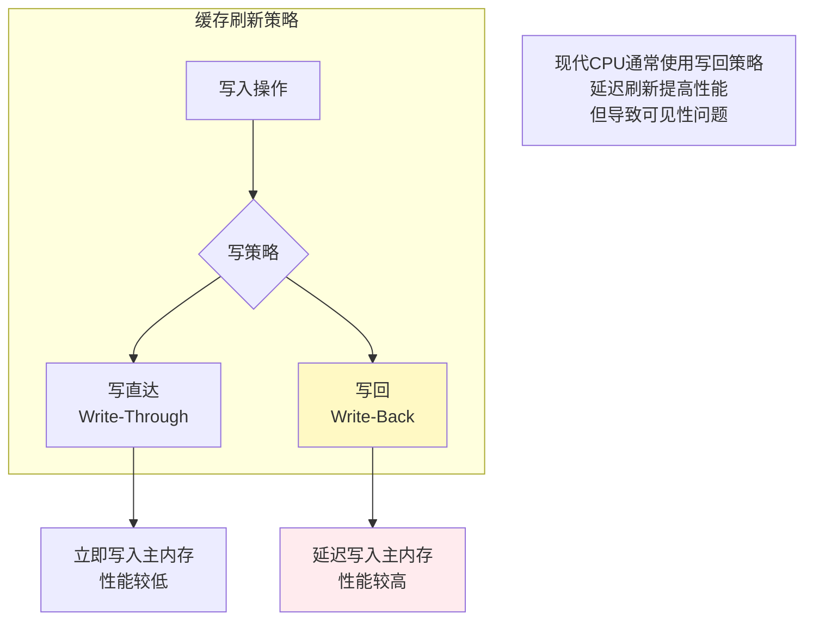
```mermaid
graph TB
    subgraph "缓存刷新策略"
        A[写入操作]
        B{写策略}
        C[写直达<br/>Write-Through]
        D[写回<br/>Write-Back]
    end
    
    A --> B
    B --> C
    B --> D
    
    C --> E[立即写入主内存<br/>性能较低]
    D --> F[延迟写入主内存<br/>性能较高]
    
    Note1[现代CPU通常使用写回策略<br/>延迟刷新提高性能<br/>但导致可见性问题]
    
    style D fill:#fff9c4
    style F fill:#ffebee
```

**缓存刷新延迟导致的问题：**

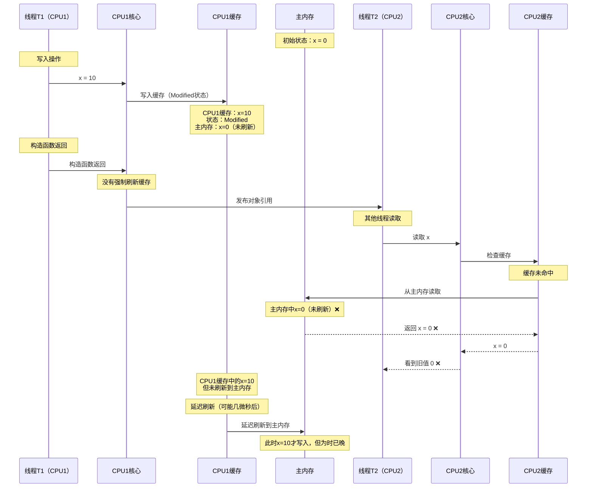
```mermaid
sequenceDiagram
    participant T1 as 线程T1（CPU1）
    participant CPU1 as CPU1核心
    participant Cache1 as CPU1缓存
    participant Memory as 主内存
    participant T2 as 线程T2（CPU2）
    participant CPU2 as CPU2核心
    participant Cache2 as CPU2缓存
    
    Note over Memory: 初始状态：x = 0
    
    Note over T1: 写入操作
    T1->>CPU1: x = 10
    CPU1->>Cache1: 写入缓存（Modified状态）
    Note over Cache1: CPU1缓存：x=10<br/>状态：Modified<br/>主内存：x=0（未刷新）
    
    Note over T1: 构造函数返回
    T1->>CPU1: 构造函数返回
    Note over CPU1: 没有强制刷新缓存
    CPU1->>T2: 发布对象引用
    
    Note over T2: 其他线程读取
    T2->>CPU2: 读取 x
    CPU2->>Cache2: 检查缓存
    Note over Cache2: 缓存未命中
    Cache2->>Memory: 从主内存读取
    Note over Memory: 主内存中x=0（未刷新）❌
    Memory-->>Cache2: 返回 x = 0 ❌
    Cache2-->>CPU2: x = 0
    CPU2-->>T2: 看到旧值 0 ❌
    
    Note over Cache1: CPU1缓存中的x=10<br/>但未刷新到主内存
    Note over Cache1: 延迟刷新（可能几微秒后）
    Cache1->>Memory: 延迟刷新到主内存
    Note over Memory: 此时x=10才写入，但为时已晚
```

**问题分析：**
- ❌ **刷新延迟**：缓存刷新不是实时的，可能延迟几微秒到几毫秒
- ❌ **可见性延迟**：其他线程从主内存读取时，可能看到旧值
- ❌ **数据不一致**：不同CPU看到不同的数据值

### 1.5 问题场景四：MESI协议与缓存一致性

**MESI协议（缓存一致性协议）：**

MESI是CPU缓存一致性协议，定义了缓存行的四种状态：
- **M (Modified)**：缓存行已被修改，与主内存不一致
- **E (Exclusive)**：缓存行独占，与主内存一致
- **S (Shared)**：缓存行共享，与主内存一致
- **I (Invalid)**：缓存行无效

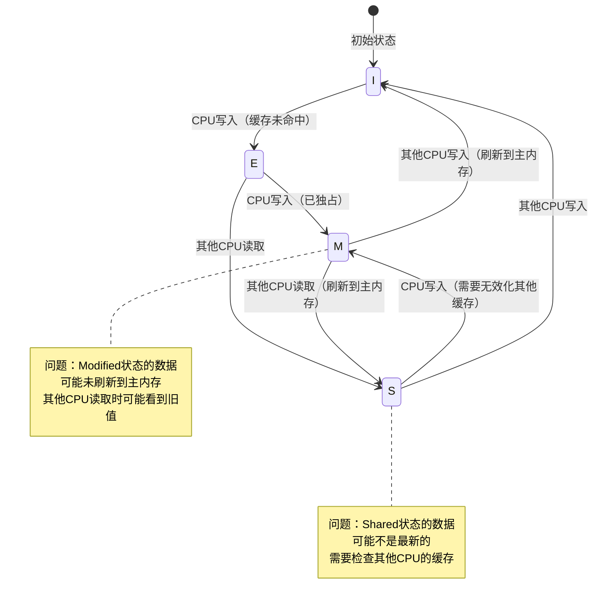
```mermaid
stateDiagram-v2
    [*] --> I: 初始状态
    I --> E: CPU写入（缓存未命中）
    E --> M: CPU写入（已独占）
    E --> S: 其他CPU读取
    S --> M: CPU写入（需要无效化其他缓存）
    S --> I: 其他CPU写入
    M --> S: 其他CPU读取（刷新到主内存）
    M --> I: 其他CPU写入（刷新到主内存）
    
    note right of M
        问题：Modified状态的数据
        可能未刷新到主内存
        其他CPU读取时可能看到旧值
    end note
    
    note right of S
        问题：Shared状态的数据
        可能不是最新的
        需要检查其他CPU的缓存
    end note
```

**MESI协议导致的问题：**

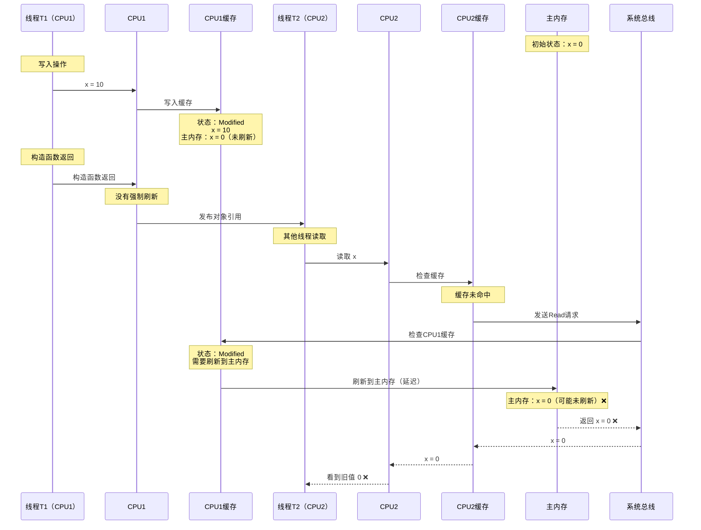
```mermaid
sequenceDiagram
    participant T1 as 线程T1（CPU1）
    participant CPU1 as CPU1
    participant Cache1 as CPU1缓存
    participant T2 as 线程T2（CPU2）
    participant CPU2 as CPU2
    participant Cache2 as CPU2缓存
    participant Memory as 主内存
    participant Bus as 系统总线
    
    Note over Memory: 初始状态：x = 0
    
    Note over T1: 写入操作
    T1->>CPU1: x = 10
    CPU1->>Cache1: 写入缓存
    Note over Cache1: 状态：Modified<br/>x = 10<br/>主内存：x = 0（未刷新）
    
    Note over T1: 构造函数返回
    T1->>CPU1: 构造函数返回
    Note over CPU1: 没有强制刷新
    CPU1->>T2: 发布对象引用
    
    Note over T2: 其他线程读取
    T2->>CPU2: 读取 x
    CPU2->>Cache2: 检查缓存
    Note over Cache2: 缓存未命中
    Cache2->>Bus: 发送Read请求
    Bus->>Cache1: 检查CPU1缓存
    Note over Cache1: 状态：Modified<br/>需要刷新到主内存
    Cache1->>Memory: 刷新到主内存（延迟）
    Note over Memory: 主内存：x = 0（可能未刷新）❌
    Memory-->>Bus: 返回 x = 0 ❌
    Bus-->>Cache2: x = 0
    Cache2-->>CPU2: x = 0
    CPU2-->>T2: 看到旧值 0 ❌
```

**问题分析：**
- ❌ **MESI协议延迟**：缓存一致性协议需要时间同步
- ❌ **状态转换延迟**：Modified状态转换为Shared状态需要刷新到主内存
- ❌ **可见性延迟**：其他CPU可能看到旧值

### 1.6 问题场景五：内存重排序

**内存重排序问题：**

为了提高性能，CPU和编译器可能会对内存操作进行重排序。


```mermaid
graph TB
    subgraph "重排序的层次"
        A[源代码顺序]
        B[编译器重排序]
        C[CPU指令重排序]
        D[内存系统重排序]
        E[最终执行顺序]
    end
    
    A --> B
    B --> C
    C --> D
    D --> E
    
    Note1[编译器优化：指令重排]
    Note2[CPU乱序执行：指令级并行]
    Note3[内存系统：缓存一致性延迟]
    
    style A fill:#e1f5ff
    style E fill:#fff4e1
```

**重排序导致的问题：**

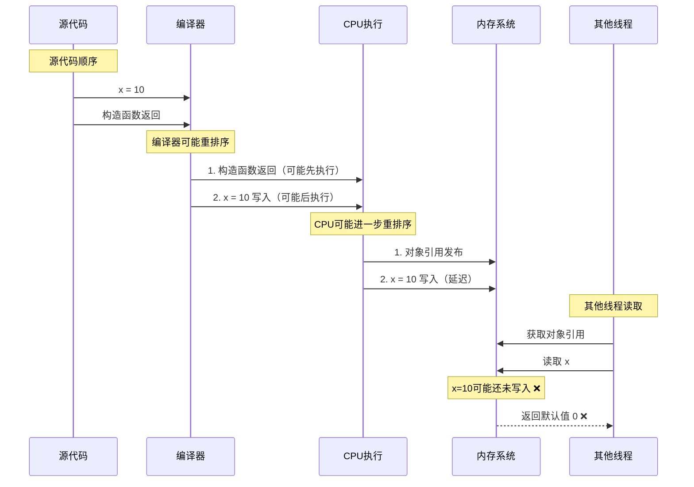
```mermaid
sequenceDiagram
    participant Code as 源代码
    participant Compiler as 编译器
    participant CPU as CPU执行
    participant Memory as 内存系统
    participant Thread2 as 其他线程
    
    Note over Code: 源代码顺序
    Code->>Compiler: x = 10
    Code->>Compiler: 构造函数返回
    
    Note over Compiler: 编译器可能重排序
    Compiler->>CPU: 1. 构造函数返回（可能先执行）
    Compiler->>CPU: 2. x = 10 写入（可能后执行）
    
    Note over CPU: CPU可能进一步重排序
    CPU->>Memory: 1. 对象引用发布
    CPU->>Memory: 2. x = 10 写入（延迟）
    
    Note over Thread2: 其他线程读取
    Thread2->>Memory: 获取对象引用
    Thread2->>Memory: 读取 x
    Note over Memory: x=10可能还未写入 ❌
    Memory-->>Thread2: 返回默认值 0 ❌
```

**问题分析：**
- ❌ **重排序**：写入操作可能被重排序到构造函数返回之后
- ❌ **可见性延迟**：其他线程可能看到未初始化的值
- ❌ **数据竞争**：对象处于不一致状态

### 1.7 问题总结：为什么需要final的解决方案

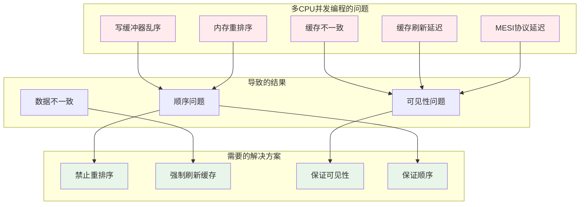
```mermaid
graph TB
    subgraph "多CPU并发编程的问题"
        P1[缓存不一致]
        P2[写缓冲器乱序]
        P3[缓存刷新延迟]
        P4[MESI协议延迟]
        P5[内存重排序]
    end
    
    subgraph "导致的结果"
        R1[可见性问题]
        R2[顺序问题]
        R3[数据不一致]
    end
    
    subgraph "需要的解决方案"
        S1[禁止重排序]
        S2[强制刷新缓存]
        S3[保证可见性]
        S4[保证顺序]
    end
    
    P1 --> R1
    P2 --> R2
    P3 --> R1
    P4 --> R1
    P5 --> R2
    
    R1 --> S3
    R2 --> S1
    R2 --> S4
    R3 --> S2
    
    style P1 fill:#ffebee
    style P2 fill:#ffebee
    style P3 fill:#ffebee
    style P4 fill:#ffebee
    style P5 fill:#ffebee
    style S1 fill:#e8f5e9
    style S2 fill:#e8f5e9
    style S3 fill:#e8f5e9
    style S4 fill:#e8f5e9
```

## 2. final 关键字的解决方案

### 2.1 final 概述

`final` 是 Java 中的一个关键字，用于声明不可变的变量、方法和类。在多线程环境下，`final` 关键字通过 Java 内存模型（JMM）的特殊规则，解决了上述多CPU并发编程的问题。

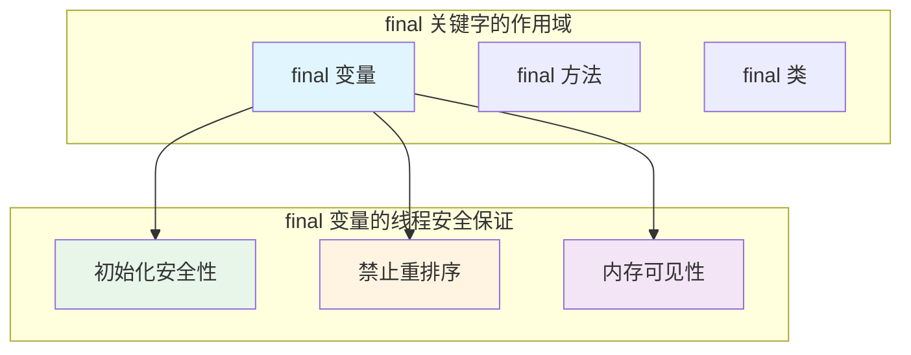
```mermaid
graph TB
    subgraph "final 关键字的作用域"
        A[final 变量]
        B[final 方法]
        C[final 类]
    end
    
    subgraph "final 变量的线程安全保证"
        D[初始化安全性]
        E[禁止重排序]
        F[内存可见性]
    end
    
    A --> D
    A --> E
    A --> F
    
    style A fill:#e1f5ff
    style D fill:#e8f5e9
    style E fill:#fff4e1
    style F fill:#f3e5f5
```

### 2.2 final 如何解决多CPU并发问题

#### 2.2.1 解决写缓冲器和失效队列问题

**final 字段通过 StoreStore 屏障强制刷新写缓冲器和处理失效队列：**

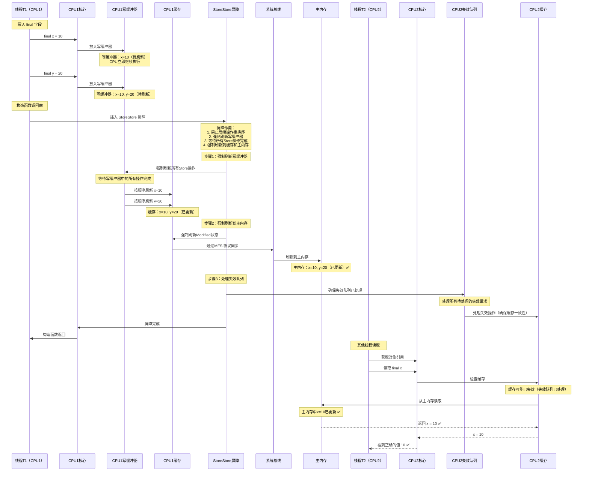
```mermaid
sequenceDiagram
    participant T1 as 线程T1（CPU1）
    participant CPU1 as CPU1核心
    participant SB1 as CPU1写缓冲器
    participant Cache1 as CPU1缓存
    participant Barrier as StoreStore屏障
    participant Bus as 系统总线
    participant Memory as 主内存
    participant T2 as 线程T2（CPU2）
    participant CPU2 as CPU2核心
    participant IQ2 as CPU2失效队列
    participant Cache2 as CPU2缓存
    
    Note over T1: 写入 final 字段
    T1->>CPU1: final x = 10
    CPU1->>SB1: 放入写缓冲器
    Note over SB1: 写缓冲器：x=10（待刷新）<br/>CPU立即继续执行
    
    T1->>CPU1: final y = 20
    CPU1->>SB1: 放入写缓冲器
    Note over SB1: 写缓冲器：x=10, y=20（待刷新）
    
    Note over T1: 构造函数返回前
    T1->>Barrier: 插入 StoreStore 屏障
    Note over Barrier: 屏障作用：<br/>1. 禁止后续操作重排序<br/>2. 强制刷新写缓冲器<br/>3. 等待所有Store操作完成<br/>4. 强制刷新到缓存和主内存
    
    Note over Barrier: 步骤1：强制刷新写缓冲器
    Barrier->>SB1: 强制刷新所有Store操作
    Note over SB1: 等待写缓冲器中的所有操作完成
    SB1->>Cache1: 按顺序刷新 x=10
    SB1->>Cache1: 按顺序刷新 y=20
    Note over Cache1: 缓存：x=10, y=20（已更新）
    
    Note over Barrier: 步骤2：强制刷新到主内存
    Barrier->>Cache1: 强制刷新Modified状态
    Cache1->>Bus: 通过MESI协议同步
    Bus->>Memory: 刷新到主内存
    Note over Memory: 主内存：x=10, y=20（已更新）✅
    
    Note over Barrier: 步骤3：处理失效队列
    Barrier->>IQ2: 确保失效队列已处理
    Note over IQ2: 处理所有待处理的失效请求
    IQ2->>Cache2: 处理失效操作（确保缓存一致性）
    
    Barrier->>CPU1: 屏障完成
    CPU1->>T1: 构造函数返回
    
    Note over T2: 其他线程读取
    T2->>CPU2: 获取对象引用
    T2->>CPU2: 读取 final x
    CPU2->>Cache2: 检查缓存
    Note over Cache2: 缓存可能已失效（失效队列已处理）
    Cache2->>Memory: 从主内存读取
    Note over Memory: 主内存中x=10已更新 ✅
    Memory-->>Cache2: 返回 x = 10 ✅
    Cache2-->>CPU2: x = 10
    CPU2-->>T2: 看到正确的值 10 ✅
```

**StoreStore 屏障的详细作用：**

1. **强制刷新写缓冲器**：
   - 等待写缓冲器中的所有Store操作完成
   - 按顺序刷新到缓存
   - 确保所有写入操作在屏障前完成

2. **强制刷新到主内存**：
   - 强制Modified状态的缓存刷新到主内存
   - 通过MESI协议同步到所有CPU
   - 确保数据对所有CPU可见

3. **处理失效队列**：
   - 确保失效队列中的所有失效请求已处理
   - 保证缓存一致性
   - 防止读取到已失效的缓存数据

**关键点：**
- ✅ **写缓冲器强制刷新**：StoreStore 屏障强制刷新写缓冲器，确保所有写入完成
- ✅ **失效队列处理**：屏障确保失效队列已处理，保证缓存一致性
- ✅ **保证可见性**：所有CPU都能看到最新的值
- ✅ **解决写缓冲器和失效队列问题**：彻底解决两个延迟机制导致的可见性问题

**关键点：**
- ✅ **StoreStore 屏障**：强制刷新写缓冲器和缓存到主内存
- ✅ **保证可见性**：所有CPU都能看到最新的值
- ✅ **解决缓存不一致**：确保缓存和主内存一致

#### 2.2.2 解决写缓冲器乱序问题

**final 字段的顺序保证：**

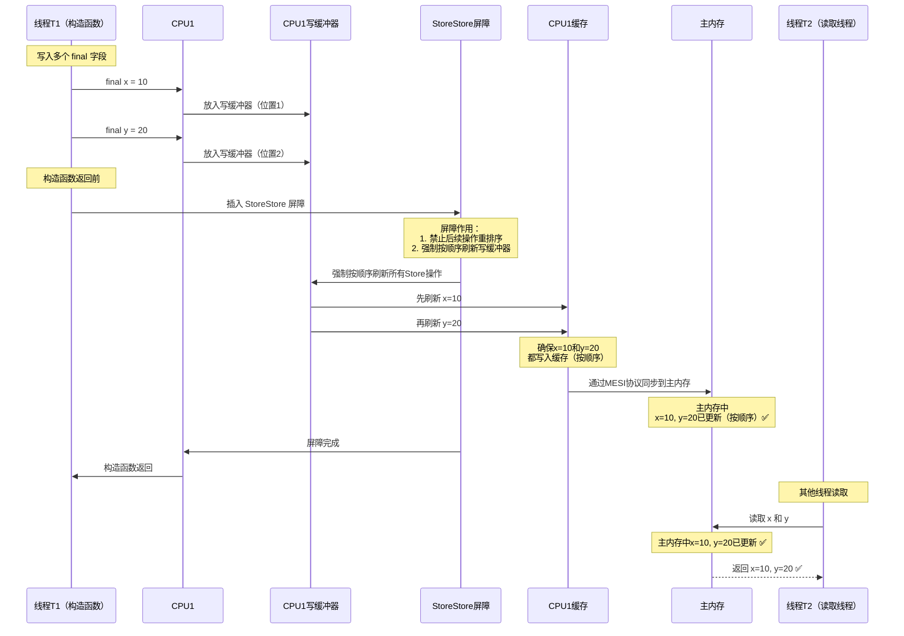
```mermaid
sequenceDiagram
    participant T1 as 线程T1（构造函数）
    participant CPU1 as CPU1
    participant SB1 as CPU1写缓冲器
    participant Barrier as StoreStore屏障
    participant Cache1 as CPU1缓存
    participant Memory as 主内存
    participant T2 as 线程T2（读取线程）
    
    Note over T1: 写入多个 final 字段
    T1->>CPU1: final x = 10
    CPU1->>SB1: 放入写缓冲器（位置1）
    
    T1->>CPU1: final y = 20
    CPU1->>SB1: 放入写缓冲器（位置2）
    
    Note over T1: 构造函数返回前
    T1->>Barrier: 插入 StoreStore 屏障
    Note over Barrier: 屏障作用：<br/>1. 禁止后续操作重排序<br/>2. 强制按顺序刷新写缓冲器
    Barrier->>SB1: 强制按顺序刷新所有Store操作
    SB1->>Cache1: 先刷新 x=10
    SB1->>Cache1: 再刷新 y=20
    Note over Cache1: 确保x=10和y=20<br/>都写入缓存（按顺序）
    Cache1->>Memory: 通过MESI协议同步到主内存
    Note over Memory: 主内存中<br/>x=10, y=20已更新（按顺序）✅
    Barrier->>CPU1: 屏障完成
    CPU1->>T1: 构造函数返回
    
    Note over T2: 其他线程读取
    T2->>Memory: 读取 x 和 y
    Note over Memory: 主内存中x=10, y=20已更新 ✅
    Memory-->>T2: 返回 x=10, y=20 ✅
```

**关键点：**
- ✅ **禁止重排序**：StoreStore 屏障禁止后续操作重排序
- ✅ **保证顺序**：确保多个写入操作按顺序完成
- ✅ **解决乱序问题**：所有字段都按顺序更新

#### 2.2.3 解决缓存刷新延迟问题

**final 字段的强制刷新：**

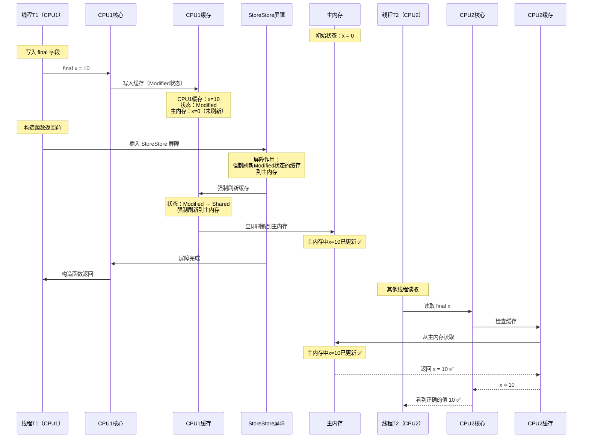
```mermaid
sequenceDiagram
    participant T1 as 线程T1（CPU1）
    participant CPU1 as CPU1核心
    participant Cache1 as CPU1缓存
    participant Barrier as StoreStore屏障
    participant Memory as 主内存
    participant T2 as 线程T2（CPU2）
    participant CPU2 as CPU2核心
    participant Cache2 as CPU2缓存
    
    Note over Memory: 初始状态：x = 0
    
    Note over T1: 写入 final 字段
    T1->>CPU1: final x = 10
    CPU1->>Cache1: 写入缓存（Modified状态）
    Note over Cache1: CPU1缓存：x=10<br/>状态：Modified<br/>主内存：x=0（未刷新）
    
    Note over T1: 构造函数返回前
    T1->>Barrier: 插入 StoreStore 屏障
    Note over Barrier: 屏障作用：<br/>强制刷新Modified状态的缓存<br/>到主内存
    Barrier->>Cache1: 强制刷新缓存
    Note over Cache1: 状态：Modified → Shared<br/>强制刷新到主内存
    Cache1->>Memory: 立即刷新到主内存
    Note over Memory: 主内存中x=10已更新 ✅
    Barrier->>CPU1: 屏障完成
    CPU1->>T1: 构造函数返回
    
    Note over T2: 其他线程读取
    T2->>CPU2: 读取 final x
    CPU2->>Cache2: 检查缓存
    Cache2->>Memory: 从主内存读取
    Note over Memory: 主内存中x=10已更新 ✅
    Memory-->>Cache2: 返回 x = 10 ✅
    Cache2-->>CPU2: x = 10
    CPU2-->>T2: 看到正确的值 10 ✅
```

**关键点：**
- ✅ **强制刷新**：StoreStore 屏障强制刷新Modified状态的缓存
- ✅ **立即可见**：确保数据立即刷新到主内存
- ✅ **解决刷新延迟**：不再依赖延迟刷新机制

#### 2.2.4 解决MESI协议延迟问题

**final 字段的MESI协议优化：**

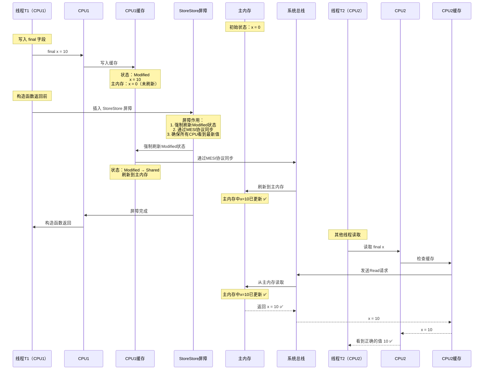
```mermaid
sequenceDiagram
    participant T1 as 线程T1（CPU1）
    participant CPU1 as CPU1
    participant Cache1 as CPU1缓存
    participant Barrier as StoreStore屏障
    participant Memory as 主内存
    participant Bus as 系统总线
    participant T2 as 线程T2（CPU2）
    participant CPU2 as CPU2
    participant Cache2 as CPU2缓存
    
    Note over Memory: 初始状态：x = 0
    
    Note over T1: 写入 final 字段
    T1->>CPU1: final x = 10
    CPU1->>Cache1: 写入缓存
    Note over Cache1: 状态：Modified<br/>x = 10<br/>主内存：x = 0（未刷新）
    
    Note over T1: 构造函数返回前
    T1->>Barrier: 插入 StoreStore 屏障
    Note over Barrier: 屏障作用：<br/>1. 强制刷新Modified状态<br/>2. 通过MESI协议同步<br/>3. 确保所有CPU看到最新值
    Barrier->>Cache1: 强制刷新Modified状态
    Cache1->>Bus: 通过MESI协议同步
    Note over Cache1: 状态：Modified → Shared<br/>刷新到主内存
    Bus->>Memory: 刷新到主内存
    Note over Memory: 主内存中x=10已更新 ✅
    Barrier->>CPU1: 屏障完成
    CPU1->>T1: 构造函数返回
    
    Note over T2: 其他线程读取
    T2->>CPU2: 读取 final x
    CPU2->>Cache2: 检查缓存
    Cache2->>Bus: 发送Read请求
    Bus->>Memory: 从主内存读取
    Note over Memory: 主内存中x=10已更新 ✅
    Memory-->>Bus: 返回 x = 10 ✅
    Bus-->>Cache2: x = 10
    Cache2-->>CPU2: x = 10
    CPU2-->>T2: 看到正确的值 10 ✅
```

**关键点：**
- ✅ **强制状态转换**：StoreStore 屏障强制Modified状态转换为Shared状态
- ✅ **立即同步**：通过MESI协议立即同步到所有CPU
- ✅ **解决协议延迟**：不再依赖延迟的状态转换

#### 2.2.5 解决内存重排序问题

**final 字段的重排序禁止：**

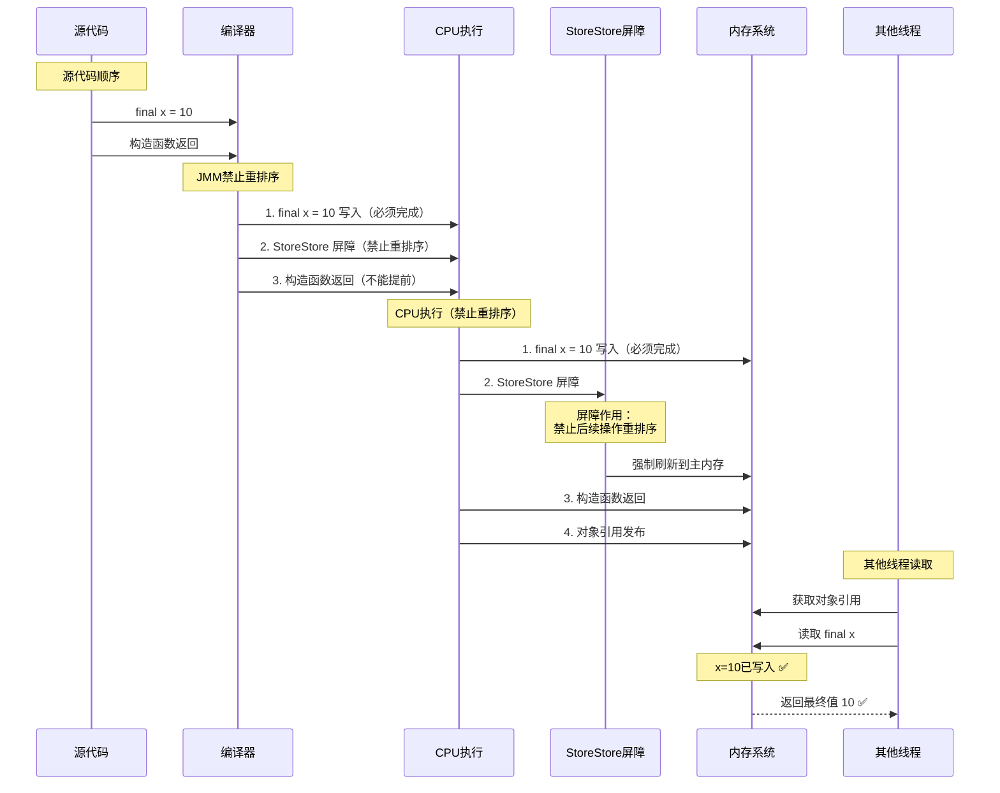
```mermaid
sequenceDiagram
    participant Code as 源代码
    participant Compiler as 编译器
    participant CPU as CPU执行
    participant Barrier as StoreStore屏障
    participant Memory as 内存系统
    participant Thread2 as 其他线程
    
    Note over Code: 源代码顺序
    Code->>Compiler: final x = 10
    Code->>Compiler: 构造函数返回
    
    Note over Compiler: JMM禁止重排序
    Compiler->>CPU: 1. final x = 10 写入（必须完成）
    Compiler->>CPU: 2. StoreStore 屏障（禁止重排序）
    Compiler->>CPU: 3. 构造函数返回（不能提前）
    
    Note over CPU: CPU执行（禁止重排序）
    CPU->>Memory: 1. final x = 10 写入（必须完成）
    CPU->>Barrier: 2. StoreStore 屏障
    Note over Barrier: 屏障作用：<br/>禁止后续操作重排序
    Barrier->>Memory: 强制刷新到主内存
    CPU->>Memory: 3. 构造函数返回
    CPU->>Memory: 4. 对象引用发布
    
    Note over Thread2: 其他线程读取
    Thread2->>Memory: 获取对象引用
    Thread2->>Memory: 读取 final x
    Note over Memory: x=10已写入 ✅
    Memory-->>Thread2: 返回最终值 10 ✅
```

**关键点：**
- ✅ **禁止重排序**：JMM禁止final字段写入与构造函数返回重排序
- ✅ **保证顺序**：确保写入操作在构造函数返回前完成
- ✅ **解决重排序问题**：所有操作按顺序执行

### 2.3 final 线程安全的核心保证

```mermaid
graph LR
    subgraph "final 线程安全保证"
        A[初始化安全性<br/>Initialization Safety]
        B[禁止重排序<br/>No Reordering]
        C[内存可见性<br/>Memory Visibility]
        D[无运行时开销<br/>Zero Runtime Cost]
    end
    
    A --> E[构造函数完成后<br/>所有线程看到最终值]
    B --> F[final写操作<br/>不能与构造函数返回重排序]
    C --> G[无需volatile或synchronized<br/>保证可见性]
    D --> H[读取性能与普通字段相同]
    
    style A fill:#e1f5ff
    style B fill:#fff4e1
    style C fill:#e8f5e9
    style D fill:#f3e5f5
```

**核心保证：**
- ✅ **初始化安全性**：final 字段在构造完成后，对所有线程可见
- ✅ **禁止重排序**：JMM 禁止对 final 字段的写操作与构造函数的返回重排序
- ✅ **可见性保证**：final 字段的值对所有线程立即可见，无需同步
- ✅ **性能优势**：读取 final 字段与读取普通字段性能相同

## 3. Java 内存模型（JMM）与 final

### 3.1 JMM 对 final 字段的特殊规则

Java 内存模型（JMM）为 `final` 字段提供了特殊的规则，确保线程安全：

```mermaid
sequenceDiagram
    participant Constructor as 构造函数线程
    participant JMM as Java内存模型
    participant Memory as 主内存
    participant Reader as 读取线程
    
    Note over Constructor: 开始构造对象
    Constructor->>Memory: 1. 写入 final 字段值
    Note over Memory: final 字段写入完成
    Constructor->>JMM: 2. 构造函数返回
    Note over JMM: JMM规则：禁止final写<br/>与构造函数返回重排序
    JMM->>Memory: 3. 插入内存屏障（StoreStore）
    Note over Memory: 确保final字段写入<br/>对所有线程可见
    Constructor->>Reader: 4. 发布对象引用
    
    Note over Reader: 获取对象引用
    Reader->>Memory: 5. 读取 final 字段
    Note over Memory: 立即看到最终值
    Memory-->>Reader: 6. 返回 final 字段值
    Note over Reader: 保证看到正确的值
```

### 3.2 final 字段的内存语义规则

```mermaid
graph TB
    subgraph "JMM final 字段规则"
        Rule1[规则1: final字段写入<br/>必须在构造函数返回前完成]
        Rule2[规则2: 禁止final字段写入<br/>与构造函数返回重排序]
        Rule3[规则3: 构造函数返回时<br/>插入内存屏障确保可见性]
        Rule4[规则4: 读取final字段前<br/>必须看到完整的对象初始化]
    end
    
    subgraph "实现机制"
        M1[内存屏障 StoreStore]
        M2[内存屏障 LoadLoad]
        M3[禁止编译器重排序]
        M4[禁止CPU重排序]
    end
    
    Rule1 --> M1
    Rule2 --> M3
    Rule2 --> M4
    Rule3 --> M1
    Rule4 --> M2
    
    style Rule1 fill:#e1f5ff
    style Rule2 fill:#fff4e1
    style Rule3 fill:#e8f5e9
    style Rule4 fill:#f3e5f5
```

**JMM 规则：**

1. **final 字段的写操作**必须在构造函数返回之前完成
2. **构造函数返回**与 **final 字段的写操作**之间不能重排序
3. **读取 final 字段**的线程，必须能看到该字段的最终值

## 4. 内存屏障（Memory Barrier）详解

### 4.1 问题场景：没有内存屏障会出现什么情况

在多核 CPU 环境下，如果没有内存屏障，会出现严重的并发问题。这些问题已经在第1章详细分析过。

### 4.2 为什么需要内存屏障

基于上述问题，我们需要一种机制来：
1. **禁止重排序**：确保写入操作在构造函数返回前完成
2. **强制可见性**：确保写入操作对所有 CPU 立即可见
3. **保证顺序**：确保多个写入操作按顺序完成

**内存屏障（Memory Barrier）**就是解决这些问题的机制。

```mermaid
graph TB
    subgraph "问题"
        P1[重排序问题]
        P2[可见性问题]
        P3[顺序问题]
    end
    
    subgraph "解决方案：内存屏障"
        S1[禁止重排序]
        S2[强制刷新缓存]
        S3[保证操作顺序]
    end
    
    P1 --> S1
    P2 --> S2
    P3 --> S3
    
    style P1 fill:#ffebee
    style P2 fill:#ffebee
    style P3 fill:#ffebee
    style S1 fill:#e8f5e9
    style S2 fill:#e8f5e9
    style S3 fill:#e8f5e9
```

### 4.3 内存屏障的类型和作用

内存屏障根据操作类型（Load/Store）的组合，分为四种类型：

```mermaid
graph TB
    subgraph "内存屏障类型"
        A[LoadLoad 屏障]
        B[StoreStore 屏障]
        C[LoadStore 屏障]
        D[StoreLoad 屏障]
    end
    
    subgraph "解决的问题"
        E[读取顺序问题]
        F[写入顺序问题]
        G[读写顺序问题]
        H[最强保证]
    end
    
    A --> E
    B --> F
    C --> G
    D --> H
    
    style A fill:#e1f5ff
    style B fill:#fff4e1
    style C fill:#e8f5e9
    style D fill:#f3e5f5
```

#### 4.3.1 StoreStore 屏障：解决写入顺序和可见性问题

**问题：** final 字段的写入可能延迟在写缓冲器中，失效队列可能延迟处理，构造函数返回时其他线程看不到最终值。

**解决方案：** StoreStore 屏障强制刷新写缓冲器并处理失效队列，确保所有 Store 操作在屏障前完成，并刷新到主内存。

```mermaid
sequenceDiagram
    participant T1 as 线程T1（构造函数）
    participant CPU1 as CPU1
    participant SB1 as CPU1写缓冲器
    participant Cache1 as CPU1缓存
    participant Barrier as StoreStore屏障
    participant Bus as 系统总线
    participant Memory as 主内存
    participant T2 as 线程T2（读取线程）
    participant CPU2 as CPU2
    participant IQ2 as CPU2失效队列
    participant Cache2 as CPU2缓存
    
    Note over T1: 写入 final 字段
    T1->>CPU1: final x = 10
    CPU1->>SB1: 放入写缓冲器（位置1）
    Note over SB1: 写缓冲器：x=10（待刷新）<br/>CPU立即继续执行
    
    T1->>CPU1: final y = 20
    CPU1->>SB1: 放入写缓冲器（位置2）
    Note over SB1: 写缓冲器：x=10, y=20（待刷新）
    
    Note over T1: 构造函数返回前
    T1->>Barrier: 插入 StoreStore 屏障
    Note over Barrier: 屏障作用：<br/>1. 禁止后续操作重排序<br/>2. 强制刷新写缓冲器<br/>3. 强制刷新缓存<br/>4. 处理失效队列
    
    Note over Barrier: 步骤1：强制刷新写缓冲器
    Barrier->>SB1: 等待所有Store操作完成
    Note over SB1: 写缓冲器：等待刷新完成
    SB1->>Cache1: 按顺序刷新 x=10
    SB1->>Cache1: 按顺序刷新 y=20
    Note over Cache1: 缓存：x=10, y=20（已更新）<br/>状态：Modified
    
    Note over Barrier: 步骤2：强制刷新到主内存
    Barrier->>Cache1: 强制刷新Modified状态
    Cache1->>Bus: 通过MESI协议同步
    Bus->>Memory: 刷新到主内存
    Note over Memory: 主内存：x=10, y=20（已更新）✅
    
    Note over Barrier: 步骤3：处理失效队列
    Barrier->>IQ2: 确保失效队列已处理
    Note over IQ2: 处理所有待处理的失效请求
    IQ2->>Cache2: 处理失效操作
    Note over Cache2: 确保缓存一致性
    
    Barrier->>CPU1: 屏障完成
    CPU1->>T1: 构造函数返回
    
    Note over T2: 其他线程读取
    T2->>CPU2: 获取对象引用
    T2->>CPU2: 读取 final x
    CPU2->>Cache2: 检查缓存
    Note over Cache2: 缓存可能已失效（失效队列已处理）
    Cache2->>Memory: 从主内存读取
    Note over Memory: 主内存中x=10已更新 ✅
    Memory-->>Cache2: 返回 x = 10 ✅
    Cache2-->>CPU2: x = 10
    CPU2-->>T2: 看到正确的值 10 ✅
```

**StoreStore 屏障的详细作用：**

1. **强制刷新写缓冲器**：
   - ✅ 等待写缓冲器中的所有Store操作完成
   - ✅ 按顺序刷新到缓存（确保x=10在y=20之前）
   - ✅ 确保所有写入操作在屏障前完成

2. **强制刷新到主内存**：
   - ✅ 强制Modified状态的缓存刷新到主内存
   - ✅ 通过MESI协议同步到所有CPU
   - ✅ 确保数据对所有CPU可见

3. **处理失效队列**：
   - ✅ 确保失效队列中的所有失效请求已处理
   - ✅ 保证缓存一致性
   - ✅ 防止读取到已失效的缓存数据

4. **禁止重排序**：
   - ✅ 禁止后续操作与屏障前的Store操作重排序
   - ✅ 确保写入操作在构造函数返回前完成

**关键点：**
- ✅ **写缓冲器强制刷新**：屏障强制刷新写缓冲器，确保所有写入完成
- ✅ **失效队列处理**：屏障确保失效队列已处理，保证缓存一致性
- ✅ **保证可见性**：所有CPU都能看到最新的值
- ✅ **解决写缓冲器和失效队列问题**：彻底解决两个延迟机制导致的可见性问题

**在 final 字段中的应用：**
```java
public class FinalFieldExample {
    private final int x;
    
    public FinalFieldExample() {
        x = 10;  // Store 操作
        
        // JMM 自动插入 StoreStore 屏障
        // 确保：x = 10 的写入完成并刷新到主内存
        
        // 构造函数返回
    }
}
```

#### 4.3.2 LoadLoad 屏障：解决读取顺序问题

**问题：** 读取 final 字段时，可能从本地缓存读取到过期数据，看不到构造函数中写入的最新值。

**解决方案：** LoadLoad 屏障确保从主内存或共享缓存读取最新数据。

```mermaid
sequenceDiagram
    participant T2 as 线程T2（读取线程）
    participant CPU2 as CPU2
    participant Cache2 as CPU2缓存
    participant Barrier as LoadLoad屏障
    participant Memory as 主内存
    participant Bus as 系统总线
    
    Note over T2: 准备读取 final 字段
    T2->>CPU2: 获取对象引用
    CPU2->>Cache2: 检查本地缓存
    
    Note over T2: 读取 final x
    T2->>Barrier: 插入 LoadLoad 屏障
    Note over Barrier: 屏障作用：<br/>1. 确保看到完整的对象初始化<br/>2. 从主内存读取最新数据
    Barrier->>Cache2: 检查缓存有效性
    Note over Cache2: 如果缓存可能过期<br/>无效化本地缓存
    Barrier->>Bus: 从主内存或共享缓存读取
    Bus->>Memory: 读取 final x 字段
    Note over Memory: 主内存中x=10已更新 ✅
    Memory-->>Bus: 返回 x = 10
    Bus-->>Cache2: 更新缓存
    Cache2-->>CPU2: 返回 x = 10 ✅
    Barrier->>T2: 屏障完成，返回最终值
```

**LoadLoad 屏障的作用：**
- ✅ **确保最新数据**：从主内存或共享缓存读取最新值
- ✅ **无效化过期缓存**：如果本地缓存可能过期，强制无效化
- ✅ **保证读取顺序**：确保 Load1 在 Load2 之前完成

**注意：** 对于 final 字段，JMM 通常不需要显式的 LoadLoad 屏障，因为构造函数返回时的 StoreStore 屏障已经保证了可见性。

### 4.4 final 字段中的内存屏障应用

#### 4.4.1 构造函数返回时的 StoreStore 屏障

```mermaid
sequenceDiagram
    participant Constructor as 构造函数线程
    participant CPU as CPU执行单元
    participant SB as 写缓冲器<br/>Store Buffer
    participant Cache as CPU缓存
    participant Barrier as StoreStore屏障
    participant Bus as 系统总线
    participant Memory as 主内存
    participant IQ as 失效队列<br/>Invalidate Queue
    participant Reader as 读取线程
    
    Note over Constructor: 构造对象
    Constructor->>CPU: final x = 10
    CPU->>SB: 放入写缓冲器
    Note over SB: 写缓冲器：x=10（待刷新）
    
    Constructor->>CPU: final y = 20
    CPU->>SB: 放入写缓冲器
    Note over SB: 写缓冲器：x=10, y=20（待刷新）
    
    Note over Constructor: 构造函数返回
    Constructor->>Barrier: 插入 StoreStore 屏障
    
    Note over Barrier: 步骤1：强制刷新写缓冲器
    Barrier->>SB: 等待所有Store操作完成
    Note over SB: 写缓冲器：等待刷新完成
    SB->>Cache: 按顺序刷新 x=10
    SB->>Cache: 按顺序刷新 y=20
    Note over Cache: 缓存：x=10, y=20（已更新）<br/>状态：Modified
    
    Note over Barrier: 步骤2：强制刷新到主内存
    Barrier->>Cache: 强制刷新Modified状态
    Cache->>Bus: 通过MESI协议同步
    Bus->>Memory: 刷新到主内存
    Note over Memory: 主内存：x=10, y=20（已更新）✅
    
    Note over Barrier: 步骤3：处理失效队列
    Barrier->>IQ: 确保失效队列已处理
    Note over IQ: 处理所有待处理的失效请求
    IQ->>Cache: 处理失效操作
    Note over Cache: 确保缓存一致性
    
    Barrier->>CPU: 屏障完成
    CPU->>Constructor: 构造函数返回
    
    Note over Reader: 其他线程读取
    Reader->>Memory: 读取 final 字段
    Note over Memory: 主内存中数据已更新 ✅
    Memory-->>Reader: 返回最终值（保证可见）✅
```

#### 4.4.2 读取 final 字段时的可见性保证

对于 final 字段，由于构造函数返回时的 StoreStore 屏障已经保证了可见性，通常不需要显式的 LoadLoad 屏障。但 JMM 仍然保证读取线程能看到最终值。

```mermaid
sequenceDiagram
    participant T1 as 线程T1（构造函数）
    participant CPU1 as CPU1
    participant Barrier as StoreStore屏障
    participant Memory as 主内存
    participant T2 as 线程T2（读取线程）
    participant CPU2 as CPU2
    participant Cache2 as CPU2缓存
    
    Note over T1: 写入 final 字段
    T1->>CPU1: final x = 10
    T1->>Barrier: 插入 StoreStore 屏障
    Barrier->>Memory: 强制刷新到主内存
    Note over Memory: 主内存中x=10已更新 ✅
    T1->>T2: 发布对象引用
    
    Note over T2: 读取 final 字段
    T2->>CPU2: 获取对象引用
    T2->>CPU2: 读取 final x
    CPU2->>Cache2: 检查缓存
    Cache2->>Memory: 从主内存读取
    Note over Memory: 主内存中x=10已更新 ✅
    Memory-->>Cache2: 返回 x = 10 ✅
    Cache2-->>CPU2: x = 10
    CPU2-->>T2: 看到正确的值 ✅
```

**关键点：**
- ✅ StoreStore 屏障已经保证了 final 字段的可见性
- ✅ 读取线程从主内存读取时，保证看到最终值
- ✅ 无需额外的 LoadLoad 屏障（JMM 已保证）

### 4.5 内存屏障的硬件实现

#### 4.5.1 CPU 缓存一致性协议

```mermaid
graph TB
    subgraph "多核CPU架构"
        CPU1[CPU核心1]
        CPU2[CPU核心2]
        CPU3[CPU核心3]
        CPU4[CPU核心4]
    end
    
    subgraph "缓存层次"
        L1_1[L1缓存1]
        L1_2[L1缓存2]
        L1_3[L1缓存3]
        L1_4[L1缓存4]
        L2[L2共享缓存]
        L3[L3共享缓存]
    end
    
    subgraph "内存系统"
        Memory[主内存]
        Bus[系统总线]
    end
    
    CPU1 --> L1_1
    CPU2 --> L1_2
    CPU3 --> L1_3
    CPU4 --> L1_4
    
    L1_1 --> L2
    L1_2 --> L2
    L1_3 --> L2
    L1_4 --> L2
    
    L2 --> L3
    L3 --> Bus
    Bus --> Memory
    
    Note1[内存屏障强制刷新缓存<br/>确保数据一致性]
    
    style Memory fill:#e1f5ff
    style Bus fill:#fff9c4
```

#### 4.5.2 MESI 协议与内存屏障

```mermaid
stateDiagram-v2
    [*] --> Modified: 写入数据
    Modified --> Exclusive: 其他CPU读取
    Exclusive --> Shared: 其他CPU读取
    Shared --> Invalid: 其他CPU写入
    Invalid --> Exclusive: 当前CPU写入
    Exclusive --> Modified: 当前CPU写入
    Shared --> Modified: 当前CPU写入
    
    note right of Modified
        内存屏障强制刷新
        确保数据写入主内存
    end note
    
    note right of Shared
        内存屏障确保
        读取最新数据
    end note
```

**MESI 状态说明：**
- **M (Modified)**：缓存行已被修改，与主内存不一致
- **E (Exclusive)**：缓存行独占，与主内存一致
- **S (Shared)**：缓存行共享，与主内存一致
- **I (Invalid)**：缓存行无效

**内存屏障的作用：**
- **StoreStore 屏障**：强制 Modified 状态的缓存行刷新到主内存
- **LoadLoad 屏障**：确保从主内存或共享缓存读取最新数据

### 4.6 内存屏障的执行流程

#### 4.6.1 StoreStore 屏障的详细执行

```mermaid
graph TB
    subgraph "StoreStore 屏障执行流程"
        A[final字段写入]
        B[写入CPU写缓冲器]
        C[标记为待刷新]
        D[StoreStore屏障指令]
        E[步骤1: 强制刷新写缓冲器]
        F[等待写缓冲器所有操作完成]
        G[按顺序刷新到L1缓存]
        H[步骤2: 强制刷新到主内存]
        I[通过MESI协议同步]
        J[刷新到主内存]
        K[步骤3: 处理失效队列]
        L[处理所有失效请求]
        M[确保缓存一致性]
        N[屏障完成]
    end
    
    A --> B
    B --> C
    C --> D
    D --> E
    E --> F
    F --> G
    G --> H
    H --> I
    I --> J
    J --> K
    K --> L
    L --> M
    M --> N
    
    style D fill:#fff9c4
    style E fill:#fff9c4
    style F fill:#fff9c4
    style K fill:#fff9c4
    style L fill:#fff9c4
```

**详细步骤：**

**阶段1：强制刷新写缓冲器**
1. **写入操作**：`final x = 10` 写入 CPU 的写缓冲器（Store Buffer）
2. **屏障指令**：执行 StoreStore 屏障指令
3. **等待完成**：屏障等待写缓冲器中的所有Store操作完成
4. **按顺序刷新**：写缓冲器按顺序刷新到L1缓存（确保x=10在y=20之前）

**阶段2：强制刷新到主内存**
5. **缓存同步**：通过 MESI 协议，确保数据同步到所有 CPU 缓存
6. **主内存更新**：强制Modified状态的缓存刷新到主内存
7. **全局可见**：确保数据对所有CPU立即可见

**阶段3：处理失效队列**
8. **检查失效队列**：检查所有CPU的失效队列
9. **处理失效请求**：处理失效队列中的所有待处理失效请求
10. **确保缓存一致性**：确保所有CPU的缓存状态一致
11. **屏障完成**：屏障完成，后续操作可以继续

**关键点：**
- ✅ **写缓冲器强制刷新**：屏障强制刷新写缓冲器，确保所有写入完成
- ✅ **失效队列处理**：屏障确保失效队列已处理，保证缓存一致性
- ✅ **顺序保证**：确保写入操作按顺序完成
- ✅ **可见性保证**：确保所有CPU都能看到最新的值

### 4.7 内存屏障的性能影响

```mermaid
graph TB
    subgraph "内存屏障的性能开销"
        A[CPU流水线停顿]
        B[缓存刷新延迟]
        C[总线通信开销]
        D[同步等待时间]
    end
    
    subgraph "final字段的优势"
        E[一次性屏障]
        F[构造函数返回时]
        G[后续读取无开销]
        H[与普通字段性能相同]
    end
    
    A --> I[性能影响]
    B --> I
    C --> I
    D --> I
    
    E --> J[性能优势]
    F --> J
    G --> J
    H --> J
    
    style I fill:#ffebee
    style J fill:#e8f5e9
```

**性能对比：**

| 操作 | 普通字段 | final 字段 | volatile 字段 |
|------|---------|-----------|--------------|
| **写入** | 无屏障 | 构造函数返回时一次屏障 | 每次写入都有屏障 |
| **读取** | 无屏障 | 无屏障 | 每次读取都有屏障 |
| **性能** | 最快 | 最快（写入时一次开销） | 较慢（每次操作都有开销） |

## 5. final 字段的线程安全场景

### 5.1 基本类型 final 字段

```mermaid
sequenceDiagram
    participant T1 as 线程T1（构造）
    participant Memory as 主内存
    participant T2 as 线程T2（读取）
    participant T3 as 线程T3（读取）
    
    Note over T1: 创建对象
    T1->>Memory: final int x = 10
    Note over Memory: 写入完成
    T1->>Memory: 内存屏障 StoreStore
    Note over Memory: 确保可见性
    T1->>T2: 发布对象引用
    T1->>T3: 发布对象引用
    
    Note over T2: 读取 final 字段
    T2->>Memory: 读取 x
    Memory-->>T2: 返回 10
    
    Note over T3: 读取 final 字段
    T3->>Memory: 读取 x
    Memory-->>T3: 返回 10
    
    Note over T2,T3: 所有线程保证看到相同的值
```

**代码示例：**

```java
public class FinalPrimitiveExample {
    private final int value;
    
    public FinalPrimitiveExample(int value) {
        this.value = value;  // 线程安全：保证所有线程看到相同的值
    }
    
    public int getValue() {
        return value;  // 无需同步，直接读取
    }
}
```

### 5.2 引用类型 final 字段

```mermaid
graph TB
    subgraph "final 引用类型"
        A[final List list]
        B[引用本身不可变]
        C[引用指向的对象]
    end
    
    subgraph "线程安全保证"
        D[所有线程看到相同的引用]
        E[引用指向的对象内容]
    end
    
    A --> B
    B --> D
    C --> E
    
    Note1[✅ 引用本身线程安全]
    Note2[⚠️ 对象内容可能需要同步]
    
    style B fill:#e8f5e9
    style D fill:#e8f5e9
    style E fill:#fff4e1
```

**重要说明：**
- ✅ **引用本身是线程安全的**：所有线程看到相同的引用
- ⚠️ **引用指向的对象内容可能不是线程安全的**：如果多个线程修改 `list` 的内容，需要额外的同步

## 6. final 与 volatile 的对比

### 6.1 功能对比

```mermaid
graph TB
    subgraph "final 字段"
        F1[初始化后不可变]
        F2[构造函数返回前完成写入]
        F3[禁止重排序]
        F4[对所有线程可见]
        F5[无运行时开销]
    end
    
    subgraph "volatile 字段"
        V1[可以多次修改]
        V2[每次写入立即刷新]
        V3[禁止重排序]
        V4[对所有线程立即可见]
        V5[有内存屏障开销]
    end
    
    style F1 fill:#e1f5ff
    style F5 fill:#e8f5e9
    style V1 fill:#fff4e1
    style V5 fill:#ffebee
```

| 特性 | final | volatile |
|------|-------|----------|
| **可变性** | 只能赋值一次 | 可以多次修改 |
| **可见性** | 构造函数完成后可见 | 每次写入立即可见 |
| **重排序** | 禁止与构造函数返回重排序 | 禁止与前后操作重排序 |
| **内存屏障** | 构造函数返回时一次屏障 | 每次读写都有屏障 |
| **使用场景** | 不可变数据 | 可变共享数据 |
| **性能** | 无运行时开销 | 有内存屏障开销 |

## 7. 总结

### 7.1 final 线程安全的核心机制

```mermaid
graph TB
    subgraph "多CPU并发问题"
        P1[缓存不一致]
        P2[写缓冲器乱序]
        P3[缓存刷新延迟]
        P4[MESI协议延迟]
        P5[内存重排序]
    end
    
    subgraph "final 解决方案"
        S1[StoreStore屏障]
        S2[禁止重排序]
        S3[强制刷新缓存]
        S4[保证可见性]
    end
    
    subgraph "线程安全保证"
        G1[初始化安全性]
        G2[内存可见性]
        G3[无运行时开销]
    end
    
    P1 --> S1
    P2 --> S2
    P3 --> S3
    P4 --> S3
    P5 --> S2
    
    S1 --> G1
    S2 --> G1
    S3 --> G2
    S4 --> G2
    
    G1 --> T[线程安全]
    G2 --> T
    G3 --> T
    
    style P1 fill:#ffebee
    style P2 fill:#ffebee
    style P3 fill:#ffebee
    style P4 fill:#ffebee
    style P5 fill:#ffebee
    style S1 fill:#e8f5e9
    style S2 fill:#e8f5e9
    style S3 fill:#e8f5e9
    style S4 fill:#e8f5e9
    style T fill:#c8e6c9
```

### 7.2 关键要点

1. **多CPU并发编程的问题**：
   - 缓存不一致、写缓冲器乱序、缓存刷新延迟、MESI协议延迟、内存重排序

2. **final 字段的线程安全性**：
   - ✅ 初始化完成后，所有线程保证看到相同的值
   - ✅ 无需额外的同步机制
   - ✅ 性能与普通字段相同

3. **JMM 保证**：
   - ✅ final 字段写入必须在构造函数返回前完成
   - ✅ 禁止 final 字段写入与构造函数返回重排序
   - ✅ 构造函数返回时插入内存屏障，确保可见性

4. **内存屏障**：
   - ✅ StoreStore 屏障：确保 final 字段写入完成并刷新到主内存
   - ✅ 一次性开销：只在构造函数返回时执行
   - ✅ 解决所有多CPU并发问题

5. **使用场景**：
   - ✅ 常量定义
   - ✅ 不可变对象
   - ✅ 配置信息
   - ✅ 单例模式

**final 是 Java 提供的最简单、最高效的线程安全机制之一，通过内存屏障解决了多CPU并发编程的所有问题，适用于不可变数据的场景。**

