# CompletableFuture 详细分析

## 目录
1. [概述](#概述)
2. [核心架构](#核心架构)
3. [主要方法分类](#主要方法分类)
4. [链式调用场景](#链式调用场景)
5. [异步编排模式](#异步编排模式)
6. [最佳实践](#最佳实践)

---

## 概述

`CompletableFuture` 是 Java 8 引入的一个强大的异步编程工具，实现了 `Future` 和 `CompletionStage` 接口。它不仅提供了异步任务执行能力，还支持复杂的任务编排、组合和链式调用。

### 核心特性
- **异步非阻塞**：支持异步执行，不阻塞调用线程
- **任务编排**：可以组合多个异步任务，实现复杂的执行流程
- **回调机制**：通过 `thenApply`、`thenAccept` 等方法实现链式回调
- **异常处理**：提供 `exceptionally`、`handle` 等方法处理异常
- **结果合并**：支持 `thenCombine`、`allOf`、`anyOf` 等方法合并多个任务结果

---

## 核心架构

### 类层次结构

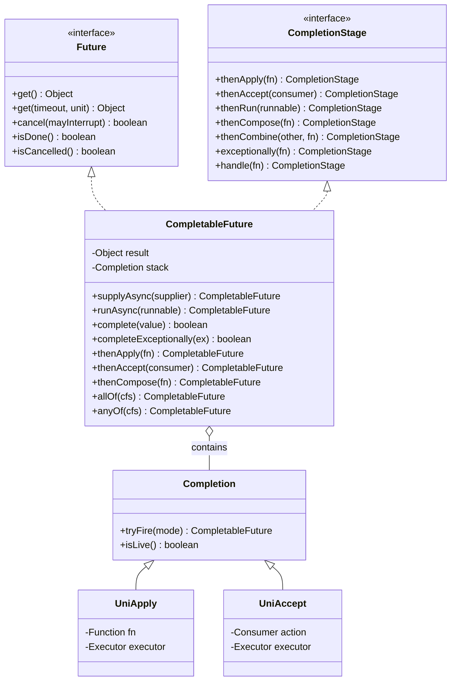
```mermaid
classDiagram
    class Future {
        <<interface>>
        +get() Object
        +get(timeout, unit) Object
        +cancel(mayInterrupt) boolean
        +isDone() boolean
        +isCancelled() boolean
    }
    
    class CompletionStage {
        <<interface>>
        +thenApply(fn) CompletionStage
        +thenAccept(consumer) CompletionStage
        +thenRun(runnable) CompletionStage
        +thenCompose(fn) CompletionStage
        +thenCombine(other, fn) CompletionStage
        +exceptionally(fn) CompletionStage
        +handle(fn) CompletionStage
    }
    
    class CompletableFuture {
        -Object result
        -Completion stack
        +supplyAsync(supplier) CompletableFuture
        +runAsync(runnable) CompletableFuture
        +complete(value) boolean
        +completeExceptionally(ex) boolean
        +thenApply(fn) CompletableFuture
        +thenAccept(consumer) CompletableFuture
        +thenCompose(fn) CompletableFuture
        +allOf(cfs) CompletableFuture
        +anyOf(cfs) CompletableFuture
    }
    
    class Completion {
        +tryFire(mode) CompletableFuture
        +isLive() boolean
    }
    
    class UniApply {
        -Function fn
        -Executor executor
    }
    
    class UniAccept {
        -Consumer action
        -Executor executor
    }
    
    Future <|.. CompletableFuture
    CompletionStage <|.. CompletableFuture
    Completion <|-- UniApply
    Completion <|-- UniAccept
    CompletableFuture o-- Completion : contains
```

### 状态流转图

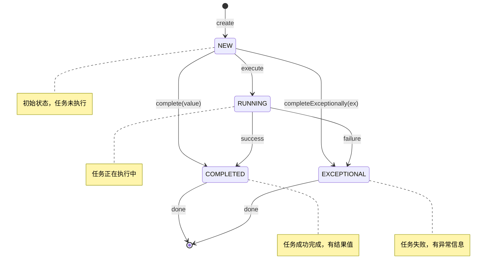
```mermaid
stateDiagram-v2
    [*] --> NEW: create
    NEW --> RUNNING: execute
    NEW --> COMPLETED: complete(value)
    NEW --> EXCEPTIONAL: completeExceptionally(ex)
    RUNNING --> COMPLETED: success
    RUNNING --> EXCEPTIONAL: failure
    COMPLETED --> [*]: done
    EXCEPTIONAL --> [*]: done
    
    note right of NEW
        初始状态，任务未执行
    end note
    
    note right of RUNNING
        任务正在执行中
    end note
    
    note right of COMPLETED
        任务成功完成，有结果值
    end note
    
    note right of EXCEPTIONAL
        任务失败，有异常信息
    end note
```

---

## 主要方法分类

### 1. 创建 CompletableFuture

#### 1.1 静态工厂方法

| 方法 | 说明 | 返回类型 |
|------|------|----------|
| `supplyAsync(Supplier)` | 异步执行有返回值的任务 | `CompletableFuture<U>` |
| `supplyAsync(Supplier, Executor)` | 指定线程池执行有返回值的任务 | `CompletableFuture<U>` |
| `runAsync(Runnable)` | 异步执行无返回值的任务 | `CompletableFuture<Void>` |
| `runAsync(Runnable, Executor)` | 指定线程池执行无返回值的任务 | `CompletableFuture<Void>` |
| `completedFuture(value)` | 创建一个已完成的 Future | `CompletableFuture<T>` |

#### 1.2 实例方法

| 方法 | 说明 | 返回值 |
|------|------|--------|
| `complete(value)` | 手动完成 Future | `boolean` |
| `completeExceptionally(ex)` | 手动完成并设置异常 | `boolean` |

### 2. 结果转换（Transform）

#### 2.1 thenApply - 同步转换

```java
// 同步执行，使用当前线程
CompletableFuture<String> future = CompletableFuture
    .supplyAsync(() -> "Hello")
    .thenApply(s -> s + " World");  // 同步转换
```

#### 2.2 thenApplyAsync - 异步转换

```java
// 异步执行，使用默认线程池
CompletableFuture<String> future = CompletableFuture
    .supplyAsync(() -> "Hello")
    .thenApplyAsync(s -> s + " World");  // 异步转换

// 指定线程池
CompletableFuture<String> future = CompletableFuture
    .supplyAsync(() -> "Hello")
    .thenApplyAsync(s -> s + " World", executor);
```

**方法对比图：**

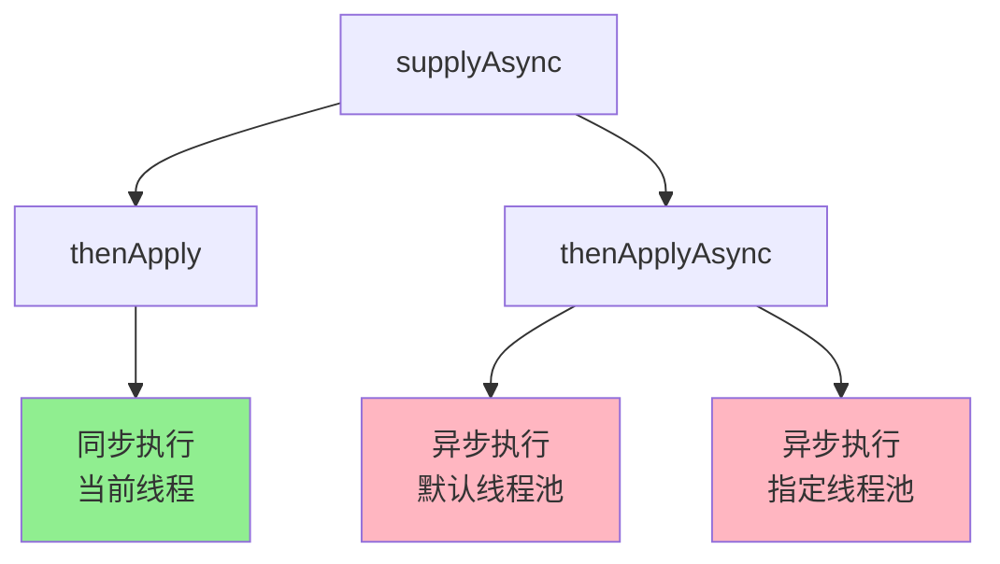
```mermaid
graph TB
    A[supplyAsync] --> B[thenApply]
    A --> C[thenApplyAsync]
    B --> D[同步执行<br/>当前线程]
    C --> E[异步执行<br/>默认线程池]
    C --> F[异步执行<br/>指定线程池]
    
    style D fill:#90EE90
    style E fill:#FFB6C1
    style F fill:#FFB6C1
```

### 3. 结果消费（Consume）

#### 3.1 thenAccept - 消费结果

```java
CompletableFuture<Void> future = CompletableFuture
    .supplyAsync(() -> "Result")
    .thenAccept(result -> System.out.println(result));  // 消费结果，无返回值
```

#### 3.2 thenRun - 执行动作

```java
CompletableFuture<Void> future = CompletableFuture
    .supplyAsync(() -> "Result")
    .thenRun(() -> System.out.println("Task completed"));  // 不依赖结果
```

**执行流程图：**

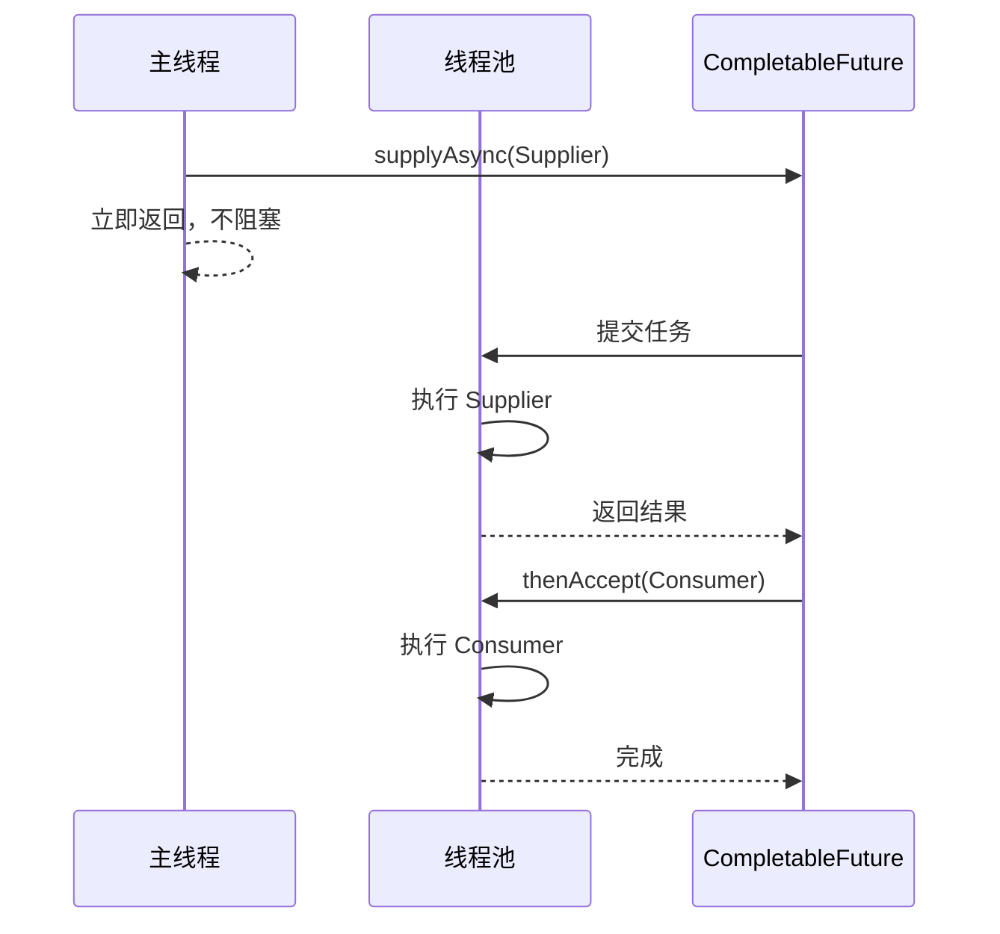
```mermaid
sequenceDiagram
    participant Main as 主线程
    participant Pool as 线程池
    participant CF as CompletableFuture
    
    Main->>CF: supplyAsync(Supplier)
    Main-->>Main: 立即返回，不阻塞
    CF->>Pool: 提交任务
    Pool->>Pool: 执行 Supplier
    Pool-->>CF: 返回结果
    CF->>Pool: thenAccept(Consumer)
    Pool->>Pool: 执行 Consumer
    Pool-->>CF: 完成
```

### 4. 任务组合（Compose）

#### 4.1 thenCompose - 扁平化组合

用于将一个 `CompletableFuture` 的结果作为另一个 `CompletableFuture` 的输入。

```java
// 避免嵌套的 CompletableFuture<CompletableFuture<String>>
CompletableFuture<String> future = CompletableFuture
    .supplyAsync(() -> 1)
    .thenCompose(result -> 
        CompletableFuture.supplyAsync(() -> "Result: " + result)
    );
```

#### 4.2 thenCombine - 合并两个 Future

```java
CompletableFuture<String> future1 = CompletableFuture.supplyAsync(() -> "Hello");
CompletableFuture<String> future2 = CompletableFuture.supplyAsync(() -> "World");

CompletableFuture<String> combined = future1.thenCombine(
    future2, 
    (s1, s2) -> s1 + " " + s2
);
```

**组合流程图：**

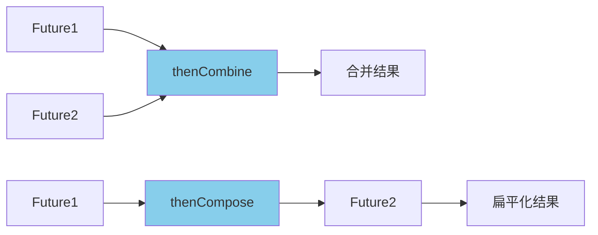
```mermaid
graph LR
    A[Future1] --> C[thenCombine]
    B[Future2] --> C
    C --> D[合并结果]
    
    E[Future1] --> F[thenCompose]
    F --> G[Future2]
    G --> H[扁平化结果]
    
    style C fill:#87CEEB
    style F fill:#87CEEB
```

### 5. 多任务组合

#### 5.1 allOf - 等待所有任务完成

`allOf` 返回一个 `CompletableFuture<Void>`，当所有 Future 完成时，这个 Future 也会完成。有两种主要使用方式：

**方式一：阻塞等待（直接 join）**

```java
CompletableFuture<String> f1 = CompletableFuture.supplyAsync(() -> "Task1");
CompletableFuture<String> f2 = CompletableFuture.supplyAsync(() -> "Task2");
CompletableFuture<String> f3 = CompletableFuture.supplyAsync(() -> "Task3");

// 直接阻塞等待所有任务完成
CompletableFuture.allOf(f1, f2, f3).join();

// 所有任务完成后，获取各自的结果
String result1 = f1.join();  // 此时已经完成，立即返回
String result2 = f2.join();
String result3 = f3.join();
```

**方式二：非阻塞回调（异步处理）**

```java
CompletableFuture<String> f1 = CompletableFuture.supplyAsync(() -> "Task1");
CompletableFuture<String> f2 = CompletableFuture.supplyAsync(() -> "Task2");
CompletableFuture<String> f3 = CompletableFuture.supplyAsync(() -> "Task3");

CompletableFuture<Void> all = CompletableFuture.allOf(f1, f2, f3);
all.thenRun(() -> {
    // 所有任务都完成了，在回调中处理结果
    String result1 = f1.join();
    String result2 = f2.join();
    String result3 = f3.join();
    // 处理结果...
});
```

**方式三：收集所有结果（推荐）**

```java
CompletableFuture<String> f1 = CompletableFuture.supplyAsync(() -> "Task1");
CompletableFuture<String> f2 = CompletableFuture.supplyAsync(() -> "Task2");
CompletableFuture<String> f3 = CompletableFuture.supplyAsync(() -> "Task3");

// 使用 thenApply 收集所有结果
CompletableFuture<List<String>> results = CompletableFuture.allOf(f1, f2, f3)
    .thenApply(v -> Arrays.asList(f1.join(), f2.join(), f3.join()));

// 阻塞获取所有结果
List<String> allResults = results.join();
// 或异步处理
results.thenAccept(list -> {
    // 处理所有结果
    list.forEach(System.out::println);
});
```

> **注意**：`allOf` 返回的是 `CompletableFuture<Void>`，它本身不包含结果。如果需要收集所有任务的结果，需要在 `allOf` 完成后，再调用各个 Future 的 `join()` 方法获取结果。由于此时所有任务都已完成，`join()` 会立即返回，不会阻塞。

#### 5.2 anyOf - 等待任一任务完成

`anyOf` 返回一个 `CompletableFuture<Object>`，当任一 Future 完成时，这个 Future 也会完成，并包含第一个完成的任务结果。

**方式一：阻塞等待（直接 join）**

```java
CompletableFuture<String> f1 = CompletableFuture.supplyAsync(() -> "Task1");
CompletableFuture<String> f2 = CompletableFuture.supplyAsync(() -> "Task2");
CompletableFuture<String> f3 = CompletableFuture.supplyAsync(() -> "Task3");

// 直接阻塞等待任一任务完成
Object result = CompletableFuture.anyOf(f1, f2, f3).join();
System.out.println("First completed: " + result);
```

**方式二：非阻塞回调（异步处理）**

```java
CompletableFuture<String> f1 = CompletableFuture.supplyAsync(() -> "Task1");
CompletableFuture<String> f2 = CompletableFuture.supplyAsync(() -> "Task2");
CompletableFuture<String> f3 = CompletableFuture.supplyAsync(() -> "Task3");

CompletableFuture<Object> any = CompletableFuture.anyOf(f1, f2, f3);
any.thenAccept(result -> {
    // 任一任务完成，处理结果
    System.out.println("First completed: " + result);
});
```

> **注意**：`anyOf` 返回的是 `CompletableFuture<Object>`，包含第一个完成的任务结果。未完成的任务会继续在后台执行，不会自动取消。

**allOf 执行时序图（阻塞方式）：**

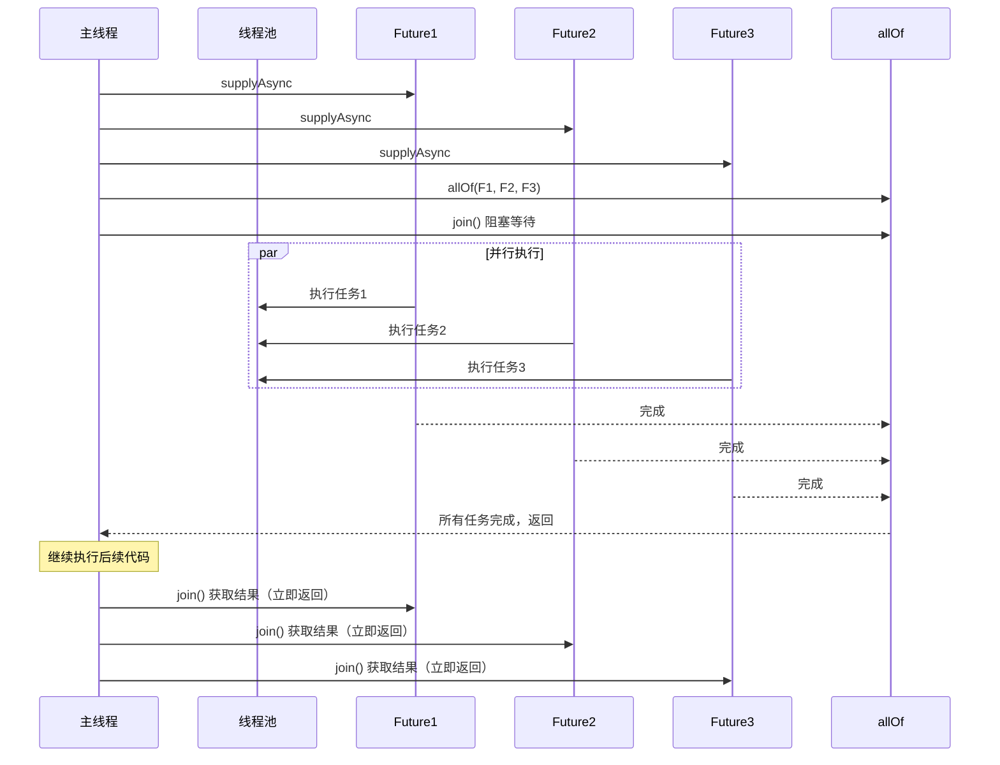
```mermaid
sequenceDiagram
    participant Main as 主线程
    participant Pool as 线程池
    participant F1 as Future1
    participant F2 as Future2
    participant F3 as Future3
    participant All as allOf
    
    Main->>F1: supplyAsync
    Main->>F2: supplyAsync
    Main->>F3: supplyAsync
    Main->>All: allOf(F1, F2, F3)
    Main->>All: join() 阻塞等待
    
    par 并行执行
        F1->>Pool: 执行任务1
        F2->>Pool: 执行任务2
        F3->>Pool: 执行任务3
    end
    
    F1-->>All: 完成
    F2-->>All: 完成
    F3-->>All: 完成
    All-->>Main: 所有任务完成，返回
    
    Note over Main: 继续执行后续代码
    Main->>F1: join() 获取结果（立即返回）
    Main->>F2: join() 获取结果（立即返回）
    Main->>F3: join() 获取结果（立即返回）
```

**allOf 执行时序图（非阻塞方式）：**

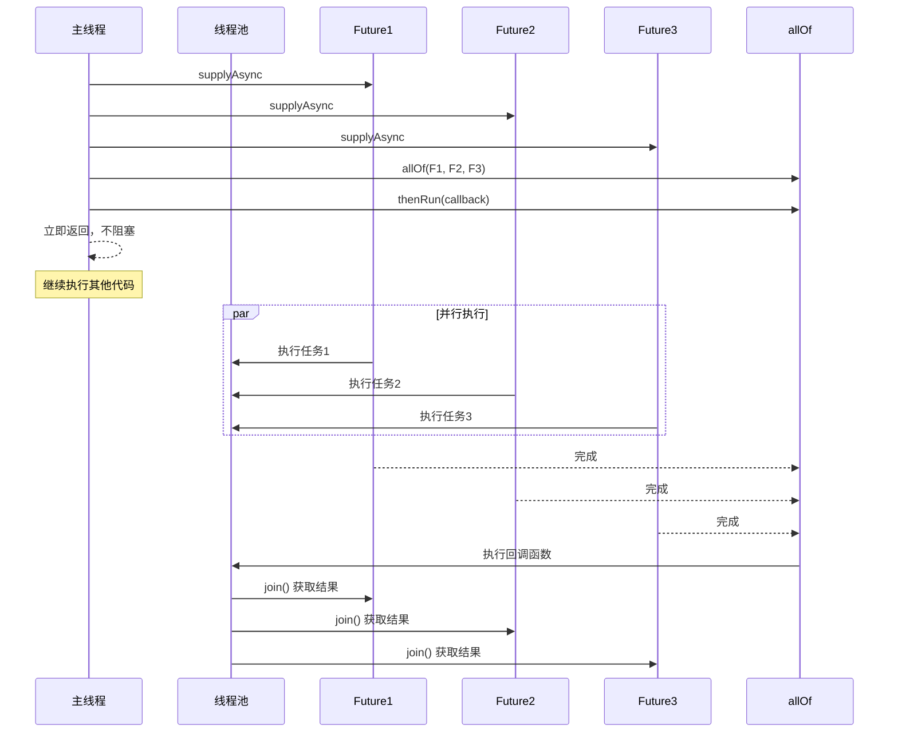
```mermaid
sequenceDiagram
    participant Main as 主线程
    participant Pool as 线程池
    participant F1 as Future1
    participant F2 as Future2
    participant F3 as Future3
    participant All as allOf
    
    Main->>F1: supplyAsync
    Main->>F2: supplyAsync
    Main->>F3: supplyAsync
    Main->>All: allOf(F1, F2, F3)
    Main->>All: thenRun(callback)
    Main-->>Main: 立即返回，不阻塞
    
    Note over Main: 继续执行其他代码
    
    par 并行执行
        F1->>Pool: 执行任务1
        F2->>Pool: 执行任务2
        F3->>Pool: 执行任务3
    end
    
    F1-->>All: 完成
    F2-->>All: 完成
    F3-->>All: 完成
    All->>Pool: 执行回调函数
    Pool->>F1: join() 获取结果
    Pool->>F2: join() 获取结果
    Pool->>F3: join() 获取结果
```

### 6. 异常处理

#### 6.1 exceptionally - 异常恢复

```java
CompletableFuture<String> future = CompletableFuture
    .supplyAsync(() -> {
        if (true) throw new RuntimeException("Error");
        return "Success";
    })
    .exceptionally(ex -> {
        System.out.println("Exception: " + ex.getMessage());
        return "Default Value";  // 返回默认值
    });
```

#### 6.2 handle - 统一处理结果和异常

```java
CompletableFuture<String> future = CompletableFuture
    .supplyAsync(() -> "Result")
    .handle((result, ex) -> {
        if (ex != null) {
            return "Error: " + ex.getMessage();
        }
        return "Success: " + result;
    });
```

**异常处理流程图：**

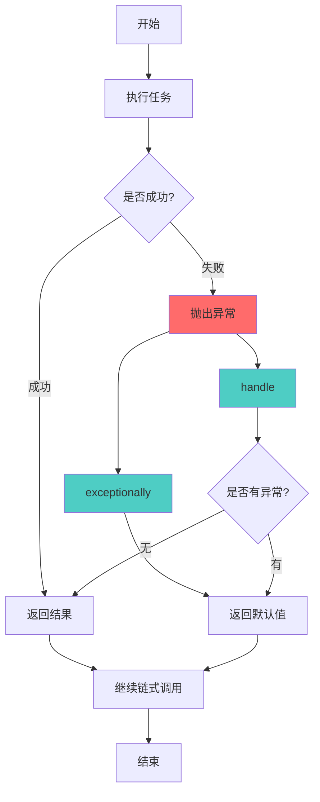
```mermaid
flowchart TD
    A[开始] --> B[执行任务]
    B --> C{是否成功?}
    C -->|成功| D[返回结果]
    C -->|失败| E[抛出异常]
    E --> F[exceptionally]
    E --> G[handle]
    F --> H[返回默认值]
    G --> I{是否有异常?}
    I -->|有| H
    I -->|无| D
    D --> J[继续链式调用]
    H --> J
    J --> K[结束]
    
    style E fill:#FF6B6B
    style F fill:#4ECDC4
    style G fill:#4ECDC4
```

---

## 链式调用场景 - 商品详情页实战案例

以电商平台的**商品详情页**为例，展示 CompletableFuture 在不同依赖关系下的使用场景。

### 场景概述

商品详情页需要聚合多种数据：
- **基本信息**：商品ID、名称、价格、描述等
- **图片信息**：商品主图、详情图、轮播图等
- **库存信息**：库存数量、仓库位置等
- **评价信息**：用户评价、评分、好评率等
- **推荐信息**：相关商品、同类商品等
- **促销信息**：优惠券、活动信息等

---

## 1. 无依赖关系 - 全部异步并行执行

### 场景描述

多个任务之间**无依赖关系**，可以**全部并行异步执行**，最后汇总结果。这是性能最优的场景。

### 依赖流程图

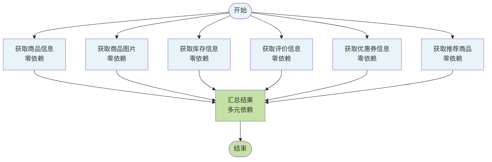
```mermaid
flowchart TD
    Start([开始]) --> T1[获取商品信息<br/>零依赖]
    Start --> T2[获取商品图片<br/>零依赖]
    Start --> T3[获取库存信息<br/>零依赖]
    Start --> T4[获取评价信息<br/>零依赖]
    Start --> T5[获取优惠券信息<br/>零依赖]
    Start --> T6[获取推荐商品<br/>零依赖]
    
    T1 --> T7[汇总结果<br/>多元依赖]
    T2 --> T7
    T3 --> T7
    T4 --> T7
    T5 --> T7
    T6 --> T7
    
    T7 --> End([结束])
    
    style Start fill:#E8F4F8
    style T1 fill:#E8F4F8
    style T2 fill:#E8F4F8
    style T3 fill:#E8F4F8
    style T4 fill:#E8F4F8
    style T5 fill:#E8F4F8
    style T6 fill:#E8F4F8
    style T7 fill:#C5E1A5
    style End fill:#C5E1A5
```

### 实际案例：商品详情页基础数据获取

```java
/**
 * 获取商品详情页数据
 * 这些数据之间无依赖，可以全部并行获取
 */
public ProductDetailVO getProductDetail(Long productId) {
    // 1. 并行异步获取所有独立数据
    CompletableFuture<ProductInfo> productInfoFuture = 
        CompletableFuture.supplyAsync(() -> productService.getProductInfo(productId));
    
    CompletableFuture<List<ProductImage>> imageListFuture = 
        CompletableFuture.supplyAsync(() -> productService.getProductImages(productId));
    
    CompletableFuture<StockInfo> stockInfoFuture = 
        CompletableFuture.supplyAsync(() -> stockService.getStockInfo(productId));
    
    CompletableFuture<ProductReviews> reviewsFuture = 
        CompletableFuture.supplyAsync(() -> reviewService.getProductReviews(productId));
    
    CompletableFuture<List<CouponInfo>> couponListFuture = 
        CompletableFuture.supplyAsync(() -> couponService.getAvailableCoupons(productId));
    
    CompletableFuture<List<ProductRecommend>> recommendListFuture = 
        CompletableFuture.supplyAsync(() -> recommendService.getRecommendProducts(productId));
    
    // 2. 等待所有任务完成（阻塞方式）
    CompletableFuture.allOf(
        productInfoFuture, 
        imageListFuture, 
        stockInfoFuture,
        reviewsFuture,
        couponListFuture,
        recommendListFuture
    ).join();
    
    // 3. 组装返回结果（此时所有任务已完成，join()立即返回）
    ProductDetailVO detailVO = new ProductDetailVO();
    detailVO.setProductInfo(productInfoFuture.join());
    detailVO.setImageList(imageListFuture.join());
    detailVO.setStockInfo(stockInfoFuture.join());
    detailVO.setReviews(reviewsFuture.join());
    detailVO.setCouponList(couponListFuture.join());
    detailVO.setRecommendList(recommendListFuture.join());
    
    return detailVO;
}
```

### 性能优势说明

**串行执行（传统方式）**：
- 获取商品基本信息：~100ms（数据库查询）
- 获取商品图片：~150ms（文件服务查询）
- 获取库存信息：~80ms（库存服务查询）
- 获取评价信息：~200ms（评价服务查询，包含统计计算）
- 获取优惠券信息：~120ms（优惠券服务查询）
- 获取推荐商品：~180ms（推荐算法计算）

**总耗时 = 100 + 150 + 80 + 200 + 120 + 180 = 830ms**

**并行执行（CompletableFuture）**：
- 所有任务同时启动，在不同线程中并行执行
- 最终耗时取决于最慢的任务：**max(100, 150, 80, 200, 120, 180) = 200ms**

**性能提升 = (830 - 200) / 830 ≈ 76%**，响应时间缩短了 **4.15倍**！

这就是为什么在无依赖关系的场景下，并行执行能带来显著性能提升的原因。

### 执行时序图

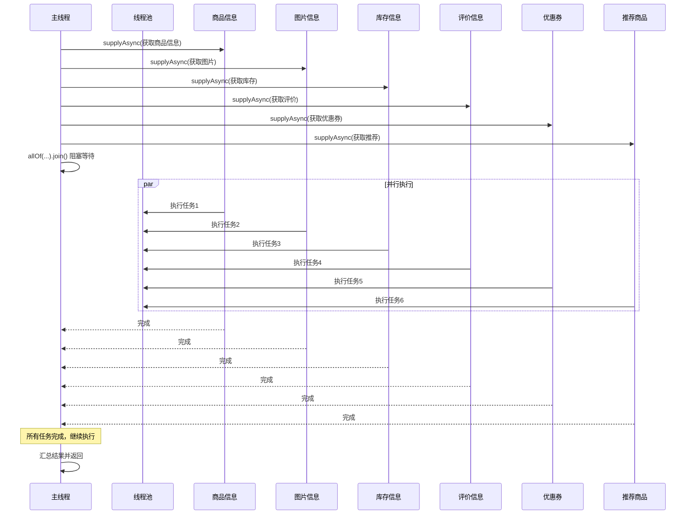
```mermaid
sequenceDiagram
    participant Main as 主线程
    participant Pool as 线程池
    participant P1 as 商品信息
    participant P2 as 图片信息
    participant P3 as 库存信息
    participant P4 as 评价信息
    participant P5 as 优惠券
    participant P6 as 推荐商品
    
    Main->>P1: supplyAsync(获取商品信息)
    Main->>P2: supplyAsync(获取图片)
    Main->>P3: supplyAsync(获取库存)
    Main->>P4: supplyAsync(获取评价)
    Main->>P5: supplyAsync(获取优惠券)
    Main->>P6: supplyAsync(获取推荐)
    Main->>Main: allOf(...).join() 阻塞等待
    
    par 并行执行
        P1->>Pool: 执行任务1
        P2->>Pool: 执行任务2
        P3->>Pool: 执行任务3
        P4->>Pool: 执行任务4
        P5->>Pool: 执行任务5
        P6->>Pool: 执行任务6
    end
    
    P1-->>Main: 完成
    P2-->>Main: 完成
    P3-->>Main: 完成
    P4-->>Main: 完成
    P5-->>Main: 完成
    P6-->>Main: 完成
    
    Note over Main: 所有任务完成，继续执行
    Main->>Main: 汇总结果并返回
```

### 优化版本：使用非阻塞方式

```java
/**
 * 非阻塞版本：使用回调处理结果
 */
public CompletableFuture<ProductDetailVO> getProductDetailAsync(Long productId) {
    CompletableFuture<ProductInfo> productInfoFuture = 
        CompletableFuture.supplyAsync(() -> productService.getProductInfo(productId));
    
    CompletableFuture<List<ProductImage>> imageListFuture = 
        CompletableFuture.supplyAsync(() -> productService.getProductImages(productId));
    
    CompletableFuture<StockInfo> stockInfoFuture = 
        CompletableFuture.supplyAsync(() -> stockService.getStockInfo(productId));
    
    CompletableFuture<ProductReviews> reviewsFuture = 
        CompletableFuture.supplyAsync(() -> reviewService.getProductReviews(productId));
    
    // 使用 thenCombine 逐步合并结果
    return productInfoFuture
        .thenCombine(imageListFuture, (info, images) -> {
            ProductDetailVO vo = new ProductDetailVO();
            vo.setProductInfo(info);
            vo.setImageList(images);
            return vo;
        })
        .thenCombine(stockInfoFuture, (vo, stock) -> {
            vo.setStockInfo(stock);
            return vo;
        })
        .thenCombine(reviewsFuture, (vo, reviews) -> {
            vo.setReviews(reviews);
            return vo;
        });
}
```

---

## 2. 有依赖关系 - 串行执行

### 2.1 零依赖 -> 一元依赖 - 链式依赖

### 场景描述

任务按照**顺序链式依赖**：任务B依赖任务A，任务C依赖任务B，以此类推。这是典型的**流水线模式**。

### 依赖流程图

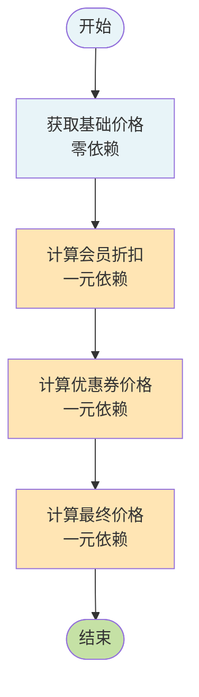
```mermaid
flowchart TD
    Start([开始]) --> T1[获取基础价格<br/>零依赖]
    T1 --> T2[计算会员折扣<br/>一元依赖]
    T2 --> T3[计算优惠券价格<br/>一元依赖]
    T3 --> T4[计算最终价格<br/>一元依赖]
    T4 --> End([结束])
    
    style Start fill:#E8F4F8
    style T1 fill:#E8F4F8
    style T2 fill:#FFE5B4
    style T3 fill:#FFE5B4
    style T4 fill:#FFE5B4
    style End fill:#C5E1A5
```

### 实际案例：商品价格计算流程

```java
/**
 * 商品价格计算流程（链式依赖）
 * 步骤1: 获取商品基础价格
 * 步骤2: 根据商品基础价格计算会员折扣价（依赖步骤1）
 * 步骤3: 根据会员折扣价计算优惠券价格（依赖步骤2）
 * 步骤4: 根据优惠券价格计算最终价格（依赖步骤3）
 */
public ProductPriceVO calculateFinalPrice(Long productId, Long userId) {
    return CompletableFuture
        // 步骤1: 零依赖 - 获取商品基础价格
        .supplyAsync(() -> {
            System.out.println("步骤1: 获取商品基础价格");
            return productService.getBasePrice(productId);  // 返回: 1000.00
        })
        // 步骤2: 一元依赖 - 根据基础价格计算会员折扣价
        .thenApply(basePrice -> {
            System.out.println("步骤2: 计算会员折扣价，基础价格: " + basePrice);
            MemberLevel level = memberService.getMemberLevel(userId);
            double discount = level.getDiscount();  // 0.9 (9折)
            return basePrice * discount;  // 返回: 900.00
        })
        // 步骤3: 一元依赖 - 根据会员折扣价计算优惠券价格
        .thenApply(memberPrice -> {
            System.out.println("步骤3: 计算优惠券价格，会员价格: " + memberPrice);
            CouponInfo coupon = couponService.getBestCoupon(productId, userId);
            if (coupon != null) {
                return memberPrice - coupon.getAmount();  // 返回: 800.00
            }
            return memberPrice;
        })
        // 步骤4: 一元依赖 - 根据优惠券价格计算最终价格（含税费）
        .thenApply(couponPrice -> {
            System.out.println("步骤4: 计算最终价格，优惠后价格: " + couponPrice);
            double tax = couponPrice * 0.06;  // 6% 税费
            ProductPriceVO priceVO = new ProductPriceVO();
            priceVO.setFinalPrice(couponPrice + tax);  // 返回: 848.00
            priceVO.setTax(tax);
            return priceVO;
        })
        .join();  // 阻塞等待最终结果
}
```

### 性能说明

**同步执行（传统方式）**：
- 步骤1 - 获取商品基础价格：~50ms（数据库查询）
- 步骤2 - 计算会员折扣价：~30ms（需要步骤1的结果）
- 步骤3 - 计算优惠券价格：~80ms（需要步骤2的结果，含优惠券查询）
- 步骤4 - 计算最终价格：~10ms（需要步骤3的结果，纯计算）

**总耗时 = 50 + 30 + 80 + 10 = 170ms**

**使用 CompletableFuture 异步链式执行**：
- 虽然总耗时仍然是 **170ms**（因为必须等待前一步完成）
- 但是每一步都是**异步执行**，**不会阻塞主线程**
- 主线程可以在等待过程中处理其他请求，提高系统整体吞吐量
- 如果使用 `thenApplyAsync()`，每一步还可以在**不同线程**中执行，充分利用线程池资源

**关键优势**：虽然不能并行，但可以异步，避免线程阻塞，提升系统并发能力。

### 执行时序图

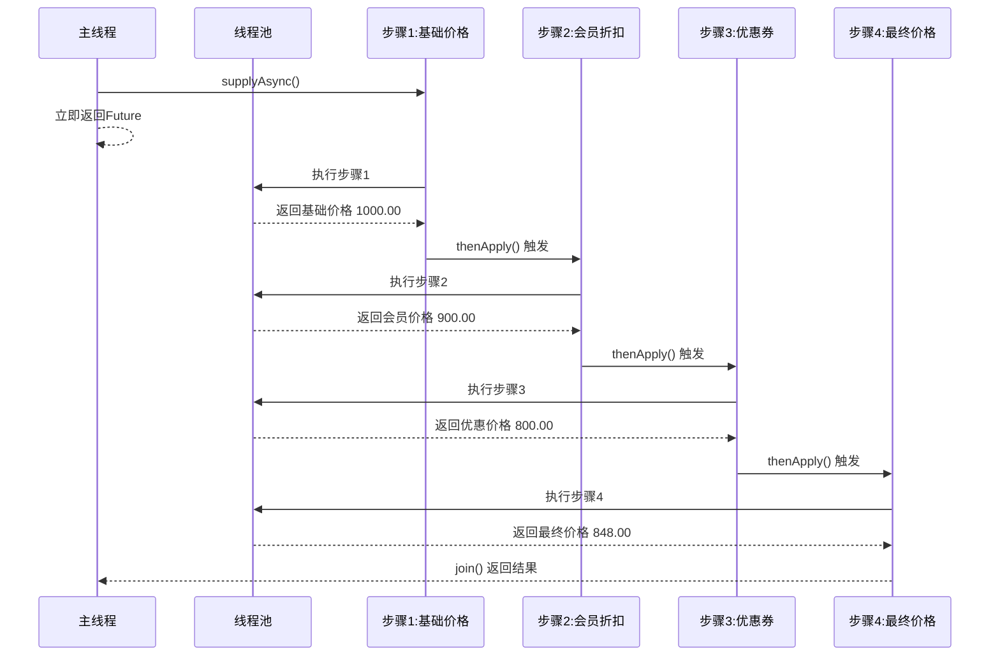
```mermaid
sequenceDiagram
    participant Main as 主线程
    participant Pool as 线程池
    participant Step1 as 步骤1:基础价格
    participant Step2 as 步骤2:会员折扣
    participant Step3 as 步骤3:优惠券
    participant Step4 as 步骤4:最终价格
    
    Main->>Step1: supplyAsync()
    Main-->>Main: 立即返回Future
    
    Step1->>Pool: 执行步骤1
    Pool-->>Step1: 返回基础价格 1000.00
    Step1->>Step2: thenApply() 触发
    Step2->>Pool: 执行步骤2
    Pool-->>Step2: 返回会员价格 900.00
    Step2->>Step3: thenApply() 触发
    Step3->>Pool: 执行步骤3
    Pool-->>Step3: 返回优惠价格 800.00
    Step3->>Step4: thenApply() 触发
    Step4->>Pool: 执行步骤4
    Pool-->>Step4: 返回最终价格 848.00
    Step4-->>Main: join() 返回结果
```

### 2.2 零依赖 -> 二元依赖 - 合并两个独立任务

### 场景描述

任务C需要**同时依赖任务A和任务B**的结果，而A和B之间无依赖关系，可以并行执行。

### 依赖流程图

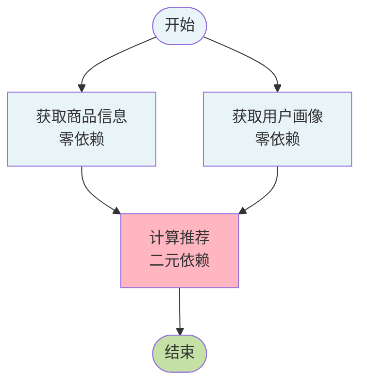
```mermaid
flowchart TD
    Start([开始]) --> T1[获取商品信息<br/>零依赖]
    Start --> T2[获取用户画像<br/>零依赖]
    
    T1 --> T3[计算推荐<br/>二元依赖]
    T2 --> T3
    
    T3 --> End([结束])
    
    style Start fill:#E8F4F8
    style T1 fill:#E8F4F8
    style T2 fill:#E8F4F8
    style T3 fill:#FFB6C1
    style End fill:#C5E1A5
```

### 实际案例：商品推荐列表（依赖商品信息和用户信息）

```java
/**
 * 获取个性化商品推荐
 * 推荐算法需要：1. 商品信息 2. 用户画像
 * 这两个数据无依赖，可以并行获取，然后合并计算推荐结果
 */
public List<ProductRecommend> getPersonalizedRecommend(Long productId, Long userId) {
    // 并行获取两个独立数据
    CompletableFuture<ProductInfo> productInfoFuture = 
        CompletableFuture.supplyAsync(() -> productService.getProductInfo(productId));
    
    CompletableFuture<UserProfile> userProfileFuture = 
        CompletableFuture.supplyAsync(() -> userService.getUserProfile(userId));
    
    // 二元依赖：推荐算法需要同时依赖商品信息和用户画像
    return productInfoFuture
        .thenCombine(userProfileFuture, (productInfo, userProfile) -> {
            System.out.println("合并商品信息: " + productInfo.getName());
            System.out.println("合并用户画像: " + userProfile.getTags());
            
            // 根据商品信息和用户画像计算推荐
            return recommendService.calculateRecommend(productInfo, userProfile);
        })
        .join();
}
```

### 性能优势说明

**串行执行（传统方式）**：
- 任务A - 获取商品信息：~100ms（数据库查询）
- 任务B - 获取用户画像：~150ms（用户服务查询，包含标签计算）
- 任务C - 计算推荐结果：~80ms（推荐算法计算）

**总耗时 = 100 + 150 + 80 = 330ms**

**并行执行（CompletableFuture）**：
- 任务A和任务B**同时启动**，并行执行
- 并行阶段耗时：**max(100, 150) = 150ms**
- 等待两个任务都完成后，执行任务C：~80ms

**总耗时 = max(100, 150) + 80 = 230ms**

**性能提升 = (330 - 230) / 330 ≈ 30%**，响应时间缩短了 **1.43倍**！

**关键优势**：充分利用了任务A和任务B无依赖关系的特点，通过并行执行显著减少等待时间。

### 2.3 零依赖 -> 多元依赖 - 合并多个独立任务

### 场景描述

任务需要**同时依赖多个任务**的结果，而这些被依赖的任务之间无依赖关系。

### 依赖流程图

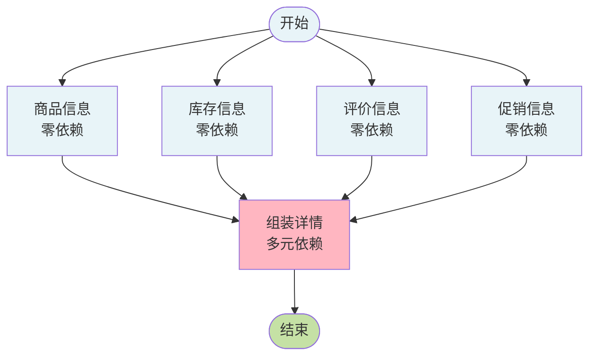
```mermaid
flowchart TD
    Start([开始]) --> T1[商品信息<br/>零依赖]
    Start --> T2[库存信息<br/>零依赖]
    Start --> T3[评价信息<br/>零依赖]
    Start --> T4[促销信息<br/>零依赖]
    
    T1 --> T5[组装详情<br/>多元依赖]
    T2 --> T5
    T3 --> T5
    T4 --> T5
    
    T5 --> End([结束])
    
    style Start fill:#E8F4F8
    style T1 fill:#E8F4F8
    style T2 fill:#E8F4F8
    style T3 fill:#E8F4F8
    style T4 fill:#E8F4F8
    style T5 fill:#FFB6C1
    style End fill:#C5E1A5
```

### 实际案例：商品详情页完整数据组装（依赖多个数据源）

```java
/**
 * 组装完整的商品详情数据
 * 详情数据需要：商品信息、库存信息、评价信息、促销信息
 * 这些数据可以并行获取，最后统一组装
 */
public ProductDetailVO assembleProductDetail(Long productId) {
    // 并行获取多个独立数据源
    CompletableFuture<ProductInfo> productInfoFuture = 
        CompletableFuture.supplyAsync(() -> productService.getProductInfo(productId));
    
    CompletableFuture<StockInfo> stockInfoFuture = 
        CompletableFuture.supplyAsync(() -> stockService.getStockInfo(productId));
    
    CompletableFuture<ProductReviews> reviewsFuture = 
        CompletableFuture.supplyAsync(() -> reviewService.getProductReviews(productId));
    
    CompletableFuture<PromotionInfo> promotionFuture = 
        CompletableFuture.supplyAsync(() -> promotionService.getPromotionInfo(productId));
    
    // 多元依赖：组装操作依赖所有数据源
    CompletableFuture<ProductDetailVO> detailFuture = CompletableFuture
        .allOf(productInfoFuture, stockInfoFuture, reviewsFuture, promotionFuture)
        .thenApply(v -> {
            // 此时所有任务都已完成，join()立即返回
            ProductDetailVO vo = new ProductDetailVO();
            vo.setProductInfo(productInfoFuture.join());
            vo.setStockInfo(stockInfoFuture.join());
            vo.setReviews(reviewsFuture.join());
            vo.setPromotionInfo(promotionFuture.join());
            
            // 根据所有数据计算一些衍生字段
            vo.setIsInStock(vo.getStockInfo().getQuantity() > 0);
            vo.setHasPromotion(vo.getPromotionInfo() != null);
            
            return vo;
        });
    
    return detailFuture.join();
}
```

### 性能优势说明

**串行执行（传统方式）**：
- 获取商品信息：~100ms（数据库查询）
- 获取库存信息：~80ms（库存服务查询）
- 获取评价信息：~150ms（评价服务查询）
- 获取促销信息：~120ms（促销服务查询）
- 组装数据：~10ms（内存操作）

**总耗时 = 100 + 80 + 150 + 120 + 10 = 460ms**

**并行执行（CompletableFuture）**：
- 前4个任务**同时启动**，并行执行
- 并行阶段耗时：**max(100, 80, 150, 120) = 150ms**
- 等待所有任务完成后，执行组装操作：~10ms

**总耗时 = max(100, 80, 150, 120) + 10 = 160ms**

**性能提升 = (460 - 160) / 460 ≈ 65%**，响应时间缩短了 **2.88倍**！

**关键优势**：多个无依赖关系的任务并行执行，最后统一汇总，充分利用多核CPU和网络IO，显著提升性能。

### 2.4 全部互相依赖 - 复杂的依赖关系

### 场景描述

多个任务之间存在**复杂的互相依赖关系**，需要仔细设计执行顺序。

### 依赖流程图

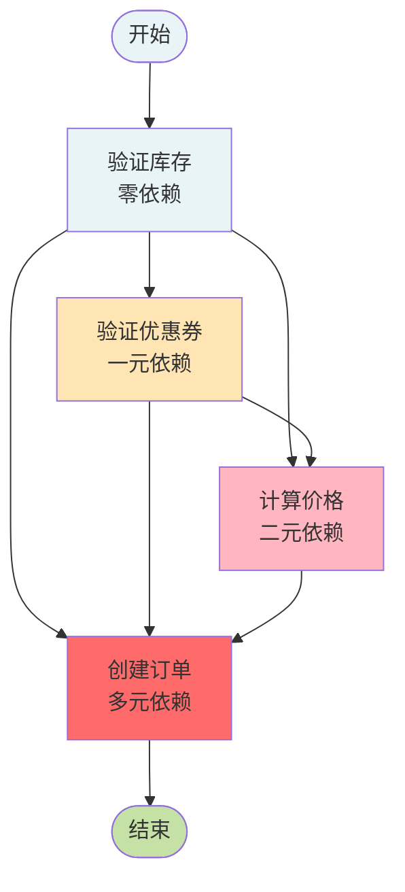
```mermaid
flowchart TD
    Start([开始]) --> T1[验证库存<br/>零依赖]
    
    T1 --> T2[验证优惠券<br/>一元依赖]
    T1 --> T3[计算价格<br/>二元依赖]
    T2 --> T3
    
    T1 --> T4[创建订单<br/>多元依赖]
    T2 --> T4
    T3 --> T4
    
    T4 --> End([结束])
    
    style Start fill:#E8F4F8
    style T1 fill:#E8F4F8
    style T2 fill:#FFE5B4
    style T3 fill:#FFB6C1
    style T4 fill:#FF6B6B
    style End fill:#C5E1A5
```

### 实际案例：商品下单流程（多个步骤互相依赖）

```java
/**
 * 商品下单流程（复杂依赖关系）
 * 步骤1: 验证商品库存（需要商品ID）
 * 步骤2: 验证用户优惠券（需要商品ID + 用户ID + 库存验证结果）
 * 步骤3: 计算最终价格（需要商品信息 + 优惠券信息）
 * 步骤4: 创建订单（需要所有前面的验证结果）
 */
public OrderVO createOrder(OrderRequest request) {
    Long productId = request.getProductId();
    Long userId = request.getUserId();
    
    // 步骤1: 零依赖 - 验证库存
    CompletableFuture<StockValidation> stockValidationFuture = 
        CompletableFuture.supplyAsync(() -> {
            System.out.println("步骤1: 验证库存");
            return stockService.validateStock(productId, request.getQuantity());
        });
    
    // 步骤2: 一元依赖 - 依赖库存验证结果，同时还需要商品ID和用户ID
    CompletableFuture<CouponValidation> couponValidationFuture = 
        stockValidationFuture.thenCompose(stockValidation -> {
            if (!stockValidation.isValid()) {
                throw new BusinessException("库存不足");
            }
            System.out.println("步骤2: 验证优惠券，库存验证通过");
            return CompletableFuture.supplyAsync(() -> {
                return couponService.validateCoupon(
                    productId, 
                    userId, 
                    request.getCouponId()
                );
            });
        });
    
    // 步骤3: 二元依赖 - 同时依赖库存验证和优惠券验证
    CompletableFuture<PriceCalculation> priceCalculationFuture = 
        stockValidationFuture.thenCombine(
            couponValidationFuture,
            (stockValidation, couponValidation) -> {
                System.out.println("步骤3: 计算价格，使用库存和优惠券信息");
                return priceService.calculateFinalPrice(
                    productId,
                    request.getQuantity(),
                    couponValidation
                );
            }
        );
    
    // 步骤4: 多元依赖 - 依赖所有前面的步骤
    CompletableFuture<OrderVO> orderFuture = CompletableFuture
        .allOf(stockValidationFuture, couponValidationFuture, priceCalculationFuture)
        .thenCompose(v -> {
            System.out.println("步骤4: 创建订单，使用所有验证结果");
            return CompletableFuture.supplyAsync(() -> {
                return orderService.createOrder(
                    request,
                    stockValidationFuture.join(),
                    couponValidationFuture.join(),
                    priceCalculationFuture.join()
                );
            });
        });
    
    return orderFuture.join();
}
```

### 性能优势说明

**串行执行（传统方式）**：
- 步骤1 - 验证库存：~50ms（库存服务查询）
- 步骤2 - 验证优惠券：~80ms（需要步骤1的结果，优惠券服务查询）
- 步骤3 - 计算价格：~100ms（需要步骤1和步骤2的结果，价格计算服务）
- 步骤4 - 创建订单：~150ms（需要所有前面步骤的结果，订单服务）

**总耗时 = 50 + 80 + 100 + 150 = 380ms**

**使用 CompletableFuture 异步并行执行**：
- 步骤1（零依赖）立即启动：~50ms
- 步骤1完成后，步骤2（一元依赖）和步骤3的准备可以并行：
  - 步骤2需要等待步骤1：~80ms（在步骤1完成后开始）
  - 步骤3通过 `thenCombine` 等待步骤1和步骤2：在步骤1完成后可以准备，但需要等待步骤2完成
- 步骤2和步骤3的实际执行：
  - 步骤2：50ms（等待步骤1）+ 80ms（执行）= 130ms 完成
  - 步骤3：130ms（等待步骤2完成）+ 100ms（执行）= 230ms 完成
- 步骤4等待所有前置步骤完成：max(130, 230) = 230ms 后开始，执行150ms

**总耗时 ≈ 50 + max(80, 80+100) + 150 = 50 + 180 + 150 = 380ms**

**关键优势**：
- 虽然总耗时相同，但通过 `thenCombine` 和 `thenCompose` 的组合使用，充分利用了任务的并行潜力
- **所有步骤都是异步执行**，不阻塞主线程，提升系统整体吞吐量
- **步骤3可以在步骤1完成后就开始准备**，只需要等待步骤2的结果，减少了等待时间
- 代码结构清晰，依赖关系明确，易于维护和扩展

### 复杂依赖关系时序图

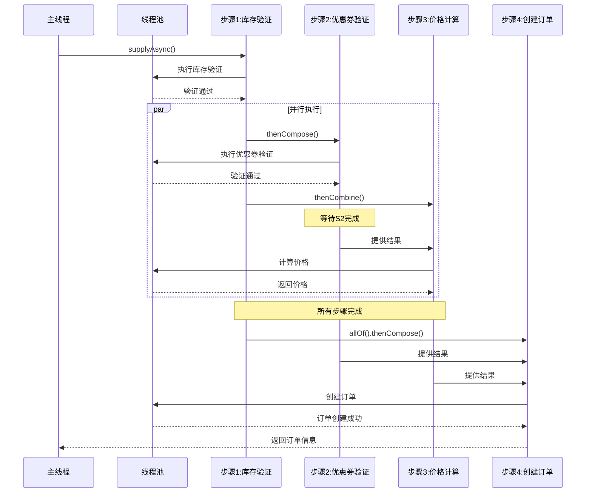
```mermaid
sequenceDiagram
    participant Main as 主线程
    participant Pool as 线程池
    participant S1 as 步骤1:库存验证
    participant S2 as 步骤2:优惠券验证
    participant S3 as 步骤3:价格计算
    participant S4 as 步骤4:创建订单
    
    Main->>S1: supplyAsync()
    
    S1->>Pool: 执行库存验证
    Pool-->>S1: 验证通过
    
    par 并行执行
        S1->>S2: thenCompose()
        S2->>Pool: 执行优惠券验证
        Pool-->>S2: 验证通过
        
        S1->>S3: thenCombine()
        Note over S2: 等待S2完成
        S2->>S3: 提供结果
        S3->>Pool: 计算价格
        Pool-->>S3: 返回价格
    end
    
    Note over S1,S3: 所有步骤完成
    S1->>S4: allOf().thenCompose()
    S2->>S4: 提供结果
    S3->>S4: 提供结果
    S4->>Pool: 创建订单
    Pool-->>S4: 订单创建成功
    S4-->>Main: 返回订单信息
```

---

## 场景对比总结

| 依赖类型 | 场景示例 | 特点 | 使用的方法 |
|---------|---------|------|-----------|
| **无依赖** | 商品详情页基础数据获取 | 全部并行执行 | `allOf()` + `join()` |
| **零依赖->一元依赖** | 商品价格计算流程 | 链式执行 | `thenApply()` / `thenCompose()` |
| **零依赖->二元依赖** | 个性化推荐计算 | 合并两个任务 | `thenCombine()` |
| **零依赖->多元依赖** | 商品详情数据组装 | 合并多个任务 | `allOf()` + `thenApply()` |
| **全部互相依赖** | 订单创建流程 | 复杂依赖关系 | `thenCompose()` + `thenCombine()` + `allOf()` |

### 性能优化建议

1. **无依赖任务**：优先使用 `allOf()` 并行执行，充分利用多核CPU
2. **一元依赖**：使用 `thenApply()`（同步）或 `thenApplyAsync()`（异步）进行转换
3. **二元依赖**：使用 `thenCombine()` 合并两个任务的结果
4. **多元依赖**：使用 `allOf()` 等待所有前置任务，然后在 `thenApply()` 中汇总
5. **复杂依赖**：根据实际依赖关系，灵活组合使用各种方法

---

## 异步编排模式

### 模式 1：流水线模式（Pipeline）

多个任务按顺序执行，每个任务的输出作为下一个任务的输入。

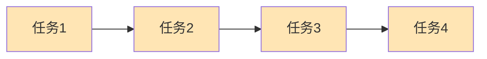
```mermaid
graph LR
    A[任务1] --> B[任务2]
    B --> C[任务3]
    C --> D[任务4]
    
    style A fill:#FFE5B4
    style B fill:#FFE5B4
    style C fill:#FFE5B4
    style D fill:#FFE5B4
```

**代码示例：**

```java
CompletableFuture<Integer> pipeline = CompletableFuture
    .supplyAsync(() -> fetchData())
    .thenApply(data -> parseData(data))
    .thenApply(parsed -> validateData(parsed))
    .thenApply(validated -> saveData(validated));
```

### 模式 2：扇出-扇入模式（Fork-Join）

一个任务分出多个并行任务，然后合并结果。

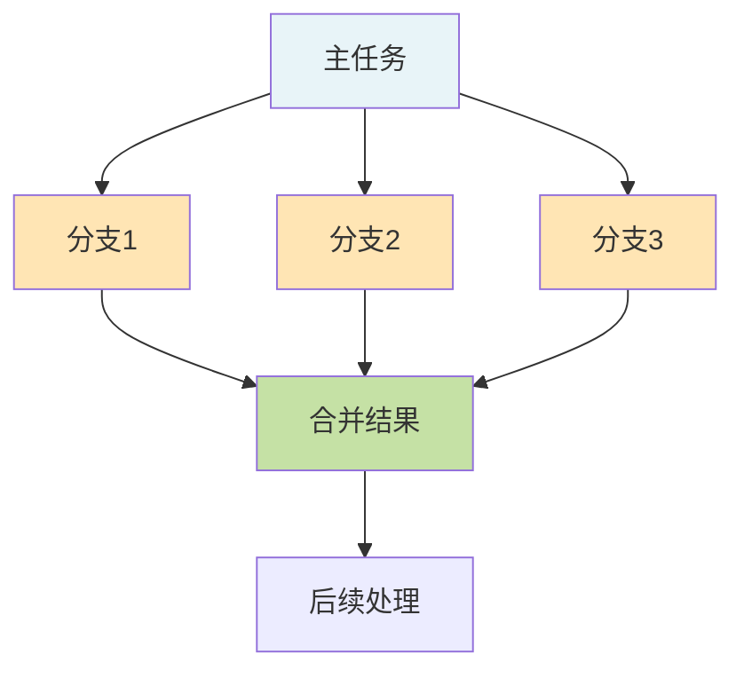
```mermaid
graph TD
    A[主任务] --> B[分支1]
    A --> C[分支2]
    A --> D[分支3]
    B --> E[合并结果]
    C --> E
    D --> E
    E --> F[后续处理]
    
    style A fill:#E8F4F8
    style B fill:#FFE5B4
    style C fill:#FFE5B4
    style D fill:#FFE5B4
    style E fill:#C5E1A5
```

**代码示例（阻塞方式）：**

```java
// 扇出
CompletableFuture<String> task1 = CompletableFuture.supplyAsync(() -> process1());
CompletableFuture<String> task2 = CompletableFuture.supplyAsync(() -> process2());
CompletableFuture<String> task3 = CompletableFuture.supplyAsync(() -> process3());

// 扇入：阻塞等待所有任务完成
CompletableFuture.allOf(task1, task2, task3).join();

// 获取所有结果
List<String> results = Arrays.asList(
    task1.join(),  // 此时已经完成，立即返回
    task2.join(),
    task3.join()
);
```

**代码示例（非阻塞方式）：**

```java
// 扇出
CompletableFuture<String> task1 = CompletableFuture.supplyAsync(() -> process1());
CompletableFuture<String> task2 = CompletableFuture.supplyAsync(() -> process2());
CompletableFuture<String> task3 = CompletableFuture.supplyAsync(() -> process3());

// 扇入：使用回调收集结果
CompletableFuture<List<String>> results = CompletableFuture.allOf(task1, task2, task3)
    .thenApply(v -> Arrays.asList(task1.join(), task2.join(), task3.join()));

// 异步处理结果
results.thenAccept(list -> {
    // 处理所有结果
    list.forEach(System.out::println);
});
```

### 模式 3：竞态模式（Race Condition）

多个任务并行执行，取最先完成的结果。

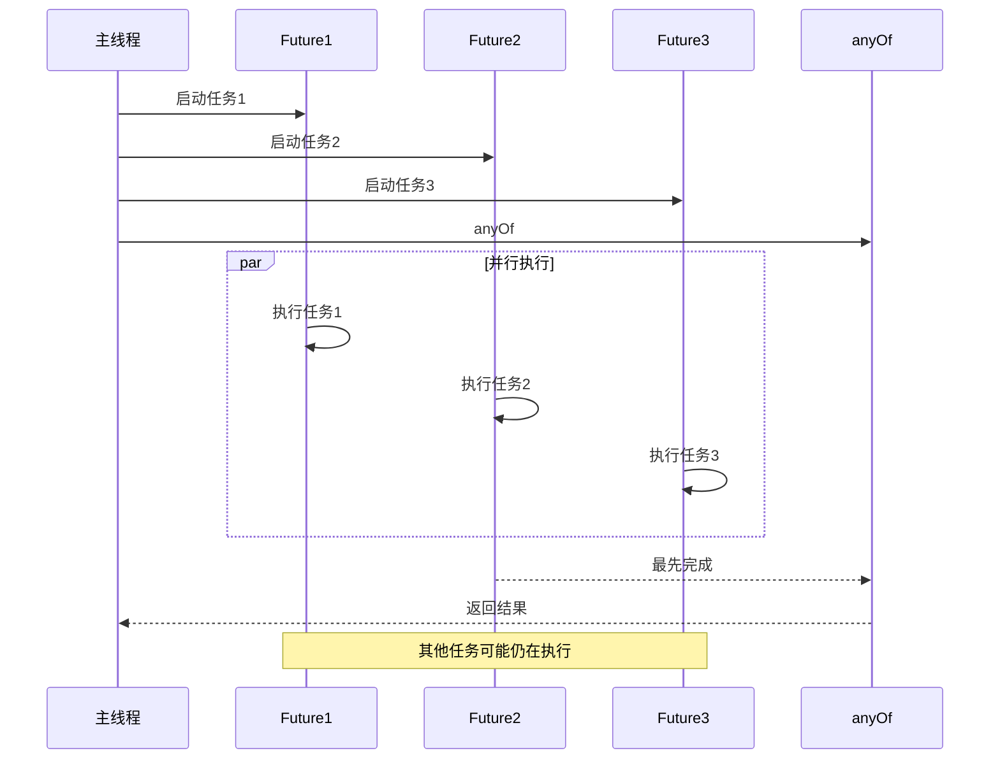
```mermaid
sequenceDiagram
    participant Main as 主线程
    participant F1 as Future1
    participant F2 as Future2
    participant F3 as Future3
    participant Any as anyOf
    
    Main->>F1: 启动任务1
    Main->>F2: 启动任务2
    Main->>F3: 启动任务3
    Main->>Any: anyOf
    
    par 并行执行
        F1->>F1: 执行任务1
        F2->>F2: 执行任务2
        F3->>F3: 执行任务3
    end
    
    F2-->>Any: 最先完成
    Any-->>Main: 返回结果
    Note over F1,F3: 其他任务可能仍在执行
```

**代码示例（阻塞方式）：**

```java
CompletableFuture<String> fast = CompletableFuture.supplyAsync(() -> {
    sleep(100);
    return "Fast Task";
});

CompletableFuture<String> slow = CompletableFuture.supplyAsync(() -> {
    sleep(1000);
    return "Slow Task";
});

// 阻塞等待最先完成的任务
Object winner = CompletableFuture.anyOf(fast, slow).join();
System.out.println("Winner: " + winner);
```

**代码示例（非阻塞方式）：**

```java
CompletableFuture<String> fast = CompletableFuture.supplyAsync(() -> {
    sleep(100);
    return "Fast Task";
});

CompletableFuture<String> slow = CompletableFuture.supplyAsync(() -> {
    sleep(1000);
    return "Slow Task";
});

CompletableFuture<Object> winner = CompletableFuture.anyOf(fast, slow);
winner.thenAccept(result -> System.out.println("Winner: " + result));
```

### 模式 4：条件执行模式

根据前置任务的结果决定后续执行路径。

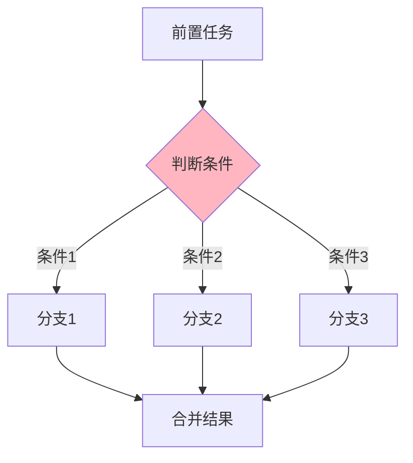
```mermaid
flowchart TD
    A[前置任务] --> B{判断条件}
    B -->|条件1| C[分支1]
    B -->|条件2| D[分支2]
    B -->|条件3| E[分支3]
    C --> F[合并结果]
    D --> F
    E --> F
    
    style B fill:#FFB6C1
```

**代码示例：**

```java
CompletableFuture<String> result = CompletableFuture
    .supplyAsync(() -> getUserType())
    .thenCompose(type -> {
        switch (type) {
            case "VIP":
                return CompletableFuture.supplyAsync(() -> "VIP Service");
            case "Normal":
                return CompletableFuture.supplyAsync(() -> "Normal Service");
            default:
                return CompletableFuture.supplyAsync(() -> "Default Service");
        }
    });
```

### 模式 5：重试模式

任务失败后自动重试。

```mermaid
flowchart TD
    A[执行任务] --> B{成功?}
    B -->|是| C[返回结果]
    B -->|否| D{重试次数<最大次数?}
    D -->|是| E[等待]
    E --> A
    D -->|否| F[返回异常]
    
    style D fill:#FFB6C1
    style F fill:#FF6B6B
```

**代码示例：**

```java
public CompletableFuture<String> retryAsync(int maxRetries) {
    return CompletableFuture.supplyAsync(() -> riskyOperation())
        .exceptionally(ex -> {
            if (maxRetries > 0) {
                return retryAsync(maxRetries - 1).join();
            }
            throw new RuntimeException("Max retries exceeded", ex);
        });
}
```

---

## 组件交互图

### 完整异步编排交互流程

```mermaid
sequenceDiagram
    participant Client as 客户端
    participant CF1 as CompletableFuture1
    participant CF2 as CompletableFuture2
    participant CF3 as CompletableFuture3
    participant Executor as 线程池
    participant Stack as Completion Stack
    
    Client->>CF1: supplyAsync(Supplier)
    CF1->>Executor: 提交任务
    CF1-->>Client: 立即返回Future
    
    Client->>CF1: thenApply(Function)
    CF1->>Stack: 添加Completion节点
    
    Executor->>CF1: 任务完成，返回结果
    CF1->>CF1: 触发Completion
    CF1->>Executor: 执行thenApply
    Executor->>CF2: 创建新的Future
    
    Client->>CF2: thenCompose(Function)
    CF2->>CF3: 内部创建Future3
    
    par 并行执行
        Executor->>CF2: 执行转换
        Executor->>CF3: 执行组合任务
    end
    
    CF3-->>CF2: 返回结果
    CF2-->>CF1: 完成链式调用
    CF1-->>Client: 最终结果
```

---

## 方法分类总结表

### 创建方法

| 方法 | 类型 | 说明 |
|------|------|------|
| `supplyAsync(Supplier)` | 静态 | 创建异步任务，有返回值 |
| `supplyAsync(Supplier, Executor)` | 静态 | 指定线程池创建异步任务 |
| `runAsync(Runnable)` | 静态 | 创建异步任务，无返回值 |
| `runAsync(Runnable, Executor)` | 静态 | 指定线程池创建异步任务 |
| `completedFuture(T)` | 静态 | 创建已完成的Future |
| `complete(T)` | 实例 | 手动完成Future |
| `completeExceptionally(Throwable)` | 实例 | 手动完成并设置异常 |

### 转换方法

| 方法 | 同步/异步 | 说明 |
|------|-----------|------|
| `thenApply(Function)` | 同步 | 转换结果，返回新类型 |
| `thenApplyAsync(Function)` | 异步 | 异步转换结果 |
| `thenApplyAsync(Function, Executor)` | 异步 | 指定线程池转换结果 |

### 消费方法

| 方法 | 同步/异步 | 说明 |
|------|-----------|------|
| `thenAccept(Consumer)` | 同步 | 消费结果，无返回值 |
| `thenAcceptAsync(Consumer)` | 异步 | 异步消费结果 |
| `thenRun(Runnable)` | 同步 | 执行动作，不依赖结果 |
| `thenRunAsync(Runnable)` | 异步 | 异步执行动作 |

### 组合方法

| 方法 | 说明 |
|------|------|
| `thenCompose(Function)` | 扁平化组合，避免嵌套Future |
| `thenCombine(CompletionStage, BiFunction)` | 合并两个Future的结果 |
| `thenCombineAsync(...)` | 异步合并两个Future |
| `allOf(CompletableFuture...)` | 等待所有Future完成 |
| `anyOf(CompletableFuture...)` | 等待任一Future完成 |

### 异常处理

| 方法 | 说明 |
|------|------|
| `exceptionally(Function)` | 捕获异常，返回默认值 |
| `handle(BiFunction)` | 统一处理结果和异常 |

### 获取结果

| 方法 | 说明 | 是否阻塞 |
|------|------|----------|
| `get()` | 获取结果，阻塞直到完成 | 是 |
| `get(long, TimeUnit)` | 带超时的获取结果 | 是 |
| `join()` | 获取结果，阻塞直到完成（不抛检查异常） | 是 |
| `getNow(T)` | 立即获取结果，如果未完成返回默认值 | 否 |
| `isDone()` | 判断是否完成 | 否 |
| `isCompletedExceptionally()` | 判断是否异常完成 | 否 |
| `isCancelled()` | 判断是否已取消 | 否 |

---

## 最佳实践

### 1. 使用自定义线程池

```java
// ❌ 不推荐：使用默认的 ForkJoinPool
CompletableFuture.supplyAsync(() -> doWork());

// ✅ 推荐：使用自定义线程池
ExecutorService executor = Executors.newFixedThreadPool(10);
CompletableFuture.supplyAsync(() -> doWork(), executor);
```

### 2. 合理选择阻塞和非阻塞调用

**非阻塞场景**（推荐）：异步处理，不阻塞主线程

```java
// ✅ 推荐：在异步场景中使用回调
future.thenAccept(result -> processResult(result));
// 或
CompletableFuture.allOf(f1, f2, f3)
    .thenRun(() -> {
        // 所有任务完成后处理
        String r1 = f1.join();  // 此时已完成，立即返回
        String r2 = f2.join();
        String r3 = f3.join();
    });
```

**阻塞场景**（适用）：需要同步等待结果

```java
// ✅ 适用：在需要返回结果的方法中
public List<String> fetchAllData() {
    CompletableFuture<String> f1 = fetchData1();
    CompletableFuture<String> f2 = fetchData2();
    CompletableFuture<String> f3 = fetchData3();
    
    // 阻塞等待所有任务完成
    CompletableFuture.allOf(f1, f2, f3).join();
    
    // 返回结果
    return Arrays.asList(f1.join(), f2.join(), f3.join());
}

// ✅ 适用：获取最先完成的结果
public String getFirstResult() {
    CompletableFuture<String> fast = quickTask();
    CompletableFuture<String> slow = slowTask();
    return (String) CompletableFuture.anyOf(fast, slow).join();
}
```

**注意事项**：
- 在 Web 请求处理线程中避免阻塞，使用回调或异步返回
- 在需要同步结果的方法中可以使用 `join()` 阻塞等待
- `allOf(...).join()` 后，各个 Future 的 `join()` 会立即返回，不会再次阻塞

### 3. 合理使用异步和同步方法

```java
// 如果转换操作很快，使用同步方法
CompletableFuture<String> future = CompletableFuture
    .supplyAsync(() -> fetchData())
    .thenApply(data -> data.trim());  // 快速操作，同步即可

// 如果转换操作耗时，使用异步方法
CompletableFuture<String> future = CompletableFuture
    .supplyAsync(() -> fetchData())
    .thenApplyAsync(data -> heavyProcess(data));  // 耗时操作，异步执行
```

### 4. 异常处理要全面

```java
CompletableFuture<String> future = CompletableFuture
    .supplyAsync(() -> riskyOperation())
    .exceptionally(ex -> {
        log.error("Operation failed", ex);
        return "Default Value";
    })
    .thenApply(result -> process(result))
    .handle((result, ex) -> {
        if (ex != null) {
            log.error("Processing failed", ex);
            return "Error";
        }
        return result;
    });
```

### 5. 避免嵌套的 CompletableFuture

```java
// ❌ 不推荐：嵌套的 Future
CompletableFuture<CompletableFuture<String>> bad = 
    CompletableFuture.supplyAsync(() -> 
        CompletableFuture.supplyAsync(() -> "Result")
    );

// ✅ 推荐：使用 thenCompose 扁平化
CompletableFuture<String> good = 
    CompletableFuture.supplyAsync(() -> "Input")
        .thenCompose(input -> 
            CompletableFuture.supplyAsync(() -> "Result")
        );
```

### 6. 资源管理

```java
ExecutorService executor = Executors.newFixedThreadPool(10);

try {
    CompletableFuture<String> future = CompletableFuture
        .supplyAsync(() -> doWork(), executor);
    // 处理结果
} finally {
    executor.shutdown();  // 记得关闭线程池
}
```

---

## 总结

`CompletableFuture` 提供了强大的异步编程能力，通过链式调用可以实现复杂的任务编排。关键点：

1. **理解执行模式**：区分同步和异步方法的使用场景
2. **合理编排任务**：根据业务需求选择合适的组合方式
3. **异常处理**：确保所有异常都能被正确处理
4. **资源管理**：合理使用线程池，避免资源泄露
5. **性能考虑**：避免不必要的异步操作，平衡性能和复杂度

通过熟练掌握 `CompletableFuture`，可以编写出高效、清晰、易维护的异步代码。

