# CAS 工作原理深度解析

## 1. CAS 概述

CAS（Compare-And-Swap，比较并交换）是一种无锁（Lock-Free）的原子操作，是现代并发编程的基础。它通过硬件级别的原子指令实现，避免了传统锁机制带来的线程阻塞和上下文切换开销。

### 1.1 多CPU并发编程的挑战

在理解 CAS 之前，我们需要先了解多 CPU 并发编程面临的根本问题：**缓存一致性问题**。

#### 1.1.1 多CPU架构与缓存层次

现代多核 CPU 的架构特点：

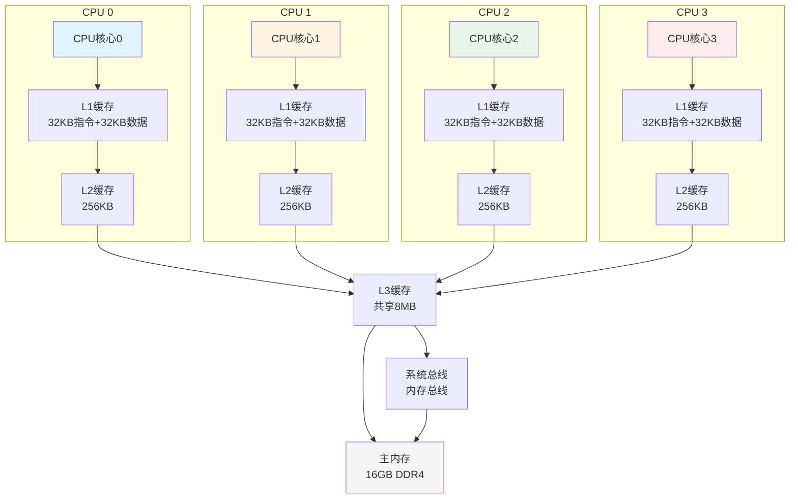
```mermaid
graph TB
    subgraph "CPU 0"
        CPU0[CPU核心0]
        L10[L1缓存<br/>32KB指令+32KB数据]
        L20[L2缓存<br/>256KB]
    end
    
    subgraph "CPU 1"
        CPU1[CPU核心1]
        L11[L1缓存<br/>32KB指令+32KB数据]
        L21[L2缓存<br/>256KB]
    end
    
    subgraph "CPU 2"
        CPU2[CPU核心2]
        L12[L1缓存<br/>32KB指令+32KB数据]
        L22[L2缓存<br/>256KB]
    end
    
    subgraph "CPU 3"
        CPU3[CPU核心3]
        L13[L1缓存<br/>32KB指令+32KB数据]
        L23[L2缓存<br/>256KB]
    end
    
    CPU0 --> L10
    L10 --> L20
    CPU1 --> L11
    L11 --> L21
    CPU2 --> L12
    L12 --> L22
    CPU3 --> L13
    L13 --> L23
    
    L20 --> L3[L3缓存<br/>共享8MB]
    L21 --> L3
    L22 --> L3
    L23 --> L3
    
    L3 --> Memory[主内存<br/>16GB DDR4]
    L3 --> Bus[系统总线<br/>内存总线]
    Bus --> Memory
    
    style CPU0 fill:#e1f5ff
    style CPU1 fill:#fff4e1
    style CPU2 fill:#e8f5e9
    style CPU3 fill:#ffebee
    style Memory fill:#f5f5f5
```

**关键问题：每个 CPU 核心都有自己独立的缓存！**

#### 1.1.2 缓存不一致问题场景

**场景1：多线程共享变量的读写**

```java
public class SharedVariable {
    private int count = 0;  // 共享变量，存储在主内存中
    
    public void increment() {
        count++;  // 问题：这个操作在多CPU环境下不是原子的！
    }
}
```

**多CPU执行流程（无同步机制）：**

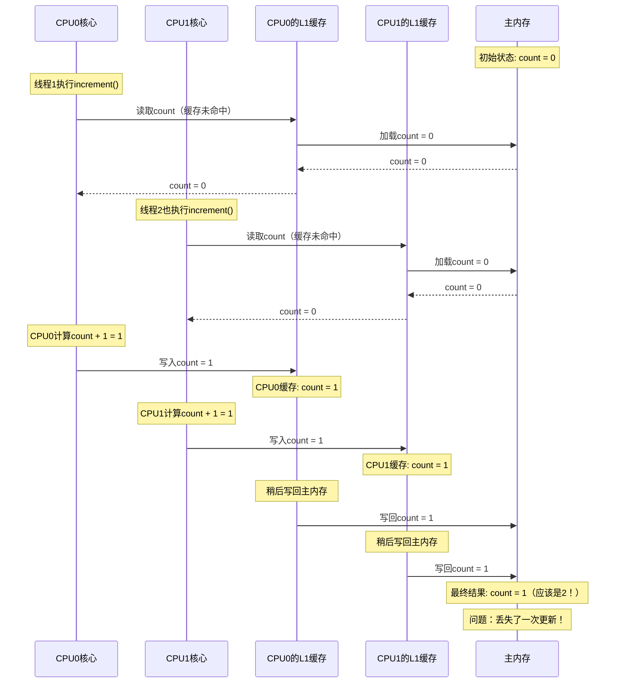
```mermaid
sequenceDiagram
    participant CPU0 as CPU0核心
    participant CPU1 as CPU1核心
    participant Cache0 as CPU0的L1缓存
    participant Cache1 as CPU1的L1缓存
    participant Memory as 主内存
    
    Note over Memory: 初始状态: count = 0
    
    Note over CPU0: 线程1执行increment()
    CPU0->>Cache0: 读取count（缓存未命中）
    Cache0->>Memory: 加载count = 0
    Memory-->>Cache0: count = 0
    Cache0-->>CPU0: count = 0
    
    Note over CPU1: 线程2也执行increment()
    CPU1->>Cache1: 读取count（缓存未命中）
    Cache1->>Memory: 加载count = 0
    Memory-->>Cache1: count = 0
    Cache1-->>CPU1: count = 0
    
    Note over CPU0: CPU0计算count + 1 = 1
    CPU0->>Cache0: 写入count = 1
    Note over Cache0: CPU0缓存: count = 1
    
    Note over CPU1: CPU1计算count + 1 = 1
    CPU1->>Cache1: 写入count = 1
    Note over Cache1: CPU1缓存: count = 1
    
    Note over Cache0: 稍后写回主内存
    Cache0->>Memory: 写回count = 1
    
    Note over Cache1: 稍后写回主内存
    Cache1->>Memory: 写回count = 1
    
    Note over Memory: 最终结果: count = 1（应该是2！）
    Note over Memory: 问题：丢失了一次更新！
```

**问题分析：**

1. **两个 CPU 核心同时读取到初始值 0**
2. **各自在自己的缓存中计算和更新**
3. **写回主内存时，后写入的值覆盖了先写入的值**
4. **结果：本应该 count = 2，但实际只有 count = 1**

#### 1.1.3 写缓冲器导致的可见性问题

**并发编程艺术**中提到，现代 CPU 为了提高性能，使用了**写缓冲器（Store Buffer）**：

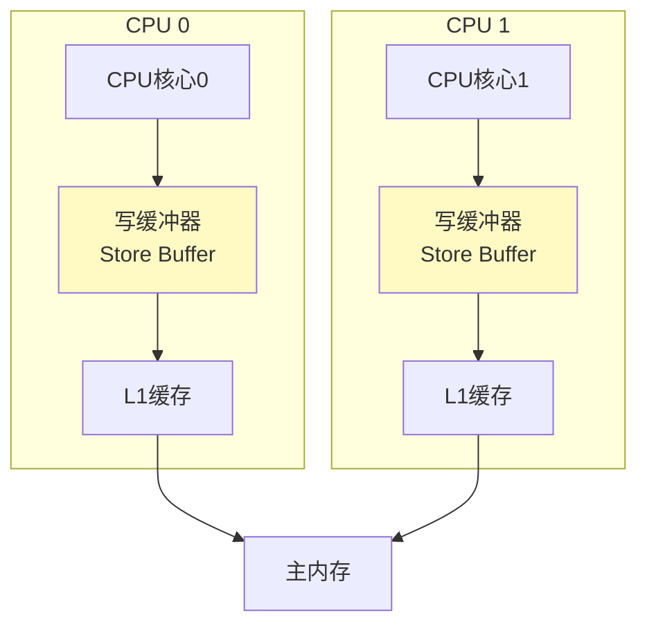
```mermaid
graph TB
    subgraph "CPU 0"
        CPU0[CPU核心0]
        StoreBuffer0[写缓冲器<br/>Store Buffer]
        Cache0[L1缓存]
    end
    
    subgraph "CPU 1"
        CPU1[CPU核心1]
        StoreBuffer1[写缓冲器<br/>Store Buffer]
        Cache1[L1缓存]
    end
    
    CPU0 --> StoreBuffer0
    StoreBuffer0 --> Cache0
    CPU1 --> StoreBuffer1
    StoreBuffer1 --> Cache1
    
    Cache0 --> Memory[主内存]
    Cache1 --> Memory
    
    style StoreBuffer0 fill:#fff9c4
    style StoreBuffer1 fill:#fff9c4
```

**写缓冲器的工作机制：**

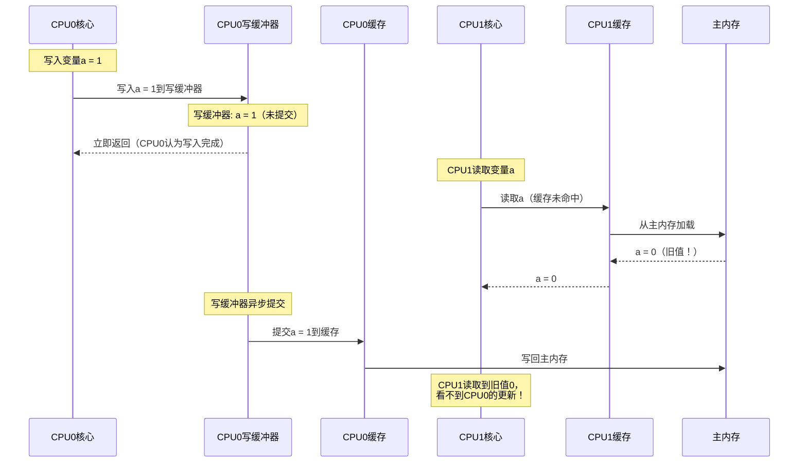
```mermaid
sequenceDiagram
    participant CPU0 as CPU0核心
    participant SB0 as CPU0写缓冲器
    participant Cache0 as CPU0缓存
    participant CPU1 as CPU1核心
    participant Cache1 as CPU1缓存
    participant Memory as 主内存
    
    Note over CPU0: 写入变量a = 1
    CPU0->>SB0: 写入a = 1到写缓冲器
    Note over SB0: 写缓冲器: a = 1（未提交）
    SB0-->>CPU0: 立即返回（CPU0认为写入完成）
    
    Note over CPU1: CPU1读取变量a
    CPU1->>Cache1: 读取a（缓存未命中）
    Cache1->>Memory: 从主内存加载
    Memory-->>Cache1: a = 0（旧值！）
    Cache1-->>CPU1: a = 0
    
    Note over SB0: 写缓冲器异步提交
    SB0->>Cache0: 提交a = 1到缓存
    Cache0->>Memory: 写回主内存
    
    Note over CPU1: CPU1读取到旧值0，<br/>看不到CPU0的更新！
```

**关键问题：**
- CPU 写入时，数据先进入写缓冲器，然后异步提交到缓存
- 写缓冲器中的修改对其他 CPU 不可见，直到提交到缓存
- 这导致**内存可见性问题**

#### 1.1.4 高速缓存刷新的延迟

**并发编程艺术**中强调，缓存刷新不是实时的：

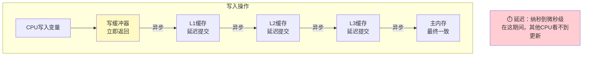
```mermaid
graph TB
    subgraph "写入操作"
        Write[CPU写入变量]
        StoreBuffer[写缓冲器<br/>立即返回]
        Cache[L1缓存<br/>延迟提交]
        L2[L2缓存<br/>延迟提交]
        L3[L3缓存<br/>延迟提交]
        Memory[主内存<br/>最终一致]
    end
    
    Write --> StoreBuffer
    StoreBuffer -->|异步| Cache
    Cache -->|异步| L2
    L2 -->|异步| L3
    L3 -->|异步| Memory
    
    Note1["⏱️ 延迟：纳秒到微秒级<br/>在这期间，其他CPU看不到更新"]
    
    style StoreBuffer fill:#fff9c4
    style Note1 fill:#ffcdd2
```

**实际场景：可见性延迟**

```java
// 线程1在CPU0上执行
public void thread1() {
    flag = true;  // 写入到CPU0的写缓冲器
    // 问题：其他CPU可能还看不到flag = true
}

// 线程2在CPU1上执行
public void thread2() {
    while (!flag) {  // 从CPU1的缓存读取，可能还是false
        // 等待...
    }
    // 问题：可能永远不会退出循环！
}
```

#### 1.1.5 内存重排序问题

现代 CPU 为了提高性能，会进行**指令重排序**：

```java
// 源代码顺序
int x = 0;
int y = 0;

// 线程1
x = 1;
y = 1;

// 线程2
if (y == 1) {
    assert x == 1;  // 可能失败！x可能还是0
}
```

**CPU 可能的重排序执行：**

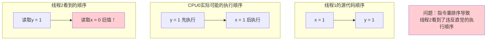
```mermaid
graph TB
    subgraph "线程1的源代码顺序"
        S1[x = 1]
        S2[y = 1]
    end
    
    subgraph "CPU0实际可能的执行顺序"
        E1[y = 1 先执行]
        E2[x = 1 后执行]
    end
    
    subgraph "线程2看到的顺序"
        R1[读取y = 1]
        R2[读取x = 0 旧值！]
    end
    
    S1 --> S2
    E1 --> E2
    R1 --> R2
    
    Note["问题：指令重排序导致<br/>线程2看到了违反直觉的执行顺序"]
    
    style Note fill:#ffcdd2
    style R2 fill:#ffcdd2
```

#### 1.1.6 典型并发问题场景总结

**场景1：丢失更新（Lost Update）**

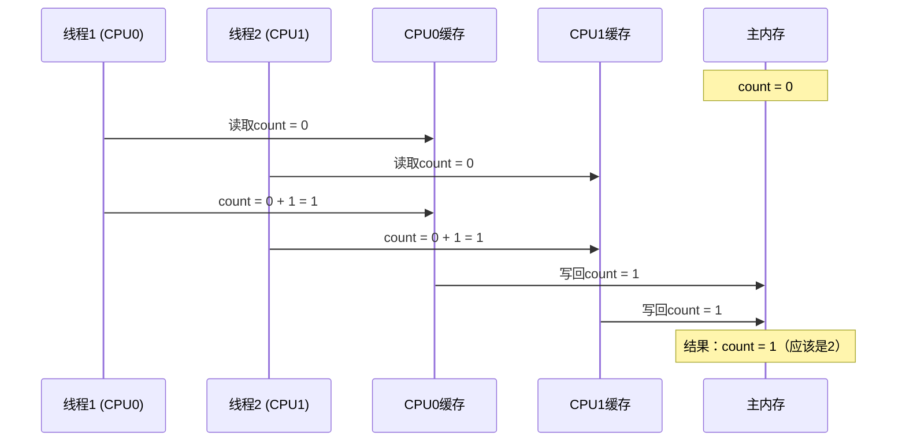
```mermaid
sequenceDiagram
    participant T1 as 线程1 (CPU0)
    participant T2 as 线程2 (CPU1)
    participant Cache0 as CPU0缓存
    participant Cache1 as CPU1缓存
    participant Memory as 主内存
    
    Note over Memory: count = 0
    
    T1->>Cache0: 读取count = 0
    T2->>Cache1: 读取count = 0
    T1->>Cache0: count = 0 + 1 = 1
    T2->>Cache1: count = 0 + 1 = 1
    Cache0->>Memory: 写回count = 1
    Cache1->>Memory: 写回count = 1
    
    Note over Memory: 结果：count = 1（应该是2）
```

**场景2：不可见问题（Visibility Problem）**

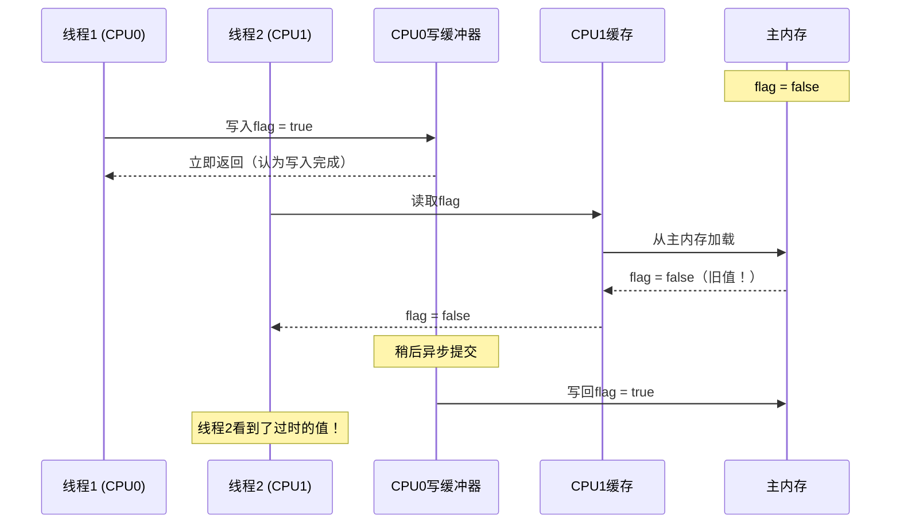
```mermaid
sequenceDiagram
    participant T1 as 线程1 (CPU0)
    participant T2 as 线程2 (CPU1)
    participant SB0 as CPU0写缓冲器
    participant Cache1 as CPU1缓存
    participant Memory as 主内存
    
    Note over Memory: flag = false
    
    T1->>SB0: 写入flag = true
    SB0-->>T1: 立即返回（认为写入完成）
    T2->>Cache1: 读取flag
    Cache1->>Memory: 从主内存加载
    Memory-->>Cache1: flag = false（旧值！）
    Cache1-->>T2: flag = false
    
    Note over SB0: 稍后异步提交
    SB0->>Memory: 写回flag = true
    
    Note over T2: 线程2看到了过时的值！
```

**场景3：指令重排序导致的可见性问题**

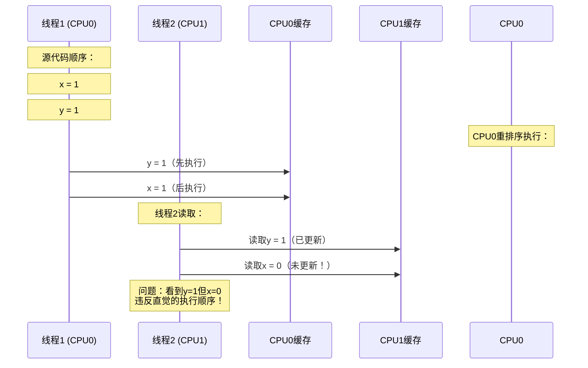
```mermaid
sequenceDiagram
    participant T1 as 线程1 (CPU0)
    participant T2 as 线程2 (CPU1)
    participant Cache0 as CPU0缓存
    participant Cache1 as CPU1缓存
    
    Note over T1: 源代码顺序：
    Note over T1: x = 1
    Note over T1: y = 1
    
    Note over CPU0: CPU0重排序执行：
    T1->>Cache0: y = 1（先执行）
    T1->>Cache0: x = 1（后执行）
    
    Note over T2: 线程2读取：
    T2->>Cache1: 读取y = 1（已更新）
    T2->>Cache1: 读取x = 0（未更新！）
    
    Note over T2: 问题：看到y=1但x=0<br/>违反直觉的执行顺序！
```

#### 1.1.7 为什么需要 CAS？

**传统解决方案的问题：**

| 方案 | 问题 |
|------|------|
| **synchronized** | 线程阻塞、上下文切换开销大、可能死锁 |
| **volatile** | 只能保证可见性，不能保证原子性 |
| **锁机制** | 性能开销大，不适合高并发场景 |

**CAS 的优势：**

1. **硬件级别的原子性**：CPU 指令保证操作的原子性
2. **无锁设计**：避免线程阻塞，减少上下文切换
3. **高性能**：直接操作内存，避免锁竞争
4. **解决缓存一致性问题**：通过缓存一致性协议（MESI）保证多核间的一致性

**CAS 如何解决缓存一致性问题：**

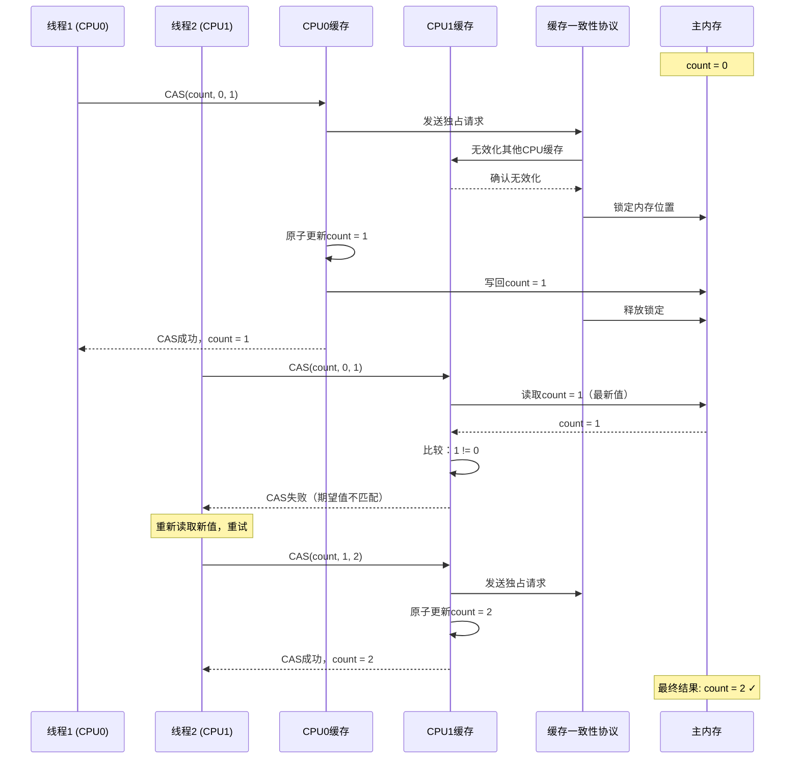
```mermaid
sequenceDiagram
    participant T1 as 线程1 (CPU0)
    participant T2 as 线程2 (CPU1)
    participant Cache0 as CPU0缓存
    participant Cache1 as CPU1缓存
    participant MESI as 缓存一致性协议
    participant Memory as 主内存
    
    Note over Memory: count = 0
    
    T1->>Cache0: CAS(count, 0, 1)
    Cache0->>MESI: 发送独占请求
    MESI->>Cache1: 无效化其他CPU缓存
    Cache1-->>MESI: 确认无效化
    MESI->>Memory: 锁定内存位置
    Cache0->>Cache0: 原子更新count = 1
    Cache0->>Memory: 写回count = 1
    MESI->>Memory: 释放锁定
    Cache0-->>T1: CAS成功，count = 1
    
    T2->>Cache1: CAS(count, 0, 1)
    Cache1->>Memory: 读取count = 1（最新值）
    Memory-->>Cache1: count = 1
    Cache1->>Cache1: 比较：1 != 0
    Cache1-->>T2: CAS失败（期望值不匹配）
    
    Note over T2: 重新读取新值，重试
    T2->>Cache1: CAS(count, 1, 2)
    Cache1->>MESI: 发送独占请求
    Cache1->>Cache1: 原子更新count = 2
    Cache1-->>T2: CAS成功，count = 2
    
    Note over Memory: 最终结果: count = 2 ✓
```

#### 1.1.8 并发编程艺术中的关键概念

**《Java并发编程的艺术》中强调的内容：**

1. **高速缓存的写回策略**
    - **写直达（Write-Through）**：同时写入缓存和内存（性能低，但一致性好）
    - **写回（Write-Back）**：只写入缓存，异步写回内存（性能高，但可能不一致）

**CAS 与写直达策略的关系：**

CAS 操作会产生**类似写直达的效果**（立即刷新到主内存），但这是两个不同层面的概念：

- **写直达/写回**：是缓存系统的**写策略**，决定何时将数据写回主内存
- **CAS**：是硬件级别的**原子操作指令**，会强制立即刷新到主内存

**CAS 的刷新机制：**

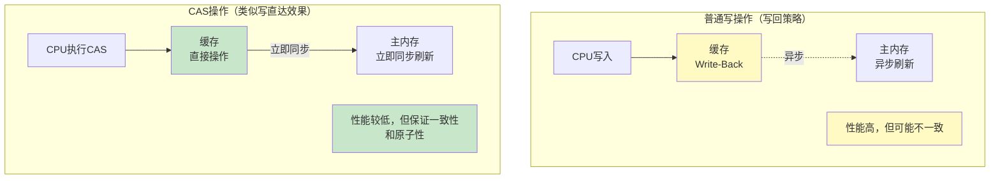
```mermaid
graph TB
    subgraph "普通写操作（写回策略）"
        NormalWrite[CPU写入]
        NormalCache[缓存<br/>Write-Back]
        NormalMem[主内存<br/>异步刷新]
        
        NormalWrite --> NormalCache
        NormalCache -.->|异步| NormalMem
        
        Note1["性能高，但可能不一致"]
    end
    
    subgraph "CAS操作（类似写直达效果）"
        CASWrite[CPU执行CAS]
        CASCache[缓存<br/>直接操作]
        CASMem[主内存<br/>立即同步刷新]
        
        CASWrite --> CASCache
        CASCache -->|立即同步| CASMem
        
        Note2["性能较低，但保证一致性<br/>和原子性"]
    end
    
    style NormalCache fill:#fff9c4
    style Note1 fill:#fff9c4
    style CASCache fill:#c8e6c9
    style Note2 fill:#c8e6c9
```

**关键区别：**

1. **写直达策略**：是缓存系统的配置选项，所有写操作都采用这种策略
2. **CAS 操作**：是特殊的硬件指令，**绕过写缓冲器**，**强制同步刷新**，这是为了保证：
   - **原子性**：整个操作不可分割
   - **可见性**：所有CPU立即看到最新值
   - **有序性**：操作顺序得到保证

**总结**：CAS 不是采用了写直达策略，而是 CAS 操作本身会**强制立即刷新到主内存**，产生类似写直达的效果。这是 CAS 作为原子操作的必要特性，而不是因为采用了写直达策略。

2. **缓存一致性协议（Cache Coherence Protocol）**
    - 用于解决多核CPU的缓存一致性问题
    - 常见协议：MESI、MOESI、MESIF

3. **内存屏障（Memory Barrier）**
    - **Load Barrier**：确保读操作在屏障之后执行
    - **Store Barrier**：确保写操作在屏障之前完成
    - **Full Barrier**：同时包含Load和Store屏障

4. **happens-before 关系**
    - Java内存模型（JMM）定义的可见性规则
    - 解决编译器和CPU重排序导致的可见性问题

**这些概念的关系：**

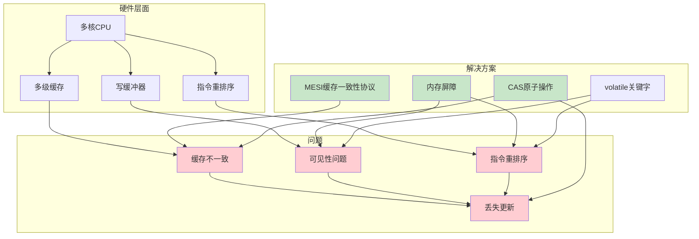
```mermaid
graph TB
    subgraph "硬件层面"
        CPU[多核CPU]
        Cache[多级缓存]
        WriteBuffer[写缓冲器]
        Reorder[指令重排序]
    end
    
    subgraph "问题"
        P1[缓存不一致]
        P2[可见性问题]
        P3[指令重排序]
        P4[丢失更新]
    end
    
    subgraph "解决方案"
        MESI[MESI缓存一致性协议]
        Barrier[内存屏障]
        CAS[CAS原子操作]
        Volatile[volatile关键字]
    end
    
    CPU --> Cache
    CPU --> WriteBuffer
    CPU --> Reorder
    
    Cache --> P1
    WriteBuffer --> P2
    Reorder --> P3
    P1 --> P4
    P2 --> P4
    P3 --> P4
    
    MESI --> P1
    Barrier --> P2
    Barrier --> P3
    CAS --> P4
    CAS --> P1
    Volatile --> P2
    Volatile --> P3
    
    style P1 fill:#ffcdd2
    style P2 fill:#ffcdd2
    style P3 fill:#ffcdd2
    style P4 fill:#ffcdd2
    style CAS fill:#c8e6c9
    style MESI fill:#c8e6c9
    style Barrier fill:#c8e6c9
```

#### 1.1.9 从问题到解决方案的演进

**传统编程模型（单CPU时代）：**
- 不存在缓存一致性问题
- 不需要考虑可见性问题
- 简单的锁机制即可满足需求

**多核时代的问题：**
- 每个CPU核心有独立缓存
- 缓存不一致导致数据竞争
- 写缓冲器和指令重排序导致可见性问题
- 简单的锁机制性能开销大

**现代解决方案：**
- **CAS**：硬件级别的原子操作，解决原子性和可见性问题
- **volatile**：通过内存屏障保证可见性和有序性
- **MESI协议**：硬件层面的缓存一致性保证
- **JMM**：Java层面的内存模型规范

**理解CAS的价值：**
CAS 不是简单的比较和交换，而是对多CPU并发编程根本问题的**硬件级别解决方案**。它利用了CPU的缓存一致性协议，实现了无锁的原子操作，这正是现代高并发编程的基础。

#### 1.1.10 并发编程艺术中的写缓冲器刷新机制

**《Java并发编程的艺术》中详细说明的写缓冲器刷新机制：**

现代CPU为了提高性能，使用写缓冲器（Store Buffer）和失效队列（Invalidate Queue）：

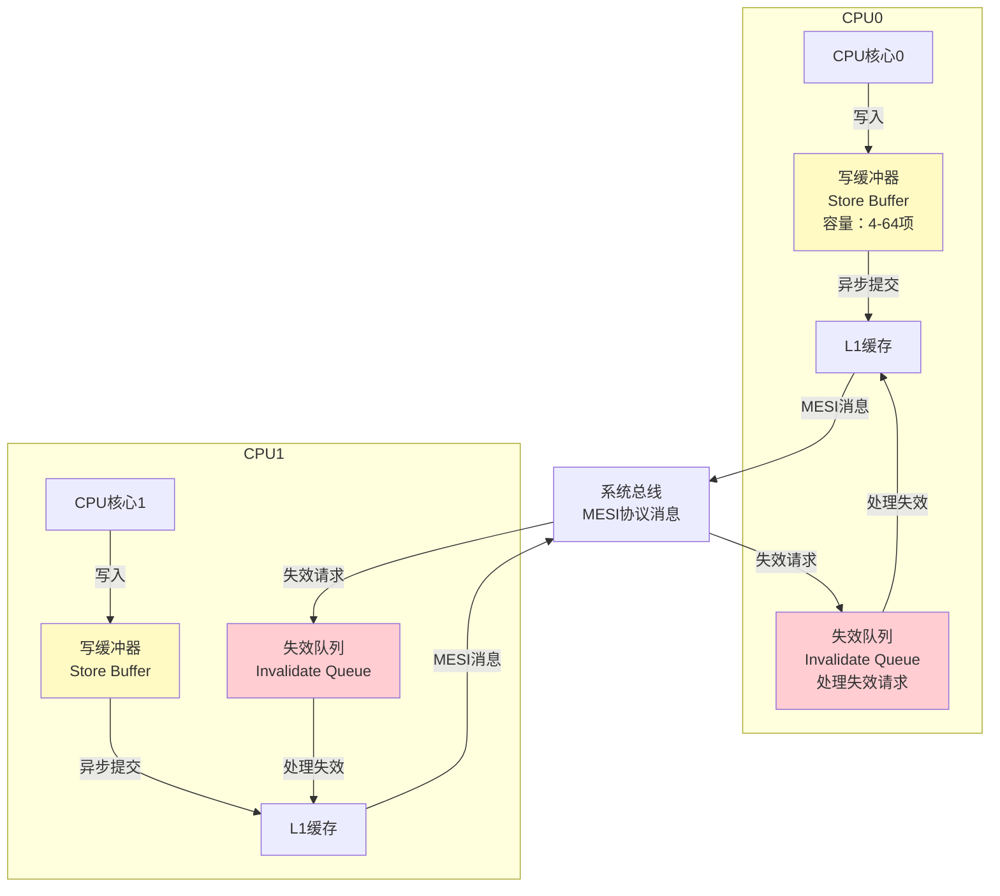
```mermaid
graph TB
    subgraph CPU0_Group["CPU0"]
        CPU0[CPU核心0]
        SB0[写缓冲器<br/>Store Buffer<br/>容量：4-64项]
        Cache0[L1缓存]
        IQ0[失效队列<br/>Invalidate Queue<br/>处理失效请求]
    end
    
    subgraph CPU1_Group["CPU1"]
        CPU1[CPU核心1]
        SB1[写缓冲器<br/>Store Buffer]
        Cache1[L1缓存]
        IQ1[失效队列<br/>Invalidate Queue]
    end
    
    Bus[系统总线<br/>MESI协议消息]
    
    CPU0 -->|写入| SB0
    SB0 -->|异步提交| Cache0
    Bus -->|失效请求| IQ0
    IQ0 -->|处理失效| Cache0
    
    CPU1 -->|写入| SB1
    SB1 -->|异步提交| Cache1
    Bus -->|失效请求| IQ1
    IQ1 -->|处理失效| Cache1
    
    Cache0 -->|MESI消息| Bus
    Cache1 -->|MESI消息| Bus
    
    style SB0 fill:#fff9c4
    style SB1 fill:#fff9c4
    style IQ0 fill:#ffcdd2
    style IQ1 fill:#ffcdd2
```

##### 1.1.10.1 写缓冲器的工作原理（来自并发编程艺术）

1. **写操作的异步处理**：
   - CPU执行写操作时，先将数据放入写缓冲器
   - 写缓冲器立即返回，CPU可以继续执行其他指令
   - 写缓冲器在后台异步将数据提交到缓存

2. **失效队列的作用**：
   - 当其他CPU发送失效请求（Invalidate Request）时
   - 失效请求先放入失效队列，快速确认
   - 失效队列在后台异步处理失效请求，使缓存行失效

3. **性能优化的代价**：
   - 写缓冲器提高了写入性能（不需要等待缓存更新）
   - 但导致修改对其他CPU的可见性延迟
   - 失效队列提高了响应速度（不需要等待失效完成）
   - 但可能导致CPU读取到过时的数据

##### 1.1.10.2 写缓冲器和失效队列导致的可见性问题

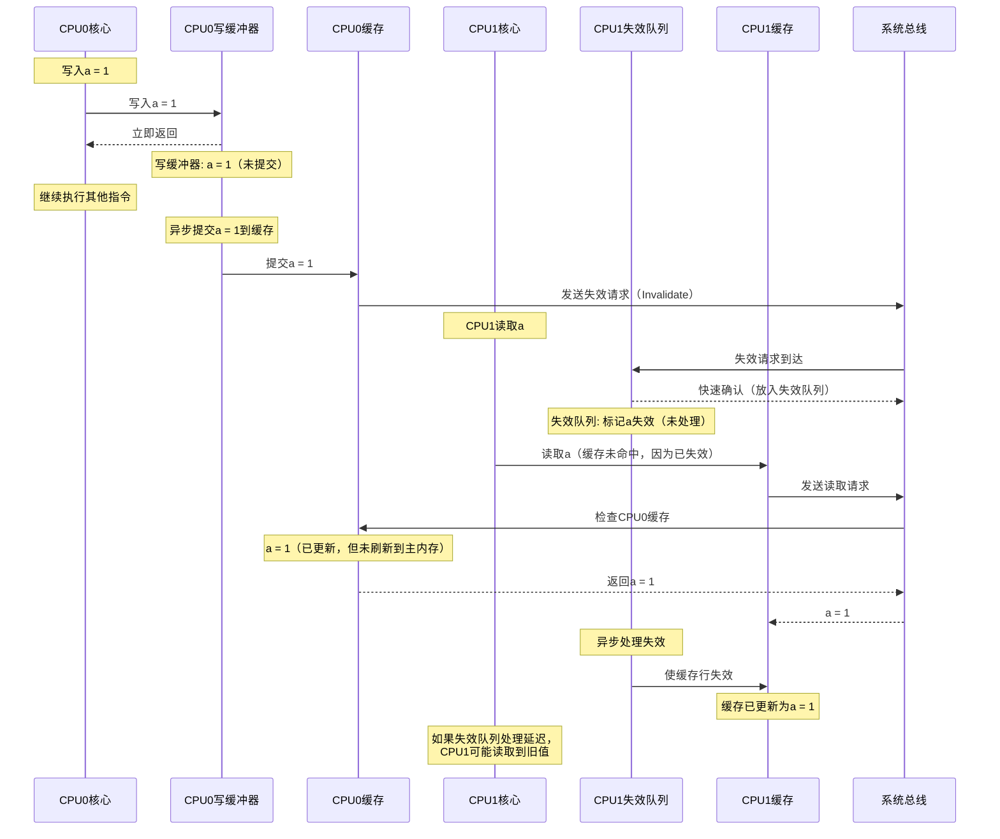
```mermaid
sequenceDiagram
    participant CPU0 as CPU0核心
    participant SB0 as CPU0写缓冲器
    participant Cache0 as CPU0缓存
    participant CPU1 as CPU1核心
    participant IQ1 as CPU1失效队列
    participant Cache1 as CPU1缓存
    participant Bus as 系统总线
    
    Note over CPU0: 写入a = 1
    CPU0->>SB0: 写入a = 1
    SB0-->>CPU0: 立即返回
    Note over SB0: 写缓冲器: a = 1（未提交）
    
    Note over CPU0: 继续执行其他指令
    Note over SB0: 异步提交a = 1到缓存
    SB0->>Cache0: 提交a = 1
    Cache0->>Bus: 发送失效请求（Invalidate）
    
    Note over CPU1: CPU1读取a
    Bus->>IQ1: 失效请求到达
    IQ1-->>Bus: 快速确认（放入失效队列）
    Note over IQ1: 失效队列: 标记a失效（未处理）
    
    CPU1->>Cache1: 读取a（缓存未命中，因为已失效）
    Cache1->>Bus: 发送读取请求
    Bus->>Cache0: 检查CPU0缓存
    Note over Cache0: a = 1（已更新，但未刷新到主内存）
    Cache0-->>Bus: 返回a = 1
    Bus-->>Cache1: a = 1
    
    Note over IQ1: 异步处理失效
    IQ1->>Cache1: 使缓存行失效
    Note over Cache1: 缓存已更新为a = 1
    
    Note over CPU1: 如果失效队列处理延迟，<br/>CPU1可能读取到旧值
```

##### 1.1.10.3 为什么需要内存屏障和CAS

由于写缓冲器和失效队列的存在，普通的读写操作无法保证可见性。需要：

1. **内存屏障（Memory Barrier）**：
   - **Load Barrier（读屏障）**：确保读操作在屏障之前完成，失效队列处理完成
   - **Store Barrier（写屏障）**：确保写操作在屏障之前完成，写缓冲器提交完成

**Load Barrier（读屏障）的工作原理：**

Load Barrier的作用是确保读操作在屏障之前完成，并处理失效队列中的所有失效请求，保证读取到最新数据。

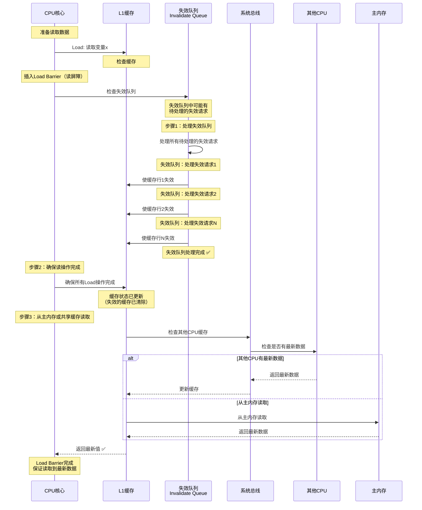
```mermaid
sequenceDiagram
    participant CPU as CPU核心
    participant Cache as L1缓存
    participant IQ as 失效队列<br/>Invalidate Queue
    participant Bus as 系统总线
    participant OtherCPU as 其他CPU
    participant Memory as 主内存
    
    Note over CPU: 准备读取数据
    CPU->>Cache: Load: 读取变量x
    Note over Cache: 检查缓存
    
    Note over CPU: 插入Load Barrier（读屏障）
    CPU->>IQ: 检查失效队列
    Note over IQ: 失效队列中可能有<br/>待处理的失效请求
    
    Note over IQ: 步骤1：处理失效队列
    IQ->>IQ: 处理所有待处理的失效请求
    Note over IQ: 失效队列：处理失效请求1
    IQ->>Cache: 使缓存行1失效
    Note over IQ: 失效队列：处理失效请求2
    IQ->>Cache: 使缓存行2失效
    Note over IQ: 失效队列：处理失效请求N
    IQ->>Cache: 使缓存行N失效
    Note over IQ: 失效队列处理完成 ✅
    
    Note over CPU: 步骤2：确保读操作完成
    CPU->>Cache: 确保所有Load操作完成
    Note over Cache: 缓存状态已更新<br/>（失效的缓存已清除）
    
    Note over CPU: 步骤3：从主内存或共享缓存读取
    Cache->>Bus: 检查其他CPU缓存
    Bus->>OtherCPU: 检查是否有最新数据
    alt 其他CPU有最新数据
        OtherCPU-->>Bus: 返回最新数据
        Bus-->>Cache: 更新缓存
    else 从主内存读取
        Cache->>Memory: 从主内存读取
        Memory-->>Cache: 返回最新数据
    end
    
    Cache-->>CPU: 返回最新值 ✅
    Note over CPU: Load Barrier完成<br/>保证读取到最新数据
```

**Load Barrier的关键点：**
- ✅ **处理失效队列**：屏障强制处理失效队列中的所有失效请求，确保缓存状态正确
- ✅ **确保读操作完成**：屏障确保所有Load操作在屏障前完成
- ✅ **读取最新数据**：从主内存或共享缓存读取最新数据，而不是从已失效的本地缓存读取

**Store Barrier（写屏障）的工作原理：**

Store Barrier的作用是确保写操作在屏障之前完成，并强制刷新写缓冲器中的所有写入操作到缓存和主内存。

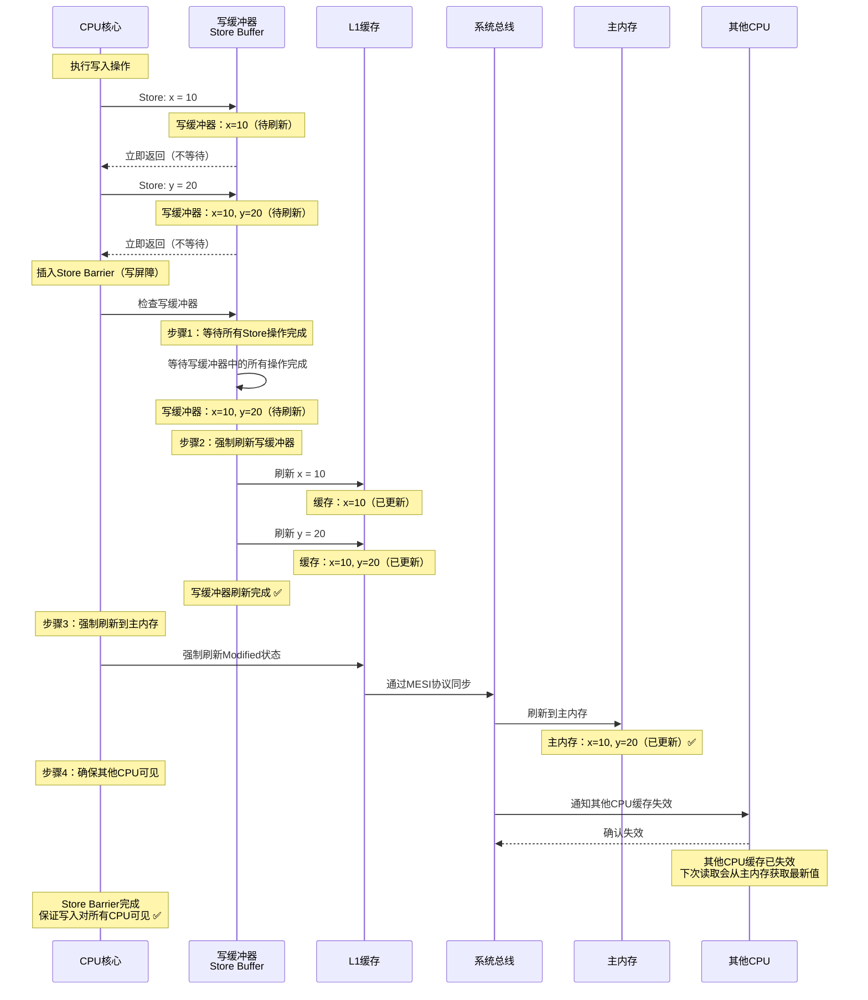
```mermaid
sequenceDiagram
    participant CPU as CPU核心
    participant SB as 写缓冲器<br/>Store Buffer
    participant Cache as L1缓存
    participant Bus as 系统总线
    participant Memory as 主内存
    participant OtherCPU as 其他CPU
    
    Note over CPU: 执行写入操作
    CPU->>SB: Store: x = 10
    Note over SB: 写缓冲器：x=10（待刷新）
    SB-->>CPU: 立即返回（不等待）
    
    CPU->>SB: Store: y = 20
    Note over SB: 写缓冲器：x=10, y=20（待刷新）
    SB-->>CPU: 立即返回（不等待）
    
    Note over CPU: 插入Store Barrier（写屏障）
    CPU->>SB: 检查写缓冲器
    
    Note over SB: 步骤1：等待所有Store操作完成
    SB->>SB: 等待写缓冲器中的所有操作完成
    Note over SB: 写缓冲器：x=10, y=20（待刷新）
    
    Note over SB: 步骤2：强制刷新写缓冲器
    SB->>Cache: 刷新 x = 10
    Note over Cache: 缓存：x=10（已更新）
    SB->>Cache: 刷新 y = 20
    Note over Cache: 缓存：x=10, y=20（已更新）
    Note over SB: 写缓冲器刷新完成 ✅
    
    Note over CPU: 步骤3：强制刷新到主内存
    CPU->>Cache: 强制刷新Modified状态
    Cache->>Bus: 通过MESI协议同步
    Bus->>Memory: 刷新到主内存
    Note over Memory: 主内存：x=10, y=20（已更新）✅
    
    Note over CPU: 步骤4：确保其他CPU可见
    Bus->>OtherCPU: 通知其他CPU缓存失效
    OtherCPU-->>Bus: 确认失效
    Note over OtherCPU: 其他CPU缓存已失效<br/>下次读取会从主内存获取最新值
    
    Note over CPU: Store Barrier完成<br/>保证写入对所有CPU可见 ✅
```

**Store Barrier的关键点：**
- ✅ **强制刷新写缓冲器**：屏障强制写缓冲器中的所有Store操作刷新到缓存
- ✅ **确保写操作完成**：屏障确保所有Store操作在屏障前完成
- ✅ **刷新到主内存**：强制刷新Modified状态的缓存到主内存
- ✅ **保证可见性**：确保写入对所有CPU立即可见

**Load Barrier 和 Store Barrier 的对比：**


```mermaid
graph TB
    subgraph "Load Barrier（读屏障）"
        LB1[处理失效队列]
        LB2[确保读操作完成]
        LB3[从主内存读取最新数据]
        LB4[保证读取到最新值]
    end
    
    subgraph "Store Barrier（写屏障）"
        SB1[强制刷新写缓冲器]
        SB2[确保写操作完成]
        SB3[刷新到主内存]
        SB4[保证写入对所有CPU可见]
    end
    
    LB1 --> LB2
    LB2 --> LB3
    LB3 --> LB4
    
    SB1 --> SB2
    SB2 --> SB3
    SB3 --> SB4
    
    style LB1 fill:#e1f5ff
    style LB4 fill:#e8f5e9
    style SB1 fill:#fff4e1
    style SB4 fill:#e8f5e9
```

**对比总结：**

| 特性 | Load Barrier（读屏障） | Store Barrier（写屏障） |
|------|----------------------|----------------------|
| **主要作用** | 处理失效队列 | 刷新写缓冲器 |
| **确保操作** | 读操作完成 | 写操作完成 |
| **处理组件** | 失效队列（Invalidate Queue） | 写缓冲器（Store Buffer） |
| **保证** | 读取到最新数据 | 写入对所有CPU可见 |
| **使用场景** | 读取共享变量前 | 写入共享变量后 |

**完整示例：Load Barrier 和 Store Barrier 的配合使用**

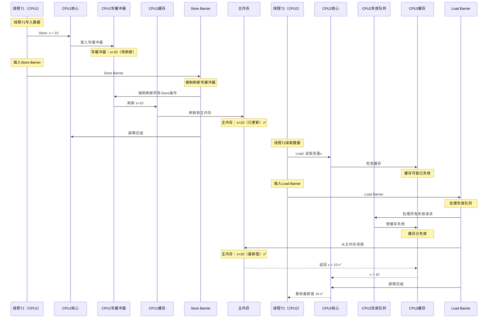
```mermaid
sequenceDiagram
    participant T1 as 线程T1（CPU1）
    participant CPU1 as CPU1核心
    participant SB1 as CPU1写缓冲器
    participant Cache1 as CPU1缓存
    participant Barrier1 as Store Barrier
    participant Memory as 主内存
    participant T2 as 线程T2（CPU2）
    participant CPU2 as CPU2核心
    participant IQ2 as CPU2失效队列
    participant Cache2 as CPU2缓存
    participant Barrier2 as Load Barrier
    
    Note over T1: 线程T1写入数据
    T1->>CPU1: Store: x = 10
    CPU1->>SB1: 放入写缓冲器
    Note over SB1: 写缓冲器：x=10（待刷新）
    
    Note over T1: 插入Store Barrier
    T1->>Barrier1: Store Barrier
    Note over Barrier1: 强制刷新写缓冲器
    Barrier1->>SB1: 强制刷新所有Store操作
    SB1->>Cache1: 刷新 x=10
    Cache1->>Memory: 刷新到主内存
    Note over Memory: 主内存：x=10（已更新）✅
    Barrier1->>CPU1: 屏障完成
    
    Note over T2: 线程T2读取数据
    T2->>CPU2: Load: 读取变量x
    CPU2->>Cache2: 检查缓存
    Note over Cache2: 缓存可能已失效
    
    Note over T2: 插入Load Barrier
    T2->>Barrier2: Load Barrier
    Note over Barrier2: 处理失效队列
    Barrier2->>IQ2: 处理所有失效请求
    IQ2->>Cache2: 使缓存失效
    Note over Cache2: 缓存已失效
    Barrier2->>Memory: 从主内存读取
    Note over Memory: 主内存：x=10（最新值）✅
    Memory-->>Cache2: 返回 x = 10 ✅
    Cache2-->>CPU2: x = 10
    Barrier2->>CPU2: 屏障完成
    CPU2-->>T2: 看到最新值 10 ✅
```

**关键理解：**
- ✅ **Store Barrier**：确保写入操作刷新到主内存，对所有CPU可见
- ✅ **Load Barrier**：确保失效队列已处理，从主内存读取最新数据
- ✅ **配合使用**：两个屏障配合使用，保证多CPU环境下的数据一致性

2. **CAS原子操作**：
   - CAS操作会隐式包含内存屏障
   - 确保操作在所有CPU上的可见性和有序性
   - 不需要显式地刷新写缓冲器或处理失效队列

##### 1.1.10.4 CAS如何绕过写缓冲器和失效队列

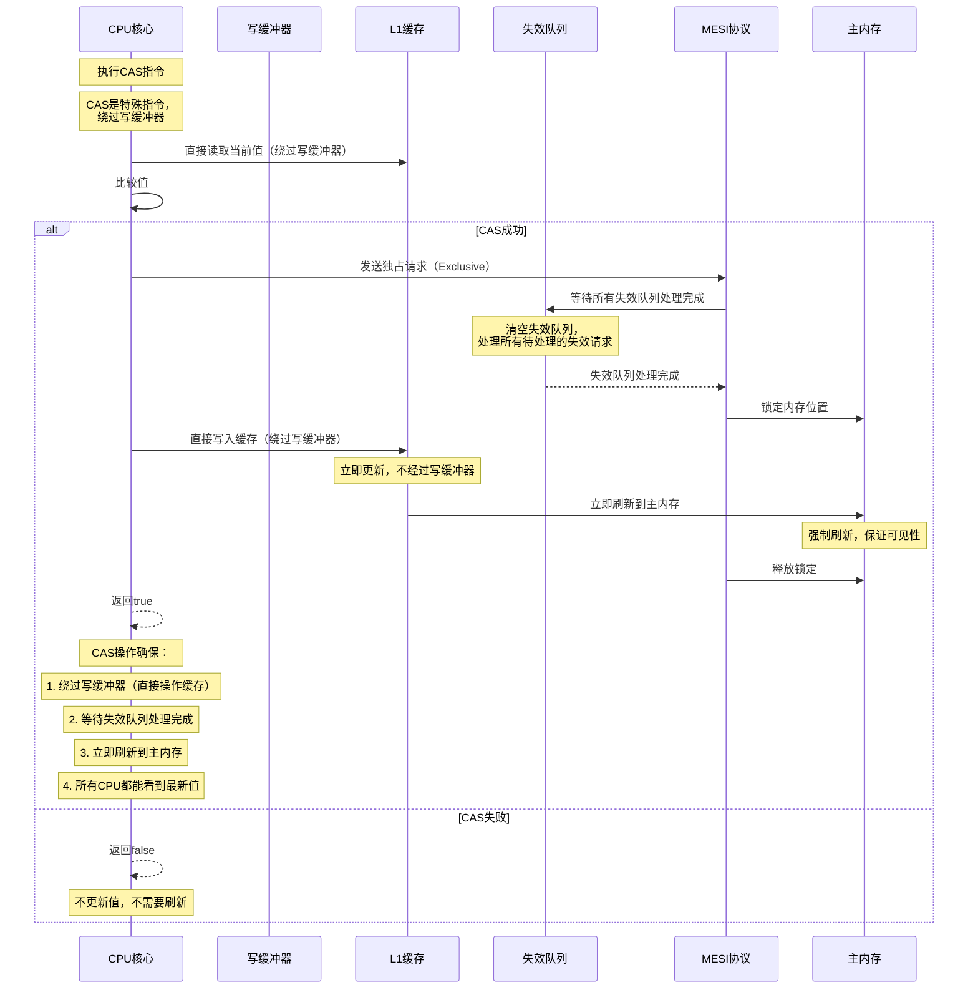
```mermaid
sequenceDiagram
    participant CPU as CPU核心
    participant SB as 写缓冲器
    participant Cache as L1缓存
    participant IQ as 失效队列
    participant MESI as MESI协议
    participant Memory as 主内存
    
    Note over CPU: 执行CAS指令
    Note over CPU: CAS是特殊指令，<br/>绕过写缓冲器
    
    CPU->>Cache: 直接读取当前值（绕过写缓冲器）
    CPU->>CPU: 比较值
    
    alt CAS成功
        CPU->>MESI: 发送独占请求（Exclusive）
        MESI->>IQ: 等待所有失效队列处理完成
        Note over IQ: 清空失效队列，<br/>处理所有待处理的失效请求
        IQ-->>MESI: 失效队列处理完成
        MESI->>Memory: 锁定内存位置
        CPU->>Cache: 直接写入缓存（绕过写缓冲器）
        Note over Cache: 立即更新，不经过写缓冲器
        Cache->>Memory: 立即刷新到主内存
        Note over Memory: 强制刷新，保证可见性
        MESI->>Memory: 释放锁定
        CPU-->>CPU: 返回true
        
        Note over CPU: CAS操作确保：
        Note over CPU: 1. 绕过写缓冲器（直接操作缓存）
        Note over CPU: 2. 等待失效队列处理完成
        Note over CPU: 3. 立即刷新到主内存
        Note over CPU: 4. 所有CPU都能看到最新值
    else CAS失败
        CPU-->>CPU: 返回false
        Note over CPU: 不更新值，不需要刷新
    end
```

**CAS vs 普通写操作的对比：**

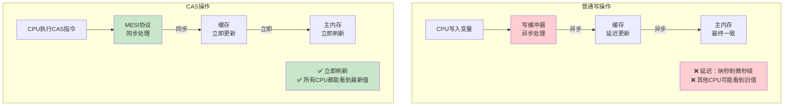
```mermaid
graph TB
    subgraph "普通写操作"
        NormalWrite[CPU写入变量]
        NormalSB[写缓冲器<br/>异步处理]
        NormalCache[缓存<br/>延迟更新]
        NormalMem[主内存<br/>最终一致]
        
        NormalWrite --> NormalSB
        NormalSB -->|异步| NormalCache
        NormalCache -->|异步| NormalMem
        
        Note1["❌ 延迟：纳秒到微秒级<br/>❌ 其他CPU可能看到旧值"]
    end
    
    subgraph "CAS操作"
        CASWrite[CPU执行CAS指令]
        CASMESI[MESI协议<br/>同步处理]
        CASCache[缓存<br/>立即更新]
        CASMem[主内存<br/>立即刷新]
        
        CASWrite --> CASMESI
        CASMESI -->|同步| CASCache
        CASCache -->|立即| CASMem
        
        Note2["✅ 立即刷新<br/>✅ 所有CPU都能看到最新值"]
    end
    
    style NormalSB fill:#ffcdd2
    style Note1 fill:#ffcdd2
    style CASMESI fill:#c8e6c9
    style Note2 fill:#c8e6c9
```

**关键理解：**

1. **CAS是特殊指令**：CPU专门为CAS操作设计的指令，可以绕过写缓冲器
2. **同步刷新**：CAS操作会同步等待失效队列处理完成，然后立即刷新到主内存
3. **全局可见性**：CAS操作完成后，所有CPU都能立即看到最新的值
4. **性能权衡**：CAS操作虽然比普通写操作慢，但保证了可见性和原子性

### 1.2 CAS 核心思想

CAS 操作包含三个操作数：
- **内存位置（V）**：要更新的变量
- **期望值（A）**：变量当前应该的值
- **新值（B）**：要设置的新值

**操作逻辑**：
```
如果 V == A，则将 V 更新为 B，返回 true
否则，不更新，返回 false
```

**CAS 的原子性保证：**

CAS 操作的原子性是通过硬件级别的指令保证的。当 CPU 执行 CAS 指令时：

1. **原子读取**：读取内存位置的当前值（V）
2. **原子比较**：将读取的值与期望值（A）进行比较
3. **原子更新**：如果相等，原子地更新为新值（B）

整个操作在**一个CPU指令周期内完成**，不会被其他CPU中断，从而保证了原子性。

**CAS 与缓存一致性的关系：**

```mermaid
sequenceDiagram
    participant CPU as CPU核心
    participant Cache as L1缓存
    participant MESI as MESI协议
    participant OtherCPU as 其他CPU核心
    participant Memory as 主内存
    
    Note over CPU: 执行CAS指令
    CPU->>Cache: 读取当前值V
    Cache->>Memory: 如果缓存未命中，加载
    
    CPU->>CPU: 比较 V == A?
    
    alt V == A（相等）
        CPU->>MESI: 发送独占请求（Exclusive）
        MESI->>OtherCPU: 无效化其他CPU的缓存行
        OtherCPU-->>MESI: 确认无效化
        MESI->>Memory: 锁定内存位置
        CPU->>Cache: 原子更新V = B
        Cache->>Memory: 立即刷新到主内存
        MESI->>Memory: 释放锁定
        CPU-->>CPU: 返回true（成功）
    else V != A（不相等）
        CPU-->>CPU: 返回false（失败）
        Note over CPU: 不更新值，不锁定内存
    end
```

**CAS 如何解决我们前面提到的问题：**

1. **解决丢失更新问题**：
   - CAS 的原子性保证"读取-比较-更新"不会被其他线程中断
   - 即使多个线程同时执行CAS，也只有一个会成功

2. **解决可见性问题**：
   - CAS 操作会触发缓存一致性协议，确保更新立即对所有CPU可见
   - 不需要等待写缓冲器异步提交

3. **解决原子性问题**：
   - 硬件级别的原子指令，不受指令重排序影响
   - 保证了操作的不可分割性

### 1.3 CAS 操作流程

```mermaid
flowchart TD
    Start[开始CAS操作]
    Read[读取内存位置V的当前值]
    Compare{V == A?}
    Update[CAS原子指令更新]
    Success[返回true]
    Fail[返回false]
    Retry[重试或放弃]
    
    Start --> Read
    Read --> Compare
    Compare -->|是| Update
    Compare -->|否| Fail
    Update --> Success
    Fail --> Retry
    Retry -->|重试| Read
    Retry -->|放弃| End[结束]
    Success --> End
    
    style Compare fill:#fff9c4
    style Update fill:#c8e6c9
    style Success fill:#c8e6c9
    style Fail fill:#ffcdd2
```

## 2. CAS 底层实现原理

### 2.1 硬件支持

CAS 操作依赖于 CPU 提供的原子指令，不同架构的实现方式：

```mermaid
graph TB
    CAS[CAS操作]
    X86[x86架构<br/>CMPXCHG指令]
    ARM[ARM架构<br/>LDREX/STREX指令]
    MIPS[MIPS架构<br/>LL/SC指令]
    
    CAS --> X86
    CAS --> ARM
    CAS --> MIPS
    
    X86 --> CPU[CPU原子指令]
    ARM --> CPU
    MIPS --> CPU
    
    CPU --> Memory[内存总线锁定<br/>或缓存一致性协议]
    
    style CAS fill:#e1f5ff
    style CPU fill:#ffebee
    style Memory fill:#e8f5e9
```

### 2.2 CPU 原子指令执行过程

```mermaid
sequenceDiagram
    participant CPU as CPU核心
    participant Cache as L1缓存
    participant Bus as 内存总线
    participant Memory as 主内存
    participant OtherCPU as 其他CPU核心
    
    Note over CPU: 执行CAS指令
    CPU->>Cache: 读取内存位置值
    Cache->>Memory: 如果缓存未命中，从内存加载
    
    alt 缓存命中
        Cache-->>CPU: 返回当前值
    else 缓存未命中
        Memory-->>Cache: 加载数据到缓存
        Cache-->>CPU: 返回当前值
    end
    
    CPU->>CPU: 比较当前值与期望值
    
    alt 值匹配
        Note over CPU: 锁定缓存行/总线
        CPU->>Bus: 发送锁定信号
        Bus->>OtherCPU: 通知其他CPU核心
        OtherCPU-->>Bus: 确认
        CPU->>Cache: 原子更新值
        Cache->>Memory: 写回内存
        CPU->>Bus: 释放锁定
        Note over CPU: CAS成功
    else 值不匹配
        Note over CPU: CAS失败
    end
```

### 2.3 缓存一致性协议（MESI）

现代多核 CPU 使用缓存一致性协议确保多核之间的数据一致性：

```mermaid
stateDiagram-v2
    [*] --> Modified: 当前CPU修改
    [*] --> Exclusive: 当前CPU独占
    [*] --> Shared: 多个CPU共享
    [*] --> Invalid: 缓存无效
    
    Modified --> Shared: 其他CPU读取
    Modified --> Invalid: 其他CPU写入
    Modified --> [*]: 写回内存
    
    Exclusive --> Modified: 当前CPU写入
    Exclusive --> Shared: 其他CPU读取
    Exclusive --> Invalid: 其他CPU写入
    
    Shared --> Modified: 当前CPU写入
    Shared --> Invalid: 其他CPU写入
    
    Invalid --> Exclusive: 当前CPU读取（其他CPU无缓存）
    Invalid --> Shared: 当前CPU读取（其他CPU有缓存）
    Invalid --> Modified: 当前CPU写入
```

**MESI 状态说明**：
- **Modified (M)**：缓存行已被修改，与主内存不一致
- **Exclusive (E)**：缓存行只被当前 CPU 缓存，未被修改
- **Shared (S)**：缓存行被多个 CPU 共享，与主内存一致
- **Invalid (I)**：缓存行无效，需要重新加载

### 2.4 CAS 在缓存一致性中的作用

```mermaid
sequenceDiagram
    participant CPU1 as CPU1
    participant CPU2 as CPU2
    participant Cache1 as CPU1缓存
    participant Cache2 as CPU2缓存
    participant Bus as 总线
    participant Memory as 主内存
    
    Note over CPU1: 执行CAS操作
    CPU1->>Cache1: 读取变量值（期望值A）
    Cache1->>Memory: 加载数据（如果未命中）
    Memory-->>Cache1: 返回A
    Cache1-->>CPU1: 值A
    
    Note over CPU1: 准备更新为B
    CPU1->>Bus: 发送独占请求（Exclusive）
    Bus->>Cache2: 检查其他CPU缓存
    Cache2-->>Bus: 无效化缓存行（如果存在）
    Bus-->>CPU1: 授予独占权限
    
    CPU1->>Cache1: 原子更新为B
    Cache1->>Memory: 写回内存
    Cache1-->>CPU1: CAS成功
    
    Note over CPU2: 稍后读取同一变量
    CPU2->>Cache2: 读取变量
    Cache2->>Bus: 发送共享请求（Shared）
    Bus->>Cache1: 检查CPU1缓存
    Cache1-->>Bus: 数据已修改，状态为Modified
    Cache1->>Memory: 写回最新值B
    Bus->>Cache2: 从内存加载值B
    Cache2-->>CPU2: 返回最新值B
```

## 3. Java 中的 CAS 实现

### 3.1 Unsafe 类

Java 通过 `sun.misc.Unsafe` 类提供 CAS 操作，该类包含多个 CAS 方法：

```java
public final native boolean compareAndSwapObject(Object o, long offset, 
                                                 Object expected, Object x);
public final native boolean compareAndSwapInt(Object o, long offset, 
                                              int expected, int x);
public final native boolean compareAndSwapLong(Object o, long offset, 
                                                long expected, long x);
```

### 3.2 Atomic 类实现

```mermaid
classDiagram
    class AtomicInteger {
        -volatile int value
        +get() int
        +set(newValue) void
        +compareAndSet(expect, update) boolean
        +getAndIncrement() int
        +incrementAndGet() int
    }
    
    class Unsafe {
        <<native>>
        +compareAndSwapInt(obj, offset, expect, update) boolean
        +objectFieldOffset(field) long
    }
    
    class FieldOffsetUpdater {
        +getFieldOffset() long
    }
    
    AtomicInteger --> Unsafe : uses
    AtomicInteger --> FieldOffsetUpdater : uses
    
    note for AtomicInteger "value字段使用volatile保证可见性<br/>CAS操作通过Unsafe实现"
```

### 3.3 CAS 操作示例

```java
public class AtomicInteger {
    private static final Unsafe unsafe = Unsafe.getUnsafe();
    private static final long valueOffset; // value字段的内存偏移量
    
    static {
        try {
            valueOffset = unsafe.objectFieldOffset
                (AtomicInteger.class.getDeclaredField("value"));
        } catch (Exception ex) { throw new Error(ex); }
    }
    
    private volatile int value;
    
    public final boolean compareAndSet(int expect, int update) {
        return unsafe.compareAndSwapInt(this, valueOffset, expect, update);
    }
    
    public final int getAndIncrement() {
        return unsafe.getAndAddInt(this, valueOffset, 1);
    }
}
```

### 3.4 CAS 自旋实现

```mermaid
flowchart TD
    Start[开始自旋CAS]
    Read[读取当前值]
    Calc[计算新值]
    CAS[执行CAS操作]
    Result{CAS成功?}
    Success[返回新值]
    Fail[检查重试条件]
    Retry{是否重试?}
    Spin[自旋等待]
    GiveUp[放弃/抛出异常]
    
    Start --> Read
    Read --> Calc
    Calc --> CAS
    CAS --> Result
    Result -->|是| Success
    Result -->|否| Fail
    Fail --> Retry
    Retry -->|是| Spin
    Retry -->|否| GiveUp
    Spin --> Read
    
    style CAS fill:#ffebee
    style Result fill:#fff9c4
    style Success fill:#c8e6c9
```

## 4. JVM 内存模型（JMM）

### 4.1 JMM 概述

Java 内存模型（Java Memory Model, JMM）定义了 Java 程序中变量访问的规则，确保多线程环境下的内存可见性和操作的有序性。

### 4.2 JVM 内存结构

```mermaid
graph TB
    subgraph "JVM内存结构"
        subgraph "线程私有区域"
            PC[程序计数器<br/>Program Counter]
            VMStack[虚拟机栈<br/>VM Stack]
            NativeStack[本地方法栈<br/>Native Method Stack]
        end
        
        subgraph "线程共享区域"
            Heap[堆内存<br/>Heap]
            MethodArea[方法区<br/>Method Area]
            DirectMemory[直接内存<br/>Direct Memory]
        end
    end
    
    subgraph "堆内存详细结构"
        YoungGen[新生代<br/>Young Generation]
        OldGen[老年代<br/>Old Generation]
        
        subgraph "新生代"
            Eden[Eden区]
            S0[Survivor 0]
            S1[Survivor 1]
        end
    end
    
    Heap --> YoungGen
    Heap --> OldGen
    YoungGen --> Eden
    YoungGen --> S0
    YoungGen --> S1
    
    style PC fill:#e3f2fd
    style VMStack fill:#e3f2fd
    style Heap fill:#ffebee
    style MethodArea fill:#e8f5e9
```

### 4.3 线程内存模型

```mermaid
graph LR
    subgraph "主内存 Main Memory"
        SharedVar[共享变量<br/>volatile/非volatile]
    end
    
    subgraph "线程1 Thread1"
        T1Reg[寄存器<br/>Register]
        T1Cache[工作内存<br/>Working Memory]
        T1CPU[CPU缓存]
    end
    
    subgraph "线程2 Thread2"
        T2Reg[寄存器<br/>Register]
        T2Cache[工作内存<br/>Working Memory]
        T2CPU[CPU缓存]
    end
    
    SharedVar <-->|load/store| T1Cache
    SharedVar <-->|load/store| T2Cache
    T1Cache <--> T1Reg
    T1Cache <--> T1CPU
    T2Cache <--> T2Reg
    T2Cache <--> T2CPU
    
    style SharedVar fill:#ffebee
    style T1Cache fill:#e1f5ff
    style T2Cache fill:#fff4e1
```

### 4.4 内存可见性问题

```mermaid
sequenceDiagram
    participant T1 as 线程1
    participant WM1 as 线程1工作内存
    participant MM as 主内存
    participant WM2 as 线程2工作内存
    participant T2 as 线程2
    
    Note over T1: flag = false (初始值)
    T1->>WM1: 读取flag到工作内存
    WM1->>MM: load操作（从主内存加载）
    MM-->>WM1: flag = false
    WM1-->>T1: flag = false
    
    Note over T1: 修改flag = true
    T1->>WM1: 写入flag = true
    WM1->>WM1: 更新工作内存（但未刷新到主内存）
    
    Note over T2: 读取flag
    T2->>WM2: 读取flag
    WM2->>MM: load操作
    MM-->>WM2: flag = false（旧值！）
    WM2-->>T2: flag = false（读取到旧值）
    
    Note over T1: 稍后刷新到主内存
    WM1->>MM: store操作（刷新到主内存）
    MM->>MM: flag = true
    
    Note over T2: 再次读取
    T2->>WM2: 重新读取flag
    WM2->>MM: load操作
    MM-->>WM2: flag = true（新值）
    WM2-->>T2: flag = true
```

### 4.5 volatile 关键字

`volatile` 关键字确保变量的可见性和有序性：

```mermaid
graph TB
    subgraph "volatile变量操作"
        Read[读取volatile变量]
        Write[写入volatile变量]
    end
    
    subgraph "内存屏障 Memory Barrier"
        LoadBarrier[Load Barrier<br/>读屏障]
        StoreBarrier[Store Barrier<br/>写屏障]
    end
    
    subgraph "效果"
        Visibility[可见性保证<br/>立即刷新到主内存]
        Ordering[有序性保证<br/>禁止指令重排序]
    end
    
    Read --> LoadBarrier
    Write --> StoreBarrier
    LoadBarrier --> Visibility
    StoreBarrier --> Visibility
    LoadBarrier --> Ordering
    StoreBarrier --> Ordering
    
    style Read fill:#e1f5ff
    style Write fill:#fff4e1
    style Visibility fill:#c8e6c9
    style Ordering fill:#c8e6c9
```

### 4.6 happens-before 规则

JMM 通过 happens-before 规则定义操作之间的可见性关系：

```mermaid
graph TB
    subgraph "happens-before规则"
        Rule1["程序顺序规则<br/>同一线程内顺序执行"]
        Rule2["volatile规则<br/>volatile写happens-before后续读"]
        Rule3["锁规则<br/>解锁happens-before加锁"]
        Rule4["传递性规则<br/>A→B, B→C 则 A→C"]
        Rule5["线程启动规则<br/>start() happens-before run()"]
        Rule6["线程终止规则<br/>run() happens-before join()"]
    end
    
    Rule1 --> Visibility["保证可见性"]
    Rule2 --> Visibility
    Rule3 --> Visibility
    Rule4 --> Visibility
    Rule5 --> Visibility
    Rule6 --> Visibility
    
    style Visibility fill:#c8e6c9
```

### 4.7 CAS 与 JMM 的关系

```mermaid
graph TB
    CAS[CAS操作]
    Volatile[volatile变量]
    MemoryBarrier[内存屏障]
    JMM[JMM规则]
    
    CAS --> Volatile
    CAS --> MemoryBarrier
    Volatile --> JMM
    MemoryBarrier --> JMM
    
    JMM --> Visibility[可见性]
    JMM --> Atomicity[原子性]
    JMM --> Ordering[有序性]
    
    style CAS fill:#e1f5ff
    style JMM fill:#ffebee
    style Visibility fill:#c8e6c9
    style Atomicity fill:#c8e6c9
    style Ordering fill:#c8e6c9
```

## 5. mmap 内存映射

### 5.1 mmap 概述

`mmap`（memory mapping）是一种将文件或设备映射到进程地址空间的内存映射机制，允许程序像访问内存一样访问文件。

### 5.2 mmap 工作原理

```mermaid
graph TB
    subgraph "进程虚拟地址空间"
        VAddr1[虚拟地址1]
        VAddr2[虚拟地址2]
        VAddr3[虚拟地址3]
    end
    
    subgraph "页表 Page Table"
        PT1[页表项1]
        PT2[页表项2]
        PT3[页表项3]
    end
    
    subgraph "物理内存/文件"
        Page1[物理页1/文件块1]
        Page2[物理页2/文件块2]
        Page3[物理页3/文件块3]
    end
    
    VAddr1 --> PT1
    VAddr2 --> PT2
    VAddr3 --> PT3
    
    PT1 --> Page1
    PT2 --> Page2
    PT3 --> Page3
    
    style VAddr1 fill:#e1f5ff
    style PT1 fill:#fff9c4
    style Page1 fill:#c8e6c9
```

### 5.3 mmap 映射类型

```mermaid
graph LR
    subgraph "mmap映射类型"
        Private[私有映射<br/>MAP_PRIVATE<br/>写时复制]
        Shared[共享映射<br/>MAP_SHARED<br/>多进程共享]
    end
    
    subgraph "映射对象"
        File[文件映射]
        Anonymous[匿名映射<br/>MAP_ANONYMOUS]
    end
    
    Private --> File
    Private --> Anonymous
    Shared --> File
    Shared --> Anonymous
    
    style Private fill:#e1f5ff
    style Shared fill:#fff4e1
```

### 5.4 mmap 执行流程

```mermaid
sequenceDiagram
    participant App as 应用程序
    participant Kernel as 内核
    participant VMA as 虚拟内存区域
    participant PageTable as 页表
    participant FileSystem as 文件系统
    participant Disk as 磁盘
    
    App->>Kernel: mmap(file, size, prot, flags)
    Kernel->>VMA: 创建虚拟内存区域
    Kernel->>PageTable: 建立页表项（初始未映射）
    Kernel-->>App: 返回映射地址
    
    Note over App: 访问映射内存
    App->>PageTable: 访问虚拟地址
    PageTable->>Kernel: 页错误（Page Fault）
    Kernel->>FileSystem: 读取文件对应块
    FileSystem->>Disk: 从磁盘读取数据
    Disk-->>FileSystem: 返回数据
    FileSystem->>Kernel: 加载到物理页
    Kernel->>PageTable: 更新页表项
    PageTable-->>App: 返回数据
    
    Note over App: 修改数据（MAP_SHARED）
    App->>PageTable: 写入数据
    PageTable->>Kernel: 标记页面为脏页
    Kernel->>FileSystem: 异步写回文件
    FileSystem->>Disk: 写入磁盘
```

### 5.5 mmap 与普通文件 I/O 对比

```mermaid
graph TB
    subgraph "普通文件I/O"
        Read1[read系统调用]
        Buffer1[用户空间缓冲区]
        Kernel1[内核缓冲区]
        Disk1[磁盘]
        
        Read1 --> Buffer1
        Buffer1 --> Kernel1
        Kernel1 --> Disk1
    end
    
    subgraph "mmap文件映射"
        Mmap[mmap系统调用]
        VMA[虚拟内存区域]
        PageCache[页缓存]
        Disk2[磁盘]
        
        Mmap --> VMA
        VMA --> PageCache
        PageCache --> Disk2
    end
    
    style Read1 fill:#ffcdd2
    style Mmap fill:#c8e6c9
```

**对比优势**：
- **减少数据拷贝**：mmap 直接映射到用户空间，避免内核缓冲区到用户缓冲区的拷贝
- **共享内存**：多个进程可以共享同一映射区域
- **延迟加载**：按需加载，只有访问时才从磁盘读取

### 5.6 mmap 在 Java 中的应用

Java 中通过 `MappedByteBuffer` 使用 mmap：

```mermaid
classDiagram
    class FileChannel {
        +map(mode, position, size) MappedByteBuffer
    }
    
    class MappedByteBuffer {
        +get() byte
        +put(byte) MappedByteBuffer
        +force() void
        +load() MappedByteBuffer
    }
    
    class DirectByteBuffer {
        -long address
        -FileDescriptor fd
    }
    
    FileChannel --> MappedByteBuffer : creates
    MappedByteBuffer <|-- DirectByteBuffer : extends
    
    note for MappedByteBuffer "使用mmap映射文件到内存<br/>支持READ_ONLY, READ_WRITE, PRIVATE模式"
```

### 5.7 mmap 内存布局

```mermaid
graph TB
    subgraph "进程虚拟地址空间"
        Stack[栈空间<br/>向下增长]
        Heap[堆空间<br/>向上增长]
        Mmap[Mmap映射区域<br/>文件/共享内存]
        Code[代码段]
    end
    
    subgraph "物理内存"
        PhysicalPage1[物理页1]
        PhysicalPage2[物理页2]
        PhysicalPage3[物理页3]
    end
    
    subgraph "页缓存"
        PageCache[页缓存<br/>Page Cache]
    end
    
    Mmap --> PhysicalPage1
    Mmap --> PhysicalPage2
    Mmap --> PhysicalPage3
    
    PhysicalPage1 --> PageCache
    PhysicalPage2 --> PageCache
    PhysicalPage3 --> PageCache
    
    style Mmap fill:#e1f5ff
    style PageCache fill:#fff9c4
```

## 6. CAS、JMM 与 mmap 的关系

### 6.1 三者关系图

```mermaid
graph TB
    subgraph "并发编程层面"
        CAS[CAS操作<br/>原子性保证]
        JMM[JMM内存模型<br/>可见性/有序性]
    end
    
    subgraph "内存管理层面"
        MMAP[mmap<br/>内存映射]
        VirtualMemory[虚拟内存]
        PhysicalMemory[物理内存]
    end
    
    subgraph "硬件层面"
        CPU[CPU原子指令]
        Cache[CPU缓存]
        MemoryBus[内存总线]
    end
    
    CAS --> CPU
    JMM --> Cache
    MMAP --> VirtualMemory
    
    CPU --> Cache
    Cache --> MemoryBus
    MemoryBus --> PhysicalMemory
    
    VirtualMemory --> PhysicalMemory
    
    style CAS fill:#e1f5ff
    style JMM fill:#fff4e1
    style MMAP fill:#c8e6c9
```

### 6.2 CAS 在 mmap 场景中的应用

当使用 mmap 映射共享内存时，CAS 可以用于多进程间的同步：

```mermaid
sequenceDiagram
    participant P1 as 进程1
    participant P2 as 进程2
    participant MMAP as mmap共享内存
    participant CAS as CAS操作
    
    Note over P1: 尝试获取锁
    P1->>MMAP: 读取锁变量
    P1->>CAS: compareAndSet(0, 1)
    CAS->>MMAP: 原子更新锁变量
    MMAP-->>CAS: 成功
    CAS-->>P1: 获取锁成功
    
    Note over P2: 尝试获取锁
    P2->>MMAP: 读取锁变量
    P2->>CAS: compareAndSet(0, 1)
    CAS->>MMAP: 尝试原子更新
    MMAP-->>CAS: 失败（值已为1）
    CAS-->>P2: 获取锁失败
    
    Note over P1: 释放锁
    P1->>CAS: compareAndSet(1, 0)
    CAS->>MMAP: 原子更新锁变量
    MMAP-->>CAS: 成功
    
    Note over P2: 再次尝试
    P2->>MMAP: 读取锁变量
    P2->>CAS: compareAndSet(0, 1)
    CAS->>MMAP: 原子更新锁变量
    MMAP-->>CAS: 成功
    CAS-->>P2: 获取锁成功
```

## 7. CAS 的优缺点

### 7.1 优点

1. **无锁编程**：避免线程阻塞和上下文切换
2. **高性能**：硬件级别的原子操作，性能优于锁
3. **无死锁**：不存在锁竞争导致的死锁问题
4. **可扩展性**：适合高并发场景

### 7.2 缺点

1. **ABA 问题**：值从 A 变为 B 再变回 A，CAS 无法检测
2. **自旋开销**：高竞争时可能导致 CPU 空转
3. **只能保证一个变量**：无法保证多个变量的原子性
4. **实现复杂**：复杂逻辑使用 CAS 可能难以理解和维护

### 7.3 ABA 问题示例

```mermaid
sequenceDiagram
    participant T1 as 线程1
    participant T2 as 线程2
    participant Memory as 共享内存
    
    Note over T1: 读取值A
    T1->>Memory: 读取变量值 = A
    Memory-->>T1: A
    
    Note over T2: 修改为B
    T2->>Memory: CAS(A, B)
    Memory-->>T2: 成功，值 = B
    
    Note over T2: 修改回A
    T2->>Memory: CAS(B, A)
    Memory-->>T2: 成功，值 = A
    
    Note over T1: 执行CAS操作
    T1->>Memory: CAS(A, C)
    Memory-->>T1: 成功（但值可能已被修改过！）
    
    Note over T1: ABA问题：CAS认为值未变，<br/>但实际上经历了A→B→A的变化
```

**解决方案**：使用版本号或时间戳（如 `AtomicStampedReference`）

### 7.3.2 使用版本号解决 ABA 问题

#### 方案一：AtomicStampedReference（推荐）

`AtomicStampedReference` 使用版本号（stamp）来标记每次修改，即使值相同，版本号也会递增。

```java
import java.util.concurrent.atomic.AtomicStampedReference;

public class ABAProblemSolution {
    // 使用 AtomicStampedReference，初始值为 100，版本号为 0
    private static AtomicStampedReference<Integer> atomicRef = 
        new AtomicStampedReference<>(100, 0);
    
    public static void main(String[] args) throws InterruptedException {
        Thread t1 = new Thread(() -> {
            try {
                // 线程1：读取当前值和版本号
                int[] stampHolder = new int[1];
                int expectedValue = atomicRef.get(stampHolder);
                int expectedStamp = stampHolder[0];
                
                System.out.println("T1: 读取值 = " + expectedValue + ", 版本号 = " + expectedStamp);
                
                // 模拟线程1被阻塞
                Thread.sleep(2000);
                
                // 尝试CAS更新：期望值=100，新值=200，期望版本号=0
                boolean success = atomicRef.compareAndSet(
                    expectedValue,  // 期望值
                    200,            // 新值
                    expectedStamp,  // 期望版本号
                    expectedStamp + 1  // 新版本号
                );
                
                System.out.println("T1: CAS结果 = " + success);
                if (success) {
                    System.out.println("T1: 更新成功，新值 = " + atomicRef.getReference() + 
                                     ", 版本号 = " + atomicRef.getStamp());
                } else {
                    System.out.println("T1: 更新失败，当前值 = " + atomicRef.getReference() + 
                                     ", 版本号 = " + atomicRef.getStamp());
                }
            } catch (InterruptedException e) {
                e.printStackTrace();
            }
        });
        
        Thread t2 = new Thread(() -> {
            try {
                // 线程2：修改值 100 -> 200
                int[] stampHolder = new int[1];
                int currentValue = atomicRef.get(stampHolder);
                int currentStamp = stampHolder[0];
                
                System.out.println("T2: 读取值 = " + currentValue + ", 版本号 = " + currentStamp);
                
                // T2修改：100 -> 200，版本号 0 -> 1
                boolean success1 = atomicRef.compareAndSet(100, 200, 0, 1);
                System.out.println("T2: 第一次CAS (100->200) = " + success1);
                System.out.println("T2: 当前值 = " + atomicRef.getReference() + 
                                 ", 版本号 = " + atomicRef.getStamp());
                
                Thread.sleep(500);
                
                // T2修改回：200 -> 100，版本号 1 -> 2
                boolean success2 = atomicRef.compareAndSet(200, 100, 1, 2);
                System.out.println("T2: 第二次CAS (200->100) = " + success2);
                System.out.println("T2: 当前值 = " + atomicRef.getReference() + 
                                 ", 版本号 = " + atomicRef.getStamp());
            } catch (InterruptedException e) {
                e.printStackTrace();
            }
        });
        
        t1.start();
        t2.start();
        
        t1.join();
        t2.join();
    }
}
```

**输出结果：**
```
T1: 读取值 = 100, 版本号 = 0
T2: 读取值 = 100, 版本号 = 0
T2: 第一次CAS (100->200) = true
T2: 当前值 = 200, 版本号 = 1
T2: 第二次CAS (200->100) = true
T2: 当前值 = 100, 版本号 = 2
T1: CAS结果 = false  ← 关键：虽然值还是100，但版本号变了（0→2），所以CAS失败
T1: 更新失败，当前值 = 100, 版本号 = 2
```

**关键点：**
- 虽然值从 100 → 200 → 100，看起来没变
- 但版本号从 0 → 1 → 2，已经改变了
- T1 的 CAS 操作期望版本号是 0，但实际版本号是 2，所以失败
- **成功避免了 ABA 问题！**

#### 方案二：AtomicMarkableReference

`AtomicMarkableReference` 使用布尔标记来标记值是否被修改过，适合只需要知道"是否被修改"的场景。

```java
import java.util.concurrent.atomic.AtomicMarkableReference;

public class ABAProblemSolutionWithMark {
    // 使用 AtomicMarkableReference，初始值为 100，标记为 false
    private static AtomicMarkableReference<Integer> atomicRef = 
        new AtomicMarkableReference<>(100, false);
    
    public static void main(String[] args) throws InterruptedException {
        Thread t1 = new Thread(() -> {
            try {
                // 线程1：读取当前值和标记
                boolean[] markHolder = new boolean[1];
                int expectedValue = atomicRef.get(markHolder);
                boolean expectedMark = markHolder[0];
                
                System.out.println("T1: 读取值 = " + expectedValue + ", 标记 = " + expectedMark);
                
                Thread.sleep(2000);
                
                // 尝试CAS更新：期望值=100，新值=200，期望标记=false，新标记=true
                boolean success = atomicRef.compareAndSet(
                    expectedValue,  // 期望值
                    200,            // 新值
                    expectedMark,   // 期望标记
                    true            // 新标记
                );
                
                System.out.println("T1: CAS结果 = " + success);
            } catch (InterruptedException e) {
                e.printStackTrace();
            }
        });
        
        Thread t2 = new Thread(() -> {
            try {
                // 线程2：修改值并改变标记
                boolean[] markHolder = new boolean[1];
                int currentValue = atomicRef.get(markHolder);
                
                // T2修改：100 -> 200，标记 false -> true
                atomicRef.compareAndSet(100, 200, false, true);
                System.out.println("T2: 第一次CAS (100->200, false->true)");
                
                Thread.sleep(500);
                
                // T2修改回：200 -> 100，标记 true -> false
                atomicRef.compareAndSet(200, 100, true, false);
                System.out.println("T2: 第二次CAS (200->100, true->false)");
            } catch (InterruptedException e) {
                e.printStackTrace();
            }
        });
        
        t1.start();
        t2.start();
        
        t1.join();
        t2.join();
    }
}
```

#### 方案三：自定义版本号实现

如果不想使用 `AtomicStampedReference`，也可以自己实现版本号机制：

```java
import java.util.concurrent.atomic.AtomicReference;

public class CustomVersionedReference<T> {
    // 内部类：包装值和版本号
    private static class VersionedValue<T> {
        final T value;
        final int version;
        
        VersionedValue(T value, int version) {
            this.value = value;
            this.version = version;
        }
        
        @Override
        public boolean equals(Object o) {
            if (this == o) return true;
            if (o == null || getClass() != o.getClass()) return false;
            VersionedValue<?> that = (VersionedValue<?>) o;
            return version == that.version && value.equals(that.value);
        }
    }
    
    private final AtomicReference<VersionedValue<T>> ref;
    
    public CustomVersionedReference(T initialValue) {
        this.ref = new AtomicReference<>(new VersionedValue<>(initialValue, 0));
    }
    
    public T getValue() {
        return ref.get().value;
    }
    
    public int getVersion() {
        return ref.get().version;
    }
    
    public boolean compareAndSet(T expectedValue, T newValue, int expectedVersion) {
        VersionedValue<T> current = ref.get();
        
        // 同时比较值和版本号
        if (current.value.equals(expectedValue) && current.version == expectedVersion) {
            VersionedValue<T> newVersioned = new VersionedValue<>(newValue, expectedVersion + 1);
            return ref.compareAndSet(current, newVersioned);
        }
        
        return false;
    }
    
    public void set(T newValue) {
        VersionedValue<T> current = ref.get();
        ref.set(new VersionedValue<>(newValue, current.version + 1));
    }
    
    // 使用示例
    public static void main(String[] args) {
        CustomVersionedReference<Integer> ref = new CustomVersionedReference<>(100);
        
        System.out.println("初始值 = " + ref.getValue() + ", 版本号 = " + ref.getVersion());
        
        // 第一次更新
        boolean success1 = ref.compareAndSet(100, 200, 0);
        System.out.println("CAS(100->200, v0) = " + success1);
        System.out.println("当前值 = " + ref.getValue() + ", 版本号 = " + ref.getVersion());
        
        // 第二次更新（值改回100，但版本号已变）
        boolean success2 = ref.compareAndSet(200, 100, 1);
        System.out.println("CAS(200->100, v1) = " + success2);
        System.out.println("当前值 = " + ref.getValue() + ", 版本号 = " + ref.getVersion());
        
        // 尝试用旧版本号更新（会失败）
        boolean success3 = ref.compareAndSet(100, 300, 0);  // 版本号不匹配
        System.out.println("CAS(100->300, v0) = " + success3 + " ← 失败，版本号不匹配");
        System.out.println("当前值 = " + ref.getValue() + ", 版本号 = " + ref.getVersion());
    }
}
```

**输出：**
```
初始值 = 100, 版本号 = 0
CAS(100->200, v0) = true
当前值 = 200, 版本号 = 1
CAS(200->100, v1) = true
当前值 = 100, 版本号 = 2
CAS(100->300, v0) = false ← 失败，版本号不匹配
当前值 = 100, 版本号 = 2
```

#### 版本号机制的工作原理

```mermaid
sequenceDiagram
    participant T1 as 线程1
    participant Ref as AtomicStampedReference
    participant T2 as 线程2
    
    Note over Ref: 初始：值=100, 版本号=0
    
    T1->>Ref: get() → 值=100, 版本号=0
    Note over T1: 保存：期望值=100, 期望版本号=0
    
    T2->>Ref: CAS(100, 200, 0, 1)
    Ref-->>T2: 成功
    Note over Ref: 当前：值=200, 版本号=1
    
    T2->>Ref: CAS(200, 100, 1, 2)
    Ref-->>T2: 成功
    Note over Ref: 当前：值=100, 版本号=2
    
    T1->>Ref: CAS(100, 300, 0, 1)
    Note over Ref: 检查：值=100 ✓, 版本号=2 ✗
    Ref-->>T1: 失败（版本号不匹配）
    
    Note over T1: ABA问题被避免！<br/>虽然值相同，但版本号已变
```

**总结：**

1. **AtomicStampedReference**：使用整数版本号，每次修改版本号递增
2. **AtomicMarkableReference**：使用布尔标记，适合只需要知道"是否被修改"的场景
3. **自定义实现**：可以自己实现版本号机制，更灵活但需要自己保证线程安全

**关键优势：**
- ✅ 即使值相同，版本号也会变化
- ✅ CAS 操作同时检查值和版本号
- ✅ 有效避免 ABA 问题
- ✅ 适用于链表、栈等数据结构

## 8. 实际应用场景

### 8.1 计数器实现

```java
public class Counter {
    private AtomicInteger count = new AtomicInteger(0);
    
    public void increment() {
        count.incrementAndGet(); // 内部使用CAS
    }
    
    public int get() {
        return count.get();
    }
}
```

### 8.2 无锁队列

```mermaid
graph LR
    Head[头指针]
    Node1[节点1]
    Node2[节点2]
    Node3[节点3]
    Tail[尾指针]
    
    Head --> Node1
    Node1 --> Node2
    Node2 --> Node3
    Node3 --> Tail
    
    Note1[入队：CAS更新Tail]
    Note2[出队：CAS更新Head]
    
    style Head fill:#e1f5ff
    style Tail fill:#fff4e1
```

### 8.3 自旋锁实现

**基础自旋锁：**

```java
public class SpinLock {
    private AtomicBoolean locked = new AtomicBoolean(false);
    
    /**
     * 获取锁，如果锁已被占用则自旋等待
     * CAS操作：如果RUNNING_FLAG为false，则设置为true并返回true
     * 如果RUNNING_FLAG为true，则返回false，继续循环
     */
    public void lock() {
        // 自旋直到成功获取锁
        while (!locked.compareAndSet(false, true)) {
            // 空循环，CPU空转等待
            // 在高竞争场景下会消耗大量CPU资源
        }
    }
    
    /**
     * 释放锁
     * 将locked设置为false，允许其他线程获取锁
     */
    public void unlock() {
        locked.set(false); // 或使用 compareAndSet(true, false)
    }
    
    /**
     * 尝试获取锁，非阻塞
     * @return true表示获取成功，false表示锁已被占用
     */
    public boolean tryLock() {
        return locked.compareAndSet(false, true);
    }
}
```

**优化版本：带退避的自旋锁**

```java
public class BackoffSpinLock {
    private AtomicBoolean locked = new AtomicBoolean(false);
    
    public void lock() {
        int backoff = 1;  // 初始退避次数为1
        while (!locked.compareAndSet(false, true)) {
            // 指数退避策略，减少CPU占用
            // 这个for循环不是一直循环，而是执行backoff次数的Thread.yield()
            for (int i = 0; i < backoff; i++) {
                Thread.yield(); // 让出CPU时间片，给其他线程执行机会
            }
            // 指数增长退避次数，但限制最大值为1024
            backoff = Math.min(backoff * 2, 1024); // 限制最大退避时间
        }
    }
    
    public void unlock() {
        locked.set(false);
    }
}
```

**指数退避策略的执行流程详解：**

```mermaid
flowchart TD
    Start[开始 lock]
    Init[初始化 backoff = 1]
    TryCAS{尝试 CAS<br/>compareAndSet}
    Success[获取锁成功<br/>退出]
    Fail[CAS失败]
    LoopFor{for循环<br/>i < backoff?}
    Yield[Thread.yield<br/>让出CPU时间片]
    IncI[i++]
    ExitFor[退出for循环]
    Double[backoff *= 2<br/>最多1024]
    NextTry[下次尝试]
    
    Start --> Init
    Init --> TryCAS
    TryCAS -->|成功| Success
    TryCAS -->|失败| Fail
    Fail --> LoopFor
    LoopFor -->|i < backoff| Yield
    Yield --> IncI
    IncI --> LoopFor
    LoopFor -->|i >= backoff| ExitFor
    ExitFor --> Double
    Double --> NextTry
    NextTry --> TryCAS
    
    style Success fill:#c8e6c9
    style Fail fill:#ffcdd2
    style Double fill:#fff9c4
```

**执行过程示例：**

假设线程T1尝试获取锁，但锁一直被T2占用：

```java
// 第1次尝试 CAS
backoff = 1
while (!CAS(false, true)) {  // CAS失败
    // 内层for循环：执行1次Thread.yield()
    for (int i = 0; i < 1; i++) {  // i=0, i<1为true
        Thread.yield();  // 第1次yield
    }  // i++后 i=1, i<1为false，退出for循环
    backoff = Math.min(1 * 2, 1024) = 2;  // backoff翻倍
}

// 第2次尝试 CAS
backoff = 2
while (!CAS(false, true)) {  // CAS失败
    // 内层for循环：执行2次Thread.yield()
    for (int i = 0; i < 2; i++) {  // i=0, i<2为true
        Thread.yield();  // 第1次yield
    }  // i++后 i=1, i<2为true
    Thread.yield();  // 第2次yield
    // i++后 i=2, i<2为false，退出for循环
    backoff = Math.min(2 * 2, 1024) = 4;  // backoff翻倍
}

// 第3次尝试 CAS
backoff = 4
while (!CAS(false, true)) {  // CAS失败
    // 内层for循环：执行4次Thread.yield()
    for (int i = 0; i < 4; i++) {
        Thread.yield();  // 执行4次yield
    }
    backoff = Math.min(4 * 2, 1024) = 8;  // backoff翻倍
}

// ... 以此类推，每次失败后退避时间翻倍
// 直到 CAS 成功，退出while循环
```

**关键理解：**

1. **外层while循环**：会一直循环直到成功获取锁
   - `while (!locked.compareAndSet(false, true))` 
   - 只要CAS失败，就会继续循环
   - 只有CAS成功时，才会退出while循环

2. **内层for循环**：不是一直循环，而是执行固定次数的等待
   - `for (int i = 0; i < backoff; i++)` 
   - 每次循环执行固定次数（backoff次）的Thread.yield()
   - 执行完backoff次后，自动退出for循环

3. **指数退避**：
   - 第1次失败：等待1次yield
   - 第2次失败：等待2次yield（backoff = 2）
   - 第3次失败：等待4次yield（backoff = 4）
   - 第4次失败：等待8次yield（backoff = 8）
   - ...以此类推，最多等待1024次yield

4. **Thread.yield()的作用**：
   - 让出当前线程的CPU时间片
   - 给其他线程（尤其是持有锁的线程）执行机会
   - 减少CPU空转，降低CPU占用率

### 8.3.1 Thread.yield() 的详细工作机制

#### 8.3.1.1 什么是CPU时间片？

**CPU时间片（Time Slice）**是操作系统分配给线程的一个时间段（通常几毫秒到几十毫秒），在这个时间段内，线程可以独占CPU执行。

```mermaid
graph LR
    subgraph "CPU时间片分配"
        T1[线程T1<br/>时间片：10ms]
        T2[线程T2<br/>时间片：10ms]
        T3[线程T3<br/>时间片：10ms]
    end
    
    Scheduler[操作系统调度器]
    
    Scheduler -->|分配| T1
    Scheduler -->|分配| T2
    Scheduler -->|分配| T3
    
    T1 -->|时间片用完| Scheduler
    T2 -->|时间片用完| Scheduler
    T3 -->|时间片用完| Scheduler
    
    style Scheduler fill:#fff9c4
```

#### 8.3.1.2 Thread.yield() 的工作原理

**Thread.yield() 执行后会发生什么：**

1. **主动让出当前时间片**：
   - 当前线程主动放弃剩余的CPU时间片
   - 将线程状态从"运行中"变为"就绪"状态
   - 提示调度器："我现在不想占用CPU，可以先让其他线程执行"

2. **线程调度器的响应**：
   - 调度器收到yield信号后，会重新调度
   - 选择其他就绪的线程执行
   - 当前线程被放入就绪队列，等待下次调度

3. **什么时候还回去**：
   - **立即会被重新调度**：yield() 只是"建议"让出，不是阻塞
   - **线程状态**：从"运行"变为"就绪"，仍然可以立即被调度
   - **调度时机**：取决于操作系统的调度算法，通常是：
     - 当前时间片结束时
     - 其他线程阻塞或yield时
     - 线程优先级更高时
     - 通常在**几微秒到几毫秒**内就会被重新调度

#### 8.3.1.3 Thread.yield() vs Thread.sleep()

```mermaid
sequenceDiagram
    participant T1 as 线程T1
    participant CPU as CPU调度器
    participant T2 as 线程T2
    
    Note over T1: Thread.yield()
    T1->>CPU: yield() - 主动让出
    Note over T1: 状态：运行 → 就绪
    CPU->>T2: 调度T2执行
    Note over CPU: 等待调度时机
    CPU-->>T1: 重新调度（可能立即）
    Note over T1: 继续执行<br/>几乎没有延迟
    
    Note over T1: Thread.sleep(10)
    T1->>CPU: sleep(10) - 主动阻塞
    Note over T1: 状态：运行 → 阻塞（定时）
    CPU->>T2: 调度T2执行
    Note over CPU: 等待至少10ms
    CPU-->>T1: 定时器唤醒（至少10ms后）
    Note over T1: 继续执行<br/>延迟至少10ms
```

**关键区别：**

| 特性 | Thread.yield() | Thread.sleep(n) |
|------|---------------|-----------------|
| **线程状态** | 运行 → 就绪 | 运行 → 阻塞（定时） |
| **是否阻塞** | 否（非阻塞） | 是（阻塞指定时间） |
| **重新调度时机** | 立即可能被调度（几微秒到几毫秒） | 至少等待n毫秒 |
| **可中断性** | 不可中断 | 可中断（InterruptedException） |
| **用途** | 降低CPU占用，给其他线程机会 | 精确等待指定时间 |

#### 8.3.1.4 Thread.yield() 的执行时机示例

**详细时序示例：**

```java
// 场景：线程T1自旋等待锁，线程T2持有锁

// 时刻0ms：T1开始执行
T1: lock() {
    // 时刻1ms：CAS失败，开始退避
    while (!CAS(false, true)) {
        // 时刻1ms：执行Thread.yield()
        Thread.yield();
        
        // Thread.yield() 执行过程：
        // 1. T1主动让出剩余时间片（假设原本有10ms，已用1ms，剩余9ms）
        // 2. T1状态：运行 → 就绪
        // 3. CPU调度器重新调度
        // 4. 调度器选择T2执行（因为T2可能正在等待CPU）
        
        // 时刻1.001ms：T2获得CPU，开始执行
        // T2: 执行临界区代码...
        
        // 时刻5ms：T2的时间片用完了，或T2执行完毕，或T2也yield了
        // 时刻5.001ms：调度器重新调度，T1可能再次获得CPU
        // T1继续执行：backoff *= 2
        
        // 注意：T1可能在几微秒到几毫秒内就重新获得CPU
        // 但具体时间取决于操作系统调度算法和当前系统负载
    }
}
```

**时间片归还的时机：**

```mermaid
sequenceDiagram
    participant T1 as 线程T1（等待锁）
    participant Scheduler as CPU调度器
    participant T2 as 线程T2（持有锁）
    participant T3 as 线程T3（其他）
    
    Note over T1: 执行Thread.yield()
    T1->>Scheduler: yield() - 让出时间片
    Note over T1: 状态：运行 → 就绪<br/>剩余时间片：放弃
    
    Note over Scheduler: 重新调度决策
    
    alt 有高优先级线程
        Scheduler->>T2: 调度T2（持有锁，优先级高）
        Note over T2: 执行临界区代码
        Note over T2: 时间片用完或完成
        T2->>Scheduler: 让出CPU
    else 按时间片轮转
        Scheduler->>T3: 调度T3（轮转调度）
        Note over T3: 执行一段时间
        T3->>Scheduler: 时间片用完
    else 立即轮转回T1
        Scheduler-->>T1: 立即调度T1
        Note over T1: 重新获得CPU<br/>可能只等待几微秒
    end
    
    Note over Scheduler: T1回到就绪队列头部
    Scheduler-->>T1: 重新调度T1
    Note over T1: 继续执行后续代码
```

**实际执行时间示例：**

```java
public class YieldTimingExample {
    public static void main(String[] args) {
        Thread t1 = new Thread(() -> {
            long start = System.nanoTime();
            Thread.yield();  // 让出时间片
            long end = System.nanoTime();
            System.out.println("yield() 后重新执行，耗时: " + (end - start) + " 纳秒");
            // 典型值：几百纳秒到几微秒（0.0001ms - 0.01ms）
        });
        
        Thread t2 = new Thread(() -> {
            // 做一些工作
            for (int i = 0; i < 1000; i++) {
                // 模拟一些计算
            }
        });
        
        t1.start();
        t2.start();
    }
}
```

**关键要点：**

1. **Thread.yield() 不是阻塞**：
   - 线程不会进入阻塞状态
   - 只是建议让出CPU，不是强制等待

2. **立即可能被重新调度**：
   - 调度器可能立即重新调度当前线程
   - 也可能先调度其他线程
   - 取决于调度算法和系统负载

3. **没有时间保证**：
   - 不保证具体等待时间
   - 可能立即恢复，也可能等待几毫秒
   - 不保证其他线程会立即执行

4. **实际效果**：
   - 给其他线程执行机会（但不保证）
   - 降低当前线程的CPU占用
   - 减少自旋带来的CPU浪费

**在自旋锁中的应用：**

```java
while (!locked.compareAndSet(false, true)) {
    Thread.yield();  // 让出CPU，给持有锁的线程执行机会
    // 期望：持有锁的线程能快速执行完，释放锁
    // 实际：可能立即恢复，也可能等待一段时间
    // 但无论如何，都比纯自旋（一直CAS）要好
}
```

**时序图示例：**

```mermaid
sequenceDiagram
    participant T1 as 线程T1（等待锁）
    participant CAS as CAS操作
    participant CPU as CPU调度器
    participant T2 as 线程T2（持有锁）
    
    Note over T1: 尝试获取锁
    T1->>CAS: compareAndSet(false, true)
    CAS-->>T1: 失败（锁被T2占用）
    
    Note over T1: 第1次失败，backoff=1
    T1->>CPU: Thread.yield() (1次)
    CPU->>T2: 调度T2执行
    T2->>T2: 继续执行临界区代码
    CPU-->>T1: 时间片还给T1
    Note over T1: backoff = 2
    
    T1->>CAS: compareAndSet(false, true)
    CAS-->>T1: 失败（锁仍被T2占用）
    
    Note over T1: 第2次失败，backoff=2
    T1->>CPU: Thread.yield() (第1次)
    CPU->>T2: 调度T2执行
    CPU-->>T1: 时间片还给T1
    T1->>CPU: Thread.yield() (第2次)
    CPU->>T2: 调度T2执行
    CPU-->>T1: 时间片还给T1
    Note over T1: backoff = 4
    
    T1->>CAS: compareAndSet(false, true)
    CAS-->>T1: 失败（锁仍被T2占用）
    
    Note over T1: 第3次失败，backoff=4
    loop 执行4次Thread.yield()
        T1->>CPU: Thread.yield()
        CPU->>T2: 调度T2执行
        CPU-->>T1: 时间片还给T1
    end
    Note over T1: backoff = 8
    
    Note over T2: T2释放锁
    T2->>CAS: locked.set(false)
    
    T1->>CAS: compareAndSet(false, true)
    CAS-->>T1: 成功！获取锁
    Note over T1: 退出while循环
```

**为什么使用指数退避？**

1. **减少CPU空转**：
   - 普通自旋锁：一直执行CAS，CPU占用率高
   - 指数退避：等待时间逐渐增加，降低CPU占用

2. **提高锁持有线程的执行机会**：
   - Thread.yield()让出CPU时间片
   - 持有锁的线程有更多机会执行，更快释放锁

3. **平衡性能和资源**：
   - 短等待：锁很快释放时，能快速响应
   - 长等待：锁长时间被占用时，降低CPU占用

**不会一直for循环的原因：**

- 内层for循环有明确的退出条件：`i < backoff`
- 每次循环i都会递增，最终会退出for循环
- 外层while循环只有CAS成功时才会退出
- 如果锁一直被占用，while循环会继续，但每次等待时间会翻倍

**使用示例：**

```java
public class SpinLockExample {
    private SpinLock lock = new SpinLock();
    private int counter = 0;
    
    public void increment() {
        lock.lock();
        try {
            counter++; // 临界区代码
        } finally {
            lock.unlock(); // 确保释放锁
        }
    }
    
    public int getCounter() {
        return counter;
    }
}
```

**自旋锁适用场景：**

1. **锁持有时间短**：临界区执行时间很短（纳秒到微秒级）
2. **低竞争场景**：线程竞争不激烈
3. **多核CPU**：自旋不会浪费CPU资源（其他核心可以执行）

**自旋锁缺点：**

1. **CPU占用高**：在高竞争场景下会消耗大量CPU资源
2. **不公平**：后到的线程可能先获取锁（非公平）
3. **不可重入**：同一线程不能重复获取锁