# Apache DolphinScheduler 项目总结

## 一、项目概述

### 1.1 项目简介

Apache DolphinScheduler 是一个分布式、易扩展的可视化 DAG 工作流任务调度系统。致力于解决数据处理流程中错综复杂的依赖关系，使调度系统在数据处理流程中"开箱即用"。

**核心定位**：
- 分布式工作流调度平台
- 可视化 DAG 编排
- 高可用、高性能
- Cloud Native 架构

**技术栈**：
- **语言**：Java 8
- **框架**：Spring Boot 2.6.1
- **注册中心**：ZooKeeper/Etcd
- **数据库**：MySQL/PostgreSQL/H2
- **RPC**：Netty
- **前端**：React + TypeScript

### 1.2 项目规模

- **模块数量**：20+ 个核心模块
- **代码量**：数十万行 Java 代码
- **插件体系**：支持 50+ 任务类型插件
- **部署方式**：Standalone、Cluster、Docker、Kubernetes

### 1.3 核心特性

1. **易于部署**：提供四种部署方式，包括 Standalone、Cluster、Docker 和 Kubernetes
2. **易于使用**：可以通过 Web UI、Python SDK 和 Open API 创建和管理工作流
3. **高可靠高可用**：多主多从的去中心化架构，原生支持横向扩展
4. **高性能**：性能比其他编排平台快 N 倍，每天可支持千万级任务
5. **Cloud Native**：支持编排多云/数据中心工作流，支持自定义任务类型
6. **版本控制**：对工作流和工作流实例（包括任务）进行版本控制
7. **状态控制**：工作流和任务的多种状态控制，支持随时暂停/停止/恢复
8. **多租户支持**：完整的租户隔离和权限控制

---

## 二、系统架构设计

### 2.1 整体架构图

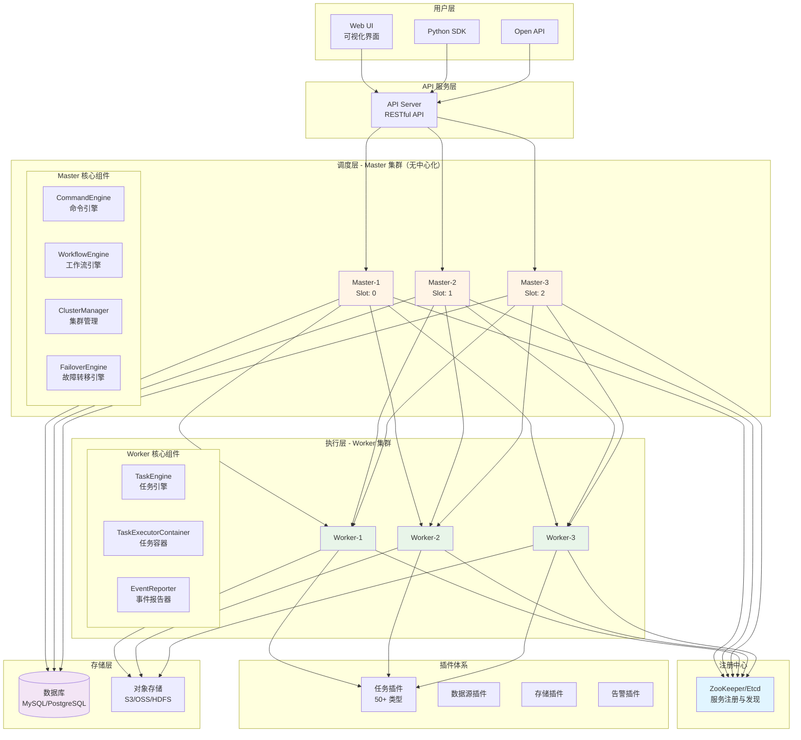
```mermaid
graph TB
    subgraph "用户层"
        UI[Web UI<br/>可视化界面]
        SDK[Python SDK]
        API[Open API]
    end
    
    subgraph "API 服务层"
        APIServer[API Server<br/>RESTful API]
    end
    
    subgraph "调度层 - Master 集群（无中心化）"
        M1[Master-1<br/>Slot: 0]
        M2[Master-2<br/>Slot: 1]
        M3[Master-3<br/>Slot: 2]
        
        subgraph "Master 核心组件"
            CE[CommandEngine<br/>命令引擎]
            WE[WorkflowEngine<br/>工作流引擎]
            CM[ClusterManager<br/>集群管理]
            FE[FailoverEngine<br/>故障转移引擎]
        end
    end
    
    subgraph "执行层 - Worker 集群"
        W1[Worker-1]
        W2[Worker-2]
        W3[Worker-3]
        
        subgraph "Worker 核心组件"
            TE[TaskEngine<br/>任务引擎]
            TEC[TaskExecutorContainer<br/>任务容器]
            PER[EventReporter<br/>事件报告器]
        end
    end
    
    subgraph "注册中心"
        ZK[ZooKeeper/Etcd<br/>服务注册与发现]
    end
    
    subgraph "存储层"
        DB[(数据库<br/>MySQL/PostgreSQL)]
        Storage[对象存储<br/>S3/OSS/HDFS]
    end
    
    subgraph "插件体系"
        TaskPlugin[任务插件<br/>50+ 类型]
        DataSourcePlugin[数据源插件]
        StoragePlugin[存储插件]
        AlertPlugin[告警插件]
    end
    
    UI --> APIServer
    SDK --> APIServer
    API --> APIServer
    
    APIServer --> M1
    APIServer --> M2
    APIServer --> M3
    
    M1 --> ZK
    M2 --> ZK
    M3 --> ZK
    
    M1 --> W1
    M1 --> W2
    M1 --> W3
    M2 --> W1
    M2 --> W2
    M2 --> W3
    M3 --> W1
    M3 --> W2
    M3 --> W3
    
    W1 --> ZK
    W2 --> ZK
    W3 --> ZK
    
    M1 --> DB
    M2 --> DB
    M3 --> DB
    
    W1 --> Storage
    W2 --> Storage
    W3 --> Storage
    
    W1 --> TaskPlugin
    W2 --> TaskPlugin
    W3 --> TaskPlugin
    
    style M1 fill:#fff4e6
    style M2 fill:#fff4e6
    style M3 fill:#fff4e6
    style W1 fill:#e8f5e9
    style W2 fill:#e8f5e9
    style W3 fill:#e8f5e9
    style ZK fill:#e1f5ff
    style DB fill:#f3e5f5
```

### 2.2 核心组件架构


```mermaid
graph TB
    subgraph "Master 服务架构"
        subgraph "命令处理层"
            CF[CommandFetcher<br/>命令获取器<br/>基于Slot分片]
            WERF[WorkflowExecutionRunnableFactory<br/>工作流执行工厂]
            CH[CommandHandler<br/>命令处理器]
        end
        
        subgraph "工作流执行层"
            WER[WorkflowExecutionRunnable<br/>工作流执行Runnable]
            WEG[WorkflowExecutionGraph<br/>工作流执行图]
            TER[TaskExecutionRunnable<br/>任务执行Runnable]
        end
        
        subgraph "事件驱动层"
            WEB[WorkflowEventBus<br/>工作流事件总线]
            WEBFW[WorkflowEventBusFireWorkers<br/>事件触发工作线程]
            SEB[SystemEventBus<br/>系统事件总线]
        end
        
        subgraph "状态管理层"
            WSA[WorkflowStateAction<br/>工作流状态机]
            TSA[TaskStateAction<br/>任务状态机]
        end
        
        subgraph "任务调度层"
            GTDWQ[GlobalTaskDispatchWaitingQueue<br/>全局任务分发队列]
            GTDWQL[GlobalTaskDispatchWaitingQueueLooper<br/>队列循环器]
            WLB[WorkerLoadBalancer<br/>Worker负载均衡器]
        end
        
        subgraph "集群管理层"
            CM[ClusterManager<br/>集群管理器]
            MSM[MasterSlotManager<br/>Master Slot管理]
            WCM[WorkerClusterManager<br/>Worker集群管理]
        end
        
        subgraph "故障转移层"
            FC[FailoverCoordinator<br/>故障转移协调器]
            WF[WorkflowFailover<br/>工作流故障转移]
            TF[TaskFailover<br/>任务故障转移]
        end
    end
    
    subgraph "Worker 服务架构"
        subgraph "RPC 接收层"
            PTOI[PhysicalTaskExecutorOperatorImpl<br/>RPC服务实现]
        end
        
        subgraph "任务引擎层"
            PTED[PhysicalTaskEngineDelegator<br/>任务引擎委托器]
            TE[TaskEngine<br/>任务引擎]
        end
        
        subgraph "任务容器层"
            ETC[ExclusiveThreadTaskExecutorContainer<br/>独占线程容器]
            TEW[TaskExecutorWorker<br/>任务执行工作线程]
        end
        
        subgraph "任务执行层"
            PTE[PhysicalTaskExecutor<br/>物理任务执行器]
            TER2[TaskExecutorRepository<br/>任务执行器仓库]
        end
        
        subgraph "事件处理层"
            TEB[TaskExecutorEventBus<br/>任务执行器事件总线]
            TEC[TaskExecutorEventBusCoordinator<br/>事件总线协调器]
            PER[PhysicalTaskExecutorLifecycleEventReporter<br/>事件报告器]
        end
        
        subgraph "插件层"
            TPM[TaskPluginManager<br/>任务插件管理器]
            TaskPlugin[任务插件<br/>SqlTask/ShellTask等]
        end
    end
    
    CF --> WERF
    WERF --> CH
    CH --> WER
    WER --> WEG
    WEG --> TER
    
    TER --> WEB
    WEB --> WEBFW
    WEBFW --> WSA
    WEBFW --> TSA
    
    TSA --> GTDWQ
    GTDWQ --> GTDWQL
    GTDWQL --> WLB
    
    CM --> MSM
    CM --> WCM
    
    FC --> WF
    FC --> TF
    
    PTOI --> PTED
    PTED --> TE
    TE --> ETC
    ETC --> TEW
    TEW --> PTE
    PTE --> TER2
    
    PTE --> TEB
    TEB --> TEC
    TEC --> PER
    
    PTE --> TPM
    TPM --> TaskPlugin
    
    style WER fill:#fff4e6
    style TER fill:#e8f5e9
    style WEB fill:#e1f5ff
    style GTDWQ fill:#f3e5f5
    style CM fill:#ffebee
    style FC fill:#fce4ec
```

### 2.3 数据流向图

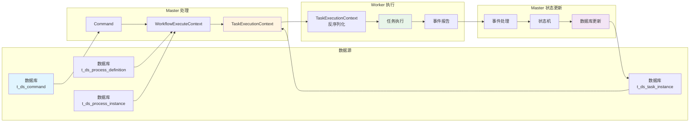
```mermaid
flowchart LR
    subgraph "数据源"
        A1[数据库<br/>t_ds_command]
        A2[数据库<br/>t_ds_process_definition]
        A3[数据库<br/>t_ds_process_instance]
        A4[数据库<br/>t_ds_task_instance]
    end
    
    subgraph "Master 处理"
        B1[Command]
        B2[WorkflowExecuteContext]
        B3[TaskExecutionContext]
    end
    
    subgraph "Worker 执行"
        C1[TaskExecutionContext<br/>反序列化]
        C2[任务执行]
        C3[事件报告]
    end
    
    subgraph "Master 状态更新"
        D1[事件处理]
        D2[状态机]
        D3[数据库更新]
    end
    
    A1 --> B1
    A2 --> B2
    A3 --> B2
    A4 --> B3
    
    B1 --> B2
    B2 --> B3
    B3 --> C1
    C1 --> C2
    C2 --> C3
    
    C3 --> D1
    D1 --> D2
    D2 --> D3
    D3 --> A4
    
    style A1 fill:#e1f5ff
    style B3 fill:#fff4e1
    style C2 fill:#e8f5e9
    style D3 fill:#f3e5f5
```

---

## 三、核心亮点

### 3.1 无中心化 Master 集群架构

**设计理念**：所有 Master 节点地位平等，无 Leader 节点，避免单点故障。

**核心机制**：

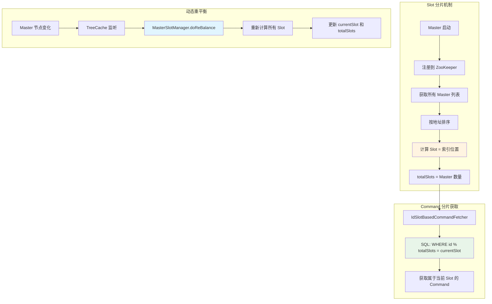
```mermaid
graph TB
    subgraph "Slot 分片机制"
        A[Master 启动] --> B[注册到 ZooKeeper]
        B --> C[获取所有 Master 列表]
        C --> D[按地址排序]
        D --> E[计算 Slot = 索引位置]
        E --> F[totalSlots = Master 数量]
    end
    
    subgraph "Command 分片获取"
        F --> G[IdSlotBasedCommandFetcher]
        G --> H[SQL: WHERE id % totalSlots = currentSlot]
        H --> I[获取属于当前 Slot 的 Command]
    end
    
    subgraph "动态重平衡"
        J[Master 节点变化] --> K[TreeCache 监听]
        K --> L[MasterSlotManager.doReBalance]
        L --> M[重新计算所有 Slot]
        M --> N[更新 currentSlot 和 totalSlots]
    end
    
    style E fill:#fff4e1
    style H fill:#e8f5e9
    style L fill:#e1f5ff
```

**优势**：
- ✅ **无单点故障**：任意 Master 故障不影响整体服务
- ✅ **水平扩展**：新增 Master 节点即可扩展，无需手动配置
- ✅ **负载均衡**：Slot 机制实现任务均匀分配
- ✅ **自动容错**：节点故障自动检测，Slot 自动重平衡

### 3.2 事件驱动架构

**设计理念**：通过事件总线实现组件解耦，支持异步处理和扩展。

**事件体系**：


```mermaid
graph TB
    subgraph "工作流事件"
        WE1[WorkflowStartLifecycleEvent]
        WE2[WorkflowSucceedLifecycleEvent]
        WE3[WorkflowFailedLifecycleEvent]
        WE4[WorkflowPausedLifecycleEvent]
    end
    
    subgraph "任务事件"
        TE1[TaskStartLifecycleEvent]
        TE2[TaskDispatchLifecycleEvent]
        TE3[TaskRunningLifecycleEvent]
        TE4[TaskSuccessLifecycleEvent]
        TE5[TaskFailedLifecycleEvent]
        TE6[TaskRetryLifecycleEvent]
    end
    
    subgraph "系统事件"
        SE1[MasterFailoverEvent]
        SE2[WorkerFailoverEvent]
        SE3[GlobalMasterFailoverEvent]
    end
    
    subgraph "事件总线"
        WEB[WorkflowEventBus<br/>工作流事件总线]
        SEB[SystemEventBus<br/>系统事件总线]
        TEB[TaskExecutorEventBus<br/>任务执行器事件总线]
    end
    
    WE1 --> WEB
    WE2 --> WEB
    WE3 --> WEB
    WE4 --> WEB
    
    TE1 --> WEB
    TE2 --> WEB
    TE3 --> WEB
    TE4 --> WEB
    TE5 --> WEB
    TE6 --> WEB
    
    SE1 --> SEB
    SE2 --> SEB
    SE3 --> SEB
    
    style WEB fill:#e1f5ff
    style SEB fill:#fff4e1
    style TEB fill:#e8f5e9
```

**事件处理流程**：

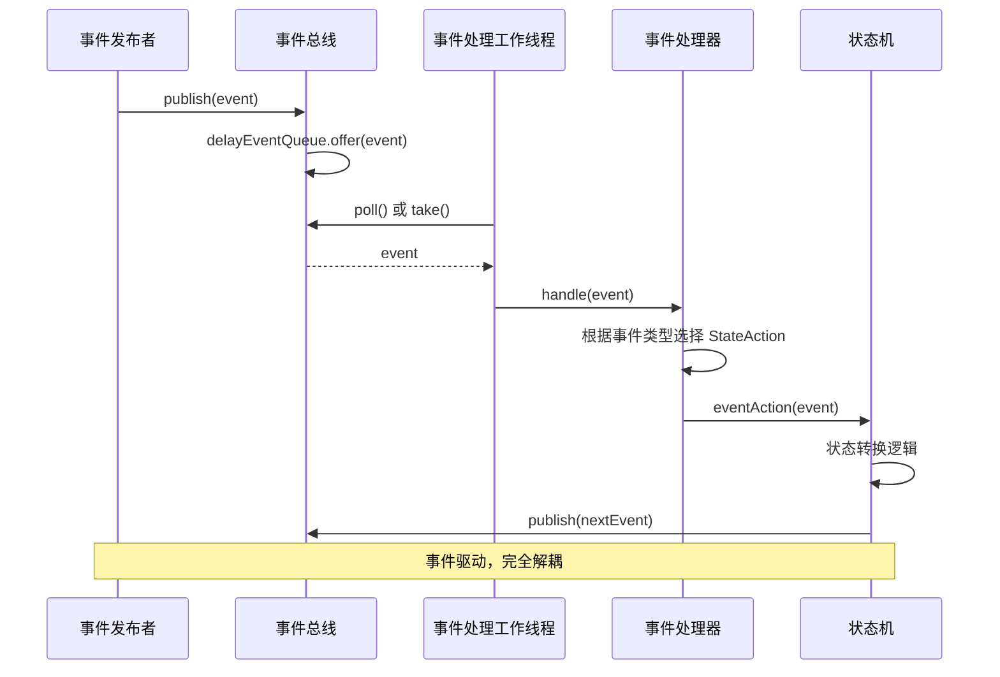
```mermaid
sequenceDiagram
    participant Publisher as 事件发布者
    participant EventBus as 事件总线
    participant Worker as 事件处理工作线程
    participant Handler as 事件处理器
    participant StateAction as 状态机
    
    Publisher->>EventBus: publish(event)
    EventBus->>EventBus: delayEventQueue.offer(event)
    
    Worker->>EventBus: poll() 或 take()
    EventBus-->>Worker: event
    
    Worker->>Handler: handle(event)
    Handler->>Handler: 根据事件类型选择 StateAction
    
    Handler->>StateAction: eventAction(event)
    StateAction->>StateAction: 状态转换逻辑
    StateAction->>EventBus: publish(nextEvent)
    
    Note over Publisher,StateAction: 事件驱动，完全解耦
```

**优势**：
- ✅ **解耦设计**：组件通过事件通信，降低耦合度
- ✅ **异步处理**：事件异步处理，不阻塞主流程
- ✅ **易于扩展**：新增事件类型和处理器无需修改现有代码
- ✅ **状态管理**：通过状态机模式管理状态转换

### 3.3 状态机设计

**设计理念**：严格的状态机设计，确保状态流转符合业务逻辑。

**工作流状态机**：

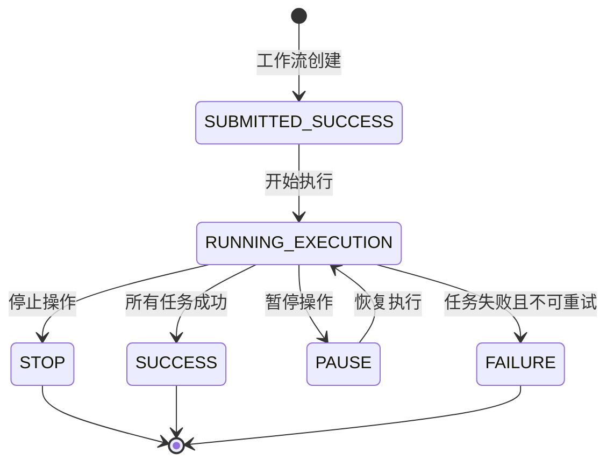
```mermaid
stateDiagram-v2
    [*] --> SUBMITTED_SUCCESS: 工作流创建
    SUBMITTED_SUCCESS --> RUNNING_EXECUTION: 开始执行
    RUNNING_EXECUTION --> SUCCESS: 所有任务成功
    RUNNING_EXECUTION --> FAILURE: 任务失败且不可重试
    RUNNING_EXECUTION --> PAUSE: 暂停操作
    RUNNING_EXECUTION --> STOP: 停止操作
    PAUSE --> RUNNING_EXECUTION: 恢复执行
    STOP --> [*]
    SUCCESS --> [*]
    FAILURE --> [*]
```

**任务状态机**：

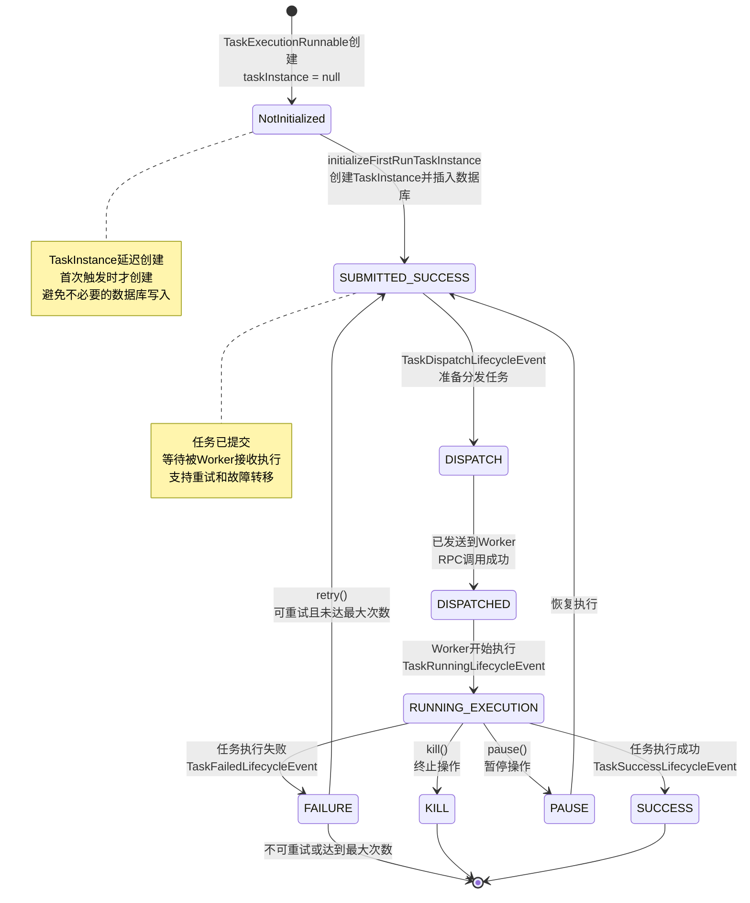
```mermaid
stateDiagram-v2
    [*] --> NotInitialized: TaskExecutionRunnable创建<br/>taskInstance = null
    NotInitialized --> SUBMITTED_SUCCESS: initializeFirstRunTaskInstance<br/>创建TaskInstance并插入数据库
    SUBMITTED_SUCCESS --> DISPATCH: TaskDispatchLifecycleEvent<br/>准备分发任务
    DISPATCH --> DISPATCHED: 已发送到Worker<br/>RPC调用成功
    DISPATCHED --> RUNNING_EXECUTION: Worker开始执行<br/>TaskRunningLifecycleEvent
    RUNNING_EXECUTION --> SUCCESS: 任务执行成功<br/>TaskSuccessLifecycleEvent
    RUNNING_EXECUTION --> FAILURE: 任务执行失败<br/>TaskFailedLifecycleEvent
    FAILURE --> SUBMITTED_SUCCESS: retry()<br/>可重试且未达最大次数
    FAILURE --> [*]: 不可重试或达到最大次数
    RUNNING_EXECUTION --> PAUSE: pause()<br/>暂停操作
    PAUSE --> SUBMITTED_SUCCESS: 恢复执行
    RUNNING_EXECUTION --> KILL: kill()<br/>终止操作
    KILL --> [*]
    SUCCESS --> [*]
    
    note right of NotInitialized
        TaskInstance延迟创建
        首次触发时才创建
        避免不必要的数据库写入
    end note
    
    note right of SUBMITTED_SUCCESS
        任务已提交
        等待被Worker接收执行
        支持重试和故障转移
    end note
```

**状态机设计优势**：
- ✅ **严格的状态流转**：每个状态只能转换到允许的下一个状态
- ✅ **事务保证**：状态转换与数据库更新在同一事务中
- ✅ **幂等性**：相同事件多次处理不会导致状态异常
- ✅ **可追溯性**：所有状态变化都有日志记录

### 3.4 乐观锁防重复处理机制

**设计理念**：使用数据库事务删除操作作为分布式锁，避免多 Master 重复处理同一 Command。

**实现机制**：

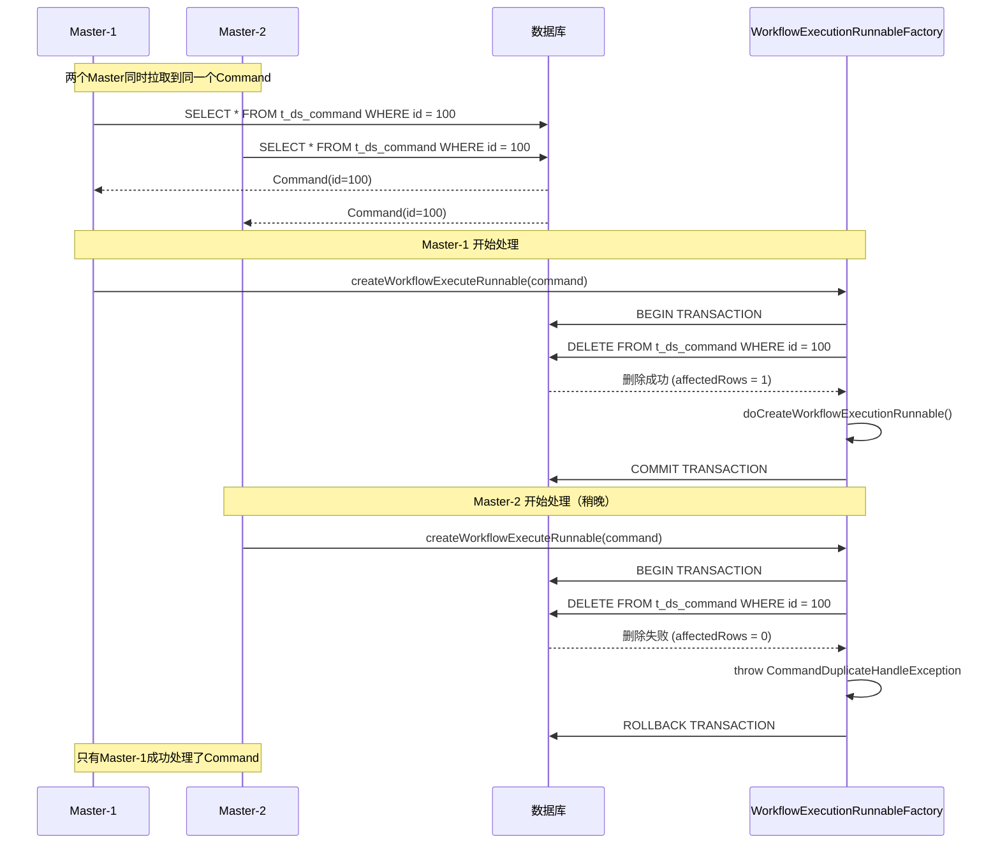
```mermaid
sequenceDiagram
    participant M1 as Master-1
    participant M2 as Master-2
    participant DB as 数据库
    participant Factory as WorkflowExecutionRunnableFactory
    
    Note over M1,M2: 两个Master同时拉取到同一个Command
    M1->>DB: SELECT * FROM t_ds_command WHERE id = 100
    M2->>DB: SELECT * FROM t_ds_command WHERE id = 100
    DB-->>M1: Command(id=100)
    DB-->>M2: Command(id=100)
    
    Note over M1,Factory: Master-1 开始处理
    M1->>Factory: createWorkflowExecuteRunnable(command)
    Factory->>DB: BEGIN TRANSACTION
    Factory->>DB: DELETE FROM t_ds_command WHERE id = 100
    DB-->>Factory: 删除成功 (affectedRows = 1)
    Factory->>Factory: doCreateWorkflowExecutionRunnable()
    Factory->>DB: COMMIT TRANSACTION
    
    Note over M2,Factory: Master-2 开始处理（稍晚）
    M2->>Factory: createWorkflowExecuteRunnable(command)
    Factory->>DB: BEGIN TRANSACTION
    Factory->>DB: DELETE FROM t_ds_command WHERE id = 100
    DB-->>Factory: 删除失败 (affectedRows = 0)
    Factory->>Factory: throw CommandDuplicateHandleException
    Factory->>DB: ROLLBACK TRANSACTION
    
    Note over M1,M2: 只有Master-1成功处理了Command
```

**优势**：
- ✅ **简单高效**：无需额外的分布式锁组件（如 Redis）
- ✅ **原子性保证**：数据库事务确保操作的原子性
- ✅ **无死锁风险**：删除操作不会导致死锁
- ✅ **自动清理**：Command 处理完成后自动删除，无需手动清理

### 3.5 插件化架构

**设计理念**：通过 SPI 机制实现插件化架构，支持任务类型、数据源、存储、告警等插件扩展。

**插件体系架构**：

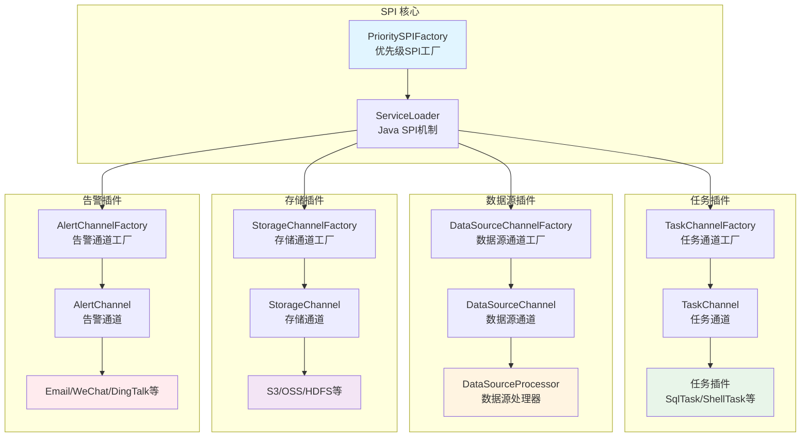
```mermaid
graph TB
    subgraph "SPI 核心"
        SPI[PrioritySPIFactory<br/>优先级SPI工厂]
        SL[ServiceLoader<br/>Java SPI机制]
    end
    
    subgraph "任务插件"
        TCF[TaskChannelFactory<br/>任务通道工厂]
        TC[TaskChannel<br/>任务通道]
        Task[任务插件<br/>SqlTask/ShellTask等]
    end
    
    subgraph "数据源插件"
        DSCF[DataSourceChannelFactory<br/>数据源通道工厂]
        DSC[DataSourceChannel<br/>数据源通道]
        DSP[DataSourceProcessor<br/>数据源处理器]
    end
    
    subgraph "存储插件"
        SCF[StorageChannelFactory<br/>存储通道工厂]
        SC[StorageChannel<br/>存储通道]
        Storage[S3/OSS/HDFS等]
    end
    
    subgraph "告警插件"
        ACF[AlertChannelFactory<br/>告警通道工厂]
        AC[AlertChannel<br/>告警通道]
        Alert[Email/WeChat/DingTalk等]
    end
    
    SPI --> SL
    SL --> TCF
    SL --> DSCF
    SL --> SCF
    SL --> ACF
    
    TCF --> TC
    TC --> Task
    
    DSCF --> DSC
    DSC --> DSP
    
    SCF --> SC
    SC --> Storage
    
    ACF --> AC
    AC --> Alert
    
    style SPI fill:#e1f5ff
    style Task fill:#e8f5e9
    style DSP fill:#fff4e1
    style Storage fill:#f3e5f5
    style Alert fill:#ffebee
```

**插件加载流程**：

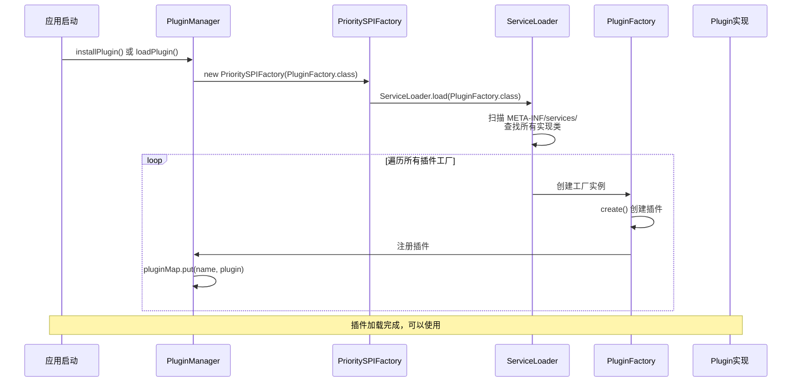
```mermaid
sequenceDiagram
    participant App as 应用启动
    participant Manager as PluginManager
    participant SPI as PrioritySPIFactory
    participant Loader as ServiceLoader
    participant Factory as PluginFactory
    participant Plugin as Plugin实现
    
    App->>Manager: installPlugin() 或 loadPlugin()
    Manager->>SPI: new PrioritySPIFactory(PluginFactory.class)
    SPI->>Loader: ServiceLoader.load(PluginFactory.class)
    Loader->>Loader: 扫描 META-INF/services/<br/>查找所有实现类
    
    loop 遍历所有插件工厂
        Loader->>Factory: 创建工厂实例
        Factory->>Factory: create() 创建插件
        Factory->>Manager: 注册插件
        Manager->>Manager: pluginMap.put(name, plugin)
    end
    
    Note over App,Plugin: 插件加载完成，可以使用
```

**优势**：
- ✅ **高度可扩展**：新增插件无需修改核心代码
- ✅ **优先级支持**：支持插件优先级，解决同名插件冲突
- ✅ **热插拔**：支持动态加载和卸载插件
- ✅ **统一接口**：所有插件遵循统一的接口规范

### 3.6 故障转移机制

**设计理念**：通过延迟检测、分布式锁、状态恢复实现可靠的故障转移。

**故障转移流程**：

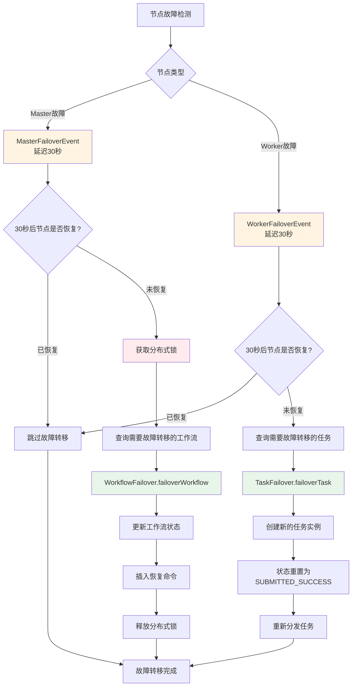
```mermaid
flowchart TD
    A[节点故障检测] --> B{节点类型}
    
    B -->|Master故障| C[MasterFailoverEvent<br/>延迟30秒]
    B -->|Worker故障| D[WorkerFailoverEvent<br/>延迟30秒]
    
    C --> E{30秒后节点是否恢复?}
    D --> F{30秒后节点是否恢复?}
    
    E -->|已恢复| G[跳过故障转移]
    E -->|未恢复| H[获取分布式锁]
    F -->|已恢复| G
    F -->|未恢复| I[查询需要故障转移的任务]
    
    H --> J[查询需要故障转移的工作流]
    J --> K[WorkflowFailover.failoverWorkflow]
    K --> L[更新工作流状态]
    L --> M[插入恢复命令]
    M --> N[释放分布式锁]
    
    I --> O[TaskFailover.failoverTask]
    O --> P[创建新的任务实例]
    P --> Q[状态重置为SUBMITTED_SUCCESS]
    Q --> R[重新分发任务]
    
    G --> S[故障转移完成]
    N --> S
    R --> S
    
    style C fill:#fff4e1
    style D fill:#fff4e1
    style H fill:#ffebee
    style K fill:#e8f5e9
    style O fill:#e8f5e9
```

**30秒延迟机制**：

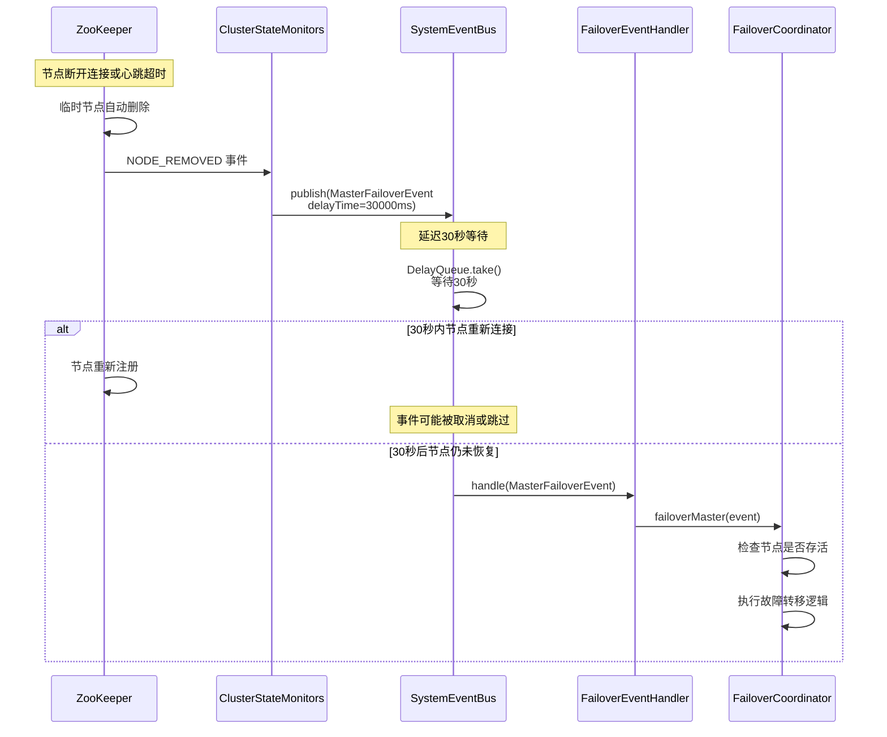
```mermaid
sequenceDiagram
    participant ZK as ZooKeeper
    participant CSM as ClusterStateMonitors
    participant SEB as SystemEventBus
    participant Handler as FailoverEventHandler
    participant FC as FailoverCoordinator
    
    Note over ZK: 节点断开连接或心跳超时
    ZK->>ZK: 临时节点自动删除
    ZK->>CSM: NODE_REMOVED 事件
    
    CSM->>SEB: publish(MasterFailoverEvent<br/>delayTime=30000ms)
    
    Note over SEB: 延迟30秒等待
    SEB->>SEB: DelayQueue.take()<br/>等待30秒
    
    alt 30秒内节点重新连接
        ZK->>ZK: 节点重新注册
        Note over SEB: 事件可能被取消或跳过
    else 30秒后节点仍未恢复
        SEB->>Handler: handle(MasterFailoverEvent)
        Handler->>FC: failoverMaster(event)
        FC->>FC: 检查节点是否存活
        FC->>FC: 执行故障转移逻辑
    end
```

**优势**：
- ✅ **避免误触发**：30秒延迟避免网络抖动导致的误触发
- ✅ **自动恢复**：节点重新连接后自动跳过故障转移
- ✅ **分布式锁**：防止多个 Master 同时执行故障转移
- ✅ **状态恢复**：从数据库恢复工作流和任务状态

---

## 四、关键技术实现

### 4.1 Slot 分片算法

**核心公式**：`(commandId / idStep) % totalSlots = currentSlot`

**实现细节**：

```java
// IdSlotBasedCommandFetcher.fetchCommands()
public List<Command> fetchCommands() {
    // 1. 检查 Slot 是否有效
    if (!masterSlotManager.checkSlotValid()) {
        return Collections.emptyList();
    }
    
    // 2. 获取当前 Slot 信息
    int currentSlot = masterSlotManager.getCurrentSlot();
    int totalSlots = masterSlotManager.getTotalSlots();
    
    // 3. 执行分片查询
    return commandDao.queryCommandByIdSlot(
        currentSlot, 
        totalSlots, 
        masterConfig.getFetchCommandSize()
    );
}

// SQL 查询
// WHERE (id / #{idStep}) % #{totalSlot} = #{currentSlotIndex}
// ORDER BY workflow_instance_priority, id ASC
// LIMIT #{fetchNumber}
```

**Slot 重平衡机制**：

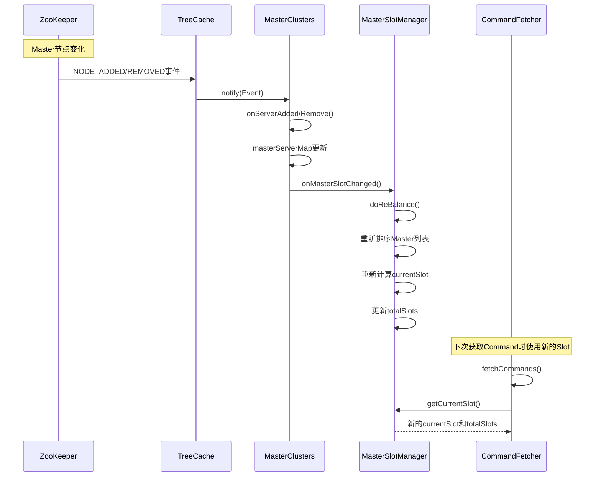
```mermaid
sequenceDiagram
    participant ZK as ZooKeeper
    participant TC as TreeCache
    participant MC as MasterClusters
    participant MSM as MasterSlotManager
    participant CF as CommandFetcher
    
    Note over ZK: Master节点变化
    ZK->>TC: NODE_ADDED/REMOVED事件
    TC->>MC: notify(Event)
    MC->>MC: onServerAdded/Remove()
    MC->>MC: masterServerMap更新
    MC->>MSM: onMasterSlotChanged()
    
    MSM->>MSM: doReBalance()
    MSM->>MSM: 重新排序Master列表
    MSM->>MSM: 重新计算currentSlot
    MSM->>MSM: 更新totalSlots
    
    Note over CF: 下次获取Command时使用新的Slot
    CF->>CF: fetchCommands()
    CF->>MSM: getCurrentSlot()
    MSM-->>CF: 新的currentSlot和totalSlots
```

### 4.2 事件总线实现

**DelayQueue 延迟事件机制**：

```java
// AbstractDelayEventBus
public class AbstractDelayEventBus<T extends AbstractDelayEvent> {
    private final DelayQueue<T> delayEventQueue = new DelayQueue<>();
    
    public void publish(T event) {
        delayEventQueue.offer(event);
    }
    
    public T take() throws InterruptedException {
        return delayEventQueue.take(); // 阻塞等待，直到有元素到期
    }
}

// AbstractDelayEvent
public abstract class AbstractDelayEvent implements Delayed {
    private final Date eventTime;
    private final long delayTime; // 延迟时间（毫秒）
    
    @Override
    public long getDelay(TimeUnit unit) {
        long delay = (eventTime.getTime() + delayTime) - System.currentTimeMillis();
        return unit.convert(delay, TimeUnit.MILLISECONDS);
    }
}
```

**事件处理工作线程**：

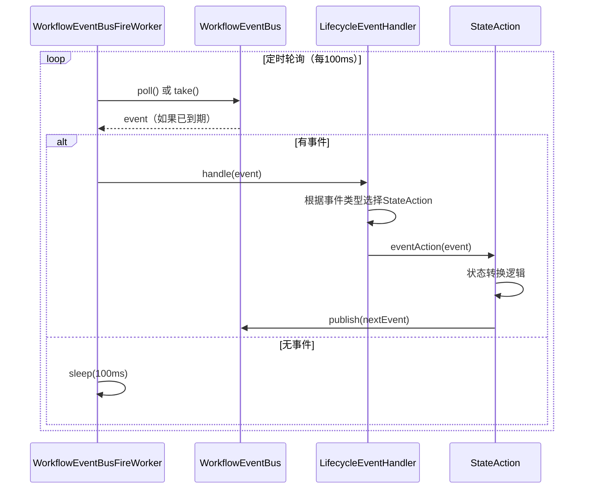
```mermaid
sequenceDiagram
    participant Worker as WorkflowEventBusFireWorker
    participant EventBus as WorkflowEventBus
    participant Handler as LifecycleEventHandler
    participant StateAction as StateAction
    
    loop 定时轮询（每100ms）
        Worker->>EventBus: poll() 或 take()
        EventBus-->>Worker: event（如果已到期）
        
        alt 有事件
            Worker->>Handler: handle(event)
            Handler->>Handler: 根据事件类型选择StateAction
            Handler->>StateAction: eventAction(event)
            StateAction->>StateAction: 状态转换逻辑
            StateAction->>EventBus: publish(nextEvent)
        else 无事件
            Worker->>Worker: sleep(100ms)
        end
    end
```

### 4.3 ReentrantLock + Condition 实践

**场景一：事件通道等待/唤醒机制**

```java
// TaskExecutorLifecycleEventRemoteReporter
private final Lock eventChannelsLock = new ReentrantLock();
private final Condition taskExecutionEventEmptyCondition = 
    eventChannelsLock.newCondition();

// 报告事件（添加事件到通道）
public void reportTaskExecutorLifecycleEvent(...) {
    eventChannelsLock.lock();
    try {
        eventChannels.computeIfAbsent(...).addTaskExecutionEvent(event);
        taskExecutionEventEmptyCondition.signalAll(); // 唤醒等待线程
    } finally {
        eventChannelsLock.unlock();
    }
}

// 等待所有通道为空
private void tryToWaitIfAllTaskExecutionEventChannelEmpty() 
        throws InterruptedException {
    eventChannelsLock.lock();
    try {
        while (isAllTaskExecutorEventChannelEmpty()) {
            taskExecutionEventEmptyCondition.await(); // 自动释放锁，等待唤醒
        }
    } finally {
        eventChannelsLock.unlock();
    }
}
```

**优势**：
- ✅ **避免忙等待**：使用 `Condition.await()` 让线程进入 WAITING 状态
- ✅ **精确控制**：可以精确控制等待时间
- ✅ **自动锁管理**：`await()` 自动释放锁，被唤醒后自动重新获取

### 4.4 双重检查锁定模式

**NettyRemotingClient Channel 创建**：

```java
private final ReentrantLock channelsLock = new ReentrantLock();
private final Map<Host, Channel> channels = new ConcurrentHashMap<>();

Channel getOrCreateChannel(Host host) {
    // 第一次检查（无锁，快速路径）
    Channel channel = channels.get(host);
    if (channel != null && channel.isActive()) {
        return channel;
    }
    
    try {
        channelsLock.lock();
        // 第二次检查（有锁，避免重复创建）
        channel = channels.get(host);
        if (channel != null && channel.isActive()) {
            return channel;
        }
        // 创建新 Channel
        channel = createChannel(host);
        channels.put(host, channel);
    } finally {
        channelsLock.unlock();
    }
    return channel;
}
```

**优势**：
- ✅ **性能优化**：第一次检查无锁，避免不必要的锁竞争
- ✅ **线程安全**：双重检查确保不会重复创建 Channel
- ✅ **资源节约**：复用已存在的 Channel

---

## 五、遇到的问题与解决方案

### 5.1 问题一：Master 集群重复处理 Command

**问题描述**：
- 多个 Master 节点可能同时拉取到同一个 Command
- 导致同一个工作流被多次执行

**解决方案**：乐观锁机制

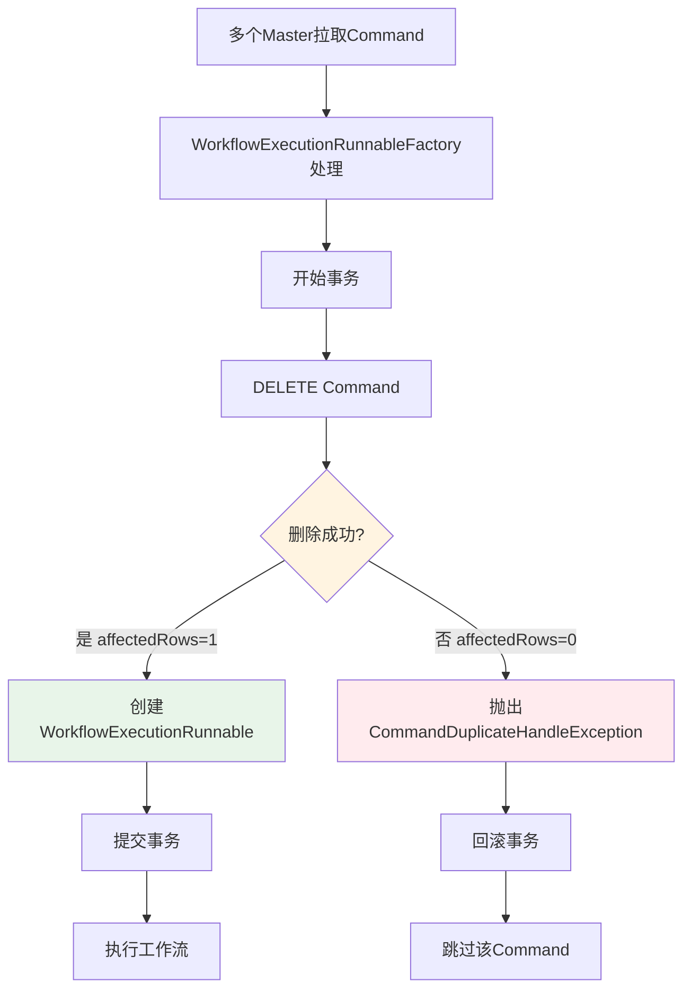
```mermaid
flowchart TD
    A[多个Master拉取Command] --> B[WorkflowExecutionRunnableFactory处理]
    B --> C[开始事务]
    C --> D[DELETE Command]
    D --> E{删除成功?}
    
    E -->|是 affectedRows=1| F[创建WorkflowExecutionRunnable]
    E -->|否 affectedRows=0| G[抛出CommandDuplicateHandleException]
    
    F --> H[提交事务]
    G --> I[回滚事务]
    
    H --> J[执行工作流]
    I --> K[跳过该Command]
    
    style E fill:#fff4e1
    style F fill:#e8f5e9
    style G fill:#ffebee
```

**效果**：
- ✅ 确保每个 Command 只被处理一次
- ✅ 无需额外的分布式锁组件
- ✅ 实现简单高效

### 5.2 问题二：网络抖动导致误触发故障转移

**问题描述**：
- 网络暂时中断可能导致节点在注册中心短暂消失
- 触发故障转移，但节点实际未故障

**解决方案**：30秒延迟机制

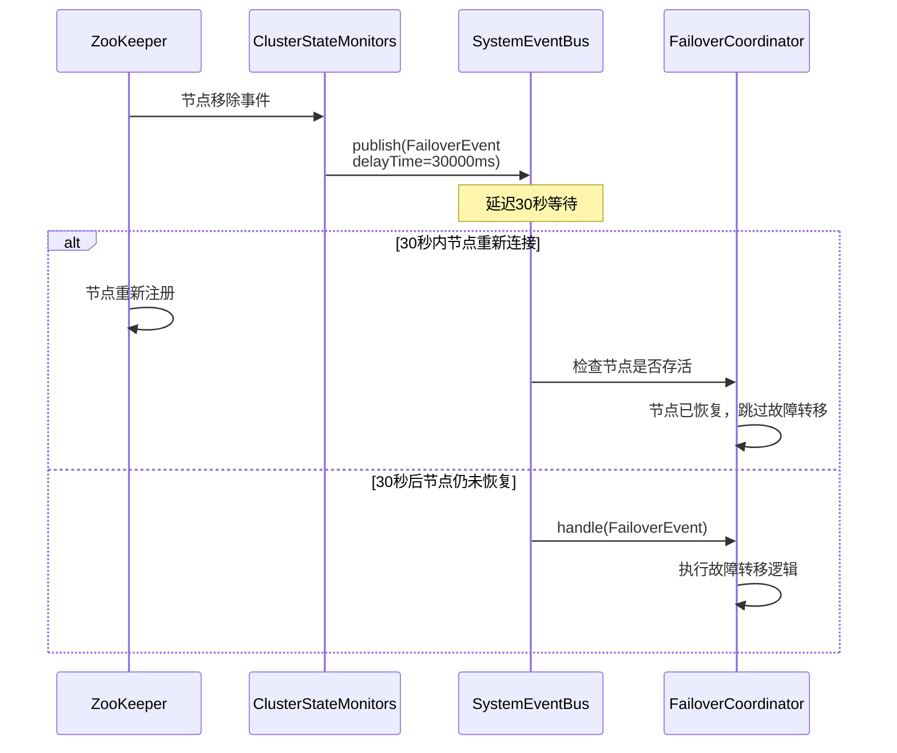
```mermaid
sequenceDiagram
    participant ZK as ZooKeeper
    participant CSM as ClusterStateMonitors
    participant SEB as SystemEventBus
    participant FC as FailoverCoordinator
    
    ZK->>CSM: 节点移除事件
    CSM->>SEB: publish(FailoverEvent<br/>delayTime=30000ms)
    
    Note over SEB: 延迟30秒等待
    
    alt 30秒内节点重新连接
        ZK->>ZK: 节点重新注册
        SEB->>FC: 检查节点是否存活
        FC->>FC: 节点已恢复，跳过故障转移
    else 30秒后节点仍未恢复
        SEB->>FC: handle(FailoverEvent)
        FC->>FC: 执行故障转移逻辑
    end
```

**效果**：
- ✅ 避免网络抖动导致的误触发
- ✅ 给节点足够时间重新连接
- ✅ 减少不必要的故障转移开销

### 5.3 问题三：Worker 事件丢失导致状态不一致

**问题描述**：
- Worker 端事件存储在内存中（DelayQueue、ConcurrentHashMap）
- Worker 重启会导致事件丢失
- Master 和 Worker 同时故障可能导致状态不一致

**解决方案**：最终一致性 + 故障转移机制

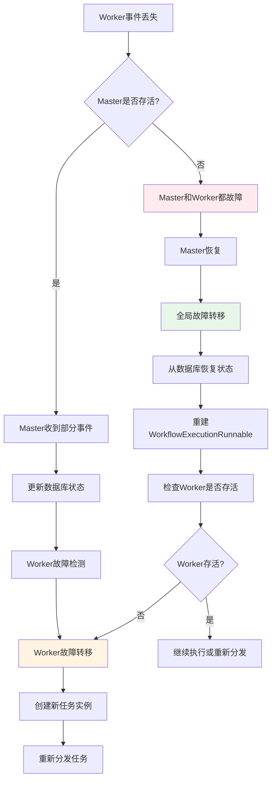
```mermaid
flowchart TD
    A[Worker事件丢失] --> B{Master是否存活?}
    
    B -->|是| C[Master收到部分事件]
    C --> D[更新数据库状态]
    D --> E[Worker故障检测]
    E --> F[Worker故障转移]
    F --> G[创建新任务实例]
    G --> H[重新分发任务]
    
    B -->|否| I[Master和Worker都故障]
    I --> J[Master恢复]
    J --> K[全局故障转移]
    K --> L[从数据库恢复状态]
    L --> M[重建WorkflowExecutionRunnable]
    M --> N[检查Worker是否存活]
    N --> O{Worker存活?}
    O -->|否| F
    O -->|是| P[继续执行或重新分发]
    
    style I fill:#ffebee
    style K fill:#e8f5e9
    style F fill:#fff4e1
```

**设计权衡**：
- ✅ **性能优先**：事件存储在内存中，保证高性能
- ✅ **最终一致性**：通过重试机制和故障转移，尽可能保证最终一致性
- ✅ **可接受的数据丢失**：在极端情况下可能存在少量状态不一致，但可以通过监控和运维手段发现并修复

### 5.4 问题四：Slot 重平衡导致任务分配变化

**问题描述**：
- Master 集群变化时，Slot 会重新分配
- 可能导致正在处理的 Command 分配发生变化

**解决方案**：已获取的 Command 不受影响

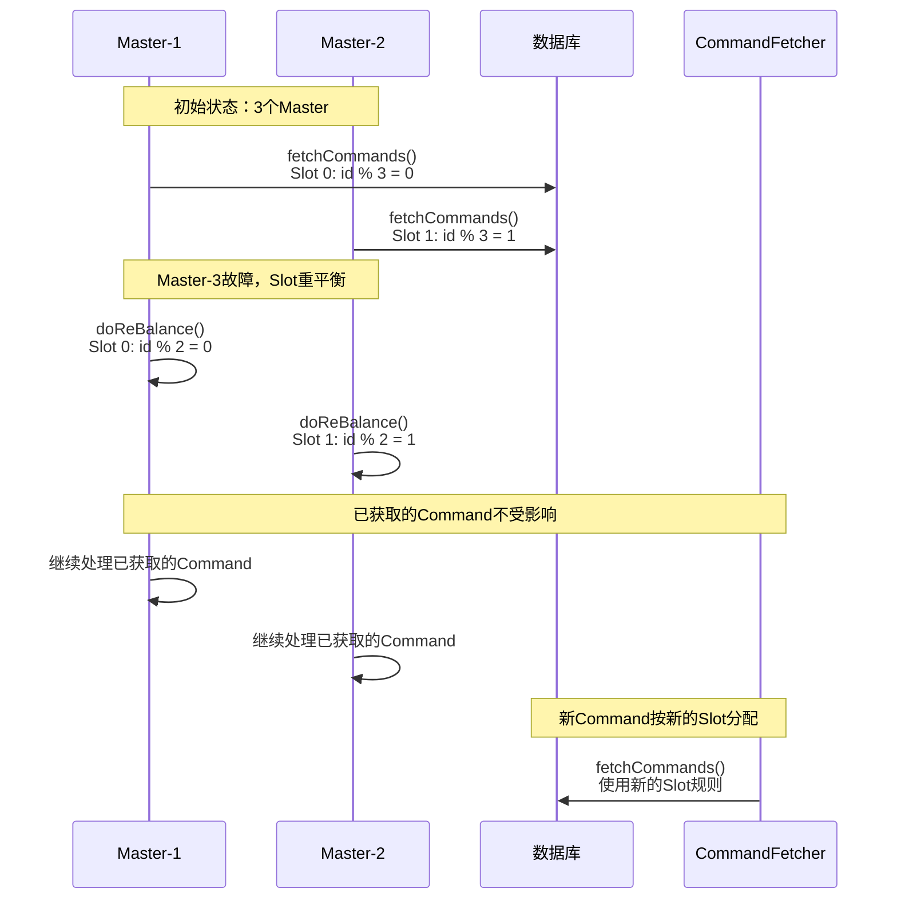
```mermaid
sequenceDiagram
    participant M1 as Master-1
    participant M2 as Master-2
    participant DB as 数据库
    participant CF as CommandFetcher
    
    Note over M1,M2: 初始状态：3个Master
    M1->>DB: fetchCommands()<br/>Slot 0: id % 3 = 0
    M2->>DB: fetchCommands()<br/>Slot 1: id % 3 = 1
    
    Note over M1,M2: Master-3故障，Slot重平衡
    M1->>M1: doReBalance()<br/>Slot 0: id % 2 = 0
    M2->>M2: doReBalance()<br/>Slot 1: id % 2 = 1
    
    Note over M1,CF: 已获取的Command不受影响
    M1->>M1: 继续处理已获取的Command
    M2->>M2: 继续处理已获取的Command
    
    Note over CF,DB: 新Command按新的Slot分配
    CF->>DB: fetchCommands()<br/>使用新的Slot规则
```

**关键点**：
- ✅ 已获取的 Command 已在数据库中删除（事务保证）
- ✅ 正在处理的 Command 不受影响
- ✅ 新 Command 会按照新的 Slot 分配

---

## 六、设计思路总结

### 6.1 去中心化设计思路

**核心理念**：无 Leader 节点，所有 Master 地位平等

**实现方式**：
1. **Slot 分片**：每个 Master 处理固定分片的 Command
2. **动态重平衡**：集群变化时自动调整 Slot 分配
3. **一致性视图**：通过 ZooKeeper TreeCache 保证所有节点看到相同的集群视图

**优势**：
- 无单点故障
- 水平扩展
- 负载均衡

### 6.2 事件驱动设计思路

**核心理念**：通过事件总线实现组件解耦

**实现方式**：
1. **事件发布**：组件发布事件到事件总线
2. **事件处理**：工作线程轮询事件并处理
3. **状态机**：通过状态机模式管理状态转换

**优势**：
- 解耦设计
- 异步处理
- 易于扩展

### 6.3 插件化设计思路

**核心理念**：通过 SPI 机制实现插件化架构

**实现方式**：
1. **SPI 接口**：定义统一的插件接口
2. **ServiceLoader**：Java SPI 机制加载插件
3. **优先级支持**：支持插件优先级，解决冲突

**优势**：
- 高度可扩展
- 热插拔
- 统一接口

### 6.4 容错设计思路

**核心理念**：通过延迟检测、分布式锁、状态恢复实现可靠容错

**实现方式**：
1. **延迟检测**：30秒延迟避免误触发
2. **分布式锁**：防止重复故障转移
3. **状态恢复**：从数据库恢复状态

**优势**：
- 避免误触发
- 自动恢复
- 状态一致性

---

## 七、项目亮点总结

### 7.1 架构亮点

1. **无中心化 Master 集群**
   - Slot 分片机制实现任务均匀分配
   - 动态重平衡支持集群变化
   - 无单点故障，高可用

2. **事件驱动架构**
   - 组件完全解耦
   - 异步处理，高性能
   - 易于扩展和维护

3. **插件化架构**
   - 支持 50+ 任务类型插件
   - 支持数据源、存储、告警插件
   - 高度可扩展

### 7.2 技术亮点

1. **乐观锁防重复处理**
   - 使用数据库事务删除作为分布式锁
   - 简单高效，无死锁风险

2. **状态机设计**
   - 严格的状态流转规则
   - 事务保证状态一致性
   - 可追溯的状态变化

3. **ReentrantLock + Condition**
   - 避免忙等待
   - 精确控制等待时间
   - 自动锁管理

### 7.3 工程亮点

1. **完善的故障转移机制**
   - 30秒延迟避免误触发
   - 分布式锁防止重复处理
   - 从数据库恢复状态

2. **最终一致性设计**
   - 事件重试机制
   - 故障转移恢复
   - 可接受的数据丢失

3. **高性能设计**
   - 事件存储在内存中
   - 异步处理不阻塞主流程
   - 批量处理提高吞吐量

---

## 八、总结

Apache DolphinScheduler 通过以下核心设计实现了分布式工作流调度系统：

1. **无中心化架构**：Slot 分片机制实现任务均匀分配，支持水平扩展
2. **事件驱动架构**：组件解耦，异步处理，易于扩展
3. **状态机设计**：严格的状态流转规则，保证状态一致性
4. **插件化架构**：高度可扩展，支持多种插件类型
5. **容错机制**：延迟检测、分布式锁、状态恢复实现可靠容错

这些设计使得 DolphinScheduler 成为一个**高可用、高性能、易扩展**的分布式工作流调度平台，能够支持每天千万级任务的调度需求。

---

**文档版本**：1.0  
**最后更新**：2024年  
**维护者**：DolphinScheduler 开发团队