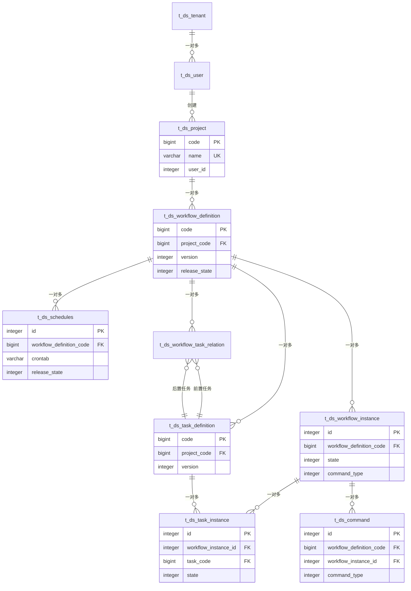

# DolphinScheduler 表结构分析

## 1. 概述

本文档基于 `docs/sql/3-3-0.sql` 文件，结合项目代码逻辑分析 DolphinScheduler 的数据库表结构。DolphinScheduler 采用 PostgreSQL 作为元数据存储数据库，使用 Quartz 作为分布式调度器。

### 1.1 表分类

DolphinScheduler 的表可以分为以下几类：

1. **Quartz 调度器相关表** (qrtz_*): 11 张表，用于 Quartz 分布式调度
2. **核心业务表**: 项目、工作流定义、任务定义等
3. **执行相关表**: 工作流实例、任务实例、命令等
4. **用户权限表**: 用户、租户、项目权限等
5. **资源管理表**: 数据源、文件资源、环境等
6. **告警相关表**: 告警组、告警记录等
7. **其他辅助表**: 版本、会话、审计日志等

### 1.2 表关系总览



## 2. 核心业务表

### 2.1 t_ds_project (项目表)

**表说明**: 存储项目基本信息，项目是 DolphinScheduler 中的顶层组织单位，所有工作流定义都归属于某个项目。

**字段注释**:

```sql
-- 项目表
CREATE TABLE IF NOT EXISTS t_ds_project (
    id          INTEGER     DEFAULT nextval('t_ds_project_id_sequence'::regclass) NOT NULL PRIMARY KEY COMMENT '主键ID，自增',
    name        VARCHAR(255) DEFAULT NULL COMMENT '项目名称，唯一',
    code        BIGINT                                                             NOT NULL COMMENT '项目代码，全局唯一标识',
    description VARCHAR(255) DEFAULT NULL COMMENT '项目描述',
    user_id     INTEGER COMMENT '创建用户ID，关联t_ds_user.id',
    flag        INTEGER      DEFAULT 1 COMMENT '项目状态：0-不可用，1-可用（Flag枚举）',
    create_time TIMESTAMP    DEFAULT CURRENT_TIMESTAMP COMMENT '创建时间',
    update_time TIMESTAMP    DEFAULT CURRENT_TIMESTAMP COMMENT '更新时间'
);

COMMENT ON TABLE t_ds_project IS '项目表，存储项目基本信息，项目是工作流定义的顶层组织单位';
COMMENT ON COLUMN t_ds_project.id IS '主键ID，自增';
COMMENT ON COLUMN t_ds_project.name IS '项目名称，全局唯一';
COMMENT ON COLUMN t_ds_project.code IS '项目代码，全局唯一标识，64位长整型';
COMMENT ON COLUMN t_ds_project.description IS '项目描述';
COMMENT ON COLUMN t_ds_project.user_id IS '创建用户ID，关联t_ds_user.id';
COMMENT ON COLUMN t_ds_project.flag IS '项目状态：0-不可用，1-可用（Flag枚举）';
COMMENT ON COLUMN t_ds_project.create_time IS '创建时间';
COMMENT ON COLUMN t_ds_project.update_time IS '更新时间';
```

**业务说明**:
- **code**: 项目代码是全局唯一标识，使用 64 位长整型，由系统自动生成
- **name**: 项目名称全局唯一，用于显示和查询
- **user_id**: 创建用户，具有项目管理员权限
- **flag**: 项目状态，0=不可用（已删除），1=可用
- 项目与工作流定义是一对多关系
- 项目权限通过 `t_ds_relation_project_user` 表管理

### 2.2 t_ds_workflow_definition (工作流定义表)

**表说明**: 存储工作流定义信息，包括工作流的 DAG 结构、节点位置、全局参数等。

**字段注释**:

```sql
-- 工作流定义表
CREATE TABLE IF NOT EXISTS t_ds_workflow_definition (
    id               INTEGER      DEFAULT nextval('t_ds_workflow_definition_id_sequence'::regclass) NOT NULL PRIMARY KEY,
    code             BIGINT                                                                         NOT NULL COMMENT '工作流定义代码，全局唯一标识',
    name             VARCHAR(255) DEFAULT NULL COMMENT '工作流定义名称',
    version          INTEGER      DEFAULT 1                                                         NOT NULL COMMENT '版本号，每次发布时递增',
    description      TEXT COMMENT '工作流描述',
    project_code     BIGINT COMMENT '所属项目代码，关联t_ds_project.code',
    release_state    INTEGER COMMENT '发布状态：0-未上线，1-已上线（ReleaseState枚举）',
    user_id          INTEGER COMMENT '创建用户ID，关联t_ds_user.id',
    global_params    TEXT COMMENT '全局参数，JSON格式存储',
    locations        TEXT COMMENT '节点位置信息，JSON格式存储，用于前端展示',
    warning_group_id INTEGER COMMENT '告警组ID，关联t_ds_alertgroup.id',
    flag             INTEGER COMMENT '是否可用：0-不可用，1-可用（Flag枚举）',
    timeout          INTEGER      DEFAULT 0 COMMENT '超时时间（秒），0表示不限制',
    execution_type   INTEGER      DEFAULT 0 COMMENT '执行类型：0-并行，1-串行等待（WorkflowExecutionTypeEnum）',
    create_time      TIMESTAMP COMMENT '创建时间',
    update_time      TIMESTAMP COMMENT '更新时间',
    CONSTRAINT workflow_definition_unique UNIQUE (name, project_code)
);

COMMENT ON TABLE t_ds_workflow_definition IS '工作流定义表，存储工作流的定义信息，包括DAG结构、节点位置、全局参数等';
COMMENT ON COLUMN t_ds_workflow_definition.code IS '工作流定义代码，全局唯一标识，64位长整型';
COMMENT ON COLUMN t_ds_workflow_definition.name IS '工作流定义名称，在同一项目内唯一';
COMMENT ON COLUMN t_ds_workflow_definition.version IS '版本号，每次发布时自动递增';
COMMENT ON COLUMN t_ds_workflow_definition.project_code IS '所属项目代码，关联t_ds_project.code';
COMMENT ON COLUMN t_ds_workflow_definition.release_state IS '发布状态：0-未上线(OFFLINE)，1-已上线(ONLINE)';
COMMENT ON COLUMN t_ds_workflow_definition.global_params IS '全局参数，JSON格式存储Property数组';
COMMENT ON COLUMN t_ds_workflow_definition.locations IS '节点位置信息，JSON格式存储，用于前端DAG展示';
COMMENT ON COLUMN t_ds_workflow_definition.timeout IS '超时时间（秒），0表示不限制';
COMMENT ON COLUMN t_ds_workflow_definition.execution_type IS '执行类型：0-并行(PARALLEL)，1-串行等待(SERIAL_WAIT)';
```

**业务说明**:
- **code**: 工作流定义代码，全局唯一，64 位长整型
- **version**: 版本号，每次发布时递增，用于版本管理
- **release_state**: 只有已上线的工作流才能被调度执行
- **locations**: 存储节点在前端 DAG 画布上的位置信息
- **global_params**: JSON 格式存储，可以包含系统参数和用户自定义参数
- **execution_type**: 执行类型，串行等待模式下同一时间只能运行一个实例
- 工作流定义与任务定义通过 `t_ds_workflow_task_relation` 表关联
- 工作流定义的变更历史存储在 `t_ds_workflow_definition_log` 表中

### 2.3 t_ds_task_definition (任务定义表)

**表说明**: 存储任务定义信息，包括任务类型、参数、重试策略等。

**字段注释**:

```sql
-- 任务定义表
CREATE TABLE IF NOT EXISTS t_ds_task_definition (
    id                      INTEGER      DEFAULT nextval('t_ds_task_definition_id_sequence'::regclass) NOT NULL PRIMARY KEY,
    code                    BIGINT                                                                     NOT NULL COMMENT '任务定义代码，全局唯一标识',
    name                    VARCHAR(255) DEFAULT NULL COMMENT '任务名称',
    version                 INTEGER      DEFAULT 1                                                     NOT NULL COMMENT '版本号，每次发布时递增',
    description             TEXT COMMENT '任务描述',
    project_code            BIGINT COMMENT '所属项目代码，关联t_ds_project.code',
    user_id                 INTEGER COMMENT '创建用户ID',
    task_type               VARCHAR(50)  DEFAULT NULL COMMENT '任务类型，如SHELL、SQL、PYTHON等',
    task_execute_type       INTEGER      DEFAULT 0 COMMENT '任务执行类型：0-批次，1-流式（TaskExecuteType）',
    task_params             TEXT COMMENT '任务参数，JSON格式存储，包含任务类型特定的配置',
    flag                    INTEGER COMMENT '是否可用：0-不可用，1-可用（Flag枚举）',
    task_priority           INTEGER      DEFAULT 2 COMMENT '任务优先级：0-最高，1-高，2-中，3-低，4-最低（Priority枚举）',
    worker_group            VARCHAR(255) DEFAULT NULL COMMENT 'Worker组名称，指定执行该任务的Worker组',
    environment_code        BIGINT       DEFAULT -1 COMMENT '环境代码，关联t_ds_environment.code，-1表示使用默认环境',
    fail_retry_times        INTEGER COMMENT '失败重试次数',
    fail_retry_interval     INTEGER COMMENT '失败重试间隔（秒）',
    timeout_flag            INTEGER COMMENT '是否启用超时：0-不启用，1-启用（Flag枚举）',
    timeout_notify_strategy INTEGER COMMENT '超时通知策略',
    timeout                 INTEGER      DEFAULT 0 COMMENT '超时时间（秒）',
    delay_time              INTEGER      DEFAULT 0 COMMENT '延迟执行时间（秒）',
    task_group_id           INTEGER COMMENT '任务组ID，关联t_ds_task_group.id，用于任务组限流',
    task_group_priority     INTEGER      DEFAULT 0 COMMENT '任务组内优先级',
    resource_ids            TEXT COMMENT '资源文件ID列表，多个ID用逗号分隔',
    cpu_quota               INTEGER      DEFAULT -1 NOT NULL COMMENT 'CPU配额（毫核），-1表示不限制',
    memory_max              INTEGER      DEFAULT -1 NOT NULL COMMENT '最大内存（MB），-1表示不限制',
    create_time             TIMESTAMP COMMENT '创建时间',
    update_time             TIMESTAMP COMMENT '更新时间'
);

COMMENT ON TABLE t_ds_task_definition IS '任务定义表，存储任务的定义信息，包括任务类型、参数、重试策略、资源配额等';
COMMENT ON COLUMN t_ds_task_definition.code IS '任务定义代码，全局唯一标识，64位长整型';
COMMENT ON COLUMN t_ds_task_definition.task_type IS '任务类型，如SHELL、SQL、PYTHON、HTTP、DATAX等';
COMMENT ON COLUMN t_ds_task_definition.task_params IS '任务参数，JSON格式存储，不同任务类型有不同的参数结构';
COMMENT ON COLUMN t_ds_task_definition.worker_group IS 'Worker组名称，用于指定执行任务的Worker节点组';
COMMENT ON COLUMN t_ds_task_definition.environment_code IS '环境代码，用于指定任务执行环境（如开发、测试、生产）';
COMMENT ON COLUMN t_ds_task_definition.task_group_id IS '任务组ID，用于任务组限流，同一任务组的任务会串行执行';
```

**业务说明**:
- **code**: 任务定义代码，全局唯一，64 位长整型
- **task_type**: 支持多种任务类型，每种类型有不同的参数结构
- **task_group_id**: 用于任务组限流，同一组的任务会按优先级串行执行
- **cpu_quota/memory_max**: 资源配额，用于 Kubernetes 等容器化环境
- 任务定义的变更历史存储在 `t_ds_task_definition_log` 表中
- 任务定义通过 `t_ds_workflow_task_relation` 表关联到工作流定义

### 2.4 t_ds_workflow_task_relation (工作流任务关系表)

**表说明**: 存储工作流定义中任务之间的依赖关系，定义工作流的 DAG 结构。

**字段注释**:

```sql
-- 工作流任务关系表
CREATE TABLE IF NOT EXISTS t_ds_workflow_task_relation (
    id                          INTEGER      DEFAULT nextval('t_ds_workflow_task_relation_id_sequence'::regclass) NOT NULL PRIMARY KEY,
    name                        VARCHAR(255) DEFAULT NULL COMMENT '关系名称，通常为空',
    project_code                BIGINT COMMENT '所属项目代码，关联t_ds_project.code',
    workflow_definition_code    BIGINT COMMENT '工作流定义代码，关联t_ds_workflow_definition.code',
    workflow_definition_version INTEGER COMMENT '工作流定义版本号',
    pre_task_code               BIGINT COMMENT '前置任务代码，关联t_ds_task_definition.code，0表示开始节点',
    pre_task_version            INTEGER      DEFAULT 0 COMMENT '前置任务版本号',
    post_task_code              BIGINT COMMENT '后置任务代码，关联t_ds_task_definition.code',
    post_task_version           INTEGER      DEFAULT 0 COMMENT '后置任务版本号',
    condition_type              INTEGER COMMENT '条件类型，用于分支判断',
    condition_params            TEXT COMMENT '条件参数，JSON格式存储',
    create_time                 TIMESTAMP COMMENT '创建时间',
    update_time                 TIMESTAMP COMMENT '更新时间'
);

COMMENT ON TABLE t_ds_workflow_task_relation IS '工作流任务关系表，定义工作流中任务之间的依赖关系，构建DAG结构';
COMMENT ON COLUMN t_ds_workflow_task_relation.pre_task_code IS '前置任务代码，0表示开始节点（没有前置任务）';
COMMENT ON COLUMN t_ds_workflow_task_relation.post_task_code IS '后置任务代码';
COMMENT ON COLUMN t_ds_workflow_task_relation.condition_type IS '条件类型，用于分支节点，定义后置任务的触发条件';
COMMENT ON COLUMN t_ds_workflow_task_relation.condition_params IS '条件参数，JSON格式存储，包含条件表达式的详细信息';
```

**业务说明**:
- 每条记录表示一条有向边：`pre_task_code -> post_task_code`
- **pre_task_code = 0**: 表示开始节点，没有前置任务
- **condition_type/condition_params**: 用于条件分支节点，定义后置任务的触发条件
- 关系变更历史存储在 `t_ds_workflow_task_relation_log` 表中
- 通过此表可以构建完整的 DAG 图

### 2.5 t_ds_schedules (调度表)

**表说明**: 存储工作流的调度配置，包括 Cron 表达式、时区、开始/结束时间等。

**字段注释**:

```sql
-- 调度表
CREATE TABLE IF NOT EXISTS t_ds_schedules (
    id                         INTEGER     DEFAULT nextval('t_ds_schedules_id_sequence'::regclass) NOT NULL PRIMARY KEY,
    workflow_definition_code   BIGINT                                                              NOT NULL COMMENT '工作流定义代码，关联t_ds_workflow_definition.code',
    start_time                 TIMESTAMP                                                           NOT NULL COMMENT '调度开始时间',
    end_time                   TIMESTAMP                                                           NOT NULL COMMENT '调度结束时间，null表示无结束时间',
    timezone_id                VARCHAR(40) DEFAULT NULL COMMENT '时区ID，如Asia/Shanghai、UTC等',
    crontab                    VARCHAR(255)                                                        NOT NULL COMMENT 'Cron表达式，定义调度规则',
    failure_strategy           INTEGER                                                             NOT NULL COMMENT '失败策略：0-结束，1-继续（FailureStrategy枚举）',
    user_id                    INTEGER                                                             NOT NULL COMMENT '创建用户ID，关联t_ds_user.id',
    release_state              INTEGER                                                             NOT NULL COMMENT '发布状态：0-未上线，1-已上线（ReleaseState枚举）',
    warning_type               INTEGER                                                             NOT NULL COMMENT '告警类型：0-无，1-成功，2-失败，3-全部（WarningType枚举）',
    warning_group_id           INTEGER COMMENT '告警组ID，关联t_ds_alertgroup.id',
    workflow_instance_priority INTEGER     DEFAULT 2 COMMENT '工作流实例优先级：0-最高，1-高，2-中，3-低，4-最低（Priority枚举）',
    worker_group               VARCHAR(255) COMMENT 'Worker组名称，指定执行该调度的Worker组',
    tenant_code                VARCHAR(64)  DEFAULT 'default' COMMENT '租户代码，关联t_ds_tenant.tenant_code',
    environment_code           BIGINT      DEFAULT -1 COMMENT '环境代码，关联t_ds_environment.code，-1表示使用默认环境',
    create_time                TIMESTAMP                                                           NOT NULL COMMENT '创建时间',
    update_time                TIMESTAMP                                                           NOT NULL COMMENT '更新时间'
);

COMMENT ON TABLE t_ds_schedules IS '调度表，存储工作流的调度配置信息，包括Cron表达式、时区、时间范围等';
COMMENT ON COLUMN t_ds_schedules.workflow_definition_code IS '工作流定义代码，一个工作流定义只能有一个调度配置';
COMMENT ON COLUMN t_ds_schedules.crontab IS 'Cron表达式，定义工作流的触发规则，如0 0 12 * * ?表示每天12点执行';
COMMENT ON COLUMN t_ds_schedules.timezone_id IS '时区ID，用于Cron表达式的时区解析，如Asia/Shanghai、America/New_York等';
COMMENT ON COLUMN t_ds_schedules.release_state IS '发布状态：0-未上线(OFFLINE)，1-已上线(ONLINE)，只有上线状态才会被Quartz调度';
COMMENT ON COLUMN t_ds_schedules.failure_strategy IS '失败策略：0-结束(END)，1-继续(CONTINUE)';
COMMENT ON COLUMN t_ds_schedules.warning_type IS '告警类型：0-无(NONE)，1-成功(SUCCESS)，2-失败(FAILURE)，3-全部(ALL)';
```

**业务说明**:
- 一个工作流定义只能有一个调度配置（一对一关系）
- **release_state = ONLINE**: 只有上线状态才会被 Quartz 调度器调度
- **crontab + timezone_id**: 组合定义调度规则
- 调度配置会同步到 Quartz 的 `qrtz_triggers` 表
- 调度开始时间/结束时间用于限制调度的时间范围

## 3. 执行相关表

### 3.1 t_ds_command (命令表)

**表说明**: 存储待执行的工作流命令，是工作流执行的入口。Master 会定期从该表读取命令并执行。

**字段注释**:

```sql
-- 命令表
CREATE TABLE IF NOT EXISTS t_ds_command (
    id                          INTEGER     DEFAULT nextval('t_ds_command_id_sequence'::regclass) NOT NULL PRIMARY KEY,
    command_type                INTEGER COMMENT '命令类型：0-启动，6-调度触发，7-重复运行，8-暂停，9-停止等（CommandType枚举）',
    workflow_definition_code    BIGINT                                                           NOT NULL COMMENT '工作流定义代码，关联t_ds_workflow_definition.code',
    workflow_definition_version INTEGER     DEFAULT 0 COMMENT '工作流定义版本号',
    command_param               TEXT COMMENT '命令参数，JSON格式存储，包含执行工作流所需的各种参数',
    task_depend_type            INTEGER COMMENT '任务依赖类型（已废弃）',
    failure_strategy            INTEGER     DEFAULT 0 COMMENT '失败策略（已废弃）',
    warning_type                INTEGER     DEFAULT 0 COMMENT '告警类型（已废弃）',
    warning_group_id            INTEGER COMMENT '告警组ID（已废弃）',
    schedule_time               TIMESTAMP COMMENT '调度时间（已废弃）',
    start_time                  TIMESTAMP COMMENT '开始时间（已废弃）',
    executor_id                 INTEGER COMMENT '执行者ID（已废弃）',
    update_time                 TIMESTAMP COMMENT '更新时间（已废弃）',
    workflow_instance_priority  INTEGER     DEFAULT 2 COMMENT '工作流实例优先级：0-最高，1-高，2-中，3-低，4-最低（Priority枚举）',
    worker_group                VARCHAR(255) COMMENT 'Worker组名称（已废弃）',
    tenant_code                 VARCHAR(64)  DEFAULT 'default' COMMENT '租户代码（已废弃）',
    environment_code            BIGINT       DEFAULT -1 COMMENT '环境代码（已废弃）',
    dry_run                     INTEGER      DEFAULT 0 COMMENT '干运行标志（已废弃）',
    workflow_instance_id        INTEGER      DEFAULT 0 COMMENT '工作流实例ID，关联t_ds_workflow_instance.id，某些命令类型需要指定实例ID',
    test_flag                   INTEGER COMMENT '测试标志（已废弃）'
);

COMMENT ON TABLE t_ds_command IS '命令表，存储待执行的工作流命令，Master会定期从该表读取命令并执行';
COMMENT ON COLUMN t_ds_command.command_type IS '命令类型：0-启动(START_PROCESS)，6-调度触发(SCHEDULER)，7-重复运行(REPEAT_RUNNING)，8-暂停(PAUSE)，9-停止(STOP)等';
COMMENT ON COLUMN t_ds_command.workflow_definition_code IS '工作流定义代码，指定要执行的工作流';
COMMENT ON COLUMN t_ds_command.command_param IS '命令参数，JSON格式存储，包含执行工作流所需的各种参数（如补数参数、时区信息等）';
COMMENT ON COLUMN t_ds_command.workflow_instance_id IS '工作流实例ID，对于STOP、PAUSE等命令类型，需要指定具体的工作流实例ID';
COMMENT ON COLUMN t_ds_command.workflow_instance_priority IS '工作流实例优先级，用于任务调度的优先级排序';
```

**业务说明**:
- Command 是工作流执行的入口实体
- **command_type**: 不同的命令类型会触发不同的处理逻辑
- **command_param**: JSON 格式，包含命令执行所需的各种参数
- Master 的 `CommandEngine` 会定期调用 `ICommandFetcher.fetchCommands()` 从数据库读取命令
- 命令处理后会创建 `WorkflowInstance`，然后从表中删除该命令（确保只执行一次）
- 执行失败的命令会移动到 `t_ds_error_command` 表
- 基于 ID 的 Slot 分片策略实现 Master 集群的负载均衡

**命令类型说明**:

| 命令类型 | Code | 说明 |
|---------|------|------|
| START_PROCESS | 0 | 启动新的工作流实例 |
| START_CURRENT_TASK_PROCESS | 1 | 从当前节点启动（已废弃） |
| RECOVER_TOLERANCE_FAULT_PROCESS | 2 | 容错恢复 |
| RECOVER_SUSPENDED_PROCESS | 3 | 恢复暂停的工作流实例 |
| START_FAILURE_TASK_PROCESS | 4 | 从失败任务开始重新运行 |
| COMPLEMENT_DATA | 5 | 补数 |
| SCHEDULER | 6 | 调度触发（由 Quartz 触发） |
| REPEAT_RUNNING | 7 | 重复运行 |
| PAUSE | 8 | 暂停 |
| STOP | 9 | 停止 |
| RECOVER_SERIAL_WAIT | 11 | 恢复串行等待 |
| EXECUTE_TASK | 12 | 执行任务节点 |
| DYNAMIC_GENERATION | 13 | 动态生成 |

### 3.2 t_ds_workflow_instance (工作流实例表)

**表说明**: 存储工作流实例的执行信息，包括状态、执行时间、参数等。

**字段注释**:

```sql
-- 工作流实例表
CREATE TABLE IF NOT EXISTS t_ds_workflow_instance (
    id                          INTEGER      DEFAULT nextval('t_ds_workflow_instance_id_sequence'::regclass) NOT NULL PRIMARY KEY,
    name                        VARCHAR(255) DEFAULT NULL COMMENT '工作流实例名称，格式：工作流定义名称-版本号-时间戳',
    workflow_definition_code    BIGINT COMMENT '工作流定义代码，关联t_ds_workflow_definition.code',
    workflow_definition_version INTEGER      DEFAULT 1 NOT NULL COMMENT '工作流定义版本号',
    project_code                BIGINT COMMENT '所属项目代码，关联t_ds_project.code',
    state                       INTEGER COMMENT '执行状态：0-提交成功，1-运行中，2-准备暂停，3-暂停，4-准备停止，5-停止，6-失败，7-成功，14-串行等待，18-故障转移（WorkflowExecutionStatus枚举）',
    state_history               TEXT COMMENT '状态历史，JSON格式存储StateDesc数组，记录状态变化历史',
    recovery                    INTEGER COMMENT '是否恢复：0-否，1-是（Flag枚举）',
    start_time                  TIMESTAMP COMMENT '开始执行时间',
    end_time                    TIMESTAMP COMMENT '结束执行时间',
    run_times                   INTEGER COMMENT '运行次数，用于重试场景',
    host                        VARCHAR(135) DEFAULT NULL COMMENT '执行主机地址，Master节点的IP地址',
    command_type                INTEGER COMMENT '命令类型：0-启动，6-调度触发，7-重复运行，8-暂停，9-停止等（CommandType枚举）',
    command_param               TEXT COMMENT '命令参数，JSON格式存储，包含执行工作流所需的各种参数',
    task_depend_type            INTEGER COMMENT '任务依赖类型（TaskDependType枚举）',
    max_try_times               INTEGER      DEFAULT 0 COMMENT '最大重试次数（已废弃）',
    failure_strategy            INTEGER      DEFAULT 0 COMMENT '失败策略：0-结束，1-继续（FailureStrategy枚举）',
    warning_type                INTEGER      DEFAULT 0 COMMENT '告警类型：0-无，1-成功，2-失败，3-全部（WarningType枚举）',
    warning_group_id            INTEGER COMMENT '告警组ID，关联t_ds_alertgroup.id',
    schedule_time               TIMESTAMP COMMENT '调度时间，记录调度触发的时间',
    command_start_time          TIMESTAMP COMMENT '命令开始时间，记录命令创建的时间',
    global_params               TEXT COMMENT '全局参数，JSON格式存储，包含用户自定义参数和系统参数',
    workflow_instance_json      TEXT COMMENT '工作流实例JSON，存储工作流实例的完整JSON结构（已废弃）',
    flag                        INTEGER      DEFAULT 1 COMMENT '是否可用：0-不可用，1-可用（Flag枚举）',
    update_time                 TIMESTAMP COMMENT '更新时间',
    is_sub_workflow             INTEGER      DEFAULT 0 COMMENT '是否子工作流：0-否，1-是（Flag枚举）',
    executor_id                 INTEGER      NOT NULL COMMENT '执行者ID，关联t_ds_user.id，记录执行该工作流的用户',
    executor_name               VARCHAR(64)  DEFAULT NULL COMMENT '执行者名称',
    history_cmd                 TEXT COMMENT '历史命令，逗号分隔的命令类型字符串，记录工作流实例执行过的所有命令',
    dependence_schedule_times    TEXT COMMENT '依赖调度时间，用于补数场景，记录依赖的调度时间列表',
    workflow_instance_priority  INTEGER      DEFAULT 2 COMMENT '工作流实例优先级：0-最高，1-高，2-中，3-低，4-最低（Priority枚举）',
    worker_group                VARCHAR(255) COMMENT 'Worker组名称，指定执行该工作流的Worker组',
    environment_code            BIGINT       DEFAULT -1 COMMENT '环境代码，关联t_ds_environment.code，-1表示使用默认环境',
    timeout                     INTEGER      DEFAULT 0 COMMENT '超时时间（秒），0表示不限制',
    tenant_code                 VARCHAR(64)  DEFAULT 'default' COMMENT '租户代码，关联t_ds_tenant.tenant_code',
    var_pool                    TEXT COMMENT '变量池，JSON格式存储，包含工作流执行过程中的所有变量',
    dry_run                     INTEGER      DEFAULT 0 COMMENT '干运行标志：0-否，1-是（Flag枚举），用于测试模式',
    next_workflow_instance_id   INTEGER      DEFAULT 0 COMMENT '下一个工作流实例ID（已废弃）',
    restart_time                TIMESTAMP COMMENT '重启时间，记录工作流重启的时间',
    test_flag                   INTEGER COMMENT '测试标志：0-否，1-是（Flag枚举）'
);

COMMENT ON TABLE t_ds_workflow_instance IS '工作流实例表，存储工作流实例的执行信息，包括状态、执行时间、参数等';
COMMENT ON COLUMN t_ds_workflow_instance.id IS '主键ID，自增';
COMMENT ON COLUMN t_ds_workflow_instance.name IS '工作流实例名称，格式：工作流定义名称-版本号-时间戳，由系统自动生成';
COMMENT ON COLUMN t_ds_workflow_instance.workflow_definition_code IS '工作流定义代码，关联t_ds_workflow_definition.code';
COMMENT ON COLUMN t_ds_workflow_instance.workflow_definition_version IS '工作流定义版本号，用于版本管理';
COMMENT ON COLUMN t_ds_workflow_instance.project_code IS '所属项目代码，关联t_ds_project.code';
COMMENT ON COLUMN t_ds_workflow_instance.state IS '执行状态：0-提交成功(SUBMITTED_SUCCESS)，1-运行中(RUNNING_EXECUTION)，2-准备暂停(READY_PAUSE)，3-暂停(PAUSE)，4-准备停止(READY_STOP)，5-停止(STOP)，6-失败(FAILURE)，7-成功(SUCCESS)，14-串行等待(SERIAL_WAIT)，18-故障转移(FAILOVER)';
COMMENT ON COLUMN t_ds_workflow_instance.state_history IS '状态历史，JSON格式存储StateDesc数组，每个StateDesc包含时间、状态和描述，用于追踪状态变化';
COMMENT ON COLUMN t_ds_workflow_instance.recovery IS '是否恢复：0-否(NO)，1-是(YES)，用于标识是否为故障恢复的工作流实例';
COMMENT ON COLUMN t_ds_workflow_instance.start_time IS '开始执行时间，记录工作流实例开始执行的时间';
COMMENT ON COLUMN t_ds_workflow_instance.end_time IS '结束执行时间，记录工作流实例结束执行的时间（成功或失败）';
COMMENT ON COLUMN t_ds_workflow_instance.run_times IS '运行次数，用于重试场景，记录工作流实例被执行的次数';
COMMENT ON COLUMN t_ds_workflow_instance.host IS '执行主机地址，Master节点的IP地址，记录执行该工作流实例的Master节点';
COMMENT ON COLUMN t_ds_workflow_instance.command_type IS '命令类型，记录触发该工作流实例的命令类型（如START_PROCESS、SCHEDULER等）';
COMMENT ON COLUMN t_ds_workflow_instance.command_param IS '命令参数，JSON格式存储，包含执行工作流所需的各种参数（如补数参数、时区信息等）';
COMMENT ON COLUMN t_ds_workflow_instance.task_depend_type IS '任务依赖类型，定义任务之间的依赖关系';
COMMENT ON COLUMN t_ds_workflow_instance.failure_strategy IS '失败策略：0-结束(END)，1-继续(CONTINUE)，定义任务失败后的处理策略';
COMMENT ON COLUMN t_ds_workflow_instance.warning_type IS '告警类型：0-无(NONE)，1-成功(SUCCESS)，2-失败(FAILURE)，3-全部(ALL)';
COMMENT ON COLUMN t_ds_workflow_instance.schedule_time IS '调度时间，记录调度触发的时间，用于补数场景';
COMMENT ON COLUMN t_ds_workflow_instance.command_start_time IS '命令开始时间，记录命令创建的时间';
COMMENT ON COLUMN t_ds_workflow_instance.global_params IS '全局参数，JSON格式存储Property数组，包含用户自定义参数和系统参数';
COMMENT ON COLUMN t_ds_workflow_instance.is_sub_workflow IS '是否子工作流：0-否(NO)，1-是(YES)，用于标识是否为子工作流实例';
COMMENT ON COLUMN t_ds_workflow_instance.executor_id IS '执行者ID，关联t_ds_user.id，记录执行该工作流的用户';
COMMENT ON COLUMN t_ds_workflow_instance.executor_name IS '执行者名称，冗余字段，用于快速查询';
COMMENT ON COLUMN t_ds_workflow_instance.history_cmd IS '历史命令，逗号分隔的命令类型字符串，记录工作流实例执行过的所有命令（如START_PROCESS,REPEAT_RUNNING）';
COMMENT ON COLUMN t_ds_workflow_instance.dependence_schedule_times IS '依赖调度时间，用于补数场景，记录依赖的调度时间列表';
COMMENT ON COLUMN t_ds_workflow_instance.workflow_instance_priority IS '工作流实例优先级：0-最高(HIGHEST)，1-高(HIGH)，2-中(MEDIUM)，3-低(LOW)，4-最低(LOWEST)，用于任务调度的优先级排序';
COMMENT ON COLUMN t_ds_workflow_instance.worker_group IS 'Worker组名称，指定执行该工作流的Worker组，用于资源隔离';
COMMENT ON COLUMN t_ds_workflow_instance.environment_code IS '环境代码，关联t_ds_environment.code，-1表示使用默认环境，用于多环境管理';
COMMENT ON COLUMN t_ds_workflow_instance.timeout IS '超时时间（秒），0表示不限制，超过该时间工作流会被强制停止';
COMMENT ON COLUMN t_ds_workflow_instance.tenant_code IS '租户代码，关联t_ds_tenant.tenant_code，用于多租户隔离';
COMMENT ON COLUMN t_ds_workflow_instance.var_pool IS '变量池，JSON格式存储，包含工作流执行过程中的所有变量，用于任务间的数据传递';
COMMENT ON COLUMN t_ds_workflow_instance.dry_run IS '干运行标志：0-否(NO)，1-是(YES)，用于测试模式，不会真正执行任务';
COMMENT ON COLUMN t_ds_workflow_instance.restart_time IS '重启时间，记录工作流重启的时间，用于故障恢复场景';
COMMENT ON COLUMN t_ds_workflow_instance.test_flag IS '测试标志：0-否(NO)，1-是(YES)，用于标识是否为测试任务';
```

**业务说明**:
- **name**: 工作流实例名称由系统自动生成，格式为 `工作流定义名称-版本号-时间戳`，用于唯一标识实例
- **state**: 工作流实例的状态流转：`SUBMITTED_SUCCESS(0) -> RUNNING_EXECUTION(1) -> SUCCESS(7)/FAILURE(6)`
- **state_history**: 记录状态变化历史，每个状态变化都会追加到 `state_history` 中，格式为 JSON 数组
- **command_type**: 记录触发该工作流实例的命令类型，如 `SCHEDULER(6)` 表示由调度器触发
- **history_cmd**: 记录工作流实例执行过的所有命令，用逗号分隔，如 `START_PROCESS,REPEAT_RUNNING`
- **var_pool**: 变量池存储工作流执行过程中的所有变量，包括全局参数、任务输出参数等，用于任务间的数据传递
- **is_sub_workflow**: 标识是否为子工作流实例，子工作流由父工作流中的子工作流任务节点触发
- **executor_id/executor_name**: 记录执行该工作流的用户，用于权限控制和审计
- **worker_group**: 指定执行该工作流的 Worker 组，用于资源隔离和负载均衡
- **environment_code**: 环境代码用于多环境管理，不同环境可以有不同的配置和资源
- **timeout**: 超时时间，超过该时间工作流会被强制停止，防止长时间运行的任务占用资源
- **dry_run**: 干运行模式用于测试，不会真正执行任务，只验证工作流定义的正确性
- **recovery**: 标识是否为故障恢复的工作流实例，用于故障转移场景
- **dependence_schedule_times**: 用于补数场景，记录依赖的调度时间列表，支持跨天补数
- 工作流实例与任务实例是一对多关系，通过 `t_ds_task_instance.workflow_instance_id` 关联
- 工作流实例与命令是一对多关系，一个工作流实例可能由多个命令触发（如重复运行）
- 工作流实例的状态变化会触发相应的事件，如 `WorkflowStartLifecycleEvent`、`WorkflowEndLifecycleEvent` 等