# CAS 工作原理深度解析

## 1. CAS 概述

CAS（Compare-And-Swap，比较并交换）是一种无锁（Lock-Free）的原子操作，是现代并发编程的基础。它通过硬件级别的原子指令实现，避免了传统锁机制带来的线程阻塞和上下文切换开销。

### 1.1 CAS 核心思想

CAS 操作包含三个操作数：
- **内存位置（V）**：要更新的变量
- **期望值（A）**：变量当前应该的值
- **新值（B）**：要设置的新值

**操作逻辑**：
```
如果 V == A，则将 V 更新为 B，返回 true
否则，不更新，返回 false
```

### 1.2 CAS 操作流程

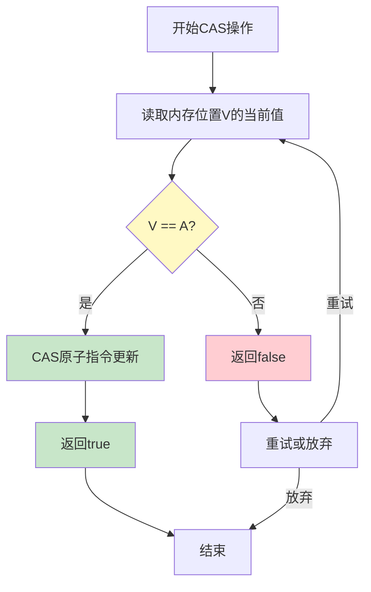
```mermaid
flowchart TD
    Start[开始CAS操作]
    Read[读取内存位置V的当前值]
    Compare{V == A?}
    Update[CAS原子指令更新]
    Success[返回true]
    Fail[返回false]
    Retry[重试或放弃]
    
    Start --> Read
    Read --> Compare
    Compare -->|是| Update
    Compare -->|否| Fail
    Update --> Success
    Fail --> Retry
    Retry -->|重试| Read
    Retry -->|放弃| End[结束]
    Success --> End
    
    style Compare fill:#fff9c4
    style Update fill:#c8e6c9
    style Success fill:#c8e6c9
    style Fail fill:#ffcdd2
```

## 2. CAS 底层实现原理

### 2.1 硬件支持

CAS 操作依赖于 CPU 提供的原子指令，不同架构的实现方式：

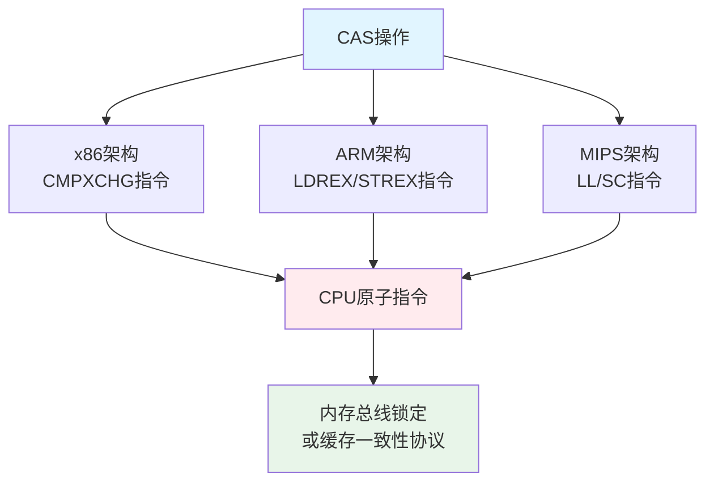
```mermaid
graph TB
    CAS[CAS操作]
    X86[x86架构<br/>CMPXCHG指令]
    ARM[ARM架构<br/>LDREX/STREX指令]
    MIPS[MIPS架构<br/>LL/SC指令]
    
    CAS --> X86
    CAS --> ARM
    CAS --> MIPS
    
    X86 --> CPU[CPU原子指令]
    ARM --> CPU
    MIPS --> CPU
    
    CPU --> Memory[内存总线锁定<br/>或缓存一致性协议]
    
    style CAS fill:#e1f5ff
    style CPU fill:#ffebee
    style Memory fill:#e8f5e9
```

### 2.2 CPU 原子指令执行过程

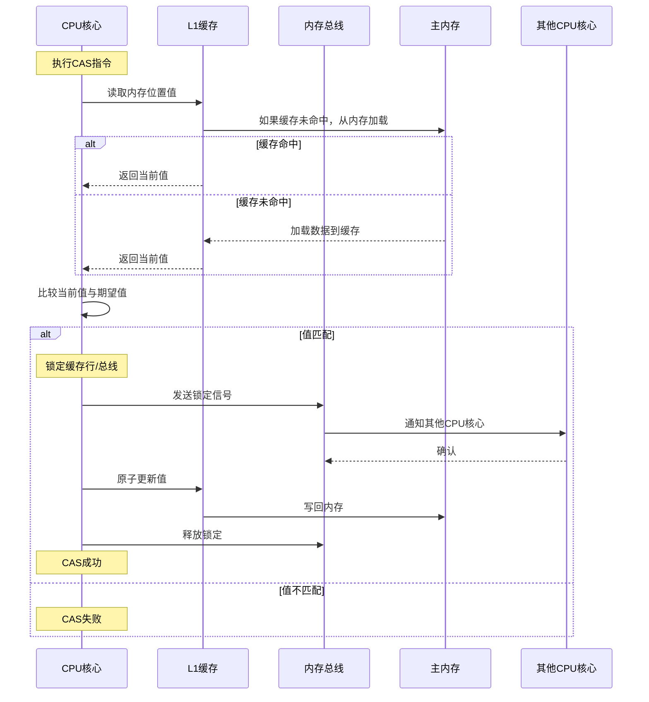
```mermaid
sequenceDiagram
    participant CPU as CPU核心
    participant Cache as L1缓存
    participant Bus as 内存总线
    participant Memory as 主内存
    participant OtherCPU as 其他CPU核心
    
    Note over CPU: 执行CAS指令
    CPU->>Cache: 读取内存位置值
    Cache->>Memory: 如果缓存未命中，从内存加载
    
    alt 缓存命中
        Cache-->>CPU: 返回当前值
    else 缓存未命中
        Memory-->>Cache: 加载数据到缓存
        Cache-->>CPU: 返回当前值
    end
    
    CPU->>CPU: 比较当前值与期望值
    
    alt 值匹配
        Note over CPU: 锁定缓存行/总线
        CPU->>Bus: 发送锁定信号
        Bus->>OtherCPU: 通知其他CPU核心
        OtherCPU-->>Bus: 确认
        CPU->>Cache: 原子更新值
        Cache->>Memory: 写回内存
        CPU->>Bus: 释放锁定
        Note over CPU: CAS成功
    else 值不匹配
        Note over CPU: CAS失败
    end
```

### 2.3 缓存一致性协议（MESI）

现代多核 CPU 使用缓存一致性协议确保多核之间的数据一致性：

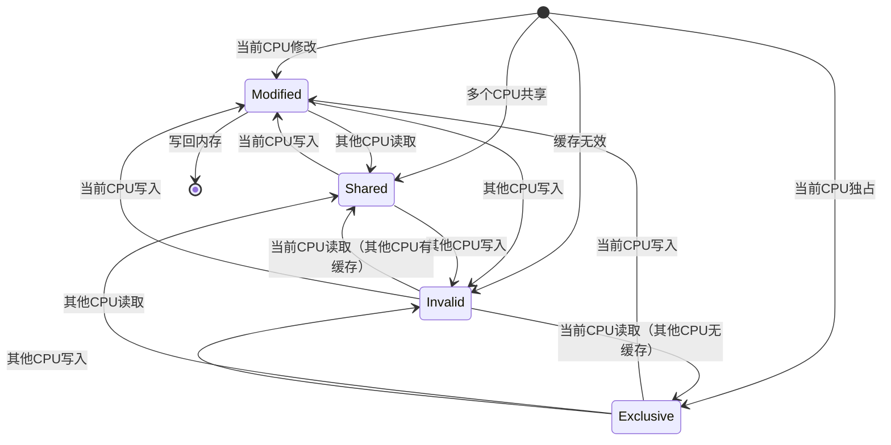
```mermaid
stateDiagram-v2
    [*] --> Modified: 当前CPU修改
    [*] --> Exclusive: 当前CPU独占
    [*] --> Shared: 多个CPU共享
    [*] --> Invalid: 缓存无效
    
    Modified --> Shared: 其他CPU读取
    Modified --> Invalid: 其他CPU写入
    Modified --> [*]: 写回内存
    
    Exclusive --> Modified: 当前CPU写入
    Exclusive --> Shared: 其他CPU读取
    Exclusive --> Invalid: 其他CPU写入
    
    Shared --> Modified: 当前CPU写入
    Shared --> Invalid: 其他CPU写入
    
    Invalid --> Exclusive: 当前CPU读取（其他CPU无缓存）
    Invalid --> Shared: 当前CPU读取（其他CPU有缓存）
    Invalid --> Modified: 当前CPU写入
```

**MESI 状态说明**：
- **Modified (M)**：缓存行已被修改，与主内存不一致
- **Exclusive (E)**：缓存行只被当前 CPU 缓存，未被修改
- **Shared (S)**：缓存行被多个 CPU 共享，与主内存一致
- **Invalid (I)**：缓存行无效，需要重新加载

### 2.4 CAS 在缓存一致性中的作用

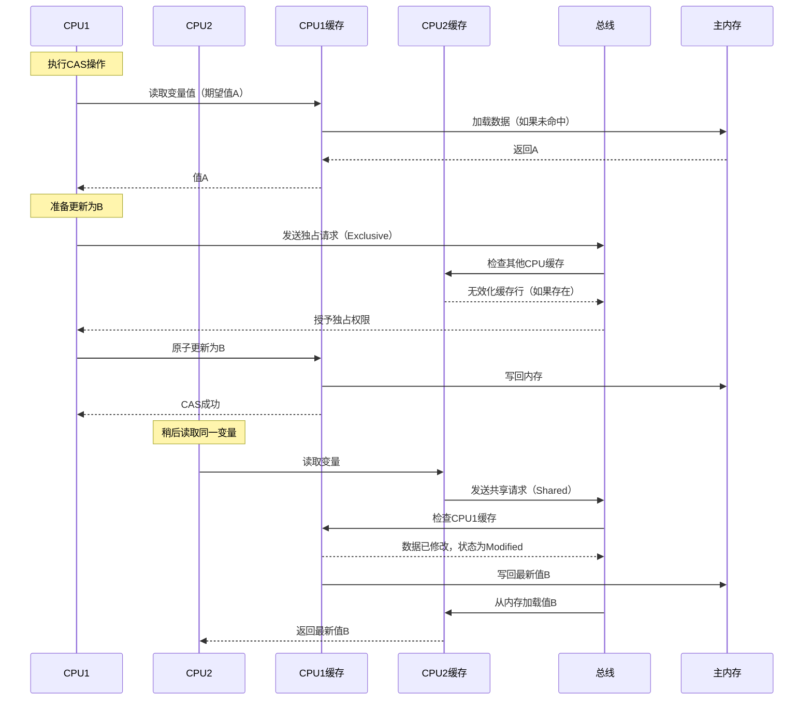
```mermaid
sequenceDiagram
    participant CPU1 as CPU1
    participant CPU2 as CPU2
    participant Cache1 as CPU1缓存
    participant Cache2 as CPU2缓存
    participant Bus as 总线
    participant Memory as 主内存
    
    Note over CPU1: 执行CAS操作
    CPU1->>Cache1: 读取变量值（期望值A）
    Cache1->>Memory: 加载数据（如果未命中）
    Memory-->>Cache1: 返回A
    Cache1-->>CPU1: 值A
    
    Note over CPU1: 准备更新为B
    CPU1->>Bus: 发送独占请求（Exclusive）
    Bus->>Cache2: 检查其他CPU缓存
    Cache2-->>Bus: 无效化缓存行（如果存在）
    Bus-->>CPU1: 授予独占权限
    
    CPU1->>Cache1: 原子更新为B
    Cache1->>Memory: 写回内存
    Cache1-->>CPU1: CAS成功
    
    Note over CPU2: 稍后读取同一变量
    CPU2->>Cache2: 读取变量
    Cache2->>Bus: 发送共享请求（Shared）
    Bus->>Cache1: 检查CPU1缓存
    Cache1-->>Bus: 数据已修改，状态为Modified
    Cache1->>Memory: 写回最新值B
    Bus->>Cache2: 从内存加载值B
    Cache2-->>CPU2: 返回最新值B
```

## 3. Java 中的 CAS 实现

### 3.1 Unsafe 类

Java 通过 `sun.misc.Unsafe` 类提供 CAS 操作，该类包含多个 CAS 方法：

```java
public final native boolean compareAndSwapObject(Object o, long offset, 
                                                 Object expected, Object x);
public final native boolean compareAndSwapInt(Object o, long offset, 
                                              int expected, int x);
public final native boolean compareAndSwapLong(Object o, long offset, 
                                                long expected, long x);
```

### 3.2 Atomic 类实现

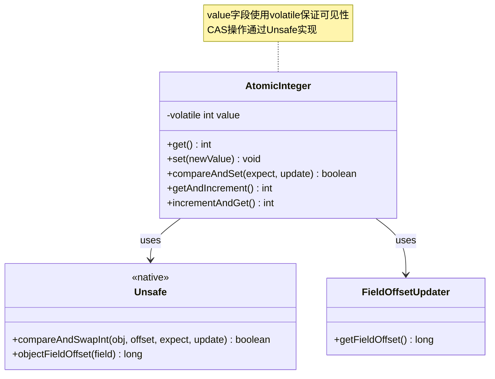
```mermaid
classDiagram
    class AtomicInteger {
        -volatile int value
        +get() int
        +set(newValue) void
        +compareAndSet(expect, update) boolean
        +getAndIncrement() int
        +incrementAndGet() int
    }
    
    class Unsafe {
        <<native>>
        +compareAndSwapInt(obj, offset, expect, update) boolean
        +objectFieldOffset(field) long
    }
    
    class FieldOffsetUpdater {
        +getFieldOffset() long
    }
    
    AtomicInteger --> Unsafe : uses
    AtomicInteger --> FieldOffsetUpdater : uses
    
    note for AtomicInteger "value字段使用volatile保证可见性<br/>CAS操作通过Unsafe实现"
```

### 3.3 CAS 操作示例

```java
public class AtomicInteger {
    private static final Unsafe unsafe = Unsafe.getUnsafe();
    private static final long valueOffset; // value字段的内存偏移量
    
    static {
        try {
            valueOffset = unsafe.objectFieldOffset
                (AtomicInteger.class.getDeclaredField("value"));
        } catch (Exception ex) { throw new Error(ex); }
    }
    
    private volatile int value;
    
    public final boolean compareAndSet(int expect, int update) {
        return unsafe.compareAndSwapInt(this, valueOffset, expect, update);
    }
    
    public final int getAndIncrement() {
        return unsafe.getAndAddInt(this, valueOffset, 1);
    }
}
```

### 3.4 CAS 自旋实现

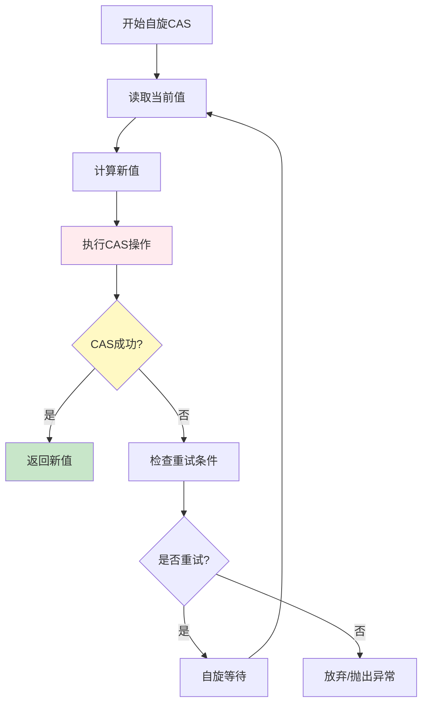
```mermaid
flowchart TD
    Start[开始自旋CAS]
    Read[读取当前值]
    Calc[计算新值]
    CAS[执行CAS操作]
    Result{CAS成功?}
    Success[返回新值]
    Fail[检查重试条件]
    Retry{是否重试?}
    Spin[自旋等待]
    GiveUp[放弃/抛出异常]
    
    Start --> Read
    Read --> Calc
    Calc --> CAS
    CAS --> Result
    Result -->|是| Success
    Result -->|否| Fail
    Fail --> Retry
    Retry -->|是| Spin
    Retry -->|否| GiveUp
    Spin --> Read
    
    style CAS fill:#ffebee
    style Result fill:#fff9c4
    style Success fill:#c8e6c9
```

## 4. JVM 内存模型（JMM）

### 4.1 JMM 概述

Java 内存模型（Java Memory Model, JMM）定义了 Java 程序中变量访问的规则，确保多线程环境下的内存可见性和操作的有序性。

### 4.2 JVM 内存结构

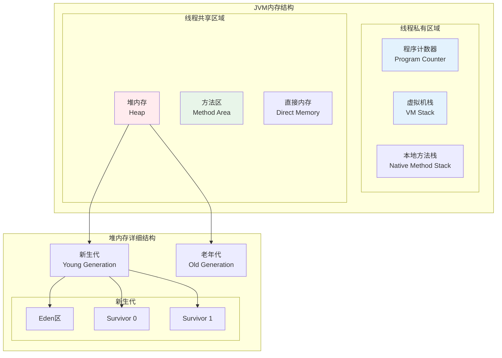
```mermaid
graph TB
    subgraph "JVM内存结构"
        subgraph "线程私有区域"
            PC[程序计数器<br/>Program Counter]
            VMStack[虚拟机栈<br/>VM Stack]
            NativeStack[本地方法栈<br/>Native Method Stack]
        end
        
        subgraph "线程共享区域"
            Heap[堆内存<br/>Heap]
            MethodArea[方法区<br/>Method Area]
            DirectMemory[直接内存<br/>Direct Memory]
        end
    end
    
    subgraph "堆内存详细结构"
        YoungGen[新生代<br/>Young Generation]
        OldGen[老年代<br/>Old Generation]
        
        subgraph "新生代"
            Eden[Eden区]
            S0[Survivor 0]
            S1[Survivor 1]
        end
    end
    
    Heap --> YoungGen
    Heap --> OldGen
    YoungGen --> Eden
    YoungGen --> S0
    YoungGen --> S1
    
    style PC fill:#e3f2fd
    style VMStack fill:#e3f2fd
    style Heap fill:#ffebee
    style MethodArea fill:#e8f5e9
```

### 4.3 线程内存模型

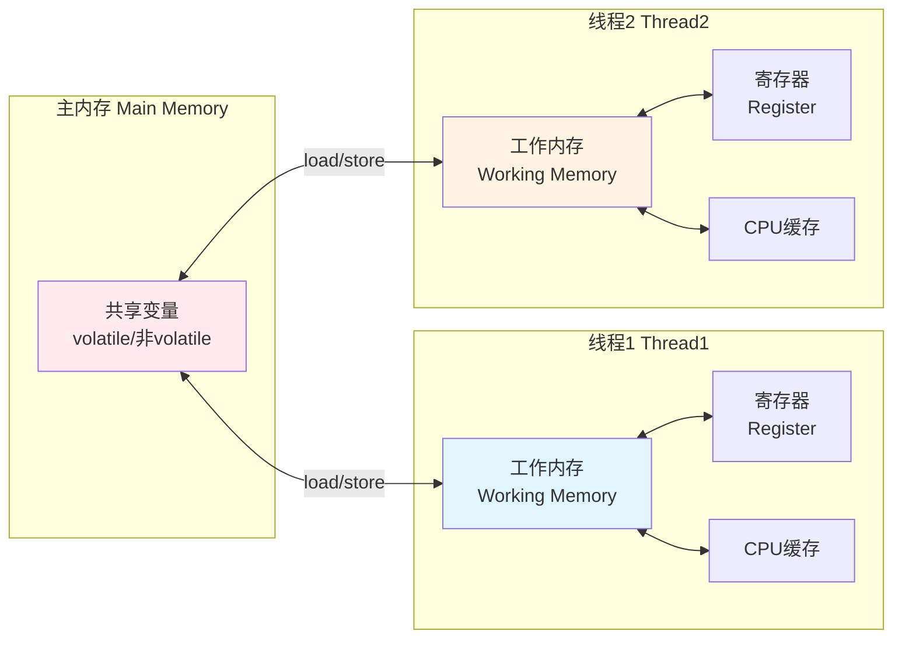
```mermaid
graph LR
    subgraph "主内存 Main Memory"
        SharedVar[共享变量<br/>volatile/非volatile]
    end
    
    subgraph "线程1 Thread1"
        T1Reg[寄存器<br/>Register]
        T1Cache[工作内存<br/>Working Memory]
        T1CPU[CPU缓存]
    end
    
    subgraph "线程2 Thread2"
        T2Reg[寄存器<br/>Register]
        T2Cache[工作内存<br/>Working Memory]
        T2CPU[CPU缓存]
    end
    
    SharedVar <-->|load/store| T1Cache
    SharedVar <-->|load/store| T2Cache
    T1Cache <--> T1Reg
    T1Cache <--> T1CPU
    T2Cache <--> T2Reg
    T2Cache <--> T2CPU
    
    style SharedVar fill:#ffebee
    style T1Cache fill:#e1f5ff
    style T2Cache fill:#fff4e1
```

### 4.4 内存可见性问题

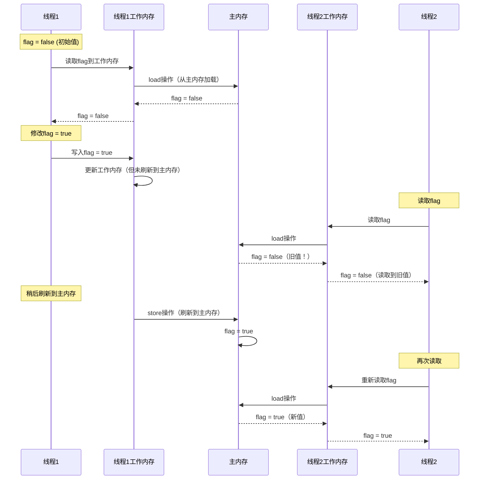
```mermaid
sequenceDiagram
    participant T1 as 线程1
    participant WM1 as 线程1工作内存
    participant MM as 主内存
    participant WM2 as 线程2工作内存
    participant T2 as 线程2
    
    Note over T1: flag = false (初始值)
    T1->>WM1: 读取flag到工作内存
    WM1->>MM: load操作（从主内存加载）
    MM-->>WM1: flag = false
    WM1-->>T1: flag = false
    
    Note over T1: 修改flag = true
    T1->>WM1: 写入flag = true
    WM1->>WM1: 更新工作内存（但未刷新到主内存）
    
    Note over T2: 读取flag
    T2->>WM2: 读取flag
    WM2->>MM: load操作
    MM-->>WM2: flag = false（旧值！）
    WM2-->>T2: flag = false（读取到旧值）
    
    Note over T1: 稍后刷新到主内存
    WM1->>MM: store操作（刷新到主内存）
    MM->>MM: flag = true
    
    Note over T2: 再次读取
    T2->>WM2: 重新读取flag
    WM2->>MM: load操作
    MM-->>WM2: flag = true（新值）
    WM2-->>T2: flag = true
```

### 4.5 volatile 关键字

`volatile` 关键字确保变量的可见性和有序性：

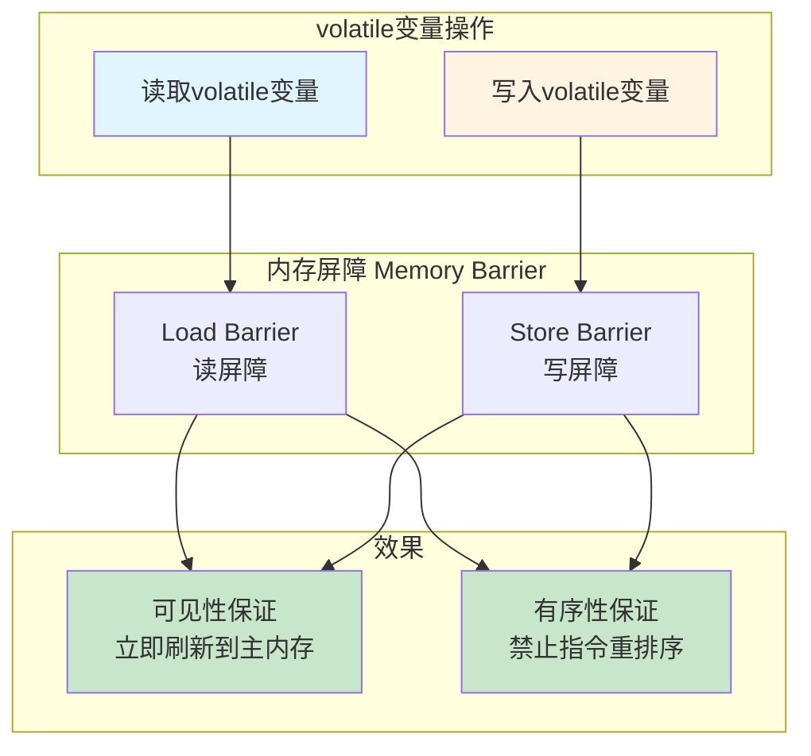
```mermaid
graph TB
    subgraph "volatile变量操作"
        Read[读取volatile变量]
        Write[写入volatile变量]
    end
    
    subgraph "内存屏障 Memory Barrier"
        LoadBarrier[Load Barrier<br/>读屏障]
        StoreBarrier[Store Barrier<br/>写屏障]
    end
    
    subgraph "效果"
        Visibility[可见性保证<br/>立即刷新到主内存]
        Ordering[有序性保证<br/>禁止指令重排序]
    end
    
    Read --> LoadBarrier
    Write --> StoreBarrier
    LoadBarrier --> Visibility
    StoreBarrier --> Visibility
    LoadBarrier --> Ordering
    StoreBarrier --> Ordering
    
    style Read fill:#e1f5ff
    style Write fill:#fff4e1
    style Visibility fill:#c8e6c9
    style Ordering fill:#c8e6c9
```

### 4.6 happens-before 规则

JMM 通过 happens-before 规则定义操作之间的可见性关系：

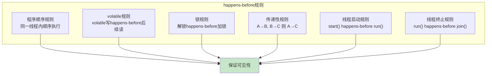
```mermaid
graph TB
    subgraph "happens-before规则"
        Rule1["程序顺序规则<br/>同一线程内顺序执行"]
        Rule2["volatile规则<br/>volatile写happens-before后续读"]
        Rule3["锁规则<br/>解锁happens-before加锁"]
        Rule4["传递性规则<br/>A→B, B→C 则 A→C"]
        Rule5["线程启动规则<br/>start() happens-before run()"]
        Rule6["线程终止规则<br/>run() happens-before join()"]
    end
    
    Rule1 --> Visibility["保证可见性"]
    Rule2 --> Visibility
    Rule3 --> Visibility
    Rule4 --> Visibility
    Rule5 --> Visibility
    Rule6 --> Visibility
    
    style Visibility fill:#c8e6c9
```

### 4.7 CAS 与 JMM 的关系

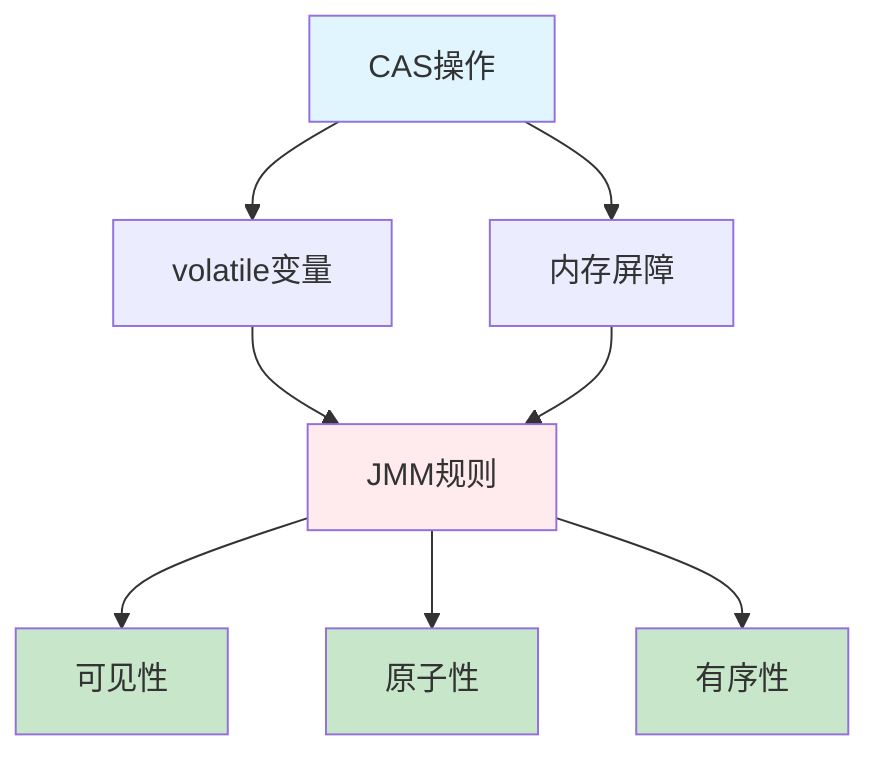
```mermaid
graph TB
    CAS[CAS操作]
    Volatile[volatile变量]
    MemoryBarrier[内存屏障]
    JMM[JMM规则]
    
    CAS --> Volatile
    CAS --> MemoryBarrier
    Volatile --> JMM
    MemoryBarrier --> JMM
    
    JMM --> Visibility[可见性]
    JMM --> Atomicity[原子性]
    JMM --> Ordering[有序性]
    
    style CAS fill:#e1f5ff
    style JMM fill:#ffebee
    style Visibility fill:#c8e6c9
    style Atomicity fill:#c8e6c9
    style Ordering fill:#c8e6c9
```

## 5. mmap 内存映射

### 5.1 mmap 概述

`mmap`（memory mapping）是一种将文件或设备映射到进程地址空间的内存映射机制，允许程序像访问内存一样访问文件。

### 5.2 mmap 工作原理

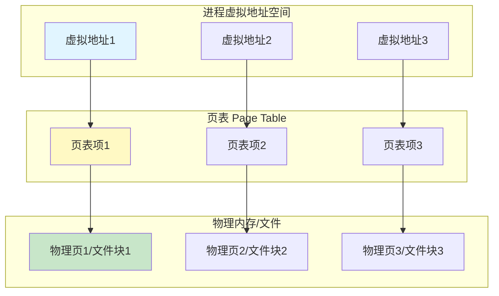
```mermaid
graph TB
    subgraph "进程虚拟地址空间"
        VAddr1[虚拟地址1]
        VAddr2[虚拟地址2]
        VAddr3[虚拟地址3]
    end
    
    subgraph "页表 Page Table"
        PT1[页表项1]
        PT2[页表项2]
        PT3[页表项3]
    end
    
    subgraph "物理内存/文件"
        Page1[物理页1/文件块1]
        Page2[物理页2/文件块2]
        Page3[物理页3/文件块3]
    end
    
    VAddr1 --> PT1
    VAddr2 --> PT2
    VAddr3 --> PT3
    
    PT1 --> Page1
    PT2 --> Page2
    PT3 --> Page3
    
    style VAddr1 fill:#e1f5ff
    style PT1 fill:#fff9c4
    style Page1 fill:#c8e6c9
```

### 5.3 mmap 映射类型

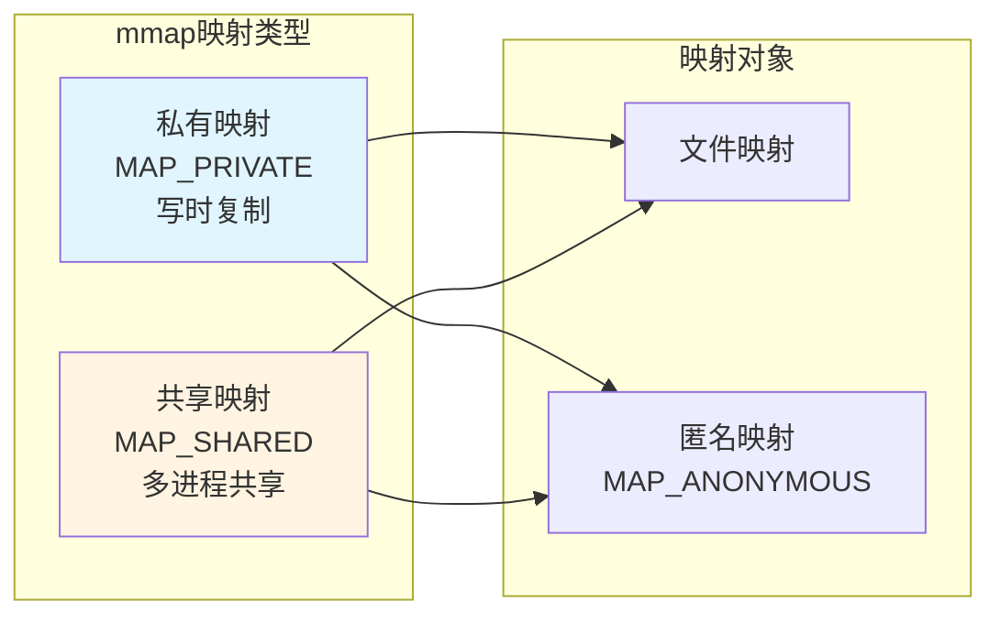
```mermaid
graph LR
    subgraph "mmap映射类型"
        Private[私有映射<br/>MAP_PRIVATE<br/>写时复制]
        Shared[共享映射<br/>MAP_SHARED<br/>多进程共享]
    end
    
    subgraph "映射对象"
        File[文件映射]
        Anonymous[匿名映射<br/>MAP_ANONYMOUS]
    end
    
    Private --> File
    Private --> Anonymous
    Shared --> File
    Shared --> Anonymous
    
    style Private fill:#e1f5ff
    style Shared fill:#fff4e1
```

### 5.4 mmap 执行流程

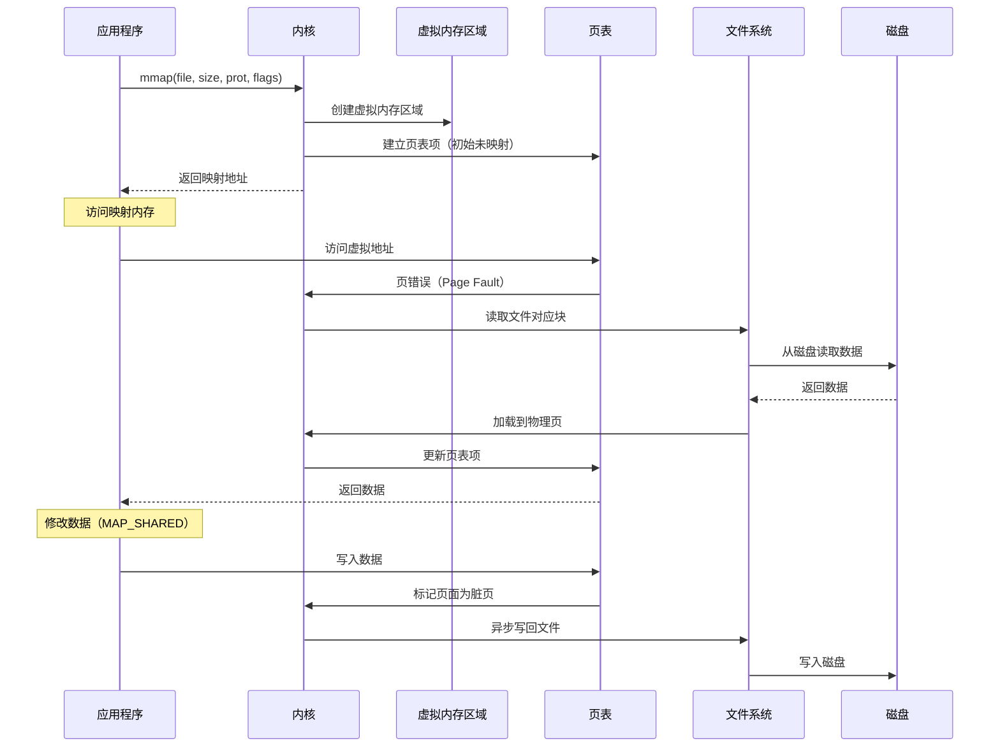
```mermaid
sequenceDiagram
    participant App as 应用程序
    participant Kernel as 内核
    participant VMA as 虚拟内存区域
    participant PageTable as 页表
    participant FileSystem as 文件系统
    participant Disk as 磁盘
    
    App->>Kernel: mmap(file, size, prot, flags)
    Kernel->>VMA: 创建虚拟内存区域
    Kernel->>PageTable: 建立页表项（初始未映射）
    Kernel-->>App: 返回映射地址
    
    Note over App: 访问映射内存
    App->>PageTable: 访问虚拟地址
    PageTable->>Kernel: 页错误（Page Fault）
    Kernel->>FileSystem: 读取文件对应块
    FileSystem->>Disk: 从磁盘读取数据
    Disk-->>FileSystem: 返回数据
    FileSystem->>Kernel: 加载到物理页
    Kernel->>PageTable: 更新页表项
    PageTable-->>App: 返回数据
    
    Note over App: 修改数据（MAP_SHARED）
    App->>PageTable: 写入数据
    PageTable->>Kernel: 标记页面为脏页
    Kernel->>FileSystem: 异步写回文件
    FileSystem->>Disk: 写入磁盘
```

### 5.5 mmap 与普通文件 I/O 对比

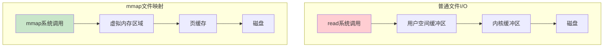
```mermaid
graph TB
    subgraph "普通文件I/O"
        Read1[read系统调用]
        Buffer1[用户空间缓冲区]
        Kernel1[内核缓冲区]
        Disk1[磁盘]
        
        Read1 --> Buffer1
        Buffer1 --> Kernel1
        Kernel1 --> Disk1
    end
    
    subgraph "mmap文件映射"
        Mmap[mmap系统调用]
        VMA[虚拟内存区域]
        PageCache[页缓存]
        Disk2[磁盘]
        
        Mmap --> VMA
        VMA --> PageCache
        PageCache --> Disk2
    end
    
    style Read1 fill:#ffcdd2
    style Mmap fill:#c8e6c9
```

**对比优势**：
- **减少数据拷贝**：mmap 直接映射到用户空间，避免内核缓冲区到用户缓冲区的拷贝
- **共享内存**：多个进程可以共享同一映射区域
- **延迟加载**：按需加载，只有访问时才从磁盘读取

### 5.6 mmap 在 Java 中的应用

Java 中通过 `MappedByteBuffer` 使用 mmap：

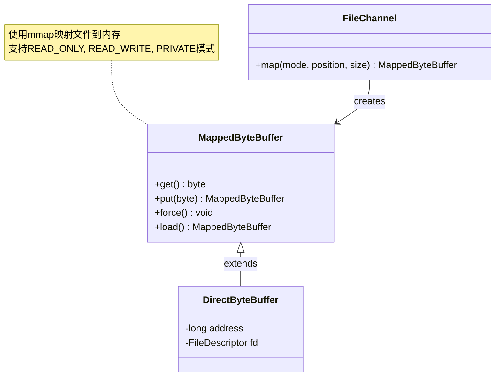
```mermaid
classDiagram
    class FileChannel {
        +map(mode, position, size) MappedByteBuffer
    }
    
    class MappedByteBuffer {
        +get() byte
        +put(byte) MappedByteBuffer
        +force() void
        +load() MappedByteBuffer
    }
    
    class DirectByteBuffer {
        -long address
        -FileDescriptor fd
    }
    
    FileChannel --> MappedByteBuffer : creates
    MappedByteBuffer <|-- DirectByteBuffer : extends
    
    note for MappedByteBuffer "使用mmap映射文件到内存<br/>支持READ_ONLY, READ_WRITE, PRIVATE模式"
```

### 5.7 mmap 内存布局

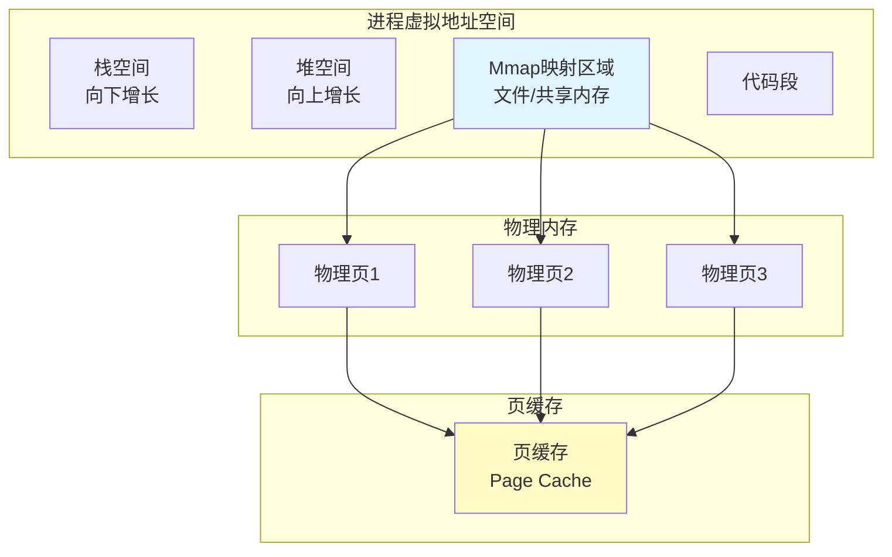
```mermaid
graph TB
    subgraph "进程虚拟地址空间"
        Stack[栈空间<br/>向下增长]
        Heap[堆空间<br/>向上增长]
        Mmap[Mmap映射区域<br/>文件/共享内存]
        Code[代码段]
    end
    
    subgraph "物理内存"
        PhysicalPage1[物理页1]
        PhysicalPage2[物理页2]
        PhysicalPage3[物理页3]
    end
    
    subgraph "页缓存"
        PageCache[页缓存<br/>Page Cache]
    end
    
    Mmap --> PhysicalPage1
    Mmap --> PhysicalPage2
    Mmap --> PhysicalPage3
    
    PhysicalPage1 --> PageCache
    PhysicalPage2 --> PageCache
    PhysicalPage3 --> PageCache
    
    style Mmap fill:#e1f5ff
    style PageCache fill:#fff9c4
```

## 6. CAS、JMM 与 mmap 的关系

### 6.1 三者关系图

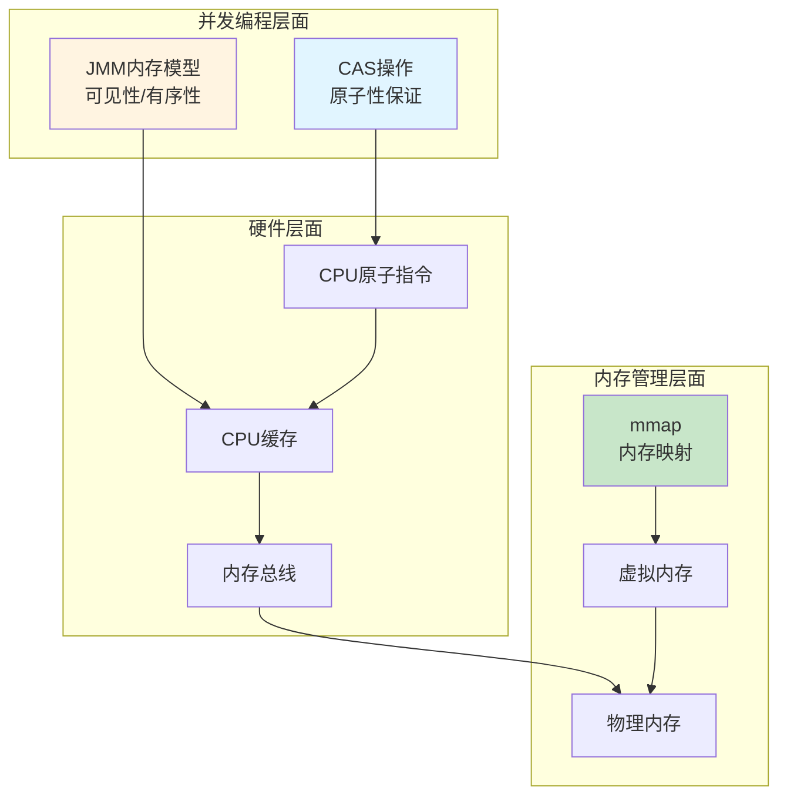
```mermaid
graph TB
    subgraph "并发编程层面"
        CAS[CAS操作<br/>原子性保证]
        JMM[JMM内存模型<br/>可见性/有序性]
    end
    
    subgraph "内存管理层面"
        MMAP[mmap<br/>内存映射]
        VirtualMemory[虚拟内存]
        PhysicalMemory[物理内存]
    end
    
    subgraph "硬件层面"
        CPU[CPU原子指令]
        Cache[CPU缓存]
        MemoryBus[内存总线]
    end
    
    CAS --> CPU
    JMM --> Cache
    MMAP --> VirtualMemory
    
    CPU --> Cache
    Cache --> MemoryBus
    MemoryBus --> PhysicalMemory
    
    VirtualMemory --> PhysicalMemory
    
    style CAS fill:#e1f5ff
    style JMM fill:#fff4e1
    style MMAP fill:#c8e6c9
```

### 6.2 CAS 在 mmap 场景中的应用

当使用 mmap 映射共享内存时，CAS 可以用于多进程间的同步：

```mermaid
sequenceDiagram
    participant P1 as 进程1
    participant P2 as 进程2
    participant MMAP as mmap共享内存
    participant CAS as CAS操作
    
    Note over P1: 尝试获取锁
    P1->>MMAP: 读取锁变量
    P1->>CAS: compareAndSet(0, 1)
    CAS->>MMAP: 原子更新锁变量
    MMAP-->>CAS: 成功
    CAS-->>P1: 获取锁成功
    
    Note over P2: 尝试获取锁
    P2->>MMAP: 读取锁变量
    P2->>CAS: compareAndSet(0, 1)
    CAS->>MMAP: 尝试原子更新
    MMAP-->>CAS: 失败（值已为1）
    CAS-->>P2: 获取锁失败
    
    Note over P1: 释放锁
    P1->>CAS: compareAndSet(1, 0)
    CAS->>MMAP: 原子更新锁变量
    MMAP-->>CAS: 成功
    
    Note over P2: 再次尝试
    P2->>MMAP: 读取锁变量
    P2->>CAS: compareAndSet(0, 1)
    CAS->>MMAP: 原子更新锁变量
    MMAP-->>CAS: 成功
    CAS-->>P2: 获取锁成功
```

## 7. CAS 的优缺点

### 7.1 优点

1. **无锁编程**：避免线程阻塞和上下文切换
2. **高性能**：硬件级别的原子操作，性能优于锁
3. **无死锁**：不存在锁竞争导致的死锁问题
4. **可扩展性**：适合高并发场景

### 7.2 缺点

1. **ABA 问题**：值从 A 变为 B 再变回 A，CAS 无法检测
2. **自旋开销**：高竞争时可能导致 CPU 空转
3. **只能保证一个变量**：无法保证多个变量的原子性
4. **实现复杂**：复杂逻辑使用 CAS 可能难以理解和维护

### 7.3 ABA 问题示例

```mermaid
sequenceDiagram
    participant T1 as 线程1
    participant T2 as 线程2
    participant Memory as 共享内存
    
    Note over T1: 读取值A
    T1->>Memory: 读取变量值 = A
    Memory-->>T1: A
    
    Note over T2: 修改为B
    T2->>Memory: CAS(A, B)
    Memory-->>T2: 成功，值 = B
    
    Note over T2: 修改回A
    T2->>Memory: CAS(B, A)
    Memory-->>T2: 成功，值 = A
    
    Note over T1: 执行CAS操作
    T1->>Memory: CAS(A, C)
    Memory-->>T1: 成功（但值可能已被修改过！）
    
    Note over T1: ABA问题：CAS认为值未变，<br/>但实际上经历了A→B→A的变化
```

**解决方案**：使用版本号或时间戳（如 `AtomicStampedReference`）

## 8. 实际应用场景

### 8.1 计数器实现

```java
public class Counter {
    private AtomicInteger count = new AtomicInteger(0);
    
    public void increment() {
        count.incrementAndGet(); // 内部使用CAS
    }
    
    public int get() {
        return count.get();
    }
}
```

### 8.2 无锁队列

```mermaid
graph LR
    Head[头指针]
    Node1[节点1]
    Node2[节点2]
    Node3[节点3]
    Tail[尾指针]
    
    Head --> Node1
    Node1 --> Node2
    Node2 --> Node3
    Node3 --> Tail
    
    Note1[入队：CAS更新Tail]
    Note2[出队：CAS更新Head]
    
    style Head fill:#e1f5ff
    style Tail fill:#fff4e1
```

### 8.3 自旋锁实现

**基础自旋锁：**

```java
public class SpinLock {
    private AtomicBoolean locked = new AtomicBoolean(false);
    
    /**
     * 获取锁，如果锁已被占用则自旋等待
     * CAS操作：如果RUNNING_FLAG为false，则设置为true并返回true
     * 如果RUNNING_FLAG为true，则返回false，继续循环
     */
    public void lock() {
        // 自旋直到成功获取锁
        while (!locked.compareAndSet(false, true)) {
            // 空循环，CPU空转等待
            // 在高竞争场景下会消耗大量CPU资源
        }
    }
    
    /**
     * 释放锁
     * 将locked设置为false，允许其他线程获取锁
     */
    public void unlock() {
        locked.set(false); // 或使用 compareAndSet(true, false)
    }
    
    /**
     * 尝试获取锁，非阻塞
     * @return true表示获取成功，false表示锁已被占用
     */
    public boolean tryLock() {
        return locked.compareAndSet(false, true);
    }
}
```

**优化版本：带退避的自旋锁**

```java
public class BackoffSpinLock {
    private AtomicBoolean locked = new AtomicBoolean(false);
    
    public void lock() {
        int backoff = 1;
        while (!locked.compareAndSet(false, true)) {
            // 指数退避策略，减少CPU占用
            for (int i = 0; i < backoff; i++) {
                Thread.yield(); // 让出CPU时间片
            }
            backoff = Math.min(backoff * 2, 1024); // 限制最大退避时间
        }
    }
    
    public void unlock() {
        locked.set(false);
    }
}
```

**使用示例：**

```java
public class SpinLockExample {
    private SpinLock lock = new SpinLock();
    private int counter = 0;
    
    public void increment() {
        lock.lock();
        try {
            counter++; // 临界区代码
        } finally {
            lock.unlock(); // 确保释放锁
        }
    }
    
    public int getCounter() {
        return counter;
    }
}
```

**自旋锁适用场景：**

1. **锁持有时间短**：临界区执行时间很短（纳秒到微秒级）
2. **低竞争场景**：线程竞争不激烈
3. **多核CPU**：自旋不会浪费CPU资源（其他核心可以执行）

**自旋锁缺点：**

1. **CPU占用高**：在高竞争场景下会消耗大量CPU资源
2. **不公平**：后到的线程可能先获取锁（非公平）
3. **不可重入**：同一线程不能重复获取锁