# ReentrantLock 工作原理深度解析

## 1. 概述

`ReentrantLock` 是 Java 并发包 `java.util.concurrent.locks` 中提供的一个可重入的互斥锁实现，它提供了比 `synchronized` 更灵活的锁机制，支持公平锁和非公平锁两种模式。

### 1.1 核心特性

- **可重入性（Reentrant）**：同一个线程可以多次获得同一把锁
- **公平性选择**：支持公平锁（Fair Lock）和非公平锁（Nonfair Lock）
- **可中断性**：支持可中断的锁获取操作
- **超时机制**：支持带超时的锁获取操作
- **条件变量**：支持多个条件变量（Condition）

### 1.2 与 synchronized 的对比

| 特性 | ReentrantLock | synchronized |
|------|---------------|--------------|
| 可重入 | ✅ | ✅ |
| 公平锁 | ✅ | ❌ |
| 可中断 | ✅ | ❌ |
| 超时获取 | ✅ | ❌ |
| 多条件变量 | ✅ | ❌ |
| 自动释放 | ❌ | ✅ |
| 性能（Java 6+） | 相近 | 相近 |

## 2. 核心类结构

### 2.1 类继承关系图

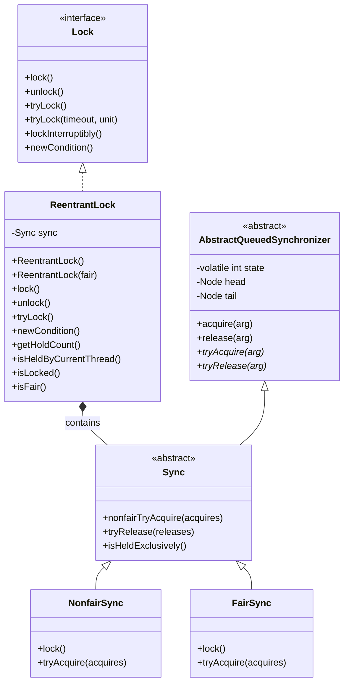

### 2.2 内部组件关系图

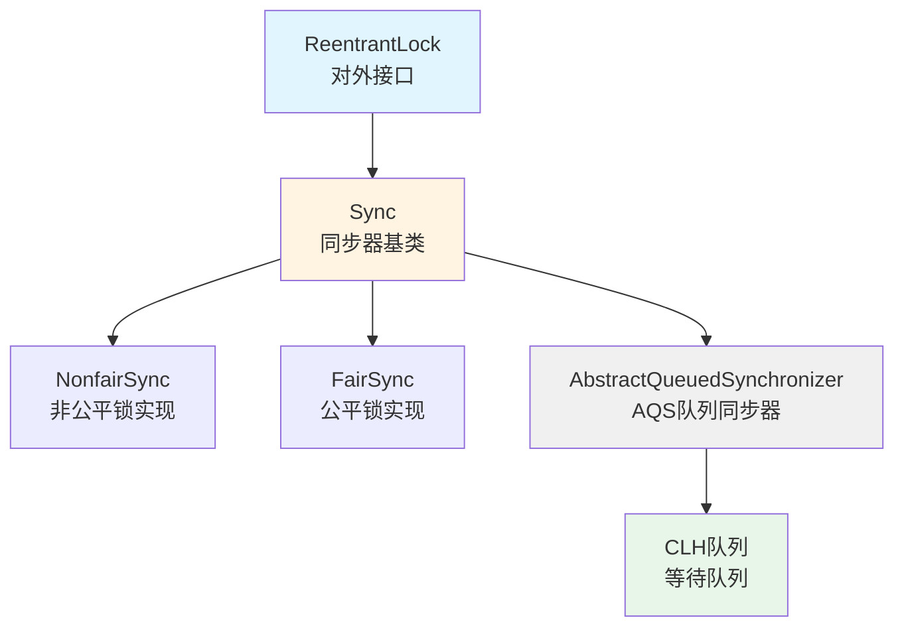

## 3. AbstractQueuedSynchronizer (AQS) 核心机制

`ReentrantLock` 的内部实现依赖于 `AbstractQueuedSynchronizer`（AQS），这是 Java 并发包的基石。

### 3.1 AQS 核心数据结构

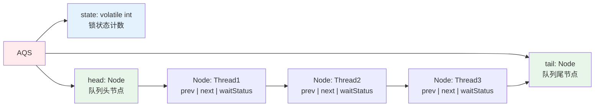

### 3.2 Node 节点结构

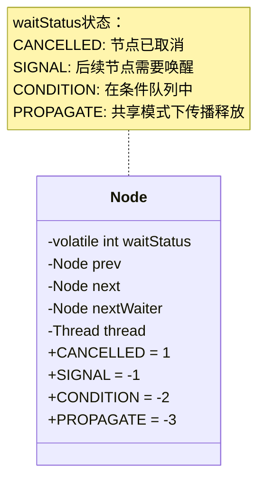

### 3.3 CLH 队列结构

CLH（Craig, Landin, and Hagersten）队列是一个基于链表的 FIFO 队列，用于管理等待获取锁的线程。

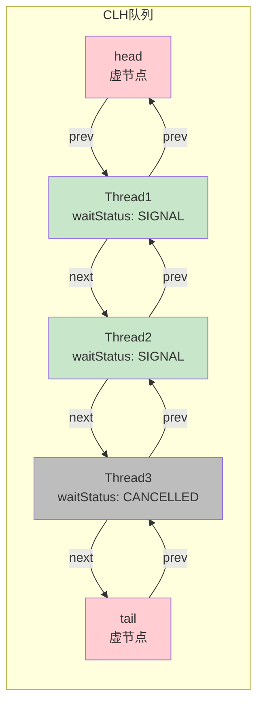

### 3.4 AQS 核心数据结构详解

#### 3.4.1 AQS 类的关键字段

```java
public abstract class AbstractQueuedSynchronizer {
    // 锁状态：0表示未锁定，>0表示锁定次数（可重入）
    private volatile int state;
    
    // CLH队列的虚拟头节点（不存储线程，仅作为哨兵）
    private transient volatile Node head;
    
    // CLH队列的尾节点
    private transient volatile Node tail;
    
    // 静态内部类：队列节点
    static final class Node {
        // 节点状态标志
        volatile int waitStatus;
        
        // 前驱节点
        volatile Node prev;
        
        // 后继节点
        volatile Node next;
        
        // 节点关联的线程
        volatile Thread thread;
        
        // 条件队列中的下一个等待节点（用于Condition）
        Node nextWaiter;
        
        // waitStatus的常量值
        static final int CANCELLED =  1;  // 节点已取消
        static final int SIGNAL    = -1; // 后续节点需要被唤醒
        static final int CONDITION = -2; // 节点在条件队列中
        static final int PROPAGATE = -3; // 共享模式下传播释放
    }
}
```

#### 3.4.2 Node 节点状态详解

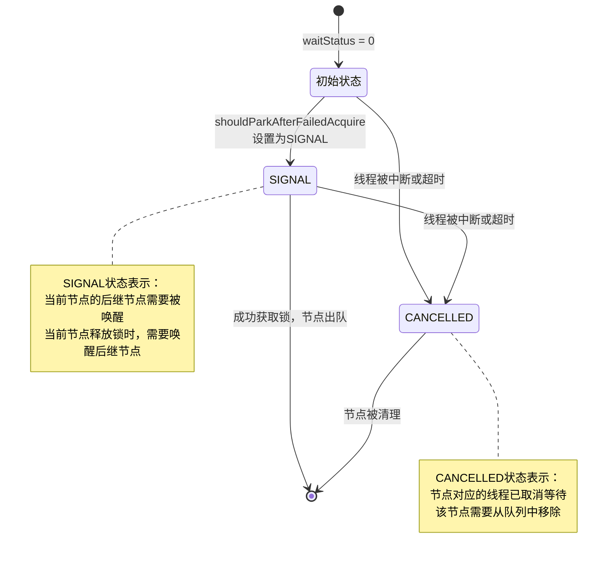

**waitStatus 状态说明：**

| 状态值 | 常量名 | 含义 | 使用场景 |
|--------|--------|------|----------|
| 0 | 初始状态 | 新创建的节点 | 刚加入队列时 |
| -1 | SIGNAL | 后续节点需要被唤醒 | 节点在等待队列中，需要前驱节点释放时唤醒 |
| 1 | CANCELLED | 节点已取消 | 线程被中断、超时或取消 |
| -2 | CONDITION | 在条件队列中 | 用于Condition的等待队列 |
| -3 | PROPAGATE | 共享模式传播 | 共享模式下，释放需要传播给后续节点 |

### 3.5 AQS 自旋逻辑详解

#### 3.5.0 自旋概念理解

**重要理解：AQS 自旋是指每个获取锁失败的线程都会进入自旋循环。**

**场景示例：T1、T2、T3 三个线程竞争同一把锁**

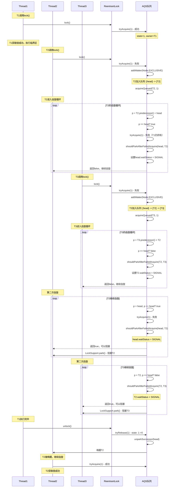

**关键要点：**

1. **每个线程都有自己的自旋循环**：
   - T2 获取锁失败后，进入 `acquireQueued()` 方法，开始自己的自旋循环
   - T3 获取锁失败后，也进入 `acquireQueued()` 方法，开始自己的自旋循环
   - 每个线程的自旋是**独立的**，在自己的线程中执行

2. **自旋的内容不同**：
   - **T2（前驱是head）**：在自旋中会尝试 `tryAcquire()` 获取锁
   - **T3（前驱不是head）**：在自旋中不会尝试获取锁，只是设置前驱节点的 waitStatus

3. **自旋的目的**：
   - **减少阻塞开销**：在阻塞前进行有限次数的自旋，可能锁很快就被释放
   - **设置唤醒信号**：通过 `shouldParkAfterFailedAcquire` 设置前驱节点的 SIGNAL 状态
   - **判断是否需要阻塞**：只有确认前驱节点会唤醒自己时才阻塞

4. **自旋 vs 阻塞**：
   - **自旋阶段**：线程在 CPU 上运行，不断检查条件（消耗 CPU）
   - **阻塞阶段**：线程被 `LockSupport.park()` 阻塞，不消耗 CPU（等待被唤醒）

**自旋流程图（多线程视角）：**

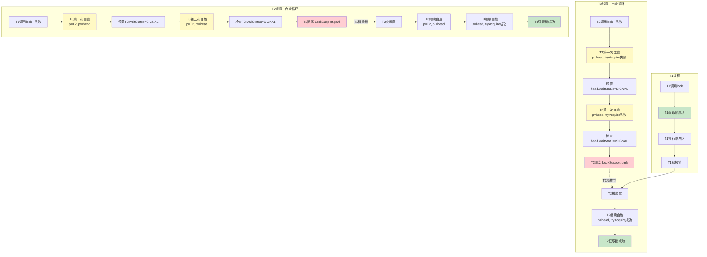

#### 3.5.1 acquireQueued() 方法核心逻辑

`acquireQueued()` 是 AQS 的核心自旋方法，负责在队列中自旋等待获取锁。

**每个线程都会执行自己的自旋循环：**

**重要理解：自旋中调用 `tryAcquire()` 时，state 不会一直 +1！**

**关键点：**
- 如果 `tryAcquire()` **失败**（锁仍被其他线程持有），state **不会变化**
- 只有 `tryAcquire()` **成功**（CAS成功）时，state 才会变为 1
- 只有**重入**时（当前线程已持有锁），state 才会 +1

**详细说明：**

当 T2 在自旋中调用 `NonfairSync#tryAcquire(1)` 时：

```java
final boolean nonfairTryAcquire(int acquires) {
    final Thread current = Thread.currentThread();  // current = T2
    int c = getState();  // c = 1（T1持有锁）
    
    // 情况1：c == 0（锁未被占用）
    if (c == 0) {
        if (compareAndSetState(0, acquires)) {
            setExclusiveOwnerThread(current);
            return true;
        }
    }
    // 情况2：锁已被占用，检查是否为重入
    else if (current == getExclusiveOwnerThread()) {
        // T2 != T1，不满足条件，不会执行这里
        int nextc = c + acquires;
        setState(nextc);
        return true;
    }
    // 情况3：锁被其他线程持有，返回false
    return false;  // T2会走到这里，返回false，state不变
}
```

**T2 自旋过程中的 state 变化：**

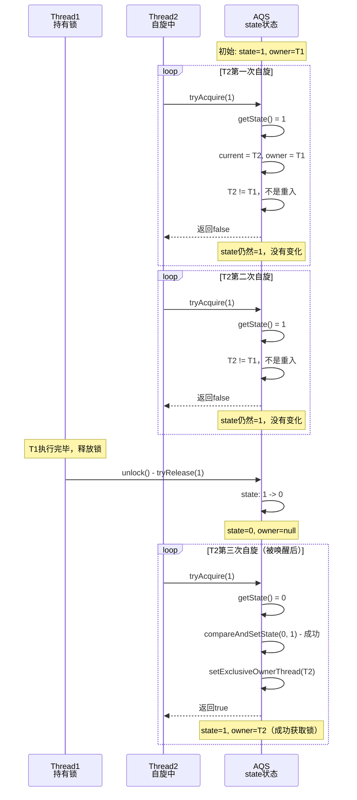

**关键理解：**

1. **tryAcquire 失败时，state 不变**：
   - T2 调用 `tryAcquire(1)` 时，如果 state = 1 且 owner = T1
   - 因为 `T2 != T1`，不满足重入条件
   - 方法直接返回 `false`，**state 保持为 1，没有任何变化**

2. **tryAcquire 成功时，state 变为 1**：
   - 只有当 T1 释放锁后，state = 0
   - T2 再次调用 `tryAcquire(1)` 时，CAS 成功
   - state 从 0 变为 1，owner 设置为 T2

3. **只有重入时，state 才会 +1**：
   - 如果 T2 已经持有锁（owner = T2），再次调用 `tryAcquire(1)`
   - 会执行 `setState(c + 1)`，state 才会 +1
   - 但在等待队列中的线程不会出现这种情况

**完整示例：T2 自旋过程中的 state 值**

```
初始状态：
  state = 1, owner = T1

T2第一次自旋 - tryAcquire(1):
  getState() = 1
  current = T2, owner = T1
  T2 != T1，返回 false
  state = 1（不变）✓

T2第二次自旋 - tryAcquire(1):
  getState() = 1
  current = T2, owner = T1
  T2 != T1，返回 false
  state = 1（不变）✓

T1释放锁：
  tryRelease(1): state = 1 -> 0
  state = 0, owner = null

T2第三次自旋 - tryAcquire(1):
  getState() = 0
  compareAndSetState(0, 1) = true（成功）
  setExclusiveOwnerThread(T2)
  state = 1（从0变为1）✓
  owner = T2
```

**总结：**
- ❌ **错误理解**：每次调用 `tryAcquire()` 都会让 state +1
- ✅ **正确理解**：只有 `tryAcquire()` 成功（CAS成功）或重入时，state 才会变化
- ✅ **在等待队列中的线程**：每次 `tryAcquire()` 失败时，state 保持不变

```java
final boolean acquireQueued(final Node node, int arg) {
    boolean failed = true;
    try {
        boolean interrupted = false;
        // 自旋循环
        for (;;) {
            // 1. 获取前驱节点
            final Node p = node.predecessor();
            
            // 2. 如果前驱节点是head，说明当前节点是队列中第一个等待的节点
            //    尝试获取锁
            if (p == head && tryAcquire(arg)) {
                // 3. 获取成功，将当前节点设置为head
                setHead(node);
                p.next = null; // 帮助GC
                failed = false;
                return interrupted;
            }
            
            // 4. 获取失败，判断是否需要阻塞
            if (shouldParkAfterFailedAcquire(p, node) &&
                parkAndCheckInterrupt())
                interrupted = true;
        }
    } finally {
        // 5. 如果获取失败（异常或中断），取消节点
        if (failed)
            cancelAcquire(node);
    }
}
```

#### 3.5.2 自旋逻辑流程图

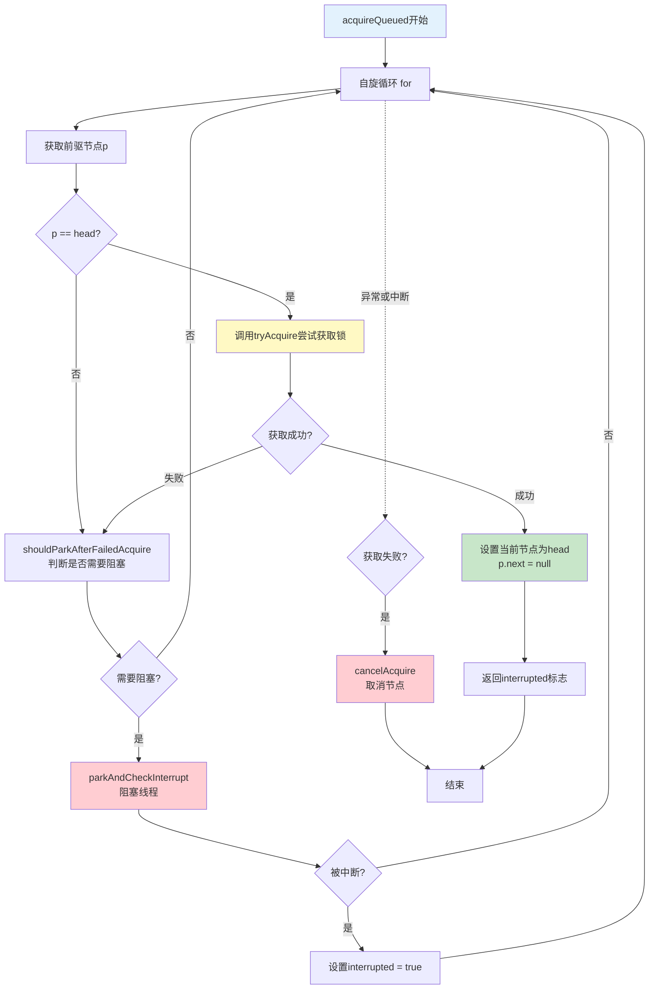

#### 3.5.3 shouldParkAfterFailedAcquire() 方法详解

该方法负责判断在获取锁失败后，是否需要阻塞当前线程。

```java
private static boolean shouldParkAfterFailedAcquire(Node pred, Node node) {
    int ws = pred.waitStatus;
    
    // 情况1：前驱节点的waitStatus是SIGNAL
    // 说明前驱节点释放锁时会唤醒当前节点，可以安全阻塞
    if (ws == Node.SIGNAL)
        return true;
    
    // 情况2：前驱节点的waitStatus > 0（CANCELLED）
    // 说明前驱节点已取消，需要跳过这些已取消的节点
    if (ws > 0) {
        do {
            node.prev = pred = pred.prev;
        } while (pred.waitStatus > 0);
        pred.next = node;
    } 
    // 情况3：前驱节点的waitStatus是0或PROPAGATE
    // 需要将前驱节点的waitStatus设置为SIGNAL
    else {
        compareAndSetWaitStatus(pred, ws, Node.SIGNAL);
    }
    return false; // 这次不阻塞，下次循环再检查
}
```

**shouldParkAfterFailedAcquire 逻辑图：**

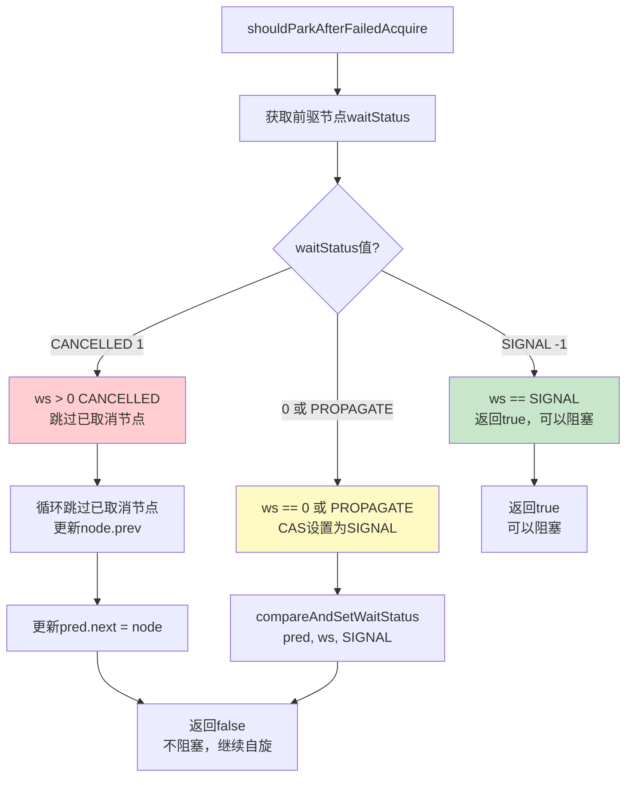

#### 3.5.4 waitStatus = SIGNAL 的设置机制详解

**重要说明：waitStatus = SIGNAL 的设置与 `newCondition()` 方法无关！**

`newCondition()` 是用于创建 Condition 对象的，用于条件等待。而 waitStatus = SIGNAL 是在**同步队列（CLH队列）**中设置的，用于协调锁的获取和释放。

##### 3.5.4.1 SIGNAL 状态的设置时机

waitStatus = SIGNAL 是在 `shouldParkAfterFailedAcquire()` 方法中设置的，具体流程如下：

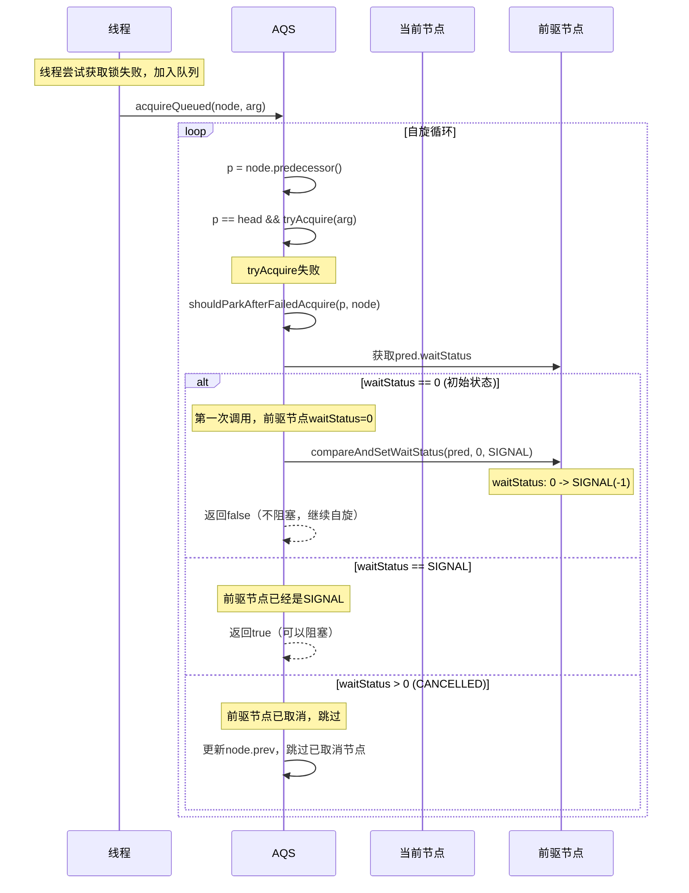

##### 3.5.4.2 设置 SIGNAL 的完整代码流程

```java
// 1. 线程获取锁失败，调用acquireQueued
final boolean acquireQueued(final Node node, int arg) {
    for (;;) {
        final Node p = node.predecessor();
        if (p == head && tryAcquire(arg)) {
            // 获取成功
            setHead(node);
            return false;
        }
        
        // 2. 获取失败，判断是否需要阻塞
        if (shouldParkAfterFailedAcquire(p, node) &&  // 这里会设置SIGNAL
            parkAndCheckInterrupt())
            interrupted = true;
    }
}

// 3. shouldParkAfterFailedAcquire 中设置 SIGNAL
private static boolean shouldParkAfterFailedAcquire(Node pred, Node node) {
    int ws = pred.waitStatus;
    
    if (ws == Node.SIGNAL)
        // 前驱节点已经是SIGNAL，可以安全阻塞
        return true;
    
    if (ws > 0) {
        // 前驱节点已取消，跳过
        do {
            node.prev = pred = pred.prev;
        } while (pred.waitStatus > 0);
        pred.next = node;
    } else {
        // 关键：这里设置前驱节点的waitStatus为SIGNAL
        // 使用CAS操作，确保原子性
        compareAndSetWaitStatus(pred, ws, Node.SIGNAL);
    }
    return false; // 返回false，继续自旋
}
```

##### 3.5.4.3 为什么需要设置 SIGNAL？

**SIGNAL 状态的作用：**

1. **信号机制**：告诉前驱节点"我在等待，你释放锁时请唤醒我"
2. **避免丢失唤醒**：确保前驱节点释放锁时知道需要唤醒后续节点
3. **阻塞安全**：只有前驱节点是 SIGNAL 时，当前节点才能安全阻塞

**设置 SIGNAL 的时机图：**

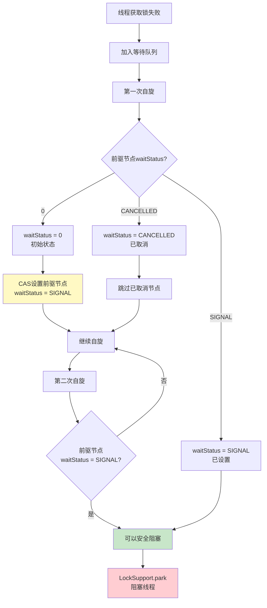

##### 3.5.4.4 newCondition() 与 SIGNAL 的关系

**重要区别：**

| 特性 | waitStatus = SIGNAL | newCondition() |
|------|-------------------|----------------|
| **用途** | 同步队列（CLH队列）中的节点状态 | 创建条件等待队列 |
| **设置位置** | `shouldParkAfterFailedAcquire()` | `ReentrantLock.newCondition()` |
| **队列类型** | CLH同步队列 | Condition条件队列 |
| **节点状态** | SIGNAL (-1) | CONDITION (-2) |
| **使用场景** | 锁的获取和释放 | 条件等待（await/signal） |

**两种队列的对比：**

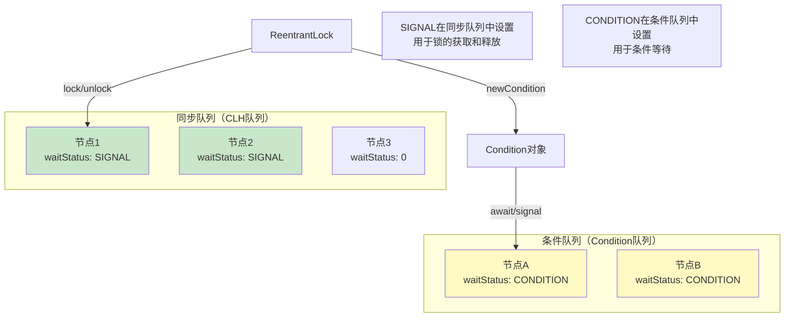

##### 3.5.4.5 完整示例：SIGNAL 的设置过程

```java
public class SignalStatusExample {
    private ReentrantLock lock = new ReentrantLock();
    
    public void example() {
        // Thread1 获取锁
        Thread t1 = new Thread(() -> {
            lock.lock();
            try {
                System.out.println("Thread1 持有锁");
                Thread.sleep(2000); // 模拟长时间持有
            } catch (InterruptedException e) {
                e.printStackTrace();
            } finally {
                lock.unlock();
            }
        });
        t1.start();
        
        // Thread2 尝试获取锁（会失败，加入队列）
        Thread t2 = new Thread(() -> {
            lock.lock(); // 这里会触发SIGNAL的设置
            try {
                System.out.println("Thread2 获取到锁");
            } finally {
                lock.unlock();
            }
        });
        t2.start();
        
        /*
         * 执行流程：
         * 1. Thread1 获取锁成功，state=1, owner=Thread1
         * 2. Thread2 调用lock()，CAS失败
         * 3. Thread2 调用acquire(1)
         * 4. tryAcquire(1) 失败（Thread1仍持有）
         * 5. addWaiter(Node.EXCLUSIVE) - 创建节点，waitStatus=0
         * 6. acquireQueued(node, 1) 开始自旋
         * 7. 第一次自旋：
         *    - p = head, p == head? true
         *    - tryAcquire(1) 失败
         *    - shouldParkAfterFailedAcquire(head, node)
         *    - head.waitStatus = 0
         *    - compareAndSetWaitStatus(head, 0, SIGNAL) ✓
         *    - 返回false，继续自旋
         * 8. 第二次自旋：
         *    - p = head, p == head? true
         *    - tryAcquire(1) 失败
         *    - shouldParkAfterFailedAcquire(head, node)
         *    - head.waitStatus = SIGNAL
         *    - 返回true，可以阻塞
         * 9. parkAndCheckInterrupt() - Thread2被阻塞
         * 10. Thread1释放锁，唤醒Thread2
         * 11. Thread2继续自旋，获取锁成功
         */
    }
}
```

##### 3.5.4.6 关键要点总结

1. **SIGNAL 的设置时机**：
   - 在 `shouldParkAfterFailedAcquire()` 方法中设置
   - 使用 `compareAndSetWaitStatus()` CAS操作
   - 设置的是**前驱节点**的 waitStatus

2. **SIGNAL 的作用**：
   - 表示"后续节点在等待，释放锁时请唤醒"
   - 确保阻塞前，前驱节点知道需要唤醒后续节点
   - 避免丢失唤醒信号

3. **与 newCondition() 的区别**：
   - `newCondition()` 创建的是**条件队列**，节点 waitStatus = CONDITION (-2)
   - SIGNAL 是在**同步队列**中设置的，节点 waitStatus = SIGNAL (-1)
   - 两者是完全不同的机制

4. **设置流程**：
   ```
   获取锁失败 → 加入队列 → 自旋循环 → shouldParkAfterFailedAcquire 
   → 检查前驱节点waitStatus → 如果是0，CAS设置为SIGNAL 
   → 继续自旋 → 再次检查 → 如果是SIGNAL，可以阻塞
   ```

#### 3.5.5 parkAndCheckInterrupt() 方法

```java
private final boolean parkAndCheckInterrupt() {
    // 阻塞当前线程
    LockSupport.park(this);
    // 返回线程是否被中断（会清除中断标志）
    return Thread.interrupted();
}
```

#### 3.5.5 完整自旋过程示例

**场景：3个线程竞争同一把锁**

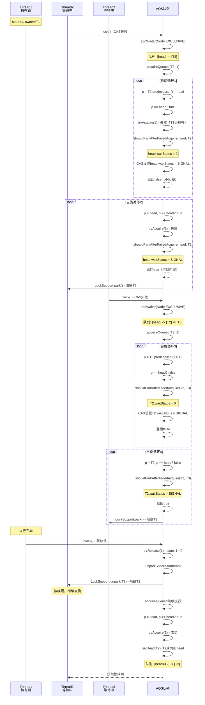

#### 3.5.6 数据结构变化示例

**初始状态：**
```
AQS:
  state = 1
  head = [虚节点, waitStatus=0]
  tail = [虚节点]
  owner = Thread1
```

**Thread2 尝试获取锁失败，加入队列：**
```
AQS:
  state = 1
  head = [虚节点, waitStatus=0]
  tail = [T2节点, waitStatus=0, thread=Thread2]
  owner = Thread1
  
队列结构:
  [head] <-> [T2] <-> [tail]
```

**Thread2 第一次自旋：**
```
1. p = T2.predecessor() = head
2. p == head? true
3. tryAcquire(1) -> false（Thread1仍持有）
4. shouldParkAfterFailedAcquire(head, T2):
   - head.waitStatus = 0
   - CAS设置 head.waitStatus = SIGNAL
   - 返回false（不阻塞，继续自旋）

队列结构:
  [head, waitStatus=SIGNAL] <-> [T2, waitStatus=0] <-> [tail]
```

**Thread2 第二次自旋：**
```
1. p = head, p == head? true
2. tryAcquire(1) -> false
3. shouldParkAfterFailedAcquire(head, T2):
   - head.waitStatus = SIGNAL
   - 返回true（可以阻塞）
4. parkAndCheckInterrupt() -> 阻塞Thread2

队列结构:
  [head, waitStatus=SIGNAL] <-> [T2, waitStatus=0, 阻塞] <-> [tail]
```

**Thread3 加入队列：**
```
AQS:
  state = 1
  head = [虚节点, waitStatus=SIGNAL]
  tail = [T3节点, waitStatus=0, thread=Thread3]
  owner = Thread1
  
队列结构:
  [head, waitStatus=SIGNAL] <-> [T2, waitStatus=0, 阻塞] <-> [T3, waitStatus=0] <-> [tail]
```

**Thread1 释放锁，唤醒Thread2：**
```
1. unlock() -> tryRelease(1) -> state: 1->0
2. unparkSuccessor(head) -> LockSupport.unpark(Thread2)
3. Thread2被唤醒，继续自旋：
   - p = head, p == head? true
   - tryAcquire(1) -> 成功（state=0，CAS成功）
   - setHead(T2)，T2成为新head
   - head.next = null（原head断开连接）

队列结构:
  [head=T2, waitStatus=0] <-> [T3, waitStatus=0] <-> [tail]
  
AQS:
  state = 1
  owner = Thread2
```

#### 3.5.7 自旋优化的关键点

1. **减少不必要的阻塞**：
   - 在阻塞前会进行多次自旋尝试
   - 只有确认前驱节点会唤醒自己时才阻塞

2. **清理已取消的节点**：
   - `shouldParkAfterFailedAcquire` 会跳过 CANCELLED 节点
   - 保持队列的完整性

3. **公平性保证**：
   - 只有前驱节点是 head 时才尝试获取锁
   - 确保 FIFO 顺序

4. **中断处理**：
   - `parkAndCheckInterrupt` 会检查中断标志
   - 中断不会立即退出，而是设置标志，在获取锁后处理

#### 3.5.8 自旋 vs 阻塞的权衡

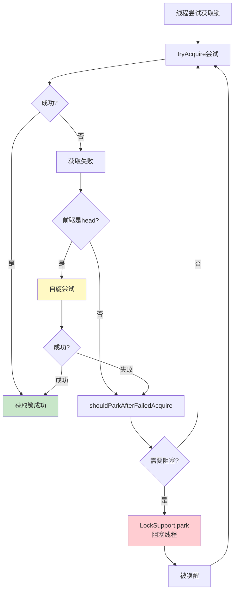

**自旋的优势：**
- 避免线程切换开销（上下文切换成本高）
- 锁持有时间短时，自旋比阻塞更高效
- 减少系统调用（park/unpark）

**自旋的劣势：**
- 消耗CPU资源（空转）
- 高竞争场景下效率低

**AQS的优化策略：**
- 有限次数的自旋（通过shouldParkAfterFailedAcquire控制）
- 只有前驱节点是head时才自旋（减少无效尝试）
- 及时阻塞，避免CPU浪费

## 4. 锁获取流程

### 4.1 非公平锁获取流程（lock()）

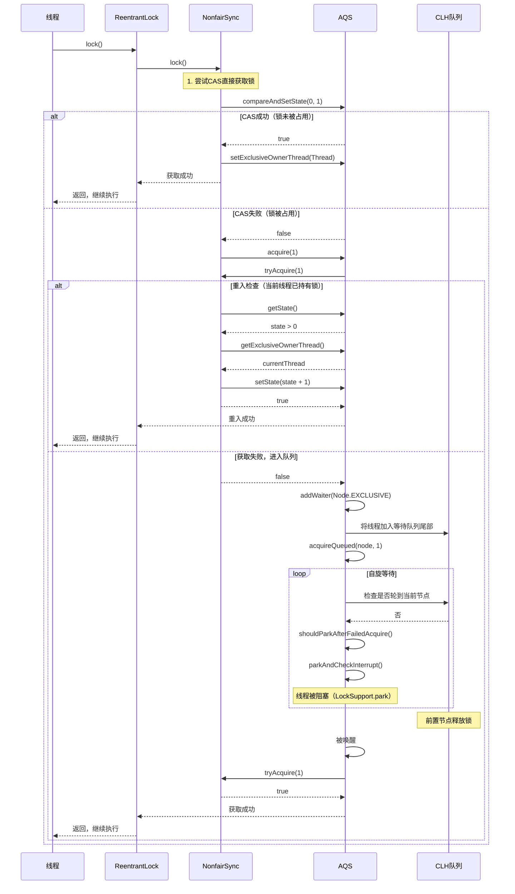

### 4.2 公平锁获取流程

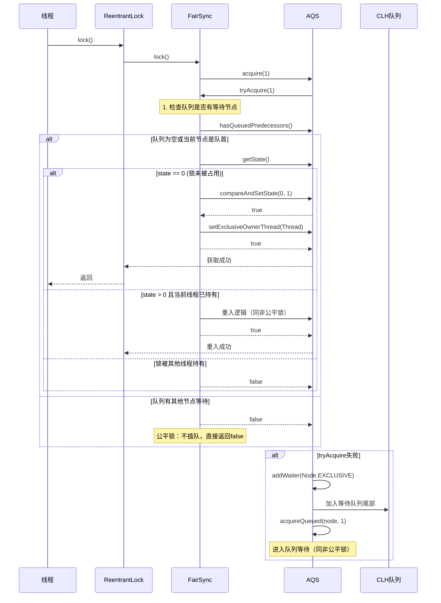

### 4.3 公平锁 vs 非公平锁对比

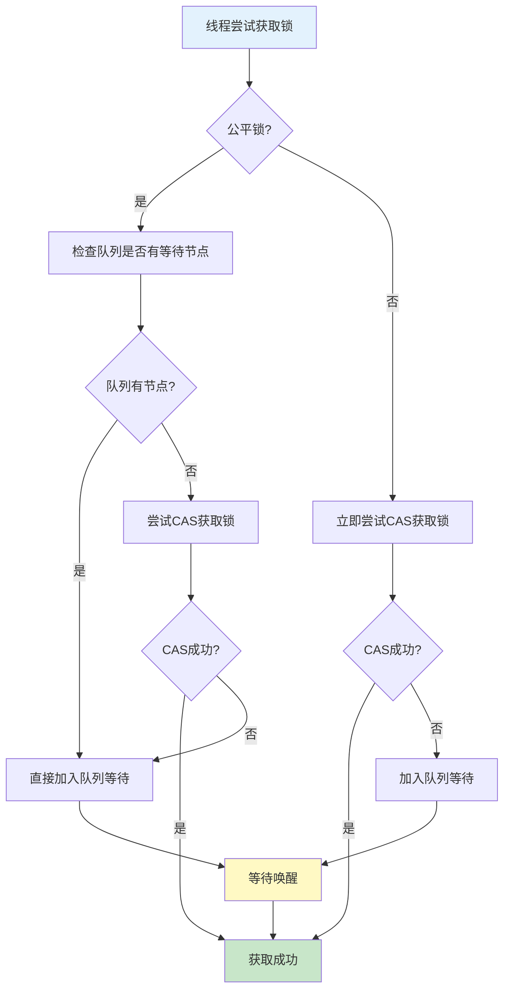

### 4.4 tryLock() 非阻塞获取

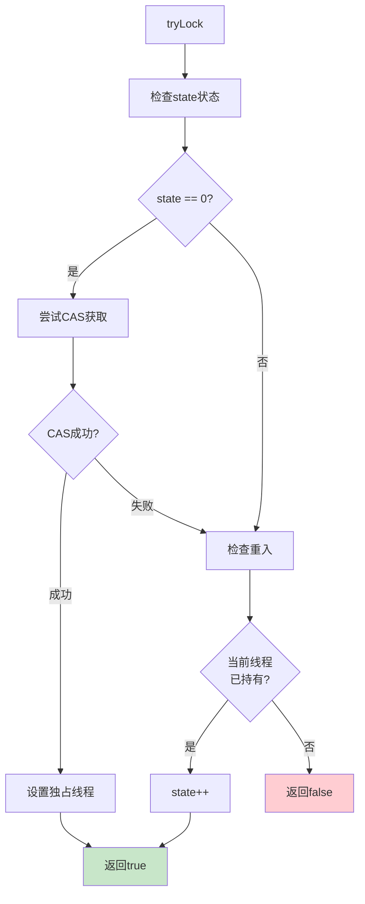

### 4.5 多个方法使用同一把锁的机制详解

#### 4.5.1 核心问题：如何知道是哪个方法在等待？

**重要理解：ReentrantLock 本身不知道是哪个方法调用的 `lock()`，它只关心：**
- 哪个线程持有锁（`exclusiveOwnerThread`）
- 等待队列中的线程（CLH队列中的节点）

**锁的粒度是 ReentrantLock 实例级别，不是方法级别。**

#### 4.5.2 锁的作用域设计原理

```java
public class SharedResource {
    // 同一个锁实例保护整个共享资源
    private final ReentrantLock lock = new ReentrantLock();
    private int counter = 0;
    private String data = "";
    
    // 方法1：使用锁保护counter
    public void increment() {
        lock.lock();  // 获取锁
        try {
            counter++;  // 临界区1
        } finally {
            lock.unlock();  // 释放锁
        }
    }
    
    // 方法2：使用同一个锁保护data
    public void updateData(String newData) {
        lock.lock();  // 获取同一个锁
        try {
            data = newData;  // 临界区2
        } finally {
            lock.unlock();  // 释放锁
        }
    }
    
    // 方法3：使用同一个锁保护复合操作
    public void incrementAndUpdate(String newData) {
        lock.lock();  // 获取同一个锁
        try {
            counter++;      // 临界区3
            data = newData;
        } finally {
            lock.unlock();  // 释放锁
        }
    }
}
```

**设计原理图：**

```mermaid
graph TB
    subgraph "SharedResource类"
        Lock[ReentrantLock实例<br/>lock]
        Method1[increment方法<br/>lock.lock/unlock]
        Method2[updateData方法<br/>lock.lock/unlock]
        Method3[incrementAndUpdate方法<br/>lock.lock/unlock]
        Resource[共享资源<br/>counter, data]
    end
    
    Lock --> Method1
    Lock --> Method2
    Lock --> Method3
    Method1 --> Resource
    Method2 --> Resource
    Method3 --> Resource
    
    style Lock fill:#ffebee
    style Resource fill:#e3f2fd
```

#### 4.5.3 多线程竞争同一把锁的完整流程

**场景：3个线程，分别调用不同的方法**

```mermaid
sequenceDiagram
    participant T1 as Thread1<br/>调用increment
    participant T2 as Thread2<br/>调用updateData
    participant T3 as Thread3<br/>调用incrementAndUpdate
    participant Lock as ReentrantLock<br/>同一个实例
    participant AQS as AQS队列
    
    Note over T1: T1调用increment()
    T1->>Lock: lock()
    Lock->>AQS: tryAcquire(1) - 成功
    Note over AQS: state=1, owner=T1
    T1->>T1: counter++ (执行临界区)
    
    Note over T2: T2调用updateData()
    T2->>Lock: lock()
    Lock->>AQS: tryAcquire(1) - 失败
    Note over AQS: T1持有锁，T2加入队列
    AQS->>AQS: addWaiter(Node.EXCLUSIVE)
    AQS->>AQS: acquireQueued(T2, 1)
    Note over T2: T2被阻塞，等待T1释放锁
    
    Note over T3: T3调用incrementAndUpdate()
    T3->>Lock: lock()
    Lock->>AQS: tryAcquire(1) - 失败
    Note over AQS: T1仍持有锁，T3加入队列
    AQS->>AQS: addWaiter(Node.EXCLUSIVE)
    AQS->>AQS: acquireQueued(T3, 1)
    Note over T3: T3被阻塞，等待T1释放锁
    
    Note over AQS: 队列状态: [head] -> [T2] -> [T3]
    
    T1->>T1: 执行完毕
    T1->>Lock: unlock()
    Lock->>AQS: tryRelease(1) - state: 1->0
    AQS->>AQS: unparkSuccessor(head)
    AQS->>T2: 唤醒T2
    Note over T2: T2被唤醒，继续自旋
    T2->>AQS: tryAcquire(1) - 成功
    Note over AQS: state=1, owner=T2
    T2->>T2: data = newData (执行临界区)
    T2->>Lock: unlock()
    Lock->>AQS: tryRelease(1) - state: 1->0
    AQS->>AQS: unparkSuccessor(head)
    AQS->>T3: 唤醒T3
    Note over T3: T3被唤醒，继续自旋
    T3->>AQS: tryAcquire(1) - 成功
    Note over AQS: state=1, owner=T3
    T3->>T3: counter++, data = newData (执行临界区)
    T3->>Lock: unlock()
```

#### 4.5.4 关键理解：锁不区分调用位置

**ReentrantLock 的内部状态：**

```java
// ReentrantLock 只维护这些信息：
public class ReentrantLock {
    private final Sync sync;
    
    // Sync 内部（继承自AQS）：
    private volatile int state;              // 锁状态：0=未锁定，>0=锁定次数
    private transient volatile Node head;    // 等待队列头节点
    private transient volatile Node tail;    // 等待队列尾节点
    private transient Thread exclusiveOwnerThread;  // 持有锁的线程
    
    // Node 节点中：
    volatile Thread thread;  // 等待的线程（不记录是哪个方法）
    volatile int waitStatus; // 等待状态
}
```

**重要点：**
1. **不记录调用位置**：ReentrantLock 不知道是 `increment()` 还是 `updateData()` 调用的 `lock()`
2. **只记录线程**：等待队列中的 Node 只存储 `Thread` 对象，不存储方法信息
3. **锁的粒度**：整个 `ReentrantLock` 实例是一个锁，所有调用 `lock()` 的地方都竞争同一个锁

#### 4.5.5 实际应用场景

**场景1：保护共享资源的不同操作**

```java
public class BankAccount {
    private final ReentrantLock lock = new ReentrantLock();
    private double balance = 1000.0;
    
    // 存款操作
    public void deposit(double amount) {
        lock.lock();
        try {
            balance += amount;  // 临界区1
        } finally {
            lock.unlock();
        }
    }
    
    // 取款操作
    public void withdraw(double amount) {
        lock.lock();  // 同一个锁
        try {
            if (balance >= amount) {
                balance -= amount;  // 临界区2
            }
        } finally {
            lock.unlock();
        }
    }
    
    // 查询余额
    public double getBalance() {
        lock.lock();  // 同一个锁
        try {
            return balance;  // 临界区3
        } finally {
            lock.unlock();
        }
    }
}
```

**执行流程：**
- Thread1 调用 `deposit(100)` → 获取锁 → 执行
- Thread2 调用 `withdraw(50)` → 尝试获取锁 → 失败 → 进入队列等待
- Thread3 调用 `getBalance()` → 尝试获取锁 → 失败 → 进入队列等待
- Thread1 释放锁 → Thread2 被唤醒 → 执行 `withdraw`
- Thread2 释放锁 → Thread3 被唤醒 → 执行 `getBalance`

**场景2：保护复合操作**

```java
public class Counter {
    private final ReentrantLock lock = new ReentrantLock();
    private int count = 0;
    
    public void increment() {
        lock.lock();
        try {
            count++;  // 简单操作
        } finally {
            lock.unlock();
        }
    }
    
    public void incrementBy(int n) {
        lock.lock();  // 同一个锁
        try {
            for (int i = 0; i < n; i++) {
                count++;  // 复合操作
            }
        } finally {
            lock.unlock();
        }
    }
}
```

#### 4.5.6 如何理解"其他线程在这个地方等待"

**虽然 ReentrantLock 不知道是哪个方法，但我们可以通过设计来理解：**

```mermaid
graph TB
    subgraph "线程视角"
        T1[Thread1: 在increment中持有锁]
        T2[Thread2: 在updateData中等待锁]
        T3[Thread3: 在incrementAndUpdate中等待锁]
    end
    
    subgraph "ReentrantLock视角"
        Lock[同一个ReentrantLock实例]
        State[state=1<br/>owner=Thread1]
        Queue[等待队列<br/>Thread2, Thread3]
    end
    
    subgraph "实际执行"
        Exec1[Thread1执行counter++]
        Wait2[Thread2阻塞在lock调用处]
        Wait3[Thread3阻塞在lock调用处]
    end
    
    T1 --> Lock
    T2 --> Lock
    T3 --> Lock
    Lock --> State
    Lock --> Queue
    T1 --> Exec1
    T2 --> Wait2
    T3 --> Wait3
    
    style T1 fill:#c8e6c9
    style T2 fill:#fff9c4
    style T3 fill:#fff9c4
    style Lock fill:#ffebee
```

**关键理解：**

1. **从代码层面**：
   - Thread2 阻塞在 `updateData()` 方法的 `lock.lock()` 调用处
   - Thread3 阻塞在 `incrementAndUpdate()` 方法的 `lock.lock()` 调用处
   - 虽然 ReentrantLock 不知道具体方法，但线程确实在对应的方法中等待

2. **从锁的视角**：
   - ReentrantLock 只看到：Thread1 持有锁，Thread2 和 Thread3 在等待队列中
   - 不关心它们是从哪个方法调用的

3. **从设计角度**：
   - 同一个锁实例保护的是同一个共享资源
   - 多个方法使用同一把锁，意味着它们访问的是同一个共享资源
   - 这是**锁粒度设计**的体现

#### 4.5.7 锁粒度设计原则

**原则1：一个共享资源 = 一把锁**

```java
// ✅ 正确：一个资源，一把锁
public class GoodDesign {
    private final ReentrantLock lock = new ReentrantLock();
    private int resource1 = 0;
    
    public void method1() { lock.lock(); try { resource1++; } finally { lock.unlock(); } }
    public void method2() { lock.lock(); try { resource1--; } finally { lock.unlock(); } }
}

// ❌ 错误：一个资源，多把锁（无法保护）
public class BadDesign {
    private final ReentrantLock lock1 = new ReentrantLock();
    private final ReentrantLock lock2 = new ReentrantLock();
    private int resource1 = 0;
    
    public void method1() { lock1.lock(); try { resource1++; } finally { lock1.unlock(); } }
    public void method2() { lock2.lock(); try { resource1--; } finally { lock2.unlock(); } }
    // 问题：method1和method2可以同时执行，无法保护resource1
}
```

**原则2：不同资源可以使用不同锁**

```java
// ✅ 正确：不同资源，不同锁（提高并发性）
public class GoodDesign {
    private final ReentrantLock lock1 = new ReentrantLock();
    private final ReentrantLock lock2 = new ReentrantLock();
    private int resource1 = 0;
    private String resource2 = "";
    
    public void updateResource1() { 
        lock1.lock(); try { resource1++; } finally { lock1.unlock(); } 
    }
    
    public void updateResource2() { 
        lock2.lock(); try { resource2 = "new"; } finally { lock2.unlock(); } 
    }
    // 优点：两个方法可以并发执行，互不影响
}
```

#### 4.5.8 调试和监控：如何知道是哪个方法在等待

虽然 ReentrantLock 不记录方法信息，但可以通过以下方式了解：

**方法1：使用线程堆栈**

```java
// 当线程阻塞时，可以通过线程堆栈看到调用位置
Thread.getAllStackTraces().forEach((thread, stackTrace) -> {
    if (thread.getState() == Thread.State.WAITING) {
        System.out.println("Thread: " + thread.getName());
        for (StackTraceElement element : stackTrace) {
            System.out.println("  " + element);
            // 可以看到是哪个类的哪个方法调用了lock()
        }
    }
});
```

**方法2：添加日志**

```java
public class SharedResource {
    private final ReentrantLock lock = new ReentrantLock();
    
    public void increment() {
        System.out.println(Thread.currentThread().getName() + " 尝试在increment中获取锁");
        lock.lock();
        try {
            System.out.println(Thread.currentThread().getName() + " 在increment中获取到锁");
            // 临界区代码
        } finally {
            System.out.println(Thread.currentThread().getName() + " 在increment中释放锁");
            lock.unlock();
        }
    }
    
    public void updateData(String data) {
        System.out.println(Thread.currentThread().getName() + " 尝试在updateData中获取锁");
        lock.lock();
        try {
            System.out.println(Thread.currentThread().getName() + " 在updateData中获取到锁");
            // 临界区代码
        } finally {
            System.out.println(Thread.currentThread().getName() + " 在updateData中释放锁");
            lock.unlock();
        }
    }
}
```

**方法3：使用工具类包装**

```java
public class TraceableReentrantLock extends ReentrantLock {
    public void lockWithTrace(String methodName) {
        System.out.println(Thread.currentThread().getName() + 
                          " 在 " + methodName + " 中尝试获取锁");
        lock();
        System.out.println(Thread.currentThread().getName() + 
                          " 在 " + methodName + " 中获取到锁");
    }
    
    public void unlockWithTrace(String methodName) {
        System.out.println(Thread.currentThread().getName() + 
                          " 在 " + methodName + " 中释放锁");
        unlock();
    }
}
```

#### 4.5.9 总结

**核心要点：**

1. **ReentrantLock 不区分调用位置**：它只关心哪个线程持有锁，哪些线程在等待
2. **锁的粒度是实例级别**：同一个 `ReentrantLock` 实例的所有 `lock()` 调用都竞争同一把锁
3. **设计原则**：一个共享资源使用一把锁，多个方法可以共享同一把锁来保护同一个资源
4. **等待位置**：虽然锁不知道方法名，但线程确实阻塞在对应方法的 `lock()` 调用处
5. **调试方法**：可以通过线程堆栈、日志或工具类来追踪是哪个方法在等待

**设计建议：**
- 明确锁保护的对象（共享资源）
- 在类级别定义锁，多个方法共享
- 使用清晰的命名和注释说明锁的作用域
- 避免过度使用锁，只在必要时使用

## 5. 锁释放流程

### 5.1 unlock() 释放流程

```mermaid
sequenceDiagram
    participant Thread as 线程
    participant ReentrantLock as ReentrantLock
    participant Sync as Sync
    participant AQS as AQS
    participant CLH as CLH队列
    
    Thread->>ReentrantLock: unlock()
    ReentrantLock->>Sync: release(1)
    Sync->>AQS: release(1)
    AQS->>Sync: tryRelease(1)
    
    Note over Sync: 1. 检查是否为持有锁的线程
    Sync->>AQS: getExclusiveOwnerThread()
    AQS-->>Sync: currentThread
    
    alt 不是持有锁的线程
        Sync-->>AQS: throw IllegalMonitorStateException
    else 是持有锁的线程
        Sync->>AQS: getState()
        AQS-->>Sync: state = 2 (重入了2次)
        Sync->>AQS: c = state - releases (2-1=1)
        
        alt c == 0 (完全释放)
            Sync->>AQS: setExclusiveOwnerThread(null)
            Sync->>AQS: setState(0)
            Sync-->>AQS: true
        else c > 0 (部分释放，仍有重入)
            Sync->>AQS: setState(c)
            Sync-->>AQS: false
        end
        
        alt tryRelease返回true（完全释放）
            AQS->>AQS: h = head
            AQS->>CLH: 获取队列头节点
            
            alt 头节点存在且waitStatus != 0
                AQS->>CLH: 找到需要唤醒的后继节点
                AQS->>CLH: unparkSuccessor(h)
                Note over CLH: LockSupport.unpark(后继节点线程)
                CLH-->>Thread: 唤醒等待线程
                Note over Thread: 等待线程继续尝试获取锁
            end
        end
    end
```

### 5.2 锁状态转换图

```mermaid
stateDiagram-v2
    [*] --> 未锁定: 初始化 state=0
    
    未锁定 --> 已锁定: lock() state=1
    未锁定 --> 已锁定: tryLock()成功
    
    已锁定 --> 重入: 同一线程再次lock() state=2
    已锁定 --> 已锁定: 其他线程lock() 进入队列等待
    
    重入 --> 重入: 继续重入 state=n
    重入 --> 部分释放: unlock() state=n-1
    
    部分释放 --> 重入: 同一线程再次lock() state=n
    部分释放 --> 已锁定: unlock() state=1
    部分释放 --> 未锁定: unlock()到0 state=0
    
    已锁定 --> 未锁定: unlock() state=0
    未锁定 --> [*]: 对象销毁
```

### 5.3 重入锁的完整释放机制详解

**关键点：每次 `unlock()` 调用只会将 state 减 1，需要调用相同次数的 `unlock()` 才能完全释放锁。**

#### 5.3.1 重入锁释放流程示例

假设线程 Thread1 获取了锁 3 次（state = 3），释放过程如下：

```mermaid
sequenceDiagram
    participant T1 as Thread1
    participant Lock as ReentrantLock
    participant AQS as AQS
    
    Note over T1,AQS: 初始状态：state=3（已重入2次）
    
    T1->>Lock: unlock() - 第1次释放
    Lock->>AQS: tryRelease(1)
    AQS->>AQS: c = state - 1 = 3 - 1 = 2
    Note over AQS: c = 2 > 0，部分释放
    AQS->>AQS: setState(2)
    AQS-->>Lock: return false（未完全释放）
    Note over T1: state=2，锁仍被持有
    
    T1->>Lock: unlock() - 第2次释放
    Lock->>AQS: tryRelease(1)
    AQS->>AQS: c = state - 1 = 2 - 1 = 1
    Note over AQS: c = 1 > 0，部分释放
    AQS->>AQS: setState(1)
    AQS-->>Lock: return false（未完全释放）
    Note over T1: state=1，锁仍被持有
    
    T1->>Lock: unlock() - 第3次释放
    Lock->>AQS: tryRelease(1)
    AQS->>AQS: c = state - 1 = 1 - 1 = 0
    Note over AQS: c = 0，完全释放
    AQS->>AQS: setExclusiveOwnerThread(null)
    AQS->>AQS: setState(0)
    AQS-->>Lock: return true（完全释放）
    Lock->>AQS: 唤醒等待队列中的线程
    Note over T1: state=0，锁完全释放，其他线程可以获取
```

#### 5.3.2 重入锁释放的代码示例

```java
public class ReentrantLockReleaseExample {
    private ReentrantLock lock = new ReentrantLock();
    
    public void method1() {
        lock.lock();  // 第1次获取锁，state = 1
        try {
            System.out.println("method1: state = " + getState());
            method2();  // 调用method2，会再次获取锁
        } finally {
            lock.unlock();  // 第1次释放，state = 2 -> 1
            System.out.println("method1 unlock: state = " + getState());
        }
    }
    
    public void method2() {
        lock.lock();  // 第2次获取锁（重入），state = 1 -> 2
        try {
            System.out.println("method2: state = " + getState());
            method3();  // 调用method3，会再次获取锁
        } finally {
            lock.unlock();  // 第2次释放，state = 2 -> 1
            System.out.println("method2 unlock: state = " + getState());
        }
    }
    
    public void method3() {
        lock.lock();  // 第3次获取锁（重入），state = 1 -> 2 -> 3
        try {
            System.out.println("method3: state = " + getState());
            // 临界区代码
        } finally {
            lock.unlock();  // 第3次释放，state = 3 -> 2 -> 1 -> 0
            System.out.println("method3 unlock: state = " + getState());
        }
    }
    
    // 注意：实际代码中无法直接获取state，这里仅用于说明
    private int getState() {
        // 需要通过反射或其他方式获取，这里仅作演示
        return 0;
    }
}
```

**执行流程：**
1. `method1()` 调用 `lock()` → state = 1
2. `method1()` 调用 `method2()` → `method2()` 调用 `lock()` → state = 2（重入）
3. `method2()` 调用 `method3()` → `method3()` 调用 `lock()` → state = 3（再次重入）
4. `method3()` 执行完毕，调用 `unlock()` → state = 3 → 2（部分释放）
5. `method2()` 执行完毕，调用 `unlock()` → state = 2 → 1（部分释放）
6. `method1()` 执行完毕，调用 `unlock()` → state = 1 → 0（完全释放）

#### 5.3.3 什么情况下会多次获取锁？

**场景1：递归调用**

```java
public class RecursiveExample {
    private ReentrantLock lock = new ReentrantLock();
    
    public void recursiveMethod(int n) {
        lock.lock();  // 每次递归都会获取锁
        try {
            if (n > 0) {
                System.out.println("递归深度: " + n);
                recursiveMethod(n - 1);  // 递归调用，会再次获取锁
            }
        } finally {
            lock.unlock();  // 每次递归返回时都会释放锁
        }
    }
}
```

**场景2：方法嵌套调用**

```java
public class NestedMethodExample {
    private ReentrantLock lock = new ReentrantLock();
    
    public void outerMethod() {
        lock.lock();  // 第1次获取
        try {
            innerMethod();  // 调用内部方法
        } finally {
            lock.unlock();  // 第1次释放
        }
    }
    
    private void innerMethod() {
        lock.lock();  // 第2次获取（重入）
        try {
            // 临界区代码
        } finally {
            lock.unlock();  // 第2次释放
        }
    }
}
```

**场景3：回调函数**

```java
public class CallbackExample {
    private ReentrantLock lock = new ReentrantLock();
    
    public void processData(List<String> data) {
        lock.lock();  // 第1次获取
        try {
            data.forEach(item -> {
                lock.lock();  // 第2次获取（重入）
                try {
                    // 处理每个item
                } finally {
                    lock.unlock();  // 第2次释放
                }
            });
        } finally {
            lock.unlock();  // 第1次释放
        }
    }
}
```

**场景4：继承和重写**

```java
public class BaseClass {
    protected ReentrantLock lock = new ReentrantLock();
    
    public void baseMethod() {
        lock.lock();  // 第1次获取
        try {
            // 基类逻辑
            overriddenMethod();  // 调用子类重写的方法
        } finally {
            lock.unlock();  // 第1次释放
        }
    }
    
    protected void overriddenMethod() {
        // 子类可以重写此方法
    }
}

public class DerivedClass extends BaseClass {
    @Override
    protected void overriddenMethod() {
        lock.lock();  // 第2次获取（重入）
        try {
            // 子类逻辑
        } finally {
            lock.unlock();  // 第2次释放
        }
    }
}
```

#### 5.3.4 重入锁释放的关键要点

1. **对称性**：获取锁的次数必须等于释放锁的次数
   ```java
   lock.lock();      // 获取1次
   lock.lock();      // 获取2次（重入）
   lock.unlock();    // 释放1次，state = 2 -> 1
   lock.unlock();    // 释放2次，state = 1 -> 0（完全释放）
   ```

2. **部分释放不会唤醒等待线程**：只有当 `tryRelease()` 返回 `true`（state = 0）时，才会唤醒等待队列中的线程

3. **异常安全**：必须使用 `try-finally` 确保每次 `lock()` 都有对应的 `unlock()`
   ```java
   lock.lock();
   try {
       // 临界区代码
   } finally {
       lock.unlock();  // 确保释放
   }
   ```

4. **释放顺序**：必须按照获取的相反顺序释放（LIFO - Last In First Out）

#### 5.3.5 重入锁释放流程图

```mermaid
flowchart TD
    Start[调用unlock]
    CheckThread{当前线程是<br/>持有锁的线程?}
    GetState[获取当前state值]
    CalcNewState[计算新state<br/>c = state - 1]
    CheckZero{c == 0?}
    SetOwnerNull[setExclusiveOwnerThread<br/>null]
    SetStateZero[setState 0]
    SetStateNew[setState c]
    ReturnTrue[返回true<br/>完全释放]
    ReturnFalse[返回false<br/>部分释放]
    WakeUp[唤醒等待队列中的线程]
    Error[抛出IllegalMonitorStateException]
    
    Start --> CheckThread
    CheckThread -->|否| Error
    CheckThread -->|是| GetState
    GetState --> CalcNewState
    CalcNewState --> CheckZero
    CheckZero -->|是| SetOwnerNull
    CheckZero -->|否| SetStateNew
    SetOwnerNull --> SetStateZero
    SetStateZero --> ReturnTrue
    SetStateNew --> ReturnFalse
    ReturnTrue --> WakeUp
    ReturnFalse --> End1[结束，锁仍被持有]
    WakeUp --> End2[结束，锁完全释放]
    
    style ReturnTrue fill:#c8e6c9
    style ReturnFalse fill:#fff9c4
    style Error fill:#ffcdd2
    style WakeUp fill:#e1f5ff
```

## 6. 核心方法详细分析

### 6.1 lock() 方法实现原理

**非公平锁实现（NonfairSync.lock()）：**

```java
final void lock() {
    // 1. 直接尝试CAS获取锁（非公平：可能插队）
    if (compareAndSetState(0, 1))
        setExclusiveOwnerThread(Thread.currentThread());
    else
        // 2. CAS失败，调用AQS的acquire方法
        acquire(1);
}
```

**公平锁实现（FairSync.lock()）：**

```java
final void lock() {
    // 直接调用acquire，不会先尝试CAS
    acquire(1);
}
```

### 6.2 tryAcquire() 方法实现

**非公平锁的 tryAcquire：**

```java
protected final boolean tryAcquire(int acquires) {
    return nonfairTryAcquire(acquires);
}

final boolean nonfairTryAcquire(int acquires) {
    final Thread current = Thread.currentThread();
    int c = getState();
    
    // 1. 锁未被占用
    if (c == 0) {
        if (compareAndSetState(0, acquires)) {
            setExclusiveOwnerThread(current);
            return true;
        }
    }
    // 2. 锁已被占用，检查是否为重入
    else if (current == getExclusiveOwnerThread()) {
        int nextc = c + acquires;
        if (nextc < 0) // overflow
            throw new Error("Maximum lock count exceeded");
        setState(nextc); // 重入：直接更新state，无需CAS
        return true;
    }
    return false;
}
```

**公平锁的 tryAcquire：**

```java
protected final boolean tryAcquire(int acquires) {
    final Thread current = Thread.currentThread();
    int c = getState();
    
    if (c == 0) {
        // 公平锁：检查是否有其他线程在等待
        if (!hasQueuedPredecessors() && 
            compareAndSetState(0, acquires)) {
            setExclusiveOwnerThread(current);
            return true;
        }
    }
    // 重入逻辑与非公平锁相同
    else if (current == getExclusiveOwnerThread()) {
        int nextc = c + acquires;
        if (nextc < 0)
            throw new Error("Maximum lock count exceeded");
        setState(nextc);
        return true;
    }
    return false;
}
```

### 6.3 hasQueuedPredecessors() 方法

```java
public final boolean hasQueuedPredecessors() {
    Node t = tail;
    Node h = head;
    Node s;
    // 检查队列中是否有其他线程在等待
    return h != t &&
        ((s = h.next) == null || s.thread != Thread.currentThread());
}
```

### 6.4 tryRelease() 方法实现

```java
protected final boolean tryRelease(int releases) {
    int c = getState() - releases;
    
    // 1. 检查是否为持有锁的线程
    if (Thread.currentThread() != getExclusiveOwnerThread())
        throw new IllegalMonitorStateException();
    
    boolean free = false;
    // 2. 完全释放锁（state变为0）
    if (c == 0) {
        free = true;
        setExclusiveOwnerThread(null);
    }
    // 3. 更新state
    setState(c);
    return free;
}
```

## 7. Condition 条件变量

`ReentrantLock` 通过 `newCondition()` 方法支持多个条件变量，提供了比 `Object.wait/notify` 更灵活的条件等待机制。

### 7.1 Condition 结构图

```mermaid
graph TB
    ReentrantLock[ReentrantLock]
    Condition1[Condition 1<br/>等待队列1]
    Condition2[Condition 2<br/>等待队列2]
    AQS[AQS<br/>CLH队列]
    
    ReentrantLock -->|newCondition| Condition1
    ReentrantLock -->|newCondition| Condition2
    Condition1 --> AQS
    Condition2 --> AQS
    
    subgraph CLH队列
        T1[Thread1]
        T2[Thread2]
    end
    
    subgraph 条件队列1
        C1[Thread3]
        C2[Thread4]
    end
    
    subgraph 条件队列2
        C3[Thread5]
    end
    
    AQS --> CLH队列
    Condition1 --> 条件队列1
    Condition2 --> 条件队列2
    
    style ReentrantLock fill:#e1f5ff
    style Condition1 fill:#fff9c4
    style Condition2 fill:#fff9c4
```

### 7.2 await() 和 signal() 流程

```mermaid
sequenceDiagram
    participant Thread as 持有锁的线程
    participant Lock as ReentrantLock
    participant Condition as Condition
    participant AQS as AQS
    participant CondQueue as 条件队列
    participant CLHQueue as CLH队列
    
    Note over Thread: 已持有锁，调用await()
    Thread->>Lock: await()
    Lock->>AQS: fullyRelease(node)
    Note over AQS: 完全释放锁（state=0）
    AQS->>CLHQueue: 唤醒等待线程
    Lock->>Condition: addConditionWaiter()
    Condition->>CondQueue: 将节点加入条件队列尾部
    Lock->>AQS: isOnSyncQueue(node)?
    AQS-->>Lock: false
    Lock->>AQS: park() 阻塞当前线程
    
    Note over Thread: 其他线程调用signal()
    Thread->>Condition: signal()
    Condition->>CondQueue: 获取第一个等待节点
    Condition->>AQS: transferForSignal(node)
    AQS->>CondQueue: 从条件队列移除
    AQS->>CLHQueue: 加入CLH队列尾部
    AQS->>AQS: unpark(node.thread)
    Note over Thread: 原线程被唤醒
    Thread->>AQS: acquireQueued(node, savedState)
    AQS->>Lock: tryAcquire(savedState)
    Lock-->>AQS: 重新获取锁
    AQS-->>Thread: 继续执行
```

## 8. 性能优化技术

### 8.1 CAS (Compare-And-Swap) 操作

ReentrantLock 使用 CAS 实现无锁的锁状态更新，避免使用重量级锁：

```mermaid
graph LR
    A[读取state值]
    B[计算新值]
    C[CAS原子操作]
    D{成功?}
    E[更新state]
    F[失败重试]
    
    A --> B
    B --> C
    C --> D
    D -->|是| E
    D -->|否| F
    F --> A
    
    style C fill:#ffebee
    style D fill:#fff9c4
```

### 8.2 自旋优化

在进入阻塞之前，线程会进行有限次数的自旋尝试，减少线程切换开销：

```mermaid
flowchart TD
    Start[尝试获取锁]
    SpinCount{自旋次数<br/>< 阈值?}
    TryCAS[尝试CAS获取]
    CASResult{CAS成功?}
    Park[LockSupport.park<br/>阻塞线程]
    Success[获取成功]
    
    Start --> SpinCount
    SpinCount -->|是| TryCAS
    SpinCount -->|否| Park
    TryCAS --> CASResult
    CASResult -->|成功| Success
    CASResult -->|失败| SpinCount
    
    style SpinCount fill:#fff9c4
    style Park fill:#ffcdd2
    style Success fill:#c8e6c9
```

### 8.3 队列优化

- **虚拟头节点**：简化队列操作，避免边界条件判断
- **懒初始化**：队列在首次需要时才创建
- **节点状态标志**：减少不必要的唤醒操作

## 9. 使用场景和最佳实践

### 9.1 适用场景

1. **需要公平锁的场景**
   ```java
   ReentrantLock fairLock = new ReentrantLock(true);
   ```

2. **需要可中断的锁获取**
   ```java
   try {
       lock.lockInterruptibly();
   } catch (InterruptedException e) {
       // 处理中断
   }
   ```

3. **需要超时机制**
   ```java
   if (lock.tryLock(100, TimeUnit.MILLISECONDS)) {
       try {
           // 临界区代码
       } finally {
           lock.unlock();
       }
   }
   ```

4. **需要多个条件变量**
   ```java
   Condition notFull = lock.newCondition();
   Condition notEmpty = lock.newCondition();
   ```

### 9.2 注意事项

1. **必须手动释放锁**：必须在 `finally` 块中调用 `unlock()`
   ```java
   lock.lock();
   try {
       // 临界区代码
   } finally {
       lock.unlock(); // 确保释放
   }
   ```

2. **避免死锁**：多个锁获取时，保持一致的顺序

3. **避免锁泄漏**：确保异常情况下也能释放锁

4. **性能考虑**：Java 6+ 后，synchronized 性能已优化，优先考虑使用 synchronized

### 9.3 性能对比

```mermaid
graph LR
    subgraph "性能因素"
        A[锁竞争激烈程度]
        B[公平性需求]
        C[是否需要高级特性]
    end
    
    subgraph "选择建议"
        D[低竞争<br/>→ synchronized]
        E[高竞争+公平<br/>→ ReentrantLock公平]
        F[高竞争+非公平<br/>→ ReentrantLock非公平]
        G[需要高级特性<br/>→ ReentrantLock]
    end
    
    A --> D
    A --> E
    A --> F
    B --> E
    C --> G
    
    style A fill:#e3f2fd
    style B fill:#fff9c4
    style C fill:#ffebee
```

## 10. 源码关键点分析

### 10.1 重入计数机制

ReentrantLock 使用 `state` 字段记录重入次数：
- `state = 0`：锁未被占用
- `state = 1`：锁被占用，无重入
- `state = n`：锁被同一线程重入了 n-1 次

```mermaid
graph TB
    T1[Thread1调用lock]
    S1[state: 0 → 1]
    T2[Thread1再次lock]
    S2[state: 1 → 2]
    T3[Thread1 unlock]
    S3[state: 2 → 1]
    T4[Thread1 unlock]
    S4[state: 1 → 0]
    
    T1 --> S1
    S1 --> T2
    T2 --> S2
    S2 --> T3
    T3 --> S3
    S3 --> T4
    S4 --> End[锁完全释放]
    
    style S1 fill:#c8e6c9
    style S2 fill:#fff9c4
    style S3 fill:#fff9c4
    style S4 fill:#ffcdd2
```

### 10.2 队列管理机制

```mermaid
sequenceDiagram
    participant T1 as Thread1
    participant T2 as Thread2
    participant T3 as Thread3
    participant Lock as ReentrantLock
    participant Queue as CLH队列
    
    T1->>Lock: lock() - 获取成功
    Note over Lock: state=1, owner=T1
    
    T2->>Lock: lock() - 获取失败
    Lock->>Queue: 加入队列尾部
    Note over Queue: [T2]
    
    T3->>Lock: lock() - 获取失败
    Lock->>Queue: 加入队列尾部
    Note over Queue: [T2, T3]
    
    T1->>Lock: unlock() - 释放锁
    Lock->>Queue: 唤醒T2
    Note over Queue: [T3]
    Note over T2: 被唤醒，获取锁
    
    T2->>Lock: unlock()
    Lock->>Queue: 唤醒T3
    Note over T3: 被唤醒，获取锁
```

## 11. 常见问题解答

### 11.1 为什么非公平锁性能更好？

非公平锁允许新到达的线程立即尝试获取锁，如果锁恰好被释放，新线程可以"插队"，避免唤醒等待线程的开销。但可能导致线程饥饿。

### 11.2 重入锁是如何实现的？

通过 `state` 字段记录重入次数，并通过 `exclusiveOwnerThread` 记录持有锁的线程。当同一线程再次获取锁时，直接增加 `state` 值，无需CAS。

### 11.3 ReentrantLock 与 synchronized 如何选择？

- **优先使用 synchronized**：代码更简洁，JVM 已深度优化
- **使用 ReentrantLock**：需要公平锁、可中断、超时或条件变量时

### 11.4 如何避免死锁？

1. 多个锁按固定顺序获取
2. 使用超时机制：`tryLock(timeout, unit)`
3. 使用可中断锁：`lockInterruptibly()`

## 12. 总结

ReentrantLock 是 Java 并发编程中的重要工具，其核心特点：

1. **基于 AQS 实现**：利用 CLH 队列管理等待线程
2. **支持公平/非公平模式**：根据场景选择合适的公平性策略
3. **可重入机制**：通过 state 字段实现重入计数
4. **丰富的功能**：支持中断、超时、条件变量等高级特性
5. **性能优化**：使用 CAS、自旋等技术提升性能

理解 ReentrantLock 的工作原理，有助于更好地理解 Java 并发包的整体设计，以及如何在合适的场景下选择和使用锁机制。

