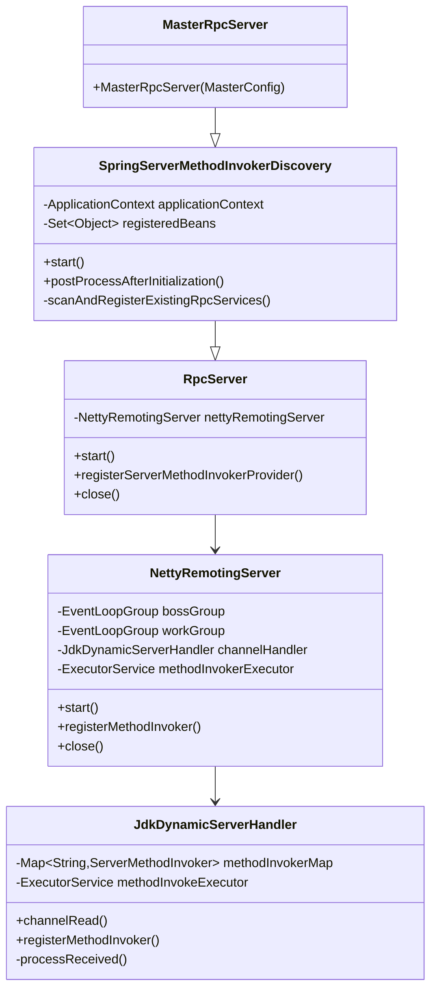
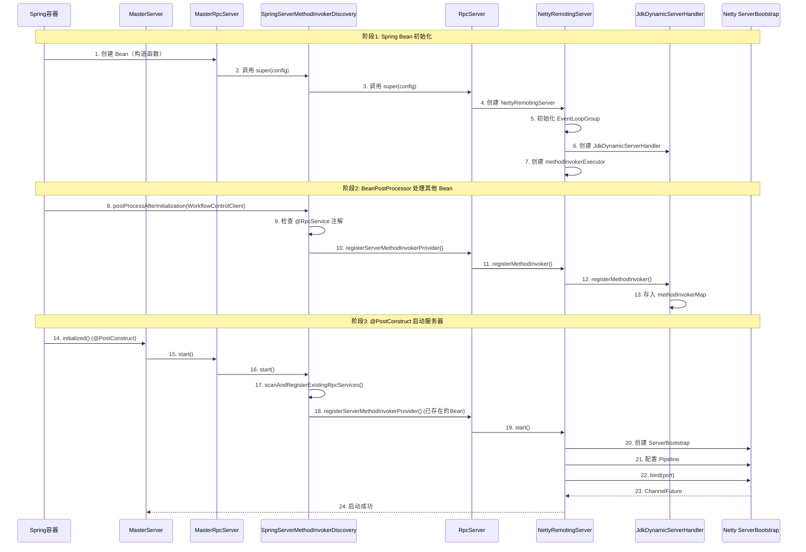
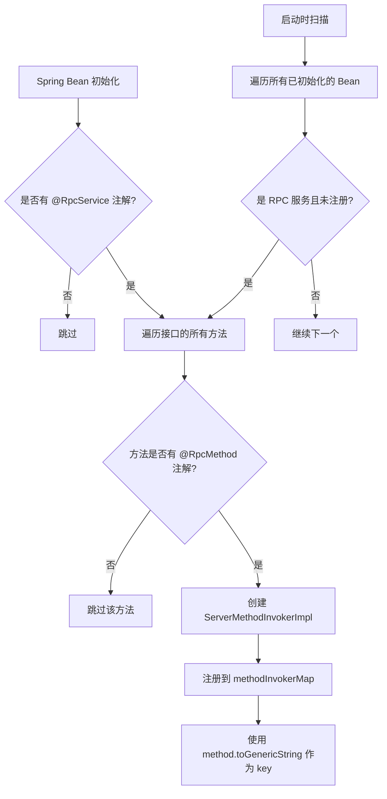
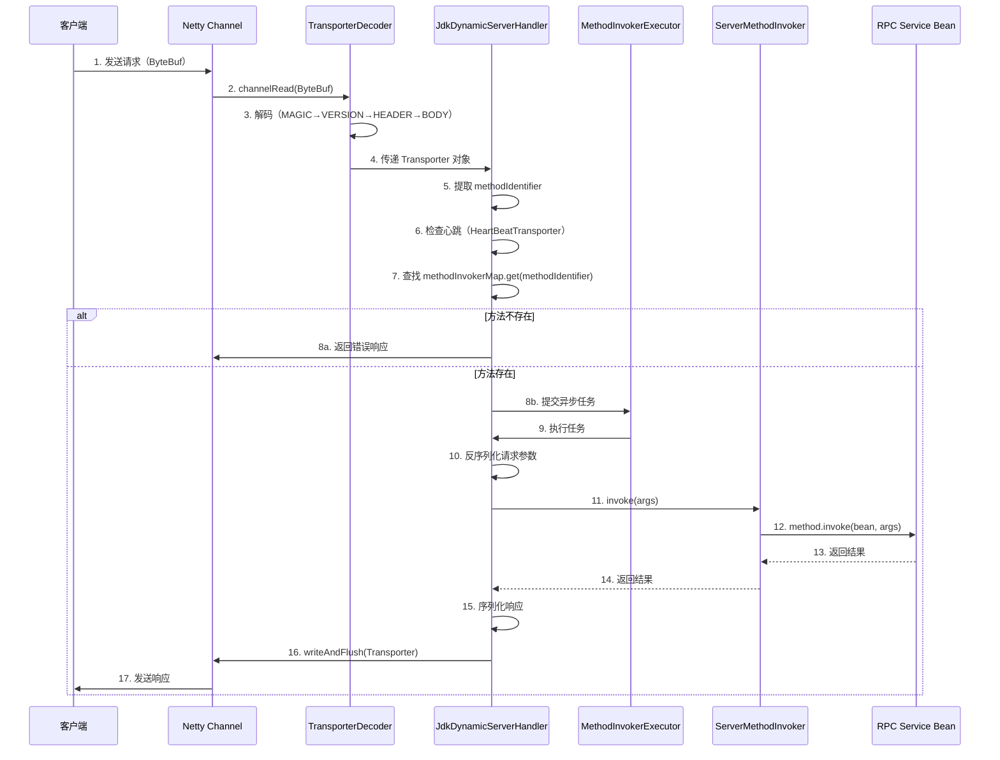
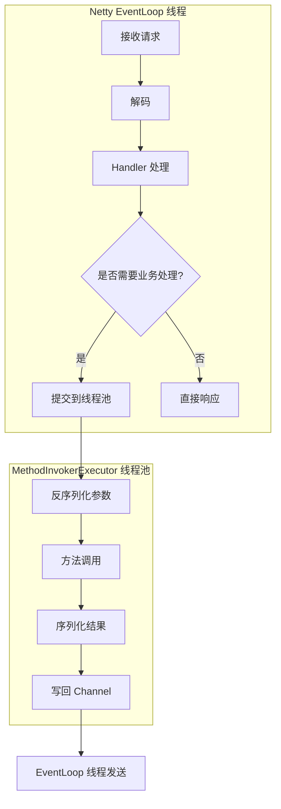
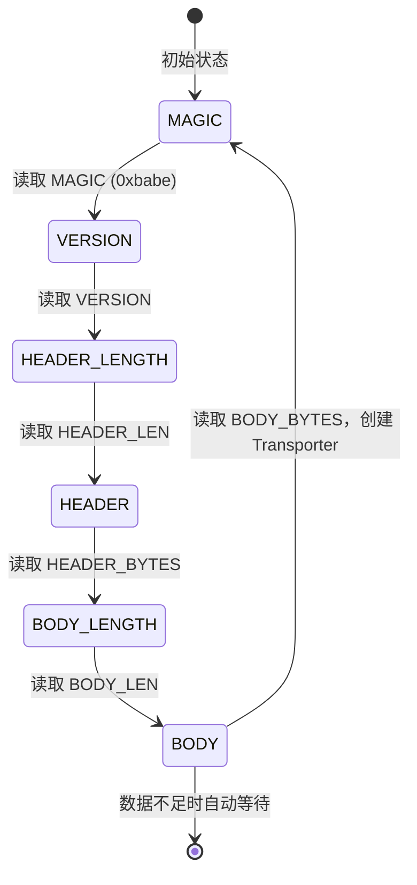

# Netty 服务端启动与工作原理分析

## 目录
1. [架构概览](#架构概览)
2. [核心组件](#核心组件)
3. [启动流程](#启动流程)
4. [服务注册机制](#服务注册机制)
5. [请求处理流程](#请求处理流程)
6. [协议设计](#协议设计)
7. [Netty 优势体现](#netty-优势体现)
8. [关键设计决策](#关键设计决策)

---

## 架构概览

### 类继承关系



### 组件交互图

```mermaid
graph TB
    subgraph "Spring 容器"
        A[MasterRpcServer<br/>@Component]
        B[WorkflowControlClient<br/>@RpcService]
    end
    
    subgraph "RPC 服务层"
        C[SpringServerMethodInvokerDiscovery]
        D[RpcServer]
        E[NettyRemotingServer]
    end
    
    subgraph "Netty 网络层"
        F[ServerBootstrap]
        G[EventLoopGroup Boss]
        H[EventLoopGroup Worker]
        I[Channel Pipeline]
    end
    
    subgraph "请求处理层"
        J[TransporterDecoder]
        K[JdkDynamicServerHandler]
        L[ServerMethodInvoker]
        M[MethodInvokerExecutor]
    end
    
    A -->|继承| C
    C -->|包含| D
    D -->|创建| E
    E -->|创建| F
    F -->|使用| G
    F -->|使用| H
    H -->|处理连接| I
    I -->|解码| J
    J -->|传递| K
    K -->|查找| L
    K -->|异步执行| M
    B -.->|自动发现| C
```

---

## 核心组件

### 1. MasterRpcServer

**位置**: `dolphinscheduler-master/src/main/java/org/apache/dolphinscheduler/server/master/rpc/MasterRpcServer.java`

**职责**:
- 作为 Spring Bean，继承 `SpringServerMethodInvokerDiscovery`
- 在构造时配置 Netty 服务器参数（端口、服务器名称等）

**关键代码**:
```java
@Component
public class MasterRpcServer extends SpringServerMethodInvokerDiscovery implements AutoCloseable {
    public MasterRpcServer(MasterConfig masterConfig) {
        super(NettyServerConfig.builder()
                .serverName("MasterRpcServer")
                .listenPort(masterConfig.getListenPort())
                .build());
    }
}
```

### 2. SpringServerMethodInvokerDiscovery

**位置**: `dolphinscheduler-extract/dolphinscheduler-extract-base/src/main/java/org/apache/dolphinscheduler/extract/base/server/SpringServerMethodInvokerDiscovery.java`

**职责**:
- 实现 `BeanPostProcessor`，自动发现并注册 RPC 服务
- 实现 `ApplicationContextAware`，获取 Spring 上下文
- 在 `start()` 时扫描已存在的 RPC 服务 Bean
- 在 Bean 初始化后自动注册新的 RPC 服务

**关键特性**:
- **双重注册机制**:
    - 启动时扫描 (`scanAndRegisterExistingRpcServices()`)
    - Bean 初始化后注册 (`postProcessAfterInitialization()`)
- **去重机制**: 使用 `ConcurrentHashMap.newKeySet()` 跟踪已注册的 Bean

### 3. RpcServer

**位置**: `dolphinscheduler-extract/dolphinscheduler-extract-base/src/main/java/org/apache/dolphinscheduler/extract/base/server/RpcServer.java`

**职责**:
- 封装 Netty 服务器，提供统一的 RPC 服务接口
- 注册方法调用器（`ServerMethodInvoker`）
- 管理服务器生命周期（启动、关闭）

**方法注册逻辑**:
```java
public void registerServerMethodInvokerProvider(Object serverMethodInvokerProviderBean) {
    // 1. 遍历 Bean 实现的所有接口
    for (Class<?> anInterface : serverMethodInvokerProviderBean.getClass().getInterfaces()) {
        // 2. 检查接口是否有 @RpcService 注解
        if (anInterface.getAnnotation(RpcService.class) == null) {
            continue;
        }
        // 3. 遍历接口的所有方法
        for (Method method : anInterface.getDeclaredMethods()) {
            // 4. 检查方法是否有 @RpcMethod 注解
            RpcMethod rpcMethod = method.getAnnotation(RpcMethod.class);
            if (rpcMethod == null) {
                continue;
            }
            // 5. 创建方法调用器并注册
            ServerMethodInvoker serverMethodInvoker =
                    new ServerMethodInvokerImpl(serverMethodInvokerProviderBean, method);
            nettyRemotingServer.registerMethodInvoker(serverMethodInvoker);
        }
    }
}
```

### 4. NettyRemotingServer

**位置**: `dolphinscheduler-extract/dolphinscheduler-extract-base/src/main/java/org/apache/dolphinscheduler/extract/base/server/NettyRemotingServer.java`

**职责**:
- 封装 Netty 的 `ServerBootstrap`
- 管理 EventLoopGroup（Boss 和 Worker）
- 配置 Channel Pipeline
- 管理方法调用线程池

**关键配置**:
```java
NettyRemotingServer(final NettyServerConfig serverConfig) {
    // 1. 创建方法调用线程池（CPU核心数 * 2 + 1）
    this.methodInvokerExecutor = ThreadUtils.newDaemonFixedThreadExecutor(
            serverName + "-methodInvoker-%d", 
            Runtime.getRuntime().availableProcessors() * 2 + 1);
    
    // 2. 创建 Channel 处理器
    this.channelHandler = new JdkDynamicServerHandler(methodInvokerExecutor);
    
    // 3. 创建 EventLoopGroup（优先使用 Epoll，否则使用 NIO）
    if (Epoll.isAvailable()) {
        this.bossGroup = new EpollEventLoopGroup(1, bossThreadFactory);
        this.workGroup = new EpollEventLoopGroup(serverConfig.getWorkerThread(), workerThreadFactory);
    } else {
        this.bossGroup = new NioEventLoopGroup(1, bossThreadFactory);
        this.workGroup = new NioEventLoopGroup(serverConfig.getWorkerThread(), workerThreadFactory);
    }
}
```

### 5. JdkDynamicServerHandler

**位置**: `dolphinscheduler-extract/dolphinscheduler-extract-base/src/main/java/org/apache/dolphinscheduler/extract/base/server/JdkDynamicServerHandler.java`

**职责**:
- 处理 Netty Channel 的入站事件
- 维护方法调用器映射表（`methodInvokerMap`）
- 解析请求并调用对应的方法
- 处理心跳、异常、空闲连接等事件

**关键方法**:
- `channelRead()`: 接收解码后的 `Transporter` 对象
- `processReceived()`: 处理 RPC 请求的核心逻辑
- `registerMethodInvoker()`: 注册方法调用器

---

## 启动流程

### 时序图



### 详细启动步骤

#### 步骤 1: Spring Bean 初始化

1. **MasterRpcServer 构造**
    - Spring 容器创建 `MasterRpcServer` Bean
    - 调用构造函数，传入 `MasterConfig`
    - 创建 `NettyServerConfig` 并传递给父类

2. **NettyRemotingServer 初始化**
   ```java
   NettyRemotingServer(final NettyServerConfig serverConfig) {
       // 创建方法调用线程池
       this.methodInvokerExecutor = ThreadUtils.newDaemonFixedThreadExecutor(...);
       
       // 创建 Channel 处理器
       this.channelHandler = new JdkDynamicServerHandler(methodInvokerExecutor);
       
       // 创建 EventLoopGroup（Boss 1个线程，Worker N个线程）
       if (Epoll.isAvailable()) {
           this.bossGroup = new EpollEventLoopGroup(1, ...);
           this.workGroup = new EpollEventLoopGroup(serverConfig.getWorkerThread(), ...);
       }
   }
   ```

#### 步骤 2: BeanPostProcessor 自动注册

当其他 Bean（如 `WorkflowControlClient`）初始化完成后：

```java
@Override
public Object postProcessAfterInitialization(Object bean, String beanName) {
    // 检查是否是 RPC 服务 Bean
    if (isRpcServiceBean(bean) && !registeredBeans.contains(bean)) {
        // 注册方法调用器
        registerServerMethodInvokerProvider(bean);
        registeredBeans.add(bean);
    }
    return bean;
}
```

#### 步骤 3: 启动 Netty 服务器

在 `MasterServer.initialized()` 方法中调用 `masterRPCServer.start()`:

```java
@Override
public void start() {
    // 1. 扫描并注册已存在的 RPC 服务 Bean
    if (applicationContext != null) {
        scanAndRegisterExistingRpcServices();
    }
    // 2. 启动 Netty 服务器
    super.start();
}
```

**Netty 服务器启动**:
```java
void start() {
    if (isStarted.compareAndSet(false, true)) {
        ServerBootstrap serverBootstrap = new ServerBootstrap()
                .group(this.bossGroup, this.workGroup)
                .channel(NettyUtils.getServerSocketChannelClass())
                .option(ChannelOption.SO_REUSEADDR, true)
                .option(ChannelOption.SO_BACKLOG, serverConfig.getSoBacklog())
                .childOption(ChannelOption.SO_KEEPALIVE, serverConfig.isSoKeepalive())
                .childOption(ChannelOption.TCP_NODELAY, serverConfig.isTcpNoDelay())
                .childHandler(new ChannelInitializer<SocketChannel>() {
                    @Override
                    protected void initChannel(SocketChannel ch) {
                        initNettyChannel(ch);
                    }
                });
        
        // 绑定端口
        final ChannelFuture channelFuture = serverBootstrap.bind(serverConfig.getListenPort()).sync();
    }
}
```

**Pipeline 初始化**:
```java
private void initNettyChannel(SocketChannel ch) {
    ch.pipeline()
            .addLast("encoder", new TransporterEncoder())      // 出站：编码
            .addLast("decoder", new TransporterDecoder())      // 入站：解码
            .addLast("server-idle-handle", 
                    new IdleStateHandler(60, 0, 0, TimeUnit.MILLISECONDS))  // 空闲检测
            .addLast("handler", channelHandler);              // 业务处理
}
```

---

## 服务注册机制

### 注册流程图



### 双重注册机制详解

#### 为什么需要双重注册？

**问题场景**:
1. Spring Bean 初始化顺序不确定
2. `@PostConstruct` 方法在所有 Bean 初始化完成后才执行
3. 如果 RPC 服务 Bean 在 `start()` 之后才初始化，启动时无法注册

**解决方案**:

1. **启动时扫描** (`scanAndRegisterExistingRpcServices()`)
    - 在 `start()` 时扫描所有已初始化的 Bean
    - 确保启动前已存在的 RPC 服务都被注册

2. **Bean 初始化后注册** (`postProcessAfterInitialization()`)
    - 处理在服务器启动后才初始化的 Bean
    - 确保所有 RPC 服务最终都被注册

**代码实现**:
```java
// 机制1: 启动时扫描
private void scanAndRegisterExistingRpcServices() {
    Map<String, Object> allBeans = applicationContext.getBeansOfType(Object.class);
    for (Map.Entry<String, Object> entry : allBeans.entrySet()) {
        Object bean = entry.getValue();
        if (bean == this) continue;  // 跳过自己
        if (isRpcServiceBean(bean) && !registeredBeans.contains(bean)) {
            registerServerMethodInvokerProvider(bean);
            registeredBeans.add(bean);
        }
    }
}

// 机制2: Bean 初始化后注册
@Override
public Object postProcessAfterInitialization(Object bean, String beanName) {
    if (isRpcServiceBean(bean) && !registeredBeans.contains(bean)) {
        registerServerMethodInvokerProvider(bean);
        registeredBeans.add(bean);
    }
    return bean;
}
```

### 方法标识符生成

方法标识符使用 `Method.toGenericString()` 生成，例如：
```
public abstract org.apache.dolphinscheduler.extract.master.transportor.workflow.WorkflowManualTriggerResponse org.apache.dolphinscheduler.extract.master.IWorkflowControlClient.manualTriggerWorkflow(org.apache.dolphinscheduler.extract.master.transportor.workflow.WorkflowManualTriggerRequest)
```

这确保了方法的唯一性，包括：
- 返回类型
- 方法名
- 参数类型

---

## 请求处理流程

### 完整请求处理时序图



### 详细处理步骤

#### 步骤 1: 网络数据接收

Netty 的 EventLoop 线程接收网络数据，触发 `channelRead()` 事件。

#### 步骤 2: 协议解码

`TransporterDecoder` 使用状态机模式解码：

```java
@Override
protected void decode(ChannelHandlerContext ctx, ByteBuf in, List<Object> out) {
    switch (state()) {
        case MAGIC:
            checkMagic(in.readByte());        // 检查魔数
            checkpoint(State.VERSION);
        case VERSION:
            checkVersion(in.readByte());      // 检查版本
            checkpoint(State.HEADER_LENGTH);
        case HEADER_LENGTH:
            headerLength = in.readInt();      // 读取 Header 长度
            checkpoint(State.HEADER);
        case HEADER:
            header = new byte[headerLength];
            in.readBytes(header);             // 读取 Header
            checkpoint(State.BODY_LENGTH);
        case BODY_LENGTH:
            bodyLength = in.readInt();        // 读取 Body 长度
            checkpoint(State.BODY);
        case BODY:
            body = new byte[bodyLength];
            in.readBytes(body);               // 读取 Body
            // 反序列化 Header，创建 Transporter
            Transporter transporter = Transporter.of(
                JsonSerializer.deserialize(header, TransporterHeader.class), 
                body
            );
            out.add(transporter);
            checkpoint(State.MAGIC);          // 重置状态
    }
}
```

#### 步骤 3: 请求处理

`JdkDynamicServerHandler.channelRead()` 接收解码后的 `Transporter`:

```java
@Override
public void channelRead(ChannelHandlerContext ctx, Object msg) {
    processReceived(ctx.channel(), (Transporter) msg);
}
```

#### 步骤 4: 方法调用

```java
private void processReceived(final Channel channel, final Transporter transporter) {
    final String methodIdentifier = transporter.getHeader().getMethodIdentifier();
    
    // 1. 心跳处理
    if (HeartBeatTransporter.METHOD_IDENTIFY.equals(methodIdentifier)) {
        return;  // 心跳直接返回，不处理
    }
    
    // 2. 查找方法调用器
    ServerMethodInvoker methodInvoker = methodInvokerMap.get(methodIdentifier);
    if (methodInvoker == null) {
        // 返回错误响应
        StandardRpcResponse iRpcResponse = 
            StandardRpcResponse.fail("Cannot find the ServerMethodInvoker of " + methodIdentifier);
        channel.writeAndFlush(createResponse(transporter, iRpcResponse));
        return;
    }
    
    // 3. 异步执行方法调用
    methodInvokeExecutor.execute(() -> {
        try {
            // 3.1 反序列化请求
            StandardRpcRequest standardRpcRequest = 
                JsonSerializer.deserialize(transporter.getBody(), StandardRpcRequest.class);
            
            // 3.2 反序列化参数
            Object[] args = deserializeArgs(standardRpcRequest);
            
            // 3.3 调用方法
            Object result = methodInvoker.invoke(args);
            
            // 3.4 序列化响应
            StandardRpcResponse iRpcResponse = 
                StandardRpcResponse.success(JsonSerializer.serialize(result), result.getClass());
            
            // 3.5 发送响应
            channel.writeAndFlush(createResponse(transporter, iRpcResponse));
        } catch (Throwable e) {
            // 错误处理
            StandardRpcResponse iRpcResponse = StandardRpcResponse.fail(e.getMessage());
            channel.writeAndFlush(createResponse(transporter, iRpcResponse));
        }
    });
}
```

#### 步骤 5: 响应编码

`TransporterEncoder` 将 `Transporter` 对象编码为 `ByteBuf`:

```java
@Override
protected void encode(ChannelHandlerContext ctx, Transporter transporter, ByteBuf out) {
    out.writeByte(Transporter.MAGIC);                    // 魔数
    out.writeByte(Transporter.VERSION);                  // 版本
    
    byte[] header = transporter.getHeader().toBytes();
    out.writeInt(header.length);                         // Header 长度
    out.writeBytes(header);                              // Header 内容
    
    byte[] body = transporter.getBody();
    out.writeInt(body.length);                           // Body 长度
    out.writeBytes(body);                                // Body 内容
}
```

### 线程模型



**线程分离的优势**:
1. **EventLoop 线程**: 快速处理网络 I/O，不阻塞
2. **业务线程池**: 执行耗时业务逻辑，避免阻塞 EventLoop

---

## 协议设计

### 协议格式

```
ByteBuf 结构:
┌──────┬─────────┬──────────────┬──────────────────┬──────────────┬──────────────────┐
│ MAGIC│ VERSION │ HEADER_LEN   │ HEADER_BYTES      │ BODY_LEN     │ BODY_BYTES       │
│(1字节)│(1字节)  │  (4字节)     │ (变长，JSON)      │  (4字节)     │ (变长，JSON)     │
└──────┴─────────┴──────────────┴──────────────────┴──────────────┴──────────────────┘
```

### 协议字段说明

| 字段 | 大小 | 说明 |
|------|------|------|
| MAGIC | 1 字节 | 协议魔数 `0xbabe`，用于识别消息边界 |
| VERSION | 1 字节 | 协议版本号，当前为 `0` |
| HEADER_LEN | 4 字节 | Header 的字节长度 |
| HEADER_BYTES | 变长 | Header 的 JSON 序列化结果 |
| BODY_LEN | 4 字节 | Body 的字节长度 |
| BODY_BYTES | 变长 | Body 的 JSON 序列化结果 |

### Header 结构

```java
public class TransporterHeader {
    private String methodIdentifier;  // 方法标识符（Method.toGenericString()）
    private long opaque;              // 请求 ID（用于匹配请求和响应）
}
```

### Body 结构

**请求 (StandardRpcRequest)**:
```java
public class StandardRpcRequest {
    private byte[][] args;        // 参数序列化后的字节数组
    private Class<?>[] argsTypes; // 参数类型
}
```

**响应 (StandardRpcResponse)**:
```java
public class StandardRpcResponse {
    private boolean success;      // 是否成功
    private String message;      // 错误消息（失败时）
    private byte[] body;         // 响应体序列化结果
    private Class<?> bodyType;   // 响应体类型
}
```

### 粘包和拆包处理

**问题**: TCP 是流式协议，没有消息边界，可能出现：
- **粘包**: 多个消息合并在一起
- **拆包**: 一个消息被分成多段

**解决方案**:
1. **MAGIC 字节**: 标识消息开始位置
2. **长度字段**: HEADER_LEN 和 BODY_LEN 明确消息边界
3. **ReplayingDecoder**: 自动处理数据不足的情况

**解码流程**:


---

## Netty 优势体现

### 1. 高性能

#### 1.1 零拷贝技术

- **ByteBuf**: Netty 使用直接内存（Direct Memory），减少数据拷贝
- **CompositeByteBuf**: 组合多个 ByteBuf，避免合并时的拷贝

#### 1.2 高效的线程模型

```java
// Boss Group: 1 个线程，专门接收连接
this.bossGroup = new EpollEventLoopGroup(1, bossThreadFactory);

// Worker Group: N 个线程，处理 I/O 事件
this.workGroup = new EpollEventLoopGroup(serverConfig.getWorkerThread(), workerThreadFactory);
```

**优势**:
- **单线程接收连接**: 减少线程切换开销
- **多线程处理 I/O**: 充分利用多核 CPU
- **事件驱动**: 非阻塞 I/O，避免线程阻塞

#### 1.3 Epoll 支持

```java
if (Epoll.isAvailable()) {
    this.bossGroup = new EpollEventLoopGroup(1, bossThreadFactory);
    this.workGroup = new EpollEventLoopGroup(serverConfig.getWorkerThread(), workerThreadFactory);
}
```

**优势**:
- Linux 系统下使用 Epoll，性能优于 NIO
- 自动检测并选择最佳实现

### 2. 灵活的 Pipeline 机制

```java
ch.pipeline()
    .addLast("encoder", new TransporterEncoder())      // 出站编码
    .addLast("decoder", new TransporterDecoder())      // 入站解码
    .addLast("server-idle-handle", new IdleStateHandler(...))  // 空闲检测
    .addLast("handler", channelHandler);              // 业务处理
```

**优势**:
- **责任链模式**: 每个 Handler 专注单一职责
- **可扩展性**: 易于添加新的 Handler（如压缩、加密）
- **顺序控制**: 入站和出站 Handler 分别处理

### 3. 异步非阻塞

```java
// 异步提交任务到线程池
methodInvokeExecutor.execute(() -> {
    // 业务处理
    Object result = methodInvoker.invoke(args);
    // 异步写回响应
    channel.writeAndFlush(response);
});
```

**优势**:
- **EventLoop 不阻塞**: 快速处理网络 I/O
- **业务逻辑异步执行**: 使用独立线程池
- **高并发**: 单线程可处理大量连接

### 4. 连接管理

#### 4.1 心跳检测

```java
new IdleStateHandler(serverConfig.getConnectionIdleTime(), 0, 0, TimeUnit.MILLISECONDS)
```

**机制**:
- 60 秒未收到数据，触发 `READER_IDLE` 事件
- 自动关闭空闲连接，释放资源

#### 4.2 背压控制

```java
@Override
public void channelWritabilityChanged(ChannelHandlerContext ctx) {
    Channel ch = ctx.channel();
    if (!ch.isWritable()) {
        // 写缓冲区满，暂停读取
        config.setAutoRead(false);
    } else {
        // 写缓冲区可用，恢复读取
        config.setAutoRead(true);
    }
}
```

**优势**: 防止内存溢出，自动控制数据流

### 5. 可配置的网络参数

```java
.option(ChannelOption.SO_REUSEADDR, true)           // 端口复用
.option(ChannelOption.SO_BACKLOG, serverConfig.getSoBacklog())  // 连接队列大小
.childOption(ChannelOption.SO_KEEPALIVE, serverConfig.isSoKeepalive())  // 保活
.childOption(ChannelOption.TCP_NODELAY, serverConfig.isTcpNoDelay())     // 禁用 Nagle
.childOption(ChannelOption.SO_SNDBUF, serverConfig.getSendBufferSize())   // 发送缓冲区
.childOption(ChannelOption.SO_RCVBUF, serverConfig.getReceiveBufferSize()) // 接收缓冲区
```

**优势**: 根据业务需求灵活调整网络参数

### 6. 优雅关闭

```java
void close() {
    if (isStarted.compareAndSet(true, false)) {
        // 1. 关闭服务器 Channel
        if (serverBootstrapChannel != null) {
            serverBootstrapChannel.close().sync();
        }
        // 2. 优雅关闭 EventLoopGroup
        if (bossGroup != null) {
            this.bossGroup.shutdownGracefully();
        }
        if (workGroup != null) {
            this.workGroup.shutdownGracefully();
        }
        // 3. 关闭线程池
        methodInvokerExecutor.shutdownNow();
    }
}
```

**优势**: 确保资源正确释放，避免数据丢失

---

## 关键设计决策

### 1. 为什么使用 `@Sharable` Handler？

```java
@ChannelHandler.Sharable
class JdkDynamicServerHandler extends ChannelInboundHandlerAdapter {
    private final Map<String, ServerMethodInvoker> methodInvokerMap;
}
```

**原因**:
- 所有 Channel 共享同一个 Handler 实例
- `methodInvokerMap` 在 Handler 级别共享，所有连接都能访问
- 减少内存占用，提