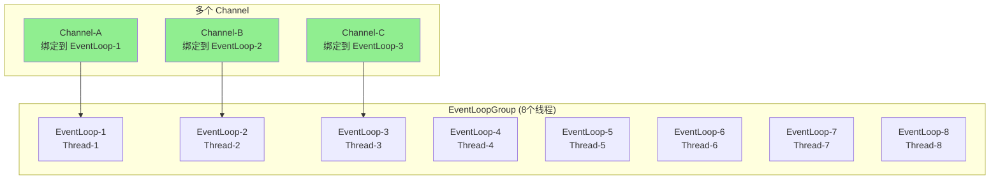
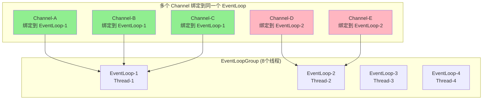
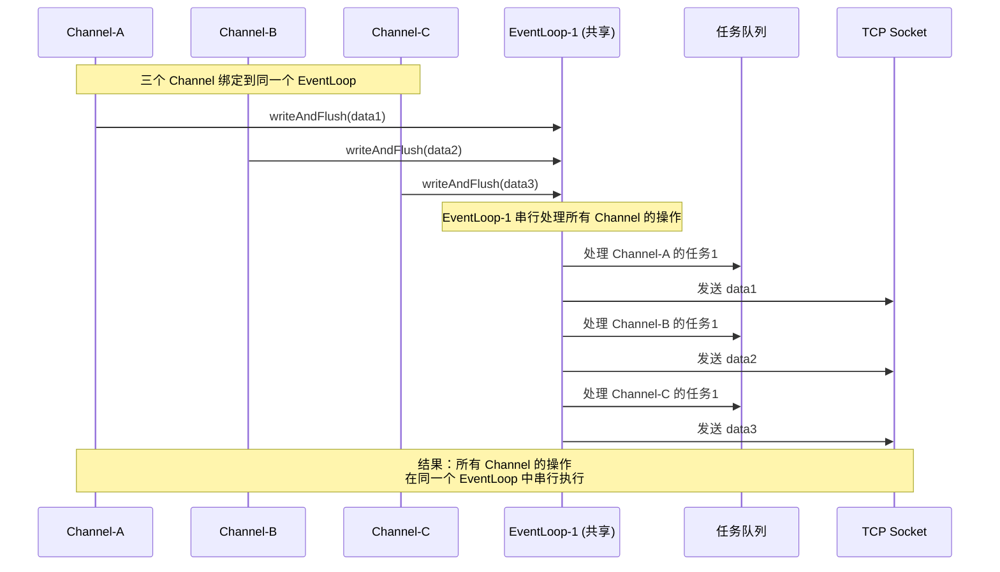
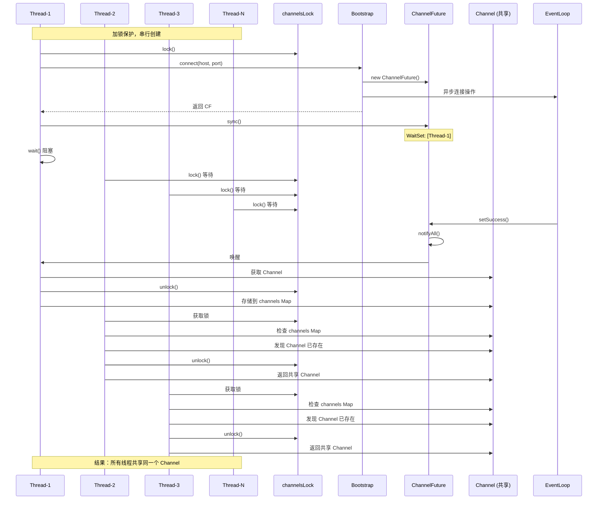
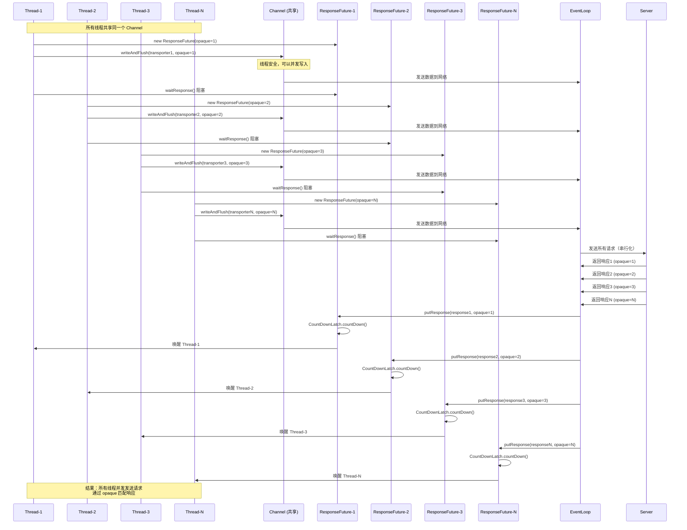
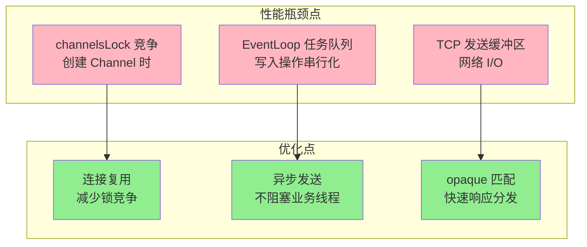

# Netty Channel 机制深度解析

## 目录

1. [ChannelFuture.sync() 阻塞机制](#1-channelfuturesync-阻塞机制)
2. [wait/notify 通知机制](#2-waitnotify-通知机制)
3. [多个 Waiters 的场景分析](#3-多个-waiters-的场景分析)
4. [EventLoop 串行处理 vs 多线程](#4-eventloop-串行处理-vs-多线程)
5. [并发写入乱序问题](#5-并发写入乱序问题)
6. [连接池与 Channel 复用](#6-连接池与-channel-复用)
7. [高并发场景下的性能分析](#7-高并发场景下的性能分析)

---

## 1. ChannelFuture.sync() 阻塞机制

### 1.1 代码位置

```java
// NettyRemotingClient.java:231
ChannelFuture future = bootstrap.connect(new InetSocketAddress(host.getIp(), host.getPort()));
future = future.sync();  // 阻塞等待连接完成
```

### 1.2 sync() 方法的作用

`sync()` 方法用于**同步等待异步操作完成**：

1. **阻塞等待**：阻塞当前线程，直到连接操作完成（成功或失败）
2. **返回自身**：返回 `ChannelFuture`，支持链式调用
3. **异常处理**：如果连接失败，会抛出异常（可能被 `InterruptedException` 包装）

### 1.3 Netty 源码实现

```java
// Netty 源码：DefaultPromise.sync()
@Override
public Promise<V> sync() throws InterruptedException {
    await();  // 1. 调用 await() 阻塞等待
    rethrowIfFailed();  // 2. 如果失败，抛出异常
    return this;
}

// Netty 源码：DefaultPromise.await()
@Override
public Promise<V> await() throws InterruptedException {
    if (isDone()) {
        return this;
    }
    
    synchronized (this) {
        while (!isDone()) {
            incWaiters();
            try {
                wait();  // ⭐ 关键：使用 Object.wait() 阻塞当前线程
            } finally {
                decWaiters();
            }
        }
    }
    return this;
}
```

### 1.4 执行流程

```
调用线程                          EventLoop 线程
   |                                  |
   |-- bootstrap.connect() ---------->|  (异步操作开始)
   |                                  |
   |-- future.sync()                  |
   |   |-- await()                    |
   |   |   |-- synchronized(this)     |
   |   |   |   |-- while(!isDone())   |
   |   |   |   |   |-- wait() --------|  (线程阻塞在这里)
   |   |   |   |   |                  |
   |   |   |   |                      |-- 连接完成
   |   |   |   |                      |-- setSuccess()
   |   |   |   |                      |-- notifyAll()  ⬅️ 唤醒
   |   |   |   |-- 被唤醒，退出循环    |
   |   |   |-- 释放锁                 |
   |   |-- rethrowIfFailed()          |
   |-- 继续执行后续代码                |
```

---

## 2. wait/notify 通知机制

### 2.1 为什么能确保是同一个对象？

#### 对象实例的传递

```java
// 步骤1: Bootstrap.connect() 创建 promise
ChannelPromise promise = new DefaultChannelPromise(...);
// promise 对象地址: 0x12345678

// 步骤2: 将 promise 传递给异步操作
doConnect(remoteAddress, promise);
// EventLoop 线程持有同一个 promise 引用 (0x12345678)

// 步骤3: 返回 promise 给调用者
return promise;
// 调用线程持有同一个 promise 引用 (0x12345678)
```

#### Java 对象监视器的唯一性

每个 Java 对象都有唯一的对象头，对象头包含：
- **Mark Word**：存储对象的状态信息
- **Monitor Pointer**：指向 ObjectMonitor 的指针

```
对象实例 (0x12345678)
├── 对象头
│   ├── Mark Word
│   └── Monitor Pointer → ObjectMonitor (唯一)
│       ├── Owner
│       ├── WaitSet ⭐ (存储在这个对象的 WaitSet)
│       └── EntryList
└── 实例数据
```

### 2.2 wait() 和 notifyAll() 的匹配机制

```java
// 调用线程
synchronized (promise) {  // promise = 0x12345678
    promise.wait();       // 在 0x12345678 的 WaitSet 中等待
}

// EventLoop 线程
synchronized (promise) {  // 同一个 promise = 0x12345678
    promise.notifyAll();  // 唤醒 0x12345678 的 WaitSet 中的线程
}
```

**关键点**：
- `wait()` 和 `notifyAll()` 必须在同一个对象的 `synchronized` 块中调用
- 它们操作的是同一个对象的 ObjectMonitor
- WaitSet 是对象级别的，不是线程级别的

### 2.3 notifyAll() 的唤醒流程

```java
// Netty 源码：DefaultPromise.setSuccess()
public Promise<V> setSuccess(V result) {
    synchronized (this) {  // 1. 获取锁
        if (setSuccess0(result)) {
            if (hasWaiters()) {
                notifyAll();  // 2. 唤醒所有等待线程
            }
        }
    }  // 3. 释放锁
    return this;
}
```

**内部实现（JVM 层面）**：

```cpp
// JVM 内部实现（简化）
void ObjectMonitor::notifyAll(Thread* self) {
    ObjectWaiter* iterator = _WaitSet;  // 获取 WaitSet 头节点
    
    // 遍历整个 WaitSet
    while (iterator != NULL) {
        ObjectWaiter* next = iterator->_next;
        
        // 将线程从 WaitSet 移到 EntryList
        iterator->_notified = 1;
        iterator->_thread->set_state(BLOCKED);
        
        // 从 WaitSet 移除
        remove_from_WaitSet(iterator);
        
        // 添加到 EntryList
        add_to_EntryList(iterator);
        
        iterator = next;
    }
    
    // 唤醒 EntryList 中的线程（让它们竞争锁）
    if (_EntryList != NULL) {
        _EntryList->_thread->unpark();  // 唤醒第一个线程
    }
}
```

### 2.4 完整的唤醒链路

```
EventLoop 线程
    ↓
setSuccess() 被调用
    ↓
synchronized(this) 获取对象 0x12345678 的锁
    ↓
设置 result 和 isDone = true
    ↓
notifyAll() 被调用
    ↓
JVM 遍历对象 0x12345678 的 WaitSet
    ↓
找到调用线程（在 WaitSet 中）
    ↓
将调用线程从 WaitSet 移到 EntryList
    ↓
调用线程状态: WAITING → BLOCKED
    ↓
unpark() 唤醒调用线程
    ↓
调用线程被唤醒，尝试重新获取锁
    ↓
获取锁成功
    ↓
检查 isDone() == true
    ↓
退出 while 循环
    ↓
sync() 返回
```

---

## 3. 多个 Waiters 的场景分析

### 3.1 为什么会有多个 waiters？

#### 场景1：Netty 内部可能有多个监听器

Netty 的 `ChannelFuture` 设计支持多个监听器：

```java
// Netty 内部可能的代码
ChannelFuture future = bootstrap.connect(...);

// 监听器1：等待连接完成
future.addListener(future -> {
    // 处理连接完成
});

// 监听器2：同时调用 sync()
future.sync();  // 也会进入 WaitSet
```

#### 场景2：通用设计

`DefaultChannelPromise` 是通用实现，需要支持多种使用场景，包括：
- 多个线程等待同一个异步操作
- 多个监听器等待同一个结果
- 同时使用 `sync()` 和 `addListener()`

### 3.2 为什么使用 notifyAll() 而不是 notify()？

#### 连接操作的状态特性

```java
// Netty 源码：DefaultPromise
public Promise<V> setSuccess(V result) {
    synchronized (this) {
        if (setSuccess0(result)) {  // isDone = true，不会再改变
            if (hasWaiters()) {
                notifyAll();  // 唤醒所有等待的线程
            }
        }
    }
    return this;
}
```

**关键点**：
- **连接操作是不可逆的**：一旦 `setSuccess()` 或 `setFailure()` 被调用，`isDone()` 就变为 `true`，不会再改变
- **所有等待的线程都在等待同一个条件**：`isDone() == true`
- **一旦条件满足，所有等待的线程都应该被唤醒**

#### 如果只用 notify() 会怎样？

```java
// 假设有 3 个线程在 WaitSet 中等待
Thread-1: future.sync()  // 在 WaitSet 中
Thread-2: future.sync()  // 在 WaitSet 中
Thread-3: future.sync()  // 在 WaitSet 中

// 连接完成
setSuccess() {
    notify();  // ⚠️ 只唤醒一个线程（比如 Thread-1）
}

// 结果：
Thread-1: 被唤醒，检查 isDone() == true，继续执行 ✅
Thread-2: 仍然在 WaitSet 中等待 ❌（可能永远等待）
Thread-3: 仍然在 WaitSet 中等待 ❌（可能永远等待）
```

#### 使用 notifyAll() 的正确流程

```java
// 3 个线程在 WaitSet 中等待
Thread-1: future.sync()  // 在 WaitSet 中
Thread-2: future.sync()  // 在 WaitSet 中
Thread-3: future.sync()  // 在 WaitSet 中

// 连接完成
setSuccess() {
    notifyAll();  // ✅ 唤醒所有线程
}

// 结果：
Thread-1: 被唤醒，检查 isDone() == true，继续执行 ✅
Thread-2: 被唤醒，检查 isDone() == true，继续执行 ✅
Thread-3: 被唤醒，检查 isDone() == true，继续执行 ✅
```

### 3.3 对于本项目：加锁场景下的 waiters

#### 加锁保护下的情况

```java
// NettyRemotingClient.java:198-216
Channel getOrCreateChannel(Host host) {
    Channel channel = channels.get(host);
    if (channel != null && channel.isActive()) {
        return channel;
    }
    try {
        channelsLock.lock();  // ⭐ 锁保护
        // 双重检查
        channel = channels.get(host);
        if (channel != null && channel.isActive()) {
            return channel;
        }
        channel = createChannel(host);  // 只有一个线程能执行
        channels.put(host, channel);
    } finally {
        channelsLock.unlock();
    }
    return channel;
}
```

**分析**：
- 由于 `channelsLock` 保护，对于同一个 host，只有一个线程能调用 `createChannel()`
- 每个 `bootstrap.connect()` 调用都会创建一个新的 `ChannelFuture` 实例
- 所以对于同一个连接操作，通常只有一个线程会调用 `future.sync()`

**结论**：对于本项目，第225行的 `future.sync()` 通常只有一个 waiter，但 Netty 的设计仍然使用 `notifyAll()` 以保证通用性和安全性。

---

## 4. EventLoop 串行处理 vs 多线程

### 4.1 EventLoopGroup 的多线程 vs Channel 的串行化

```java
// 代码中设置了多个线程
this.workerGroup = new NioEventLoopGroup(clientConfig.getWorkerThreads(), ...);
// workerThreads 可能是 8、16 等
```

**关键点**：
- **EventLoopGroup 有多个线程**（例如 8 个）
- **但每个 Channel 只绑定到一个 EventLoop**
- **同一个 Channel 的所有操作都在同一个 EventLoop 线程中串行执行**

### <span style="color: red;">4.2 Netty 的 Channel-EventLoop 绑定机制</span>

#### <span style="color: red;">4.2.1 一对一绑定：一个 Channel 绑定一个 EventLoop</span>



**关键点**：
- 每个 Channel 只绑定到一个 EventLoop
- 同一个 Channel 的所有操作都在同一个 EventLoop 线程中串行执行
- 不同 Channel 的操作可能在不同 EventLoop 中并行执行

#### <span style="color: red;">4.2.2 一对多绑定：一个 EventLoop 可以处理多个 Channel</span>



**关键点**：
- **一个 EventLoop 可以处理多个 Channel**
- **每个 Channel 的操作在同一个 EventLoop 中串行执行**
- **不同 Channel 的操作在同一个 EventLoop 中也是串行执行（共享同一个线程）**

#### 4.2.3 EventLoop 分配策略

Netty 使用轮询（Round-Robin）策略分配 Channel 到 EventLoop：

```java
// Netty 内部实现（简化）
public class EventLoopGroup {
    private final EventLoop[] children;
    private int childIndex = 0;
    
    public EventLoop next() {
        // 轮询分配
        return children[Math.abs(childIndex++ % children.length)];
    }
}

// 当新 Channel 连接时
Channel channel = ...;
EventLoop eventLoop = eventLoopGroup.next();  // 轮询选择一个 EventLoop
channel.register(eventLoop);  // 绑定到该 EventLoop
```

**分配示例**：

```java
// 假设有 8 个 EventLoop，创建 20 个 Channel
Channel-1  → EventLoop-1
Channel-2  → EventLoop-2
Channel-3  → EventLoop-3
...
Channel-8  → EventLoop-8
Channel-9  → EventLoop-1  // 轮询回到第一个
Channel-10 → EventLoop-2
...
Channel-20 → EventLoop-4

// 结果：
// EventLoop-1: 处理 Channel-1, Channel-9, Channel-17
// EventLoop-2: 处理 Channel-2, Channel-10, Channel-18
// EventLoop-3: 处理 Channel-3, Channel-11, Channel-19
// EventLoop-4: 处理 Channel-4, Channel-12, Channel-20
// ...
```

#### 4.2.4 多个 Channel 共享 EventLoop 的工作机制



**要点**：
- 多个 Channel 的操作会被添加到同一个 EventLoop 的任务队列
- EventLoop 线程按顺序处理所有 Channel 的任务
- 每个 Channel 内部的操作是串行的，不同 Channel 之间也是串行的（在同一个 EventLoop 中）

#### 4.2.5 性能影响分析

**优势**：
1. **资源复用**：多个 Channel 共享 EventLoop 线程，减少线程数
2. **负载均衡**：通过轮询分配，实现负载均衡
3. **简化设计**：不需要为每个 Channel 创建独立线程

**潜在问题**：
1. **单 EventLoop 过载**：如果某个 EventLoop 绑定了太多 Channel，可能成为瓶颈
2. **任务队列积压**：如果某个 EventLoop 处理速度慢，任务队列可能积压

**优化建议**：
- 合理设置 EventLoopGroup 的线程数
- 监控每个 EventLoop 的任务队列长度
- 根据实际负载调整线程数

### 4.3 为什么同一个 Channel 要串行化？

**原因**：
1. **TCP 需要保证顺序**：TCP 是流式协议，必须按顺序发送和接收
2. **避免竞态条件**：多个线程同时操作 Channel 会导致状态不一致
3. **简化并发模型**：串行化让 Channel 操作无需额外同步

### 4.4 Netty 内部实现（简化）

```java
// Netty 内部实现（简化）
public class AbstractChannel {
    private final EventLoop eventLoop;
    
    public ChannelFuture writeAndFlush(Object msg) {
        // 关键：所有操作都提交到同一个 EventLoop
        if (eventLoop.inEventLoop()) {
            // 当前线程就是 EventLoop 线程，直接执行
            writeAndFlush0(msg);
        } else {
            // 其他线程，提交到任务队列（FIFO）
            eventLoop.execute(() -> writeAndFlush0(msg));
        }
    }
    
    private void writeAndFlush0(Object msg) {
        // 这个方法只在 EventLoop 线程中执行
        // 保证串行化，不会有竞态条件
        ByteBuf data = encode(msg);
        outboundBuffer.addMessage(data);  // 安全写入
        flush();
    }
}
```

---

## 5. 并发写入乱序问题

### 5.1 如果没有串行化，会出现什么问题？

#### 问题1：队列操作竞态 - 链表结构破坏

```java
// ChannelOutboundBuffer 的 addMessage 方法（没有同步）
public void addMessage(Object msg) {
    Entry entry = new Entry();
    entry.buf = encode(msg);
    entry.next = null;
    
    // ⚠️ 多个线程同时执行这里
    if (tail == null) {
        head = tail = entry;
    } else {
        tail.next = entry;  // ⚠️ 竞态条件1
        tail = entry;       // ⚠️ 竞态条件2
    }
}
```

**具体场景**：

```java
// 初始状态
head = null
tail = null

// Thread-1 执行
Thread-1:
    if (tail == null) {  // true
        head = tail = Entry1;
    }
    // 此时：head = Entry1, tail = Entry1

// Thread-2 执行（在 Thread-1 之后，但 tail 还没更新）
Thread-2:
    if (tail == null) {  // false (tail = Entry1)
    } else {
        tail.next = Entry2;  // Entry1.next = Entry2
        // 此时 Thread-3 也读取了 tail = Entry1
        tail = Entry2;       // tail = Entry2
    }

// Thread-3 执行（与 Thread-2 并发）
Thread-3:
    if (tail == null) {  // false (tail = Entry1，在 Thread-2 更新 tail 之前)
    } else {
        tail.next = Entry3;  // Entry1.next = Entry3 ⚠️ 覆盖了 Entry2
        tail = Entry3;       // tail = Entry3
    }

// 最终结果
head = Entry1
tail = Entry3
Entry1.next = Entry3  // ⚠️ Entry2 丢失！
Entry2.next = null    // Entry2 成为孤立节点
Entry3.next = null

// 链表结构：Entry1 -> Entry3
// Entry2 丢失，无法被发送
```

#### 问题2：数据包丢失

```java
// 场景：Entry2 丢失
发送顺序：Entry2 (opaque=2), Entry1 (opaque=1), Entry3 (opaque=3)
实际发送：Entry1 (opaque=1), Entry3 (opaque=3)  // Entry2 丢失

// 客户端
Thread-1: ResponseFuture future1 = new ResponseFuture(1, timeout);
          future1.waitResponse();  // 等待响应1 ✅ 正常

Thread-2: ResponseFuture future2 = new ResponseFuture(2, timeout);
          future2.waitResponse();  // 等待响应2 ❌ 永远等不到，超时！

Thread-3: ResponseFuture future3 = new ResponseFuture(3, timeout);
          future3.waitResponse();  // 等待响应3 ✅ 正常

// 结果：
// - Thread-2 超时，抛出 RemoteTimeoutException
// - opaque=2 的请求永远无法匹配到响应
```

#### 问题3：顺序错乱

```java
// 执行顺序
Thread-1: writeAndFlush(data1)  // 期望第1个发送
Thread-2: writeAndFlush(data2)  // 期望第2个发送
Thread-3: writeAndFlush(data3)  // 期望第3个发送

// 实际执行（由于竞态条件）
T0: Thread-2 最快完成
    head = Entry2, tail = Entry2
    
T1: Thread-1 执行
    Entry2.next = Entry1
    tail = Entry1
    
T2: Thread-3 执行
    Entry1.next = Entry3
    tail = Entry3

// 最终链表
head = Entry2
Entry2.next = Entry1
Entry1.next = Entry3
Entry3.next = null

// 发送顺序
1. Entry2 (data2: [6,7,8,9,10])  ⚠️ 第1个发送
2. Entry1 (data1: [1,2,3,4,5])   ⚠️ 第2个发送
3. Entry3 (data3: [11,12,13,14,15])  ⚠️ 第3个发送

// 服务端收到顺序：data2, data1, data3
// ❌ 与调用顺序不一致！
```

#### 问题4：链表破坏 - 循环链表或指针错乱

```java
// 复杂的竞态条件
T0: Thread-1 执行
    head = Entry1, tail = Entry1
    
T1: Thread-2 执行
    Entry1.next = Entry2
    // 此时 Thread-3 也读取了 tail = Entry1
    
T2: Thread-3 执行（在 Thread-2 更新 tail 之前）
    Entry1.next = Entry3  // 覆盖 Entry2
    tail = Entry3
    
T3: Thread-2 继续执行
    tail = Entry2  // 但 Entry1.next 已经是 Entry3
    
T4: Thread-2 再次执行（异常情况）
    // 如果 Entry2 的 next 被错误设置
    Entry2.next = Entry1  // ⚠️ 形成循环！

// 最终结果
head = Entry1
tail = Entry2
Entry1.next = Entry3
Entry2.next = Entry1  // ⚠️ 指向 Entry1，形成循环
Entry3.next = null

// 链表结构：Entry1 -> Entry3 -> null
//          Entry2 -> Entry1 (循环)
// ⚠️ 发送时会陷入死循环或数据重复发送
```

### 5.2 数据内容不会混合的原因

#### Netty 的设计保证

```java
// Netty 的 writeAndFlush 流程
public ChannelFuture writeAndFlush(Object msg) {
    // 1. 分配新的 ByteBuf（每个请求独立）
    ByteBuf buf = ctx.alloc().buffer();
    
    // 2. 编码（写入独立的 ByteBuf）
    encoder.encode(ctx, msg, buf);
    // buf 的内容：[MAGIC][VERSION][header][body]
    // 这个 buf 是独立的，不会被其他线程修改
    
    // 3. 添加到队列（只是添加引用，不复制数据）
    outboundBuffer.addMessage(buf);
    // 队列中存储的是 ByteBuf 的引用
    // 每个 ByteBuf 仍然是独立的
}
```

**要点**：
- 每个 ByteBuf 是独立分配和编码的
- 队列只存储 ByteBuf 的引用，不复制数据
- **数据内容不会混合**，但可能出现：
  - 数据包丢失（ByteBuf 完整但无法访问）
  - 发送顺序错乱（ByteBuf 完整但顺序不对）

### 5.3 opaque 机制与顺序错乱

#### opaque 的作用

```java
// 每个请求都有唯一的 opaque
ResponseFuture future = new ResponseFuture(opaque=1, timeout);
FUTURE_TABLE.put(1, future);  // 存储到 Map
channel.writeAndFlush(transporter1);  // opaque=1

// 服务端处理并返回
response.setOpaque(1);  // 返回相同的 opaque

// 客户端接收响应
ResponseFuture future = ResponseFuture.getFuture(1);  // 通过 opaque 找到
future.putResponse(response);
```

#### 发送顺序不一致的影响

| 场景 | 功能影响 | 性能影响 | 严重程度 |
|------|---------|---------|---------|
| 仅顺序错乱（数据完整） | ✅ 无影响（opaque 匹配正常） | ⚠️ 可能有影响（响应时间不合理） | 低 |
| 数据包丢失 | ❌ 严重（opaque 无法匹配，超时） | ❌ 严重（请求失败） | 高 |
| 数据包破坏 | ❌ 严重（opaque 读取错误，无法匹配） | ❌ 严重（请求失败） | 高 |
| 链表结构破坏 | ❌ 严重（可能导致多个问题） | ❌ 严重（系统不稳定） | 高 |

**结论**：
- 如果只是顺序不一致，`opaque` 机制可以保证功能正确，但可能影响性能
- 如果没有串行化，通常还会伴随数据包丢失、破坏等问题
- 因此，EventLoop 串行化仍然必要

---

## 6. 连接池与 Channel 复用

### 6.1 加锁场景下的 Channel 复用

#### 代码实现

```java
// NettyRemotingClient.java:198-216
Channel getOrCreateChannel(Host host) {
    Channel channel = channels.get(host);
    if (channel != null && channel.isActive()) {
        return channel;  // 复用已存在的 Channel
    }
    try {
        channelsLock.lock();  // ⭐ 锁保护
        // 双重检查
        channel = channels.get(host);
        if (channel != null && channel.isActive()) {
            return channel;
        }
        channel = createChannel(host);  // 只有一个线程能执行
        channels.put(host, channel);
    } finally {
        channelsLock.unlock();
    }
    return channel;
}
```

#### 执行流程



### 6.2 并发发送请求机制

#### 请求发送流程

```java
// NettyRemotingClient.java:167-187
final ResponseFuture responseFuture = new ResponseFuture(transporter.getHeader().getOpaque(), timeoutMills);
channel.writeAndFlush(transporter).addListener(future -> {
    // 回调处理
});
final IRpcResponse iRpcResponse = responseFuture.waitResponse();
```

#### 关键机制

1. **Channel 线程安全**：多个线程可以并发调用 `channel.writeAndFlush()`
2. **EventLoop 串行化**：所有写入操作通过同一个 EventLoop 串行处理
3. **opaque 匹配**：每个请求有唯一的 `opaque`，用于匹配响应



### 6.3 没有加锁的情况

#### 多个线程创建不同的 Channel

```java
// 没有加锁的情况
Thread-1: 
    ChannelFuture future1 = bootstrap.connect(...);  // 创建 ChannelFuture 实例 A
    future1.sync();  // 在 ChannelFuture A 的 WaitSet 中等待

Thread-2:
    ChannelFuture future2 = bootstrap.connect(...);  // 创建 ChannelFuture 实例 B
    future2.sync();  // 在 ChannelFuture B 的 WaitSet 中等待

Thread-3:
    ChannelFuture future3 = bootstrap.connect(...);  // 创建 ChannelFuture 实例 C
    future3.sync();  // 在 ChannelFuture C 的 WaitSet 中等待
```

**要点**：
- 每个 `bootstrap.connect()` 调用都会创建一个新的 `ChannelFuture` 实例
- 不同的线程等待的是不同的 `ChannelFuture` 对象
- 每个 `ChannelFuture` 对象有自己独立的 WaitSet
- 每个 `ChannelFuture` 通常只有一个 waiter（调用 `sync()` 的线程）

**结果**：
- 创建了多个 Channel（没有复用）
- 每个 Channel 对应一个独立的 `ChannelFuture`
- 资源浪费，连接数增加

---

## 7. 高并发场景下的性能分析

### 7.1 加锁场景：上万个线程共享同一个 Channel

#### 工作机制

```java
// 加锁后的情况
Thread-1: getOrCreateChannel() → 获取锁 → createChannel() → 创建 Channel-A → 释放锁
Thread-2: getOrCreateChannel() → 等待锁 → 获取锁 → 发现 Channel-A 已存在 → 返回 Channel-A
Thread-3: getOrCreateChannel() → 等待锁 → 获取锁 → 发现 Channel-A 已存在 → 返回 Channel-A
...
Thread-10000: getOrCreateChannel() → 等待锁 → 获取锁 → 发现 Channel-A 已存在 → 返回 Channel-A
```

#### 性能特点

1. **连接复用**：所有线程共享一个 Channel，减少连接数
2. **并发发送**：多个线程可并发发送请求
3. **响应隔离**：每个请求有独立的 `ResponseFuture`，互不干扰
4. **EventLoop 串行化**：保证数据包完整性和顺序

#### 性能瓶颈分析



### 7.2 性能优化建议

#### 1. 连接池优化

- **预创建连接**：在系统启动时预创建常用连接的 Channel
- **连接健康检查**：定期检查 Channel 是否活跃，及时清理无效连接
- **连接数限制**：避免创建过多连接，合理设置连接池大小

#### 2. 异步化处理

```java
// 当前实现：同步等待
IRpcResponse response = nettyRemotingClient.sendSync(syncRequestDto);

// 优化建议：异步处理
CompletableFuture<IRpcResponse> future = nettyRemotingClient.sendAsync(syncRequestDto);
future.thenAccept(response -> {
    // 处理响应
});
```

#### 3. 批量请求优化

- **请求合并**：将多个小请求合并成一个大请求
- **流水线处理**：使用 Netty 的 Pipeline 机制优化处理流程

### 7.3 监控指标

#### 关键指标

1. **Channel 创建时间**：监控 `createChannel()` 的执行时间
2. **锁竞争情况**：监控 `channelsLock` 的等待时间
3. **EventLoop 队列长度**：监控任务队列的积压情况
4. **请求响应时间**：监控 RPC 调用的延迟
5. **连接复用率**：监控 Channel 的复用情况

---

## 总结

### 核心要点

1. **ChannelFuture.sync() 阻塞机制**：
   - 通过 `Object.wait()` 实现线程阻塞
   - 使用 `notifyAll()` 唤醒所有等待线程
   - 保证异步操作的同步等待

2. **wait/notify 通知机制**：
   - 基于 Java 对象监视器（ObjectMonitor）
   - 同一个对象的 WaitSet 中的线程会被唤醒
   - 通过对象引用传递确保是同一个对象

3. **EventLoop 串行化**：
   - 每个 Channel 绑定到一个 EventLoop
   - 所有操作在同一个 EventLoop 线程中串行执行
   - 保证数据包完整性和顺序

4. **连接复用机制**：
   - 通过锁保护实现 Channel 复用
   - 多个线程共享同一个 Channel
   - 通过 `opaque` 机制匹配请求响应

5. **并发安全性**：
   - 串行化避免队列结构破坏
   - 避免数据包丢失和顺序错乱
   - 保证系统稳定性和可靠性

### 最佳实践

1. **使用连接池**：复用 Channel，减少连接创建开销
2. **异步化处理**：避免阻塞业务线程
3. **合理设置超时**：避免长时间等待
4. **监控关键指标**：及时发现问题
5. **错误处理**：正确处理异常和超时情况

---

## 参考资料

- [Netty 官方文档](https://netty.io/)
- [Java 并发编程实战](https://docs.oracle.com/javase/tutorial/essential/concurrency/)
- [Netty 源码分析](https://github.com/netty/netty)

