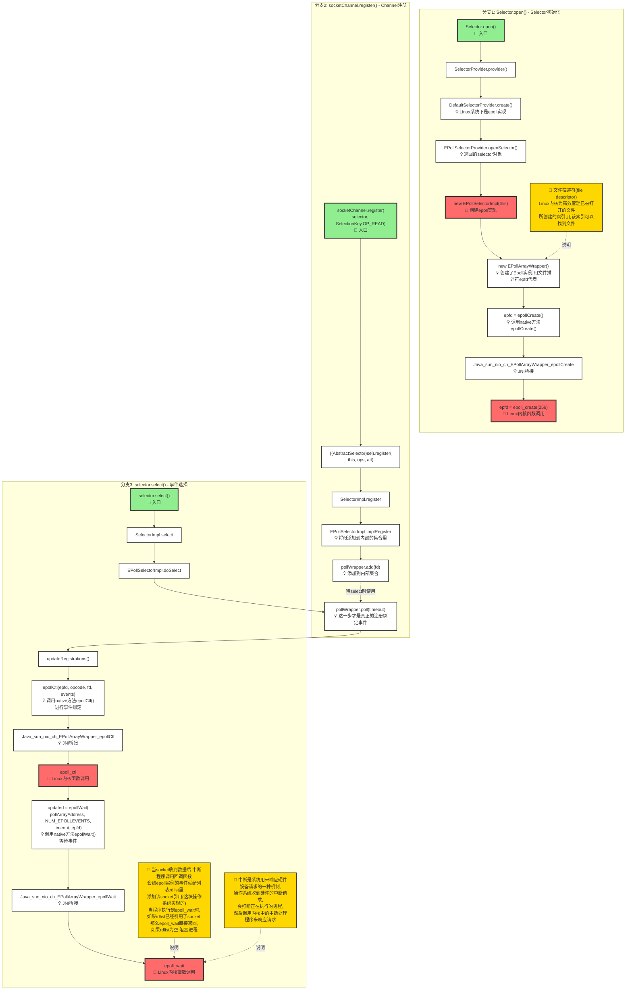

# Java NIO Selector epoll 流程图

## 流程说明

### 1. Selector.open() 分支（Selector 初始化）
- 从 `Selector.open()` 开始，通过 `SelectorProvider` 获取系统默认的 Selector 提供者
- Linux 系统下使用 epoll 实现，创建 `EPollSelectorImpl` 和 `EPollArrayWrapper`
- 最终调用 Linux 内核函数 `epoll_create` 创建 epoll 实例，返回文件描述符 `epfd`

### 2. socketChannel.register() 分支（Channel 注册）
- 注册 SocketChannel 到 Selector，指定关注的操作类型（如 OP_READ）
- 通过 `EPollSelectorImpl.implRegister` 将文件描述符 `fd` 添加到内部集合
- 这一步只是添加到内部集合，真正的 epoll 注册在 select() 时进行

### 3. selector.select() 分支（事件选择）
- 调用 `select()` 方法等待 I/O 事件
- `updateRegistrations()` 调用 `epoll_ctl` 进行真正的注册和事件绑定
- `epoll_wait` 等待事件就绪，如果就绪列表为空则阻塞进程
- 当 socket 收到数据时，操作系统通过中断机制将 socket 添加到 epoll 的就绪列表

### 关键概念
- **文件描述符 (fd/epfd)**: Linux 内核为管理已打开文件创建的索引
- **中断机制**: 系统响应硬件设备请求的机制
- **epoll_wait**: 如果就绪列表不为空立即返回，为空则阻塞等待

