# 故障转移处理逻辑详细分析

## 1. 时序图 - Master故障转移完整流程

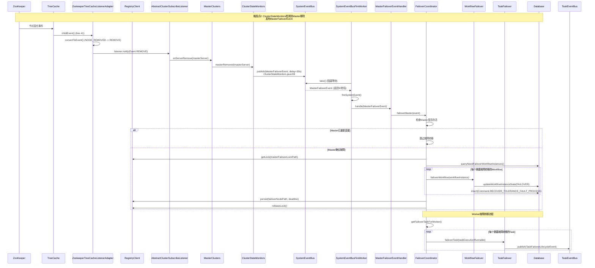
```mermaid
sequenceDiagram
    participant ZK as ZooKeeper
    participant TC as TreeCache
    participant ZTLA as ZookeeperTreeCacheListenerAdapter
    participant RC as RegistryClient
    participant ACSL as AbstractClusterSubscribeListener
    participant MC as MasterClusters
    participant CSM as ClusterStateMonitors
    participant SEB as SystemEventBus
    participant SEFW as SystemEventBusFireWorker
    participant MFH as MasterFailoverEventHandler
    participant FC as FailoverCoordinator
    participant WF as WorkflowFailover
    participant TF as TaskFailover
    participant DB as Database

    Note over ZK,DB: 触发点2: ClusterStateMonitors检测到Master移除<br/>发布MasterFailoverEvent
    ZK->>TC: 节点变化事件
    TC->>ZTLA: childEvent() (line 41)
    ZTLA->>ZTLA: convertToEvent() (NODE_REMOVED -> REMOVE)
    ZTLA->>ACSL: listener.notify(Event.REMOVE)
    ACSL->>MC: onServerRemove(masterServer)
    MC->>CSM: masterRemoved(masterServer)
    CSM->>SEB: publish(MasterFailoverEvent, delay=30s)<br/>ClusterStateMonitors.java:99
    SEFW->>SEB: take() (阻塞等待)
    SEB-->>SEFW: MasterFailoverEvent (延迟30秒后)
    SEFW->>SEFW: fireSystemEvent()
    SEFW->>MFH: handle(MasterFailoverEvent)
    MFH->>FC: failoverMaster(event)
    
    FC->>FC: 检查Master是否存活
    alt Master已重新连接
        FC->>FC: 跳过故障转移
    else Master确实故障
        FC->>RC: getLock(masterFailoverLockPath)
        FC->>DB: queryNeedFailoverWorkflowInstances()
        loop 每个需要故障转移的Workflow
            FC->>WF: failoverWorkflow(workflowInstance)
            WF->>DB: updateWorkflowInstanceState(FAILOVER)
            WF->>DB: insert(Command.RECOVER_TOLERANCE_FAULT_PROCESS)
        end
        FC->>RC: persist(failoverNodePath, deadline)
        FC->>RC: releaseLock()
    end
    
    Note over FC,DB: Worker故障转移流程
    FC->>FC: getFailoverTaskForWorker()
    loop 每个需要故障转移的Task
        FC->>TF: failoverTask(taskExecutionRunnable)
        TF->>TaskEventBus: publish(TaskFailoverLifecycleEvent)
    end
```

## 2. 时序图 - 全局Master故障转移流程

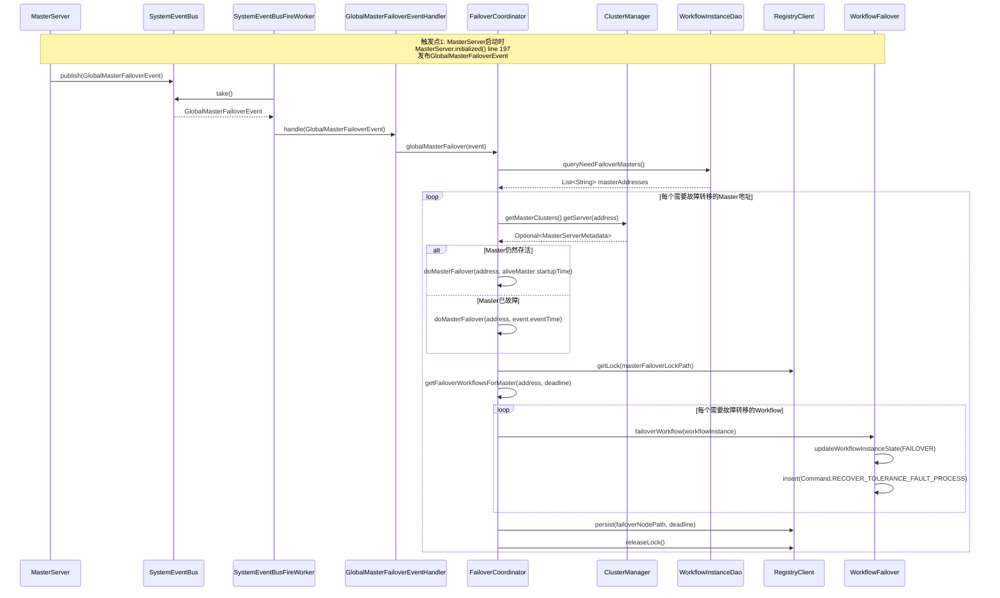
```mermaid
sequenceDiagram
    participant MS as MasterServer
    participant SEB as SystemEventBus
    participant SEFW as SystemEventBusFireWorker
    participant GMFH as GlobalMasterFailoverEventHandler
    participant FC as FailoverCoordinator
    participant CM as ClusterManager
    participant WID as WorkflowInstanceDao
    participant RC as RegistryClient
    participant WF as WorkflowFailover

    Note over MS,WF: 触发点1: MasterServer启动时<br/>MasterServer.initialized() line 197<br/>发布GlobalMasterFailoverEvent
    MS->>SEB: publish(GlobalMasterFailoverEvent)
    SEFW->>SEB: take()
    SEB-->>SEFW: GlobalMasterFailoverEvent
    SEFW->>GMFH: handle(GlobalMasterFailoverEvent)
    GMFH->>FC: globalMasterFailover(event)
    
    FC->>WID: queryNeedFailoverMasters()
    WID-->>FC: List<String> masterAddresses
    
    loop 每个需要故障转移的Master地址
        FC->>CM: getMasterClusters().getServer(address)
        CM-->>FC: Optional<MasterServerMetadata>
        
        alt Master仍然存活
            FC->>FC: doMasterFailover(address, aliveMaster.startupTime)
        else Master已故障
            FC->>FC: doMasterFailover(address, event.eventTime)
        end
        
        FC->>RC: getLock(masterFailoverLockPath)
        FC->>FC: getFailoverWorkflowsForMaster(address, deadline)
        loop 每个需要故障转移的Workflow
            FC->>WF: failoverWorkflow(workflowInstance)
            WF->>WF: updateWorkflowInstanceState(FAILOVER)
            WF->>WF: insert(Command.RECOVER_TOLERANCE_FAULT_PROCESS)
        end
        FC->>RC: persist(failoverNodePath, deadline)
        FC->>RC: releaseLock()
    end
```

### 2.1 两种故障转移事件的区别

| 特性 | GlobalMasterFailoverEvent | MasterFailoverEvent |
|------|---------------------------|---------------------|
| **触发时机** | MasterServer启动时 (MasterServer.java:197) | 检测到Master节点移除时 (ClusterStateMonitors.java:99) |
| **触发方式** | 主动扫描 | 被动监听 |
| **处理范围** | 扫描数据库中所有需要故障转移的Master | 针对特定移除的Master |
| **Handler** | GlobalMasterFailoverEventHandler | MasterFailoverEventHandler |
| **延迟时间** | 无延迟 | 30秒延迟（避免误触发） |
| **使用场景** | 系统启动时恢复历史故障 | 实时检测到故障时立即处理 |

**关键区别**：
- `GlobalMasterFailoverEvent`: 由`GlobalMasterFailoverEventHandler`处理，调用`FailoverCoordinator.globalMasterFailover()`
- `MasterFailoverEvent`: 由`MasterFailoverEventHandler`处理，调用`FailoverCoordinator.failoverMaster()`

### 2.2 GlobalMasterFailoverEvent处理正在重连Master的风险分析

**问题场景**：
当`GlobalMasterFailoverEvent`处理时，如果Master正在重连恢复，可能会存在以下情况：

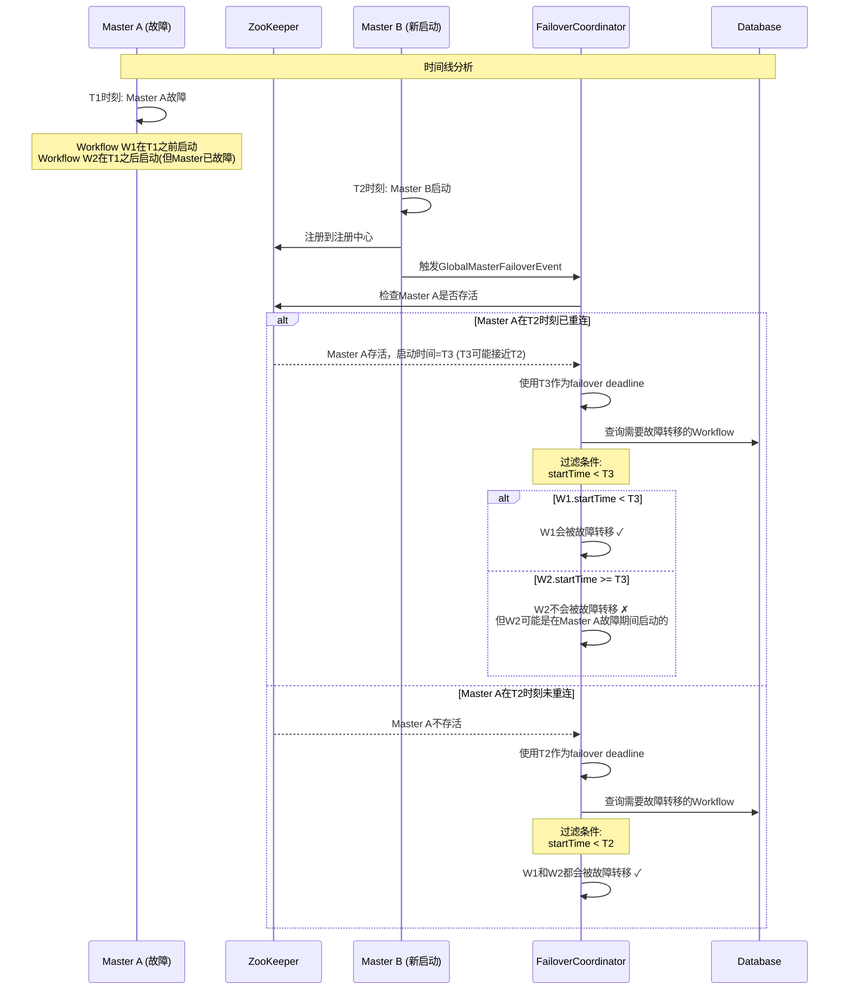
```mermaid
sequenceDiagram
    participant MA as Master A (故障)
    participant ZK as ZooKeeper
    participant MB as Master B (新启动)
    participant FC as FailoverCoordinator
    participant DB as Database
    
    Note over MA,DB: 时间线分析
    MA->>MA: T1时刻: Master A故障
    Note over MA: Workflow W1在T1之前启动<br/>Workflow W2在T1之后启动(但Master已故障)
    
    MB->>MB: T2时刻: Master B启动
    MB->>ZK: 注册到注册中心
    MB->>FC: 触发GlobalMasterFailoverEvent
    
    FC->>ZK: 检查Master A是否存活
    alt Master A在T2时刻已重连
        ZK-->>FC: Master A存活，启动时间=T3 (T3可能接近T2)
        FC->>FC: 使用T3作为failover deadline
        FC->>DB: 查询需要故障转移的Workflow
        Note over FC: 过滤条件:<br/>startTime < T3
        alt W1.startTime < T3
            FC->>FC: W1会被故障转移 ✓
        else W2.startTime >= T3
            FC->>FC: W2不会被故障转移 ✗<br/>但W2可能是在Master A故障期间启动的
        end
    else Master A在T2时刻未重连
        ZK-->>FC: Master A不存活
        FC->>FC: 使用T2作为failover deadline
        FC->>DB: 查询需要故障转移的Workflow
        Note over FC: 过滤条件:<br/>startTime < T2
        FC->>FC: W1和W2都会被故障转移 ✓
    end
```

**潜在问题**：
1. **时间窗口问题**：如果Master A在GlobalMasterFailoverEvent处理时刚刚重连，使用新启动时间作为deadline，可能导致：
   - 在Master A故障期间启动的Workflow（但startTime晚于新启动时间）不会被故障转移
   - 这些Workflow可能已经处于异常状态，但不会被恢复

2. **与MasterFailoverEvent的差异**：
   - `MasterFailoverEvent`有30秒延迟，如果Master在30秒内重连，会检查启动时间是否相同，相同则跳过故障转移
   - `GlobalMasterFailoverEvent`无延迟，无法利用延迟机制避免误处理

**保护机制**：
1. **检查Workflow是否在内存中**：`getFailoverWorkflowsForMaster()`会过滤掉`workflowRepository.contains(workflowInstance.getId())`的Workflow，如果Master已重连且Workflow正在运行，不会被故障转移
2. **幂等性检查**：通过检查故障转移节点是否存在且deadline相同，避免重复处理
3. **分布式锁**：确保同一Master的故障转移不会并发执行

**建议**：
- 如果Master在GlobalMasterFailoverEvent处理时已重连，且启动时间很新（接近当前时间），应该考虑：
  - 检查Workflow的实际状态，而不是仅依赖时间判断
  - 或者等待一段时间后再处理，类似MasterFailoverEvent的延迟机制

### 2.3 Workflow标记为需要故障转移的条件和流程

#### 2.3.1 需要故障转移的Workflow状态

根据`WorkflowExecutionStatus.getNeedFailoverWorkflowInstanceState()`，以下状态的Workflow需要故障转移：

| 状态码 | 状态名称 | 说明 |
|--------|---------|------|
| 1 | RUNNING_EXECUTION | 正在运行中的Workflow |
| 2 | READY_PAUSE | 准备暂停的Workflow |
| 4 | READY_STOP | 准备停止的Workflow |

**判断逻辑**：
- 这些状态都是**非终态**（未完成）状态
- 如果Master故障，这些Workflow无法继续执行，需要被故障转移

#### 2.3.2 Workflow故障转移判断流程

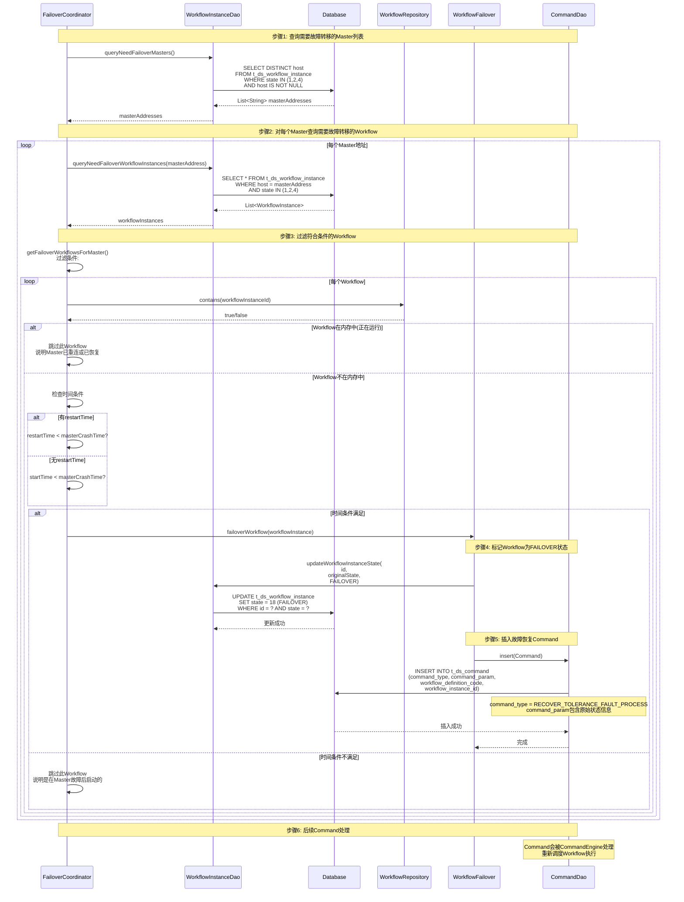
```mermaid
sequenceDiagram
    participant FC as FailoverCoordinator
    participant WID as WorkflowInstanceDao
    participant DB as Database
    participant WR as WorkflowRepository
    participant WF as WorkflowFailover
    participant CD as CommandDao
    
    Note over FC,CD: 步骤1: 查询需要故障转移的Master列表
    FC->>WID: queryNeedFailoverMasters()
    WID->>DB: SELECT DISTINCT host<br/>FROM t_ds_workflow_instance<br/>WHERE state IN (1,2,4)<br/>AND host IS NOT NULL
    DB-->>WID: List<String> masterAddresses
    WID-->>FC: masterAddresses
    
    Note over FC,CD: 步骤2: 对每个Master查询需要故障转移的Workflow
    loop 每个Master地址
        FC->>WID: queryNeedFailoverWorkflowInstances(masterAddress)
        WID->>DB: SELECT * FROM t_ds_workflow_instance<br/>WHERE host = masterAddress<br/>AND state IN (1,2,4)
        DB-->>WID: List<WorkflowInstance>
        WID-->>FC: workflowInstances
        
        Note over FC,CD: 步骤3: 过滤符合条件的Workflow
        FC->>FC: getFailoverWorkflowsForMaster()<br/>过滤条件:
        
        loop 每个Workflow
            FC->>WR: contains(workflowInstanceId)
            WR-->>FC: true/false
            
            alt Workflow在内存中(正在运行)
                FC->>FC: 跳过此Workflow<br/>说明Master已重连或已恢复
            else Workflow不在内存中
                FC->>FC: 检查时间条件
                
                alt 有restartTime
                    FC->>FC: restartTime < masterCrashTime?
                else 无restartTime
                    FC->>FC: startTime < masterCrashTime?
                end
                
                alt 时间条件满足
                    FC->>WF: failoverWorkflow(workflowInstance)
                    
                    Note over WF,CD: 步骤4: 标记Workflow为FAILOVER状态
                    WF->>WID: updateWorkflowInstanceState(<br/>  id,<br/>  originalState,<br/>  FAILOVER)
                    WID->>DB: UPDATE t_ds_workflow_instance<br/>SET state = 18 (FAILOVER)<br/>WHERE id = ? AND state = ?
                    DB-->>WID: 更新成功
                    
                    Note over WF,CD: 步骤5: 插入故障恢复Command
                    WF->>CD: insert(Command)
                    CD->>DB: INSERT INTO t_ds_command<br/>(command_type, command_param,<br/> workflow_definition_code,<br/> workflow_instance_id)
                    Note over CD: command_type = RECOVER_TOLERANCE_FAULT_PROCESS<br/>command_param包含原始状态信息
                    DB-->>CD: 插入成功
                    CD-->>WF: 完成
                else 时间条件不满足
                    FC->>FC: 跳过此Workflow<br/>说明是在Master故障后启动的
                end
            end
        end
    end
    
    Note over FC,CD: 步骤6: 后续Command处理
    Note over CD: Command会被CommandEngine处理<br/>重新调度Workflow执行
```

#### 2.3.3 关键判断条件说明

**1. 状态判断（数据库查询）**
```sql
-- 查询需要故障转移的Master列表
SELECT DISTINCT host 
FROM t_ds_workflow_instance 
WHERE state IN (1, 2, 4)  -- RUNNING_EXECUTION, READY_PAUSE, READY_STOP
  AND host IS NOT NULL;

-- 查询指定Master需要故障转移的Workflow
SELECT * 
FROM t_ds_workflow_instance 
WHERE host = ? 
  AND state IN (1, 2, 4);
```

**2. 内存检查（避免误转移）**
- 如果`workflowRepository.contains(workflowInstanceId)`返回`true`，说明Workflow正在内存中运行
- 可能原因：
  - Master已重连，Workflow已恢复执行
  - 其他Master已接管该Workflow
- **处理**：跳过该Workflow，不进行故障转移

**3. 时间条件判断（确定故障范围）**
- **有restartTime**：`restartTime < masterCrashTime`
- **无restartTime**：`startTime < masterCrashTime`
- **目的**：只故障转移在Master故障时间点**之前**启动的Workflow
- **原因**：在Master故障后启动的Workflow可能状态异常，不应该被故障转移

**4. 状态更新**
- 将Workflow状态更新为`FAILOVER (18)`
- 插入`RECOVER_TOLERANCE_FAULT_PROCESS`类型的Command
- Command参数包含原始状态信息，用于后续恢复

#### 2.3.4 Workflow故障转移的完整生命周期

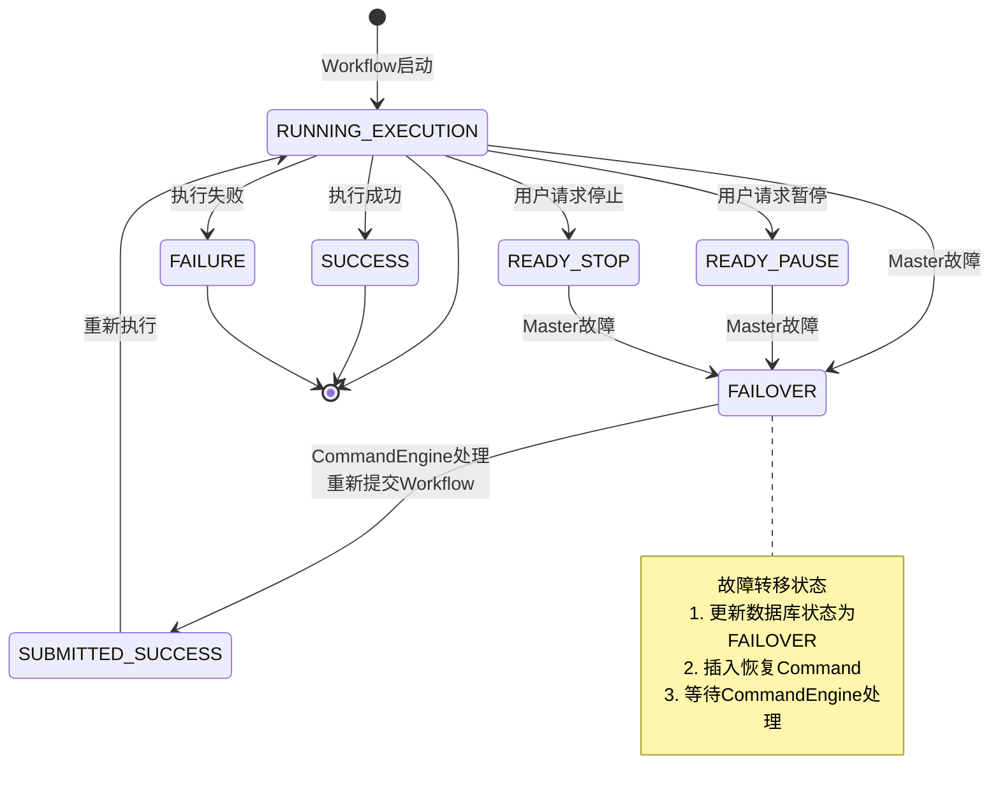
```mermaid
stateDiagram-v2
    [*] --> RUNNING_EXECUTION: Workflow启动
    
    RUNNING_EXECUTION --> READY_PAUSE: 用户请求暂停
    RUNNING_EXECUTION --> READY_STOP: 用户请求停止
    RUNNING_EXECUTION --> FAILOVER: Master故障
    
    READY_PAUSE --> FAILOVER: Master故障
    READY_STOP --> FAILOVER: Master故障
    
    FAILOVER --> SUBMITTED_SUCCESS: CommandEngine处理<br/>重新提交Workflow
    
    SUBMITTED_SUCCESS --> RUNNING_EXECUTION: 重新执行
    RUNNING_EXECUTION --> SUCCESS: 执行成功
    RUNNING_EXECUTION --> FAILURE: 执行失败
    RUNNING_EXECUTION --> [*]
    
    SUCCESS --> [*]
    FAILURE --> [*]
    
    note right of FAILOVER
        故障转移状态
        1. 更新数据库状态为FAILOVER
        2. 插入恢复Command
        3. 等待CommandEngine处理
    end note
```

#### 2.3.5 故障转移触发场景总结

| 场景 | 触发方式 | 判断条件 | 处理方式 |
|------|---------|---------|---------|
| **Master故障** | MasterFailoverEvent | 1. state IN (1,2,4)<br/>2. host = 故障Master<br/>3. 不在内存中<br/>4. startTime < deadline | 标记为FAILOVER，插入恢复Command |
| **系统启动恢复** | GlobalMasterFailoverEvent | 同上 | 同上 |
| **Master重连** | MasterFailoverEvent延迟检查 | 启动时间相同 | 跳过故障转移 |
| **Workflow已恢复** | 内存检查 | workflowRepository.contains() | 跳过故障转移 |

### 2.3.6 Master 与 Worker 故障转移处理对象的区别

#### 2.3.6.1 处理对象对比

| 故障类型 | 处理对象 | 数据来源 | 处理方式 | 说明 |
|---------|---------|---------|---------|------|
| **Master 故障转移** | **工作流实例（WorkflowInstance）** | 数据库查询 | 标记为 FAILOVER，插入恢复 Command | Master 负责工作流的调度和管理 |
| **Worker 故障转移** | **任务实例（TaskInstance）** | 内存中运行的任务 | 发布 TaskFailoverLifecycleEvent | Worker 只负责执行任务 |

#### 2.3.6.2 Master 故障转移处理工作流的原因

**Master 的职责**：
- Master 负责工作流的**调度、管理和监控**
- 工作流实例存储在数据库中，由 Master 负责维护其生命周期
- 当 Master 故障时，其负责的所有工作流都需要被其他 Master 接管

**处理流程**：
1. **查询工作流**：从数据库查询该 Master 负责的所有未完成的工作流
   ```java
   // FailoverCoordinator.getFailoverWorkflowsForMaster()
   workflowInstanceDao.queryNeedFailoverWorkflowInstances(masterAddress)
   ```

2. **标记工作流**：将工作流状态更新为 `FAILOVER`
   ```java
   // WorkflowFailover.failoverWorkflow()
   workflowInstanceDao.updateWorkflowInstanceState(id, originalState, FAILOVER)
   ```

3. **插入恢复命令**：插入 `RECOVER_TOLERANCE_FAULT_PROCESS` 类型的 Command
   ```java
   // WorkflowFailover.failoverWorkflow()
   commandDao.insert(Command.builder()
       .commandType(RECOVER_TOLERANCE_FAULT_PROCESS)
       .workflowInstanceId(workflowInstance.getId())
       .build())
   ```

4. **后续处理**：CommandEngine 会处理恢复命令，重新调度工作流执行
   - 工作流恢复后，其中的任务会重新被调度到可用的 Worker 执行
   - **任务实例的故障转移在工作流恢复时自动处理**

#### 2.3.6.3 Worker 故障转移只处理任务的原因

**Worker 的职责**：
- Worker 只负责**执行任务**，不管理工作流
- 任务实例在内存中运行，由 Master 监控和管理
- 当 Worker 故障时，只需要将该 Worker 正在执行的任务转移到其他 Worker

**处理流程**：
1. **查询任务**：从内存中查询该 Worker 正在执行的所有任务
   ```java
   // FailoverCoordinator.getFailoverTaskForWorker()
   workflowRepository.getAll()
       .stream()
       .flatMap(graph -> graph.getActiveTaskExecutionRunnable().stream())
       .filter(task -> workerAddress.equals(task.getTaskInstance().getHost()))
       .filter(task -> task.getState() == DISPATCH || task.getState() == RUNNING_EXECUTION)
   ```

2. **发布任务故障转移事件**：为每个任务发布 `TaskFailoverLifecycleEvent`
   ```java
   // TaskFailover.failoverTask()
   taskEventBus.publish(TaskFailoverLifecycleEvent)
   ```

3. **任务重新调度**：任务状态机处理故障转移事件，将任务重新调度到其他 Worker
   - 任务会重新进入调度队列，等待分配到可用的 Worker
   - **工作流不受影响，继续运行**

#### 2.3.6.4 为什么 Master 故障转移不直接处理任务？

**原因分析**：

1. **工作流是管理单元**：
   - 工作流是任务的组织单元，Master 管理的是工作流级别
   - 工作流故障转移后，其中的任务会在工作流恢复时自动重新调度

2. **数据一致性**：
   - 工作流状态存储在数据库中，需要统一管理
   - 如果直接处理任务，可能导致工作流状态不一致

3. **恢复粒度**：
   - 工作流级别的恢复可以保证整个工作流的完整性
   - 任务级别的恢复可能无法保证工作流的状态一致性

4. **简化设计**：
   - 工作流恢复时，CommandEngine 会重新解析 DAG 并调度任务
   - 这样可以确保任务调度的正确性和一致性

#### 2.3.6.5 总结


```mermaid
graph TB
    subgraph "Master故障转移"
        A[Master故障] --> B[查询工作流实例]
        B --> C[标记工作流为FAILOVER]
        C --> D[插入恢复Command]
        D --> E[CommandEngine处理]
        E --> F[重新调度工作流]
        F --> G[工作流中的任务自动重新调度]
    end
    
    subgraph "Worker故障转移"
        H[Worker故障] --> I[查询任务实例]
        I --> J[发布TaskFailoverLifecycleEvent]
        J --> K[任务状态机处理]
        K --> L[任务重新调度到其他Worker]
        L --> M[工作流继续运行]
    end
    
    style A fill:#ffcccc
    style H fill:#ccffcc
    style C fill:#ffffcc
    style J fill:#ffffcc
```

**关键区别**：
- **Master 故障转移**：工作流级别 → 数据库持久化 → 通过 Command 恢复 → 任务自动重新调度
- **Worker 故障转移**：任务级别 → 内存中处理 → 直接重新调度 → 工作流不受影响

### 2.4 延迟30秒的实现机制

#### 2.4.1 DelayQueue的用法和设计思想

##### 2.4.1.1 DelayQueue简介

`DelayQueue`是Java并发包`java.util.concurrent`中的一个无界阻塞队列，专门用于存储实现了`Delayed`接口的元素。只有当元素的延迟时间到期后，才能从队列中取出。

**核心特性**：
- **无界队列**：理论上可以存储无限多个元素
- **阻塞队列**：`take()`方法会阻塞直到有元素到期
- **优先级队列**：内部使用`PriorityQueue`，按过期时间排序
- **线程安全**：所有操作都是线程安全的

##### 2.4.1.2 DelayQueue的工作原理

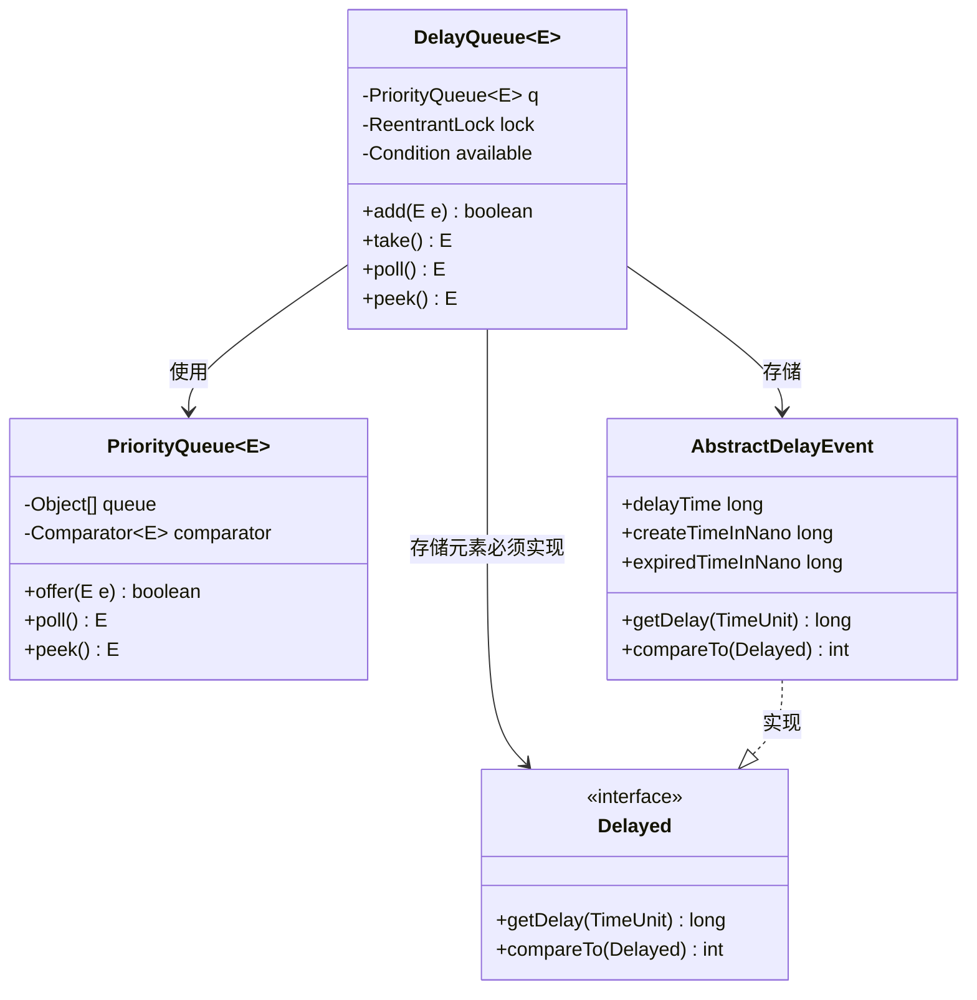
```mermaid
classDiagram
    class DelayQueue~E~ {
        -PriorityQueue~E~ q
        -ReentrantLock lock
        -Condition available
        +add(E e) boolean
        +take() E
        +poll() E
        +peek() E
    }
    
    class Delayed {
        <<interface>>
        +getDelay(TimeUnit) long
        +compareTo(Delayed) int
    }
    
    class PriorityQueue~E~ {
        -Object[] queue
        -Comparator~E~ comparator
        +offer(E e) boolean
        +poll() E
        +peek() E
    }
    
    class AbstractDelayEvent {
        +delayTime long
        +createTimeInNano long
        +expiredTimeInNano long
        +getDelay(TimeUnit) long
        +compareTo(Delayed) int
    }
    
    DelayQueue --> PriorityQueue : 使用
    DelayQueue --> Delayed : 存储元素必须实现
    AbstractDelayEvent ..|> Delayed : 实现
    DelayQueue --> AbstractDelayEvent : 存储
```

**DelayQueue内部实现机制**：

1. **数据结构**：内部使用`PriorityQueue`（优先级堆）存储元素
2. **排序规则**：根据`Delayed.compareTo()`方法排序，过期时间早的元素排在前面
3. **阻塞机制**：使用`ReentrantLock`和`Condition`实现线程安全的阻塞等待
4. **延迟检查**：每次`take()`或`poll()`时，调用元素的`getDelay()`方法检查是否到期

##### 2.4.1.3 项目中的DelayQueue设计思想

DolphinScheduler使用DelayQueue实现了一个**延迟事件总线**的设计模式，具有以下设计思想：

**核心约束：事件必须实现Delayed接口**

DelayQueue要求存储的元素必须实现`Delayed`接口，这是使用DelayQueue的前提条件：

1. **继承关系**：`T extends AbstractDelayEvent`，而`AbstractDelayEvent implements Delayed`
   - 所有事件类必须继承`AbstractDelayEvent`
   - `AbstractDelayEvent`实现了`Delayed`接口

2. **必须重写的方法**：
   - **`getDelay(TimeUnit unit)`**：计算剩余延迟时间
     ```java
     // 返回剩余延迟时间 = 过期时间 - 当前时间
     long delay = expiredTimeInNano - System.nanoTime();
     return unit.convert(delay, TimeUnit.NANOSECONDS);
     ```
   
   - **`compareTo(Delayed other)`**：用于排序，按过期时间排序
     ```java
     // 按过期时间升序排序，过期时间早的排在前面
     return Long.compare(this.expiredTimeInNano, ((AbstractDelayEvent) other).expiredTimeInNano);
     ```

3. **排序机制**：
   - DelayQueue内部使用`PriorityQueue`（优先级堆）
   - 根据`compareTo()`方法排序，过期时间早的事件排在堆顶
   - 每次`take()`时，总是取出最早到期的事件

**1. 分层抽象设计**

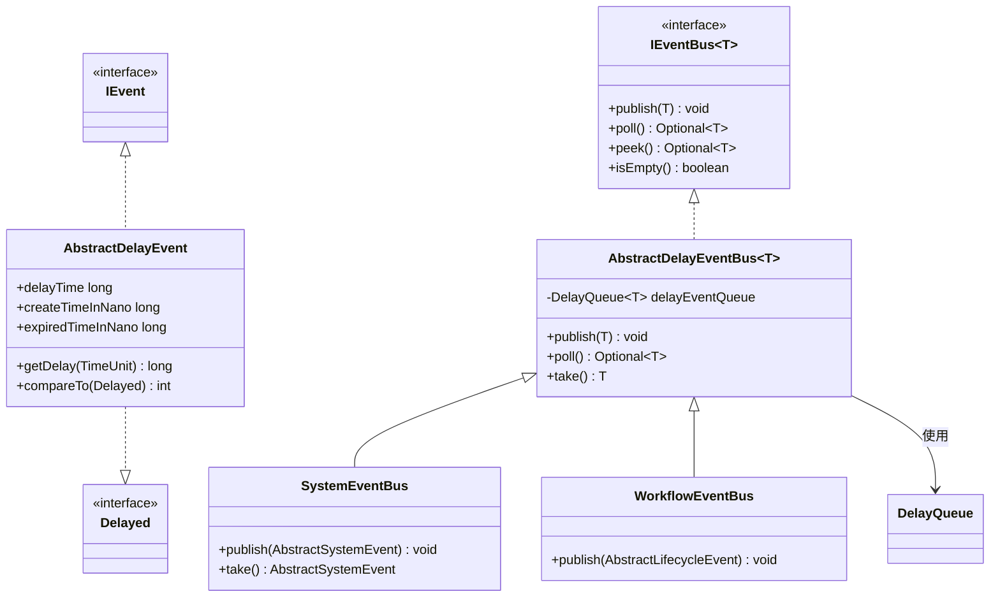
```mermaid
classDiagram
    class IEvent {
        <<interface>>
    }
    
    class IEventBus~T~ {
        <<interface>>
        +publish(T) void
        +poll() Optional~T~
        +peek() Optional~T~
        +isEmpty() boolean
    }
    
    class AbstractDelayEvent {
        +delayTime long
        +createTimeInNano long
        +expiredTimeInNano long
        +getDelay(TimeUnit) long
        +compareTo(Delayed) int
    }
    
    class AbstractDelayEventBus~T~ {
        -DelayQueue~T~ delayEventQueue
        +publish(T) void
        +poll() Optional~T~
        +take() T
    }
    
    class SystemEventBus {
        +publish(AbstractSystemEvent) void
        +take() AbstractSystemEvent
    }
    
    class WorkflowEventBus {
        +publish(AbstractLifecycleEvent) void
    }
    
    class Delayed {
        <<interface>>
    }
    
    IEvent <|.. AbstractDelayEvent
    AbstractDelayEvent ..|> Delayed
    IEventBus <|.. AbstractDelayEventBus
    AbstractDelayEventBus <|-- SystemEventBus
    AbstractDelayEventBus <|-- WorkflowEventBus
    AbstractDelayEventBus --> DelayQueue : 使用
```

**设计优势**：
- **接口隔离**：`IEventBus`定义通用接口，`AbstractDelayEventBus`提供延迟实现
- **类型安全**：使用泛型确保类型安全
- **可扩展性**：可以轻松扩展不同类型的EventBus（SystemEventBus、WorkflowEventBus等）

**2. 延迟事件的设计模式**

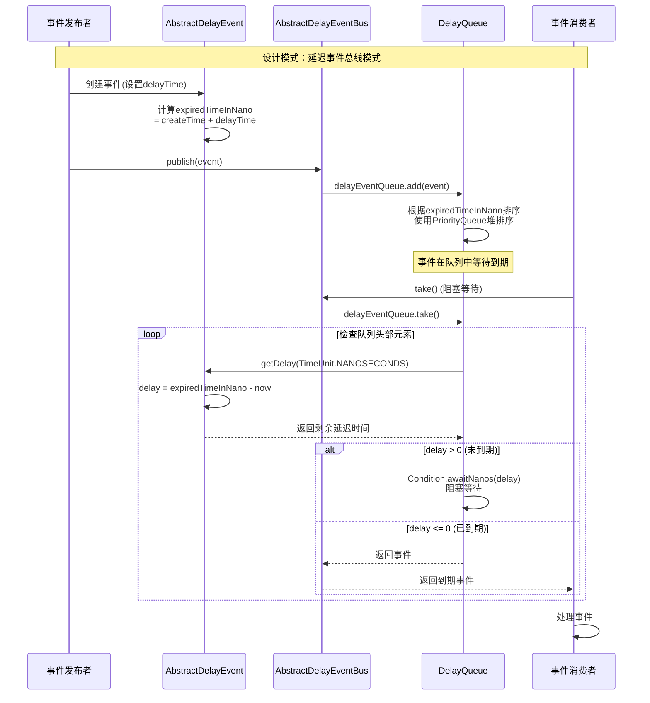
```mermaid
sequenceDiagram
    participant Publisher as 事件发布者
    participant Event as AbstractDelayEvent
    participant EventBus as AbstractDelayEventBus
    participant DQ as DelayQueue
    participant Consumer as 事件消费者
    
    Note over Publisher,Consumer: 设计模式：延迟事件总线模式
    
    Publisher->>Event: 创建事件(设置delayTime)
    Event->>Event: 计算expiredTimeInNano<br/>= createTime + delayTime
    
    Publisher->>EventBus: publish(event)
    EventBus->>DQ: delayEventQueue.add(event)
    DQ->>DQ: 根据expiredTimeInNano排序<br/>使用PriorityQueue堆排序
    
    Note over DQ: 事件在队列中等待到期
    
    Consumer->>EventBus: take() (阻塞等待)
    EventBus->>DQ: delayEventQueue.take()
    
    loop 检查队列头部元素
        DQ->>Event: getDelay(TimeUnit.NANOSECONDS)
        Event->>Event: delay = expiredTimeInNano - now
        Event-->>DQ: 返回剩余延迟时间
        
        alt delay > 0 (未到期)
            DQ->>DQ: Condition.awaitNanos(delay)<br/>阻塞等待
        else delay <= 0 (已到期)
            DQ-->>EventBus: 返回事件
            EventBus-->>Consumer: 返回到期事件
        end
    end
    
    Consumer->>Consumer: 处理事件
```

**设计思想**：
- **延迟执行**：事件不是立即处理，而是延迟到指定时间后处理
- **自动排序**：DelayQueue自动按过期时间排序，最早到期的事件优先处理
- **阻塞等待**：消费者线程自动阻塞，无需轮询，节省CPU资源
- **解耦设计**：发布者和消费者完全解耦，通过事件总线通信

**3. 项目中的使用场景**

| 使用场景 | EventBus类型 | 延迟时间 | 目的 |
|---------|------------|---------|------|
| **系统故障转移** | SystemEventBus | 0或30秒 | 避免误触发，给服务重连时间 |
| **Workflow生命周期** | WorkflowEventBus | 0或自定义 | 支持延迟任务调度 |
| **Task调度** | PriorityDelayQueue | 0或自定义 | 支持延迟任务分发 |

##### 2.4.1.4 DelayQueue在项目中的完整使用流程

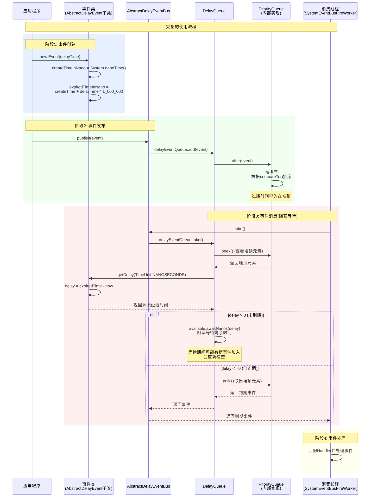
```mermaid
sequenceDiagram
    participant App as 应用程序
    participant Event as 事件类<br/>(AbstractDelayEvent子类)
    participant EventBus as AbstractDelayEventBus
    participant DQ as DelayQueue
    participant PQ as PriorityQueue<br/>(内部实现)
    participant Worker as 消费线程<br/>(SystemEventBusFireWorker)
    
    Note over App,Worker: 完整的使用流程
    
    rect rgb(230, 240, 255)
        Note over App,Event: 阶段1: 事件创建
        App->>Event: new Event(delayTime)
        Event->>Event: createTimeInNano = System.nanoTime()
        Event->>Event: expiredTimeInNano = <br/>createTime + delayTime * 1_000_000
    end
    
    rect rgb(240, 255, 240)
        Note over App,EventBus: 阶段2: 事件发布
        App->>EventBus: publish(event)
        EventBus->>DQ: delayEventQueue.add(event)
        DQ->>PQ: offer(event)
        PQ->>PQ: 堆排序<br/>根据compareTo()排序
        Note over PQ: 过期时间早的在堆顶
    end
    
    rect rgb(255, 240, 240)
        Note over Worker,DQ: 阶段3: 事件消费(阻塞等待)
        Worker->>EventBus: take()
        EventBus->>DQ: delayEventQueue.take()
        DQ->>PQ: peek() (查看堆顶元素)
        PQ-->>DQ: 返回堆顶元素
        DQ->>Event: getDelay(TimeUnit.NANOSECONDS)
        Event->>Event: delay = expiredTime - now
        Event-->>DQ: 返回剩余延迟时间
        
        alt delay > 0 (未到期)
            DQ->>DQ: available.awaitNanos(delay)<br/>阻塞等待剩余时间
            Note over DQ: 等待期间可能有新事件加入<br/>会重新检查
        else delay <= 0 (已到期)
            DQ->>PQ: poll() (取出堆顶元素)
            PQ-->>DQ: 返回到期事件
            DQ-->>EventBus: 返回事件
            EventBus-->>Worker: 返回到期事件
        end
    end
    
    rect rgb(255, 255, 240)
        Note over Worker: 阶段4: 事件处理
        Worker->>Worker: 匹配Handler并处理事件
    end
```

##### 2.4.1.5 DelayQueue的关键方法说明

**1. add(E e) / offer(E e)**
```java
// 将元素添加到队列
delayEventQueue.add(event);
// 内部调用PriorityQueue.offer()，根据compareTo()排序
```

**2. take()**
```java
// 阻塞等待，直到有元素到期
AbstractSystemEvent event = delayEventQueue.take();
// 工作原理：
// 1. 获取堆顶元素
// 2. 调用getDelay()检查是否到期
// 3. 如果未到期，使用Condition.awaitNanos()阻塞
// 4. 如果到期，返回该元素
```

**3. poll()**
```java
// 非阻塞，立即返回（可能为null）
Optional<AbstractSystemEvent> event = delayEventQueue.poll();
// 如果队列为空或没有到期元素，返回null
```

**4. peek()**
```java
// 查看堆顶元素，不移除
Optional<AbstractSystemEvent> event = delayEventQueue.peek();
// 不阻塞，不修改队列
```

##### 2.4.1.6 设计优势总结

| 设计优势 | 说明 |
|---------|------|
| **解耦** | 发布者和消费者完全解耦，通过事件总线通信 |
| **延迟执行** | 支持延迟事件，避免误触发（如30秒延迟） |
| **自动排序** | DelayQueue自动按过期时间排序，无需手动管理 |
| **线程安全** | 所有操作都是线程安全的，支持并发发布和消费 |
| **阻塞等待** | take()方法自动阻塞，无需轮询，节省CPU |
| **无界队列** | 理论上可以存储无限多个事件 |
| **精确延迟** | 使用纳秒级时间计算，延迟精度高 |
| **可扩展性** | 通过继承AbstractDelayEventBus可以轻松扩展新的EventBus |

##### 2.4.1.7 与其他队列的对比

| 特性 | DelayQueue | BlockingQueue | PriorityQueue | ArrayBlockingQueue |
|------|-----------|--------------|--------------|-------------------|
| **延迟支持** | ✅ | ❌ | ❌ | ❌ |
| **阻塞等待** | ✅ | ✅ | ❌ | ✅ |
| **优先级排序** | ✅ | ❌ | ✅ | ❌ |
| **无界队列** | ✅ | 部分 | ✅ | ❌ |
| **线程安全** | ✅ | ✅ | ❌ | ✅ |
| **使用场景** | 延迟事件 | 生产者-消费者 | 优先级任务 | 固定容量队列 |

#### 2.4.2 延迟机制概述

`MasterFailoverEvent`和`WorkerFailoverEvent`都设置了30秒延迟，用于避免网络抖动或短暂连接中断导致的误触发。延迟机制基于Java的`DelayQueue`实现。

#### 2.4.3 延迟实现的核心组件

**1. AbstractDelayEvent (延迟事件基类)**
- 实现`Delayed`接口，这是`DelayQueue`的要求
- 记录延迟时间、创建时间和过期时间
- 提供`getDelay()`方法计算剩余延迟时间

**2. AbstractDelayEventBus (延迟事件总线)**
- 使用`DelayQueue<AbstractDelayEvent>`存储事件
- `publish()`方法将事件添加到队列
- `take()`方法阻塞等待直到有事件到期

**3. SystemEventBus (系统事件总线)**
- 继承`AbstractDelayEventBus`
- 专门处理`AbstractSystemEvent`类型的事件

**4. SystemEventBusFireWorker (事件消费线程)**
- 守护线程，持续调用`take()`方法
- 阻塞等待事件到期后处理

#### 2.4.4 延迟30秒的实现流程

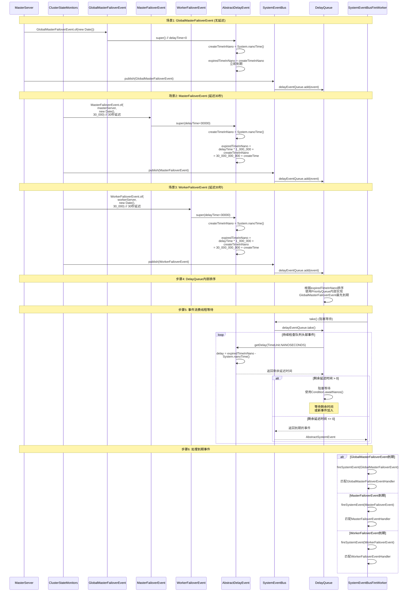
```mermaid
sequenceDiagram
    participant MS as MasterServer
    participant CSM as ClusterStateMonitors
    participant GMFE as GlobalMasterFailoverEvent
    participant MFE as MasterFailoverEvent
    participant WFE as WorkerFailoverEvent
    participant ADE as AbstractDelayEvent
    participant SEB as SystemEventBus
    participant DQ as DelayQueue
    participant SEFW as SystemEventBusFireWorker
    
    Note over MS,SEFW: 场景1: GlobalMasterFailoverEvent (无延迟)
    MS->>GMFE: GlobalMasterFailoverEvent.of(new Date())
    GMFE->>ADE: super() // delayTime=0
    ADE->>ADE: createTimeInNano = System.nanoTime()
    ADE->>ADE: expiredTimeInNano = createTimeInNano<br/>立即到期
    MS->>SEB: publish(GlobalMasterFailoverEvent)
    SEB->>DQ: delayEventQueue.add(event)
    
    Note over MS,SEFW: 场景2: MasterFailoverEvent (延迟30秒)
    CSM->>MFE: MasterFailoverEvent.of(<br/>  masterServer,<br/>  new Date(),<br/>  30_000) // 30秒延迟
    MFE->>ADE: super(delayTime=30000)
    ADE->>ADE: createTimeInNano = System.nanoTime()
    ADE->>ADE: expiredTimeInNano = <br/>  delayTime * 1_000_000 + <br/>  createTimeInNano<br/>  = 30_000_000_000 + createTime
    CSM->>SEB: publish(MasterFailoverEvent)
    SEB->>DQ: delayEventQueue.add(event)
    
    Note over MS,SEFW: 场景3: WorkerFailoverEvent (延迟30秒)
    CSM->>WFE: WorkerFailoverEvent.of(<br/>  workerServer,<br/>  new Date(),<br/>  30_000) // 30秒延迟
    WFE->>ADE: super(delayTime=30000)
    ADE->>ADE: createTimeInNano = System.nanoTime()
    ADE->>ADE: expiredTimeInNano = <br/>  delayTime * 1_000_000 + <br/>  createTimeInNano<br/>  = 30_000_000_000 + createTime
    CSM->>SEB: publish(WorkerFailoverEvent)
    SEB->>DQ: delayEventQueue.add(event)
    
    Note over MS,SEFW: 步骤4: DelayQueue内部排序
    DQ->>DQ: 根据expiredTimeInNano排序<br/>使用PriorityQueue内部实现<br/>GlobalMasterFailoverEvent最先到期
    
    Note over MS,SEFW: 步骤5: 事件消费线程等待
    SEFW->>SEB: take() (阻塞等待)
    SEB->>DQ: delayEventQueue.take()
    
    loop 持续检查队列头部事件
        DQ->>ADE: getDelay(TimeUnit.NANOSECONDS)
        ADE->>ADE: delay = expiredTimeInNano - <br/>  System.nanoTime()
        ADE-->>DQ: 返回剩余延迟时间
        
        alt 剩余延迟时间 > 0
            DQ->>DQ: 阻塞等待<br/>使用Condition.awaitNanos()
            Note over DQ: 等待剩余时间<br/>或新事件加入
        else 剩余延迟时间 <= 0
            DQ-->>SEB: 返回到期的事件
            SEB-->>SEFW: AbstractSystemEvent
        end
    end
    
    Note over MS,SEFW: 步骤6: 处理到期事件
    alt GlobalMasterFailoverEvent到期
        SEFW->>SEFW: fireSystemEvent(GlobalMasterFailoverEvent)
        SEFW->>SEFW: 匹配GlobalMasterFailoverEventHandler
    else MasterFailoverEvent到期
        SEFW->>SEFW: fireSystemEvent(MasterFailoverEvent)
        SEFW->>SEFW: 匹配MasterFailoverEventHandler
    else WorkerFailoverEvent到期
        SEFW->>SEFW: fireSystemEvent(WorkerFailoverEvent)
        SEFW->>SEFW: 匹配WorkerFailoverEventHandler
    end
```

**三种事件的延迟时间对比**：

| 事件类型 | 延迟时间 | 构造函数调用 | 过期时间计算 | 使用场景 |
|---------|---------|------------|------------|---------|
| **GlobalMasterFailoverEvent** | 0毫秒 | `super()` → `super(0)` | `createTimeInNano` | 系统启动时立即扫描 |
| **MasterFailoverEvent** | 30_000毫秒 | `super(30_000)` | `createTimeInNano + 30_000_000_000` | 检测到Master故障时延迟处理 |
| **WorkerFailoverEvent** | 30_000毫秒 | `super(30_000)` | `createTimeInNano + 30_000_000_000` | 检测到Worker故障时延迟处理 |

#### 2.4.5 关键代码实现

**1. AbstractDelayEvent构造函数**
```java
public AbstractDelayEvent(final long delayTime) {
    this.delayTime = delayTime;  // 30_000 毫秒
    this.createTimeInNano = System.nanoTime();  // 创建时间（纳秒）
    // 计算过期时间：延迟时间转换为纳秒 + 创建时间
    this.expiredTimeInNano = this.delayTime * 1_000_000 + this.createTimeInNano;
    // = 30_000 * 1_000_000 + createTimeInNano
    // = 30_000_000_000 纳秒 = 30秒
}
```

**2. getDelay()方法实现**
```java
@Override
public long getDelay(TimeUnit unit) {
    // 计算剩余延迟时间 = 过期时间 - 当前时间
    long delay = createTimeInNano + delayTime * 1_000_000 - System.nanoTime();
    // 转换为请求的时间单位
    return unit.convert(delay, TimeUnit.NANOSECONDS);
}
```

**3. DelayQueue.take()工作原理**
- `DelayQueue`内部使用`PriorityQueue`按过期时间排序
- `take()`方法会：
  1. 获取队列头部元素
  2. 调用`getDelay()`检查是否到期
  3. 如果未到期，使用`Condition.awaitNanos()`阻塞等待
  4. 如果到期，返回该元素

**4. SystemEventBusFireWorker消费循环**
```java
@Override
public void run() {
    while (flag) {
        final AbstractSystemEvent systemEvent;
        try {
            // 阻塞等待，直到有事件到期
            systemEvent = systemEventBus.take();
        } catch (InterruptedException e) {
            break;
        }
        // 处理到期的事件
        fireSystemEvent(systemEvent);
    }
}
```

#### 2.4.6 延迟机制的优势

| 优势 | 说明 |
|------|------|
| **避免误触发** | 30秒延迟给Master足够时间重连，避免网络抖动导致的误故障转移 |
| **自动排序** | DelayQueue自动按过期时间排序，最早到期的事件优先处理 |
| **线程安全** | DelayQueue是线程安全的，支持并发发布和消费 |
| **阻塞等待** | take()方法自动阻塞，无需轮询，节省CPU资源 |
| **精确延迟** | 使用纳秒级时间计算，延迟精度高 |

#### 2.4.7 延迟时间计算示例

假设在`T0`时刻发布事件，延迟30秒：

```
T0 = 1000_000_000_000 纳秒 (创建时间)
延迟时间 = 30_000 毫秒 = 30_000_000_000 纳秒
过期时间 = T0 + 30_000_000_000 = 1030_000_000_000 纳秒

在T1时刻检查 (T1 < 1030_000_000_000):
  getDelay() = 1030_000_000_000 - T1 > 0
  → DelayQueue.take()阻塞等待

在T2时刻检查 (T2 >= 1030_000_000_000):
  getDelay() = 1030_000_000_000 - T2 <= 0
  → DelayQueue.take()返回事件
```

#### 2.4.8 与无延迟事件的对比

| 特性 | GlobalMasterFailoverEvent | MasterFailoverEvent |
|------|---------------------------|---------------------|
| **延迟时间** | 0毫秒 | 30_000毫秒 |
| **构造函数** | `super()` → `super(0)` | `super(30_000)` |
| **过期时间** | `createTimeInNano` | `createTimeInNano + 30_000_000_000` |
| **使用场景** | 系统启动时立即扫描 | 检测到故障时延迟处理 |
| **目的** | 快速恢复历史故障 | 避免误触发 |

## 3. 组件交互图

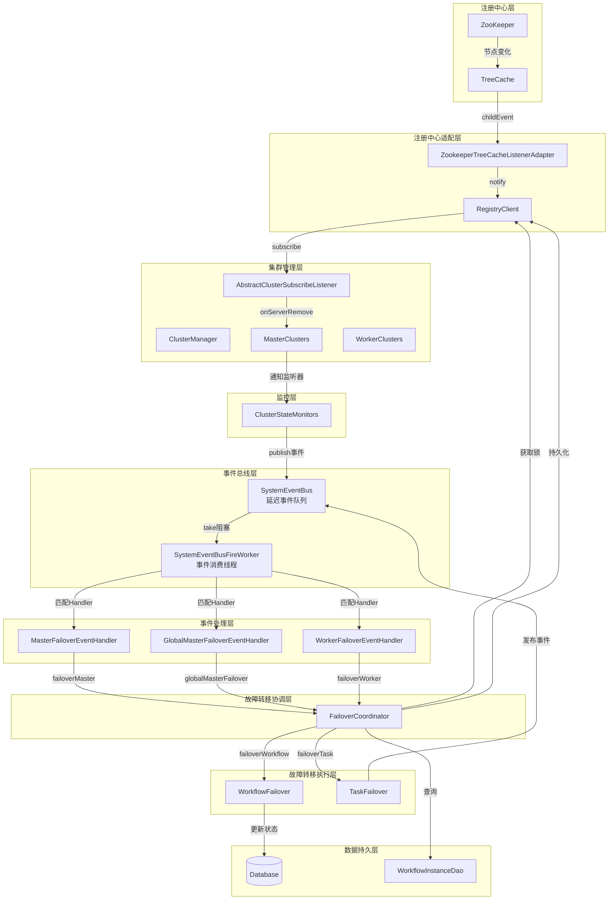
```mermaid
graph TB
    subgraph "注册中心层"
        ZK[ZooKeeper]
        TC[TreeCache]
    end
    
    subgraph "注册中心适配层"
        ZTLA[ZookeeperTreeCacheListenerAdapter]
        RC[RegistryClient]
    end
    
    subgraph "集群管理层"
        CM[ClusterManager]
        MC[MasterClusters]
        WC[WorkerClusters]
        ACSL[AbstractClusterSubscribeListener]
    end
    
    subgraph "监控层"
        CSM[ClusterStateMonitors]
    end
    
    subgraph "事件总线层"
        SEB[SystemEventBus<br/>延迟事件队列]
        SEFW[SystemEventBusFireWorker<br/>事件消费线程]
    end
    
    subgraph "事件处理层"
        MFH[MasterFailoverEventHandler]
        GMFH[GlobalMasterFailoverEventHandler]
        WFH[WorkerFailoverEventHandler]
    end
    
    subgraph "故障转移协调层"
        FC[FailoverCoordinator]
    end
    
    subgraph "故障转移执行层"
        WF[WorkflowFailover]
        TF[TaskFailover]
    end
    
    subgraph "数据持久层"
        DB[(Database)]
        WID[WorkflowInstanceDao]
    end
    
    ZK -->|节点变化| TC
    TC -->|childEvent| ZTLA
    ZTLA -->|notify| RC
    RC -->|subscribe| ACSL
    ACSL -->|onServerRemove| MC
    MC -->|通知监听器| CSM
    CSM -->|publish事件| SEB
    SEB -->|take阻塞| SEFW
    SEFW -->|匹配Handler| MFH
    SEFW -->|匹配Handler| GMFH
    SEFW -->|匹配Handler| WFH
    MFH -->|failoverMaster| FC
    GMFH -->|globalMasterFailover| FC
    WFH -->|failoverWorker| FC
    FC -->|failoverWorkflow| WF
    FC -->|failoverTask| TF
    FC -->|查询| WID
    WF -->|更新状态| DB
    TF -->|发布事件| SEB
    FC -->|获取锁| RC
    FC -->|持久化| RC
```

## 4. Event和Handler类关系图

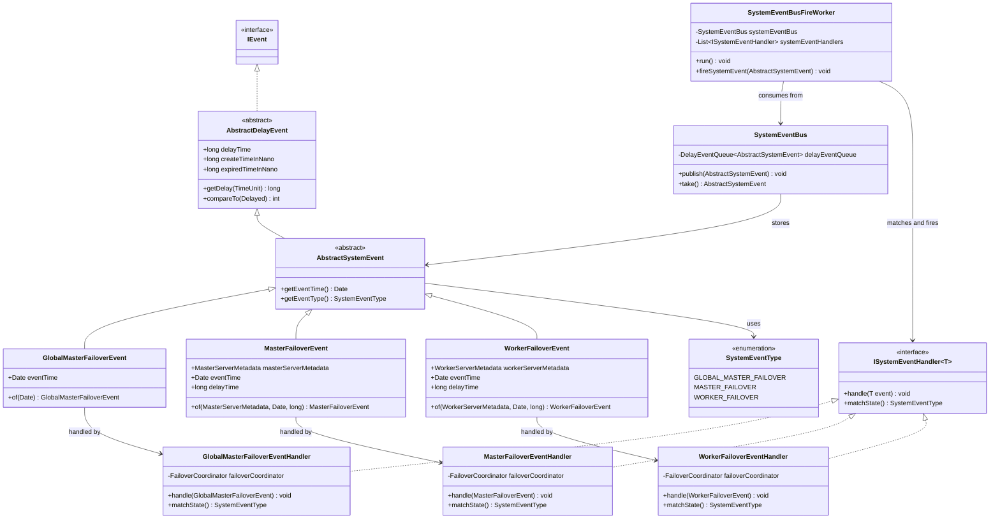
```mermaid
classDiagram
    class IEvent {
        <<interface>>
    }
    
    class AbstractDelayEvent {
        <<abstract>>
        +long delayTime
        +long createTimeInNano
        +long expiredTimeInNano
        +getDelay(TimeUnit) long
        +compareTo(Delayed) int
    }
    
    class AbstractSystemEvent {
        <<abstract>>
        +getEventTime() Date
        +getEventType() SystemEventType
    }
    
    class GlobalMasterFailoverEvent {
        +Date eventTime
        +of(Date) GlobalMasterFailoverEvent
    }
    
    class MasterFailoverEvent {
        +MasterServerMetadata masterServerMetadata
        +Date eventTime
        +long delayTime
        +of(MasterServerMetadata, Date, long) MasterFailoverEvent
    }
    
    class WorkerFailoverEvent {
        +WorkerServerMetadata workerServerMetadata
        +Date eventTime
        +long delayTime
        +of(WorkerServerMetadata, Date, long) WorkerFailoverEvent
    }
    
    class SystemEventType {
        <<enumeration>>
        GLOBAL_MASTER_FAILOVER
        MASTER_FAILOVER
        WORKER_FAILOVER
    }
    
    class ISystemEventHandler~T~ {
        <<interface>>
        +handle(T event) void
        +matchState() SystemEventType
    }
    
    class GlobalMasterFailoverEventHandler {
        -FailoverCoordinator failoverCoordinator
        +handle(GlobalMasterFailoverEvent) void
        +matchState() SystemEventType
    }
    
    class MasterFailoverEventHandler {
        -FailoverCoordinator failoverCoordinator
        +handle(MasterFailoverEvent) void
        +matchState() SystemEventType
    }
    
    class WorkerFailoverEventHandler {
        -FailoverCoordinator failoverCoordinator
        +handle(WorkerFailoverEvent) void
        +matchState() SystemEventType
    }
    
    class SystemEventBus {
        -DelayEventQueue~AbstractSystemEvent~ delayEventQueue
        +publish(AbstractSystemEvent) void
        +take() AbstractSystemEvent
    }
    
    class SystemEventBusFireWorker {
        -SystemEventBus systemEventBus
        -List~ISystemEventHandler~ systemEventHandlers
        +run() void
        +fireSystemEvent(AbstractSystemEvent) void
    }
    
    IEvent <|.. AbstractDelayEvent
    AbstractDelayEvent <|-- AbstractSystemEvent
    AbstractSystemEvent <|-- GlobalMasterFailoverEvent
    AbstractSystemEvent <|-- MasterFailoverEvent
    AbstractSystemEvent <|-- WorkerFailoverEvent
    AbstractSystemEvent --> SystemEventType : uses
    
    ISystemEventHandler~AbstractSystemEvent~ <|.. GlobalMasterFailoverEventHandler
    ISystemEventHandler~AbstractSystemEvent~ <|.. MasterFailoverEventHandler
    ISystemEventHandler~AbstractSystemEvent~ <|.. WorkerFailoverEventHandler
    
    GlobalMasterFailoverEvent --> GlobalMasterFailoverEventHandler : handled by
    MasterFailoverEvent --> MasterFailoverEventHandler : handled by
    WorkerFailoverEvent --> WorkerFailoverEventHandler : handled by
    
    SystemEventBus --> AbstractSystemEvent : stores
    SystemEventBusFireWorker --> SystemEventBus : consumes from
    SystemEventBusFireWorker --> ISystemEventHandler : matches and fires
```

## 5. 设计模式分析图

### 5.1 策略模式 - Event和Handler匹配策略

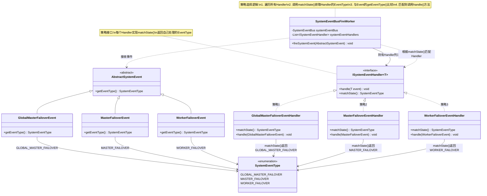
```mermaid
classDiagram
    class SystemEventBusFireWorker {
        -SystemEventBus systemEventBus
        -List~ISystemEventHandler~ systemEventHandlers
        +fireSystemEvent(AbstractSystemEvent) void
    }
    
    class ISystemEventHandler~T~ {
        <<interface>>
        +handle(T event) void
        +matchState() SystemEventType
    }
    
    class GlobalMasterFailoverEventHandler {
        +matchState() SystemEventType
        +handle(GlobalMasterFailoverEvent) void
    }
    
    class MasterFailoverEventHandler {
        +matchState() SystemEventType
        +handle(MasterFailoverEvent) void
    }
    
    class WorkerFailoverEventHandler {
        +matchState() SystemEventType
        +handle(WorkerFailoverEvent) void
    }
    
    class AbstractSystemEvent {
        <<abstract>>
        +getEventType() SystemEventType
    }
    
    class GlobalMasterFailoverEvent {
        +getEventType() SystemEventType
    }
    
    class MasterFailoverEvent {
        +getEventType() SystemEventType
    }
    
    class WorkerFailoverEvent {
        +getEventType() SystemEventType
    }
    
    class SystemEventType {
        <<enumeration>>
        GLOBAL_MASTER_FAILOVER
        MASTER_FAILOVER
        WORKER_FAILOVER
    }
    
    SystemEventBusFireWorker --> ISystemEventHandler : 持有Handler列表
    ISystemEventHandler <|.. GlobalMasterFailoverEventHandler : 策略1
    ISystemEventHandler <|.. MasterFailoverEventHandler : 策略2
    ISystemEventHandler <|.. WorkerFailoverEventHandler : 策略3
    
    AbstractSystemEvent <|-- GlobalMasterFailoverEvent
    AbstractSystemEvent <|-- MasterFailoverEvent
    AbstractSystemEvent <|-- WorkerFailoverEvent
    
    SystemEventBusFireWorker ..> AbstractSystemEvent : 接收事件
    SystemEventBusFireWorker ..> ISystemEventHandler : 根据matchState()匹配Handler
    
    GlobalMasterFailoverEvent --> SystemEventType : GLOBAL_MASTER_FAILOVER
    MasterFailoverEvent --> SystemEventType : MASTER_FAILOVER
    WorkerFailoverEvent --> SystemEventType : WORKER_FAILOVER
    
    GlobalMasterFailoverEventHandler --> SystemEventType : matchState()返回GLOBAL_MASTER_FAILOVER
    MasterFailoverEventHandler --> SystemEventType : matchState()返回MASTER_FAILOVER
    WorkerFailoverEventHandler --> SystemEventType : matchState()返回WORKER_FAILOVER
    
    note for SystemEventBusFireWorker "策略选择逻辑:\n1. 遍历所有Handler\n2. 调用matchState()获取Handler的EventType\n3. 与Event的getEventType()比较\n4. 匹配则调用handle()方法"
    note for ISystemEventHandler "策略接口:\n每个Handler实现matchState()\n返回自己处理的EventType"
```

### 5.2 发布-订阅模式 - 事件总线架构

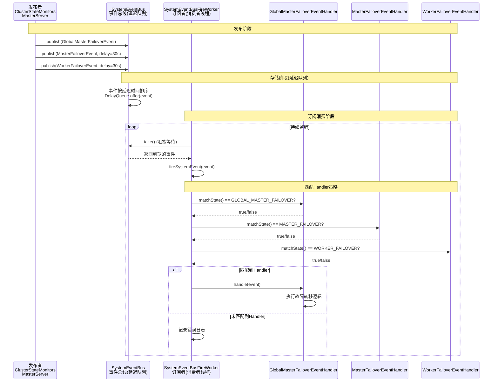
```mermaid
sequenceDiagram
    participant Publisher as 发布者<br/>ClusterStateMonitors<br/>MasterServer
    participant EventBus as SystemEventBus<br/>事件总线(延迟队列)
    participant Subscriber as SystemEventBusFireWorker<br/>订阅者(消费者线程)
    participant Handler1 as GlobalMasterFailoverEventHandler
    participant Handler2 as MasterFailoverEventHandler
    participant Handler3 as WorkerFailoverEventHandler
    
    Note over Publisher,Handler3: 发布阶段
    Publisher->>EventBus: publish(GlobalMasterFailoverEvent)
    Publisher->>EventBus: publish(MasterFailoverEvent, delay=30s)
    Publisher->>EventBus: publish(WorkerFailoverEvent, delay=30s)
    
    Note over EventBus,Handler3: 存储阶段(延迟队列)
    EventBus->>EventBus: 事件按延迟时间排序<br/>DelayQueue.offer(event)
    
    Note over Subscriber,Handler3: 订阅消费阶段
    loop 持续监听
        Subscriber->>EventBus: take() (阻塞等待)
        EventBus-->>Subscriber: 返回到期的事件
        Subscriber->>Subscriber: fireSystemEvent(event)
        
        Note over Subscriber,Handler3: 匹配Handler策略
        Subscriber->>Handler1: matchState() == GLOBAL_MASTER_FAILOVER?
        Handler1-->>Subscriber: true/false
        Subscriber->>Handler2: matchState() == MASTER_FAILOVER?
        Handler2-->>Subscriber: true/false
        Subscriber->>Handler3: matchState() == WORKER_FAILOVER?
        Handler3-->>Subscriber: true/false
        
        alt 匹配到Handler
            Subscriber->>Handler1: handle(event)
            Handler1->>Handler1: 执行故障转移逻辑
        else 未匹配到Handler
            Subscriber->>Subscriber: 记录错误日志
        end
    end
```

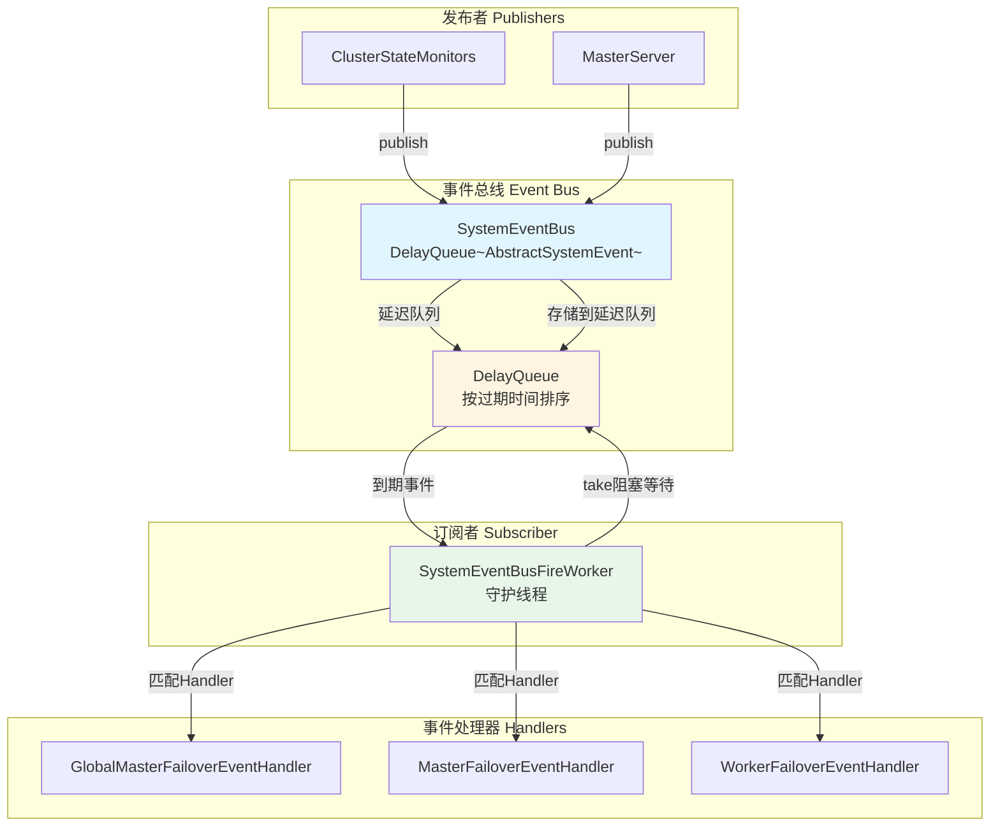
```mermaid
graph TB
    subgraph "发布者 Publishers"
        CSM[ClusterStateMonitors]
        MS[MasterServer]
    end
    
    subgraph "事件总线 Event Bus"
        SEB[SystemEventBus<br/>DelayQueue~AbstractSystemEvent~]
        direction TB
        SEB -->|延迟队列| Queue[DelayQueue<br/>按过期时间排序]
    end
    
    subgraph "订阅者 Subscriber"
        SEFW[SystemEventBusFireWorker<br/>守护线程]
    end
    
    subgraph "事件处理器 Handlers"
        GMFH[GlobalMasterFailoverEventHandler]
        MFH[MasterFailoverEventHandler]
        WFH[WorkerFailoverEventHandler]
    end
    
    CSM -->|publish| SEB
    MS -->|publish| SEB
    SEB -->|存储到延迟队列| Queue
    SEFW -->|take阻塞等待| Queue
    Queue -->|到期事件| SEFW
    SEFW -->|匹配Handler| GMFH
    SEFW -->|匹配Handler| MFH
    SEFW -->|匹配Handler| WFH
    
    style SEB fill:#e1f5ff
    style Queue fill:#fff4e1
    style SEFW fill:#e8f5e9
```

## 6. 故障转移流程图

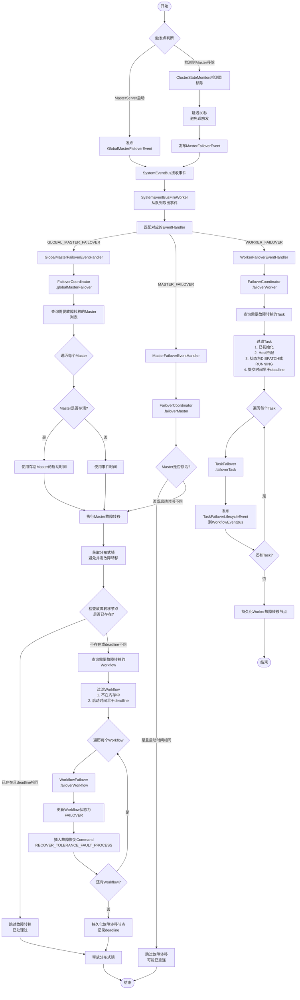
```mermaid
flowchart TD
    Start([开始]) --> Trigger1{触发点判断}
    
    Trigger1 -->|MasterServer启动| GlobalEvent[发布GlobalMasterFailoverEvent]
    Trigger1 -->|检测到Master移除| MonitorEvent[ClusterStateMonitors检测到移除]
    
    MonitorEvent --> Delay[延迟30秒<br/>避免误触发]
    Delay --> MasterEvent[发布MasterFailoverEvent]
    
    GlobalEvent --> EventBus[SystemEventBus接收事件]
    MasterEvent --> EventBus
    
    EventBus --> Worker[SystemEventBusFireWorker<br/>从队列取出事件]
    Worker --> Match[匹配对应的EventHandler]
    
    Match -->|GLOBAL_MASTER_FAILOVER| GlobalHandler[GlobalMasterFailoverEventHandler]
    Match -->|MASTER_FAILOVER| MasterHandler[MasterFailoverEventHandler]
    Match -->|WORKER_FAILOVER| WorkerHandler[WorkerFailoverEventHandler]
    
    GlobalHandler --> GlobalFailover[FailoverCoordinator<br/>.globalMasterFailover]
    MasterHandler --> MasterFailover[FailoverCoordinator<br/>.failoverMaster]
    WorkerHandler --> WorkerFailover[FailoverCoordinator<br/>.failoverWorker]
    
    GlobalFailover --> QueryMasters[查询需要故障转移的Master列表]
    QueryMasters --> Loop1{遍历每个Master}
    
    Loop1 --> CheckAlive1{Master是否存活?}
    CheckAlive1 -->|是| UseAliveTime[使用存活Master的启动时间]
    CheckAlive1 -->|否| UseEventTime[使用事件时间]
    
    UseAliveTime --> DoMasterFailover[执行Master故障转移]
    UseEventTime --> DoMasterFailover
    
    MasterFailover --> CheckAlive2{Master是否存活?}
    CheckAlive2 -->|是且启动时间相同| Skip[跳过故障转移<br/>可能已重连]
    CheckAlive2 -->|否或启动时间不同| DoMasterFailover
    
    DoMasterFailover --> GetLock[获取分布式锁<br/>避免并发故障转移]
    GetLock --> CheckExist{检查故障转移节点<br/>是否已存在?}
    
    CheckExist -->|已存在且deadline相同| Skip2[跳过故障转移<br/>已处理过]
    CheckExist -->|不存在或deadline不同| QueryWorkflows[查询需要故障转移的Workflow]
    
    QueryWorkflows --> FilterWorkflows[过滤Workflow<br/>1. 不在内存中<br/>2. 启动时间早于deadline]
    FilterWorkflows --> Loop2{遍历每个Workflow}
    
    Loop2 --> WorkflowFailover[WorkflowFailover<br/>.failoverWorkflow]
    WorkflowFailover --> UpdateState[更新Workflow状态为FAILOVER]
    UpdateState --> InsertCommand[插入故障恢复Command<br/>RECOVER_TOLERANCE_FAULT_PROCESS]
    InsertCommand --> NextWorkflow{还有Workflow?}
    
    NextWorkflow -->|是| Loop2
    NextWorkflow -->|否| PersistNode[持久化故障转移节点<br/>记录deadline]
    
    PersistNode --> ReleaseLock[释放分布式锁]
    ReleaseLock --> End1([结束])
    
    WorkerFailover --> QueryTasks[查询需要故障转移的Task]
    QueryTasks --> FilterTasks[过滤Task<br/>1. 已初始化<br/>2. Host匹配<br/>3. 状态为DISPATCH或RUNNING<br/>4. 提交时间早于deadline]
    FilterTasks --> Loop3{遍历每个Task}
    
    Loop3 --> TaskFailover[TaskFailover<br/>.failoverTask]
    TaskFailover --> PublishEvent[发布TaskFailoverLifecycleEvent<br/>到WorkflowEventBus]
    PublishEvent --> NextTask{还有Task?}
    
    NextTask -->|是| Loop3
    NextTask -->|否| PersistWorkerNode[持久化Worker故障转移节点]
    PersistWorkerNode --> End2([结束])
    
    Skip --> End1
    Skip2 --> ReleaseLock
```

## 7. 故障转移状态机图

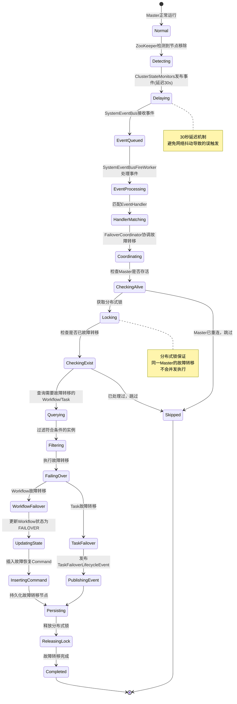
```mermaid
stateDiagram-v2
    [*] --> Normal: Master正常运行
    
    Normal --> Detecting: ZooKeeper检测到节点移除
    Detecting --> Delaying: ClusterStateMonitors发布事件(延迟30s)
    
    Delaying --> EventQueued: SystemEventBus接收事件
    EventQueued --> EventProcessing: SystemEventBusFireWorker处理事件
    
    EventProcessing --> HandlerMatching: 匹配EventHandler
    HandlerMatching --> Coordinating: FailoverCoordinator协调故障转移
    
    Coordinating --> CheckingAlive: 检查Master是否存活
    CheckingAlive --> Locking: 获取分布式锁
    
    Locking --> CheckingExist: 检查是否已故障转移
    CheckingExist --> Querying: 查询需要故障转移的Workflow/Task
    
    Querying --> Filtering: 过滤符合条件的实例
    Filtering --> FailingOver: 执行故障转移
    
    FailingOver --> WorkflowFailover: Workflow故障转移
    FailingOver --> TaskFailover: Task故障转移
    
    WorkflowFailover --> UpdatingState: 更新Workflow状态为FAILOVER
    UpdatingState --> InsertingCommand: 插入故障恢复Command
    InsertingCommand --> Persisting: 持久化故障转移节点
    
    TaskFailover --> PublishingEvent: 发布TaskFailoverLifecycleEvent
    PublishingEvent --> Persisting
    
    Persisting --> ReleasingLock: 释放分布式锁
    ReleasingLock --> Completed: 故障转移完成
    
    CheckingAlive --> Skipped: Master已重连，跳过
    CheckingExist --> Skipped: 已处理过，跳过
    
    Skipped --> [*]
    Completed --> [*]
    
    note right of Delaying
        30秒延迟机制
        避免网络抖动导致的误触发
    end note
    
    note right of Locking
        分布式锁保证
        同一Master的故障转移
        不会并发执行
    end note
```

## 8. 类依赖关系图

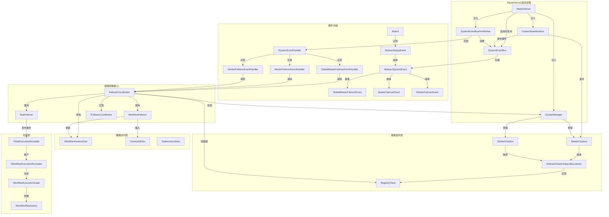
```mermaid
graph TB
    subgraph "MasterServer启动流程"
        MS[MasterServer]
        CSM[ClusterStateMonitors]
        CM[ClusterManager]
        SEB[SystemEventBus]
        SEFW[SystemEventBusFireWorker]
    end
    
    subgraph "集群监听层"
        ACSL[AbstractClusterSubscribeListener]
        MC[MasterClusters]
        WC[WorkerClusters]
        RC[RegistryClient]
    end
    
    subgraph "事件系统"
        IEV[IEvent]
        ADE[AbstractDelayEvent]
        ASE[AbstractSystemEvent]
        GMFE[GlobalMasterFailoverEvent]
        MFE[MasterFailoverEvent]
        WFE[WorkerFailoverEvent]
        ISEH[ISystemEventHandler]
        GMFH[GlobalMasterFailoverEventHandler]
        MFH[MasterFailoverEventHandler]
        WFH[WorkerFailoverEventHandler]
    end
    
    subgraph "故障转移核心"
        FC[FailoverCoordinator]
        WF[WorkflowFailover]
        TF[TaskFailover]
        IF[IFailoverCoordinator]
    end
    
    subgraph "数据访问层"
        WID[WorkflowInstanceDao]
        CD[CommandDao]
        TID[TaskInstanceDao]
    end
    
    subgraph "仓库层"
        IWR[IWorkflowRepository]
        WEG[WorkflowExecutionGraph]
        TER[ITaskExecutionRunnable]
        WER[IWorkflowExecutionRunnable]
    end
    
    MS -->|启动时发布| SEB
    MS -->|注入| CSM
    MS -->|注入| CM
    MS -->|注入| SEFW
    
    CSM -->|监听| MC
    CSM -->|发布事件| SEB
    CM -->|管理| MC
    CM -->|管理| WC
    
    MC -->|继承| ACSL
    WC -->|继承| ACSL
    ACSL -->|实现| RC
    
    IEV -->|实现| ADE
    ADE -->|继承| ASE
    ASE -->|继承| GMFE
    ASE -->|继承| MFE
    ASE -->|继承| WFE
    SEB -->|存储| ASE
    
    SEFW -->|消费| SEB
    SEFW -->|匹配| ISEH
    ISEH -->|实现| GMFH
    ISEH -->|实现| MFH
    ISEH -->|实现| WFH
    
    GMFH -->|调用| FC
    MFH -->|调用| FC
    WFH -->|调用| FC
    
    FC -->|实现| IF
    FC -->|使用| WF
    FC -->|使用| TF
    FC -->|查询| WID
    FC -->|检查| CM
    FC -->|获取锁| RC
    
    WF -->|更新| WID
    WF -->|插入| CD
    
    TF -->|发布事件| TER
    TER -->|属于| WER
    WER -->|包含| WEG
    WEG -->|管理| IWR
```

## 9. 关键设计要点总结

### 9.1 延迟机制
- **30秒延迟**: MasterFailoverEvent和WorkerFailoverEvent都设置了30秒延迟
- **目的**: 避免网络抖动或短暂连接中断导致的误触发
- **实现**: AbstractDelayEventBus使用DelayQueue实现延迟事件

### 9.2 分布式锁机制
- **锁路径**: `RegistryUtils.getMasterFailoverLockPath(masterAddress)`
- **目的**: 防止多个Master同时处理同一个Master的故障转移
- **实现**: 使用RegistryClient的分布式锁功能

### 9.3 幂等性保证
- **检查机制**: 通过检查故障转移节点是否存在且deadline相同来判断是否已处理
- **节点路径**: `RegistryUtils.getFailoveredNodePath(...)`
- **存储内容**: 故障转移的deadline时间戳

### 9.4 事件驱动架构
- **解耦**: 监控层(ClusterStateMonitors)与处理层(FailoverCoordinator)通过事件总线解耦
- **异步处理**: SystemEventBusFireWorker在独立线程中异步处理事件
- **错误恢复**: 处理失败时会将事件重新放回队列

### 9.5 故障转移范围判断
- **Workflow故障转移**: 基于Master地址和启动时间/重启时间判断
- **Task故障转移**: 基于Worker地址、Task状态和提交时间判断
- **过滤条件**: 确保只转移在故障时间点之前启动的实例

