# RPC 服务注册流程详细分析

## 一、概述

本文档详细分析 DolphinScheduler Master 服务启动时的 RPC 服务注册流程，以及基于 Netty 的 RPC 框架实现原理。从 `MasterServer.initialized()` 方法中的 `this.masterRPCServer.start()` 调用开始，深入分析整个 RPC 服务注册和启动过程。

## 二、RPC 服务注册流程

### 2.1 入口：MasterServer.initialized()

在 `MasterServer` 类的 `@PostConstruct` 方法 `initialized()` 中，首先调用 RPC 服务器的启动方法：

```java
// dolphinscheduler-master/src/main/java/org/apache/dolphinscheduler/server/master/MasterServer.java:142
this.masterRPCServer.start();
```

### 2.2 类继承关系

```
MasterRpcServer
    ↓ extends
SpringServerMethodInvokerDiscovery
    ↓ extends
RpcServer
    ↓ contains
NettyRemotingServer
```

### 2.3 完整启动流程时序图

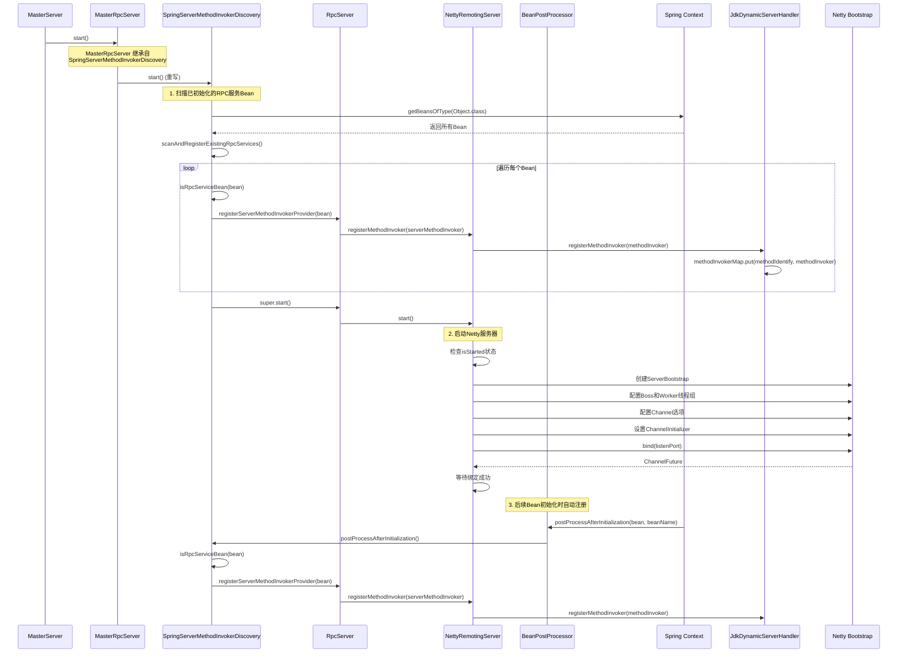
```mermaid
sequenceDiagram
    participant MS as MasterServer
    participant MRS as MasterRpcServer
    participant SSMID as SpringServerMethodInvokerDiscovery
    participant RS as RpcServer
    participant NRS as NettyRemotingServer
    participant BPP as BeanPostProcessor
    participant SC as Spring Context
    participant JDSH as JdkDynamicServerHandler
    participant NB as Netty Bootstrap

    MS->>MRS: start()
    Note over MRS: MasterRpcServer 继承自<br/>SpringServerMethodInvokerDiscovery
    
    MRS->>SSMID: start() (重写)
    Note over SSMID: 1. 扫描已初始化的RPC服务Bean
    SSMID->>SC: getBeansOfType(Object.class)
    SC-->>SSMID: 返回所有Bean
    SSMID->>SSMID: scanAndRegisterExistingRpcServices()
    loop 遍历每个Bean
        SSMID->>SSMID: isRpcServiceBean(bean)
        SSMID->>RS: registerServerMethodInvokerProvider(bean)
        RS->>NRS: registerMethodInvoker(serverMethodInvoker)
        NRS->>JDSH: registerMethodInvoker(methodInvoker)
        JDSH->>JDSH: methodInvokerMap.put(methodIdentify, methodInvoker)
    end
    
    SSMID->>RS: super.start()
    RS->>NRS: start()
    
    Note over NRS: 2. 启动Netty服务器
    NRS->>NRS: 检查isStarted状态
    NRS->>NB: 创建ServerBootstrap
    NRS->>NB: 配置Boss和Worker线程组
    NRS->>NB: 配置Channel选项
    NRS->>NB: 设置ChannelInitializer
    NRS->>NB: bind(listenPort)
    NB-->>NRS: ChannelFuture
    NRS->>NRS: 等待绑定成功
    
    Note over BPP: 3. 后续Bean初始化时自动注册
    SC->>BPP: postProcessAfterInitialization(bean, beanName)
    BPP->>SSMID: postProcessAfterInitialization()
    SSMID->>SSMID: isRpcServiceBean(bean)
    SSMID->>RS: registerServerMethodInvokerProvider(bean)
    RS->>NRS: registerMethodInvoker(serverMethodInvoker)
    NRS->>JDSH: registerMethodInvoker(methodInvoker)
```

### 2.4 详细流程分析

#### 2.4.1 MasterRpcServer 初始化

```java
// dolphinscheduler-master/src/main/java/org/apache/dolphinscheduler/server/master/rpc/MasterRpcServer.java
@Component
public class MasterRpcServer extends SpringServerMethodInvokerDiscovery implements AutoCloseable {
    public MasterRpcServer(MasterConfig masterConfig) {
        super(NettyServerConfig.builder()
                .serverName("MasterRpcServer")
                .listenPort(masterConfig.getListenPort())  // 默认5678
                .build());
    }
}
```

**关键点：**
- `MasterRpcServer` 继承 `SpringServerMethodInvokerDiscovery`
- 通过构造函数传入 `NettyServerConfig`，配置服务器名称和监听端口
- Spring 容器自动注入 `MasterConfig`，获取配置的监听端口

#### 2.4.2 SpringServerMethodInvokerDiscovery.start()

```java
// dolphinscheduler-extract/dolphinscheduler-extract-base/src/main/java/org/apache/dolphinscheduler/extract/base/server/SpringServerMethodInvokerDiscovery.java
@Override
public void start() {
    // 在启动前扫描并注册所有已初始化的RPC服务Bean
    if (applicationContext != null) {
        scanAndRegisterExistingRpcServices();
    }
    super.start();  // 调用父类RpcServer的start()方法
}
```

**为什么需要 scanAndRegisterExistingRpcServices()？**

Spring 的 Bean 初始化顺序：
1. 先初始化所有 `BeanPostProcessor`（包括 `SpringServerMethodInvokerDiscovery`）
2. 再初始化其他 bean（如 `WorkflowControlClient`）
3. 每个 bean 初始化完成后，调用所有 `BeanPostProcessor` 的 `postProcessAfterInitialization`
4. 所有 bean 初始化完成后，才调用所有 bean 的 `@PostConstruct`（如 `MasterServer.initialized()`）

**问题场景：**
- 如果某个 RPC 服务 Bean 在 `masterRPCServer.start()` 之后才初始化，启动时它还未注册
- 需要双重保障机制：启动时扫描 + BeanPostProcessor 监听

**scanAndRegisterExistingRpcServices() 实现：**

```java
private void scanAndRegisterExistingRpcServices() {
    Map<String, Object> allBeans = applicationContext.getBeansOfType(Object.class);
    int registeredCount = 0;
    for (Map.Entry<String, Object> entry : allBeans.entrySet()) {
        Object bean = entry.getValue();
        if (bean == this) {
            continue;  // 跳过自身
        }
        // 检查是否为RPC服务Bean且未注册
        if (isRpcServiceBean(bean) && !registeredBeans.contains(bean)) {
            registerServerMethodInvokerProvider(bean);  // 注册方法调用器
            registeredBeans.add(bean);
            registeredCount++;
        }
    }
    if (registeredCount > 0) {
        log.info("Registered {} existing RPC service bean(s) before starting RPC server", registeredCount);
    }
}
```

#### 2.4.3 RPC 服务 Bean 识别

**isRpcServiceBean() 方法：**

```java
private boolean isRpcServiceBean(Object bean) {
    for (Class<?> anInterface : bean.getClass().getInterfaces()) {
        if (anInterface.getAnnotation(RpcService.class) != null) {
            return true;
        }
    }
    return false;
}
```

**RPC 服务接口示例：**

```java
@RpcService
public interface IWorkflowControlClient {
    @RpcMethod
    WorkflowManualTriggerResponse manualTriggerWorkflow(WorkflowManualTriggerRequest request);
}
```

**注解定义：**

```java
@Target(ElementType.TYPE)
@Retention(RetentionPolicy.RUNTIME)
@Documented
public @interface RpcService {
}

@Target(ElementType.METHOD)
@Retention(RetentionPolicy.RUNTIME)
@Documented
public @interface RpcMethod {
    long timeout() default -1;
    RpcMethodRetryStrategy retry() default @RpcMethodRetryStrategy;
}
```

#### 2.4.4 方法注册流程：registerServerMethodInvokerProvider()

```java
// RpcServer.registerServerMethodInvokerProvider()
@Override
public void registerServerMethodInvokerProvider(Object serverMethodInvokerProviderBean) {
    // 1. 获取bean对应的接口
    for (Class<?> anInterface : serverMethodInvokerProviderBean.getClass().getInterfaces()) {
        if (anInterface.getAnnotation(RpcService.class) == null) {
            continue;
        }
        // 2. 遍历接口的方法
        for (Method method : anInterface.getDeclaredMethods()) {
            RpcMethod rpcMethod = method.getAnnotation(RpcMethod.class);
            if (rpcMethod == null) {
                continue;
            }
            // 3. 创建ServerMethodInvoker
            ServerMethodInvoker serverMethodInvoker =
                    new ServerMethodInvokerImpl(serverMethodInvokerProviderBean, method);
            // 4. 注册到NettyRemotingServer
            nettyRemotingServer.registerMethodInvoker(serverMethodInvoker);
        }
    }
}
```

**ServerMethodInvokerImpl 实现：**

```java
class ServerMethodInvokerImpl implements ServerMethodInvoker {
    private final Object serviceBean;      // RPC服务Bean实例
    private final Method method;            // 要调用的方法
    private final String methodIdentify;    // 方法标识：method.toGenericString()
    
    @Override
    public Object invoke(Object... args) throws Throwable {
        return method.invoke(serviceBean, args);  // 反射调用
    }
    
    @Override
    public String getMethodIdentify() {
        return methodIdentify;  // 例如：public abstract org.apache.dolphinscheduler.extract.master.transportor.workflow.WorkflowManualTriggerResponse org.apache.dolphinscheduler.extract.master.IWorkflowControlClient.manualTriggerWorkflow(org.apache.dolphinscheduler.extract.master.transportor.workflow.WorkflowManualTriggerRequest)
    }
}
```

**注册到 Handler：**

```java
// NettyRemotingServer.registerMethodInvoker()
void registerMethodInvoker(ServerMethodInvoker methodInvoker) {
    channelHandler.registerMethodInvoker(methodInvoker);
}

// JdkDynamicServerHandler.registerMethodInvoker()
public void registerMethodInvoker(ServerMethodInvoker methodInvoker) {
    checkNotNull(methodInvoker);
    checkNotNull(methodInvoker.getMethodIdentify());
    // 将方法标识符和调用器存入Map，用于后续请求路由
    methodInvokerMap.put(methodInvoker.getMethodIdentify(), methodInvoker);
}
```

**注册结果：**
- `methodInvokerMap` 是一个 `ConcurrentHashMap<String, ServerMethodInvoker>`
- Key: 方法标识符（`method.toGenericString()`）
- Value: `ServerMethodInvoker` 实例，包含服务Bean和方法信息

#### 2.4.5 NettyRemotingServer 启动

```java
// NettyRemotingServer.start()
void start() {
    if (isStarted.compareAndSet(false, true)) {  // CAS保证只启动一次
        // 1. 创建ServerBootstrap
        ServerBootstrap serverBootstrap = new ServerBootstrap()
                .group(this.bossGroup, this.workGroup)  // 设置线程组
                .channel(NettyUtils.getServerSocketChannelClass())  // NIO或Epoll
                .option(ChannelOption.SO_REUSEADDR, true)
                .option(ChannelOption.SO_BACKLOG, serverConfig.getSoBacklog())  // 1024
                .childOption(ChannelOption.SO_KEEPALIVE, serverConfig.isSoKeepalive())  // true
                .childOption(ChannelOption.TCP_NODELAY, serverConfig.isTcpNoDelay())  // true
                .childOption(ChannelOption.SO_SNDBUF, serverConfig.getSendBufferSize())  // 65535
                .childOption(ChannelOption.SO_RCVBUF, serverConfig.getReceiveBufferSize())  // 65535
                .childHandler(new ChannelInitializer<SocketChannel>() {
                    @Override
                    protected void initChannel(SocketChannel ch) {
                        initNettyChannel(ch);  // 初始化Channel Pipeline
                    }
                });
        
        // 2. 绑定端口
        final ChannelFuture channelFuture = serverBootstrap.bind(serverConfig.getListenPort()).sync();
        if (channelFuture.isSuccess()) {
            log.info("{} bind success at port: {}", serverConfig.getServerName(), serverConfig.getListenPort());
            this.serverBootstrapChannel = channelFuture.channel();
        }
    }
}
```

#### 2.4.6 Netty Channel Pipeline 初始化

```java
// NettyRemotingServer.initNettyChannel()
private void initNettyChannel(SocketChannel ch) {
    ch.pipeline()
            .addLast("encoder", new TransporterEncoder())      // 出站：对象→字节
            .addLast("decoder", new TransporterDecoder())      // 入站：字节→对象
            .addLast("server-idle-handle",
                    new IdleStateHandler(
                            serverConfig.getConnectionIdleTime(),  // 60秒
                            0, 
                            0, 
                            TimeUnit.MILLISECONDS))              // 空闲检测
            .addLast("handler", channelHandler);                 // 业务处理器
}
```

**Pipeline 结构：**

```
┌─────────────────────────────────────────────────────────────┐
│                    Channel Pipeline                         │
├─────────────────────────────────────────────────────────────┤
│                                                             │
│  Inbound (接收数据流向)                                      │
│  ────────────────────────────────────────────────>         │
│                                                             │
│  [TransporterDecoder] → [IdleStateHandler] → [Handler]    │
│                                                             │
│  <────────────────────────────────────────────────          │
│  Outbound (发送数据流向)                                     │
│                                                             │
│  [TransporterEncoder]                                       │
│                                                             │
└─────────────────────────────────────────────────────────────┘
```

**注意：** `initNettyChannel()` 不是服务启动时调用，而是新的客户端连接时调用，为每个连接创建独立的 Pipeline。

#### 2.4.7 EventLoopGroup 初始化

```java
// NettyRemotingServer 构造函数
NettyRemotingServer(final NettyServerConfig serverConfig) {
    this.serverConfig = serverConfig;
    this.serverName = serverConfig.getServerName();
    
    // 1. 创建方法调用线程池
    this.methodInvokerExecutor = ThreadUtils.newDaemonFixedThreadExecutor(
            serverName + "-methodInvoker-%d", 
            Runtime.getRuntime().availableProcessors() * 2 + 1);
    
    // 2. 创建ChannelHandler
    this.channelHandler = new JdkDynamicServerHandler(methodInvokerExecutor);
    
    // 3. 创建Boss线程组（接收连接）
    ThreadFactory bossThreadFactory = ThreadUtils.newDaemonThreadFactory(serverName + "-boss-%d");
    
    // 4. 创建Worker线程组（处理I/O）
    ThreadFactory workerThreadFactory = ThreadUtils.newDaemonThreadFactory(serverName + "-worker-%d");
    
    // 5. 根据操作系统选择NIO或Epoll
    if (Epoll.isAvailable()) {  // Linux系统且epoll可用
        this.bossGroup = new EpollEventLoopGroup(1, bossThreadFactory);
        this.workGroup = new EpollEventLoopGroup(serverConfig.getWorkerThread(), workerThreadFactory);
    } else {  // 其他系统使用NIO
        this.bossGroup = new NioEventLoopGroup(1, bossThreadFactory);
        this.workGroup = new NioEventLoopGroup(serverConfig.getWorkerThread(), workerThreadFactory);
    }
}
```

**线程模型：**

```
┌──────────────────────────────────────────────────────────────┐
│                     Netty 线程模型                            │
├──────────────────────────────────────────────────────────────┤
│                                                              │
│  BossGroup (1个线程)                                         │
│  ┌────────────────────┐                                     │
│  │ Boss EventLoop     │  ← 接收客户端连接                    │
│  └────────────────────┘                                     │
│          │                                                   │
│          │ 将连接分配给WorkerGroup                           │
│          ↓                                                   │
│  WorkerGroup (CPU核心数 * 2 个线程)                         │
│  ┌──────────┐  ┌──────────┐  ┌──────────┐                 │
│  │ Worker 1 │  │ Worker 2 │  │ Worker N │                 │
│  └──────────┘  └──────────┘  └──────────┘                 │
│       │             │             │                         │
│       └─────────────┴─────────────┘                         │
│                    │                                         │
│                    ↓                                         │
│  MethodInvokerExecutor (CPU核心数 * 2 + 1 个线程)           │
│  ┌──────────┐  ┌──────────┐  ┌──────────┐                 │
│  │ Invoker1 │  │ Invoker2 │  │ InvokerN │                 │
│  └──────────┘  └──────────┘  └──────────┘                 │
│                    │                                         │
│                    ↓                                         │
│              业务方法执行                                     │
│                                                              │
└──────────────────────────────────────────────────────────────┘
```

### 2.5 BeanPostProcessor 机制（后续注册）

`SpringServerMethodInvokerDiscovery` 实现了 `BeanPostProcessor` 接口，在 Spring 容器初始化其他 Bean 时会自动调用：

```java
@Nullable
@Override
public Object postProcessAfterInitialization(Object bean, String beanName) throws BeansException {
    // 自动注册RPC服务Bean（处理在RPC服务器启动后才初始化的Bean）
    if (isRpcServiceBean(bean) && !registeredBeans.contains(bean)) {
        registerServerMethodInvokerProvider(bean);
        registeredBeans.add(bean);
        log.debug("Registered RPC service bean via BeanPostProcessor: {}", beanName);
    }
    return bean;
}
```

**双重注册机制总结：**

1. **启动时扫描**：`scanAndRegisterExistingRpcServices()` 处理在 RPC 服务器启动前已初始化的 Bean
2. **动态注册**：`postProcessAfterInitialization()` 处理在 RPC 服务器启动后才初始化的 Bean

这样确保所有 RPC 服务 Bean 都被正确注册，无论初始化顺序如何。

## 三、Netty 核心技术深度解析

### 3.1 类图关系

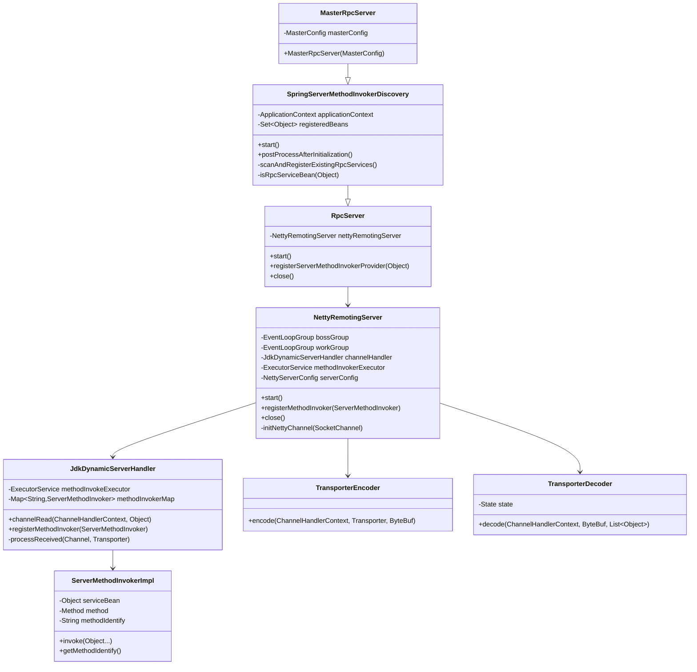
```mermaid
classDiagram
    class MasterRpcServer {
        -MasterConfig masterConfig
        +MasterRpcServer(MasterConfig)
    }
    
    class SpringServerMethodInvokerDiscovery {
        -ApplicationContext applicationContext
        -Set~Object~ registeredBeans
        +start()
        +postProcessAfterInitialization()
        -scanAndRegisterExistingRpcServices()
        -isRpcServiceBean(Object)
    }
    
    class RpcServer {
        -NettyRemotingServer nettyRemotingServer
        +start()
        +registerServerMethodInvokerProvider(Object)
        +close()
    }
    
    class NettyRemotingServer {
        -EventLoopGroup bossGroup
        -EventLoopGroup workGroup
        -JdkDynamicServerHandler channelHandler
        -ExecutorService methodInvokerExecutor
        -NettyServerConfig serverConfig
        +start()
        +registerMethodInvoker(ServerMethodInvoker)
        +close()
        -initNettyChannel(SocketChannel)
    }
    
    class JdkDynamicServerHandler {
        -ExecutorService methodInvokeExecutor
        -Map~String,ServerMethodInvoker~ methodInvokerMap
        +channelRead(ChannelHandlerContext, Object)
        +registerMethodInvoker(ServerMethodInvoker)
        -processReceived(Channel, Transporter)
    }
    
    class ServerMethodInvokerImpl {
        -Object serviceBean
        -Method method
        -String methodIdentify
        +invoke(Object...)
        +getMethodIdentify()
    }
    
    class TransporterEncoder {
        +encode(ChannelHandlerContext, Transporter, ByteBuf)
    }
    
    class TransporterDecoder {
        -State state
        +decode(ChannelHandlerContext, ByteBuf, List~Object~)
    }
    
    MasterRpcServer --|> SpringServerMethodInvokerDiscovery
    SpringServerMethodInvokerDiscovery --|> RpcServer
    RpcServer --> NettyRemotingServer
    NettyRemotingServer --> JdkDynamicServerHandler
    NettyRemotingServer --> TransporterEncoder
    NettyRemotingServer --> TransporterDecoder
    JdkDynamicServerHandler --> ServerMethodInvokerImpl
```

### 3.2 Netty 多路复用（I/O Multiplexing）详解

#### 3.2.1 多路复用的核心体现

**1. EventLoopGroup - 线程池复用**

```java
// NettyRemotingServer 构造函数
if (Epoll.isAvailable()) {
    this.bossGroup = new EpollEventLoopGroup(1, bossThreadFactory);
    // 默认：CPU核心数 * 2 个线程
    this.workGroup = new EpollEventLoopGroup(serverConfig.getWorkerThread(), workerThreadFactory);
} else {
    this.bossGroup = new NioEventLoopGroup(1, bossThreadFactory);
    this.workGroup = new NioEventLoopGroup(serverConfig.getWorkerThread(), workerThreadFactory);
}
```

**多路复用架构图：**

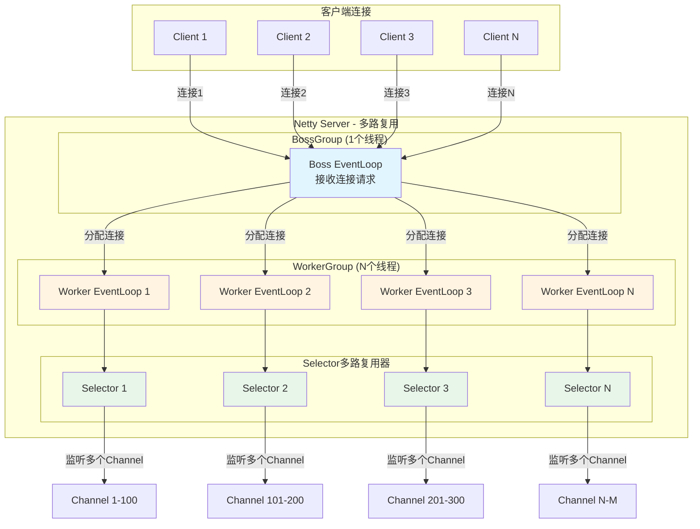
```mermaid
graph TB
    subgraph "客户端连接"
        C1[Client 1]
        C2[Client 2]
        C3[Client 3]
        CN[Client N]
    end
    
    subgraph "Netty Server - 多路复用"
        subgraph "BossGroup (1个线程)"
            Boss[Boss EventLoop<br/>接收连接请求]
        end
        
        subgraph "WorkerGroup (N个线程)"
            W1[Worker EventLoop 1]
            W2[Worker EventLoop 2]
            W3[Worker EventLoop 3]
            WN[Worker EventLoop N]
        end
        
        subgraph "Selector多路复用器"
            S1[Selector 1]
            S2[Selector 2]
            S3[Selector 3]
            SN[Selector N]
        end
    end
    
    C1 -->|连接1| Boss
    C2 -->|连接2| Boss
    C3 -->|连接3| Boss
    CN -->|连接N| Boss
    
    Boss -->|分配连接| W1
    Boss -->|分配连接| W2
    Boss -->|分配连接| W3
    Boss -->|分配连接| WN
    
    W1 --> S1
    W2 --> S2
    W3 --> S3
    WN --> SN
    
    S1 -->|监听多个Channel| Channels1[Channel 1-100]
    S2 -->|监听多个Channel| Channels2[Channel 101-200]
    S3 -->|监听多个Channel| Channels3[Channel 201-300]
    SN -->|监听多个Channel| ChannelsN[Channel N-M]
    
    style Boss fill:#e1f5ff
    style W1 fill:#fff4e1
    style W2 fill:#fff4e1
    style W3 fill:#fff4e1
    style WN fill:#fff4e1
    style S1 fill:#e8f5e9
    style S2 fill:#e8f5e9
    style S3 fill:#e8f5e9
    style SN fill:#e8f5e9
```

**多路复用原理：**

1. **一个 EventLoop 管理多个 Channel**
    - 每个 Worker EventLoop 绑定一个 Selector（多路复用器）
    - 一个 Selector 可以同时监听多个 Channel 的 I/O 事件（读、写、连接等）
    - 避免了传统 BIO 模式下一个线程对应一个连接的资源浪费

2. **事件驱动模型**
   ```java
   // Netty内部实现（简化）
   while (true) {
       // 一次 select() 可以检测到多个 Channel 的 I/O 事件
       int readyChannels = selector.select();
       Set<SelectionKey> selectedKeys = selector.selectedKeys();
       
       for (SelectionKey key : selectedKeys) {
           if (key.isReadable()) {
               // 处理读事件 - 可能是多个Channel的数据到达
               handleRead(key);
           }
           if (key.isWritable()) {
               // 处理写事件 - 可能是多个Channel的写就绪
               handleWrite(key);
           }
       }
   }
   ```

3. **资源利用率对比**

```
传统BIO模型（每连接一线程）：
┌─────────┐
│ Client1 │ ──→ ┌──────────┐
└─────────┘     │ Thread 1 │
┌─────────┐     └──────────┘
│ Client2 │ ──→ ┌──────────┐
└─────────┘     │ Thread 2 │
┌─────────┐     └──────────┘
│ Client3 │ ──→ ┌──────────┐
└─────────┘     │ Thread 3 │
                └──────────┘
问题：1000个连接 = 1000个线程（内存开销大，上下文切换频繁）

Netty NIO模型（多路复用）：
┌─────────┐
│ Client1 │ ─┐
└─────────┘  │
┌─────────┐  ├──→ ┌────────────────┐
│ Client2 │ ─┤    │ Worker Thread  │ ──→ Selector (监听1000个Channel)
└─────────┘  │    │ (EventLoop)    │
┌─────────┐  │    └────────────────┘
│ Client3 │ ─┤
└─────────┘  │
    ...      │
┌─────────┐  │
│Client100│ ─┘
└─────────┘
优势：1000个连接 ≈ 4-8个线程（资源占用少，性能高）
```

#### 3.2.2 Epoll vs NIO 的选择

```java
if (Epoll.isAvailable()) {  // Linux系统且epoll可用
    this.bossGroup = new EpollEventLoopGroup(1, bossThreadFactory);
    this.workGroup = new EpollEventLoopGroup(serverConfig.getWorkerThread(), workerThreadFactory);
} else {
    this.bossGroup = new NioEventLoopGroup(1, bossThreadFactory);
    this.workGroup = new NioEventLoopGroup(serverConfig.getWorkerThread(), workerThreadFactory);
}
```

**Epoll 优势（Linux系统）：**
- **O(1) 时间复杂度**：epoll 使用事件通知机制，不随连接数线性增长
- **边缘触发（ET）模式**：更高效的事件通知
- **无文件描述符限制**：可以处理大量并发连接
- **零拷贝支持**：更好的性能

**性能对比：**
```
连接数       NIO Selector          Epoll
1000        ~10ms                ~1ms
10000       ~100ms               ~5ms
100000      ~1000ms (性能下降)    ~20ms (性能稳定)
```

### 3.3 双工通信（Full-Duplex Communication）详解

#### 3.3.1 TCP 双工通信的本质

TCP 连接是全双工的，意味着：
- **双向数据流**：同一连接可以同时发送和接收数据
- **独立缓冲区**：发送和接收有独立的缓冲区
- **无需等待**：发送数据时不需要等待接收完成

#### 3.3.2 Netty 中的双工通信体现

**1. Pipeline 双向处理**

```java
private void initNettyChannel(SocketChannel ch) {
    ch.pipeline()
            .addLast("encoder", new TransporterEncoder())      // 出站：发送数据编码
            .addLast("decoder", new TransporterDecoder())      // 入站：接收数据解码
            .addLast("server-idle-handle", new IdleStateHandler(...))
            .addLast("handler", channelHandler);                 // 双向处理
}
```

**Pipeline 双向数据流：**

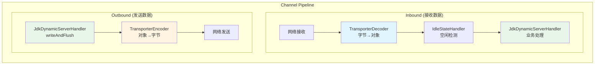
```mermaid
graph LR
    subgraph "Channel Pipeline"
        direction TB
        subgraph "Inbound (接收数据)"
            direction LR
            Net[网络接收] --> Decoder[TransporterDecoder<br/>字节→对象]
            Decoder --> Idle[IdleStateHandler<br/>空闲检测]
            Idle --> Handler[JdkDynamicServerHandler<br/>业务处理]
        end
        
        subgraph "Outbound (发送数据)"
            direction LR
            Handler2[JdkDynamicServerHandler<br/>writeAndFlush] --> Encoder[TransporterEncoder<br/>对象→字节]
            Encoder --> Net2[网络发送]
        end
    end
    
    style Decoder fill:#e1f5ff
    style Encoder fill:#fff4e1
    style Handler fill:#e8f5e9
    style Handler2 fill:#e8f5e9
```

**2. 请求-响应在同一 Channel 中**

```java
// JdkDynamicServerHandler.processReceived()
@Override
public void channelRead(ChannelHandlerContext ctx, Object msg) {
    processReceived(ctx.channel(), (Transporter) msg);  // 接收请求
}

private void processReceived(final Channel channel, final Transporter transporter) {
    // ... 处理请求 ...
    
    // 使用同一个channel发送响应
    channel.writeAndFlush(response);  // 在同一个TCP连接中发送响应
}
```

**双工通信的关键代码：**

```java
// JdkDynamicServerHandler.processReceived()
private void processReceived(final Channel channel, final Transporter transporter) {
    // 1. 接收请求（Inbound）
    ServerMethodInvoker methodInvoker = methodInvokerMap.get(methodIdentifier);
    
    // 2. 异步处理（避免阻塞EventLoop线程）
    methodInvokeExecutor.execute(() -> {
        // 3. 执行业务方法
        Object result = methodInvoker.invoke(args);
        
        // 4. 构建响应
        StandardRpcResponse iRpcResponse = StandardRpcResponse.success(...);
        Transporter response = Transporter.of(transporterHeader, iRpcResponse);
        
        // 5. 发送响应（Outbound） - 使用接收请求的同一个channel
        channel.writeAndFlush(response);
    });
}
```

**双工通信架构图：**

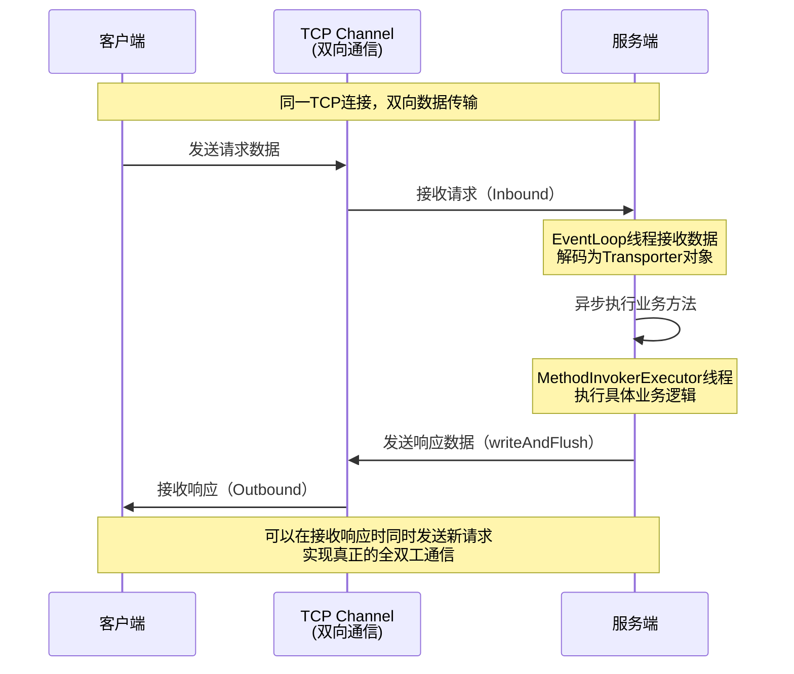
```mermaid
sequenceDiagram
    participant Client as 客户端
    participant Channel as TCP Channel<br/>(双向通信)
    participant Server as 服务端
    
    Note over Client,Server: 同一TCP连接，双向数据传输
    
    Client->>Channel: 发送请求数据
    Channel->>Server: 接收请求（Inbound）
    Note over Server: EventLoop线程接收数据<br/>解码为Transporter对象
    
    Server->>Server: 异步执行业务方法
    Note over Server: MethodInvokerExecutor线程<br/>执行具体业务逻辑
    
    Server->>Channel: 发送响应数据（writeAndFlush）
    Channel->>Client: 接收响应（Outbound）
    
    Note over Client,Server: 可以在接收响应时同时发送新请求<br/>实现真正的全双工通信
```

**双工通信的优势：**

1. **连接复用**：同一个TCP连接可以发送多个请求，无需为每个请求建立新连接
2. **双向数据传输**：服务端可以在处理请求的过程中主动推送数据给客户端
3. **低延迟**：避免了连接建立和断开的开销
4. **长连接支持**：支持心跳机制，保持连接活跃

#### 3.3.3 与HTTP的对比

**HTTP/1.1 半双工特性：**
- HTTP/1.1 虽然支持持久连接（Keep-Alive），但是**请求-响应模式**是串行的
- 客户端发送请求后，必须等待响应才能发送下一个请求（Pipeline有限）
- 一个连接同时只能有一个请求-响应对在进行

**RPC 全双工特性：**
- 可以在同一个连接上**并发发送多个请求**
- 服务端可以**异步响应**，不需要等待响应顺序
- 支持**双向通信**，服务端可以主动推送数据

### 3.4 RPC 完整调用流程

#### 3.4.1 RPC 调用时序图

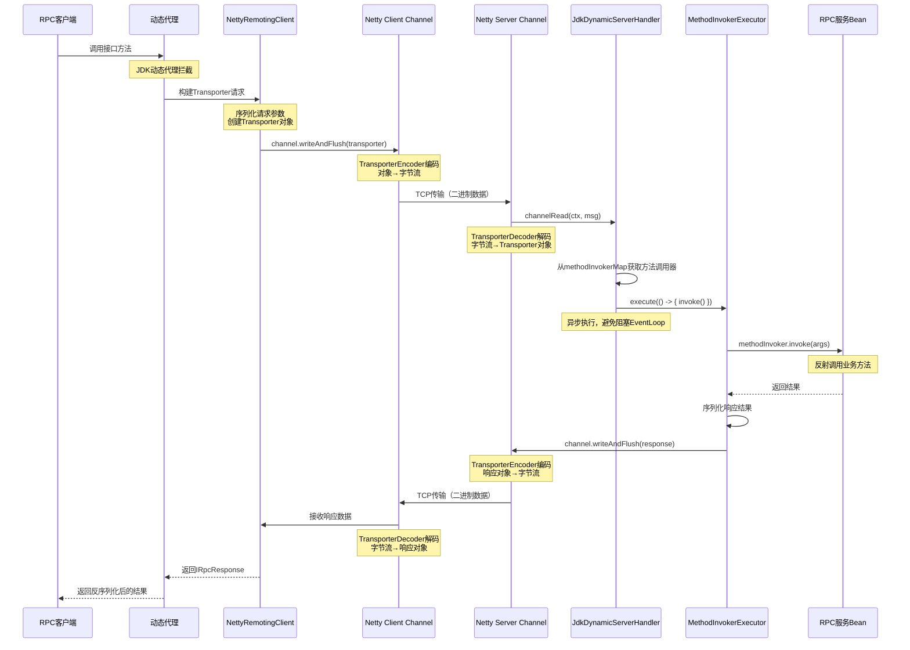
```mermaid
sequenceDiagram
    participant Client as RPC客户端
    participant Proxy as 动态代理
    participant NRC as NettyRemotingClient
    participant NettyClient as Netty Client Channel
    participant NettyServer as Netty Server Channel
    participant JDSH as JdkDynamicServerHandler
    participant Executor as MethodInvokerExecutor
    participant Service as RPC服务Bean

    Client->>Proxy: 调用接口方法
    Note over Proxy: JDK动态代理拦截
    
    Proxy->>NRC: 构建Transporter请求
    Note over NRC: 序列化请求参数<br/>创建Transporter对象
    
    NRC->>NettyClient: channel.writeAndFlush(transporter)
    Note over NettyClient: TransporterEncoder编码<br/>对象→字节流
    
    NettyClient->>NettyServer: TCP传输（二进制数据）
    
    NettyServer->>JDSH: channelRead(ctx, msg)
    Note over NettyServer: TransporterDecoder解码<br/>字节流→Transporter对象
    
    JDSH->>JDSH: 从methodInvokerMap获取方法调用器
    
    JDSH->>Executor: execute(() -> { invoke() })
    Note over JDSH: 异步执行，避免阻塞EventLoop
    
    Executor->>Service: methodInvoker.invoke(args)
    Note over Service: 反射调用业务方法
    
    Service-->>Executor: 返回结果
    
    Executor->>Executor: 序列化响应结果
    
    Executor->>NettyServer: channel.writeAndFlush(response)
    Note over NettyServer: TransporterEncoder编码<br/>响应对象→字节流
    
    NettyServer->>NettyClient: TCP传输（二进制数据）
    
    NettyClient->>NRC: 接收响应数据
    Note over NettyClient: TransporterDecoder解码<br/>字节流→响应对象
    
    NRC-->>Proxy: 返回IRpcResponse
    
    Proxy-->>Client: 返回反序列化后的结果
```

#### 3.4.2 数据编码解码流程

**编码流程（发送数据）：**

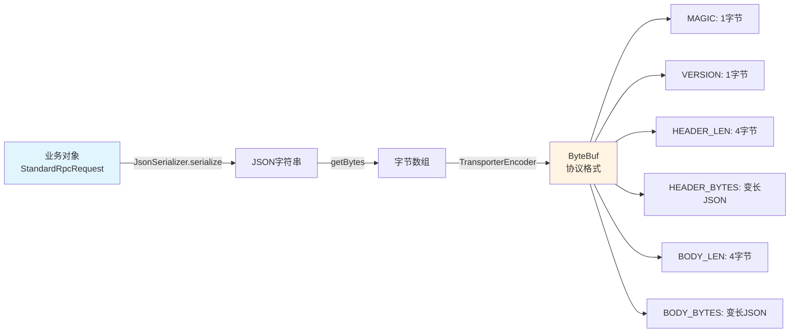
```mermaid
graph LR
    A[业务对象<br/>StandardRpcRequest] -->|JsonSerializer.serialize| B[JSON字符串]
    B -->|getBytes| C[字节数组]
    C -->|TransporterEncoder| D[ByteBuf<br/>协议格式]
    
    D --> E[MAGIC: 1字节]
    D --> F[VERSION: 1字节]
    D --> G[HEADER_LEN: 4字节]
    D --> H[HEADER_BYTES: 变长JSON]
    D --> I[BODY_LEN: 4字节]
    D --> J[BODY_BYTES: 变长JSON]
    
    style A fill:#e1f5ff
    style D fill:#fff4e1
```

**解码流程（接收数据）：**

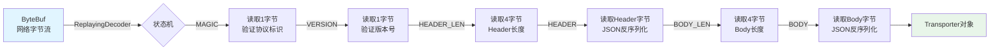
```mermaid
graph LR
    A[ByteBuf<br/>网络字节流] -->|ReplayingDecoder| B{状态机}
    
    B -->|MAGIC| C[读取1字节<br/>验证协议标识]
    C -->|VERSION| D[读取1字节<br/>验证版本号]
    D -->|HEADER_LEN| E[读取4字节<br/>Header长度]
    E -->|HEADER| F[读取Header字节<br/>JSON反序列化]
    F -->|BODY_LEN| G[读取4字节<br/>Body长度]
    G -->|BODY| H[读取Body字节<br/>JSON反序列化]
    H --> I[Transporter对象]
    
    style A fill:#e1f5ff
    style I fill:#e8f5e9
```

**协议格式详解：**

```
ByteBuf 协议格式：
┌──────┬─────────┬──────────────┬──────────────────┬──────────────┬──────────────────┐
│ MAGIC│ VERSION │ HEADER_LEN   │ HEADER_BYTES      │ BODY_LEN     │ BODY_BYTES       │
│(1字节)│(1字节)  │  (4字节)     │ (变长，JSON)      │  (4字节)     │ (变长，JSON)     │
└──────┴─────────┴──────────────┴──────────────────┴──────────────┴──────────────────┘

Header 内容（JSON）：
{
  "methodIdentifier": "public abstract ... methodName(...)",
  "opaque": 1234567890  // 请求唯一标识
}

Body 内容（JSON）：
StandardRpcRequest {
  "args": ["arg1", "arg2", ...],
  "argsTypes": ["String", "Integer", ...]
}
```

## 四、RPC 相比 HTTP 的优势

### 4.1 性能对比

#### 4.1.1 连接管理

**HTTP/1.1：**
- 每个请求需要建立TCP连接（或复用Keep-Alive连接）
- 请求-响应模式，一个连接同时只能处理一个请求-响应对
- 需要维护连接池，管理连接生命周期

**RPC（基于Netty）：**
- 长连接复用，一个连接可以处理多个并发请求
- 全双工通信，支持双向数据传输
- Netty自动管理连接，支持心跳保活

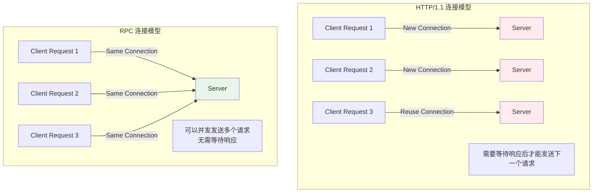
```mermaid
graph TB
    subgraph "HTTP/1.1 连接模型"
        direction LR
        C1[Client Request 1] -->|New Connection| S1[Server]
        C2[Client Request 2] -->|New Connection| S2[Server]
        C3[Client Request 3] -->|Reuse Connection| S3[Server]
        Note1[需要等待响应后才能发送下一个请求]
    end
    
    subgraph "RPC 连接模型"
        direction LR
        CR1[Client Request 1] -->|Same Connection| SR[Server]
        CR2[Client Request 2] -->|Same Connection| SR
        CR3[Client Request 3] -->|Same Connection| SR
        Note2[可以并发发送多个请求<br/>无需等待响应]
    end
    
    style S1 fill:#ffebee
    style S2 fill:#ffebee
    style S3 fill:#ffebee
    style SR fill:#e8f5e9
```

#### 4.1.2 协议开销

**HTTP 协议开销：**
```
HTTP请求格式：
GET /api/users/123 HTTP/1.1
Host: example.com
Content-Type: application/json
Content-Length: 100
Connection: keep-alive
User-Agent: Mozilla/5.0...
Accept: application/json

{"userId": 123, "name": "John"}

总开销：~200-500字节（Header）+ Body
```

**RPC 协议开销：**
```
RPC协议格式：
[MAGIC: 1字节] [VERSION: 1字节] [HEADER_LEN: 4字节] 
[HEADER: ~150字节JSON] [BODY_LEN: 4字节] [BODY: 实际数据]

总开销：~10字节（固定Header）+ ~150字节（Header JSON）+ Body
优势：固定开销小，Header精简
```

**性能对比表：**

| 指标 | HTTP/1.1 | RPC (Netty) | 优势倍数 |
|------|----------|-------------|----------|
| 协议Header开销 | 200-500字节 | ~160字节 | 1.25-3倍 |
| 连接建立时间 | 1-3ms | 0ms（复用） | ∞ |
| 并发请求支持 | 1个/连接 | 多个/连接 | 10-100倍 |
| 序列化性能 | JSON（通用） | JSON（可替换） | 相当 |
| 长连接支持 | 需要Keep-Alive | 原生支持 | 更好 |

### 4.2 功能特性对比

#### 4.2.1 双工通信能力

**HTTP：**
- 半双工：客户端请求 → 服务端响应，必须等待响应
- 服务端推送需要额外技术（WebSocket、SSE等）
- 复杂场景需要建立多个连接

**RPC：**
- 全双工：双向数据传输，支持并发请求
- 服务端可以主动推送数据
- 单个连接满足所有需求

#### 4.2.2 类型安全

**HTTP（RESTful）：**
```java
// 客户端调用
ResponseEntity<User> response = restTemplate.getForEntity(
    "http://server/api/users/123", User.class);

// 问题：
// 1. URL是字符串，容易出错
// 2. 参数类型在运行时才能发现
// 3. 返回值类型需要手动指定
```

**RPC：**
```java
// 客户端调用
@RpcService
public interface IUserService {
    @RpcMethod
    User getUserById(Long userId);
}

// 优势：
// 1. 接口定义清晰，编译时检查
// 2. 类型安全，IDE自动补全
// 3. 返回值类型自动推导
```

#### 4.2.3 开发体验

**HTTP：**
- 需要手动构建URL、HTTP方法、Header
- 需要处理HTTP状态码
- 错误处理复杂（404、500等）
- 需要手动序列化/反序列化

**RPC：**
- 像调用本地方法一样调用远程方法
- 异常自动传播
- 自动序列化/反序列化
- IDE支持完整（自动补全、重构等）

### 4.3 适用场景对比

**HTTP/RESTful 适用场景：**
- 公开API，需要跨语言、跨平台
- Web浏览器直接调用
- 简单的CRUD操作
- 需要遵循RESTful规范
- 需要缓存（HTTP缓存机制）

**RPC 适用场景：**
- 内部服务调用（微服务间通信）
- 高性能要求的场景
- 需要双向通信
- 复杂的业务逻辑调用
- 类型安全要求高
- 需要长连接、心跳等特性

### 4.4 DolphinScheduler 为什么选择 RPC

1. **内部服务通信**：Master、Worker、Alert等服务都是Java服务，无需跨语言
2. **高性能要求**：任务调度需要低延迟、高吞吐
3. **长连接管理**：需要心跳机制保持连接活跃
4. **双向通信**：Master需要主动向Worker发送任务，Worker需要上报状态
5. **类型安全**：Java接口定义，编译时检查，减少运行时错误

## 五、核心组件架构图

### 5.1 RPC 服务器架构

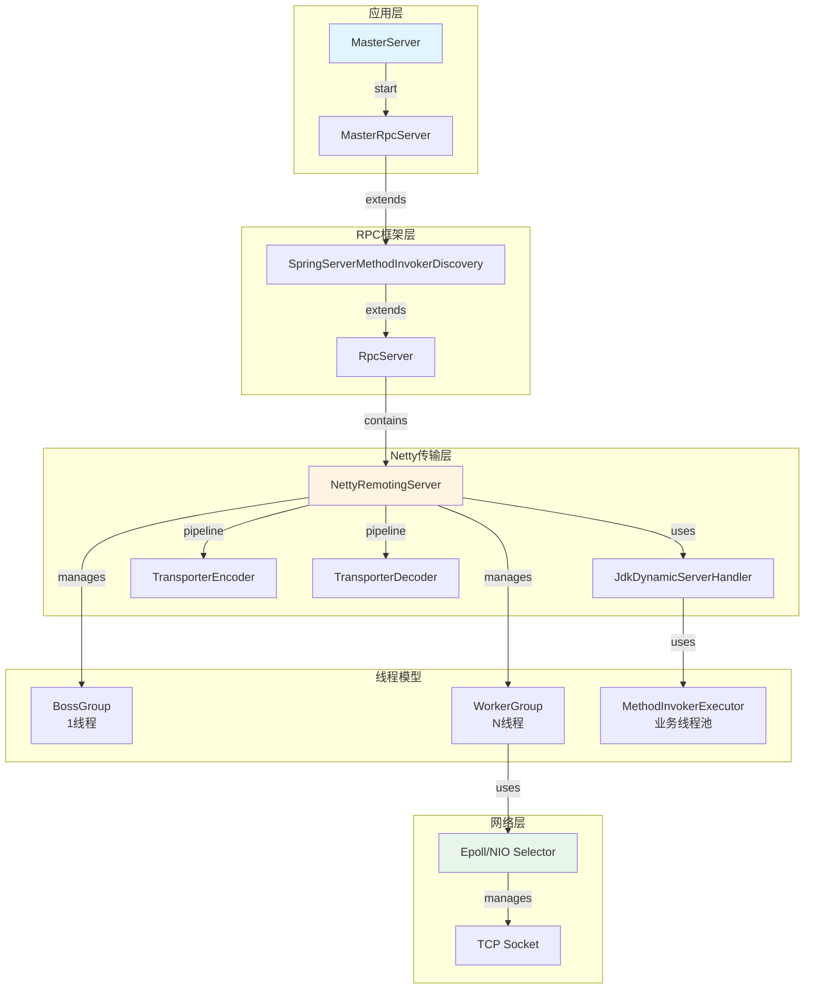
```mermaid
graph TB
    subgraph "应用层"
        MS[MasterServer]
        MRS[MasterRpcServer]
    end
    
    subgraph "RPC框架层"
        SSMID[SpringServerMethodInvokerDiscovery]
        RS[RpcServer]
    end
    
    subgraph "Netty传输层"
        NRS[NettyRemotingServer]
        JDSH[JdkDynamicServerHandler]
        TE[TransporterEncoder]
        TD[TransporterDecoder]
    end
    
    subgraph "线程模型"
        BG[BossGroup<br/>1线程]
        WG[WorkerGroup<br/>N线程]
        MIE[MethodInvokerExecutor<br/>业务线程池]
    end
    
    subgraph "网络层"
        TCP[TCP Socket]
        EP[Epoll/NIO Selector]
    end
    
    MS -->|start| MRS
    MRS -->|extends| SSMID
    SSMID -->|extends| RS
    RS -->|contains| NRS
    NRS -->|uses| JDSH
    NRS -->|pipeline| TE
    NRS -->|pipeline| TD
    NRS -->|manages| BG
    NRS -->|manages| WG
    JDSH -->|uses| MIE
    WG -->|uses| EP
    EP -->|manages| TCP
    
    style MS fill:#e1f5ff
    style NRS fill:#fff4e1
    style EP fill:#e8f5e9
```

### 5.2 数据流转架构


```mermaid
graph LR
    subgraph "客户端"
        CP[Client Proxy]
        NRC[NettyRemotingClient]
        NCC[Netty Client Channel]
    end
    
    subgraph "网络传输"
        TCP[TCP/IP 协议栈]
    end
    
    subgraph "服务端"
        NSC[Netty Server Channel]
        JDSH[JdkDynamicServerHandler]
        SI[ServerMethodInvoker]
        SB[Service Bean]
    end
    
    CP -->|1. 调用方法| NRC
    NRC -->|2. 序列化| NCC
    NCC -->|3. TCP传输| TCP
    TCP -->|4. TCP接收| NSC
    NSC -->|5. 解码| JDSH
    JDSH -->|6. 路由| SI
    SI -->|7. 反射调用| SB
    
    SB -->|8. 返回结果| SI
    SI -->|9. 序列化| JDSH
    JDSH -->|10. 编码| NSC
    NSC -->|11. TCP传输| TCP
    TCP -->|12. TCP接收| NCC
    NCC -->|13. 解码| NRC
    NRC -->|14. 返回结果| CP
    
    style CP fill:#e1f5ff
    style NSC fill:#fff4e1
    style SB fill:#e8f5e9
```

### 5.3 RPC 调用完整流程图

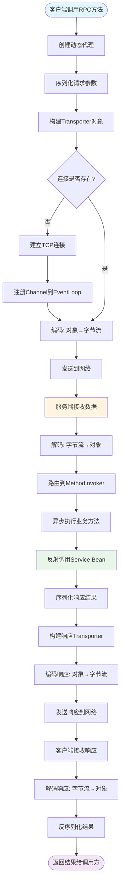
```mermaid
flowchart TD
    Start([客户端调用RPC方法]) --> CreateProxy[创建动态代理]
    CreateProxy --> Serialize[序列化请求参数]
    Serialize --> BuildTransporter[构建Transporter对象]
    BuildTransporter --> Connect{连接是否存在?}
    
    Connect -->|否| NewConn[建立TCP连接]
    NewConn --> Register[注册Channel到EventLoop]
    Register --> Encode[编码: 对象→字节流]
    
    Connect -->|是| Encode
    Encode --> Send[发送到网络]
    
    Send --> ServerReceive[服务端接收数据]
    ServerReceive --> Decode[解码: 字节流→对象]
    Decode --> Route[路由到MethodInvoker]
    Route --> AsyncExec[异步执行业务方法]
    
    AsyncExec --> Invoke[反射调用Service Bean]
    Invoke --> SerializeResp[序列化响应结果]
    SerializeResp --> BuildResp[构建响应Transporter]
    BuildResp --> EncodeResp[编码响应: 对象→字节流]
    EncodeResp --> SendResp[发送响应到网络]
    
    SendResp --> ClientReceive[客户端接收响应]
    ClientReceive --> DecodeResp[解码响应: 字节流→对象]
    DecodeResp --> Deserialize[反序列化结果]
    Deserialize --> Return([返回结果给调用方])
    
    style Start fill:#e1f5ff
    style ServerReceive fill:#fff4e1
    style Invoke fill:#e8f5e9
    style Return fill:#f3e5f5
```

## 六、Netty 关键技术点深度解析

### 6.1 多路复用的实现细节

#### 6.1.1 Selector 工作原理

**Netty 使用 NIO Selector 实现多路复用：**

```java
// Netty内部实现原理（简化版）
public class NioEventLoop {
    private Selector selector;
    
    @Override
    protected void run() {
        for (;;) {
            // 1. 检查是否有IO事件就绪
            int readyChannels = selector.select(timeout);
            
            if (readyChannels > 0) {
                // 2. 获取就绪的SelectionKey集合
                Set<SelectionKey> selectedKeys = selector.selectedKeys();
                Iterator<SelectionKey> keyIterator = selectedKeys.iterator();
                
                while (keyIterator.hasNext()) {
                    SelectionKey key = keyIterator.next();
                    
                    // 3. 处理不同类型的IO事件
                    if (key.isAcceptable()) {
                        // 接受新连接
                        handleAccept(key);
                    } else if (key.isReadable()) {
                        // 读取数据 - 关键：一个EventLoop可以处理多个Channel的读事件
                        handleRead(key);
                    } else if (key.isWritable()) {
                        // 写入数据
                        handleWrite(key);
                    }
                    
                    keyIterator.remove();
                }
            }
        }
    }
}
```

**多路复用架构图：**

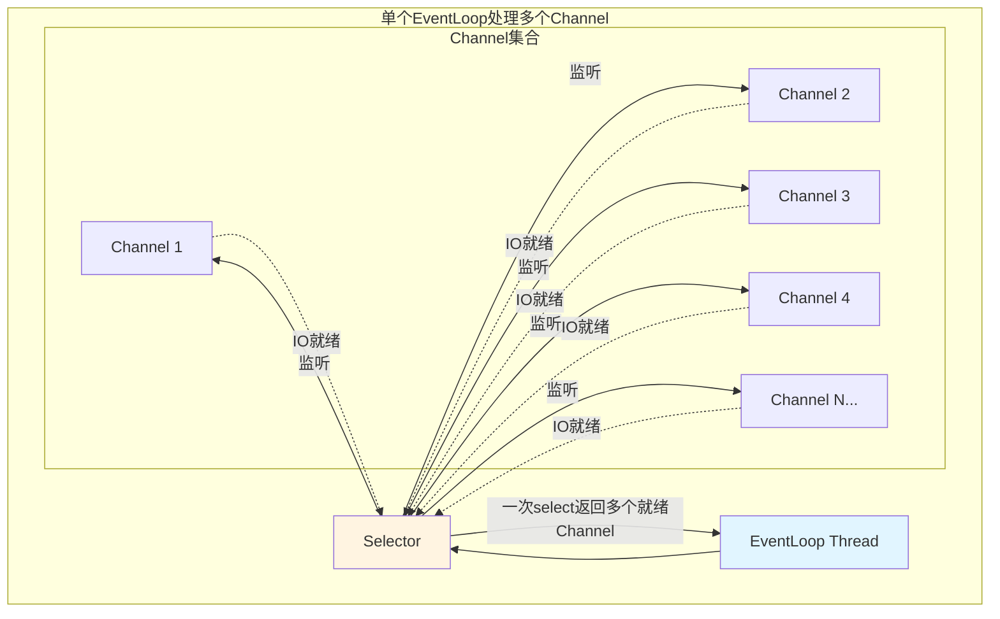
```mermaid
graph TB
    subgraph "单个EventLoop处理多个Channel"
        EL[EventLoop Thread]
        SEL[Selector]
        
        subgraph "Channel集合"
            C1[Channel 1]
            C2[Channel 2]
            C3[Channel 3]
            C4[Channel 4]
            CN[Channel N...]
        end
        
        EL --> SEL
        SEL -->|监听| C1
        SEL -->|监听| C2
        SEL -->|监听| C3
        SEL -->|监听| C4
        SEL -->|监听| CN
        
        C1 -.->|IO就绪| SEL
        C2 -.->|IO就绪| SEL
        C3 -.->|IO就绪| SEL
        C4 -.->|IO就绪| SEL
        CN -.->|IO就绪| SEL
        
        SEL -->|一次select返回多个就绪Channel| EL
    end
    
    style EL fill:#e1f5ff
    style SEL fill:#fff4e1
```

**关键优势：**

1. **一个线程处理多个连接**：不需要为每个连接创建线程
2. **事件驱动**：只有IO就绪时才处理，避免阻塞等待
3. **高效的事件检测**：`select()` 系统调用可以同时检测多个文件描述符

#### 6.1.2 Epoll 的优势（Linux系统）

**Epoll vs Select/Poll：**

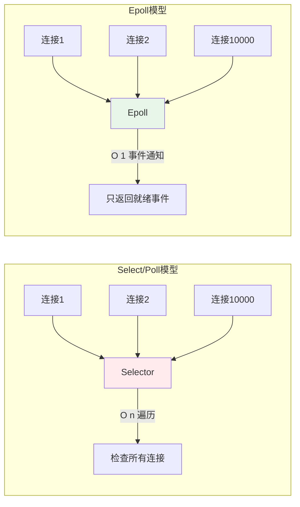
```mermaid
graph LR
    subgraph "Select/Poll模型"
        direction TB
        S1[连接1] --> SEL1[Selector]
        S2[连接2] --> SEL1
        S3[连接10000] --> SEL1
        SEL1 -->|O n 遍历| CHECK[检查所有连接]
    end
    
    subgraph "Epoll模型"
        direction TB
        E1[连接1] --> EP[Epoll]
        E2[连接2] --> EP
        E3[连接10000] --> EP
        EP -->|O 1 事件通知| EVENTS[只返回就绪事件]
    end
    
    style SEL1 fill:#ffebee
    style EP fill:#e8f5e9
```

**性能对比：**

| 连接数 | Select时间复杂度 | Epoll时间复杂度 | 性能提升 |
|--------|------------------|-----------------|----------|
| 100    | O(100)           | O(1)            | 100倍    |
| 1000   | O(1000)          | O(1)            | 1000倍   |
| 10000  | O(10000)         | O(1)            | 10000倍  |

**DolphinScheduler中的体现：**

```java
// NettyRemotingServer 构造函数
if (Epoll.isAvailable()) {  // Linux系统优先使用Epoll
    this.bossGroup = new EpollEventLoopGroup(1, bossThreadFactory);
    this.workGroup = new EpollEventLoopGroup(serverConfig.getWorkerThread(), workerThreadFactory);
} else {
    this.bossGroup = new NioEventLoopGroup(1, bossThreadFactory);
    this.workGroup = new NioEventLoopGroup(serverConfig.getWorkerThread(), workerThreadFactory);
}
```

### 6.2 双工通信的完整实现

#### 6.2.1 Channel Pipeline 双向处理

**Pipeline 完整结构：**

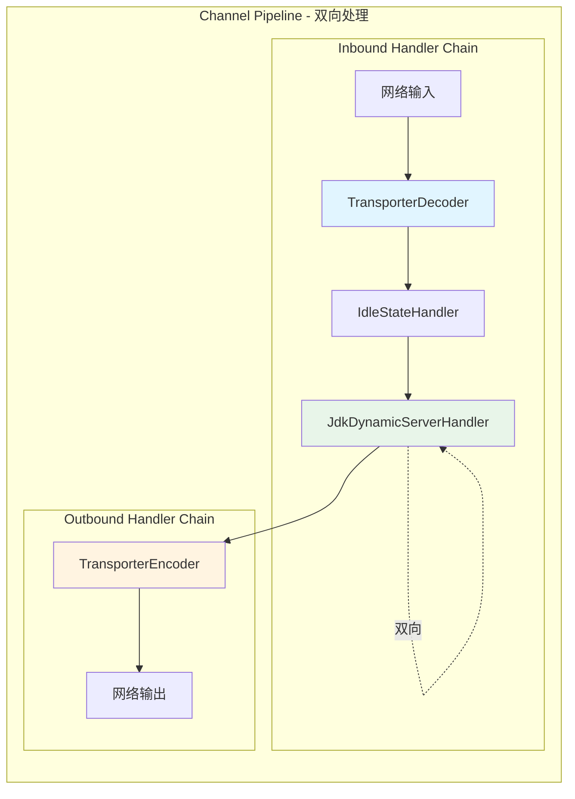
```mermaid
graph TB
    subgraph "Channel Pipeline - 双向处理"
        direction TB
        
        subgraph "Inbound Handler Chain"
            direction TB
            NetIn[网络输入] --> Decoder[TransporterDecoder]
            Decoder --> IdleIn[IdleStateHandler]
            IdleIn --> Handler[JdkDynamicServerHandler]
        end
        
        subgraph "Outbound Handler Chain"
            direction TB
            Handler --> Encoder[TransporterEncoder]
            Encoder --> NetOut[网络输出]
        end
        
        Handler -.->|双向| Handler
    end
    
    style Decoder fill:#e1f5ff
    style Encoder fill:#fff4e1
    style Handler fill:#e8f5e9
```

**关键代码实现：**

```java
// NettyRemotingServer.initNettyChannel()
private void initNettyChannel(SocketChannel ch) {
    ch.pipeline()
            // Outbound: 发送数据时，从后往前执行
            .addLast("encoder", new TransporterEncoder())      // 最后执行编码
            // Inbound: 接收数据时，从前往后执行
            .addLast("decoder", new TransporterDecoder())      // 先执行解码
            .addLast("server-idle-handle", new IdleStateHandler(...))
            .addLast("handler", channelHandler);                 // 业务处理（双向）
}
```

**数据处理流程：**

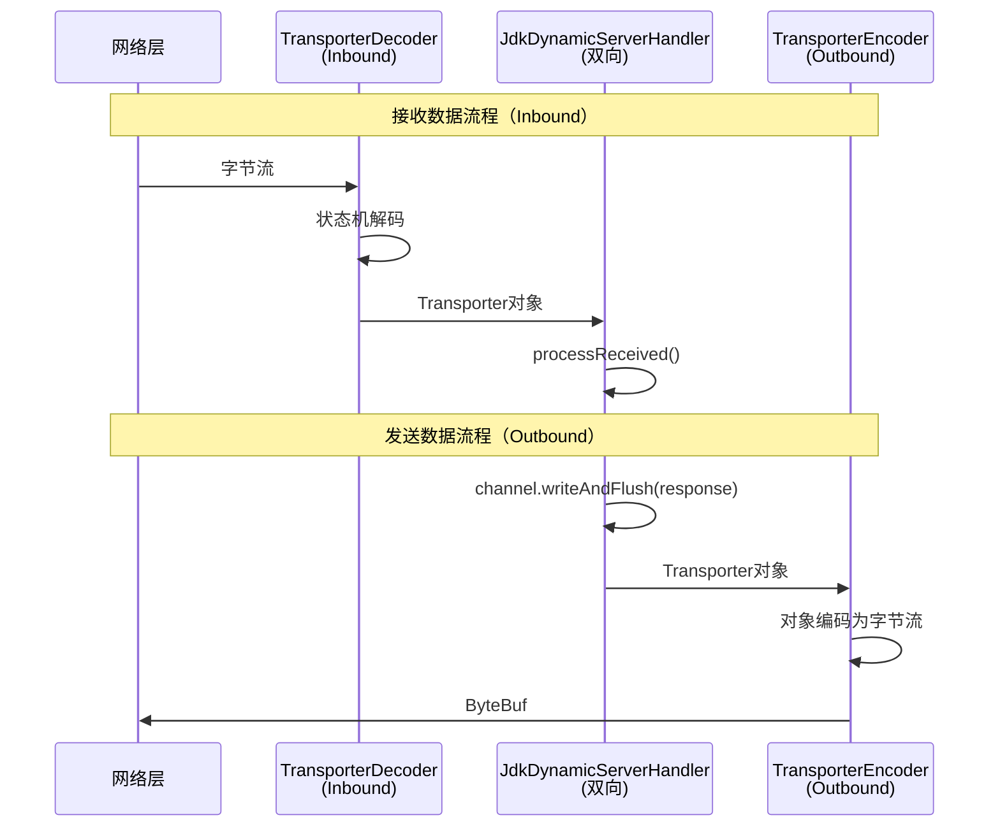
```mermaid
sequenceDiagram
    participant Net as 网络层
    participant Decoder as TransporterDecoder<br/>(Inbound)
    participant Handler as JdkDynamicServerHandler<br/>(双向)
    participant Encoder as TransporterEncoder<br/>(Outbound)
    
    Note over Net,Encoder: 接收数据流程（Inbound）
    Net->>Decoder: 字节流
    Decoder->>Decoder: 状态机解码
    Decoder->>Handler: Transporter对象
    Handler->>Handler: processReceived()
    
    Note over Net,Encoder: 发送数据流程（Outbound）
    Handler->>Handler: channel.writeAndFlush(response)
    Handler->>Encoder: Transporter对象
    Encoder->>Encoder: 对象编码为字节流
    Encoder->>Net: ByteBuf
```

#### 6.2.2 同一Channel上的请求-响应

**代码实现：**

```java
// JdkDynamicServerHandler.processReceived()
private void processReceived(final Channel channel, final Transporter transporter) {
    // 1. 接收请求（Inbound）
    final String methodIdentifier = transporter.getHeader().getMethodIdentifier();
    ServerMethodInvoker methodInvoker = methodInvokerMap.get(methodIdentifier);
    
    // 2. 异步执行业务逻辑
    methodInvokeExecutor.execute(() -> {
        try {
            // 执行方法调用
            Object result = methodInvoker.invoke(args);
            
            // 3. 构建响应
            StandardRpcResponse iRpcResponse = StandardRpcResponse.success(...);
            TransporterHeader header = TransporterHeader.of(
                transporter.getHeader().getOpaque(),  // 使用相同的opaque关联请求-响应
                methodIdentifier
            );
            Transporter response = Transporter.of(header, iRpcResponse);
            
            // 4. 使用同一个channel发送响应（Outbound）
            channel.writeAndFlush(response);  // 关键：双向通信
        } catch (Throwable e) {
            // 错误响应也通过同一channel返回
            channel.writeAndFlush(errorResponse);
        }
    });
}
```

**请求-响应关联：**

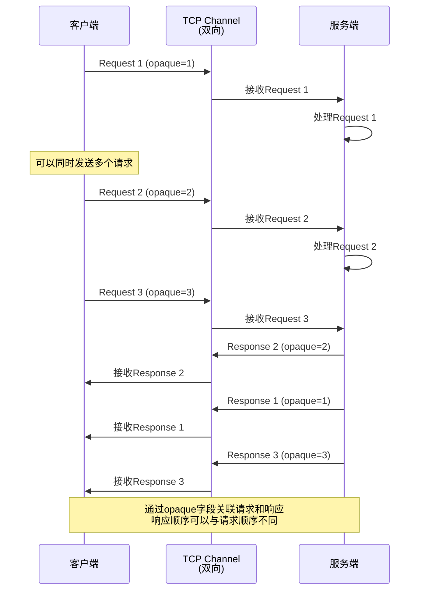
```mermaid
sequenceDiagram
    participant Client as 客户端
    participant Channel as TCP Channel<br/>(双向)
    participant Server as 服务端
    
    Client->>Channel: Request 1 (opaque=1)
    Channel->>Server: 接收Request 1
    Server->>Server: 处理Request 1
    
    Note over Client: 可以同时发送多个请求
    Client->>Channel: Request 2 (opaque=2)
    Channel->>Server: 接收Request 2
    Server->>Server: 处理Request 2
    
    Client->>Channel: Request 3 (opaque=3)
    Channel->>Server: 接收Request 3
    
    Server->>Channel: Response 2 (opaque=2)
    Channel->>Client: 接收Response 2
    
    Server->>Channel: Response 1 (opaque=1)
    Channel->>Client: 接收Response 1
    
    Server->>Channel: Response 3 (opaque=3)
    Channel->>Client: 接收Response 3
    
    Note over Client,Server: 通过opaque字段关联请求和响应<br/>响应顺序可以与请求顺序不同
```

### 6.3 线程模型与异步处理

#### 6.3.1 Netty 线程模型

**DolphinScheduler RPC 服务器的线程架构：**

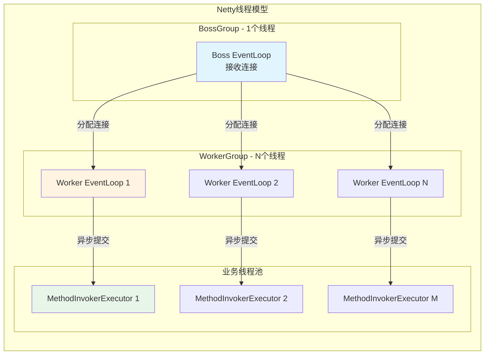
```mermaid
graph TB
    subgraph "Netty线程模型"
        direction TB
        
        subgraph "BossGroup - 1个线程"
            Boss[Boss EventLoop<br/>接收连接]
        end
        
        subgraph "WorkerGroup - N个线程"
            direction LR
            W1[Worker EventLoop 1]
            W2[Worker EventLoop 2]
            WN[Worker EventLoop N]
        end
        
        subgraph "业务线程池"
            direction LR
            E1[MethodInvokerExecutor 1]
            E2[MethodInvokerExecutor 2]
            EN[MethodInvokerExecutor M]
        end
        
        Boss -->|分配连接| W1
        Boss -->|分配连接| W2
        Boss -->|分配连接| WN
        
        W1 -->|异步提交| E1
        W2 -->|异步提交| E2
        WN -->|异步提交| EN
    end
    
    style Boss fill:#e1f5ff
    style W1 fill:#fff4e1
    style E1 fill:#e8f5e9
```

**线程职责划分：**

1. **Boss EventLoop**：负责接收客户端连接
2. **Worker EventLoop**：负责IO读写、编解码、Pipeline处理
3. **MethodInvokerExecutor**：负责执行业务逻辑，避免阻塞EventLoop

**关键代码：**

```java
// NettyRemotingServer 构造函数
// 1. Worker线程数：CPU核心数 * 2
this.workGroup = new NioEventLoopGroup(serverConfig.getWorkerThread(), workerThreadFactory);

// 2. 业务线程池：CPU核心数 * 2 + 1
this.methodInvokerExecutor = ThreadUtils.newDaemonFixedThreadExecutor(
    serverName + "-methodInvoker-%d", 
    Runtime.getRuntime().availableProcessors() * 2 + 1
);

// JdkDynamicServerHandler.processReceived()
methodInvokeExecutor.execute(() -> {
    // 业务逻辑在独立线程池执行，不阻塞EventLoop
    Object result = methodInvoker.invoke(args);
    channel.writeAndFlush(response);
});
```

#### 6.3.2 异步处理的优势

**同步 vs 异步处理对比：**

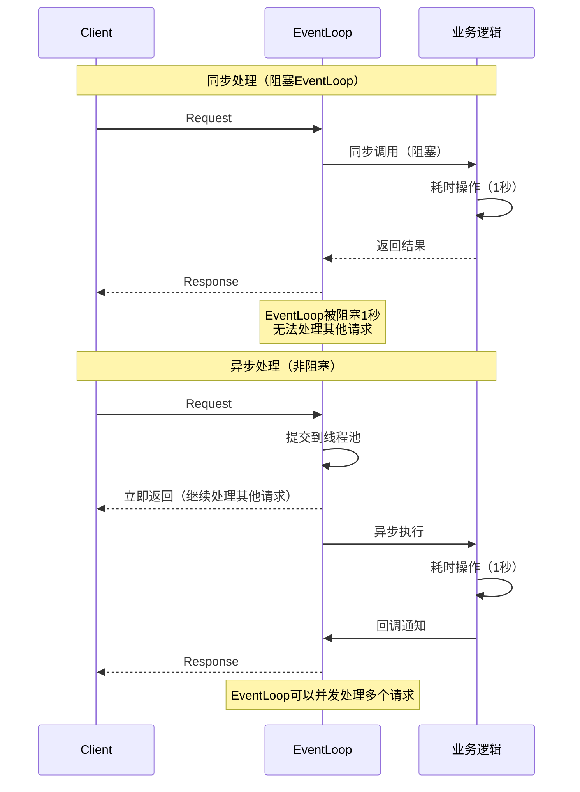
```mermaid
sequenceDiagram
    participant Client
    participant EventLoop
    participant Business as 业务逻辑
    
    Note over Client,Business: 同步处理（阻塞EventLoop）
    Client->>EventLoop: Request
    EventLoop->>Business: 同步调用（阻塞）
    Business->>Business: 耗时操作（1秒）
    Business-->>EventLoop: 返回结果
    EventLoop-->>Client: Response
    Note over EventLoop: EventLoop被阻塞1秒<br/>无法处理其他请求
    
    Note over Client,Business: 异步处理（非阻塞）
    Client->>EventLoop: Request
    EventLoop->>EventLoop: 提交到线程池
    EventLoop-->>Client: 立即返回（继续处理其他请求）
    EventLoop->>Business: 异步执行
    Business->>Business: 耗时操作（1秒）
    Business->>EventLoop: 回调通知
    EventLoop-->>Client: Response
    Note over EventLoop: EventLoop可以并发处理多个请求
```

## 七、RPC 相比 HTTP 的完整优势总结

### 7.1 性能优势对比表

| 对比维度 | HTTP/1.1 | HTTP/2 | RPC (Netty) | RPC优势说明 |
|---------|----------|--------|-------------|------------|
| **连接管理** | 短连接/Keep-Alive | 多路复用 | 长连接复用 | 无需频繁建立连接 |
| **并发请求** | 1个/连接（串行） | 多个/连接 | 多个/连接 | 支持真正的并发 |
| **双工通信** | 半双工 | 半双工 | 全双工 | 服务端可主动推送 |
| **协议开销** | 200-500字节Header | 压缩Header | ~160字节 | 协议更轻量 |
| **序列化** | JSON（文本） | JSON（文本） | JSON（可扩展） | 可替换为更高效的序列化 |
| **延迟** | 较高（连接建立） | 中等 | 极低（连接复用） | 长连接零延迟 |
| **吞吐量** | 较低 | 中等 | 极高 | 高并发场景优势明显 |

### 7.2 适用场景对比

#### 7.2.1 HTTP 适用场景

**适合使用 HTTP 的场景：**

1. **跨语言、跨平台调用**
   - Web 服务 API（RESTful API）
   - 前后端分离架构
   - 第三方系统集成
   - 移动端、浏览器调用

2. **公开 API 服务**
   - 需要标准化的接口规范
   - 需要 HTTP 标准状态码
   - 需要缓存、代理等 HTTP 基础设施

3. **低并发、请求频率不高的场景**
   - 管理系统后台接口
   - 报表查询接口
   - 配置管理接口

4. **需要 HTTPS 加密的场景**
   - 公网 API 服务
   - 需要 TLS/SSL 加密传输

#### 7.2.2 RPC 适用场景

**适合使用 RPC 的场景（如 DolphinScheduler）：**

1. **服务间内部调用**
   - 微服务架构中的服务通信
   - 同一系统内模块间调用
   - Master-Worker 通信
   - 集群节点间通信

2. **高并发、高性能要求**
   - 需要处理大量并发请求
   - 需要低延迟响应
   - 需要高吞吐量

3. **长连接、频繁通信**
   - 需要保持长连接
   - 需要双向通信（服务端主动推送）
   - 需要心跳保活机制

4. **内部系统通信**
   - 不需要跨网络边界
   - 可以控制客户端和服务端实现
   - 可以使用自定义协议

**DolphinScheduler 使用 RPC 的原因：**

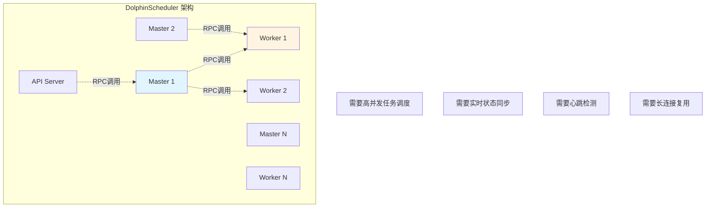
```mermaid
graph TB
    subgraph "DolphinScheduler 架构"
        M1[Master 1]
        M2[Master 2]
        MN[Master N]
        W1[Worker 1]
        W2[Worker 2]
        WN[Worker N]
        API[API Server]
    end
    
    M1 -.->|RPC调用| W1
    M1 -.->|RPC调用| W2
    M2 -.->|RPC调用| W1
    API -.->|RPC调用| M1
    
    Note1[需要高并发任务调度]
    Note2[需要实时状态同步]
    Note3[需要心跳检测]
    Note4[需要长连接复用]
    
    style M1 fill:#e1f5ff
    style W1 fill:#fff4e1
```

1. **高并发任务调度**：Master 需要向多个 Worker 同时下发任务
2. **实时状态同步**：Worker 需要实时上报任务执行状态
3. **心跳检测**：需要保持连接活跃，及时感知节点故障
4. **资源复用**：避免频繁建立连接的开销

### 7.3 技术选型建议

```mermaid
graph TB
    Start{需要选择通信协议?}
    
    Start -->|公开API/跨语言| HTTP[使用 HTTP/REST]
    Start -->|内部服务/高性能| RPC{选择 RPC 框架}
    
    RPC -->|Java生态| Netty[基于 Netty 的 RPC]
    RPC -->|微服务框架| SpringCloud[Dubbo/Spring Cloud]
    RPC -->|跨语言| gRPC[gRPC/Thrift]
    
    HTTP --> HTTP1[HTTP/1.1<br/>简单场景]
    HTTP --> HTTP2[HTTP/2<br/>需要多路复用]
    
    style HTTP fill:#e1f5ff
    style Netty fill:#fff4e1
    style gRPC fill:#e8f5e9
```

**选型决策表：**

| 场景特征 | 推荐方案 | 理由 |
|---------|---------|------|
| 内部服务间调用 | RPC (Netty) | 高性能、低延迟、长连接 |
| 公开 API 接口 | HTTP/REST | 标准化、跨平台、易调试 |
| 微服务架构 | RPC (Dubbo/gRPC) | 服务治理、负载均衡 |
| 高并发场景 | RPC (Netty) | 连接复用、异步非阻塞 |
| 跨语言调用 | HTTP/gRPC | 语言无关、标准协议 |
| 需要浏览器调用 | HTTP | 浏览器限制、HTTP 标准 |

## 八、总结

### 8.1 RPC 服务注册流程总结

**完整流程：**

1. **初始化阶段**
   - `MasterRpcServer` 继承 `SpringServerMethodInvokerDiscovery`
   - 通过构造函数配置 Netty 服务器参数
   - 创建 `NettyRemotingServer` 实例

2. **服务注册阶段**
   - `start()` 方法触发服务注册
   - `scanAndRegisterExistingRpcServices()` 扫描已初始化的 RPC 服务 Bean
   - `BeanPostProcessor` 机制动态注册后续初始化的 Bean
   - 方法调用器注册到 `methodInvokerMap`

3. **Netty 启动阶段**
   - 创建 `BossGroup` 和 `WorkerGroup` 线程组
   - 配置 Channel Pipeline（编码器、解码器、Handler）
   - 绑定监听端口，启动服务器

4. **请求处理阶段**
   - 客户端连接，创建 Channel
   - 接收请求，解码为 `Transporter` 对象
   - 路由到对应的 `ServerMethodInvoker`
   - 异步执行业务方法
   - 编码响应，通过同一 Channel 返回

### 8.2 Netty 核心技术要点

**1. 多路复用（I/O Multiplexing）**
- ✅ 一个 EventLoop 管理多个 Channel
- ✅ 使用 Selector（NIO）或 Epoll（Linux）实现事件驱动
- ✅ 资源利用率高，支持大量并发连接

**2. 双工通信（Full-Duplex）**
- ✅ TCP 全双工特性：同一连接双向数据传输
- ✅ Pipeline 双向处理：Inbound 和 Outbound 分离
- ✅ 请求-响应在同一 Channel 中完成

**3. 异步非阻塞**
- ✅ EventLoop 线程负责 I/O 操作
- ✅ 业务逻辑在独立线程池执行
- ✅ 避免阻塞，提高并发性能

**4. 线程模型**
- ✅ BossGroup：1 个线程，负责接收连接
- ✅ WorkerGroup：N 个线程，负责 I/O 处理
- ✅ MethodInvokerExecutor：业务线程池，执行具体逻辑

### 8.3 RPC 相比 HTTP 的核心优势

| 优势维度 | 具体表现 | 应用价值 |
|---------|---------|---------|
| **性能** | 长连接复用、协议开销小 | 高并发场景性能提升 10-100 倍 |
| **功能** | 全双工通信、双向数据传输 | 支持服务端主动推送、实时通信 |
| **架构** | 连接池管理、心跳保活 | 适合内部服务间通信 |
| **扩展** | 可自定义序列化、协议 | 灵活优化，满足特定需求 |

### 8.4 关键代码位置

**RPC 服务注册相关代码：**

```
dolphinscheduler-master/src/main/java/org/apache/dolphinscheduler/server/master/
├── MasterServer.java                          # 入口：masterRPCServer.start()
└── rpc/
    └── MasterRpcServer.java                   # Master RPC 服务器

dolphinscheduler-extract/dolphinscheduler-extract-base/src/main/java/org/apache/dolphinscheduler/extract/base/
├── server/
│   ├── SpringServerMethodInvokerDiscovery.java  # Spring Bean 自动发现
│   ├── RpcServer.java                           # RPC 服务器基类
│   ├── NettyRemotingServer.java                 # Netty 服务器实现
│   ├── JdkDynamicServerHandler.java             # 请求处理器
│   ├── ServerMethodInvokerImpl.java             # 方法调用器实现
│   ├── TransporterEncoder.java                  # 编码器
│   └── TransporterDecoder.java                  # 解码器
└── config/
    └── NettyServerConfig.java                   # Netty 服务器配置
```

### 8.5 学习要点

1. **理解 Netty 的多路复用机制**
   - EventLoop 和 Selector 的关系
   - 一个线程如何管理多个 Channel

2. **理解双工通信的本质**
   - TCP 全双工特性
   - Pipeline 的双向处理
   - 请求-响应的关联机制

3. **理解异步非阻塞模型**
   - EventLoop 线程的职责
   - 业务线程池的作用
   - 为什么不能阻塞 EventLoop

4. **理解 RPC 与 HTTP 的差异**
   - 协议开销对比
   - 连接管理差异
   - 适用场景选择

通过深入分析 DolphinScheduler 的 RPC 服务注册流程，我们可以更好地理解基于 Netty 的高性能 RPC 框架的设计原理和实现细节，为构建高性能分布式系统提供参考。