# 全局Master故障事件详细分析

## 1. 概述

`GlobalMasterFailoverEvent`（全局Master故障转移事件）是DolphinScheduler Master服务器启动时触发的系统级事件，用于扫描整个系统中所有需要故障转移的工作流并执行转移操作。

### 1.1 触发时机

该事件在`MasterServer.initialized()`方法中发布，具体位置：

```197:198:dolphinscheduler-master/src/main/java/org/apache/dolphinscheduler/server/master/MasterServer.java
this.systemEventBus.publish(GlobalMasterFailoverEvent.of(new Date(startupTime)));
this.systemEventBusFireWorker.start();
```

**触发条件**：
- Master服务器启动完成，所有核心组件已初始化
- `systemEventBusFireWorker`尚未启动（事件发布后才启动）

### 1.2 设计目的

1. **系统恢复**：Master服务器启动时，需要扫描数据库中所有未完成的工作流，判断它们是否需要故障转移
2. **数据一致性**：确保因Master故障而遗留的工作流能够被重新分配和执行
3. **集群协调**：在分布式环境下，确保每个Master都能处理需要转移的工作流

### 1.3 与其他故障转移事件的区别

| 特性 | GlobalMasterFailoverEvent | MasterFailoverEvent | WorkerFailoverEvent |
|------|--------------------------|---------------------|---------------------|
| **触发时机** | Master启动时 | 检测到特定Master故障时 | 检测到特定Worker故障时 |
| **扫描范围** | 整个系统 | 特定Master的工作流 | 特定Worker的任务 |
| **延迟时间** | 0毫秒（立即执行） | 可配置延迟 | 可配置延迟 |
| **执行频率** | 每个Master启动时执行一次 | 每次Master故障时执行 | 每次Worker故障时执行 |
| **Handler** | GlobalMasterFailoverEventHandler | MasterFailoverEventHandler | WorkerFailoverEventHandler |

## 2. 事件类结构

### 2.1 类继承关系

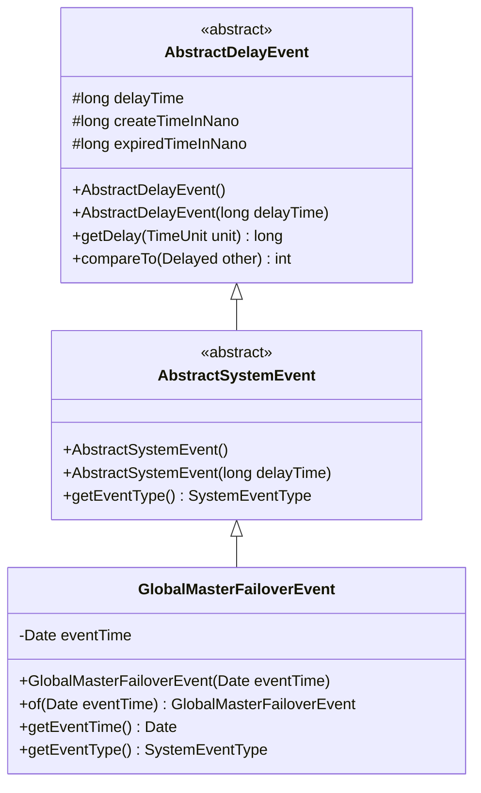

### 2.2 事件类实现

```java
@Getter
public class GlobalMasterFailoverEvent extends AbstractSystemEvent {
    private final Date eventTime;
    
    public GlobalMasterFailoverEvent(Date eventTime) {
        super();  // 调用AbstractSystemEvent()，延迟时间为0
        this.eventTime = eventTime;
    }
    
    public static GlobalMasterFailoverEvent of(final Date eventTime) {
        checkNotNull(eventTime);
        return new GlobalMasterFailoverEvent(eventTime);
    }
    
    @Override
    public SystemEventType getEventType() {
        return SystemEventType.GLOBAL_MASTER_FAILOVER;
    }
}
```

**关键特性**：
- **延迟时间**：调用`super()`，使用默认延迟时间0毫秒，意味着事件创建后立即到期
- **事件时间**：记录Master服务器的启动时间，用于确定故障转移截止时间
- **事件类型**：`SystemEventType.GLOBAL_MASTER_FAILOVER`

### 2.3 延迟时间计算机制

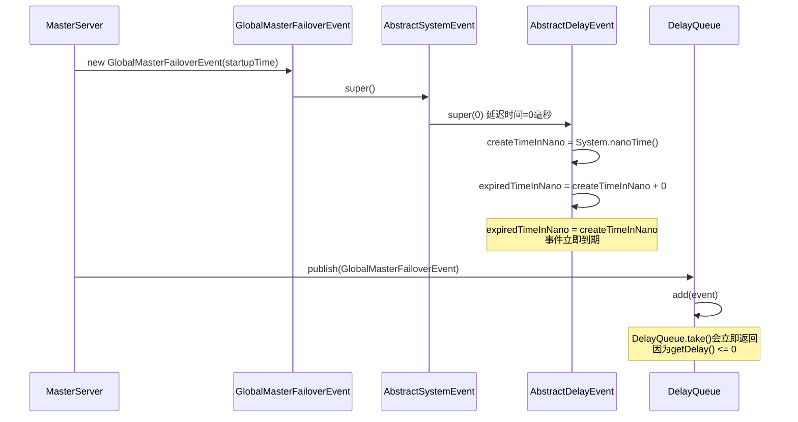

**延迟机制说明**：
- `AbstractDelayEvent`使用纳秒精度的时间计算
- `expiredTimeInNano = createTimeInNano + delayTime * 1_000_000`
- `GlobalMasterFailoverEvent`延迟时间为0，因此`expiredTimeInNano = createTimeInNano`
- `DelayQueue.take()`调用`getDelay()`方法，返回值为0或负数时立即返回事件

## 3. 事件处理流程

### 3.1 完整时序图

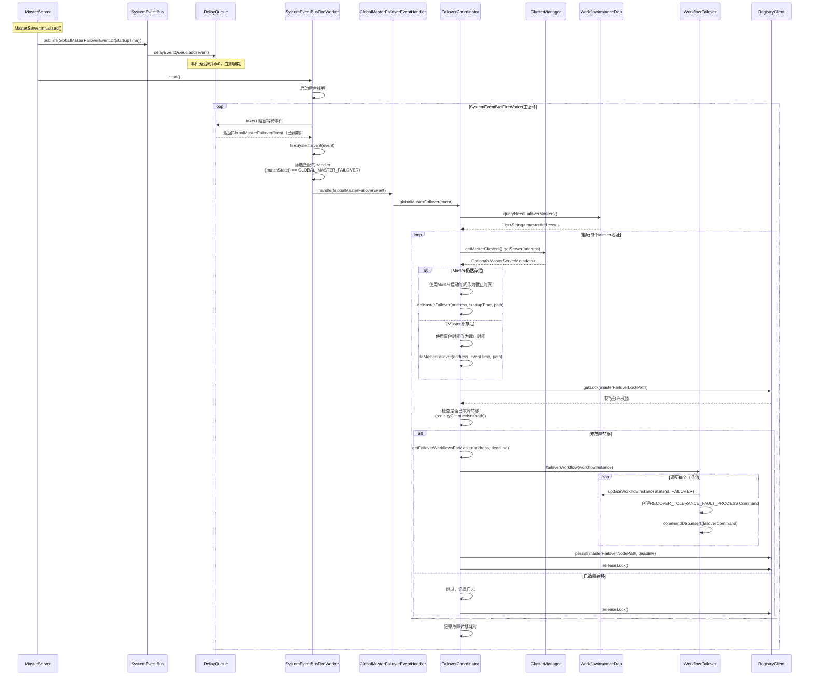

### 3.2 事件发布流程

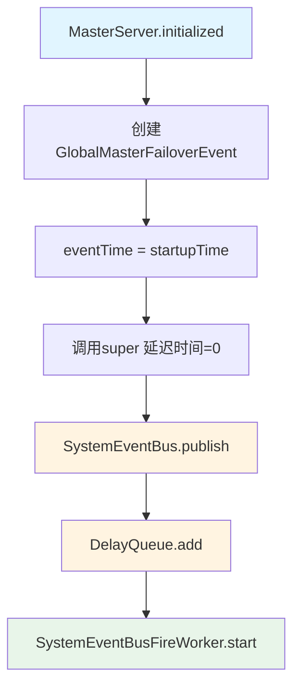

### 3.3 事件处理流程

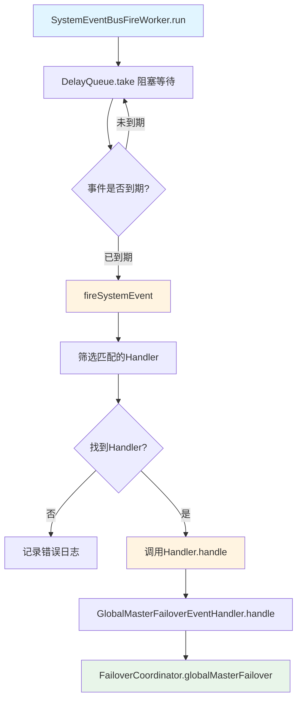

## 4. Handler实现

### 4.1 Handler类结构

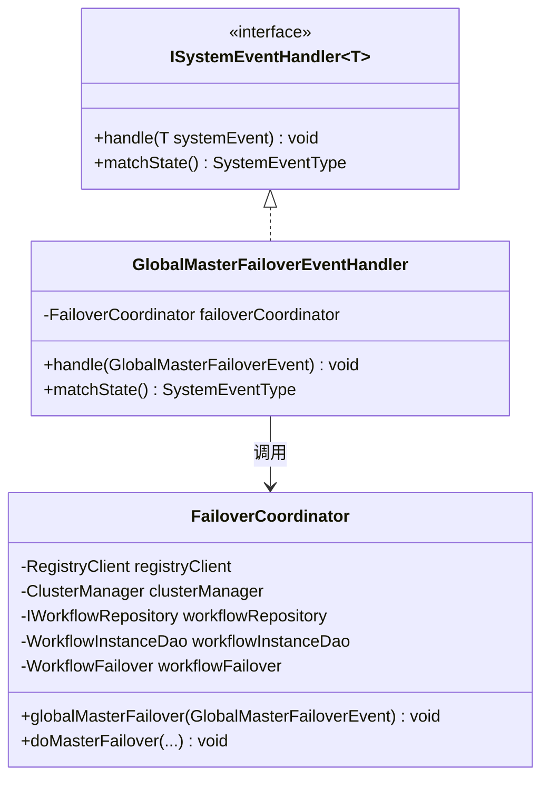

### 4.2 Handler实现代码

```java
@Slf4j
@Component
public class GlobalMasterFailoverEventHandler implements ISystemEventHandler<GlobalMasterFailoverEvent> {
    
    @Autowired
    private FailoverCoordinator failoverCoordinator;
    
    @Override
    public void handle(final GlobalMasterFailoverEvent systemEvent) {
        failoverCoordinator.globalMasterFailover(systemEvent);
    }
    
    @Override
    public SystemEventType matchState() {
        return SystemEventType.GLOBAL_MASTER_FAILOVER;
    }
}
```

**设计模式**：
- **策略模式**：`ISystemEventHandler`接口定义事件处理策略，不同Handler实现不同的事件处理逻辑
- **委托模式**：Handler将具体处理逻辑委托给`FailoverCoordinator`

### 4.3 Handler匹配机制

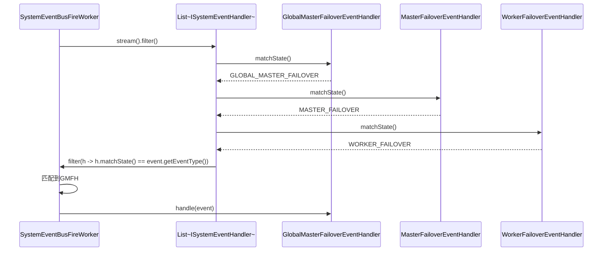

**匹配逻辑**：
1. `SystemEventBusFireWorker`维护所有`ISystemEventHandler`实现类的列表（Spring自动注入）
2. 处理事件时，通过`matchState()`方法筛选出匹配的Handler
3. 一个事件类型可以对应多个Handler，它们都会被调用
4. `GlobalMasterFailoverEvent`只匹配`GlobalMasterFailoverEventHandler`

## 5. 故障转移逻辑详解

### 5.1 全局故障转移流程

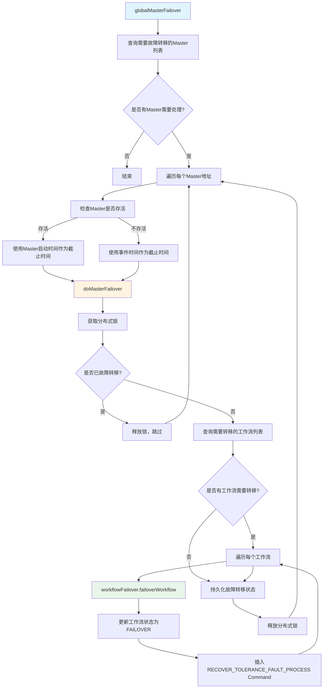

### 5.2 核心方法：globalMasterFailover

```java
@Override
public void globalMasterFailover(final GlobalMasterFailoverEvent globalMasterFailoverEvent) {
    final StopWatch failoverTimeCost = StopWatch.createStarted();
    log.info("Global master failover starting");
    
    // 1. 查询数据库中所有包含未完成工作流的Master地址列表
    final List<String> masterAddressWhichContainsUnFinishedWorkflow =
            workflowInstanceDao.queryNeedFailoverMasters();
    
    // 2. 遍历每个需要故障转移的Master地址
    for (final String masterAddress : masterAddressWhichContainsUnFinishedWorkflow) {
        // 3. 检查该Master是否仍然存活
        final Optional<MasterServerMetadata> aliveMasterOptional =
                clusterManager.getMasterClusters().getServer(masterAddress);
        
        if (aliveMasterOptional.isPresent()) {
            // 4a. Master存活：使用Master启动时间作为截止时间
            final MasterServerMetadata aliveMasterServerMetadata = aliveMasterOptional.get();
            log.info("The master[{}] is alive, do global master failover on it", 
                    aliveMasterServerMetadata);
            doMasterFailover(
                    masterAddress,
                    aliveMasterServerMetadata.getServerStartupTime(),
                    RegistryUtils.getFailoveredNodePathWhichStartupTimeIsUnknown(masterAddress));
        } else {
            // 4b. Master不存活：使用事件时间作为截止时间
            log.info("The master[{}] is not alive, do global master failover on it", masterAddress);
            doMasterFailover(
                    masterAddress,
                    globalMasterFailoverEvent.getEventTime().getTime(),
                    RegistryUtils.getFailoveredNodePathWhichStartupTimeIsUnknown(masterAddress));
        }
    }
    
    failoverTimeCost.stop();
    log.info("Global master failover finished, cost: {}/ms", failoverTimeCost.getTime());
}
```

**关键设计点**：

1. **Master存活检查**：
    - 如果Master重新连接到了注册中心，说明是临时故障（网络抖动）
    - 使用Master的启动时间作为截止时间，避免转移重新启动后新启动的工作流

2. **截止时间选择**：
    - **Master存活**：使用`aliveMasterServerMetadata.getServerStartupTime()`
    - **Master不存活**：使用`globalMasterFailoverEvent.getEventTime().getTime()`

3. **路径选择**：
    - 使用`getFailoveredNodePathWhichStartupTimeIsUnknown`，因为全局故障转移时可能不知道Master的确切启动时间

### 5.3 执行Master故障转移：doMasterFailover

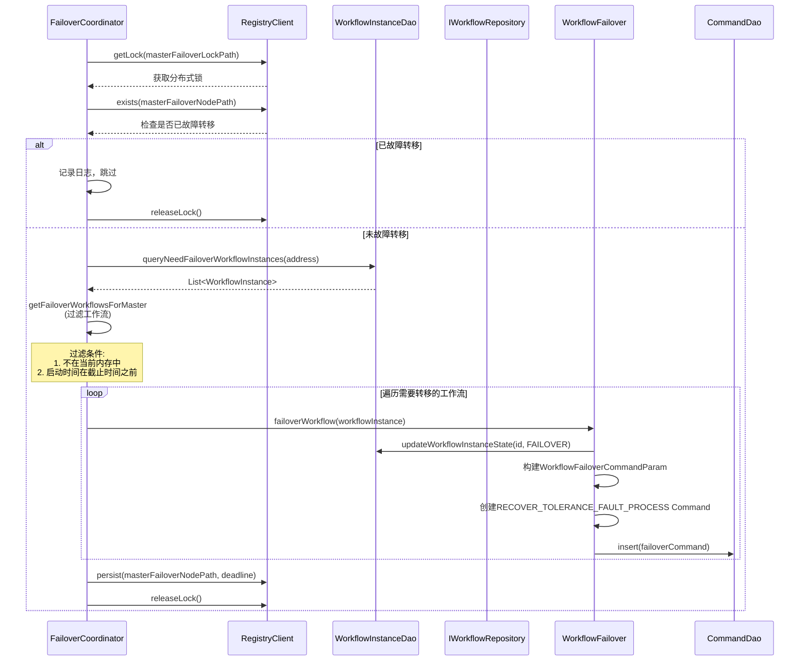

**分布式锁机制**：
- 使用注册中心的分布式锁避免多个Master同时执行故障转移
- 锁路径：`RegistryUtils.getMasterFailoverLockPath(masterAddress)`
- 确保同一时间只有一个Master在处理某个Master的故障转移

**重复转移检查**：
- 检查注册中心节点`masterFailoverNodePath`是否存在
- 如果存在且存储的截止时间相同，说明已经转移过，跳过本次转移
- 节点路径：`/dolphinscheduler/nodes/failover/master/{address}`（启动时间未知的情况）

### 5.4 获取需要故障转移的工作流

```java
private List<WorkflowInstance> getFailoverWorkflowsForMaster(
        final String masterAddress, 
        final Date masterCrashTime) {
    // 1. 查询数据库中该Master负责的所有需要故障转移的工作流实例
    final List<WorkflowInstance> workflowInstances =
            workflowInstanceDao.queryNeedFailoverWorkflowInstances(masterAddress);
    
    return workflowInstances.stream()
            .filter(workflowInstance -> {
                // 2. 如果工作流已经在当前内存中运行，说明已经被当前Master接管，不需要转移
                if (workflowRepository.contains(workflowInstance.getId())) {
                    return false;
                }
                
                // 3. 检查工作流的重启时间（如果存在）
                final Date restartTime = workflowInstance.getRestartTime();
                if (restartTime != null) {
                    // 如果重启时间在Master崩溃时间之前，需要转移
                    return restartTime.before(masterCrashTime);
                }
                
                // 4. 如果没有重启时间，检查启动时间
                final Date startTime = workflowInstance.getStartTime();
                return startTime.before(masterCrashTime);
            })
            .collect(Collectors.toList());
}
```

**筛选条件说明**：

1. **内存检查**：
    - `workflowRepository.contains(workflowInstance.getId())`检查工作流是否在当前Master的内存中
    - 如果已经在内存中，说明当前Master已经接管了该工作流，不需要转移

2. **时间判断**：
    - 优先检查`restartTime`（重启时间）
    - 如果`restartTime`在`masterCrashTime`之前，需要转移
    - 如果没有`restartTime`，检查`startTime`（启动时间）
    - 如果`startTime`在`masterCrashTime`之前，需要转移

**同步机制说明**（代码注释中的关键点）：

工作流故障转移后的恢复机制保证了在分布式环境下不会重复处理同一个工作流：

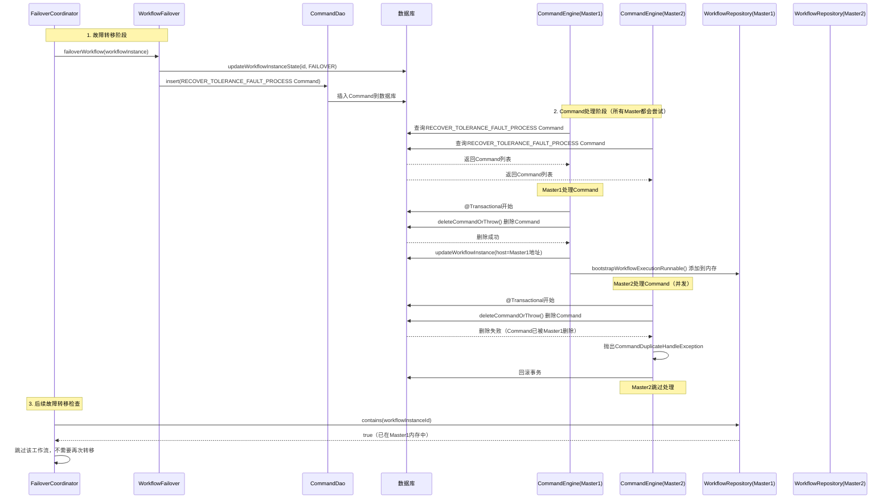

**关键点说明**：

1. **Command唯一性保证**：
   - 使用`@Transactional`注解保证原子性
   - `deleteCommandOrThrow()`方法先删除Command，如果删除失败（说明其他Master已经删除），抛出异常
   - 这确保了每个Command只会被一个Master处理

2. **内存检查机制**：
   - `workflowRepository.contains()`检查的是当前Master的内存
   - 如果工作流已在内存中，说明当前Master已经接管，不需要转移
   - 只检查内存而不检查数据库host，因为Command处理是异步的，可能存在时间差

3. **避免重复转移**：
   - 即使多个Master同时执行全局故障转移，也不会重复插入Command
   - 每个Master都会检查内存，只有不在内存中的工作流才会被转移

### 5.5 工作流故障转移：WorkflowFailover

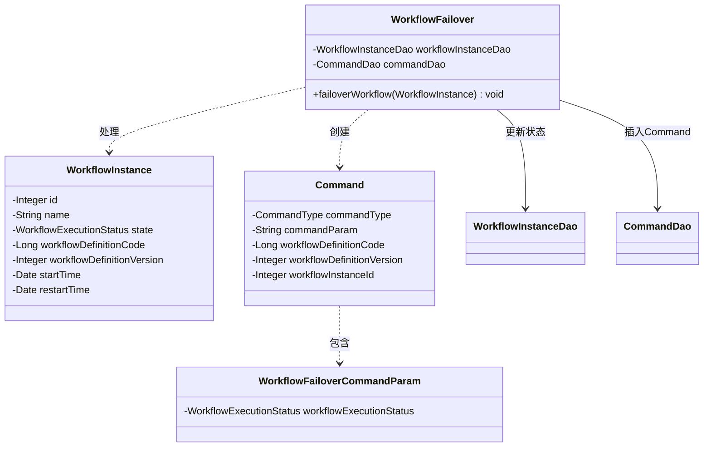

**实现细节**：

```java
@Transactional
public void failoverWorkflow(final WorkflowInstance workflowInstance) {
    // 1. 更新工作流状态为FAILOVER
    workflowInstanceDao.updateWorkflowInstanceState(
            workflowInstance.getId(),
            workflowInstance.getState(),  // 原始状态
            WorkflowExecutionStatus.FAILOVER);
    
    // 2. 构建故障转移Command参数
    final WorkflowFailoverCommandParam failoverWorkflowCommandParam = 
            WorkflowFailoverCommandParam.builder()
                    .workflowExecutionStatus(workflowInstance.getState())  // 保存原始状态
                    .build();
    
    // 3. 创建RECOVER_TOLERANCE_FAULT_PROCESS类型的Command
    final Command failoverCommand = Command.builder()
            .commandParam(JSONUtils.toJsonString(failoverWorkflowCommandParam))
            .commandType(CommandType.RECOVER_TOLERANCE_FAULT_PROCESS)
            .workflowDefinitionCode(workflowInstance.getWorkflowDefinitionCode())
            .workflowDefinitionVersion(workflowInstance.getWorkflowDefinitionVersion())
            .workflowInstanceId(workflowInstance.getId())
            .build();
    
    // 4. 插入Command到数据库
    commandDao.insert(failoverCommand);
}
```

**关键设计点**：

1. **事务保证**：
   - 使用`@Transactional`确保状态更新和Command插入的原子性
   - 如果插入失败，状态更新会回滚

2. **状态保存**：
   - 工作流状态先更新为`FAILOVER`
   - 原始状态保存在`WorkflowFailoverCommandParam`中
   - 后续恢复时，`WorkflowFailoverCommandHandler`会使用原始状态恢复工作流

3. **Command类型**：
   - `RECOVER_TOLERANCE_FAULT_PROCESS`：容错恢复类型
   - 所有Master的`CommandEngine`都会尝试处理这个Command
   - 通过数据库删除操作保证只有一个Master能成功处理

### 5.6 查询需要故障转移的Master列表

```java
@Override
public List<String> queryNeedFailoverMasters() {
    return mybatisMapper.queryNeedFailoverWorkflowInstanceHost(
            WorkflowExecutionStatus.getNeedFailoverWorkflowInstanceState());
}
```

**SQL实现**：

```sql
<select id="queryNeedFailoverWorkflowInstanceHost" resultType="String">
    select distinct host
    from t_ds_workflow_instance
    <if test="states != null and states.length != 0">
        where state in
        <foreach collection="states" item="i" open="(" close=")" separator=",">
            #{i}
        </foreach>
    </if>
</select>
```

**查询逻辑**：
- 查询所有包含需要故障转移状态的工作流的Master地址
- `getNeedFailoverWorkflowInstanceState()`返回的状态包括：`SUBMITTED_SUCCESS`, `RUNNING_EXECUTION`, `DELAY_EXECUTION`, `READY_PAUSE`, `READY_STOP`, `NEED_FAULT_TOLERANCE`, `WAIT_THREAD`, `WAIT_DEPEND`, `WAIT_EXECUTION`
- 使用`distinct`去重，避免重复的Master地址

## 6. 组件架构图

### 6.1 完整组件关系图

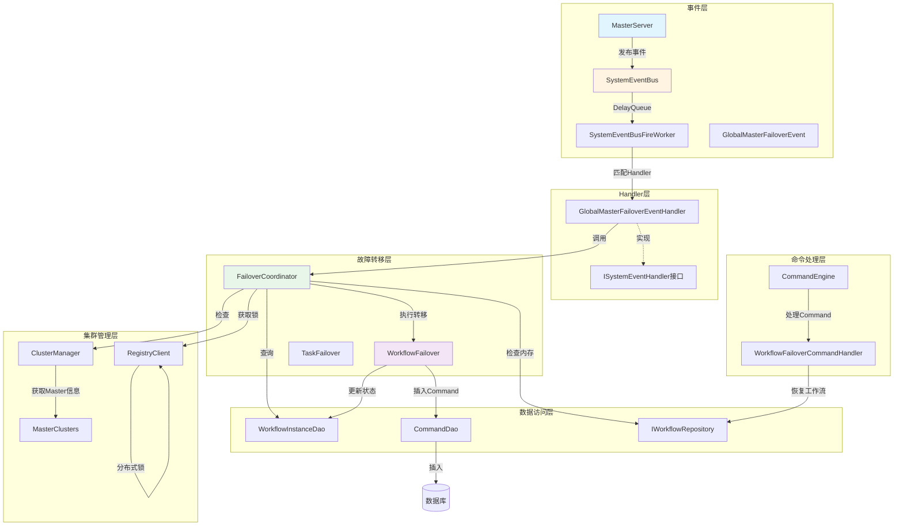

### 6.2 数据流图

```mermaid
flowchart LR
    A[Master启动] --> B[发布GlobalMasterFailoverEvent]
    B --> C[SystemEventBusFireWorker处理]
    C --> D[GlobalMasterFailoverEventHandler]
    D --> E[FailoverCoordinator.globalMasterFailover]
    
    E --> F[查询需要故障转移的Master列表]
    F --> G[检查Master是否存活]
    
    G -->|存活| H[使用Master启动时间作为截止时间]
    G -->|不存活| I[使用事件时间作为截止时间]
    
    H --> J[doMasterFailover]
    I --> J
    
    J --> K[获取分布式锁]
    K --> L[查询需要转移的工作流]
    L --> M[过滤工作流]
    M --> N[WorkflowFailover.failoverWorkflow]
    
    N --> O[更新工作流状态为FAILOVER]
    N --> P[插入RECOVER_TOLERANCE_FAULT_PROCESS Command]
    
    P --> Q[CommandEngine处理Command]
    Q --> R[WorkflowFailoverCommandHandler]
    R --> S[恢复工作流到原始状态]
    S --> T[工作流继续执行]
    
    style A fill:#e1f5ff
    style E fill:#e8f5e9
    style N fill:#fff4e1
    style Q fill:#f3e5f5
```

## 7. 关键设计要点总结

### 7.1 设计模式

1. **观察者模式**：
   - `SystemEventBus`作为事件总线，`SystemEventBusFireWorker`作为观察者
   - `GlobalMasterFailoverEventHandler`作为事件处理器

2. **策略模式**：
   - `ISystemEventHandler`接口定义事件处理策略
   - 不同的事件类型对应不同的Handler实现

3. **模板方法模式**：
   - `AbstractSystemEvent`定义事件的基本结构
   - `GlobalMasterFailoverEvent`实现具体的事件类型

4. **委托模式**：
   - `GlobalMasterFailoverEventHandler`将处理逻辑委托给`FailoverCoordinator`

### 7.2 并发控制

1. **分布式锁**：
   - 使用注册中心的分布式锁避免多个Master同时执行故障转移
   - 锁路径：`/dolphinscheduler/nodes/failover/lock/master/{address}`

2. **Command唯一性**：
   - 使用数据库删除操作保证Command只会被一个Master处理
   - `@Transactional`保证原子性

3. **内存检查**：
   - 检查工作流是否已在内存中，避免重复转移
   - 不依赖数据库host字段，因为存在时间差

### 7.3 容错机制

1. **Master存活检查**：
   - 检查Master是否重新连接，区分临时故障和永久故障
   - 根据Master状态选择不同的截止时间

2. **重复转移检查**：
   - 检查注册中心节点，避免重复故障转移
   - 记录故障转移状态和截止时间

3. **时间判断**：
   - 使用截止时间确保只转移在故障时间之前启动的工作流
   - 支持重启时间（restartTime）和启动时间（startTime）两种判断方式

### 7.4 性能优化

1. **延迟队列**：
   - 使用`DelayQueue`实现延迟事件处理
   - `GlobalMasterFailoverEvent`延迟时间为0，立即处理

2. **批量处理**：
   - 一次查询所有需要故障转移的Master地址
   - 批量处理工作流故障转移

3. **异步处理**：
   - `SystemEventBusFireWorker`在后台线程中处理事件
   - 不阻塞Master启动流程

## 8. 故障转移后的恢复流程

### 8.1 Command处理流程

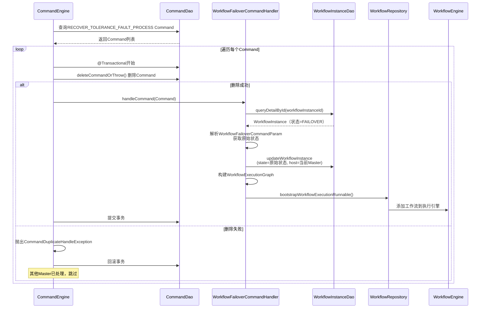

### 8.2 工作流恢复状态

- **状态恢复**：从`FAILOVER`恢复到原始状态（如`RUNNING_EXECUTION`）
- **Host更新**：更新为处理Command的Master地址
- **图重建**：重新构建`WorkflowExecutionGraph`，恢复工作流执行图
- **继续执行**：工作流恢复到故障前的状态，继续执行

## 9. 总结

`GlobalMasterFailoverEvent`是DolphinScheduler Master服务器启动时的关键事件，它确保了系统在启动时能够扫描并恢复所有需要故障转移的工作流。通过事件驱动、分布式锁、Command机制等多重保障，实现了可靠的分布式故障转移和恢复能力。

**核心价值**：
1. **系统可靠性**：确保Master故障后工作流能够被恢复
2. **数据一致性**：通过多重检查机制避免重复处理
3. **分布式协调**：通过分布式锁和Command机制实现多Master协调
4. **性能优化**：异步处理，不阻塞启动流程