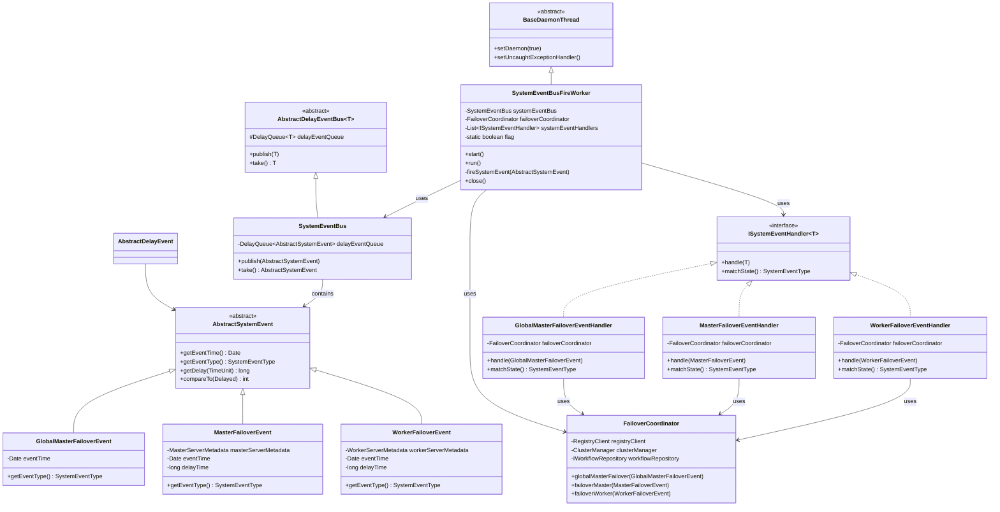
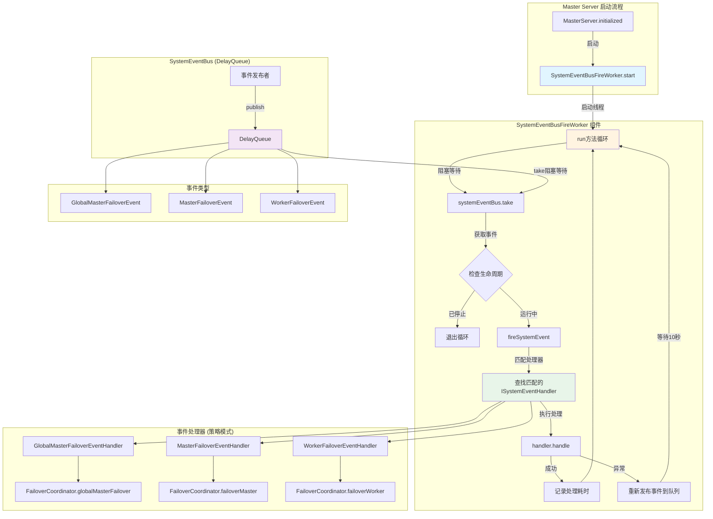
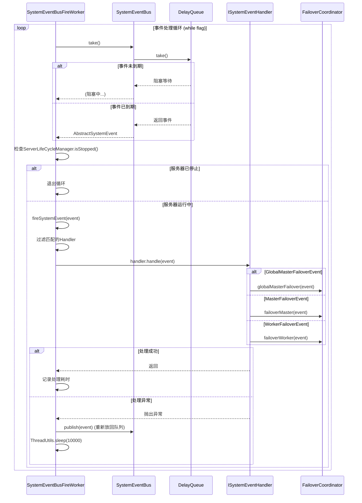
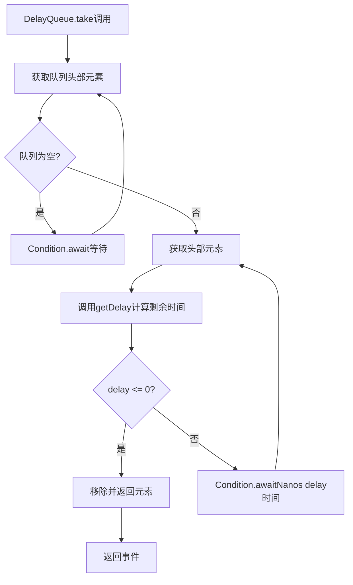
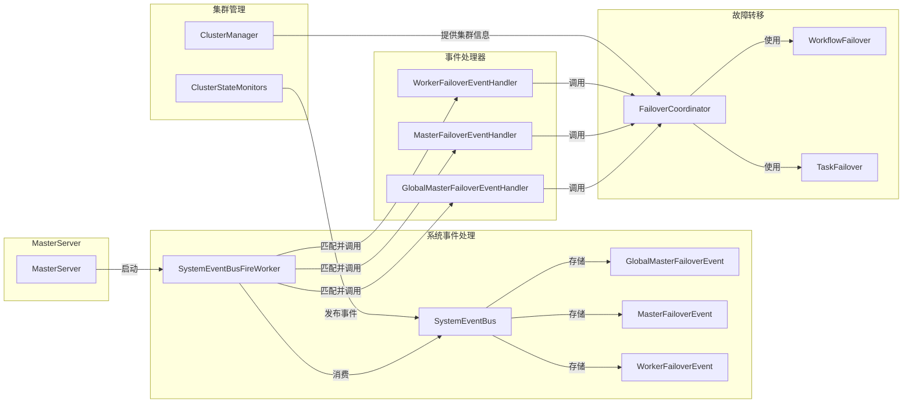
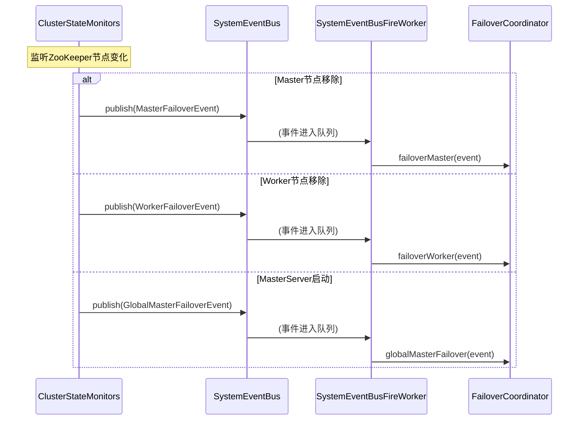

# 系统事件总线触发工作者（SystemEventBusFireWorker）详细分析

## 1. 概述

`SystemEventBusFireWorker` 是 DolphinScheduler Master 服务器中负责处理系统级事件的核心组件。它是一个单线程守护线程，持续从系统事件总线（SystemEventBus）中取出延迟事件，并根据事件类型触发相应的事件处理器进行处理。

### 1.1 主要职责

- **事件消费**：从 `SystemEventBus` 的 `DelayQueue` 中阻塞等待并取出已到期的系统事件
- **事件分发**：根据事件类型匹配对应的处理器（使用策略模式）
- **异常处理**：处理事件处理过程中的异常，确保事件不丢失
- **生命周期管理**：响应服务器停止信号，优雅退出

### 1.2 核心特性

- **延迟事件支持**：基于 `DelayQueue` 实现延迟事件处理，支持延迟触发
- **单线程处理**：使用单线程循环处理，确保事件处理的有序性
- **守护线程**：继承 `BaseDaemonThread`，设置为守护线程，确保 JVM 关闭时能够正常退出
- **事件重试机制**：处理异常时重新将事件放回队列，实现重试
- **策略模式**：通过事件类型匹配处理器，支持一个事件对应多个处理器

## 2. 类图结构



## 3. 架构组件图



## 4. 工作原理详解

### 4.1 启动流程

```java
@Override
public void start() {
    flag = true;  // 设置运行标志
    super.start(); // 启动线程（BaseDaemonThread.start()）
    log.info("SystemEventBusFireWorker started");
}
```

启动过程：
1. 设置静态标志位 `flag = true`，控制线程循环
2. 调用父类 `BaseDaemonThread.start()` 启动线程
3. 线程启动后，`run()` 方法被调用，进入事件处理循环

### 4.2 主循环（run方法）



### 4.3 DelayQueue 工作原理

`SystemEventBus` 内部使用 `DelayQueue<AbstractSystemEvent>` 存储事件，`DelayQueue` 是基于 `PriorityQueue` 实现的延迟队列。

#### 4.3.1 事件延迟机制

```java
// AbstractDelayEvent.getDelay() 方法
public long getDelay(TimeUnit unit) {
    // 计算剩余延迟时间 = 过期时间 - 当前时间
    long delay = createTimeInNano + delayTime * 1_000_000 - System.nanoTime();
    return unit.convert(delay, TimeUnit.NANOSECONDS);
}
```

**延迟计算逻辑：**
- `createTimeInNano`：事件创建时间（纳秒）
- `delayTime`：延迟时间（毫秒），需要转换为纳秒（×1,000,000）
- `expiredTimeInNano = createTimeInNano + delayTime * 1_000_000`
- `getDelay() = expiredTimeInNano - System.nanoTime()`
    - 返回值 > 0：事件未到期，需要继续等待
    - 返回值 ≤ 0：事件已到期，可以取出处理

#### 4.3.2 DelayQueue.take() 工作流程



**关键点：**
1. `DelayQueue` 内部使用 `PriorityQueue` 按 `expiredTimeInNano` 升序排序
2. `take()` 方法会阻塞直到有事件到期
3. 每次只返回队列头部最早到期的一个事件
4. 如果多个事件同时到期，按过期时间顺序依次取出（单线程处理，不会丢失）

### 4.4 事件处理流程（fireSystemEvent方法）

```java
private void fireSystemEvent(final AbstractSystemEvent systemEvent) {
    final StopWatch stopWatch = StopWatch.createStarted();
    
    // 1. 从所有注册的事件处理器中筛选出与当前事件类型匹配的处理器
    final List<ISystemEventHandler> matchedSystemEventHandlers = systemEventHandlers
            .stream()
            .filter(systemEventHandler -> systemEventHandler.matchState() == systemEvent.getEventType())
            .collect(Collectors.toList());
    
    // 2. 如果没有找到匹配的处理器，记录错误日志并返回
    if (CollectionUtils.isEmpty(matchedSystemEventHandlers)) {
        log.error("No matched SystemEventHandler for SystemEvent: {}", systemEvent);
        return;
    }
    
    // 3. 遍历所有匹配的处理器，依次执行处理逻辑（一个事件可以有多个处理器）
    matchedSystemEventHandlers.forEach(systemEventHandler -> systemEventHandler.handle(systemEvent));
    
    // 4. 停止计时器并记录事件处理耗时
    stopWatch.stop();
    log.info("Fire SystemEvent: {} cost: {} ms", systemEvent, stopWatch.getTime());
}
```

**处理步骤：**
1. **匹配处理器**：使用 Stream API 过滤出 `matchState()` 返回的事件类型与当前事件类型匹配的处理器
2. **验证处理器**：如果没有匹配的处理器，记录错误日志并返回
3. **执行处理**：遍历所有匹配的处理器，依次调用 `handle()` 方法（支持一个事件对应多个处理器）
4. **性能监控**：使用 `StopWatch` 统计处理耗时并记录日志

### 4.5 异常处理机制

```java
try {
    fireSystemEvent(systemEvent);
} catch (Exception ex) {
    // 如果处理事件时发生异常，将事件重新放回事件总线
    systemEventBus.publish(systemEvent);
    log.error("Fire SystemEvent: {} failed", systemEvent, ex);
    // 等待10秒后继续处理，避免异常事件导致循环过快
    ThreadUtils.sleep(10_000);
}
```

**异常处理策略：**
- **事件重试**：异常时将事件重新发布到队列，确保事件不丢失
- **延迟重试**：等待 10 秒后继续处理，避免异常事件导致 CPU 占用过高
- **日志记录**：记录错误日志，便于问题排查

### 4.6 生命周期管理

```java
// 检查服务器生命周期状态
if (ServerLifeCycleManager.isStopped()) {
    log.info("SystemEventBusFireWorker has been stopped");
    break;
}

// 关闭方法
@Override
public void close() {
    flag = false;  // 设置标志位为false，退出循环
    log.info("SystemEventBusFireWorker closed");
}
```

**生命周期控制：**
- **运行检查**：每次循环检查 `ServerLifeCycleManager.isStopped()`
- **优雅退出**：`close()` 方法设置 `flag = false`，线程在下次循环时退出
- **守护线程**：继承 `BaseDaemonThread`，设置为守护线程，JVM 关闭时自动退出

## 5. 事件类型与处理器映射

### 5.1 事件类型枚举

```java
public enum SystemEventType {
    GLOBAL_MASTER_FAILOVER,  // 全局Master故障转移
    MASTER_FAILOVER,         // 单个Master故障转移
    WORKER_FAILOVER,         // Worker故障转移
}
```

### 5.2 事件处理器映射表

| 事件类型 | 事件类 | 处理器 | 处理逻辑 |
|---------|--------|--------|----------|
| `GLOBAL_MASTER_FAILOVER` | `GlobalMasterFailoverEvent` | `GlobalMasterFailoverEventHandler` | `FailoverCoordinator.globalMasterFailover()` |
| `MASTER_FAILOVER` | `MasterFailoverEvent` | `MasterFailoverEventHandler` | `FailoverCoordinator.failoverMaster()` |
| `WORKER_FAILOVER` | `WorkerFailoverEvent` | `WorkerFailoverEventHandler` | `FailoverCoordinator.failoverWorker()` |

### 5.3 事件处理器实现

所有事件处理器都实现 `ISystemEventHandler<T>` 接口：

```java
public interface ISystemEventHandler<T extends AbstractSystemEvent> {
    void handle(final T systemEvent);
    SystemEventType matchState();
}
```

**处理器示例：**

```java
@Component
public class GlobalMasterFailoverEventHandler implements ISystemEventHandler<GlobalMasterFailoverEvent> {
    @Autowired
    private FailoverCoordinator failoverCoordinator;
    
    @Override
    public void handle(final GlobalMasterFailoverEvent systemEvent) {
        failoverCoordinator.globalMasterFailover(systemEvent);
    }
    
    @Override
    public SystemEventType matchState() {
        return SystemEventType.GLOBAL_MASTER_FAILOVER;
    }
}
```

## 6. 与其他组件的关系

### 6.1 组件依赖关系



### 6.2 在MasterServer中的使用

```java
// MasterServer.initialized()
this.systemEventBus.publish(GlobalMasterFailoverEvent.of(new Date(startupTime)));
this.systemEventBusFireWorker.start();
```

**启动时序：**
1. MasterServer 启动时，先发布 `GlobalMasterFailoverEvent` 事件
2. 然后启动 `SystemEventBusFireWorker`，开始处理事件
3. Worker 会从队列中取出事件并触发全局故障转移

### 6.3 事件发布场景



## 7. 设计模式

### 7.1 策略模式（Strategy Pattern）

`SystemEventBusFireWorker` 使用策略模式来处理不同类型的事件：

- **Context**：`SystemEventBusFireWorker`
- **Strategy**：`ISystemEventHandler` 接口
- **ConcreteStrategy**：`GlobalMasterFailoverEventHandler`、`MasterFailoverEventHandler`、`WorkerFailoverEventHandler`

**优势：**
- 易于扩展新的事件类型和处理器
- 符合开闭原则（对扩展开放，对修改关闭）
- 事件处理逻辑与事件分发逻辑解耦

### 7.2 观察者模式（Observer Pattern）

事件总线模式本质上是观察者模式的变体：

- **Subject**：`SystemEventBus`
- **Observer**：`ISystemEventHandler`
- **Event**：`AbstractSystemEvent`

### 7.3 生产者-消费者模式（Producer-Consumer Pattern）

- **Producer**：事件发布者（如 `ClusterStateMonitors`、`MasterServer`）
- **Queue**：`DelayQueue`（延迟队列）
- **Consumer**：`SystemEventBusFireWorker`（单线程消费者）

## 8. 关键代码分析

### 8.1 完整的run方法

```java
@Override
public void run() {
    // 持续运行直到标志位为false
    while (flag) {
        final AbstractSystemEvent systemEvent;
        try {
            /**
             * 从事件总线中阻塞等待并取出一个系统事件
             * DelayQueue.take()工作原理：
             * 1. 返回时间：调用事件对象的getDelay()方法获取剩余延迟时间
             *    - 返回值 > 0：事件未到期，线程会阻塞等待直到到期
             *    - 返回值 <= 0：事件已到期，立即返回该事件
             * 2. 批量过期处理：DelayQueue内部使用PriorityQueue按过期时间排序
             *    - 每次take()只返回队列头部最早到期的一个事件
             *    - 如果有多个事件同时到期，它们会按过期时间顺序依次被取出
             *    - 由于是单线程循环处理，批量到期的事件会按顺序依次处理，不会丢失
             * 如果没有事件，线程会在此处阻塞等待
             *
             * a. take()出来的事件有MasterFailoverEvent和WorkerFailoverEvent和GlobalMasterFailoverEvent
             * b. 系统事件处理根据事件类型匹配对应handler进行处理 -> 策略模式
             *    一个事件可以有多个handler
             */
            systemEvent = systemEventBus.take();
        } catch (InterruptedException interruptedException) {
            // 如果线程被中断，恢复中断状态并退出循环
            Thread.currentThread().interrupt();
            log.warn("SystemEventBusFireWorker has been interrupted", interruptedException);
            break;
        }
        // 检查服务器生命周期状态，如果已停止则退出循环
        if (ServerLifeCycleManager.isStopped()) {
            log.info("SystemEventBusFireWorker has been stopped");
            break;
        }
        try {
            // 触发系统事件处理
            fireSystemEvent(systemEvent);
        } catch (Exception ex) {
            // 如果处理事件时发生异常，将事件重新放回事件总线
            // 这样可以确保事件不会丢失，稍后可以重试处理
            systemEventBus.publish(systemEvent);
            log.error("Fire SystemEvent: {} failed", systemEvent, ex);
            // 等待10秒后继续处理，避免异常事件导致循环过快
            ThreadUtils.sleep(10_000);
        }
    }
}
```

**关键点分析：**

1. **循环控制**：使用静态布尔标志 `flag` 控制循环，`close()` 方法设置 `flag = false` 实现优雅退出

2. **阻塞等待**：`systemEventBus.take()` 会阻塞等待直到有事件到期，避免CPU空转

3. **中断处理**：捕获 `InterruptedException`，恢复中断状态并退出循环，支持线程中断

4. **生命周期检查**：每次循环检查 `ServerLifeCycleManager.isStopped()`，确保服务器停止时能及时退出

5. **异常恢复**：处理异常时将事件重新放回队列，并等待10秒，避免异常事件导致CPU占用过高

### 8.2 fireSystemEvent方法详细分析

```java
private void fireSystemEvent(final AbstractSystemEvent systemEvent) {
    // 创建并启动计时器，用于统计事件处理耗时
    final StopWatch stopWatch = StopWatch.createStarted();
    
    // 从所有注册的事件处理器中筛选出与当前事件类型匹配的处理器
    final List<ISystemEventHandler> matchedSystemEventHandlers = systemEventHandlers
            .stream()
            .filter(systemEventHandler -> systemEventHandler.matchState() == systemEvent.getEventType())
            .collect(Collectors.toList());
    
    // 如果没有找到匹配的处理器，记录错误日志并返回
    if (CollectionUtils.isEmpty(matchedSystemEventHandlers)) {
        log.error("No matched SystemEventHandler for SystemEvent: {}", systemEvent);
        return;
    }
    
    // 遍历所有匹配的处理器，依次执行处理逻辑
    // 一个事件可以有多个处理器，它们都会被调用
    matchedSystemEventHandlers.forEach(systemEventHandler -> systemEventHandler.handle(systemEvent));
    
    // 停止计时器并记录事件处理耗时
    stopWatch.stop();
    log.info("Fire SystemEvent: {} cost: {} ms", systemEvent, stopWatch.getTime());
}
```

**设计要点：**

1. **性能监控**：使用 `StopWatch` 统计事件处理耗时，便于性能分析和问题排查

2. **处理器匹配**：使用 Stream API 的 `filter()` 方法，根据事件类型匹配处理器（策略模式）

3. **多处理器支持**：一个事件可以对应多个处理器，使用 `forEach()` 依次调用

4. **空处理保护**：如果没有匹配的处理器，记录错误日志但不抛出异常，避免影响其他事件处理

5. **日志记录**：记录事件处理耗时，便于监控和性能分析

### 8.3 启动和关闭方法

```java
@Override
public void start() {
    flag = true;  // 设置运行标志
    super.start(); // 启动线程（BaseDaemonThread.start()）
    log.info("SystemEventBusFireWorker started");
}

@Override
public void close() {
    flag = false;  // 设置标志位为false，退出循环
    log.info("SystemEventBusFireWorker closed");
}
```

**生命周期管理：**

- **启动**：设置 `flag = true`，调用父类 `start()` 启动线程
- **关闭**：设置 `flag = false`，线程在下次循环检查时退出
- **守护线程**：继承 `BaseDaemonThread`，自动设置为守护线程，JVM关闭时自动退出

## 9. 性能考虑与优化

### 9.1 单线程设计

**设计原因：**
- **有序性保证**：单线程处理确保事件按顺序处理，避免并发问题
- **简单性**：系统事件处理频率较低，单线程足够应对
- **资源占用**：减少线程上下文切换开销

**潜在瓶颈：**
- 如果事件处理耗时过长，会影响后续事件的处理
- 对于高并发场景，可能需要考虑多线程处理

### 9.2 DelayQueue性能特点

**优势：**
- **延迟触发**：支持延迟事件，避免立即处理导致的性能冲击
- **有序性**：基于 `PriorityQueue`，自动按过期时间排序
- **阻塞等待**：`take()` 方法会阻塞，避免CPU空转

**注意事项：**
- `DelayQueue` 基于 `PriorityQueue`，插入和删除的时间复杂度为 O(log n)
- 对于大量事件，性能可能受到影响

### 9.3 异常处理策略

**重试机制：**
- 异常时将事件重新放回队列，确保事件不丢失
- 等待10秒后继续处理，避免异常事件导致CPU占用过高

**潜在问题：**
- 如果事件本身有问题，会一直重试，可能导致死循环
- 建议在事件处理中增加重试次数限制或死信队列机制

### 9.4 处理器匹配性能

**当前实现：**
```java
systemEventHandlers.stream()
    .filter(systemEventHandler -> systemEventHandler.matchState() == systemEvent.getEventType())
    .collect(Collectors.toList());
```

**性能分析：**
- 使用 Stream API 的 `filter()`，时间复杂度为 O(n)
- 对于少量处理器（通常3-5个），性能影响可忽略
- 如果处理器数量很多，可以考虑使用 `Map<SystemEventType, List<ISystemEventHandler>>` 优化

## 10. 故障场景分析

### 10.1 Worker线程异常退出

**场景：** `SystemEventBusFireWorker` 线程因为未捕获异常而退出

**影响：**
- 系统事件无法处理，故障转移功能失效
- 集群节点故障无法及时恢复

**防护措施：**
- 继承 `BaseDaemonThread`，设置了 `UncaughtExceptionHandler`
- 但当前实现中，如果 `run()` 方法抛出未捕获异常，线程会退出

**建议改进：**
```java
@Override
public void run() {
    while (flag) {
        try {
            // ... 现有逻辑
        } catch (Throwable t) {
            log.error("Unexpected error in SystemEventBusFireWorker", t);
            // 可以考虑重启线程或告警
        }
    }
}
```

### 10.2 事件处理阻塞

**场景：** 某个事件的处理耗时过长，阻塞后续事件处理

**影响：**
- 后续事件延迟处理
- 如果是故障转移事件，可能导致故障恢复延迟

**解决方案：**
- 事件处理器应该异步处理耗时操作
- 或者在 `FailoverCoordinator` 中使用线程池异步执行

### 10.3 异常事件导致死循环

**场景：** 某个事件一直处理失败，不断重试

**影响：**
- CPU占用高（虽然等待10秒，但会不断重试）
- 日志文件快速增长

**当前处理：**
- 等待10秒后重试，避免CPU占用过高
- 但没有重试次数限制

**建议改进：**
- 增加重试次数限制（如最多重试3次）
- 超过重试次数后，记录到死信队列或告警

### 10.4 服务器关闭时的数据丢失

**场景：** 服务器关闭时，队列中还有未处理的事件

**影响：**
- 事件丢失，可能导致故障转移失败

**当前处理：**
- `close()` 方法只设置 `flag = false`，不会等待队列中的事件处理完
- 但 `DelayQueue` 中的事件会随着JVM关闭而丢失

**建议改进：**
- 关闭时等待一定时间，处理队列中的关键事件
- 或者将事件持久化，服务器重启后恢复

## 11. 与其他组件的对比

### 11.1 与WorkflowEventBusFireWorker的对比

| 特性 | SystemEventBusFireWorker | WorkflowEventBusFireWorker |
|------|-------------------------|---------------------------|
| **线程数** | 单线程 | 多线程（可配置，默认CPU核心数*2+1） |
| **事件类型** | 系统级事件（故障转移） | 工作流生命周期事件 |
| **队列类型** | DelayQueue（延迟队列） | 每个工作流独立的事件队列 |
| **处理方式** | 阻塞等待，按延迟时间触发 | 定时轮询，固定间隔触发 |
| **使用场景** | 低频、重要的系统事件 | 高频、大量工作流事件 |

### 11.2 设计选择的原因

**SystemEventBusFireWorker使用单线程：**
- 系统事件处理频率低
- 需要保证处理顺序
- 事件重要性高，需要精确控制

**WorkflowEventBusFireWorker使用多线程：**
- 工作流事件处理频率高
- 不同工作流之间可以并行处理
- 需要高吞吐量

## 12. 使用示例

### 12.1 发布系统事件

```java
// MasterServer启动时发布全局故障转移事件
this.systemEventBus.publish(GlobalMasterFailoverEvent.of(new Date(startupTime)));

// ClusterStateMonitors检测到Master节点移除时
systemEventBus.publish(MasterFailoverEvent.of(
    masterServerMetadata, 
    new Date(), 
    30_000  // 延迟30秒，避免误触发
));

// ClusterStateMonitors检测到Worker节点移除时
systemEventBus.publish(WorkerFailoverEvent.of(
    workerServerMetadata, 
    new Date(), 
    30_000  // 延迟30秒，避免误触发
));
```

### 12.2 自定义事件处理器

如果需要添加新的事件类型和处理器：

```java
// 1. 定义新的事件类型
public enum SystemEventType {
    GLOBAL_MASTER_FAILOVER,
    MASTER_FAILOVER,
    WORKER_FAILOVER,
    NEW_EVENT_TYPE  // 新增事件类型
}

// 2. 创建事件类
public class NewEvent extends AbstractSystemEvent {
    // ... 实现必要的方法
}

// 3. 创建处理器
@Component
public class NewEventHandler implements ISystemEventHandler<NewEvent> {
    @Override
    public void handle(final NewEvent systemEvent) {
        // 处理逻辑
    }
    
    @Override
    public SystemEventType matchState() {
        return SystemEventType.NEW_EVENT_TYPE;
    }
}

// 4. 发布事件
systemEventBus.publish(new NewEvent());
```

## 13. 总结

`SystemEventBusFireWorker` 是 DolphinScheduler Master 服务器中负责处理系统级事件的核心组件，具有以下特点：

### 13.1 核心优势

1. **延迟事件支持**：基于 `DelayQueue` 实现延迟事件处理，支持延迟触发（如30秒延迟避免误触发）
2. **有序处理**：单线程处理确保事件按顺序处理，避免并发问题
3. **策略模式**：通过事件类型匹配处理器，易于扩展新的事件类型
4. **异常恢复**：异常时将事件重新放回队列，确保事件不丢失
5. **优雅退出**：支持生命周期管理，服务器关闭时能够优雅退出

### 13.2 设计模式应用

- **策略模式**：事件处理器通过接口抽象，易于扩展
- **观察者模式**：事件总线模式，解耦发布者和订阅者
- **生产者-消费者模式**：事件发布者 → DelayQueue → SystemEventBusFireWorker

### 13.3 适用场景

- **故障转移事件处理**：Master/Worker节点故障时的故障转移
- **系统级事件处理**：低频但重要的系统事件
- **延迟事件处理**：需要延迟触发的事件

### 13.4 注意事项

1. **单线程限制**：单线程处理可能成为瓶颈，如果事件处理耗时过长会影响后续事件
2. **异常重试**：当前没有重试次数限制，可能导致异常事件一直重试
3. **事件丢失风险**：服务器关闭时，队列中的事件可能丢失
4. **性能考虑**：对于大量事件，DelayQueue的性能可能受到影响

### 13.5 改进建议

1. **增加重试限制**：为事件处理增加重试次数限制，避免死循环
2. **死信队列**：超过重试次数的事件放入死信队列，便于问题排查
3. **事件持久化**：关键事件持久化，服务器重启后能够恢复
4. **性能监控**：增加更多的性能指标，如队列大小、处理延迟等
5. **线程安全改进**：考虑将 `flag` 改为 `volatile` 或使用 `AtomicBoolean`

通过以上分析，我们可以全面理解 `SystemEventBusFireWorker` 的工作原理、设计思路和使用场景，为系统维护和扩展提供参考。