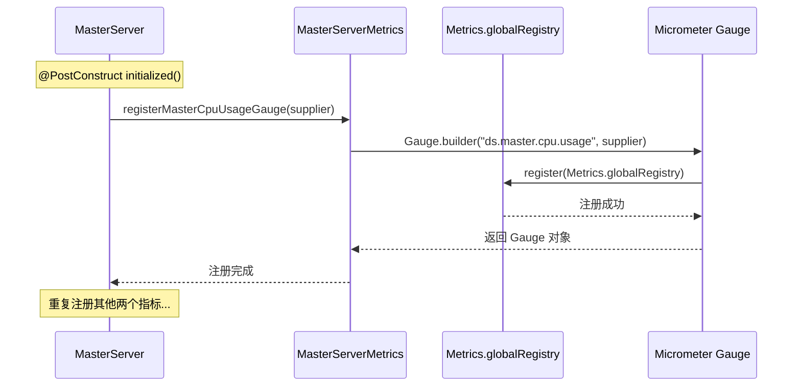
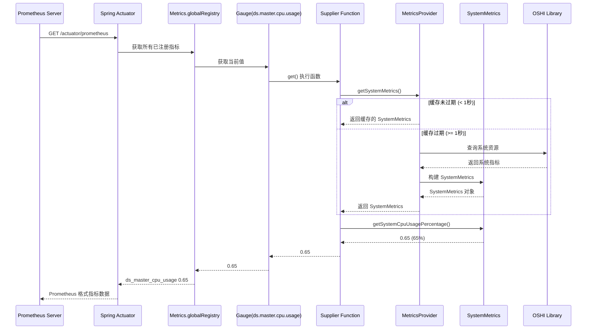
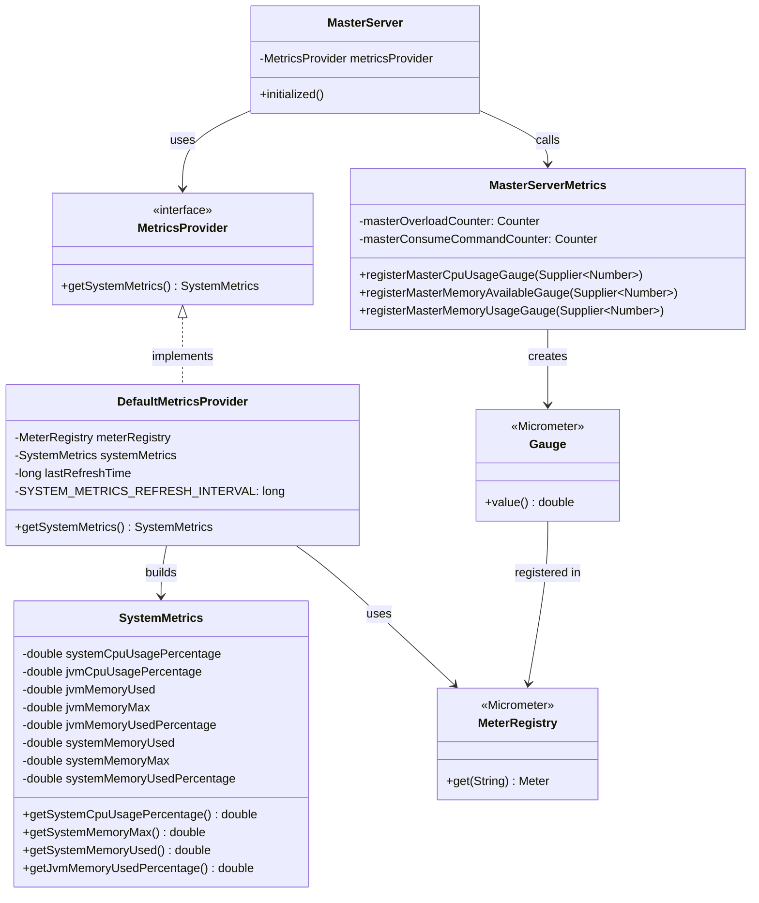
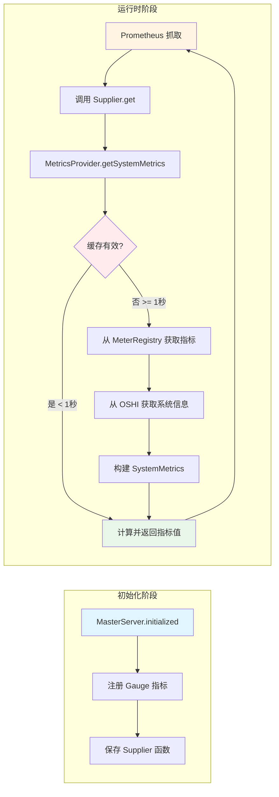
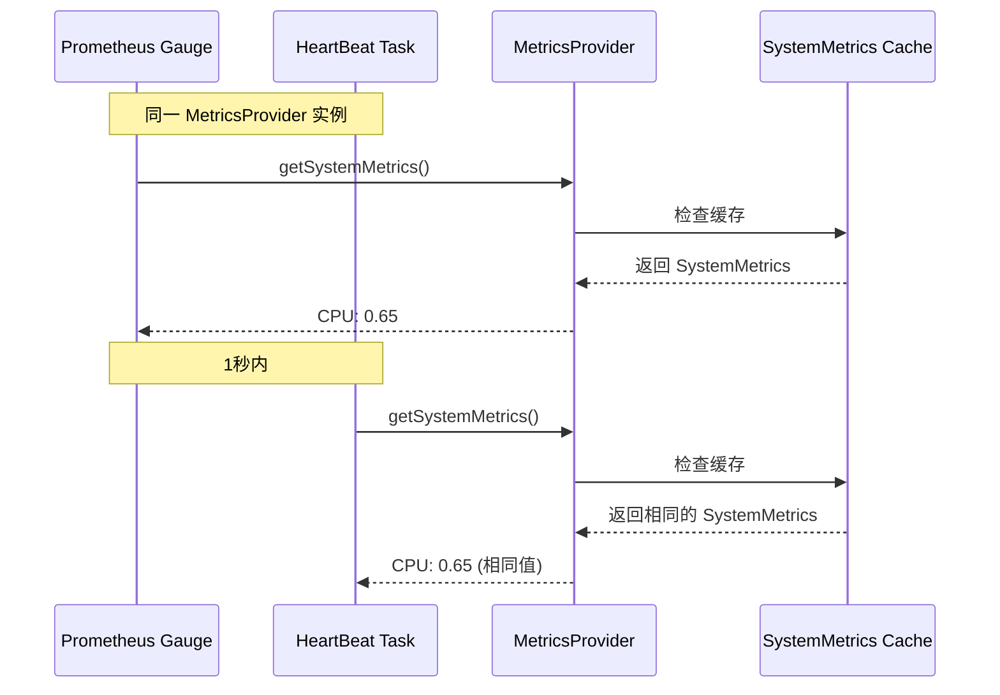
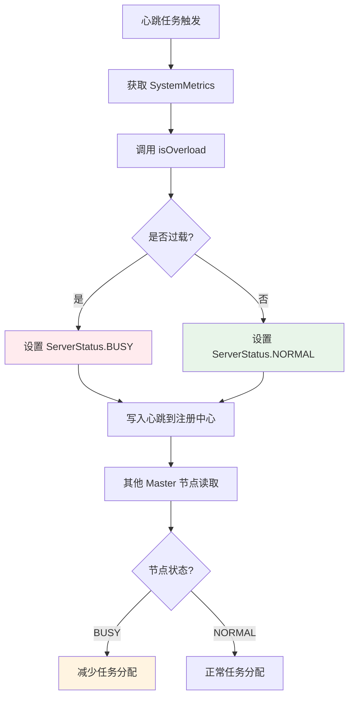

# Master 服务指标分析

## 1. 概述

在 `MasterServer.initialized()` 方法中(第200-211行)，注册了三个系统监控指标，用于实时监控 Master 服务器的系统资源使用情况。这些指标使用 **Micrometer** 框架实现，支持通过 Prometheus 等监控系统进行采集和展示。

## 2. 代码分析

### 2.1 代码位置

```java:200-211:dolphinscheduler-master/src/main/java/org/apache/dolphinscheduler/server/master/MasterServer.java
MasterServerMetrics.registerMasterCpuUsageGauge(() -> {
    SystemMetrics systemMetrics = metricsProvider.getSystemMetrics();
    return systemMetrics.getSystemCpuUsagePercentage();
});
MasterServerMetrics.registerMasterMemoryAvailableGauge(() -> {
    SystemMetrics systemMetrics = metricsProvider.getSystemMetrics();
    return (systemMetrics.getSystemMemoryMax() - systemMetrics.getSystemMemoryUsed()) / 1024.0 / 1024 / 1024;
});
MasterServerMetrics.registerMasterMemoryUsageGauge(() -> {
    SystemMetrics systemMetrics = metricsProvider.getSystemMetrics();
    return systemMetrics.getJvmMemoryUsedPercentage();
});
```

### 2.2 逐行解析

#### 指标1: CPU 使用率

```java
MasterServerMetrics.registerMasterCpuUsageGauge(() -> {
    SystemMetrics systemMetrics = metricsProvider.getSystemMetrics();
    return systemMetrics.getSystemCpuUsagePercentage();
});
```

- **指标名称**: `ds.master.cpu.usage`
- **指标类型**: Gauge (瞬时值)
- **返回值**: `double` 类型，范围 0.0 - 1.0，表示系统 CPU 使用百分比
- **用途**: 监控 Master 服务器所在机器的 CPU 使用率

#### 指标2: 可用内存

```java
MasterServerMetrics.registerMasterMemoryAvailableGauge(() -> {
    SystemMetrics systemMetrics = metricsProvider.getSystemMetrics();
    return (systemMetrics.getSystemMemoryMax() - systemMetrics.getSystemMemoryUsed()) / 1024.0 / 1024 / 1024;
});
```

- **指标名称**: `ds.master.memory.available`
- **指标类型**: Gauge (瞬时值)
- **返回值**: `double` 类型，单位为 **GB** (Gigabytes)
- **计算方式**: (系统最大内存 - 系统已用内存) / 1024³
- **用途**: 监控系统可用内存，用于判断是否需要扩容或优化

#### 指标3: JVM 内存使用率

```java
MasterServerMetrics.registerMasterMemoryUsageGauge(() -> {
    SystemMetrics systemMetrics = metricsProvider.getSystemMetrics();
    return systemMetrics.getJvmMemoryUsedPercentage();
});
```

- **指标名称**: `ds.master.memory.usage`
- **指标类型**: Gauge (瞬时值)
- **返回值**: `double` 类型，范围 0.0 - 1.0，表示 JVM 内存使用百分比
- **用途**: 监控 Master 服务 JVM 进程的内存使用率，用于判断是否需要调整 JVM 参数或排查内存泄漏

## 3. 指标原理

### 3.1 Micrometer Gauge 指标

**Gauge** 是 Micrometer 中用于测量瞬时值的指标类型，特点是：
- 可增可减，反映某个时刻的状态值
- 不需要累加，每次获取都是当前值
- 适合监控资源使用率、队列长度、缓存大小等

与 **Counter** (计数器，只能递增)和 **Timer** (计时器，用于测量持续时间)不同，Gauge 更适合监控资源使用情况。

### 3.2 为什么使用 Supplier 函数式接口？

使用 `Supplier<Number>` 作为参数的原因：

1. **延迟求值 (Lazy Evaluation)**
    - 注册时不会立即执行计算，只在需要获取指标值时才执行
    - 避免在 MasterServer 初始化时进行不必要的系统资源查询

2. **实时性**
    - 每次 Prometheus 抓取指标时，都会重新执行 Supplier 函数
    - 保证获取到的是最新的系统资源状态

3. **性能优化**
    - `MetricsProvider.getSystemMetrics()` 内部有缓存机制
    - 1秒内多次调用会返回缓存值，避免频繁查询系统资源

### 3.3 指标注册流程



### 3.4 指标查询流程



## 4. 设计原理

### 4.1 为什么在 `@PostConstruct` 方法中注册？

```java
@PostConstruct
public void initialized() {
    // ... 其他初始化代码 ...
    this.systemEventBusFireWorker.start();
    
    // 指标注册放在最后
    MasterServerMetrics.registerMasterCpuUsageGauge(...);
    // ...
}
```

**原因分析**:
1. **依赖注入完成**: `@PostConstruct` 确保所有 `@Autowired` 字段都已注入，`metricsProvider` 已可用
2. **服务已就绪**: 此时 MasterServer 的核心组件已启动，注册指标不会影响服务启动
3. **生命周期管理**: 与服务启动生命周期绑定，服务启动时自动注册，无需手动调用

### 4.2 为什么使用 Lambda 表达式？

```java
registerMasterCpuUsageGauge(() -> {
    SystemMetrics systemMetrics = metricsProvider.getSystemMetrics();
    return systemMetrics.getSystemCpuUsagePercentage();
});
```

**优点**:
1. **闭包特性**: Lambda 捕获了 `metricsProvider` 引用，每次执行时都能访问当前实例
2. **代码简洁**: 相比匿名内部类，代码更简洁易读
3. **延迟绑定**: 执行时才获取 `metricsProvider`，避免初始化顺序问题

### 4.3 为什么在注册时创建新的 SystemMetrics 对象？

每次 Prometheus 抓取时都会调用 Supplier，因此会多次调用 `getSystemMetrics()`。

**为什么不直接在注册时获取一次？**

因为指标需要反映**实时状态**，而不是启动时的快照。如果只获取一次，所有后续的指标值都是启动时的值，失去了监控的意义。

**性能优化**:
- `DefaultMetricsProvider.getSystemMetrics()` 内部有 1 秒缓存
- 1 秒内多次调用返回缓存值，不会频繁查询系统资源

### 4.4 内存计算为什么要除以 1024³？

```java
return (systemMetrics.getSystemMemoryMax() - systemMetrics.getSystemMemoryUsed()) / 1024.0 / 1024 / 1024;
```

**单位转换**:
- `getSystemMemoryMax()` 和 `getSystemMemoryUsed()` 返回的是**字节 (Bytes)**
- 除以 1024 → KB (Kilobytes)
- 再除以 1024 → MB (Megabytes)
- 再除以 1024 → GB (Gigabytes)

使用 `1024.0` 而不是 `1024` 是为了确保浮点运算，避免整数除法丢失精度。

## 5. 架构设计

### 5.1 组件关系图

```mermaid
graph TB
    subgraph "Master Server 模块"
        MS[MasterServer]
        MSM[MasterServerMetrics]
    end
    
    subgraph "Metrics 模块"
        MP[MetricsProvider<br/>接口]
        DMP[DefaultMetricsProvider<br/>实现类]
        SM[SystemMetrics<br/>数据对象]
    end
    
    subgraph "Micrometer 框架"
        MR[Metrics.globalRegistry<br/>全局注册表]
        G1[Gauge: ds.master.cpu.usage]
        G2[Gauge: ds.master.memory.available]
        G3[Gauge: ds.master.memory.usage]
    end
    
    subgraph "系统资源层"
        OSHI[OSHI Library<br/>系统信息库]
        JVM[JVM MBean]
        OS[操作系统 API]
    end
    
    subgraph "监控层"
        ACT[Spring Actuator]
        PROM[Prometheus]
    end
    
    MS -->|注入| MP
    MS -->|调用| MSM
    MSM -->|注册| MR
    
    MP <|.. DMP
    DMP -->|构建| SM
    DMP -->|查询| OSHI
    DMP -->|查询| JVM
    DMP -->|查询| OS
    
    MR -->|管理| G1
    MR -->|管理| G2
    MR -->|管理| G3
    
    G1 -.->|执行 Supplier| DMP
    G2 -.->|执行 Supplier| DMP
    G3 -.->|执行 Supplier| DMP
    
    MR -->|暴露| ACT
    ACT -->|抓取| PROM
    
    style MS fill:#e1f5ff
    style MSM fill:#fff4e1
    style MP fill:#f0f0f0
    style DMP fill:#e8f5e9
    style SM fill:#fff9c4
    style MR fill:#f3e5f5
    style OSHI fill:#e0f2f1
```

### 5.2 类图



### 5.3 数据流图



## 6. MetricsProvider 缓存机制

### 6.1 缓存实现

```java
private static final long SYSTEM_METRICS_REFRESH_INTERVAL = 1_000L; // 1秒

@Override
public SystemMetrics getSystemMetrics() {
    if (System.currentTimeMillis() - lastRefreshTime < SYSTEM_METRICS_REFRESH_INTERVAL) {
        return systemMetrics; // 返回缓存值
    }
    // 重新查询系统资源...
    lastRefreshTime = System.currentTimeMillis();
    return systemMetrics;
}
```

### 6.2 为什么需要缓存？

1. **系统资源查询成本高**
    - 需要调用 OSHI 库查询 CPU、内存等信息
    - 需要从 JVM MBean 获取内存使用情况
    - 频繁查询会影响性能

2. **指标精度要求**
    - Prometheus 通常每 15-30 秒抓取一次
    - 1 秒的刷新频率已足够满足监控需求
    - 系统资源在 1 秒内变化不会太大

3. **性能平衡**
    - 缓存时间过短：频繁查询系统资源，影响性能
    - 缓存时间过长：指标不够实时，可能错过瞬时峰值

## 7. 指标数据来源

### 7.1 CPU 使用率

```java
double systemCpuUsage = meterRegistry.get("system.cpu.usage").gauge().value();
```

- **来源**: Micrometer 通过 Spring Boot Actuator 自动收集
- **底层**: 使用 OSHI (Operating System and Hardware Information) 库
- **指标名**: `system.cpu.usage` (标准 Micrometer 指标)

### 7.2 JVM 内存

```java
double jvmMemoryUsed = meterRegistry.get("jvm.memory.used").meter().measure().iterator().next().getValue();
double jvmMemoryMax = meterRegistry.get("jvm.memory.max").meter().measure().iterator().next().getValue();
```

- **来源**: Micrometer JVM 指标
- **底层**: JVM Management API (MBeans)
- **指标名**: `jvm.memory.used` 和 `jvm.memory.max` (标准 Micrometer 指标)

### 7.3 系统内存

```java
long totalSystemMemory = OSUtils.getTotalSystemMemory();
long systemMemoryAvailable = OSUtils.getSystemAvailableMemoryUsed();
```

- **来源**: `OSUtils` 工具类
- **底层**: 通过 OSHI 库的 `HardwareAbstractionLayer` 获取
- **实现**:
  ```java
  private static final SystemInfo SI = new SystemInfo();
  private static final HardwareAbstractionLayer hal = SI.getHardware();
  
  public static long getTotalSystemMemory() {
      return hal.getMemory().getTotal();
  }
  ```

## 8. 指标暴露方式

### 8.1 Spring Actuator 集成

DolphinScheduler 使用 Spring Boot Actuator 暴露指标:

1. **配置启用**:
   ```yaml
   metrics:
     enabled: true
   ```

2. **端点地址**:
    - 指标列表: `http://host:port/actuator/metrics`
    - Prometheus 格式: `http://host:port/actuator/prometheus`

3. **自动集成**:
    - Spring Boot 自动配置 `MeterRegistry`
    - 集成 `micrometer-registry-prometheus` 依赖
    - 自动注册所有 Gauge 指标到全局注册表

### 8.2 Prometheus 格式

Prometheus 通过 HTTP 抓取端点获取指标数据，格式如下：

```prometheus
# HELP ds_master_cpu_usage master cpu usage
# TYPE ds_master_cpu_usage gauge
ds_master_cpu_usage 0.65

# HELP ds_master_memory_available Master memory available
# TYPE ds_master_memory_available gauge
ds_master_memory_available 8.5

# HELP ds_master_memory_usage Master memory usage
# TYPE ds_master_memory_usage gauge
ds_master_memory_usage 0.72
```

**格式说明**:
- `# HELP`: 指标描述
- `# TYPE`: 指标类型 (gauge/counter/timer/histogram)
- 指标名: 使用下划线代替点号，符合 Prometheus 命名规范
- 指标值: 当前时刻的数值

### 8.3 指标抓取配置

在 Prometheus 配置文件中添加抓取任务:

```yaml
scrape_configs:
  - job_name: 'dolphinscheduler-master'
    metrics_path: '/actuator/prometheus'
    static_configs:
      - targets: ['master-host:5679']
```

## 9. 指标与心跳任务的关系

### 9.1 共享 MetricsProvider

指标注册和心跳任务使用**同一个** `MetricsProvider` 实例:

```java
// MasterServer.java - 指标注册
@Autowired
private MetricsProvider metricsProvider;

MasterServerMetrics.registerMasterCpuUsageGauge(() -> {
    SystemMetrics systemMetrics = metricsProvider.getSystemMetrics();
    return systemMetrics.getSystemCpuUsagePercentage();
});

// MasterHeartBeatTask.java - 心跳任务
@Override
public MasterHeartBeat getHeartBeat() {
    SystemMetrics systemMetrics = metricsProvider.getSystemMetrics();
    // 使用相同的 SystemMetrics 数据
    return MasterHeartBeat.builder()
            .cpuUsage(systemMetrics.getSystemCpuUsagePercentage())
            .jvmMemoryUsage(systemMetrics.getJvmMemoryUsedPercentage())
            // ...
            .build();
}
```

### 9.2 数据一致性

由于共享 `MetricsProvider` 和缓存机制，指标和心跳数据保持一致:



**优势**:
- 指标和心跳数据一致，避免数据不一致导致的误判
- 共享缓存，减少系统资源查询次数
- 统一的数据源，便于维护

### 9.3 心跳任务中的指标使用

心跳任务不仅上报系统指标，还用于**负载判断**:

```java
private ServerStatus getServerStatus(final SystemMetrics systemMetrics,
                                       final MasterServerLoadProtection masterServerLoadProtection) {
    return masterServerLoadProtection.isOverload(systemMetrics) 
        ? ServerStatus.BUSY 
        : ServerStatus.NORMAL;
}
```

当系统负载过高时，Master 会标记为 `BUSY` 状态，影响任务调度决策。

## 10. 指标与负载保护机制

### 10.1 负载保护原理

`BaseServerLoadProtection` 使用系统指标判断服务器是否过载:

```java
@Override
public boolean isOverload(SystemMetrics systemMetrics) {
    // CPU 使用率超过 70%
    if (systemMetrics.getSystemCpuUsagePercentage() > 0.7) {
        return true;
    }
    // JVM CPU 使用率超过 70%
    if (systemMetrics.getJvmCpuUsagePercentage() > 0.7) {
        return true;
    }
    // 系统内存使用率超过 70%
    if (systemMetrics.getSystemMemoryUsedPercentage() > 0.7) {
        return true;
    }
    // 磁盘使用率超过 70%
    if (systemMetrics.getDiskUsedPercentage() > 0.7) {
        return true;
    }
    return false;
}
```

### 10.2 过载处理流程



### 10.3 指标阈值配置

可以通过配置文件调整负载保护阈值:

```yaml
master:
  server-load-protection:
    enabled: true
    max-system-cpu-usage-percentage-thresholds: 0.7
    max-jvm-cpu-usage-percentage-thresholds: 0.7
    max-system-memory-usage-percentage-thresholds: 0.7
    max-disk-usage-percentage-thresholds: 0.7
```

## 11. 指标使用场景

### 11.1 监控告警

通过 Prometheus + AlertManager 配置告警规则:

```yaml
groups:
  - name: dolphinscheduler-master
    rules:
      - alert: MasterHighCpuUsage
        expr: ds_master_cpu_usage > 0.8
        for: 5m
        annotations:
          summary: "Master CPU usage is high"
          
      - alert: MasterLowMemory
        expr: ds_master_memory_available < 2
        for: 5m
        annotations:
          summary: "Master available memory is low"
          
      - alert: MasterHighMemoryUsage
        expr: ds_master_memory_usage > 0.85
        for: 5m
        annotations:
          summary: "Master JVM memory usage is high"
```

### 11.2 容量规划

通过历史指标数据分析:
- **CPU 趋势**: 判断是否需要升级 CPU
- **内存趋势**: 判断是否需要增加内存
- **峰值分析**: 识别业务高峰期，规划扩容策略

### 11.3 性能优化

通过指标定位性能瓶颈:
- **CPU 持续高**: 检查是否有 CPU 密集型任务，考虑优化算法
- **内存持续增长**: 排查内存泄漏，检查对象生命周期
- **内存使用率波动大**: 检查 GC 配置，优化 JVM 参数

### 11.4 故障排查

当 Master 服务异常时:
1. 查看指标历史数据，定位异常时间点
2. 分析 CPU/内存/磁盘指标变化趋势
3. 结合日志，找出异常原因

## 12. 性能考虑

### 12.1 指标采集开销

**每次指标查询的开销**:
1. Supplier 函数执行: ~1ms
2. MetricsProvider 缓存检查: < 0.1ms
3. 系统资源查询 (缓存过期时): ~10-50ms
   - OSHI 库查询: ~5-20ms
   - JVM MBean 查询: ~1-5ms
   - 磁盘信息查询: ~5-25ms

**优化措施**:
- 1 秒缓存机制，避免频繁查询
- Prometheus 抓取间隔通常 15-30 秒，远大于缓存时间
- 多个 Gauge 共享同一个 `SystemMetrics` 对象

### 12.2 并发安全性

**MetricsProvider 缓存**:
- 使用实例变量存储缓存，非线程安全
- 但在实际使用中，由于缓存时间短 (1秒)，并发访问影响较小
- 即使出现并发问题，最多只是多查询一次系统资源

**Gauge 指标**:
- Micrometer Gauge 是线程安全的
- 每次调用 Supplier 都是独立的，不会相互影响

### 12.3 内存占用

**指标注册开销**:
- 每个 Gauge 对象: ~100-200 bytes
- Supplier Lambda 闭包: ~50-100 bytes
- 总计: 三个指标约 500 bytes，可忽略不计

**SystemMetrics 对象**:
- 对象大小: ~200 bytes
- 缓存时间: 1 秒
- 内存占用极小

## 13. 最佳实践

### 13.1 指标命名规范

遵循 DolphinScheduler 的命名规范:
- 格式: `ds.{component}.{metric}.{unit?}`
- 示例: `ds.master.cpu.usage`, `ds.master.memory.available`
- 使用小写字母和下划线

### 13.2 指标注册时机

✅ **推荐**: 在 `@PostConstruct` 方法中注册
- 确保依赖注入完成
- 与服务生命周期绑定
- 自动注册，无需手动调用

❌ **不推荐**: 在静态初始化块中注册
- 无法访问 Spring Bean
- 初始化顺序不确定

### 13.3 指标值计算

✅ **推荐**: 在 Supplier 中计算
- 延迟求值，实时获取最新值
- 利用缓存机制，性能优化

❌ **不推荐**: 在注册时计算一次
- 值不会更新，失去监控意义

### 13.4 缓存时间设置

**当前设置**: 1 秒
- ✅ 平衡实时性和性能
- ✅ 满足大多数监控场景
- ⚠️ 如需更高精度，可调整 `SYSTEM_METRICS_REFRESH_INTERVAL`

**调整建议**:
- 高频监控场景: 500ms
- 常规监控场景: 1000ms (当前)
- 低频监控场景: 2000ms

## 14. 故障排查

### 14.1 指标值为 0 或 NaN

**可能原因**:
1. MetricsProvider 未正确注入
2. 系统资源查询失败
3. MeterRegistry 中缺少底层指标

**排查步骤**:
```java
// 检查 MetricsProvider 是否注入
@Autowired
private MetricsProvider metricsProvider;

// 检查 SystemMetrics 是否正常
SystemMetrics metrics = metricsProvider.getSystemMetrics();
log.info("SystemMetrics: {}", metrics);
```

### 14.2 指标值不更新

**可能原因**:
1. Prometheus 未正确抓取
2. 缓存时间过长
3. Supplier 函数执行异常

**排查步骤**:
1. 访问 `/actuator/prometheus` 端点，检查指标是否存在
2. 检查 Prometheus 配置，确认抓取任务正常
3. 查看日志，检查是否有异常

### 14.3 指标值与实际不符

**可能原因**:
1. 单位转换错误
2. 计算公式错误
3. 系统资源查询不准确

**排查步骤**:
1. 对比原始值和计算值
2. 检查单位转换逻辑
3. 使用系统命令验证 (如 `top`, `free`)

## 15. 总结

### 15.1 核心要点

1. **指标类型**: 使用 Micrometer Gauge 测量瞬时值
2. **延迟求值**: 通过 Supplier 函数式接口实现延迟求值
3. **缓存优化**: MetricsProvider 提供 1 秒缓存，平衡性能和实时性
4. **数据共享**: 指标和心跳任务共享同一个 MetricsProvider，保证数据一致性
5. **负载保护**: 指标用于判断服务器负载，影响任务调度

### 15.2 设计优势

1. **解耦**: 指标注册与数据获取分离，便于维护
2. **性能**: 缓存机制减少系统资源查询开销
3. **实时性**: 每次抓取都获取最新值，满足监控需求
4. **一致性**: 共享数据源，避免数据不一致
5. **扩展性**: 易于添加新指标

### 15.3 相关组件

- **MasterServerMetrics**: 指标注册工具类
- **MetricsProvider**: 指标数据提供者接口
- **DefaultMetricsProvider**: 默认实现，包含缓存机制
- **SystemMetrics**: 系统指标数据对象
- **MasterHeartBeatTask**: 心跳任务，使用相同指标数据
- **BaseServerLoadProtection**: 负载保护，基于指标判断

---

**参考文档**:
- [Micrometer 官方文档](https://micrometer.io/docs)
- [Spring Boot Actuator 文档](https://docs.spring.io/spring-boot/docs/current/reference/html/actuator.html)
- [Prometheus 文档](https://prometheus.io/docs/)