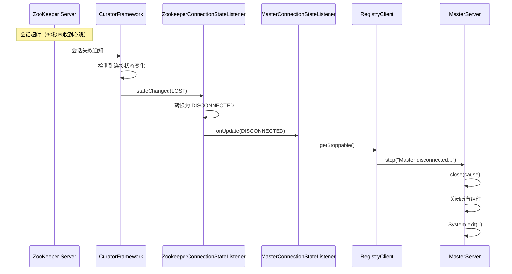
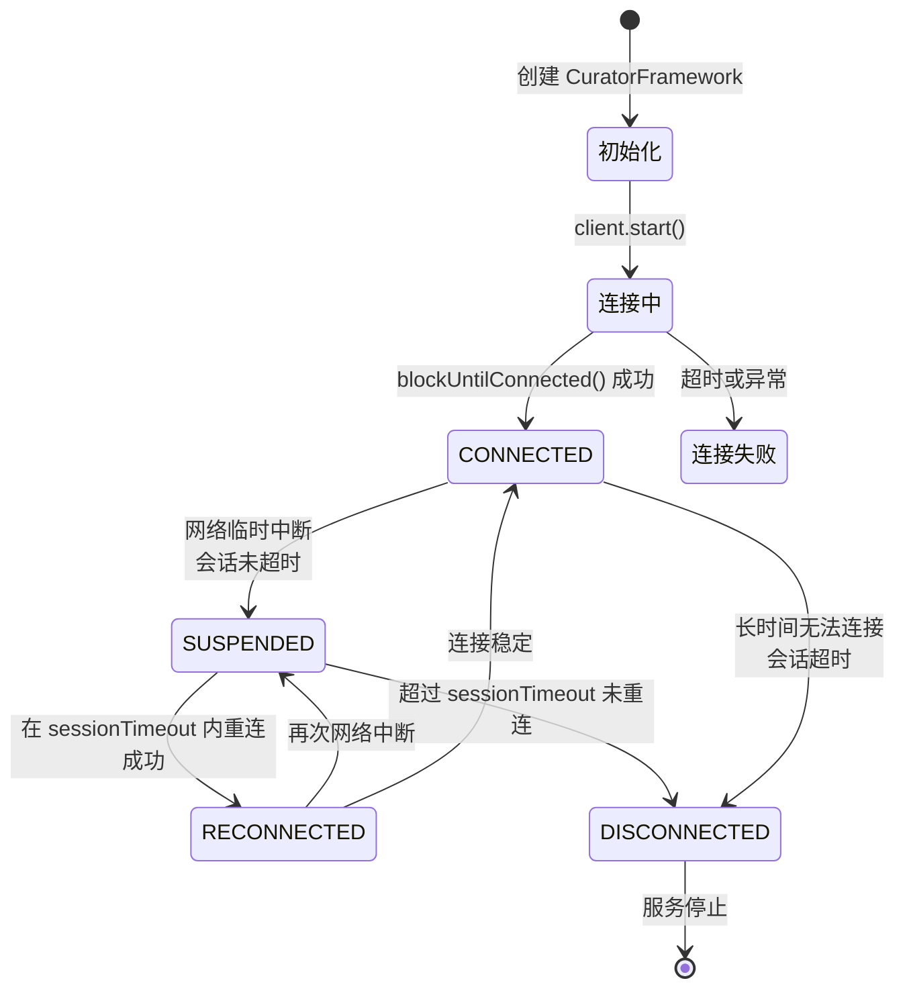
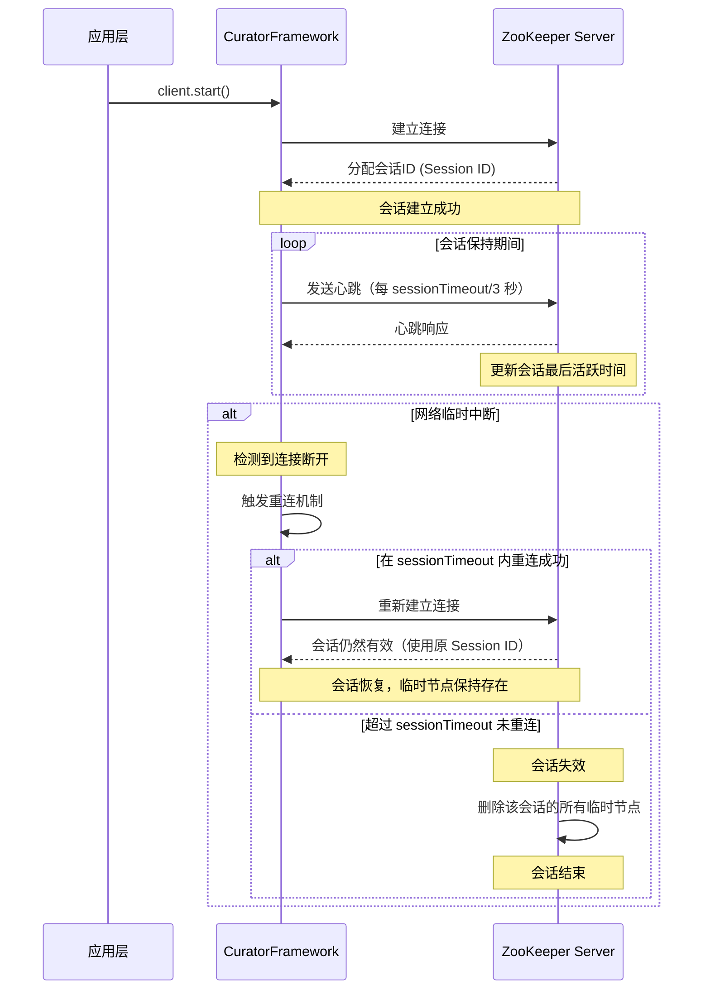

**Master 连接状态监听器**：[MasterConnectionStateListener.java:36-54](dolphinscheduler-master/src/main/java/org/apache/dolphinscheduler/server/master/registry/MasterConnectionStateListener.java#L36-L54)

```java
@Override
public void onUpdate(ConnectionState state) {
    log.info("Master received a {} event from registry, the current server state is {}", 
            state, ServerLifeCycleManager.getServerStatus());
    switch (state) {
        case CONNECTED:
            // 连接成功，无需处理
            // 首次连接成功或重新连接成功，服务正常运行
            break;
        case SUSPENDED:
            // 连接挂起，网络临时中断但会话未超时
            // 可能自动恢复，暂时不处理
            break;
        case RECONNECTED:
            // 从 SUSPENDED 状态恢复连接
            // 会话仍然有效，临时节点未删除
            log.warn("Master reconnect to registry");
            break;
        case DISCONNECTED:
            // 连接丢失，会话超时或长时间无法连接
            // 临时节点已被删除，需要主动停止服务
            registryClient.getStoppable().stop(
                "Master disconnected from registry, will stop myself");
            break;
        default:
            log.warn("Unknown connection state: {}", state);
    }
}
```

**关键处理逻辑**：
- **CONNECTED**：连接成功，服务正常运行，无需特殊处理
- **SUSPENDED**：网络临时中断，但会话未超时，可能自动恢复，暂时不处理
- **RECONNECTED**：从挂起状态恢复，会话仍然有效，记录日志即可
- **DISCONNECTED**：连接丢失且会话超时，临时节点已被删除，**主动停止服务**以避免提供不可靠的服务

**断开通知机制**：

当 Zookeeper 连接断开时，会触发以下流程：



**断开通知的触发条件**：
1. **会话超时**：在 `sessionTimeout`（默认 60 秒）时间内未收到客户端心跳
2. **网络长时间中断**：网络中断超过 `sessionTimeout` 时间
3. **服务器主动断开**：Zookeeper 服务器主动关闭连接

**断开后的影响**：
- **临时节点自动删除**：Zookeeper 服务器自动删除该会话的所有临时节点
- **其他节点感知**：其他 Master 节点通过 TreeCache 监听器立即感知节点删除
- **故障转移触发**：其他节点检测到节点删除后，触发故障转移流程
- **服务主动停止**：当前 Master 服务主动停止，避免状态不一致

---

## 6. 连接状态管理

### 6.1 连接状态流转

**完整的状态流转图**：



### 6.2 会话管理

**会话生命周期**：



**会话关键参数**：
- **会话ID（Session ID）**：Zookeeper 服务器为每个客户端连接分配的唯一标识
- **会话超时（Session Timeout）**：默认 60 秒，配置位置：[ZookeeperRegistry.java:115](dolphinscheduler-registry/dolphinscheduler-registry-plugins/dolphinscheduler-registry-zookeeper/src/main/java/org/apache/dolphinscheduler/plugin/registry/zookeeper/ZookeeperRegistry.java#L115)
- **心跳间隔**：自动计算，约为 `sessionTimeout / 3`（约 20 秒）

### 6.3 断开通知机制详解

**断开通知的完整流程**：

```mermaid
sequenceDiagram
    participant ZKS as ZooKeeper Server
    participant ZKC as ZooKeeper Client
    participant CF as CuratorFrame