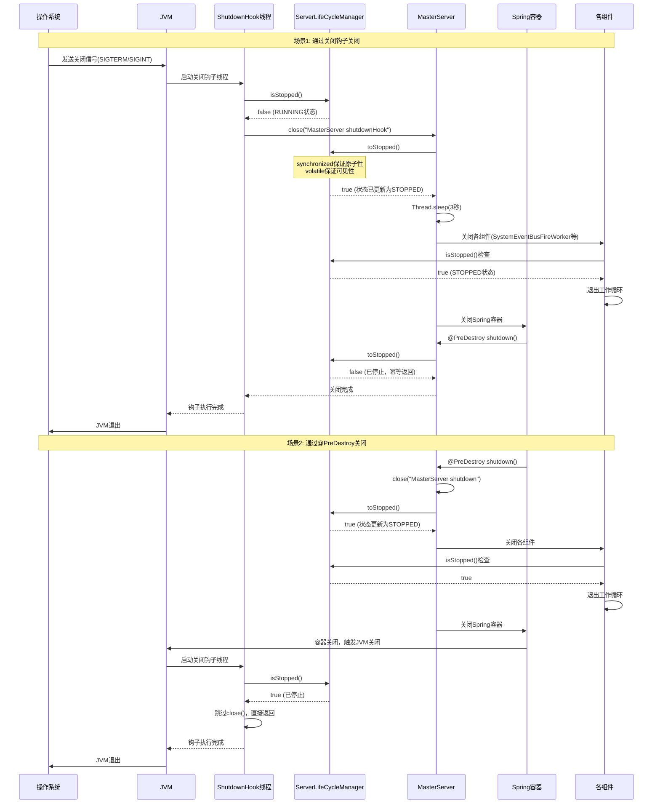
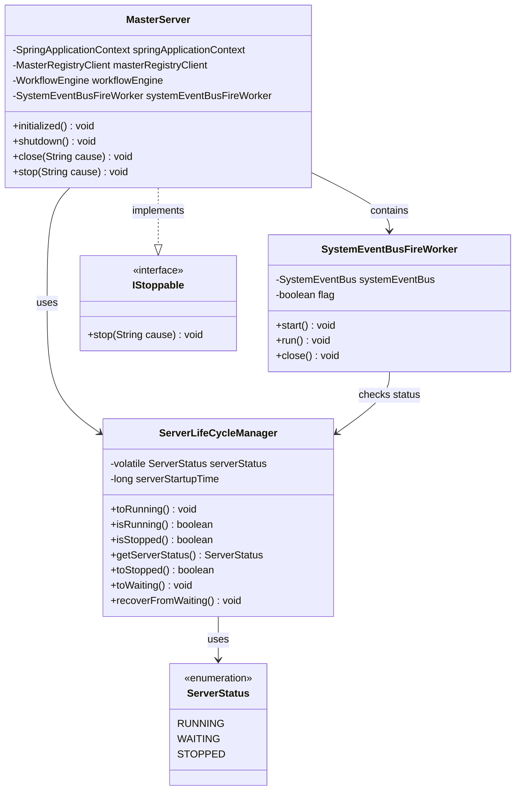

# MasterServer 关闭钩子详细分析

## 1. 概述

MasterServer 使用 Java 的 `Runtime.addShutdownHook()` 机制来确保在 JVM 关闭时能够优雅地关闭服务。关闭钩子通过检查 `ServerLifeCycleManager` 的状态来避免重复关闭，确保关闭流程只执行一次。

## 2. 关闭钩子原理

### 2.1 Java Shutdown Hook 机制

Java 的 `Runtime.addShutdownHook()` 是 JVM 提供的钩子机制，用于在 JVM 关闭时执行清理工作。

**工作原理：**

1. **注册时机**：在 JVM 运行期间，可以注册多个关闭钩子
2. **触发时机**：当 JVM 收到关闭信号时触发，包括：
    - 正常关闭：`System.exit()`、最后一个非守护线程结束
    - 异常关闭：`Ctrl+C` (SIGINT)、`kill` 命令 (SIGTERM)
    - 系统关闭：操作系统关闭、`kill -9` (SIGKILL，无法捕获)
3. **执行顺序**：所有注册的钩子会并发执行，但执行顺序不确定
4. **执行限制**：钩子线程有执行时间限制，超时会被强制终止

**代码位置：**
```java:213:217:dolphinscheduler-master/src/main/java/org/apache/dolphinscheduler/server/master/MasterServer.java
Runtime.getRuntime().addShutdownHook(new Thread(() -> {
    if (!ServerLifeCycleManager.isStopped()) {
        close("MasterServer shutdownHook");
    }
}));
```

### 2.2 关闭钩子的设计目的

1. **兜底机制**：确保即使其他关闭路径失败，也能通过 JVM 关闭信号触发关闭
2. **防止重复关闭**：通过检查 `ServerLifeCycleManager.isStopped()` 避免重复执行关闭逻辑
3. **优雅关闭**：给服务足够的时间完成正在处理的任务

## 3. ServerLifeCycleManager 状态管理机制

### 3.1 状态定义

```java
public enum ServerStatus {
    RUNNING(0, "The current server is running"),
    WAITING(1, "The current server is waiting, this means it cannot work"),
    STOPPED(2, "The current server is stopped"),
}
```

### 3.2 状态管理实现

`ServerLifeCycleManager` 使用以下机制来保证线程安全的状态管理：

```java
private static volatile ServerStatus serverStatus = ServerStatus.RUNNING;

public static boolean isStopped() {
    return serverStatus == ServerStatus.STOPPED;
}

public static synchronized boolean toStopped() {
    if (serverStatus == ServerStatus.STOPPED) {
        return false;
    }
    log.info("The current server status changed from {} to {}", serverStatus, ServerStatus.STOPPED);
    serverStatus = ServerStatus.STOPPED;
    return true;
}
```

**关键设计点：**

1. **volatile 关键字**：
    - 保证 `serverStatus` 变量的**可见性**：一个线程修改后，其他线程能立即看到最新值
    - 防止指令重排序：确保状态更新的顺序性
    - **这是及时知道状态变化的关键机制**

2. **synchronized 关键字**：
    - 保证 `toStopped()` 方法的**原子性**：同一时刻只有一个线程能修改状态
    - 防止并发修改导致的状态不一致

3. **幂等性设计**：
    - `toStopped()` 返回 `boolean`，如果已经停止则返回 `false`
    - 确保多次调用不会重复执行关闭逻辑

## 4. 如何及时知道状态变为 STOPPED

### 4.1 volatile 的内存语义

`volatile` 关键字提供了以下内存语义保证：

1. **可见性（Visibility）**：
    - 当线程 A 修改 `volatile` 变量时，修改会立即刷新到主内存
    - 当线程 B 读取 `volatile` 变量时，会从主内存读取最新值
    - 不使用 `volatile` 时，线程可能读取到本地缓存中的旧值

2. **禁止指令重排序（Ordering）**：
    - `volatile` 写操作前的所有操作不会被重排序到写操作之后
    - `volatile` 读操作后的所有操作不会被重排序到读操作之前

3. **Happens-Before 关系**：
    - 对 `volatile` 变量的写操作 happens-before 后续对该变量的读操作

### 4.2 状态检查机制

关闭钩子线程通过 `isStopped()` 方法检查状态：

```java
if (!ServerLifeCycleManager.isStopped()) {
    close("MasterServer shutdownHook");
}
```

**工作流程：**

1. **状态读取**：关闭钩子线程调用 `isStopped()` 读取 `volatile serverStatus`
2. **内存可见性**：由于 `serverStatus` 是 `volatile`，读取操作会从主内存获取最新值
3. **即时感知**：如果其他线程（如 `@PreDestroy` 方法）已经调用了 `toStopped()`，关闭钩子线程能立即看到 `STOPPED` 状态
4. **避免重复关闭**：如果状态已经是 `STOPPED`，关闭钩子不会执行 `close()` 方法

### 4.3 其他线程的状态检查

除了关闭钩子，其他工作线程也会定期检查状态：

**SystemEventBusFireWorker 示例：**
```java:98:101:dolphinscheduler-master/src/main/java/org/apache/dolphinscheduler/server/master/engine/system/SystemEventBusFireWorker.java
// 检查服务器生命周期状态，如果已停止则退出循环
if (ServerLifeCycleManager.isStopped()) {
    log.info("SystemEventBusFireWorker has been stopped");
    break;
}
```

这些线程通过 `volatile` 的内存语义，能够及时感知状态变化，优雅地退出工作循环。

## 5. 关闭流程时序图



## 6. 组件交互图

```mermaid
graph TB
    subgraph "关闭触发路径"
        A1[操作系统信号<br/>SIGTERM/SIGINT] --> B1[JVM关闭序列]
        A2[Spring容器关闭] --> B2[@PreDestroy方法]
        A3[RegistryClient回调] --> B3[IStoppable.stop]
    end

    subgraph "关闭钩子机制"
        B1 --> C1[ShutdownHook线程启动]
        C1 --> C2{检查状态<br/>isStopped}
        C2 -->|未停止| C3[调用close方法]
        C2 -->|已停止| C4[跳过，避免重复关闭]
    end

    subgraph "状态管理"
        C3 --> D1[ServerLifeCycleManager.toStopped]
        B2 --> D1
        B3 --> D1
        D1 --> D2[volatile serverStatus = STOPPED]
        D2 --> D3[所有线程可见最新状态]
    end

    subgraph "关闭执行"
        C3 --> E1[等待3秒]
        E1 --> E2[关闭线程池]
        E2 --> E3[关闭各组件]
        E3 --> E4[关闭Spring容器]
    end

    subgraph "工作线程响应"
        D3 --> F1[SystemEventBusFireWorker检查状态]
        D3 --> F2[其他工作线程检查状态]
        F1 --> F3[退出工作循环]
        F2 --> F3
    end

    style D2 fill:#ff9999
    style D3 fill:#99ff99
    style C2 fill:#ffff99
```

## 7. 类图



**类图说明：**

- **ServerLifeCycleManager**：
  - 使用 `volatile` 关键字保证状态变量的可见性
  - 使用 `synchronized` 关键字保证状态更新的原子性
  - 幂等性设计防止重复关闭

- **MasterServer**：
  - 关闭钩子通过检查 `ServerLifeCycleManager.isStopped()` 避免重复关闭
  - 实现了 `IStoppable` 接口，支持注册中心回调关闭

## 8. 关闭流程架构图

```mermaid
graph LR
    subgraph "关闭入口"
        E1[关闭钩子]
        E2[@PreDestroy]
        E3[Registry回调]
    end

    subgraph "状态管理核心"
        S1[ServerLifeCycleManager]
        S2[volatile serverStatus]
        S3[synchronized toStopped]
    end

    subgraph "关闭执行"
        C1[等待3秒]
        C2[关闭线程池]
        C3[关闭组件]
        C4[关闭Spring容器]
    end

    subgraph "工作线程"
        W1[SystemEventBusFireWorker]
        W2[其他工作线程]
        W3[状态检查循环]
    end

    E1 -->|检查状态| S1
    E2 -->|设置状态| S1
    E3 -->|设置状态| S1
    S1 --> S2
    S2 -->|volatile可见性| W3
    S1 --> S3
    S3 --> C1
    C1 --> C2
    C2 --> C3
    C3 --> C4
    W3 --> W1
    W3 --> W2

    style S2 fill:#ff9999
    style S3 fill:#99ff99
    style W3 fill:#ffff99
```

## 9. 关键设计要点

### 9.1 防止重复关闭

**问题场景：**
- 关闭钩子和 `@PreDestroy` 可能同时触发
- 多个关闭路径可能并发执行

**解决方案：**
1. `toStopped()` 使用 `synchronized` 保证原子性
2. 返回 `boolean` 值，已停止时返回 `false`
3. 关闭钩子先检查状态，已停止则跳过

### 9.2 状态可见性保证

**问题场景：**
- 多个线程需要检查状态
- 状态变化需要立即被所有线程感知

**解决方案：**
1. 使用 `volatile` 关键字保证可见性
2. 所有状态检查方法直接读取 `volatile` 变量
3. 状态更新后，所有线程能立即看到最新值

### 9.3 优雅关闭

**设计要点：**
1. **等待时间**：关闭前等待 3 秒，给工作线程时间完成当前任务
2. **状态检查**：工作线程定期检查状态，发现停止后退出循环
3. **资源清理**：使用 try-with-resources 确保资源正确关闭

### 9.4 关闭顺序

1. **设置停止状态**：`ServerLifeCycleManager.toStopped()`
2. **等待线程退出**：`ThreadUtils.sleep(3秒)`
3. **关闭线程池**：`shutdownNow()`
4. **关闭组件**：按依赖顺序关闭（SystemEventBusFireWorker → WorkflowEngine → ...）
5. **关闭Spring容器**：最后关闭，触发所有 `@PreDestroy` 方法

## 10. 潜在问题和改进建议

### 10.1 潜在问题

1. **关闭钩子执行时间限制**：
    - JVM 对关闭钩子有执行时间限制
    - 如果关闭过程过长，可能被强制终止

2. **并发关闭竞争**：
    - 虽然使用了 `synchronized`，但多个关闭路径仍可能竞争
    - 当前设计通过幂等性解决了这个问题

3. **状态检查频率**：
    - 工作线程的状态检查频率影响响应速度
    - 需要在性能和响应性之间平衡

### 10.2 改进建议

1. **添加关闭超时机制**：
   ```java
   // 可以添加关闭超时，避免无限等待
   CompletableFuture<Void> closeFuture = CompletableFuture.runAsync(() -> {
       // 关闭逻辑
   });
   closeFuture.get(30, TimeUnit.SECONDS);
   ```

2. **状态变化通知机制**：
    - 可以使用 `CountDownLatch` 或 `CompletableFuture` 通知等待的线程
    - 减少轮询检查的开销

3. **关闭阶段管理**：
    - 可以定义多个关闭阶段（PREPARE、CLOSING、CLOSED）
    - 更细粒度的关闭控制

## 11. volatile 内存模型详解

### 11.1 Java 内存模型（JMM）基础

Java 内存模型定义了线程如何与主内存交互，以及如何保证多线程环境下的可见性、有序性和原子性。

**内存模型结构：**
```
┌─────────────────────────────────────────┐
│           主内存 (Main Memory)            │
│  ┌───────────────────────────────────┐  │
│  │  volatile serverStatus = RUNNING  │  │
│  └───────────────────────────────────┘  │
└─────────────────────────────────────────┘
         ↑                    ↓
    read/write          read/write
         ↑                    ↓
┌─────────────────────────────────────────┐
│  线程1本地内存    │    线程2本地内存      │
│  (Thread 1)      │    (Thread 2)        │
│  ┌───────────┐  │    ┌───────────┐     │
│  │ 缓存副本   │  │    │ 缓存副本   │     │
│  └───────────┘  │    └───────────┘     │
└─────────────────────────────────────────┘
```

### 11.2 volatile 的内存语义实现

**1. 可见性保证机制：**

```java
// 线程1：修改状态
public static synchronized boolean toStopped() {
    serverStatus = ServerStatus.STOPPED;  // volatile 写
    // JVM 会立即将修改刷新到主内存
    // 并使得其他线程的缓存失效
}

// 线程2：读取状态
public static boolean isStopped() {
    return serverStatus == ServerStatus.STOPPED;  // volatile 读
    // JVM 会从主内存读取最新值
    // 不会使用本地缓存的旧值
}
```

**2. 内存屏障（Memory Barrier）：**

`volatile` 通过插入内存屏障来保证可见性和有序性：

- **Load Barrier（读屏障）**：在 volatile 读操作后插入，确保：
   - 从主内存读取最新值
   - 禁止后续读/写操作重排序到 volatile 读之前

- **Store Barrier（写屏障）**：在 volatile 写操作前插入，确保：
   - 之前的所有写操作都已完成
   - 禁止之前的读/写操作重排序到 volatile 写之后

**3. Happens-Before 关系：**

```java
// 线程A
synchronized (lock) {
    serverStatus = ServerStatus.STOPPED;  // 写操作
}

// 线程B
if (serverStatus == ServerStatus.STOPPED) {  // 读操作
    // 由于 volatile 的 happens-before 语义
    // 线程B 一定能看到线程A 的修改
}
```

### 11.3 实际执行示例

**场景：关闭钩子线程和工作线程的状态检查**

```java
// 时间线分析
T1: @PreDestroy 线程调用 toStopped()
    ├─ synchronized 获取锁
    ├─ serverStatus = STOPPED (volatile 写)
    ├─ Store Barrier 执行
    ├─ 刷新到主内存
    └─ 释放锁

T2: SystemEventBusFireWorker 线程检查状态
    ├─ 读取 serverStatus (volatile 读)
    ├─ Load Barrier 执行
    ├─ 从主内存获取最新值 (STOPPED)
    └─ 退出循环

T3: ShutdownHook 线程检查状态
    ├─ 读取 serverStatus (volatile 读)
    ├─ 从主内存获取最新值 (STOPPED)
    └─ 跳过 close() 方法
```

**关键点：**
- 所有线程的 volatile 读操作都会从主内存获取最新值
- 不需要额外的同步机制（如 synchronized）
- 性能开销比 synchronized 小，适合频繁的状态检查

## 12. 关闭钩子的执行时机和限制

### 12.1 触发时机详解

**1. 正常关闭：**
```java
// 方式1：System.exit()
System.exit(0);  // 正常退出
System.exit(1);  // 异常退出

// 方式2：最后一个非守护线程结束
// 当所有非守护线程执行完毕后，JVM 自动关闭
```

**2. 信号关闭：**
```bash
# SIGTERM (15) - 可捕获，优雅关闭
kill <pid>
kill -TERM <pid>

# SIGINT (2) - 可捕获，Ctrl+C
# 在终端中按 Ctrl+C

# SIGKILL (9) - 不可捕获，强制终止
kill -9 <pid>  # 关闭钩子不会执行！
```

**3. Spring 容器关闭：**
```java
// Spring Boot 应用关闭时
// 1. 调用所有 @PreDestroy 方法
// 2. 关闭 ApplicationContext
// 3. 如果 Spring 是最后一个非守护线程，触发 JVM 关闭
```

### 12.2 执行限制

**1. 执行时间限制：**
- JVM 对关闭钩子有执行时间限制
- 如果钩子执行时间过长，JVM 可能强制终止
- 建议关闭逻辑在 30 秒内完成

**2. 执行顺序：**
- 多个关闭钩子的执行顺序**不确定**
- 不能依赖钩子之间的执行顺序
- 所有钩子**并发执行**

**3. 异常处理：**
```java
Runtime.getRuntime().addShutdownHook(new Thread(() -> {
    try {
        if (!ServerLifeCycleManager.isStopped()) {
            close("MasterServer shutdownHook");
        }
    } catch (Exception e) {
        // 异常不会阻止其他钩子执行
        // 但可能导致关闭不完整
        log.error("Shutdown hook failed", e);
    }
}));
```

**4. 不能注册的情况：**
```java
// 以下情况不能注册关闭钩子：
// 1. JVM 已经开始关闭流程
// 2. 关闭钩子已经被执行
// 3. 钩子已经被注册过（不能重复注册同一个线程）
```

## 13. 关闭流程详细步骤

### 13.1 close() 方法执行流程

```java:226:253:dolphinscheduler-master/src/main/java/org/apache/dolphinscheduler/server/master/MasterServer.java
public void close(String cause) {
    // 步骤1：设置停止状态（幂等操作）
    if (!ServerLifeCycleManager.toStopped()) {
        log.warn("MasterServer is already stopped, current cause: {}", cause);
        return;  // 如果已停止，直接返回
    }
    
    // 步骤2：等待工作线程退出（3秒）
    // 给工作线程时间完成当前任务并检查状态
    ThreadUtils.sleep(Constants.SERVER_CLOSE_WAIT_TIME.toMillis());
    
    // 步骤3：强制关闭线程池
    // 中断所有正在执行的任务
    MasterThreadFactory.getDefaultSchedulerThreadExecutor().shutdownNow();
    
    // 步骤4：关闭各组件（使用 try-with-resources 确保资源释放）
    try (
            SystemEventBusFireWorker systemEventBusFireWorker1 = systemEventBusFireWorker;
            WorkflowEngine workflowEngine1 = workflowEngine;
            SchedulerApi closedSchedulerApi = schedulerApi;
            MasterRpcServer closedRpcServer = masterRPCServer;
            MasterCoordinator closeMasterCoordinator = masterCoordinator;
            MasterRegistryClient closedMasterRegistryClient = masterRegistryClient;
            SpringApplicationContext closedSpringContext = springApplicationContext) {
        
        log.info("MasterServer is stopping, current cause : {}", cause);
        // 各组件的 close() 方法会被自动调用
        // 关闭顺序：按照 try-with-resources 的逆序
    } catch (Exception e) {
        log.error("MasterServer stop failed, current cause: {}", cause, e);
        return;
    }
    
    log.info("MasterServer stopped, current cause: {}", cause);
}
```

### 13.2 组件关闭顺序

**关闭顺序（try-with-resources 逆序）：**

1. **SpringApplicationContext**（最后关闭）
   - 触发所有 `@PreDestroy` 方法
   - 销毁所有 Spring Bean

2. **MasterRegistryClient**
   - 停止心跳任务
   - 从注册中心注销

3. **MasterCoordinator**
   - 停止协调器

4. **MasterRpcServer**
   - 关闭 Netty 服务器
   - 关闭所有连接

5. **SchedulerApi**
   - 停止调度器

6. **WorkflowEngine**
   - 停止工作流引擎
   - 清理工作流实例

7. **SystemEventBusFireWorker**（最先关闭）
   - 设置 flag = false
   - 退出事件处理循环

### 13.3 工作线程的响应机制

**SystemEventBusFireWorker 的响应流程：**

```java:68:114:dolphinscheduler-master/src/main/java/org/apache/dolphinscheduler/server/master/engine/system/SystemEventBusFireWorker.java
@Override
public void run() {
    while (flag) {
        try {
            // 从事件队列中阻塞等待事件
            systemEvent = systemEventBus.take();
        } catch (InterruptedException e) {
            Thread.currentThread().interrupt();
            break;  // 被中断，退出循环
        }
        
        // 关键：每次处理事件前检查状态
        if (ServerLifeCycleManager.isStopped()) {
            log.info("SystemEventBusFireWorker has been stopped");
            break;  // 状态已停止，退出循环
        }
        
        try {
            fireSystemEvent(systemEvent);
        } catch (Exception ex) {
            // 异常处理...
        }
    }
}
```

**响应时间分析：**
- **最快响应**：在处理下一个事件时立即检查到状态变化（通常 < 1秒）
- **最慢响应**：如果正在处理一个长时间运行的事件，需要等待事件处理完成（可能几秒到几分钟）
- **中断响应**：如果线程被中断（`shutdownNow()`），立即退出

## 14. 实际场景分析

### 14.1 场景1：正常关闭（kill 命令）

```bash
# 用户执行
kill <master_pid>

# 执行流程
1. 操作系统发送 SIGTERM 信号给 JVM
2. JVM 启动关闭序列
3. ShutdownHook 线程启动
4. ShutdownHook 检查状态：isStopped() = false
5. ShutdownHook 调用 close("MasterServer shutdownHook")
6. close() 设置状态为 STOPPED
7. 等待 3 秒
8. 关闭各组件
9. 工作线程检查到状态变化，退出循环
10. JVM 退出
```

### 14.2 场景2：Spring 容器关闭

```java
// Spring Boot 应用关闭时
1. Spring 容器开始关闭
2. 调用 @PreDestroy shutdown()
3. shutdown() 调用 close("MasterServer shutdown")
4. close() 设置状态为 STOPPED
5. 关闭各组件
6. Spring 容器关闭完成
7. 如果 Spring 是最后一个非守护线程，触发 JVM 关闭
8. ShutdownHook 启动
9. ShutdownHook 检查状态：isStopped() = true
10. ShutdownHook 跳过 close()，直接返回
11. JVM 退出
```

### 14.3 场景3：Registry 回调关闭

```java
// 注册中心检测到异常，回调 stop()
1. RegistryClient 检测到连接断开
2. 调用 MasterServer.stop("registry callback")
3. stop() 调用 close()
4. close() 设置状态为 STOPPED
5. 关闭各组件
6. stop() 调用 System.exit(1)
7. JVM 开始关闭
8. ShutdownHook 启动
9. ShutdownHook 检查状态：isStopped() = true
10. ShutdownHook 跳过 close()
11. JVM 退出
```

### 14.4 场景4：并发关闭（竞态条件）

```java
// 同时触发多个关闭路径
时间线：
T1: ShutdownHook 线程启动
T2: @PreDestroy 线程启动（几乎同时）

// 情况1：ShutdownHook 先执行
T1: isStopped() = false
T1: 调用 close()
T1: toStopped() 获取锁，设置状态为 STOPPED，返回 true
T2: toStopped() 获取锁，发现已停止，返回 false
T2: 直接返回，不执行关闭逻辑

// 情况2：@PreDestroy 先执行
T2: 调用 close()
T2: toStopped() 获取锁，设置状态为 STOPPED，返回 true
T1: isStopped() = true（volatile 读，立即看到最新值）
T1: 跳过 close()，直接返回

// 结果：无论哪个先执行，关闭逻辑只执行一次
```

## 15. 边界情况和异常处理

### 15.1 关闭钩子执行失败

**问题：** 如果关闭钩子抛出异常会怎样？

```java
Runtime.getRuntime().addShutdownHook(new Thread(() -> {
    try {
        if (!ServerLifeCycleManager.isStopped()) {
            close("MasterServer shutdownHook");
        }
    } catch (Exception e) {
        // 异常不会阻止 JVM 关闭
        // 但可能导致资源泄漏
        log.error("Shutdown hook execution failed", e);
        // 可以考虑发送告警通知
    }
}));
```

**影响：**
- JVM 仍会继续关闭流程
- 其他关闭钩子仍会执行
- 但资源可能没有正确释放

### 15.2 关闭过程被强制终止

**问题：** 如果关闭过程超过 JVM 限制时间？

```java
// JVM 可能会强制终止关闭钩子
// 解决方案：将耗时操作放在后台线程
CompletableFuture.runAsync(() -> {
    // 耗时的关闭操作
}).get(30, TimeUnit.SECONDS);
```

### 15.3 工作线程无法及时响应

**问题：** 如果工作线程正在执行长时间任务？

```java
// 当前设计：等待 3 秒后强制关闭
ThreadUtils.sleep(Constants.SERVER_CLOSE_WAIT_TIME.toMillis());
MasterThreadFactory.getDefaultSchedulerThreadExecutor().shutdownNow();

// 改进建议：可以添加超时机制
ExecutorService executor = ...;
executor.shutdown();
if (!executor.awaitTermination(10, TimeUnit.SECONDS)) {
    executor.shutdownNow();  // 强制关闭
}
```

## 16. 性能考虑

### 16.1 volatile 读写的性能

**性能特点：**
- **volatile 读**：性能接近普通变量读，开销很小
- **volatile 写**：比普通变量写稍慢，需要刷新到主内存
- **synchronized**：开销较大，涉及锁竞争和上下文切换

**优化建议：**
- 状态检查使用 `volatile` 读（`isStopped()`），性能好
- 状态更新使用 `synchronized`（`toStopped()`），保证原子性
- 避免在热点路径上频繁调用 `synchronized` 方法

### 16.2 状态检查频率

**当前实现：**
- `SystemEventBusFireWorker`：每次处理事件前检查（频率取决于事件产生速度）
- `ShutdownHook`：只在关闭时检查一次

**优化建议：**
- 如果事件处理很快，检查频率高，但开销可接受
- 如果事件处理很慢，检查频率低，响应可能延迟
- 可以在长时间任务中插入状态检查点

## 17. 测试场景

### 17.1 单元测试场景

```java
// 测试1：状态可见性
@Test
public void testStatusVisibility() {
    // 线程1：修改状态
    new Thread(() -> {
        ServerLifeCycleManager.toStopped();
    }).start();
    
    // 线程2：检查状态
    Thread.sleep(100);
    assertTrue(ServerLifeCycleManager.isStopped());
}

// 测试2：幂等性
@Test
public void testIdempotency() {
    assertTrue(ServerLifeCycleManager.toStopped());
    assertFalse(ServerLifeCycleManager.toStopped());  // 第二次返回 false
}

// 测试3：并发关闭
@Test
public void testConcurrentShutdown() {
    CountDownLatch latch = new CountDownLatch(10);
    AtomicInteger successCount = new AtomicInteger(0);
    
    for (int i = 0; i < 10; i++) {
        new Thread(() -> {
            if (ServerLifeCycleManager.toStopped()) {
                successCount.incrementAndGet();
            }
            latch.countDown();
        }).start();
    }
    
    latch.await();
    assertEquals(1, successCount.get());  // 只有一个线程能成功设置状态
}
```

### 17.2 集成测试场景

```java
// 测试关闭钩子的实际执行
@Test
public void testShutdownHook() {
    MasterServer server = new MasterServer();
    // 启动服务器
    server.initialized();
    
    // 模拟 JVM 关闭
    Runtime.getRuntime().exit(0);
    
    // 验证状态已设置为 STOPPED
    assertTrue(ServerLifeCycleManager.isStopped());
}
```

### 17.3 压力测试场景

```java
// 测试高并发状态检查
@Test
public void testHighConcurrencyStatusCheck() {
    ServerLifeCycleManager.toRunning();
    
    // 100个线程同时检查状态
    CountDownLatch latch = new CountDownLatch(100);
    for (int i = 0; i < 100; i++) {
        new Thread(() -> {
            for (int j = 0; j < 1000; j++) {
                ServerLifeCycleManager.isStopped();  // 频繁读取
            }
            latch.countDown();
        }).start();
    }
    
    // 在检查过程中修改状态
    Thread.sleep(100);
    ServerLifeCycleManager.toStopped();
    
    latch.await();
    assertTrue(ServerLifeCycleManager.isStopped());
}
```

## 18. 最佳实践

### 18.1 关闭钩子设计原则

1. **保持简单**：
   - 关闭钩子应该只做必要的清理工作
   - 避免在关闭钩子中执行复杂业务逻辑
   - 避免启动新线程或异步操作

2. **快速执行**：
   - 关闭钩子应该在合理时间内完成（建议 < 30秒）
   - 对于耗时操作，考虑使用超时机制
   - 避免阻塞操作

3. **异常处理**：
   - 必须捕获所有异常，避免异常阻止 JVM 关闭
   - 记录详细的错误日志
   - 考虑发送告警通知

4. **幂等性**：
   - 确保关闭逻辑可以安全地多次调用
   - 使用状态检查避免重复执行

### 18.2 状态管理最佳实践

1. **使用 volatile**：
   - 对于简单的状态标志，使用 `volatile` 而不是 `synchronized`
   - `volatile` 读操作性能好，适合频繁检查

2. **使用 synchronized**：
   - 对于状态更新操作，使用 `synchronized` 保证原子性
   - 确保状态转换的完整性

3. **幂等性设计**：
   - 状态转换方法应该返回操作结果
   - 允许重复调用而不产生副作用

4. **状态检查位置**：
   - 在工作线程的循环中定期检查状态
   - 在关键操作前检查状态
   - 避免在长时间运行的任务中忘记检查

### 18.3 关闭流程最佳实践

1. **分阶段关闭**：
   ```java
   // 阶段1：停止接收新请求
   serverStatus = STOPPING;
   
   // 阶段2：等待正在处理的请求完成
   awaitRequestsCompletion();
   
   // 阶段3：释放资源
   releaseResources();
   
   // 阶段4：标记为已停止
   serverStatus = STOPPED;
   ```

2. **超时机制**：
   ```java
   // 设置关闭超时
   CompletableFuture<Void> closeFuture = CompletableFuture.runAsync(() -> {
       close();
   });
   
   try {
       closeFuture.get(30, TimeUnit.SECONDS);
   } catch (TimeoutException e) {
       log.error("Close timeout, force shutdown");
       // 强制关闭
   }
   ```

3. **资源清理顺序**：
   - 先关闭依赖其他资源的组件
   - 最后关闭基础资源（如连接池、线程池）
   - 使用 try-with-resources 确保资源释放

## 19. 与其他组件的交互

### 19.1 与 Spring 容器的交互

```java
@PreDestroy
public void shutdown() {
    // Spring 容器关闭时自动调用
    close("MasterServer shutdown");
}

// 关闭钩子中
Runtime.getRuntime().addShutdownHook(new Thread(() -> {
    // 如果 Spring 已经关闭，状态已经是 STOPPED
    if (!ServerLifeCycleManager.isStopped()) {
        close("MasterServer shutdownHook");
    }
}));
```

**交互流程：**
1. Spring 容器关闭 → `@PreDestroy` → `close()` → 状态变为 `STOPPED`
2. JVM 关闭 → `ShutdownHook` → 检查状态 → 已停止，跳过

### 19.2 与注册中心的交互

```java
// MasterRegistryClient 注册 IStoppable
masterRegistryClient.setRegistryStoppable(this);

// 注册中心检测到异常时回调
@Override
public void stop(String cause) {
    close(cause);
    System.exit(1);  // 确保 JVM 退出
}
```

**交互流程：**
1. 注册中心检测异常 → 回调 `stop()` → `close()` → 状态变为 `STOPPED`
2. `System.exit(1)` → JVM 关闭 → `ShutdownHook` → 检查状态 → 已停止，跳过

### 19.3 与工作线程的交互

```java
// 工作线程定期检查状态
while (flag) {
    // 处理任务...
    
    // 检查状态
    if (ServerLifeCycleManager.isStopped()) {
        break;  // 退出循环
    }
}
```

**交互流程：**
1. `close()` 设置状态为 `STOPPED`（volatile 写）
2. 工作线程检查状态（volatile 读）→ 立即看到最新值
3. 工作线程退出循环

## 20. 总结

MasterServer 的关闭钩子机制通过以下设计实现了优雅关闭：

1. **volatile 内存语义**：保证状态变化的可见性，所有线程能及时感知状态变化
2. **synchronized 原子性**：保证状态更新的原子性，防止并发问题
3. **幂等性设计**：防止重复关闭，确保关闭逻辑只执行一次
4. **多路径关闭**：支持关闭钩子、@PreDestroy、Registry回调等多种关闭方式
5. **优雅退出**：工作线程通过状态检查及时响应，避免强制中断
6. **资源清理**：使用 try-with-resources 确保资源正确释放
7. **等待机制**：关闭前等待 3 秒，给工作线程时间完成当前任务

### 20.1 核心机制总结

**状态管理的核心：**
- `volatile` 关键字保证可见性：状态变化立即对所有线程可见
- `synchronized` 关键字保证原子性：状态更新操作不可分割
- 幂等性设计：允许安全地多次调用关闭方法

**关闭钩子的作用：**
- 兜底机制：确保即使其他关闭路径失败，也能通过 JVM 关闭信号触发关闭
- 防止重复关闭：通过状态检查避免重复执行关闭逻辑
- 优雅关闭：给服务足够的时间完成正在处理的任务

**工作线程的响应：**
- 定期检查状态：在工作循环中检查 `isStopped()`
- 及时退出：一旦检测到停止状态，立即退出循环
- 避免强制中断：通过状态检查实现优雅退出，而不是被强制中断

### 20.2 设计优势

1. **线程安全**：通过 `volatile` 和 `synchronized` 保证线程安全
2. **性能优化**：`volatile` 读操作性能好，适合频繁检查
3. **可靠性高**：多路径关闭机制，确保服务能够正确关闭
4. **易于维护**：代码清晰，逻辑简单，易于理解和维护

### 20.3 适用场景

这种设计模式适用于：
- 需要优雅关闭的服务器应用
- 多线程环境下的状态管理
- 需要防止重复操作的场景
- 需要及时响应状态变化的场景

### 20.4 关键代码位置

- **关闭钩子注册**：`MasterServer.initialized()` 第 213-217 行
- **状态管理**：`ServerLifeCycleManager` 类
- **关闭执行**：`MasterServer.close()` 方法
- **状态检查**：`SystemEventBusFireWorker.run()` 第 98 行

通过这种设计，MasterServer 实现了可靠、优雅的关闭机制，确保了服务在各种关闭场景下都能正确、安全地关闭。
    