# 任务实体流转流程分析

## 1. 概述

本文档详细分析了DolphinScheduler中从Command到TaskExecutionRunnable的完整流转过程，以及各个核心类之间的关系、字段对应关系和生命周期管理。

## 2. 核心实体类关系

### 2.1 类图

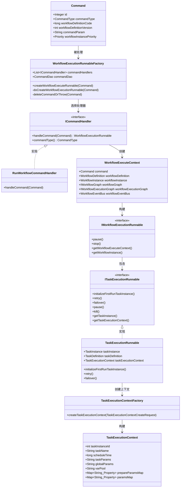

### 2.2 实体层次关系

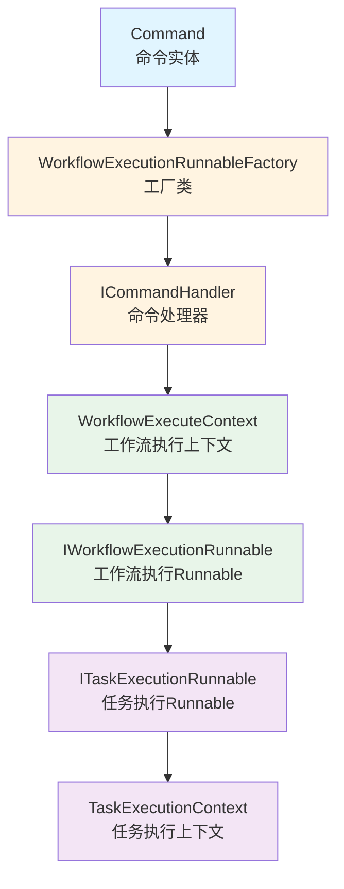

### 2.3 完整流转时序图（从Command到TaskExecutionContext的完整流程）

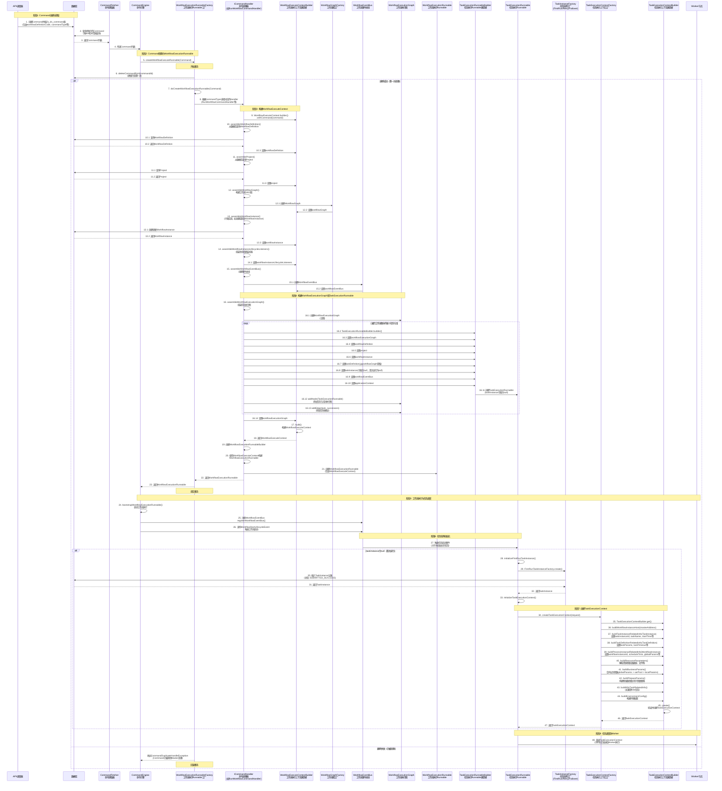

**时序图说明：**

1. **阶段1 - Command创建与获取**：
   - API或调度器创建Command并存入数据库
   - CommandFetcher定期从数据库查询待执行的Command

2. **阶段2 - Command转换为WorkflowExecutionRunnable**：
   - CommandEngine调用WorkflowExecutionRunnableFactory处理Command
   - 使用事务删除Command确保只处理一次（防重复处理）

3. **阶段3 - 构建WorkflowExecuteContext**：
   - ICommandHandler逐步组装WorkflowExecuteContext：
     - 查询并设置WorkflowDefinition（工作流定义）
     - 查询并设置Project（项目信息）
     - 构建IWorkflowGraph（工作流DAG图）
     - 创建或恢复WorkflowInstance（工作流实例）
     - 组装生命周期监听器
     - 创建WorkflowEventBus（事件总线）

4. **阶段4 - 构建WorkflowExecutionGraph和TaskExecutionRunnable**：
   - 遍历工作流图中的每个任务节点
   - 为每个任务创建TaskExecutionRunnableBuilder
   - 构建TaskExecutionRunnable（此时taskInstance可能为null）
   - 将TaskExecutionRunnable添加到WorkflowExecutionGraph
   - 添加任务依赖边到WorkflowExecutionGraph

5. **阶段5 - 工作流执行与任务调度**：
   - 启动WorkflowExecutionRunnable
   - 注册并发布工作流启动事件

6. **阶段6 - 任务实例初始化**：
   - 当任务需要执行时，触发任务启动事件
   - 如果taskInstance为null（首次运行），调用initializeFirstRunTaskInstance()
   - 使用FirstRunTaskInstanceFactory创建TaskInstance并保存到数据库

7. **阶段7 - 创建TaskExecutionContext**：
   - TaskExecutionContextFactory从各个实体中提取信息
   - 使用TaskExecutionContextBuilder逐步构建：
     - 从TaskInstance提取任务相关信息
     - 从TaskDefinition提取任务定义信息
     - 从WorkflowInstance提取工作流实例信息
     - 解析资源参数、合并业务参数、构建环境配置等

8. **阶段8 - 任务调度到Worker**：
   - 将TaskExecutionContext序列化后发送给Worker节点执行

**关键组件说明：**

- **WorkflowExecutionGraph**: 包含所有TaskExecutionRunnable的依赖关系和拓扑结构，用于任务调度和依赖管理
- **WorkflowEventBus**: 工作流事件总线，实现事件驱动的任务执行流程
- **TaskExecutionRunnable**: 任务执行Runnable，管理单个任务实例的完整生命周期
- **TaskExecutionContext**: 任务执行上下文，包含任务执行所需的所有信息，会被序列化发送给Worker

## 3. 完整流转时序图

### 3.1 Command到WorkflowExecutionRunnable的转换

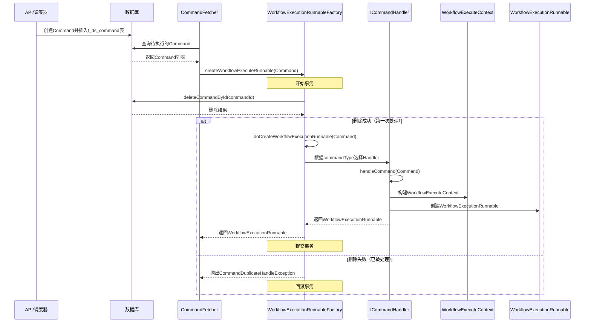

### 3.2 TaskExecutionContext的创建流程

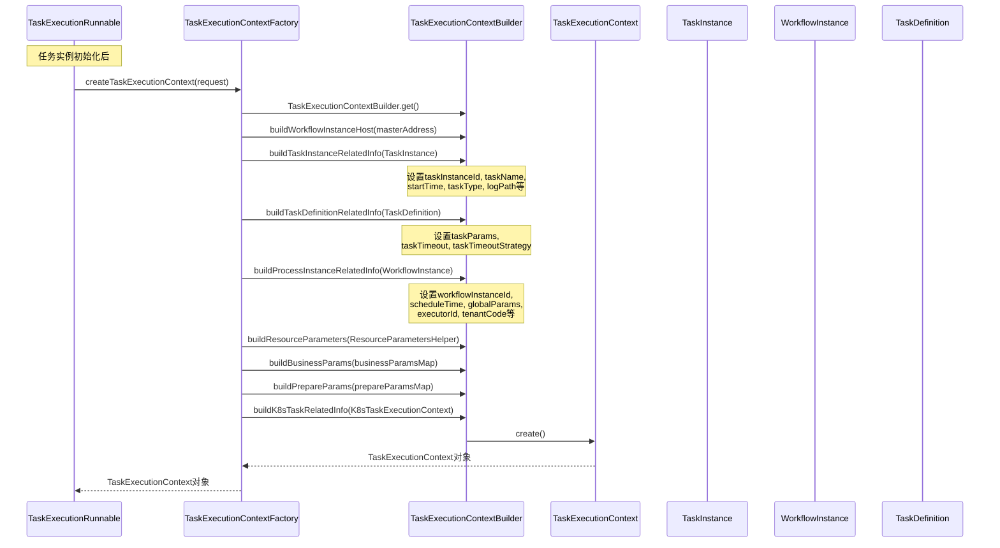

### 3.3 任务执行完整生命周期

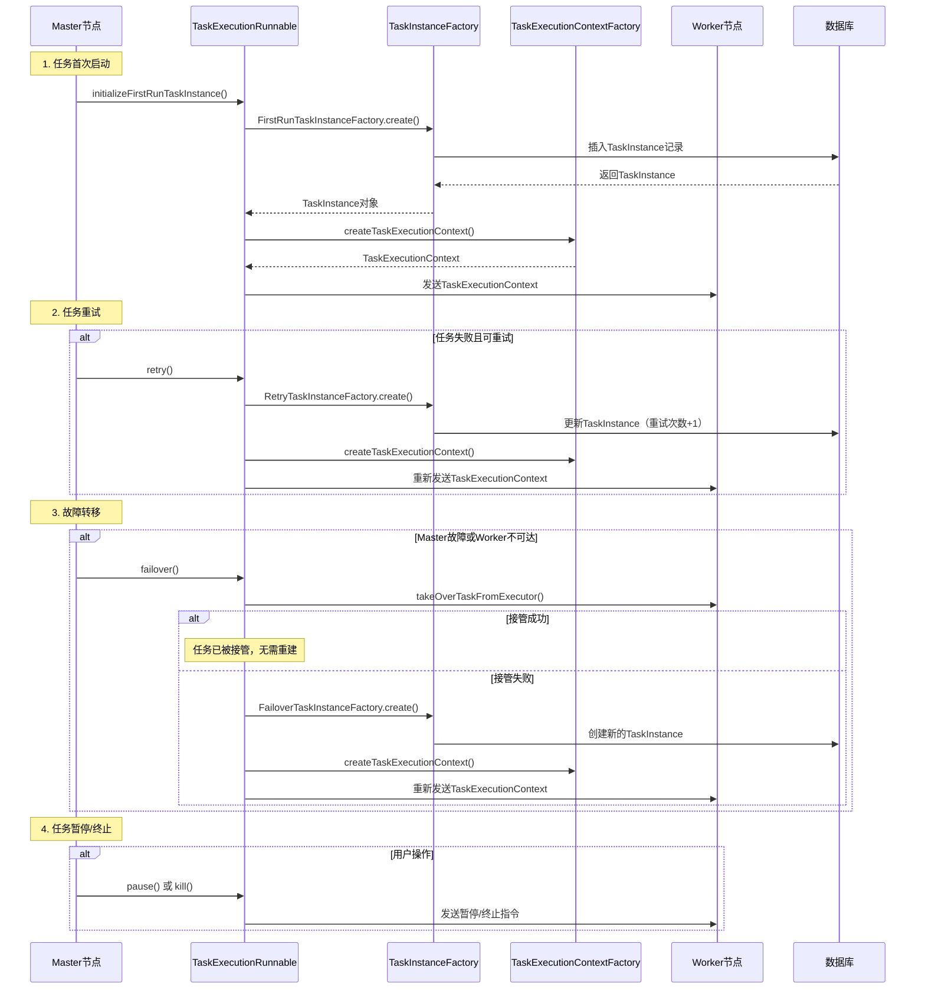

## 4. 字段对应关系分析

### 4.1 Command到WorkflowExecuteContext的字段映射

| Command字段 | WorkflowExecuteContext字段 | 说明 | 转换位置 |
|------------|---------------------------|------|---------|
| commandType | command.commandType | 命令类型 | WorkflowExecuteContextBuilder.withCommand() |
| workflowDefinitionCode | workflowDefinition.code | 工作流定义代码 | AbstractCommandHandler.assembleWorkflowDefinition() |
| workflowDefinitionVersion | workflowDefinition.version | 工作流定义版本 | AbstractCommandHandler.assembleWorkflowDefinition() |
| commandParam | command.commandParam | 命令参数 | WorkflowExecuteContextBuilder.withCommand() |
| workflowInstancePriority | workflowInstance.priority | 工作流实例优先级 | AbstractCommandHandler.assembleWorkflowInstance() |

### 4.2 TaskInstance到TaskExecutionContext的字段映射

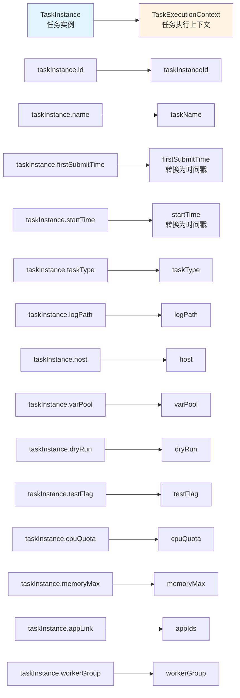

### 4.3 WorkflowInstance到TaskExecutionContext的字段映射

| WorkflowInstance字段 | TaskExecutionContext字段 | 说明 |
|---------------------|------------------------|------|
| id | workflowInstanceId | 工作流实例ID |
| scheduleTime | scheduleTime（时间戳） | 调度时间 |
| globalParams | globalParams | 全局参数 |
| executorId | executorId | 执行者ID |
| cmdTypeIfComplement | cmdTypeIfComplement | 补数命令类型 |
| tenantCode | tenantCode | 租户代码 |
| workflowDefinitionCode | workflowDefinitionCode | 工作流定义代码 |
| workflowDefinitionVersion | workflowDefinitionVersion | 工作流定义版本 |
| projectCode | projectCode | 项目代码 |

### 4.4 TaskDefinition到TaskExecutionContext的字段映射

| TaskDefinition字段 | TaskExecutionContext字段 | 说明 |
|-------------------|------------------------|------|
| taskParams | taskParams | 任务参数 |
| timeout | taskTimeout（转换） | 超时时间（分钟转秒） |
| timeoutNotifyStrategy | taskTimeoutStrategy | 超时策略 |

### 4.5 参数合并关系

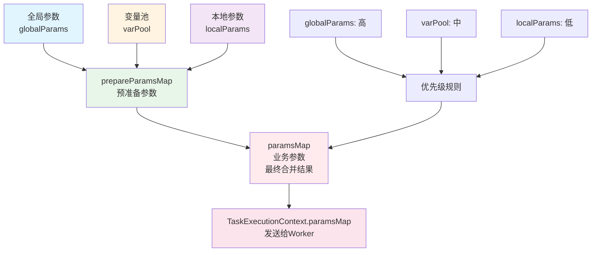

## 5. 状态流转图

### 5.1 Command状态流转

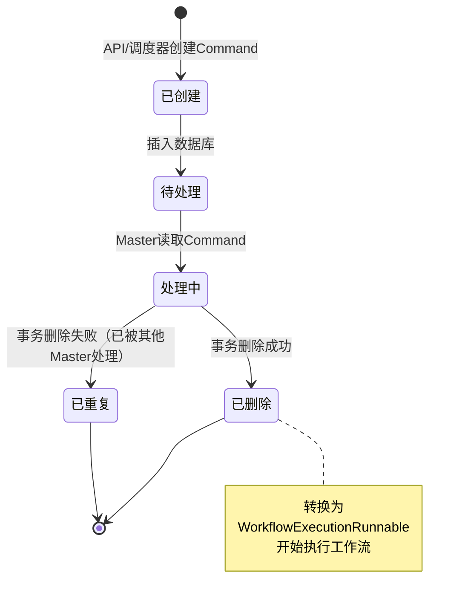

### 5.2 TaskInstance状态流转

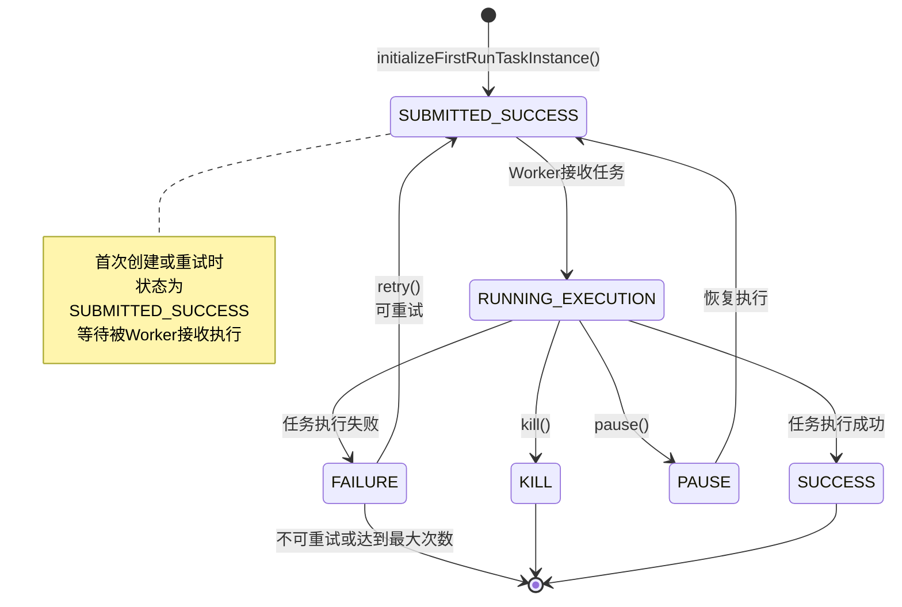

### 5.3 ITaskExecutionRunnable生命周期

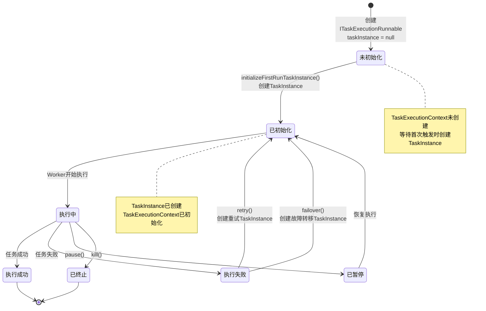

## 6. 组件交互图

### 6.1 Master内部组件交互

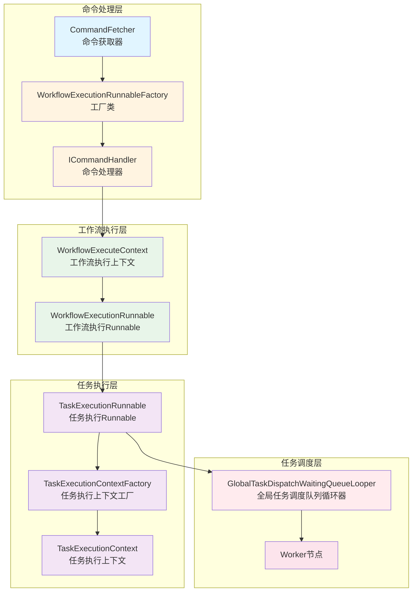

### 6.2 数据流向图

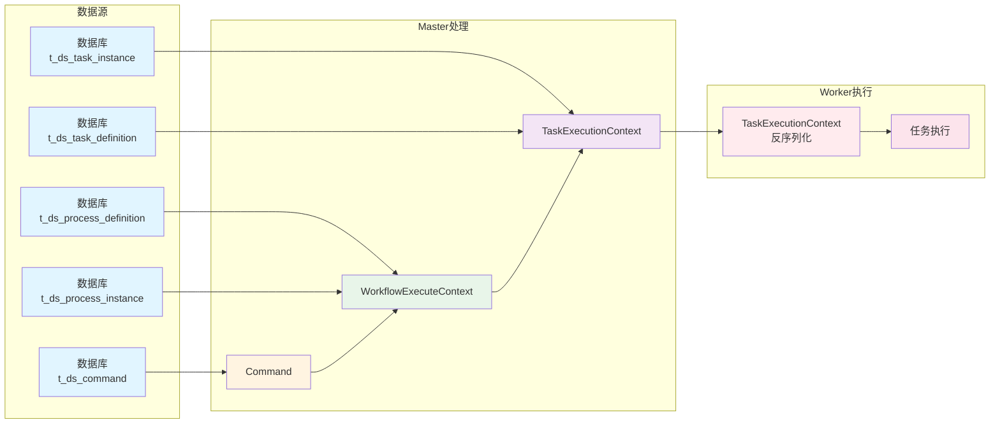

## 7. 关键设计模式

### 7.1 工厂模式

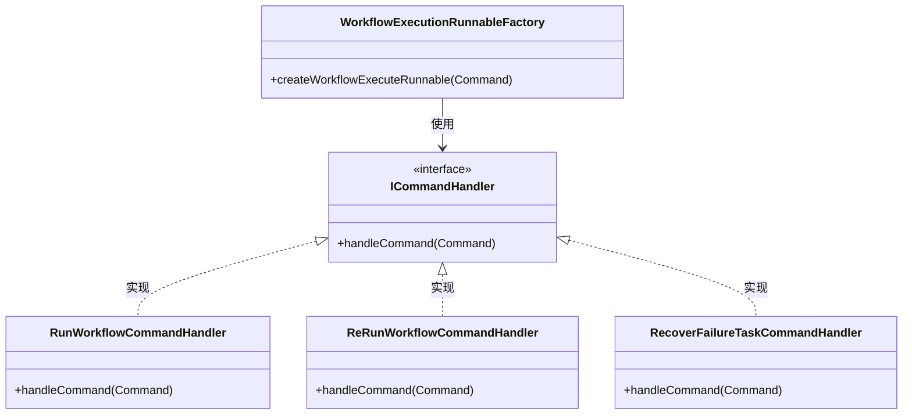

**说明：**
- `WorkflowExecutionRunnableFactory`根据Command的commandType选择对应的ICommandHandler
- 每个CommandHandler负责处理特定类型的Command
- 通过策略模式实现了不同类型命令的处理逻辑分离

### 7.2 建造者模式

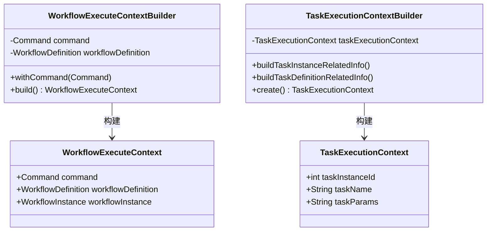

**说明：**
- 使用建造者模式构建复杂的Context对象
- 支持链式调用，代码更清晰
- 可以灵活组合不同的构建步骤

## 8. 关键流程详解

### 8.1 Command处理流程（防止重复处理）

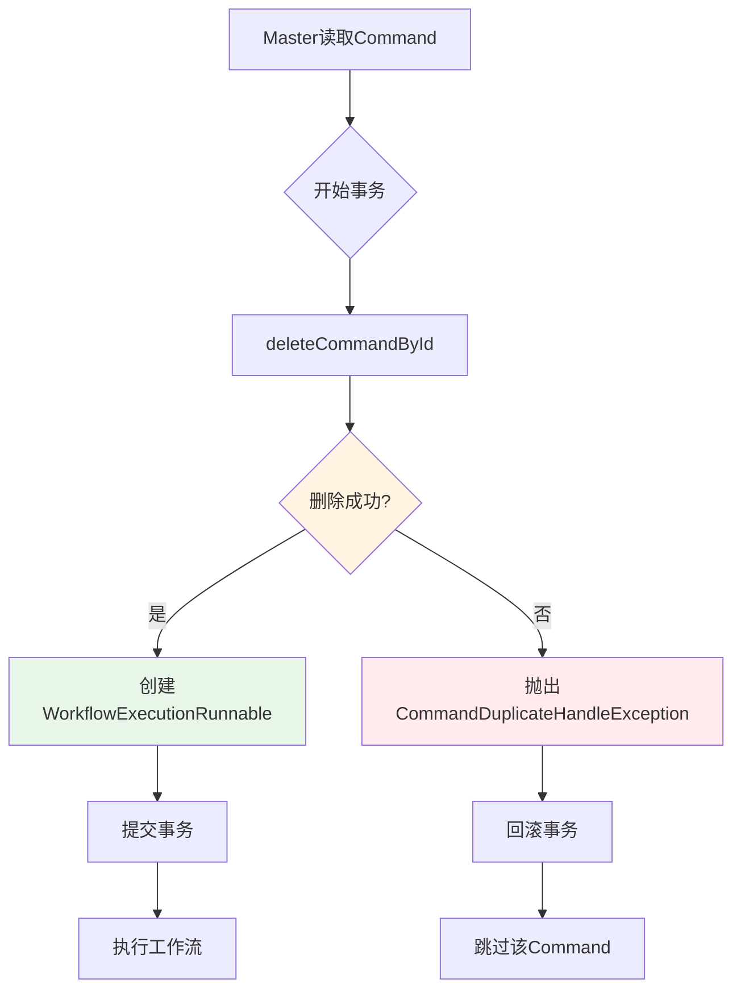

**关键点：**
1. 使用数据库事务确保原子性
2. 通过删除操作判断Command是否已被处理
3. 如果删除失败，说明已被其他Master处理，直接跳过
4. 这样可以避免在Master集群环境下重复处理同一个Command

### 8.2 TaskExecutionContext构建流程

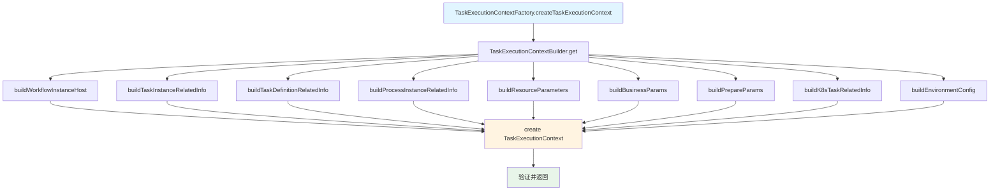

**构建步骤说明：**

1. **buildWorkflowInstanceHost**: 设置Master主机地址
2. **buildTaskInstanceRelatedInfo**: 从TaskInstance获取任务相关信息
   - taskInstanceId, taskName, startTime, taskType等
3. **buildTaskDefinitionRelatedInfo**: 从TaskDefinition获取任务定义信息
   - taskParams, taskTimeout, taskTimeoutStrategy
4. **buildProcessInstanceRelatedInfo**: 从WorkflowInstance获取工作流实例信息
   - workflowInstanceId, scheduleTime, globalParams等
5. **buildResourceParameters**: 解析和组装资源参数（数据源、文件等）
6. **buildBusinessParams**: 构建业务参数（最终合并的参数）
7. **buildPrepareParams**: 构建预准备参数（用于参数替换）
8. **buildK8sTaskRelatedInfo**: 如果是K8s任务，构建K8s相关上下文
9. **buildEnvironmentConfig**: 构建环境配置脚本

## 9. 字段对应关系详细表

### 9.1 Command → WorkflowExecuteContext → TaskExecutionContext 字段映射

| 层级 | 源字段 | 目标字段 | 转换方式 | 说明 |
|------|--------|---------|---------|------|
| Command | workflowDefinitionCode | WorkflowDefinition.code | 数据库查询 | 通过code查询WorkflowDefinition |
| Command | workflowDefinitionVersion | WorkflowDefinition.version | 数据库查询 | 指定版本号 |
| Command | commandParam | WorkflowInstance.globalParams | 参数解析 | 从commandParam中提取参数 |
| Command | workflowInstancePriority | WorkflowInstance.priority | 直接设置 | 工作流实例优先级 |
| WorkflowInstance | id | TaskExecutionContext.workflowInstanceId | 直接设置 | 工作流实例ID |
| WorkflowInstance | scheduleTime | TaskExecutionContext.scheduleTime | 日期转时间戳 | 调度时间 |
| WorkflowInstance | globalParams | TaskExecutionContext.globalParams | 直接设置 | 全局参数 |
| WorkflowInstance | executorId | TaskExecutionContext.executorId | 直接设置 | 执行者ID |
| TaskInstance | id | TaskExecutionContext.taskInstanceId | 直接设置 | 任务实例ID |
| TaskInstance | name | TaskExecutionContext.taskName | 直接设置 | 任务名称 |
| TaskInstance | firstSubmitTime | TaskExecutionContext.firstSubmitTime | Date转时间戳 | 首次提交时间 |
| TaskDefinition | taskParams | TaskExecutionContext.taskParams | 直接设置 | 任务参数 |
| TaskDefinition | timeout | TaskExecutionContext.taskTimeout | 分钟转秒 | 超时时间 |

### 9.2 参数合并详细流程

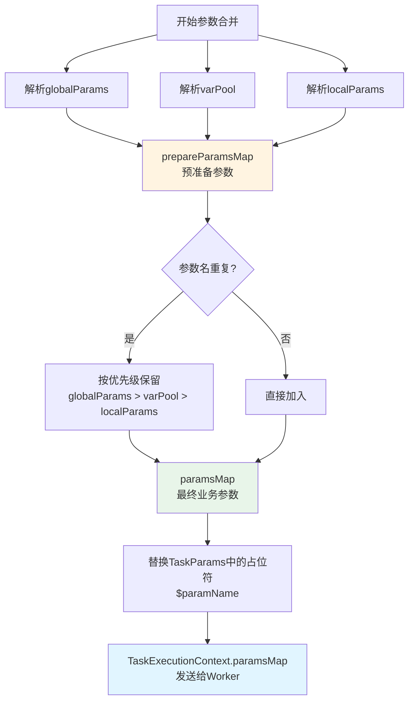

## 10. 总结

### 10.1 核心流转路径

```
Command (数据库)
  ↓
WorkflowExecutionRunnableFactory (工厂类)
  ↓
ICommandHandler (命令处理器)
  ↓
WorkflowExecuteContext (工作流执行上下文)
  ↓
WorkflowExecutionRunnable (工作流执行Runnable)
  ↓
ITaskExecutionRunnable (任务执行Runnable)
  ↓
TaskExecutionContextFactory (任务执行上下文工厂)
  ↓
TaskExecutionContext (任务执行上下文)
  ↓
Worker节点 (执行任务)
```

### 10.2 关键设计要点

1. **防重复处理**: 通过事务删除Command确保只处理一次
2. **延迟创建**: TaskInstance在首次触发时才创建，避免不必要的数据写入
3. **参数合并**: 按优先级合并globalParams、varPool、localParams
4. **生命周期管理**: 完善的初始化、重试、故障转移机制
5. **上下文传递**: TaskExecutionContext封装了任务执行所需的所有信息

### 10.3 关键字段说明

- **Command**: 工作流执行的入口，存储在数据库中
- **WorkflowExecuteContext**: 工作流执行上下文，包含工作流级别的信息
- **TaskExecutionContext**: 任务执行上下文，包含任务级别的信息，会被序列化发送给Worker
- **参数合并**: 通过prepareParamsMap和paramsMap实现多层级参数的合并和替换

---

**文档版本**: 1.0  
**最后更新**: 2024年  
**维护者**: DolphinScheduler开发团队

