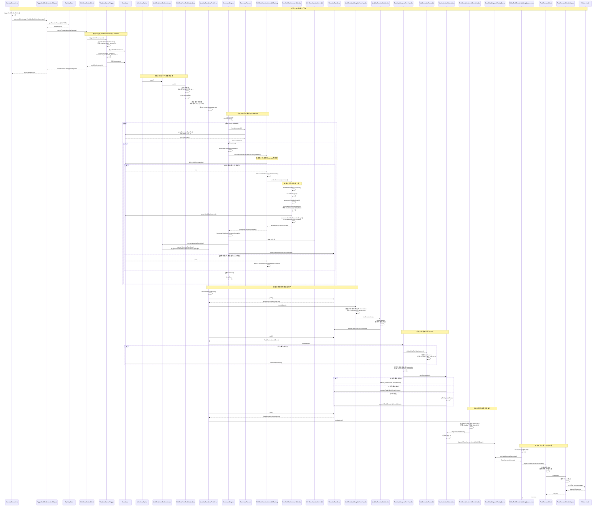
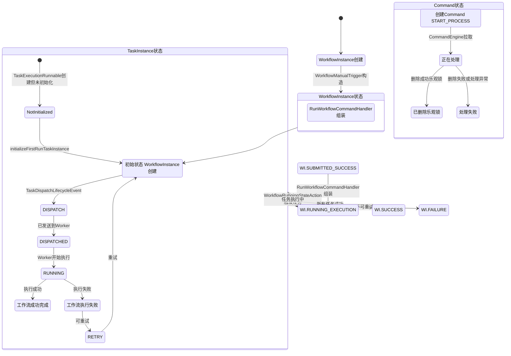

# 工作流正常执行流程分析

本文档详细分析从接口启动工作流定义到任务执行的完整流程，包括工作流和任务的状态变化以及对应的状态机处理。

## 一、流程概述

从API接口触发工作流定义开始，到最终任务被分发到Worker节点执行，整个流程涉及多个组件和状态转换：

1. **API层**：接收触发请求
2. **RPC调用**：API服务调用Master的RPC服务
3. **触发器**：Master构建WorkflowInstance和Command
4. **工作流引擎**：启动事件总线协调器和命令引擎
5. **命令处理**：拉取并处理Command，构建工作流执行图
6. **事件驱动**：通过事件总线处理工作流和任务生命周期
7. **任务分发**：任务进入分发队列，最终发送到Worker执行

## 二、详细时序图



## 三、状态流转图



## 四、组件交互流程图

```mermaid
flowchart TD
    Start([API触发工作流]) --> API[ExecutorServiceImpl<br/>triggerWorkflowDefinition]
    
    API --> Delegate[TriggerWorkflowExecutorDelegate<br/>execute]
    Delegate --> Registry[RegistryClient<br/>getRandomServer]
    Registry --> RPC[WorkflowControlClient<br/>manualTriggerWorkflow]
    
    RPC --> Trigger[WorkflowManualTrigger<br/>triggerWorkflow]
    
    Trigger --> WI[构建WorkflowInstance<br/>状态: SUBMITTED_SUCCESS]
    WI --> CMD[构建Command<br/>CommandType: START_PROCESS]
    CMD --> DB1[(数据库<br/>插入WorkflowInstance和Command)]
    
    DB1 --> Engine[WorkflowEngine.start]
    
    Engine --> Coord[WorkflowEventBusCoordinator<br/>start]
    Coord --> Workers[WorkflowEventBusFireWorkers<br/>创建线程池和Worker数组]
    
    Engine --> CmdEngine[CommandEngine.start<br/>启动命令处理线程]
    
    CmdEngine --> Loop{循环拉取Command}
    Loop -->|有Command| Fetch[CommandFetcher<br/>fetchCommands<br/>分片查询]
    Fetch --> Bootstrap[bootstrapCommand]
    
    Bootstrap --> Factory[WorkflowExecutionRunnableFactory<br/>createWorkflowExecuteRunnable]
    
    Factory --> OptLock{乐观锁<br/>deleteCommand}
    OptLock -->|删除成功| Handler[RunWorkflowCommandHandler<br/>handleCommand]
    OptLock -->|删除失败| Skip[跳过，已被其他Master处理]
    
    Handler --> Assemble1[assembleWorkflowDefinition]
    Assemble1 --> Assemble2[assembleProject]
    Assemble2 --> Assemble3[assembleWorkflowGraph]
    Assemble3 --> Assemble4[assembleWorkflowInstance<br/>状态更新: RUNNING_EXECUTION]
    Assemble4 --> Assemble5[assembleWorkflowExecutionGraph<br/>创建TaskExecutionRunnable]
    
    Assemble5 --> Register[注册到WorkflowEventBusCoordinator<br/>计算槽位: workflowInstanceId % workerSize]
    
    Register --> Publish1[发布WorkflowStartLifecycleEvent]
    
    Publish1 --> WorkerLoop[WorkflowEventBusFireWorker<br/>定时轮询事件]
    
    WorkerLoop --> Handler1[WorkflowStartLifecycleEventHandler<br/>处理事件]
    
    Handler1 --> Action1[WorkflowRunningStateAction<br/>startEventAction]
    Action1 --> TriggerTasks[triggerTasks<br/>查找可触发任务]
    
    TriggerTasks --> Publish2[发布TaskStartLifecycleEvent]
    
    Publish2 --> Handler2[TaskStartLifecycleEventHandler<br/>处理事件]
    
    Handler2 --> InitTask{任务已初始化?}
    InitTask -->|否| CreateTask[initializeFirstRunTaskInstance<br/>创建TaskInstance<br/>状态: SUBMITTED_SUCCESS]
    CreateTask --> Action2[TaskSubmittedStateAction<br/>startEventAction]
    InitTask -->|是| Action2
    
    Action2 --> TryDispatch[tryToDispatchTask]
    TryDispatch --> Publish3[发布TaskDispatchLifecycleEvent]
    
    Publish3 --> Handler3[TaskDispatchLifecycleEventHandler<br/>处理事件]
    Handler3 --> Action3[TaskSubmittedStateAction<br/>dispatchEventAction]
    
    Action3 --> DispatchQueue[GlobalTaskDispatchWaitingQueue<br/>dispatchTaskExecuteRunnableWithDelay]
    
    DispatchQueue --> QueueLooper[GlobalTaskDispatchWaitingQueueLooper<br/>doDispatch循环]
    
    QueueLooper --> ExecClient[ITaskExecutorClient<br/>dispatch]
    
    ExecClient --> ClientDelegator[ITaskExecutorClientDelegator<br/>dispatch<br/>选择Worker节点]
    
    ClientDelegator --> WorkerNode[Worker Node<br/>RPC调用]
    
    WorkerNode --> End([任务开始执行])
    
    Loop -->|无Command| Sleep[Sleep 1s]
    Sleep --> Loop
    
    Skip --> Loop

    style Start fill:#e1f5ff
    style End fill:#c8e6c9
    style OptLock fill:#fff3e0
    style Register fill:#f3e5f5
    style Publish1 fill:#f3e5f5
    style Publish2 fill:#f3e5f5
    style Publish3 fill:#f3e5f5
```



## 五、关键状态说明

### 5.1 WorkflowInstance状态流转

| 状态 | 触发时机 | 说明 |
|------|---------|------|
| SUBMITTED_SUCCESS | WorkflowManualTrigger.constructWorkflowInstance() | 工作流实例初始创建状态 |
| RUNNING_EXECUTION | RunWorkflowCommandHandler.assembleWorkflowInstance() | 工作流开始执行 |
| SUCCESS | 所有任务执行成功 | 工作流执行成功 |
| FAILURE | 任务失败且不可重试 | 工作流执行失败 |

### 5.2 TaskInstance状态流转

| 状态 | 触发时机 | 说明 |
|------|---------|------|
| NotInitialized | TaskExecutionRunnable创建时 | 任务实例尚未创建 |
| SUBMITTED_SUCCESS | TaskExecutionRunnable.initializeFirstRunTaskInstance() | 任务已提交，等待分发 |
| DISPATCH | TaskDispatchLifecycleEvent发布 | 任务准备分发 |
| DISPATCHED | ITaskExecutorClientDelegator.dispatch()成功 | 任务已发送到Worker |
| RUNNING | Worker开始执行任务 | 任务执行中 |
| SUCCESS | 任务执行成功 | 任务执行成功 |
| FAILURE | 任务执行失败 | 任务执行失败 |

### 5.3 Command处理机制

**乐观锁设计**：
- Command创建后插入数据库
- 多个Master可能同时拉取到同一个Command
- 使用事务删除Command，删除成功表示获得处理权
- 删除失败表示已被其他Master处理，跳过处理

**优点**：
- 避免分布式环境下的重复处理
- 无需额外的分布式锁机制
- 实现简单高效

## 六、关键组件说明

### 6.1 WorkflowEventBusCoordinator

**职责**：管理工作流事件总线的注册和分发

**工作原理**：
- 启动多个WorkflowEventBusFireWorker线程（默认CPU核心数*2+1）
- 根据`workflowInstanceId % workerSize`计算槽位，将工作流分配到不同的Worker
- 每个Worker定时（100ms）轮询已注册工作流的事件

### 6.2 CommandEngine

**职责**：循环拉取并处理Command

**工作流程**：
1. 启动后台线程，循环执行
2. 调用CommandFetcher.fetchCommands()拉取Command（支持分片）
3. 对每个Command异步执行bootstrapCommand
4. 通过WorkflowExecutionRunnableFactory将Command转换为WorkflowExecutionRunnable
5. 注册工作流到事件总线协调器并发布启动事件

### 6.3 WorkflowExecutionRunnableFactory

**职责**：将Command转换为WorkflowExecutionRunnable

**乐观锁实现**：
```java
@Transactional
public IWorkflowExecutionRunnable createWorkflowExecuteRunnable(Command command) {
    deleteCommandOrThrow(command);  // 先删除Command
    return doCreateWorkflowExecutionRunnable(command);  // 再处理
}
```

### 6.4 RunWorkflowCommandHandler

**职责**：处理START_PROCESS类型的Command

**组装流程**：
1. assembleWorkflowDefinition：加载工作流定义
2. assembleProject：加载项目信息
3. assembleWorkflowGraph：构建工作流DAG图
4. assembleWorkflowInstance：创建工作流实例（状态：RUNNING_EXECUTION）
5. assembleWorkflowExecutionGraph：构建任务执行图，创建TaskExecutionRunnable

### 6.5 GlobalTaskDispatchWaitingQueue

**职责**：全局任务分发等待队列

**特性**：
- 使用PriorityDelayQueue实现优先级和延迟调度
- 支持按优先级排序（工作流优先级、任务优先级、任务组优先级、提交时间）
- 支持延迟调度（delayTime）

### 6.6 ITaskExecutorClientDelegator

**职责**：任务执行客户端委托器

**实现类**：
- LogicTaskExecutorClientDelegator：逻辑任务（在Master执行）
- PhysicalTaskExecutorClientDelegator：物理任务（在Worker执行）

## 七、事件驱动机制

### 7.1 工作流生命周期事件

| 事件类型 | 发布时机 | 处理器 | 状态机 |
|---------|---------|--------|--------|
| WorkflowStartLifecycleEvent | CommandEngine.bootstrapWorkflowExecutionRunnable() | WorkflowStartLifecycleEventHandler | WorkflowRunningStateAction |
| WorkflowSucceedLifecycleEvent | 所有任务成功 | WorkflowSucceedLifecycleEventHandler | WorkflowSucceedStateAction |
| WorkflowFailedLifecycleEvent | 任务失败且不可重试 | WorkflowFailedLifecycleEventHandler | WorkflowFailedStateAction |

### 7.2 任务生命周期事件

| 事件类型 | 发布时机 | 处理器 | 状态机 |
|---------|---------|--------|--------|
| TaskStartLifecycleEvent | WorkflowRunningStateAction.triggerTasks() | TaskStartLifecycleEventHandler | TaskSubmittedStateAction |
| TaskDispatchLifecycleEvent | TaskSubmittedStateAction.tryToDispatchTask() | TaskDispatchLifecycleEventHandler | TaskSubmittedStateAction |
| TaskDispatchedLifecycleEvent | ITaskExecutorClient.dispatch()成功 | TaskDispatchedLifecycleEventHandler | TaskDispatchedStateAction |
| TaskRunningLifecycleEvent | Worker开始执行任务 | TaskRunningLifecycleEventHandler | TaskRunningStateAction |

## 八、设计亮点

### 8.1 事件驱动架构

- 工作流和任务通过事件总线解耦
- 状态机模式处理状态转换
- 支持异步处理和扩展

### 8.2 乐观锁机制

- Command删除操作作为分布式锁
- 避免重复处理，实现简单高效

### 8.3 分片机制

- CommandFetcher支持按ID和Slot分片
- 支持多Master并发处理
- 提高系统吞吐量

### 8.4 延迟创建

- TaskInstance延迟到首次触发时创建
- 避免不必要的数据库写入
- 提高系统性能

### 8.5 优先级调度

- GlobalTaskDispatchWaitingQueue支持多维度优先级
- 确保重要任务优先执行

## 九、总结

整个工作流执行流程采用事件驱动架构，通过状态机模式管理状态转换。从API触发到任务分发，每个环节都经过精心设计，确保系统的可靠性、可扩展性和高性能。

关键流程：
1. API → RPC → 触发器：构建WorkflowInstance和Command
2. WorkflowEngine：启动事件总线协调器
3. CommandEngine：循环拉取并处理Command（乐观锁）
4. RunWorkflowCommandHandler：组装工作流执行上下文
5. 事件驱动：WorkflowStartLifecycleEvent → TaskStartLifecycleEvent → TaskDispatchLifecycleEvent
6. 任务分发：GlobalTaskDispatchWaitingQueue → ITaskExecutorClientDelegator → Worker

整个流程体现了分布式系统的设计精髓：异步处理、事件驱动、状态管理、乐观锁等。

