# 工作流执行完整流程汇总

本文档详细汇总从工作流启动到Worker任务执行的所有WorkflowInstance状态和TaskInstance状态，以及对应的处理器和状态机。

## 一、状态汇总

### 1.1 WorkflowInstance状态

| 状态 | 代码 | 说明 | 触发点 |
|------|------|------|--------|
| SUBMITTED_SUCCESS | 0 | 提交成功 | WorkflowManualTrigger.constructWorkflowInstance() |
| RUNNING_EXECUTION | 1 | 运行中 | RunWorkflowCommandHandler.assembleWorkflowInstance() |
| READY_PAUSE | 2 | 准备暂停 | 用户暂停操作 |
| PAUSE | 3 | 已暂停 | WorkflowPausedStateAction |
| READY_STOP | 4 | 准备停止 | 用户停止操作 |
| STOP | 5 | 已停止 | WorkflowStoppedStateAction |
| FAILURE | 6 | 执行失败 | WorkflowFailedStateAction |
| SUCCESS | 7 | 执行成功 | WorkflowSuccessStateAction |
| SERIAL_WAIT | 14 | 串行等待 | 串行工作流场景 |
| FAILOVER | 18 | 故障转移 | WorkflowFailoverCommandHandler |

### 1.2 TaskInstance状态

| 状态 | 代码 | 说明 | 触发点 |
|------|------|------|--------|
| SUBMITTED_SUCCESS | 0 | 提交成功 | TaskExecutionRunnable.initializeFirstRunTaskInstance() |
| RUNNING_EXECUTION | 1 | 运行中 | Worker开始执行任务 |
| PAUSE | 3 | 已暂停 | TaskPauseStateAction |
| FAILURE | 6 | 执行失败 | 任务执行失败 |
| SUCCESS | 7 | 执行成功 | 任务执行成功 |
| NEED_FAULT_TOLERANCE | 8 | 需要容错 | 任务需要容错处理 |
| KILL | 9 | 已杀死 | TaskKillStateAction |
| DELAY_EXECUTION | 12 | 延迟执行 | TaskDelayExecutionStateAction |
| FORCED_SUCCESS | 13 | 强制成功 | TaskForceSuccessStateAction |
| DISPATCH | 17 | 已分发 | TaskDispatchStateAction |

## 二、处理器汇总

### 2.1 ICommandHandler实现类

| 处理器 | CommandType | 说明 |
|--------|-------------|------|
| RunWorkflowCommandHandler | START_PROCESS | 启动新的工作流实例 |
| ReRunWorkflowCommandHandler | REPEAT_RUNNING | 重新运行工作流 |
| RecoverFailureTaskCommandHandler | START_FAILURE_TASK_PROCESS | 从失败任务恢复 |
| WorkflowFailoverCommandHandler | RECOVER_TOLERANCE_FAULT_PROCESS | 故障转移恢复 |
| BackfillWorkflowCommandHandler | COMPLEMENT_DATA | 补数 |
| ScheduleWorkflowCommandHandler | SCHEDULER | 调度触发 |

### 2.2 AbstractWorkflowLifecycleLifecycleEvent子类

| 事件 | EventType | 说明 |
|------|-----------|------|
| WorkflowStartLifecycleEvent | START | 工作流启动事件 |
| WorkflowSucceedLifecycleEvent | SUCCEED | 工作流成功事件 |
| WorkflowFailedLifecycleEvent | FAILED | 工作流失败事件 |
| WorkflowStopLifecycleEvent | STOP | 工作流停止事件 |
| WorkflowStoppedLifecycleEvent | STOPPED | 工作流已停止事件 |
| WorkflowPauseLifecycleEvent | PAUSE | 工作流暂停事件 |
| WorkflowPausedLifecycleEvent | PAUSED | 工作流已暂停事件 |
| WorkflowTopologyLogicalTransitionWithTaskFinishLifecycleEvent | TOPOLOGY_LOGICAL_TRANSACTION_WITH_TASK_FINISH | 任务完成拓扑逻辑转换事件 |
| WorkflowFinalizeLifecycleEvent | FINALIZE | 工作流完成事件 |

### 2.3 AbstractWorkflowLifecycleEventHandler子类

| 处理器 | 处理事件 | 说明 |
|--------|---------|------|
| WorkflowStartLifecycleEventHandler | WorkflowStartLifecycleEvent | 处理工作流启动 |
| WorkflowSucceedLifecycleEventHandler | WorkflowSucceedLifecycleEvent | 处理工作流成功 |
| WorkflowFailedLifecycleEventHandler | WorkflowFailedLifecycleEvent | 处理工作流失败 |
| WorkflowStopLifecycleEventHandler | WorkflowStopLifecycleEvent | 处理工作流停止 |
| WorkflowStoppedLifecycleEventHandler | WorkflowStoppedLifecycleEvent | 处理工作流已停止 |
| WorkflowPauseLifecycleEventHandler | WorkflowPauseLifecycleEvent | 处理工作流暂停 |
| WorkflowPausedLifecycleEventHandler | WorkflowPausedLifecycleEvent | 处理工作流已暂停 |
| WorkflowTopologyLogicalTransitionWithTaskFinishLifecycleEventHandler | WorkflowTopologyLogicalTransitionWithTaskFinishLifecycleEvent | 处理任务完成拓扑逻辑转换 |
| WorkflowFinalizeLifecycleEventHandler | WorkflowFinalizeLifecycleEvent | 处理工作流完成 |

### 2.4 AbstractWorkflowStateAction子类

| 状态动作 | 匹配状态 | 说明 |
|---------|---------|------|
| WorkflowSubmittedStateAction | SUBMITTED_SUCCESS | 工作流提交状态动作 |
| WorkflowRunningStateAction | RUNNING_EXECUTION | 工作流运行状态动作 |
| WorkflowReadyPauseStateAction | READY_PAUSE | 工作流准备暂停状态动作 |
| WorkflowPausedStateAction | PAUSE | 工作流暂停状态动作 |
| WorkflowReadyStopStateAction | READY_STOP | 工作流准备停止状态动作 |
| WorkflowStoppedStateAction | STOP | 工作流停止状态动作 |
| WorkflowFailedStateAction | FAILURE | 工作流失败状态动作 |
| WorkflowSuccessStateAction | SUCCESS | 工作流成功状态动作 |
| WorkflowSerialWaitStateAction | SERIAL_WAIT | 工作流串行等待状态动作 |
| WorkflowFailoverStateAction | FAILOVER | 工作流故障转移状态动作 |

### 2.5 AbstractTaskLifecycleEvent子类

| 事件 | EventType | 说明 |
|------|-----------|------|
| TaskStartLifecycleEvent | START | 任务启动事件 |
| TaskDispatchLifecycleEvent | DISPATCH | 任务分发事件 |
| TaskDispatchedLifecycleEvent | DISPATCHED | 任务已分发事件 |
| TaskRunningLifecycleEvent | RUNNING | 任务运行事件 |
| TaskRuntimeContextChangedEvent | RUNTIME_CONTEXT_CHANGED | 任务运行时上下文变更事件 |
| TaskTimeoutLifecycleEvent | TIMEOUT | 任务超时事件 |
| TaskRetryLifecycleEvent | RETRY | 任务重试事件 |
| TaskPauseLifecycleEvent | PAUSE | 任务暂停事件 |
| TaskPausedLifecycleEvent | PAUSED | 任务已暂停事件 |
| TaskFailoverLifecycleEvent | FAILOVER | 任务故障转移事件 |
| TaskKillLifecycleEvent | KILL | 任务杀死事件 |
| TaskKilledLifecycleEvent | KILLED | 任务已杀死事件 |
| TaskSuccessLifecycleEvent | SUCCEEDED | 任务成功事件 |
| TaskFailedLifecycleEvent | FAILED | 任务失败事件 |

### 2.6 AbstractTaskLifecycleEventHandler子类

| 处理器 | 处理事件 | 说明 |
|--------|---------|------|
| TaskStartLifecycleEventHandler | TaskStartLifecycleEvent | 处理任务启动 |
| TaskDispatchLifecycleEventHandler | TaskDispatchLifecycleEvent | 处理任务分发 |
| TaskDispatchedLifecycleEventHandler | TaskDispatchedLifecycleEvent | 处理任务已分发 |
| TaskRunningLifecycleEventHandler | TaskRunningLifecycleEvent | 处理任务运行 |
| TaskRuntimeContextChangedLifecycleEventHandler | TaskRuntimeContextChangedEvent | 处理任务运行时上下文变更 |
| TaskTimeoutLifecycleEventHandler | TaskTimeoutLifecycleEvent | 处理任务超时 |
| TaskRetryLifecycleEventHandler | TaskRetryLifecycleEvent | 处理任务重试 |
| TaskPauseLifecycleEventHandler | TaskPauseLifecycleEvent | 处理任务暂停 |
| TaskPausedLifecycleEventHandler | TaskPausedLifecycleEvent | 处理任务已暂停 |
| TaskFailoverLifecycleEventHandler | TaskFailoverLifecycleEvent | 处理任务故障转移 |
| TaskKillLifecycleEventHandler | TaskKillLifecycleEvent | 处理任务杀死 |
| TaskKilledLifecycleEventHandler | TaskKilledLifecycleEvent | 处理任务已杀死 |
| TaskSuccessLifecycleEventHandler | TaskSuccessLifecycleEvent | 处理任务成功 |
| TaskFailedLifecycleEventHandler | TaskFailedLifecycleEvent | 处理任务失败 |

### 2.7 AbstractTaskStateAction子类

| 状态动作 | 匹配状态 | 说明 |
|---------|---------|------|
| TaskSubmittedStateAction | SUBMITTED_SUCCESS | 任务提交状态动作 |
| TaskDelayExecutionStateAction | DELAY_EXECUTION | 任务延迟执行状态动作 |
| TaskDispatchStateAction | DISPATCH | 任务分发状态动作 |
| TaskRunningStateAction | RUNNING_EXECUTION | 任务运行状态动作 |
| TaskPauseStateAction | PAUSE | 任务暂停状态动作 |
| TaskKillStateAction | KILL | 任务杀死状态动作 |
| TaskFailureStateAction | FAILURE | 任务失败状态动作 |
| TaskSuccessStateAction | SUCCESS | 任务成功状态动作 |
| TaskForceSuccessStateAction | FORCED_SUCCESS | 任务强制成功状态动作 |
| TaskFailoverStateAction | NEED_FAULT_TOLERANCE | 任务故障转移状态动作 |

## 三、完整时序图

```mermaid
sequenceDiagram
    participant API as API接口
    participant Delegate as TriggerWorkflowExecutorDelegate
    participant MasterRPC as WorkflowControlClient
    participant Trigger as WorkflowManualTrigger
    participant DB as Database
    participant Engine as WorkflowEngine
    participant Coordinator as WorkflowEventBusCoordinator
    participant Workers as WorkflowEventBusFireWorkers
    participant WorkerThread as WorkflowEventBusFireWorker
    participant CmdEngine as CommandEngine
    participant Factory as WorkflowExecutionRunnableFactory
    participant CmdHandler as ICommandHandler<br/>RunWorkflowCommandHandler
    participant WorkflowRunnable as WorkflowExecutionRunnable
    participant WorkflowBus as WorkflowEventBus
    participant WfEventHandler as AbstractWorkflowLifecycleEventHandler<br/>WorkflowStartLifecycleEventHandler
    participant WfStateAction as AbstractWorkflowStateAction<br/>WorkflowRunningStateAction
    participant TaskStartHandler as AbstractTaskLifecycleEventHandler<br/>TaskStartLifecycleEventHandler
    participant TaskRunnable as TaskExecutionRunnable
    participant TaskStateAction1 as AbstractTaskStateAction<br/>TaskSubmittedStateAction
    participant TaskDispatchHandler as AbstractTaskLifecycleEventHandler<br/>TaskDispatchLifecycleEventHandler
    participant TaskStateAction2 as AbstractTaskStateAction<br/>TaskSubmittedStateAction
    participant DispatchQueue as GlobalTaskDispatchWaitingQueue
    participant QueueLooper as GlobalTaskDispatchWaitingQueueLooper
    participant ExecutorClient as ITaskExecutorClient
    participant ClientDelegator as ITaskExecutorClientDelegator
    participant Worker as Worker Node
    participant TaskRunningHandler as AbstractTaskLifecycleEventHandler<br/>TaskRunningLifecycleEventHandler
    participant TaskStateAction3 as AbstractTaskStateAction<br/>TaskRunningStateAction
    participant TaskSuccessHandler as AbstractTaskLifecycleEventHandler<br/>TaskSuccessLifecycleEventHandler
        participant TaskStateAction4 as AbstractTaskStateAction<br/>TaskSuccessStateAction
    participant TopologyHandler as AbstractWorkflowLifecycleEventHandler<br/>WorkflowTopologyLogicalTransitionEventHandler
    participant WfStateAction2 as AbstractWorkflowStateAction<br/>WorkflowRunningStateAction
    participant WfSucceedHandler as AbstractWorkflowLifecycleEventHandler<br/>WorkflowSucceedLifecycleEventHandler
    participant WfStateAction3 as AbstractWorkflowStateAction<br/>WorkflowSuccessStateAction

    Note over API,DB: 阶段1: 构建WorkflowInstance和Command
    API->>Delegate: triggerWorkflowDefinition()
    Delegate->>MasterRPC: manualTriggerWorkflow()
    MasterRPC->>Trigger: triggerWorkflow()
    Trigger->>Trigger: constructWorkflowInstance()<br/>状态: SUBMITTED_SUCCESS
    Trigger->>DB: 插入WorkflowInstance
    Trigger->>Trigger: constructTriggerCommand()<br/>CommandType: START_PROCESS
    Trigger->>DB: 插入Command
    Trigger-->>MasterRPC: workflowInstanceId

    Note over Engine,Workers: 阶段2: 启动工作流事件总线
    Engine->>Coordinator: start()
    Coordinator->>Workers: start()
    Workers->>Workers: 创建线程池和Worker数组
    Workers->>WorkerThread: 注册事件处理器<br/>安排定时任务(100ms)
    WorkerThread->>WorkerThread: [循环] fireAllRegisteredEvent()

    Note over CmdEngine,CmdHandler: 阶段3: 命令引擎处理Command
    CmdEngine->>CmdEngine: start() 启动线程
    loop 循环拉取Command
        CmdEngine->>CmdEngine: fetchCommands()<br/>乐观锁:先删除再处理
        CmdEngine->>Factory: createWorkflowExecuteRunnable(command)
        Factory->>CmdHandler: handleCommand(command)
        
        Note over CmdHandler: 组装工作流执行上下文
        CmdHandler->>CmdHandler: assembleWorkflowDefinition()
        CmdHandler->>CmdHandler: assembleProject()
        CmdHandler->>CmdHandler: assembleWorkflowGraph()
        CmdHandler->>CmdHandler: assembleWorkflowInstance()<br/>状态: RUNNING_EXECUTION
        CmdHandler->>DB: upsertWorkflowInstance()
        CmdHandler->>CmdHandler: assembleWorkflowExecutionGraph()<br/>创建TaskExecutionRunnable
        CmdHandler-->>Factory: WorkflowExecutionRunnable
        Factory-->>CmdEngine: WorkflowExecutionRunnable
        
        CmdEngine->>WorkflowRunnable: 注册到仓库
        CmdEngine->>Coordinator: registerWorkflowEventBus()
        CmdEngine->>WorkflowBus: publish(WorkflowStartLifecycleEvent)
    end

    Note over WorkerThread,WfStateAction: 阶段4: 处理工作流启动事件
    WorkerThread->>WorkflowBus: poll()
    WorkflowBus-->>WorkerThread: WorkflowStartLifecycleEvent
    WorkerThread->>WfEventHandler: handle(event)
    WfEventHandler->>WfEventHandler: 根据工作流状态选择StateAction<br/>状态: RUNNING_EXECUTION
    WfEventHandler->>WfStateAction: startEventAction()
    WfStateAction->>WfStateAction: triggerTasks()<br/>查找可触发任务
    WfStateAction->>WorkflowBus: publish(TaskStartLifecycleEvent)

    Note over TaskStartHandler,TaskStateAction1: 阶段5: 处理任务启动事件
    WorkerThread->>WorkflowBus: poll()
    WorkflowBus-->>WorkerThread: TaskStartLifecycleEvent
    WorkerThread->>TaskStartHandler: handle(event)
    
    alt 任务未初始化
        TaskStartHandler->>TaskRunnable: initializeFirstRunTaskInstance()
        TaskRunnable->>TaskRunnable: 创建TaskInstance<br/>状态: SUBMITTED_SUCCESS
        TaskRunnable->>DB: insert(taskInstance)
    end
    
    TaskStartHandler->>TaskStartHandler: 根据任务状态选择StateAction<br/>状态: SUBMITTED_SUCCESS
    TaskStartHandler->>TaskStateAction1: startEventAction()
    
    alt 工作流准备暂停
        TaskStateAction1->>WorkflowBus: publish(TaskPausedLifecycleEvent)
    else 工作流准备停止
        TaskStateAction1->>WorkflowBus: publish(TaskKilledLifecycleEvent)
    else 正常调度
        TaskStateAction1->>TaskStateAction1: tryToDispatchTask()
        TaskStateAction1->>WorkflowBus: publish(TaskDispatchLifecycleEvent)
    end

    Note over TaskDispatchHandler,TaskStateAction2: 阶段6: 处理任务分发事件
    WorkerThread->>WorkflowBus: poll()
    WorkflowBus-->>WorkerThread: TaskDispatchLifecycleEvent
    WorkerThread->>TaskDispatchHandler: handle(event)
    TaskDispatchHandler->>TaskDispatchHandler: 根据任务状态选择StateAction<br/>状态: SUBMITTED_SUCCESS
    TaskDispatchHandler->>TaskStateAction2: dispatchEventAction()
    TaskStateAction2->>TaskStateAction2: 计算延迟时间
    TaskStateAction2->>TaskStateAction2: 更新任务状态: DISPATCH
    TaskStateAction2->>DB: update(taskInstance)
    TaskStateAction2->>DispatchQueue: dispatchTaskExecuteRunnableWithDelay()

    Note over QueueLooper,ClientDelegator: 阶段7: 任务分发队列处理
    QueueLooper->>QueueLooper: doDispatch() 循环执行
    QueueLooper->>DispatchQueue: takeTaskExecuteRunnable()
    DispatchQueue-->>QueueLooper: TaskExecutionRunnable
    QueueLooper->>ExecutorClient: dispatch(taskExecutionRunnable)
    ExecutorClient->>ExecutorClient: 判断任务类型<br/>逻辑任务/物理任务
    ExecutorClient->>ClientDelegator: dispatch()
    ClientDelegator->>ClientDelegator: 选择Worker节点
    ClientDelegator->>Worker: RPC调用 dispatchTask()
    Worker-->>ClientDelegator: dispatchResponse
    ClientDelegator-->>ExecutorClient: success
    ExecutorClient->>WorkflowBus: publish(TaskDispatchedLifecycleEvent)
    ExecutorClient-->>QueueLooper: success

    Note over Worker,TaskStateAction3: 阶段8: Worker执行任务
    Worker->>Worker: 执行任务
    Worker->>Worker: 发布TaskRunningLifecycleEvent
    WorkerThread->>WorkflowBus: poll()
    WorkflowBus-->>WorkerThread: TaskRunningLifecycleEvent
    WorkerThread->>TaskRunningHandler: handle(event)
    TaskRunningHandler->>TaskRunningHandler: 根据任务状态选择StateAction<br/>状态: DISPATCH
    TaskRunningHandler->>TaskStateAction3: startedEventAction()
    TaskStateAction3->>TaskStateAction3: 更新任务状态: RUNNING_EXECUTION
    TaskStateAction3->>DB: update(taskInstance)

    Note over Worker,TaskStateAction4: 阶段9: 任务执行完成
    Worker->>Worker: 任务执行完成
    Worker->>Worker: 发布TaskSuccessLifecycleEvent
    WorkerThread->>WorkflowBus: poll()
    WorkflowBus-->>WorkerThread: TaskSuccessLifecycleEvent
    WorkerThread->>TaskSuccessHandler: handle(event)
    TaskSuccessHandler->>TaskSuccessHandler: 根据任务状态选择StateAction<br/>状态: RUNNING_EXECUTION
    TaskSuccessHandler->>TaskStateAction4: succeedEventAction()
    TaskStateAction4->>TaskStateAction4: 更新任务状态: SUCCESS
    TaskStateAction4->>DB: update(taskInstance)
    TaskStateAction4->>WorkflowBus: publish(WorkflowTopologyLogicalTransitionEvent)

    Note over TopologyHandler,WfStateAction3: 阶段10: 工作流拓扑逻辑转换
    WorkerThread->>WorkflowBus: poll()
    WorkflowBus-->>WorkerThread: WorkflowTopologyLogicalTransitionEvent
    WorkerThread->>TopologyHandler: handle(event)
    TopologyHandler->>TopologyHandler: 根据工作流状态选择StateAction<br/>状态: RUNNING_EXECUTION
    TopologyHandler->>WfStateAction2: topologyLogicalTransitionEventAction()
    WfStateAction2->>WfStateAction2: 标记任务完成<br/>检查是否所有任务完成
    
    alt 所有任务完成
        WfStateAction2->>WorkflowBus: publish(WorkflowSucceedLifecycleEvent)
        WorkerThread->>WorkflowBus: poll()
        WorkflowBus-->>WorkerThread: WorkflowSucceedLifecycleEvent
        WorkerThread->>WfSucceedHandler: handle(event)
        WfSucceedHandler->>WfSucceedHandler: 根据工作流状态选择StateAction<br/>状态: RUNNING_EXECUTION
        WfSucceedHandler->>WfStateAction3: succeedEventAction()
        WfStateAction3->>WfStateAction3: 更新工作流状态: SUCCESS
        WfStateAction3->>DB: update(workflowInstance)
        WfStateAction3->>WorkflowBus: publish(WorkflowFinalizeLifecycleEvent)
    else 触发后续任务
        WfStateAction2->>WfStateAction2: triggerTasks()
        WfStateAction2->>WorkflowBus: publish(TaskStartLifecycleEvent)
        Note over TaskStartHandler: 回到阶段5继续处理
    end
```

## 四、完整流程图

```mermaid
flowchart TD
    Start([API触发工作流]) --> API[ExecutorServiceImpl<br/>triggerWorkflowDefinition]
    
    API --> Delegate[TriggerWorkflowExecutorDelegate<br/>execute]
    Delegate --> Registry[RegistryClient<br/>getRandomServer]
    Registry --> RPC[WorkflowControlClient<br/>manualTriggerWorkflow]
    
    RPC --> Trigger[WorkflowManualTrigger<br/>triggerWorkflow]
    
    Trigger --> WI[构建WorkflowInstance<br/>状态: SUBMITTED_SUCCESS]
    WI --> CMD[构建Command<br/>CommandType: START_PROCESS]
    CMD --> DB1[(数据库<br/>插入WorkflowInstance和Command)]
    
    DB1 --> Engine[WorkflowEngine.start]
    
    Engine --> Coord[WorkflowEventBusCoordinator<br/>start]
    Coord --> Workers[WorkflowEventBusFireWorkers<br/>创建线程池和Worker数组]
    
    Engine --> CmdEngine[CommandEngine.start<br/>启动命令处理线程]
    
    CmdEngine --> Loop{循环拉取Command}
    Loop -->|有Command| Fetch[CommandFetcher<br/>fetchCommands<br/>分片查询 乐观锁]
    Fetch --> Bootstrap[bootstrapCommand]
    
    Bootstrap --> Factory[WorkflowExecutionRunnableFactory<br/>createWorkflowExecuteRunnable]
    
    Factory --> OptLock{乐观锁<br/>deleteCommand}
    OptLock -->|删除成功| Handler[ICommandHandler<br/>RunWorkflowCommandHandler<br/>handleCommand]
    OptLock -->|删除失败| Skip[跳过，已被其他Master处理]
    
    Handler --> Assemble1[assembleWorkflowDefinition]
    Assemble1 --> Assemble2[assembleProject]
    Assemble2 --> Assemble3[assembleWorkflowGraph]
    Assemble3 --> Assemble4[assembleWorkflowInstance<br/>状态更新: RUNNING_EXECUTION]
    Assemble4 --> Assemble5[assembleWorkflowExecutionGraph<br/>创建TaskExecutionRunnable]
    
    Assemble5 --> Register[注册到WorkflowEventBusCoordinator<br/>计算槽位: workflowInstanceId % workerSize]
    
    Register --> Publish1[发布WorkflowStartLifecycleEvent]
    
    Publish1 --> WorkerLoop[WorkflowEventBusFireWorker<br/>定时轮询事件]
    
    WorkerLoop --> Handler1[AbstractWorkflowLifecycleEventHandler<br/>WorkflowStartLifecycleEventHandler<br/>handle]
    
    Handler1 --> SelectAction1{根据工作流状态<br/>选择StateAction}
    SelectAction1 -->|RUNNING_EXECUTION| Action1[AbstractWorkflowStateAction<br/>WorkflowRunningStateAction<br/>startEventAction]
    
    Action1 --> TriggerTasks[triggerTasks<br/>查找可触发任务]
    
    TriggerTasks --> Publish2[发布TaskStartLifecycleEvent]
    
    Publish2 --> Handler2[AbstractTaskLifecycleEventHandler<br/>TaskStartLifecycleEventHandler<br/>handle]
    
    Handler2 --> InitTask{任务已初始化?}
    InitTask -->|否| CreateTask[initializeFirstRunTaskInstance<br/>创建TaskInstance<br/>状态: SUBMITTED_SUCCESS]
    CreateTask --> SelectAction2{根据任务状态<br/>选择StateAction}
    InitTask -->|是| SelectAction2
    
    SelectAction2 -->|SUBMITTED_SUCCESS| Action2[AbstractTaskStateAction<br/>TaskSubmittedStateAction<br/>startEventAction]
    
    Action2 --> CheckWorkflow{检查工作流状态}
    CheckWorkflow -->|准备暂停| PublishPause[发布TaskPausedLifecycleEvent]
    CheckWorkflow -->|准备停止| PublishKill[发布TaskKilledLifecycleEvent]
    CheckWorkflow -->|正常| TryDispatch[tryToDispatchTask]
    
    TryDispatch --> Publish3[发布TaskDispatchLifecycleEvent]
    
    Publish3 --> Handler3[AbstractTaskLifecycleEventHandler<br/>TaskDispatchLifecycleEventHandler<br/>handle]
    
    Handler3 --> SelectAction3{根据任务状态<br/>选择StateAction}
    SelectAction3 -->|SUBMITTED_SUCCESS| Action3[AbstractTaskStateAction<br/>TaskSubmittedStateAction<br/>dispatchEventAction]
    
    Action3 --> UpdateStatus1[更新任务状态: DISPATCH]
    UpdateStatus1 --> DispatchQueue[GlobalTaskDispatchWaitingQueue<br/>dispatchTaskExecuteRunnableWithDelay]
    
    DispatchQueue --> QueueLooper[GlobalTaskDispatchWaitingQueueLooper<br/>doDispatch循环]
    
    QueueLooper --> ExecClient[ITaskExecutorClient<br/>dispatch]
    
    ExecClient --> ClientDelegator[ITaskExecutorClientDelegator<br/>dispatch<br/>选择Worker节点]
    
    ClientDelegator --> WorkerNode[Worker Node<br/>RPC调用]
    
    WorkerNode --> Publish4[发布TaskDispatchedLifecycleEvent]
    
    Publish4 --> WorkerExec[Worker执行任务]
    
    WorkerExec --> Publish5[发布TaskRunningLifecycleEvent]
    
    Publish5 --> Handler4[AbstractTaskLifecycleEventHandler<br/>TaskRunningLifecycleEventHandler<br/>handle]
    
    Handler4 --> SelectAction4{根据任务状态<br/>选择StateAction}
    SelectAction4 -->|DISPATCH| Action4[AbstractTaskStateAction<br/>TaskDispatchStateAction<br/>startedEventAction]
    
    Action4 --> UpdateStatus2[更新任务状态: RUNNING_EXECUTION]
    
    WorkerExec --> TaskResult{任务执行结果}
    TaskResult -->|成功| Publish6[发布TaskSuccessLifecycleEvent]
    TaskResult -->|失败| Publish7[发布TaskFailedLifecycleEvent]
    
    Publish6 --> Handler5[AbstractTaskLifecycleEventHandler<br/>TaskSuccessLifecycleEventHandler<br/>handle]
    Handler5 --> SelectAction5{根据任务状态<br/>选择StateAction}
    SelectAction5 -->|RUNNING_EXECUTION| Action5[AbstractTaskStateAction<br/>TaskRunningStateAction<br/>succeedEventAction]
    Action5 --> UpdateStatus3[更新任务状态: SUCCESS]
    Action5 --> Publish8[发布WorkflowTopologyLogicalTransitionEvent]
    
    Publish7 --> Handler6[AbstractTaskLifecycleEventHandler<br/>TaskFailedLifecycleEventHandler<br/>handle]
    Handler6 --> SelectAction6{根据任务状态<br/>选择StateAction}
    SelectAction6 -->|RUNNING_EXECUTION| Action6[AbstractTaskStateAction<br/>TaskRunningStateAction<br/>failedEventAction]
    Action6 --> UpdateStatus4[更新任务状态: FAILURE]
    Action6 --> Publish9[发布WorkflowTopologyLogicalTransitionEvent]
    
    Publish8 --> Handler7[AbstractWorkflowLifecycleEventHandler<br/>WorkflowTopologyLogicalTransitionEventHandler<br/>handle]
    Publish9 --> Handler7
    
    Handler7 --> SelectAction7{根据工作流状态<br/>选择StateAction}
    SelectAction7 -->|RUNNING_EXECUTION| Action7[AbstractWorkflowStateAction<br/>WorkflowRunningStateAction<br/>topologyLogicalTransitionEventAction]
    
    Action7 --> CheckAllTask{所有任务完成?}
    CheckAllTask -->|是| Publish10[发布WorkflowSucceedLifecycleEvent<br/>或WorkflowFailedLifecycleEvent]
    CheckAllTask -->|否| TriggerNext[triggerTasks<br/>触发后续任务]
    TriggerNext --> Publish2
    
    Publish10 --> Handler8[AbstractWorkflowLifecycleEventHandler<br/>WorkflowSucceedLifecycleEventHandler<br/>或WorkflowFailedLifecycleEventHandler]
    
    Handler8 --> SelectAction8{根据工作流状态<br/>选择StateAction}
    SelectAction8 -->|RUNNING_EXECUTION| Action8[AbstractWorkflowStateAction<br/>WorkflowSuccessStateAction<br/>或WorkflowFailedStateAction]
    
    Action8 --> UpdateStatus5[更新工作流状态: SUCCESS或FAILURE]
    Action8 --> Publish11[发布WorkflowFinalizeLifecycleEvent]
    
    Publish11 --> End([工作流执行完成])
    
    Loop -->|无Command| Sleep[Sleep 1s]
    Sleep --> Loop
    
    Skip --> Loop

    style Start fill:#e1f5ff
    style End fill:#c8e6c9
    style OptLock fill:#fff3e0
    style Register fill:#f3e5f5
    style Publish1 fill:#f3e5f5
    style Publish2 fill:#f3e5f5
    style Publish3 fill:#f3e5f5
    style Publish4 fill:#f3e5f5
    style Publish5 fill:#f3e5f5
    style Publish6 fill:#f3e5f5
    style Publish7 fill:#f3e5f5
    style Publish8 fill:#f3e5f5
    style Publish9 fill:#f3e5f5
    style Publish10 fill:#f3e5f5
    style Publish11 fill:#f3e5f5
```

## 五、状态机映射关系

### 5.1 WorkflowInstance状态到StateAction映射

| WorkflowInstance状态 | AbstractWorkflowStateAction实现 | 说明 |
|---------------------|--------------------------------|------|
| SUBMITTED_SUCCESS | WorkflowSubmittedStateAction | 工作流提交成功状态 |
| RUNNING_EXECUTION | WorkflowRunningStateAction | 工作流运行中状态 |
| READY_PAUSE | WorkflowReadyPauseStateAction | 工作流准备暂停状态 |
| PAUSE | WorkflowPausedStateAction | 工作流已暂停状态 |
| READY_STOP | WorkflowReadyStopStateAction | 工作流准备停止状态 |
| STOP | WorkflowStoppedStateAction | 工作流已停止状态 |
| FAILURE | WorkflowFailedStateAction | 工作流失败状态 |
| SUCCESS | WorkflowSuccessStateAction | 工作流成功状态 |
| SERIAL_WAIT | WorkflowSerialWaitStateAction | 工作流串行等待状态 |
| FAILOVER | WorkflowFailoverStateAction | 工作流故障转移状态 |

### 5.2 TaskInstance状态到StateAction映射

| TaskInstance状态 | AbstractTaskStateAction实现 | 说明 |
|-----------------|----------------------------|------|
| SUBMITTED_SUCCESS | TaskSubmittedStateAction | 任务提交成功状态 |
| DELAY_EXECUTION | TaskDelayExecutionStateAction | 任务延迟执行状态 |
| DISPATCH | TaskDispatchStateAction | 任务分发状态 |
| RUNNING_EXECUTION | TaskRunningStateAction | 任务运行中状态 |
| PAUSE | TaskPauseStateAction | 任务暂停状态 |
| KILL | TaskKillStateAction | 任务杀死状态 |
| FAILURE | TaskFailureStateAction | 任务失败状态 |
| SUCCESS | TaskSuccessStateAction | 任务成功状态 |
| FORCED_SUCCESS | TaskForceSuccessStateAction | 任务强制成功状态 |
| NEED_FAULT_TOLERANCE | TaskFailoverStateAction | 任务故障转移状态 |

### 5.3 事件到Handler映射

| 事件类型 | AbstractWorkflowLifecycleEventHandler实现 | AbstractTaskLifecycleEventHandler实现 |
|---------|------------------------------------------|---------------------------------------|
| START | WorkflowStartLifecycleEventHandler | TaskStartLifecycleEventHandler |
| DISPATCH | - | TaskDispatchLifecycleEventHandler |
| DISPATCHED | - | TaskDispatchedLifecycleEventHandler |
| RUNNING | - | TaskRunningLifecycleEventHandler |
| RUNTIME_CONTEXT_CHANGED | - | TaskRuntimeContextChangedLifecycleEventHandler |
| TIMEOUT | - | TaskTimeoutLifecycleEventHandler |
| RETRY | - | TaskRetryLifecycleEventHandler |
| PAUSE | WorkflowPauseLifecycleEventHandler | TaskPauseLifecycleEventHandler |
| PAUSED | WorkflowPausedLifecycleEventHandler | TaskPausedLifecycleEventHandler |
| STOP | WorkflowStopLifecycleEventHandler | - |
| STOPPED | WorkflowStoppedLifecycleEventHandler | - |
| KILL | - | TaskKillLifecycleEventHandler |
| KILLED | - | TaskKilledLifecycleEventHandler |
| FAILOVER | - | TaskFailoverLifecycleEventHandler |
| SUCCEEDED | - | TaskSuccessLifecycleEventHandler |
| FAILED | WorkflowFailedLifecycleEventHandler | TaskFailedLifecycleEventHandler |
| SUCCEED | WorkflowSucceedLifecycleEventHandler | - |
| TOPOLOGY_LOGICAL_TRANSACTION_WITH_TASK_FINISH | WorkflowTopologyLogicalTransitionWithTaskFinishLifecycleEventHandler | - |
| FINALIZE | WorkflowFinalizeLifecycleEventHandler | - |

## 六、关键流程说明

### 6.1 状态机工作流程

1. **事件发布**：通过WorkflowEventBus发布生命周期事件
2. **事件轮询**：WorkflowEventBusFireWorker定时(100ms)轮询事件
3. **事件处理**：根据事件类型找到对应的EventHandler
4. **状态选择**：EventHandler根据当前状态选择对应的StateAction
5. **动作执行**：StateAction执行相应的业务逻辑
6. **状态转换**：更新状态并可能发布新事件，形成事件链

### 6.2 乐观锁机制

Command处理采用乐观锁：
- **拉取阶段**：CommandFetcher分片查询Command
- **删除阶段**：在事务中删除Command
- **成功**：表示获得处理权，继续处理
- **失败**：表示已被其他Master处理，跳过

### 6.3 事件驱动架构

整个系统采用事件驱动架构：
- **解耦**：组件之间通过事件通信
- **异步**：事件异步处理，提高性能
- **扩展**：易于添加新的事件处理器
- **状态管理**：通过状态机模式管理复杂状态转换

### 6.4 任务延迟创建

任务实例采用延迟创建策略：
- **初始化时机**：首次触发时才创建TaskInstance
- **优势**：避免不必要的数据库写入
- **适用场景**：新启动的工作流
- **例外场景**：故障恢复等场景直接使用已有TaskInstance

## 七、总结

从工作流启动到Worker任务执行的完整流程涉及：

1. **10种WorkflowInstance状态**：涵盖提交、运行、暂停、停止、成功、失败等
2. **10种TaskInstance状态**：涵盖提交、分发、运行、成功、失败等
3. **6种ICommandHandler**：处理不同类型的Command
4. **9种WorkflowLifecycleEvent**：工作流生命周期事件
5. **9种WorkflowLifecycleEventHandler**：工作流事件处理器
6. **10种WorkflowStateAction**：工作流状态动作
7. **13种TaskLifecycleEvent**：任务生命周期事件
8. **14种TaskLifecycleEventHandler**：任务事件处理器
9. **10种TaskStateAction**：任务状态动作

整个系统通过事件驱动和状态机模式，实现了复杂工作流和任务状态的管理，确保了系统的可靠性和可扩展性。 