# ZooKeeper节点触发机制分析

## 1. 概述

DolphinScheduler Master 服务使用 ZooKeeper 作为注册中心，通过不同类型的节点实现服务注册、发现、故障转移、协调等功能。本文档分析 Master 相关的 ZooKeeper 节点的创建场景、生命周期和流转流程。

## 2. Master相关的ZooKeeper节点类型

根据 `RegistryNodeType` 枚举定义，Master 相关的节点类型包括：

| 节点类型 | 路径 | 节点类型 | 用途 |
|---------|------|---------|------|
| `MASTER` | `/nodes/master` | 临时节点 | Master 服务注册节点 |
| `MASTER_COORDINATOR` | `/nodes/master-coordinator` | 持久节点 | Master 协调器选举节点 |
| `MASTER_FAILOVER_LOCK` | `/lock/master-failover` | 分布式锁 | Master 故障转移锁 |
| `GLOBAL_MASTER_FAILOVER_LOCK` | `/lock/global-master-failover` | 分布式锁 | 全局Master故障转移锁（预留） |
| `MASTER_TASK_GROUP_COORDINATOR_LOCK` | `/lock/master-task-group-coordinator` | 分布式锁 | 任务组协调器选举锁（实际未使用） |
| `MASTER_SERIAL_COORDINATOR_LOCK` | `/lock/master-serial-workflow-coordinator` | 分布式锁 | 串行工作流协调器锁（预留） |

---

## 3. MASTER 节点 (`/nodes/master`)

### 3.1 节点信息

- **节点类型**：临时节点（Ephemeral）
- **节点路径**：`/nodes/master/{ip:port}`
- **节点数据**：`MasterHeartBeat` JSON 数据（包含 CPU、内存、状态等信息）
- **创建位置**：`MasterRegistryClient.registry()`

### 3.2 触发场景

#### 3.2.1 服务启动注册

**触发时机**：Master 服务启动时

**执行流程**：

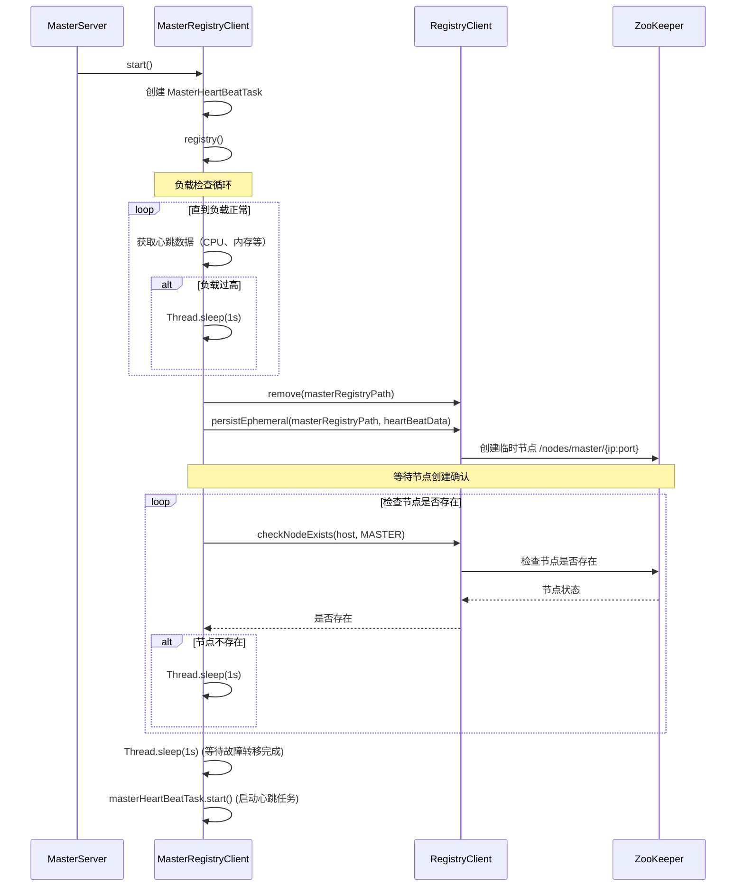

**代码位置**：
- `MasterServer.initialized()` → `MasterRegistryClient.start()` → `MasterRegistryClient.registry()`

#### 3.2.2 心跳更新

**触发时机**：定期更新（默认间隔 10 秒）

**执行流程**：

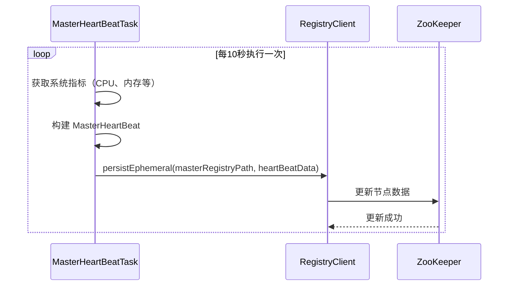

**代码位置**：
- `MasterHeartBeatTask.writeHeartBeat()` → `RegistryClient.persistEphemeral()`

#### 3.2.3 服务关闭注销

**触发时机**：Master 服务关闭时

**执行流程**：

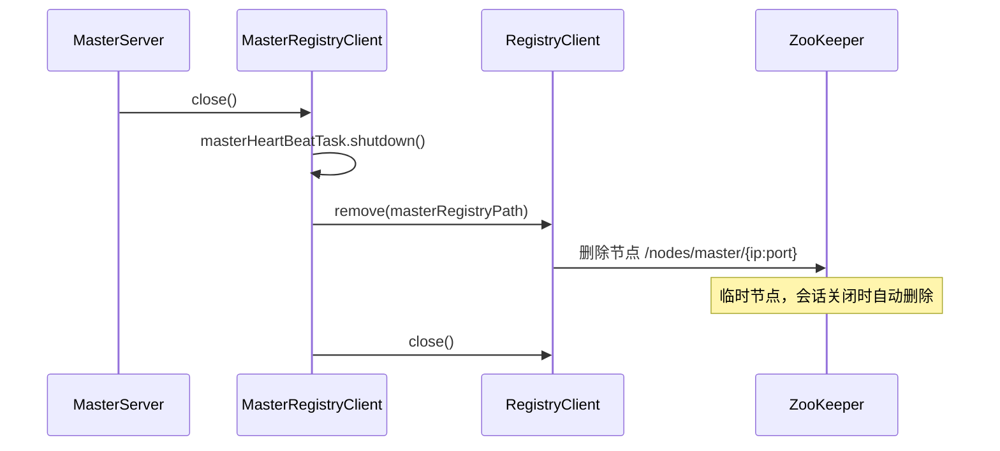

**代码位置**：
- `MasterServer.close()` → `MasterRegistryClient.close()` → `MasterRegistryClient.deregister()`

### 3.3 节点生命周期

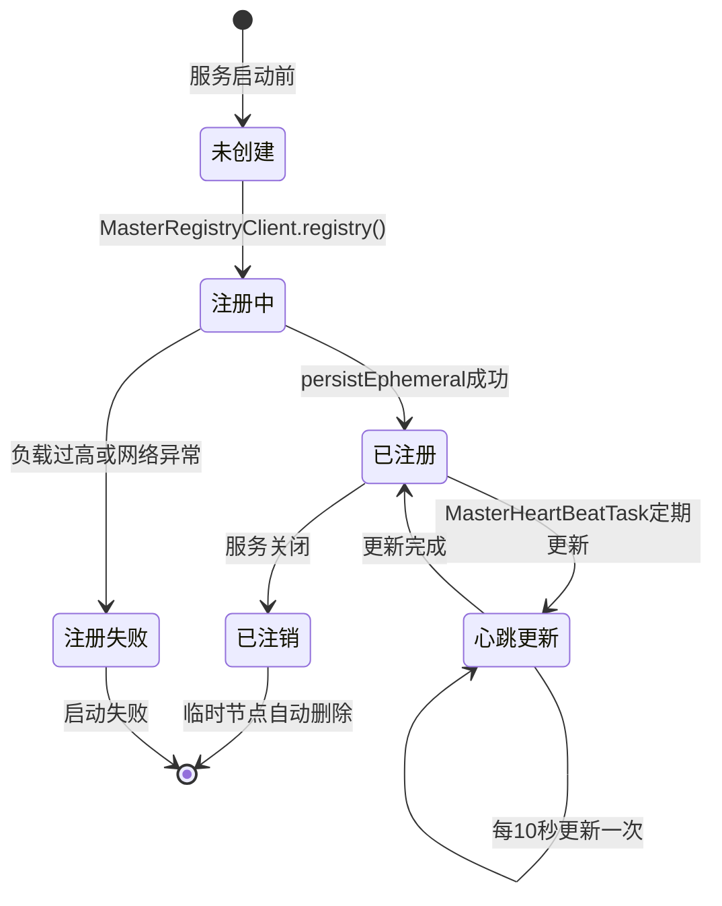

### 3.4 关键特性

1. **临时节点特性**：
    - 节点与 ZooKeeper 会话绑定
    - 会话关闭时节点自动删除
    - 实现自动故障检测

2. **负载保护**：
    - 注册前检查系统负载（CPU、内存、磁盘）
    - 负载过高时等待，直到负载正常才注册

3. **心跳机制**：
    - 定期更新节点数据（包含实时负载信息）
    - 其他 Master 通过 TreeCache 监听节点变化

---

## 4. MASTER_COORDINATOR 节点 (`/nodes/master-coordinator`)

### 4.1 节点信息

- **节点类型**：持久节点（Persistent）
- **节点路径**：`/nodes/master-coordinator`
- **节点数据**：当前 Active Master 的地址（`ip:port`）
- **创建位置**：`AbstractHAServer.participateElection()`

### 4.2 触发场景

#### 4.2.1 协调器选举

**触发时机**：MasterCoordinator 启动时

**执行流程**：

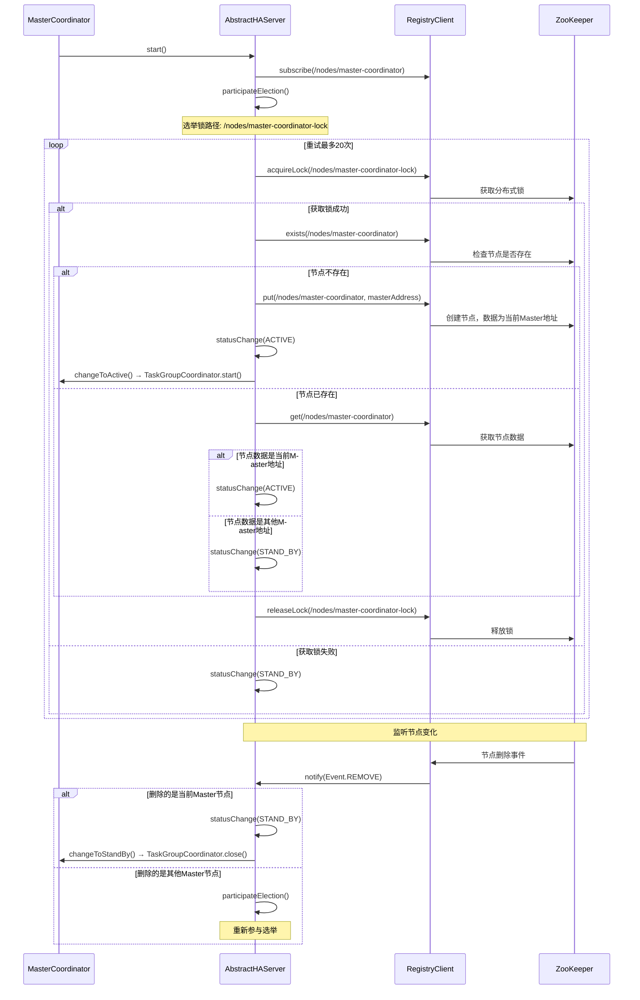

**代码位置**：
- `MasterServer.initialized()` → `MasterCoordinator.start()` → `AbstractHAServer.start()` → `AbstractHAServer.participateElection()`

### 4.3 节点生命周期

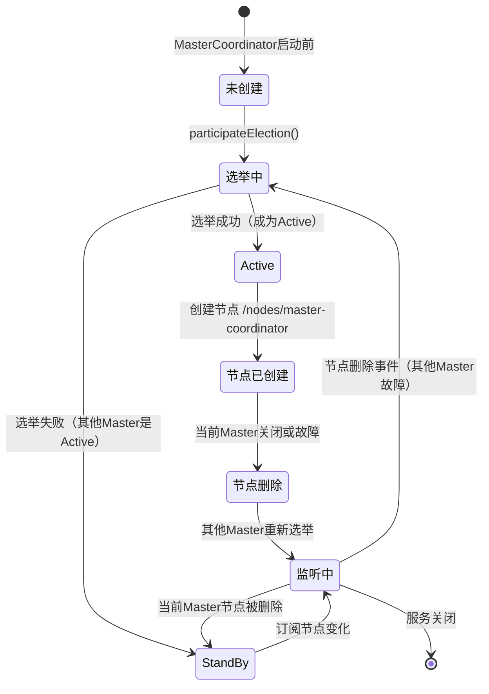

### 4.4 关键特性

1. **单Active模式**：
    - 集群中只有一个 Master 处于 Active 状态
    - 只有 Active Master 才能运行 TaskGroupCoordinator

2. **选举机制**：
    - 使用分布式锁保证选举的原子性
    - 支持重试机制（最多20次），避免网络抖动导致选举失败

3. **故障转移**：
    - 监听节点变化，当 Active Master 故障时，其他 Master 重新选举

4. **状态回调**：
    - `changeToActive()`：启动 TaskGroupCoordinator
    - `changeToStandBy()`：关闭 TaskGroupCoordinator

---

## 5. MASTER_FAILOVER_LOCK 锁 (`/lock/master-failover/{masterAddress}`)

### 5.1 锁信息

- **锁类型**：分布式锁
- **锁路径**：`/lock/master-failover/{masterAddress}`
- **使用位置**：`FailoverCoordinator.doMasterFailover()`

### 5.2 触发场景

#### 5.2.1 Master故障转移

**触发时机**：检测到某个 Master 从集群中移除时

**执行流程**：

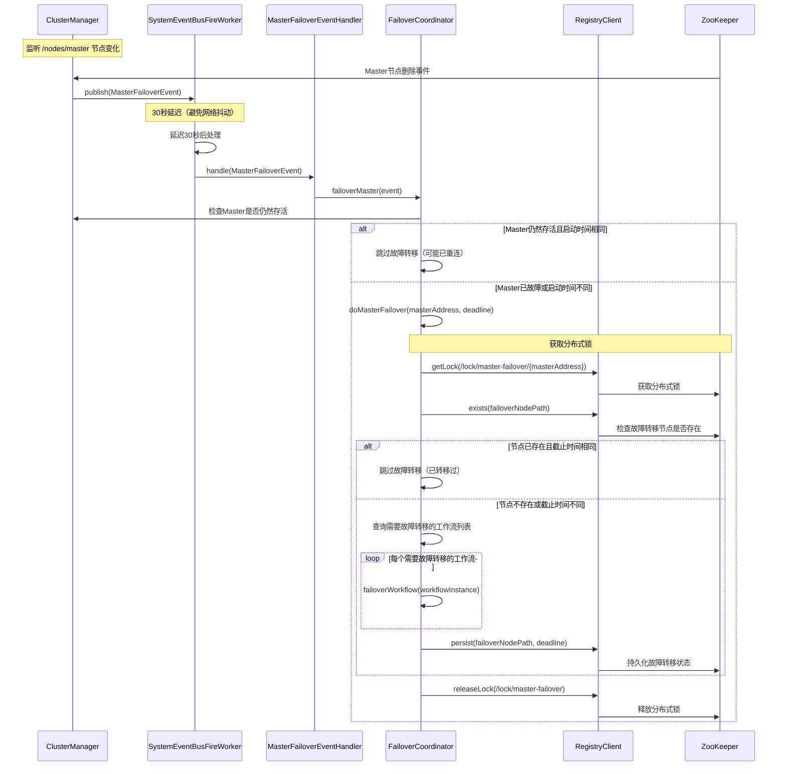

**代码位置**：
- `FailoverCoordinator.failoverMaster()` → `FailoverCoordinator.doMasterFailover()`

### 5.3 锁生命周期

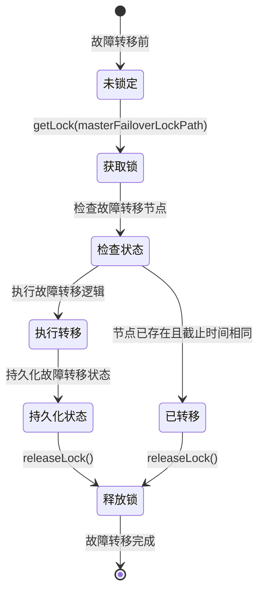

### 5.4 关键特性

1. **防并发**：
    - 使用分布式锁确保同一时间只有一个 Master 处理某个 Master 的故障转移
    - 锁路径包含 Master 地址，不同 Master 的故障转移使用不同的锁

2. **幂等性保证**：
    - 检查故障转移节点是否存在
    - 如果存在且截止时间相同，跳过故障转移

3. **锁释放**：
    - 使用 `finally` 块确保锁一定会被释放
    - 使用锁路径前缀释放锁（`/lock/master-failover`）

---

## 6. GLOBAL_MASTER_FAILOVER_LOCK 锁（预留）

### 6.1 锁信息

- **锁类型**：分布式锁
- **锁路径**：`/lock/global-master-failover`
- **状态**：在代码中定义但未使用（可能用于未来功能或已废弃）

### 6.2 说明

该锁在 `RegistryNodeType` 枚举中定义，但在当前代码实现中未找到使用场景。可能是：
- 为未来的全局故障转移功能预留
- 旧版本遗留代码
- 计划用于全局故障转移的并发控制

---

## 7. MASTER_TASK_GROUP_COORDINATOR_LOCK 锁（实际未使用）

### 7.1 锁信息

- **锁类型**：分布式锁
- **锁路径**：`/lock/master-task-group-coordinator`
- **状态**：在代码中定义但实际未使用

### 7.2 说明

该锁在 `RegistryNodeType` 枚举中定义，但在当前代码实现中未找到使用场景。

**实际使用的锁**：
- `MasterCoordinator` 使用 `AbstractHAServer.participateElection()` 进行选举
- 选举锁路径为：`/nodes/master-coordinator-lock`（通过 `selectorPath + "-lock"` 动态生成）
- 而不是使用预定义的 `MASTER_TASK_GROUP_COORDINATOR_LOCK`

**可能原因**：
- 设计时预留的锁，但实际实现使用了动态生成的锁路径
- 保持枚举定义与实现的一致性，但实际未使用

---

## 8. MASTER_SERIAL_COORDINATOR_LOCK 锁（预留）

### 8.1 锁信息

- **锁类型**：分布式锁
- **锁路径**：`/lock/master-serial-workflow-coordinator`
- **状态**：在代码中定义但未使用（预留功能）

### 8.2 说明

该锁在 `RegistryNodeType` 枚举中定义，但在当前代码实现中未找到使用场景。可能是：
- 为未来的串行工作流协调功能预留
- 计划用于串行工作流的并发控制
- 确保同一时间只有一个 Master 处理串行工作流的协调逻辑

---

## 9. 节点流转流程总览

### 9.1 Master服务启动时的节点创建流程

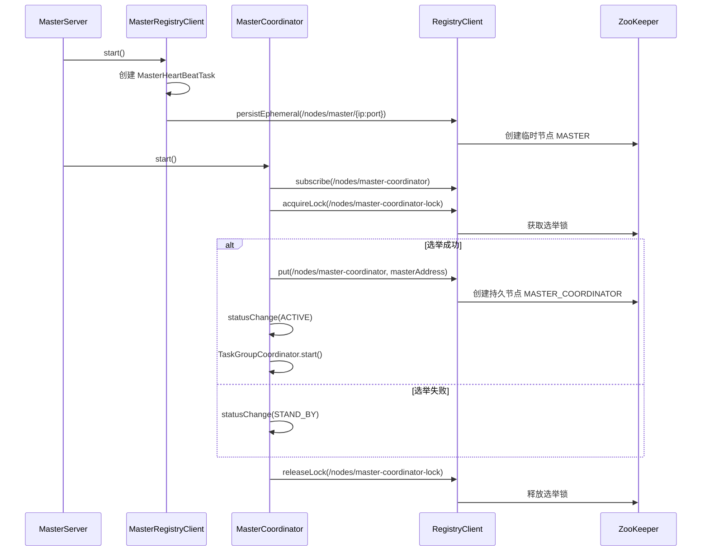

### 9.2 Master故障转移时的锁使用流程

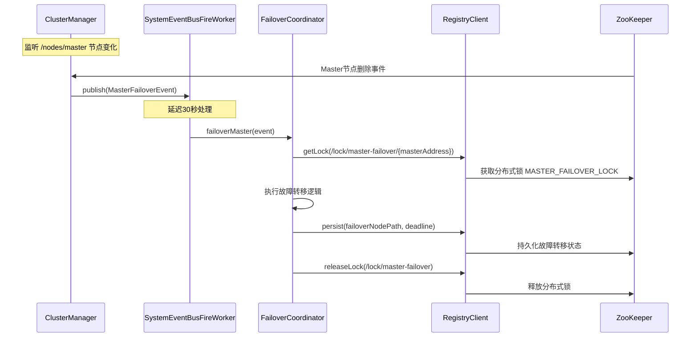

### 9.3 节点状态流转图

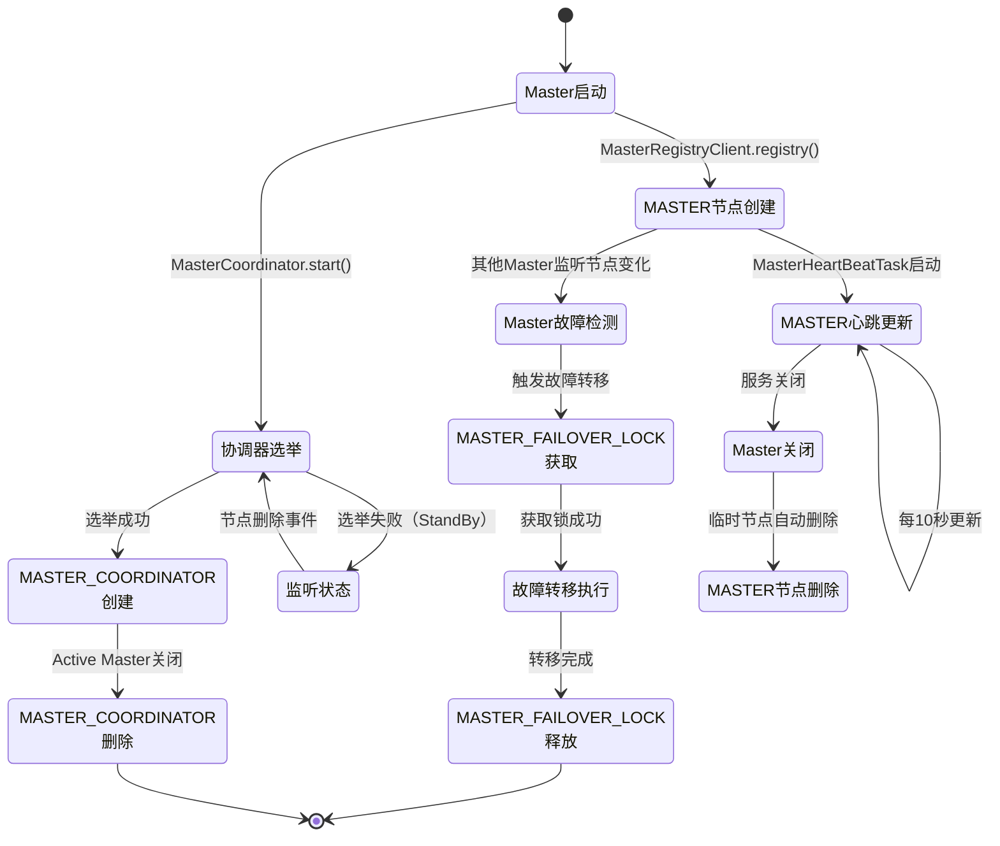

---

## 10. 节点交互关系图

### 10.1 组件交互图

```mermaid
graph TB
    subgraph "Master服务"
        MS[MasterServer]
        MRC[MasterRegistryClient]
        MC[MasterCoordinator]
        FC[FailoverCoordinator]
        CM[ClusterManager]
    end
    
    subgraph "注册中心客户端"
        RC[RegistryClient]
    end
    
    subgraph "ZooKeeper节点"
        MASTER[/nodes/master/<br/>临时节点]
        COORD[/nodes/master-coordinator<br/>持久节点]
        FAILOVER_LOCK[/lock/master-failover/<br/>分布式锁]
        COORD_LOCK[/nodes/master-coordinator-lock<br/>选举锁]
    end
    
    MS -->|启动| MRC
    MS -->|启动| MC
    MRC -->|注册| RC
    MC -->|选举| RC
    CM -->|监听| RC
    FC -->|获取锁| RC
    
    RC -->|创建| MASTER
    RC -->|创建| COORD
    RC -->|获取| FAILOVER_LOCK
    RC -->|获取| COORD_LOCK
    
    CM -->|触发| FC
    FC -->|释放锁| RC
    MC -->|释放锁| RC
```

### 10.2 节点路径层次结构

```mermaid
graph TD
    ROOT[/dolphinscheduler]
    
    ROOT --> NODES[/nodes]
    ROOT --> LOCKS[/lock]
    
    NODES --> MASTER[/nodes/master]
    NODES --> COORD[/nodes/master-coordinator]
    NODES --> WORKER[/nodes/worker]
    NODES --> FAILOVER_FINISH[/nodes/failover-finish-nodes]
    
    LOCKS --> FAILOVER_LOCK[/lock/master-failover]
    LOCKS --> GLOBAL_FAILOVER_LOCK[/lock/global-master-failover]
    LOCKS --> TASK_GROUP_LOCK[/lock/master-task-group-coordinator]
    LOCKS --> SERIAL_LOCK[/lock/master-serial-workflow-coordinator]
    
    MASTER --> MASTER1[/nodes/master/192.168.1.1:5678]
    MASTER --> MASTER2[/nodes/master/192.168.1.2:5678]
    MASTER --> MASTER3[/nodes/master/192.168.1.3:5678]
    
    FAILOVER_LOCK --> FAILOVER_LOCK1[/lock/master-failover/192.168.1.1:5678]
    FAILOVER_LOCK --> FAILOVER_LOCK2[/lock/master-failover/192.168.1.2:5678]
    
    style MASTER fill:#e1f5ff
    style COORD fill:#fff4e1
    style FAILOVER_LOCK fill:#f3e5f5
    style GLOBAL_FAILOVER_LOCK fill:#e8f5e9
```

---

## 11. 关键设计模式

### 11.1 临时节点模式

**用途**：服务注册与自动故障检测

**实现**：
- Master 服务注册为临时节点
- 会话关闭时节点自动删除
- 其他 Master 通过 TreeCache 监听节点变化

**优势**：
- 自动故障检测，无需心跳超时机制
- 网络分区时自动清理故障节点

### 11.2 分布式锁模式

**用途**：保证故障转移的原子性

**实现**：
- 使用 ZooKeeper 的分布式锁
- 锁路径包含 Master 地址，不同 Master 使用不同锁
- 使用 `finally` 块确保锁释放

**优势**：
- 防止多个 Master 同时处理同一故障转移
- 保证故障转移操作的原子性

### 11.3 选举模式

**用途**：选择唯一的 Active Master

**实现**：
- 使用分布式锁保证选举的原子性
- 持久节点存储 Active Master 地址
- 监听节点变化实现故障转移

**优势**：
- 确保集群中只有一个 Active Master
- 支持自动故障转移

---

## 12. 总结

### 12.1 节点类型总结

| 节点类型 | 路径 | 节点类型 | 状态 | 主要用途 |
|---------|------|---------|------|---------|
| `MASTER` | `/nodes/master/{ip:port}` | 临时节点 | ✅ 使用中 | Master 服务注册 |
| `MASTER_COORDINATOR` | `/nodes/master-coordinator` | 持久节点 | ✅ 使用中 | Master 协调器选举 |
| `MASTER_FAILOVER_LOCK` | `/lock/master-failover/{masterAddress}` | 分布式锁 | ✅ 使用中 | Master 故障转移锁 |
| `GLOBAL_MASTER_FAILOVER_LOCK` | `/lock/global-master-failover` | 分布式锁 | ⚠️ 预留 | 全局故障转移锁 |
| `MASTER_TASK_GROUP_COORDINATOR_LOCK` | `/lock/master-task-group-coordinator` | 分布式锁 | ❌ 未使用 | 任务组协调器锁（未使用） |
| `MASTER_SERIAL_COORDINATOR_LOCK` | `/lock/master-serial-workflow-coordinator` | 分布式锁 | ⚠️ 预留 | 串行工作流协调器锁 |

### 12.2 关键特性

1. **服务注册**：
   - 使用临时节点实现自动故障检测
   - 心跳机制定期更新节点数据

2. **协调器选举**：
   - 使用分布式锁保证选举原子性
   - 支持自动故障转移

3. **故障转移**：
   - 使用分布式锁防止并发处理
   - 幂等性保证，避免重复转移

4. **节点监听**：
   - 使用 TreeCache 监听节点变化
   - 实现集群状态一致性

### 12.3 最佳实践

1. **节点创建**：
   - 注册前检查系统负载
   - 使用临时节点实现自动清理

2. **锁使用**：
   - 使用 `finally` 块确保锁释放
   - 锁路径包含资源标识，避免冲突

3. **故障转移**：
   - 延迟处理避免网络抖动
   - 检查节点状态避免重复转移

---

## 13. 参考代码位置

### 13.1 核心类

- `MasterRegistryClient`：Master 服务注册客户端
- `MasterCoordinator`：Master 协调器
- `AbstractHAServer`：高可用服务器抽象基类
- `FailoverCoordinator`：故障转移协调器
- `ClusterManager`：集群管理器

### 13.2 关键方法

- `MasterRegistryClient.registry()`：注册 Master 节点
- `AbstractHAServer.participateElection()`：参与选举
- `FailoverCoordinator.doMasterFailover()`：执行 Master 故障转移
- `RegistryClient.persistEphemeral()`：创建临时节点
- `RegistryClient.getLock()`：获取分布式锁

---

**文档版本**：v1.0  
**最后更新**：2024年  
**作者**：DolphinScheduler 开发团队