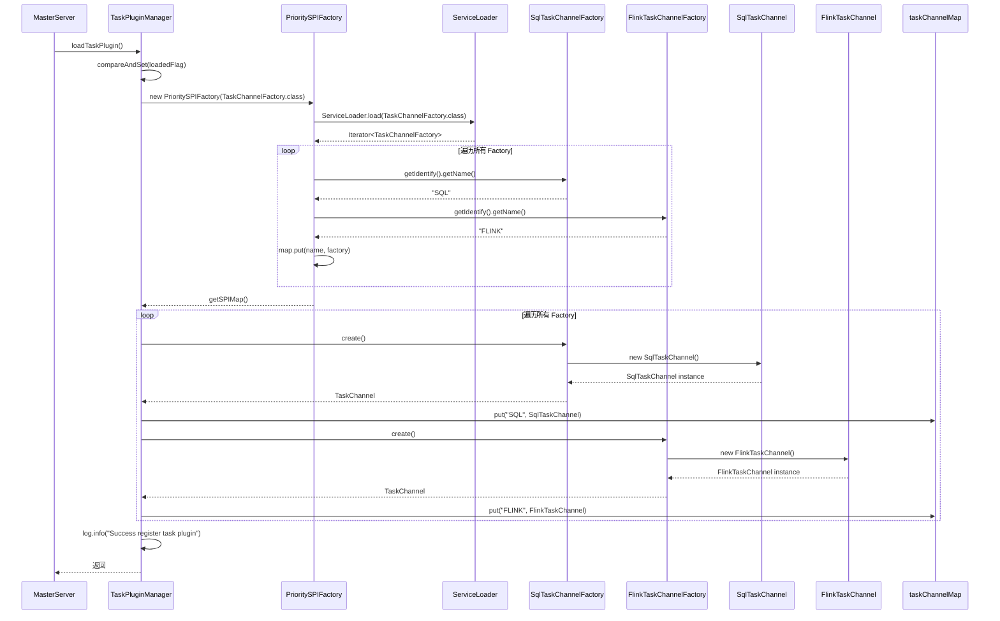
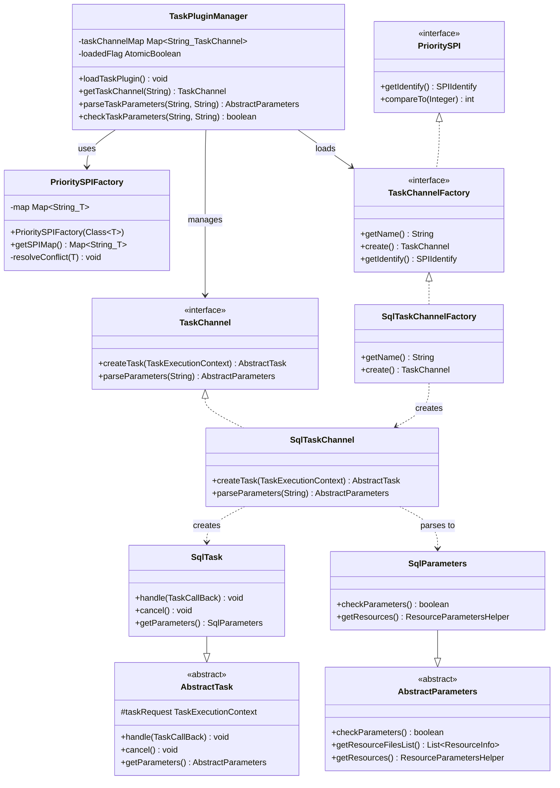
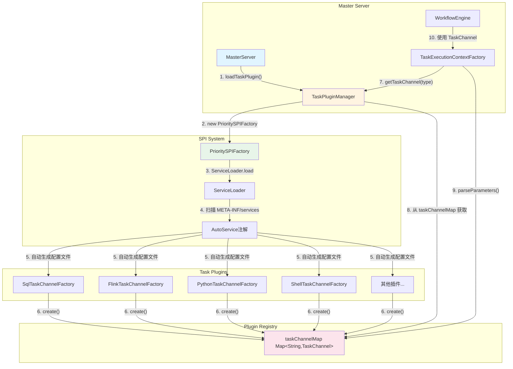
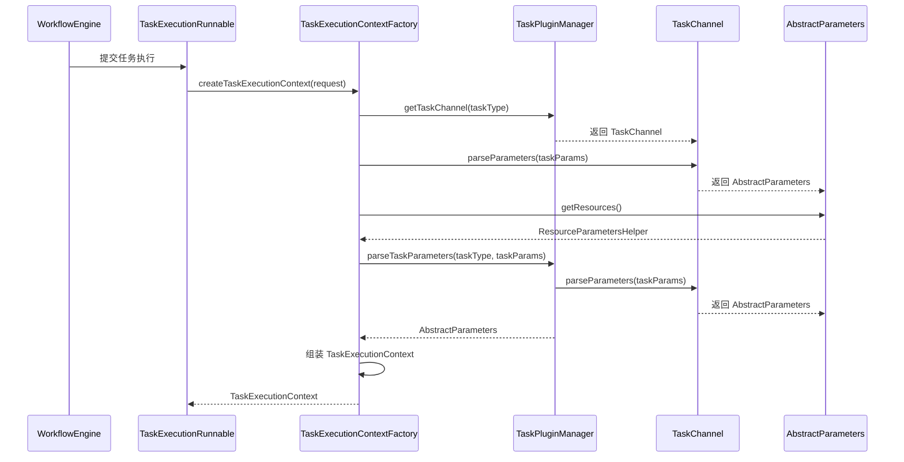

# 任务插件加载详细分析

## 1. 概述

DolphinScheduler 采用了微内核 + 插件化的架构设计，任务插件系统是其核心扩展点之一。Master 服务在启动时会加载所有可用的任务插件，使得系统能够支持多种任务类型的执行。

本文档详细分析任务插件的加载流程、设计架构以及在 Master 服务中的使用方式。

## 2. 任务插件加载流程

### 2.1 加载入口

任务插件的加载入口位于 `MasterServer.initialized()` 方法中：

```java:dolphinscheduler-master/src/main/java/org/apache/dolphinscheduler/server/master/MasterServer.java
@PostConstruct
public void initialized() {
    // ... 其他初始化代码 ...
    
    // install task plugin
    TaskPluginManager.loadTaskPlugin();
    DataSourceProcessorProvider.initialize();
    
    // ... 后续初始化代码 ...
}
```

**调用位置**：`MasterServer.java:145`

**调用时机**：Master 服务启动时，在 RPC 服务启动之后，注册中心连接之前

### 2.2 加载流程详解

#### 2.2.1 TaskPluginManager.loadTaskPlugin() 方法

```java:dolphinscheduler-task-plugin/dolphinscheduler-task-api/src/main/java/org/apache/dolphinscheduler/plugin/task/api/TaskPluginManager.java
public static void loadTaskPlugin() {
    if (!loadedFlag.compareAndSet(false, true)) {
        log.warn("The task plugin has already been loaded");
        return;
    }
    PrioritySPIFactory<TaskChannelFactory> prioritySPIFactory = new PrioritySPIFactory<>(TaskChannelFactory.class);
    for (Map.Entry<String, TaskChannelFactory> entry : prioritySPIFactory.getSPIMap().entrySet()) {
        String factoryName = entry.getKey();
        TaskChannelFactory factory = entry.getValue();
        
        taskChannelMap.put(factoryName, factory.create());
        log.info("Success register task plugin: {}", factoryName);
    }
}
```

**关键点**：
1. **线程安全**：使用 `AtomicBoolean` 的 `compareAndSet` 确保插件只加载一次
2. **SPI 机制**：通过 `PrioritySPIFactory` 使用 Java SPI 机制加载所有 `TaskChannelFactory` 实现
3. **注册缓存**：将创建好的 `TaskChannel` 实例缓存在 `taskChannelMap` 中，以插件名称为 key

#### 2.2.2 PrioritySPIFactory 工作原理

`PrioritySPIFactory` 是 DolphinScheduler 自定义的 SPI 工厂类，支持优先级和冲突解决：

```java:dolphinscheduler-spi/src/main/java/org/apache/dolphinscheduler/spi/plugin/PrioritySPIFactory.java
public PrioritySPIFactory(Class<T> spiClass) {
    for (T t : ServiceLoader.load(spiClass)) {
        if (map.containsKey(t.getIdentify().getName())) {
            resolveConflict(t);
        } else {
            map.put(t.getIdentify().getName(), t);
        }
    }
}

private void resolveConflict(T newSPI) {
    SPIIdentify identify = newSPI.getIdentify();
    T oldSPI = map.get(identify.getName());
    
    if (newSPI.compareTo(oldSPI.getIdentify().getPriority()) == 0) {
        throw new IllegalArgumentException(
                String.format("These two spi plugins has conflict identify name with the same priority: %s, %s",
                        oldSPI.getIdentify(), newSPI.getIdentify()));
    } else if (newSPI.compareTo(oldSPI.getIdentify().getPriority()) > 0) {
        log.info("The {} plugin has high priority, will override {}", newSPI.getIdentify(), oldSPI);
        map.put(identify.getName(), newSPI);
    } else {
        log.info("The low plugin {} will be skipped", newSPI);
    }
}
```

**工作流程**：
1. 使用 Java 标准的 `ServiceLoader.load()` 加载所有 SPI 实现
2. 对于每个实现，通过 `getIdentify().getName()` 获取插件名称
3. 如果名称冲突，使用优先级机制解决：
    - 相同名称且相同优先级：抛出异常
    - 相同名称但优先级不同：保留优先级高的插件

#### 2.2.3 SPI 注册机制

任务插件通过 `@AutoService` 注解自动注册到 SPI 系统中：

```java:dolphinscheduler-task-plugin/dolphinscheduler-task-sql/src/main/java/org/apache/dolphinscheduler/plugin/task/sql/SqlTaskChannelFactory.java
@AutoService(TaskChannelFactory.class)
public class SqlTaskChannelFactory implements TaskChannelFactory {
    
    public static final String NAME = "SQL";
    
    @Override
    public String getName() {
        return NAME;
    }
    
    @Override
    public TaskChannel create() {
        return new SqlTaskChannel();
    }
}
```

**@AutoService 作用**：
- 编译时自动生成 `META-INF/services/org.apache.dolphinscheduler.plugin.task.api.TaskChannelFactory` 文件
- 文件中包含所有实现类的全限定名
- `ServiceLoader` 读取该文件并实例化所有实现类

### 2.3 加载时序图



## 3. 任务插件设计架构

### 3.1 核心接口和类

#### 3.1.1 TaskChannelFactory 接口

`TaskChannelFactory` 是任务插件的工厂接口，负责创建 `TaskChannel` 实例：

```java:dolphinscheduler-task-plugin/dolphinscheduler-task-api/src/main/java/org/apache/dolphinscheduler/plugin/task/api/TaskChannelFactory.java
public interface TaskChannelFactory extends PrioritySPI {
    
    default SPIIdentify getIdentify() {
        return SPIIdentify.builder()
                .name(getName())
                .build();
    }
    
    String getName();
    
    TaskChannel create();
}
```

**职责**：
- 定义插件名称（通过 `getName()` 方法）
- 创建 `TaskChannel` 实例（通过 `create()` 方法）
- 扩展 `PrioritySPI` 接口，支持优先级机制

#### 3.1.2 TaskChannel 接口

`TaskChannel` 是任务通道接口，定义了任务插件必须实现的核心方法：

```java:dolphinscheduler-task-plugin/dolphinscheduler-task-api/src/main/java/org/apache/dolphinscheduler/plugin/task/api/TaskChannel.java
public interface TaskChannel {
    
    AbstractTask createTask(TaskExecutionContext taskRequest);
    
    AbstractParameters parseParameters(String taskParams);
}
```

**职责**：
- **createTask()**：根据任务执行上下文创建具体的任务实例（`AbstractTask`）
- **parseParameters()**：将 JSON 格式的任务参数字符串解析为参数对象（`AbstractParameters`）

#### 3.1.3 TaskPluginManager 类

`TaskPluginManager` 是任务插件的管理器，提供了插件加载和访问的统一入口：

```java:dolphinscheduler-task-plugin/dolphinscheduler-task-api/src/main/java/org/apache/dolphinscheduler/plugin/task/api/TaskPluginManager.java
@Slf4j
public class TaskPluginManager {
    
    private static final Map<String, TaskChannel> taskChannelMap = new HashMap<>();
    private static final AtomicBoolean loadedFlag = new AtomicBoolean(false);
    
    static {
        loadTaskPlugin();
    }
    
    public static void loadTaskPlugin() {
        // ... 加载逻辑 ...
    }
    
    public static TaskChannel getTaskChannel(String type) {
        checkNotNull(type, "type cannot be null");
        TaskChannel taskChannel = taskChannelMap.get(type);
        if (taskChannel == null) {
            throw new IllegalArgumentException("Cannot find TaskChannel for : " + type);
        }
        return taskChannel;
    }
    
    public static AbstractParameters parseTaskParameters(String taskType, String taskParams) {
        checkNotNull(taskType, "taskType cannot be null");
        TaskChannel taskChannel = getTaskChannel(taskType);
        AbstractParameters abstractParameters = taskChannel.parseParameters(taskParams);
        if (abstractParameters == null) {
            throw new IllegalArgumentException("Cannot parse task parameters: " + taskParams + " for : " + taskType);
        }
        return abstractParameters;
    }
    
    public static boolean checkTaskParameters(String taskType, String taskParams) {
        AbstractParameters abstractParameters = parseTaskParameters(taskType, taskParams);
        return abstractParameters.checkParameters();
    }
}
```

**关键方法**：
- `loadTaskPlugin()`：加载所有任务插件
- `getTaskChannel(String type)`：根据任务类型获取对应的 TaskChannel
- `parseTaskParameters()`：解析任务参数
- `checkTaskParameters()`：校验任务参数

### 3.2 类图



### 3.3 架构图



### 3.4 插件扩展点

DolphinScheduler 支持多种任务插件类型，常见的包括：

1. **SQL 任务**：`SqlTaskChannelFactory`
2. **Shell 任务**：`ShellTaskChannelFactory`
3. **Python 任务**：`PythonTaskChannelFactory`
4. **Flink 任务**：`FlinkTaskChannelFactory`
5. **Spark 任务**：`SparkTaskChannelFactory`
6. **HTTP 任务**：`HttpTaskChannelFactory`
7. **K8s 任务**：`K8sTaskChannelFactory`
8. **等等...**

每个插件都遵循相同的设计模式：
- 实现 `TaskChannelFactory` 接口
- 使用 `@AutoService` 注解注册
- 创建对应的 `TaskChannel` 实现
- 实现 `TaskChannel` 的两个核心方法

### 3.5 任务插件实现示例

以 SQL 任务插件为例，展示完整的实现：

```java
// 1. Factory 实现
@AutoService(TaskChannelFactory.class)
public class SqlTaskChannelFactory implements TaskChannelFactory {
    
    public static final String NAME = "SQL";
    
    @Override
    public String getName() {
        return NAME;
    }
    
    @Override
    public TaskChannel create() {
        return new SqlTaskChannel();
    }
}

// 2. Channel 实现
public class SqlTaskChannel implements TaskChannel {
    
    @Override
    public AbstractTask createTask(TaskExecutionContext taskRequest) {
        return new SqlTask(taskRequest);
    }
    
    @Override
    public AbstractParameters parseParameters(String taskParams) {
        return JSONUtils.parseObject(taskParams, SqlParameters.class);
    }
}

// 3. Task 实现（简化）
public class SqlTask extends AbstractTask {
    
    public SqlTask(TaskExecutionContext taskRequest) {
        super(taskRequest);
    }
    
    @Override
    public void handle(TaskCallBack taskCallBack) throws TaskException {
        // SQL 任务执行逻辑
    }
    
    @Override
    public void cancel() throws TaskException {
        // SQL 任务取消逻辑
    }
    
    @Override
    public AbstractParameters getParameters() {
        return sqlParameters;
    }
}
```

**关键代码位置**：
- Factory 实现：[SqlTaskChannelFactory.java](dolphinscheduler-task-plugin/dolphinscheduler-task-sql/src/main/java/org/apache/dolphinscheduler/plugin/task/sql/SqlTaskChannelFactory.java)
- Channel 实现：[SqlTaskChannel.java](dolphinscheduler-task-plugin/dolphinscheduler-task-sql/src/main/java/org/apache/dolphinscheduler/plugin/task/sql/SqlTaskChannel.java)
- Task 实现：[SqlTask.java](dolphinscheduler-task-plugin/dolphinscheduler-task-sql/src/main/java/org/apache/dolphinscheduler/plugin/task/sql/SqlTask.java)

## 4. Master 服务中使用任务插件

### 4.1 使用场景概述

Master 服务主要在以下场景中使用任务插件：

1. **任务执行上下文创建**：在创建任务执行上下文时，需要解析任务参数
2. **资源参数提取**：从任务参数中提取资源信息（如数据源）
3. **参数校验**：在任务提交前校验任务参数的合法性

### 4.2 TaskExecutionContextFactory 中的使用

`TaskExecutionContextFactory` 是 Master 服务中创建任务执行上下文的核心工厂类，它大量使用了任务插件。

#### 4.2.1 提取资源参数

在创建任务执行上下文时，需要从任务参数中提取资源信息：

```java:dolphinscheduler-master/src/main/java/org/apache/dolphinscheduler/server/master/runner/TaskExecutionContextFactory.java
private ResourceParametersHelper getResourceParameters(final TaskInstance taskInstance) {
    final ResourceParametersHelper resourceParameters = TaskPluginManager.getTaskChannel(taskInstance.getTaskType())
            .parseParameters(taskInstance.getTaskParams())
            .getResources();
    if (resourceParameters != null) {
        resourceParameters.getResourceMap().forEach((type, map) -> {
            switch (type) {
                case DATASOURCE:
                    assembleDataSourceParameters(map);
                    break;
                default:
                    break;
            }
        });
    }
    return resourceParameters;
}
```

**代码位置**：`TaskExecutionContextFactory.java:94-111`

**工作流程**：
1. 通过 `TaskPluginManager.getTaskChannel()` 获取对应任务类型的 `TaskChannel`
2. 调用 `TaskChannel.parseParameters()` 解析任务参数，得到 `AbstractParameters`
3. 从 `AbstractParameters` 中提取资源信息（`getResources()`）
4. 对数据源类型的资源进行组装处理

#### 4.2.2 解析任务参数用于参数准备

在准备任务参数时，需要解析任务参数以进行参数替换和变量解析：

```java:dolphinscheduler-master/src/main/java/org/apache/dolphinscheduler/server/master/runner/TaskExecutionContextFactory.java
private Map<String, Property> getPrepareParams(final TaskInstance taskInstance,
                                               final WorkflowInstance workflowInstance,
                                               final WorkflowDefinition workflowDefinition,
                                               final Project project) {
    final AbstractParameters baseParam = TaskPluginManager.parseTaskParameters(
            taskInstance.getTaskType(),
            taskInstance.getTaskParams());

    return curingParamsService.paramParsingPreparation(
            taskInstance,
            baseParam,
            workflowInstance,
            project.getName(),
            workflowDefinition.getName());
}
```

**代码位置**：`TaskExecutionContextFactory.java:159-173`

**工作流程**：
1. 使用 `TaskPluginManager.parseTaskParameters()` 解析任务参数
2. 将解析得到的 `AbstractParameters` 传递给参数处理服务
3. 进行参数替换、变量解析等处理

### 4.3 使用流程图

以下是 Master 服务中任务插件使用的时序图：



### 4.4 TaskPluginManager 提供的 API

`TaskPluginManager` 为 Master 服务提供了以下静态方法：

#### 4.4.1 getTaskChannel()

```java:dolphinscheduler-task-plugin/dolphinscheduler-task-api/src/main/java/org/apache/dolphinscheduler/plugin/task/api/TaskPluginManager.java
public static TaskChannel getTaskChannel(String type) {
    checkNotNull(type, "type cannot be null");
    TaskChannel taskChannel = taskChannelMap.get(type);
    if (taskChannel == null) {
        throw new IllegalArgumentException("Cannot find TaskChannel for : " + type);
    }
    return taskChannel;
}
```

**功能**：根据任务类型获取对应的 `TaskChannel`

**代码位置**：`TaskPluginManager.java:63-70`

#### 4.4.2 parseTaskParameters()

```java:dolphinscheduler-task-plugin/dolphinscheduler-task-api/src/main/java/org/apache/dolphinscheduler/plugin/task/api/TaskPluginManager.java
public static AbstractParameters parseTaskParameters(String taskType, String taskParams) {
    checkNotNull(taskType, "taskType cannot be null");
    TaskChannel taskChannel = getTaskChannel(taskType);
    AbstractParameters abstractParameters = taskChannel.parseParameters(taskParams);
    if (abstractParameters == null) {
        throw new IllegalArgumentException("Cannot parse task parameters: " + taskParams + " for : " + taskType);
    }
    return abstractParameters;
}
```

**功能**：解析任务参数，返回 `AbstractParameters` 对象

**代码位置**：`TaskPluginManager.java:93-101`

#### 4.4.3 checkTaskParameters()

```java:dolphinscheduler-task-plugin/dolphinscheduler-task-api/src/main/java/org/apache/dolphinscheduler/plugin/task/api/TaskPluginManager.java
public static boolean checkTaskParameters(String taskType, String taskParams) {
    AbstractParameters abstractParameters = parseTaskParameters(taskType, taskParams);
    return abstractParameters.checkParameters();
}
```

**功能**：校验任务参数是否合法

**代码位置**：`TaskPluginManager.java:80-83`

## 5. 任务插件设计优势

### 5.1 插件化架构的优势

1. **扩展性强**：新增任务类型只需要实现对应的插件，无需修改核心代码
2. **解耦合**：任务插件与核心系统解耦，各自独立开发和维护
3. **动态加载**：通过 SPI 机制自动发现和加载插件
4. **优先级支持**：支持插件优先级，可以覆盖同名的低优先级插件

### 5.2 设计模式应用

1. **工厂模式**：`TaskChannelFactory` 负责创建 `TaskChannel`
2. **策略模式**：不同的 `TaskChannel` 实现不同的参数解析策略
3. **SPI 模式**：通过 Java SPI 机制实现插件的自动发现和加载

### 5.3 线程安全性

- `TaskPluginManager` 使用 `AtomicBoolean` 保证插件只加载一次
- `taskChannelMap` 在加载完成后只读，不存在并发修改问题
- `TaskChannel` 实例是无状态的，可以安全地在多线程环境中使用

## 6. 总结

### 6.1 核心要点

1. **加载时机**：Master 服务启动时在 `initialized()` 方法中调用 `TaskPluginManager.loadTaskPlugin()`
2. **加载机制**：基于 Java SPI 机制，通过 `PrioritySPIFactory` 自动发现和加载所有 `TaskChannelFactory` 实现
3. **存储方式**：加载后的 `TaskChannel` 实例缓存在 `taskChannelMap` 中，以插件名称为 key
4. **使用场景**：主要用于任务参数解析、资源提取和参数校验

### 6.2 关键类说明

- **TaskPluginManager**：任务插件管理器，负责插件的加载和管理
- **TaskChannelFactory**：任务通道工厂接口，每个任务插件需要实现此接口
- **TaskChannel**：任务通道接口，提供参数解析和任务创建功能
- **PrioritySPIFactory**：带优先级的 SPI 工厂，支持插件冲突解决

### 6.3 相关代码链接

- Master 服务入口：[MasterServer.java:145](dolphinscheduler-master/src/main/java/org/apache/dolphinscheduler/server/master/MasterServer.java)
- 插件管理器：[TaskPluginManager.java](dolphinscheduler-task-plugin/dolphinscheduler-task-api/src/main/java/org/apache/dolphinscheduler/plugin/task/api/TaskPluginManager.java)
- SPI 工厂：[PrioritySPIFactory.java](dolphinscheduler-spi/src/main/java/org/apache/dolphinscheduler/spi/plugin/PrioritySPIFactory.java)
- 任务通道接口：[TaskChannel.java](dolphinscheduler-task-plugin/dolphinscheduler-task-api/src/main/java/org/apache/dolphinscheduler/plugin/task/api/TaskChannel.java)
- 任务通道工厂接口：[TaskChannelFactory.java](dolphinscheduler-task-plugin/dolphinscheduler-task-api/src/main/java/org/apache/dolphinscheduler/plugin/task/api/TaskChannelFactory.java)
- 任务执行上下文工厂：[TaskExecutionContextFactory.java](dolphinscheduler-master/src/main/java/org/apache/dolphinscheduler/server/master/runner/TaskExecutionContextFactory.java)

通过深入分析 DolphinScheduler 的任务插件加载机制，我们可以更好地理解其微内核 + 插件化的架构设计，为扩展新的任务类型或理解现有任务执行流程提供参考。