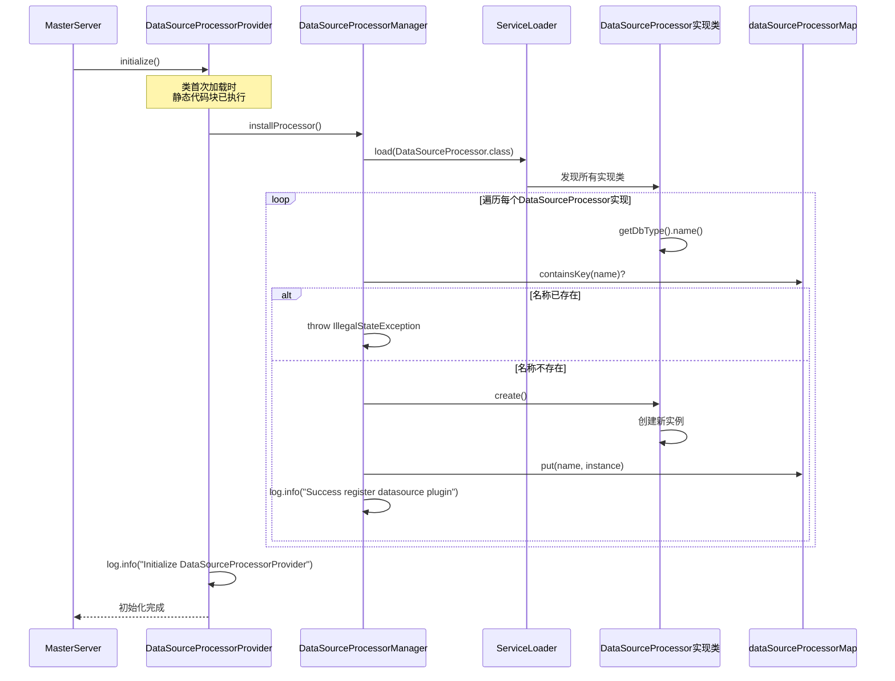
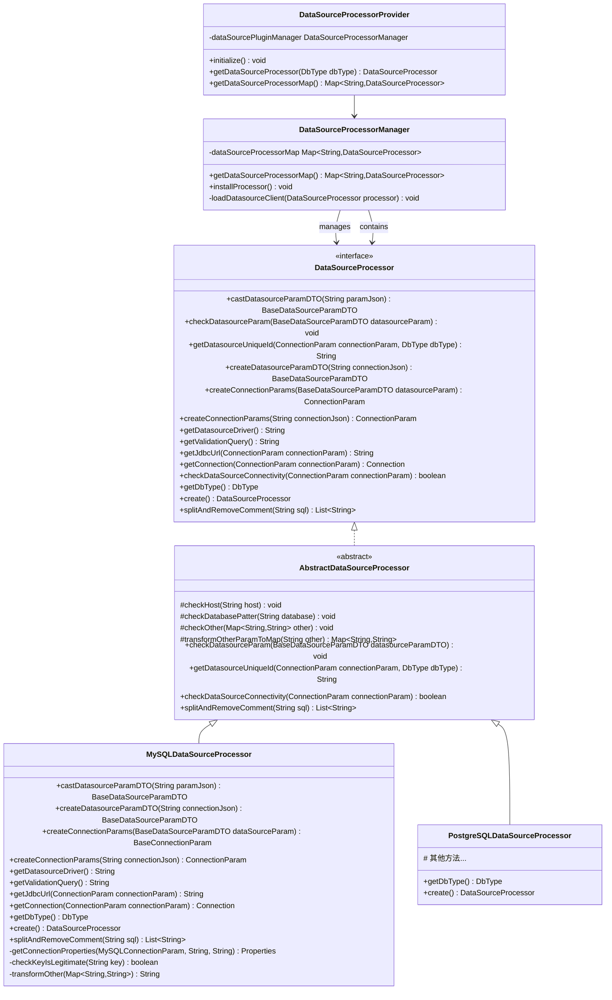
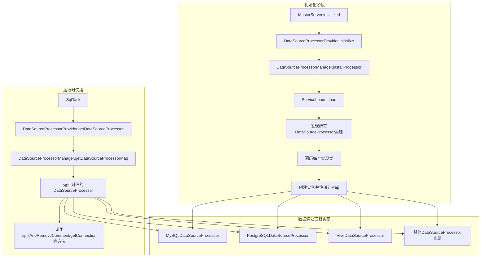
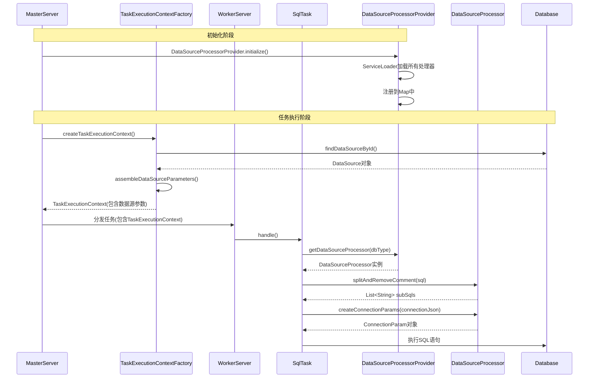

# 数据源处理器初始化详细分析

## 1. 概述

DolphinScheduler 采用了插件化的数据源管理架构，通过 `DataSourceProcessorProvider` 统一管理和提供各种数据源处理器。Master 服务在启动时会初始化数据源处理器提供者，使得系统能够支持多种数据源类型（如 MySQL、PostgreSQL、Hive、Oracle 等）的连接和操作。

本文档详细分析数据源处理器的初始化流程、设计架构以及在 Master 服务中的使用方式。

## 2. 初始化流程

### 2.1 初始化入口

数据源处理器的初始化入口位于 `MasterServer.initialized()` 方法中：

```java:dolphinscheduler-master/src/main/java/org/apache/dolphinscheduler/server/master/MasterServer.java
@PostConstruct
public void initialized() {
    //设置服务状态
    ServerLifeCycleManager.toRunning();
    final long startupTime = System.currentTimeMillis();

    // init rpc server
    this.masterRPCServer.start();

    // install task plugin
    TaskPluginManager.loadTaskPlugin();
    DataSourceProcessorProvider.initialize();  // 数据源处理器初始化
    
    // ... 后续初始化代码 ...
}
```

**调用位置**：[MasterServer.java:146](dolphinscheduler-master/src/main/java/org/apache/dolphinscheduler/server/master/MasterServer.java#L146)

**调用时机**：Master 服务启动时，在 RPC 服务启动和任务插件加载之后，注册中心连接之前

**调用顺序**：
1. RPC 服务启动 (`masterRPCServer.start()`)
2. 任务插件加载 (`TaskPluginManager.loadTaskPlugin()`)
3. **数据源处理器初始化** (`DataSourceProcessorProvider.initialize()`)
4. 注册中心连接 (`masterRegistryClient.start()`)

### 2.2 初始化流程详解

#### 2.2.1 DataSourceProcessorProvider.initialize() 方法

```java:dolphinscheduler-datasource-plugin/dolphinscheduler-datasource-api/src/main/java/org/apache/dolphinscheduler/plugin/datasource/api/plugin/DataSourceProcessorProvider.java
@Slf4j
public class DataSourceProcessorProvider {

    private static final DataSourceProcessorManager dataSourcePluginManager = new DataSourceProcessorManager();

    static {
        dataSourcePluginManager.installProcessor();  // 静态代码块中执行安装
    }

    private DataSourceProcessorProvider() {
    }

    public static void initialize() {
        log.info("Initialize DataSourceProcessorProvider");
    }

    public static DataSourceProcessor getDataSourceProcessor(@NonNull DbType dbType) {
        return dataSourcePluginManager.getDataSourceProcessorMap().get(dbType.name());
    }

    public static Map<String, DataSourceProcessor> getDataSourceProcessorMap() {
        return dataSourcePluginManager.getDataSourceProcessorMap();
    }
}
```

**关键点**：
1. **单例模式**：`DataSourceProcessorProvider` 使用私有构造函数，提供静态方法访问
2. **静态初始化**：在类的静态代码块中执行 `installProcessor()`，确保在类加载时就完成数据源处理器的安装
3. **初始化方法**：`initialize()` 方法实际上只是记录日志，真正的初始化工作在静态代码块中完成
4. **延迟加载特性**：由于静态代码块在类首次加载时执行，`initialize()` 方法主要用于明确标识初始化时机

#### 2.2.2 DataSourceProcessorManager.installProcessor() 方法

```java:dolphinscheduler-datasource-plugin/dolphinscheduler-datasource-api/src/main/java/org/apache/dolphinscheduler/plugin/datasource/api/plugin/DataSourceProcessorManager.java
@Slf4j
public class DataSourceProcessorManager {

    private static final Map<String, DataSourceProcessor> dataSourceProcessorMap = new ConcurrentHashMap<>();

    public Map<String, DataSourceProcessor> getDataSourceProcessorMap() {
        return Collections.unmodifiableMap(dataSourceProcessorMap);
    }

    public void installProcessor() {
        ServiceLoader.load(DataSourceProcessor.class).forEach(factory -> {
            final String name = factory.getDbType().name();

            if (dataSourceProcessorMap.containsKey(name)) {
                throw new IllegalStateException(format("Duplicate datasource plugins named '%s'", name));
            }
            loadDatasourceClient(factory);
            log.info("Success register datasource plugin -> {}", name);
        });
    }

    private void loadDatasourceClient(DataSourceProcessor processor) {
        DataSourceProcessor instance = processor.create();
        dataSourceProcessorMap.put(processor.getDbType().name(), instance);
    }
}
```

**工作流程**：
1. **ServiceLoader 加载**：使用 Java 标准的 `ServiceLoader.load(DataSourceProcessor.class)` 加载所有 `DataSourceProcessor` 接口的实现类
2. **遍历注册**：对每个找到的数据源处理器实现进行遍历
3. **名称提取**：通过 `factory.getDbType().name()` 获取数据库类型名称作为唯一标识
4. **重复检查**：检查是否已经存在相同名称的数据源处理器，如果存在则抛出异常（防止重复注册）
5. **实例化**：调用 `processor.create()` 创建数据源处理器实例
6. **注册缓存**：将实例存储到 `dataSourceProcessorMap` 中，以数据库类型名称为 key

**存储结构**：
- **Key**：数据库类型名称（如 "MYSQL"、"POSTGRESQL"）
- **Value**：对应的 `DataSourceProcessor` 实例
- **线程安全**：使用 `ConcurrentHashMap` 保证并发安全

### 2.3 ServiceLoader 机制

数据源处理器通过 Java SPI（Service Provider Interface）机制自动发现和加载。每个数据源处理器实现类使用 `@AutoService` 注解进行注册：

```java:dolphinscheduler-datasource-plugin/dolphinscheduler-datasource-mysql/src/main/java/org/apache/dolphinscheduler/plugin/datasource/mysql/param/MySQLDataSourceProcessor.java
@AutoService(DataSourceProcessor.class)
@Slf4j
public class MySQLDataSourceProcessor extends AbstractDataSourceProcessor {
    // ... 实现代码 ...
}
```

**SPI 机制工作原理**：
1. **编译时处理**：`@AutoService` 注解（来自 Google Auto Service）在编译时会自动生成 `META-INF/services/org.apache.dolphinscheduler.plugin.datasource.api.datasource.DataSourceProcessor` 文件
2. **文件内容**：该文件包含所有实现类的全限定名，每行一个
3. **运行时加载**：`ServiceLoader.load()` 读取该文件，通过反射实例化所有实现类
4. **自动发现**：无需手动注册，添加新的数据源处理器只需实现接口并添加 `@AutoService` 注解

**支持的数据源类型**（参考 `DbType` 枚举）：
- MYSQL, POSTGRESQL, HIVE, SPARK, CLICKHOUSE
- ORACLE, SQLSERVER, DB2, PRESTO, H2
- REDSHIFT, ATHENA, TRINO, STARROCKS, AZURESQL
- DAMENG, OCEANBASE, SSH, KYUUBI, DATABEND
- SNOWFLAKE, VERTICA, HANA, DORIS, ZEPPELIN
- SAGEMAKER, K8S, ALIYUN_SERVERLESS_SPARK

## 3. 初始化时序图



## 4. 数据源处理器设计架构

### 4.1 类图结构



### 4.2 核心接口和类说明

#### 4.2.1 DataSourceProcessor 接口

**位置**：[DataSourceProcessor.java](dolphinscheduler-datasource-plugin/dolphinscheduler-datasource-api/src/main/java/org/apache/dolphinscheduler/plugin/datasource/api/datasource/DataSourceProcessor.java)

**核心职责**：
- 定义数据源处理器的标准接口
- 提供数据源参数转换、验证、连接创建等功能
- 支持不同数据库类型的定制化实现

**关键方法**：
1. **参数处理**：
    - `castDatasourceParamDTO()`: 将 JSON 转换为数据源参数 DTO
    - `createDatasourceParamDTO()`: 从连接 JSON 创建数据源参数 DTO
    - `createConnectionParams()`: 创建连接参数对象

2. **连接管理**：
    - `getConnection()`: 获取数据库连接
    - `checkDataSourceConnectivity()`: 检查数据源连接性
    - `getJdbcUrl()`: 获取 JDBC URL

3. **工具方法**：
    - `getDatasourceDriver()`: 获取驱动类名
    - `getValidationQuery()`: 获取验证查询语句
    - `splitAndRemoveComment()`: 分割 SQL 并移除注释

#### 4.2.2 AbstractDataSourceProcessor 抽象类

**位置**：[AbstractDataSourceProcessor.java](dolphinscheduler-datasource-plugin/dolphinscheduler-datasource-api/src/main/java/org/apache/dolphinscheduler/plugin/datasource/api/datasource/AbstractDataSourceProcessor.java)

**核心职责**：
- 提供数据源处理器的通用实现
- 实现参数验证逻辑（主机名、数据库名、其他参数）
- 提供安全检查和通用功能

**安全特性**：
- **主机名验证**：使用正则表达式验证 IPv4/IPv6 地址和主机名格式
- **数据库名验证**：防止 SQL 注入，只允许特定字符
- **参数验证**：检查其他参数，防止恶意键值对（如 `allowLoadLocalInfile`）

```java:dolphinscheduler-datasource-plugin/dolphinscheduler-datasource-api/src/main/java/org/apache/dolphinscheduler/plugin/datasource/api/datasource/AbstractDataSourceProcessor.java
@Override
public void checkDatasourceParam(BaseDataSourceParamDTO baseDataSourceParamDTO) {
    if (!baseDataSourceParamDTO.getType().equals(DbType.REDSHIFT)) {
        // due to redshift use not regular hosts
        checkHost(baseDataSourceParamDTO.getHost());
    }
    checkDatabasePatter(baseDataSourceParamDTO.getDatabase());
    checkOther(baseDataSourceParamDTO.getOther());
}
```

#### 4.2.3 MySQLDataSourceProcessor 实现示例

**位置**：[MySQLDataSourceProcessor.java](dolphinscheduler-datasource-plugin/dolphinscheduler-datasource-mysql/src/main/java/org/apache/dolphinscheduler/plugin/datasource/mysql/param/MySQLDataSourceProcessor.java)

**核心特性**：
1. **SQL 解析**：使用 Druid SQL 解析器，支持 MySQL 特定的 SQL 语法
2. **安全连接**：过滤危险连接参数（如 `autoDeserialize`、`allowLoadLocalInfile`）
3. **连接属性管理**：设置安全的连接属性

```java:dolphinscheduler-datasource-plugin/dolphinscheduler-datasource-mysql/src/main/java/org/apache/dolphinscheduler/plugin/datasource/mysql/param/MySQLDataSourceProcessor.java
@Override
public Connection getConnection(ConnectionParam connectionParam) throws ClassNotFoundException, SQLException {
    MySQLConnectionParam mysqlConnectionParam = (MySQLConnectionParam) connectionParam;
    Class.forName(getDatasourceDriver());
    String user = mysqlConnectionParam.getUser();
    if (user.contains(AUTO_DESERIALIZE)) {
        log.warn("sensitive param : {} in username field is filtered", AUTO_DESERIALIZE);
        user = user.replace(AUTO_DESERIALIZE, "");
    }
    // ... 密码安全检查 ...
    Properties connectionProperties = getConnectionProperties(mysqlConnectionParam, user, password);
    return DriverManager.getConnection(getJdbcUrl(connectionParam), connectionProperties);
}

@Override
public List<String> splitAndRemoveComment(String sql) {
    String cleanSQL = SQLParserUtils.removeComment(sql, com.alibaba.druid.DbType.mysql);
    return SQLParserUtils.split(cleanSQL, com.alibaba.druid.DbType.mysql);
}
```

### 4.3 组件交互图



## 5. Master 服务中的使用场景

### 5.1 SQL 任务执行

**使用位置**：[SqlTask.java](dolphinscheduler-task-plugin/dolphinscheduler-task-sql/src/main/java/org/apache/dolphinscheduler/plugin/task/sql/SqlTask.java)

**使用场景**：SQL 任务执行时，需要根据数据源类型获取对应的处理器来解析 SQL 语句

```java:dolphinscheduler-task-plugin/dolphinscheduler-task-sql/src/main/java/org/apache/dolphinscheduler/plugin/task/sql/SqlTask.java
@Override
public void handle(TaskCallBack taskCallBack) throws TaskException {
    // ... 参数处理 ...
    
    // get datasource
    baseConnectionParam = (BaseConnectionParam) DataSourceUtils.buildConnectionParams(dbType,
            sqlTaskExecutionContext.getConnectionParams());
    
    // 使用数据源处理器分割 SQL 语句（支持多语句，以 ;\n 分隔）
    List<String> subSqls = DataSourceProcessorProvider.getDataSourceProcessor(dbType)
            .splitAndRemoveComment(sqlParameters.getSql());
    
    // ... 后续执行逻辑 ...
}
```

**调用链**：
1. `SqlTask.handle()` → 获取任务参数和数据库类型（[SqlTask.java:113](dolphinscheduler-task-plugin/dolphinscheduler-task-sql/src/main/java/org/apache/dolphinscheduler/plugin/task/sql/SqlTask.java#L113)）
2. `DataSourceUtils.buildConnectionParams()` → 构建连接参数（[SqlTask.java:128-129](dolphinscheduler-task-plugin/dolphinscheduler-task-sql/src/main/java/org/apache/dolphinscheduler/plugin/task/sql/SqlTask.java#L128-L129)）
3. `DataSourceProcessorProvider.getDataSourceProcessor()` → 根据数据库类型获取对应的处理器（[SqlTask.java:130](dolphinscheduler-task-plugin/dolphinscheduler-task-sql/src/main/java/org/apache/dolphinscheduler/plugin/task/sql/SqlTask.java#L130)）
4. `DataSourceProcessor.splitAndRemoveComment()` → 分割SQL语句并移除注释（[SqlTask.java:130-131](dolphinscheduler-task-plugin/dolphinscheduler-task-sql/src/main/java/org/apache/dolphinscheduler/plugin/task/sql/SqlTask.java#L130-L131)）

**关键代码位置**：
- SQL任务处理器：[SqlTask.java:113](dolphinscheduler-task-plugin/dolphinscheduler-task-sql/src/main/java/org/apache/dolphinscheduler/plugin/task/sql/SqlTask.java#L113)
- 数据源处理器获取：[SqlTask.java:130](dolphinscheduler-task-plugin/dolphinscheduler-task-sql/src/main/java/org/apache/dolphinscheduler/plugin/task/sql/SqlTask.java#L130)
- SQL分割方法调用：[SqlTask.java:130-131](dolphinscheduler-task-plugin/dolphinscheduler-task-sql/src/main/java/org/apache/dolphinscheduler/plugin/task/sql/SqlTask.java#L130-L131)

**使用说明**：
- SQL任务在执行前，需要根据数据源类型（如MySQL、PostgreSQL等）获取对应的处理器
- 处理器负责将SQL语句按照数据库特定的语法规则进行分割（支持多语句，以 `;\n` 分隔）
- 不同数据库的SQL语法不同，因此需要对应的处理器来处理，例如MySQL使用Druid的MySQL解析器，而PostgreSQL使用PostgreSQL解析器

### 5.2 Procedure 任务执行

**使用位置**：[ProcedureTask.java](dolphinscheduler-task-plugin/dolphinscheduler-task-procedure/src/main/java/org/apache/dolphinscheduler/plugin/task/procedure/ProcedureTask.java)

**使用场景**：存储过程任务执行时，需要根据数据源类型获取对应的处理器来创建连接参数

```java:dolphinscheduler-task-plugin/dolphinscheduler-task-procedure/src/main/java/org/apache/dolphinscheduler/plugin/task/procedure/ProcedureTask.java
@Override
public void handle(TaskCallBack taskCallBack) throws TaskException {
    log.info("procedure type : {}, datasource : {}, method : {} , localParams : {}",
            procedureParameters.getType(),
            procedureParameters.getDatasource(),
            procedureParameters.getMethod(),
            procedureParameters.getLocalParams());

    DbType dbType = DbType.valueOf(procedureParameters.getType());
    // 获取数据源处理器
    DataSourceProcessor dataSourceProcessor = DataSourceProcessorProvider.getDataSourceProcessor(dbType);
    // 使用处理器创建连接参数
    ConnectionParam connectionParams =
            dataSourceProcessor.createConnectionParams(procedureTaskExecutionContext.getConnectionParams());
    
    try (Connection connection = DataSourceClientProvider.getAdHocConnection(dbType, connectionParams)) {
        // ... 执行存储过程逻辑 ...
    }
}
```

**调用链**：
1. `ProcedureTask.handle()` → 获取任务参数和数据库类型（[ProcedureTask.java:87](dolphinscheduler-task-plugin/dolphinscheduler-task-procedure/src/main/java/org/apache/dolphinscheduler/plugin/task/procedure/ProcedureTask.java#L87)）
2. `DataSourceProcessorProvider.getDataSourceProcessor()` → 根据数据库类型获取对应的处理器（[ProcedureTask.java:95](dolphinscheduler-task-plugin/dolphinscheduler-task-procedure/src/main/java/org/apache/dolphinscheduler/plugin/task/procedure/ProcedureTask.java#L95)）
3. `DataSourceProcessor.createConnectionParams()` → 创建连接参数对象（[ProcedureTask.java:96-97](dolphinscheduler-task-plugin/dolphinscheduler-task-procedure/src/main/java/org/apache/dolphinscheduler/plugin/task/procedure/ProcedureTask.java#L96-L97)）
4. `DataSourceClientProvider.getAdHocConnection()` → 获取临时数据库连接（[ProcedureTask.java:98](dolphinscheduler-task-plugin/dolphinscheduler-task-procedure/src/main/java/org/apache/dolphinscheduler/plugin/task/procedure/ProcedureTask.java#L98)）

**关键代码位置**：
- 存储过程任务处理器：[ProcedureTask.java:87](dolphinscheduler-task-plugin/dolphinscheduler-task-procedure/src/main/java/org/apache/dolphinscheduler/plugin/task/procedure/ProcedureTask.java#L87)
- 数据源处理器获取：[ProcedureTask.java:95](dolphinscheduler-task-plugin/dolphinscheduler-task-procedure/src/main/java/org/apache/dolphinscheduler/plugin/task/procedure/ProcedureTask.java#L95)
- 连接参数创建：[ProcedureTask.java:96-97](dolphinscheduler-task-plugin/dolphinscheduler-task-procedure/src/main/java/org/apache/dolphinscheduler/plugin/task/procedure/ProcedureTask.java#L96-L97)

**使用说明**：
- 存储过程任务需要根据数据源类型创建对应的连接参数
- 不同数据库的连接参数格式不同（如JDBC URL格式、认证方式等），因此需要对应的处理器来转换
- 处理器将JSON格式的连接参数转换为数据库特定的连接参数对象

### 5.3 任务执行上下文中的数据源参数组装

**使用位置**：[TaskExecutionContextFactory.java](dolphinscheduler-master/src/main/java/org/apache/dolphinscheduler/server/master/runner/TaskExecutionContextFactory.java)

**使用场景**：Master服务在创建任务执行上下文时，需要从数据库查询数据源信息并组装到任务上下文中

```java:dolphinscheduler-master/src/main/java/org/apache/dolphinscheduler/server/master/runner/TaskExecutionContextFactory.java
private ResourceParametersHelper getResourceParameters(final TaskInstance taskInstance) {
    final ResourceParametersHelper resourceParameters = TaskPluginManager.getTaskChannel(taskInstance.getTaskType())
            .parseParameters(taskInstance.getTaskParams())
            .getResources();
    if (resourceParameters != null) {
        // 处理数据源类型的资源参数
        resourceParameters.getResourceMap().forEach((type, map) -> {
            switch (type) {
                case DATASOURCE:
                    assembleDataSourceParameters(map);
                    break;
                default:
                    break;
            }
        });
    }
    return resourceParameters;
}

private void assembleDataSourceParameters(Map<Integer, AbstractResourceParameters> map) {
    if (MapUtils.isEmpty(map)) {
        return;
    }

    map.forEach((code, parameters) -> {
        // 从数据库查询数据源信息
        DataSource datasource = processService.findDataSourceById(code);
        if (Objects.isNull(datasource)) {
            return;
        }
        // 组装数据源参数
        DataSourceParameters dataSourceParameters = new DataSourceParameters();
        dataSourceParameters.setType(datasource.getType());
        dataSourceParameters.setConnectionParams(datasource.getConnectionParams());
        map.put(code, dataSourceParameters);
    });
}
```

**调用链**：
1. `TaskExecutionContextFactory.createTaskExecutionContext()` → 创建任务执行上下文（[TaskExecutionContextFactory.java:58](dolphinscheduler-master/src/main/java/org/apache/dolphinscheduler/server/master/runner/TaskExecutionContextFactory.java#L58)）
2. `TaskExecutionContextFactory.getResourceParameters()` → 获取资源参数（[TaskExecutionContextFactory.java:94](dolphinscheduler-master/src/main/java/org/apache/dolphinscheduler/server/master/runner/TaskExecutionContextFactory.java#L94)）
3. `TaskExecutionContextFactory.assembleDataSourceParameters()` → 组装数据源参数（[TaskExecutionContextFactory.java:113](dolphinscheduler-master/src/main/java/org/apache/dolphinscheduler/server/master/runner/TaskExecutionContextFactory.java#L113)）
4. `ProcessService.findDataSourceById()` → 从数据库查询数据源信息（[TaskExecutionContextFactory.java:119](dolphinscheduler-master/src/main/java/org/apache/dolphinscheduler/server/master/runner/TaskExecutionContextFactory.java#L119)）

**关键代码位置**：
- 任务执行上下文工厂：[TaskExecutionContextFactory.java:58](dolphinscheduler-master/src/main/java/org/apache/dolphinscheduler/server/master/runner/TaskExecutionContextFactory.java#L58)
- 资源参数获取：[TaskExecutionContextFactory.java:94](dolphinscheduler-master/src/main/java/org/apache/dolphinscheduler/server/master/runner/TaskExecutionContextFactory.java#L94)
- 数据源参数组装：[TaskExecutionContextFactory.java:113](dolphinscheduler-master/src/main/java/org/apache/dolphinscheduler/server/master/runner/TaskExecutionContextFactory.java#L113)

**使用说明**：
- Master服务在执行任务前，需要将任务定义中引用的数据源ID转换为完整的数据源参数
- 数据源参数包括数据源类型和连接参数（JSON格式），这些信息存储在数据库中
- 组装后的数据源参数会被传递到Worker节点，用于实际的数据源连接

### 5.4 数据源使用流程图



## 6. 总结

### 6.1 初始化流程总结

数据源处理器的初始化采用了**静态初始化 + 延迟验证**的设计模式：

1. **静态初始化阶段**：在 `DataSourceProcessorProvider` 类的静态代码块中，通过 `ServiceLoader` 机制自动发现并加载所有数据源处理器实现
2. **注册阶段**：每个处理器通过 `@AutoService` 注解自动注册到SPI系统中
3. **验证阶段**：`initialize()` 方法被调用时记录日志，确保初始化完成

### 6.2 设计优势

1. **插件化架构**：采用Java SPI机制，支持动态扩展数据源类型，无需修改核心代码
2. **类型安全**：通过 `DbType` 枚举和接口约束，确保类型安全
3. **线程安全**：使用 `ConcurrentHashMap` 存储处理器，支持并发访问
4. **单一职责**：每个处理器只负责特定数据库类型的操作，职责清晰
5. **模板方法模式**：`AbstractDataSourceProcessor` 提供了通用实现，子类只需实现特定逻辑

### 6.3 关键设计点

1. **ServiceLoader机制**：利用Java标准SPI机制实现插件的自动发现和加载
2. **@AutoService注解**：通过编译时注解处理器自动生成SPI配置文件
3. **工厂方法模式**：`DataSourceProcessor.create()` 方法确保每个处理器都是独立的实例
4. **策略模式**：不同数据库类型使用不同的处理器策略

### 6.4 Master服务中的使用特点

1. **初始化时机**：在Master服务启动早期初始化，确保后续任务执行时可以使用
2. **多场景使用**：SQL任务、存储过程任务、任务上下文组装等多个场景都需要使用数据源处理器
3. **参数传递**：数据源参数通过任务执行上下文传递到Worker节点执行
4. **类型转换**：处理器负责JSON格式的连接参数与数据库特定参数对象之间的转换