# Master 服务注册到 Zookeeper 详细分析

## 目录

1. [概述](#1-概述)
2. [架构设计](#2-架构设计)
3. [服务注册流程](#3-服务注册流程)
4. [心跳机制详解](#4-心跳机制详解)
5. [CuratorFramework 架构](#5-curatorframework-架构)
6. [连接状态管理](#6-连接状态管理)
7. [服务层心跳与应用层心跳关系](#7-服务层心跳与应用层心跳关系)
8. [异常处理机制](#8-异常处理机制)
9. [总结](#9-总结)

---

## 1. 概述

Master 服务注册是 DolphinScheduler 集群管理的核心机制，通过 Zookeeper 实现服务发现、心跳维护和故障检测。本文档详细分析 Master 服务注册到 Zookeeper 的完整流程，包括：

- **服务注册流程**：从启动到注册成功的完整过程
- **心跳机制**：服务层心跳和应用层心跳的区别与关系
- **CuratorFramework 架构**：Zookeeper 客户端的封装和使用
- **连接状态管理**：会话、心跳、断开通知等机制
- **异常处理**：连接断开、故障转移等异常情况的处理

### 1.1 核心组件关系

```
MasterServer (应用层)
    └─→ MasterRegistryClient (服务注册客户端)
            ├─→ MasterHeartBeatTask (应用层心跳任务)
            └─→ RegistryClient (注册中心门面)
                    └─→ ZookeeperRegistry (Zookeeper 实现)
                            └─→ CuratorFramework (Zookeeper 客户端框架)
                                    └─→ ZooKeeper (原生客户端)
```

### 1.2 关键代码入口

- **MasterServer 启动入口**：[MasterServer.java:156](dolphinscheduler-master/src/main/java/org/apache/dolphinscheduler/server/master/MasterServer.java#L156)
- **MasterRegistryClient 启动**：[MasterRegistryClient.java:88](dolphinscheduler-master/src/main/java/org/apache/dolphinscheduler/server/master/registry/MasterRegistryClient.java#L88)
- **ZookeeperRegistry 初始化**：[ZookeeperRegistry.java:76](dolphinscheduler-registry/dolphinscheduler-registry-plugins/dolphinscheduler-registry-zookeeper/src/main/java/org/apache/dolphinscheduler/plugin/registry/zookeeper/ZookeeperRegistry.java#L76)

---

## 2. 架构设计

### 2.1 分层架构

DolphinScheduler 的注册中心采用分层设计，通过 SPI 机制支持多种注册中心实现：

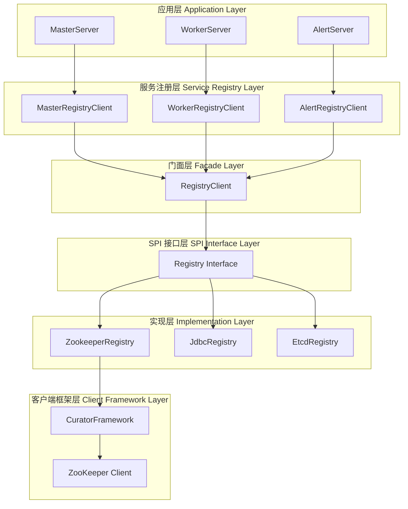
```mermaid
graph TB
    subgraph "应用层 Application Layer"
        A[MasterServer]
        B[WorkerServer]
        C[AlertServer]
    end
    
    subgraph "服务注册层 Service Registry Layer"
        D[MasterRegistryClient]
        E[WorkerRegistryClient]
        F[AlertRegistryClient]
    end
    
    subgraph "门面层 Facade Layer"
        G[RegistryClient]
    end
    
    subgraph "SPI 接口层 SPI Interface Layer"
        H[Registry Interface]
    end
    
    subgraph "实现层 Implementation Layer"
        I[ZookeeperRegistry]
        J[JdbcRegistry]
        K[EtcdRegistry]
    end
    
    subgraph "客户端框架层 Client Framework Layer"
        L[CuratorFramework]
        M[ZooKeeper Client]
    end
    
    A --> D
    B --> E
    C --> F
    D --> G
    E --> G
    F --> G
    G --> H
    H --> I
    H --> J
    H --> K
    I --> L
    L --> M
```

### 2.2 设计模式

1. **门面模式（Facade Pattern）**：`RegistryClient` 封装 `Registry` 接口，提供统一的 API
2. **SPI 机制（Service Provider Interface）**：`Registry` 为 SPI 接口，支持插件化实现
3. **策略模式（Strategy Pattern）**：不同 `Registry` 实现可替换
4. **模板方法模式（Template Method Pattern）**：`BaseHeartBeatTask` 定义心跳任务骨架
5. **适配器模式（Adapter Pattern）**：`ZookeeperConnectionStateListener` 适配 Curator 状态到统一状态

### 2.3 核心类图

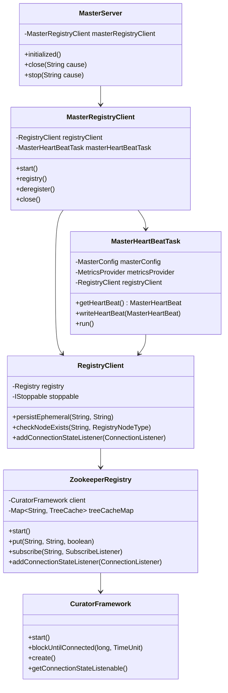
```mermaid
classDiagram
    class MasterServer {
        -MasterRegistryClient masterRegistryClient
        +initialized()
        +close(String cause)
        +stop(String cause)
    }
    
    class MasterRegistryClient {
        -RegistryClient registryClient
        -MasterHeartBeatTask masterHeartBeatTask
        +start()
        +registry()
        +deregister()
        +close()
    }
    
    class MasterHeartBeatTask {
        -MasterConfig masterConfig
        -MetricsProvider metricsProvider
        -RegistryClient registryClient
        +getHeartBeat() MasterHeartBeat
        +writeHeartBeat(MasterHeartBeat)
        +run()
    }
    
    class RegistryClient {
        -Registry registry
        -IStoppable stoppable
        +persistEphemeral(String, String)
        +checkNodeExists(String, RegistryNodeType)
        +addConnectionStateListener(ConnectionListener)
    }
    
    class ZookeeperRegistry {
        -CuratorFramework client
        -Map~String, TreeCache~ treeCacheMap
        +start()
        +put(String, String, boolean)
        +subscribe(String, SubscribeListener)
        +addConnectionStateListener(ConnectionListener)
    }
    
    class CuratorFramework {
        +start()
        +blockUntilConnected(long, TimeUnit)
        +create()
        +getConnectionStateListenable()
    }
    
    MasterServer --> MasterRegistryClient
    MasterRegistryClient --> MasterHeartBeatTask
    MasterRegistryClient --> RegistryClient
    RegistryClient --> ZookeeperRegistry
    ZookeeperRegistry --> CuratorFramework
    MasterHeartBeatTask --> RegistryClient
```

---

## 3. 服务注册流程

### 3.1 完整注册时序图

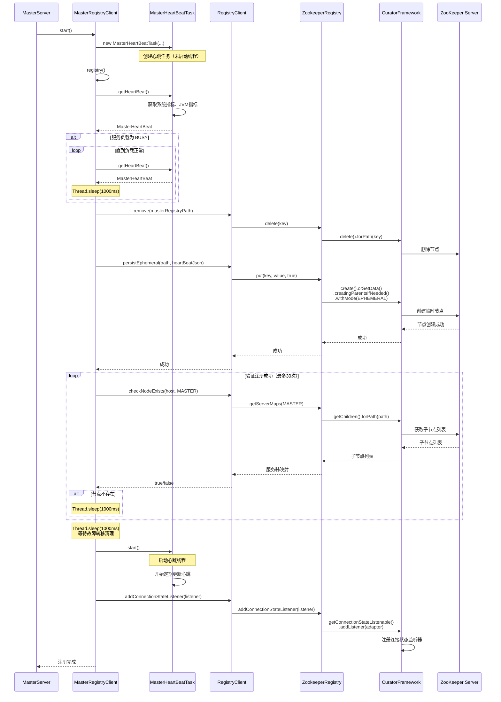
```mermaid
sequenceDiagram
    participant MS as MasterServer
    participant MRC as MasterRegistryClient
    participant MHT as MasterHeartBeatTask
    participant RC as RegistryClient
    participant ZR as ZookeeperRegistry
    participant CF as CuratorFramework
    participant ZK as ZooKeeper Server
    
    MS->>MRC: start()
    MRC->>MHT: new MasterHeartBeatTask(...)
    Note over MHT: 创建心跳任务（未启动线程）
    
    MRC->>MRC: registry()
    MRC->>MHT: getHeartBeat()
    MHT->>MHT: 获取系统指标、JVM指标
    MHT-->>MRC: MasterHeartBeat
    
    alt 服务负载为 BUSY
        loop 直到负载正常
            MRC->>MHT: getHeartBeat()
            MHT-->>MRC: MasterHeartBeat
            Note over MRC: Thread.sleep(1000ms)
        end
    end
    
    MRC->>RC: remove(masterRegistryPath)
    RC->>ZR: delete(key)
    ZR->>CF: delete().forPath(key)
    CF->>ZK: 删除节点
    
    MRC->>RC: persistEphemeral(path, heartBeatJson)
    RC->>ZR: put(key, value, true)
    ZR->>CF: create().orSetData()<br/>.creatingParentsIfNeeded()<br/>.withMode(EPHEMERAL)
    CF->>ZK: 创建临时节点
    ZK-->>CF: 节点创建成功
    CF-->>ZR: 成功
    ZR-->>RC: 成功
    RC-->>MRC: 成功
    
    loop 验证注册成功（最多30次）
        MRC->>RC: checkNodeExists(host, MASTER)
        RC->>ZR: getServerMaps(MASTER)
        ZR->>CF: getChildren().forPath(path)
        CF->>ZK: 获取子节点列表
        ZK-->>CF: 子节点列表
        CF-->>ZR: 子节点列表
        ZR-->>RC: 服务器映射
        RC-->>MRC: true/false
        alt 节点不存在
            Note over MRC: Thread.sleep(1000ms)
        end
    end
    
    Note over MRC: Thread.sleep(1000ms)<br/>等待故障转移清理
    
    MRC->>MHT: start()
    Note over MHT: 启动心跳线程
    MHT->>MHT: 开始定期更新心跳
    
    MRC->>RC: addConnectionStateListener(listener)
    RC->>ZR: addConnectionStateListener(listener)
    ZR->>CF: getConnectionStateListenable()<br/>.addListener(adapter)
    CF->>CF: 注册连接状态监听器
    
    MRC-->>MS: 注册完成
```

### 3.2 注册流程详细步骤

#### 步骤 1：创建心跳任务

**代码位置**：[MasterRegistryClient.java:91-94](dolphinscheduler-master/src/main/java/org/apache/dolphinscheduler/server/master/registry/MasterRegistryClient.java#L91-L94)

```java
this.masterHeartBeatTask = new MasterHeartBeatTask(
    masterConfig, metricsProvider, registryClient, masterCoordinator);
```

**关键点**：
- 心跳任务在注册前创建，但线程尚未启动
- 需要先创建任务以获取心跳数据用于负载检查
- 使用构造函数注入依赖，而非 Spring 依赖注入（原因见下文）

#### 步骤 2：负载检查

**代码位置**：[MasterRegistryClient.java:129-139](dolphinscheduler-master/src/main/java/org/apache/dolphinscheduler/server/master/registry/MasterRegistryClient.java#L129-L139)

```java
MasterHeartBeat heartBeat = masterHeartBeatTask.getHeartBeat();
while (ServerStatus.BUSY.equals(heartBeat.getServerStatus())) {
    log.warn("Master node is BUSY: {}", heartBeat);
    heartBeat = masterHeartBeatTask.getHeartBeat();
    ThreadUtils.sleep(SLEEP_TIME_MILLIS);
}
```

**目的**：
- 注册前检查服务负载状态
- 如果服务处于 BUSY 状态，等待直到状态变为 NORMAL
- 避免高负载时注册到注册中心，影响集群稳定性

**负载判断逻辑**：[MasterHeartBeatTask.java:115-118](dolphinscheduler-master/src/main/java/org/apache/dolphinscheduler/server/master/registry/MasterHeartBeatTask.java#L115-L118)

```java
private ServerStatus getServerStatus(final SystemMetrics systemMetrics,
                                     final MasterServerLoadProtection masterServerLoadProtection) {
    return masterServerLoadProtection.isOverload(systemMetrics) ? ServerStatus.BUSY : ServerStatus.NORMAL;
}
```

#### 步骤 3：删除旧节点

**代码位置**：[MasterRegistryClient.java:142](dolphinscheduler-master/src/main/java/org/apache/dolphinscheduler/server/master/registry/MasterRegistryClient.java#L142)

```java
registryClient.remove(masterRegistryPath);
```

**目的**：先删除旧节点（如果存在），避免重复注册

#### 步骤 4：创建临时节点

**代码位置**：[MasterRegistryClient.java:143](dolphinscheduler-master/src/main/java/org/apache/dolphinscheduler/server/master/registry/MasterRegistryClient.java#L143)

```java
registryClient.persistEphemeral(masterRegistryPath, JSONUtils.toJsonString(masterHeartBeatTask.getHeartBeat()));
```

**实现链**：
1. `RegistryClient.persistEphemeral()` → [RegistryClient.java:176](dolphinscheduler-registry/dolphinscheduler-registry-api/src/main/java/org/apache/dolphinscheduler/registry/api/RegistryClient.java#L176)
    - 调用 `registry.put(key, value, true)`，`deleteOnDisconnect = true` 表示创建临时节点
2. `ZookeeperRegistry.put()` → [ZookeeperRegistry.java:332](dolphinscheduler-registry/dolphinscheduler-registry-plugins/dolphinscheduler-registry-zookeeper/src/main/java/org/apache/dolphinscheduler/plugin/registry/zookeeper/ZookeeperRegistry.java#L332)
    - 根据 `deleteOnDisconnect` 参数决定节点类型：`true` → `CreateMode.EPHEMERAL`，`false` → `CreateMode.PERSISTENT`
3. `CuratorFramework.create()` → [ZookeeperRegistry.java:336-343](dolphinscheduler-registry/dolphinscheduler-registry-plugins/dolphinscheduler-registry-zookeeper/src/main/java/org/apache/dolphinscheduler/plugin/registry/zookeeper/ZookeeperRegistry.java#L336-L343)
    - `.orSetData()`：如果节点存在则更新数据，不存在则创建
    - `.creatingParentsIfNeeded()`：如果父节点不存在则自动创建
    - `.withMode(CreateMode.EPHEMERAL)`：创建临时节点，客户端断开连接后自动删除
    - `.forPath(key, value.getBytes(StandardCharsets.UTF_8))`：设置节点路径和数据

**临时节点特性**：
- **自动删除**：当客户端与 Zookeeper 服务器断开连接（会话超时）时，临时节点会自动删除
- **会话绑定**：临时节点与客户端会话绑定，会话有效期间节点存在
- **故障检测**：其他节点可以通过临时节点的存在与否判断服务是否在线

#### 步骤 5：验证注册成功

**代码位置**：[MasterRegistryClient.java:146-159](dolphinscheduler-master/src/main/java/org/apache/dolphinscheduler/server/master/registry/MasterRegistryClient.java#L146-L159)

```java
int checkCount = 0;
while (!registryClient.checkNodeExists(NetUtils.getHost(), RegistryNodeType.MASTER)) {
    checkCount++;
    log.warn("The current master server node:{} cannot find in registry, check count: {}, registry path: {}", 
            NetUtils.getHost(), checkCount, masterRegistryPath);
    ThreadUtils.sleep(SLEEP_TIME_MILLIS);
    // 超时保护：最多检查30次
    if (checkCount > 30) {
        log.error("Master node:{} cannot be found in registry after {} checks", NetUtils.getHost(), checkCount);
        throw new RegistryException("Master node cannot be found in registry after multiple checks");
    }
}
```

**目的**：
- 验证节点是否已成功写入注册中心
- 处理可能的同步延迟问题（Zookeeper 的最终一致性）
- 超时保护：最多检查30次（约30秒），避免无限等待

**验证流程**：
1. `checkNodeExists()` → [RegistryClient.java:166](dolphinscheduler-registry/dolphinscheduler-registry-api/src/main/java/org/apache/dolphinscheduler/registry/api/RegistryClient.java#L166)
2. `getServerMaps()` → [RegistryClient.java:152](dolphinscheduler-registry/dolphinscheduler-registry-api/src/main/java/org/apache/dolphinscheduler/registry/api/RegistryClient.java#L152)
3. `getServerNodes()` → [RegistryClient.java:236](dolphinscheduler-registry/dolphinscheduler-registry-api/src/main/java/org/apache/dolphinscheduler/registry/api/RegistryClient.java#L236)
4. `getChildrenKeys()` → [RegistryClient.java:224](dolphinscheduler-registry/dolphinscheduler-registry-api/src/main/java/org/apache/dolphinscheduler/registry/api/RegistryClient.java#L224)
5. `ZookeeperRegistry.children()` → [ZookeeperRegistry.java:350](dolphinscheduler-registry/dolphinscheduler-registry-plugins/dolphinscheduler-registry-zookeeper/src/main/java/org/apache/dolphinscheduler/plugin/registry/zookeeper/ZookeeperRegistry.java#L350)

#### 步骤 6：等待故障转移清理

**代码位置**：[MasterRegistryClient.java:162-164](dolphinscheduler-master/src/main/java/org/apache/dolphinscheduler/server/master/registry/MasterRegistryClient.java#L162-L164)

```java
// sleep 1s, waiting master failover remove
log.info("About to sleep {}ms, waiting for master failover remove", SLEEP_TIME_MILLIS);
ThreadUtils.sleep(SLEEP_TIME_MILLIS);
```

**目的**：
- 等待可能的故障转移清理完成
- 避免与故障转移流程冲突
- 确保服务注册的稳定性

#### 步骤 7：启动心跳任务

**代码位置**：[MasterRegistryClient.java:167-168](dolphinscheduler-master/src/main/java/org/apache/dolphinscheduler/server/master/registry/MasterRegistryClient.java#L167-L168)

```java
log.info("About to start masterHeartBeatTask, masterHeartBeatTask is null: {}", masterHeartBeatTask == null);
masterHeartBeatTask.start();
```

**关键点**：
- 心跳任务线程在注册验证完成后才启动
- 启动后开始定期更新注册中心的心跳数据
- 心跳任务使用守护线程，不会阻止 JVM 退出

#### 步骤 8：注册连接状态监听器

**代码位置**：[MasterRegistryClient.java:98](dolphinscheduler-master/src/main/java/org/apache/dolphinscheduler/server/master/registry/MasterRegistryClient.java#L98)

```java
registryClient.addConnectionStateListener(new MasterConnectionStateListener(registryClient));
```

**目的**：
- 监听与注册中心的连接状态变化
- 当连接断开时，主动停止服务以避免提供不可靠的服务

**实现链**：
1. `RegistryClient.addConnectionStateListener()` → [RegistryClient.java:197](dolphinscheduler-registry/dolphinscheduler-registry-api/src/main/java/org/apache/dolphinscheduler/registry/api/RegistryClient.java#L197)
2. `ZookeeperRegistry.addConnectionStateListener()` → [ZookeeperRegistry.java:201](dolphinscheduler-registry/dolphinscheduler-registry-plugins/dolphinscheduler-registry-zookeeper/src/main/java/org/apache/dolphinscheduler/plugin/registry/zookeeper/ZookeeperRegistry.java#L201)
3. `CuratorFramework.getConnectionStateListenable().addListener()` → 注册适配器监听器
4. `ZookeeperConnectionStateListener` → [ZookeeperConnectionStateListener.java:29](dolphinscheduler-registry/dolphinscheduler-registry-plugins/dolphinscheduler-registry-zookeeper/src/main/java/org/apache/dolphinscheduler/plugin/registry/zookeeper/ZookeeperConnectionStateListener.java#L29)
    - 将 Curator 的连接状态转换为 DolphinScheduler 统一的 `ConnectionState` 枚举

---

## 4. 心跳机制详解

### 4.1 双层心跳架构

DolphinScheduler 采用双层心跳架构，包括**服务层心跳**和**应用层心跳**：

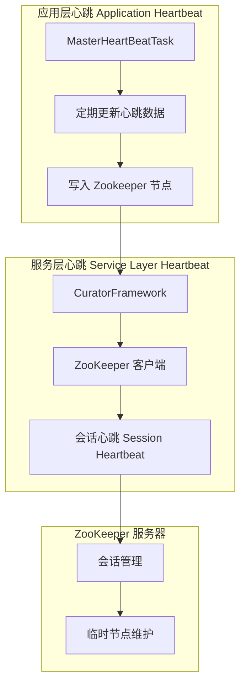
```mermaid
graph TB
    subgraph "应用层心跳 Application Heartbeat"
        A[MasterHeartBeatTask]
        B[定期更新心跳数据]
        C[写入 Zookeeper 节点]
    end
    
    subgraph "服务层心跳 Service Layer Heartbeat"
        D[CuratorFramework]
        E[ZooKeeper 客户端]
        F[会话心跳 Session Heartbeat]
    end
    
    subgraph "ZooKeeper 服务器"
        G[会话管理]
        H[临时节点维护]
    end
    
    A --> B
    B --> C
    C --> D
    D --> E
    E --> F
    F --> G
    G --> H
```

### 4.2 应用层心跳（Application Heartbeat）

**定义**：应用层心跳是 DolphinScheduler 业务层面的心跳机制，用于定期更新服务的业务状态信息到注册中心。

**实现类**：[MasterHeartBeatTask.java](dolphinscheduler-master/src/main/java/org/apache/dolphinscheduler/server/master/registry/MasterHeartBeatTask.java)

**心跳数据内容**：[MasterHeartBeatTask.java:75-92](dolphinscheduler-master/src/main/java/org/apache/dolphinscheduler/server/master/registry/MasterHeartBeatTask.java#L75-L92)

```java
@Override
public MasterHeartBeat getHeartBeat() {
    SystemMetrics systemMetrics = metricsProvider.getSystemMetrics();
    ServerStatus serverStatus = getServerStatus(systemMetrics, masterConfig.getServerLoadProtection());
    return MasterHeartBeat.builder()
            .startupTime(ServerLifeCycleManager.getServerStartupTime())
            .reportTime(System.currentTimeMillis())
            .jvmCpuUsage(systemMetrics.getJvmCpuUsagePercentage())
            .cpuUsage(systemMetrics.getSystemCpuUsagePercentage())
            .jvmMemoryUsage(systemMetrics.getJvmMemoryUsedPercentage())
            .memoryUsage(systemMetrics.getSystemMemoryUsedPercentage())
            .diskUsage(systemMetrics.getDiskUsedPercentage())
            .processId(processId)
            .serverStatus(serverStatus)
            .host(NetUtils.getHost())
            .port(masterConfig.getListenPort())
            .isCoordinator(masterCoordinator.isActive())
            .build();
}
```

**心跳数据包含**：
- **系统指标**：CPU、内存、磁盘使用率
- **JVM 指标**：JVM CPU、内存使用率
- **服务信息**：启动时间、报告时间、进程ID、主机地址、端口
- **服务状态**：NORMAL/BUSY
- **协调者标识**：是否为协调者

**写入逻辑**：[MasterHeartBeatTask.java:95-113](dolphinscheduler-master/src/main/java/org/apache/dolphinscheduler/server/master/registry/MasterHeartBeatTask.java#L95-L113)

```java
@Override
public void writeHeartBeat(final MasterHeartBeat masterHeartBeat) {
    final String failoverNodePath = RegistryUtils.getFailoveredNodePath(masterHeartBeat);
    // 检测故障转移节点
    if (registryClient.exists(failoverNodePath)) {
        log.warn("The master: {} is under {}, means it has been failover will close myself",
                masterHeartBeat, failoverNodePath);
        registryClient.getStoppable().stop("The master exist: " + failoverNodePath + 
                ", means it has been failover will close myself");
        return;
    }
    String masterHeartBeatJson = JSONUtils.toJsonString(masterHeartBeat);
    registryClient.persistEphemeral(heartBeatPath, masterHeartBeatJson);
    MasterServerMetrics.incMasterHeartbeatCount();
    log.debug("Success write master heartBeatInfo into registry, masterRegistryPath: {}, heartBeatInfo: {}",
            heartBeatPath, masterHeartBeatJson);
}
```

**心跳执行机制**：[BaseHeartBeatTask.java:60-105](dolphinscheduler-common/src/main/java/org/apache/dolphinscheduler/common/model/BaseHeartBeatTask.java#L60-L105)

```java
@Override
public void run() {
    while (runningFlag) {
        try {
            T heartBeat = getHeartBeat();
            // 定期写入：距离上次写入时间 >= heartBeatInterval
            // 状态变化时立即写入：serverStatus 发生变化时立即写入
            if (System.currentTimeMillis() - lastWriteTime >= heartBeatInterval
                    || !lastHeartBeat.getServerStatus().equals(heartBeat.getServerStatus())) {
                lastHeartBeat = heartBeat;
                writeHeartBeat(heartBeat);
                lastWriteTime = System.currentTimeMillis();
            }
        } catch (Exception ex) {
            log.error("{} task execute failed", threadName, ex);
        } finally {
            try {
                Thread.sleep(DEFAULT_HEARTBEAT_SCAN_INTERVAL); // 固定 1 秒扫描间隔
            } catch (InterruptedException e) {
                handleInterruptException(e);
            }
        }
    }
}
```

**关键特性**：
- **扫描间隔**：固定 1 秒（`DEFAULT_HEARTBEAT_SCAN_INTERVAL`）
- **写入间隔**：由配置决定（`masterConfig.getMaxHeartbeatInterval()`，默认 10 秒）
- **状态变化立即写入**：当服务状态从 NORMAL 变为 BUSY 或反之，立即写入，不等待间隔
- **故障转移检测**：每次写入前检查是否存在故障转移节点，如果存在则停止服务

### 4.3 服务层心跳（Service Layer Heartbeat）

**定义**：服务层心跳是 Zookeeper 客户端框架（CuratorFramework）与 Zookeeper 服务器之间的底层会话心跳，用于维持客户端会话的有效性。

**实现机制**：
- **CuratorFramework** 自动管理会话心跳
- **ZooKeeper 客户端** 定期向服务器发送心跳包（PING）
- **会话超时**：如果客户端在 `sessionTimeout` 时间内未发送心跳，服务器会认为会话失效

**配置位置**：[ZookeeperRegistry.java:115](dolphinscheduler-registry/dolphinscheduler-registry-plugins/dolphinscheduler-registry-zookeeper/src/main/java/org/apache/dolphinscheduler/plugin/registry/zookeeper/ZookeeperRegistry.java#L115)

```java
.sessionTimeoutMs(DurationUtils.toMillisInt(properties.getSessionTimeout())) // 默认 60 秒
```

**会话心跳机制**：
1. **自动发送**：CuratorFramework 内部线程自动发送心跳，无需应用层干预
2. **心跳间隔**：通常为 `sessionTimeout / 3`，例如 sessionTimeout=60s，心跳间隔约为 20s
3. **会话保持**：只要在 `sessionTimeout` 时间内收到心跳，会话就保持有效
4. **临时节点维护**：会话有效期间，临时节点保持存在；会话失效时，临时节点自动删除

### 4.4 服务层心跳与应用层心跳的关系

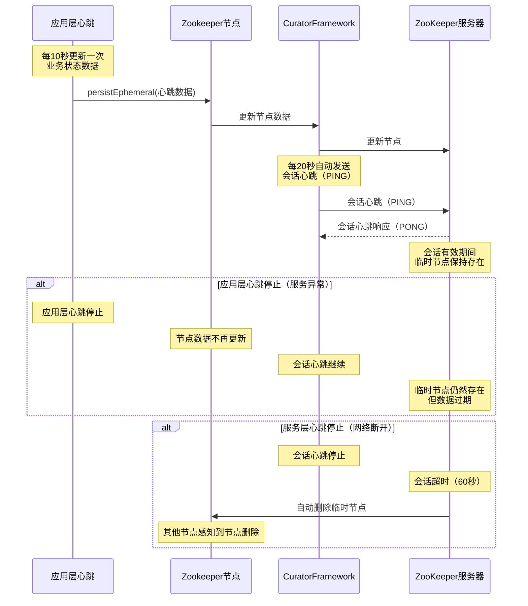
```mermaid
sequenceDiagram
    participant App as 应用层心跳
    participant ZK as Zookeeper节点
    participant CF as CuratorFramework
    participant ZKS as ZooKeeper服务器
    
    Note over App: 每10秒更新一次<br/>业务状态数据
    App->>ZK: persistEphemeral(心跳数据)
    ZK->>CF: 更新节点数据
    CF->>ZKS: 更新节点
    
    Note over CF: 每20秒自动发送<br/>会话心跳（PING）
    CF->>ZKS: 会话心跳（PING）
    ZKS-->>CF: 会话心跳响应（PONG）
    
    Note over ZKS: 会话有效期间<br/>临时节点保持存在
    
    alt 应用层心跳停止（服务异常）
        Note over App: 应用层心跳停止
        Note over ZK: 节点数据不再更新
        Note over CF: 会话心跳继续
        Note over ZKS: 临时节点仍然存在<br/>但数据过期
    end
    
    alt 服务层心跳停止（网络断开）
        Note over CF: 会话心跳停止
        Note over ZKS: 会话超时（60秒）
        ZKS->>ZK: 自动删除临时节点
        Note over ZK: 其他节点感知到节点删除
    end
```

**关系说明**：

1. **独立性**：
    - 应用层心跳和服务层心跳是**相互独立**的
    - 应用层心跳停止不影响服务层心跳
    - 服务层心跳停止会导致会话失效，临时节点被删除

2. **依赖关系**：
    - 应用层心跳**依赖**服务层心跳
    - 如果服务层心跳停止（连接断开），应用层心跳无法写入数据
    - 服务层心跳正常是应用层心跳正常工作的前提

3. **作用范围**：
    - **应用层心跳**：更新业务状态数据，供其他节点读取和判断
    - **服务层心跳**：维持会话有效性，保证临时节点存在

4. **故障检测**：
    - **应用层心跳超时**：其他节点可以通过读取心跳数据的 `reportTime` 判断服务是否正常
    - **服务层心跳超时**：Zookeeper 自动删除临时节点，其他节点立即感知服务下线

5. **配置关系**：
    - **应用层心跳间隔**：`master.max-heartbeat-interval`（默认 10 秒）
    - **服务层心跳间隔**：自动计算，约为 `sessionTimeout / 3`（默认约 20 秒）
    - **会话超时**：`registry.zookeeper.session-timeout`（默认 60 秒）

**最佳实践**：
- 应用层心跳间隔应**小于**会话超时的 1/3，确保即使应用层心跳失败，服务层心跳仍能维持会话
- 例如：sessionTimeout=60s，应用层心跳间隔应 ≤ 20s（实际配置为 10s）

---

## 5. CuratorFramework 架构

### 5.1 CuratorFramework 简介

**CuratorFramework** 是 Apache Curator 提供的 Zookeeper 客户端高级封装框架，提供了比原生 Zookeeper 客户端更易用、更可靠的 API。

**核心特性**：
- **自动重连**：连接断开后自动重连
- **会话管理**：自动管理会话生命周期
- **重试策略**：提供多种重试策略（指数退避、固定间隔等）
- **高级功能**：分布式锁、选举、缓存等
- **连接状态监听**：提供连接状态变化通知

**在 DolphinScheduler 中的使用**：
- **封装位置**：[ZookeeperRegistry.java:64](dolphinscheduler-registry/dolphinscheduler-registry-plugins/dolphinscheduler-registry-zookeeper/src/main/java/org/apache/dolphinscheduler/plugin/registry/zookeeper/ZookeeperRegistry.java#L64)
- **初始化位置**：[ZookeeperRegistry.java:76-136](dolphinscheduler-registry/dolphinscheduler-registry-plugins/dolphinscheduler-registry-zookeeper/src/main/java/org/apache/dolphinscheduler/plugin/registry/zookeeper/ZookeeperRegistry.java#L76-L136)

### 5.2 CuratorFramework 初始化

**初始化流程**：

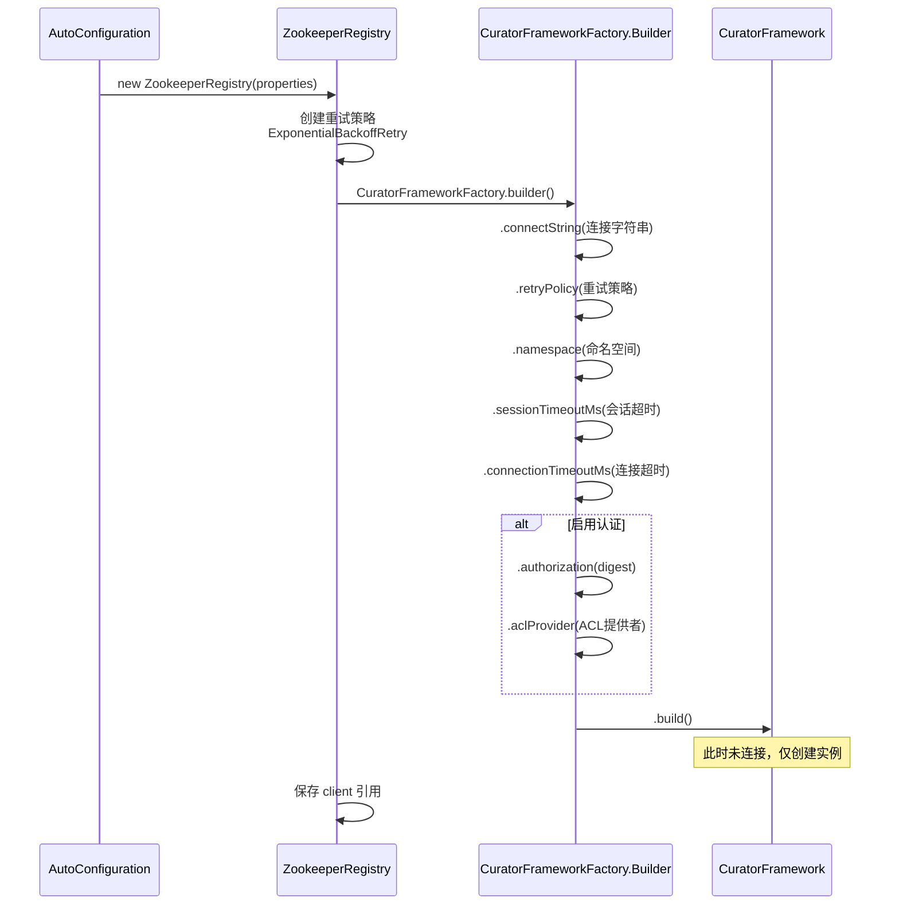
```mermaid
sequenceDiagram
    participant AC as AutoConfiguration
    participant ZR as ZookeeperRegistry
    participant CFB as CuratorFrameworkFactory.Builder
    participant CF as CuratorFramework
    
    AC->>ZR: new ZookeeperRegistry(properties)
    ZR->>ZR: 创建重试策略<br/>ExponentialBackoffRetry
    ZR->>CFB: CuratorFrameworkFactory.builder()
    CFB->>CFB: .connectString(连接字符串)
    CFB->>CFB: .retryPolicy(重试策略)
    CFB->>CFB: .namespace(命名空间)
    CFB->>CFB: .sessionTimeoutMs(会话超时)
    CFB->>CFB: .connectionTimeoutMs(连接超时)
    alt 启用认证
        CFB->>CFB: .authorization(digest)
        CFB->>CFB: .aclProvider(ACL提供者)
    end
    CFB->>CF: .build()
    Note over CF: 此时未连接，仅创建实例
    ZR->>ZR: 保存 client 引用
```

**初始化代码**：[ZookeeperRegistry.java:76-136](dolphinscheduler-registry/dolphinscheduler-registry-plugins/dolphinscheduler-registry-zookeeper/src/main/java/org/apache/dolphinscheduler/plugin/registry/zookeeper/ZookeeperRegistry.java#L76-L136)

```java
ZookeeperRegistry(ZookeeperRegistryProperties registryProperties) {
    properties = registryProperties.getZookeeper();
    
    // 1. 创建指数退避重试策略
    final ExponentialBackoffRetry retryPolicy = new ExponentialBackoffRetry(
            (int) properties.getRetryPolicy().getBaseSleepTime().toMillis(),  // 默认 1 秒
            properties.getRetryPolicy().getMaxRetries(),                      // 默认 3 次
            (int) properties.getRetryPolicy().getMaxSleep().toMillis());    // 默认 3 秒
    
    // 2. 构建 CuratorFramework 实例
    CuratorFrameworkFactory.Builder builder =
            CuratorFrameworkFactory.builder()
                    .connectString(properties.getConnectString())           // 连接字符串
                    .retryPolicy(retryPolicy)                               // 重试策略
                    .namespace(properties.getNamespace())                    // 命名空间（默认 dolphinscheduler）
                    .sessionTimeoutMs(DurationUtils.toMillisInt(properties.getSessionTimeout()))  // 会话超时（默认 60 秒）
                    .connectionTimeoutMs(DurationUtils.toMillisInt(properties.getConnectionTimeout())); // 连接超时（默认 15 秒）
    
    // 3. 如果启用认证，配置 ACL
    final String digest = properties.getDigest();
    if (!Strings.isNullOrEmpty(digest)) {
        builder.authorization("digest", digest.getBytes(StandardCharsets.UTF_8))
                .aclProvider(new ACLProvider() {
                    @Override
                    public List<ACL> getDefaultAcl() {
                        return ZooDefs.Ids.CREATOR_ALL_ACL;
                    }
                    @Override
                    public List<ACL> getAclForPath(final String path) {
                        return ZooDefs.Ids.CREATOR_ALL_ACL;
                    }
                });
    }
    
    // 4. 构建实例（此时未连接）
    client = builder.build();
}
```

**重试策略详解**：

| 重试次数 | 计算公式 | 计算值 | 实际等待时间 | 说明 |
|---------|---------|--------|------------|------|
| 第1次重试 | 1000ms × 2⁰ = 1000ms | 1000ms | 1秒 | 初始等待时间 |
| 第2次重试 | 1000ms × 2¹ = 2000ms | 2000ms | 2秒 | 指数增长 |
| 第3次重试 | 1000ms × 2² = 4000ms | 4000ms | 3秒 | 达到 maxSleep，被限制为 3秒 |
| 第4次重试 | - | - | 3秒 | 继续保持 maxSleep |

**公式**：`waitTime = baseSleepTime × 2^(retryCount-1)`  
**限制**：`实际等待时间 = min(计算值, maxSleepMs)`

### 5.3 连接建立

**启动流程**：[ZookeeperRegistry.java:142-162](dolphinscheduler-registry/dolphinscheduler-registry-plugins/dolphinscheduler-registry-zookeeper/src/main/java/org/apache/dolphinscheduler/plugin/registry/zookeeper/ZookeeperRegistry.java#L142-L162)

```java
@Override
public void start() {
    final StopWatch stopWatch = StopWatch.createStarted();
    // 异步非阻塞调用，后台开始连接过程，不会等待连接成功就返回
    client.start();
    try {
        // 同步等待连接建立，最多等待 blockUntilConnected 时间
        if (!client.blockUntilConnected(DurationUtils.toMillisInt(properties.getBlockUntilConnected()),
                MILLISECONDS)) {
            client.close();
            throw new RegistryException(
                    "zookeeper connect failed to: " + properties.getConnectString() + " in : "
                            + properties.getBlockUntilConnected() + "ms");
        }
        stopWatch.stop();
        log.info("ZookeeperRegistry started at: {}/ms", stopWatch.getTime());
    } catch (InterruptedException e) {
        Thread.currentThread().interrupt();
        throw new RegistryException("Zookeeper registry start failed", e);
    }
}
```

**连接建立时序图**：

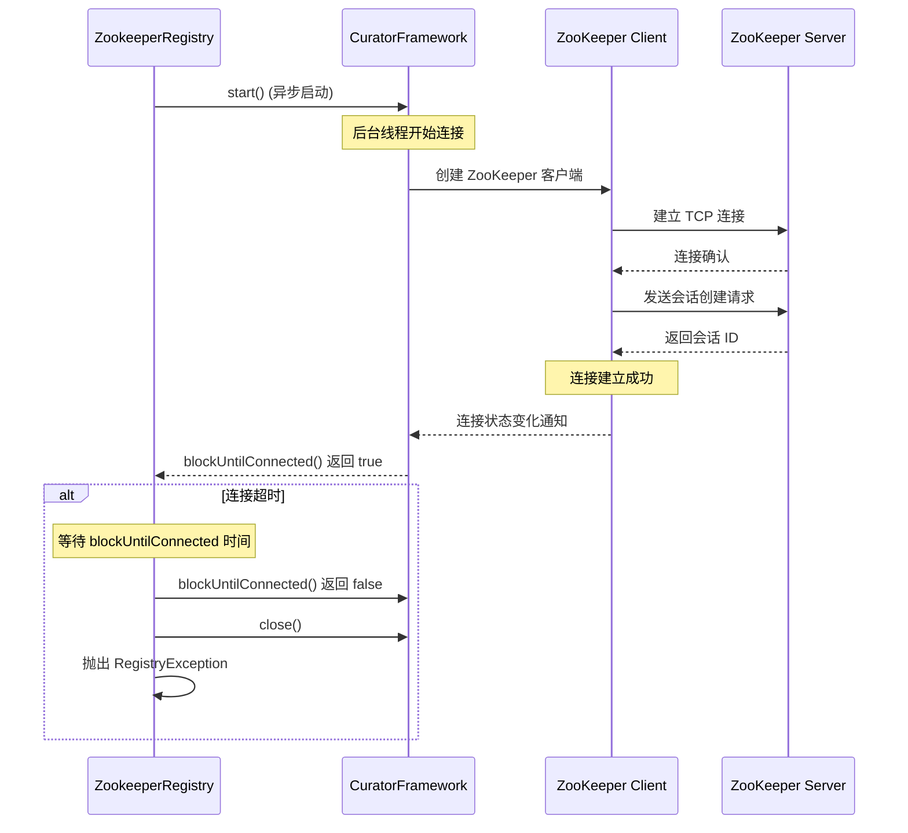
```mermaid
sequenceDiagram
    participant ZR as ZookeeperRegistry
    participant CF as CuratorFramework
    participant ZKC as ZooKeeper Client
    participant ZKS as ZooKeeper Server
    
    ZR->>CF: start() (异步启动)
    Note over CF: 后台线程开始连接
    CF->>ZKC: 创建 ZooKeeper 客户端
    ZKC->>ZKS: 建立 TCP 连接
    ZKS-->>ZKC: 连接确认
    ZKC->>ZKS: 发送会话创建请求
    ZKS-->>ZKC: 返回会话 ID
    Note over ZKC: 连接建立成功
    ZKC-->>CF: 连接状态变化通知
    CF-->>ZR: blockUntilConnected() 返回 true
    
    alt 连接超时
        Note over ZR: 等待 blockUntilConnected 时间
        ZR->>CF: blockUntilConnected() 返回 false
        ZR->>CF: close()
        ZR->>ZR: 抛出 RegistryException
    end
```

**关键配置**：
- **连接超时**：`connectionTimeout`（默认 15 秒）- 建立 TCP 连接的最大等待时间
- **阻塞等待时间**：`blockUntilConnected`（默认 15 秒）- 等待连接建立的最大时间
- **会话超时**：`sessionTimeout`（默认 60 秒）- 会话保持的有效时间

### 5.4 会话管理

**会话（Session）** 是 Zookeeper 客户端与服务器之间的逻辑连接，用于标识客户端身份和维持连接状态。

**会话特性**：
- **唯一标识**：每个会话有唯一的会话 ID（Session ID）
- **超时机制**：如果客户端在 `sessionTimeout` 时间内未发送心跳，会话失效
- **临时节点绑定**：临时节点与会话绑定，会话失效时临时节点自动删除
- **自动重连**：连接断开后，如果在 `sessionTimeout` 时间内重连，会话仍然有效

**会话状态流转图**：

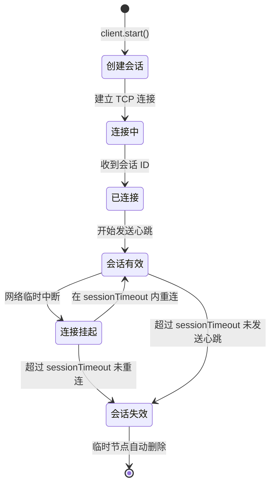
```mermaid
stateDiagram-v2
    [*] --> 创建会话: client.start()
    创建会话 --> 连接中: 建立 TCP 连接
    连接中 --> 已连接: 收到会话 ID
    已连接 --> 会话有效: 开始发送心跳
    会话有效 --> 连接挂起: 网络临时中断
    连接挂起 --> 会话有效: 在 sessionTimeout 内重连
    连接挂起 --> 会话失效: 超过 sessionTimeout 未重连
    会话有效 --> 会话失效: 超过 sessionTimeout 未发送心跳
    会话失效 --> [*]: 临时节点自动删除
```

**会话管理代码位置**：
- **会话超时配置**：[ZookeeperRegistry.java:115](dolphinscheduler-registry/dolphinscheduler-registry-plugins/dolphinscheduler-registry-zookeeper/src/main/java/org/apache/dolphinscheduler/plugin/registry/zookeeper/ZookeeperRegistry.java#L115)
- **会话状态监听**：[ZookeeperConnectionStateListener.java:37-60](dolphinscheduler-registry/dolphinscheduler-registry-plugins/dolphinscheduler-registry-zookeeper/src/main/java/org/apache/dolphinscheduler/plugin/registry/zookeeper/ZookeeperConnectionStateListener.java#L37-L60)

### 5.5 心跳机制

**服务层心跳（Session Heartbeat）** 是 CuratorFramework 自动管理的底层心跳机制，用于维持 Zookeeper 会话的有效性。

**心跳机制详解**：

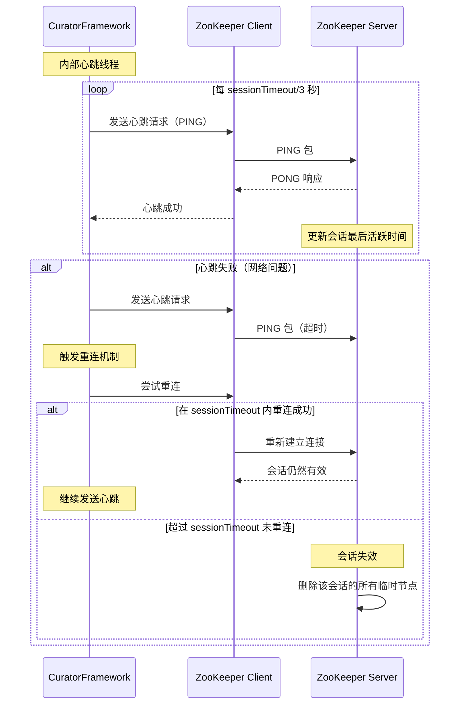
```mermaid
sequenceDiagram
    participant CF as CuratorFramework
    participant ZKC as ZooKeeper Client
    participant ZKS as ZooKeeper Server
    
    Note over CF: 内部心跳线程
    loop 每 sessionTimeout/3 秒
        CF->>ZKC: 发送心跳请求（PING）
        ZKC->>ZKS: PING 包
        ZKS-->>ZKC: PONG 响应
        ZKC-->>CF: 心跳成功
        Note over ZKS: 更新会话最后活跃时间
    end
    
    alt 心跳失败（网络问题）
        CF->>ZKC: 发送心跳请求
        ZKC->>ZKS: PING 包（超时）
        Note over CF: 触发重连机制
        CF->>ZKC: 尝试重连
        alt 在 sessionTimeout 内重连成功
            ZKC->>ZKS: 重新建立连接
            ZKS-->>ZKC: 会话仍然有效
            Note over CF: 继续发送心跳
        else 超过 sessionTimeout 未重连
            Note over ZKS: 会话失效
            ZKS->>ZKS: 删除该会话的所有临时节点
        end
    end
```

**心跳参数**：
- **心跳间隔**：自动计算，通常为 `sessionTimeout / 3`
   - 例如：`sessionTimeout = 60s`，心跳间隔约为 `20s`
- **会话超时**：`sessionTimeout`（默认 60 秒）
   - 如果 `sessionTimeout` 时间内未收到心跳，会话失效
- **心跳线程**：CuratorFramework 内部线程自动管理，无需应用层干预

**心跳与临时节点的关系**：
- **会话有效**：临时节点存在
- **会话失效**：临时节点自动删除
- **其他节点感知**：通过监听临时节点的删除事件，立即感知服务下线

### 5.6 连接状态监听

**连接状态监听** 用于监听 CuratorFramework 与 Zookeeper 服务器之间的连接状态变化。

**连接状态枚举**：[ConnectionState.java](dolphinscheduler-registry/dolphinscheduler-registry-api/src/main/java/org/apache/dolphinscheduler/registry/api/ConnectionState.java)

```java
public enum ConnectionState {
    CONNECTED,      // 首次连接成功或重新连接成功
    RECONNECTED,    // 从 SUSPENDED 状态恢复连接
    SUSPENDED,      // 连接挂起（网络临时中断，但会话未超时，可能自动恢复）
    DISCONNECTED    // 连接丢失（会话超时或长时间无法连接，需要重新建立会话）
}
```

**状态转换图**：

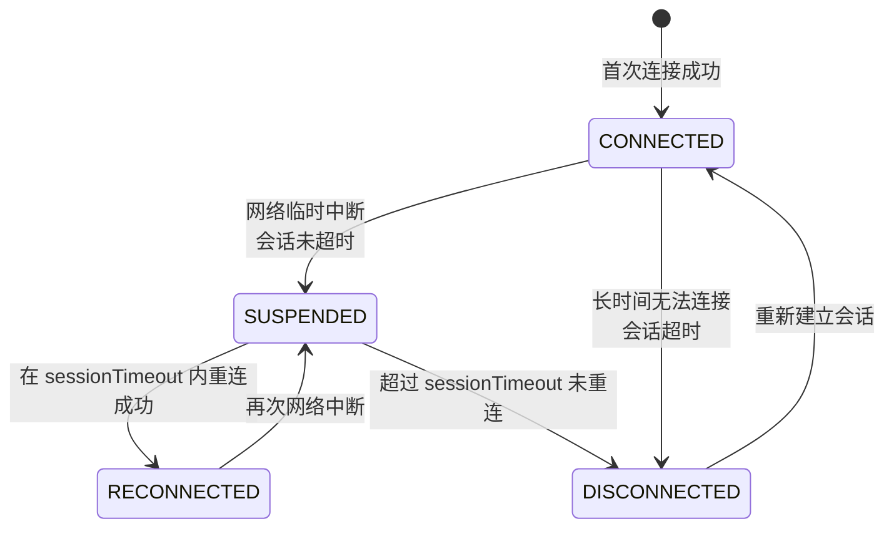
```mermaid
stateDiagram-v2
    [*] --> CONNECTED: 首次连接成功
    CONNECTED --> SUSPENDED: 网络临时中断<br/>会话未超时
    SUSPENDED --> RECONNECTED: 在 sessionTimeout 内重连成功
    SUSPENDED --> DISCONNECTED: 超过 sessionTimeout 未重连
    RECONNECTED --> SUSPENDED: 再次网络中断
    CONNECTED --> DISCONNECTED: 长时间无法连接<br/>会话超时
    DISCONNECTED --> CONNECTED: 重新建立会话
```

**状态监听实现**：[ZookeeperConnectionStateListener.java:37-60](dolphinscheduler-registry/dolphinscheduler-registry-plugins/dolphinscheduler-registry-zookeeper/src/main/java/org/apache/dolphinscheduler/plugin/registry/zookeeper/ZookeeperConnectionStateListener.java#L37-L60)

```java
@Override
public void stateChanged(CuratorFramework client,
                         org.apache.curator.framework.state.ConnectionState newState) {
    switch (newState) {
        case CONNECTED:
            log.info("Registry connected");
            listener.onUpdate(ConnectionState.CONNECTED);
            break;
        case LOST:
            log.warn("Registry disconnected");
            listener.onUpdate(ConnectionState.DISCONNECTED);
            break;
        case RECONNECTED:
            log.info("Registry reconnected");
            listener.onUpdate(ConnectionState.RECONNECTED);
            break;
        case SUSPENDED:
            log.warn("Registry suspended");
            listener.onUpdate(ConnectionState.SUSPENDED);
            break;
        default:
            break;
    }
}
```

**Master 连接状态监听器**：[MasterConnectionStateListener.java:36-54](dolphinscheduler-master/src/main/java/org/apache/dolphinscheduler/server/master/registry/MasterConnectionStateListener.java#L36-L54)

```java
@Override
public void onUpdate(ConnectionState state) {
    log.info("Master received a {} event from registry, the current server state is {}", 
            state, ServerLifeCycleManager.getServerStatus());
    switch (state) {
        case CONNECTED:
            // 连接成功，无需处理
            // 首次连接成功或重新连接成功，服务正常运行
            break;
        case SUSPENDED:
            // 连接挂起，网络临时中断但会话未超时
            // 可能自动恢复，暂时不处理
            break;
        case RECONNECTED:
            // 从 SUSPENDED 状态恢复连接
            // 会话仍然有效，临时节点未删除
            log.warn("Master reconnect to registry");
            break;
        case DISCONNECTED:
            // 连接丢失，会话超时或长时间无法连接
            // 临时节点已被删除，需要主动停止服务
            registryClient.getStoppable().stop(
                "Master disconnected from registry, will stop myself");
            break;
        default:
            log.warn("Unknown connection state: {}", state);
    }
}
```

**关键处理逻辑**：
- **CONNECTED**：连接成功，服务正常运行，无需特殊处理
- **SUSPENDED**：网络临时中断，但会话未超时，可能自动恢复，暂时不处理
- **RECONNECTED**：从挂起状态恢复，会话仍然有效，记录日志即可
- **DISCONNECTED**：连接丢失且会话超时，临时节点已被删除，**主动停止服务**以避免提供不可靠的服务

**断开通知机制**：

当 Zookeeper 连接断开时，会触发以下流程：

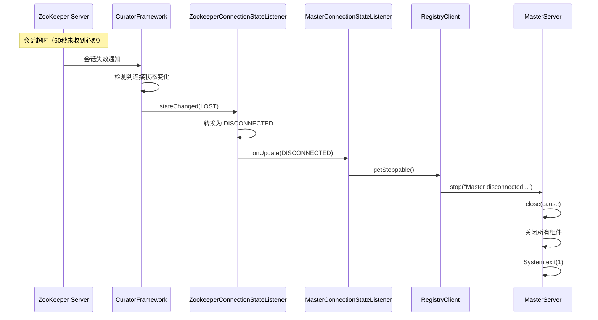
```mermaid
sequenceDiagram
    participant ZKS as ZooKeeper Server
    participant CF as CuratorFramework
    participant ZCSL as ZookeeperConnectionStateListener
    participant MCSL as MasterConnectionStateListener
    participant RC as RegistryClient
    participant MS as MasterServer
    
    Note over ZKS: 会话超时（60秒未收到心跳）
    ZKS->>CF: 会话失效通知
    CF->>CF: 检测到连接状态变化
    CF->>ZCSL: stateChanged(LOST)
    ZCSL->>ZCSL: 转换为 DISCONNECTED
    ZCSL->>MCSL: onUpdate(DISCONNECTED)
    MCSL->>RC: getStoppable()
    RC->>MS: stop("Master disconnected...")
    MS->>MS: close(cause)
    MS->>MS: 关闭所有组件
    MS->>MS: System.exit(1)
```

**断开通知的触发条件**：
1. **会话超时**：在 `sessionTimeout`（默认 60 秒）时间内未收到客户端心跳
2. **网络长时间中断**：网络中断超过 `sessionTimeout` 时间
3. **服务器主动断开**：Zookeeper 服务器主动关闭连接

**断开后的影响**：
- **临时节点自动删除**：Zookeeper 服务器自动删除该会话的所有临时节点
- **其他节点感知**：其他 Master 节点通过 TreeCache 监听器立即感知节点删除
- **故障转移触发**：其他节点检测到节点删除后，触发故障转移流程
- **服务主动停止**：当前 Master 服务主动停止，避免状态不一致

---

## 6. 连接状态管理

### 6.1 连接状态流转

**完整的状态流转图**：

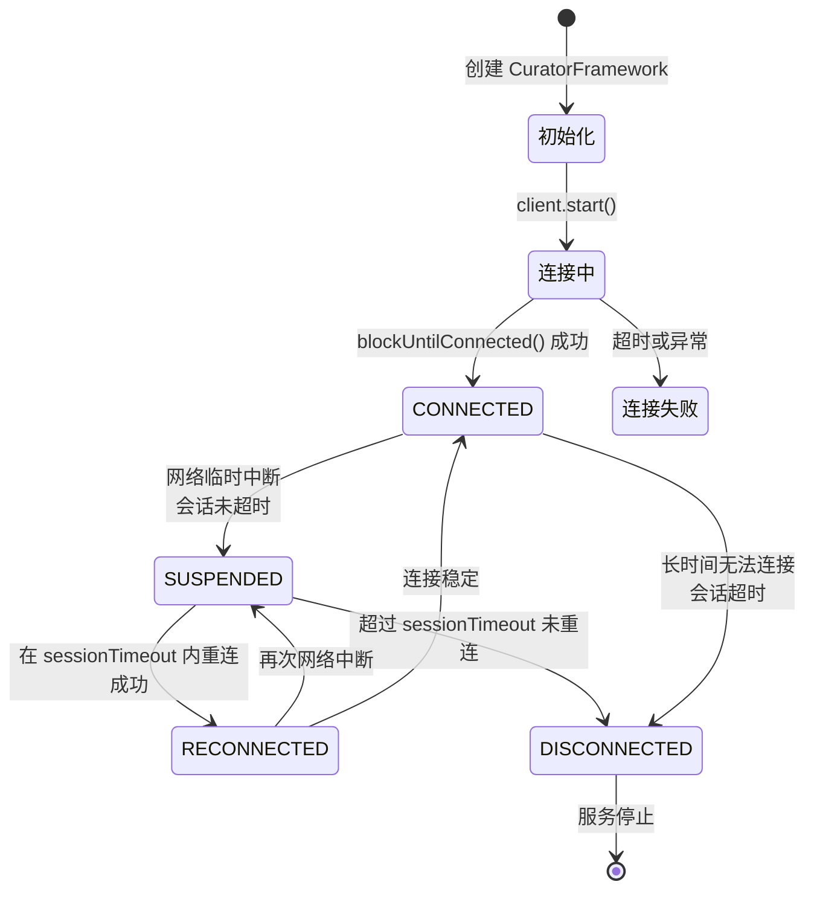
```mermaid
stateDiagram-v2
    [*] --> 初始化: 创建 CuratorFramework
    初始化 --> 连接中: client.start()
    连接中 --> CONNECTED: blockUntilConnected() 成功
    连接中 --> 连接失败: 超时或异常
    
    CONNECTED --> SUSPENDED: 网络临时中断<br/>会话未超时
    SUSPENDED --> RECONNECTED: 在 sessionTimeout 内重连成功
    SUSPENDED --> DISCONNECTED: 超过 sessionTimeout 未重连
    RECONNECTED --> SUSPENDED: 再次网络中断
    CONNECTED --> DISCONNECTED: 长时间无法连接<br/>会话超时
    
    DISCONNECTED --> [*]: 服务停止
    RECONNECTED --> CONNECTED: 连接稳定
```

### 6.2 会话管理

**会话生命周期**：

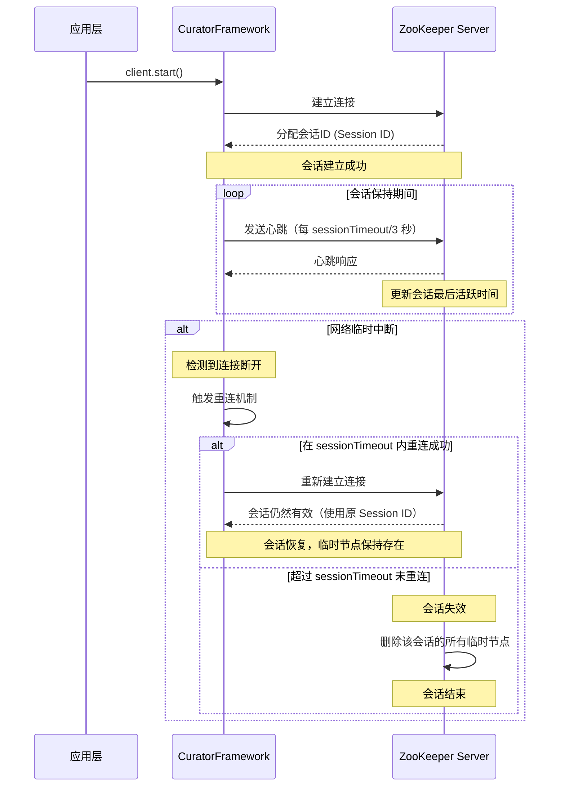
```mermaid
sequenceDiagram
    participant App as 应用层
    participant CF as CuratorFramework
    participant ZKS as ZooKeeper Server
    
    App->>CF: client.start()
    CF->>ZKS: 建立连接
    ZKS-->>CF: 分配会话ID (Session ID)
    Note over CF,ZKS: 会话建立成功
    
    loop 会话保持期间
        CF->>ZKS: 发送心跳（每 sessionTimeout/3 秒）
        ZKS-->>CF: 心跳响应
        Note over ZKS: 更新会话最后活跃时间
    end
    
    alt 网络临时中断
        Note over CF: 检测到连接断开
        CF->>CF: 触发重连机制
        alt 在 sessionTimeout 内重连成功
            CF->>ZKS: 重新建立连接
            ZKS-->>CF: 会话仍然有效（使用原 Session ID）
            Note over CF,ZKS: 会话恢复，临时节点保持存在
        else 超过 sessionTimeout 未重连
            Note over ZKS: 会话失效
            ZKS->>ZKS: 删除该会话的所有临时节点
            Note over ZKS: 会话结束
        end
    end
```

**会话关键参数**：
- **会话ID（Session ID）**：Zookeeper 服务器为每个客户端连接分配的唯一标识
- **会话超时（Session Timeout）**：默认 60 秒，配置位置：[ZookeeperRegistry.java:115](dolphinscheduler-registry/dolphinscheduler-registry-plugins/dolphinscheduler-registry-zookeeper/src/main/java/org/apache/dolphinscheduler/plugin/registry/zookeeper/ZookeeperRegistry.java#L115)
- **心跳间隔**：自动计算，约为 `sessionTimeout / 3`（约 20 秒）

### 6.3 断开通知机制详解

**断开通知的完整流程**：

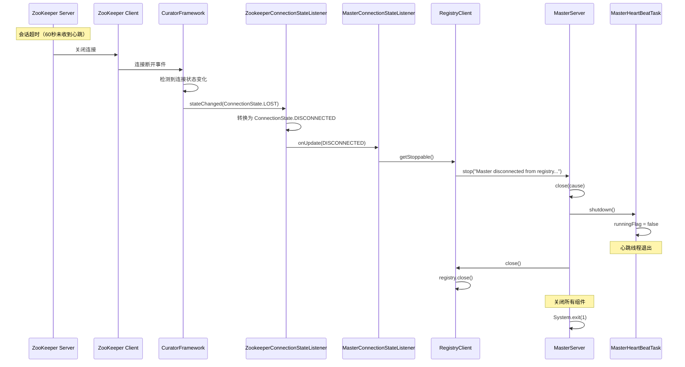
```mermaid
sequenceDiagram
    participant ZKS as ZooKeeper Server
    participant ZKC as ZooKeeper Client
    participant CF as CuratorFramework
    participant ZCSL as ZookeeperConnectionStateListener
    participant MCSL as MasterConnectionStateListener
    participant RC as RegistryClient
    participant MS as MasterServer
    participant MHT as MasterHeartBeatTask
    
    Note over ZKS: 会话超时（60秒未收到心跳）
    ZKS->>ZKC: 关闭连接
    ZKC->>CF: 连接断开事件
    CF->>CF: 检测到连接状态变化
    CF->>ZCSL: stateChanged(ConnectionState.LOST)
    
    ZCSL->>ZCSL: 转换为 ConnectionState.DISCONNECTED
    ZCSL->>MCSL: onUpdate(DISCONNECTED)
    
    MCSL->>RC: getStoppable()
    RC->>MS: stop("Master disconnected from registry...")
    
    MS->>MS: close(cause)
    MS->>MHT: shutdown()
    MHT->>MHT: runningFlag = false
    Note over MHT: 心跳线程退出
    
    MS->>RC: close()
    RC->>RC: registry.close()
    Note over MS: 关闭所有组件
    
    MS->>MS: System.exit(1)
```

**断开通知的监听器链**：

1. **CuratorFramework 内部监听器**：监听 Zookeeper 客户端的连接状态变化
2. **ZookeeperConnectionStateListener**：适配器，将 Curator 状态转换为统一状态
   - 代码位置：[ZookeeperConnectionStateListener.java:37-60](dolphinscheduler-registry/dolphinscheduler-registry-plugins/dolphinscheduler-registry-zookeeper/src/main/java/org/apache/dolphinscheduler/plugin/registry/zookeeper/ZookeeperConnectionStateListener.java#L37-L60)
3. **MasterConnectionStateListener**：应用层监听器，处理连接状态变化
   - 代码位置：[MasterConnectionStateListener.java:36-54](dolphinscheduler-master/src/main/java/org/apache/dolphinscheduler/server/master/registry/MasterConnectionStateListener.java#L36-L54)

---

## 7. 服务层心跳与应用层心跳关系

### 7.1 双层心跳架构总结

**完整的心跳架构图**：

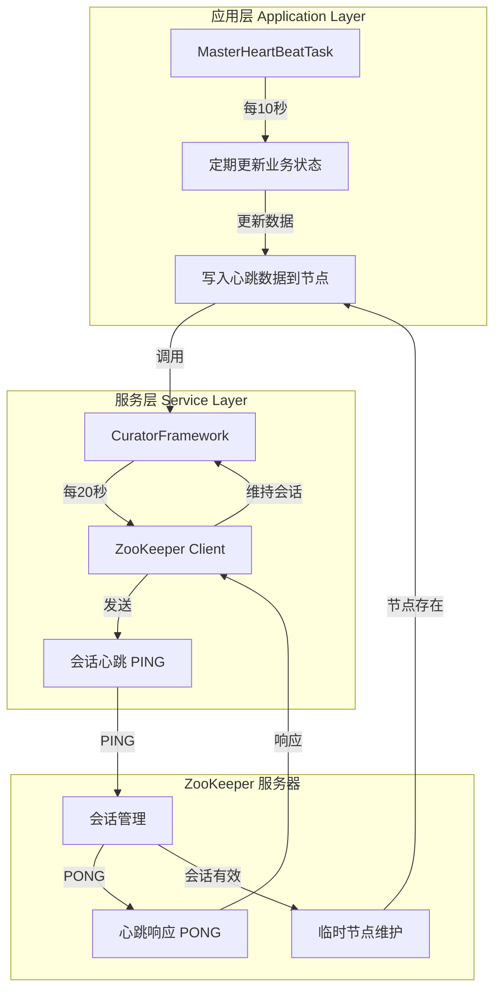
```mermaid
graph TB
    subgraph "应用层 Application Layer"
        A[MasterHeartBeatTask]
        B[定期更新业务状态]
        C[写入心跳数据到节点]
    end
    
    subgraph "服务层 Service Layer"
        D[CuratorFramework]
        E[ZooKeeper Client]
        F[会话心跳 PING]
    end
    
    subgraph "ZooKeeper 服务器"
        G[会话管理]
        H[临时节点维护]
        I[心跳响应 PONG]
    end
    
    A -->|每10秒| B
    B -->|更新数据| C
    C -->|调用| D
    D -->|每20秒| E
    E -->|发送| F
    F -->|PING| G
    G -->|PONG| I
    I -->|响应| E
    E -->|维持会话| D
    G -->|会话有效| H
    H -->|节点存在| C
```

### 7.2 心跳机制对比

| 特性 | 应用层心跳 | 服务层心跳 |
|------|-----------|-----------|
| **实现位置** | MasterHeartBeatTask | CuratorFramework 内部 |
| **心跳内容** | 业务状态数据（CPU、内存、负载等） | 会话保持（PING/PONG） |
| **心跳间隔** | 10 秒（可配置） | 约 20 秒（自动计算） |
| **更新对象** | Zookeeper 节点数据 | Zookeeper 会话 |
| **作用范围** | 业务层面，供其他节点读取 | 底层会话，维持连接 |
| **失败影响** | 其他节点无法获取最新状态 | 会话失效，临时节点删除 |
| **手动管理** | 需要应用层代码管理 | 自动管理，无需干预 |

### 7.3 心跳关系详解

**独立性**：
- 应用层心跳和服务层心跳是**相互独立**的机制
- 应用层心跳停止不影响服务层心跳
- 服务层心跳停止会导致会话失效，临时节点被删除

**依赖关系**：
- 应用层心跳**依赖**服务层心跳
- 如果服务层心跳停止（连接断开），应用层心跳无法写入数据
- 服务层心跳正常是应用层心跳正常工作的前提

**配置关系**：
- **应用层心跳间隔**：`master.max-heartbeat-interval`（默认 10 秒）
   - 配置位置：[application.yaml](dolphinscheduler-master/src/main/resources/application.yaml#L96)
- **服务层心跳间隔**：自动计算，约为 `sessionTimeout / 3`（默认约 20 秒）
- **会话超时**：`registry.zookeeper.session-timeout`（默认 60 秒）
   - 配置位置：[application.yaml](dolphinscheduler-master/src/main/resources/application.yaml#L80)

**最佳实践**：
- 应用层心跳间隔应**小于**会话超时的 1/3
- 例如：`sessionTimeout = 60s`，应用层心跳间隔应 ≤ 20s（实际配置为 10s）
- 这样即使应用层心跳失败，服务层心跳仍能维持会话

### 7.4 故障检测机制

**应用层心跳超时检测**：

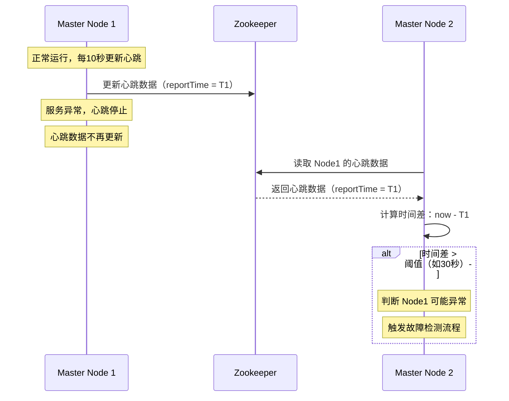
```mermaid
sequenceDiagram
    participant Node1 as Master Node 1
    participant ZK as Zookeeper
    participant Node2 as Master Node 2
    
    Note over Node1: 正常运行，每10秒更新心跳
    Node1->>ZK: 更新心跳数据（reportTime = T1）
    
    Note over Node1: 服务异常，心跳停止
    Note over Node1: 心跳数据不再更新
    
    Node2->>ZK: 读取 Node1 的心跳数据
    ZK-->>Node2: 返回心跳数据（reportTime = T1）
    Node2->>Node2: 计算时间差：now - T1
    alt 时间差 > 阈值（如30秒）
        Note over Node2: 判断 Node1 可能异常
        Note over Node2: 触发故障检测流程
    end
```

**服务层心跳超时检测**：

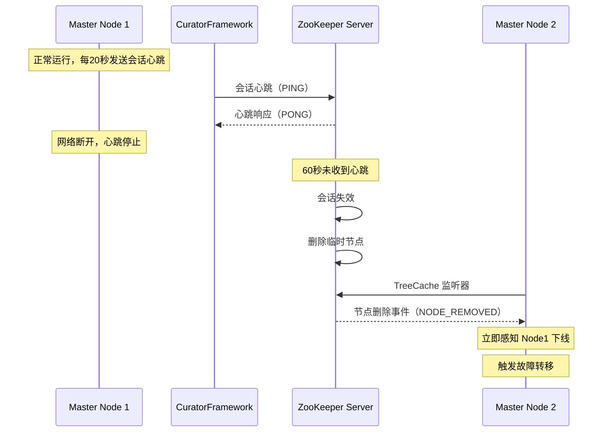
```mermaid
sequenceDiagram
    participant Node1 as Master Node 1
    participant CF as CuratorFramework
    participant ZKS as ZooKeeper Server
    participant Node2 as Master Node 2
    
    Note over Node1: 正常运行，每20秒发送会话心跳
    CF->>ZKS: 会话心跳（PING）
    ZKS-->>CF: 心跳响应（PONG）
    
    Note over Node1: 网络断开，心跳停止
    Note over ZKS: 60秒未收到心跳
    ZKS->>ZKS: 会话失效
    ZKS->>ZKS: 删除临时节点
    
    Node2->>ZKS: TreeCache 监听器
    ZKS-->>Node2: 节点删除事件（NODE_REMOVED）
    Note over Node2: 立即感知 Node1 下线
    Note over Node2: 触发故障转移
```

---

## 8. 异常处理机制

### 8.1 异常场景分类

**异常场景**：

1. **连接断开**：网络中断、Zookeeper 服务器故障
2. **会话超时**：长时间未发送心跳，会话失效
3. **故障转移**：其他节点检测到当前节点异常，标记为故障转移
4. **负载过高**：服务负载过高，无法正常提供服务

### 8.2 异常处理流程

**异常处理流程图**：

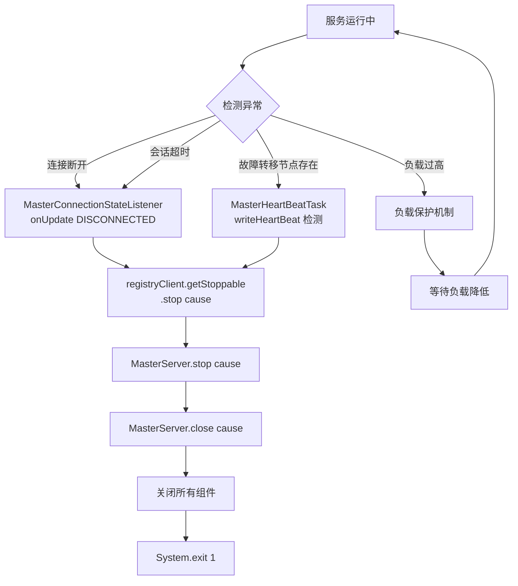
```mermaid
flowchart TD
    A[服务运行中] --> B{检测异常}
    B -->|连接断开| C[MasterConnectionStateListener<br/>onUpdate DISCONNECTED]
    B -->|会话超时| C
    B -->|故障转移节点存在| D[MasterHeartBeatTask<br/>writeHeartBeat 检测]
    B -->|负载过高| E[负载保护机制]
    
    C --> F[registryClient.getStoppable<br/>.stop cause]
    D --> F
    E --> G[等待负载降低]
    G --> A
    
    F --> H[MasterServer.stop cause]
    H --> I[MasterServer.close cause]
    I --> J[关闭所有组件]
    J --> K[System.exit 1]
```

### 8.3 连接断开处理

**处理代码**：[MasterConnectionStateListener.java:48-50](dolphinscheduler-master/src/main/java/org/apache/dolphinscheduler/server/master/registry/MasterConnectionStateListener.java#L48-L50)

```java
case DISCONNECTED:
    registryClient.getStoppable().stop(
        "Master disconnected from registry, will stop myself");
    break;
```

**处理流程**：
1. **检测断开**：CuratorFramework 检测到连接断开
2. **状态通知**：通过监听器链通知应用层
3. **主动停止**：调用 `MasterServer.stop()` 主动停止服务
4. **资源清理**：关闭所有组件，释放资源
5. **进程退出**：调用 `System.exit(1)` 确保进程退出

### 8.4 故障转移检测

**检测代码**：[MasterHeartBeatTask.java:96-106](dolphinscheduler-master/src/main/java/org/apache/dolphinscheduler/server/master/registry/MasterHeartBeatTask.java#L96-L106)

```java
@Override
public void writeHeartBeat(final MasterHeartBeat masterHeartBeat) {
    final String failoverNodePath = RegistryUtils.getFailoveredNodePath(masterHeartBeat);
    // 检测故障转移节点
    if (registryClient.exists(failoverNodePath)) {
        log.warn("The master: {} is under {}, means it has been failover will close myself",
                masterHeartBeat, failoverNodePath);
        registryClient.getStoppable().stop("The master exist: " + failoverNodePath + 
                ", means it has been failover will close myself");
        return;
    }
    String masterHeartBeatJson = JSONUtils.toJsonString(masterHeartBeat);
    registryClient.persistEphemeral(heartBeatPath, masterHeartBeatJson);
    MasterServerMetrics.incMasterHeartbeatCount();
    log.debug("Success write master heartBeatInfo into registry, masterRegistryPath: {}, heartBeatInfo: {}",
            heartBeatPath, masterHeartBeatJson);
}
```

**故障转移检测机制**：

1. **故障转移节点路径生成**：[RegistryUtils.getFailoveredNodePath()](dolphinscheduler-registry/dolphinscheduler-registry-api/src/main/java/org/apache/dolphinscheduler/registry/api/utils/RegistryUtils.java)
   - 根据 Master 心跳数据生成故障转移节点路径
   - 路径格式：`/nodes/failover-finish-nodes/master_{host}_{port}`
   - 代码实现：[RegistryUtils.java](dolphinscheduler-registry/dolphinscheduler-registry-api/src/main/java/org/apache/dolphinscheduler/registry/api/utils/RegistryUtils.java)

2. **检测时机**：
   - 每次写入心跳数据前都会检测故障转移节点
   - 如果检测到故障转移节点存在，说明该 Master 已被其他 Master 标记为故障转移
   - 检测逻辑：[MasterHeartBeatTask.java:98](dolphinscheduler-master/src/main/java/org/apache/dolphinscheduler/server/master/registry/MasterHeartBeatTask.java#L98)

3. **处理逻辑**：
   - 如果存在故障转移节点，立即停止当前 Master 服务
   - 通过 `registryClient.getStoppable().stop()` 触发优雅关闭
   - 避免多个 Master 同时运行导致的数据不一致问题
   - 停止逻辑：[MasterHeartBeatTask.java:102-105](dolphinscheduler-master/src/main/java/org/apache/dolphinscheduler/server/master/registry/MasterHeartBeatTask.java#L102-L105)

**故障转移流程时序图**：

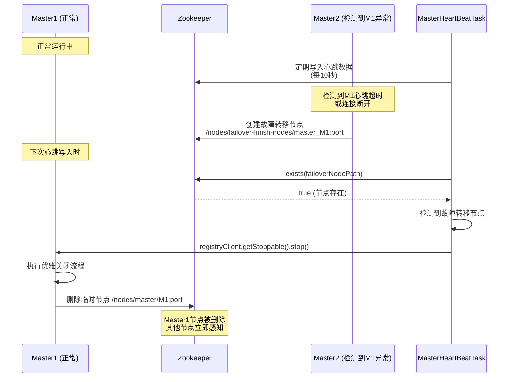
```mermaid
sequenceDiagram
    participant M1 as Master1 (正常)
    participant ZK as Zookeeper
    participant M2 as Master2 (检测到M1异常)
    participant MHT as MasterHeartBeatTask
    
    Note over M1: 正常运行中
    MHT->>ZK: 定期写入心跳数据<br/>(每10秒)
    
    Note over M2: 检测到M1心跳超时<br/>或连接断开
    M2->>ZK: 创建故障转移节点<br/>/nodes/failover-finish-nodes/master_M1:port
    
    Note over M1: 下次心跳写入时
    MHT->>ZK: exists(failoverNodePath)
    ZK-->>MHT: true (节点存在)
    
    MHT->>MHT: 检测到故障转移节点
    MHT->>M1: registryClient.getStoppable().stop()
    M1->>M1: 执行优雅关闭流程
    M1->>ZK: 删除临时节点 /nodes/master/M1:port
    Note over ZK: Master1节点被删除<br/>其他节点立即感知
```

**故障转移节点检查代码**：[RegistryUtils.getFailoveredNodePath()](dolphinscheduler-registry/dolphinscheduler-registry-api/src/main/java/org/apache/dolphinscheduler/registry/api/utils/RegistryUtils.java)

```java
public static String getFailoveredNodePath(HeartBeat heartBeat) {
    if (heartBeat instanceof MasterHeartBeat) {
        MasterHeartBeat masterHeartBeat = (MasterHeartBeat) heartBeat;
        return RegistryNodeType.FAILOVER_FINISH_NODES.getRegistryPath() + 
               Constants.SINGLE_SLASH + 
               RegistryNodeType.MASTER.name().toLowerCase() + 
               Constants.UNDERLINE + 
               masterHeartBeat.getHost() + 
               Constants.UNDERLINE + 
               masterHeartBeat.getPort();
    }
    // ... 其他类型处理
}
```

**关键点**：
- 故障转移节点由其他 Master 节点创建，表示该 Master 已被标记为故障
- 被标记的 Master 在下次心跳写入时检测到故障转移节点，主动停止服务
- 这是一种**主动停止机制**，避免故障 Master 继续运行导致数据不一致
- 故障转移节点路径：`/nodes/failover-finish-nodes/master_{host}_{port}`

---

## 9. 总结

### 9.1 核心机制总结

Master 服务注册到 Zookeeper 的完整流程包括以下核心机制：

1. **服务注册流程**：
   - 负载检查 → 删除旧节点 → 创建临时节点 → 验证注册 → 启动心跳任务
   - 代码入口：[MasterServer.java:156](dolphinscheduler-master/src/main/java/org/apache/dolphinscheduler/server/master/MasterServer.java#L156)

2. **双层心跳架构**：
   - **应用层心跳**：定期更新业务状态数据（默认 10 秒间隔）
      - 实现类：[MasterHeartBeatTask.java](dolphinscheduler-master/src/main/java/org/apache/dolphinscheduler/server/master/registry/MasterHeartBeatTask.java)
      - 基类：[BaseHeartBeatTask.java](dolphinscheduler-common/src/main/java/org/apache/dolphinscheduler/common/model/BaseHeartBeatTask.java)
   - **服务层心跳**：CuratorFramework 自动管理的会话心跳（约 20 秒间隔）
      - 会话超时配置：[ZookeeperRegistry.java:115](dolphinscheduler-registry/dolphinscheduler-registry-plugins/dolphinscheduler-registry-zookeeper/src/main/java/org/apache/dolphinscheduler/plugin/registry/zookeeper/ZookeeperRegistry.java#L115)
   - 应用层心跳依赖服务层心跳，服务层心跳维持会话有效性

3. **CuratorFramework 架构**：
   - 封装 ZooKeeper 原生客户端，提供高级 API
   - 自动管理连接、会话、重试等机制
   - 初始化代码：[ZookeeperRegistry.java:76-136](dolphinscheduler-registry/dolphinscheduler-registry-plugins/dolphinscheduler-registry-zookeeper/src/main/java/org/apache/dolphinscheduler/plugin/registry/zookeeper/ZookeeperRegistry.java#L76-L136)
   - 连接建立：[ZookeeperRegistry.java:142-162](dolphinscheduler-registry/dolphinscheduler-registry-plugins/dolphinscheduler-registry-zookeeper/src/main/java/org/apache/dolphinscheduler/plugin/registry/zookeeper/ZookeeperRegistry.java#L142-L162)

4. **连接状态管理**：
   - 监听连接状态变化：CONNECTED、SUSPENDED、RECONNECTED、DISCONNECTED
   - 连接断开时主动停止服务，避免提供不可靠服务
   - 监听器实现：[MasterConnectionStateListener.java](dolphinscheduler-master/src/main/java/org/apache/dolphinscheduler/server/master/registry/MasterConnectionStateListener.java)
   - 状态适配器：[ZookeeperConnectionStateListener.java](dolphinscheduler-registry/dolphinscheduler-registry-plugins/dolphinscheduler-registry-zookeeper/src/main/java/org/apache/dolphinscheduler/plugin/registry/zookeeper/ZookeeperConnectionStateListener.java)

5. **异常处理机制**：
   - 连接断开处理：通过 `IStoppable` 回调机制主动停止服务
   - 故障转移检测：心跳写入前检测故障转移节点，存在则停止服务
   - 故障转移检测代码：[MasterHeartBeatTask.java:96-106](dolphinscheduler-master/src/main/java/org/apache/dolphinscheduler/server/master/registry/MasterHeartBeatTask.java#L96-L106)

### 9.2 架构设计特点

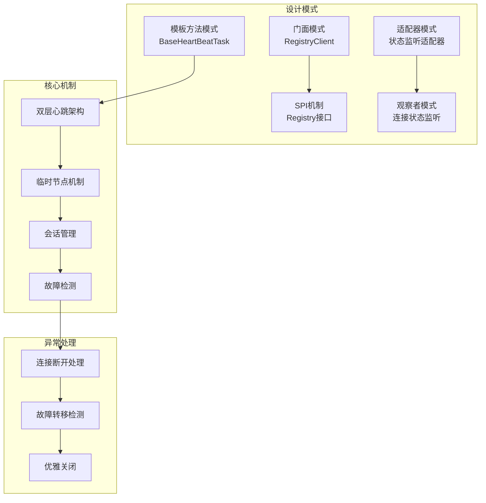
```mermaid
graph TB
    subgraph "设计模式"
        A[门面模式<br/>RegistryClient]
        B[SPI机制<br/>Registry接口]
        C[模板方法模式<br/>BaseHeartBeatTask]
        D[适配器模式<br/>状态监听适配器]
        E[观察者模式<br/>连接状态监听]
    end
    
    subgraph "核心机制"
        F[双层心跳架构]
        G[临时节点机制]
        H[会话管理]
        I[故障检测]
    end
    
    subgraph "异常处理"
        J[连接断开处理]
        K[故障转移检测]
        L[优雅关闭]
    end
    
    A --> B
    C --> F
    D --> E
    F --> G
    G --> H
    H --> I
    I --> J
    J --> K
    K --> L
```

### 9.3 关键配置参数

**应用层心跳配置**：
- `master.max-heartbeat-interval`：应用层心跳间隔（默认 10 秒）
- 配置位置：[application.yaml:96](dolphinscheduler-master/src/main/resources/application.yaml#L96)

**服务层心跳配置**：
- `registry.zookeeper.session-timeout`：会话超时时间（默认 60 秒）
- `registry.zookeeper.connection-timeout`：连接超时时间（默认 15 秒）
- 配置位置：[application.yaml:80-81](dolphinscheduler-master/src/main/resources/application.yaml#L80-L81)

**重试策略配置**：
- `registry.zookeeper.retry-policy.base-sleep-time`：基础重试时间（默认 1 秒）
- `registry.zookeeper.retry-policy.max-retries`：最大重试次数（默认 3 次）
- `registry.zookeeper.retry-policy.max-sleep`：最大重试间隔（默认 3 秒）
- 配置位置：[application.yaml:76-79](dolphinscheduler-master/src/main/resources/application.yaml#L76-L79)

### 9.4 最佳实践

1. **心跳间隔配置**：
   - 应用层心跳间隔应小于会话超时的 1/3
   - 例如：`sessionTimeout=60s`，应用层心跳间隔应 ≤ 20s（实际配置为 10s）
   - 确保即使应用层心跳失败，服务层心跳仍能维持会话

2. **会话超时配置**：
   - 会话超时时间应根据网络环境调整
   - 网络不稳定时适当增大 `sessionTimeout`，避免频繁断开
   - 参考配置：[application.yaml:80](dolphinscheduler-master/src/main/resources/application.yaml#L80)

3. **故障检测**：
   - 依赖临时节点的自动删除机制实现快速故障检测
   - 通过应用层心跳的 `reportTime` 判断服务是否正常响应
   - 故障转移节点机制确保故障 Master 主动停止

4. **异常处理**：
   - 连接断开时主动停止服务，避免提供不可靠服务
   - 检测到故障转移节点时立即停止，避免数据不一致
   - 通过 `IStoppable` 接口统一管理停止逻辑

### 9.5 相关代码链接

**核心类**：
- [MasterServer.java](dolphinscheduler-master/src/main/java/org/apache/dolphinscheduler/server/master/MasterServer.java) - Master 服务器主类
- [MasterRegistryClient.java](dolphinscheduler-master/src/main/java/org/apache/dolphinscheduler/server/master/registry/MasterRegistryClient.java) - Master 注册客户端
- [MasterHeartBeatTask.java](dolphinscheduler-master/src/main/java/org/apache/dolphinscheduler/server/master/registry/MasterHeartBeatTask.java) - Master 心跳任务
- [BaseHeartBeatTask.java](dolphinscheduler-common/src/main/java/org/apache/dolphinscheduler/common/model/BaseHeartBeatTask.java) - 心跳任务基类

**注册中心相关**：
- [RegistryClient.java](dolphinscheduler-registry/dolphinscheduler-registry-api/src/main/java/org/apache/dolphinscheduler/registry/api/RegistryClient.java) - 注册中心客户端门面
- [Registry.java](dolphinscheduler-registry/dolphinscheduler-registry-api/src/main/java/org/apache/dolphinscheduler/registry/api/Registry.java) - 注册中心 SPI 接口
- [ZookeeperRegistry.java](dolphinscheduler-registry/dolphinscheduler-registry-plugins/dolphinscheduler-registry-zookeeper/src/main/java/org/apache/dolphinscheduler/plugin/registry/zookeeper/ZookeeperRegistry.java) - Zookeeper 实现

**连接状态管理**：
- [MasterConnectionStateListener.java](dolphinscheduler-master/src/main/java/org/apache/dolphinscheduler/server/master/registry/MasterConnectionStateListener.java) - Master 连接状态监听器
- [ZookeeperConnectionStateListener.java](dolphinscheduler-registry/dolphinscheduler-registry-plugins/dolphinscheduler-registry-zookeeper/src/main/java/org/apache/dolphinscheduler/plugin/registry/zookeeper/ZookeeperConnectionStateListener.java) - Zookeeper 连接状态适配器
- [ConnectionState.java](dolphinscheduler-registry/dolphinscheduler-registry-api/src/main/java/org/apache/dolphinscheduler/registry/api/ConnectionState.java) - 连接状态枚举

**工具类**：
- [RegistryUtils.java](dolphinscheduler-registry/dolphinscheduler-registry-api/src/main/java/org/apache/dolphinscheduler/registry/api/utils/RegistryUtils.java) - 注册中心工具类

---

*文档最后更新时间：2024年*