# DolphinScheduler Master 集群架构与工作原理

## 1. 系统架构图


```mermaid
graph TB
    subgraph ZK["ZooKeeper 注册中心"]
        ZKPath["/dolphinscheduler/nodes/master"]
        ZKMaster1["192.168.1.10:5678<br/>MasterHeartBeat JSON"]
        ZKMaster2["192.168.1.11:5678<br/>MasterHeartBeat JSON"]
        ZKMaster3["192.168.1.12:5678<br/>MasterHeartBeat JSON"]
        ZKPath --> ZKMaster1
        ZKPath --> ZKMaster2
        ZKPath --> ZKMaster3
    end

    subgraph MasterCluster["Master 集群 (无中心)"]
        M1["Master-1<br/>192.168.1.10:5678<br/>Slot: 0"]
        M2["Master-2<br/>192.168.1.11:5678<br/>Slot: 1"]
        M3["Master-3<br/>192.168.1.12:5678<br/>Slot: 2"]
        
        subgraph M1Internal["Master-1 内部"]
            M1Reg["MasterRegistryClient<br/>注册/心跳"]
            M1Cluster["ClusterManager<br/>集群管理"]
            M1Slot["MasterSlotManager<br/>Slot: 0/3"]
            M1Fetch["IdSlotBasedCommandFetcher<br/>获取 Command"]
            M1Balancer["WorkerLoadBalancer<br/>选择 Worker"]
            M1Clusters["MasterClusters<br/>masterServerMap"]
        end
        
        subgraph M2Internal["Master-2 内部"]
            M2Reg["MasterRegistryClient<br/>注册/心跳"]
            M2Cluster["ClusterManager<br/>集群管理"]
            M2Slot["MasterSlotManager<br/>Slot: 1/3"]
            M2Fetch["IdSlotBasedCommandFetcher<br/>获取 Command"]
            M2Balancer["WorkerLoadBalancer<br/>选择 Worker"]
            M2Clusters["MasterClusters<br/>masterServerMap"]
        end
        
        subgraph M3Internal["Master-3 内部"]
            M3Reg["MasterRegistryClient<br/>注册/心跳"]
            M3Cluster["ClusterManager<br/>集群管理"]
            M3Slot["MasterSlotManager<br/>Slot: 2/3"]
            M3Fetch["IdSlotBasedCommandFetcher<br/>获取 Command"]
            M3Balancer["WorkerLoadBalancer<br/>选择 Worker"]
            M3Clusters["MasterClusters<br/>masterServerMap"]
        end
    end

    subgraph WorkerCluster["Worker 集群"]
        W1["Worker-1<br/>192.168.1.20:1234"]
        W2["Worker-2<br/>192.168.1.21:1234"]
        W3["Worker-3<br/>192.168.1.22:1234"]
    end

    subgraph DB["数据库"]
        CommandTable["t_ds_command<br/>命令表"]
    end

    M1Reg -.注册/心跳.-> ZKMaster1
    M2Reg -.注册/心跳.-> ZKMaster2
    M3Reg -.注册/心跳.-> ZKMaster3
    
    M1Cluster -.TreeCache监听.-> ZKPath
    M2Cluster -.TreeCache监听.-> ZKPath
    M3Cluster -.TreeCache监听.-> ZKPath
    
    M1Clusters -.集群视图一致.-> M2Clusters
    M2Clusters -.集群视图一致.-> M3Clusters
    M3Clusters -.集群视图一致.-> M1Clusters
    
    M1Fetch -->|"WHERE (id/idStep) % 3 = 0"| CommandTable
    M2Fetch -->|"WHERE (id/idStep) % 3 = 1"| CommandTable
    M3Fetch -->|"WHERE (id/idStep) % 3 = 2"| CommandTable
    
    M1Balancer -->|分发任务| W1
    M1Balancer -->|分发任务| W2
    M1Balancer -->|分发任务| W3
    M2Balancer -->|分发任务| W1
    M2Balancer -->|分发任务| W2
    M2Balancer -->|分发任务| W3
    M3Balancer -->|分发任务| W1
    M3Balancer -->|分发任务| W2
    M3Balancer -->|分发任务| W3

    style ZK fill:#e1f5ff
    style MasterCluster fill:#fff4e6
    style WorkerCluster fill:#e8f5e9
    style DB fill:#f3e5f5
```

## 2. Master 启动与集群初始化时序图

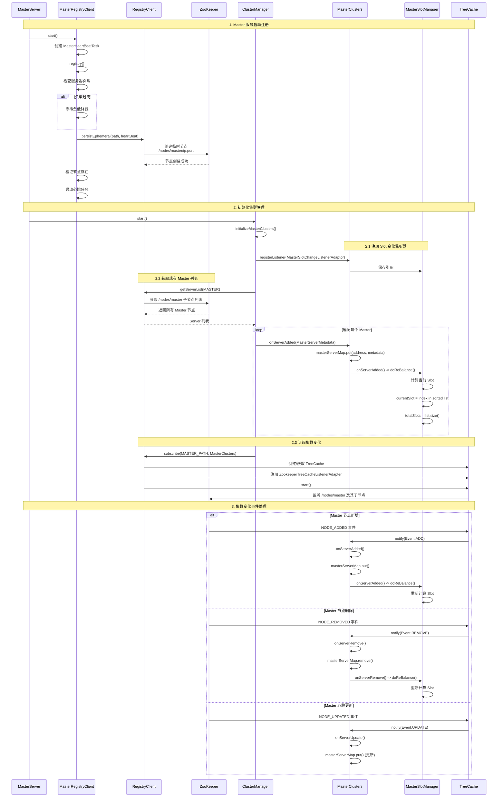
```mermaid
sequenceDiagram
    participant MS as MasterServer
    participant MRC as MasterRegistryClient
    participant RC as RegistryClient
    participant ZK as ZooKeeper
    participant CM as ClusterManager
    participant MC as MasterClusters
    participant MSM as MasterSlotManager
    participant TCache as TreeCache

    Note over MS,TCache: 1. Master 服务启动注册
    
    MS->>MRC: start()
    MRC->>MRC: 创建 MasterHeartBeatTask
    MRC->>MRC: registry()
    MRC->>MRC: 检查服务器负载
    alt 负载过高
        MRC->>MRC: 等待负载降低
    end
    MRC->>RC: persistEphemeral(path, heartBeat)
    RC->>ZK: 创建临时节点<br/>/nodes/master/ip:port
    ZK-->>RC: 节点创建成功
    MRC->>MRC: 验证节点存在
    MRC->>MRC: 启动心跳任务
    
    Note over MS,TCache: 2. 初始化集群管理
    
    MS->>CM: start()
    CM->>CM: initializeMasterClusters()
    
    Note over MC,MSM: 2.1 注册 Slot 变化监听器
    CM->>MC: registerListener(MasterSlotChangeListenerAdaptor)
    MC->>MSM: 保存引用
    
    Note over RC,ZK: 2.2 获取现有 Master 列表
    CM->>RC: getServerList(MASTER)
    RC->>ZK: 获取 /nodes/master 子节点列表
    ZK-->>RC: 返回所有 Master 节点
    RC-->>CM: Server 列表
    loop 遍历每个 Master
        CM->>MC: onServerAdded(MasterServerMetadata)
        MC->>MC: masterServerMap.put(address, metadata)
        MC->>MSM: onServerAdded() -> doReBalance()
        MSM->>MSM: 计算当前 Slot
        MSM->>MSM: currentSlot = index in sorted list
        MSM->>MSM: totalSlots = list.size()
    end
    
    Note over RC,TCache: 2.3 订阅集群变化
    CM->>RC: subscribe(MASTER_PATH, MasterClusters)
    RC->>TCache: 创建/获取 TreeCache
    RC->>TCache: 注册 ZookeeperTreeCacheListenerAdapter
    RC->>TCache: start()
    TCache->>ZK: 监听 /nodes/master 及其子节点
    
    Note over MS,TCache: 3. 集群变化事件处理
    
    alt Master 节点新增
        ZK->>TCache: NODE_ADDED 事件
        TCache->>MC: notify(Event.ADD)
        MC->>MC: onServerAdded()
        MC->>MC: masterServerMap.put()
        MC->>MSM: onServerAdded() -> doReBalance()
        MSM->>MSM: 重新计算 Slot
    else Master 节点删除
        ZK->>TCache: NODE_REMOVED 事件
        TCache->>MC: notify(Event.REMOVE)
        MC->>MC: onServerRemove()
        MC->>MC: masterServerMap.remove()
        MC->>MSM: onServerRemove() -> doReBalance()
        MSM->>MSM: 重新计算 Slot
    else Master 心跳更新
        ZK->>TCache: NODE_UPDATED 事件
        TCache->>MC: notify(Event.UPDATE)
        MC->>MC: onServerUpdate()
        MC->>MC: masterServerMap.put() (更新)
    end
```

## 3. Slot 分配与 Command 处理流程

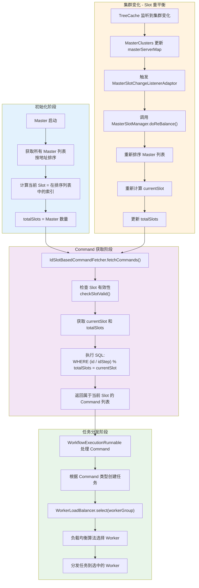
```mermaid
graph TB
    subgraph Init["初始化阶段"]
        A1["Master 启动"]
        A2["获取所有 Master 列表<br/>按地址排序"]
        A3["计算当前 Slot = 在排序列表中的索引"]
        A4["totalSlots = Master 数量"]
        A1 --> A2
        A2 --> A3
        A3 --> A4
    end
    
    subgraph Rebalance["集群变化 - Slot 重平衡"]
        B1["TreeCache 监听到集群变化"]
        B2["MasterClusters 更新 masterServerMap"]
        B3["触发 MasterSlotChangeListenerAdaptor"]
        B4["调用 MasterSlotManager.doReBalance()"]
        B5["重新排序 Master 列表"]
        B6["重新计算 currentSlot"]
        B7["更新 totalSlots"]
        B1 --> B2
        B2 --> B3
        B3 --> B4
        B4 --> B5
        B5 --> B6
        B6 --> B7
    end
    
    subgraph CommandFetch["Command 获取阶段"]
        C1["IdSlotBasedCommandFetcher.fetchCommands()"]
        C2["检查 Slot 有效性<br/>checkSlotValid()"]
        C3["获取 currentSlot 和 totalSlots"]
        C4["执行 SQL:<br/>WHERE (id / idStep) % totalSlots = currentSlot"]
        C5["返回属于当前 Slot 的 Command 列表"]
        C1 --> C2
        C2 --> C3
        C3 --> C4
        C4 --> C5
    end
    
    subgraph TaskDispatch["任务分发阶段"]
        D1["WorkflowExecutionRunnable 处理 Command"]
        D2["根据 Command 类型创建任务"]
        D3["WorkerLoadBalancer.select(workerGroup)"]
        D4["负载均衡算法选择 Worker"]
        D5["分发任务到选中的 Worker"]
        D1 --> D2
        D2 --> D3
        D3 --> D4
        D4 --> D5
    end
    
    A4 --> C1
    B7 --> C1
    C5 --> D1
    
    style Init fill:#e3f2fd
    style Rebalance fill:#fff3e0
    style CommandFetch fill:#f3e5f5
    style TaskDispatch fill:#e8f5e9
```

## 4. Slot 分配原理详解

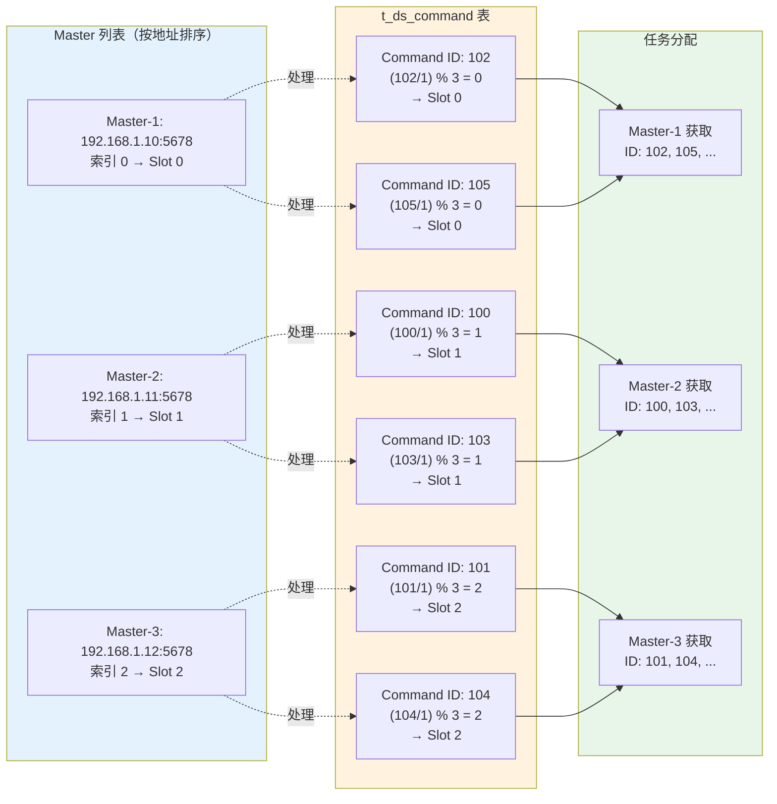
```mermaid
graph LR
    subgraph MasterList["Master 列表（按地址排序）"]
        M1["Master-1: 192.168.1.10:5678<br/>索引 0 → Slot 0"]
        M2["Master-2: 192.168.1.11:5678<br/>索引 1 → Slot 1"]
        M3["Master-3: 192.168.1.12:5678<br/>索引 2 → Slot 2"]
    end
    
    subgraph CommandTable["t_ds_command 表"]
        C1["Command ID: 100<br/>(100/1) % 3 = 1<br/>→ Slot 1"]
        C2["Command ID: 101<br/>(101/1) % 3 = 2<br/>→ Slot 2"]
        C3["Command ID: 102<br/>(102/1) % 3 = 0<br/>→ Slot 0"]
        C4["Command ID: 103<br/>(103/1) % 3 = 1<br/>→ Slot 1"]
        C5["Command ID: 104<br/>(104/1) % 3 = 2<br/>→ Slot 2"]
        C6["Command ID: 105<br/>(105/1) % 3 = 0<br/>→ Slot 0"]
    end
    
    subgraph Distribution["任务分配"]
        D1["Master-1 获取<br/>ID: 102, 105, ..."]
        D2["Master-2 获取<br/>ID: 100, 103, ..."]
        D3["Master-3 获取<br/>ID: 101, 104, ..."]
    end
    
    M1 -.处理.-> C3
    M1 -.处理.-> C6
    M2 -.处理.-> C1
    M2 -.处理.-> C4
    M3 -.处理.-> C2
    M3 -.处理.-> C5
    
    C3 --> D1
    C6 --> D1
    C1 --> D2
    C4 --> D2
    C2 --> D3
    C5 --> D3
    
    style MasterList fill:#e3f2fd
    style CommandTable fill:#fff3e0
    style Distribution fill:#e8f5e9
```

## 5. 集群监控与故障转移流程

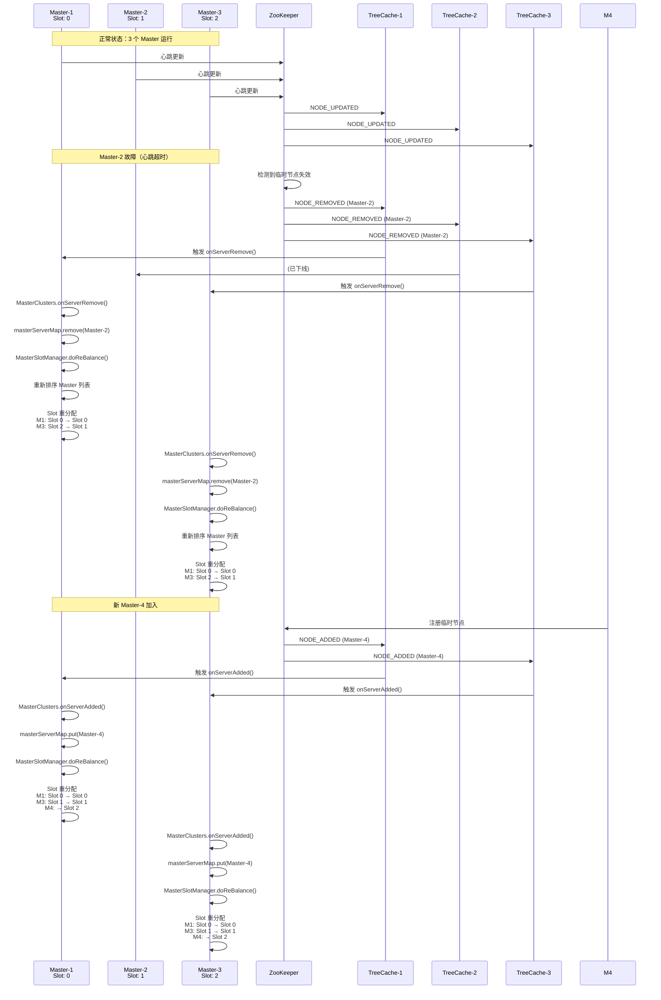
```mermaid
sequenceDiagram
    participant M1 as Master-1<br/>Slot: 0
    participant M2 as Master-2<br/>Slot: 1
    participant M3 as Master-3<br/>Slot: 2
    participant ZK as ZooKeeper
    participant TCache1 as TreeCache-1
    participant TCache2 as TreeCache-2
    participant TCache3 as TreeCache-3

    Note over M1,M3: 正常状态：3 个 Master 运行
    
    M1->>ZK: 心跳更新
    M2->>ZK: 心跳更新
    M3->>ZK: 心跳更新
    
    ZK->>TCache1: NODE_UPDATED
    ZK->>TCache2: NODE_UPDATED
    ZK->>TCache3: NODE_UPDATED
    
    Note over M1,M3: Master-2 故障（心跳超时）
    
    ZK->>ZK: 检测到临时节点失效
    ZK->>TCache1: NODE_REMOVED (Master-2)
    ZK->>TCache2: NODE_REMOVED (Master-2)
    ZK->>TCache3: NODE_REMOVED (Master-2)
    
    TCache1->>M1: 触发 onServerRemove()
    TCache2->>M2: (已下线)
    TCache3->>M3: 触发 onServerRemove()
    
    M1->>M1: MasterClusters.onServerRemove()
    M1->>M1: masterServerMap.remove(Master-2)
    M1->>M1: MasterSlotManager.doReBalance()
    M1->>M1: 重新排序 Master 列表
    M1->>M1: Slot 重分配<br/>M1: Slot 0 → Slot 0<br/>M3: Slot 2 → Slot 1
    
    M3->>M3: MasterClusters.onServerRemove()
    M3->>M3: masterServerMap.remove(Master-2)
    M3->>M3: MasterSlotManager.doReBalance()
    M3->>M3: 重新排序 Master 列表
    M3->>M3: Slot 重分配<br/>M1: Slot 0 → Slot 0<br/>M3: Slot 2 → Slot 1
    
    Note over M1,M3: 新 Master-4 加入
    
    M4->>ZK: 注册临时节点
    ZK->>TCache1: NODE_ADDED (Master-4)
    ZK->>TCache3: NODE_ADDED (Master-4)
    
    TCache1->>M1: 触发 onServerAdded()
    TCache3->>M3: 触发 onServerAdded()
    
    M1->>M1: MasterClusters.onServerAdded()
    M1->>M1: masterServerMap.put(Master-4)
    M1->>M1: MasterSlotManager.doReBalance()
    M1->>M1: Slot 重分配<br/>M1: Slot 0 → Slot 0<br/>M3: Slot 1 → Slot 1<br/>M4: → Slot 2
    
    M3->>M3: MasterClusters.onServerAdded()
    M3->>M3: masterServerMap.put(Master-4)
    M3->>M3: MasterSlotManager.doReBalance()
    M3->>M3: Slot 重分配<br/>M1: Slot 0 → Slot 0<br/>M3: Slot 1 → Slot 1<br/>M4: → Slot 2
```

## 6. 完整工作流程图

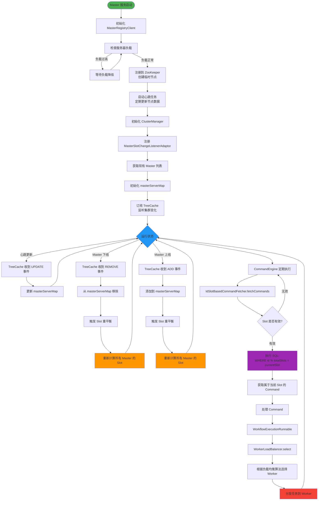
```mermaid
flowchart TD
    Start([Master 服务启动]) --> Init1[初始化 MasterRegistryClient]
    Init1 --> Init2[检查服务器负载]
    Init2 -->|负载过高| Wait[等待负载降低]
    Wait --> Init2
    Init2 -->|负载正常| Reg1[注册到 ZooKeeper<br/>创建临时节点]
    Reg1 --> Heartbeat[启动心跳任务<br/>定期更新节点数据]
    
    Heartbeat --> Init3[初始化 ClusterManager]
    Init3 --> Init4[注册 MasterSlotChangeListenerAdaptor]
    Init4 --> Init5[获取现有 Master 列表]
    Init5 --> Init6[初始化 masterServerMap]
    Init6 --> Init7[订阅 TreeCache<br/>监听集群变化]
    
    Init7 --> Running{运行状态}
    
    Running -->|心跳更新| Update1[TreeCache 收到 UPDATE 事件]
    Update1 --> Update2[更新 masterServerMap]
    Update2 --> Running
    
    Running -->|Master 下线| Remove1[TreeCache 收到 REMOVE 事件]
    Remove1 --> Remove2[从 masterServerMap 移除]
    Remove2 --> Remove3[触发 Slot 重平衡]
    Remove3 --> Rebalance1[重新计算所有 Master 的 Slot]
    Rebalance1 --> Running
    
    Running -->|Master 上线| Add1[TreeCache 收到 ADD 事件]
    Add1 --> Add2[添加到 masterServerMap]
    Add2 --> Add3[触发 Slot 重平衡]
    Add3 --> Rebalance2[重新计算所有 Master 的 Slot]
    Rebalance2 --> Running
    
    Running --> Fetch1[CommandEngine 定期执行]
    Fetch1 --> Fetch2[IdSlotBasedCommandFetcher.fetchCommands]
    Fetch2 --> Fetch3{Slot 是否有效?}
    Fetch3 -->|无效| Fetch1
    Fetch3 -->|有效| Fetch4[执行 SQL:<br/>WHERE id % totalSlots = currentSlot]
    Fetch4 --> Fetch5[获取属于当前 Slot 的 Command]
    Fetch5 --> Fetch6[处理 Command]
    
    Fetch6 --> Dispatch1[WorkflowExecutionRunnable]
    Dispatch1 --> Dispatch2[WorkerLoadBalancer.select]
    Dispatch2 --> Dispatch3[根据负载均衡算法选择 Worker]
    Dispatch3 --> Dispatch4[分发任务到 Worker]
    Dispatch4 --> Running
    
    style Start fill:#4caf50
    style Running fill:#2196f3
    style Rebalance1 fill:#ff9800
    style Rebalance2 fill:#ff9800
    style Fetch4 fill:#9c27b0
    style Dispatch4 fill:#f44336
```

## 7. 核心组件交互图

```mermaid
graph TB
    subgraph Registry["注册层"]
        ZK[ZooKeeper]
        TCache[TreeCache<br/>监听节点变化]
        ZK --> TCache
    end
    
    subgraph Cluster["集群管理层"]
        MC[MasterClusters<br/>维护 masterServerMap]
        MCListener[MasterSlotChangeListenerAdaptor<br/>适配器模式]
        MC --> MCListener
        TCache -->|事件通知| MC
    end
    
    subgraph Slot["Slot 管理层"]
        MSM[MasterSlotManager<br/>currentSlot/totalSlots]
        MCListener -->|集群变化| MSM
        MSM -->|doReBalance| MSM
    end
    
    subgraph Command["Command 处理层"]
        CF[IdSlotBasedCommandFetcher<br/>基于 Slot 获取 Command]
        CE[CommandEngine<br/>命令引擎]
        MSM -->|提供 Slot 信息| CF
        CF -->|SQL 查询| DB[(数据库)]
        DB -->|返回 Command| CF
        CF --> CE
    end
    
    subgraph Workflow["工作流处理层"]
        WER[WorkflowExecutionRunnable<br/>工作流执行]
        CE --> WER
    end
    
    subgraph Worker["Worker 选择层"]
        WLB[WorkerLoadBalancer<br/>负载均衡器]
        WC[WorkerClusters<br/>Worker 集群视图]
        WER --> WLB
        WLB --> WC
        WLB -->|选择 Worker| Worker[Worker 节点]
    end
    
    style Registry fill:#e3f2fd
    style Cluster fill:#fff3e0
    style Slot fill:#f3e5f5
    style Command fill:#e8f5e9
    style Workflow fill:#fce4ec
    style Worker fill:#f1f8e9
```

## 8. 数据流向图

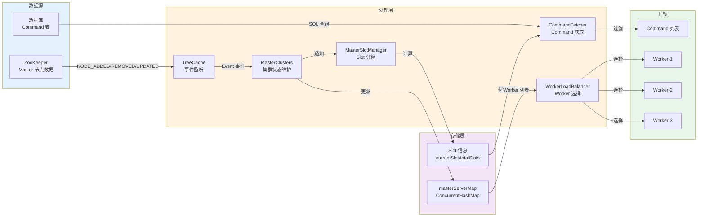
```mermaid
graph LR
    subgraph Source["数据源"]
        ZK1[ZooKeeper<br/>Master 节点数据]
        DB1[数据库<br/>Command 表]
    end
    
    subgraph Process["处理层"]
        TCache1[TreeCache<br/>事件监听]
        MC1[MasterClusters<br/>集群状态维护]
        MSM1[MasterSlotManager<br/>Slot 计算]
        CF1[CommandFetcher<br/>Command 获取]
        WLB1[WorkerLoadBalancer<br/>Worker 选择]
    end
    
    subgraph Storage["存储层"]
        MSM2[masterServerMap<br/>ConcurrentHashMap]
        MSM3[Slot 信息<br/>currentSlot/totalSlots]
    end
    
    subgraph Target["目标"]
        CMD[Command 列表]
        W1[Worker-1]
        W2[Worker-2]
        W3[Worker-3]
    end
    
    ZK1 -->|NODE_ADDED/REMOVED/UPDATED| TCache1
    TCache1 -->|Event 事件| MC1
    MC1 -->|更新| MSM2
    MC1 -->|通知| MSM1
    MSM1 -->|计算| MSM3
    
    DB1 -->|SQL 查询| CF1
    MSM3 -->|提供 Slot| CF1
    CF1 -->|过滤| CMD
    
    MSM2 -->|Worker 列表| WLB1
    WLB1 -->|选择| W1
    WLB1 -->|选择| W2
    WLB1 -->|选择| W3
    
    style Source fill:#e3f2fd
    style Process fill:#fff3e0
    style Storage fill:#f3e5f5
    style Target fill:#e8f5e9
```

## 9. 适配器模式详解

### 9.1 TreeCache 事件适配器

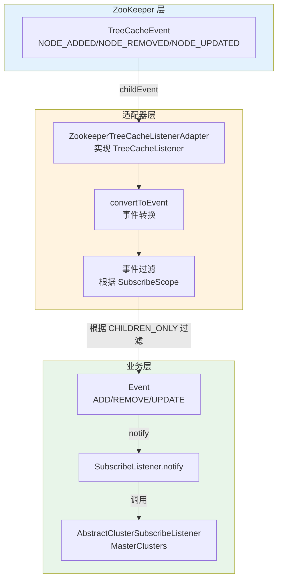
```mermaid
graph TB
    subgraph ZKLayer["ZooKeeper 层"]
        ZKEvent[TreeCacheEvent<br/>NODE_ADDED/NODE_REMOVED/NODE_UPDATED]
    end
    
    subgraph AdapterLayer["适配器层"]
        ZKAdapter[ZookeeperTreeCacheListenerAdapter<br/>实现 TreeCacheListener]
        Convert[convertToEvent<br/>事件转换]
        Filter[事件过滤<br/>根据 SubscribeScope]
    end
    
    subgraph BusinessLayer["业务层"]
        DSEvent[Event<br/>ADD/REMOVE/UPDATE]
        SubscribeListener[SubscribeListener.notify]
        ClusterListener[AbstractClusterSubscribeListener<br/>MasterClusters]
    end
    
    ZKEvent -->|childEvent| ZKAdapter
    ZKAdapter --> Convert
    Convert --> Filter
    Filter -->|根据 CHILDREN_ONLY 过滤| DSEvent
    DSEvent -->|notify| SubscribeListener
    SubscribeListener -->|调用| ClusterListener
    
    style ZKLayer fill:#e3f2fd
    style AdapterLayer fill:#fff3e0
    style BusinessLayer fill:#e8f5e9
```

**适配器的作用**：
- **解耦**：将 Curator 的 `TreeCacheEvent` 与业务层的 `Event` 解耦
- **转换**：将 ZK 事件类型（NODE_ADDED/REMOVED/UPDATED）转换为业务事件类型（ADD/REMOVE/UPDATE）
- **过滤**：根据 `SubscribeScope`（PATH_ONLY/CHILDREN_ONLY/ALL）过滤事件

### 9.2 Slot 变化监听适配器

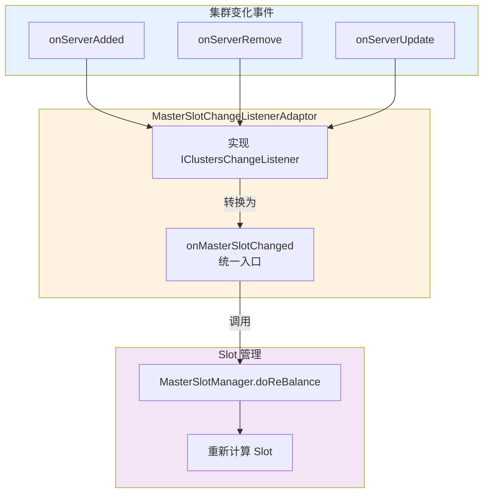
```mermaid
graph TB
    subgraph ClusterChange["集群变化事件"]
        AddEvent[onServerAdded]
        RemoveEvent[onServerRemove]
        UpdateEvent[onServerUpdate]
    end
    
    subgraph Adapter["MasterSlotChangeListenerAdaptor<br/>适配器"]
        AdapterImpl[实现 IClustersChangeListener]
        SlotChange[onMasterSlotChanged<br/>统一入口]
    end
    
    subgraph SlotManager["Slot 管理"]
        ReBalance[MasterSlotManager.doReBalance]
        CalcSlot[重新计算 Slot]
    end
    
    AddEvent --> AdapterImpl
    RemoveEvent --> AdapterImpl
    UpdateEvent --> AdapterImpl
    
    AdapterImpl -->|转换为| SlotChange
    SlotChange -->|调用| ReBalance
    ReBalance --> CalcSlot
    
    style ClusterChange fill:#e3f2fd
    style Adapter fill:#fff3e0
    style SlotManager fill:#f3e5f5
```

**适配器的实现**：

```java
// MasterSlotChangeListenerAdaptor 实现了两个接口
public class MasterSlotChangeListenerAdaptor
        implements IMasterSlotChangeListener,
                   IClusters.IClustersChangeListener<MasterServerMetadata> {
    
    // 将所有集群变化事件统一转换为 Slot 重平衡操作
    @Override
    public void onServerAdded(MasterServerMetadata server) {
        onMasterSlotChanged(masterClusters.getNormalServers());
    }
    
    @Override
    public void onServerRemove(MasterServerMetadata server) {
        onMasterSlotChanged(masterClusters.getNormalServers());
    }
    
    @Override
    public void onServerUpdate(MasterServerMetadata server) {
        onMasterSlotChanged(masterClusters.getNormalServers());
    }
    
    // 统一处理 Slot 重平衡
    private void onMasterSlotChanged(List<MasterServerMetadata> normalMasterServers) {
        masterSlotManager.doReBalance(normalMasterServers);
    }
}
```

---

## 10. Worker 负载均衡详细流程

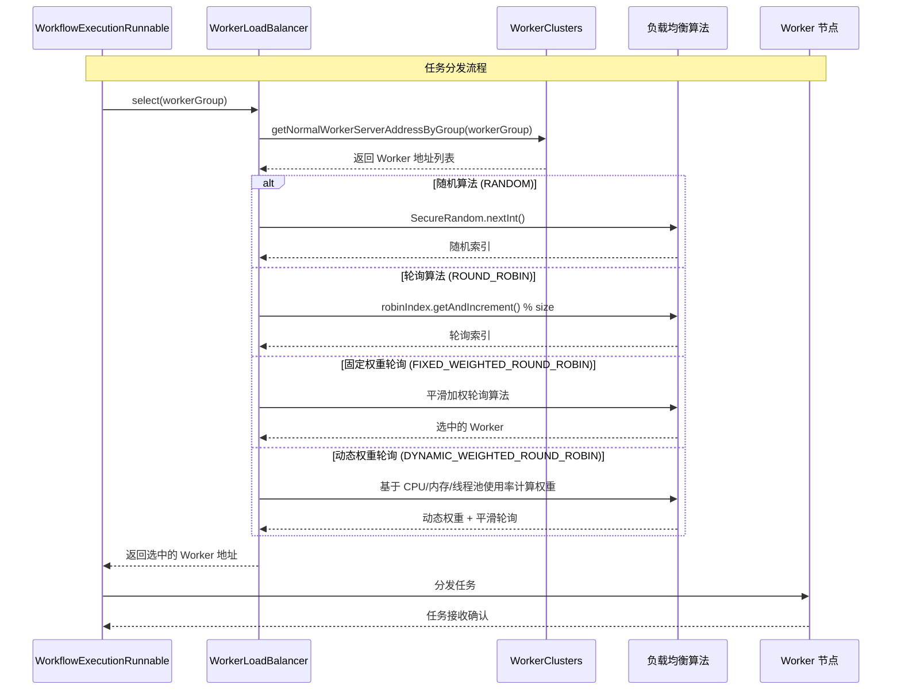
```mermaid
sequenceDiagram
    participant WER as WorkflowExecutionRunnable
    participant WLB as WorkerLoadBalancer
    participant WC as WorkerClusters
    participant Algorithm as 负载均衡算法
    participant Worker as Worker 节点
    
    Note over WER,Worker: 任务分发流程
    
    WER->>WLB: select(workerGroup)
    
    WLB->>WC: getNormalWorkerServerAddressByGroup(workerGroup)
    WC-->>WLB: 返回 Worker 地址列表
    
    alt 随机算法 (RANDOM)
        WLB->>Algorithm: SecureRandom.nextInt()
        Algorithm-->>WLB: 随机索引
    else 轮询算法 (ROUND_ROBIN)
        WLB->>Algorithm: robinIndex.getAndIncrement() % size
        Algorithm-->>WLB: 轮询索引
    else 固定权重轮询 (FIXED_WEIGHTED_ROUND_ROBIN)
        WLB->>Algorithm: 平滑加权轮询算法
        Algorithm-->>WLB: 选中的 Worker
    else 动态权重轮询 (DYNAMIC_WEIGHTED_ROUND_ROBIN)
        WLB->>Algorithm: 基于 CPU/内存/线程池使用率计算权重
        Algorithm-->>WLB: 动态权重 + 平滑轮询
    end
    
    WLB-->>WER: 返回选中的 Worker 地址
    WER->>Worker: 分发任务
    Worker-->>WER: 任务接收确认
```

### 10.1 负载均衡算法对比

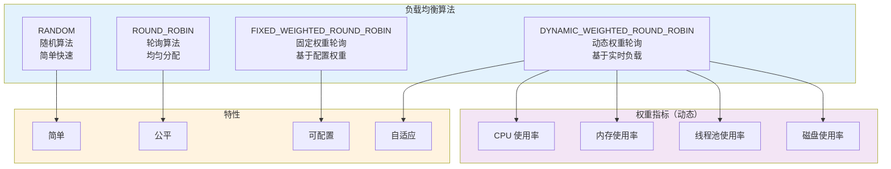
```mermaid
graph TB
    subgraph Algorithms["负载均衡算法"]
        A1["RANDOM<br/>随机算法<br/>简单快速"]
        A2["ROUND_ROBIN<br/>轮询算法<br/>均匀分配"]
        A3["FIXED_WEIGHTED_ROUND_ROBIN<br/>固定权重轮询<br/>基于配置权重"]
        A4["DYNAMIC_WEIGHTED_ROUND_ROBIN<br/>动态权重轮询<br/>基于实时负载"]
    end
    
    subgraph Features["特性"]
        F1["简单"]
        F2["公平"]
        F3["可配置"]
        F4["自适应"]
    end
    
    subgraph Metrics["权重指标（动态）"]
        M1["CPU 使用率"]
        M2["内存使用率"]
        M3["线程池使用率"]
        M4["磁盘使用率"]
    end
    
    A1 --> F1
    A2 --> F2
    A3 --> F3
    A4 --> F4
    
    A4 --> M1
    A4 --> M2
    A4 --> M3
    A4 --> M4
    
    style Algorithms fill:#e3f2fd
    style Features fill:#fff3e0
    style Metrics fill:#f3e5f5
```

---

## 11. 中心化 vs 去中心化架构对比

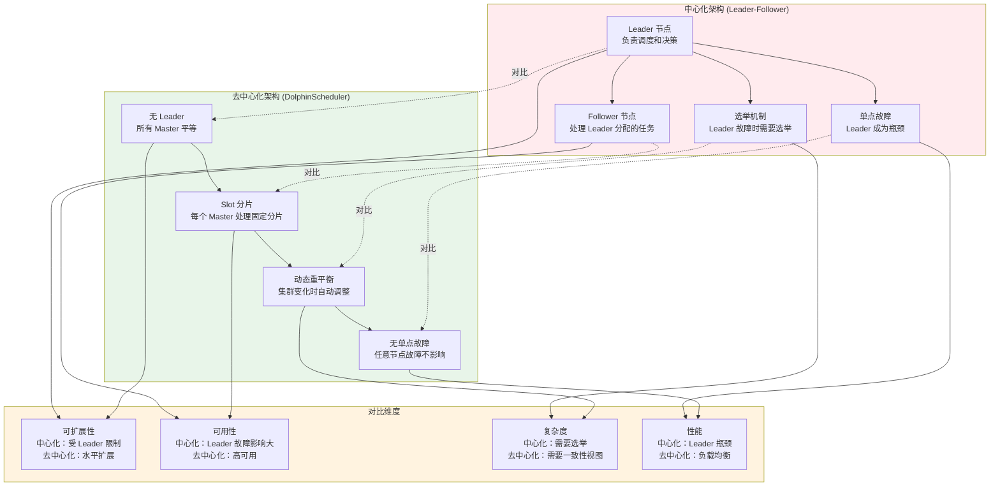
```mermaid
graph TB
    subgraph Centralized["中心化架构 (Leader-Follower)"]
        C1["Leader 节点<br/>负责调度和决策"]
        C2["Follower 节点<br/>处理 Leader 分配的任务"]
        C3["选举机制<br/>Leader 故障时需要选举"]
        C4["单点故障<br/>Leader 成为瓶颈"]
        
        C1 --> C2
        C1 --> C3
        C1 --> C4
    end
    
    subgraph Decentralized["去中心化架构 (DolphinScheduler)"]
        D1["无 Leader<br/>所有 Master 平等"]
        D2["Slot 分片<br/>每个 Master 处理固定分片"]
        D3["动态重平衡<br/>集群变化时自动调整"]
        D4["无单点故障<br/>任意节点故障不影响"]
        
        D1 --> D2
        D2 --> D3
        D3 --> D4
    end
    
    subgraph Comparison["对比维度"]
        Dim1["可扩展性<br/>中心化：受 Leader 限制<br/>去中心化：水平扩展"]
        Dim2["可用性<br/>中心化：Leader 故障影响大<br/>去中心化：高可用"]
        Dim3["复杂度<br/>中心化：需要选举<br/>去中心化：需要一致性视图"]
        Dim4["性能<br/>中心化：Leader 瓶颈<br/>去中心化：负载均衡"]
    end
    
    C1 -.对比.-> D1
    C2 -.对比.-> D2
    C3 -.对比.-> D3
    C4 -.对比.-> D4
    
    C1 --> Dim1
    D1 --> Dim1
    C2 --> Dim2
    D2 --> Dim2
    C3 --> Dim3
    D3 --> Dim3
    C4 --> Dim4
    D4 --> Dim4
    
    style Centralized fill:#ffebee
    style Decentralized fill:#e8f5e9
    style Comparison fill:#fff3e0
```

### 11.1 详细对比表

| 维度 | 中心化架构 | 去中心化架构 (DolphinScheduler) |
|------|-----------|-------------------------------|
| **架构模式** | Leader-Follower | 无 Leader，所有节点平等 |
| **任务分配** | Leader 统一分配 | Slot 分片，每个 Master 独立获取 |
| **故障影响** | Leader 故障需要选举，服务中断 | 任意节点故障，自动重平衡 |
| **扩展性** | 受 Leader 性能限制 | 水平扩展，无瓶颈 |
| **复杂度** | 需要选举算法（Raft/ZAB） | 需要一致性视图（TreeCache） |
| **负载均衡** | Leader 负责分配 | 每个 Master 独立选择 Worker |
| **数据一致性** | 通过 Leader 保证 | 通过 Zookeeper TreeCache 保证 |
| **适用场景** | 需要强一致性、写操作多 | 读多写少、高可用要求 |

---

## 12. 关键代码位置说明

### 12.1 核心类文件路径

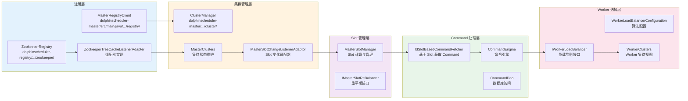
```mermaid
graph LR
    subgraph Registry["注册层"]
        R1["MasterRegistryClient<br/>dolphinscheduler-master/src/main/java/.../registry/"]
        R2["ZookeeperRegistry<br/>dolphinscheduler-registry/.../zookeeper/"]
        R3["ZookeeperTreeCacheListenerAdapter<br/>适配器实现"]
    end
    
    subgraph Cluster["集群管理层"]
        C1["ClusterManager<br/>dolphinscheduler-master/.../cluster/"]
        C2["MasterClusters<br/>集群状态维护"]
        C3["MasterSlotChangeListenerAdaptor<br/>Slot 变化适配器"]
    end
    
    subgraph Slot["Slot 管理层"]
        S1["MasterSlotManager<br/>Slot 计算与管理"]
        S2["IMasterSlotReBalancer<br/>重平衡接口"]
    end
    
    subgraph Command["Command 处理层"]
        CMD1["IdSlotBasedCommandFetcher<br/>基于 Slot 获取 Command"]
        CMD2["CommandEngine<br/>命令引擎"]
        CMD3["CommandDao<br/>数据库访问"]
    end
    
    subgraph Worker["Worker 选择层"]
        W1["IWorkerLoadBalancer<br/>负载均衡接口"]
        W2["WorkerLoadBalancerConfiguration<br/>算法配置"]
        W3["WorkerClusters<br/>Worker 集群视图"]
    end
    
    R1 --> C1
    R2 --> R3
    R3 --> C2
    C2 --> C3
    C3 --> S1
    S1 --> CMD1
    CMD1 --> CMD2
    CMD2 --> W1
    W1 --> W3
    
    style Registry fill:#e3f2fd
    style Cluster fill:#fff3e0
    style Slot fill:#f3e5f5
    style Command fill:#e8f5e9
    style Worker fill:#fce4ec
```

### 12.2 关键方法调用链

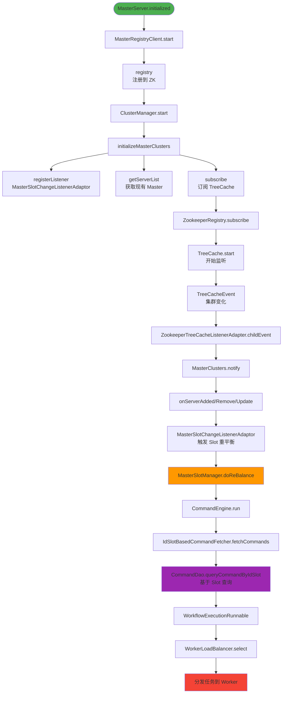
```mermaid
graph TD
    Start([MasterServer.initialized]) --> A1[MasterRegistryClient.start]
    A1 --> A2[registry<br/>注册到 ZK]
    A2 --> A3[ClusterManager.start]
    
    A3 --> B1[initializeMasterClusters]
    B1 --> B2[registerListener<br/>MasterSlotChangeListenerAdaptor]
    B1 --> B3[getServerList<br/>获取现有 Master]
    B1 --> B4[subscribe<br/>订阅 TreeCache]
    
    B4 --> C1[ZookeeperRegistry.subscribe]
    C1 --> C2[TreeCache.start<br/>开始监听]
    
    C2 --> D1[TreeCacheEvent<br/>集群变化]
    D1 --> D2[ZookeeperTreeCacheListenerAdapter.childEvent]
    D2 --> D3[MasterClusters.notify]
    
    D3 --> E1[onServerAdded/Remove/Update]
    E1 --> E2[MasterSlotChangeListenerAdaptor<br/>触发 Slot 重平衡]
    E2 --> E3[MasterSlotManager.doReBalance]
    
    E3 --> F1[CommandEngine.run]
    F1 --> F2[IdSlotBasedCommandFetcher.fetchCommands]
    F2 --> F3[CommandDao.queryCommandByIdSlot<br/>基于 Slot 查询]
    
    F3 --> G1[WorkflowExecutionRunnable]
    G1 --> G2[WorkerLoadBalancer.select]
    G2 --> G3[分发任务到 Worker]
    
    style Start fill:#4caf50
    style E3 fill:#ff9800
    style F3 fill:#9c27b0
    style G3 fill:#f44336
```

---

## 13. 总结与最佳实践

### 13.1 核心设计原则

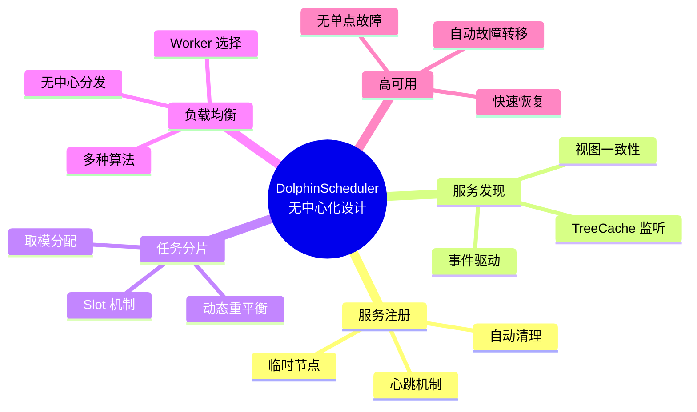
```mermaid
mindmap
  root((DolphinScheduler<br/>无中心化设计))
    服务注册
      临时节点
      心跳机制
      自动清理
    服务发现
      TreeCache 监听
      事件驱动
      视图一致性
    任务分片
      Slot 机制
      取模分配
      动态重平衡
    负载均衡
      多种算法
      Worker 选择
      无中心分发
    高可用
      无单点故障
      自动故障转移
      快速恢复
```

### 13.2 关键优势

1. **无单点故障**
    - 所有 Master 节点地位平等
    - 任意节点故障不影响整体服务
    - 自动故障转移和恢复

2. **水平扩展**
    - 新增 Master 节点即可扩展
    - Slot 自动重平衡，无需手动配置
    - 无性能瓶颈

3. **负载均衡**
    - Slot 机制实现任务均匀分配
    - 多种 Worker 负载均衡算法
    - 动态权重调整

4. **一致性保证**
    - TreeCache 保证所有节点看到相同的集群视图
    - Master 列表排序规则一致
    - Slot 分配结果一致

### 13.3 注意事项

1. **Slot 重平衡的影响**
    - 集群变化时，Slot 会重新分配
    - 正在处理的 Command 不受影响（已获取）
    - 新 Command 会按照新的 Slot 分配

2. **Zookeeper 依赖**
    - 需要 Zookeeper 集群保证高可用
    - TreeCache 需要稳定的网络连接
    - 注册中心故障会影响服务发现

3. **Master 数量建议**
    - 建议 3-5 个 Master 节点
    - 过多节点会增加重平衡频率
    - 过少节点影响可用性

4. **负载均衡算法选择**
    - **RANDOM**：简单快速，适合测试环境
    - **ROUND_ROBIN**：公平分配，适合 Worker 性能相近
    - **FIXED_WEIGHTED_ROUND_ROBIN**：适合 Worker 性能差异明显
    - **DYNAMIC_WEIGHTED_ROUND_ROBIN**：适合生产环境，自适应负载

### 13.4 监控指标

建议监控以下指标：

- **Master 集群状态**：Master 节点数量、Slot 分配情况
- **Slot 重平衡频率**：重平衡次数、触发原因
- **Command 处理延迟**：Command 获取时间、处理时间
- **Worker 负载分布**：各 Worker 的任务数量、CPU/内存使用率
- **Zookeeper 连接状态**：连接数、响应时间、事件延迟

---

## 14. 参考资料

- **核心代码位置**：
    - `ClusterManager.initializeMasterClusters()` - 集群初始化
    - `MasterSlotManager.doReBalance()` - Slot 重平衡
    - `IdSlotBasedCommandFetcher.fetchCommands()` - Command 获取
    - `ZookeeperRegistry.subscribe()` - TreeCache 订阅
    - `MasterSlotChangeListenerAdaptor` - 适配器模式实现

- **配置文件**：
    - `application.yaml` - Master 配置
    - `WorkerLoadBalancerConfiguration` - 负载均衡算法配置
    - `MasterConfig` - Master 服务器配置

- **相关文档**：
    - DolphinScheduler 架构设计文档
    - Zookeeper TreeCache 使用说明
    - Curator Framework 官方文档

---

## 15. 故障场景分析与处理

### 15.1 Master 节点故障场景

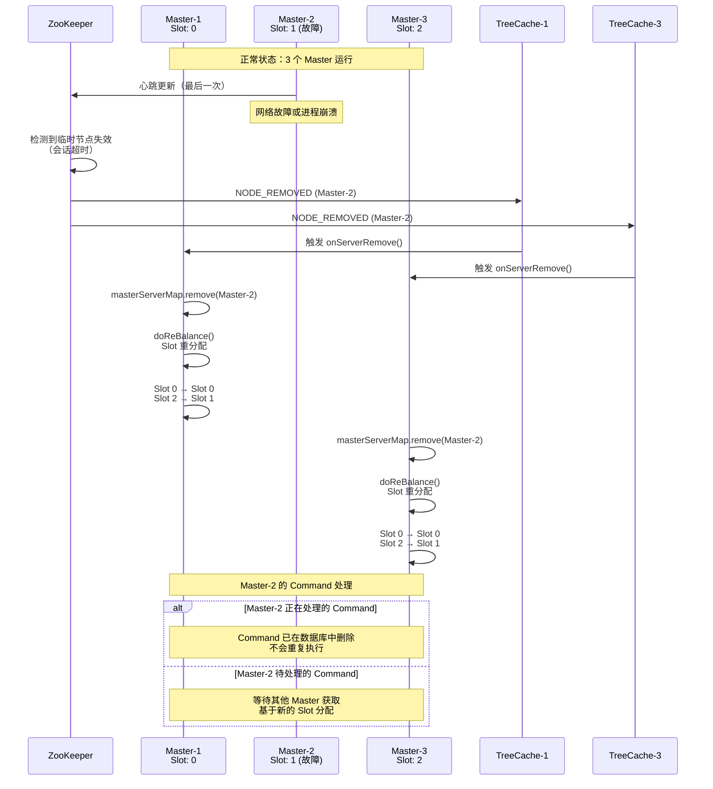
```mermaid
sequenceDiagram
    participant ZK as ZooKeeper
    participant M1 as Master-1<br/>Slot: 0
    participant M2 as Master-2<br/>Slot: 1 (故障)
    participant M3 as Master-3<br/>Slot: 2
    participant TCache1 as TreeCache-1
    participant TCache3 as TreeCache-3
    
    Note over M1,M3: 正常状态：3 个 Master 运行
    
    M2->>ZK: 心跳更新（最后一次）
    Note over M2: 网络故障或进程崩溃
    
    ZK->>ZK: 检测到临时节点失效<br/>（会话超时）
    ZK->>TCache1: NODE_REMOVED (Master-2)
    ZK->>TCache3: NODE_REMOVED (Master-2)
    
    TCache1->>M1: 触发 onServerRemove()
    TCache3->>M3: 触发 onServerRemove()
    
    M1->>M1: masterServerMap.remove(Master-2)
    M1->>M1: doReBalance()<br/>Slot 重分配
    M1->>M1: Slot 0 → Slot 0<br/>Slot 2 → Slot 1
    
    M3->>M3: masterServerMap.remove(Master-2)
    M3->>M3: doReBalance()<br/>Slot 重分配
    M3->>M3: Slot 0 → Slot 0<br/>Slot 2 → Slot 1
    
    Note over M1,M3: Master-2 的 Command 处理
    
    alt Master-2 正在处理的 Command
        Note over M1,M3: Command 已在数据库中删除<br/>不会重复执行
    else Master-2 待处理的 Command
        Note over M1,M3: 等待其他 Master 获取<br/>基于新的 Slot 分配
    end
```

### 15.2 Zookeeper 连接断开场景

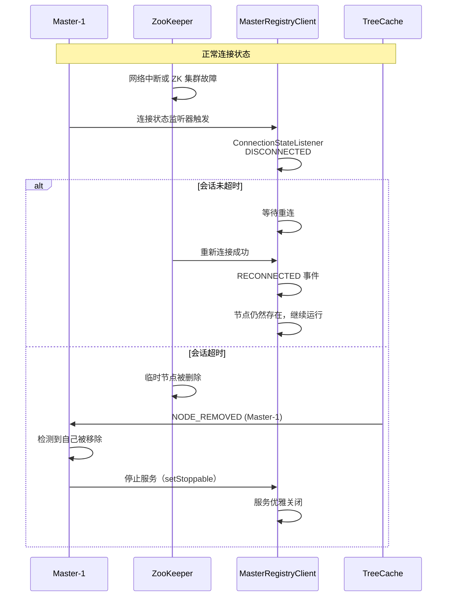
```mermaid
sequenceDiagram
    participant M1 as Master-1
    participant ZK as ZooKeeper
    participant MRC as MasterRegistryClient
    participant TCache as TreeCache
    
    Note over M1,TCache: 正常连接状态
    
    ZK->>ZK: 网络中断或 ZK 集群故障
    
    M1->>MRC: 连接状态监听器触发
    MRC->>MRC: ConnectionStateListener<br/>DISCONNECTED
    
    alt 会话未超时
        MRC->>MRC: 等待重连
        ZK->>MRC: 重新连接成功
        MRC->>MRC: RECONNECTED 事件
        MRC->>MRC: 节点仍然存在，继续运行
    else 会话超时
        ZK->>ZK: 临时节点被删除
        TCache->>M1: NODE_REMOVED (Master-1)
        M1->>M1: 检测到自己被移除
        M1->>MRC: 停止服务（setStoppable）
        MRC->>MRC: 服务优雅关闭
    end
```

### 15.3 集群脑裂场景（双主问题）

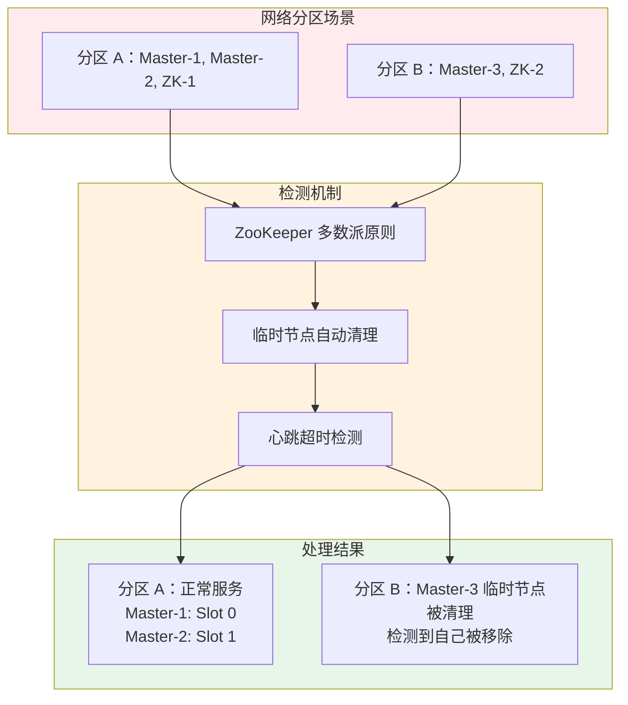
```mermaid
graph TB
    subgraph Network["网络分区场景"]
        Sub1["分区 A：Master-1, Master-2, ZK-1"]
        Sub2["分区 B：Master-3, ZK-2"]
    end
    
    subgraph Detection["检测机制"]
        D1["ZooKeeper 多数派原则"]
        D2["临时节点自动清理"]
        D3["心跳超时检测"]
    end
    
    subgraph Result["处理结果"]
        R1["分区 A：正常服务<br/>Master-1: Slot 0<br/>Master-2: Slot 1"]
        R2["分区 B：Master-3 临时节点被清理<br/>检测到自己被移除"]
    end
    
    Sub1 --> D1
    Sub2 --> D1
    D1 --> D2
    D2 --> D3
    D3 --> R1
    D3 --> R2
    
    style Network fill:#ffebee
    style Detection fill:#fff3e0
    style Result fill:#e8f5e9
```

**防护机制**：
- ZooKeeper 的多数派原则防止脑裂
- 临时节点的自动清理机制
- Master 检测到自己被移除时主动停止服务

---

## 16. 性能优化建议

### 16.1 Slot 分配优化

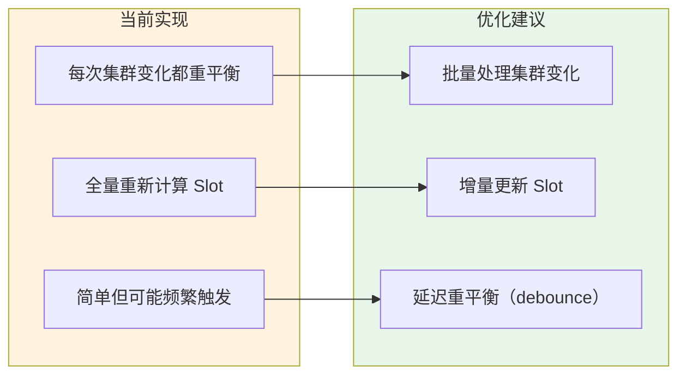
```mermaid
graph LR
    subgraph Current["当前实现"]
        C1["每次集群变化都重平衡"]
        C2["全量重新计算 Slot"]
        C3["简单但可能频繁触发"]
    end
    
    subgraph Optimized["优化建议"]
        O1["批量处理集群变化"]
        O2["增量更新 Slot"]
        O3["延迟重平衡（debounce）"]
    end
    
    C1 --> O1
    C2 --> O2
    C3 --> O3
    
    style Current fill:#fff3e0
    style Optimized fill:#e8f5e9
```

**优化点**：
1. **批量处理**：短时间内多个 Master 变化，合并为一次重平衡
2. **延迟重平衡**：使用 debounce 机制，避免频繁重平衡
3. **增量更新**：只更新变化的部分，而非全量重新计算

### 16.2 Command 获取优化

```mermaid
graph TB
    subgraph Optimization["优化策略"]
        O1["批量获取 Command<br/>减少数据库查询"]
        O2["使用索引优化<br/>id 字段索引"]
        O3["分页查询<br/>避免一次加载过多"]
        O4["缓存 Slot 信息<br/>减少重复计算"]
    end
    
    subgraph Impact["影响"]
        I1["降低数据库压力"]
        I2["提高处理吞吐量"]
        I3["减少内存占用"]
        I4["降低 CPU 使用率"]
    end
    
    O1 --> I1
    O2 --> I2
    O3 --> I3
    O4 --> I4
    
    style Optimization fill:#e3f2fd
    style Impact fill:#fff3e0
```

### 16.3 Worker 选择优化

**动态权重算法优势**：
- 实时感知 Worker 负载
- 自动避开高负载 Worker
- 提高整体吞吐量

**建议配置**：
- 生产环境使用 `DYNAMIC_WEIGHTED_ROUND_ROBIN`
- 配置合理的权重计算间隔
- 监控 Worker 负载分布，及时调整

---

## 17. 配置参数说明

### 17.1 Master 相关配置

| 配置项 | 说明 | 默认值 | 建议值 |
|--------|------|--------|--------|
| `master.listen-port` | Master 监听端口 | 5678 | 根据环境调整 |
| `master.registry.path` | 注册路径 | `/dolphinscheduler/nodes/master` | 通常不需要修改 |
| `master.heartbeat-interval` | 心跳间隔 | 10s | 根据网络延迟调整 |
| `master.command.fetch.size` | 每次获取 Command 数量 | 10 | 根据处理能力调整 |
| `master.command.fetch.id-step` | Command ID 步长 | 1 | 通常为 1 |
| `master.worker-selector.type` | Worker 负载均衡算法 | `DYNAMIC_WEIGHTED_ROUND_ROBIN` | 生产环境推荐 |

### 17.2 Zookeeper 相关配置

| 配置项 | 说明 | 默认值 | 建议值 |
|--------|------|--------|--------|
| `registry.type` | 注册中心类型 | `zookeeper` | 通常使用 zookeeper |
| `registry.zookeeper.namespace` | ZK 命名空间 | `/dolphinscheduler` | 多环境隔离 |
| `registry.zookeeper.connect-string` | ZK 连接地址 | - | 必须配置 |
| `registry.zookeeper.session-timeout` | 会话超时时间 | 30s | 根据网络环境调整 |
| `registry.zookeeper.block-until-connected` | 连接等待时间 | 15s | 根据启动速度调整 |

---

## 18. 监控与诊断

### 18.1 关键监控指标

```mermaid
graph TB
    subgraph Cluster["集群指标"]
        C1["Master 节点数量"]
        C2["Slot 分配情况"]
        C3["Slot 重平衡次数"]
        C4["集群变化频率"]
    end
    
    subgraph Performance["性能指标"]
        P1["Command 获取延迟"]
        P2["Command 处理耗时"]
        P3["Worker 选择耗时"]
        P4["任务分发延迟"]
    end
    
    subgraph Resource["资源指标"]
        R1["Master CPU/内存使用率"]
        R2["Worker 负载分布"]
        R3["数据库连接数"]
        R4["ZooKeeper 连接状态"]
    end
    
    subgraph Stability["稳定性指标"]
        S1["Master 故障次数"]
        S2["ZooKeeper 连接断开次数"]
        S3["Slot 重平衡异常"]
        S4["Command 重复执行"]
    end
    
    style Cluster fill:#e3f2fd
    style Performance fill:#fff3e0
    style Resource fill:#f3e5f5
    style Stability fill:#ffebee
```

### 18.2 日志关键信息

**启动阶段日志**：
```
Master node : 192.168.1.10:5678 registering to registry center
Master node persisted to registry path: /dolphinscheduler/nodes/master/192.168.1.10:5678
Initialized MasterClusters: [...]
Do rebalance success, current master slot: 0, total master slots: 3
```

**运行时日志**：
```
[Slot-0/3] Fetch 5 commands in 10ms.
Server 192.168.1.11:5678 added
Do rebalance success, current master slot: 0, total master slots: 4
Server 192.168.1.12:5678 removed
Do rebalance success, current master slot: 0, total master slots: 3
```

**异常日志**：
```
Do rebalance failed, cannot found the current master: xxx in the normal master clusters
MasterSlotManager check slot (0 -> 3) is invalidated.
```

---

## 19. 常见问题 FAQ

### Q1: Slot 重平衡会导致任务丢失吗？

**A**: 不会。原因：
- 已获取的 Command 已在数据库中删除（事务保证）
- 待处理的 Command 会按照新的 Slot 分配被其他 Master 获取
- 正在执行的任务不受影响

### Q2: 为什么所有 Master 的 Slot 分配结果一致？

**A**: 保证机制：
- 所有 Master 通过 TreeCache 看到相同的集群视图
- `getNormalServers()` 使用相同的排序规则（按地址排序）
- Slot 计算逻辑相同：`currentSlot = index in sorted list`

### Q3: Master 节点数量对性能的影响？

**A**:
- **过少（< 3）**：可用性低，单点故障风险
- **适中（3-5）**：推荐配置，平衡可用性和复杂度
- **过多（> 10）**：重平衡频繁，管理复杂，收益递减

### Q4: 如何选择 Worker 负载均衡算法？

**A**:
- **测试环境**：RANDOM 或 ROUND_ROBIN（简单快速）
- **Worker 性能相近**：ROUND_ROBIN（公平分配）
- **Worker 性能差异大**：FIXED_WEIGHTED_ROUND_ROBIN（按配置权重）
- **生产环境**：DYNAMIC_WEIGHTED_ROUND_ROBIN（自适应负载，推荐）

### Q5: ZooKeeper 故障对集群的影响？

**A**:
- **短暂故障（< 会话超时）**：Master 继续运行，无法感知集群变化
- **长时间故障（> 会话超时）**：临时节点被清理，Master 检测到后停止服务
- **建议**：部署 ZooKeeper 集群（至少 3 节点），保证高可用

---

## 20. 扩展阅读

### 20.1 相关设计模式

1. **适配器模式**
    - `ZookeeperTreeCacheListenerAdapter`：适配 TreeCacheEvent 到 Event
    - `MasterSlotChangeListenerAdaptor`：适配集群变化事件到 Slot 重平衡

2. **观察者模式**
    - `IClustersChangeListener`：集群变化监听器
    - `MasterClusters`：维护监听器列表，通知变化

3. **策略模式**
    - `IWorkerLoadBalancer`：负载均衡策略接口
    - 多种实现：Random、RoundRobin、WeightedRoundRobin

### 20.2 相关技术

1. **ZooKeeper TreeCache**
    - Curator 提供的高级缓存机制
    - 自动缓存节点数据，监听变化
    - 保证数据一致性

2. **分布式一致性**
    - 最终一致性：通过 TreeCache 保证所有节点最终看到相同视图
    - 排序一致性：通过统一的排序规则保证 Slot 分配一致

3. **故障转移（Failover）**
    - 自动检测节点故障（临时节点清理）
    - 自动重平衡（Slot 重新分配）
    - 优雅降级（故障节点停止服务）

---

## 21. 总结

DolphinScheduler 的 Master 集群通过以下核心机制实现了去中心化的高可用架构：

1. **服务注册与发现**
    - 基于 ZooKeeper 临时节点的服务注册
    - 基于 TreeCache 的集群变化监听
    - 自动故障检测和清理

2. **任务分片机制**
    - Slot 分配算法：`(commandId / idStep) % totalSlots = currentSlot`
    - 动态重平衡：集群变化时自动调整
    - 一致性保证：所有 Master 看到相同的集群视图

3. **负载均衡**
    - Master 层：Slot 机制实现任务均匀分配
    - Worker 层：多种负载均衡算法选择 Worker
    - 动态权重：基于实时负载调整

4. **高可用保障**
    - 无单点故障：所有 Master 地位平等
    - 自动故障转移：节点故障自动重平衡
    - 快速恢复：新节点加入立即生效

这种设计实现了**水平扩展、高可用、易维护**的分布式调度系统，避免了传统中心化架构的单点故障和性能瓶颈问题。

---

## 22. 实际应用场景

### 22.1 典型部署架构

```mermaid
graph TB
    subgraph Production["生产环境"]
        subgraph ZKCluster["ZooKeeper 集群"]
            ZK1[ZK-1<br/>10.0.1.11]
            ZK2[ZK-2<br/>10.0.1.12]
            ZK3[ZK-3<br/>10.0.1.13]
        end
        
        subgraph MasterCluster["Master 集群（3节点）"]
            M1[Master-1<br/>10.0.2.11:5678<br/>Slot: 0]
            M2[Master-2<br/>10.0.2.12:5678<br/>Slot: 1]
            M3[Master-3<br/>10.0.2.13:5678<br/>Slot: 2]
        end
        
        subgraph WorkerCluster["Worker 集群（5节点）"]
            W1[Worker-1<br/>10.0.3.11]
            W2[Worker-2<br/>10.0.3.12]
            W3[Worker-3<br/>10.0.3.13]
            W4[Worker-4<br/>10.0.3.14]
            W5[Worker-5<br/>10.0.3.15]
        end
        
        subgraph DBCluster["数据库集群"]
            DB1[(MySQL Master)]
            DB2[(MySQL Slave)]
        end
    end
    
    M1 -.注册/心跳.-> ZK1
    M2 -.注册/心跳.-> ZK2
    M3 -.注册/心跳.-> ZK3
    
    M1 -.TreeCache.-> ZK1
    M2 -.TreeCache.-> ZK2
    M3 -.TreeCache.-> ZK3
    
    M1 -->|Slot 0<br/>Command 获取| DB1
    M2 -->|Slot 1<br/>Command 获取| DB1
    M3 -->|Slot 2<br/>Command 获取| DB1
    
    M1 -->|负载均衡| W1
    M1 -->|负载均衡| W2
    M1 -->|负载均衡| W3
    M2 -->|负载均衡| W1
    M2 -->|负载均衡| W4
    M2 -->|负载均衡| W5
    M3 -->|负载均衡| W2
    M3 -->|负载均衡| W3
    M3 -->|负载均衡| W4
    
    style ZKCluster fill:#e1f5ff
    style MasterCluster fill:#fff4e6
    style WorkerCluster fill:#e8f5e9
    style DBCluster fill:#f3e5f5
```

### 22.2 扩容场景示例

**场景**：从 3 个 Master 扩容到 5 个 Master

```mermaid
sequenceDiagram
    participant ZK as ZooKeeper
    participant M1 as Master-1<br/>Slot: 0
    participant M2 as Master-2<br/>Slot: 1
    participant M3 as Master-3<br/>Slot: 2
    participant M4 as Master-4<br/>新节点
    participant M5 as Master-5<br/>新节点
    
    Note over M1,M5: 初始状态：3 个 Master
    
    M4->>ZK: 注册临时节点
    M5->>ZK: 注册临时节点
    
    ZK->>M1: NODE_ADDED (Master-4)
    ZK->>M1: NODE_ADDED (Master-5)
    ZK->>M2: NODE_ADDED (Master-4)
    ZK->>M2: NODE_ADDED (Master-5)
    ZK->>M3: NODE_ADDED (Master-4)
    ZK->>M3: NODE_ADDED (Master-5)
    
    M1->>M1: doReBalance()<br/>重新排序 Master 列表
    M1->>M1: Slot 重分配<br/>M1: 0→0, M2: 1→1, M3: 2→2<br/>M4: →3, M5: →4
    
    M2->>M2: doReBalance()<br/>相同的 Slot 分配结果
    M3->>M3: doReBalance()<br/>相同的 Slot 分配结果
    
    M4->>M4: 初始化完成<br/>Slot: 3/5
    M5->>M5: 初始化完成<br/>Slot: 4/5
    
    Note over M1,M5: 扩容完成：5 个 Master<br/>Slot 自动重平衡
```

**影响分析**：
- ✅ 原有 Master 的 Slot 保持不变（0, 1, 2）
- ✅ 新 Master 分配新 Slot（3, 4）
- ✅ Command 分配变化：`(id % 5)` vs `(id % 3)`
- ✅ 正在处理的 Command 不受影响
- ⚠️ 新 Command 会按照新的分配规则处理

---

## 23. 关键代码实现细节

### 23.1 Slot 重平衡核心逻辑

```java
// MasterSlotManager.doReBalance()
public void doReBalance(List<MasterServerMetadata> normalMasterServers) {
    // 1. 按地址排序（保证所有 Master 排序一致）
    // normalMasterServers 已经按地址排序
    
    // 2. 找到当前 Master 在列表中的位置
    int tmpCurrentSlot = -1;
    for (int i = 0; i < normalMasterServers.size(); i++) {
        if (normalMasterServers.get(i).getAddress().equals(masterConfig.getMasterAddress())) {
            tmpCurrentSlot = i;  // 索引即为 Slot
            break;
        }
    }
    
    // 3. 检查是否找到当前 Master
    if (tmpCurrentSlot == -1) {
        log.warn("Do rebalance failed, cannot found the current master");
        currentSlot = -1;  // Slot 无效
        return;
    }
    
    // 4. 检查是否需要重平衡
    if (totalSlots == normalMasterServers.size() && currentSlot == tmpCurrentSlot) {
        log.debug("No need to rebalance");
        return;  // Slot 未变化，无需重平衡
    }
    
    // 5. 更新 Slot 信息
    totalSlots = normalMasterServers.size();
    currentSlot = tmpCurrentSlot;
    log.info("Do rebalance success, current master slot: {}, total master slots: {}", 
             currentSlot, totalSlots);
}
```

**关键点**：
- 使用 `volatile` 保证可见性
- Slot 计算简单高效：`索引 = Slot`
- 幂等性：相同输入产生相同结果

### 23.2 Command 获取 SQL 实现

```sql
-- CommandMapper.xml
<select id="queryCommandByIdSlot">
    select *
    from t_ds_command
    where (id / #{idStep}) % #{totalSlot} = #{currentSlotIndex}
    order by workflow_instance_priority, id asc
    limit #{fetchNumber}
</select>
```

**SQL 优化建议**：
- `id` 字段需要索引（主键自动索引）
- `workflow_instance_priority` 字段建议索引
- `limit` 限制每次获取数量，避免内存溢出

### 23.3 事件处理的线程安全性

```java
// AbstractClusterSubscribeListener.notify()
public void notify(Event event) {
    try {
        // 使用 synchronized 保证事件顺序处理
        synchronized (this) {
            Event.Type type = event.getType();
            T server = parseServerFromHeartbeat(event.getEventData());
            
            switch (type) {
                case ADD:
                    onServerAdded(server);
                    break;
                case REMOVE:
                    onServerRemove(server);
                    break;
                case UPDATE:
                    onServerUpdate(server);
                    break;
            }
        }
    } catch (Exception ex) {
        log.error("Notify cluster change event failed", ex);
    }
}
```

**线程安全保证**：
- `synchronized (this)` 保证事件顺序处理
- `ConcurrentHashMap` 保证并发访问安全
- `CopyOnWriteArrayList` 保证监听器列表线程安全

---

## 24. 版本演进与改进方向

### 24.1 当前实现的优势

1. **简单可靠**
   - Slot 分配算法简单直观
   - 实现代码量少，易于维护
   - 性能开销小

2. **自动容错**
   - 节点故障自动检测
   - Slot 自动重平衡
   - 无需人工干预

3. **易于扩展**
   - 新增节点无需配置
   - 自动加入集群
   - 立即生效

### 24.2 可能的改进方向

```mermaid
graph LR
    subgraph Current["当前实现"]
        C1["简单 Slot 分配"]
        C2["全量重平衡"]
        C3["同步事件处理"]
    end
    
    subgraph Improvement["改进方向"]
        I1["智能 Slot 分配<br/>考虑负载均衡"]
        I2["增量重平衡<br/>减少影响范围"]
        I3["异步事件处理<br/>提高响应速度"]
        I4["Slot 预分配<br/>减少重平衡频率"]
    end
    
    C1 -.可改进.-> I1
    C2 -.可改进.-> I2
    C3 -.可改进.-> I3
    C2 -.可改进.-> I4
    
    style Current fill:#fff3e0
    style Improvement fill:#e8f5e9
```

**改进建议**：

1. **批量重平衡**
   - 短时间内多个事件合并处理
   - 使用 debounce 机制
   - 减少重平衡频率

2. **增量更新**
   - 只更新变化的 Slot
   - 避免全量重新计算
   - 提高性能

3. **智能分配**
   - 考虑 Master 负载情况
   - 动态调整 Slot 分配
   - 负载均衡优化

4. **预分配机制**
   - 预留部分 Slot
   - 新节点加入时无需立即重平衡
   - 降低重平衡频率

---

## 25. 部署与运维建议

### 25.1 部署架构建议

```mermaid
graph TB
    subgraph Deployment["部署建议"]
        D1["ZooKeeper: 3-5 节点<br/>保证高可用"]
        D2["Master: 3-5 节点<br/>平衡可用性与复杂度"]
        D3["Worker: 5-10 节点<br/>根据任务量调整"]
        D4["数据库: 主从架构<br/>读写分离"]
    end
    
    subgraph Network["网络建议"]
        N1["同机房部署<br/>降低网络延迟"]
        N2["跨机房容灾<br/>提高可用性"]
        N3["防火墙规则<br/>限制访问"]
    end
    
    subgraph Monitoring["监控建议"]
        M1["Prometheus + Grafana<br/>指标监控"]
        M2["ELK Stack<br/>日志收集"]
        M3["告警系统<br/>及时通知"]
    end
    
    D1 --> N1
    D2 --> N1
    D3 --> N1
    D4 --> N2
    
    D1 --> M1
    D2 --> M1
    D3 --> M1
    
    style Deployment fill:#e3f2fd
    style Network fill:#fff3e0
    style Monitoring fill:#f3e5f5
```

### 25.2 运维检查清单

**启动前检查**：
- [ ] ZooKeeper 集群状态正常
- [ ] 数据库连接正常
- [ ] 网络连通性正常
- [ ] 配置文件正确

**运行时监控**：
- [ ] Master 节点数量
- [ ] Slot 分配情况
- [ ] 心跳状态
- [ ] Command 处理延迟
- [ ] Worker 负载分布

**故障处理**：
- [ ] 节点故障：检查日志，确认原因
- [ ] Slot 重平衡异常：检查集群视图一致性
- [ ] Zookeeper 连接断开：检查网络和 ZK 状态
- [ ] Command 处理失败：检查数据库和 Worker 状态

---

## 26. 最佳实践总结

### 26.1 配置最佳实践

1. **Master 节点数量**
   - ✅ 推荐：3-5 个
   - ❌ 避免：< 2 个（可用性低）或 > 10 个（复杂度高）

2. **负载均衡算法**
   - ✅ 生产环境：`DYNAMIC_WEIGHTED_ROUND_ROBIN`
   - ✅ 测试环境：`ROUND_ROBIN` 或 `RANDOM`

3. **心跳配置**
   - ✅ 心跳间隔：10s（默认）
   - ✅ 会话超时：30s（默认）
   - ⚠️ 网络延迟大时适当增加

4. **Command 获取配置**
   - ✅ 批量大小：10-50（根据处理能力）
   - ✅ ID 步长：1（通常不需要修改）

### 26.2 性能优化建议

```mermaid
mindmap
  root((性能优化))
    数据库优化
      索引优化
      连接池配置
      查询优化
    Zookeeper 优化
      连接池复用
      会话超时调整
      网络优化
    Master 优化
      Slot 缓存
      批量处理
      异步处理
    Worker 优化
      负载均衡算法
      任务队列大小
      线程池配置
```

### 26.3 故障预防措施

1. **ZooKeeper 高可用**
   - 部署 3+ 节点集群
   - 监控 ZK 状态
   - 定期备份数据

2. **网络稳定性**
   - 使用内网通信
   - 配置超时参数
   - 监控网络延迟

3. **资源监控**
   - CPU/内存使用率
   - 数据库连接数
   - 线程池状态

4. **日志管理**
   - 配置日志级别
   - 定期清理日志
   - 关键事件记录

---

## 27. 附录

### 27.1 术语表

| 术语 | 说明 |
|------|------|
| **Slot** | Master 在集群中的位置索引，用于任务分片 |
| **TreeCache** | Curator 提供的高级缓存机制，自动监听节点变化 |
| **临时节点（Ephemeral）** | ZooKeeper 节点类型，客户端断开后自动删除 |
| **重平衡（Rebalance）** | 集群变化时重新分配 Slot 的过程 |
| **适配器模式** | 设计模式，将不同接口转换为统一接口 |
| **去中心化** | 无 Leader 节点，所有节点地位平等的架构 |

### 27.2 相关链接

- **官方文档**：https://dolphinscheduler.apache.org/
- **GitHub 仓库**：https://github.com/apache/dolphinscheduler
- **ZooKeeper 文档**：https://zookeeper.apache.org/
- **Curator 文档**：https://curator.apache.org/

### 27.3 代码仓库路径

```
dolphinscheduler/
├── dolphinscheduler-master/
│   └── src/main/java/org/apache/dolphinscheduler/server/master/
│       ├── cluster/
│       │   ├── ClusterManager.java                    # 集群管理器
│       │   ├── MasterClusters.java                    # Master 集群状态
│       │   ├── MasterSlotManager.java                 # Slot 管理
│       │   ├── MasterSlotChangeListenerAdaptor.java   # Slot 变化适配器
│       │   └── loadbalancer/                          # Worker 负载均衡
│       ├── registry/
│       │   └── MasterRegistryClient.java              # 注册客户端
│       └── engine/
│           └── command/
│               └── IdSlotBasedCommandFetcher.java     # Command 获取
└── dolphinscheduler-registry/
    └── dolphinscheduler-registry-plugins/
        └── dolphinscheduler-registry-zookeeper/
            └── src/main/java/.../zookeeper/
                ├── ZookeeperRegistry.java              # ZK 注册实现
                └── ZookeeperTreeCacheListenerAdapter.java  # 事件适配器
```

---

## 文档信息

**文档标题**：DolphinScheduler Master 集群架构与工作原理

**文档版本**：v1.0

**创建日期**：2024年

**最后更新**：2024年

**维护者**：DolphinScheduler 社区

**文档说明**：
本文档详细描述了 DolphinScheduler Master 集群的无中心化架构设计，包括服务注册与发现、Slot 分配机制、任务分片、负载均衡等核心功能的实现原理和最佳实践。

**文档结构**：
- 第1-8章：架构设计与核心流程
- 第9-12章：关键技术详解
- 第13-17章：配置、监控与优化
- 第18-21章：故障处理与总结
- 第22-27章：实际应用与实践指南

**反馈与贡献**：
如有问题或建议，欢迎通过 GitHub Issue 或邮件列表反馈。

---

*本文档基于 DolphinScheduler 代码库分析整理，旨在帮助开发者深入理解 Master 集群的工作原理。*
