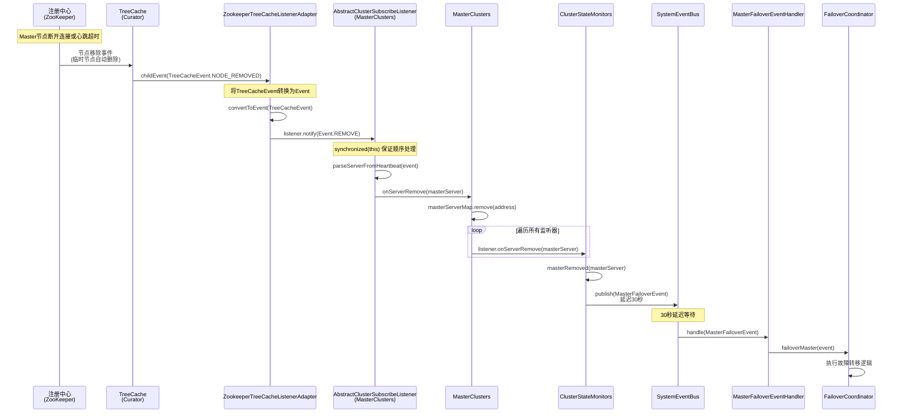
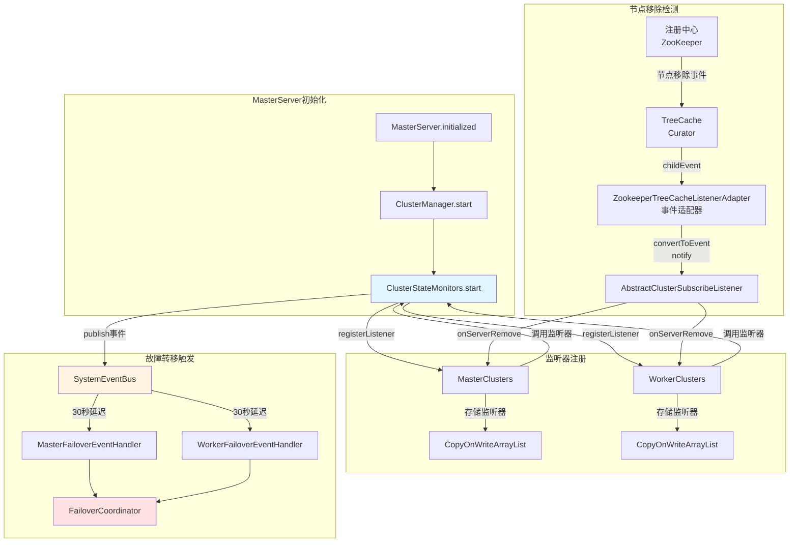
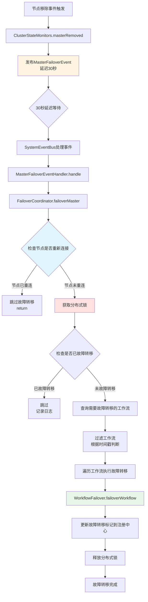
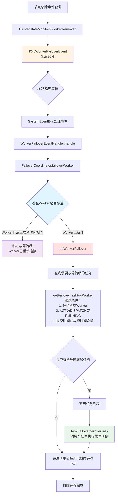

# 服务故障转移管理 - ClusterStateMonitors

## 概述

`ClusterStateMonitors` 是 DolphinScheduler Master 服务中的核心组件，负责监控集群中 Master 和 Worker 节点的状态变化。当检测到节点从注册中心移除时，它会触发故障转移事件，确保集群的高可用性。

**核心职责：**
- 监控 Master 和 Worker 节点的移除事件
- 发布延迟故障转移事件，避免误触发
- 通过事件驱动机制实现解耦的故障转移处理

## 代码位置和调用时机

### 代码位置

**主要类：**
- `org.apache.dolphinscheduler.server.master.cluster.ClusterStateMonitors`

**调用位置：**
```185:185:dolphinscheduler-master/src/main/java/org/apache/dolphinscheduler/server/master/MasterServer.java
        this.clusterStateMonitors.start();
```

### 启动流程

在 `MasterServer.initialized()` 方法（标注了 `@PostConstruct`）中按以下顺序启动：

```java
// 1. 启动 RPC 服务
this.masterRPCServer.start();

// 2. 启动注册客户端（心跳和注册）
this.masterRegistryClient.start();

// 3. 启动协调器
this.masterCoordinator.start();

// 4. 启动集群管理器（初始化 Master/Worker 集群，订阅节点变化）
this.clusterManager.start();

// 5. 启动集群状态监控（注册故障转移监听器）
this.clusterStateMonitors.start();  // ← 当前分析的位置

// 6. 启动工作流引擎
this.workflowEngine.start();
```

**关键依赖关系：**
- 必须在 `clusterManager.start()` 之后调用，因为需要访问已初始化的 `MasterClusters` 和 `WorkerClusters`

## 核心功能

### 1. 监听器注册

`start()` 方法的核心逻辑是注册两个监听器：

```java
public void start() {
    // 注册 Master 节点移除监听器
    clusterManager.getMasterClusters()
            .registerListener((IClusters.ServerRemovedListener<MasterServerMetadata>) this::masterRemoved);
    
    // 注册 Worker 节点移除监听器
    clusterManager.getWorkerClusters()
            .registerListener((IClusters.ServerRemovedListener<WorkerServerMetadata>) this::workerRemoved);
    
    log.info("ClusterStateMonitors started...");
}
```

**监听器特点：**
- 使用 `ServerRemovedListener` 接口（只关注 `onServerRemove` 方法）
- 使用方法引用 `this::masterRemoved` 和 `this::workerRemoved` 作为回调

### 2. 监听器存储机制

监听器存储在 `MasterClusters` 和 `WorkerClusters` 中：

```java
// MasterClusters.java
private final List<IClustersChangeListener<MasterServerMetadata>> masterClusterChangeListeners =
        new CopyOnWriteArrayList<>();

@Override
public void registerListener(final IClustersChangeListener<MasterServerMetadata> listener) {
    masterClusterChangeListeners.add(listener);
}
```

**设计要点：**
- 使用 `CopyOnWriteArrayList` 保证线程安全
- 支持并发读取，写操作时创建新副本
- 适合读多写少的场景

### 3. 节点移除事件处理

当检测到节点移除时，会触发以下回调：

```java
void masterRemoved(final MasterServerMetadata masterServer) {
    // 30秒延迟机制：如果节点在30秒内重新连接，则跳过故障转移
    systemEventBus.publish(MasterFailoverEvent.of(masterServer, new Date(), 30_000));
}

void workerRemoved(final WorkerServerMetadata workerServer) {
    // 30秒延迟机制：如果节点在30秒内重新连接，则跳过故障转移
    systemEventBus.publish(WorkerFailoverEvent.of(workerServer, new Date(), 30_000));
}
```

**延迟机制：**
- 30 秒延迟：避免因网络抖动导致的误触发
- 如果节点在 30 秒内重新连接，则跳过故障转移
- 事件类型：`SystemEventType.MASTER_FAILOVER` 或 `SystemEventType.WORKER_FAILOVER`

## 完整流程

### 节点移除检测流程



### 组件交互图



### 类关系图

```mermaid
classDiagram
    class ClusterStateMonitors {
        -ClusterManager clusterManager
        -SystemEventBus systemEventBus
        +start()
        -masterRemoved(MasterServerMetadata)
        -workerRemoved(WorkerServerMetadata)
    }
    
        class ClusterManager {
        -MasterClusters masterClusters
        -WorkerClusters workerClusters
        -MasterSlotManager masterSlotManager
        -WorkerGroupChangeNotifier workerGroupChangeNotifier
        -RegistryClient registryClient
        +start()
        +getMasterClusters() MasterClusters
        +getWorkerClusters() WorkerClusters
        -initializeMasterClusters()
        -initializeWorkerClusters()
    }
    
    class IClusters~S~ {
        <<interface>>
        +getServers() List~S~
        +getServer(String address) Optional~S~
        +registerListener(IClustersChangeListener~S~)
    }
    
    class IClustersChangeListener~S~ {
        <<interface>>
        +onServerAdded(S server)
        +onServerRemove(S server)
        +onServerUpdate(S server)
    }
    
    class ServerRemovedListener~S~ {
        <<interface>>
        +onServerRemove(S server)
    }
    
    class MasterClusters {
        -Map~String, MasterServerMetadata~ masterServerMap
        -List~IClustersChangeListener~ masterClusterChangeListeners
        +getServers() List~MasterServerMetadata~
        +getServer(String address) Optional~MasterServerMetadata~
        +getNormalServers() List~MasterServerMetadata~
        +registerListener(IClustersChangeListener)
        +onServerAdded(MasterServerMetadata)
        +onServerRemove(MasterServerMetadata)
        +onServerUpdate(MasterServerMetadata)
        #parseServerFromHeartbeat(String) MasterServerMetadata
    }
    
    class WorkerClusters {
        -Map~String, WorkerServerMetadata~ workerMapping
        -List~IClustersChangeListener~ workerClusterChangeListeners
        +getServers() List~WorkerServerMetadata~
        +getServer(String address) Optional~WorkerServerMetadata~
        +registerListener(IClustersChangeListener)
        +onServerAdded(WorkerServerMetadata)
        +onServerRemove(WorkerServerMetadata)
        +onServerUpdate(WorkerServerMetadata)
        #parseServerFromHeartbeat(String) WorkerServerMetadata
    }
    
    class AbstractClusterSubscribeListener~T~ {
        <<abstract>>
        +notify(Event event)
        +getSubscribeScope() SubscribeScope
        #parseServerFromHeartbeat(String) T*
        #onServerAdded(T)*
        #onServerRemove(T)*
        #onServerUpdate(T)*
    }
    
    class SystemEventBus {
        +publish(AbstractSystemEvent event)
        +subscribe(ISystemEventHandler handler)
    }
    
    class MasterFailoverEvent {
        -MasterServerMetadata masterServerMetadata
        -Date eventTime
        -long delayTime
        +of(...) MasterFailoverEvent
        +getEventType() SystemEventType
    }
    
    class WorkerFailoverEvent {
        -WorkerServerMetadata workerServerMetadata
        -Date eventTime
        -long delayTime
        +of(...) WorkerFailoverEvent
        +getEventType() SystemEventType
    }
    
    class ISystemEventHandler~T~ {
        <<interface>>
        +handle(T event)
        +matchState() SystemEventType
    }
    
    class MasterFailoverEventHandler {
        -FailoverCoordinator failoverCoordinator
        +handle(MasterFailoverEvent)
        +matchState() SystemEventType
    }
    
    class WorkerFailoverEventHandler {
        -FailoverCoordinator failoverCoordinator
        +handle(WorkerFailoverEvent)
        +matchState() SystemEventType
    }
    
    class FailoverCoordinator {
        -RegistryClient registryClient
        -ClusterManager clusterManager
        -IWorkflowRepository workflowRepository
        -TaskFailover taskFailover
        -WorkflowFailover workflowFailover
        +globalMasterFailover(GlobalMasterFailoverEvent)
        +failoverMaster(MasterFailoverEvent)
        +failoverWorker(WorkerFailoverEvent)
        -doMasterFailover(...)
        -doWorkerFailover(...)
    }
    
    class RegistryClient {
        <<interface>>
        +subscribe(String path, SubscribeListener)
        +getServerList(RegistryNodeType) List~Server~
        +exists(String path) boolean
        +getLock(String path)
        +releaseLock(String path)
    }
    
    class SubscribeListener {
        <<interface>>
        +notify(Event event)
        +getSubscribeScope() SubscribeScope
    }
    
    %% 关系定义
    ClusterStateMonitors --> ClusterManager : uses
    ClusterStateMonitors --> SystemEventBus : publishes events to
    ClusterStateMonitors ..|> ServerRemovedListener : implements via method reference
    
    ClusterManager --> MasterClusters : creates & manages
    ClusterManager --> WorkerClusters : creates & manages
    ClusterManager --> RegistryClient : uses
    
    MasterClusters --|> AbstractClusterSubscribeListener : extends
    MasterClusters ..|> IClusters : implements
    MasterClusters --> IClustersChangeListener : stores listeners
    MasterClusters --> SubscribeListener : implements
    
    WorkerClusters --|> AbstractClusterSubscribeListener : extends
    WorkerClusters ..|> IClusters : implements
    WorkerClusters --> IClustersChangeListener : stores listeners
    WorkerClusters --> SubscribeListener : implements
    
    ServerRemovedListener --|> IClustersChangeListener : extends
    IClustersChangeListener --> IClusters : nested in
    
    AbstractClusterSubscribeListener ..|> SubscribeListener : implements
    
    SystemEventBus --> ISystemEventHandler : dispatches to
    SystemEventBus --> MasterFailoverEvent : handles
    SystemEventBus --> WorkerFailoverEvent : handles
    
    MasterFailoverEvent --> SystemEventBus : published to
    WorkerFailoverEvent --> SystemEventBus : published to
    
    MasterFailoverEventHandler ..|> ISystemEventHandler : implements
    WorkerFailoverEventHandler ..|> ISystemEventHandler : implements
    
    MasterFailoverEventHandler --> FailoverCoordinator : delegates to
    WorkerFailoverEventHandler --> FailoverCoordinator : delegates to
    
    FailoverCoordinator --> ClusterManager : uses
    FailoverCoordinator --> RegistryClient : uses
    FailoverCoordinator --> TaskFailover : uses
    FailoverCoordinator --> WorkflowFailover : uses
    
    RegistryClient --> SubscribeListener : subscribes
```



## 关键类说明

### ClusterStateMonitors
- **职责**：集群状态监控器，监听节点移除事件并触发故障转移
- **关键方法**：
    - `start()`: 注册 Master 和 Worker 的节点移除监听器
    - `masterRemoved()`: 发布 Master 故障转移事件（30秒延迟）
    - `workerRemoved()`: 发布 Worker 故障转移事件（30秒延迟）

### ClusterManager
- **职责**：集群管理器，初始化和管理 Master/Worker 集群
- **关键方法**：
    - `start()`: 初始化 Master 和 Worker 集群，订阅注册中心节点变化
    - `getMasterClusters()`: 获取 Master 集群实例
    - `getWorkerClusters()`: 获取 Worker 集群实例

### MasterClusters / WorkerClusters
- **职责**：维护集群节点列表，管理监听器，响应节点变化
- **关键数据结构**：
    - `masterServerMap / workerMapping`: 节点地址到元数据的映射（ConcurrentHashMap）
    - `masterClusterChangeListeners / workerClusterChangeListeners`: 监听器列表（CopyOnWriteArrayList）
- **关键方法**：
    - `registerListener()`: 注册集群变化监听器
    - `onServerRemove()`: 节点移除时调用，通知所有监听器

### AbstractClusterSubscribeListener
- **职责**：抽象订阅监听器，处理注册中心事件并转换为集群变化事件
- **关键机制**：
    - `synchronized(this)`: 确保事件按顺序处理
    - 模板方法模式：子类实现具体的节点解析和事件处理方法

### ZookeeperTreeCacheListenerAdapter
- **职责**：ZooKeeper 事件适配器，将 Curator 的 `TreeCacheEvent` 转换为 DolphinScheduler 统一的 `Event`
- **关键机制**：
    - 实现 `TreeCacheListener` 接口，监听 Curator TreeCache 的事件
    - 事件类型转换：`TreeCacheEvent.NODE_REMOVED` → `Event.Type.REMOVE`
    - 根据 `SubscribeScope` 过滤事件：
        - `PATH_ONLY`: 只处理路径本身的事件
        - `CHILDREN_ONLY`: 只处理子节点的事件（Master/Worker 使用此模式）
        - `ALL`: 处理所有事件
- **调用链路**：`ZooKeeper` → `TreeCache` → `ZookeeperTreeCacheListenerAdapter.childEvent()` → `SubscribeListener.notify()`

### SystemEventBus
- **职责**：系统事件总线，异步处理故障转移事件
- **特性**：支持延迟事件（delayTime），用于实现30秒延迟机制

### FailoverCoordinator
- **职责**：故障转移协调器，实际执行故障转移逻辑
- **关键方法**：
    - `failoverMaster()`: 执行 Master 故障转移
    - `failoverWorker()`: 执行 Worker 故障转移
    - `doMasterFailover()`: 核心故障转移逻辑，包括分布式锁、工作流查询和转移

## 设计模式

1. **观察者模式（Observer Pattern）**
  - `ClusterStateMonitors` 作为观察者，监听 `MasterClusters` 和 `WorkerClusters` 的节点变化
  - `IClustersChangeListener` 接口定义了观察者的契约
  - `MasterClusters` 和 `WorkerClusters` 维护监听器列表，节点变化时通知所有监听器

2. **模板方法模式（Template Method Pattern）**
  - `AbstractClusterSubscribeListener` 定义了事件处理的骨架流程
  - 子类（`MasterClusters`、`WorkerClusters`）实现具体的节点解析方法 `parseServerFromHeartbeat()`
  - 保证了事件处理逻辑的一致性，同时允许不同集群类型的差异化处理

3. **策略模式（Strategy Pattern）**
  - `ISystemEventHandler` 接口定义了不同事件类型的处理策略
  - `MasterFailoverEventHandler` 和 `WorkerFailoverEventHandler` 分别实现不同的故障转移策略
  - `SystemEventBus` 根据事件类型动态选择对应的处理器

4. **适配器模式（Adapter Pattern）**
  - `ServerRemovedListener` 作为适配器接口，只关注节点移除事件
  - 提供了更简洁的监听器接口，屏蔽了不关心的 `onServerAdded` 和 `onServerUpdate` 方法

## 线程安全机制

### 1. CopyOnWriteArrayList - 监听器列表
```java
private final List<IClustersChangeListener<MasterServerMetadata>> masterClusterChangeListeners =
        new CopyOnWriteArrayList<>();
```

**特点：**
- **读操作**：无锁，高并发性能
- **写操作**：创建底层数组的副本，保证读操作不受影响
- **适用场景**：读多写少的场景，监听器注册是低频操作，监听器调用是高频操作

### 2. ConcurrentHashMap - 节点映射表
```java
private final Map<String, MasterServerMetadata> masterServerMap = new ConcurrentHashMap<>();
```

**特点：**
- 线程安全的哈希表实现
- 支持高并发的读写操作
- 使用分段锁（Java 8+）或CAS操作提高性能

### 3. synchronized 同步块 - 事件顺序处理
```java
@Override
public void notify(Event event) {
    synchronized (this) {
        // 处理事件逻辑
    }
}
```

**作用：**
- 确保同一个集群实例的事件按顺序处理
- 避免并发事件导致的节点状态不一致
- 保证事件处理的原子性

### 4. 分布式锁 - 故障转移防并发
```java
registryClient.getLock(RegistryUtils.getMasterFailoverLockPath(masterAddress));
try {
    // 故障转移逻辑
} finally {
    registryClient.releaseLock(RegistryNodeType.MASTER_FAILOVER_LOCK.getRegistryPath());
}
```

**作用：**
- 防止多个 Master 节点同时对同一节点执行故障转移
- 保证故障转移操作的唯一性
- 避免重复故障转移导致的数据不一致

## 延迟机制详解

### 30秒延迟的目的

```java
systemEventBus.publish(MasterFailoverEvent.of(masterServer, new Date(), 30_000));
```

**设计原因：**

1. **避免网络抖动误触发**
  - 网络暂时中断可能导致节点在注册中心短暂消失
  - 30秒延迟给节点足够的时间重新连接和恢复心跳

2. **节点重连检测**
   ```java
   // FailoverCoordinator.failoverMaster()
   final Optional<MasterServerMetadata> aliveMasterOptional =
           clusterManager.getMasterClusters().getServer(masterAddress);
   if (aliveMasterOptional.isPresent()) {
       final MasterServerMetadata aliveMasterServerMetadata = aliveMasterOptional.get();
       if (aliveMasterServerMetadata.getServerStartupTime() == masterServerMetadata.getServerStartupTime()) {
           log.info("The master[{}] is alive, maybe it reconnect to registry skip failover", ...);
           return;  // 跳过故障转移
       }
   }
   ```

3. **减少不必要的故障转移开销**
  - 故障转移涉及大量工作流和任务的状态迁移
  - 避免因临时故障导致的频繁故障转移

### 延迟机制的实现

延迟事件在 `SystemEventBusFireWorker` 中处理：

```java
// SystemEventBusFireWorker 工作线程
// 1. 检查事件的 delayTime
// 2. 如果 delayTime > 0，等待指定时间后再处理
// 3. 在延迟期间，如果节点重新连接，事件可能被取消或跳过
```

## 故障转移流程详解

### Master 故障转移流程



### Worker 故障转移流程



**Worker故障转移关键步骤说明：**

1. **节点移除检测**：当注册中心检测到Worker节点断开连接或心跳超时，触发节点移除事件

2. **30秒延迟机制**：发布延迟30秒的故障转移事件，如果Worker在30秒内重新连接，可以跳过故障转移

3. **Worker存活检查**：
   ```java
   Optional<WorkerServerMetadata> aliveWorker = clusterManager.getWorkerClusters()
       .getServer(workerServerMetadata.getAddress());
   if (aliveWorker.isPresent() && 
       aliveWorker.get().getServerStartupTime() == workerServerMetadata.getServerStartupTime()) {
       // Worker已重新连接，跳过故障转移
       return;
   }
   ```

4. **任务筛选条件**：
   - 任务必须属于故障Worker（`taskInstance.getHost() == workerAddress`）
   - 任务状态必须是 `DISPATCH` 或 `RUNNING_EXECUTION`
   - 任务提交时间必须在故障时间之前（`submitTime < taskFailoverDeadline`）
   - 任务必须已初始化（`isTaskInstanceInitialized == true`）

5. **任务故障转移**：对筛选出的任务调用 `TaskFailover.failoverTask()`，执行具体的故障转移逻辑

6. **记录故障转移**：在注册中心持久化故障转移节点路径，记录故障转移完成状态

**与Master故障转移的区别：**

- **Worker故障转移**：不需要分布式锁，因为Worker可能被多个Master同时故障转移
- **Master故障转移**：需要分布式锁，避免多个Master同时故障转移同一个Master的任务
- **Worker故障转移**：只转移任务级别的故障，不需要转移工作流实例
- **Master故障转移**：需要转移整个工作流实例及其所有任务