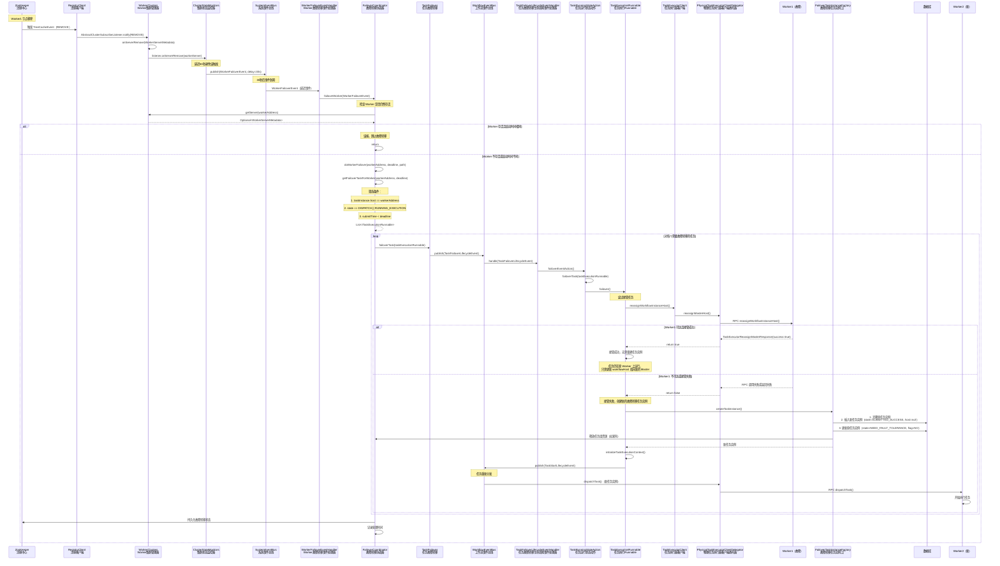
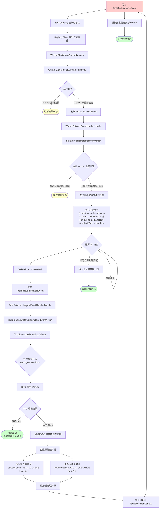
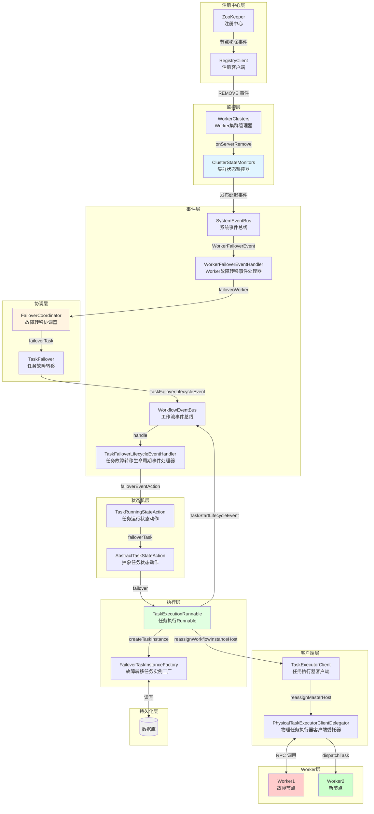
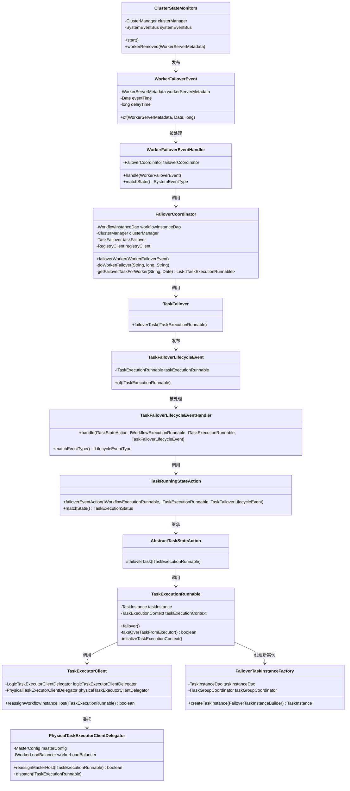
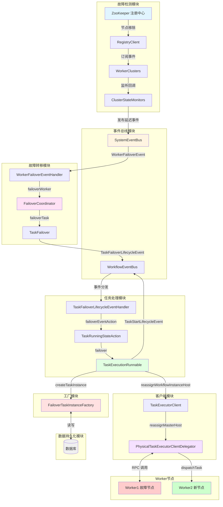
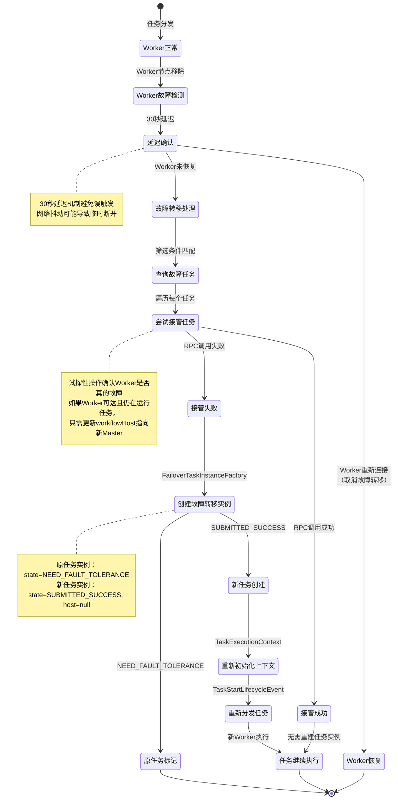
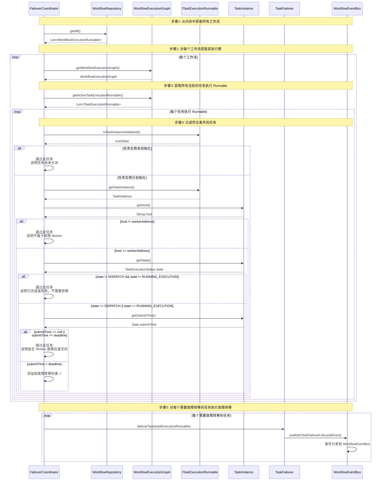
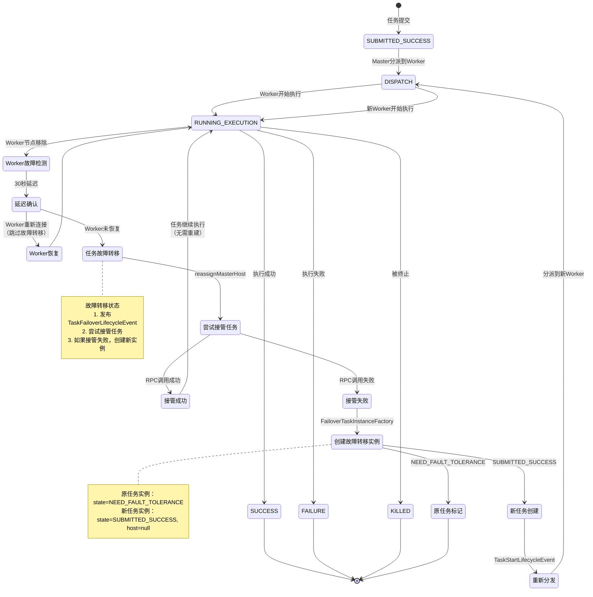

# Worker 故障容错详细分析

## 1. 概述

Worker 故障容错是 DolphinScheduler 高可用性的核心机制之一。当 Worker 节点故障时，Master 能够自动检测故障、转移任务并重新分发，确保任务的最终一致性。

### 1.1 核心设计原则

1. **关注点分离**：`ClusterStateMonitors` 仅负责监控与事件发布，不直接处理故障转移
2. **延迟机制**：30 秒延迟避免误触发（网络抖动导致临时断开）
3. **事件驱动**：使用 `SystemEventBus` 解耦监控与处理
4. **内存隔离**：每个 Master 只处理自己内存中的任务，通过内存隔离实现并发控制，而非分布式锁

### 1.2 故障容错流程概览

```
Worker 故障检测 → 延迟确认（30秒）→ 发布 WorkerFailoverEvent → 
查询需要故障转移的任务 → 尝试接管任务 → 创建故障转移任务实例 → 
重新分发任务 → 任务继续执行
```

## 2. 完整时序图



## 3. 完整流程详细说明

根据 `ClusterStateMonitors.workerRemoved()` 方法的注释，完整流程如下：

### 3.1 故障检测阶段

**步骤1：注册中心检测节点移除**
- 位置：[`ZookeeperTreeCacheListenerAdapter#childEvent(CuratorFramework, TreeCacheEvent)`](../../../../dolphinscheduler-plugin-registry/dolphinscheduler-registry-zookeeper/src/main/java/org/apache/dolphinscheduler/plugin/registry/zookeeper/ZookeeperTreeCacheListenerAdapter.java)
- 说明：ZooKeeper 的 TreeCache 监听器检测到 Worker 节点从注册中心移除

**步骤2：RegistryClient 触发订阅事件**
- 位置：[`AbstractClusterSubscribeListener#notify(Event)`](../../../../dolphinscheduler-plugin-registry/dolphinscheduler-registry-api/src/main/java/org/apache/dolphinscheduler/plugin/registry/api/listener/AbstractClusterSubscribeListener.java)
- 说明：将 ZooKeeper 事件转换为 DolphinScheduler 内部事件

**步骤3：WorkerClusters.onServerRemove() 被调用**
- 位置：[`WorkerClusters#onServerRemove(WorkerServerMetadata)`](../../../../dolphinscheduler-master/src/main/java/org/apache/dolphinscheduler/server/master/cluster/WorkerClusters.java)
- 说明：Worker 集群管理器处理服务器移除事件

**步骤4：遍历所有监听器，调用 listener.onServerRemove(workerServer)**
- 说明：通知所有注册的监听器 Worker 已被移除

**步骤5：ClusterStateMonitors.workerRemoved() 被触发**
- 位置：[`ClusterStateMonitors#workerRemoved(WorkerServerMetadata)`](../../../../dolphinscheduler-master/src/main/java/org/apache/dolphinscheduler/server/master/cluster/ClusterStateMonitors.java#L171)
- 说明：集群状态监控器收到 Worker 移除事件

### 3.2 延迟确认阶段（30秒）

**步骤6：发布 WorkerFailoverEvent（延迟30秒）**
- 位置：[`ClusterStateMonitors#workerRemoved()`](../../../../dolphinscheduler-master/src/main/java/org/apache/dolphinscheduler/server/master/cluster/ClusterStateMonitors.java#L171-L175)
- 说明：发布延迟事件，延迟时间为 30 秒。如果 Worker 在 30 秒内重新连接，事件将被取消
- 代码：
  ```java
  systemEventBus.publish(WorkerFailoverEvent.of(workerServer, new Date(), 30_000));
  ```

### 3.3 故障转移处理阶段

**步骤7：WorkerFailoverEventHandler.handle()**
- 位置：[`WorkerFailoverEventHandler#handle(WorkerFailoverEvent)`](../../../../dolphinscheduler-master/src/main/java/org/apache/dolphinscheduler/server/master/engine/system/event/WorkerFailoverEventHandler.java#L35-L36)
- 说明：事件处理器收到 Worker 故障转移事件，调用故障转移协调器

**步骤8：FailoverCoordinator.failoverWorker()**
- 位置：[`FailoverCoordinator#failoverWorker(WorkerFailoverEvent)`](../../../../dolphinscheduler-master/src/main/java/org/apache/dolphinscheduler/server/master/failover/FailoverCoordinator.java#L330-L355)
- 说明：检查 Worker 是否仍然存活（可能重新连接到了注册中心）
  - 如果 Worker 存活且启动时间相同，说明是误报，跳过故障转移
  - 如果 Worker 不存活或启动时间不同，执行故障转移

**步骤9：FailoverCoordinator.doWorkerFailover()**
- 位置：[`FailoverCoordinator#doWorkerFailover(String, long, String)`](../../../../dolphinscheduler-master/src/main/java/org/apache/dolphinscheduler/server/master/failover/FailoverCoordinator.java#L370-L401)
- 说明：执行 Worker 故障转移的核心逻辑

**步骤10：获取该 Worker 上的任务列表 (getFailoverTaskForWorker)**
- 位置：[`FailoverCoordinator#getFailoverTaskForWorker(String, Date)`](../../../../dolphinscheduler-master/src/main/java/org/apache/dolphinscheduler/server/master/failover/FailoverCoordinator.java#L420-L457)
- 筛选条件：
  1. 任务实例已初始化
  2. 任务的主机地址匹配指定的 Worker 地址
  3. 任务状态为 `DISPATCH`（已分派）或 `RUNNING_EXECUTION`（正在执行）
  4. 任务的提交时间在故障转移截止时间之前

**步骤11：TaskFailover.failoverTask() - 对每个任务**
- 位置：[`TaskFailover#failoverTask(ITaskExecutionRunnable)`](../../../../dolphinscheduler-master/src/main/java/org/apache/dolphinscheduler/server/master/failover/TaskFailover.java#L29-L33)
- 说明：对每个需要故障转移的任务执行故障转移

**步骤12：发布 TaskFailoverLifecycleEvent**
- 位置：[`TaskFailover#failoverTask()`](../../../../dolphinscheduler-master/src/main/java/org/apache/dolphinscheduler/server/master/failover/TaskFailover.java#L31)
- 说明：发布任务故障转移生命周期事件

**步骤13：TaskFailoverLifecycleEventHandler.handle()**
- 位置：[`TaskFailoverLifecycleEventHandler#handle()`](../../../../dolphinscheduler-master/src/main/java/org/apache/dolphinscheduler/server/master/engine/task/lifecycle/handler/TaskFailoverLifecycleEventHandler.java#L32-L37)
- 说明：处理任务故障转移事件，根据任务状态调用对应的 StateAction

### 3.4 任务状态处理阶段（只处理状态为 DISPATCH 或 RUNNING_EXECUTION 的任务）

**步骤14：TaskRunningStateAction.failoverEventAction()**
- 位置：[`TaskRunningStateAction#failoverEventAction()`](../../../../dolphinscheduler-master/src/main/java/org/apache/dolphinscheduler/server/master/engine/task/statemachine/TaskRunningStateAction.java#L133-L139)
- 说明：任务状态为 `RUNNING_EXECUTION` 时，调用故障转移处理
- 注意：只有状态为 `DISPATCH` 或 `RUNNING_EXECUTION` 的任务才会被处理，已完成或失败的任务不需要转移

**步骤15：AbstractTaskStateAction.failoverTask()**
- 位置：[`AbstractTaskStateAction#failoverTask(ITaskExecutionRunnable)`](../../../../dolphinscheduler-master/src/main/java/org/apache/dolphinscheduler/server/master/engine/task/statemachine/AbstractTaskStateAction.java#L225-L227)
- 说明：抽象任务状态动作的故障转移方法

**步骤16：TaskExecutionRunnable.failover()**
- 位置：[`TaskExecutionRunnable#failover()`](../../../../dolphinscheduler-master/src/main/java/org/apache/dolphinscheduler/server/master/engine/task/runnable/TaskExecutionRunnable.java#L294-L334)
- 说明：任务执行 Runnable 的故障转移方法

### 3.5 任务接管尝试阶段

**步骤17：takeOverTaskFromExecutor() - 最终调用这里！**
- 位置：[`TaskExecutionRunnable#takeOverTaskFromExecutor()`](../../../../dolphinscheduler-master/src/main/java/org/apache/dolphinscheduler/server/master/engine/task/runnable/TaskExecutionRunnable.java#L410-L422)
- 说明：尝试从执行器接管任务（重新分配工作流实例主机）
- 这是一个试探性操作，用于确认 Worker 是否真的故障

**步骤18：TaskExecutorClient.reassignWorkflowInstanceHost()**
- 位置：[`TaskExecutorClient#reassignWorkflowInstanceHost(ITaskExecutionRunnable)`](../../../../dolphinscheduler-master/src/main/java/org/apache/dolphinscheduler/server/master/engine/task/client/TaskExecutorClient.java#L64-L73)
- 说明：重新分配工作流实例主机

**步骤19：PhysicalTaskExecutorClientDelegator.reassignMasterHost()**
- 位置：[`PhysicalTaskExecutorClientDelegator#reassignMasterHost(ITaskExecutionRunnable)`](../../../../dolphinscheduler-master/src/main/java/org/apache/dolphinscheduler/server/master/engine/task/client/PhysicalTaskExecutorClientDelegator.java#L107-L159)
- 说明：通过 RPC 调用 Worker，尝试重新分配 Master 主机地址
- 返回值：
  - **true**：Worker 可达且接管成功，任务仍在原 Worker 上运行，只需更新 workflowHost 指向新的 Master
  - **false**：Worker 不可达或接管失败，需要创建新的故障转移任务实例

### 3.6 故障转移任务实例创建阶段

**步骤20：返回 false，没有 Worker 接管，生成容错恢复任务实例**
- 位置：[`TaskExecutionRunnable#failover()`](../../../../dolphinscheduler-master/src/main/java/org/apache/dolphinscheduler/server/master/engine/task/runnable/TaskExecutionRunnable.java#L303-L306)
- 说明：如果接管失败（`takeOverTaskFromExecutor()` 返回 false），需要创建新的故障转移任务实例

**步骤21：FailoverTaskInstanceFactory.createTaskInstance()**
- 位置：[`FailoverTaskInstanceFactory#createTaskInstance(FailoverTaskInstanceBuilder)`](../../../../dolphinscheduler-master/src/main/java/org/apache/dolphinscheduler/server/master/engine/task/runnable/FailoverTaskInstanceFactory.java#L47-L69)
- 处理逻辑：
  1. 克隆原任务实例
  2. **新任务实例**：
     - `id = null`（新实例）
     - `state = SUBMITTED_SUCCESS`
     - `host = null`
     - `varPool = null`
     - `logPath = null`
     - `executePath = null`
  3. **原任务实例**：
     - `state = NEED_FAULT_TOLERANCE`
     - `flag = NO`
  4. 释放任务组资源（如果有）

### 3.7 任务重新执行阶段

**步骤22：重新初始化 TaskExecutionContext**
- 位置：[`TaskExecutionRunnable#initializeTaskExecutionContext()`](../../../../dolphinscheduler-master/src/main/java/org/apache/dolphinscheduler/server/master/engine/task/runnable/TaskExecutionRunnable.java#L399-L414)
- 说明：因为 taskInstance 已变化，需要重新初始化任务执行上下文

**步骤23：发布 TaskStartLifecycleEvent**
- 位置：[`TaskExecutionRunnable#failover()`](../../../../dolphinscheduler-master/src/main/java/org/apache/dolphinscheduler/server/master/engine/task/runnable/TaskExecutionRunnable.java#L333)
- 说明：发布任务启动生命周期事件，触发任务重新执行

**步骤24：任务重新分发**
- 位置：[`PhysicalTaskExecutorClientDelegator#dispatch(ITaskExecutionRunnable)`](../../../../dolphinscheduler-master/src/main/java/org/apache/dolphinscheduler/server/master/engine/task/client/PhysicalTaskExecutorClientDelegator.java#L65-L96)
- 说明：通过负载均衡器选择新的 Worker，重新分发任务
- 注意：
  - 不是其他 Worker 主动"接管"，而是 Master 重新分派任务到其他 Worker
  - 故障 Worker 会被自动排除（从注册中心移除或状态非 NORMAL）
  - 通过负载均衡器从正常 Worker 中选择一个进行分派
  - 新任务实例的 host 字段会被更新为选中的 Worker 地址

## 4. 完整流程图



## 5. 组件交互图



## 6. 类图



## 7. 架构图



## 8. 状态流转图



## 9. 标记为需要故障转移的条件和流程

### 9.1 需要故障转移的任务状态

根据 `FailoverCoordinator.getFailoverTaskForWorker()` 方法的过滤条件，以下状态的 Task 需要故障转移：

| 状态码 | 状态名称 | 说明 |
|--------|---------|------|
| 17 | DISPATCH | 任务已分派到 Worker，但尚未开始执行 |
| 1 | RUNNING_EXECUTION | 任务正在 Worker 上执行中 |

**判断逻辑**：
- 这些状态都是**非终态**（未完成）状态
- 如果 Worker 故障，这些任务无法继续执行，需要被故障转移
- **已完成或失败的任务**（如 `SUCCESS`、`FAILURE`、`KILLED`、`PAUSED`）不需要故障转移

**代码位置**：
- 状态过滤：[`FailoverCoordinator#getFailoverTaskForWorker()`](../../../../dolphinscheduler-master/src/main/java/org/apache/dolphinscheduler/server/master/failover/FailoverCoordinator.java#L443-L446)

### 9.2 任务故障转移判断流程



### 9.3 关键判断条件说明

**1. 任务实例初始化检查（isTaskInstanceInitialized）**
```java
// FailoverCoordinator.getFailoverTaskForWorker() 第437行
.filter(ITaskExecutionRunnable::isTaskInstanceInitialized)
```
- **目的**：确保任务已经初始化，存在 `TaskInstance`
- **原因**：只有已初始化的任务才会被分派到 Worker
- **过滤条件**：如果 `taskInstance == null` 或未初始化，跳过该任务

**2. 主机地址匹配（host == workerAddress）**
```java
// FailoverCoordinator.getFailoverTaskForWorker() 第439-440行
.filter(taskExecutionRunnable -> workerAddress
        .equals(taskExecutionRunnable.getTaskInstance().getHost()))
```
- **目的**：只故障转移分派到故障 Worker 的任务
- **原因**：其他 Worker 上的任务不受影响，不需要转移
- **过滤条件**：`taskInstance.getHost()` 必须等于故障 Worker 地址

**3. 任务状态过滤（DISPATCH 或 RUNNING_EXECUTION）**
```java
// FailoverCoordinator.getFailoverTaskForWorker() 第443-446行
.filter(taskExecutionRunnable -> {
    final TaskExecutionStatus state = taskExecutionRunnable.getTaskInstance().getState();
    return state == TaskExecutionStatus.DISPATCH || state == TaskExecutionStatus.RUNNING_EXECUTION;
})
```
- **目的**：只故障转移正在执行或已分派但未完成的任务
- **原因**：
  - `DISPATCH`：任务已分派但尚未开始执行
  - `RUNNING_EXECUTION`：任务正在执行中
  - `SUCCESS`、`FAILURE`、`KILLED`、`PAUSED`：已完成或失败，不需要转移
- **过滤条件**：状态必须是 `DISPATCH` 或 `RUNNING_EXECUTION`

**4. 提交时间判断（submitTime < deadline）**
```java
// FailoverCoordinator.getFailoverTaskForWorker() 第449-452行
.filter(taskExecutionRunnable -> {
    final Date submitTime = taskExecutionRunnable.getTaskInstance().getSubmitTime();
    return submitTime != null && submitTime.before(taskFailoverDeadline);
})
```
- **目的**：只故障转移在 Worker 故障时间点**之前**提交的任务
- **原因**：在 Worker 故障后提交的任务可能状态异常，不应该被故障转移
- **过滤条件**：`submitTime != null` 且 `submitTime < taskFailoverDeadline`
- **deadline 计算**：
  - 如果 Worker 已重连：使用 Worker 的启动时间
  - 如果 Worker 未重连：使用故障事件的时间（30秒延迟后的时间）

**5. 内存隔离检查（workflowRepository.getAll()）**
```java
// FailoverCoordinator.getFailoverTaskForWorker() 第430行
return workflowRepository.getAll()
```
- **目的**：每个 Master 只处理自己内存中的任务
- **原因**：
  - 每个 Master 只管理自己负责的工作流实例
  - 通过内存隔离实现并发控制，而不是分布式锁
- **过滤条件**：只查询当前 Master 内存中的工作流

**代码位置**：
- 完整过滤逻辑：[`FailoverCoordinator#getFailoverTaskForWorker()`](../../../../dolphinscheduler-master/src/main/java/org/apache/dolphinscheduler/server/master/failover/FailoverCoordinator.java#L420-L454)

### 9.4 任务故障转移的完整生命周期



### 9.5 故障转移触发场景总结

| 场景 | 触发方式 | 判断条件 | 处理方式 |
|------|---------|---------|---------|
| **Worker故障** | WorkerFailoverEvent | 1. 任务实例已初始化<br/>2. host = 故障Worker<br/>3. state == DISPATCH \|\| RUNNING_EXECUTION<br/>4. submitTime < deadline | 发布TaskFailoverLifecycleEvent，尝试接管或重建任务实例 |
| **Worker重连** | WorkerFailoverEvent延迟检查 | Worker存活且启动时间相同 | 跳过故障转移 |
| **任务已完成** | 状态过滤 | state != DISPATCH && state != RUNNING_EXECUTION | 跳过故障转移 |
| **任务未初始化** | 初始化检查 | !isTaskInstanceInitialized() | 跳过故障转移 |
| **任务不属于故障Worker** | 主机地址过滤 | host != workerAddress | 跳过故障转移 |
| **任务在故障后提交** | 时间过滤 | submitTime >= deadline | 跳过故障转移 |

### 9.6 Worker 故障转移处理对象与 Master 的区别

#### 9.6.1 处理对象对比

| 故障类型 | 处理对象 | 数据来源 | 处理方式 | 说明 |
|---------|---------|---------|---------|------|
| **Master 故障转移** | **工作流实例（WorkflowInstance）** | 数据库查询 | 标记为 FAILOVER，插入恢复 Command | Master 负责工作流的调度和管理 |
| **Worker 故障转移** | **任务实例（TaskInstance）** | 内存中运行的任务 | 发布 TaskFailoverLifecycleEvent | Worker 只负责执行任务 |

#### 9.6.2 Master 故障转移处理工作流的原因

**Master 的职责**：
- Master 负责工作流的**调度、管理和监控**
- 工作流实例存储在数据库中，由 Master 负责维护其生命周期
- 当 Master 故障时，其负责的所有工作流都需要被其他 Master 接管

**处理流程**：
1. **查询工作流**：从数据库查询该 Master 负责的所有未完成的工作流
   ```java
   // FailoverCoordinator.getFailoverWorkflowsForMaster()
   workflowInstanceDao.queryNeedFailoverWorkflowInstances(masterAddress)
   ```

2. **标记工作流**：将工作流状态更新为 `FAILOVER`
   ```java
   // WorkflowFailover.failoverWorkflow()
   workflowInstanceDao.updateWorkflowInstanceState(id, originalState, FAILOVER)
   ```

3. **插入恢复命令**：插入 `RECOVER_TOLERANCE_FAULT_PROCESS` 类型的 Command
   ```java
   // WorkflowFailover.failoverWorkflow()
   commandDao.insert(Command.builder()
       .commandType(RECOVER_TOLERANCE_FAULT_PROCESS)
       .workflowInstanceId(workflowInstance.getId())
       .build())
   ```

4. **后续处理**：CommandEngine 会处理恢复命令，重新调度工作流执行
   - 工作流恢复后，其中的任务会重新被调度到可用的 Worker 执行
   - **任务实例的故障转移在工作流恢复时自动处理**

#### 9.6.3 Worker 故障转移只处理任务的原因

**Worker 的职责**：
- Worker 只负责**执行任务**，不管理工作流
- 任务实例在内存中运行，由 Master 监控和管理
- 当 Worker 故障时，只需要将该 Worker 正在执行的任务转移到其他 Worker

**处理流程**：
1. **查询任务**：从内存中查询该 Worker 正在执行的所有任务
   ```java
   // FailoverCoordinator.getFailoverTaskForWorker()
   workflowRepository.getAll()
       .stream()
       .flatMap(graph -> graph.getActiveTaskExecutionRunnable().stream())
       .filter(task -> workerAddress.equals(task.getTaskInstance().getHost()))
       .filter(task -> task.getState() == DISPATCH || task.getState() == RUNNING_EXECUTION)
   ```

2. **发布任务故障转移事件**：为每个任务发布 `TaskFailoverLifecycleEvent`
   ```java
   // TaskFailover.failoverTask()
   taskExecutionRunnable.getWorkflowEventBus().publish(TaskFailoverLifecycleEvent.of(taskExecutionRunnable))
   ```

3. **任务重新调度**：任务状态机处理故障转移事件，将任务重新调度到其他 Worker
   - 任务会重新进入调度队列，等待分配到可用的 Worker
   - **工作流不受影响，继续运行**

#### 9.6.4 为什么 Master 故障转移不直接处理任务？

**原因分析**：

1. **工作流是管理单元**：
   - 工作流是任务的组织单元，Master 管理的是工作流级别
   - 工作流故障转移后，其中的任务会在工作流恢复时自动重新调度

2. **数据一致性**：
   - 工作流状态存储在数据库中，需要统一管理
   - 如果直接处理任务，可能导致工作流状态不一致

3. **恢复粒度**：
   - 工作流级别的恢复可以保证整个工作流的完整性
   - 任务级别的恢复可能无法保证工作流的状态一致性

4. **简化设计**：
   - 工作流恢复时，CommandEngine 会重新解析 DAG 并调度任务
   - 这样可以确保任务调度的正确性和一致性

#### 9.6.5 总结

```mermaid
graph TB
    subgraph "Master故障转移"
        A[Master故障] --> B[查询工作流实例]
        B --> C[标记工作流为FAILOVER]
        C --> D[插入恢复Command]
        D --> E[CommandEngine处理]
        E --> F[重新调度工作流]
        F --> G[工作流中的任务自动重新调度]
    end
    
    subgraph "Worker故障转移"
        H[Worker故障] --> I[查询任务实例]
        I --> J[发布TaskFailoverLifecycleEvent]
        J --> K[任务状态机处理]
        K --> L[任务重新调度到其他Worker]
        L --> M[工作流继续运行]
    end
    
    style A fill:#ffcccc
    style H fill:#ccffcc
    style C fill:#ffffcc
    style J fill:#ffffcc
```



**关键区别**：
- **Master 故障转移**：工作流级别 → 数据库持久化 → 通过 Command 恢复 → 任务自动重新调度
- **Worker 故障转移**：任务级别 → 内存中处理 → 直接重新调度 → 工作流不受影响

## 10. 场景分析与处理方案

### 9.1 场景1：网络抖动导致临时断开

**场景描述**：
- Worker 因网络抖动临时断开与 ZooKeeper 的连接
- 30 秒内 Worker 重新连接
- 任务实际仍在 Worker 上正常执行

**处理方案**：
1. **延迟确认机制**：`ClusterStateMonitors.workerRemoved()` 发布延迟 30 秒的 `WorkerFailoverEvent`
2. **事件取消**：如果 Worker 在 30 秒内重新连接，延迟事件可以被取消
3. **启动时间检查**：`FailoverCoordinator.failoverWorker()` 检查 Worker 是否存活且启动时间相同
4. **跳过故障转移**：如果是误报（网络抖动），跳过故障转移

**代码位置**：
- 延迟确认：[`ClusterStateMonitors#workerRemoved()`](../../../../dolphinscheduler-master/src/main/java/org/apache/dolphinscheduler/server/master/cluster/ClusterStateMonitors.java#L171-L175)
- 启动时间检查：[`FailoverCoordinator#failoverWorker()`](../../../../dolphinscheduler-master/src/main/java/org/apache/dolphinscheduler/server/master/failover/FailoverCoordinator.java#L338-L346)

### 9.2 场景2：Worker 进程崩溃

**场景描述**：
- Worker 进程因异常崩溃
- 30 秒内 Worker 未恢复
- 任务状态为 `DISPATCH` 或 `RUNNING_EXECUTION`

**处理方案**：
1. **故障检测**：ZooKeeper 检测到节点移除，触发故障转移流程
2. **任务查询**：从 Master 内存中查询状态为 `DISPATCH` 或 `RUNNING_EXECUTION` 且 host 匹配故障 Worker 的任务
3. **接管尝试**：尝试通过 RPC 调用 Worker，确认 Worker 是否真的故障
4. **创建新实例**：如果接管失败，创建新的故障转移任务实例
5. **重新分发**：通过负载均衡器选择新的 Worker，重新分发任务

**代码位置**：
- 任务查询：[`FailoverCoordinator#getFailoverTaskForWorker()`](../../../../dolphinscheduler-master/src/main/java/org/apache/dolphinscheduler/server/master/failover/FailoverCoordinator.java#L420-L457)
- 创建新实例：[`FailoverTaskInstanceFactory#createTaskInstance()`](../../../../dolphinscheduler-master/src/main/java/org/apache/dolphinscheduler/server/master/engine/task/runnable/FailoverTaskInstanceFactory.java#L47-L69)

### 9.3 场景3：Worker 正常但任务已失败

**场景描述**：
- Worker 正常运行
- 任务执行失败，状态为 `FAILURE`
- 不应触发故障转移

**处理方案**：
1. **状态过滤**：`getFailoverTaskForWorker()` 只筛选状态为 `DISPATCH` 或 `RUNNING_EXECUTION` 的任务
2. **已完成任务排除**：状态为 `SUCCESS`、`FAILURE`、`KILLED`、`PAUSED` 的任务不会被故障转移
3. **原任务标记**：如果任务已在失败状态，不需要故障转移

**代码位置**：
- 状态过滤：[`FailoverCoordinator#getFailoverTaskForWorker()`](../../../../dolphinscheduler-master/src/main/java/org/apache/dolphinscheduler/server/master/failover/FailoverCoordinator.java#L426-L429)

### 9.4 场景4：任务已在 Worker 上执行，Worker 故障但任务快完成

**场景描述**：
- 任务已在 Worker 上执行，接近完成
- Worker 突然故障
- 任务进度丢失

**处理方案**：
1. **接管尝试**：尝试通过 RPC 调用 Worker，确认 Worker 是否真的故障
2. **如果 Worker 可达**：说明 Worker 恢复正常，只需更新 workflowHost
3. **如果 Worker 不可达**：创建新的故障转移任务实例，重新执行
4. **任务幂等性**：如果任务支持幂等性，重新执行不会产生副作用；否则可能需要从检查点恢复

**代码位置**：
- 接管尝试：[`TaskExecutionRunnable#takeOverTaskFromExecutor()`](../../../../dolphinscheduler-master/src/main/java/org/apache/dolphinscheduler/server/master/engine/task/runnable/TaskExecutionRunnable.java#L410-L422)
- RPC 调用：[`PhysicalTaskExecutorClientDelegator#reassignMasterHost()`](../../../../dolphinscheduler-master/src/main/java/org/apache/dolphinscheduler/server/master/engine/task/client/PhysicalTaskExecutorClientDelegator.java#L107-L159)

### 9.5 场景5：多个 Master 同时检测到 Worker 故障

**场景描述**：
- 多个 Master 节点同时运行
- 所有 Master 都检测到同一个 Worker 故障
- 可能导致重复处理

**处理方案**：
1. **内存隔离**：每个 Master 只处理自己内存中的任务（`workflowRepository.getAll()`）
2. **工作流唯一性**：每个工作流实例只由一个 Master 管理（通过 Command 的唯一性保证）
3. **任务唯一性**：任务属于工作流实例，因此任务也只由一个 Master 处理
4. **无分布式锁**：通过内存隔离实现并发控制，而不是分布式锁
5. **原任务标记**：原任务实例被标记为 `NEED_FAULT_TOLERANCE`，不会被重复处理

**代码位置**：
- 内存查询：[`FailoverCoordinator#getFailoverTaskForWorker()`](../../../../dolphinscheduler-master/src/main/java/org/apache/dolphinscheduler/server/master/failover/FailoverCoordinator.java#L430-L431)
- 原任务标记：[`FailoverTaskInstanceFactory#createTaskInstance()`](../../../../dolphinscheduler-master/src/main/java/org/apache/dolphinscheduler/server/master/engine/task/runnable/FailoverTaskInstanceFactory.java#L65-L67)

### 9.6 场景6：任务组资源占用

**场景描述**：
- 任务使用了任务组资源
- Worker 故障需要故障转移
- 需要释放任务组资源

**处理方案**：
1. **资源释放检查**：`FailoverTaskInstanceFactory.createTaskInstance()` 检查是否需要释放任务组资源
2. **资源释放**：如果任务使用了任务组，调用 `taskGroupCoordinator.releaseTaskGroupSlot()` 释放资源
3. **新任务重新申请**：新任务实例可以重新申请任务组资源

**代码位置**：
- 资源释放：[`FailoverTaskInstanceFactory#createTaskInstance()`](../../../../dolphinscheduler-master/src/main/java/org/apache/dolphinscheduler/server/master/engine/task/runnable/FailoverTaskInstanceFactory.java#L61-L63)

## 11. 关键设计点

### 10.1 延迟确认机制

**设计原因**：
- 避免网络抖动导致的误触发
- 给 Worker 足够的时间重新连接注册中心
- 减少不必要的故障转移操作

**实现方式**：
- `ClusterStateMonitors.workerRemoved()` 发布延迟 30 秒的 `WorkerFailoverEvent`
- 使用 `SystemEventBus`（`DelayQueue`）实现延迟事件
- 如果 Worker 在延迟期间重新连接，事件可以被取消或忽略

**代码位置**：
- 延迟发布：[`ClusterStateMonitors#workerRemoved()`](../../../../dolphinscheduler-master/src/main/java/org/apache/dolphinscheduler/server/master/cluster/ClusterStateMonitors.java#L171-L175)

### 10.2 试探性接管机制

**设计原因**：
- 确认 Worker 是否真的故障
- 避免不必要的任务重建
- 如果 Worker 仍然可达，只需更新 workflowHost

**实现方式**：
- `TaskExecutionRunnable.takeOverTaskFromExecutor()` 尝试通过 RPC 调用 Worker
- 调用 `PhysicalTaskExecutorClientDelegator.reassignMasterHost()` 更新 workflowHost
- 如果 RPC 调用成功，说明 Worker 可达，任务仍在运行
- 如果 RPC 调用失败，说明 Worker 不可达，需要创建新实例

**代码位置**：
- 接管尝试：[`TaskExecutionRunnable#takeOverTaskFromExecutor()`](../../../../dolphinscheduler-master/src/main/java/org/apache/dolphinscheduler/server/master/engine/task/runnable/TaskExecutionRunnable.java#L410-L422)
- RPC 调用：[`PhysicalTaskExecutorClientDelegator#reassignMasterHost()`](../../../../dolphinscheduler-master/src/main/java/org/apache/dolphinscheduler/server/master/engine/task/client/PhysicalTaskExecutorClientDelegator.java#L107-L159)

### 10.3 内存隔离并发控制

**设计原因**：
- 多个 Master 可能同时检测到 Worker 故障
- 避免分布式锁的性能开销
- 利用 Master 的工作流分配机制实现并发控制

**实现方式**：
- 每个 Master 只处理自己内存中的任务（`workflowRepository.getAll()`）
- 每个工作流实例只由一个 Master 管理（通过 Command 的唯一性保证）
- 任务属于工作流实例，因此任务也只由一个 Master 处理
- 原任务实例被标记为 `NEED_FAULT_TOLERANCE`，不会被重复处理

**代码位置**：
- 内存查询：[`FailoverCoordinator#getFailoverTaskForWorker()`](../../../../dolphinscheduler-master/src/main/java/org/apache/dolphinscheduler/server/master/failover/FailoverCoordinator.java#L430-L431)
- 原任务标记：[`FailoverTaskInstanceFactory#createTaskInstance()`](../../../../dolphinscheduler-master/src/main/java/org/apache/dolphinscheduler/server/master/engine/task/runnable/FailoverTaskInstanceFactory.java#L65-L67)

### 10.4 任务状态过滤

**设计原因**：
- 只故障转移正在执行的任务
- 已完成或失败的任务不需要转移
- 避免不必要的操作

**实现方式**：
- `getFailoverTaskForWorker()` 只筛选状态为 `DISPATCH` 或 `RUNNING_EXECUTION` 的任务
- 状态为 `SUCCESS`、`FAILURE`、`KILLED`、`PAUSED` 的任务不会被故障转移

**代码位置**：
- 状态过滤：[`FailoverCoordinator#getFailoverTaskForWorker()`](../../../../dolphinscheduler-master/src/main/java/org/apache/dolphinscheduler/server/master/failover/FailoverCoordinator.java#L426-L429)

### 10.5 任务实例克隆与标记

**设计原因**：
- 保留原任务实例的历史信息
- 新任务实例可以重新执行
- 通过状态区分原任务和新任务

**实现方式**：
- **原任务实例**：
  - `state = NEED_FAULT_TOLERANCE`
  - `flag = NO`（标记为不可用）
- **新任务实例**：
  - `id = null`（新实例）
  - `state = SUBMITTED_SUCCESS`
  - `host = null`（待重新分发）
  - `varPool = null`（重新初始化）
  - `logPath = null`（重新生成）
  - `executePath = null`（重新生成）

**代码位置**：
- 实例创建：[`FailoverTaskInstanceFactory#createTaskInstance()`](../../../../dolphinscheduler-master/src/main/java/org/apache/dolphinscheduler/server/master/engine/task/runnable/FailoverTaskInstanceFactory.java#L47-L69)

## 12. 关键代码链接

### 11.1 故障检测

- **ClusterStateMonitors**: [`ClusterStateMonitors.java`](../../../../dolphinscheduler-master/src/main/java/org/apache/dolphinscheduler/server/master/cluster/ClusterStateMonitors.java)
  - `workerRemoved()`: [第171行](../../../../dolphinscheduler-master/src/main/java/org/apache/dolphinscheduler/server/master/cluster/ClusterStateMonitors.java#L171-L175)

### 11.2 故障转移处理

- **WorkerFailoverEventHandler**: [`WorkerFailoverEventHandler.java`](../../../../dolphinscheduler-master/src/main/java/org/apache/dolphinscheduler/server/master/engine/system/event/WorkerFailoverEventHandler.java)
  - `handle()`: [第35-36行](../../../../dolphinscheduler-master/src/main/java/org/apache/dolphinscheduler/server/master/engine/system/event/WorkerFailoverEventHandler.java#L35-L36)

- **FailoverCoordinator**: [`FailoverCoordinator.java`](../../../../dolphinscheduler-master/src/main/java/org/apache/dolphinscheduler/server/master/failover/FailoverCoordinator.java)
  - `failoverWorker()`: [第330-355行](../../../../dolphinscheduler-master/src/main/java/org/apache/dolphinscheduler/server/master/failover/FailoverCoordinator.java#L330-L355)
  - `doWorkerFailover()`: [第370-401行](../../../../dolphinscheduler-master/src/main/java/org/apache/dolphinscheduler/server/master/failover/FailoverCoordinator.java#L370-L401)
  - `getFailoverTaskForWorker()`: [第420-457行](../../../../dolphinscheduler-master/src/main/java/org/apache/dolphinscheduler/server/master/failover/FailoverCoordinator.java#L420-L457)

### 11.3 任务故障转移

- **TaskFailover**: [`TaskFailover.java`](../../../../dolphinscheduler-master/src/main/java/org/apache/dolphinscheduler/server/master/failover/TaskFailover.java)
  - `failoverTask()`: [第29-33行](../../../../dolphinscheduler-master/src/main/java/org/apache/dolphinscheduler/server/master/failover/TaskFailover.java#L29-L33)

- **TaskFailoverLifecycleEventHandler**: [`TaskFailoverLifecycleEventHandler.java`](../../../../dolphinscheduler-master/src/main/java/org/apache/dolphinscheduler/server/master/engine/task/lifecycle/handler/TaskFailoverLifecycleEventHandler.java)
  - `handle()`: [第32-37行](../../../../dolphinscheduler-master/src/main/java/org/apache/dolphinscheduler/server/master/engine/task/lifecycle/handler/TaskFailoverLifecycleEventHandler.java#L32-L37)

### 11.4 任务状态处理

- **TaskRunningStateAction**: [`TaskRunningStateAction.java`](../../../../dolphinscheduler-master/src/main/java/org/apache/dolphinscheduler/server/master/engine/task/statemachine/TaskRunningStateAction.java)
  - `failoverEventAction()`: [第133-139行](../../../../dolphinscheduler-master/src/main/java/org/apache/dolphinscheduler/server/master/engine/task/statemachine/TaskRunningStateAction.java#L133-L139)

- **AbstractTaskStateAction**: [`AbstractTaskStateAction.java`](../../../../dolphinscheduler-master/src/main/java/org/apache/dolphinscheduler/server/master/engine/task/statemachine/AbstractTaskStateAction.java)
  - `failoverTask()`: [第225-227行](../../../../dolphinscheduler-master/src/main/java/org/apache/dolphinscheduler/server/master/engine/task/statemachine/AbstractTaskStateAction.java#L225-L227)

### 11.5 任务接管与重建

- **TaskExecutionRunnable**: [`TaskExecutionRunnable.java`](../../../../dolphinscheduler-master/src/main/java/org/apache/dolphinscheduler/server/master/engine/task/runnable/TaskExecutionRunnable.java)
  - `failover()`: [第294-334行](../../../../dolphinscheduler-master/src/main/java/org/apache/dolphinscheduler/server/master/engine/task/runnable/TaskExecutionRunnable.java#L294-L334)
  - `takeOverTaskFromExecutor()`: [第410-422行](../../../../dolphinscheduler-master/src/main/java/org/apache/dolphinscheduler/server/master/engine/task/runnable/TaskExecutionRunnable.java#L410-L422)
  - `initializeTaskExecutionContext()`: [第399-414行](../../../../dolphinscheduler-master/src/main/java/org/apache/dolphinscheduler/server/master/engine/task/runnable/TaskExecutionRunnable.java#L399-L414)

### 11.6 客户端调用

- **TaskExecutorClient**: [`TaskExecutorClient.java`](../../../../dolphinscheduler-master/src/main/java/org/apache/dolphinscheduler/server/master/engine/task/client/TaskExecutorClient.java)
  - `reassignWorkflowInstanceHost()`: [第64-73行](../../../../dolphinscheduler-master/src/main/java/org/apache/dolphinscheduler/server/master/engine/task/client/TaskExecutorClient.java#L64-L73)

- **PhysicalTaskExecutorClientDelegator**: [`PhysicalTaskExecutorClientDelegator.java`](../../../../dolphinscheduler-master/src/main/java/org/apache/dolphinscheduler/server/master/engine/task/client/PhysicalTaskExecutorClientDelegator.java)
  - `reassignMasterHost()`: [第107-159行](../../../../dolphinscheduler-master/src/main/java/org/apache/dolphinscheduler/server/master/engine/task/client/PhysicalTaskExecutorClientDelegator.java#L107-L159)
  - `dispatch()`: [第65-96行](../../../../dolphinscheduler-master/src/main/java/org/apache/dolphinscheduler/server/master/engine/task/client/PhysicalTaskExecutorClientDelegator.java#L65-L96)

### 11.7 任务实例工厂

- **FailoverTaskInstanceFactory**: [`FailoverTaskInstanceFactory.java`](../../../../dolphinscheduler-master/src/main/java/org/apache/dolphinscheduler/server/master/engine/task/runnable/FailoverTaskInstanceFactory.java)
  - `createTaskInstance()`: [第47-69行](../../../../dolphinscheduler-master/src/main/java/org/apache/dolphinscheduler/server/master/engine/task/runnable/FailoverTaskInstanceFactory.java#L47-L69)

## 13. 总结

Worker 故障容错机制是 DolphinScheduler 高可用性的重要保障。通过延迟确认、试探性接管、内存隔离、状态过滤等设计，实现了高效、可靠的故障转移。

**核心流程**：
1. **故障检测**：ZooKeeper 检测节点移除，触发故障转移流程
2. **延迟确认**：30 秒延迟避免误触发（网络抖动）
3. **任务查询**：从 Master 内存中查询需要故障转移的任务
4. **接管尝试**：尝试通过 RPC 调用 Worker，确认 Worker 是否真的故障
5. **实例创建**：如果接管失败，创建新的故障转移任务实例
6. **重新分发**：通过负载均衡器选择新的 Worker，重新分发任务

**关键设计点**：
- **延迟确认机制**：避免网络抖动导致的误触发
- **试探性接管机制**：确认 Worker 是否真的故障，避免不必要的任务重建
- **内存隔离并发控制**：通过内存隔离实现并发控制，而不是分布式锁
- **任务状态过滤**：只故障转移正在执行的任务
- **任务实例克隆与标记**：保留原任务实例的历史信息，新任务实例可以重新执行

通过这些机制，DolphinScheduler 能够有效处理 Worker 故障，确保任务的最终一致性和系统的高可用性。

