# 工作流事件总线协调器原理分析

## 1. 概述

工作流事件总线协调器（`WorkflowEventBusCoordinator`）是 DolphinScheduler Master 节点中负责协调和管理工作流事件处理的核心组件。它采用**事件驱动架构**和**多线程轮询机制**，实现了工作流生命周期事件的异步处理和分发。

### 1.1 核心职责

1. **事件总线管理**：为每个工作流实例维护独立的事件总线（`WorkflowEventBus`）
2. **工作流注册**：将工作流执行任务（`IWorkflowExecutionRunnable`）注册到对应的工作线程
3. **事件分发**：通过多个工作线程（`WorkflowEventBusFireWorker`）定期轮询并触发事件处理
4. **负载均衡**：根据工作流实例ID进行哈希分片，将工作流分配到不同的工作线程

### 1.2 设计目标

- **解耦**：事件发布者与处理者解耦，通过事件总线进行通信
- **异步**：事件处理异步化，不阻塞工作流执行主流程
- **可扩展**：支持多线程并发处理，提高事件处理吞吐量
- **可靠性**：支持延迟事件和事件重试机制

## 2. 核心组件架构

### 2.1 组件层次结构

```
WorkflowEngine
    └── WorkflowEventBusCoordinator (协调器)
            └── WorkflowEventBusFireWorkers (工作线程池管理器)
                    └── WorkflowEventBusFireWorker[] (工作线程数组)
                            ├── registeredWorkflowExecuteRunnableMap (已注册工作流映射)
                            └── eventHandlerMap (事件处理器映射)
```

### 2.2 关键类说明

| 类名 | 职责 |
|------|------|
| `WorkflowEventBusCoordinator` | 协调器，负责工作流的注册/注销和Worker管理 |
| `WorkflowEventBusFireWorkers` | 工作线程池管理器，创建和管理多个Worker |
| `WorkflowEventBusFireWorker` | 工作线程，负责轮询并触发事件处理 |
| `WorkflowEventBus` | 事件总线，基于DelayQueue实现延迟事件队列 |
| `ILifecycleEventHandler` | 事件处理器接口，处理特定类型的事件 |
| `AbstractLifecycleEvent` | 生命周期事件抽象基类 |

## 3. 时序图

### 3.1 系统启动时序

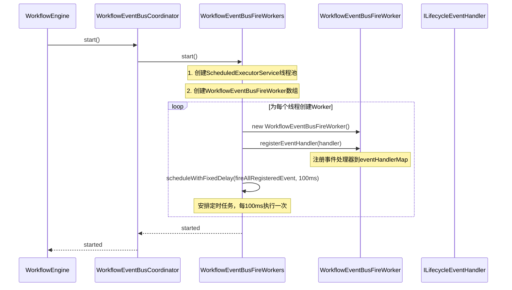

### 3.2 工作流注册时序

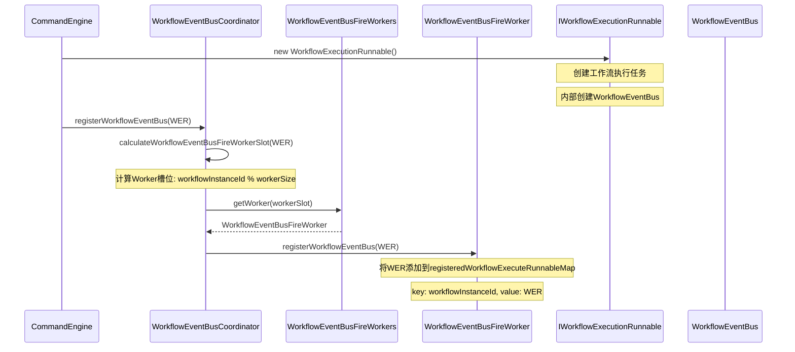

### 3.3 事件发布与处理时序

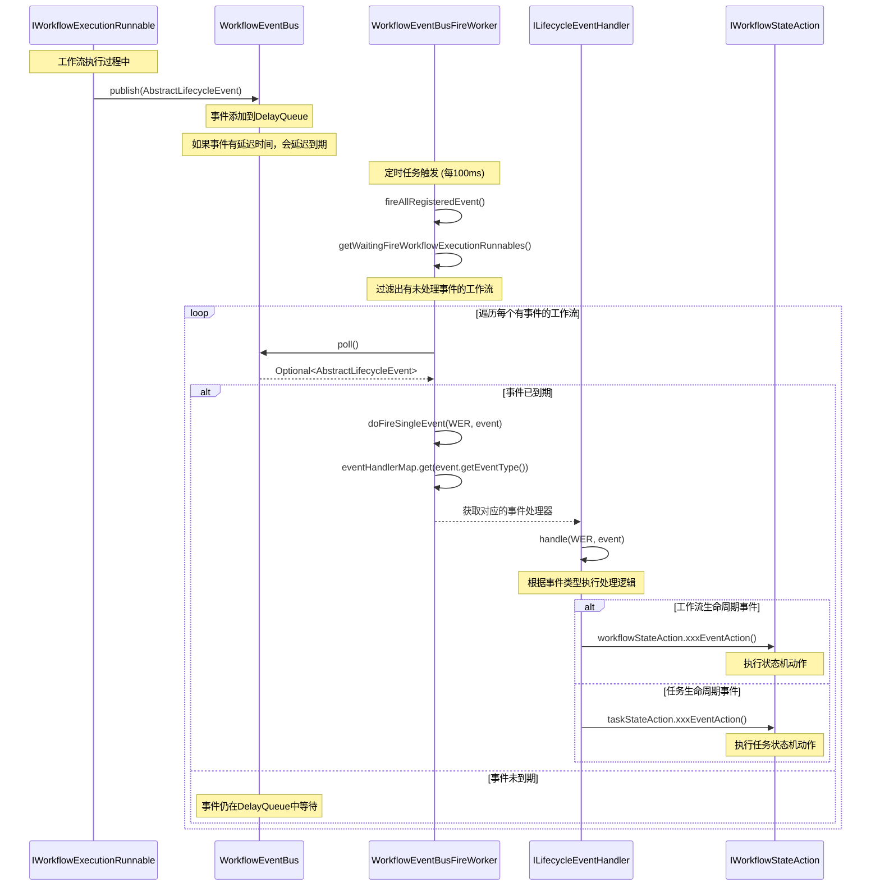

## 4. 组件交互图

### 4.1 整体交互架构

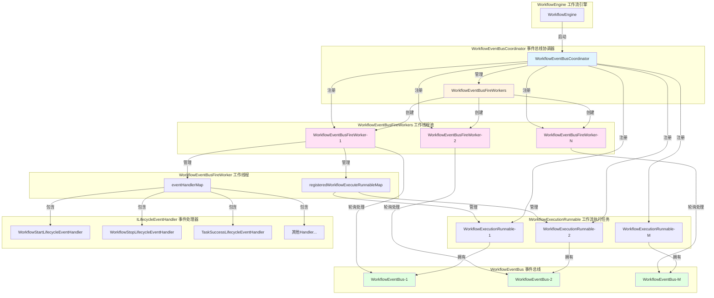

### 4.2 事件流转过程

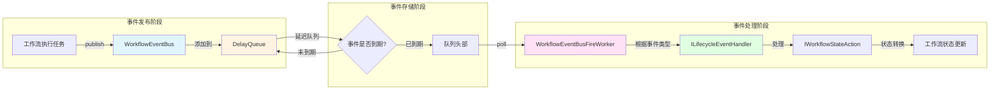

## 5. IEvent与ILifecycleEventHandler类关系图

### 5.1 事件类继承关系

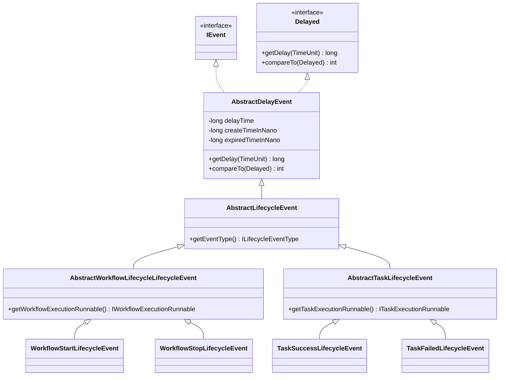

### 5.2 事件处理器类继承关系

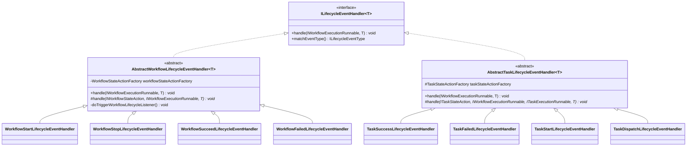

### 5.3 事件与处理器映射关系

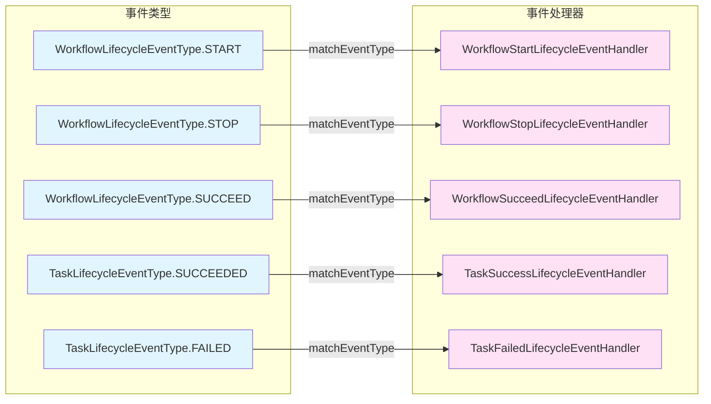

## 6. ILifecycleEventHandler设计模式图

### 6.1 模板方法模式（Template Method Pattern）

`ILifecycleEventHandler` 的设计采用了**模板方法模式**，通过抽象基类定义处理流程的骨架，子类实现具体步骤。

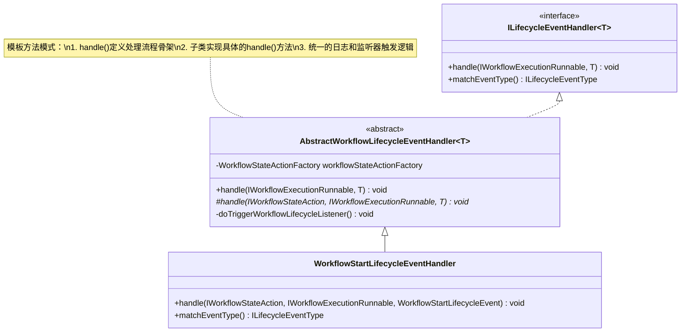

**模板方法模式要点：**
- **抽象基类**：`AbstractWorkflowLifecycleEventHandler` 定义了 `handle()` 方法的处理流程
- **固定流程**：获取状态机动作 → 记录日志 → 调用子类实现 → 触发监听器
- **可变部分**：子类实现具体的 `handle()` 方法，调用不同的状态机动作
- **优势**：代码复用、统一处理流程、易于扩展

### 6.2 策略模式（Strategy Pattern）

事件处理器的选择采用了**策略模式**，通过事件类型动态选择对应的处理器。

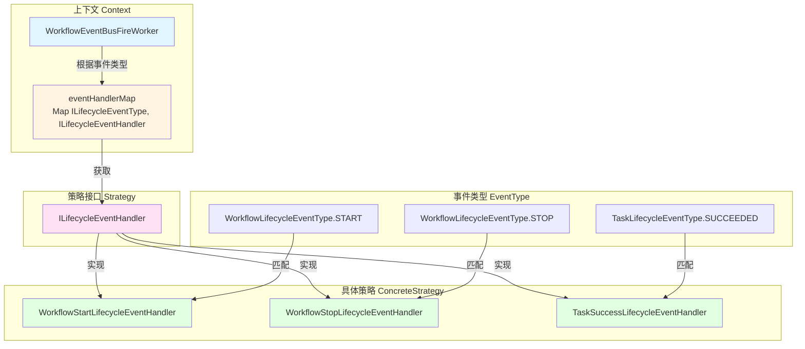

**策略模式要点：**
- **策略接口**：`ILifecycleEventHandler` 定义统一的处理接口
- **具体策略**：各种具体的 Handler 实现类
- **上下文**：`WorkflowEventBusFireWorker` 根据事件类型选择策略
- **优势**：运行时动态选择、易于扩展新策略、符合开闭原则

### 6.3 观察者模式（Observer Pattern）

事件处理完成后，会触发工作流生命周期监听器，这是**观察者模式**的应用。

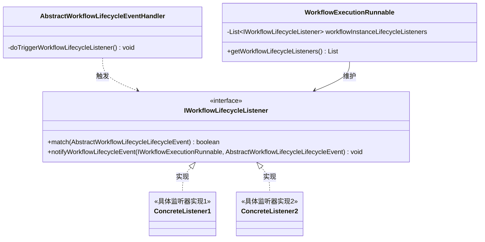

## 7. 类依赖关系图

### 7.1 核心类依赖关系

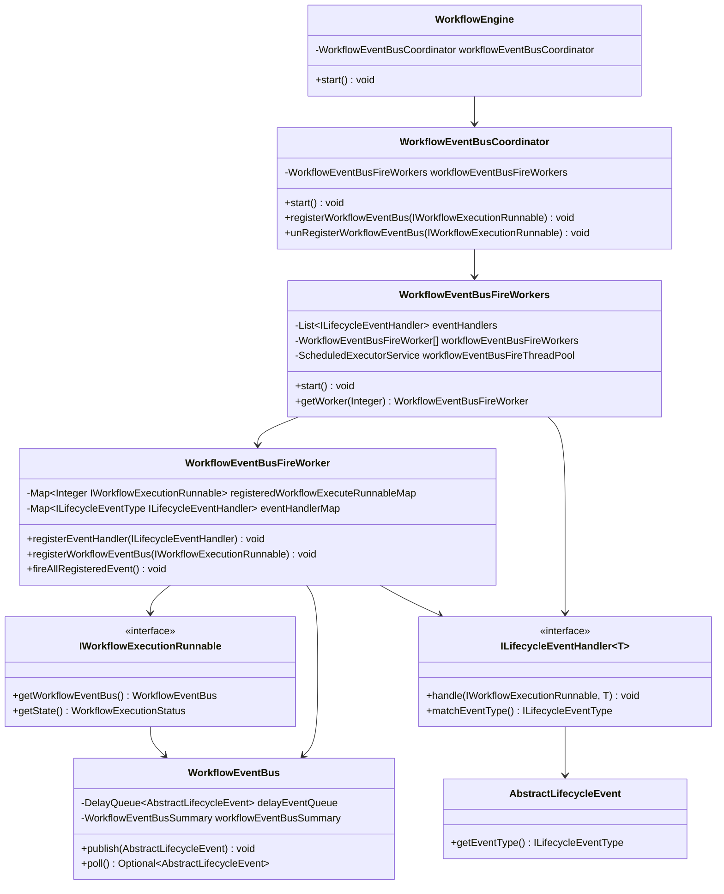

### 7.2 事件总线类层次关系

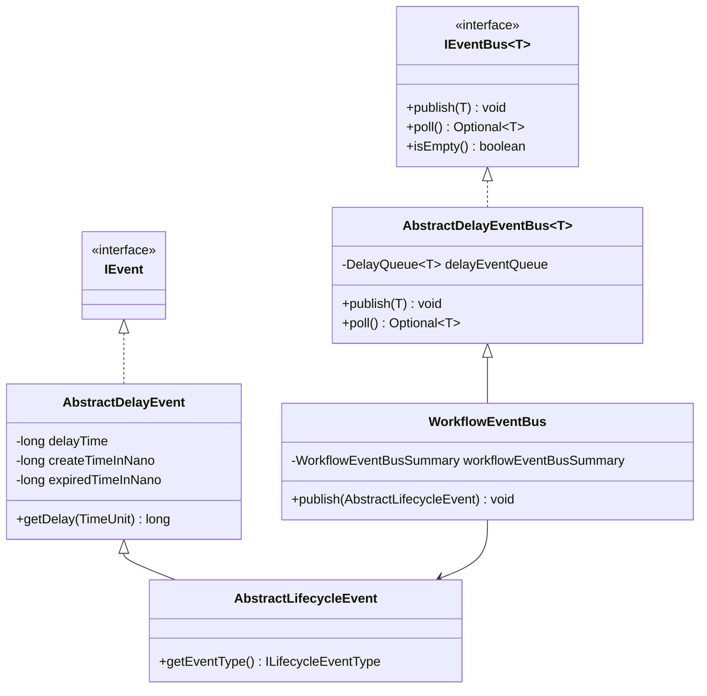

## 8. 关键设计要点

### 8.1 延迟事件机制

**设计要点：**
- 使用 `DelayQueue` 实现延迟事件队列
- 事件继承 `AbstractDelayEvent`，实现 `Delayed` 接口
- 通过 `getDelay()` 方法计算剩余延迟时间
- 支持事件延迟执行，用于实现重试、超时等场景

**关键代码：**
```java
// AbstractDelayEvent.java
@Override
public long getDelay(TimeUnit unit) {
    long delay = createTimeInNano + delayTime * 1_000_000 - System.nanoTime();
    return unit.convert(delay, TimeUnit.NANOSECONDS);
}
```

### 8.2 多线程负载均衡

**设计要点：**
- 使用哈希分片策略：`workflowInstanceId % workerSize`
- 每个工作流实例固定分配到同一个 Worker，保证事件顺序处理
- 支持配置线程数量：`workflowEventBusFireThreadCount`（默认：CPU核心数 * 2 + 1）
- 使用守护线程，确保 JVM 关闭时能正常退出

**潜在问题：**
- 如果工作流实例ID不连续，可能导致某些 Worker 负载不均衡
- 建议：使用一致性哈希或更智能的分片策略

### 8.3 定时轮询机制

**设计要点：**
- 使用 `ScheduledExecutorService.scheduleWithFixedDelay()` 实现定时轮询
- 固定延迟：100ms（`DEFAULT_FIRE_INTERVAL`）
- 每次轮询遍历所有已注册的工作流，检查是否有未处理事件
- 只处理已到期的事件（`DelayQueue.poll()` 只返回到期事件）

**优化建议：**
- TODO：使用 `wait/notify` 机制替代固定间隔轮询
- 当有新事件时唤醒 Worker，提高效率

### 8.4 事件处理器注册机制

**设计要点：**
- 通过 Spring 自动注入所有 `ILifecycleEventHandler` 实现
- 每个 Worker 都注册所有事件处理器
- 通过 `matchEventType()` 方法建立事件类型与处理器的映射关系
- 使用 `ConcurrentHashMap` 存储映射，支持并发访问

**注册流程：**
```java
// WorkflowEventBusFireWorkers.start()
for (int i = 0; i < workflowEventBusFireThreadCount; i++) {
    WorkflowEventBusFireWorker worker = new WorkflowEventBusFireWorker();
    eventHandlers.forEach(worker::registerEventHandler);  // 注册所有处理器
    workflowEventBusFireWorkers[i] = worker;
}
```

### 8.5 异常处理与重试机制

**设计要点：**
- 数据库连接失败时，事件会重新放回队列，等待重试
- 使用 `WorkflowEventBusSummary` 统计事件处理成功/失败数量
- 异常不会影响其他工作流的事件处理
- 每个工作流的事件处理都有独立的异常捕获

**关键代码：**
```java
// WorkflowEventBusFireWorker.doFireSingleWorkflowEventBus()
try {
    doFireSingleEvent(workflowExecutionRunnable, lifecycleEvent);
} catch (Exception ex) {
    if (ExceptionUtils.isDatabaseConnectedFailedException(ex)) {
        workflowEventBus.publish(lifecycleEvent);  // 重新发布事件
        ThreadUtils.sleep(5_000);
        return;
    }
    // 记录失败统计
    workflowEventBus.getWorkflowEventBusSummary().increaseFireFailedEventCount();
    throw new WorkflowEventFireException(lifecycleEvent, ex);
}
```

### 8.6 事件处理流程

**处理流程：**
1. **事件发布**：工作流执行任务调用 `workflowEventBus.publish(event)`
2. **事件存储**：事件添加到 `DelayQueue`，按过期时间排序
3. **定时轮询**：Worker 每 100ms 轮询一次，检查是否有到期事件
4. **事件分发**：根据事件类型从 `eventHandlerMap` 获取对应处理器
5. **事件处理**：调用处理器的 `handle()` 方法
6. **状态机动作**：处理器调用状态机动作，执行具体业务逻辑
7. **监听器触发**：处理完成后触发生命周期监听器

## 9. 图的要点描述总结

### 9.1 时序图要点

**系统启动时序图（3.1）：**
- 展示了从 `WorkflowEngine` 启动到所有 Worker 就绪的完整流程
- 重点：每个 Worker 都会注册所有事件处理器，并安排定时任务

**工作流注册时序图（3.2）：**
- 展示了工作流执行任务如何注册到对应的 Worker
- 重点：通过哈希分片算法计算 Worker 槽位，保证同一工作流始终在同一 Worker

**事件发布与处理时序图（3.3）：**
- 展示了事件从发布到处理的完整流程
- 重点：延迟事件机制、事件类型匹配、状态机动作调用

### 9.2 组件交互图要点

**整体交互架构（4.1）：**
- 展示了所有核心组件之间的关系
- 重点：多 Worker 架构、工作流与事件总线的 1:1 关系、事件处理器的统一管理

**事件流转过程（4.2）：**
- 展示了事件从发布到处理的三个阶段
- 重点：延迟队列的作用、事件到期判断、事件处理链

### 9.3 类关系图要点

**IEvent与ILifecycleEventHandler类关系图（5.1-5.3）：**
- 展示了事件类的继承层次结构
- 展示了事件处理器的继承层次结构
- 展示了事件类型与处理器的映射关系
- 重点：事件分为工作流生命周期事件和任务生命周期事件两大类

### 9.4 设计模式图要点

**模板方法模式（6.1）：**
- 展示了抽象基类如何定义处理流程骨架
- 重点：代码复用、统一处理流程、易于扩展

**策略模式（6.2）：**
- 展示了如何根据事件类型动态选择处理器
- 重点：运行时动态选择、符合开闭原则

**观察者模式（6.3）：**
- 展示了事件处理完成后如何触发监听器
- 重点：解耦事件处理与后续操作

### 9.5 类依赖关系图要点

**核心类依赖关系（7.1）：**
- 展示了所有核心类之间的依赖关系
- 重点：层次化的组件结构、清晰的职责划分

**事件总线类层次关系（7.2）：**
- 展示了事件总线的实现层次
- 重点：基于 `DelayQueue` 的延迟事件队列实现

## 10. 关键设计要点补充

### 10.1 事件总线统计机制

**设计要点：**
- `WorkflowEventBusSummary` 用于统计事件处理情况
- 统计指标：
  - `eventCount`：发布的事件总数
  - `fireSuccessEventCount`：成功处理的事件数
  - `fireFailedEventCount`：处理失败的事件数
- 用于监控和调试事件处理性能

**统计时机：**
- 事件发布时：`eventCount++`
- 事件处理前：`fireSuccessEventCount++`
- 事件处理失败时：`fireSuccessEventCount--`，`fireFailedEventCount++`

### 10.2 工作流与Worker的绑定关系

**设计要点：**
- 每个工作流实例通过 `workflowInstanceId % workerSize` 计算绑定到固定的 Worker
- 保证同一工作流的所有事件都在同一个 Worker 中顺序处理
- 避免并发处理同一工作流的事件导致状态不一致

**绑定流程：**
```java
// WorkflowEventBusCoordinator.calculateWorkflowEventBusFireWorkerSlot()
private int calculateWorkflowEventBusFireWorkerSlot(IWorkflowExecutionRunnable workflowExecutionRunnable) {
    final WorkflowInstance workflowInstance = workflowExecutionRunnable
        .getWorkflowExecuteContext().getWorkflowInstance();
    final Integer workflowInstanceId = workflowInstance.getId();
    return workflowInstanceId % workflowEventBusFireWorkers.getWorkerSize();
}
```

### 10.3 事件处理的事务性保证

**设计要点：**
- 事件处理失败时，如果事件已从队列中取出，需要重新放回队列
- 数据库连接失败时，事件会重新发布，等待重试
- 使用 `ConcurrentHashMap` 保证线程安全

**重试机制：**
```java
// WorkflowEventBusFireWorker.doFireSingleWorkflowEventBus()
if (ExceptionUtils.isDatabaseConnectedFailedException(ex)) {
    workflowEventBus.publish(lifecycleEvent);  // 重新发布
    ThreadUtils.sleep(5_000);  // 等待5秒后重试
    return;
}
```

### 10.4 事件处理器的查找机制

**设计要点：**
- 通过 `event.getEventType()` 获取事件类型
- 从 `eventHandlerMap` 中查找对应的处理器
- 如果找不到处理器，抛出 `RuntimeException`

**查找流程：**
```java
// WorkflowEventBusFireWorker.doFireSingleEvent()
final ILifecycleEventHandler lifecycleEventHandler = 
    eventHandlerMap.get(event.getEventType());
if (lifecycleEventHandler == null) {
    throw new RuntimeException("No EventHandler found for event: " + event.getEventType());
}
lifecycleEventHandler.handle(workflowExecutionRunnable, event);
```

## 11. 性能优化建议

### 11.1 当前实现的性能特点

**优点：**
- 多线程并发处理，提高吞吐量
- 延迟事件支持，避免频繁轮询
- 事件处理异步化，不阻塞主流程

**潜在瓶颈：**
- 固定间隔轮询（100ms），即使没有事件也会执行
- 哈希分片可能导致负载不均衡
- 事件处理是同步的，可能阻塞 Worker 线程

### 11.2 优化建议

1. **使用 wait/notify 机制替代固定轮询**
   - 当有新事件时唤醒 Worker
   - 减少无效轮询，提高 CPU 利用率
   - 降低延迟，提高响应速度

2. **改进负载均衡策略**
   - 使用一致性哈希替代简单取模
   - 考虑工作流的实际负载（事件数量、处理时间）
   - 支持动态调整 Worker 数量

3. **异步事件处理**
   - 将事件处理提交到线程池执行
   - 避免阻塞 Worker 线程
   - 提高并发处理能力

4. **批量事件处理**
   - 一次处理多个事件，减少上下文切换
   - 提高处理效率

5. **事件优先级支持**
   - 为不同类型的事件设置优先级
   - 高优先级事件优先处理

## 12. 常见问题与解决方案

### 12.1 事件丢失问题

**问题描述：**
- 事件发布后没有被处理
- 事件处理失败后没有重试

**解决方案：**
- 检查事件是否已到期（`DelayQueue.poll()` 只返回到期事件）
- 检查是否有对应的事件处理器
- 查看日志确认事件处理是否成功
- 数据库连接失败时会自动重试

### 12.2 负载不均衡问题

**问题描述：**
- 某些 Worker 负载过高，某些 Worker 空闲

**原因分析：**
- 工作流实例ID不连续，导致哈希分片不均匀
- 某些工作流事件较多，某些较少

**解决方案：**
- 调整 Worker 数量
- 使用一致性哈希算法
- 监控各 Worker 的负载情况，动态调整

### 12.3 事件处理延迟问题

**问题描述：**
- 事件发布后处理延迟较大

**原因分析：**
- 固定轮询间隔（100ms）导致最大延迟
- Worker 线程繁忙，无法及时处理
- 事件有延迟时间设置

**解决方案：**
- 减少轮询间隔（但会增加 CPU 使用率）
- 增加 Worker 数量
- 使用 wait/notify 机制
- 检查事件的延迟时间设置

### 12.4 内存泄漏问题

**问题描述：**
- 工作流执行完成后，事件总线没有清理

**解决方案：**
- 确保工作流执行完成后调用 `unRegisterWorkflowEventBus()`
- 检查 `registeredWorkflowExecuteRunnableMap` 是否及时清理
- 监控 `WorkflowEventBus` 的事件队列大小

## 13. 配置说明

### 13.1 相关配置项

| 配置项 | 说明 | 默认值 | 建议值 |
|--------|------|--------|--------|
| `workflowEventBusFireThreadCount` | 事件处理线程数 | `CPU核心数 * 2 + 1` | 根据实际负载调整，建议 4-16 |
| `DEFAULT_FIRE_INTERVAL` | 轮询间隔（毫秒） | 100 | 根据延迟要求调整，建议 50-200 |

### 13.2 配置建议

**线程数配置：**
- 线程数过少：可能导致事件处理延迟，影响性能
- 线程数过多：增加上下文切换开销，可能降低性能
- 建议：根据实际工作流数量和事件频率调整

**轮询间隔配置：**
- 间隔过短：增加 CPU 使用率，但降低延迟
- 间隔过长：降低 CPU 使用率，但增加延迟
- 建议：根据对延迟的要求调整，一般 50-200ms 较为合适

## 14. 监控与调试

### 14.1 关键指标

1. **事件统计**
   - 发布事件总数
   - 成功处理事件数
   - 失败处理事件数
   - 事件处理成功率

2. **Worker 负载**
   - 每个 Worker 注册的工作流数量
   - 每个 Worker 处理的事件数量
   - Worker 线程的 CPU 使用率

3. **事件队列**
   - 每个工作流的事件队列大小
   - 事件平均等待时间
   - 事件处理平均耗时

### 14.2 日志分析

**关键日志位置：**
- `WorkflowEventBusCoordinator`: 工作流注册/注销日志
- `WorkflowEventBusFireWorker`: 事件处理日志
- `AbstractWorkflowLifecycleEventHandler`: 事件处理开始/结束日志
- `WorkflowEventBus`: 事件发布日志

**日志示例：**
```
INFO - Publish event: WorkflowStartLifecycleEvent{...}
INFO - Begin fire workflow test_workflow LifecycleEvent[WorkflowStartLifecycleEvent] with state: SUBMITTED
INFO - Fired workflow test_workflow LifecycleEvent[WorkflowStartLifecycleEvent] with state: RUNNING
```

## 15. 总结

工作流事件总线协调器是 DolphinScheduler Master 节点中实现事件驱动架构的核心组件。它通过以下设计实现了高效、可靠的事件处理：

1. **事件驱动架构**：解耦事件发布者与处理者，通过事件总线进行异步通信
2. **多线程并发处理**：通过多个 Worker 并发处理事件，提高吞吐量
3. **延迟事件支持**：基于 `DelayQueue` 实现延迟事件，支持重试、超时等场景
4. **设计模式应用**：模板方法模式、策略模式、观察者模式的综合应用
5. **负载均衡**：通过哈希分片将工作流分配到不同 Worker，实现负载均衡
6. **可靠性保证**：异常处理、事件重试、统计监控等机制保证系统可靠性

### 15.1 核心优势

- **解耦**：事件发布与处理完全解耦，易于扩展和维护
- **异步**：事件处理异步化，不阻塞主流程
- **可扩展**：支持多线程并发，可根据负载调整线程数
- **可靠**：支持延迟事件、异常重试、统计监控

### 15.2 设计亮点

1. **延迟事件队列**：基于 `DelayQueue` 实现，支持事件延迟执行
2. **哈希分片策略**：保证同一工作流的事件顺序处理
3. **模板方法模式**：统一事件处理流程，代码复用
4. **策略模式**：动态选择事件处理器，易于扩展
5. **观察者模式**：事件处理完成后触发监听器，解耦后续操作

### 15.3 未来优化方向

1. **使用 wait/notify 机制**：替代固定间隔轮询，提高效率
2. **改进负载均衡**：使用一致性哈希或更智能的分片策略
3. **异步事件处理**：将事件处理提交到线程池，避免阻塞
4. **批量事件处理**：一次处理多个事件，减少上下文切换
5. **事件优先级**：支持事件优先级，高优先级事件优先处理

通过以上设计，工作流事件总线协调器实现了高效、可靠、可扩展的事件处理机制，为 DolphinScheduler 的工作流执行提供了坚实的基础。