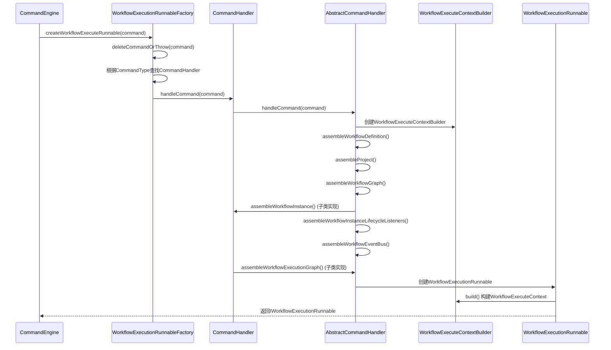
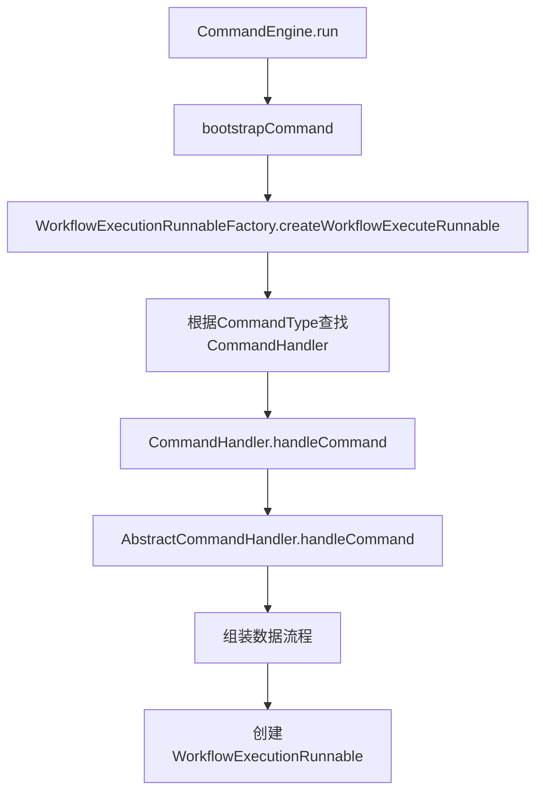
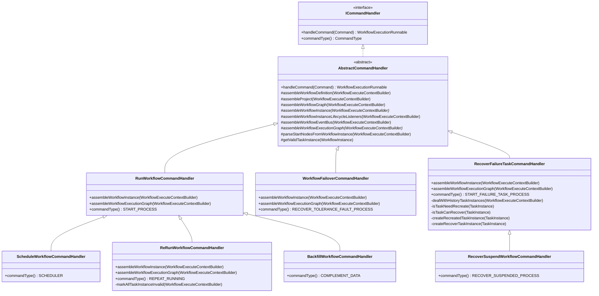
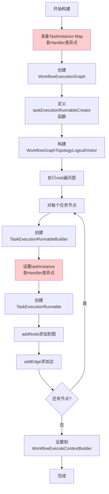
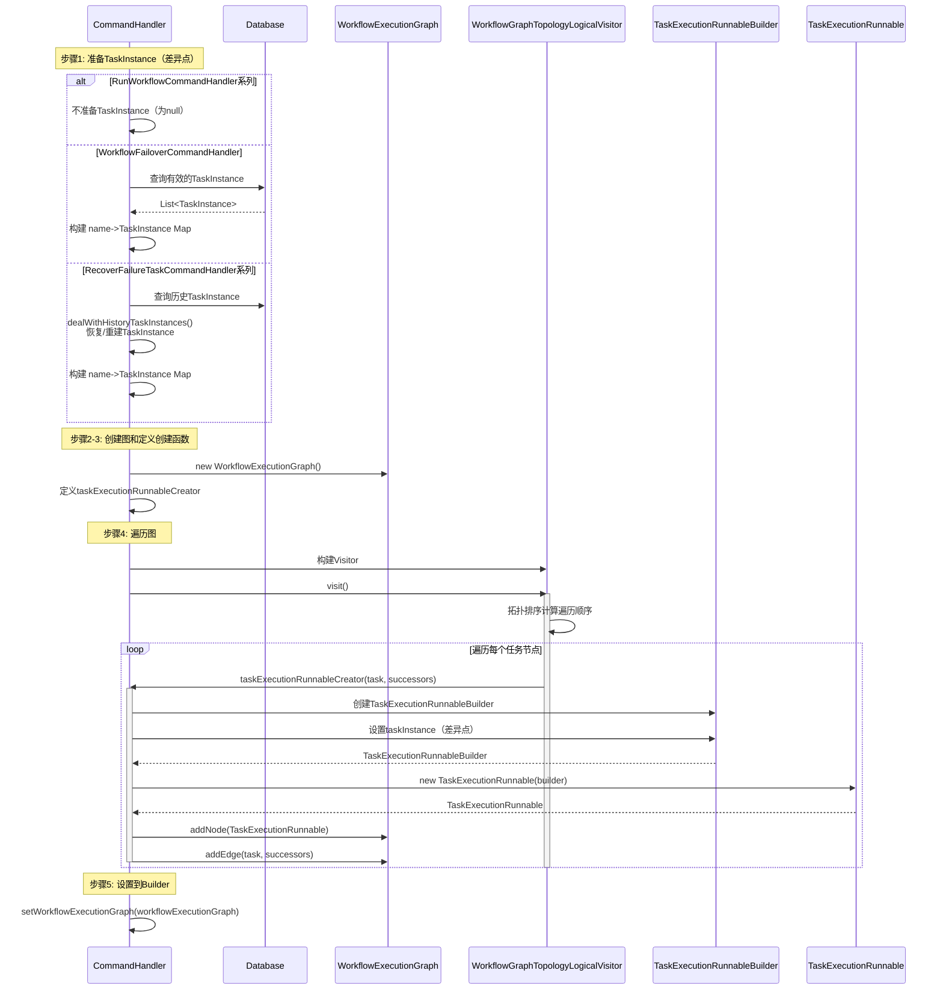
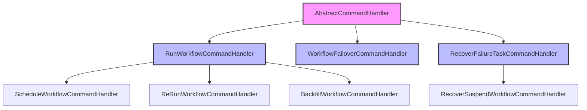
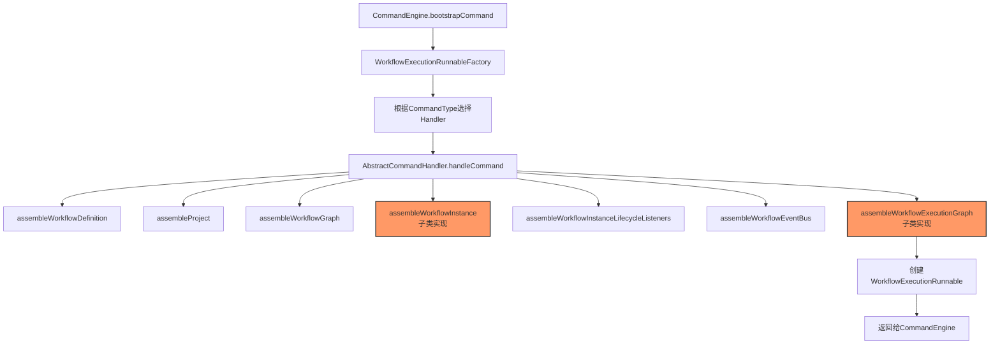
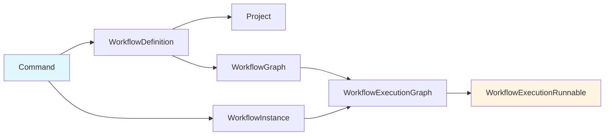
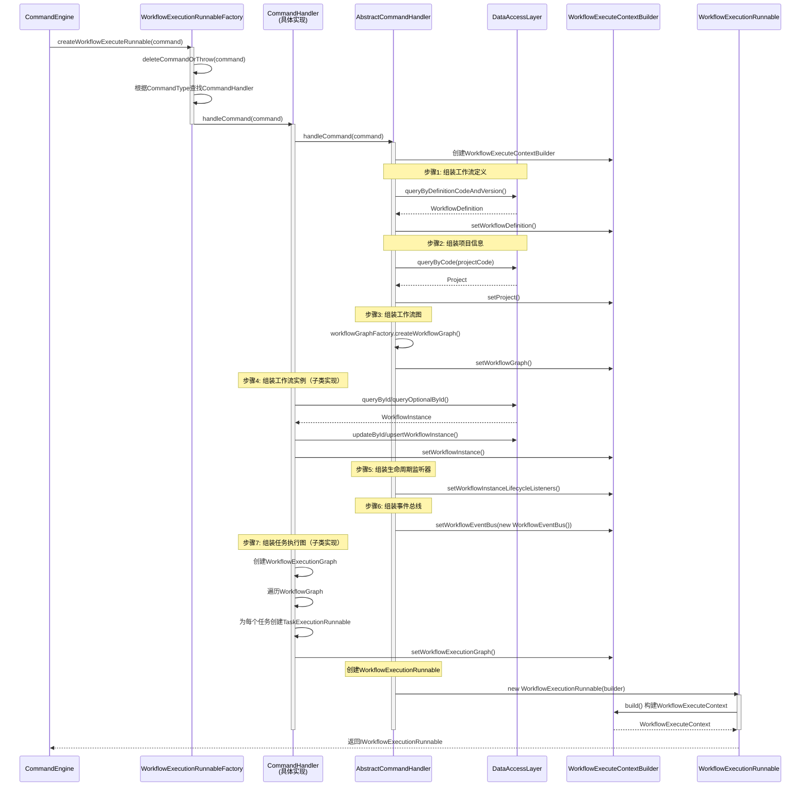

# CommandHandler 组装数据详细流程分析

## 1. 概述

本文档详细分析从 `CommandEngine.bootstrapCommand()` 开始，到 `AbstractCommandHandler` 组装工作流执行所需数据的完整流程。

### 1.1 核心流程概览



## 2. 入口分析

### 2.1 CommandEngine.bootstrapCommand()

**位置**: `CommandEngine.java:158-161`

```java
private CompletableFuture<IWorkflowExecutionRunnable> bootstrapCommand(Command command) {
    return supplyAsync(
            () -> workflowExecutionRunnableFactory.createWorkflowExecuteRunnable(command), 
            commandHandleThreadPool);
}
```

**职责**:
- 异步执行命令处理
- 使用 `commandHandleThreadPool` 线程池
- 调用 `WorkflowExecutionRunnableFactory` 创建 `WorkflowExecutionRunnable`

### 2.2 调用链



## 3. WorkflowExecutionRunnableFactory 分析

### 3.1 核心方法

**位置**: `WorkflowExecutionRunnableFactory.java:54-72`

```java
@Transactional
public IWorkflowExecutionRunnable createWorkflowExecuteRunnable(Command command) {
    deleteCommandOrThrow(command);
    return doCreateWorkflowExecutionRunnable(command);
}

private IWorkflowExecutionRunnable doCreateWorkflowExecutionRunnable(Command command) {
    final CommandType commandType = command.getCommandType();
    final ICommandHandler commandHandler = commandHandlers
            .stream()
            .filter(c -> c.commandType() == commandType)
            .findFirst()
            .orElseThrow(() -> new IllegalArgumentException(
                    "Cannot find ICommandHandler for commandType: " + commandType));
    return commandHandler.handleCommand(command);
}
```

**关键点**:
1. **事务保护**: 使用 `@Transactional` 确保命令只被处理一次
2. **命令删除**: `deleteCommandOrThrow()` 防止重复处理
3. **Handler 选择**: 根据 `CommandType` 动态选择对应的 `CommandHandler`

### 3.2 CommandHandler 类型映射

| CommandType | CommandHandler | 用途 | 继承关系 |
|------------|----------------|------|---------|
| START_PROCESS | RunWorkflowCommandHandler | 启动新工作流 | 直接继承 AbstractCommandHandler |
| SCHEDULER | ScheduleWorkflowCommandHandler | 定时调度启动工作流 | 继承 RunWorkflowCommandHandler |
| REPEAT_RUNNING | ReRunWorkflowCommandHandler | 重跑工作流 | 继承 RunWorkflowCommandHandler |
| COMPLEMENT_DATA | BackfillWorkflowCommandHandler | 补数/回填工作流 | 继承 RunWorkflowCommandHandler |
| RECOVER_TOLERANCE_FAULT_PROCESS | WorkflowFailoverCommandHandler | 容错恢复工作流 | 直接继承 AbstractCommandHandler |
| START_FAILURE_TASK_PROCESS | RecoverFailureTaskCommandHandler | 恢复失败任务 | 直接继承 AbstractCommandHandler |
| RECOVER_SUSPENDED_PROCESS | RecoverSuspendWorkflowCommandHandler | 恢复暂停的工作流 | 继承 RecoverFailureTaskCommandHandler |

## 4. AbstractCommandHandler 组装流程

### 4.1 整体架构



### 4.2 handleCommand() 主流程

**位置**: `AbstractCommandHandler.java:76-101`

```java
@Override
public WorkflowExecutionRunnable handleCommand(final Command command) {
    final WorkflowExecuteContextBuilder workflowExecuteContextBuilder = WorkflowExecuteContext.builder()
            .withCommand(command);
    // 1. 组装工作流定义
    assembleWorkflowDefinition(workflowExecuteContextBuilder);
    // 2. 组装项目信息
    assembleProject(workflowExecuteContextBuilder);
    // 3. 组装工作流有向无环图
    assembleWorkflowGraph(workflowExecuteContextBuilder);
    // 4. 组装工作流实例(子类实现)
    assembleWorkflowInstance(workflowExecuteContextBuilder);
    // 5. 组装工作流实例生命周期监听器
    assembleWorkflowInstanceLifecycleListeners(workflowExecuteContextBuilder);
    // 6. 组装事件总线
    assembleWorkflowEventBus(workflowExecuteContextBuilder);
    // 7. 组装任务执行图
    assembleWorkflowExecutionGraph(workflowExecuteContextBuilder);

    // 创建workflowExecutionRunnable
    final WorkflowExecutionRunnableBuilder workflowExecutionRunnableBuilder = WorkflowExecutionRunnableBuilder
            .builder()
            .workflowExecuteContextBuilder(workflowExecuteContextBuilder)
            .applicationContext(applicationContext)
            .build();
    return new WorkflowExecutionRunnable(workflowExecutionRunnableBuilder);
}
```

### 4.3 组装步骤详细分析

#### 步骤 1: assembleWorkflowDefinition()

**位置**: `AbstractCommandHandler.java:113-127`

**职责**: 从数据库查询工作流定义

```java
protected void assembleWorkflowDefinition(final WorkflowExecuteContextBuilder workflowExecuteContextBuilder) {
    final Command command = workflowExecuteContextBuilder.getCommand();
    final long workflowDefinitionCode = command.getWorkflowDefinitionCode();
    final int workflowDefinitionVersion = command.getWorkflowDefinitionVersion();
    
    final WorkflowDefinition workflowDefinition = workflowDefinitionLogDao.queryByDefinitionCodeAndVersion(
            workflowDefinitionCode, workflowDefinitionVersion);
    checkArgument(workflowDefinition != null,
            "Cannot find the WorkflowDefinition: [" + workflowDefinitionCode + ":" + workflowDefinitionVersion + "]");
    workflowExecuteContextBuilder.setWorkflowDefinition(workflowDefinition);
}
```

**关键点**:
- 使用 `workflowDefinitionCode` 和 `workflowDefinitionVersion` 查询历史版本
- 所有 CommandHandler 共享此实现

#### 步骤 2: assembleProject()

**位置**: `AbstractCommandHandler.java:174-180`

**职责**: 查询项目信息

```java
protected void assembleProject(final WorkflowExecuteContextBuilder workflowExecuteContextBuilder) {
    final WorkflowDefinition workflowDefinition = workflowExecuteContextBuilder.getWorkflowDefinition();
    final Project project = projectDao.queryByCode(workflowDefinition.getProjectCode());
    checkArgument(project != null, "Cannot find the project code: " + workflowDefinition.getProjectCode());
    workflowExecuteContextBuilder.setProject(project);
}
```

#### 步骤 3: assembleWorkflowGraph()

**位置**: `AbstractCommandHandler.java:129-133`

**职责**: 构建工作流有向无环图（DAG）

```java
protected void assembleWorkflowGraph(final WorkflowExecuteContextBuilder workflowExecuteContextBuilder) {
    final WorkflowDefinition workflowDefinition = workflowExecuteContextBuilder.getWorkflowDefinition();
    workflowExecuteContextBuilder.setWorkflowGraph(workflowGraphFactory.createWorkflowGraph(workflowDefinition));
}
```

**WorkflowGraphFactory 处理流程**:
1. 查询工作流任务关系: `processService.findRelationByCode()`
2. 查询任务定义: `taskDefinitionLogDao.queryTaskDefineLogList()`
3. 构建 `WorkflowGraph` 对象，包含:
    - 任务定义映射 (code -> TaskDefinition, name -> TaskDefinition)
    - 前驱关系 (predecessors)
    - 后继关系 (successors)

#### 步骤 4: assembleWorkflowInstance() - 子类实现

**职责**: 组装或更新工作流实例，各子类实现不同

#### 步骤 5: assembleWorkflowInstanceLifecycleListeners()

**位置**: `AbstractCommandHandler.java:108-111`

**职责**: 注入工作流生命周期监听器

```java
protected void assembleWorkflowInstanceLifecycleListeners(
        final WorkflowExecuteContextBuilder workflowExecuteContextBuilder) {
    workflowExecuteContextBuilder.setWorkflowInstanceLifecycleListeners(workflowLifecycleListeners);
}
```

#### 步骤 6: assembleWorkflowEventBus()

**位置**: `AbstractCommandHandler.java:103-106`

**职责**: 创建事件总线

```java
protected void assembleWorkflowEventBus(final WorkflowExecuteContextBuilder workflowExecuteContextBuilder) {
    workflowExecuteContextBuilder.setWorkflowEventBus(new WorkflowEventBus());
}
```

#### 步骤 7: assembleWorkflowExecutionGraph() - 子类实现

**职责**: 构建任务执行图，各子类实现不同

## 5. WorkflowExecutionGraph 构建流程详解

### 5.1 通用构建流程

所有 CommandHandler 构建 `WorkflowExecutionGraph` 的**核心流程相同**，主要差异在于**如何获取和处理 TaskInstance**。

**通用流程**:



### 5.2 核心组件分析

#### 5.2.1 WorkflowExecutionGraph

**位置**: `WorkflowExecutionGraph.java`

**职责**: 工作流执行图，管理所有任务执行节点和它们之间的关系

**核心数据结构**:
- `totalTaskExecuteRunnableMap`: 任务名称 → TaskExecutionRunnable 映射
- `predecessors`: 前驱关系（任务名称 → 前驱任务名称集合）
- `successors`: 后继关系（任务名称 → 后继任务名称集合）
- `activeTaskExecutionRunnable`: 活跃任务集合
- `failureTaskChains`: 失败任务链
- `pausedTaskChains`: 暂停任务链
- `killedTaskChains`: 杀死任务链

**关键方法**:
- `addNode(ITaskExecutionRunnable)`: 添加任务节点
- `addEdge(String, Set<String>)`: 添加边（fromTask → toTasks）

#### 5.2.2 WorkflowGraphTopologyLogicalVisitor

**位置**: `WorkflowGraphTopologyLogicalVisitor.java`

**职责**: 拓扑逻辑访问器，按拓扑顺序遍历工作流图

**遍历策略** (根据 `TaskDependType`):
1. **TASK_ONLY**: 只访问起始节点
2. **TASK_PRE**: 访问能到达起始节点的所有节点（向上回溯）
3. **TASK_POST**: 访问从起始节点可达的所有节点（向下遍历，默认）

**遍历算法**: 拓扑排序（Topological Sort）

```java
private void doVisitationInSubGraph(Set<String> subGraphNodes) {
    // 1. 计算每个节点的入度（in-degree）
    Map<String, Integer> inDegreeMap = workflowGraph.getAllTaskNodes()
            .stream()
            .collect(Collectors.toMap(TaskDefinition::getName,
                    taskDefinition -> workflowGraph.getPredecessors(taskDefinition.getName()).size()));
    
    // 2. 找出所有入度为0的节点（起始节点）
    LinkedList<String> bootstrapTaskCodes = inDegreeMap
            .entrySet()
            .stream()
            .filter(entry -> entry.getValue() == 0)
            .map(Map.Entry::getKey)
            .collect(Collectors.toCollection(LinkedList::new));
    
    // 3. 拓扑排序：每次处理入度为0的节点，然后更新后继节点的入度
    Set<String> visitedTaskCodes = new HashSet<>();
    while (!bootstrapTaskCodes.isEmpty()) {
        String taskName = bootstrapTaskCodes.removeFirst();
        if (inDegreeMap.get(taskName) > 0) {
            continue;
        }
        if (!visitedTaskCodes.contains(taskName)) {
            visitedTaskCodes.add(taskName);
            final Set<String> successors = workflowGraph.getSuccessors(taskName);
            if (subGraphNodes.contains(taskName)) {
                // 4. 调用访问函数处理当前节点
                visitFunction.accept(taskName, successors);
            }
            // 5. 更新后继节点的入度
            for (String successor : successors) {
                inDegreeMap.put(successor, inDegreeMap.get(successor) - 1);
            }
            bootstrapTaskCodes.addAll(successors);
        }
    }
}
```

### 5.3 通用构建代码模板

所有 Handler 的核心构建代码结构相同：

```java
protected void assembleWorkflowExecutionGraph(final WorkflowExecuteContextBuilder workflowExecuteContextBuilder) {
    // === 步骤1: 准备TaskInstance Map（各Handler差异点） ===
    // RunWorkflowCommandHandler: 不准备，taskInstance为null
    // WorkflowFailoverCommandHandler: 查询有效的TaskInstance
    // RecoverFailureTaskCommandHandler: 处理历史TaskInstance（恢复/重建）
    
    // === 步骤2: 创建WorkflowExecutionGraph ===
    final IWorkflowGraph workflowGraph = workflowExecuteContextBuilder.getWorkflowGraph();
    final WorkflowExecutionGraph workflowExecutionGraph = new WorkflowExecutionGraph();
    
    // === 步骤3: 定义任务执行Runnable创建函数 ===
    final BiConsumer<String, Set<String>> taskExecutionRunnableCreator = (task, successors) -> {
        // 创建TaskExecutionRunnableBuilder
        final TaskExecutionRunnableBuilder taskExecutionRunnableBuilder =
                TaskExecutionRunnableBuilder.builder()
                        .workflowExecutionGraph(workflowExecutionGraph)
                        .workflowDefinition(workflowExecuteContextBuilder.getWorkflowDefinition())
                        .project(workflowExecuteContextBuilder.getProject())
                        .workflowInstance(workflowExecuteContextBuilder.getWorkflowInstance())
                        .taskDefinition(workflowGraph.getTaskNodeByName(task))
                        .taskInstance(...)  // ← 各Handler差异点
                        .workflowEventBus(workflowExecuteContextBuilder.getWorkflowEventBus())
                        .applicationContext(applicationContext)
                        .build();
        
        // 创建TaskExecutionRunnable并添加到图
        workflowExecutionGraph.addNode(new TaskExecutionRunnable(taskExecutionRunnableBuilder));
        workflowExecutionGraph.addEdge(task, successors);
    };
    
    // === 步骤4: 构建并执行拓扑访问器 ===
    final WorkflowGraphTopologyLogicalVisitor workflowGraphTopologyLogicalVisitor =
            WorkflowGraphTopologyLogicalVisitor.builder()
                    .taskDependType(workflowExecuteContextBuilder.getWorkflowInstance().getTaskDependType())
                    .onWorkflowGraph(workflowGraph)
                    .fromTask(parseStartNodesFromWorkflowInstance(workflowExecuteContextBuilder))
                    .doVisitFunction(taskExecutionRunnableCreator)
                    .build();
    workflowGraphTopologyLogicalVisitor.visit();
    
    // === 步骤5: 设置到Builder ===
    workflowExecuteContextBuilder.setWorkflowExecutionGraph(workflowExecutionGraph);
}
```

### 5.4 各Handler的TaskInstance处理差异

| Handler | TaskInstance处理方式 | 说明 |
|---------|---------------------|------|
| **RunWorkflowCommandHandler** | ❌ 不设置（为null） | 新工作流，任务实例尚未创建，延迟到首次执行时创建 |
| **ReRunWorkflowCommandHandler** | ❌ 不设置（为null，继承父类） | 重跑前标记所有历史任务无效，然后按新工作流处理 |
| **ScheduleWorkflowCommandHandler** | ❌ 不设置（为null，继承父类） | 同RunWorkflowCommandHandler |
| **BackfillWorkflowCommandHandler** | ❌ 不设置（为null，继承父类） | 同RunWorkflowCommandHandler |
| **WorkflowFailoverCommandHandler** | ✅ 从DB查询有效的TaskInstance | 容错恢复，保留已有任务实例状态 |
| **RecoverFailureTaskCommandHandler** | ✅ 恢复/重建TaskInstance | 根据任务状态恢复或重建任务实例 |
| **RecoverSuspendWorkflowCommandHandler** | ✅ 恢复/重建TaskInstance（继承父类） | 同RecoverFailureTaskCommandHandler |

### 5.5 构建流程图



## 6. 各 CommandHandler 详细分析

### 5.1 RunWorkflowCommandHandler (START_PROCESS)

**用途**: 启动新的工作流实例

#### assembleWorkflowInstance()

**位置**: `RunWorkflowCommandHandler.java:80-91`

```java
@Override
protected void assembleWorkflowInstance(final WorkflowExecuteContextBuilder workflowExecuteContextBuilder) {
    final WorkflowDefinition workflowDefinition = workflowExecuteContextBuilder.getWorkflowDefinition();
    final Command command = workflowExecuteContextBuilder.getCommand();
    final WorkflowInstance workflowInstance = workflowInstanceDao.queryById(command.getWorkflowInstanceId());
    workflowInstance.setStateWithDesc(WorkflowExecutionStatus.RUNNING_EXECUTION, command.getCommandType().name());
    workflowInstance.setHost(masterConfig.getMasterAddress());
    workflowInstance.setCommandParam(command.getCommandParam());
    workflowInstance.setGlobalParams(mergeCommandParamsWithWorkflowParams(command, workflowDefinition));
    workflowInstanceDao.upsertWorkflowInstance(workflowInstance);
    workflowExecuteContextBuilder.setWorkflowInstance(workflowInstance);
}
```

**关键操作**:
- 从数据库查询已存在的工作流实例（由 Command 创建时生成）
- 设置状态为 `RUNNING_EXECUTION`
- 设置 Master 地址
- 合并命令参数和工作流全局参数
- 更新数据库

#### assembleWorkflowExecutionGraph()

**位置**: `RunWorkflowCommandHandler.java:107-138`

**TaskInstance处理**: ❌ **不设置 taskInstance（为 null）**

**处理逻辑**:
1. **不准备TaskInstance Map**: 新工作流启动时，任务实例尚未创建，不需要从数据库查询
2. **创建TaskExecutionRunnableBuilder时**: 不调用 `.taskInstance()` 方法，`taskInstance` 字段为 `null`
3. **延迟创建**: 任务实例将在首次执行时通过 `TaskStartLifecycleEventHandler.initializeFirstRunTaskInstance()` 创建

**代码实现**:
```java
@Override
protected void assembleWorkflowExecutionGraph(final WorkflowExecuteContextBuilder workflowExecuteContextBuilder) {
    final IWorkflowGraph workflowGraph = workflowExecuteContextBuilder.getWorkflowGraph();
    final WorkflowExecutionGraph workflowExecutionGraph = new WorkflowExecutionGraph();
    
    final BiConsumer<String, Set<String>> taskExecutionRunnableCreator = (task, successors) -> {
        final TaskExecutionRunnableBuilder taskExecutionRunnableBuilder =
                TaskExecutionRunnableBuilder.builder()
                        .workflowExecutionGraph(workflowExecutionGraph)
                        .workflowDefinition(workflowExecuteContextBuilder.getWorkflowDefinition())
                        .project(workflowExecuteContextBuilder.getProject())
                        .workflowInstance(workflowExecuteContextBuilder.getWorkflowInstance())
                        .taskDefinition(workflowGraph.getTaskNodeByName(task))
                        // ⚠️ 注意：这里没有设置 taskInstance（为null）
                        .workflowEventBus(workflowExecuteContextBuilder.getWorkflowEventBus())
                        .applicationContext(applicationContext)
                        .build();
        workflowExecutionGraph.addNode(new TaskExecutionRunnable(taskExecutionRunnableBuilder));
        workflowExecutionGraph.addEdge(task, successors);
    };

    // 使用拓扑访问器遍历图（通用流程）
    final WorkflowGraphTopologyLogicalVisitor workflowGraphTopologyLogicalVisitor =
            WorkflowGraphTopologyLogicalVisitor.builder()
                    .taskDependType(workflowExecuteContextBuilder.getWorkflowInstance().getTaskDependType())
                    .onWorkflowGraph(workflowGraph)
                    .fromTask(parseStartNodesFromWorkflowInstance(workflowExecuteContextBuilder))
                    .doVisitFunction(taskExecutionRunnableCreator)
                    .build();
    workflowGraphTopologyLogicalVisitor.visit();

    workflowExecuteContextBuilder.setWorkflowExecutionGraph(workflowExecutionGraph);
}
```

**设计原因**:
- 避免不必要的数据库写入
- 只在真正需要执行时才创建任务实例
- 优化性能，减少初始化开销

### 5.2 ScheduleWorkflowCommandHandler (SCHEDULER)

**继承**: `RunWorkflowCommandHandler`

**特点**:
- 仅重写 `commandType()` 方法
- 完全复用父类的所有逻辑
- 用于定时调度触发的工作流启动

```java
@Component
public class ScheduleWorkflowCommandHandler extends RunWorkflowCommandHandler {
    @Override
    public CommandType commandType() {
        return CommandType.SCHEDULER;
    }
}
```

### 5.3 ReRunWorkflowCommandHandler (REPEAT_RUNNING)

**继承**: `RunWorkflowCommandHandler`

**用途**: 重跑工作流，清除历史任务实例

#### assembleWorkflowInstance()

**位置**: `ReRunWorkflowCommandHandler.java:68-84`

**与父类差异**:
- 清空变量池: `workflowInstance.setVarPool(null)`
- 设置重启时间: `workflowInstance.setRestartTime(new Date())`
- 清空结束时间: `workflowInstance.setEndTime(null)`
- 增加运行次数: `workflowInstance.setRunTimes(workflowInstance.getRunTimes() + 1)`

```java
@Override
protected void assembleWorkflowInstance(final WorkflowExecuteContextBuilder workflowExecuteContextBuilder) {
    // ... 查询工作流实例
    workflowInstance.setVarPool(null);
    workflowInstance.setStateWithDesc(WorkflowExecutionStatus.RUNNING_EXECUTION, command.getCommandType().name());
    workflowInstance.setCommandType(command.getCommandType());
    workflowInstance.setRestartTime(new Date());
    workflowInstance.setHost(masterConfig.getMasterAddress());
    workflowInstance.setEndTime(null);
    workflowInstance.setRunTimes(workflowInstance.getRunTimes() + 1);
    workflowInstanceDao.updateById(workflowInstance);
    workflowExecuteContextBuilder.setWorkflowInstance(workflowInstance);
}
```

#### assembleWorkflowExecutionGraph()

**位置**: `ReRunWorkflowCommandHandler.java:90-94`

**TaskInstance处理**: ❌ **不设置 taskInstance（继承父类，为 null）**

**处理逻辑**:
1. **标记历史任务实例无效**: 在构建执行图前，先调用 `markAllTaskInstanceInvalid()` 标记所有历史任务实例为无效
2. **调用父类方法**: 然后调用 `super.assembleWorkflowExecutionGraph()`，继承父类逻辑，不设置 taskInstance
3. **按新工作流处理**: 重跑后的工作流按新工作流处理，任务实例在首次执行时创建

**代码实现**:
```java
@Override
protected void assembleWorkflowExecutionGraph(final WorkflowExecuteContextBuilder workflowExecuteContextBuilder) {
    // 1. 标记所有历史任务实例为无效
    markAllTaskInstanceInvalid(workflowExecuteContextBuilder);
    // 2. 调用父类方法（不设置taskInstance，按新工作流处理）
    super.assembleWorkflowExecutionGraph(workflowExecuteContextBuilder);
}

private void markAllTaskInstanceInvalid(final WorkflowExecuteContextBuilder workflowExecuteContextBuilder) {
    final WorkflowInstance workflowInstance = workflowExecuteContextBuilder.getWorkflowInstance();
    final List<TaskInstance> taskInstances = getValidTaskInstance(workflowInstance);
    taskInstanceDao.markTaskInstanceInvalid(taskInstances);
}
```

**与父类的差异**:
- 重跑前需要清理历史任务实例，避免状态混乱
- 其他逻辑完全复用父类

### 5.4 BackfillWorkflowCommandHandler (COMPLEMENT_DATA)

**继承**: `RunWorkflowCommandHandler`

**特点**:
- 仅重写 `commandType()` 方法
- 完全复用父类的所有逻辑
- 用于补数/回填场景

```java
@Component
public class BackfillWorkflowCommandHandler extends RunWorkflowCommandHandler {
    @Override
    public CommandType commandType() {
        return CommandType.COMPLEMENT_DATA;
    }
}
```

### 5.5 WorkflowFailoverCommandHandler (RECOVER_TOLERANCE_FAULT_PROCESS)

**继承**: `AbstractCommandHandler`

**用途**: 容错恢复，从已有任务实例恢复工作流

#### assembleWorkflowInstance()

**位置**: `WorkflowFailoverCommandHandler.java:77-95`

**特点**:
- 从 `WorkflowFailoverCommandParam` 获取目标状态
- 状态可以是任意 `WorkflowExecutionStatus`（由容错策略决定）

```java
@Override
protected void assembleWorkflowInstance(final WorkflowExecuteContextBuilder workflowExecuteContextBuilder) {
    final Command command = workflowExecuteContextBuilder.getCommand();
    final int workflowInstanceId = command.getWorkflowInstanceId();
    final WorkflowInstance workflowInstance = workflowInstanceDao.queryOptionalById(workflowInstanceId)
            .orElseThrow(() -> new IllegalArgumentException("Cannot find WorkflowInstance:" + workflowInstanceId));
    final WorkflowFailoverCommandParam workflowFailoverCommandParam = JSONUtils.parseObject(
            command.getCommandParam(), WorkflowFailoverCommandParam.class);
    if (workflowFailoverCommandParam == null) {
        throw new IllegalArgumentException(
                "The WorkflowFailoverCommandParam: " + command.getCommandParam() + " is invalid");
    }
    workflowInstance.setState(workflowFailoverCommandParam.getWorkflowExecutionStatus());
    workflowInstanceDao.updateById(workflowInstance);
    workflowExecuteContextBuilder.setWorkflowInstance(workflowInstance);
}
```

#### assembleWorkflowExecutionGraph()

**位置**: `WorkflowFailoverCommandHandler.java:101-138`

**TaskInstance处理**: ✅ **从数据库查询有效的TaskInstance并设置**

**处理逻辑**:
1. **查询有效任务实例**: 调用 `getValidTaskInstance()` 查询所有有效的任务实例
2. **构建Map**: 将任务实例列表转换为 `name -> TaskInstance` 的映射，便于查找
3. **设置到Builder**: 在创建 `TaskExecutionRunnableBuilder` 时，通过 `taskInstanceMap.get(task)` 获取对应的任务实例并设置
4. **保留状态**: 容错恢复场景需要保留已有任务实例的状态，以便正确恢复执行

**代码实现**:
```java
@Override
protected void assembleWorkflowExecutionGraph(final WorkflowExecuteContextBuilder workflowExecuteContextBuilder) {
    // 1. 查询所有有效的任务实例，构建 name -> TaskInstance 映射
    final Map<String, TaskInstance> taskInstanceMap =
            getValidTaskInstance(workflowExecuteContextBuilder.getWorkflowInstance())
                    .stream()
                    .collect(Collectors.toMap(TaskInstance::getName, Function.identity()));

    final IWorkflowGraph workflowGraph = workflowExecuteContextBuilder.getWorkflowGraph();
    final WorkflowExecutionGraph workflowExecutionGraph = new WorkflowExecutionGraph();

    final BiConsumer<String, Set<String>> taskExecutionRunnableCreator = (task, successors) -> {
        final TaskExecutionRunnableBuilder taskExecutionRunnableBuilder =
                TaskExecutionRunnableBuilder.builder()
                        .workflowExecutionGraph(workflowExecutionGraph)
                        .workflowDefinition(workflowExecuteContextBuilder.getWorkflowDefinition())
                        .project(workflowExecuteContextBuilder.getProject())
                        .workflowInstance(workflowExecuteContextBuilder.getWorkflowInstance())
                        .taskDefinition(workflowGraph.getTaskNodeByName(task))
                        .taskInstance(taskInstanceMap.get(task))  // ✅ 关键：设置已有任务实例
                        .workflowEventBus(workflowExecuteContextBuilder.getWorkflowEventBus())
                        .applicationContext(applicationContext)
                        .build();
        workflowExecutionGraph.addNode(new TaskExecutionRunnable(taskExecutionRunnableBuilder));
        workflowExecutionGraph.addEdge(task, successors);
    };

    // 2. 使用拓扑访问器遍历图（通用流程）
    final WorkflowGraphTopologyLogicalVisitor workflowGraphTopologyLogicalVisitor =
            WorkflowGraphTopologyLogicalVisitor.builder()
                    .taskDependType(workflowExecuteContextBuilder.getWorkflowInstance().getTaskDependType())
                    .onWorkflowGraph(workflowGraph)
                    .fromTask(parseStartNodesFromWorkflowInstance(workflowExecuteContextBuilder))
                    .doVisitFunction(taskExecutionRunnableCreator)
                    .build();
    workflowGraphTopologyLogicalVisitor.visit();

    workflowExecuteContextBuilder.setWorkflowExecutionGraph(workflowExecutionGraph);
}
```

**与RunWorkflowCommandHandler的差异**:
- ✅ 需要从数据库查询并设置已有的任务实例
- ✅ 保留任务实例的执行状态，支持容错恢复场景

### 5.6 RecoverFailureTaskCommandHandler (START_FAILURE_TASK_PROCESS)

**继承**: `AbstractCommandHandler`

**用途**: 恢复失败/暂停/被杀死的任务

#### assembleWorkflowInstance()

**位置**: `RecoverFailureTaskCommandHandler.java:83-96`

**特点**:
- 清空变量池
- 设置状态为 `RUNNING_EXECUTION`

```java
@Override
protected void assembleWorkflowInstance(final WorkflowExecuteContextBuilder workflowExecuteContextBuilder) {
    final Command command = workflowExecuteContextBuilder.getCommand();
    final int workflowInstanceId = command.getWorkflowInstanceId();
    final WorkflowInstance workflowInstance = workflowInstanceDao.queryOptionalById(workflowInstanceId)
            .orElseThrow(() -> new IllegalArgumentException("Cannot find WorkflowInstance:" + workflowInstanceId));
    workflowInstance.setVarPool(null);
    workflowInstance.setStateWithDesc(WorkflowExecutionStatus.RUNNING_EXECUTION, command.getCommandType().name());
    workflowInstance.setCommandType(command.getCommandType());
    workflowInstanceDao.updateById(workflowInstance);
    workflowExecuteContextBuilder.setWorkflowInstance(workflowInstance);
}
```

#### assembleWorkflowExecutionGraph()

**位置**: `RecoverFailureTaskCommandHandler.java:103-139`

**TaskInstance处理**: ✅ **恢复/重建TaskInstance**

**核心逻辑**: `dealWithHistoryTaskInstances()`

**处理流程**:

1. **处理历史任务实例** (`dealWithHistoryTaskInstances()`):
   - 查询所有有效的历史任务实例
   - 遍历工作流图，标记需要恢复的任务和需要标记为无效的任务
   - 根据任务状态恢复或重建任务实例

2. **任务状态判断**:
   - `PAUSE` 状态 → 使用 `pauseRecoverTaskInstanceFactory` 恢复
   - `FAILURE` 或 `KILL` 状态 → 使用 `failedRecoverTaskInstanceFactory` 重建
   - 父任务需要恢复时，子任务标记为无效

3. **构建TaskInstance Map**: 将处理后的任务实例列表转换为 `name -> TaskInstance` 映射

4. **设置到Builder**: 在创建 `TaskExecutionRunnableBuilder` 时设置对应的任务实例

**代码实现**:
```java
@Override
protected void assembleWorkflowExecutionGraph(final WorkflowExecuteContextBuilder workflowExecuteContextBuilder) {
    // 1. 处理历史任务实例（恢复或重建）
    final Map<String, TaskInstance> taskInstanceMap = dealWithHistoryTaskInstances(workflowExecuteContextBuilder)
            .stream()
            .collect(Collectors.toMap(TaskInstance::getName, Function.identity()));

    final IWorkflowGraph workflowGraph = workflowExecuteContextBuilder.getWorkflowGraph();
    final WorkflowExecutionGraph workflowExecutionGraph = new WorkflowExecutionGraph();

    final BiConsumer<String, Set<String>> taskExecutionRunnableCreator = (task, successors) -> {
        final TaskExecutionRunnableBuilder taskExecutionRunnableBuilder =
                TaskExecutionRunnableBuilder.builder()
                        .workflowExecutionGraph(workflowExecutionGraph)
                        .workflowDefinition(workflowExecuteContextBuilder.getWorkflowDefinition())
                        .project(workflowExecuteContextBuilder.getProject())
                        .workflowInstance(workflowExecuteContextBuilder.getWorkflowInstance())
                        .taskDefinition(workflowGraph.getTaskNodeByName(task))
                        .taskInstance(taskInstanceMap.get(task))  // ✅ 设置恢复/重建后的任务实例
                        .workflowEventBus(workflowExecuteContextBuilder.getWorkflowEventBus())
                        .applicationContext(applicationContext)
                        .build();
        workflowExecutionGraph.addNode(new TaskExecutionRunnable(taskExecutionRunnableBuilder));
        workflowExecutionGraph.addEdge(task, successors);
    };

    // 2. 使用拓扑访问器遍历图（通用流程）
    final WorkflowGraphTopologyLogicalVisitor workflowGraphTopologyLogicalVisitor =
            WorkflowGraphTopologyLogicalVisitor.builder()
                    .taskDependType(workflowExecuteContextBuilder.getWorkflowInstance().getTaskDependType())
                    .onWorkflowGraph(workflowGraph)
                    .fromTask(parseStartNodesFromWorkflowInstance(workflowExecuteContextBuilder))
                    .doVisitFunction(taskExecutionRunnableCreator)
                    .build();
    workflowGraphTopologyLogicalVisitor.visit();

    workflowExecuteContextBuilder.setWorkflowExecutionGraph(workflowExecutionGraph);
}

// 处理历史任务实例的核心方法
private List<TaskInstance> dealWithHistoryTaskInstances(
        final WorkflowExecuteContextBuilder workflowExecuteContextBuilder) {
    final WorkflowInstance workflowInstance = workflowExecuteContextBuilder.getWorkflowInstance();
    final Map<String, TaskInstance> taskInstanceMap = super.getValidTaskInstance(workflowInstance)
            .stream()
            .collect(Collectors.toMap(TaskInstance::getName, Function.identity()));

    final IWorkflowGraph workflowGraph = workflowExecuteContextBuilder.getWorkflowGraph();

    final Set<String> needRecoverTasks = new HashSet<>();
    final Set<String> markInvalidTasks = new HashSet<>();
    
    // 遍历图，标记需要恢复和无效的任务
    final BiConsumer<String, Set<String>> historyTaskInstanceMarker = (task, successors) -> {
        if (markInvalidTasks.contains(task)) {
            // 标记为无效并移除
            if (taskInstanceMap.containsKey(task)) {
                taskInstanceDao.markTaskInstanceInvalid(Lists.newArrayList(taskInstanceMap.get(task)));
                taskInstanceMap.remove(task);
            }
            markInvalidTasks.addAll(successors);
            return;
        }

        final TaskInstance taskInstance = taskInstanceMap.get(task);
        if (taskInstance == null) {
            return;
        }

        if (isTaskNeedRecreate(taskInstance) || isTaskCanRecover(taskInstance)) {
            needRecoverTasks.add(task);
            markInvalidTasks.addAll(successors);  // 子任务标记为无效
        }
    };

    // 使用访问器遍历图
    final WorkflowGraphTopologyLogicalVisitor workflowGraphTopologyLogicalVisitor =
            WorkflowGraphTopologyLogicalVisitor.builder()
                    .onWorkflowGraph(workflowGraph)
                    .taskDependType(workflowInstance.getTaskDependType())
                    .fromTask(parseStartNodesFromWorkflowInstance(workflowExecuteContextBuilder))
                    .doVisitFunction(historyTaskInstanceMarker)
                    .build();
    workflowGraphTopologyLogicalVisitor.visit();

    // 创建恢复的任务实例
    for (String task : needRecoverTasks) {
        final TaskInstance taskInstance = taskInstanceMap.get(task);
        if (isTaskCanRecover(taskInstance)) {
            taskInstanceMap.put(task, createRecoverTaskInstance(taskInstance));  // 恢复PAUSE任务
            continue;
        }
        if (isTaskNeedRecreate(taskInstance)) {
            taskInstanceMap.put(task, createRecreatedTaskInstance(taskInstance));  // 重建FAILURE/KILL任务
        }
    }
    return new ArrayList<>(taskInstanceMap.values());
}

// 任务状态判断方法
private boolean isTaskNeedRecreate(final TaskInstance taskInstance) {
    if (taskInstance == null) {
        return false;
    }
    return taskInstance.getState() == TaskExecutionStatus.FAILURE
            || taskInstance.getState() == TaskExecutionStatus.KILL;
}

private boolean isTaskCanRecover(final TaskInstance taskInstance) {
    if (taskInstance == null) {
        return false;
    }
    return taskInstance.getState() == TaskExecutionStatus.PAUSE;
}
```

**与WorkflowFailoverCommandHandler的差异**:
- ✅ 不是简单地查询并设置任务实例，而是需要根据任务状态进行恢复或重建
- ✅ 需要处理任务间的依赖关系（父任务恢复时，子任务标记为无效）
- ✅ 使用不同的TaskInstanceFactory创建恢复后的任务实例

### 5.7 RecoverSuspendWorkflowCommandHandler (RECOVER_SUSPENDED_PROCESS)

**继承**: `RecoverFailureTaskCommandHandler`

**特点**:
- 仅重写 `commandType()` 方法
- 完全复用父类的所有逻辑
- 专门用于恢复暂停的工作流

```java
@Component
public class RecoverSuspendWorkflowCommandHandler extends RecoverFailureTaskCommandHandler {
    @Override
    public CommandType commandType() {
        return CommandType.RECOVER_SUSPENDED_PROCESS;
    }
}
```

### 5.8 assembleWorkflowExecutionGraph 方法对比总结

| Handler | TaskInstance准备 | TaskInstance设置 | 特殊处理 |
|---------|-----------------|-----------------|---------|
| **RunWorkflowCommandHandler** | ❌ 不准备 | ❌ 不设置（为null） | 无 |
| **ReRunWorkflowCommandHandler** | ⚠️ 标记历史任务无效 | ❌ 不设置（继承父类） | `markAllTaskInstanceInvalid()` |
| **ScheduleWorkflowCommandHandler** | ❌ 不准备（继承父类） | ❌ 不设置（继承父类） | 无 |
| **BackfillWorkflowCommandHandler** | ❌ 不准备（继承父类） | ❌ 不设置（继承父类） | 无 |
| **WorkflowFailoverCommandHandler** | ✅ 查询有效TaskInstance | ✅ 设置已有TaskInstance | 无 |
| **RecoverFailureTaskCommandHandler** | ✅ 处理历史TaskInstance | ✅ 设置恢复/重建后的TaskInstance | `dealWithHistoryTaskInstances()` |
| **RecoverSuspendWorkflowCommandHandler** | ✅ 处理历史TaskInstance（继承父类） | ✅ 设置恢复/重建后的TaskInstance（继承父类） | 无 |

## 6. CommandHandler 对比分析

### 6.1 继承关系图



### 6.2 关键差异对比

| Handler | taskInstance 设置 | 工作流实例处理 | 任务实例处理 | 使用场景 |
|---------|------------------|---------------|-------------|---------|
| **RunWorkflowCommandHandler** | ❌ 不设置（延迟创建） | 更新状态为 RUNNING | 不处理（新创建） | 新工作流启动 |
| **ScheduleWorkflowCommandHandler** | ❌ 不设置（继承父类） | 同父类 | 同父类 | 定时调度 |
| **ReRunWorkflowCommandHandler** | ❌ 不设置（继承父类） | 清空变量池、增加运行次数 | 标记所有历史任务无效 | 重跑工作流 |
| **BackfillWorkflowCommandHandler** | ❌ 不设置（继承父类） | 同父类 | 同父类 | 补数/回填 |
| **WorkflowFailoverCommandHandler** | ✅ 设置（从DB查询） | 从参数获取状态 | 保留有效任务实例 | 容错恢复 |
| **RecoverFailureTaskCommandHandler** | ✅ 设置（恢复/重建） | 清空变量池 | 恢复PAUSE，重建FAILURE/KILL | 恢复失败任务 |
| **RecoverSuspendWorkflowCommandHandler** | ✅ 设置（继承父类） | 同父类 | 同父类 | 恢复暂停工作流 |

### 6.3 设计模式

1. **模板方法模式**: `AbstractCommandHandler.handleCommand()` 定义组装流程骨架
2. **策略模式**: 不同 `CommandType` 对应不同 `CommandHandler` 策略
3. **继承复用**: 子类通过继承复用父类逻辑，只重写必要方法

### 6.4 核心设计思想

1. **延迟创建任务实例**:
    - 新工作流启动时不创建任务实例，避免不必要的数据库写入
    - 任务实例在首次执行时通过 `initializeFirstRunTaskInstance()` 创建

2. **恢复场景复用任务实例**:
    - 容错恢复和任务恢复场景需要保留已有任务实例状态
    - 通过设置 `taskInstance` 实现状态恢复

3. **继承层次清晰**:
    - 基础 Handler 实现核心逻辑
    - 子类通过简单继承实现特定场景
    - 减少代码重复，提高可维护性

## 7. 总结

### 7.1 组装流程总结



### 7.2 数据组装顺序

所有 CommandHandler 遵循固定的组装顺序，确保数据依赖关系正确：



**依赖关系说明**:
- `WorkflowDefinition` ← 从 Command 获取 code 和 version
- `Project` ← 从 WorkflowDefinition 获取 projectCode
- `WorkflowGraph` ← 从 WorkflowDefinition 构建
- `WorkflowInstance` ← 从 Command 获取 workflowInstanceId 或创建
- `WorkflowExecutionGraph` ← 依赖 WorkflowGraph 和 WorkflowInstance

### 7.3 关键数据对象

#### WorkflowExecuteContext

最终组装完成的上下文对象，包含工作流执行所需的所有数据：

```java
public class WorkflowExecuteContext {
    private final Command command;                              // 命令
    private final WorkflowDefinition workflowDefinition;        // 工作流定义
    private final Project project;                              // 项目信息
    private final WorkflowInstance workflowInstance;            // 工作流实例
    private final IWorkflowGraph workflowGraph;                 // 工作流DAG图
    private final IWorkflowExecutionGraph workflowExecutionGraph; // 任务执行图
    private final WorkflowEventBus workflowEventBus;            // 事件总线
    private final List<IWorkflowLifecycleListener> workflowInstanceLifecycleListeners; // 生命周期监听器
}
```

#### WorkflowExecutionRunnable

工作流执行的运行对象，包装了 `WorkflowExecuteContext`：

```java
public class WorkflowExecutionRunnable implements IWorkflowExecutionRunnable {
    private final IWorkflowExecuteContext workflowExecuteContext;
    private final List<IWorkflowLifecycleListener> workflowInstanceLifecycleListeners;
    
    public WorkflowExecutionRunnable(WorkflowExecutionRunnableBuilder builder) {
        this.workflowExecuteContext = builder.getWorkflowExecuteContextBuilder().build();
        this.workflowInstanceLifecycleListeners = workflowExecuteContext.getWorkflowInstanceLifecycleListeners();
    }
}
```

### 7.4 完整时序图



### 7.5 设计模式总结

#### 1. 模板方法模式 (Template Method Pattern)

`AbstractCommandHandler.handleCommand()` 定义了组装数据的模板方法，子类实现特定的抽象方法：

```java
// 模板方法
public WorkflowExecutionRunnable handleCommand(Command command) {
    // 1-3: 固定步骤
    assembleWorkflowDefinition(...);
    assembleProject(...);
    assembleWorkflowGraph(...);
    
    // 4: 子类实现
    assembleWorkflowInstance(...);
    
    // 5-6: 固定步骤
    assembleWorkflowInstanceLifecycleListeners(...);
    assembleWorkflowEventBus(...);
    
    // 7: 子类实现
    assembleWorkflowExecutionGraph(...);
    
    // 创建对象
    return new WorkflowExecutionRunnable(...);
}
```

#### 2. 策略模式 (Strategy Pattern)

不同的 `CommandType` 对应不同的处理策略（CommandHandler）：

- `START_PROCESS` → `RunWorkflowCommandHandler`
- `RECOVER_TOLERANCE_FAULT_PROCESS` → `WorkflowFailoverCommandHandler`
- `START_FAILURE_TASK_PROCESS` → `RecoverFailureTaskCommandHandler`

#### 3. 建造者模式 (Builder Pattern)

使用 `WorkflowExecuteContextBuilder` 逐步构建复杂对象：

```java
WorkflowExecuteContext.builder()
    .withCommand(command)
    // 逐步设置各个属性
    .build();
```

#### 4. 工厂模式 (Factory Pattern)

`WorkflowExecutionRunnableFactory` 根据 `CommandType` 创建对应的 Handler。

### 7.6 注意事项

1. **事务保护**: `WorkflowExecutionRunnableFactory.createWorkflowExecuteRunnable()` 使用 `@Transactional` 确保命令只被处理一次
2. **命令删除**: 在处理前先删除命令，防止重复处理（通过 `deleteCommandOrThrow()` 实现）
3. **延迟创建**: 新工作流启动时不创建任务实例，减少数据库操作
4. **状态恢复**: 容错恢复场景需要保留已有任务实例状态
5. **参数传递**: 通过 `WorkflowExecuteContextBuilder` 在方法间传递构建中的数据

### 7.7 扩展点

如果需要添加新的 CommandType，需要：

1. 定义新的 `CommandType` 枚举值
2. 创建对应的 `CommandHandler` 类，继承 `AbstractCommandHandler` 或合适的父类
3. 实现 `commandType()` 方法返回新的类型
4. 根据需要重写 `assembleWorkflowInstance()` 和 `assembleWorkflowExecutionGraph()` 方法
5. 使用 `@Component` 注解注册为 Spring Bean

---

**文档版本**: 1.0  
**最后更新**: 2024