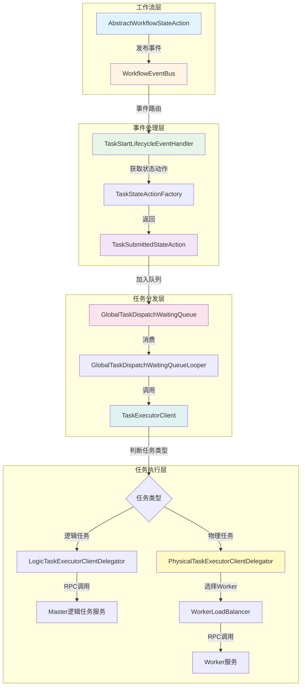
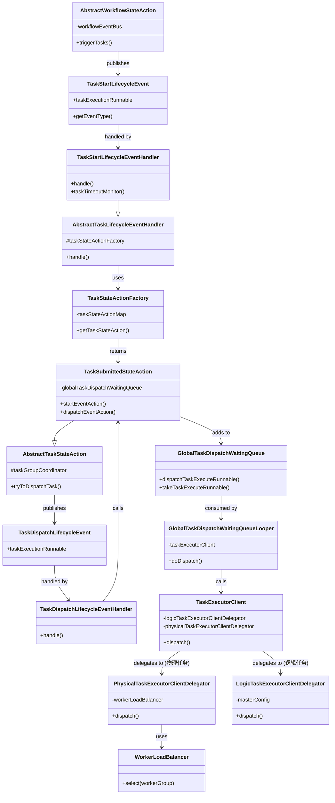
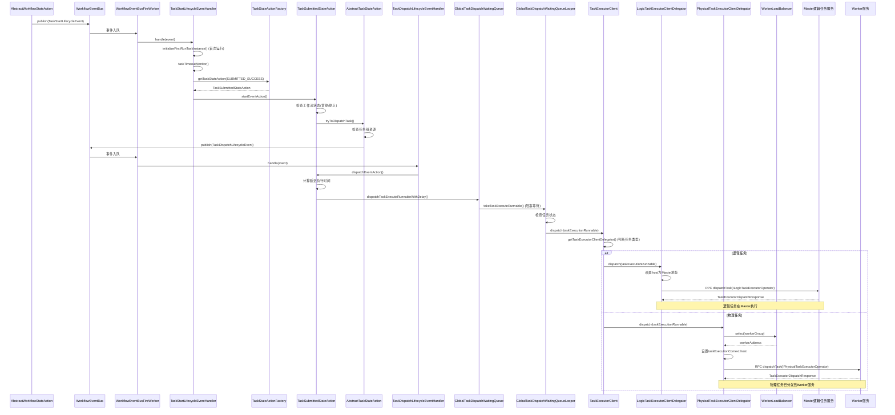
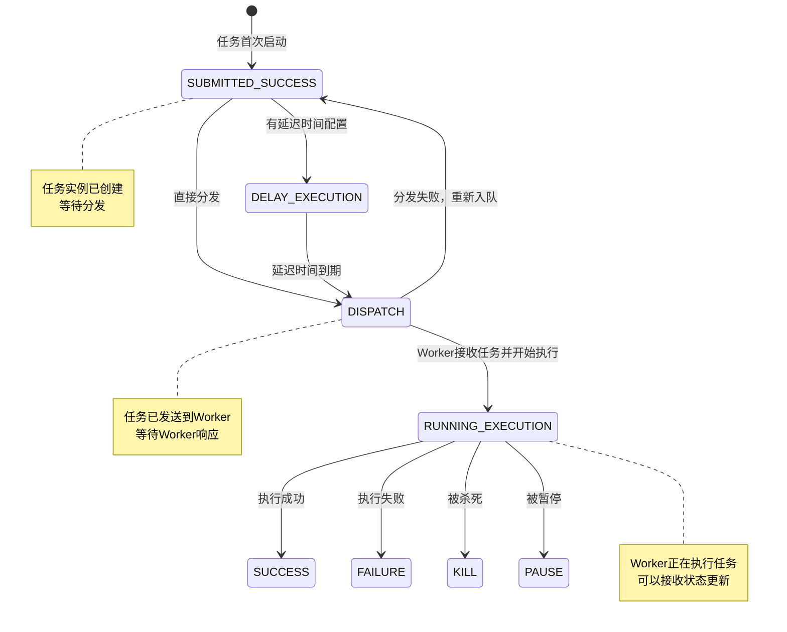
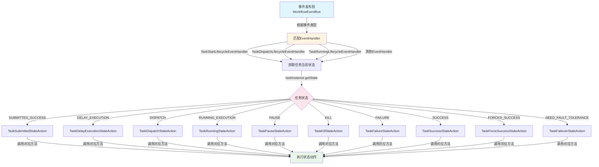
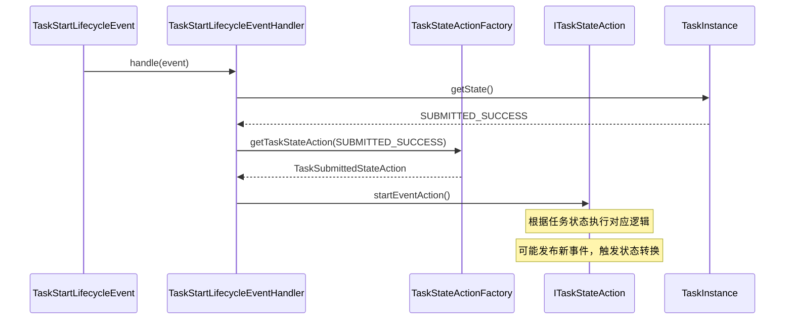

# 开始处理任务流程详细分析

## 1. 流程概述

本文档详细分析从工作流状态动作触发任务开始，到最终调用Worker服务处理任务的完整流程。整个流程涉及事件驱动架构、状态机模式、任务分发队列等多个核心组件。

**流程起点**: `AbstractWorkflowStateAction.triggerTasks()` 发布 `TaskStartLifecycleEvent`  
**流程终点**: `PhysicalTaskExecutorClientDelegator.dispatch()` 通过RPC调用Worker服务

## 2. 核心组件架构

### 2.1 组件关系图



### 2.2 类图



## 3. 详细流程分析

### 3.1 阶段一：工作流触发任务启动

**位置**: `AbstractWorkflowStateAction.triggerTasks()`

```java
protected void triggerTasks(final IWorkflowExecutionRunnable workflowExecutionRunnable,
                            final List<ITaskExecutionRunnable> taskExecutionRunnables) {
    // 1. 过滤出满足触发条件的任务
    final List<ITaskExecutionRunnable> readyTaskExecutionRunnableList = taskExecutionRunnables
            .stream()
            .filter(workflowExecutionGraph::isTriggerConditionMet)
            .collect(Collectors.toList());
    
    // 2. 遍历就绪任务，发布启动事件
    for (ITaskExecutionRunnable readyTaskExecutionRunnable : readyTaskExecutionRunnableList) {
        workflowExecutionGraph.markTaskExecutionRunnableActive(readyTaskExecutionRunnable);
        
        // 3. 检查任务是否被跳过或禁止
        if (workflowExecutionGraph.isTaskExecutionRunnableSkipped(readyTaskExecutionRunnable)
                || workflowExecutionGraph.isTaskExecutionRunnableForbidden(readyTaskExecutionRunnable)) {
            // 发布任务完成事件
            workflowEventBus.publish(
                    WorkflowTopologyLogicalTransitionWithTaskFinishLifecycleEvent.of(
                            workflowExecutionRunnable, readyTaskExecutionRunnable));
            continue;
        }
        
        // 4. 发布任务启动事件
        workflowEventBus.publish(TaskStartLifecycleEvent.of(readyTaskExecutionRunnable));
    }
}
```

**关键点**:
- 通过 `isTriggerConditionMet()` 检查任务的触发条件（前置任务是否完成）
- 将任务标记为活跃状态 `markTaskExecutionRunnableActive()`
- 通过 `WorkflowEventBus` 发布 `TaskStartLifecycleEvent`

### 3.2 阶段二：任务启动事件处理

**位置**: `TaskStartLifecycleEventHandler.handle()`

```java
@Override
public void handle(final IWorkflowExecutionRunnable workflowExecutionRunnable,
                   final TaskStartLifecycleEvent taskStartLifecycleEvent) {
    final ITaskExecutionRunnable taskExecutionRunnable = taskStartLifecycleEvent.getTaskExecutionRunnable();
    
    // 1. 初始化任务实例（首次运行）
    if (!taskExecutionRunnable.isTaskInstanceInitialized()) {
        taskExecutionRunnable.initializeFirstRunTaskInstance();
    }
    
    // 2. 启动超时监控
    taskTimeoutMonitor(taskExecutionRunnable);
    
    // 3. 调用父类处理，路由到对应的TaskStateAction
    super.handle(workflowExecutionRunnable, taskStartLifecycleEvent);
}
```

**任务实例初始化**:
- 首次运行的任务需要通过 `initializeFirstRunTaskInstance()` 创建 `TaskInstance`
- 创建的任务实例状态为 `SUBMITTED_SUCCESS`

**超时监控**:
```java
private void taskTimeoutMonitor(final ITaskExecutionRunnable taskExecutionRunnable) {
    final TaskDefinition taskDefinition = taskExecutionRunnable.getTaskDefinition();
    if (taskDefinition.getTimeout() <= 0) {
        return; // 无超时配置，不启动监控
    }
    // 发布超时事件（延迟执行）
    taskExecutionRunnable.getWorkflowEventBus()
            .publish(TaskTimeoutLifecycleEvent.of(taskExecutionRunnable));
}
```

**事件路由机制** (`AbstractTaskLifecycleEventHandler.handle()`):
```java
@Override
public void handle(final IWorkflowExecutionRunnable workflowExecutionRunnable,
                   final T event) {
    final ITaskExecutionRunnable taskExecutionRunnable = event.getTaskExecutionRunnable();
    
    // 1. 获取任务当前状态
    final TaskExecutionStatus state = taskExecutionRunnable.getTaskInstance().getState();
    
    // 2. 根据状态获取对应的StateAction
    final ITaskStateAction taskStateAction = taskStateActionFactory.getTaskStateAction(state);
    
    // 3. 调用具体的handle方法
    handle(taskStateAction, workflowExecutionRunnable, taskExecutionRunnable, event);
}
```

**状态动作工厂** (`TaskStateActionFactory`):
- 维护 `TaskExecutionStatus` 到 `ITaskStateAction` 的映射
- 通过 `matchState()` 方法匹配对应的状态动作实现
- 例如：`SUBMITTED_SUCCESS` → `TaskSubmittedStateAction`

**事件路由机制详解**:

当事件发布到 `WorkflowEventBus` 后，事件处理流程如下：

1. **事件类型匹配**: `WorkflowEventBusFireWorker` 根据事件的 `getEventType()` 方法找到对应的 `ILifecycleEventHandler`
2. **获取任务状态**: Handler 从事件中获取 `taskExecutionRunnable`，然后获取任务的当前状态 `taskInstance.getState()`
3. **状态动作匹配**: 通过 `TaskStateActionFactory.getTaskStateAction(state)` 根据任务状态获取对应的 `ITaskStateAction`
4. **执行状态动作**: Handler 调用 `ITaskStateAction` 的对应方法处理事件

**关键点**: 
- **事件类型**决定使用哪个Handler
- **任务状态**决定使用哪个StateAction
- 同一个事件类型，在不同状态下会路由到不同的StateAction

### 3.3 阶段三：任务提交状态动作处理

**位置**: `TaskSubmittedStateAction.startEventAction()`

```java
@Override
public void startEventAction(final IWorkflowExecutionRunnable workflowExecutionRunnable,
                             final ITaskExecutionRunnable taskExecutionRunnable,
                             final TaskStartLifecycleEvent taskStartEvent) {
    throwExceptionIfStateIsNotMatch(taskExecutionRunnable);
    
    // 1. 检查工作流是否准备暂停
    if (workflowExecutionRunnable.isWorkflowReadyPause()) {
        workflowExecutionRunnable.getWorkflowEventBus()
                .publish(TaskPausedLifecycleEvent.of(taskExecutionRunnable));
        return;
    }
    
    // 2. 检查工作流是否准备停止
    if (workflowExecutionRunnable.isWorkflowReadyStop()) {
        workflowExecutionRunnable.getWorkflowEventBus()
                .publish(TaskKilledLifecycleEvent.of(taskExecutionRunnable));
        return;
    }
    
    // 3. 尝试分发任务
    tryToDispatchTask(taskExecutionRunnable);
}
```

**任务分发准备** (`AbstractTaskStateAction.tryToDispatchTask()`):
```java
protected void tryToDispatchTask(final ITaskExecutionRunnable taskExecutionRunnable) {
    // 1. 检查是否需要任务组资源
    if (isTaskNeedAcquireTaskGroupSlot(taskExecutionRunnable)) {
        acquireTaskGroupSlot(taskExecutionRunnable);
        log.info("Task{} using taskGroup, success acquire taskGroup slot", 
                taskExecutionRunnable.getName());
        return; // 获取到资源后，等待后续唤醒
    }
    
    // 2. 发布任务分发事件
    taskExecutionRunnable.getWorkflowEventBus()
            .publish(TaskDispatchLifecycleEvent.of(taskExecutionRunnable));
}
```

**任务组资源管理**:
- 某些任务需要任务组资源才能执行
- 通过 `TaskGroupCoordinator` 管理资源槽位
- 如果获取到资源，任务会等待后续的 `TaskDispatchLifecycleEvent` 唤醒

### 3.4 阶段四：任务分发事件处理

**位置**: `TaskDispatchLifecycleEventHandler.handle()`

```java
@Override
public void handle(final ITaskStateAction taskStateAction,
                   final IWorkflowExecutionRunnable workflowExecutionRunnable,
                   final ITaskExecutionRunnable taskExecutionRunnable,
                   final TaskDispatchLifecycleEvent event) {
    taskStateAction.dispatchEventAction(workflowExecutionRunnable, taskExecutionRunnable, event);
}
```

**分发事件动作** (`TaskSubmittedStateAction.dispatchEventAction()`):
```java
@Override
public void dispatchEventAction(final IWorkflowExecutionRunnable workflowExecutionRunnable,
                                final ITaskExecutionRunnable taskExecutionRunnable,
                                final TaskDispatchLifecycleEvent taskDispatchEvent) {
    throwExceptionIfStateIsNotMatch(taskExecutionRunnable);
    final TaskInstance taskInstance = taskExecutionRunnable.getTaskInstance();
    
    // 1. 计算延迟执行时间
    long remainTimeMills = DateUtils.getRemainTime(
            taskInstance.getFirstSubmitTime(),
            taskInstance.getDelayTime() * 60L) * 1_000;
    
    // 2. 如果还有延迟时间，更新状态为DELAY_EXECUTION
    if (remainTimeMills > 0) {
        taskInstance.setState(TaskExecutionStatus.DELAY_EXECUTION);
        taskInstanceDao.updateById(taskInstance);
        log.info("Current taskInstance: {} is choose delay execution, delay time: {}/min, remainTime: {}/ms",
                taskInstance.getName(), taskInstance.getDelayTime(), remainTimeMills);
    }
    
    // 3. 将任务加入分发等待队列（带延迟）
    globalTaskDispatchWaitingQueue.dispatchTaskExecuteRunnableWithDelay(
            taskExecutionRunnable, remainTimeMills);
}
```

**延迟执行机制**:
- 支持任务延迟执行（`delayTime` 配置）
- 通过 `PriorityDelayQueue` 实现延迟队列
- 延迟时间到期后，任务才会被取出执行

### 3.5 阶段五：全局任务分发队列处理

**位置**: `GlobalTaskDispatchWaitingQueueLooper.doDispatch()`

```java
void doDispatch() {
    // 1. 从队列中取出任务（阻塞等待）
    final ITaskExecutionRunnable taskExecutionRunnable = 
            globalTaskDispatchWaitingQueue.takeTaskExecuteRunnable();
    final TaskInstance taskInstance = taskExecutionRunnable.getTaskInstance();
    
    try {
        // 2. 检查任务状态
        final TaskExecutionStatus status = taskInstance.getState();
        if (status != TaskExecutionStatus.SUBMITTED_SUCCESS 
                && status != TaskExecutionStatus.DELAY_EXECUTION) {
            log.warn("The TaskInstance {} state is : {}, will not dispatch", 
                    taskInstance.getName(), status);
            return;
        }
        
        // 3. 调用分发客户端
        taskExecutorClient.dispatch(taskExecutionRunnable);
        
    } catch (Exception e) {
        // 4. 分发失败，重新加入队列（带退避延迟）
        long waitingTimeMills = Math.min(
                taskExecutionRunnable.getTaskExecutionContext()
                        .increaseDispatchFailTimes() * 1_000L, 
                60_000L);
        globalTaskDispatchWaitingQueue.dispatchTaskExecuteRunnableWithDelay(
                taskExecutionRunnable, waitingTimeMills);
        log.error("Dispatch Task: {} failed will retry after: {}/ms", 
                taskInstance.getName(), waitingTimeMills, e);
    }
}
```

**队列机制**:
- `GlobalTaskDispatchWaitingQueue` 使用 `PriorityDelayQueue` 实现优先级延迟队列
- 队列中的任务按优先级和延迟时间排序
- `GlobalTaskDispatchWaitingQueueLooper` 是后台线程，持续从队列中取出任务并分发
- 支持任务重试机制，失败后按指数退避重新入队（最多60秒）

**队列数据结构**:
```java
// GlobalTaskDispatchWaitingQueue
private final Set<Integer> waitingTaskInstanceIds = ConcurrentHashMap.newKeySet();
private final PriorityDelayQueue<DelayEntry<ITaskExecutionRunnable>> priorityDelayQueue;

// 添加任务到队列
public synchronized void dispatchTaskExecuteRunnableWithDelay(
        ITaskExecutionRunnable taskExecutionRunnable, long delayTimeMills) {
    waitingTaskInstanceIds.add(taskExecutionRunnable.getTaskInstance().getId());
    priorityDelayQueue.add(new DelayEntry<>(delayTimeMills, taskExecutionRunnable));
}
```

### 3.6 阶段六：任务执行客户端分发

**位置**: `TaskExecutorClient.dispatch()`

```java
@Override
public void dispatch(ITaskExecutionRunnable taskExecutionRunnable) throws TaskDispatchException {
    try {
        // 根据任务类型选择对应的委托器
        getTaskExecutorClientDelegator(taskExecutionRunnable).dispatch(taskExecutionRunnable);
    } catch (TaskDispatchException taskDispatchException) {
        throw taskDispatchException;
    } catch (Exception ex) {
        throw new TaskDispatchException("Dispatch task: " + taskExecutionRunnable.getName() 
                + " to executor failed", ex);
    }
}

private ITaskExecutorClientDelegator getTaskExecutorClientDelegator(
        final ITaskExecutionRunnable taskExecutionRunnable) {
    final TaskInstance taskInstance = taskExecutionRunnable.getTaskInstance();
    // 判断是逻辑任务还是物理任务
    if (TaskTypeUtils.isLogicTask(taskInstance.getTaskType())) {
        return logicTaskExecutorClientDelegator; // 逻辑任务在Master执行
    }
    return physicalTaskExecutorClientDelegator; // 物理任务在Worker执行
}
```

**任务类型判断**:
- **逻辑任务** (Logic Task): 在Master节点执行，如条件判断、子工作流等
- **物理任务** (Physical Task): 在Worker节点执行，如Shell、Python、Spark等

### 3.7 阶段七-A：逻辑任务处理（LogicTask）

**位置**: `LogicTaskExecutorClientDelegator.dispatch()`

逻辑任务在Master节点本地执行，不需要分发到Worker。

```java
@Override
public void dispatch(final ITaskExecutionRunnable taskExecutionRunnable) throws TaskDispatchException {
    // 1. 获取Master节点地址
    final String logicTaskExecutorAddress = masterConfig.getMasterAddress();
    final TaskExecutionContext taskExecutionContext = taskExecutionRunnable.getTaskExecutionContext();
    
    // 2. 设置任务执行上下文的主机信息为Master地址
    taskExecutionContext.setHost(logicTaskExecutorAddress);
    taskExecutionRunnable.getTaskInstance().setHost(logicTaskExecutorAddress);
    
    // 3. 通过RPC调用Master自己的逻辑任务执行服务
    final TaskExecutorDispatchResponse logicTaskDispatchResponse = Clients
            .withService(ILogicTaskExecutorOperator.class)
            .withHost(logicTaskExecutorAddress)
            .dispatchTask(TaskExecutorDispatchRequest.of(taskExecutionContext));
    
    // 4. 检查分发结果
    if (!logicTaskDispatchResponse.isDispatchSuccess()) {
        throw new TaskDispatchException(
                String.format("Dispatch LogicTask to %s failed, response is: %s",
                        taskExecutionContext.getHost(), logicTaskDispatchResponse));
    }
}
```

**关键特点**:
1. **本地执行**: 逻辑任务在Master节点执行，不需要选择Worker
2. **地址设置**: 直接使用 `masterConfig.getMasterAddress()` 作为执行地址
3. **服务接口**: 使用 `ILogicTaskExecutorOperator` 接口，而不是 `IPhysicalTaskExecutorOperator`
4. **RPC调用**: 虽然是本地调用，但依然通过RPC框架统一处理

**逻辑任务类型**:
- **条件任务** (Condition Task): 根据条件判断执行分支
- **子工作流** (Sub Workflow): 调用其他工作流
- **依赖任务** (Dependent Task): 依赖外部任务状态
- 其他不需要在Worker执行的任务类型

**与物理任务的区别**:

| 特性 | 逻辑任务 (LogicTask) | 物理任务 (PhysicalTask) |
|------|---------------------|------------------------|
| 执行位置 | Master节点 | Worker节点 |
| 负载均衡 | 不需要 | 需要选择Worker |
| 服务接口 | `ILogicTaskExecutorOperator` | `IPhysicalTaskExecutorOperator` |
| 地址设置 | Master地址 | 选中的Worker地址 |
| 任务类型 | 条件、子工作流等 | Shell、Python、Spark等 |

### 3.7 阶段七-B：物理任务处理（PhysicalTask）

**位置**: `PhysicalTaskExecutorClientDelegator.dispatch()`

```java
@Override
public void dispatch(final ITaskExecutionRunnable taskExecutionRunnable) throws TaskDispatchException {
    final TaskExecutionContext taskExecutionContext = taskExecutionRunnable.getTaskExecutionContext();
    final String taskName = taskExecutionContext.getTaskName();
    
    // 1. 通过负载均衡器选择Worker节点
    final String physicalTaskExecutorAddress = workerLoadBalancer
            .select(taskExecutionContext.getWorkerGroup())
            .map(Host::of)
            .map(Host::getAddress)
            .orElseThrow(() -> new TaskDispatchException(
                    String.format("Cannot find the host to dispatch Task[id=%s, name=%s, workerGroup=%s]",
                            taskExecutionContext.getTaskInstanceId(), taskName,
                            taskExecutionContext.getWorkerGroup())));
    
    // 2. 设置任务执行上下文的主机信息
    taskExecutionContext.setHost(physicalTaskExecutorAddress);
    taskExecutionRunnable.getTaskInstance().setHost(physicalTaskExecutorAddress);
    
    try {
        // 3. 通过RPC调用Worker服务分发任务
        final TaskExecutorDispatchResponse taskExecutorDispatchResponse = Clients
                .withService(IPhysicalTaskExecutorOperator.class)
                .withHost(physicalTaskExecutorAddress)
                .dispatchTask(TaskExecutorDispatchRequest.of(taskExecutionRunnable.getTaskExecutionContext()));
        
        // 4. 检查分发结果
        if (!taskExecutorDispatchResponse.isDispatchSuccess()) {
            throw new TaskDispatchException(
                    "Dispatch task: " + taskName + " to " + physicalTaskExecutorAddress 
                    + " failed: " + taskExecutorDispatchResponse);
        }
    } catch (TaskDispatchException e) {
        throw e;
    } catch (Exception e) {
        throw new TaskDispatchException(
                "Dispatch task: " + taskName + " to " + physicalTaskExecutorAddress + " failed", e);
    }
}
```

**关键步骤**:
1. **Worker选择**: 通过 `IWorkerLoadBalancer` 根据Worker组选择可用的Worker节点
2. **上下文设置**: 将选中的Worker地址设置到 `TaskExecutionContext` 和 `TaskInstance`
3. **RPC调用**: 使用 `Clients` 工具类通过 `IPhysicalTaskExecutorOperator` 接口调用Worker服务
4. **结果验证**: 检查 `TaskExecutorDispatchResponse` 确认分发是否成功

**Worker负载均衡**:
- 支持按Worker组（WorkerGroup）选择Worker
- 负载均衡策略可配置（轮询、随机等）
- 自动过滤不可用的Worker节点

## 4. 完整时序图



## 5. 任务状态转换图



## 6. 事件流转图

```mermaid
graph LR
    A[TaskStartLifecycleEvent] -->|TaskStartLifecycleEventHandler| B[TaskSubmittedStateAction]
    B -->|发布| C[TaskDispatchLifecycleEvent]
    C -->|TaskDispatchLifecycleEventHandler| D[TaskSubmittedStateAction.dispatchEventAction]
    D -->|加入队列| E[GlobalTaskDispatchWaitingQueue]
    E -->|消费| F[GlobalTaskDispatchWaitingQueueLooper]
    F -->|调用| G[TaskExecutorClient.dispatch]
    G -->|判断任务类型| H{任务类型}
    H -->|逻辑任务| I1[LogicTaskExecutorClientDelegator]
    H -->|物理任务| I2[PhysicalTaskExecutorClientDelegator]
    I1 -->|RPC| J1[Master逻辑任务服务]
    I2 -->|选择Worker| K[WorkerLoadBalancer]
    K -->|RPC| J2[Worker服务]
    
    J1 -->|成功响应| I[TaskDispatchedLifecycleEvent]
    J2 -->|成功响应| I[TaskDispatchedLifecycleEvent]
    I -->|TaskDispatchedLifecycleEventHandler| J[TaskDispatchStateAction.dispatchedEventAction]
    J -->|更新状态| K[TaskInstance.state = DISPATCH]
    
    J1 -->|开始执行| L[TaskRunningLifecycleEvent]
    J2 -->|开始执行| L[TaskRunningLifecycleEvent]
    L -->|TaskRunningLifecycleEventHandler| M[TaskDispatchStateAction.startedEventAction]
    M -->|更新状态| N[TaskInstance.state = RUNNING_EXECUTION]
    
    style A fill:#e1f5ff
    style C fill:#fff4e1
    style H fill:#fce4ec
    style I1 fill:#e8f5e9
    style I2 fill:#f3e5f5
    style J1 fill:#fff9c4
    style J2 fill:#e0f2f1
    style I fill:#c8e6c9
    style L fill:#bbdefb
```



## 7. 任务状态与StateAction映射关系

### 7.1 TaskExecutionStatus 枚举

任务执行状态枚举定义在 `TaskExecutionStatus` 中：

```java
public enum TaskExecutionStatus {
    SUBMITTED_SUCCESS(0, "submit success"),      // 提交成功
    RUNNING_EXECUTION(1, "running"),             // 运行中
    PAUSE(3, "pause"),                          // 暂停
    FAILURE(6, "failure"),                      // 失败
    SUCCESS(7, "success"),                      // 成功
    NEED_FAULT_TOLERANCE(8, "need fault tolerance"), // 需要容错
    KILL(9, "kill"),                            // 杀死
    DELAY_EXECUTION(12, "delay execution"),     // 延迟执行
    FORCED_SUCCESS(13, "forced success"),       // 强制成功
    DISPATCH(17, "dispatch"),                   // 分发中
}
```

### 7.2 状态到StateAction的映射表

| TaskExecutionStatus | ITaskStateAction实现 | 说明 |
|---------------------|---------------------|------|
| `SUBMITTED_SUCCESS` | `TaskSubmittedStateAction` | 任务已提交，等待分发 |
| `DELAY_EXECUTION` | `TaskDelayExecutionStateAction` | 延迟执行状态（继承自TaskSubmittedStateAction） |
| `DISPATCH` | `TaskDispatchStateAction` | 任务已分发到执行器 |
| `RUNNING_EXECUTION` | `TaskRunningStateAction` | 任务正在执行 |
| `PAUSE` | `TaskPauseStateAction` | 任务已暂停 |
| `KILL` | `TaskKillStateAction` | 任务已杀死 |
| `FAILURE` | `TaskFailureStateAction` | 任务执行失败 |
| `SUCCESS` | `TaskSuccessStateAction` | 任务执行成功 |
| `FORCED_SUCCESS` | `TaskForceSuccessStateAction` | 任务强制成功（继承自TaskSuccessStateAction） |
| `NEED_FAULT_TOLERANCE` | `TaskFailoverStateAction` | 任务需要容错处理 |

### 7.3 事件类型与EventHandler的映射表

| TaskLifecycleEventType | EventHandler实现 | 处理的事件类型 |
|------------------------|-----------------|---------------|
| `START` | `TaskStartLifecycleEventHandler` | `TaskStartLifecycleEvent` |
| `DISPATCH` | `TaskDispatchLifecycleEventHandler` | `TaskDispatchLifecycleEvent` |
| `DISPATCHED` | `TaskDispatchedLifecycleEventHandler` | `TaskDispatchedLifecycleEvent` |
| `RUNNING` | `TaskRunningLifecycleEventHandler` | `TaskRunningLifecycleEvent` |
| `RUNTIME_CONTEXT_CHANGED` | `TaskRuntimeContextChangedLifecycleEventHandler` | `TaskRuntimeContextChangedEvent` |
| `TIMEOUT` | `TaskTimeoutLifecycleEventHandler` | `TaskTimeoutLifecycleEvent` |
| `RETRY` | `TaskRetryLifecycleEventHandler` | `TaskRetryLifecycleEvent` |
| `PAUSE` | `TaskPauseLifecycleEventHandler` | `TaskPauseLifecycleEvent` |
| `PAUSED` | `TaskPausedLifecycleEventHandler` | `TaskPausedLifecycleEvent` |
| `FAILOVER` | `TaskFailoverLifecycleEventHandler` | `TaskFailoverLifecycleEvent` |
| `KILL` | `TaskKillLifecycleEventHandler` | `TaskKillLifecycleEvent` |
| `KILLED` | `TaskKilledLifecycleEventHandler` | `TaskKilledLifecycleEvent` |
| `SUCCEEDED` | `TaskSuccessLifecycleEventHandler` | `TaskSuccessLifecycleEvent` |
| `FAILED` | `TaskFailedLifecycleEventHandler` | `TaskFailedLifecycleEvent` |

### 7.4 事件路由到StateAction的完整流程



### 7.5 事件到StateAction方法的路由表

不同的事件类型会调用StateAction的不同方法：

| 事件类型 | EventHandler | StateAction方法 | 说明 |
|---------|-------------|----------------|------|
| `START` | `TaskStartLifecycleEventHandler` | `startEventAction()` | 启动任务 |
| `DISPATCH` | `TaskDispatchLifecycleEventHandler` | `dispatchEventAction()` | 分发任务 |
| `DISPATCHED` | `TaskDispatchedLifecycleEventHandler` | `dispatchedEventAction()` | 任务已分发 |
| `RUNNING` | `TaskRunningLifecycleEventHandler` | `startedEventAction()` | 任务已开始运行 |
| `RUNTIME_CONTEXT_CHANGED` | `TaskRuntimeContextChangedLifecycleEventHandler` | `runtimeContextChangedEventAction()` | 运行时上下文变更 |
| `RETRY` | `TaskRetryLifecycleEventHandler` | `retryEventAction()` | 重试任务 |
| `PAUSE` | `TaskPauseLifecycleEventHandler` | `pauseEventAction()` | 暂停任务 |
| `PAUSED` | `TaskPausedLifecycleEventHandler` | `pausedEventAction()` | 任务已暂停 |
| `KILL` | `TaskKillLifecycleEventHandler` | `killEventAction()` | 杀死任务 |
| `KILLED` | `TaskKilledLifecycleEventHandler` | `killedEventAction()` | 任务已杀死 |
| `SUCCEEDED` | `TaskSuccessLifecycleEventHandler` | `succeedEventAction()` | 任务成功 |
| `FAILED` | `TaskFailedLifecycleEventHandler` | `failedEventAction()` | 任务失败 |
| `FAILOVER` | `TaskFailoverLifecycleEventHandler` | `failoverEventAction()` | 任务容错 |

### 7.6 状态流转示例

以任务启动流程为例，展示状态如何流转：



**关键理解**:
1. **事件类型** → 决定使用哪个Handler
2. **任务状态** → 决定使用哪个StateAction
3. **StateAction方法** → 根据事件类型调用对应的方法
4. **状态转换** → StateAction执行后可能发布新事件，触发状态转换

### 7.7 实际路由示例

**示例1: TaskStartLifecycleEvent在不同状态下的路由**

| 任务当前状态 | 路由到的StateAction | 调用的方法 |
|------------|-------------------|----------|
| `SUBMITTED_SUCCESS` | `TaskSubmittedStateAction` | `startEventAction()` |
| `DELAY_EXECUTION` | `TaskDelayExecutionStateAction` | `startEventAction()` |
| `DISPATCH` | `TaskDispatchStateAction` | `startEventAction()` |
| `RUNNING_EXECUTION` | `TaskRunningStateAction` | `startEventAction()` |

**示例2: TaskDispatchLifecycleEvent在不同状态下的路由**

| 任务当前状态 | 路由到的StateAction | 调用的方法 |
|------------|-------------------|----------|
| `SUBMITTED_SUCCESS` | `TaskSubmittedStateAction` | `dispatchEventAction()` |
| `DELAY_EXECUTION` | `TaskDelayExecutionStateAction` | `dispatchEventAction()` |
| `DISPATCH` | `TaskDispatchStateAction` | `dispatchEventAction()` |

**注意**: 同一个事件类型，在不同状态下会路由到不同的StateAction，每个StateAction对同一事件的处理逻辑可能不同。

### 7.8 StateAction的继承关系

部分StateAction存在继承关系，共享基础逻辑：

```
AbstractTaskStateAction (抽象基类)
    ├── TaskSubmittedStateAction
    │   └── TaskDelayExecutionStateAction (继承)
    ├── TaskDispatchStateAction
    ├── TaskRunningStateAction
    ├── TaskPauseStateAction
    ├── TaskKillStateAction
    ├── TaskFailureStateAction
    ├── TaskSuccessStateAction
    │   └── TaskForceSuccessStateAction (继承)
    └── TaskFailoverStateAction
```

**继承优势**:
- `TaskDelayExecutionStateAction` 继承 `TaskSubmittedStateAction`，复用提交状态的逻辑
- `TaskForceSuccessStateAction` 继承 `TaskSuccessStateAction`，复用成功状态的逻辑
- 减少代码重复，提高可维护性

## 8. 关键设计模式

### 8.1 状态机模式 (State Machine Pattern)

**实现**: `ITaskStateAction` 接口及其实现类

- **目的**: 根据任务当前状态，执行对应的状态动作
- **状态动作映射**:
    - `SUBMITTED_SUCCESS` → `TaskSubmittedStateAction`
    - `DISPATCH` → `TaskDispatchStateAction`
    - `RUNNING_EXECUTION` → `TaskRunningStateAction`
    - `PAUSE` → `TaskPauseStateAction`
    - `KILL` → `TaskKillStateAction`
    - 等等...

**优势**:
- 状态转换逻辑清晰
- 易于扩展新状态
- 状态动作与状态解耦

### 8.2 事件驱动架构 (Event-Driven Architecture)

**实现**: `WorkflowEventBus` + `ILifecycleEventHandler`

- **事件发布**: 通过 `WorkflowEventBus.publish()` 发布事件
- **事件处理**: `WorkflowEventBusFireWorker` 异步处理事件
- **事件路由**: 根据 `ILifecycleEventType` 匹配对应的Handler

**事件类型**:
- `TaskStartLifecycleEvent` - 任务启动
- `TaskDispatchLifecycleEvent` - 任务分发
- `TaskDispatchedLifecycleEvent` - 任务已分发
- `TaskRunningLifecycleEvent` - 任务运行中
- `TaskSuccessLifecycleEvent` - 任务成功
- `TaskFailedLifecycleEvent` - 任务失败
- 等等...

### 8.3 策略模式 (Strategy Pattern)

**实现**: `ITaskExecutorClientDelegator` 接口及其实现

- **逻辑任务**: `LogicTaskExecutorClientDelegator` - 在Master执行
- **物理任务**: `PhysicalTaskExecutorClientDelegator` - 在Worker执行

**选择策略**:
```java
private ITaskExecutorClientDelegator getTaskExecutorClientDelegator(
        final ITaskExecutionRunnable taskExecutionRunnable) {
    final TaskInstance taskInstance = taskExecutionRunnable.getTaskInstance();
    // 根据任务类型选择对应的委托器
    if (TaskTypeUtils.isLogicTask(taskInstance.getTaskType())) {
        return logicTaskExecutorClientDelegator;  // 逻辑任务
    }
    return physicalTaskExecutorClientDelegator;   // 物理任务
}
```

**策略选择时机**:
- 在 `TaskExecutorClient.dispatch()` 方法中动态选择
- 根据 `TaskInstance.getTaskType()` 判断任务类型
- 使用 `TaskTypeUtils.isLogicTask()` 工具方法判断

**两种策略的区别**:

| 特性 | LogicTaskExecutorClientDelegator | PhysicalTaskExecutorClientDelegator |
|------|--------------------------------|-----------------------------------|
| 执行位置 | Master节点本地 | Worker节点（远程） |
| 地址选择 | 使用Master地址 | 通过负载均衡选择Worker |
| RPC接口 | `ILogicTaskExecutorOperator` | `IPhysicalTaskExecutorOperator` |
| 适用任务 | 条件、子工作流等 | Shell、Python、Spark等 |

### 8.4 工厂模式 (Factory Pattern)

**实现**: `TaskStateActionFactory`

- **目的**: 根据任务状态创建对应的状态动作实例
- **实现**: 维护状态到动作的映射表

### 8.5 队列模式 (Queue Pattern)

**实现**: `GlobalTaskDispatchWaitingQueue` + `GlobalTaskDispatchWaitingQueueLooper`

- **目的**: 解耦任务分发逻辑，支持延迟执行和重试
- **特性**:
    - 优先级队列
    - 延迟队列
    - 重试机制

## 9. 关键数据结构

### 9.1 TaskExecutionContext

任务执行上下文，包含任务执行所需的所有信息：

```java
public class TaskExecutionContext {
    private int taskInstanceId;          // 任务实例ID
    private String taskName;              // 任务名称
    private String taskType;              // 任务类型
    private String host;                  // 执行主机
    private String workerGroup;           // Worker组
    private Map<String, String> params;   // 任务参数
    private String varPool;               // 变量池
    // ... 更多字段
}
```

### 9.2 TaskInstance

任务实例，持久化到数据库：

```java
public class TaskInstance {
    private int id;                       // 任务实例ID
    private String name;                  // 任务名称
    private TaskExecutionStatus state;    // 执行状态
    private String host;                  // 执行主机
    private Date startTime;               // 开始时间
    private Date endTime;                 // 结束时间
    private long delayTime;               // 延迟时间(分钟)
    // ... 更多字段
}
```

## 10. 异常处理机制

### 10.1 分发失败重试

**位置**: `GlobalTaskDispatchWaitingQueueLooper.doDispatch()`

```java
catch (Exception e) {
    // 计算重试延迟时间（指数退避，最多60秒）
    long waitingTimeMills = Math.min(
            taskExecutionRunnable.getTaskExecutionContext()
                    .increaseDispatchFailTimes() * 1_000L, 
            60_000L);
    globalTaskDispatchWaitingQueue.dispatchTaskExecuteRunnableWithDelay(
            taskExecutionRunnable, waitingTimeMills);
    log.error("Dispatch Task: {} failed will retry after: {}/ms", 
            taskInstance.getName(), waitingTimeMills, e);
}
```

**重试策略**:
- 使用指数退避算法，失败次数越多，等待时间越长
- 最大等待时间限制为60秒
- 失败的任务会重新加入队列，等待重试

### 10.2 Worker选择失败

**位置**: `PhysicalTaskExecutorClientDelegator.dispatch()`

```java
final String physicalTaskExecutorAddress = workerLoadBalancer
        .select(taskExecutionContext.getWorkerGroup())
        .map(Host::of)
        .map(Host::getAddress)
        .orElseThrow(() -> new TaskDispatchException(
                String.format("Cannot find the host to dispatch Task[id=%s, name=%s, workerGroup=%s]",
                        taskExecutionContext.getTaskInstanceId(), taskName,
                        taskExecutionContext.getWorkerGroup())));
```

**处理方式**:
- 如果Worker组中没有可用的Worker，抛出 `TaskDispatchException`
- 异常会被 `GlobalTaskDispatchWaitingQueueLooper` 捕获，触发重试机制

### 10.3 RPC调用失败

**位置**: `PhysicalTaskExecutorClientDelegator.dispatch()`

```java
try {
    final TaskExecutorDispatchResponse taskExecutorDispatchResponse = Clients
            .withService(IPhysicalTaskExecutorOperator.class)
            .withHost(physicalTaskExecutorAddress)
            .dispatchTask(TaskExecutorDispatchRequest.of(taskExecutionRunnable.getTaskExecutionContext()));
    
    if (!taskExecutorDispatchResponse.isDispatchSuccess()) {
        throw new TaskDispatchException("Dispatch task: " + taskName + " to " 
                + physicalTaskExecutorAddress + " failed: " + taskExecutorDispatchResponse);
    }
} catch (TaskDispatchException e) {
    throw e;
} catch (Exception e) {
    throw new TaskDispatchException("Dispatch task: " + taskName + " to " 
            + physicalTaskExecutorAddress + " failed", e);
}
```

**处理方式**:
- RPC调用失败或返回失败响应，都会抛出 `TaskDispatchException`
- 异常会向上传播，最终被队列处理器捕获并重试

## 11. 任务分发后的状态更新

### 11.1 TaskDispatchedLifecycleEvent 处理

当任务成功分发到Worker后，会发布 `TaskDispatchedLifecycleEvent` 事件：

**位置**: Worker服务响应分发请求后（通过回调或RPC响应）

**处理流程**:
```java
// TaskDispatchedLifecycleEventHandler.handle()
@Override
public void handle(final ITaskStateAction taskStateAction,
                   final IWorkflowExecutionRunnable workflowExecutionRunnable,
                   final ITaskExecutionRunnable taskExecutionRunnable,
                   final TaskDispatchedLifecycleEvent taskDispatchedEvent) {
    // 1. 更新任务状态为DISPATCH
    taskStateAction.dispatchedEventAction(workflowExecutionRunnable, 
            taskExecutionRunnable, taskDispatchedEvent);
    
    // 2. 向Worker确认事件接收
    taskExecutorClient.ackTaskExecutorLifecycleEvent(
            taskExecutionRunnable,
            new ITaskExecutorLifecycleEventReporter.TaskExecutorLifecycleEventAck(
                    taskExecutionRunnable.getId(),
                    TaskExecutorLifecycleEventType.DISPATCHED));
}
```

**状态更新** (`AbstractTaskStateAction.dispatchedEventAction()`):
```java
@Override
public void dispatchedEventAction(final IWorkflowExecutionRunnable workflowExecutionRunnable,
                                  final ITaskExecutionRunnable taskExecutionRunnable,
                                  final TaskDispatchedLifecycleEvent taskDispatchedEvent) {
    final TaskInstance taskInstance = taskExecutionRunnable.getTaskInstance();
    taskInstance.setState(DISPATCH);  // 更新状态为DISPATCH
    taskInstance.setHost(taskDispatchedEvent.getExecutorHost());  // 设置Worker地址
    taskInstanceDao.updateById(taskInstance);  // 持久化到数据库
}
```

### 11.2 TaskRunningLifecycleEvent 处理

当Worker开始执行任务后，会发送 `TaskRunningLifecycleEvent` 事件：

**处理流程**:
```java
// TaskRunningLifecycleEventHandler -> TaskDispatchStateAction.startedEventAction()
@Override
public void startedEventAction(final IWorkflowExecutionRunnable workflowExecutionRunnable,
                               final ITaskExecutionRunnable taskExecutionRunnable,
                               final TaskRunningLifecycleEvent taskRunningEvent) {
    throwExceptionIfStateIsNotMatch(taskExecutionRunnable);
    // 更新任务状态为RUNNING_EXECUTION
    persistentTaskInstanceStartedEventToDB(taskExecutionRunnable, taskRunningEvent);
}
```

**状态更新**:
```java
protected void persistentTaskInstanceStartedEventToDB(final ITaskExecutionRunnable taskExecutionRunnable,
                                                      final TaskRunningLifecycleEvent taskRunningEvent) {
    final TaskInstance taskInstance = taskExecutionRunnable.getTaskInstance();
    taskInstance.setState(TaskExecutionStatus.RUNNING_EXECUTION);
    taskInstance.setStartTime(taskRunningEvent.getStartTime());
    taskInstance.setLogPath(taskRunningEvent.getLogPath());
    taskInstanceDao.updateById(taskInstance);
}
```

## 12. 关键代码路径总结

### 12.1 完整调用链

```
AbstractWorkflowStateAction.triggerTasks()
  └─> WorkflowEventBus.publish(TaskStartLifecycleEvent)
      └─> WorkflowEventBusFireWorker.fireAllRegisteredEvent()
          └─> TaskStartLifecycleEventHandler.handle()
              └─> AbstractTaskLifecycleEventHandler.handle()
                  └─> TaskStateActionFactory.getTaskStateAction(SUBMITTED_SUCCESS)
                      └─> TaskSubmittedStateAction.startEventAction()
                          └─> AbstractTaskStateAction.tryToDispatchTask()
                              └─> WorkflowEventBus.publish(TaskDispatchLifecycleEvent)
                                  └─> TaskDispatchLifecycleEventHandler.handle()
                                      └─> TaskSubmittedStateAction.dispatchEventAction()
                                          └─> GlobalTaskDispatchWaitingQueue.dispatchTaskExecuteRunnableWithDelay()
                                              └─> GlobalTaskDispatchWaitingQueueLooper.doDispatch()
                                                  └─> TaskExecutorClient.dispatch()
                                                      └─> getTaskExecutorClientDelegator() (判断任务类型)
                                                          ├─> LogicTaskExecutorClientDelegator.dispatch() (逻辑任务)
                                                          │   └─> Master逻辑任务服务 (RPC调用)
                                                          └─> PhysicalTaskExecutorClientDelegator.dispatch() (物理任务)
                                                              └─> Worker服务 (RPC调用)
```

### 12.2 关键类和方法

| 类名 | 关键方法 | 作用 |
|------|---------|------|
| `AbstractWorkflowStateAction` | `triggerTasks()` | 触发任务启动 |
| `TaskStartLifecycleEventHandler` | `handle()` | 处理任务启动事件 |
| `TaskStateActionFactory` | `getTaskStateAction()` | 获取状态动作 |
| `TaskSubmittedStateAction` | `startEventAction()` | 处理启动动作 |
| `AbstractTaskStateAction` | `tryToDispatchTask()` | 尝试分发任务 |
| `TaskDispatchLifecycleEventHandler` | `handle()` | 处理分发事件 |
| `GlobalTaskDispatchWaitingQueue` | `dispatchTaskExecuteRunnableWithDelay()` | 加入分发队列 |
| `GlobalTaskDispatchWaitingQueueLooper` | `doDispatch()` | 分发队列处理器 |
| `TaskExecutorClient` | `dispatch()` | 任务执行客户端 |
| `TaskExecutorClient` | `getTaskExecutorClientDelegator()` | 根据任务类型选择委托器 |
| `LogicTaskExecutorClientDelegator` | `dispatch()` | 逻辑任务分发实现（Master执行） |
| `PhysicalTaskExecutorClientDelegator` | `dispatch()` | 物理任务分发实现（Worker执行） |

## 13. 性能优化点

### 13.1 异步事件处理

- **事件总线**: `WorkflowEventBus` 使用延迟队列，支持异步处理
- **工作线程**: `WorkflowEventBusFireWorker` 使用线程池并发处理事件
- **非阻塞**: 事件发布不会阻塞工作流执行

### 13.2 队列优化

- **优先级队列**: `PriorityDelayQueue` 支持任务优先级排序
- **延迟队列**: 支持延迟执行，避免频繁轮询
- **批量处理**: 队列处理器可以批量处理任务

### 13.3 负载均衡

- **Worker选择**: 通过负载均衡器选择最优Worker
- **健康检查**: 自动过滤不可用的Worker节点
- **资源分配**: 根据Worker组合理分配任务

## 14. 总结

### 14.1 流程特点

1. **事件驱动**: 整个流程基于事件驱动架构，组件间解耦
2. **状态机**: 使用状态机模式管理任务状态转换
3. **异步处理**: 事件处理和任务分发都是异步的
4. **容错机制**: 支持重试、失败恢复等容错机制
5. **可扩展性**: 通过接口和工厂模式，易于扩展新功能

### 14.2 关键设计

- **事件总线**: `WorkflowEventBus` 作为事件中心，统一管理事件
- **状态动作**: `ITaskStateAction` 接口实现状态相关的业务逻辑
- **分发队列**: `GlobalTaskDispatchWaitingQueue` 解耦分发逻辑
- **客户端委托**: `ITaskExecutorClientDelegator` 支持不同任务类型

### 14.3 数据流转

1. **任务启动**: `TaskStartLifecycleEvent` → 初始化任务实例
2. **任务分发**: `TaskDispatchLifecycleEvent` → 加入分发队列
3. **队列处理**: 队列处理器 → 调用分发客户端
4. **Worker调用**: RPC调用 → Worker服务接收任务
5. **状态更新**: `TaskDispatchedLifecycleEvent` → 更新任务状态

### 14.4 扩展点

- **自定义状态动作**: 实现 `ITaskStateAction` 接口
- **自定义事件处理器**: 实现 `ILifecycleEventHandler` 接口
- **自定义负载均衡**: 实现 `IWorkerLoadBalancer` 接口
- **自定义任务类型**: 通过 `TaskTypeUtils.isLogicTask()` 判断

---

**文档版本**: v1.0  
**最后更新**: 2024  
**相关文档**: 
- [8-2-1-命令引擎.md](./8-2-1-命令引擎.md)
- [8-2-2-CommandHandler组装数据.md](./8-2-2-CommandHandler组装数据.md)