# 8-2-4 构建任务链路以及执行明细

## 概述

本文档详细分析Master从拉取Command到构建工作流实例、工作流图、任务执行图的完整流程，重点分析RunWorkflowCommandHandler的组装原理和细节，以及相关构建类的关系和实例化流程。

## 核心流程概览

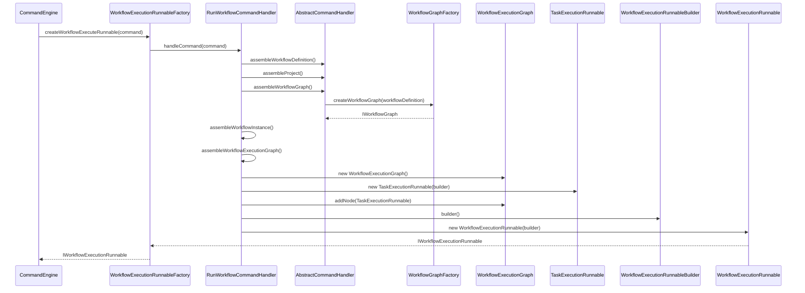

## 一、整体架构与类关系

### 1.1 核心类关系图

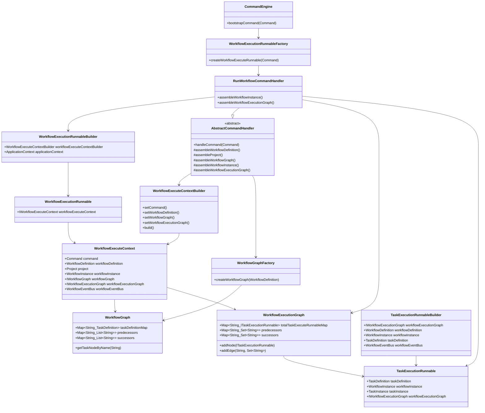

### 1.2 构建流程架构图

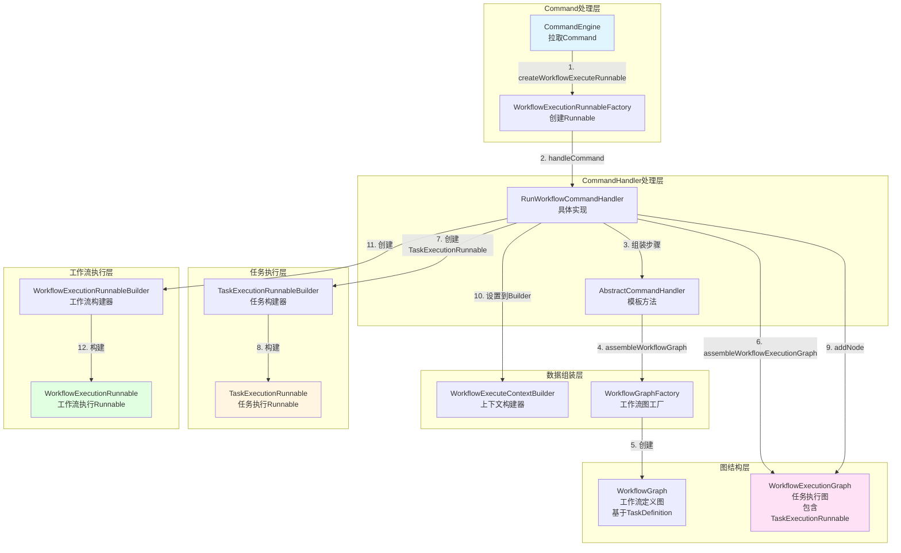

## 二、详细构建流程

### 2.1 CommandEngine触发构建

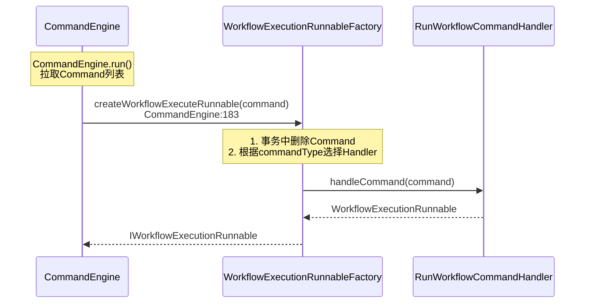

**关键点**:
- `CommandEngine.bootstrapCommand()`调用`WorkflowExecutionRunnableFactory.createWorkflowExecuteRunnable()`
- Factory使用事务机制确保Command只被处理一次
- 根据Command的`commandType`选择对应的CommandHandler（如`RunWorkflowCommandHandler`）

### 2.2 AbstractCommandHandler模板方法流程

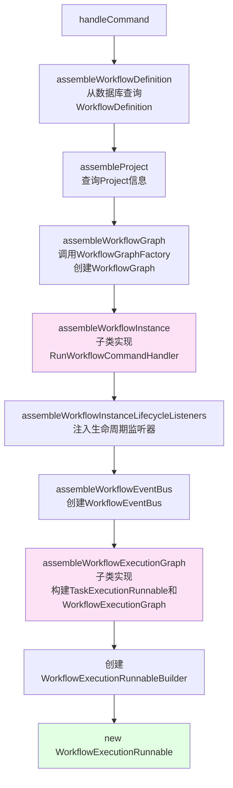

### 2.3 AbstractCommandHandler.assembleWorkflowGraph - 构建WorkflowGraph

`assembleWorkflowGraph`方法负责从数据库查询工作流任务关系，构建`WorkflowGraph`图结构。

#### 2.3.1 构建流程概览

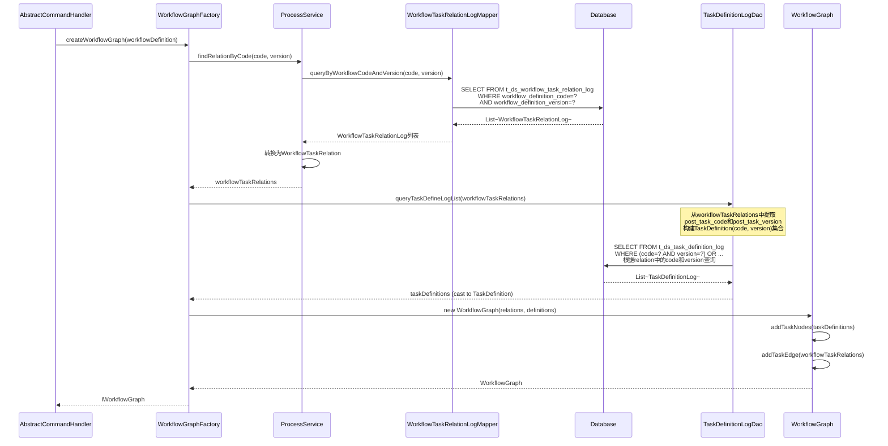

#### 2.3.2 数据查询阶段

**Step 1: 查询工作流任务关系**

`ProcessService.findRelationByCode()`方法内部调用`WorkflowTaskRelationLogMapper.queryByWorkflowCodeAndVersion()`，从`t_ds_workflow_task_relation_log`表查询指定工作流定义的所有任务关系：

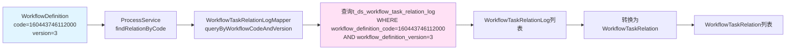

**Step 2: 查询任务定义**

`TaskDefinitionLogDao.queryTaskDefineLogList()`方法从`workflowTaskRelations`中提取所有`post_task_code`和`post_task_version`（过滤掉`post_task_code=0`的情况），构建`TaskDefinition(code, version)`集合，然后从`t_ds_task_definition_log`表查询所有任务定义（根据code和version精确匹配）：

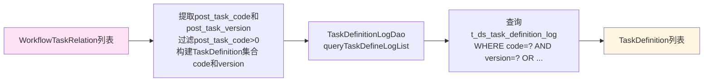

#### 2.3.3 实际案例：工作流test-sql (code=160443746112000)

**工作流定义信息**:
- **名称**: test-sql
- **代码**: 160443746112000
- **版本**: 3
- **项目代码**: 160443707145728

**任务关系数据** (从`t_ds_workflow_task_relation_log`表查询，通过`WorkflowTaskRelationLogMapper.queryByWorkflowCodeAndVersion()`):

| id | pre_task_code | pre_task_version | post_task_code | post_task_version | condition_type |
|----|--------------|------------------|----------------|-------------------|----------------|
| 4  | 0            | 0                | 160443718081024 | 3                 | 0             |
| 5  | 0            | 0                | 162581434072896 | 1                 | 0             |
| 6  | 160443718081024 | 3                | 162581472879424 | 1                 | 0             |
| 7  | 162581434072896 | 1                | 162581472879424 | 1                 | 0             |

**说明**:
- `pre_task_code=0`表示开始节点（无前置任务），对应的`pre_task_version=0`
- `post_task_version`用于后续查询任务定义时指定版本（`TaskDefinitionLogDao.queryTaskDefineLogList()`会根据`post_task_code`和`post_task_version`查询`t_ds_task_definition_log`表）
- 同一工作流定义中的不同任务可以使用不同版本的任务定义

**任务定义数据** (从`t_ds_task_definition_log`表查询):

| code | name | task_type | version |
|------|------|-----------|---------|
| 160443718081024 | test-sql1 | SQL | 3 |
| 162581434072896 | test-sql2 | SQL | 1 |
| 162581472879424 | test-sql3 | SQL | 1 |

**DAG结构分析**:

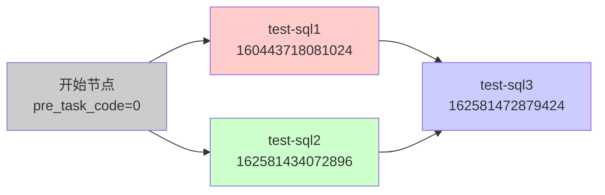

**关系说明**:
- `pre_task_code=0`表示开始节点（无前置任务）
- `test-sql1`和`test-sql2`都是起始节点
- `test-sql3`依赖于`test-sql1`和`test-sql2`（符合A->C, B->C的结构）

#### 2.3.4 WorkflowGraph构建过程

**Step 1: 初始化Map结构**

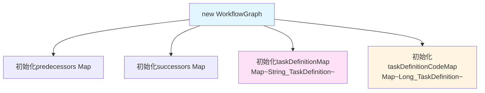

**Step 2: 构建任务定义映射 (addTaskNodes)**

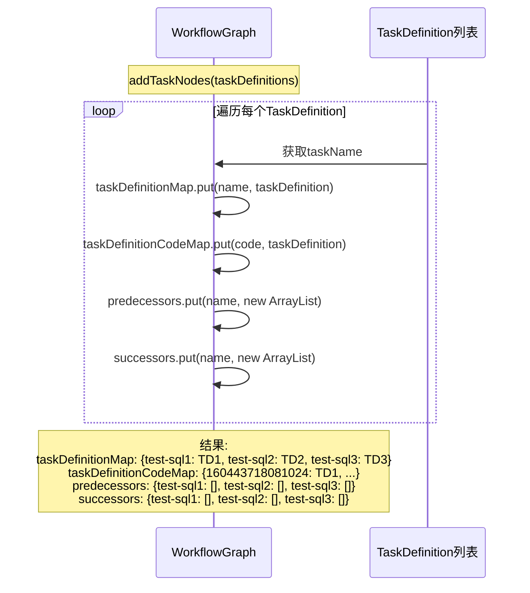

**案例数据构建结果**:

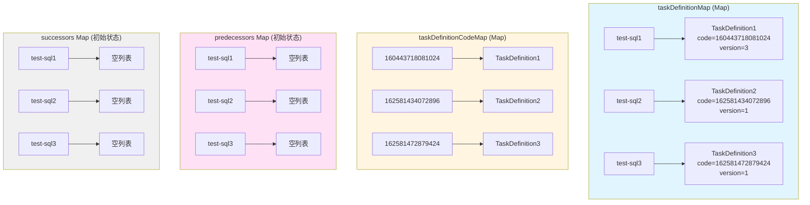

**Step 3: 添加任务边 (addTaskEdge)**

遍历`WorkflowTaskRelation`列表，构建依赖关系：

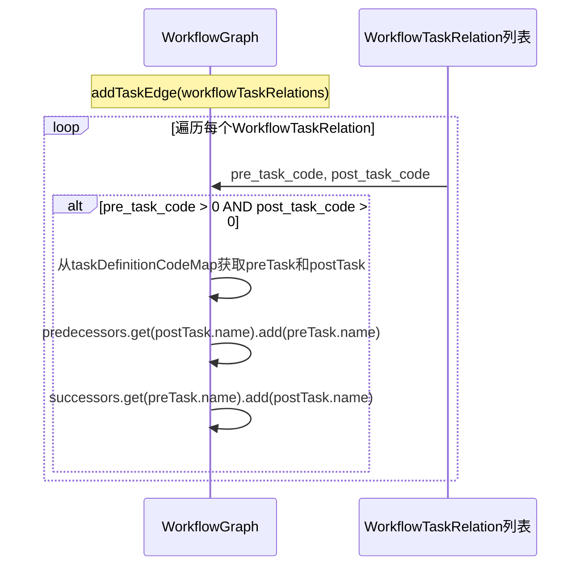

**案例数据的边添加过程**:

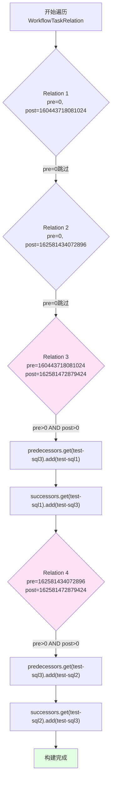

**最终构建结果**:

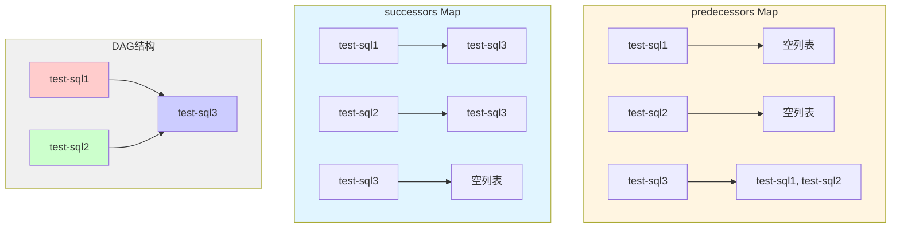

#### 2.3.5 WorkflowGraph核心方法

**getStartNodes()**: 获取所有起始节点（predecessors为空的节点）

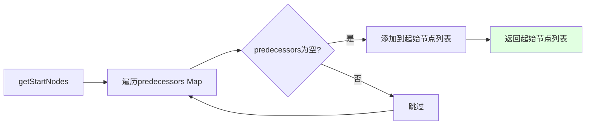

**案例结果**: `[test-sql1, test-sql2]`

**getPredecessors(taskName)**: 获取指定任务的所有前置任务

**案例**:
- `getPredecessors("test-sql1")` → `[]`
- `getPredecessors("test-sql2")` → `[]`
- `getPredecessors("test-sql3")` → `[test-sql1, test-sql2]`

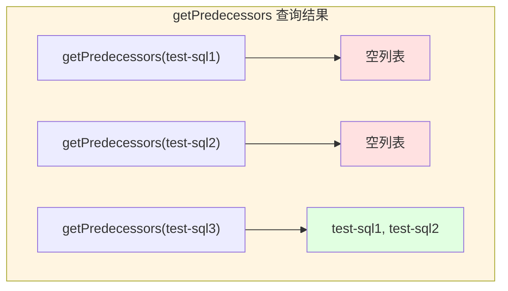

**getSuccessors(taskName)**: 获取指定任务的所有后继任务

**案例**:
- `getSuccessors("test-sql1")` → `[test-sql3]`
- `getSuccessors("test-sql2")` → `[test-sql3]`
- `getSuccessors("test-sql3")` → `[]`

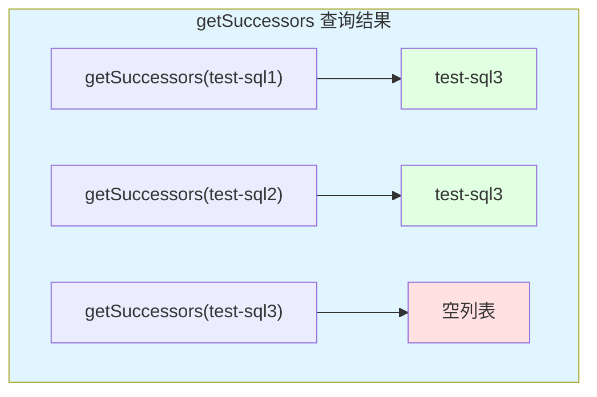

#### 2.3.6 完整构建流程图

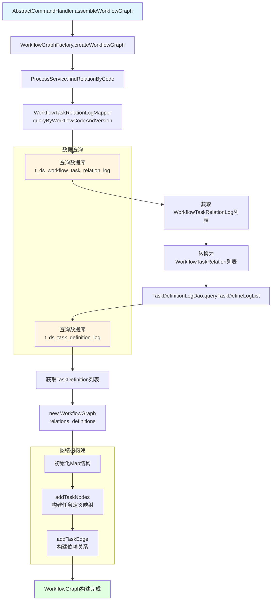

#### 2.3.7 关键设计要点

1. **pre_task_code=0的特殊处理**: 
   - `pre_task_code=0`表示开始节点，在`addTaskEdge`中会被跳过（只处理`pre > 0 AND post > 0`的情况）
   - 起始节点通过`getStartNodes()`方法识别（predecessors为空的节点）

2. **双向索引设计**:
   - `predecessors Map`: 存储每个任务的前置任务列表（用于查询依赖）
   - `successors Map`: 存储每个任务的后继任务列表（用于拓扑遍历）
   - 两个Map同步维护，确保数据一致性

3. **任务定义双重映射**:
   - `taskDefinitionMap`: 通过任务名称快速查找
   - `taskDefinitionCodeMap`: 通过任务代码快速查找
   - 支持不同场景下的查询需求

4. **数据验证**:
   - 构建过程中会验证任务定义是否存在
   - 检查重复的边关系
   - 确保图结构的完整性

### 2.4 RunWorkflowCommandHandler.assembleWorkflowInstance

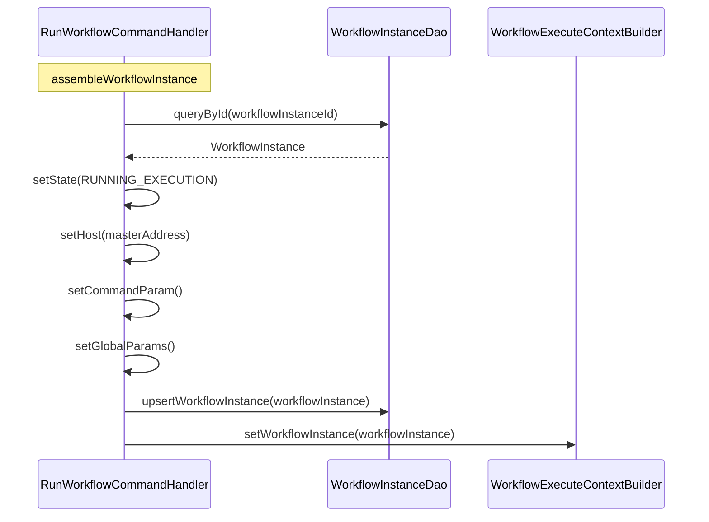

**关键操作**:
- 从数据库查询WorkflowInstance
- 更新状态为`RUNNING_EXECUTION`
- 设置Master地址和参数
- 更新到数据库并设置到Builder

### 2.5 RunWorkflowCommandHandler.assembleWorkflowExecutionGraph - 核心组装逻辑

这是最核心的步骤，负责构建`WorkflowExecutionGraph`和所有`TaskExecutionRunnable`。

```mermaid
flowchart TD
    A[assembleWorkflowExecutionGraph] --> B[new WorkflowExecutionGraph]
    B --> C[创建taskExecutionRunnableCreator函数]
    C --> D[WorkflowGraphTopologyLogicalVisitor<br/>拓扑访问器]
    D --> E[visit<br/>遍历WorkflowGraph]
    E --> F{对每个节点}
    F -->|调用visitFunction| G[创建TaskExecutionRunnableBuilder]
    G --> H[设置workflowExecutionGraph]
    G --> I[设置workflowDefinition]
    G --> J[设置project]
    G --> K[设置workflowInstance]
    G --> L[设置taskDefinition]
    G --> M[设置workflowEventBus]
    H --> N[new TaskExecutionRunnable]
    I --> N
    J --> N
    K --> N
    L --> N
    M --> N
    N --> O[workflowExecutionGraph.addNode]
    N --> P[workflowExecutionGraph.addEdge]
    O --> Q[设置到WorkflowExecuteContextBuilder]
    P --> Q
    
    style A fill:#ffe1f5
    style N fill:#fff5e1
    style O fill:#e1f5ff
```

**详细流程时序图**:

```mermaid
sequenceDiagram
    participant RWH as RunWorkflowCommandHandler
    participant WG as WorkflowGraph
    participant WEG as WorkflowExecutionGraph
    participant V as WorkflowGraphTopologyLogicalVisitor
    participant TERB as TaskExecutionRunnableBuilder
    participant TER as TaskExecutionRunnable
    participant WECB as WorkflowExecuteContextBuilder
    
    Note over RWH: assembleWorkflowExecutionGraph
    RWH->>WEG: new WorkflowExecutionGraph()
    RWH->>V: builder()<br/>设置workflowGraph<br/>设置taskDependType<br/>设置startNodes<br/>设置visitFunction
    
    Note over RWH: visitFunction定义<br/>taskExecutionRunnableCreator
    RWH->>TERB: builder()<br/>设置workflowExecutionGraph(WEG)<br/>设置workflowDefinition<br/>设置project<br/>设置workflowInstance<br/>设置taskDefinition<br/>设置workflowEventBus
    
    RWH->>V: visit()
    V->>WG: 拓扑排序遍历节点
    loop 对每个任务节点
        WG-->>V: taskName, successors
        V->>TERB: 调用visitFunction<br/>传入taskName和successors
        TERB->>TER: new TaskExecutionRunnable(builder)
        TERB->>WEG: addNode(TER)
        TERB->>WEG: addEdge(taskName, successors)
    end
    
    RWH->>WECB: setWorkflowExecutionGraph(WEG)
```

**关键机制说明**:

1. **WorkflowExecutionGraph创建**: 在方法开始时创建空的`WorkflowExecutionGraph`实例
2. **visitFunction定义**: 定义一个`BiConsumer<String, Set<String>>`函数，用于处理每个遍历到的节点
3. **TaskExecutionRunnableBuilder构建**: 在visitFunction中，为每个任务节点创建`TaskExecutionRunnableBuilder`
4. **关键循环引用**: `TaskExecutionRunnableBuilder`中设置`workflowExecutionGraph`（同一个WEG实例），这样所有TaskExecutionRunnable都引用同一个执行图
5. **拓扑遍历**: `WorkflowGraphTopologyLogicalVisitor.visit()`按拓扑顺序遍历`WorkflowGraph`中的所有节点
6. **节点添加**: 每创建一个`TaskExecutionRunnable`，就调用`workflowExecutionGraph.addNode()`添加到执行图中
7. **边添加**: 调用`workflowExecutionGraph.addEdge()`添加任务之间的依赖关系

#### 2.5.1 构建步骤详细分析

**输入数据（以工作流实例366为例）**:

从`t_ds_workflow_instance`表查询工作流实例366：
- `id`: 366
- `workflow_definition_code`: 160443746112000
- `workflow_definition_version`: 3
- `task_depend_type`: 2 (TASK_POST - 运行当前任务及后续依赖任务)
- `command_param`: `{"commandType":"START_PROCESS","subWorkflowInstance":false,"startNodes":[],"commandParams":[],"timeZone":"Asia/Shanghai"}`

工作流定义的任务关系（从`t_ds_workflow_task_relation_log`查询）：

| pre_task_code | post_task_code | pre_task_version | post_task_version | task_name |
|--------------|---------------|------------------|-------------------|-----------|
| 0 | 160443718081024 | 0 | 3 | test-sql1 |
| 0 | 162581434072896 | 0 | 1 | test-sql2 |
| 160443718081024 | 162581472879424 | 3 | 1 | test-sql3 |
| 162581434072896 | 162581472879424 | 1 | 1 | test-sql3 |

工作流DAG结构：`test-sql1 -> test-sql3, test-sql2 -> test-sql3`

**构建过程详解**:

```mermaid
flowchart TD
    Start[开始 assembleWorkflowExecutionGraph] --> Step1[步骤1: 创建WorkflowExecutionGraph实例]
    Step1 --> Step2[步骤2: 定义taskExecutionRunnableCreator函数]
    Step2 --> Step3[步骤3: 解析起始节点]
    Step3 --> Step4{startNodes是否为空?}
    Step4 -->|为空| Step5[从WorkflowGraph获取所有起始节点<br/>getStartNodes]
    Step4 -->|不为空| Step6[使用command_param中的startNodes]
    Step5 --> Step7[步骤4: 创建WorkflowGraphTopologyLogicalVisitor]
    Step6 --> Step7
    Step7 --> Step8[步骤5: 调用visit方法进行拓扑遍历]
    Step8 --> Step9[步骤6: 对每个节点执行visitFunction]
    Step9 --> Step10[步骤7: 创建TaskExecutionRunnable并添加到图]
    Step10 --> Step11[步骤8: 设置到WorkflowExecuteContextBuilder]
    
    style Step1 fill:#e1f5ff
    style Step7 fill:#fff5e1
    style Step9 fill:#ffe1f5
    style Step10 fill:#e1ffe1
```

#### 2.5.2 拓扑遍历过程详解（以实例366为例）

**拓扑遍历流程**（task_depend_type=2，TASK_POST模式）:

```mermaid
sequenceDiagram
    participant RWH as RunWorkflowCommandHandler
    participant V as WorkflowGraphTopologyLogicalVisitor
    participant WG as WorkflowGraph
    participant WEG as WorkflowExecutionGraph
    participant TER as TaskExecutionRunnable
    
    Note over RWH,V: 初始化阶段
    RWH->>V: builder()<br/>taskDependType=TASK_POST(2)<br/>startNodes=[]
    RWH->>WG: getStartNodes()
    WG-->>RWH: [test-sql1, test-sql2]
    RWH->>V: fromTask([test-sql1, test-sql2])
    RWH->>V: visit()
    
    Note over V: visitFromStartNodes方法
    V->>V: 从startNodes开始BFS遍历<br/>收集所有可达节点
    V->>WG: getSuccessors(test-sql1)
    WG-->>V: [test-sql3]
    V->>WG: getSuccessors(test-sql2)
    WG-->>V: [test-sql3]
    V->>V: subGraphNodes = {test-sql1, test-sql2, test-sql3}
    
    Note over V: doVisitationInSubGraph方法
    V->>WG: getAllTaskNodes()
    WG-->>V: [TaskDefinition(test-sql1), TaskDefinition(test-sql2), TaskDefinition(test-sql3)]
    V->>V: 构建inDegreeMap<br/>test-sql1: 0<br/>test-sql2: 0<br/>test-sql3: 2
    V->>V: bootstrapTaskCodes = [test-sql1, test-sql2]
    
    loop 拓扑排序遍历
        V->>V: 取出inDegree=0的节点<br/>test-sql1
        V->>V: visitFunction.accept(test-sql1, [test-sql3])
        V->>TER: 创建TaskExecutionRunnable(test-sql1)
        V->>WEG: addNode(TER1)
        V->>WEG: addEdge(test-sql1, [test-sql3])
        V->>V: inDegreeMap[test-sql3] = 1
        V->>V: bootstrapTaskCodes.add(test-sql3)
        
        V->>V: 取出inDegree=0的节点<br/>test-sql2
        V->>V: visitFunction.accept(test-sql2, [test-sql3])
        V->>TER: 创建TaskExecutionRunnable(test-sql2)
        V->>WEG: addNode(TER2)
        V->>WEG: addEdge(test-sql2, [test-sql3])
        V->>V: inDegreeMap[test-sql3] = 0
        V->>V: bootstrapTaskCodes.add(test-sql3)
        
        V->>V: 取出inDegree=0的节点<br/>test-sql3
        V->>V: visitFunction.accept(test-sql3, [])
        V->>TER: 创建TaskExecutionRunnable(test-sql3)
        V->>WEG: addNode(TER3)
        V->>WEG: addEdge(test-sql3, [])
    end
```

#### 2.5.3 WorkflowExecutionGraph数据结构构建过程

**构建过程状态变化图**（以实例366为例）:

```mermaid
graph TB
    subgraph Step1["步骤1: 初始化WorkflowExecutionGraph"]
        S1WEG[WorkflowExecutionGraph实例]
        S1Map1[totalTaskExecuteRunnableMap: 空Map]
        S1Map2[predecessors: 空Map]
        S1Map3[successors: 空Map]
        S1Set1[activeTaskExecutionRunnable: 空Set]
        S1Set2[inActiveTaskExecutionRunnable: 空Set]
        S1WEG --> S1Map1
        S1WEG --> S1Map2
        S1WEG --> S1Map3
        S1WEG --> S1Set1
        S1WEG --> S1Set2
    end
    
    subgraph Step2["步骤2: 添加test-sql1节点"]
        S2TER1[TaskExecutionRunnable: test-sql1]
        S2Add1[addNode TER1]
        S2Map1[totalTaskExecuteRunnableMap:<br/>test-sql1 -> TER1]
        S2Map2[predecessors:<br/>test-sql1 -> 空Set]
        S2Map3[successors:<br/>test-sql1 -> 空Set]
        S2Add1 --> S2Map1
        S2Add1 --> S2Map2
        S2Add1 --> S2Map3
    end
    
    subgraph Step3["步骤3: 添加test-sql1的边"]
        S3Edge1[addEdge test-sql1, test-sql3]
        S3Map1[predecessors:<br/>test-sql1 -> 空Set<br/>test-sql3 -> test-sql1]
        S3Map2[successors:<br/>test-sql1 -> test-sql3<br/>test-sql3 -> 空Set]
        S3Edge1 --> S3Map1
        S3Edge1 --> S3Map2
    end
    
    subgraph Step4["步骤4: 添加test-sql2和test-sql3节点及边"]
        S4TER2[TaskExecutionRunnable: test-sql2]
        S4TER3[TaskExecutionRunnable: test-sql3]
        S4Final[最终状态:<br/>totalTaskExecuteRunnableMap:<br/>test-sql1 -> TER1<br/>test-sql2 -> TER2<br/>test-sql3 -> TER3<br/>predecessors:<br/>test-sql1 -> 空Set<br/>test-sql2 -> 空Set<br/>test-sql3 -> test-sql1, test-sql2<br/>successors:<br/>test-sql1 -> test-sql3<br/>test-sql2 -> test-sql3<br/>test-sql3 -> 空Set]
        S4TER2 --> S4Final
        S4TER3 --> S4Final
    end
    
    Step1 --> Step2
    Step2 --> Step3
    Step3 --> Step4
    
    style Step1 fill:#e1f5ff
    style Step2 fill:#fff5e1
    style Step3 fill:#ffe1f5
    style Step4 fill:#e1ffe1
```

#### 2.5.4 数据示例：WorkflowExecutionGraph构建结果

**构建完成后的WorkflowExecutionGraph数据结构**（工作流实例366）:

```mermaid
graph TB
    subgraph WEG["WorkflowExecutionGraph (工作流实例366)"]
        subgraph TERMap["totalTaskExecuteRunnableMap"]
            T1[test-sql1] --> TER1[TaskExecutionRunnable1<br/>taskDefinition: test-sql1<br/>taskInstance: null]
            T2[test-sql2] --> TER2[TaskExecutionRunnable2<br/>taskDefinition: test-sql2<br/>taskInstance: null]
            T3[test-sql3] --> TER3[TaskExecutionRunnable3<br/>taskDefinition: test-sql3<br/>taskInstance: null]
        end
        
        subgraph PreMap["predecessors Map"]
            P1[test-sql1] --> PS1[空Set]
            P2[test-sql2] --> PS2[空Set]
            P3[test-sql3] --> PS3[test-sql1, test-sql2]
        end
        
        subgraph SucMap["successors Map"]
            S1[test-sql1] --> SS1[test-sql3]
            S2[test-sql2] --> SS2[test-sql3]
            S3[test-sql3] --> SS3[空Set]
        end
        
        subgraph ActiveSet["activeTaskExecutionRunnable Set"]
            AS[空Set]
        end
        
        subgraph InActiveSet["inActiveTaskExecutionRunnable Set"]
            IAS[空Set]
        end
    end
    
    style TERMap fill:#fff5e1
    style PreMap fill:#e1f5ff
    style SucMap fill:#ffe1f5
    style ActiveSet fill:#f0f0f0
    style InActiveSet fill:#f0f0f0
```

**关键数据说明**:

1. **totalTaskExecuteRunnableMap**: 存储所有任务执行Runnable，键为任务名称，值为TaskExecutionRunnable实例
2. **predecessors**: 存储每个任务的前置任务集合，用于依赖检查
3. **successors**: 存储每个任务的后继任务集合，用于任务触发
4. **activeTaskExecutionRunnable**: 存储当前正在执行的任务名称集合
5. **inActiveTaskExecutionRunnable**: 存储已完成的任务名称集合
6. **taskInstance**: 在RunWorkflowCommandHandler中，所有TaskExecutionRunnable的taskInstance初始为null，在首次触发时通过`initializeFirstRunTaskInstance()`创建

#### 2.5.5 addNode和addEdge方法详解

**addNode方法执行过程**:

```mermaid
sequenceDiagram
    participant WEG as WorkflowExecutionGraph
    participant TER as TaskExecutionRunnable
    participant Map1 as totalTaskExecuteRunnableMap
    participant Map2 as predecessors
    participant Map3 as successors
    
    TER->>WEG: addNode(TER)
    WEG->>Map1: put(taskName, TER)
    WEG->>Map2: computeIfAbsent(taskName, HashSet)
    WEG->>Map3: computeIfAbsent(taskName, HashSet)
    
    Note over Map1,Map3: 如果Map中不存在该任务名，<br/>则创建新的HashSet并放入
```

**addEdge方法执行过程**:

```mermaid
sequenceDiagram
    participant WEG as WorkflowExecutionGraph
    participant SucMap as successors Map
    participant PreMap as predecessors Map
    
    WEG->>WEG: addEdge(fromTaskName, toTaskNames)
    WEG->>SucMap: computeIfAbsent(fromTaskName, HashSet)<br/>.addAll(toTaskNames)
    
    loop 对每个toTaskName
        WEG->>PreMap: computeIfAbsent(toTask, HashSet)<br/>.add(fromTaskName)
    end
    
    Note over SucMap,PreMap: 同时更新successors和predecessors，<br/>保证数据一致性
```

**示例：添加test-sql1 -> test-sql3的边**

- `successors[test-sql1].add(test-sql3)` - test-sql1的后继任务集合增加test-sql3
- `predecessors[test-sql3].add(test-sql1)` - test-sql3的前置任务集合增加test-sql1

### 2.6 WorkflowGraph与WorkflowExecutionGraph的关系

```mermaid
classDiagram
    class WorkflowGraph {
        <<基于WorkflowDefinition>>
        +Map~String_TaskDefinition~ taskDefinitionMap
        +Map~String_List~String~~ predecessors
        +Map~String_List~String~~ successors
        +getTaskNodeByName(String) TaskDefinition
        +getTaskNodeByCode(Long) TaskDefinition
    }
    
    class WorkflowExecutionGraph {
        <<执行时图结构>>
        +Map~String_ITaskExecutionRunnable~ totalTaskExecuteRunnableMap
        +Map~String_Set~String~~ predecessors
        +Map~String_Set~String~~ successors
        +addNode(ITaskExecutionRunnable)
        +addEdge(String, Set~String~)
        +getStartNodes() List~ITaskExecutionRunnable~
        +isTriggerConditionMet(ITaskExecutionRunnable) boolean
    }
    
    class TaskDefinition {
        +code: Long
        +name: String
        +taskType: String
        +taskParams: String
    }
    
    class TaskExecutionRunnable {
        +TaskDefinition taskDefinition
        +WorkflowInstance workflowInstance
        +TaskInstance taskInstance
        +IWorkflowExecutionGraph workflowExecutionGraph
    }
    
    note for WorkflowGraph "工作流定义层面的图结构，描述任务定义和依赖关系"
    note for WorkflowExecutionGraph "工作流执行层面的图结构，包含可执行的任务Runnable，管理任务状态和依赖检查"
    
    WorkflowGraph --> TaskDefinition : contains
    WorkflowExecutionGraph --> TaskExecutionRunnable : contains
    TaskExecutionRunnable --> TaskDefinition : references
    TaskExecutionRunnable --> WorkflowExecutionGraph : references
```

**核心区别**:

| 维度 | WorkflowGraph | WorkflowExecutionGraph |
|------|--------------|----------------------|
| **基础数据** | TaskDefinition（任务定义） | TaskExecutionRunnable（任务执行Runnable） |
| **创建时机** | 从WorkflowDefinition构建 | 在assembleWorkflowExecutionGraph时构建 |
| **用途** | 描述工作流的静态结构 | 管理工作流的执行状态 |
| **节点类型** | TaskDefinition（名称、类型、参数等） | TaskExecutionRunnable（包含TaskInstance状态） |
| **依赖关系** | 基于WorkflowTaskRelation | 基于TaskExecutionRunnable的依赖检查 |

### 2.7 TaskExecutionRunnable构建流程

```mermaid
sequenceDiagram
    participant RWH as RunWorkflowCommandHandler
    participant WG as WorkflowGraph
    participant TERB as TaskExecutionRunnableBuilder
    participant TER as TaskExecutionRunnable
    participant WEG as WorkflowExecutionGraph
    
    Note over RWH: 在visitFunction中执行
    RWH->>WG: getTaskNodeByName(taskName)
    WG-->>RWH: TaskDefinition
    RWH->>TERB: builder()
    RWH->>TERB: workflowExecutionGraph(WEG)
    RWH->>TERB: workflowDefinition()
    RWH->>TERB: project()
    RWH->>TERB: workflowInstance()
    RWH->>TERB: taskDefinition(TaskDefinition)
    RWH->>TERB: workflowEventBus()
    TERB->>TER: new TaskExecutionRunnable(builder)
    
    Note over TER: 构造函数中:<br/>1. 设置所有字段<br/>2. taskInstance初始为null<br/>3. 如果taskInstance不为null<br/>   则初始化TaskExecutionContext
    
    TER-->>RWH: TaskExecutionRunnable
    RWH->>WEG: addNode(TER)
    RWH->>WEG: addEdge(taskName, successors)
```

**TaskExecutionRunnable关键字段**:

- `workflowExecutionGraph`: 引用同一个WorkflowExecutionGraph实例（所有TaskExecutionRunnable共享）
- `taskDefinition`: 从WorkflowGraph获取的TaskDefinition
- `taskInstance`: 初始为null，在首次触发时通过`initializeFirstRunTaskInstance()`创建
- `workflowEventBus`: 所有TaskExecutionRunnable共享同一个事件总线

### 2.8 WorkflowExecutionRunnable构建流程

```mermaid
sequenceDiagram
    participant RWH as RunWorkflowCommandHandler
    participant WECB as WorkflowExecuteContextBuilder
    participant WERB as WorkflowExecutionRunnableBuilder
    participant WER as WorkflowExecutionRunnable
    participant WEC as WorkflowExecuteContext
    
    Note over RWH: AbstractCommandHandler.handleCommand<br/>最后步骤
    RWH->>WECB: build()
    WECB->>WEC: new WorkflowExecuteContext(<br/>command, workflowDefinition,<br/>project, workflowInstance,<br/>workflowGraph, workflowExecutionGraph,<br/>workflowEventBus, listeners)
    
    RWH->>WERB: builder()
    RWH->>WERB: workflowExecuteContextBuilder(WECB)
    RWH->>WERB: applicationContext()
    
    WERB->>WER: new WorkflowExecutionRunnable(builder)
    Note over WER: 构造函数中:<br/>1. workflowExecuteContextBuilder.build()<br/>2. 设置workflowInstanceLifecycleListeners
    
    WER-->>RWH: WorkflowExecutionRunnable
```

**WorkflowExecutionRunnable关键字段**:

- `workflowExecuteContext`: 包含所有构建好的组件（WorkflowGraph、WorkflowExecutionGraph、WorkflowEventBus等）
- `workflowInstanceLifecycleListeners`: 工作流生命周期监听器列表

### 2.9 完整的对象创建与引用关系

```mermaid
graph TB
    subgraph "构建阶段"
        WECB[WorkflowExecuteContextBuilder]
        WG[WorkflowGraph<br/>1个实例]
        WEG[WorkflowExecutionGraph<br/>1个实例]
        WEB[WorkflowEventBus<br/>1个实例]
        TER1[TaskExecutionRunnable-1]
        TER2[TaskExecutionRunnable-2]
        TER3[TaskExecutionRunnable-N]
    end
    
    subgraph "最终对象"
        WEC[WorkflowExecuteContext]
        WER[WorkflowExecutionRunnable]
    end
    
    WECB -->|包含| WG
    WECB -->|包含| WEG
    WECB -->|包含| WEB
    WECB -->|build| WEC
    
    WEG -->|包含| TER1
    WEG -->|包含| TER2
    WEG -->|包含| TER3
    
    TER1 -->|引用| WEG
    TER2 -->|引用| WEG
    TER3 -->|引用| WEG
    TER1 -->|引用| WEB
    TER2 -->|引用| WEB
    TER3 -->|引用| WEB
    
    WEC -->|包含| WG
    WEC -->|包含| WEG
    WEC -->|包含| WEB
    WER -->|包含| WEC
    
    style WEG fill:#ffe1f5
    style WEB fill:#e1f5ff
    style WER fill:#e1ffe1
```

**关键设计模式**:

1. **Builder模式**: `WorkflowExecuteContextBuilder`和`TaskExecutionRunnableBuilder`使用Builder模式构建复杂对象
2. **共享引用**: 所有`TaskExecutionRunnable`共享同一个`WorkflowExecutionGraph`和`WorkflowEventBus`实例
3. **延迟初始化**: `TaskInstance`在`TaskExecutionRunnable`创建时为null，在首次触发时创建
4. **图结构**: `WorkflowExecutionGraph`维护所有`TaskExecutionRunnable`的图结构和依赖关系

## 三、构建流程状态流转

### 3.1 构建阶段状态流转图

```mermaid
stateDiagram-v2
    [*] --> Command拉取: CommandEngine.run()
    Command拉取 --> Factory创建: createWorkflowExecuteRunnable()
    Factory创建 --> Handler处理: handleCommand()
    
    state Handler处理 {
        [*] --> 组装WorkflowDefinition
        组装WorkflowDefinition --> 组装Project
        组装Project --> 组装WorkflowGraph
        组装WorkflowGraph --> 组装WorkflowInstance
        组装WorkflowInstance --> 组装监听器
        组装监听器 --> 组装事件总线
        组装事件总线 --> 组装WorkflowExecutionGraph
        组装WorkflowExecutionGraph --> [*]
    }
    
    state 组装WorkflowExecutionGraph {
        [*] --> 创建WorkflowExecutionGraph
        创建WorkflowExecutionGraph --> 创建访问器
        创建访问器 --> 遍历WorkflowGraph
        遍历WorkflowGraph --> 创建TaskExecutionRunnable
        创建TaskExecutionRunnable --> 添加到执行图
        添加到执行图 --> 创建WorkflowExecutionRunnableBuilder
        创建WorkflowExecutionRunnableBuilder --> [*]
    }
    
    Handler处理 --> 创建WorkflowExecutionRunnable
    创建WorkflowExecutionRunnable --> [*]
```

### 3.2 对象实例化顺序图

```mermaid
sequenceDiagram
    autonumber
    participant CE as CommandEngine
    participant WERF as Factory
    participant RWH as RunWorkflowCommandHandler
    participant WECB as WorkflowExecuteContextBuilder
    participant WGF as WorkflowGraphFactory
    participant WG as WorkflowGraph
    participant WEG as WorkflowExecutionGraph
    participant TERB as TaskExecutionRunnableBuilder
    participant TER as TaskExecutionRunnable
    participant WERB as WorkflowExecutionRunnableBuilder
    participant WER as WorkflowExecutionRunnable
    
    CE->>WERF: 1. createWorkflowExecuteRunnable
    WERF->>RWH: 2. handleCommand
    RWH->>WECB: 3. WorkflowExecuteContext.builder()
    
    RWH->>WECB: 4. assembleWorkflowDefinition
    RWH->>WECB: 5. assembleProject
    RWH->>WGF: 6. createWorkflowGraph
    WGF->>WG: 7. new WorkflowGraph()
    WG-->>WECB: 8. 设置WorkflowGraph
    
    RWH->>WECB: 9. assembleWorkflowInstance
    RWH->>WECB: 10. assembleEventBus
    
    RWH->>WEG: 11. new WorkflowExecutionGraph()
    loop 遍历WorkflowGraph节点
        RWH->>TERB: 12. TaskExecutionRunnableBuilder.builder()
        RWH->>TER: 13. new TaskExecutionRunnable(builder)
        RWH->>WEG: 14. addNode(TER)
        RWH->>WEG: 15. addEdge()
    end
    RWH->>WECB: 16. setWorkflowExecutionGraph(WEG)
    
    RWH->>WERB: 17. WorkflowExecutionRunnableBuilder.builder()
    RWH->>WER: 18. new WorkflowExecutionRunnable(builder)
    WER-->>WERF: 19. 返回
    WERF-->>CE: 20. 返回
```

## 四、关键设计要点

### 4.1 循环引用设计

```mermaid
graph LR
    WEG[WorkflowExecutionGraph] -->|addNode| TER[TaskExecutionRunnable]
    TER -->|引用| WEG
    TER -->|引用| WEB[WorkflowEventBus]
    
    style WEG fill:#ffe1f5
    style TER fill:#fff5e1
    style WEB fill:#e1f5ff
```

**设计说明**:
- `WorkflowExecutionGraph`包含多个`TaskExecutionRunnable`（通过`totalTaskExecuteRunnableMap`）
- 每个`TaskExecutionRunnable`都引用同一个`WorkflowExecutionGraph`实例
- 这种双向引用使得：
  - `WorkflowExecutionGraph`可以管理和查询所有任务
  - `TaskExecutionRunnable`可以通过图结构查询前置/后继任务

### 4.2 共享资源设计

```mermaid
graph TB
    WEB[WorkflowEventBus<br/>单个实例]
    WEG[WorkflowExecutionGraph<br/>单个实例]
    WEC[WorkflowExecuteContext<br/>单个实例]
    
    TER1[TaskExecutionRunnable-1] -->|共享| WEB
    TER2[TaskExecutionRunnable-2] -->|共享| WEB
    TER3[TaskExecutionRunnable-N] -->|共享| WEB
    
    TER1 -->|共享| WEG
    TER2 -->|共享| WEG
    TER3 -->|共享| WEG
    
    WEC -->|包含| WEB
    WEC -->|包含| WEG
    
    style WEB fill:#e1f5ff
    style WEG fill:#ffe1f5
```

**设计优势**:
- **事件总线共享**: 所有任务通过同一个`WorkflowEventBus`通信，便于工作流级别的事件管理
- **执行图共享**: 所有任务共享同一个`WorkflowExecutionGraph`，便于依赖检查和状态管理
- **资源高效**: 避免重复创建，节省内存

### 4.3 延迟初始化设计

```mermaid
stateDiagram-v2
    [*] --> TaskExecutionRunnable创建: assembleWorkflowExecutionGraph
    TaskExecutionRunnable创建 --> taskInstance为null: 构造函数
    taskInstance为null --> TaskStartLifecycleEvent: 工作流启动
    TaskStartLifecycleEvent --> initializeFirstRunTaskInstance: TaskStartLifecycleEventHandler
    initializeFirstRunTaskInstance --> taskInstance创建: FirstRunTaskInstanceFactory
    taskInstance创建 --> TaskExecutionContext初始化: initializeTaskExecutionContext
    TaskExecutionContext初始化 --> [*]
```

**设计优势**:
- **避免不必要创建**: 如果工作流被取消或失败，未触发的任务不会创建TaskInstance
- **区分场景**: 新工作流启动时创建新的TaskInstance，故障恢复时从已有TaskInstance恢复
- **性能优化**: 减少数据库写入操作

## 五、关键问题分析：A->C, B->C场景下任务分发

### 5.1 场景描述

工作流定义关系：`A -> C`, `B -> C`

- 任务A和B是起始节点（无前置任务）
- 任务C依赖于A和B（需要A和B都完成）

### 5.2 构建阶段的图结构

```mermaid
graph LR
    subgraph WorkflowGraph
        TD_A[TaskDefinition A]
        TD_B[TaskDefinition B]
        TD_C[TaskDefinition C]
        TD_A -->|依赖| TD_C
        TD_B -->|依赖| TD_C
    end
    
    subgraph WorkflowExecutionGraph
        TER_A[TaskExecutionRunnable A]
        TER_B[TaskExecutionRunnable B]
        TER_C[TaskExecutionRunnable C]
        TER_A -->|依赖| TER_C
        TER_B -->|依赖| TER_C
    end
    
    TD_A -.->|对应| TER_A
    TD_B -.->|对应| TER_B
    TD_C -.->|对应| TER_C
    
    style TER_A fill:#ffcccc
    style TER_B fill:#ccffcc
    style TER_C fill:#ccccff
```

### 5.3 任务触发流程

```mermaid
sequenceDiagram
    participant AWSA as AbstractWorkflowStateAction
    participant WEG as WorkflowExecutionGraph
    participant WEB as WorkflowEventBus
    participant GTDWQ as GlobalTaskDispatchWaitingQueue
    participant GTDL as GlobalTaskDispatchWaitingQueueLooper
    participant WLB as WorkerLoadBalancer
    participant W1 as Worker1
    participant W2 as Worker2
    participant W3 as Worker3
    
    Note over AWSA: triggerTasks(workflowExecutionRunnable, [A, B])
    AWSA->>WEG: isTriggerConditionMet(A)
    WEG-->>AWSA: true (无前置任务)
    AWSA->>WEG: markTaskExecutionRunnableActive(A)
    AWSA->>WEB: publish(TaskStartLifecycleEvent.of(A))
    
    AWSA->>WEG: isTriggerConditionMet(B)
    WEG-->>AWSA: true (无前置任务)
    AWSA->>WEG: markTaskExecutionRunnableActive(B)
    AWSA->>WEB: publish(TaskStartLifecycleEvent.of(B))
    
    Note over WEB: 事件处理链...
    WEB->>GTDWQ: dispatchTaskExecuteRunnableWithDelay(A, 0)
    WEB->>GTDWQ: dispatchTaskExecuteRunnableWithDelay(B, 0)
    
    GTDL->>GTDWQ: takeTaskExecuteRunnable() -> A
    GTDL->>WLB: select(workerGroup) 
    WLB-->>GTDL: Worker1地址
    GTDL->>W1: dispatchTask(A)
    
    GTDL->>GTDWQ: takeTaskExecuteRunnable() -> B
    GTDL->>WLB: select(workerGroup)
    WLB-->>GTDL: Worker2地址
    GTDL->>W2: dispatchTask(B)
    
    Note over W1,W2: A和B并发执行
    
    Note over AWSA: A和B完成后，触发C
    AWSA->>WEG: isTriggerConditionMet(C)
    WEG-->>AWSA: true (A和B都完成)
    AWSA->>WEB: publish(TaskStartLifecycleEvent.of(C))
    
    WEB->>GTDWQ: dispatchTaskExecuteRunnableWithDelay(C, 0)
    GTDL->>GTDWQ: takeTaskExecuteRunnable() -> C
    GTDL->>WLB: select(workerGroup)
    WLB-->>GTDL: Worker3地址
    GTDL->>W3: dispatchTask(C)
```

### 5.4 关键结论

**是的，A、B、C三个任务完全可能被分配到3个不同的Worker执行！**

**原因分析**:

1. **独立事件发布**: `triggerTasks`方法使用`for`循环**逐个**发布`TaskStartLifecycleEvent`，每个任务收到独立的事件
2. **独立调度队列**: 每个`ITaskExecutionRunnable`被**独立**放入`GlobalTaskDispatchWaitingQueue`
3. **独立Worker选择**: `GlobalTaskDispatchWaitingQueueLooper.doDispatch()`每次调用`workerLoadBalancer.select()`时，都是**独立选择**Worker，不会考虑其他任务的Worker分配情况
4. **无关联性约束**: DolphinScheduler的Worker选择算法（加权随机、平滑轮询、线性负载）都**不保证**同一工作流的任务分配到同一个Worker

**实际执行示例**:

```
时间线:
T1: A被触发 -> 放入队列 -> 选择Worker1 -> 分发到Worker1执行
T2: B被触发 -> 放入队列 -> 选择Worker2 -> 分发到Worker2执行
T3: A完成 (Worker1)
T4: B完成 (Worker2)  
T5: C被触发（A和B都完成）-> 放入队列 -> 选择Worker3 -> 分发到Worker3执行
```

### 5.5 任务分发流程图

```mermaid
flowchart TD
    A[AbstractWorkflowStateAction.triggerTasks] --> B[循环遍历readyTaskExecutionRunnableList]
    B --> C[发布TaskStartLifecycleEvent]
    C --> D[TaskStartLifecycleEventHandler处理]
    D --> E[初始化TaskInstance]
    E --> F[TaskSubmittedStateAction.startEventAction]
    F --> G[发布TaskDispatchLifecycleEvent]
    G --> H[TaskSubmittedStateAction.dispatchEventAction]
    H --> I[放入GlobalTaskDispatchWaitingQueue]
    
    I --> J[GlobalTaskDispatchWaitingQueueLooper.doDispatch]
    J --> K[从队列取出ITaskExecutionRunnable]
    K --> L[ITaskExecutorClient.dispatch]
    L --> M[WorkerLoadBalancer.select]
    M --> N{负载均衡算法}
    N -->|随机/轮询/线性负载| O[选择Worker]
    O --> P[远程调用Worker执行]
    
    style C fill:#ffe1f5
    style M fill:#e1f5ff
    style O fill:#fff5e1
    
    Q[任务A] --> R[Worker1]
    S[任务B] --> T[Worker2]
    U[任务C] --> V[Worker3]
    
    style Q fill:#ffcccc
    style S fill:#ccffcc
    style U fill:#ccccff
    style R fill:#ffcccc
    style T fill:#ccffcc
    style V fill:#ccccff
```

### 5.6 总结

1. **任务独立分发**: 每个`ITaskExecutionRunnable`独立经历事件发布、队列调度、Worker选择的过程
2. **Worker选择独立**: 每次调用`workerLoadBalancer.select()`都是独立选择，不保证同一工作流的任务分配到同一Worker
3. **支持分布式执行**: 这种设计允许工作流中的任务在多个Worker上并行执行，提高资源利用率
4. **依赖关系保证**: 虽然任务可能在不同Worker执行，但通过`WorkflowExecutionGraph.isTriggerConditionMet()`保证依赖关系正确执行

**因此，在A->C, B->C的场景下，A、B、C三个任务确实可能被分配到3个不同的Worker执行。**
