# 命令引擎(CommandEngine)原理分析

## 1. 概述

命令引擎(CommandEngine)是DolphinScheduler Master节点的核心组件之一，负责从数据库中消费命令(Command)，并将命令转换为工作流执行任务(WorkflowExecutionRunnable)。它是工作流调度的入口点，实现了命令驱动的调度模式。

## 2. 核心原理

### 2.1 工作原理

命令引擎采用**生产者-消费者模式**和**策略模式**，主要流程如下：

1. **命令获取阶段**：通过`ICommandFetcher`从数据库的`t_ds_command`表中获取待处理的命令
2. **命令处理阶段**：使用`WorkflowExecutionRunnableFactory`根据命令类型选择合适的`ICommandHandler`处理命令
3. **工作流启动阶段**：将处理后的`WorkflowExecutionRunnable`注册到`WorkflowRepository`，并发布启动事件

### 2.2 关键特性

- **分布式负载均衡**：通过ID槽位(IdSlot)机制实现多Master节点的命令分配
- **幂等性保证**：使用事务和数据库删除操作确保命令只被处理一次
- **异步并发处理**：使用线程池并发处理多个命令
- **负载保护**：支持服务器负载检测，防止过载
- **策略模式**：通过`ICommandHandler`接口实现不同命令类型的处理策略

## 3. 架构原理图

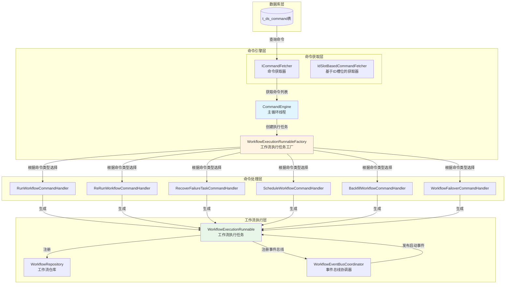

**原理图说明**：
- **数据库层**：存储待处理的命令
- **命令引擎层**：负责命令的获取和处理协调
- **命令处理层**：根据命令类型使用不同的处理器
- **工作流执行层**：将命令转换为可执行的工作流任务

## 4. 时序图

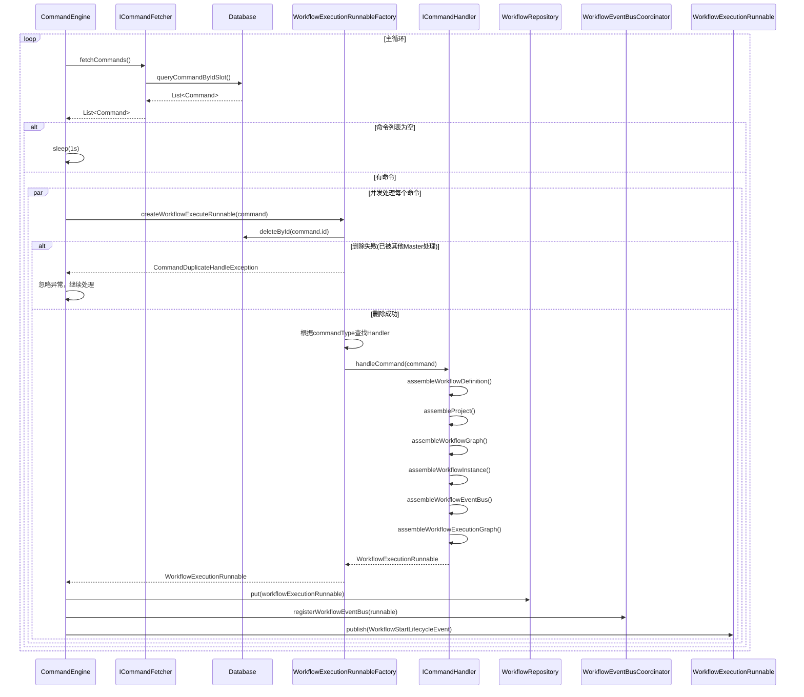

**时序图说明**：
1. CommandEngine在主循环中不断从数据库获取命令
2. 使用事务删除命令确保幂等性
3. 根据命令类型选择合适的Handler处理
4. Handler组装工作流执行上下文和执行图
5. 将生成的WorkflowExecutionRunnable注册到仓库并发布启动事件

## 5. 组件图

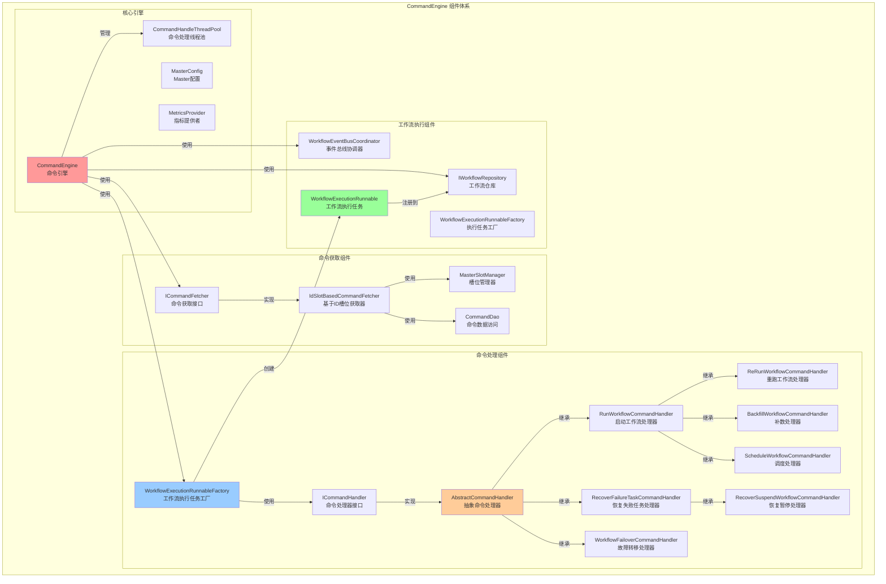

**组件图说明**：
- **命令获取组件**：负责从数据库获取命令，支持分布式负载均衡
- **命令处理组件**：使用策略模式处理不同类型的命令
- **工厂组件**：负责创建WorkflowExecutionRunnable
- **执行组件**：管理工作流的执行和事件

## 6. 类关系图

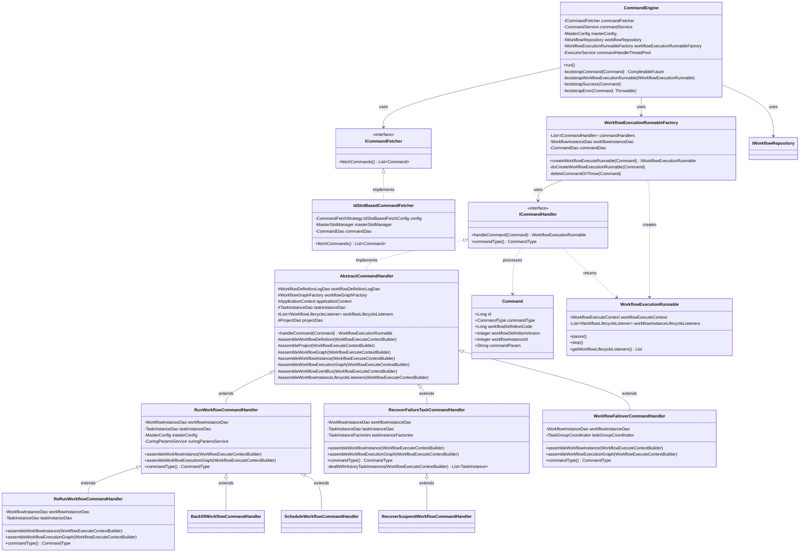

**类关系图说明**：
- `CommandEngine`是核心协调类，依赖多个组件
- `ICommandFetcher`定义了命令获取接口，`IdSlotBasedCommandFetcher`是具体实现
- `ICommandHandler`定义了命令处理接口，多个具体实现类处理不同类型的命令
- `AbstractCommandHandler`提供了通用的处理逻辑，子类实现特定命令的处理
- `WorkflowExecutionRunnableFactory`负责根据命令类型选择合适的Handler并创建执行任务

## 7. ICommandHandler设计模式分析

### 7.1 使用的设计模式

#### 7.1.1 策略模式(Strategy Pattern)

`ICommandHandler`接口及其实现类体现了**策略模式**：

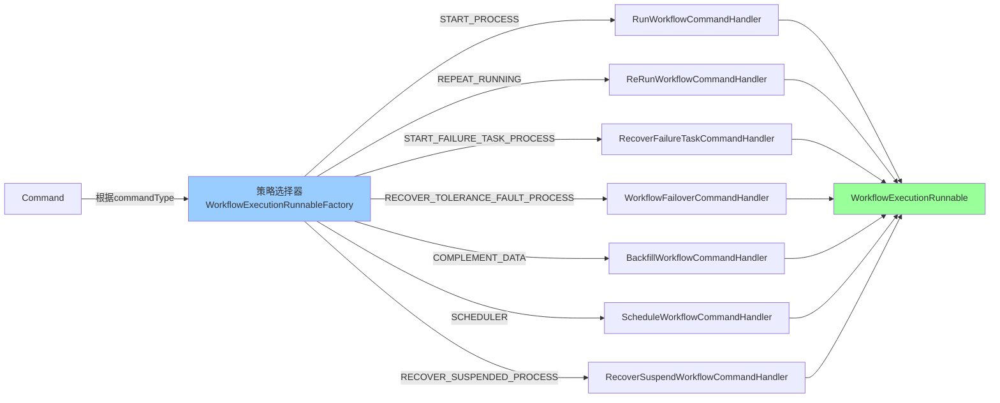

**策略模式说明**：
- **Context(上下文)**：`WorkflowExecutionRunnableFactory`根据命令类型选择不同的Handler
- **Strategy(策略接口)**：`ICommandHandler`定义了统一的处理接口
- **ConcreteStrategy(具体策略)**：各种具体的CommandHandler实现

**优势**：
- 符合开闭原则：新增命令类型只需添加新的Handler，无需修改现有代码
- 消除if-else：通过策略选择替代条件判断
- 职责分离：每个Handler只负责一种命令类型的处理

#### 7.1.2 模板方法模式(Template Method Pattern)

`AbstractCommandHandler`体现了**模板方法模式**：

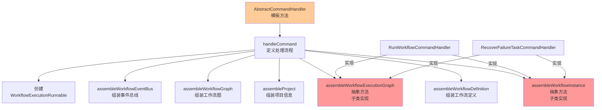

**模板方法模式说明**：
- **AbstractClass(抽象类)**：`AbstractCommandHandler`定义了处理命令的算法骨架
- **TemplateMethod(模板方法)**：`handleCommand()`方法定义了固定的处理流程
- **ConcreteMethod(具体方法)**：如`assembleWorkflowDefinition()`等，提供通用实现
- **AbstractMethod(抽象方法)**：如`assembleWorkflowInstance()`和`assembleWorkflowExecutionGraph()`，由子类实现

**优势**：
- 代码复用：公共逻辑在抽象类中实现，避免重复
- 扩展性：子类只需实现特定步骤，无需重写整个流程
- 控制流程：抽象类控制算法流程，子类实现细节

#### 7.1.3 工厂模式(Factory Pattern)

`WorkflowExecutionRunnableFactory`体现了**简单工厂模式**：

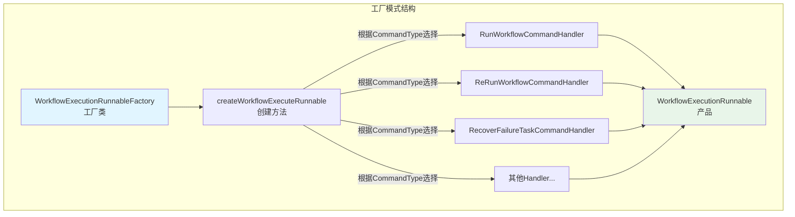

**工厂模式说明**：
- **Factory(工厂类)**：`WorkflowExecutionRunnableFactory`负责创建产品
- **Product(产品)**：`WorkflowExecutionRunnable`是工厂创建的产品
- **Creator(创建方法)**：`createWorkflowExecuteRunnable()`根据命令类型选择合适的Handler并创建产品

**优势**：
- 封装创建逻辑：客户端无需知道具体的创建过程
- 解耦：将对象的创建与使用分离
- 集中管理：所有创建逻辑集中在一个地方

#### 7.1.4 命令模式(Command Pattern)
整个 CommandEngine 体系体现了**命令模式**的核心思想：

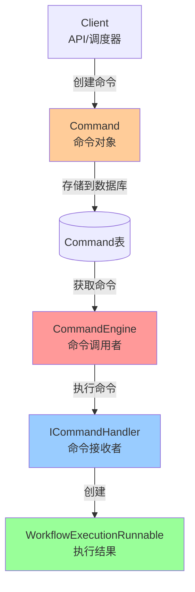

`Command`实体类及其处理机制体现了**命令模式**：

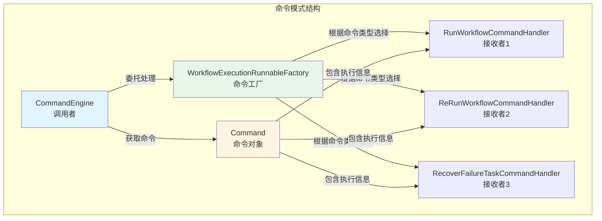

**命令模式说明**：
- **Command(命令对象)**：`Command`实体封装了工作流执行的请求信息，包括命令类型、工作流定义代码、版本、参数等
- **Invoker(调用者)**：`CommandEngine`作为调用者，负责获取命令并触发执行
- **Receiver(接收者)**：各种`CommandHandler`作为接收者，负责执行具体的命令
- **CommandFactory(命令工厂)**：`WorkflowExecutionRunnableFactory`负责根据命令类型创建对应的处理器

**Command对象包含的关键信息**：
- `commandType`：命令类型（START_PROCESS、REPEAT_RUNNING等）
- `workflowDefinitionCode`：工作流定义代码
- `workflowDefinitionVersion`：工作流定义版本
- `workflowInstanceId`：工作流实例ID（对于恢复类命令）
- `commandParam`：命令参数（JSON格式，包含启动节点、全局参数等）
- `workflowInstancePriority`：工作流实例优先级

**优势**：
- **解耦**：将请求的发送者和接收者解耦，命令对象作为中间层
- **可扩展**：新增命令类型只需添加新的Command和Handler，无需修改现有代码
- **可撤销**：命令对象可以存储执行状态，支持撤销操作（虽然当前实现未使用）
- **日志记录**：命令对象可以记录执行历史，便于审计和追踪
- **队列化**：命令可以存储在数据库中，实现异步处理和持久化

### 7.2 继承复用模式

Handler继承体系体现了**代码复用的设计思想**：

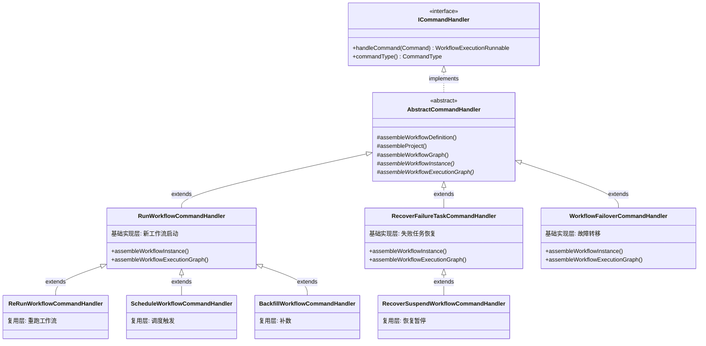

**继承复用模式说明**：

1. **三层继承结构**：
    - **接口层**：`ICommandHandler`定义统一的处理接口
    - **抽象层**：`AbstractCommandHandler`提供通用的处理流程和公共方法
    - **实现层**：具体Handler实现特定命令的处理逻辑

2. **代码复用策略**：
    - **模板方法复用**：`AbstractCommandHandler.handleCommand()`定义了固定的处理流程，子类只需实现特定步骤
    - **方法复用**：公共方法如`assembleWorkflowDefinition()`、`assembleProject()`等在抽象类中实现
    - **继承复用**：`ReRunWorkflowCommandHandler`继承`RunWorkflowCommandHandler`，复用启动工作流的逻辑，只需重写部分方法

3. **复用层次分析**：
    - **RunWorkflowCommandHandler系列**：
        - `RunWorkflowCommandHandler`：实现新工作流的启动逻辑
        - `ReRunWorkflowCommandHandler`：复用启动逻辑，重写`assembleWorkflowInstance()`和`assembleWorkflowExecutionGraph()`，处理重跑场景
        - `ScheduleWorkflowCommandHandler`：完全复用启动逻辑，只改变命令类型
        - `BackfillWorkflowCommandHandler`：完全复用启动逻辑，只改变命令类型
    - **RecoverFailureTaskCommandHandler系列**：
        - `RecoverFailureTaskCommandHandler`：实现失败任务恢复逻辑
        - `RecoverSuspendWorkflowCommandHandler`：完全复用恢复逻辑，只改变命令类型

4. **复用优势**：
    - **减少代码重复**：公共逻辑在父类中实现，避免重复代码
    - **易于维护**：修改公共逻辑只需在父类中修改一次
    - **提高一致性**：所有子类遵循相同的处理流程
    - **简化扩展**：新增类似命令只需继承现有Handler，重写必要方法

### 7.3 命令类型与Handler映射

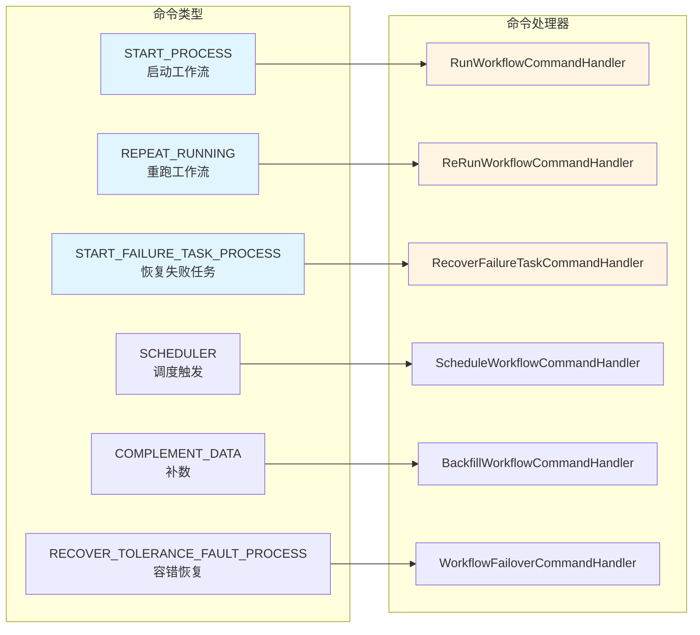

### 7.4 Handler继承关系

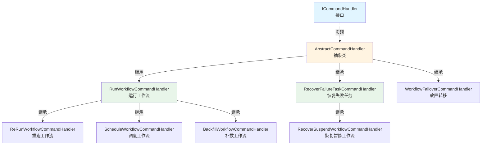

**继承关系说明**：
- `RunWorkflowCommandHandler`：处理新工作流的启动，是其他启动类Handler的基类
- `ReRunWorkflowCommandHandler`：继承自`RunWorkflowCommandHandler`，重跑已存在的工作流
- `ScheduleWorkflowCommandHandler`：继承自`RunWorkflowCommandHandler`，处理调度触发
- `BackfillWorkflowCommandHandler`：继承自`RunWorkflowCommandHandler`，处理补数场景
- `RecoverFailureTaskCommandHandler`：处理失败任务的恢复
- `RecoverSuspendWorkflowCommandHandler`：继承自`RecoverFailureTaskCommandHandler`，处理暂停恢复

## 8. 关键流程详解

### 8.1 命令获取流程

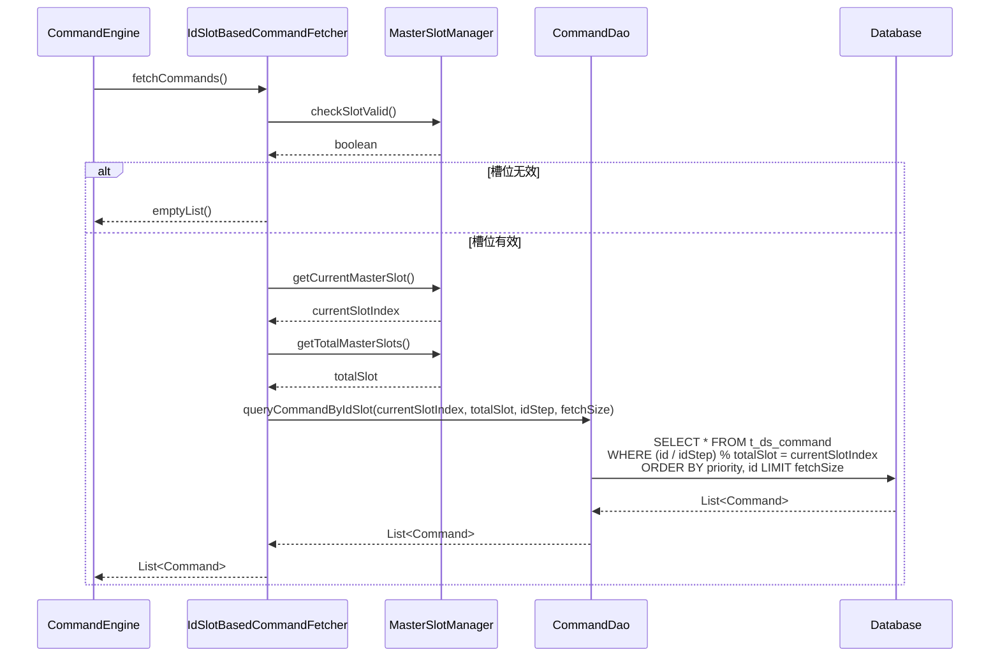

**命令获取流程说明**：
- 使用ID槽位算法实现分布式负载均衡：`(id / idStep) % totalSlot = currentSlotIndex`
- 每个Master节点只处理分配给自己的命令
- 支持动态调整槽位分配，实现负载均衡

### 8.2 命令处理流程

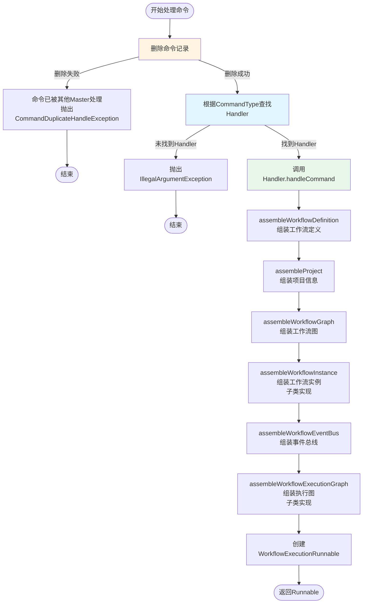

**命令处理流程说明**：
1. **幂等性保证**：首先删除命令记录，如果删除失败说明已被其他Master处理
2. **策略选择**：根据命令类型从Handler列表中查找对应的处理器
3. **上下文组装**：按照固定流程组装工作流执行所需的上下文信息
4. **执行任务创建**：最终创建`WorkflowExecutionRunnable`对象

### 8.3 工作流启动流程

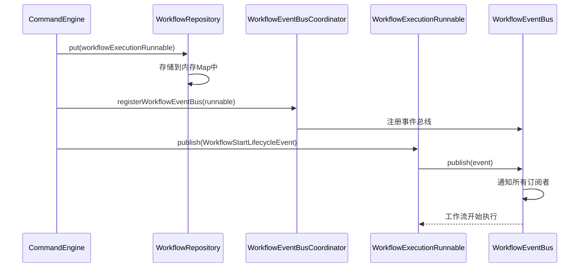

**工作流启动流程说明**：
1. **注册到仓库**：将`WorkflowExecutionRunnable`存储到`WorkflowRepository`中管理
2. **注册事件总线**：为工作流注册事件总线，用于后续的事件驱动
3. **发布启动事件**：发布`WorkflowStartLifecycleEvent`事件，触发工作流开始执行

## 9. 各个 Handler 详细说明

### 9.1 RunWorkflowCommandHandler（启动工作流处理器）

**命令类型**：`START_PROCESS`

**功能**：处理新工作流的启动命令，创建新的工作流实例并开始执行。

**关键实现**：
- **assembleWorkflowInstance**：
    - 从命令中获取工作流实例ID
    - 设置工作流状态为`RUNNING_EXECUTION`
    - 设置Master地址
    - 合并命令参数和工作流全局参数（命令参数优先级更高）
    - 更新工作流实例到数据库

- **assembleWorkflowExecutionGraph**：
    - 创建新的`WorkflowExecutionGraph`
    - 从命令参数中解析启动节点列表（如果为空则从开始节点启动）
    - 使用`WorkflowGraphTopologyLogicalVisitor`遍历工作流图
    - 为每个任务节点创建`TaskExecutionRunnable`
    - 构建任务之间的依赖关系

**使用场景**：
- 用户手动触发工作流执行
- API调用启动工作流
- 补数场景（通过`BackfillWorkflowCommandHandler`复用）

### 9.2 ReRunWorkflowCommandHandler（重跑工作流处理器）

**命令类型**：`REPEAT_RUNNING`

**功能**：重跑已存在的工作流实例，清除历史任务实例状态，从开始节点重新执行。

**关键实现**：
- **继承关系**：继承自`RunWorkflowCommandHandler`
- **assembleWorkflowInstance**：
    - 查询已存在的工作流实例
    - 清空变量池（`varPool`）
    - 更新状态为`RUNNING_EXECUTION`
    - 设置重启时间（`restartTime`）
    - 增加运行次数（`runTimes`）
    - 清空结束时间

- **assembleWorkflowExecutionGraph**：
    - 先调用`markAllTaskInstanceInvalid()`标记所有历史任务实例为无效
    - 然后调用父类方法创建新的执行图

**使用场景**：
- 用户手动重跑工作流
- 工作流执行失败后重跑

### 9.3 ScheduleWorkflowCommandHandler（调度工作流处理器）

**命令类型**：`SCHEDULER`

**功能**：处理调度器触发的工作流启动，逻辑与`START_PROCESS`相同。

**关键实现**：
- **继承关系**：继承自`RunWorkflowCommandHandler`
- **完全复用**：完全复用父类的所有逻辑，只改变命令类型标识

**使用场景**：
- 定时调度触发工作流执行
- Cron表达式触发

### 9.4 BackfillWorkflowCommandHandler（补数工作流处理器）

**命令类型**：`COMPLEMENT_DATA`

**功能**：处理补数场景，可以指定补数的日期范围和启动节点。

**关键实现**：
- **继承关系**：继承自`RunWorkflowCommandHandler`
- **完全复用**：完全复用父类的所有逻辑，只改变命令类型标识
- **特殊参数**：通过`commandParam`中的`complementScheduleDateList`指定补数日期列表

**使用场景**：
- 历史数据补数
- 指定日期范围的数据处理

### 9.5 RecoverFailureTaskCommandHandler（恢复失败任务处理器）

**命令类型**：`START_FAILURE_TASK_PROCESS`

**功能**：恢复工作流中的失败任务，从失败或暂停的任务节点重新开始执行。

**关键实现**：
- **assembleWorkflowInstance**：
    - 查询已存在的工作流实例
    - 清空变量池
    - 更新状态为`RUNNING_EXECUTION`
    - 更新命令类型

- **assembleWorkflowExecutionGraph**：
    - 调用`dealWithHistoryTaskInstances()`处理历史任务实例：
        - 遍历工作流图，识别需要恢复的任务（失败、暂停、被杀死）
        - 标记失败任务的后继任务为无效
        - 为失败任务创建新的任务实例
        - 为暂停任务恢复任务实例
    - 使用历史任务实例构建执行图
    - 保留成功任务的状态，只恢复失败/暂停的任务

**处理逻辑**：
- **失败任务**：标记为无效，创建新的任务实例重新执行
- **暂停任务**：恢复任务实例，继续执行
- **后继任务**：如果前置任务失败，后继任务也会被标记为无效

**使用场景**：
- 工作流执行过程中部分任务失败，需要从失败点恢复
- 工作流被暂停后恢复执行

### 9.6 RecoverSuspendWorkflowCommandHandler（恢复暂停工作流处理器）

**命令类型**：`RECOVER_SUSPENDED_PROCESS`

**功能**：恢复被暂停的工作流，从暂停的任务节点继续执行。

**关键实现**：
- **继承关系**：继承自`RecoverFailureTaskCommandHandler`
- **完全复用**：完全复用父类的恢复逻辑，只改变命令类型标识

**使用场景**：
- 工作流被手动暂停后恢复执行
- 系统维护后恢复工作流

### 9.7 WorkflowFailoverCommandHandler（工作流故障转移处理器）

**命令类型**：`RECOVER_TOLERANCE_FAULT_PROCESS`

**功能**：处理Master节点故障转移场景，恢复工作流到故障前的状态。

**关键实现**：
- **assembleWorkflowInstance**：
    - 从命令参数中解析`WorkflowFailoverCommandParam`
    - 恢复工作流实例到指定的执行状态
    - 不更新命令参数，保持原始参数

- **assembleWorkflowExecutionGraph**：
    - 从已存在的有效任务实例重建执行图
    - 使用`WorkflowGraphTopologyLogicalVisitor`遍历工作流图
    - 为每个任务节点创建`TaskExecutionRunnable`，关联历史任务实例
    - 保持任务实例的原始状态

**使用场景**：
- Master节点故障后，新的Master节点接管工作流
- 系统容错恢复

## 10. 关键技术细节

### 10.1 分布式锁机制实现方式

**通过删除命令实现分布式锁**：

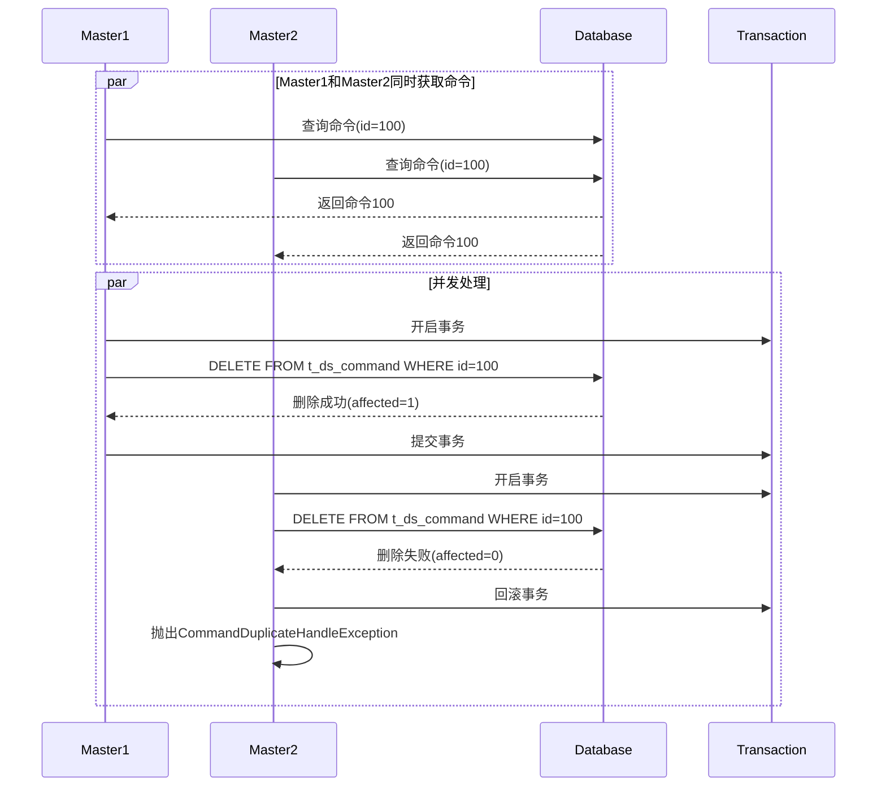

**实现原理**：
1. **数据库删除操作作为锁**：使用`DELETE FROM t_ds_command WHERE id=?`作为分布式锁
2. **事务保证原子性**：在`@Transactional`注解的方法中执行删除操作
3. **删除结果判断**：
    - `affectedRows > 0`：删除成功，获得锁，继续处理
    - `affectedRows = 0`：删除失败，说明已被其他Master处理，抛出`CommandDuplicateHandleException`
4. **幂等性保证**：即使多个Master同时获取到同一命令，只有一个能成功删除并处理

**优势**：
- **无需额外组件**：不需要Redis、Zookeeper等分布式锁组件
- **数据库保证一致性**：利用数据库的ACID特性保证原子性
- **简单可靠**：实现简单，可靠性高
- **自动释放**：命令删除后锁自动释放，无需手动释放

**代码实现**：
```java
@Transactional
public IWorkflowExecutionRunnable createWorkflowExecuteRunnable(Command command) {
    deleteCommandOrThrow(command);  // 删除命令作为分布式锁
    return doCreateWorkflowExecutionRunnable(command);
}

private void deleteCommandOrThrow(Command command) {
    boolean deleteResult = commandDao.deleteById(command.getId());
    if (!deleteResult) {
        throw new CommandDuplicateHandleException(command);
    }
}
```

### 10.2 命令获取策略

#### 10.2.1 基于ID槽位的获取策略

**算法原理**：
使用命令ID和槽位数量进行取模运算，将命令分配给不同的Master节点。

**SQL查询**：
```sql
SELECT * FROM t_ds_command 
WHERE (id / #{idStep}) % #{totalSlot} = #{currentSlotIndex}
ORDER BY workflow_instance_priority, id ASC 
LIMIT #{fetchSize}
```

**参数说明**：
- `idStep`：ID步长，用于控制命令的分组粒度（默认值通常为1）
- `totalSlot`：总槽位数，等于Master节点总数
- `currentSlotIndex`：当前Master的槽位索引（0到totalSlot-1）
- `fetchSize`：每次获取的命令数量

**分配示例**：
假设有3个Master节点（totalSlot=3），idStep=1：
- Master0处理：id % 3 = 0的命令（0, 3, 6, 9...）
- Master1处理：id % 3 = 1的命令（1, 4, 7, 10...）
- Master2处理：id % 3 = 2的命令（2, 5, 8, 11...）

**优势**：
- **负载均衡**：命令均匀分配到各个Master节点
- **无状态**：不需要维护复杂的分配状态
- **动态调整**：Master节点数量变化时，重新计算槽位即可
- **优先级支持**：按优先级和ID排序，保证高优先级命令优先处理

**槽位验证**：
```java
if (!masterSlotManager.checkSlotValid()) {
    log.warn("MasterSlotManager check slot is invalidated.");
    return Collections.emptyList();
}
```
在获取命令前，先验证当前Master的槽位是否有效，如果无效则不获取命令。

### 10.3 异步并发处理

#### 10.3.1 线程池配置

**线程池创建**：
```java
this.commandHandleThreadPool = ThreadUtils.newDaemonFixedThreadExecutor(
    "MasterCommandHandleThreadPool",
    Runtime.getRuntime().availableProcessors()
);
```

**配置说明**：
- **线程池类型**：固定大小线程池（FixedThreadPool）
- **线程数量**：`Runtime.getRuntime().availableProcessors()`，等于CPU核心数
- **线程类型**：守护线程（Daemon Thread），JVM关闭时自动退出
- **命名**：`MasterCommandHandleThreadPool`，便于监控和问题排查

**并发处理流程**：
```java
List<CompletableFuture<Void>> allCompleteFutures = new ArrayList<>();
for (Command command : commands) {
    CompletableFuture<Void> completableFuture = bootstrapCommand(command)
        .thenAccept(this::bootstrapWorkflowExecutionRunnable)
        .thenAccept((unused) -> bootstrapSuccess(command))
        .exceptionally(throwable -> bootstrapError(command, throwable));
    allCompleteFutures.add(completableFuture);
}
CompletableFuture.allOf(allCompleteFutures.toArray(new CompletableFuture[0])).join();
```

**处理步骤**：
1. **异步创建执行任务**：`bootstrapCommand()`在线程池中异步执行
2. **链式处理**：使用`CompletableFuture`的链式调用处理后续步骤
3. **异常处理**：使用`exceptionally()`统一处理异常
4. **等待完成**：使用`allOf().join()`等待所有命令处理完成

**优势**：
- **提高吞吐量**：多个命令并发处理，充分利用CPU资源
- **非阻塞**：主循环线程不会被单个命令的处理阻塞
- **异常隔离**：单个命令处理失败不影响其他命令
- **资源控制**：通过线程池大小控制并发度，避免资源耗尽

### 10.4 负载保护机制

**实现原理**：
在每次获取命令前，检查系统资源使用情况，如果超过阈值则暂停处理命令。

**检查指标**：
```java
public boolean isOverload(SystemMetrics systemMetrics) {
    // 系统CPU使用率
    if (systemMetrics.getSystemCpuUsagePercentage() > maxSystemCpuUsagePercentageThresholds) {
        return true;
    }
    // JVM CPU使用率
    if (systemMetrics.getJvmCpuUsagePercentage() > maxJvmCpuUsagePercentageThresholds) {
        return true;
    }
    // 磁盘使用率
    if (systemMetrics.getDiskUsedPercentage() > maxDiskUsagePercentageThresholds) {
        return true;
    }
    // 系统内存使用率
    if (systemMetrics.getSystemMemoryUsedPercentage() > maxSystemMemoryUsagePercentageThresholds) {
        return true;
    }
    return false;
}
```

**默认阈值**：
- `maxSystemCpuUsagePercentageThresholds`：0.7（70%）
- `maxJvmCpuUsagePercentageThresholds`：0.7（70%）
- `maxSystemMemoryUsagePercentageThresholds`：0.7（70%）
- `maxDiskUsagePercentageThresholds`：0.7（70%）

**处理流程**：
```java
SystemMetrics systemMetrics = metricsProvider.getSystemMetrics();
if (serverLoadProtection.isOverload(systemMetrics)) {
    log.warn("The current server is overload, cannot consumes commands.");
    MasterServerMetrics.incMasterOverload();
    Thread.sleep(Constants.SLEEP_TIME_MILLIS);
    continue;
}
```

**保护机制**：
- **暂停处理**：检测到过载时，跳过本次命令获取，等待1秒后重试
- **指标记录**：记录过载次数到`MasterServerMetrics`
- **自动恢复**：系统资源恢复后，自动恢复命令处理

**优势**：
- **防止系统崩溃**：避免在高负载情况下继续处理命令导致系统崩溃
- **自我保护**：Master节点能够自我保护，保证基本功能可用
- **可配置**：阈值可通过配置文件调整
- **可监控**：通过指标监控过载情况

### 10.5 错误处理机制

**异常分类和处理**：

1. **CommandDuplicateHandleException（命令重复处理异常）**：
   ```java
   if (throwable instanceof CommandDuplicateHandleException) {
       log.warn("Handle command failed, the command: {} has been handled by other master", command);
       return null;  // 忽略异常，继续处理
   }
   ```
    - **原因**：命令已被其他Master节点处理
    - **处理**：记录警告日志，忽略异常，不进行错误处理

2. **IllegalArgumentException（非法参数异常）**：
    - **原因**：找不到对应的Handler或参数无效
    - **处理**：记录错误日志，将命令移动到错误命令表

3. **其他异常**：
   ```java
   log.error("Failed bootstrap command {} ", JSONUtils.toPrettyJsonString(command), throwable);
   commandService.moveToErrorCommand(command, ExceptionUtils.getStackTrace(throwable));
   ```
    - **处理**：记录错误日志和堆栈信息，将命令移动到错误命令表

**错误命令处理**：
- **移动到错误表**：`commandService.moveToErrorCommand()`将失败的命令移动到`t_ds_error_command`表
- **保留错误信息**：保存完整的异常堆栈信息，便于问题排查
- **可手动重试**：管理员可以查看错误命令并手动重试

**主循环异常处理**：
```java
try {
    // 命令处理逻辑
} catch (InterruptedException interruptedException) {
    log.warn("Master schedule bootstrap interrupted, close the loop", interruptedException);
    Thread.currentThread().interrupt();
    break;  // 中断循环
} catch (Exception e) {
    log.error("Master schedule workflow error", e);
    ThreadUtils.sleep(Constants.SLEEP_TIME_MILLIS);  // 等待1秒后继续
}
```

**异常处理策略**：
- **中断异常**：正常关闭，中断循环
- **其他异常**：记录错误，等待1秒后继续，避免数据库故障导致异常循环

### 10.6 事件驱动机制

**事件总线架构**：

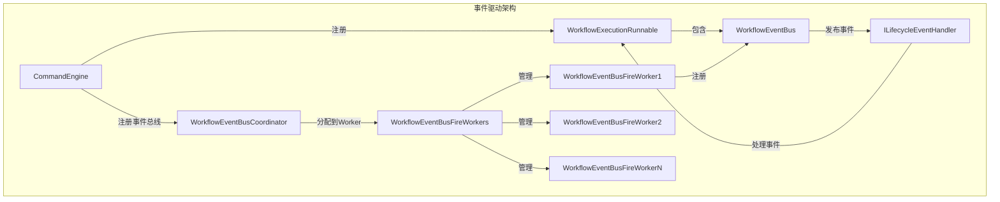

**事件总线注册**：
```java
// 1. 计算Worker槽位
int workerSlot = workflowInstanceId % workflowEventBusFireWorkers.getWorkerSize();

// 2. 获取对应的Worker
WorkflowEventBusFireWorker worker = workflowEventBusFireWorkers.getWorker(workerSlot);

// 3. 注册事件总线
worker.registerWorkflowEventBus(workflowExecutionRunnable);
```

**Worker分配策略**：
- **按工作流实例ID取模**：`workflowInstanceId % workerSize`
- **保证同一工作流的事件在同一Worker处理**：确保事件处理的顺序性
- **负载均衡**：工作流实例均匀分配到各个Worker

**事件触发机制**：
```java
// 1. Worker定期触发（默认100ms）
scheduleWithFixedDelay(() -> fireAllRegisteredEvent(), 
    DEFAULT_FIRE_INTERVAL, DEFAULT_FIRE_INTERVAL);

// 2. 触发所有已注册工作流的事件
public void fireAllRegisteredEvent() {
    for (IWorkflowExecutionRunnable runnable : registeredWorkflowExecuteRunnableMap.values()) {
        runnable.getWorkflowEventBus().fireAllEvent();
    }
}
```

**事件处理流程**：
1. **事件发布**：工作流执行过程中发布生命周期事件（如`WorkflowStartLifecycleEvent`）
2. **事件存储**：事件存储在`WorkflowEventBus`的队列中
3. **定期触发**：Worker线程定期（100ms）触发所有已注册工作流的事件处理
4. **事件分发**：根据事件类型匹配对应的`ILifecycleEventHandler`
5. **事件处理**：Handler处理事件，更新工作流状态或触发后续操作

**优势**：
- **解耦**：命令处理和事件处理分离，降低耦合度
- **异步**：事件异步处理，不阻塞命令处理流程
- **可扩展**：可以注册多个事件处理器，灵活扩展功能
- **顺序保证**：同一工作流的事件在同一Worker中顺序处理

## 11. 设计优势

### 11.1 可扩展性
- **新增命令类型**：只需实现`ICommandHandler`接口，无需修改现有代码
- **新增获取策略**：实现`ICommandFetcher`接口，支持不同的命令获取方式

### 11.2 可维护性
- **职责分离**：每个Handler只负责一种命令类型的处理
- **代码复用**：通过抽象类复用公共逻辑
- **清晰的结构**：使用设计模式使代码结构清晰易懂

### 11.3 可靠性
- **幂等性保证**：通过事务和数据库删除确保命令只被处理一次
- **异常处理**：完善的异常处理机制，包括重复处理异常、未找到Handler异常等
- **负载保护**：支持服务器负载检测，防止过载

### 11.4 性能
- **并发处理**：使用线程池并发处理多个命令
- **分布式负载均衡**：通过ID槽位算法实现多Master节点的负载均衡
- **异步执行**：使用CompletableFuture实现异步处理

## 10. 总结

命令引擎(CommandEngine)是DolphinScheduler的核心调度组件，通过以下设计实现了高效、可靠的工作流调度：

### 10.1 核心设计思想

CommandEngine 的设计体现了以下核心思想：

1. **分层架构**：采用清晰的分层设计，每层职责单一，便于维护和扩展
2. **设计模式**：综合运用策略模式、模板方法模式、工厂模式、命令模式等多种设计模式
3. **异步并发**：使用 CompletableFuture 和线程池实现高效的并发处理
4. **分布式协调**：通过数据库删除操作实现分布式锁，避免命令重复处理
5. **事件驱动**：采用事件总线机制，实现组件间的解耦和异步通信
6. **可扩展性**：通过接口和抽象类，支持灵活扩展新的命令类型和处理逻辑

### 10.2 核心设计模式

1. **命令模式**：通过`Command`对象封装工作流执行请求，实现请求的发送者和接收者解耦
2. **策略模式**：通过`ICommandHandler`实现不同命令类型的处理策略，支持灵活扩展
3. **模板方法模式**：通过`AbstractCommandHandler`实现代码复用和流程控制，提高可维护性
4. **工厂模式**：通过`WorkflowExecutionRunnableFactory`封装对象创建逻辑，简化客户端代码
5. **继承复用模式**：通过Handler继承体系实现代码复用，减少重复代码

### 10.3 关键技术特性

1. **分布式锁机制**：通过数据库删除操作实现分布式锁，无需额外组件
2. **负载均衡**：通过ID槽位算法实现多Master节点的命令分配
3. **异步并发处理**：使用线程池和CompletableFuture实现高效的并发处理
4. **负载保护**：通过系统资源监控实现自我保护，防止系统过载
5. **错误处理**：完善的异常处理机制，确保系统稳定性
6. **事件驱动**：通过事件总线实现工作流的异步事件处理

### 10.4 系统优势

- **可扩展性**：新增命令类型只需实现接口，无需修改现有代码
- **可维护性**：清晰的代码结构和设计模式，易于理解和维护
- **可靠性**：幂等性保证、异常处理、负载保护等多重保障
- **高性能**：并发处理、负载均衡、异步执行等优化措施
- **高可用**：分布式架构、故障转移、容错恢复等机制

### 10.5 工作流程总结

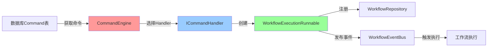

### 10.6 设计优势

1. **解耦设计**：
- 命令的创建和执行分离
- 通过事件总线实现组件解耦
- 接口抽象实现依赖倒置

2. **可维护性**：
- 清晰的类层次结构
- 统一的处理模板
- 完善的错误处理

3. **可扩展性**：
- 策略模式支持新增命令类型
- 模板方法模式支持定制处理流程
- 工厂模式封装创建逻辑

4. **性能优化**：
- 异步并发处理
- 线程池资源管理
- 负载保护机制

### 10.7 应用场景

CommandEngine 适用于以下场景：

1. **工作流启动**：通过API或调度器触发工作流执行
2. **工作流重跑**：重新执行已完成或失败的工作流
3. **任务恢复**：恢复失败或暂停的任务
4. **故障转移**：Master节点故障后恢复工作流执行
5. **数据补数**：按时间范围回填历史数据
6. **定时调度**：按计划执行定时任务

### 10.8 最佳实践

1. **命令处理**：
- 确保命令参数格式正确
- 合理设置命令获取批次大小
- 监控命令处理耗时

2. **性能优化**：
- 根据实际负载调整线程池大小
- 监控系统资源使用情况
- 合理配置负载保护阈值

3. **错误处理**：
- 及时处理错误表中的命令
- 分析错误原因并优化
- 建立告警机制

4. **监控告警**：
- 监控命令处理速率
- 监控系统负载指标
- 设置合理的告警阈值
- 定期检查错误命令

5. **扩展开发**：
- 新增命令类型时，实现对应的Handler
- 遵循模板方法模式，复用基类逻辑
- 保持Handler的单一职责原则
- 编写完善的单元测试

### 10.9 技术亮点

1. **分布式锁创新**：
- 使用数据库DELETE操作实现分布式锁
- 避免了引入额外的分布式锁组件（如Zookeeper、Redis）
- 简化了系统架构，降低了运维复杂度

2. **槽位分配策略**：
- 基于命令ID的槽位分配，实现负载均衡
- 支持动态扩缩容，无需手动配置
- 天然避免了命令处理的冲突

3. **异步处理链**：
- 使用CompletableFuture构建异步处理链
- 支持链式错误处理
- 实现了优雅的异常传播机制

4. **事件驱动架构**：
- 通过事件总线实现组件解耦
- 支持多种事件类型
- 便于扩展和集成

### 10.10 未来优化方向

1. **性能优化**：
- 优化命令获取SQL，减少数据库查询时间
- 考虑使用缓存减少重复查询
- 优化线程池配置，支持动态调整

2. **功能增强**：
- 支持命令优先级处理
- 支持命令批量处理优化
- 增强负载保护机制的智能化

3. **可观测性**：
- 增加更详细的指标监控
- 支持分布式追踪
- 完善日志记录和查询

4. **容错能力**：
- 增强异常恢复机制
- 支持命令重试策略
- 优化故障转移流程

## 11. 相关代码文件

### 11.1 核心类文件

- `CommandEngine.java` - 命令引擎主类
- `ICommandFetcher.java` - 命令获取接口
- `IdSlotBasedCommandFetcher.java` - 基于ID槽位的命令获取器
- `WorkflowExecutionRunnableFactory.java` - 工作流执行任务工厂
- `ICommandHandler.java` - 命令处理器接口
- `AbstractCommandHandler.java` - 抽象命令处理器

### 11.2 Handler实现类

- `RunWorkflowCommandHandler.java` - 启动工作流处理器
- `ReRunWorkflowCommandHandler.java` - 重跑工作流处理器
- `RecoverFailureTaskCommandHandler.java` - 恢复失败任务处理器
- `WorkflowFailoverCommandHandler.java` - 工作流故障转移处理器
- `BackfillWorkflowCommandHandler.java` - 补数处理器
- `ScheduleWorkflowCommandHandler.java` - 调度处理器
- `RecoverSuspendWorkflowCommandHandler.java` - 恢复暂停处理器

### 11.3 相关接口和类

- `Command.java` - 命令实体类
- `CommandType.java` - 命令类型枚举
- `WorkflowExecutionRunnable.java` - 工作流执行任务
- `IWorkflowRepository.java` - 工作流仓库接口
- `WorkflowEventBusCoordinator.java` - 事件总线协调器
- `MasterSlotManager.java` - 槽位管理器
- `CommandDao.java` - 命令数据访问对象

## 12. 参考资料

### 12.1 设计模式

- **策略模式（Strategy Pattern）**：定义一系列算法，把它们封装起来，并且使它们可相互替换
- **模板方法模式（Template Method Pattern）**：定义一个操作中算法的骨架，而将一些步骤延迟到子类中
- **工厂模式（Factory Pattern）**：定义一个创建对象的接口，让子类决定实例化哪一个类
- **命令模式（Command Pattern）**：将一个请求封装成一个对象，从而使您可以用不同的请求对客户进行参数化

### 12.2 相关文档

- Apache DolphinScheduler 官方文档
- DolphinScheduler 架构设计文档
- Master 服务器启动流程文档
- 工作流执行引擎文档

### 12.3 关键概念

- **Command**：命令对象，封装了工作流执行的请求信息
- **CommandType**：命令类型，定义了不同的命令类型（启动、重跑、恢复等）
- **Handler**：命令处理器，负责处理特定类型的命令
- **WorkflowExecutionRunnable**：工作流执行任务，封装了工作流实例的执行逻辑
- **WorkflowExecutionGraph**：工作流执行图，表示工作流的执行状态和任务依赖关系
- **EventBus**：事件总线，用于组件间的事件通信
- **Slot**：槽位，用于分布式环境下的命令分配

