# 命令引擎(CommandEngine)原理分析

## 1. 概述

命令引擎(CommandEngine)是DolphinScheduler Master节点的核心组件之一，负责从数据库中消费命令(Command)，并将命令转换为工作流执行任务(WorkflowExecutionRunnable)。它是工作流调度的入口点，实现了命令驱动的调度模式。

## 2. 核心原理

### 2.1 工作原理

命令引擎采用**生产者-消费者模式**和**策略模式**，主要流程如下：

1. **命令获取阶段**：通过`ICommandFetcher`从数据库的`t_ds_command`表中获取待处理的命令
2. **命令处理阶段**：使用`WorkflowExecutionRunnableFactory`根据命令类型选择合适的`ICommandHandler`处理命令
3. **工作流启动阶段**：将处理后的`WorkflowExecutionRunnable`注册到`WorkflowRepository`，并发布启动事件

### 2.2 关键特性

- **分布式负载均衡**：通过ID槽位(IdSlot)机制实现多Master节点的命令分配
- **幂等性保证**：使用事务和数据库删除操作确保命令只被处理一次
- **异步并发处理**：使用线程池并发处理多个命令
- **负载保护**：支持服务器负载检测，防止过载
- **策略模式**：通过`ICommandHandler`接口实现不同命令类型的处理策略

## 3. 架构原理图

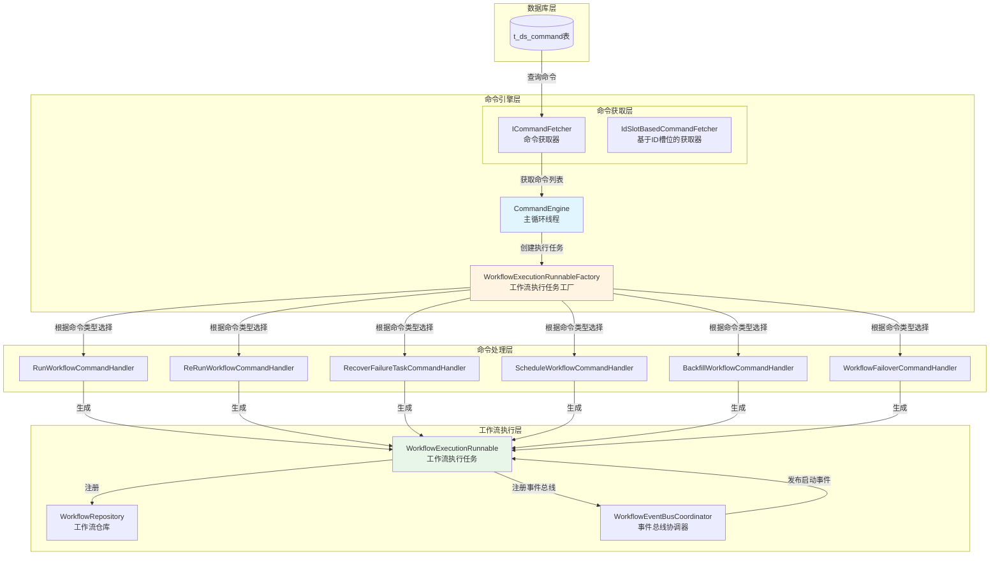

**原理图说明**：
- **数据库层**：存储待处理的命令
- **命令引擎层**：负责命令的获取和处理协调
- **命令处理层**：根据命令类型使用不同的处理器
- **工作流执行层**：将命令转换为可执行的工作流任务

## 4. 时序图

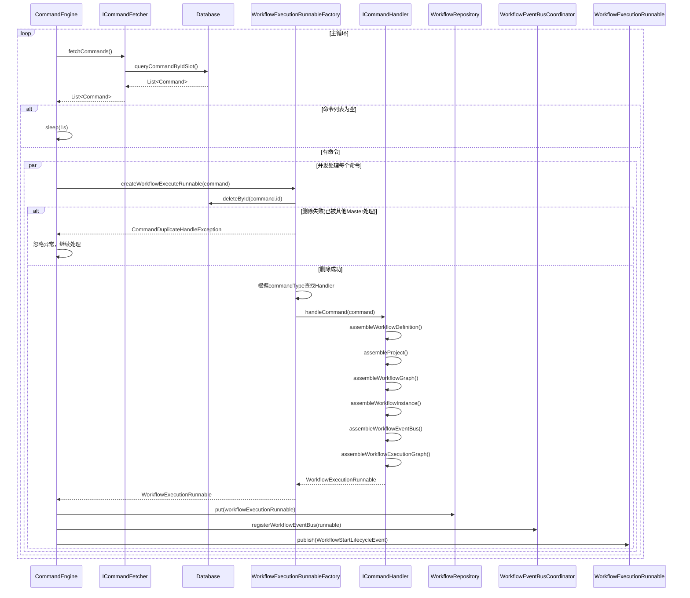

**时序图说明**：
1. CommandEngine在主循环中不断从数据库获取命令
2. 使用事务删除命令确保幂等性
3. 根据命令类型选择合适的Handler处理
4. Handler组装工作流执行上下文和执行图
5. 将生成的WorkflowExecutionRunnable注册到仓库并发布启动事件

## 5. 组件图

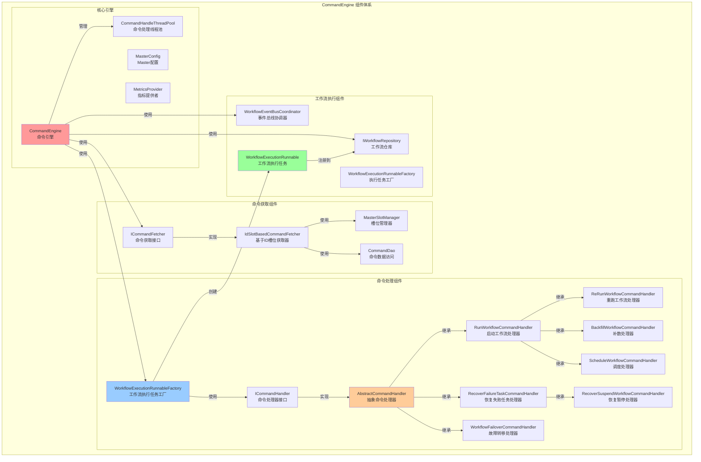

**组件图说明**：
- **命令获取组件**：负责从数据库获取命令，支持分布式负载均衡
- **命令处理组件**：使用策略模式处理不同类型的命令
- **工厂组件**：负责创建WorkflowExecutionRunnable
- **执行组件**：管理工作流的执行和事件

## 6. 类关系图


**类关系图说明**：
- `CommandEngine`是核心协调类，依赖多个组件
- `ICommandFetcher`定义了命令获取接口，`IdSlotBasedCommandFetcher`是具体实现
- `ICommandHandler`定义了命令处理接口，多个具体实现类处理不同类型的命令
- `AbstractCommandHandler`提供了通用的处理逻辑，子类实现特定命令的处理
- `WorkflowExecutionRunnableFactory`负责根据命令类型选择合适的Handler并创建执行任务

## 7. ICommandHandler设计模式分析

### 7.1 使用的设计模式

#### 7.1.1 策略模式(Strategy Pattern)

`ICommandHandler`接口及其实现类体现了**策略模式**：

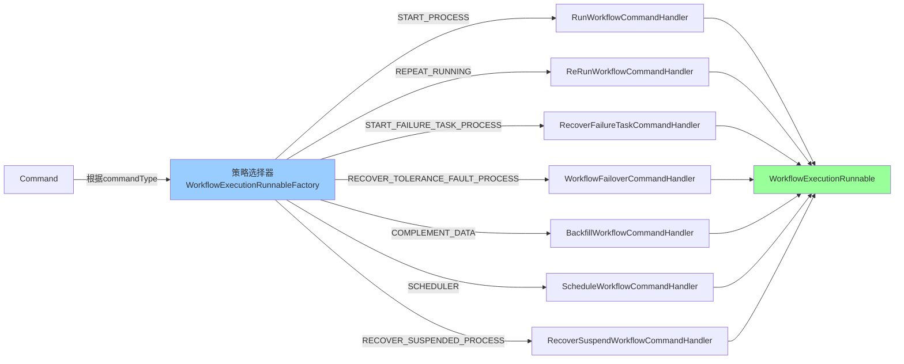

**策略模式说明**：
- **Context(上下文)**：`WorkflowExecutionRunnableFactory`根据命令类型选择不同的Handler
- **Strategy(策略接口)**：`ICommandHandler`定义了统一的处理接口
- **ConcreteStrategy(具体策略)**：各种具体的CommandHandler实现

**优势**：
- 符合开闭原则：新增命令类型只需添加新的Handler，无需修改现有代码
- 消除if-else：通过策略选择替代条件判断
- 职责分离：每个Handler只负责一种命令类型的处理

#### 7.1.2 模板方法模式(Template Method Pattern)

`AbstractCommandHandler`体现了**模板方法模式**：

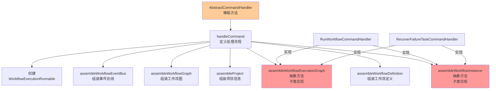

**模板方法模式说明**：
- **AbstractClass(抽象类)**：`AbstractCommandHandler`定义了处理命令的算法骨架
- **TemplateMethod(模板方法)**：`handleCommand()`方法定义了固定的处理流程
- **ConcreteMethod(具体方法)**：如`assembleWorkflowDefinition()`等，提供通用实现
- **AbstractMethod(抽象方法)**：如`assembleWorkflowInstance()`和`assembleWorkflowExecutionGraph()`，由子类实现

**优势**：
- 代码复用：公共逻辑在抽象类中实现，避免重复
- 扩展性：子类只需实现特定步骤，无需重写整个流程
- 控制流程：抽象类控制算法流程，子类实现细节

#### 7.1.3 工厂模式(Factory Pattern)

`WorkflowExecutionRunnableFactory`体现了**简单工厂模式**：

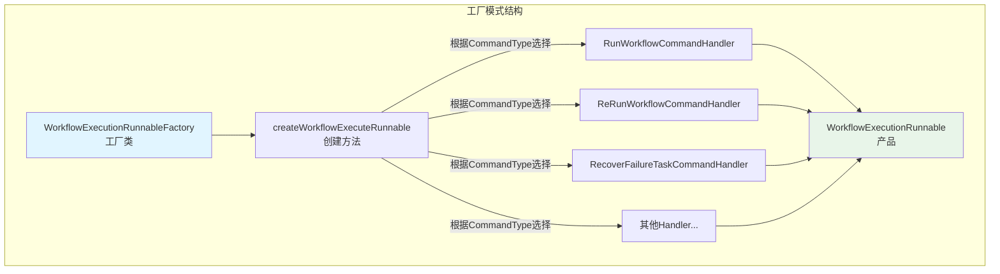

**工厂模式说明**：
- **Factory(工厂类)**：`WorkflowExecutionRunnableFactory`负责创建产品
- **Product(产品)**：`WorkflowExecutionRunnable`是工厂创建的产品
- **Creator(创建方法)**：`createWorkflowExecuteRunnable()`根据命令类型选择合适的Handler并创建产品

**优势**：
- 封装创建逻辑：客户端无需知道具体的创建过程
- 解耦：将对象的创建与使用分离
- 集中管理：所有创建逻辑集中在一个地方

#### 7.1.4 命令模式(Command Pattern)
整个 CommandEngine 体系体现了**命令模式**的核心思想：

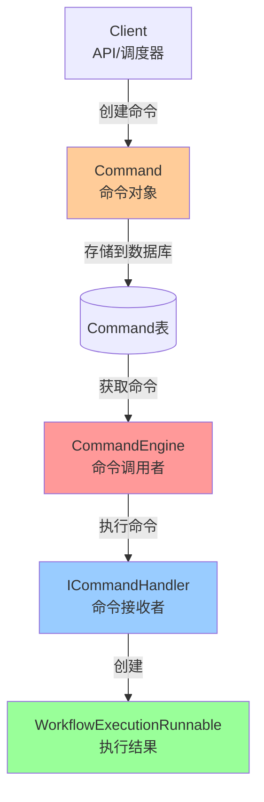

`Command`实体类及其处理机制体现了**命令模式**：

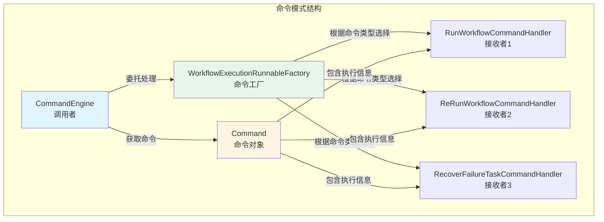

**命令模式说明**：
- **Command(命令对象)**：`Command`实体封装了工作流执行的请求信息，包括命令类型、工作流定义代码、版本、参数等
- **Invoker(调用者)**：`CommandEngine`作为调用者，负责获取命令并触发执行
- **Receiver(接收者)**：各种`CommandHandler`作为接收者，负责执行具体的命令
- **CommandFactory(命令工厂)**：`WorkflowExecutionRunnableFactory`负责根据命令类型创建对应的处理器

**Command对象包含的关键信息**：
- `commandType`：命令类型（START_PROCESS、REPEAT_RUNNING等）
- `workflowDefinitionCode`：工作流定义代码
- `workflowDefinitionVersion`：工作流定义版本
- `workflowInstanceId`：工作流实例ID（对于恢复类命令）
- `commandParam`：命令参数（JSON格式，包含启动节点、全局参数等）
- `workflowInstancePriority`：工作流实例优先级

**优势**：
- **解耦**：将请求的发送者和接收者解耦，命令对象作为中间层
- **可扩展**：新增命令类型只需添加新的Command和Handler，无需修改现有代码
- **可撤销**：命令对象可以存储执行状态，支持撤销操作（虽然当前实现未使用）
- **日志记录**：命令对象可以记录执行历史，便于审计和追踪
- **队列化**：命令可以存储在数据库中，实现异步处理和持久化

### 7.2 继承复用模式

Handler继承体系体现了**代码复用的设计思想**：


**继承复用模式说明**：

1. **三层继承结构**：
    - **接口层**：`ICommandHandler`定义统一的处理接口
    - **抽象层**：`AbstractCommandHandler`提供通用的处理流程和公共方法
    - **实现层**：具体Handler实现特定命令的处理逻辑

2. **代码复用策略**：
    - **模板方法复用**：`AbstractCommandHandler.handleCommand()`定义了固定的处理流程，子类只需实现特定步骤
    - **方法复用**：公共方法如`assembleWorkflowDefinition()`、`assembleProject()`等在抽象类中实现
    - **继承复用**：`ReRunWorkflowCommandHandler`继承`RunWorkflowCommandHandler`，复用启动工作流的逻辑，只需重写部分方法

3. **复用层次分析**：
    - **RunWorkflowCommandHandler系列**：
        - `RunWorkflowCommandHandler`：实现新工作流的启动逻辑
        - `ReRunWorkflowCommandHandler`：复用启动逻辑，重写`assembleWorkflowInstance()`和`assembleWorkflowExecutionGraph()`，处理重跑场景
        - `ScheduleWorkflowCommandHandler`：完全复用启动逻辑，只改变命令类型
        - `BackfillWorkflowCommandHandler`：完全复用启动逻辑，只改变命令类型
    - **RecoverFailureTaskCommandHandler系列**：
        - `RecoverFailureTaskCommandHandler`：实现失败任务恢复逻辑
        - `RecoverSuspendWorkflowCommandHandler`：完全复用恢复逻辑，只改变命令类型

4. **复用优势**：
    - **减少代码重复**：公共逻辑在父类中实现，避免重复代码
    - **易于维护**：修改公共逻辑只需在父类中修改一次
    - **提高一致性**：所有子类遵循相同的处理流程
    - **简化扩展**：新增类似命令只需继承现有Handler，重写必要方法

### 7.3 命令类型与Handler映射

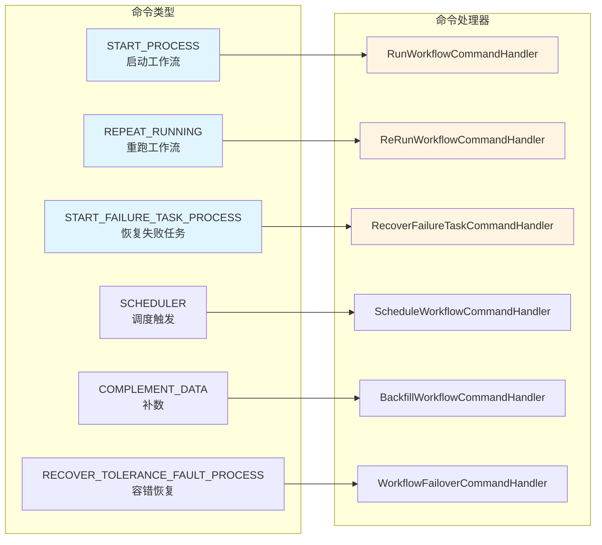

### 7.4 Handler继承关系

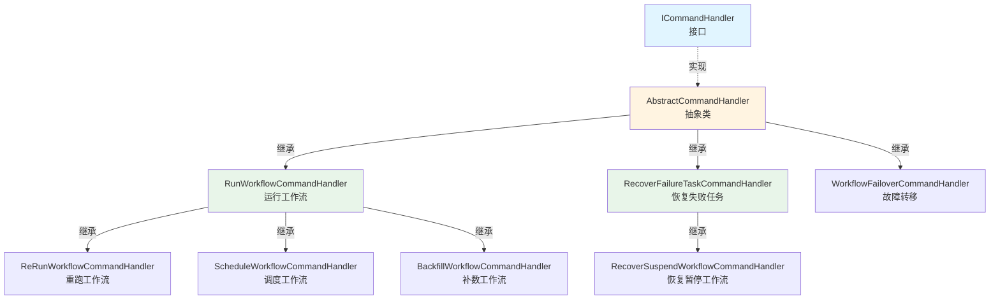

**继承关系说明**：
- `RunWorkflowCommandHandler`：处理新工作流的启动，是其他启动类Handler的基类
- `ReRunWorkflowCommandHandler`：继承自`RunWorkflowCommandHandler`，重跑已存在的工作流
- `ScheduleWorkflowCommandHandler`：继承自`RunWorkflowCommandHandler`，处理调度触发
- `BackfillWorkflowCommandHandler`：继承自`RunWorkflowCommandHandler`，处理补数场景
- `RecoverFailureTaskCommandHandler`：处理失败任务的恢复
- `RecoverSuspendWorkflowCommandHandler`：继承自`RecoverFailureTaskCommandHandler`，处理暂停恢复

## 8. 各个 ICommandHandler 详细说明

### 8.1 RunWorkflowCommandHandler（启动工作流处理器）

**命令类型**：`START_PROCESS`

**功能**：处理新工作流的启动命令，创建新的工作流实例并开始执行。

**关键实现**：
- **assembleWorkflowInstance**：
    - 从命令中获取工作流实例ID
    - 设置工作流状态为`RUNNING_EXECUTION`
    - 设置Master地址
    - 合并命令参数和工作流全局参数（命令参数优先级更高）
    - 更新工作流实例到数据库

- **assembleWorkflowExecutionGraph**：
    - 创建新的`WorkflowExecutionGraph`
    - 从命令参数中解析启动节点列表（如果为空则从开始节点启动）
    - 使用`WorkflowGraphTopologyLogicalVisitor`遍历工作流图
    - 为每个任务节点创建`TaskExecutionRunnable`
    - 构建任务之间的依赖关系

**使用场景**：
- 用户手动触发工作流执行
- API调用启动工作流
- 补数场景（通过`BackfillWorkflowCommandHandler`复用）

### 8.2 ReRunWorkflowCommandHandler（重跑工作流处理器）

**命令类型**：`REPEAT_RUNNING`

**功能**：重跑已存在的工作流实例，清除历史任务实例状态，从开始节点重新执行。

**关键实现**：
- **继承关系**：继承自`RunWorkflowCommandHandler`
- **assembleWorkflowInstance**：
    - 查询已存在的工作流实例
    - 清空变量池（`varPool`）
    - 更新状态为`RUNNING_EXECUTION`
    - 设置重启时间（`restartTime`）
    - 增加运行次数（`runTimes`）
    - 清空结束时间

- **assembleWorkflowExecutionGraph**：
    - 先调用`markAllTaskInstanceInvalid()`标记所有历史任务实例为无效
    - 然后调用父类方法创建新的执行图

**使用场景**：
- 用户手动重跑工作流
- 工作流执行失败后重跑

### 8.3 ScheduleWorkflowCommandHandler（调度工作流处理器）

**命令类型**：`SCHEDULER`

**功能**：处理调度器触发的工作流启动，逻辑与`START_PROCESS`相同。

**关键实现**：
- **继承关系**：继承自`RunWorkflowCommandHandler`
- **完全复用**：完全复用父类的所有逻辑，只改变命令类型标识

**使用场景**：
- 定时调度触发工作流执行
- Cron表达式触发

### 8.4 BackfillWorkflowCommandHandler（补数工作流处理器）

**命令类型**：`COMPLEMENT_DATA`

**功能**：处理补数场景，可以指定补数的日期范围和启动节点。

**关键实现**：
- **继承关系**：继承自`RunWorkflowCommandHandler`
- **完全复用**：完全复用父类的所有逻辑，只改变命令类型标识
- **特殊参数**：通过`commandParam`中的`complementScheduleDateList`指定补数日期列表

**使用场景**：
- 历史数据补数
- 指定日期范围的数据处理

### 8.5 RecoverFailureTaskCommandHandler（恢复失败任务处理器）

**命令类型**：`START_FAILURE_TASK_PROCESS`

**功能**：恢复工作流中的失败任务，从失败或暂停的任务节点重新开始执行。

**关键实现**：
- **assembleWorkflowInstance**：
    - 查询已存在的工作流实例
    - 清空变量池
    - 更新状态为`RUNNING_EXECUTION`
    - 更新命令类型

- **assembleWorkflowExecutionGraph**：
    - 调用`dealWithHistoryTaskInstances()`处理历史任务实例：
        - 遍历工作流图，识别需要恢复的任务（失败、暂停、被杀死）
        - 标记失败任务的后继任务为无效
        - 为失败任务创建新的任务实例
        - 为暂停任务恢复任务实例
    - 使用历史任务实例构建执行图
    - 保留成功任务的状态，只恢复失败/暂停的任务

**处理逻辑**：
- **失败任务**：标记为无效，创建新的任务实例重新执行
- **暂停任务**：恢复任务实例，继续执行
- **后继任务**：如果前置任务失败，后继任务也会被标记为无效

**使用场景**：
- 工作流执行过程中部分任务失败，需要从失败点恢复
- 工作流被暂停后恢复执行

### 8.6 RecoverSuspendWorkflowCommandHandler（恢复暂停工作流处理器）

**命令类型**：`RECOVER_SUSPENDED_PROCESS`

**功能**：恢复被暂停的工作流，从暂停的任务节点继续执行。

**关键实现**：
- **继承关系**：继承自`RecoverFailureTaskCommandHandler`
- **完全复用**：完全复用父类的恢复逻辑，只改变命令类型标识

**使用场景**：
- 工作流被手动暂停后恢复执行
- 系统维护后恢复工作流

### 8.7 WorkflowFailoverCommandHandler（工作流故障转移处理器）

**命令类型**：`RECOVER_TOLERANCE_FAULT_PROCESS`

**功能**：处理Master节点故障转移场景，恢复工作流到故障前的状态。

**关键实现**：
- **assembleWorkflowInstance**：
    - 从命令参数中解析`WorkflowFailoverCommandParam`
    - 恢复工作流实例到指定的执行状态
    - 不更新命令参数，保持原始参数

- **assembleWorkflowExecutionGraph**：
    - 从已存在的有效任务实例重建执行图
    - 使用`WorkflowGraphTopologyLogicalVisitor`遍历工作流图
    - 为每个任务节点创建`TaskExecutionRunnable`，关联历史任务实例
    - 保持任务实例的原始状态

**使用场景**：
- Master节点故障后，新的Master节点接管工作流
- 系统容错恢复

## 9. 生命周期事件处理机制

### 9.1 概述

生命周期事件处理机制是DolphinScheduler工作流执行的核心驱动机制，通过事件驱动的方式实现工作流状态的转换和任务调度。该机制包含三个核心组件：

1. **AbstractLifecycleEvent**：生命周期事件抽象类，封装了工作流执行过程中的各种事件
2. **ILifecycleEventHandler**：事件处理器接口，负责处理特定类型的事件
3. **IWorkflowStateAction**：状态动作接口，根据工作流当前状态和接收的事件执行相应的动作

这三个组件协同工作，实现了基于状态机的工作流执行控制。

### 9.2 命令引擎时序与流程

本节详细描述从CommandEngine开始，经过命令处理、工作流创建、事件发布，到最终事件处理的完整流程。这是整个命令引擎和工作流执行的核心流程。

#### 9.2.1 完整时序图

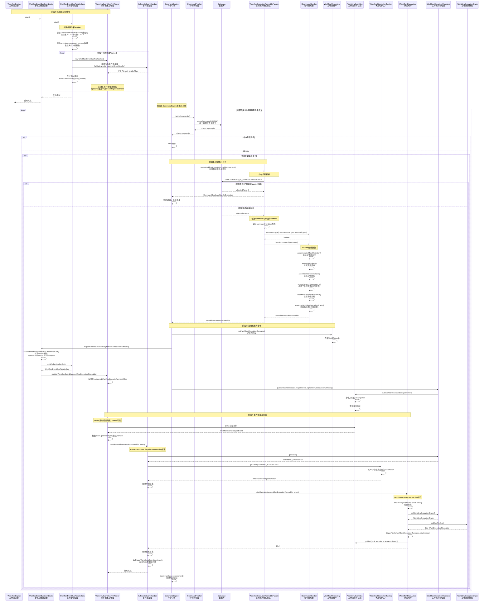

**时序图说明**：

整个流程分为五个阶段：

0. **阶段0：系统启动初始化**
   - WorkflowEngine启动WorkflowEventBusCoordinator
   - WorkflowEventBusCoordinator启动WorkflowEventBusFireWorkers
   - 创建ScheduledExecutorService线程池（线程数 = CPU核心数 * 2 + 1）
   - 为每个线程创建WorkflowEventBusFireWorker实例
   - 注册所有事件处理器（ILifecycleEventHandler）到每个Worker
   - 安排定时任务，每100ms触发一次事件处理
   - 这个阶段在CommandEngine开始处理命令之前完成

1. **阶段1：CommandEngine主循环**
   - CommandEngine开始主循环
   - 从数据库获取命令列表

2. **阶段2：创建执行任务**
   - CommandEngine从数据库获取命令
   - 使用分布式锁（数据库删除）确保命令只被处理一次
   - WorkflowExecutionRunnableFactory根据commandType选择对应的Handler
   - Handler组装各种数据（工作流定义、项目、图、实例、执行图等）
   - 创建IWorkflowExecutionRunnable对象

3. **阶段3：注册和发布事件**
   - 将WorkflowExecutionRunnable注册到WorkflowRepository
   - WorkflowEventBusCoordinator计算Worker槽位并注册到对应的Worker
   - 发布WorkflowStartLifecycleEvent到WorkflowEventBus

4. **阶段4：事件触发和处理**
   - WorkflowEventBusFireWorker定期（100ms）触发事件
   - 根据事件类型选择对应的ILifecycleEventHandler
   - Handler根据工作流状态从WorkflowStateActionFactory获取对应的StateAction
   - StateAction执行具体的业务逻辑（如触发任务、状态转换等）

#### 9.2.2 完整流程图

```mermaid
flowchart TD
    Start([系统启动]) --> InitCoordinator[WorkflowEventBusCoordinator启动]
    
    InitCoordinator --> CreateThreadPool[创建ScheduledExecutorService线程池<br/>线程数 = CPU核心数 * 2 + 1]
    CreateThreadPool --> CreateWorkers[创建WorkflowEventBusFireWorker数组<br/>数组大小 = 线程数]
    
    CreateWorkers --> LoopWorkers{遍历每个线程}
    LoopWorkers --> CreateWorker[创建WorkflowEventBusFireWorker实例]
    CreateWorker --> RegisterHandlers[注册所有事件处理器<br/>ILifecycleEventHandler]
    RegisterHandlers --> ScheduleTask[安排定时任务<br/>每100ms触发一次]
    ScheduleTask --> MoreWorkers{还有线程?}
    MoreWorkers -->|是| LoopWorkers
    MoreWorkers -->|否| CoordinatorReady[WorkflowEventBusCoordinator就绪]
    
    CoordinatorReady --> CEStart([CommandEngine主循环开始])
    CEStart --> CheckLoad{检查系统负载}
    CheckLoad -->|过载| Sleep1[等待1秒]
    Sleep1 --> CheckLoad
    CheckLoad -->|正常| FetchCommands[获取命令列表]
    
    FetchCommands --> HasCommands{是否有命令?}
    HasCommands -->|否| Sleep2[等待1秒]
    Sleep2 --> CheckLoad
    HasCommands -->|是| ParStart[并发处理每个命令]
    
    ParStart --> AsyncCreate[异步创建执行任务<br/>bootstrapCommand]
    
    AsyncCreate --> DeleteCommand[删除命令记录<br/>分布式锁机制]
    DeleteCommand --> DeleteResult{删除结果}
    DeleteResult -->|失败| DuplicateException[命令已被其他Master处理<br/>忽略异常]
    DuplicateException --> End1([结束])
    
    DeleteResult -->|成功| FindHandler[根据commandType查找ICommandHandler]
    FindHandler --> HandlerExists{ICommandHandler是否存在?}
    HandlerExists -->|否| Error1[抛出IllegalArgumentException]
    Error1 --> End2([结束])
    
    HandlerExists -->|是| CommandType{命令类型<br/>commandType}
    
    CommandType -->|START_PROCESS| RWH[RunWorkflowCommandHandler<br/>启动工作流处理器]
    CommandType -->|REPEAT_RUNNING| RRWH[ReRunWorkflowCommandHandler<br/>重跑工作流处理器]
    CommandType -->|SCHEDULER| SWH[ScheduleWorkflowCommandHandler<br/>调度工作流处理器]
    CommandType -->|COMPLEMENT_DATA| BWH[BackfillWorkflowCommandHandler<br/>补数工作流处理器]
    CommandType -->|START_FAILURE_TASK_PROCESS| RFH[RecoverFailureTaskCommandHandler<br/>恢复失败任务处理器]
    CommandType -->|RECOVER_SUSPENDED_PROCESS| RSH[RecoverSuspendWorkflowCommandHandler<br/>恢复暂停工作流处理器]
    CommandType -->|RECOVER_TOLERANCE_FAULT_PROCESS| WFCH[WorkflowFailoverCommandHandler<br/>故障转移处理器]
    
    RWH --> AssembleData[Handler组装数据]
    RRWH --> AssembleData
    SWH --> AssembleData
    BWH --> AssembleData
    RFH --> AssembleData
    RSH --> AssembleData
    WFCH --> AssembleData
    
    subgraph AssembleData[数据组装流程详情]
        direction LR
        
        subgraph MainFlow[主流程]
            direction TB
            StartAssemble[创建WorkflowExecuteContextBuilder<br/>WorkflowExecuteContext.builder<br/>.withCommand]
            A1[assembleWorkflowDefinition<br/>组装工作流定义]
            A2[assembleProject<br/>组装项目信息]
            A3[assembleWorkflowGraph<br/>组装工作流图]
            A4[assembleWorkflowInstance<br/>组装工作流实例<br/>子类实现]
            A5[assembleWorkflowInstanceLifecycleListeners<br/>组装生命周期监听器]
            A6[assembleWorkflowEventBus<br/>组装事件总线]
            A7[assembleWorkflowExecutionGraph<br/>组装执行图<br/>子类实现]
            A8[创建WorkflowExecutionRunnable]
            
            StartAssemble --> A1
            A1 --> A2
            A2 --> A3
            A3 --> A4
            A4 --> A5
            A5 --> A6
            A6 --> A7
            A7 --> A8
        end
        
        subgraph Details[组装详情]
            direction TB
            
            A1Detail1[从command获取<br/>workflowDefinitionCode<br/>workflowDefinitionVersion]
            A1Detail2[workflowDefinitionLogDao<br/>.queryByDefinitionCodeAndVersion<br/>查询WorkflowDefinition]
            A1Detail3[workflowExecuteContextBuilder<br/>.setWorkflowDefinition<br/>workflowDefinition]
            A1Detail1 --> A1Detail2 --> A1Detail3
            
            A2Detail1[从workflowDefinition获取<br/>projectCode]
            A2Detail2[projectDao.queryByCode<br/>查询Project]
            A2Detail3[workflowExecuteContextBuilder<br/>.setProject<br/>project]
            A2Detail1 --> A2Detail2 --> A2Detail3
            
            A3Detail1[workflowGraphFactory<br/>.createWorkflowGraph<br/>workflowDefinition]
            A3Detail2[workflowExecuteContextBuilder<br/>.setWorkflowGraph<br/>workflowGraph]
            A3Detail1 --> A3Detail2
            
            A4Detail1[子类具体实现<br/>创建或更新WorkflowInstance<br/>设置状态-Master地址-参数等]
            A4Detail2[workflowInstanceDao<br/>.upsertWorkflowInstance]
            A4Detail3[workflowExecuteContextBuilder<br/>.setWorkflowInstance<br/>workflowInstance]
            A4Detail1 --> A4Detail2 --> A4Detail3
            
            A5Detail1[workflowExecuteContextBuilder<br/>.setWorkflowInstanceLifecycleListeners<br/>workflowLifecycleListeners]
            
            A6Detail1[workflowExecuteContextBuilder<br/>.setWorkflowEventBus<br/>new WorkflowEventBus]
            
            A7Detail1[子类具体实现<br/>创建WorkflowExecutionGraph]
            A7Detail2[遍历工作流图<br/>创建TaskExecutionRunnable<br/>构建任务依赖关系]
            A7Detail3[workflowExecuteContextBuilder<br/>.setWorkflowExecutionGraph<br/>workflowExecutionGraph]
            A7Detail1 --> A7Detail2 --> A7Detail3
            
            A8Detail1[WorkflowExecutionRunnableBuilder<br/>.builder<br/>.workflowExecuteContextBuilder<br/>.applicationContext<br/>.build]
            A8Detail2[new WorkflowExecutionRunnable<br/>workflowExecutionRunnableBuilder]
            A8Detail1 --> A8Detail2
        end
        
        A1 -.详情.-> A1Detail1
        A2 -.详情.-> A2Detail1
        A3 -.详情.-> A3Detail1
        A4 -.详情.-> A4Detail1
        A5 -.详情.-> A5Detail1
        A6 -.详情.-> A6Detail1
        A7 -.详情.-> A7Detail1
        A8 -.详情.-> A8Detail1
    end
    
    AssembleData --> StartAssemble
    A8 --> RegisterRepository[注册到WorkflowRepository]
    
    RegisterRepository --> CalculateSlot[计算Worker槽位<br/>workflowInstanceId % workerSize]
    CalculateSlot --> GetWorker[获取对应的WorkflowEventBusFireWorker]
    GetWorker --> RegisterWorker[注册到Worker<br/>registeredWorkflowExecuteRunnableMap]
    
    RegisterWorker --> PublishEvent[发布WorkflowStartLifecycleEvent]
    PublishEvent --> EventEnqueue[事件入队到DelayQueue]
    
    EventEnqueue --> WorkerTrigger[Worker定时任务触发<br/>100ms间隔<br/>已在启动时安排]
    
    WorkerTrigger --> PollEvent[从DelayQueue取出事件]
    PollEvent --> EventEmpty{事件队列是否为空?}
    EventEmpty -->|是| WorkerTrigger
    EventEmpty -->|否| FindEventHandler[根据AbstractLifecycleEvent的eventType查找ILifecycleEventHandler]
    
    FindEventHandler --> EventHandlerExists{ILifecycleEventHandler是否存在?}
    EventHandlerExists -->|否| Error2[抛出RuntimeException]
    Error2 --> End3([结束])
    
    EventHandlerExists -->|是| EventType{事件类型<br/>eventType}
    
    EventType -->|START| WSLEH[WorkflowStartLifecycleEventHandler<br/>启动事件处理器]
    EventType -->|TOPOLOGY_LOGICAL_TRANSACTION| TLEH[WorkflowTopologyLogicalTransitionWithTaskFinishLifecycleEventHandler<br/>拓扑逻辑转换事件处理器]
    EventType -->|PAUSE| PLEH[WorkflowPauseLifecycleEventHandler<br/>暂停事件处理器]
    EventType -->|PAUSED| PLDEH[WorkflowPausedLifecycleEventHandler<br/>已暂停事件处理器]
    EventType -->|STOP| SLEH[WorkflowStopLifecycleEventHandler<br/>停止事件处理器]
    EventType -->|STOPPED| SLDEH[WorkflowStoppedLifecycleEventHandler<br/>已停止事件处理器]
    EventType -->|SUCCEED| SEH[WorkflowSucceedLifecycleEventHandler<br/>成功事件处理器]
    EventType -->|FAILED| FEH[WorkflowFailedLifecycleEventHandler<br/>失败事件处理器]
    EventType -->|FINALIZE| FEH2[WorkflowFinalizeLifecycleEventHandler<br/>完成事件处理器]
    
    WSLEH --> GetState[获取工作流当前状态]
    TLEH --> GetState
    PLEH --> GetState
    PLDEH --> GetState
    SLEH --> GetState
    SLDEH --> GetState
    SEH --> GetState
    FEH --> GetState
    FEH2 --> GetState
    GetState --> GetStateAction[从WorkflowStateActionFactory获取StateAction]
    GetStateAction --> LogBegin[记录开始日志]
    LogBegin --> CallStateAction[调用StateAction的相应方法]
    
    CallStateAction --> ActionType{事件类型}
    ActionType -->|START| StartAction[startEventAction<br/>触发开始节点]
    ActionType -->|TOPOLOGY_TRANSITION| TopologyAction[topologyLogicalTransitionEventAction<br/>触发后继任务]
    ActionType -->|PAUSE| PauseAction[pauseEventAction<br/>暂停任务]
    ActionType -->|STOP| StopAction[stopEventAction<br/>停止任务]
    ActionType -->|SUCCEED| SucceedAction[succeedEventAction<br/>完成工作流]
    ActionType -->|FAILED| FailedAction[failedEventAction<br/>完成工作流]
    
    StartAction --> TriggerTasks[triggerTasks触发任务]
    TopologyAction --> TriggerSuccessors[触发后继任务]
    PauseAction --> PauseTasks[暂停活跃任务]
    StopAction --> KillTasks[杀死活跃任务]
    SucceedAction --> WorkflowFinish1[workflowFinish完成工作流]
    FailedAction --> WorkflowFinish2[workflowFinish完成工作流]
    
    TriggerTasks --> PublishTaskEvent[发布TaskStartLifecycleEvent]
    TriggerSuccessors --> PublishTaskEvent
    PauseTasks --> UpdateState[更新工作流状态]
    KillTasks --> UpdateState
    WorkflowFinish1 --> UpdateState
    WorkflowFinish2 --> UpdateState
    
    UpdateState --> PublishTaskEvent
    PublishTaskEvent --> LogEnd[记录结束日志]
    LogEnd --> TriggerListener[触发生命周期监听器]
    TriggerListener --> Success[处理成功]
    
    Success --> MoreEvents{还有事件?}
    MoreEvents -->|是| PollEvent
    MoreEvents -->|否| End4([处理完成])
    
    style Start fill:#e1f5ff
    style DeleteCommand fill:#fff4e1
    style CommandType fill:#e3f2fd
    style RWH fill:#fff3e0
    style RRWH fill:#fff3e0
    style SWH fill:#fff3e0
    style BWH fill:#fff3e0
    style RFH fill:#fff3e0
    style RSH fill:#fff3e0
    style WFCH fill:#fff3e0
    style AssembleData fill:#e8f5e9
    style StartAssemble fill:#e1f5ff
    style A1 fill:#fff3e0
    style A1Detail1 fill:#fff9c4
    style A1Detail2 fill:#fff9c4
    style A1Detail3 fill:#fff9c4
    style A2 fill:#fff3e0
    style A2Detail1 fill:#fff9c4
    style A2Detail2 fill:#fff9c4
    style A2Detail3 fill:#fff9c4
    style A3 fill:#fff3e0
    style A3Detail1 fill:#fff9c4
    style A3Detail2 fill:#fff9c4
    style A4 fill:#fff3e0
    style A4Detail1 fill:#fff9c4
    style A4Detail2 fill:#fff9c4
    style A4Detail3 fill:#fff9c4
    style A5 fill:#fff3e0
    style A5Detail1 fill:#fff9c4
    style A6 fill:#fff3e0
    style A6Detail1 fill:#fff9c4
    style A7 fill:#fff3e0
    style A7Detail1 fill:#fff9c4
    style A7Detail2 fill:#fff9c4
    style A7Detail3 fill:#fff9c4
    style A8 fill:#fff3e0
    style A8Detail1 fill:#fff9c4
    style A8Detail2 fill:#fff9c4
    style RegisterWorker fill:#f3e5f5
    style WorkerTrigger fill:#ffebee
    style EventType fill:#fce4ec
    style WSLEH fill:#f1f8e9
    style TLEH fill:#f1f8e9
    style PLEH fill:#f1f8e9
    style PLDEH fill:#f1f8e9
    style SLEH fill:#f1f8e9
    style SLDEH fill:#f1f8e9
    style SEH fill:#f1f8e9
    style FEH fill:#f1f8e9
    style FEH2 fill:#f1f8e9
    style CallStateAction fill:#fff9c4
```

**流程图说明**：

0. **系统启动初始化阶段**：
   - WorkflowEventBusCoordinator启动
   - 创建ScheduledExecutorService线程池（线程数 = CPU核心数 * 2 + 1）
   - 为每个线程创建WorkflowEventBusFireWorker实例
   - 注册所有事件处理器（ILifecycleEventHandler）到每个Worker的eventHandlerMap
   - 安排定时任务，每100ms触发一次fireAllRegisteredEvent()方法
   - 这个阶段在CommandEngine开始处理命令之前完成，确保事件处理机制已就绪

1. **命令获取阶段**：
   - 检查系统负载，过载时等待
   - 从数据库获取命令列表
   - 使用ID槽位算法实现分布式负载均衡

2. **命令处理阶段**：
   - 使用数据库删除操作实现分布式锁
   - 根据commandType选择对应的ICommandHandler：
     - `START_PROCESS` → `RunWorkflowCommandHandler`（启动工作流）
     - `REPEAT_RUNNING` → `ReRunWorkflowCommandHandler`（重跑工作流）
     - `SCHEDULER` → `ScheduleWorkflowCommandHandler`（调度触发）
     - `COMPLEMENT_DATA` → `BackfillWorkflowCommandHandler`（补数）
     - `START_FAILURE_TASK_PROCESS` → `RecoverFailureTaskCommandHandler`（恢复失败任务）
     - `RECOVER_SUSPENDED_PROCESS` → `RecoverSuspendWorkflowCommandHandler`（恢复暂停）
     - `RECOVER_TOLERANCE_FAULT_PROCESS` → `WorkflowFailoverCommandHandler`（故障转移）
   - Handler按照固定流程组装数据，详细步骤包括：
     - **创建WorkflowExecuteContextBuilder**：`WorkflowExecuteContext.builder().withCommand(command)`
     - **组装工作流定义**：
       - 从command获取`workflowDefinitionCode`和`workflowDefinitionVersion`
       - 调用`workflowDefinitionLogDao.queryByDefinitionCodeAndVersion()`查询WorkflowDefinition
       - 调用`workflowExecuteContextBuilder.setWorkflowDefinition(workflowDefinition)`
     - **组装项目信息**：
       - 从workflowDefinition获取`projectCode`
       - 调用`projectDao.queryByCode()`查询Project
       - 调用`workflowExecuteContextBuilder.setProject(project)`
     - **组装工作流图**：
       - 调用`workflowGraphFactory.createWorkflowGraph(workflowDefinition)`创建IWorkflowGraph
       - 调用`workflowExecuteContextBuilder.setWorkflowGraph(workflowGraph)`
     - **组装工作流实例**（子类实现）：
       - 子类根据具体场景创建或更新WorkflowInstance
       - 设置状态、Master地址、命令参数、全局参数等
       - 调用`workflowInstanceDao.upsertWorkflowInstance()`保存
       - 调用`workflowExecuteContextBuilder.setWorkflowInstance(workflowInstance)`
     - **组装生命周期监听器**：
       - 调用`workflowExecuteContextBuilder.setWorkflowInstanceLifecycleListeners(workflowLifecycleListeners)`
     - **组装事件总线**：
       - 调用`workflowExecuteContextBuilder.setWorkflowEventBus(new WorkflowEventBus())`
     - **组装执行图**（子类实现）：
       - 子类创建`WorkflowExecutionGraph`
       - 遍历工作流图，为每个任务创建`TaskExecutionRunnable`
       - 构建任务之间的依赖关系（边）
       - 调用`workflowExecuteContextBuilder.setWorkflowExecutionGraph(workflowExecutionGraph)`
     - **创建WorkflowExecutionRunnable**：
       - 使用`WorkflowExecutionRunnableBuilder.builder().workflowExecuteContextBuilder(...).applicationContext(...).build()`构建
       - 创建`new WorkflowExecutionRunnable(workflowExecutionRunnableBuilder)`

3. **工作流注册阶段**：
   - 注册到WorkflowRepository
   - 计算Worker槽位并注册到对应的Worker
   - 发布启动事件

4. **事件处理阶段**：
   - Worker定时任务触发事件处理（已在启动时安排，每100ms执行一次）
   - 根据AbstractLifecycleEvent的eventType选择对应的ILifecycleEventHandler：
     - `START` → `WorkflowStartLifecycleEventHandler`（启动事件）
     - `TOPOLOGY_LOGICAL_TRANSACTION_WITH_TASK_FINISH` → `WorkflowTopologyLogicalTransitionWithTaskFinishLifecycleEventHandler`（拓扑逻辑转换）
     - `PAUSE` → `WorkflowPauseLifecycleEventHandler`（暂停事件）
     - `PAUSED` → `WorkflowPausedLifecycleEventHandler`（已暂停事件）
     - `STOP` → `WorkflowStopLifecycleEventHandler`（停止事件）
     - `STOPPED` → `WorkflowStoppedLifecycleEventHandler`（已停止事件）
     - `SUCCEED` → `WorkflowSucceedLifecycleEventHandler`（成功事件）
     - `FAILED` → `WorkflowFailedLifecycleEventHandler`（失败事件）
     - `FINALIZE` → `WorkflowFinalizeLifecycleEventHandler`（完成事件）
   - Handler根据工作流状态从WorkflowStateActionFactory获取对应的StateAction
   - StateAction执行具体的业务逻辑（触发任务、状态转换等）

#### 9.2.3 关键组件交互图

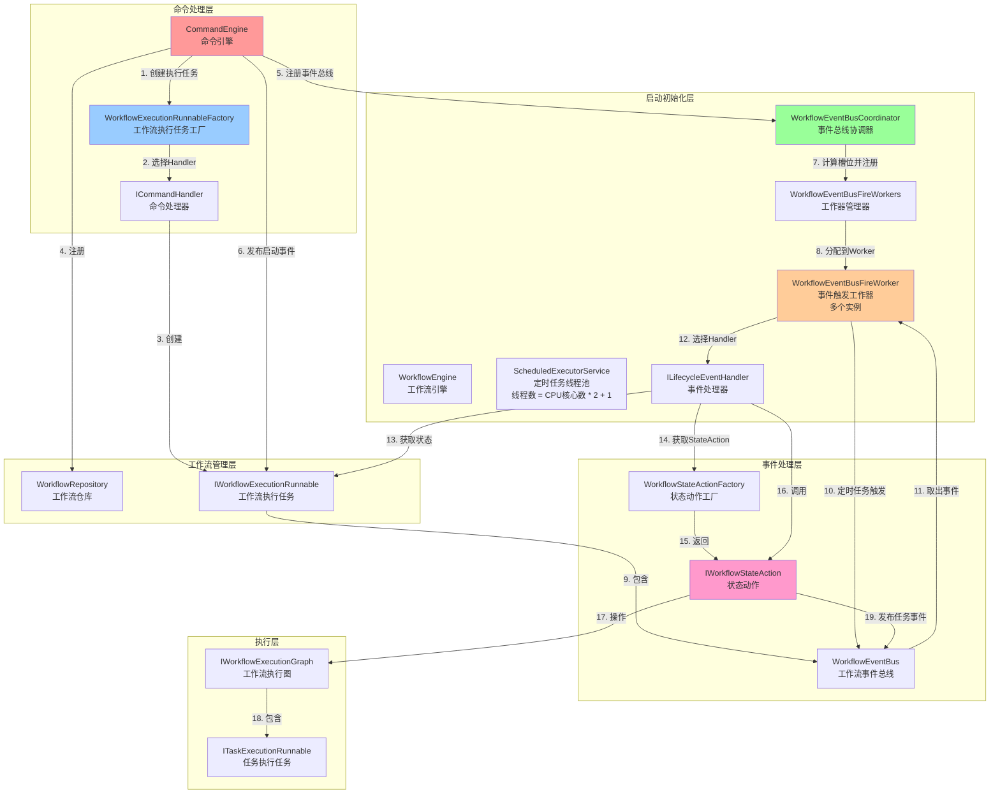

**组件交互说明**：

0. **启动初始化层**：
   - WorkflowEngine启动WorkflowEventBusCoordinator
   - WorkflowEventBusCoordinator启动WorkflowEventBusFireWorkers
   - 创建ScheduledExecutorService线程池（线程数 = CPU核心数 * 2 + 1）
   - 为每个线程创建WorkflowEventBusFireWorker实例
   - 注册所有事件处理器（ILifecycleEventHandler）到每个Worker的eventHandlerMap
   - 安排定时任务，每100ms触发一次fireAllRegisteredEvent()方法
   - 这个阶段在CommandEngine开始处理命令之前完成

1. **命令处理层**：负责命令的获取和处理，创建执行任务
2. **工作流管理层**：管理工作流执行任务的存储和生命周期
3. **事件协调层**：协调事件总线的注册和Worker的分配
4. **事件处理层**：处理工作流生命周期事件，执行状态转换
5. **执行层**：实际执行工作流和任务

#### 9.2.4 关键步骤详解

**步骤0：WorkflowEventBusCoordinator启动初始化**

```java
// WorkflowEngine.start()
workflowEventBusCoordinator.start();

// WorkflowEventBusCoordinator.start()
workflowEventBusFireWorkers.start();

// WorkflowEventBusFireWorkers.start()
final int workflowEventBusFireThreadCount = masterConfig.getWorkflowEventBusFireThreadCount();
// 默认值：Runtime.getRuntime().availableProcessors() * 2 + 1

workflowEventBusFireThreadPool = Executors.newScheduledThreadPool(
    workflowEventBusFireThreadCount,
    ThreadUtils.newDaemonThreadFactory("ds-workflow-eventbus-worker-%d"));

workflowEventBusFireWorkers = new WorkflowEventBusFireWorker[workflowEventBusFireThreadCount];

for (int i = 0; i < workflowEventBusFireThreadCount; i++) {
    final WorkflowEventBusFireWorker worker = new WorkflowEventBusFireWorker();
    eventHandlers.forEach(worker::registerEventHandler);  // 注册所有事件处理器
    workflowEventBusFireWorkers[i] = worker;
    
    workflowEventBusFireThreadPool.scheduleWithFixedDelay(
        worker::fireAllRegisteredEvent,
        DEFAULT_FIRE_INTERVAL,  // 100ms
        DEFAULT_FIRE_INTERVAL,  // 100ms
        TimeUnit.MILLISECONDS);
}
```

- **线程池创建**：创建ScheduledExecutorService，线程数 = CPU核心数 * 2 + 1
- **Worker创建**：为每个线程创建一个WorkflowEventBusFireWorker实例
- **事件处理器注册**：将所有ILifecycleEventHandler注册到每个Worker的eventHandlerMap中
- **定时任务安排**：使用scheduleWithFixedDelay安排定时任务，每100ms执行一次
- **守护线程**：使用守护线程，确保JVM关闭时能正常退出

**步骤1：命令获取和分布式锁**

```java
// CommandEngine.run()
List<Command> commands = commandFetcher.fetchCommands();

// WorkflowExecutionRunnableFactory.createWorkflowExecuteRunnable()
@Transactional
public IWorkflowExecutionRunnable createWorkflowExecuteRunnable(Command command) {
    deleteCommandOrThrow(command);  // 分布式锁：删除命令
    return doCreateWorkflowExecutionRunnable(command);
}
```

- **分布式锁机制**：使用数据库DELETE操作作为分布式锁
- **幂等性保证**：即使多个Master同时获取到同一命令，只有一个能成功删除并处理
- **事务保证**：在`@Transactional`方法中执行，保证原子性

**步骤2：Handler选择和数据组装**

```java
// WorkflowExecutionRunnableFactory.doCreateWorkflowExecutionRunnable()
ICommandHandler commandHandler = commandHandlers.stream()
    .filter(handler -> handler.commandType() == command.getCommandType())
    .findFirst()
    .orElseThrow(() -> new IllegalArgumentException(...));

return commandHandler.handleCommand(command);
```

- **策略模式**：根据commandType选择对应的Handler
- **模板方法模式**：AbstractCommandHandler定义固定流程，子类实现特定步骤
- **数据组装**：按照固定顺序组装工作流执行所需的所有数据

**步骤3：Worker槽位计算和注册**

**注意**：Worker已经在启动时创建并开始运行定时任务，这里只是将工作流注册到对应的Worker中。

```java
// WorkflowEventBusCoordinator.registerWorkflowEventBus()
int workerSlot = workflowInstanceId % workflowEventBusFireWorkers.getWorkerSize();
WorkflowEventBusFireWorker worker = workflowEventBusFireWorkers.getWorker(workerSlot);
worker.registerWorkflowEventBus(workflowExecutionRunnable);
```

- **负载均衡**：按工作流实例ID取模分配到不同的Worker
- **顺序保证**：同一工作流的所有事件在同一Worker中顺序处理
- **并发处理**：不同工作流的事件可以并发处理

**步骤4：事件发布和存储**

**注意**：事件发布后，会被已启动的Worker定时任务自动处理。

```java
// CommandEngine.bootstrapWorkflowExecutionRunnable()
workflowExecutionRunnable.getWorkflowEventBus()
    .publish(WorkflowStartLifecycleEvent.of(workflowExecutionRunnable));
```

- **延迟队列**：事件存储在DelayQueue中，支持延迟触发
- **事件统计**：记录事件数量、成功数、失败数等指标
- **异步处理**：事件发布后立即返回，不阻塞命令处理

**步骤5：事件触发和处理**

```java
// WorkflowEventBusFireWorkers.start() - 启动时安排定时任务
workflowEventBusFireThreadPool.scheduleWithFixedDelay(
    worker::fireAllRegisteredEvent,
    DEFAULT_FIRE_INTERVAL,  // 100ms
    DEFAULT_FIRE_INTERVAL,  // 100ms
    TimeUnit.MILLISECONDS);

// WorkflowEventBusFireWorker.fireAllRegisteredEvent() - 定时任务执行
for (IWorkflowExecutionRunnable runnable : registeredWorkflowExecuteRunnableMap.values()) {
    if (!runnable.getWorkflowEventBus().isEmpty()) {
        doFireSingleWorkflowEventBus(runnable);
    }
}
```

- **定时任务**：Worker线程在启动时已安排定时任务，每100ms自动触发一次事件处理
- **事件分发**：根据事件类型从eventHandlerMap中查找对应的Handler
- **状态匹配**：Handler根据工作流状态从工厂获取对应的StateAction

**步骤6：状态动作执行**

```java
// AbstractWorkflowLifecycleEventHandler.handle()
IWorkflowStateAction action = workflowStateActionFactory.getAction(workflowExecutionRunnable.getState());
handle(action, workflowExecutionRunnable, event);
```

- **状态机模式**：根据工作流状态和事件类型执行相应的动作
- **状态验证**：StateAction执行前验证工作流状态是否匹配
- **业务逻辑**：执行具体的业务逻辑（触发任务、状态转换等）

#### 9.2.5 流程特点总结

0. **启动初始化**：
   - WorkflowEventBusCoordinator在系统启动时初始化
   - 创建线程池和Worker，注册事件处理器，安排定时任务
   - 确保在CommandEngine开始处理命令前，事件处理机制已就绪

1. **异步并发**：
   - 命令处理使用线程池并发执行
   - 事件处理与命令处理异步进行
   - 不同工作流的事件可以并发处理

2. **分布式协调**：
   - 使用数据库删除实现分布式锁
   - 使用ID槽位算法实现负载均衡
   - 支持多Master节点协同工作

3. **事件驱动**：
   - 通过事件总线实现组件解耦
   - 支持延迟事件和优先级处理
   - 事件处理与命令处理分离

4. **状态机控制**：
   - 基于状态机模式实现工作流状态转换
   - 状态和动作一一对应
   - 状态转换逻辑清晰可控

5. **可扩展性**：
   - 新增命令类型只需实现Handler
   - 新增事件类型只需实现EventHandler
   - 新增状态只需实现StateAction

### 9.3 AbstractLifecycleEvent 事件体系

#### 9.3.1 事件继承体系

```mermaid
classDiagram
    class AbstractDelayEvent {
        <<abstract>>
        +long delayTime
        +long createTimeInNano
        +long expiredTimeInNano
        +getDelay(TimeUnit) long
        +compareTo(Delayed) int
    }
    
    class AbstractLifecycleEvent {
        <<abstract>>
        +getEventType() ILifecycleEventType*
    }
    
    class AbstractWorkflowLifecycleLifecycleEvent {
        <<abstract>>
        +getWorkflowExecutionRunnable() IWorkflowExecutionRunnable*
    }
    
    class AbstractTaskLifecycleEvent {
        <<abstract>>
        +getTaskExecutionRunnable() ITaskExecutionRunnable*
    }
    
    class WorkflowStartLifecycleEvent {
        -IWorkflowExecutionRunnable workflowExecutionRunnable
        +of(IWorkflowExecutionRunnable) WorkflowStartLifecycleEvent
    }
    
    class WorkflowSucceedLifecycleEvent {
        +of(IWorkflowExecutionRunnable) WorkflowSucceedLifecycleEvent
    }
    
    class WorkflowFailedLifecycleEvent {
        +of(IWorkflowExecutionRunnable) WorkflowFailedLifecycleEvent
    }
    
    class WorkflowPauseLifecycleEvent {
        +of(IWorkflowExecutionRunnable) WorkflowPauseLifecycleEvent
    }
    
    class WorkflowStopLifecycleEvent {
        +of(IWorkflowExecutionRunnable) WorkflowStopLifecycleEvent
    }
    
    class WorkflowTopologyLogicalTransitionWithTaskFinishLifecycleEvent {
        +of(IWorkflowExecutionRunnable, ITaskExecutionRunnable) WorkflowTopologyLogicalTransitionWithTaskFinishLifecycleEvent
    }
    
    AbstractDelayEvent <|-- AbstractLifecycleEvent
    AbstractLifecycleEvent <|-- AbstractWorkflowLifecycleLifecycleEvent
    AbstractLifecycleEvent <|-- AbstractTaskLifecycleEvent
    AbstractWorkflowLifecycleLifecycleEvent <|-- WorkflowStartLifecycleEvent
    AbstractWorkflowLifecycleLifecycleEvent <|-- WorkflowSucceedLifecycleEvent
    AbstractWorkflowLifecycleLifecycleEvent <|-- WorkflowFailedLifecycleEvent
    AbstractWorkflowLifecycleLifecycleEvent <|-- WorkflowPauseLifecycleEvent
    AbstractWorkflowLifecycleLifecycleEvent <|-- WorkflowStopLifecycleEvent
    AbstractWorkflowLifecycleLifecycleEvent <|-- WorkflowTopologyLogicalTransitionWithTaskFinishLifecycleEvent
```

**事件继承体系说明**：

1. **AbstractDelayEvent（延迟事件基类）**：
    - 实现了`Delayed`接口，支持延迟触发
    - 使用`DelayQueue`实现事件的有序处理
    - 包含延迟时间、创建时间、过期时间等属性
    - 提供`getDelay()`方法计算剩余延迟时间
    - 提供`compareTo()`方法用于事件排序

2. **AbstractLifecycleEvent（生命周期事件基类）**：
    - 继承自`AbstractDelayEvent`
    - 定义了抽象方法`getEventType()`，返回事件类型
    - 是所有生命周期事件的基类

3. **AbstractWorkflowLifecycleLifecycleEvent（工作流生命周期事件基类）**：
    - 继承自`AbstractLifecycleEvent`
    - 定义了抽象方法`getWorkflowExecutionRunnable()`，返回关联的工作流执行任务
    - 是所有工作流生命周期事件的基类

4. **具体事件类**：
    - `WorkflowStartLifecycleEvent`：工作流启动事件
    - `WorkflowSucceedLifecycleEvent`：工作流成功事件
    - `WorkflowFailedLifecycleEvent`：工作流失败事件
    - `WorkflowPauseLifecycleEvent`：工作流暂停事件
    - `WorkflowStopLifecycleEvent`：工作流停止事件
    - `WorkflowTopologyLogicalTransitionWithTaskFinishLifecycleEvent`：任务完成后的拓扑逻辑转换事件

#### 9.3.2 事件类型枚举

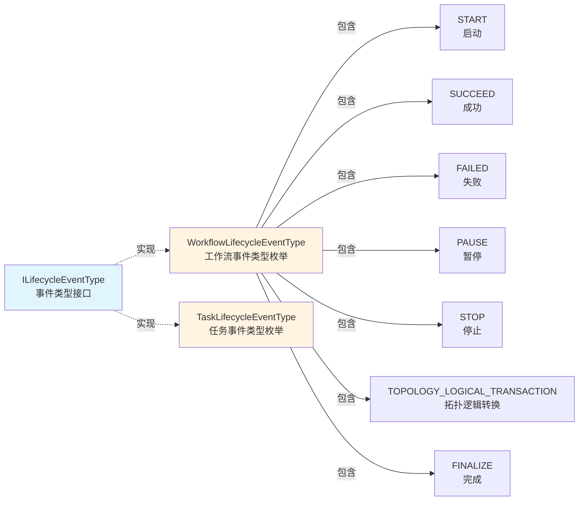

**工作流生命周期事件类型**：
- `START`：工作流启动
- `TOPOLOGY_LOGICAL_TRANSACTION_WITH_TASK_FINISH`：任务完成后的拓扑逻辑转换
- `PAUSE`：工作流暂停
- `PAUSED`：工作流已暂停
- `STOP`：工作流停止
- `STOPPED`：工作流已停止
- `SUCCEED`：工作流成功
- `FAILED`：工作流失败
- `FINALIZE`：工作流完成（清理资源）

### 9.4 ILifecycleEventHandler 事件处理器体系

#### 9.4.1 处理器接口定义

```java
public interface ILifecycleEventHandler<T extends AbstractLifecycleEvent> {
    void handle(final IWorkflowExecutionRunnable workflowExecutionRunnable,
                final T event);
    ILifecycleEventType matchEventType();
}
```

**接口说明**：
- `handle()`：处理事件的核心方法，接收工作流执行任务和事件对象
- `matchEventType()`：返回该处理器匹配的事件类型，用于事件分发

#### 9.4.2 处理器继承体系

```mermaid
classDiagram
    class ILifecycleEventHandler {
        <<interface>>
        +handle(IWorkflowExecutionRunnable, T) void
        +matchEventType() ILifecycleEventType
    }
    
    class AbstractWorkflowLifecycleEventHandler {
        <<abstract>>
        #WorkflowStateActionFactory workflowStateActionFactory
        +handle(IWorkflowExecutionRunnable, T) void
        +handle(IWorkflowStateAction, IWorkflowExecutionRunnable, T)* void
        -doTriggerWorkflowLifecycleListener(IWorkflowExecutionRunnable, T) void
    }
    
    class WorkflowStartLifecycleEventHandler {
        +handle(IWorkflowStateAction, IWorkflowExecutionRunnable, WorkflowStartLifecycleEvent) void
        +matchEventType() ILifecycleEventType
    }
    
    class WorkflowSucceedLifecycleEventHandler {
        +handle(IWorkflowStateAction, IWorkflowExecutionRunnable, WorkflowSucceedLifecycleEvent) void
        +matchEventType() ILifecycleEventType
    }
    
    class WorkflowFailedLifecycleEventHandler {
        +handle(IWorkflowStateAction, IWorkflowExecutionRunnable, WorkflowFailedLifecycleEvent) void
        +matchEventType() ILifecycleEventType
    }
    
    class WorkflowPauseLifecycleEventHandler {
        +handle(IWorkflowStateAction, IWorkflowExecutionRunnable, WorkflowPauseLifecycleEvent) void
        +matchEventType() ILifecycleEventType
    }
    
    class WorkflowStopLifecycleEventHandler {
        +handle(IWorkflowStateAction, IWorkflowExecutionRunnable, WorkflowStopLifecycleEvent) void
        +matchEventType() ILifecycleEventType
    }
    
    class WorkflowTopologyLogicalTransitionWithTaskFinishLifecycleEventHandler {
        +handle(IWorkflowStateAction, IWorkflowExecutionRunnable, WorkflowTopologyLogicalTransitionWithTaskFinishLifecycleEvent) void
        +matchEventType() ILifecycleEventType
    }
    
    ILifecycleEventHandler <|.. AbstractWorkflowLifecycleEventHandler
    AbstractWorkflowLifecycleEventHandler <|-- WorkflowStartLifecycleEventHandler
    AbstractWorkflowLifecycleEventHandler <|-- WorkflowSucceedLifecycleEventHandler
    AbstractWorkflowLifecycleEventHandler <|-- WorkflowFailedLifecycleEventHandler
    AbstractWorkflowLifecycleEventHandler <|-- WorkflowPauseLifecycleEventHandler
    AbstractWorkflowLifecycleEventHandler <|-- WorkflowStopLifecycleEventHandler
    AbstractWorkflowLifecycleEventHandler <|-- WorkflowTopologyLogicalTransitionWithTaskFinishLifecycleEventHandler
```

**处理器继承体系说明**：

1. **ILifecycleEventHandler（事件处理器接口）**：
    - 定义了事件处理的标准接口
    - 使用泛型`<T extends AbstractLifecycleEvent>`支持不同类型的事件

2. **AbstractWorkflowLifecycleEventHandler（抽象工作流事件处理器）**：
    - 实现了`ILifecycleEventHandler`接口
    - 使用**模板方法模式**定义事件处理流程：
        - 根据工作流当前状态获取对应的`IWorkflowStateAction`
        - 调用抽象方法`handle()`执行具体的事件处理逻辑
        - 触发工作流生命周期监听器
    - 依赖`WorkflowStateActionFactory`获取状态动作

3. **具体事件处理器**：
    - 每个处理器对应一种工作流生命周期事件类型
    - 实现抽象方法`handle()`，调用`IWorkflowStateAction`的相应方法
    - 实现`matchEventType()`返回对应的事件类型

#### 9.4.3 AbstractWorkflowLifecycleEventHandler 处理流程

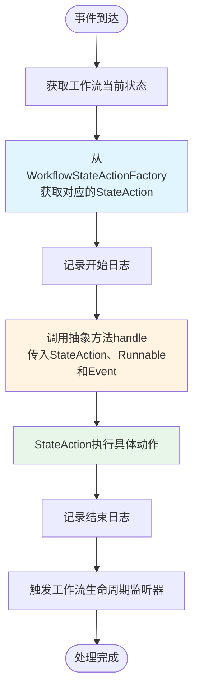

**处理流程说明**：
1. **获取状态动作**：根据工作流当前状态从工厂获取对应的`IWorkflowStateAction`
2. **执行处理逻辑**：调用子类实现的`handle()`方法，传入状态动作、工作流执行任务和事件
3. **触发监听器**：处理完成后，通知所有注册的生命周期监听器

### 9.5 IWorkflowStateAction 状态动作体系

#### 9.5.1 状态动作接口定义

`IWorkflowStateAction`接口定义了工作流在不同状态下接收各种事件时应该执行的动作：

```java
public interface IWorkflowStateAction {
    void startEventAction(IWorkflowExecutionRunnable, WorkflowStartLifecycleEvent);
    void topologyLogicalTransitionEventAction(IWorkflowExecutionRunnable, WorkflowTopologyLogicalTransitionWithTaskFinishLifecycleEvent);
    void pauseEventAction(IWorkflowExecutionRunnable, WorkflowPauseLifecycleEvent);
    void pausedEventAction(IWorkflowExecutionRunnable, WorkflowPausedLifecycleEvent);
    void stopEventAction(IWorkflowExecutionRunnable, WorkflowStopLifecycleEvent);
    void stoppedEventAction(IWorkflowExecutionRunnable, WorkflowStoppedLifecycleEvent);
    void succeedEventAction(IWorkflowExecutionRunnable, WorkflowSucceedLifecycleEvent);
    void failedEventAction(IWorkflowExecutionRunnable, WorkflowFailedLifecycleEvent);
    void finalizeEventAction(IWorkflowExecutionRunnable, WorkflowFinalizeLifecycleEvent);
    WorkflowExecutionStatus matchState();
}
```

**接口说明**：
- 每个方法对应一种事件类型，定义了在该状态下接收该事件时的处理逻辑
- `matchState()`返回该动作匹配的工作流执行状态

#### 9.5.2 状态动作实现体系

```mermaid
classDiagram
    class IWorkflowStateAction {
        <<interface>>
        +startEventAction(IWorkflowExecutionRunnable, WorkflowStartLifecycleEvent) void
        +topologyLogicalTransitionEventAction(...) void
        +pauseEventAction(...) void
        +stopEventAction(...) void
        +succeedEventAction(...) void
        +failedEventAction(...) void
        +finalizeEventAction(...) void
        +matchState() WorkflowExecutionStatus
    }
    
    class AbstractWorkflowStateAction {
        <<abstract>>
        #SuccessorFlowAdjuster successorFlowAdjuster
        #WorkflowInstanceDao workflowInstanceDao
        #WorkflowCacheRepository workflowCacheRepository
        #WorkflowEventBusCoordinator workflowEventBusCoordinator
        #triggerTasks(...) void
        #killActiveTask(...) void
        #pauseActiveTask(...) void
        #tryToTriggerSuccessorsAfterTaskFinish(...) void
        #workflowFinish(...) void
        #transformWorkflowInstanceState(...) void
        #emitWorkflowFinishedEventIfApplicable(...)* void
    }
    
    class WorkflowSubmittedStateAction {
        +matchState() WorkflowExecutionStatus
    }
    
    class WorkflowRunningStateAction {
        +startEventAction(...) void
        +topologyLogicalTransitionEventAction(...) void
        +pauseEventAction(...) void
        +stopEventAction(...) void
        +succeedEventAction(...) void
        +failedEventAction(...) void
        +matchState() WorkflowExecutionStatus
        #emitWorkflowFinishedEventIfApplicable(...) void
    }
    
    class WorkflowPausedStateAction {
        +matchState() WorkflowExecutionStatus
    }
    
    class WorkflowStoppedStateAction {
        +matchState() WorkflowExecutionStatus
    }
    
    class WorkflowSuccessStateAction {
        +matchState() WorkflowExecutionStatus
    }
    
    class WorkflowFailedStateAction {
        +matchState() WorkflowExecutionStatus
    }
    
    class WorkflowReadyPauseStateAction {
        +matchState() WorkflowExecutionStatus
    }
    
    class WorkflowReadyStopStateAction {
        +matchState() WorkflowExecutionStatus
    }
    
    class WorkflowSerialWaitStateAction {
        +matchState() WorkflowExecutionStatus
    }
    
    class WorkflowFailoverStateAction {
        +matchState() WorkflowExecutionStatus
    }
    
    IWorkflowStateAction <|.. AbstractWorkflowStateAction
    AbstractWorkflowStateAction <|-- WorkflowSubmittedStateAction
    AbstractWorkflowStateAction <|-- WorkflowRunningStateAction
    AbstractWorkflowStateAction <|-- WorkflowPausedStateAction
    AbstractWorkflowStateAction <|-- WorkflowStoppedStateAction
    AbstractWorkflowStateAction <|-- WorkflowSuccessStateAction
    AbstractWorkflowStateAction <|-- WorkflowFailedStateAction
    AbstractWorkflowStateAction <|-- WorkflowReadyPauseStateAction
    AbstractWorkflowStateAction <|-- WorkflowReadyStopStateAction
    AbstractWorkflowStateAction <|-- WorkflowSerialWaitStateAction
    AbstractWorkflowStateAction <|-- WorkflowFailoverStateAction
```

**状态动作实现体系说明**：

1. **IWorkflowStateAction（状态动作接口）**：
    - 定义了工作流在特定状态下接收各种事件时的处理接口
    - 每个方法对应一种事件类型

2. **AbstractWorkflowStateAction（抽象状态动作类）**：
    - 实现了`IWorkflowStateAction`接口
    - 提供了通用的状态转换和任务触发方法：
        - `triggerTasks()`：触发符合条件的任务
        - `killActiveTask()`：杀死活跃任务
        - `pauseActiveTask()`：暂停活跃任务
        - `tryToTriggerSuccessorsAfterTaskFinish()`：任务完成后触发后继任务
        - `workflowFinish()`：完成工作流
        - `transformWorkflowInstanceState()`：转换工作流实例状态
    - 定义了抽象方法`emitWorkflowFinishedEventIfApplicable()`，由子类实现工作流完成判断逻辑

3. **具体状态动作实现**：
    - 每个实现类对应一种`WorkflowExecutionStatus`
    - 实现`matchState()`返回对应的状态
    - 根据业务逻辑实现相应的事件处理方法

#### 9.5.3 WorkflowExecutionStatus 与 IWorkflowStateAction 映射关系

```mermaid
graph TB
    subgraph "工作流执行状态"
        SUBMITTED[SUBMITTED_SUCCESS<br/>已提交]
        RUNNING[RUNNING_EXECUTION<br/>运行中]
        READY_PAUSE[READY_PAUSE<br/>准备暂停]
        PAUSED[PAUSE<br/>已暂停]
        READY_STOP[READY_STOP<br/>准备停止]
        STOPPED[STOP<br/>已停止]
        SUCCESS[SUCCESS<br/>成功]
        FAILURE[FAILURE<br/>失败]
        SERIAL_WAIT[SERIAL_WAIT<br/>串行等待]
        FAILOVER[FAILOVER<br/>故障转移]
    end
    
    subgraph "状态动作实现"
        SA1[WorkflowSubmittedStateAction]
        SA2[WorkflowRunningStateAction]
        SA3[WorkflowReadyPauseStateAction]
        SA4[WorkflowPausedStateAction]
        SA5[WorkflowReadyStopStateAction]
        SA6[WorkflowStoppedStateAction]
        SA7[WorkflowSuccessStateAction]
        SA8[WorkflowFailedStateAction]
        SA9[WorkflowSerialWaitStateAction]
        SA10[WorkflowFailoverStateAction]
    end
    
    SUBMITTED -->|1:1| SA1
    RUNNING -->|1:1| SA2
    READY_PAUSE -->|1:1| SA3
    PAUSED -->|1:1| SA4
    READY_STOP -->|1:1| SA5
    STOPPED -->|1:1| SA6
    SUCCESS -->|1:1| SA7
    FAILURE -->|1:1| SA8
    SERIAL_WAIT -->|1:1| SA9
    FAILOVER -->|1:1| SA10
    
    style SUBMITTED fill:#e1f5ff
    style RUNNING fill:#e8f5e9
    style SA2 fill:#fff4e1
```

**映射关系说明**：
- **一对一映射**：每个`WorkflowExecutionStatus`都有唯一对应的`IWorkflowStateAction`实现
- **状态机模式**：通过状态和事件的组合，实现工作流状态转换
- **工厂管理**：`WorkflowStateActionFactory`负责维护状态到动作的映射关系

### 9.6 组件关系图

```mermaid
graph TB
    subgraph "事件层"
        ALE[AbstractLifecycleEvent<br/>生命周期事件基类]
        AWLE[AbstractWorkflowLifecycleLifecycleEvent<br/>工作流事件基类]
        WSLE[WorkflowStartLifecycleEvent<br/>启动事件]
        WSE[WorkflowSucceedLifecycleEvent<br/>成功事件]
        WFE[WorkflowFailedLifecycleEvent<br/>失败事件]
    end
    
    subgraph "处理器层"
        ILEH[ILifecycleEventHandler<br/>事件处理器接口]
        AWLEH[AbstractWorkflowLifecycleEventHandler<br/>抽象事件处理器]
        WSLEH[WorkflowStartLifecycleEventHandler<br/>启动事件处理器]
        WSEH[WorkflowSucceedLifecycleEventHandler<br/>成功事件处理器]
        WFEH[WorkflowFailedLifecycleEventHandler<br/>失败事件处理器]
    end
    
    subgraph "状态动作层"
        IWSA[IWorkflowStateAction<br/>状态动作接口]
        AWSA[AbstractWorkflowStateAction<br/>抽象状态动作]
        WRSA[WorkflowRunningStateAction<br/>运行状态动作]
        WSSA[WorkflowSuccessStateAction<br/>成功状态动作]
        WFSA[WorkflowFailedStateAction<br/>失败状态动作]
        WSAF[WorkflowStateActionFactory<br/>状态动作工厂]
    end
    
    subgraph "状态层"
        WES[WorkflowExecutionStatus<br/>工作流执行状态枚举]
    end
    
    subgraph "执行层"
        WER[IWorkflowExecutionRunnable<br/>工作流执行任务]
        WEB[WorkflowEventBus<br/>工作流事件总线]
        WEFW[WorkflowEventBusFireWorker<br/>事件触发工作器]
    end
    
    ALE -->|继承| AWLE
    AWLE -->|继承| WSLE
    AWLE -->|继承| WSE
    AWLE -->|继承| WFE
    
    ILEH -.->|实现| AWLEH
    AWLEH -->|继承| WSLEH
    AWLEH -->|继承| WSEH
    AWLEH -->|继承| WFEH
    
    IWSA -.->|实现| AWSA
    AWSA -->|继承| WRSA
    AWSA -->|继承| WSSA
    AWSA -->|继承| WFSA
    
    WES -->|匹配| WSAF
    WSAF -->|创建| WRSA
    WSAF -->|创建| WSSA
    WSAF -->|创建| WFSA
    
    WSLE -->|被处理| WSLEH
    WSE -->|被处理| WSEH
    WFE -->|被处理| WFEH
    
    WSLEH -->|获取| WSAF
    WSEH -->|获取| WSAF
    WFEH -->|获取| WSAF
    
    WSAF -->|根据状态返回| WRSA
    WSAF -->|根据状态返回| WSSA
    WSAF -->|根据状态返回| WFSA
    
    WSLEH -->|调用| WRSA
    WSEH -->|调用| WSSA
    WFEH -->|调用| WFSA
    
    WER -->|包含| WEB
    WEB -->|发布事件| WSLE
    WEB -->|发布事件| WSE
    WEB -->|发布事件| WFE
    
    WEFW -->|触发| WSLEH
    WEFW -->|触发| WSEH
    WEFW -->|触发| WFEH
    
    WRSA -->|操作| WER
    WSSA -->|操作| WER
    WFSA -->|操作| WER
    
    WER -->|状态| WES
    
    style ALE fill:#e1f5ff
    style ILEH fill:#fff4e1
    style IWSA fill:#e8f5e9
    style WES fill:#f3e5f5
    style WER fill:#ffebee
```

**组件关系说明**：
- **事件层**：定义各种生命周期事件
- **处理器层**：处理特定类型的事件
- **状态动作层**：根据工作流状态执行相应动作
- **状态层**：定义工作流的执行状态
- **执行层**：工作流执行任务和事件总线

### 9.7 类关系图

```mermaid
classDiagram
    class AbstractDelayEvent {
        +long delayTime
        +long createTimeInNano
        +long expiredTimeInNano
        +getDelay(TimeUnit) long
        +compareTo(Delayed) int
    }
    
    class AbstractLifecycleEvent {
        <<abstract>>
        +getEventType() ILifecycleEventType
    }
    
    class AbstractWorkflowLifecycleLifecycleEvent {
        <<abstract>>
        +getWorkflowExecutionRunnable() IWorkflowExecutionRunnable
    }
    
    class WorkflowStartLifecycleEvent {
        -IWorkflowExecutionRunnable workflowExecutionRunnable
        +of(IWorkflowExecutionRunnable) WorkflowStartLifecycleEvent
        +getEventType() ILifecycleEventType
    }
    
    class ILifecycleEventHandler {
        <<interface>>
        +handle(IWorkflowExecutionRunnable, T) void
        +matchEventType() ILifecycleEventType
    }
    
    class AbstractWorkflowLifecycleEventHandler {
        <<abstract>>
        -WorkflowStateActionFactory workflowStateActionFactory
        +handle(IWorkflowExecutionRunnable, T) void
        +handle(IWorkflowStateAction, IWorkflowExecutionRunnable, T) void
        -doTriggerWorkflowLifecycleListener(IWorkflowExecutionRunnable, T) void
    }
    
    class WorkflowStartLifecycleEventHandler {
        +handle(IWorkflowStateAction, IWorkflowExecutionRunnable, WorkflowStartLifecycleEvent) void
        +matchEventType() ILifecycleEventType
    }
    
    class IWorkflowStateAction {
        <<interface>>
        +startEventAction(IWorkflowExecutionRunnable, WorkflowStartLifecycleEvent) void
        +topologyLogicalTransitionEventAction(...) void
        +pauseEventAction(...) void
        +stopEventAction(...) void
        +succeedEventAction(...) void
        +failedEventAction(...) void
        +finalizeEventAction(...) void
        +matchState() WorkflowExecutionStatus
    }
    
    class AbstractWorkflowStateAction {
        <<abstract>>
        #SuccessorFlowAdjuster successorFlowAdjuster
        #WorkflowInstanceDao workflowInstanceDao
        #WorkflowCacheRepository workflowCacheRepository
        #WorkflowEventBusCoordinator workflowEventBusCoordinator
        #triggerTasks(...) void
        #workflowFinish(...) void
        #transformWorkflowInstanceState(...) void
        #emitWorkflowFinishedEventIfApplicable(...) void
    }
    
    class WorkflowRunningStateAction {
        +startEventAction(...) void
        +topologyLogicalTransitionEventAction(...) void
        +succeedEventAction(...) void
        +failedEventAction(...) void
        +matchState() WorkflowExecutionStatus
        #emitWorkflowFinishedEventIfApplicable(...) void
    }
    
    class WorkflowStateActionFactory {
        -Map~WorkflowExecutionStatus_IWorkflowStateAction~ workflowStateActionMap
        +getAction(WorkflowExecutionStatus) IWorkflowStateAction
    }
    
    class WorkflowExecutionStatus {
        <<enumeration>>
        SUBMITTED_SUCCESS
        RUNNING_EXECUTION
        PAUSE
        STOP
        SUCCESS
        FAILURE
        ...
    }
    
    class IWorkflowExecutionRunnable {
        <<interface>>
        +getState() WorkflowExecutionStatus
        +getWorkflowEventBus() WorkflowEventBus
        +getWorkflowExecutionGraph() IWorkflowExecutionGraph
    }
    
    class WorkflowEventBus {
        +publish(AbstractLifecycleEvent) void
        +poll() Optional~AbstractLifecycleEvent~
        +isEmpty() boolean
    }
    
    AbstractDelayEvent <|-- AbstractLifecycleEvent
    AbstractLifecycleEvent <|-- AbstractWorkflowLifecycleLifecycleEvent
    AbstractWorkflowLifecycleLifecycleEvent <|-- WorkflowStartLifecycleEvent
    
    ILifecycleEventHandler <|.. AbstractWorkflowLifecycleEventHandler
    AbstractWorkflowLifecycleEventHandler <|-- WorkflowStartLifecycleEventHandler
    
    IWorkflowStateAction <|.. AbstractWorkflowStateAction
    AbstractWorkflowStateAction <|-- WorkflowRunningStateAction
    
    AbstractWorkflowLifecycleEventHandler --> WorkflowStateActionFactory : uses
    WorkflowStateActionFactory --> IWorkflowStateAction : creates
    WorkflowStateActionFactory --> WorkflowExecutionStatus : maps
    
    WorkflowStartLifecycleEventHandler --> IWorkflowStateAction : calls
    WorkflowRunningStateAction --> WorkflowExecutionStatus : matches
    
    IWorkflowExecutionRunnable --> WorkflowExecutionStatus : has state
    IWorkflowExecutionRunnable --> WorkflowEventBus : has
    WorkflowEventBus --> AbstractLifecycleEvent : stores
    WorkflowStartLifecycleEvent --> IWorkflowExecutionRunnable : contains
```

### 9.8 AbstractLifecycleEvent 与 ILifecycleEventHandler 的关系

#### 9.8.1 关系概述

`AbstractLifecycleEvent`和`ILifecycleEventHandler`之间是**观察者模式（Observer Pattern）**的体现：

- **Subject（主题）**：`AbstractLifecycleEvent`及其子类，代表被观察的事件
- **Observer（观察者）**：`ILifecycleEventHandler`及其实现类，代表事件处理器
- **EventBus（事件总线）**：`WorkflowEventBus`作为中介，连接事件和处理器

#### 9.8.2 事件与处理器映射关系

```mermaid
graph LR
    subgraph "事件类型"
        E1[WorkflowStartLifecycleEvent<br/>START]
        E2[WorkflowSucceedLifecycleEvent<br/>SUCCEED]
        E3[WorkflowFailedLifecycleEvent<br/>FAILED]
        E4[WorkflowPauseLifecycleEvent<br/>PAUSE]
        E5[WorkflowStopLifecycleEvent<br/>STOP]
        E6[WorkflowTopologyLogicalTransitionWithTaskFinishLifecycleEvent<br/>TOPOLOGY_LOGICAL_TRANSACTION]
    end
    
    subgraph "事件处理器"
        H1[WorkflowStartLifecycleEventHandler]
        H2[WorkflowSucceedLifecycleEventHandler]
        H3[WorkflowFailedLifecycleEventHandler]
        H4[WorkflowPauseLifecycleEventHandler]
        H5[WorkflowStopLifecycleEventHandler]
        H6[WorkflowTopologyLogicalTransitionWithTaskFinishLifecycleEventHandler]
    end
    
    E1 -->|1:1| H1
    E2 -->|1:1| H2
    E3 -->|1:1| H3
    E4 -->|1:1| H4
    E5 -->|1:1| H5
    E6 -->|1:1| H6
    
    style E1 fill:#e1f5ff
    style H1 fill:#fff4e1
```

**映射关系说明**：
- **一对一映射**：每种事件类型都有唯一对应的事件处理器
- **类型匹配**：通过`matchEventType()`方法实现事件类型与处理器的匹配
- **注册机制**：处理器在`WorkflowEventBusFireWorker`启动时注册到`eventHandlerMap`中

#### 9.8.3 事件分发机制

```mermaid
sequenceDiagram
    participant WEB as WorkflowEventBus
    participant WEFW as WorkflowEventBusFireWorker
    participant EH as ILifecycleEventHandler
    participant WSAF as WorkflowStateActionFactory
    participant WSA as IWorkflowStateAction
    participant WER as IWorkflowExecutionRunnable
    
    WEB->>WEB: publish(WorkflowStartLifecycleEvent)
    WEB->>WEB: 事件入队到DelayQueue
    
    WEFW->>WEB: poll() 获取事件
    WEB-->>WEFW: WorkflowStartLifecycleEvent
    
    WEFW->>WEFW: 根据event.getEventType()查找Handler
    WEFW->>EH: handle(workflowExecutionRunnable, event)
    
    EH->>WER: getState()
    WER-->>EH: RUNNING_EXECUTION
    
    EH->>WSAF: getAction(RUNNING_EXECUTION)
    WSAF-->>EH: WorkflowRunningStateAction
    
    EH->>WSA: startEventAction(workflowExecutionRunnable, event)
    WSA->>WSA: 执行状态动作逻辑
    WSA-->>EH: 完成
    EH-->>WEFW: 处理完成
```

### 9.9 IWorkflowStateAction 与 WorkflowExecutionStatus 的关系

#### 9.9.1 状态机模式

`IWorkflowStateAction`和`WorkflowExecutionStatus`共同实现了**状态机模式（State Machine Pattern）**：

```mermaid
stateDiagram-v2
    [*] --> SUBMITTED_SUCCESS: 创建命令
    SUBMITTED_SUCCESS --> RUNNING_EXECUTION: START事件
    RUNNING_EXECUTION --> READY_PAUSE: PAUSE事件
    RUNNING_EXECUTION --> READY_STOP: STOP事件
    RUNNING_EXECUTION --> SUCCESS: SUCCEED事件
    RUNNING_EXECUTION --> FAILURE: FAILED事件
    RUNNING_EXECUTION --> SERIAL_WAIT: 串行等待
    READY_PAUSE --> PAUSE: PAUSED事件
    READY_STOP --> STOP: STOPPED事件
    SERIAL_WAIT --> RUNNING_EXECUTION: 恢复执行
    PAUSE --> RUNNING_EXECUTION: 恢复
    SUCCESS --> [*]: FINALIZE事件
    FAILURE --> [*]: FINALIZE事件
    STOP --> [*]: FINALIZE事件
    PAUSE --> [*]: FINALIZE事件
```

**状态机说明**：
- **状态（State）**：`WorkflowExecutionStatus`枚举定义了工作流的所有可能状态
- **事件（Event）**：`AbstractLifecycleEvent`及其子类定义了触发状态转换的事件
- **动作（Action）**：`IWorkflowStateAction`定义了在特定状态下接收特定事件时执行的动作
- **转换（Transition）**：通过状态动作的执行实现状态转换

#### 9.9.2 状态与动作的映射

```mermaid
graph TB
    subgraph "状态到动作的映射"
        S1[SUBMITTED_SUCCESS] -->|匹配| A1[WorkflowSubmittedStateAction]
        S2[RUNNING_EXECUTION] -->|匹配| A2[WorkflowRunningStateAction]
        S3[READY_PAUSE] -->|匹配| A3[WorkflowReadyPauseStateAction]
        S4[PAUSE] -->|匹配| A4[WorkflowPausedStateAction]
        S5[READY_STOP] -->|匹配| A5[WorkflowReadyStopStateAction]
        S6[STOP] -->|匹配| A6[WorkflowStoppedStateAction]
        S7[SUCCESS] -->|匹配| A7[WorkflowSuccessStateAction]
        S8[FAILURE] -->|匹配| A8[WorkflowFailedStateAction]
        S9[SERIAL_WAIT] -->|匹配| A9[WorkflowSerialWaitStateAction]
        S10[FAILOVER] -->|匹配| A10[WorkflowFailoverStateAction]
    end
    
    style S2 fill:#e8f5e9
    style A2 fill:#fff4e1
```

**映射机制**：
- **工厂模式**：`WorkflowStateActionFactory`维护状态到动作的映射
- **初始化**：在工厂构造时，所有`IWorkflowStateAction`实现类被注册到Map中
- **查找**：通过`getAction(WorkflowExecutionStatus)`方法根据状态查找对应的动作

### 9.10 设计模式分析

#### 9.10.1 观察者模式（Observer Pattern）

**事件-处理器关系体现了观察者模式**：

```mermaid
graph TB
    subgraph "观察者模式结构"
        Subject[AbstractLifecycleEvent<br/>主题/被观察者]
        Observer[ILifecycleEventHandler<br/>观察者接口]
        ConcreteObserver1[WorkflowStartLifecycleEventHandler<br/>具体观察者1]
        ConcreteObserver2[WorkflowSucceedLifecycleEventHandler<br/>具体观察者2]
        ConcreteObserver3[WorkflowFailedLifecycleEventHandler<br/>具体观察者3]
        EventBus[WorkflowEventBus<br/>事件总线/中介]
    end
    
    Subject -->|发布事件| EventBus
    EventBus -->|通知| Observer
    Observer -.->|实现| ConcreteObserver1
    Observer -.->|实现| ConcreteObserver2
    Observer -.->|实现| ConcreteObserver3
    EventBus -->|分发事件| ConcreteObserver1
    EventBus -->|分发事件| ConcreteObserver2
    EventBus -->|分发事件| ConcreteObserver3
    
    style Subject fill:#e1f5ff
    style Observer fill:#fff4e1
    style EventBus fill:#e8f5e9
```

**观察者模式说明**：
- **Subject（主题）**：`AbstractLifecycleEvent`及其子类，代表被观察的事件
- **Observer（观察者）**：`ILifecycleEventHandler`及其实现类，代表事件处理器
- **通知机制**：通过`WorkflowEventBus`发布事件，`WorkflowEventBusFireWorker`触发处理器
- **解耦**：事件发布者和处理器解耦，通过事件总线连接

#### 9.10.2 状态机模式（State Machine Pattern）

**状态-动作关系体现了状态机模式**：

```mermaid
graph TB
    subgraph "状态机模式结构"
        Context[IWorkflowExecutionRunnable<br/>上下文]
        State[WorkflowExecutionStatus<br/>状态]
        StateAction[IWorkflowStateAction<br/>状态动作]
        ConcreteState1[WorkflowRunningStateAction<br/>运行状态动作]
        ConcreteState2[WorkflowPausedStateAction<br/>暂停状态动作]
        ConcreteState3[WorkflowSuccessStateAction<br/>成功状态动作]
        Factory[WorkflowStateActionFactory<br/>状态动作工厂]
    end
    
    Context -->|有状态| State
    State -->|映射到| Factory
    Factory -->|创建| StateAction
    StateAction -.->|实现| ConcreteState1
    StateAction -.->|实现| ConcreteState2
    StateAction -.->|实现| ConcreteState3
    Context -->|执行动作| ConcreteState1
    Context -->|执行动作| ConcreteState2
    Context -->|执行动作| ConcreteState3
    
    style Context fill:#e1f5ff
    style State fill:#fff4e1
    style StateAction fill:#e8f5e9
```

**状态机模式说明**：
- **Context（上下文）**：`IWorkflowExecutionRunnable`维护当前状态
- **State（状态）**：`WorkflowExecutionStatus`定义所有可能的状态
- **StateAction（状态动作）**：`IWorkflowStateAction`定义在特定状态下的行为
- **状态转换**：通过事件触发状态动作，状态动作执行后可能改变状态

#### 9.10.3 策略模式（Strategy Pattern）

**事件处理器选择体现了策略模式**：

```mermaid
graph LR
    Event[AbstractLifecycleEvent] -->|根据eventType| Selector[WorkflowEventBusFireWorker<br/>策略选择器]
    Selector -->|START| Handler1[WorkflowStartLifecycleEventHandler]
    Selector -->|SUCCEED| Handler2[WorkflowSucceedLifecycleEventHandler]
    Selector -->|FAILED| Handler3[WorkflowFailedLifecycleEventHandler]
    Selector -->|PAUSE| Handler4[WorkflowPauseLifecycleEventHandler]
    Selector -->|STOP| Handler5[WorkflowStopLifecycleEventHandler]
    
    style Selector fill:#99ccff
    style Handler1 fill:#99ff99
```

**策略模式说明**：
- **Context（上下文）**：`WorkflowEventBusFireWorker`根据事件类型选择处理器
- **Strategy（策略接口）**：`ILifecycleEventHandler`定义统一的处理接口
- **ConcreteStrategy（具体策略）**：各种具体的EventHandler实现

#### 9.10.4 模板方法模式（Template Method Pattern）

**AbstractWorkflowLifecycleEventHandler体现了模板方法模式**：

```mermaid
graph TB
    AbstractClass[AbstractWorkflowLifecycleEventHandler<br/>抽象类]
    TemplateMethod[handle方法<br/>模板方法]
    Step1[获取工作流状态]
    Step2[从工厂获取StateAction]
    Step3[记录开始日志]
    Step4[调用抽象方法handle<br/>子类实现]
    Step5[记录结束日志]
    Step6[触发生命周期监听器]
    
    ConcreteClass1[WorkflowStartLifecycleEventHandler]
    ConcreteClass2[WorkflowSucceedLifecycleEventHandler]
    
    AbstractClass --> TemplateMethod
    TemplateMethod --> Step1
    TemplateMethod --> Step2
    TemplateMethod --> Step3
    TemplateMethod --> Step4
    TemplateMethod --> Step5
    TemplateMethod --> Step6
    
    AbstractClass -->|继承| ConcreteClass1
    AbstractClass -->|继承| ConcreteClass2
    ConcreteClass1 -->|实现| Step4
    ConcreteClass2 -->|实现| Step4
    
    style AbstractClass fill:#ffcc99
    style Step4 fill:#ff9999
```

**模板方法模式说明**：
- **AbstractClass（抽象类）**：`AbstractWorkflowLifecycleEventHandler`定义处理流程
- **TemplateMethod（模板方法）**：`handle()`方法定义固定的处理步骤
- **ConcreteMethod（具体方法）**：获取状态、获取动作、记录日志等
- **AbstractMethod（抽象方法）**：`handle(IWorkflowStateAction, ...)`由子类实现

### 9.11 完整处理流程

#### 9.11.1 从事件发布到状态动作执行的完整时序图

```mermaid
sequenceDiagram
    participant WER as IWorkflowExecutionRunnable
    participant WEB as WorkflowEventBus
    participant WEFW as WorkflowEventBusFireWorker
    participant EH as AbstractWorkflowLifecycleEventHandler
    participant WSAF as WorkflowStateActionFactory
    participant WSA as IWorkflowStateAction
    participant WEG as IWorkflowExecutionGraph
    participant Listener as IWorkflowLifecycleListener
    
    Note over WER: 工作流执行过程中
    WER->>WEB: publish(WorkflowStartLifecycleEvent)
    WEB->>WEB: 事件入队到DelayQueue
    WEB->>WEB: 更新事件统计
    
    Note over WEFW: 定期触发(100ms)
    WEFW->>WEB: poll() 获取事件
    WEB-->>WEFW: WorkflowStartLifecycleEvent
    
    WEFW->>WEFW: 根据event.getEventType()查找Handler
    WEFW->>EH: handle(workflowExecutionRunnable, event)
    
    Note over EH: AbstractWorkflowLifecycleEventHandler处理
    EH->>WER: getState()
    WER-->>EH: RUNNING_EXECUTION
    
    EH->>WSAF: getAction(RUNNING_EXECUTION)
    WSAF-->>EH: WorkflowRunningStateAction
    
    EH->>EH: 记录开始日志
    EH->>WSA: startEventAction(workflowExecutionRunnable, event)
    
    Note over WSA: WorkflowRunningStateAction执行
    WSA->>WSA: throwExceptionIfStateIsNotMatch()
    WSA->>WER: getWorkflowExecutionGraph()
    WER-->>WSA: IWorkflowExecutionGraph
    WSA->>WEG: getStartNodes()
    WEG-->>WSA: List~ITaskExecutionRunnable~
    WSA->>WSA: triggerTasks(workflowExecutionRunnable, startNodes)
    WSA->>WEB: publish(TaskStartLifecycleEvent)
    
    WSA-->>EH: 完成
    EH->>EH: 记录结束日志
    EH->>EH: doTriggerWorkflowLifecycleListener()
    EH->>Listener: notifyWorkflowLifecycleEvent(workflowExecutionRunnable, event)
    EH-->>WEFW: 处理完成
```

#### 9.11.2 事件处理流程图

```mermaid
flowchart TD
    Start([事件发布]) --> Publish[WorkflowEventBus.publish<br/>事件入队]
    Publish --> Wait[事件在DelayQueue中等待]
    Wait -->|到期| Poll[WorkflowEventBusFireWorker.poll<br/>取出事件]
    Poll --> CheckEmpty{事件队列是否为空?}
    CheckEmpty -->|是| End1([结束])
    CheckEmpty -->|否| GetEvent[获取事件]
    GetEvent --> FindHandler[根据eventType查找Handler]
    FindHandler --> HandlerExists{Handler是否存在?}
    HandlerExists -->|否| Error1[抛出RuntimeException]
    HandlerExists -->|是| CallHandler[调用Handler.handle]
    
    CallHandler --> GetState[获取工作流当前状态]
    GetState --> GetAction[从WorkflowStateActionFactory获取StateAction]
    GetAction --> LogBegin[记录开始日志]
    LogBegin --> CallAbstractHandle[调用抽象方法handle<br/>传入StateAction]
    
    CallAbstractHandle --> ExecuteAction[StateAction执行具体动作]
    ExecuteAction --> ActionType{动作类型}
    
    ActionType -->|startEventAction| TriggerTasks[触发任务]
    ActionType -->|topologyLogicalTransitionEventAction| TriggerSuccessors[触发后继任务]
    ActionType -->|pauseEventAction| PauseTasks[暂停任务]
    ActionType -->|stopEventAction| KillTasks[杀死任务]
    ActionType -->|succeedEventAction| CheckSuccess[检查是否成功]
    ActionType -->|failedEventAction| CheckFailure[检查是否失败]
    
    TriggerTasks --> PublishTaskEvent[发布TaskStartLifecycleEvent]
    TriggerSuccessors --> PublishTaskEvent
    PauseTasks --> UpdateState[更新工作流状态]
    KillTasks --> UpdateState
    CheckSuccess --> WorkflowFinish[完成工作流]
    CheckFailure --> WorkflowFinish
    WorkflowFinish --> UpdateState
    
    UpdateState --> PublishTaskEvent
    PublishTaskEvent --> LogEnd[记录结束日志]
    LogEnd --> TriggerListener[触发生命周期监听器]
    TriggerListener --> CheckException{是否有异常?}
    
    CheckException -->|是| DBException{数据库连接异常?}
    DBException -->|是| Republish[重新发布事件<br/>等待5秒]
    DBException -->|否| UpdateStats[更新失败统计]
    UpdateStats --> Error2[抛出WorkflowEventFireException]
    
    CheckException -->|否| UpdateSuccessStats[更新成功统计]
    Republish --> Wait
    UpdateSuccessStats --> CheckMore{还有事件?}
    CheckMore -->|是| GetEvent
    CheckMore -->|否| End2([处理完成])
    
    style GetAction fill:#e1f5ff
    style ExecuteAction fill:#fff4e1
    style TriggerTasks fill:#e8f5e9
```

#### 9.11.3 架构图

```mermaid
graph TB
    subgraph "事件发布层"
        WER[IWorkflowExecutionRunnable<br/>工作流执行任务]
        WEB[WorkflowEventBus<br/>工作流事件总线]
    end
    
    subgraph "事件存储层"
        DQ[DelayQueue<br/>延迟队列]
        Event1[WorkflowStartLifecycleEvent]
        Event2[WorkflowSucceedLifecycleEvent]
        Event3[WorkflowFailedLifecycleEvent]
    end
    
    subgraph "事件触发层"
        WEFW[WorkflowEventBusFireWorker<br/>事件触发工作器]
        WEFWS[WorkflowEventBusFireWorkers<br/>工作器管理器]
    end
    
    subgraph "事件处理层"
        EH1[WorkflowStartLifecycleEventHandler]
        EH2[WorkflowSucceedLifecycleEventHandler]
        EH3[WorkflowFailedLifecycleEventHandler]
        EHMap[EventHandlerMap<br/>处理器映射表]
    end
    
    subgraph "状态动作层"
        WSAF[WorkflowStateActionFactory<br/>状态动作工厂]
        WSA1[WorkflowRunningStateAction]
        WSA2[WorkflowSuccessStateAction]
        WSA3[WorkflowFailedStateAction]
        WSAMap[StateActionMap<br/>状态动作映射表]
    end
    
    subgraph "状态层"
        WES[WorkflowExecutionStatus<br/>工作流执行状态]
    end
    
    subgraph "执行层"
        WEG[IWorkflowExecutionGraph<br/>工作流执行图]
        TER[ITaskExecutionRunnable<br/>任务执行任务]
    end
    
    WER -->|发布事件| WEB
    WEB -->|存储| DQ
    DQ -->|包含| Event1
    DQ -->|包含| Event2
    DQ -->|包含| Event3
    
    WEFWS -->|管理| WEFW
    WEFW -->|定期触发| DQ
    DQ -->|取出事件| WEFW
    
    WEFW -->|查找| EHMap
    EHMap -->|映射| EH1
    EHMap -->|映射| EH2
    EHMap -->|映射| EH3
    
    EH1 -->|获取| WSAF
    EH2 -->|获取| WSAF
    EH3 -->|获取| WSAF
    
    WSAF -->|查找| WSAMap
    WSAMap -->|映射| WSA1
    WSAMap -->|映射| WSA2
    WSAMap -->|映射| WSA3
    
    WER -->|有状态| WES
    WES -->|匹配| WSAF
    
    WSA1 -->|操作| WEG
    WSA2 -->|操作| WEG
    WSA3 -->|操作| WEG
    WEG -->|包含| TER
    
    WSA1 -->|发布任务事件| WEB
    WSA2 -->|发布任务事件| WEB
    WSA3 -->|发布任务事件| WEB
    
    style WEB fill:#e1f5ff
    style WEFW fill:#fff4e1
    style WSAF fill:#e8f5e9
    style WES fill:#f3e5f5
```

### 9.11 WorkflowRunningStateAction 详细分析

以`WorkflowRunningStateAction`为例，详细分析状态动作的实现：

#### 8.11.1 关键方法实现

**startEventAction（启动事件处理）**：
```java
public void startEventAction(final IWorkflowExecutionRunnable workflowExecutionRunnable,
                             final WorkflowStartLifecycleEvent workflowStartEvent) {
    throwExceptionIfStateIsNotMatch(workflowExecutionRunnable);
    final IWorkflowExecutionGraph workflowExecutionGraph =
            workflowExecutionRunnable.getWorkflowExecuteContext().getWorkflowExecutionGraph();
    triggerTasks(workflowExecutionRunnable, workflowExecutionGraph.getStartNodes());
}
```

**处理逻辑**：
1. **状态验证**：确保工作流状态为`RUNNING_EXECUTION`
2. **获取执行图**：从工作流执行上下文中获取执行图
3. **触发开始节点**：调用`triggerTasks()`触发所有开始节点

**topologyLogicalTransitionEventAction（拓扑逻辑转换事件处理）**：
```java
public void topologyLogicalTransitionEventAction(
        final IWorkflowExecutionRunnable workflowExecutionRunnable,
        final WorkflowTopologyLogicalTransitionWithTaskFinishLifecycleEvent event) {
    throwExceptionIfStateIsNotMatch(workflowExecutionRunnable);
    super.tryToTriggerSuccessorsAfterTaskFinish(workflowExecutionRunnable,
            event.getTaskExecutionRunnable());
}
```

**处理逻辑**：
1. **状态验证**：确保工作流状态为`RUNNING_EXECUTION`
2. **触发后继任务**：任务完成后，触发其后继任务的执行

**succeedEventAction（成功事件处理）**：
```java
public void succeedEventAction(final IWorkflowExecutionRunnable workflowExecutionRunnable,
                               final WorkflowSucceedLifecycleEvent workflowSucceedEvent) {
    throwExceptionIfStateIsNotMatch(workflowExecutionRunnable);
    final IWorkflowExecutionGraph workflowExecutionGraph = workflowExecutionRunnable.getWorkflowExecutionGraph();
    if (!workflowExecutionGraph.isAllTaskExecutionRunnableChainSuccess()) {
        throw new IllegalStateException("The workflow exist tasks chain which is not success");
    }
    workflowFinish(workflowExecutionRunnable, WorkflowExecutionStatus.SUCCESS);
}
```

**处理逻辑**：
1. **状态验证**：确保工作流状态为`RUNNING_EXECUTION`
2. **验证所有任务成功**：检查所有任务链是否都成功
3. **完成工作流**：调用`workflowFinish()`完成工作流，状态转换为`SUCCESS`

#### 9.12.2 状态转换图

```mermaid
stateDiagram-v2
    [*] --> RUNNING_EXECUTION: CommandEngine启动
    
    RUNNING_EXECUTION --> RUNNING_EXECUTION: START事件<br/>触发开始节点
    RUNNING_EXECUTION --> RUNNING_EXECUTION: TOPOLOGY_LOGICAL_TRANSITION事件<br/>触发后继任务
    RUNNING_EXECUTION --> READY_PAUSE: PAUSE事件<br/>暂停活跃任务
    RUNNING_EXECUTION --> READY_STOP: STOP事件<br/>杀死活跃任务
    RUNNING_EXECUTION --> SUCCESS: SUCCEED事件<br/>所有任务成功
    RUNNING_EXECUTION --> FAILURE: FAILED事件<br/>存在失败任务
    
    READY_PAUSE --> PAUSE: PAUSED事件
    READY_STOP --> STOP: STOPPED事件
    
    SUCCESS --> [*]: FINALIZE事件
    FAILURE --> [*]: FINALIZE事件
    STOP --> [*]: FINALIZE事件
    PAUSE --> [*]: FINALIZE事件
```

### 9.13 从 AbstractWorkflowLifecycleEventHandler 开始的完整处理链

#### 9.13.1 详细时序图

```mermaid
sequenceDiagram
    participant WEFW as WorkflowEventBusFireWorker
    participant EH as AbstractWorkflowLifecycleEventHandler
    participant WER as IWorkflowExecutionRunnable
    participant WSAF as WorkflowStateActionFactory
    participant WSA as WorkflowRunningStateAction
    participant WEG as IWorkflowExecutionGraph
    participant WEB as WorkflowEventBus
    participant TER as ITaskExecutionRunnable
    participant Listener as IWorkflowLifecycleListener
    
    WEFW->>EH: handle(workflowExecutionRunnable, WorkflowStartLifecycleEvent)
    
    Note over EH: 1. 获取工作流状态
    EH->>WER: getState()
    WER-->>EH: RUNNING_EXECUTION
    
    Note over EH: 2. 从工厂获取状态动作
    EH->>WSAF: getAction(RUNNING_EXECUTION)
    WSAF->>WSAF: 从Map中查找
    WSAF-->>EH: WorkflowRunningStateAction
    
    Note over EH: 3. 记录开始日志
    EH->>EH: log.info("Begin fire workflow...")
    
    Note over EH: 4. 调用子类实现的handle方法
    EH->>WSA: startEventAction(workflowExecutionRunnable, event)
    
    Note over WSA: WorkflowRunningStateAction处理
    WSA->>WSA: throwExceptionIfStateIsNotMatch()
    WSA->>WER: getWorkflowExecuteContext()
    WER-->>WSA: WorkflowExecuteContext
    WSA->>WER: getWorkflowExecutionGraph()
    WER-->>WSA: IWorkflowExecutionGraph
    WSA->>WEG: getStartNodes()
    WEG-->>WSA: List~ITaskExecutionRunnable~
    
    Note over WSA: 触发任务
    WSA->>WSA: triggerTasks(workflowExecutionRunnable, startNodes)
    loop 遍历开始节点
        WSA->>WEG: isTriggerConditionMet(task)
        WEG-->>WSA: boolean
        alt 触发条件满足
            WSA->>WEG: markTaskExecutionRunnableActive(task)
            WSA->>WEB: publish(TaskStartLifecycleEvent.of(task))
        else 触发条件不满足
            WSA->>WSA: emitWorkflowFinishedEventIfApplicable()
        end
    end
    
    WSA-->>EH: 完成
    EH->>EH: log.info("Fired workflow...")
    
    Note over EH: 5. 触发生命周期监听器
    EH->>WER: getWorkflowLifecycleListeners()
    WER-->>EH: List~IWorkflowLifecycleListener~
    loop 遍历监听器
        EH->>Listener: match(event)
        Listener-->>EH: boolean
        alt 匹配
            EH->>Listener: notifyWorkflowLifecycleEvent(workflowExecutionRunnable, event)
        end
    end
    
    EH-->>WEFW: 处理完成
```

#### 9.13.2 处理流程图

```mermaid
flowchart TD
    Start([WorkflowEventBusFireWorker触发]) --> GetEvent[从WorkflowEventBus获取事件]
    GetEvent --> FindHandler[根据eventType查找Handler]
    FindHandler --> CallHandler[调用AbstractWorkflowLifecycleEventHandler.handle]

    CallHandler --> Step1[步骤1: 获取工作流状态]
    Step1 --> GetState[workflowExecutionRunnable.getState]
    GetState --> Step2[步骤2: 获取状态动作]

    Step2 --> GetAction[workflowStateActionFactory.getAction]
    GetAction --> Step3[步骤3: 记录开始日志]

    Step3 --> Step4[步骤4: 调用抽象方法handle]
    Step4 --> SubHandle[子类实现的handle方法]

    SubHandle --> CallStateAction[调用StateAction的相应方法]
    CallStateAction --> ActionType{事件类型}

    ActionType -->|START| StartAction[startEventAction]
    ActionType -->|TOPOLOGY_TRANSITION| TopologyAction[topologyLogicalTransitionEventAction]
    ActionType -->|SUCCEED| SucceedAction[succeedEventAction]
    ActionType -->|FAILED| FailedAction[failedEventAction]
    ActionType -->|PAUSE| PauseAction[pauseEventAction]
    ActionType -->|STOP| StopAction[stopEventAction]

    StartAction --> ValidateState1[验证状态]
    ValidateState1 --> GetGraph1[获取执行图]
    GetGraph1 --> GetStartNodes[获取开始节点]
    GetStartNodes --> TriggerTasks[triggerTasks触发任务]

    TopologyAction --> ValidateState2[验证状态]
    ValidateState2 --> TriggerSuccessors[tryToTriggerSuccessorsAfterTaskFinish<br/>触发后继任务]

    SucceedAction --> ValidateState3[验证状态]
    ValidateState3 --> CheckAllSuccess[检查所有任务是否成功]
    CheckAllSuccess --> WorkflowFinish1[workflowFinish完成工作流]

    FailedAction --> ValidateState4[验证状态]
    ValidateState4 --> CheckHasFailure[检查是否存在失败任务]
    CheckHasFailure --> WorkflowFinish2[workflowFinish完成工作流]

    PauseAction --> ValidateState5[验证状态]
    ValidateState5 --> TransformToReadyPause[转换状态为READY_PAUSE]
    TransformToReadyPause --> PauseActiveTasks[pauseActiveTask暂停活跃任务]

    StopAction --> ValidateState6[验证状态]
    ValidateState6 --> TransformToReadyStop[转换状态为READY_STOP]
    TransformToReadyStop --> KillActiveTasks[killActiveTask杀死活跃任务]
    
    TriggerTasks --> Step5[步骤5: 记录结束日志]
    TriggerSuccessors --> Step5
    WorkflowFinish1 --> Step5
    WorkflowFinish2 --> Step5
    PauseActiveTasks --> Step5
    KillActiveTasks --> Step5
    
    Step5 --> Step6[步骤6: 触发生命周期监听器]
    Step6 --> TriggerListeners[doTriggerWorkflowLifecycleListener]
    TriggerListeners --> End([处理完成])
    
    style Start fill:#e1f5ff
    style CallHandler fill:#fff4e1
    style SubHandle fill:#e8f5e9
    style End fill:#c8e6c9
```

**处理流程图说明**：
1. **事件获取**：WorkflowEventBusFireWorker从WorkflowEventBus中获取事件
2. **Handler查找**：根据事件类型从eventHandlerMap中查找对应的Handler
3. **状态获取**：获取工作流当前状态
4. **状态动作获取**：根据状态从WorkflowStateActionFactory获取对应的StateAction
5. **事件处理**：调用子类实现的handle方法，进一步调用StateAction的相应方法
6. **状态转换**：根据事件类型执行相应的状态转换和业务逻辑
7. **监听器触发**：触发注册的生命周期监听器
8. **处理完成**：事件处理完成

## 10. 关键流程详解

### 10.1 命令获取流程

```mermaid
sequenceDiagram
    participant CE as CommandEngine
    participant CF as IdSlotBasedCommandFetcher
    participant MSM as MasterSlotManager
    participant CD as CommandDao
    participant DB as Database
    
    CE->>CF: fetchCommands()
    CF->>MSM: checkSlotValid()
    MSM-->>CF: boolean
    
    alt 槽位无效
        CF-->>CE: emptyList()
    else 槽位有效
        CF->>MSM: getCurrentMasterSlot()
        MSM-->>CF: currentSlotIndex
        CF->>MSM: getTotalMasterSlots()
        MSM-->>CF: totalSlot
        CF->>CD: queryCommandByIdSlot(currentSlotIndex, totalSlot, idStep, fetchSize)
        CD->>DB: SELECT * FROM t_ds_command<br/>WHERE (id / idStep) % totalSlot = currentSlotIndex<br/>ORDER BY priority, id LIMIT fetchSize
        DB-->>CD: List<Command>
        CD-->>CF: List<Command>
        CF-->>CE: List<Command>
    end
```

**命令获取流程说明**：
- 使用ID槽位算法实现分布式负载均衡：`(id / idStep) % totalSlot = currentSlotIndex`
- 每个Master节点只处理分配给自己的命令
- 支持动态调整槽位分配，实现负载均衡

### 10.2 命令处理流程

```mermaid
flowchart TD
    Start([开始处理命令]) --> DeleteCmd[删除命令记录]
    DeleteCmd -->|删除成功| FindHandler[根据CommandType查找Handler]
    DeleteCmd -->|删除失败| Duplicate[命令已被其他Master处理<br/>抛出CommandDuplicateHandleException]
    Duplicate --> End1([结束])
    
    FindHandler -->|找到Handler| CallHandler[调用Handler.handleCommand]
    FindHandler -->|未找到Handler| Error[抛出IllegalArgumentException]
    Error --> End2([结束])
    
    CallHandler --> Assemble1[assembleWorkflowDefinition<br/>组装工作流定义]
    Assemble1 --> Assemble2[assembleProject<br/>组装项目信息]
    Assemble2 --> Assemble3[assembleWorkflowGraph<br/>组装工作流图]
    Assemble3 --> Assemble4[assembleWorkflowInstance<br/>组装工作流实例<br/>子类实现]
    Assemble4 --> Assemble5[assembleWorkflowEventBus<br/>组装事件总线]
    Assemble5 --> Assemble6[assembleWorkflowExecutionGraph<br/>组装执行图<br/>子类实现]
    Assemble6 --> CreateRunnable[创建WorkflowExecutionRunnable]
    CreateRunnable --> End3([返回Runnable])
    
    style DeleteCmd fill:#fff4e1
    style FindHandler fill:#e1f5ff
    style CallHandler fill:#e8f5e9
```

**命令处理流程说明**：
1. **幂等性保证**：首先删除命令记录，如果删除失败说明已被其他Master处理
2. **策略选择**：根据命令类型从Handler列表中查找对应的处理器
3. **上下文组装**：按照固定流程组装工作流执行所需的上下文信息
4. **执行任务创建**：最终创建`WorkflowExecutionRunnable`对象

### 10.3 工作流启动流程

```mermaid
sequenceDiagram
    participant CE as CommandEngine
    participant WR as WorkflowRepository
    participant WEC as WorkflowEventBusCoordinator
    participant WER as WorkflowExecutionRunnable
    participant WEB as WorkflowEventBus
    
    CE->>WR: put(workflowExecutionRunnable)
    WR->>WR: 存储到内存Map中
    
    CE->>WEC: registerWorkflowEventBus(runnable)
    WEC->>WEB: 注册事件总线
    
    CE->>WER: publish(WorkflowStartLifecycleEvent)
    WER->>WEB: publish(event)
    WEB->>WEB: 通知所有订阅者
    WEB-->>WER: 工作流开始执行
```

**工作流启动流程说明**：
1. **注册到仓库**：将`WorkflowExecutionRunnable`存储到`WorkflowRepository`中管理
2. **注册事件总线**：为工作流注册事件总线，用于后续的事件驱动
3. **发布启动事件**：发布`WorkflowStartLifecycleEvent`事件，触发工作流开始执行

## 11. 关键技术细节

### 11.1 分布式锁机制实现方式

**通过删除命令实现分布式锁**：

```mermaid
sequenceDiagram
    participant M1 as Master1
    participant M2 as Master2
    participant DB as Database
    participant TX as Transaction
    
    par Master1和Master2同时获取命令
        M1->>DB: 查询命令(id=100)
        M2->>DB: 查询命令(id=100)
        DB-->>M1: 返回命令100
        DB-->>M2: 返回命令100
    end
    
    par 并发处理
        M1->>TX: 开启事务
        M1->>DB: DELETE FROM t_ds_command WHERE id=100
        DB-->>M1: 删除成功(affected=1)
        M1->>TX: 提交事务
        
        M2->>TX: 开启事务
        M2->>DB: DELETE FROM t_ds_command WHERE id=100
        DB-->>M2: 删除失败(affected=0)
        M2->>TX: 回滚事务
        M2->>M2: 抛出CommandDuplicateHandleException
    end
```

**实现原理**：
1. **数据库删除操作作为锁**：使用`DELETE FROM t_ds_command WHERE id=?`作为分布式锁
2. **事务保证原子性**：在`@Transactional`注解的方法中执行删除操作
3. **删除结果判断**：
    - `affectedRows > 0`：删除成功，获得锁，继续处理
    - `affectedRows = 0`：删除失败，说明已被其他Master处理，抛出`CommandDuplicateHandleException`
4. **幂等性保证**：即使多个Master同时获取到同一命令，只有一个能成功删除并处理

**优势**：
- **无需额外组件**：不需要Redis、Zookeeper等分布式锁组件
- **数据库保证一致性**：利用数据库的ACID特性保证原子性
- **简单可靠**：实现简单，可靠性高
- **自动释放**：命令删除后锁自动释放，无需手动释放

**代码实现**：
```java
@Transactional
public IWorkflowExecutionRunnable createWorkflowExecuteRunnable(Command command) {
    deleteCommandOrThrow(command);  // 删除命令作为分布式锁
    return doCreateWorkflowExecutionRunnable(command);
}

private void deleteCommandOrThrow(Command command) {
    boolean deleteResult = commandDao.deleteById(command.getId());
    if (!deleteResult) {
        throw new CommandDuplicateHandleException(command);
    }
}
```

### 11.2 命令获取策略

#### 11.2.1 基于ID槽位的获取策略

**算法原理**：
使用命令ID和槽位数量进行取模运算，将命令分配给不同的Master节点。

**SQL查询**：
```sql
SELECT * FROM t_ds_command 
WHERE (id / #{idStep}) % #{totalSlot} = #{currentSlotIndex}
ORDER BY workflow_instance_priority, id ASC 
LIMIT #{fetchSize}
```

**参数说明**：
- `idStep`：ID步长，用于控制命令的分组粒度（默认值通常为1）
- `totalSlot`：总槽位数，等于Master节点总数
- `currentSlotIndex`：当前Master的槽位索引（0到totalSlot-1）
- `fetchSize`：每次获取的命令数量

**分配示例**：
假设有3个Master节点（totalSlot=3），idStep=1：
- Master0处理：id % 3 = 0的命令（0, 3, 6, 9...）
- Master1处理：id % 3 = 1的命令（1, 4, 7, 10...）
- Master2处理：id % 3 = 2的命令（2, 5, 8, 11...）

**优势**：
- **负载均衡**：命令均匀分配到各个Master节点
- **无状态**：不需要维护复杂的分配状态
- **动态调整**：Master节点数量变化时，重新计算槽位即可
- **优先级支持**：按优先级和ID排序，保证高优先级命令优先处理

**槽位验证**：
```java
if (!masterSlotManager.checkSlotValid()) {
    log.warn("MasterSlotManager check slot is invalidated.");
    return Collections.emptyList();
}
```
在获取命令前，先验证当前Master的槽位是否有效，如果无效则不获取命令。

### 11.3 异步并发处理

#### 11.3.1 线程池配置

**线程池创建**：
```java
this.commandHandleThreadPool = ThreadUtils.newDaemonFixedThreadExecutor(
    "MasterCommandHandleThreadPool",
    Runtime.getRuntime().availableProcessors()
);
```

**配置说明**：
- **线程池类型**：固定大小线程池（FixedThreadPool）
- **线程数量**：`Runtime.getRuntime().availableProcessors()`，等于CPU核心数
- **线程类型**：守护线程（Daemon Thread），JVM关闭时自动退出
- **命名**：`MasterCommandHandleThreadPool`，便于监控和问题排查

**并发处理流程**：
```java
List<CompletableFuture<Void>> allCompleteFutures = new ArrayList<>();
for (Command command : commands) {
    CompletableFuture<Void> completableFuture = bootstrapCommand(command)
        .thenAccept(this::bootstrapWorkflowExecutionRunnable)
        .thenAccept((unused) -> bootstrapSuccess(command))
        .exceptionally(throwable -> bootstrapError(command, throwable));
    allCompleteFutures.add(completableFuture);
}
CompletableFuture.allOf(allCompleteFutures.toArray(new CompletableFuture[0])).join();
```

**处理步骤**：
1. **异步创建执行任务**：`bootstrapCommand()`在线程池中异步执行
2. **链式处理**：使用`CompletableFuture`的链式调用处理后续步骤
3. **异常处理**：使用`exceptionally()`统一处理异常
4. **等待完成**：使用`allOf().join()`等待所有命令处理完成

**优势**：
- **提高吞吐量**：多个命令并发处理，充分利用CPU资源
- **非阻塞**：主循环线程不会被单个命令的处理阻塞
- **异常隔离**：单个命令处理失败不影响其他命令
- **资源控制**：通过线程池大小控制并发度，避免资源耗尽

### 11.4 负载保护机制

**实现原理**：
在每次获取命令前，检查系统资源使用情况，如果超过阈值则暂停处理命令。

**检查指标**：
```java
public boolean isOverload(SystemMetrics systemMetrics) {
    // 系统CPU使用率
    if (systemMetrics.getSystemCpuUsagePercentage() > maxSystemCpuUsagePercentageThresholds) {
        return true;
    }
    // JVM CPU使用率
    if (systemMetrics.getJvmCpuUsagePercentage() > maxJvmCpuUsagePercentageThresholds) {
        return true;
    }
    // 磁盘使用率
    if (systemMetrics.getDiskUsedPercentage() > maxDiskUsagePercentageThresholds) {
        return true;
    }
    // 系统内存使用率
    if (systemMetrics.getSystemMemoryUsedPercentage() > maxSystemMemoryUsagePercentageThresholds) {
        return true;
    }
    return false;
}
```

**默认阈值**：
- `maxSystemCpuUsagePercentageThresholds`：0.7（70%）
- `maxJvmCpuUsagePercentageThresholds`：0.7（70%）
- `maxSystemMemoryUsagePercentageThresholds`：0.7（70%）
- `maxDiskUsagePercentageThresholds`：0.7（70%）

**处理流程**：
```java
SystemMetrics systemMetrics = metricsProvider.getSystemMetrics();
if (serverLoadProtection.isOverload(systemMetrics)) {
    log.warn("The current server is overload, cannot consumes commands.");
    MasterServerMetrics.incMasterOverload();
    Thread.sleep(Constants.SLEEP_TIME_MILLIS);
    continue;
}
```

**保护机制**：
- **暂停处理**：检测到过载时，跳过本次命令获取，等待1秒后重试
- **指标记录**：记录过载次数到`MasterServerMetrics`
- **自动恢复**：系统资源恢复后，自动恢复命令处理

**优势**：
- **防止系统崩溃**：避免在高负载情况下继续处理命令导致系统崩溃
- **自我保护**：Master节点能够自我保护，保证基本功能可用
- **可配置**：阈值可通过配置文件调整
- **可监控**：通过指标监控过载情况

### 11.5 错误处理机制

**异常分类和处理**：

1. **CommandDuplicateHandleException（命令重复处理异常）**：
   ```java
   if (throwable instanceof CommandDuplicateHandleException) {
       log.warn("Handle command failed, the command: {} has been handled by other master", command);
       return null;  // 忽略异常，继续处理
   }
   ```
    - **原因**：命令已被其他Master节点处理
    - **处理**：记录警告日志，忽略异常，不进行错误处理

2. **IllegalArgumentException（非法参数异常）**：
    - **原因**：找不到对应的Handler或参数无效
    - **处理**：记录错误日志，将命令移动到错误命令表

3. **其他异常**：
   ```java
   log.error("Failed bootstrap command {} ", JSONUtils.toPrettyJsonString(command), throwable);
   commandService.moveToErrorCommand(command, ExceptionUtils.getStackTrace(throwable));
   ```
    - **处理**：记录错误日志和堆栈信息，将命令移动到错误命令表

**错误命令处理**：
- **移动到错误表**：`commandService.moveToErrorCommand()`将失败的命令移动到`t_ds_error_command`表
- **保留错误信息**：保存完整的异常堆栈信息，便于问题排查
- **可手动重试**：管理员可以查看错误命令并手动重试

**主循环异常处理**：
```java
try {
    // 命令处理逻辑
} catch (InterruptedException interruptedException) {
    log.warn("Master schedule bootstrap interrupted, close the loop", interruptedException);
    Thread.currentThread().interrupt();
    break;  // 中断循环
} catch (Exception e) {
    log.error("Master schedule workflow error", e);
    ThreadUtils.sleep(Constants.SLEEP_TIME_MILLIS);  // 等待1秒后继续
}
```

**异常处理策略**：
- **中断异常**：正常关闭，中断循环
- **其他异常**：记录错误，等待1秒后继续，避免数据库故障导致异常循环

### 11.6 事件驱动机制

**事件总线架构**：

```mermaid
graph TB
    subgraph "事件驱动架构"
        CE[CommandEngine]
        WER[WorkflowExecutionRunnable]
        WEC[WorkflowEventBusCoordinator]
        WEFW[WorkflowEventBusFireWorkers]
        WEFW1[WorkflowEventBusFireWorker1]
        WEFW2[WorkflowEventBusFireWorker2]
        WEFW3[WorkflowEventBusFireWorkerN]
        WEB[WorkflowEventBus]
        EH[ILifecycleEventHandler]
    end
    
    CE -->|注册| WER
    CE -->|注册事件总线| WEC
    WEC -->|分配到Worker| WEFW
    WEFW -->|管理| WEFW1
    WEFW -->|管理| WEFW2
    WEFW -->|管理| WEFW3
    WER -->|包含| WEB
    WEFW1 -->|注册| WEB
    WEB -->|发布事件| EH
    EH -->|处理事件| WER
```

**事件总线注册**：
```java
// 1. 计算Worker槽位
int workerSlot = workflowInstanceId % workflowEventBusFireWorkers.getWorkerSize();

// 2. 获取对应的Worker
WorkflowEventBusFireWorker worker = workflowEventBusFireWorkers.getWorker(workerSlot);

// 3. 注册事件总线
worker.registerWorkflowEventBus(workflowExecutionRunnable);
```

**Worker分配策略**：
- **按工作流实例ID取模**：`workflowInstanceId % workerSize`
- **保证同一工作流的事件在同一Worker处理**：确保事件处理的顺序性
- **负载均衡**：工作流实例均匀分配到各个Worker

**事件触发机制**：
```java
// 1. Worker定期触发（默认100ms）
scheduleWithFixedDelay(() -> fireAllRegisteredEvent(), 
    DEFAULT_FIRE_INTERVAL, DEFAULT_FIRE_INTERVAL);

// 2. 触发所有已注册工作流的事件
public void fireAllRegisteredEvent() {
    for (IWorkflowExecutionRunnable runnable : registeredWorkflowExecuteRunnableMap.values()) {
        runnable.getWorkflowEventBus().fireAllEvent();
    }
}
```

**事件处理流程**：
1. **事件发布**：工作流执行过程中发布生命周期事件（如`WorkflowStartLifecycleEvent`）
2. **事件存储**：事件存储在`WorkflowEventBus`的队列中
3. **定期触发**：Worker线程定期（100ms）触发所有已注册工作流的事件处理
4. **事件分发**：根据事件类型匹配对应的`ILifecycleEventHandler`
5. **事件处理**：Handler处理事件，更新工作流状态或触发后续操作

**优势**：
- **解耦**：命令处理和事件处理分离，降低耦合度
- **异步**：事件异步处理，不阻塞命令处理流程
- **可扩展**：可以注册多个事件处理器，灵活扩展功能
- **顺序保证**：同一工作流的事件在同一Worker中顺序处理

## 11. 设计优势

### 11.1 可扩展性
- **新增命令类型**：只需实现`ICommandHandler`接口，无需修改现有代码
- **新增获取策略**：实现`ICommandFetcher`接口，支持不同的命令获取方式

### 11.2 可维护性
- **职责分离**：每个Handler只负责一种命令类型的处理
- **代码复用**：通过抽象类复用公共逻辑
- **清晰的结构**：使用设计模式使代码结构清晰易懂

### 11.3 可靠性
- **幂等性保证**：通过事务和数据库删除确保命令只被处理一次
- **异常处理**：完善的异常处理机制，包括重复处理异常、未找到Handler异常等
- **负载保护**：支持服务器负载检测，防止过载

### 11.4 性能
- **并发处理**：使用线程池并发处理多个命令
- **分布式负载均衡**：通过ID槽位算法实现多Master节点的负载均衡
- **异步执行**：使用CompletableFuture实现异步处理

## 13. 总结

命令引擎(CommandEngine)是DolphinScheduler的核心调度组件，通过以下设计实现了高效、可靠的工作流调度：

### 13.1 核心设计思想

CommandEngine 的设计体现了以下核心思想：

1. **分层架构**：采用清晰的分层设计，每层职责单一，便于维护和扩展
2. **设计模式**：综合运用策略模式、模板方法模式、工厂模式、命令模式等多种设计模式
3. **异步并发**：使用 CompletableFuture 和线程池实现高效的并发处理
4. **分布式协调**：通过数据库删除操作实现分布式锁，避免命令重复处理
5. **事件驱动**：采用事件总线机制，实现组件间的解耦和异步通信
6. **可扩展性**：通过接口和抽象类，支持灵活扩展新的命令类型和处理逻辑

### 13.2 核心设计模式

1. **命令模式**：通过`Command`对象封装工作流执行请求，实现请求的发送者和接收者解耦
2. **策略模式**：通过`ICommandHandler`实现不同命令类型的处理策略，支持灵活扩展
3. **模板方法模式**：通过`AbstractCommandHandler`实现代码复用和流程控制，提高可维护性
4. **工厂模式**：通过`WorkflowExecutionRunnableFactory`封装对象创建逻辑，简化客户端代码
5. **继承复用模式**：通过Handler继承体系实现代码复用，减少重复代码

### 13.3 关键技术特性

1. **分布式锁机制**：通过数据库删除操作实现分布式锁，无需额外组件
2. **负载均衡**：通过ID槽位算法实现多Master节点的命令分配
3. **异步并发处理**：使用线程池和CompletableFuture实现高效的并发处理
4. **负载保护**：通过系统资源监控实现自我保护，防止系统过载
5. **错误处理**：完善的异常处理机制，确保系统稳定性
6. **事件驱动**：通过事件总线实现工作流的异步事件处理

### 13.4 系统优势

- **可扩展性**：新增命令类型只需实现接口，无需修改现有代码
- **可维护性**：清晰的代码结构和设计模式，易于理解和维护
- **可靠性**：幂等性保证、异常处理、负载保护等多重保障
- **高性能**：并发处理、负载均衡、异步执行等优化措施
- **高可用**：分布式架构、故障转移、容错恢复等机制

### 13.5 工作流程总结

```mermaid
graph LR
    A[数据库Command表] -->|获取命令| B[CommandEngine]
    B -->|选择Handler| C[ICommandHandler]
    C -->|创建| D[WorkflowExecutionRunnable]
    D -->|注册| E[WorkflowRepository]
    D -->|发布事件| F[WorkflowEventBus]
    F -->|触发执行| G[工作流执行]
    
    style B fill:#ff9999
    style C fill:#99ccff
    style D fill:#99ff99
```

### 13.6 设计优势

1. **解耦设计**：
- 命令的创建和执行分离
- 通过事件总线实现组件解耦
- 接口抽象实现依赖倒置

2. **可维护性**：
- 清晰的类层次结构
- 统一的处理模板
- 完善的错误处理

3. **可扩展性**：
- 策略模式支持新增命令类型
- 模板方法模式支持定制处理流程
- 工厂模式封装创建逻辑

4. **性能优化**：
- 异步并发处理
- 线程池资源管理
- 负载保护机制

### 13.7 应用场景

CommandEngine 适用于以下场景：

1. **工作流启动**：通过API或调度器触发工作流执行
2. **工作流重跑**：重新执行已完成或失败的工作流
3. **任务恢复**：恢复失败或暂停的任务
4. **故障转移**：Master节点故障后恢复工作流执行
5. **数据补数**：按时间范围回填历史数据
6. **定时调度**：按计划执行定时任务

### 13.8 最佳实践

1. **命令处理**：
- 确保命令参数格式正确
- 合理设置命令获取批次大小
- 监控命令处理耗时

2. **性能优化**：
- 根据实际负载调整线程池大小
- 监控系统资源使用情况
- 合理配置负载保护阈值

3. **错误处理**：
- 及时处理错误表中的命令
- 分析错误原因并优化
- 建立告警机制

4. **监控告警**：
- 监控命令处理速率
- 监控系统负载指标
- 设置合理的告警阈值
- 定期检查错误命令

5. **扩展开发**：
- 新增命令类型时，实现对应的Handler
- 遵循模板方法模式，复用基类逻辑
- 保持Handler的单一职责原则
- 编写完善的单元测试

### 13.9 技术亮点

1. **分布式锁创新**：
- 使用数据库DELETE操作实现分布式锁
- 避免了引入额外的分布式锁组件（如Zookeeper、Redis）
- 简化了系统架构，降低了运维复杂度

2. **槽位分配策略**：
- 基于命令ID的槽位分配，实现负载均衡
- 支持动态扩缩容，无需手动配置
- 天然避免了命令处理的冲突

3. **异步处理链**：
- 使用CompletableFuture构建异步处理链
- 支持链式错误处理
- 实现了优雅的异常传播机制

4. **事件驱动架构**：
- 通过事件总线实现组件解耦
- 支持多种事件类型
- 便于扩展和集成

### 13.10 未来优化方向

1. **性能优化**：
- 优化命令获取SQL，减少数据库查询时间
- 考虑使用缓存减少重复查询
- 优化线程池配置，支持动态调整

2. **功能增强**：
- 支持命令优先级处理
- 支持命令批量处理优化
- 增强负载保护机制的智能化

3. **可观测性**：
- 增加更详细的指标监控
- 支持分布式追踪
- 完善日志记录和查询

4. **容错能力**：
- 增强异常恢复机制
- 支持命令重试策略
- 优化故障转移流程

## 14. 相关代码文件

### 11.1 核心类文件

- `CommandEngine.java` - 命令引擎主类
- `ICommandFetcher.java` - 命令获取接口
- `IdSlotBasedCommandFetcher.java` - 基于ID槽位的命令获取器
- `WorkflowExecutionRunnableFactory.java` - 工作流执行任务工厂
- `ICommandHandler.java` - 命令处理器接口
- `AbstractCommandHandler.java` - 抽象命令处理器

### 11.2 Handler实现类

- `RunWorkflowCommandHandler.java` - 启动工作流处理器
- `ReRunWorkflowCommandHandler.java` - 重跑工作流处理器
- `RecoverFailureTaskCommandHandler.java` - 恢复失败任务处理器
- `WorkflowFailoverCommandHandler.java` - 工作流故障转移处理器
- `BackfillWorkflowCommandHandler.java` - 补数处理器
- `ScheduleWorkflowCommandHandler.java` - 调度处理器
- `RecoverSuspendWorkflowCommandHandler.java` - 恢复暂停处理器

### 11.3 相关接口和类

- `Command.java` - 命令实体类
- `CommandType.java` - 命令类型枚举
- `WorkflowExecutionRunnable.java` - 工作流执行任务
- `IWorkflowRepository.java` - 工作流仓库接口
- `WorkflowEventBusCoordinator.java` - 事件总线协调器
- `MasterSlotManager.java` - 槽位管理器
- `CommandDao.java` - 命令数据访问对象

## 15. 参考资料

### 12.1 设计模式

- **策略模式（Strategy Pattern）**：定义一系列算法，把它们封装起来，并且使它们可相互替换
- **模板方法模式（Template Method Pattern）**：定义一个操作中算法的骨架，而将一些步骤延迟到子类中
- **工厂模式（Factory Pattern）**：定义一个创建对象的接口，让子类决定实例化哪一个类
- **命令模式（Command Pattern）**：将一个请求封装成一个对象，从而使您可以用不同的请求对客户进行参数化

### 12.2 相关文档

- Apache DolphinScheduler 官方文档
- DolphinScheduler 架构设计文档
- Master 服务器启动流程文档
- 工作流执行引擎文档

### 12.3 关键概念

- **Command**：命令对象，封装了工作流执行的请求信息
- **CommandType**：命令类型，定义了不同的命令类型（启动、重跑、恢复等）
- **Handler**：命令处理器，负责处理特定类型的命令
- **WorkflowExecutionRunnable**：工作流执行任务，封装了工作流实例的执行逻辑
- **WorkflowExecutionGraph**：工作流执行图，表示工作流的执行状态和任务依赖关系
- **EventBus**：事件总线，用于组件间的事件通信
- **Slot**：槽位，用于分布式环境下的命令分配

