# 全局任务调度等待队列循环器详细分析

## 1. 概述

`GlobalTaskDispatchWaitingQueueLooper` 是 DolphinScheduler Master 中负责全局任务分发的核心组件，它作为一个守护线程持续运行，从全局任务等待队列中取出任务并分发到 Worker 节点执行。

### 1.1 核心职责

- 从 `GlobalTaskDispatchWaitingQueue` 中循环取出待分发的任务
- 验证任务状态是否满足分发条件
- 调用 `ITaskExecutorClient` 将任务分发到 Worker 节点
- 处理分发失败的情况，实现重试机制（带延迟）

### 1.2 类结构

```java
@Component
public class GlobalTaskDispatchWaitingQueueLooper extends BaseDaemonThread implements AutoCloseable {
    @Autowired
    private GlobalTaskDispatchWaitingQueue globalTaskDispatchWaitingQueue;
    
    @Autowired
    private ITaskExecutorClient taskExecutorClient;
    
    private final AtomicBoolean RUNNING_FLAG = new AtomicBoolean(false);
}
```

## 2. 启动流程

### 2.1 启动机制

`GlobalTaskDispatchWaitingQueueLooper` 继承自 `BaseDaemonThread`，是一个守护线程：

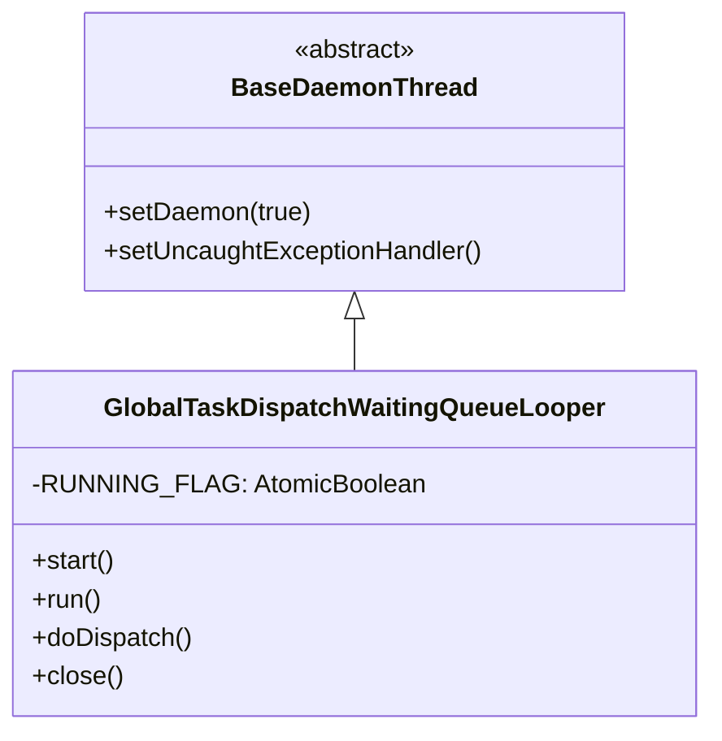

### 2.2 启动过程

```java
@Override
public synchronized void start() {
    // 使用 CAS 操作确保只启动一次
    if (!RUNNING_FLAG.compareAndSet(false, true)) {
        log.error("The GlobalTaskDispatchWaitingQueueLooper already started, will not start again");
        return;
    }
    log.info("GlobalTaskDispatchWaitingQueueLooper starting...");
    super.start();  // 调用 Thread.start() 启动线程
    log.info("GlobalTaskDispatchWaitingQueueLooper started...");
}
```

**关键点**：
- 使用 `AtomicBoolean.compareAndSet()` 确保线程只启动一次（线程安全）
- 调用 `super.start()` 启动守护线程
- 线程启动后会进入 `run()` 方法执行循环

### 2.3 运行循环

```java
@Override
public void run() {
    while (RUNNING_FLAG.get()) {
        doDispatch();
    }
}
```

循环会一直运行直到 `RUNNING_FLAG` 变为 `false`（通常在关闭时）。

## 3. 任务入队流程

任务通过以下调用链进入 `GlobalTaskDispatchWaitingQueue`：

### 3.1 完整调用链

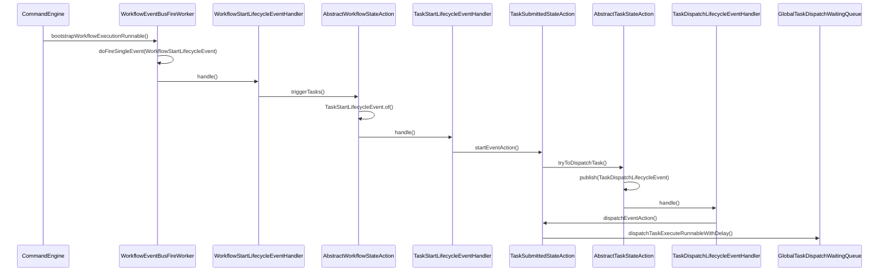

### 3.2 关键步骤详解

#### 步骤 1: 任务启动事件处理

```java
// TaskSubmittedStateAction.startEventAction()
@Override
public void startEventAction(final IWorkflowExecutionRunnable workflowExecutionRunnable,
                             final ITaskExecutionRunnable taskExecutionRunnable,
                             final TaskStartLifecycleEvent taskStartEvent) {
    // 检查工作流状态
    if (workflowExecutionRunnable.isWorkflowReadyPause()) {
        workflowExecutionRunnable.getWorkflowEventBus().publish(TaskPausedLifecycleEvent.of(taskExecutionRunnable));
        return;
    }
    
    if (workflowExecutionRunnable.isWorkflowReadyStop()) {
        workflowExecutionRunnable.getWorkflowEventBus().publish(TaskKilledLifecycleEvent.of(taskExecutionRunnable));
        return;
    }
    
    // 尝试分发任务
    tryToDispatchTask(taskExecutionRunnable);
}
```

#### 步骤 2: 发布分发生命周期事件

```java
// AbstractTaskStateAction.tryToDispatchTask()
protected void tryToDispatchTask(final ITaskExecutionRunnable taskExecutionRunnable) {
    // 如果需要任务组资源，先获取资源槽位
    if (isTaskNeedAcquireTaskGroupSlot(taskExecutionRunnable)) {
        acquireTaskGroupSlot(taskExecutionRunnable);
        return;
    }
    // 发布任务分发生命周期事件
    taskExecutionRunnable.getWorkflowEventBus().publish(TaskDispatchLifecycleEvent.of(taskExecutionRunnable));
}
```

#### 步骤 3: 任务入队

```java
// TaskSubmittedStateAction.dispatchEventAction()
@Override
public void dispatchEventAction(final IWorkflowExecutionRunnable workflowExecutionRunnable,
                                final ITaskExecutionRunnable taskExecutionRunnable,
                                final TaskDispatchLifecycleEvent taskDispatchEvent) {
    final TaskInstance taskInstance = taskExecutionRunnable.getTaskInstance();
    
    // 计算延迟执行时间（如果设置了延迟）
    long remainTimeMills = DateUtils.getRemainTime(
            taskInstance.getFirstSubmitTime(),
            taskInstance.getDelayTime() * 60L) * 1_000;
    
    if (remainTimeMills > 0) {
        taskInstance.setState(TaskExecutionStatus.DELAY_EXECUTION);
        taskInstanceDao.updateById(taskInstance);
    }
    
    // 添加到全局任务等待队列
    globalTaskDispatchWaitingQueue.dispatchTaskExecuteRunnableWithDelay(taskExecutionRunnable, remainTimeMills);
}
```

## 4. 队列机制详解

### 4.1 队列结构

`GlobalTaskDispatchWaitingQueue` 使用优先级延迟队列来管理待分发的任务：

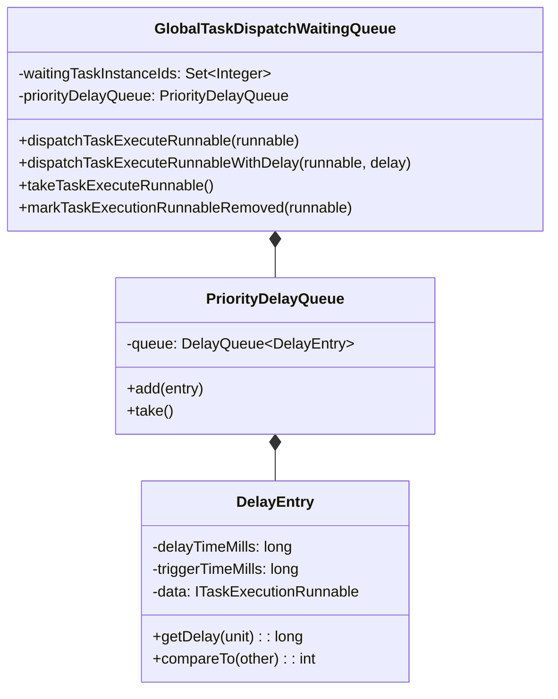

### 4.2 DelayEntry 延迟机制

```java
public class DelayEntry<V extends Comparable<V>> implements Delayed {
    private final long delayTimeMills;
    private final long triggerTimeMills;  // 触发时间 = 当前时间 + 延迟时间
    
    public DelayEntry(long delayTimeMills, V data) {
        this.delayTimeMills = delayTimeMills;
        this.triggerTimeMills = System.currentTimeMillis() + delayTimeMills;
        this.data = data;
    }
    
    @Override
    public long getDelay(TimeUnit unit) {
        long remainTimeMills = triggerTimeMills - System.currentTimeMillis();
        return unit.convert(remainTimeMills, TimeUnit.MILLISECONDS);
    }
    
    @Override
    public int compareTo(Delayed o) {
        // 先比较延迟时间，再比较数据本身
        DelayEntry<V> other = (DelayEntry<V>) o;
        int delayCompare = Long.compare(delayTimeMills, other.delayTimeMills);
        if (delayCompare != 0) {
            return delayCompare;
        }
        return data.compareTo(other.data);
    }
}
```

**特性**：
- `DelayQueue` 只有在延迟时间到达后，`take()` 方法才会返回该元素
- 支持优先级排序：先按延迟时间，再按任务本身的可比较属性
- 线程安全：`DelayQueue` 内部使用 `ReentrantLock` 保证线程安全

### 4.3 队列操作

#### 入队操作

```java
public synchronized void dispatchTaskExecuteRunnableWithDelay(
        ITaskExecutionRunnable taskExecutionRunnable,
        long delayTimeMills) {
    // 记录任务 ID 到 Set 中，用于去重和状态跟踪
    waitingTaskInstanceIds.add(taskExecutionRunnable.getTaskInstance().getId());
    // 添加到延迟队列
    priorityDelayQueue.add(new DelayEntry<>(delayTimeMills, taskExecutionRunnable));
}
```

#### 出队操作

```java
@SneakyThrows
public ITaskExecutionRunnable takeTaskExecuteRunnable() {
    // DelayQueue.take() 会阻塞直到有可用的元素（延迟时间到期）
    ITaskExecutionRunnable taskExecutionRunnable = priorityDelayQueue.take().getData();
    
    // 双重检查：确保任务 ID 从 Set 中移除成功
    // 如果移除失败（可能是并发操作导致），继续取下一个任务
    while (!markTaskExecutionRunnableRemoved(taskExecutionRunnable)) {
        taskExecutionRunnable = priorityDelayQueue.take().getData();
    }
    return taskExecutionRunnable;
}
```

**设计考虑**：
- `waitingTaskInstanceIds` Set 用于快速查找和去重
- 双重检查确保任务被正确标记为已移除，避免重复处理

## 5. 任务分发流程

### 5.1 分发流程图

#### 5.1.1 完整分发流程（物理任务）

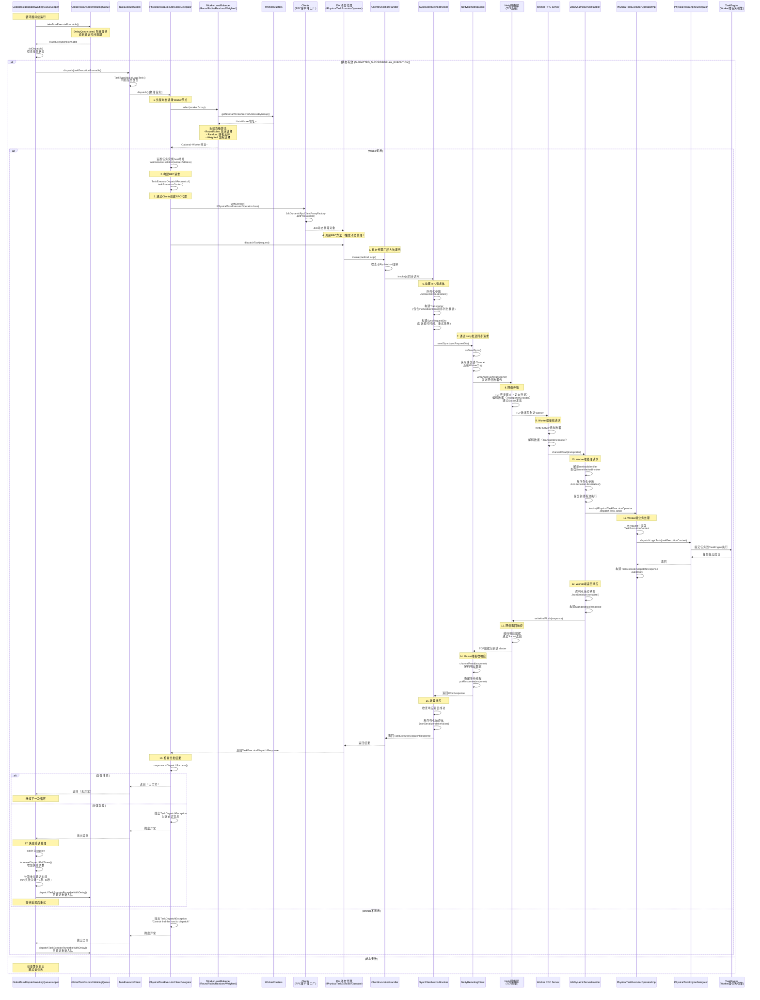

#### 5.1.2 RPC通信详细流程

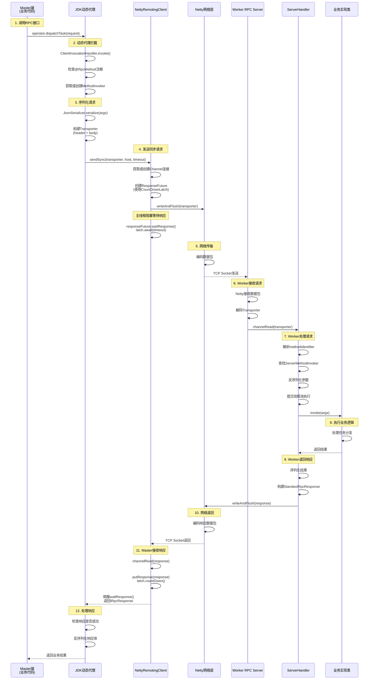

#### 5.1.3 逻辑任务分发流程（简化版）

逻辑任务的流程与物理任务类似，主要区别在于：

1. **不需要负载均衡**：直接使用Master地址
2. **使用不同的接口**：`ILogicTaskExecutorOperator` 而不是 `IPhysicalTaskExecutorOperator`
3. **本地执行**：逻辑任务在Master节点本地执行，不涉及远程Worker

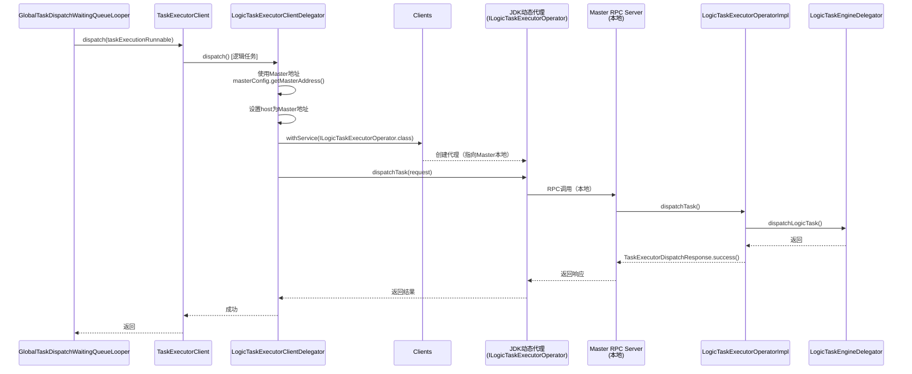

#### 5.1.4 关键技术点说明

**1. 负载均衡选择Worker节点**

Master通过`IWorkerLoadBalancer`从Worker集群中选择一个可用的Worker节点：

- **WorkerClusters**: 维护Worker集群信息，包括Worker地址、状态、权重等
- **负载均衡算法**：
   - `RoundRobinWorkerLoadBalancer`: 轮询选择，使用`AtomicInteger`维护索引
   - `RandomWorkerLoadBalancer`: 随机选择，使用`SecureRandom`
   - `FixedWeightedRoundRobinWorkerLoadBalancer`: 固定权重加权轮询
   - `DynamicWeightedRoundRobinWorkerLoadBalancer`: 动态权重加权轮询（考虑Worker负载）
- **Worker Group**: 根据任务的`workerGroup`配置，只在对应的Worker组中选择

**2. JDK动态代理实现RPC**

Master端使用JDK动态代理来实现RPC调用：

```java
// 创建代理对象
IPhysicalTaskExecutorOperator operator = Clients
    .withService(IPhysicalTaskExecutorOperator.class)
    .withHost(workerAddress);

// 调用方法（实际会触发动态代理）
operator.dispatchTask(request);
```

- `Clients.withService()`: 创建代理工厂，返回`JdkDynamicRpcClientProxyBuilder`
- `withHost()`: 指定Worker地址，创建JDK动态代理对象
- 方法调用时，`ClientInvocationHandler`会拦截，通过`SyncClientMethodInvoker`发送RPC请求

**3. Netty网络通信**

- **客户端（Master）**：
   - `NettyRemotingClient`: 管理到Worker的TCP连接
   - 使用同步RPC模式：`sendSync()`会阻塞等待响应
   - 通过`CountDownLatch`实现同步等待：发送请求后阻塞，收到响应后唤醒
- **服务端（Worker）**：
   - `NettyRemotingServer`: 监听RPC请求
   - `JdkDynamicServerHandler`: 处理请求，通过`ServerMethodInvoker`调用业务方法
   - 使用线程池异步处理请求，避免阻塞网络线程

**4. 序列化和反序列化**

- 使用JSON序列化：`JsonSerializer.serialize()` / `deserialize()`
- 请求数据包装在`Transporter`中，包含：
   - `TransporterHeader`: 方法标识符（methodIdentifier）
   - Body: 序列化后的请求参数
- 响应数据包装在`StandardRpcResponse`中，包含：
   - `success`: 是否成功
   - `body`: 序列化后的响应数据
   - `message`: 错误信息（如果失败）

**5. 同步RPC调用流程**

同步RPC调用使用`CountDownLatch`实现阻塞等待，确保调用方能够同步获取返回结果：

1. **发送阶段**：
   - 构建`Transporter`（包含方法标识和序列化参数）
   - 创建`ResponseFuture`，初始化`CountDownLatch(1)`
   - 通过Netty的`writeAndFlush()`异步发送数据包
   - 注册发送完成监听器：
     - 发送成功：仅设置`sendOk = true`，不唤醒等待线程
     - 发送失败：调用`putResponse(null)`，唤醒等待线程并返回错误

2. **等待阶段**：
   - 主线程调用`responseFuture.waitResponse(timeout)`
   - 执行`latch.await(timeout)`阻塞等待响应
   - 线程阻塞直到：
     - 收到Worker响应（`latch.countDown()`被调用）
     - 超时（`await`返回false）
     - 发送失败（提前唤醒）

3. **接收响应阶段**（Worker端）：
   - Netty接收数据包并解码
   - `JdkDynamicServerHandler`处理请求：
     - 解析方法标识符，查找对应的`ServerMethodInvoker`
     - 反序列化请求参数
     - 提交到线程池异步执行业务方法
     - 获取方法执行结果并序列化
   - 构建`StandardRpcResponse`并通过Netty返回

4. **处理响应阶段**（Master端）：
   - Netty接收响应数据包并解码
   - `NettyClientHandler.channelRead()`被调用
   - 调用`putResponse(response)`
   - 执行`latch.countDown()`唤醒等待的线程
   - `waitResponse()`返回，获取响应结果

5. **异常处理**：
   - **超时**：`waitResponse()`超时返回，抛出`RemoteException`
   - **发送失败**：监听器捕获异常，提前唤醒等待线程
   - **Worker执行失败**：响应中的`success=false`，抛出`MethodInvocationException`
   - **网络异常**：捕获连接异常，根据重试策略决定是否重试

6. **重试机制**：
   - RPC调用支持重试策略（通过`@RpcMethod(retry=...)`配置）
   - 重试条件：异常类型匹配`retryFor()`中配置的异常类型
   - 重试次数：不超过`maxRetryTimes()`
   - 重试间隔：`retryInterval()`毫秒后重试

**关键设计点**：
- **异步发送，同步等待**：网络发送是异步的（不阻塞主线程），但等待响应是同步的（阻塞直到收到响应）
- **线程安全**：使用`CountDownLatch`的线程安全特性，无论发送成功/失败的监听器先执行还是`waitResponse()`先执行，都能正确处理
- **超时保护**：所有RPC调用都有超时时间，避免无限等待
- **连接复用**：`NettyRemotingClient`会维护到各个Worker的TCP连接，复用连接减少开销


### 5.2 核心分发方法

```java
void doDispatch() {
    // 1. 从队列中取出任务（阻塞等待）
    final ITaskExecutionRunnable taskExecutionRunnable = 
        globalTaskDispatchWaitingQueue.takeTaskExecuteRunnable();
    final TaskInstance taskInstance = taskExecutionRunnable.getTaskInstance();
    
    try {
        // 2. 检查任务状态
        final TaskExecutionStatus status = taskInstance.getState();
        if (status != TaskExecutionStatus.SUBMITTED_SUCCESS && 
            status != TaskExecutionStatus.DELAY_EXECUTION) {
            log.warn("The TaskInstance {} state is : {}, will not dispatch", 
                     taskInstance.getName(), status);
            return;
        }
        
        // 3. 分发任务到 Worker
        taskExecutorClient.dispatch(taskExecutionRunnable);
        
    } catch (Exception e) {
        // 4. 分发失败，重新入队（带延迟）
        long waitingTimeMills = Math.min(
            taskExecutionRunnable.getTaskExecutionContext()
                .increaseDispatchFailTimes() * 1_000L, 
            60_000L);  // 最大延迟 60 秒
        
        globalTaskDispatchWaitingQueue.dispatchTaskExecuteRunnableWithDelay(
            taskExecutionRunnable, waitingTimeMills);
        
        log.error("Dispatch Task: {} failed will retry after: {}/ms", 
                  taskInstance.getName(), waitingTimeMills, e);
    }
}
```

### 5.3 任务类型分发

`TaskExecutorClient` 根据任务类型选择不同的分发策略：

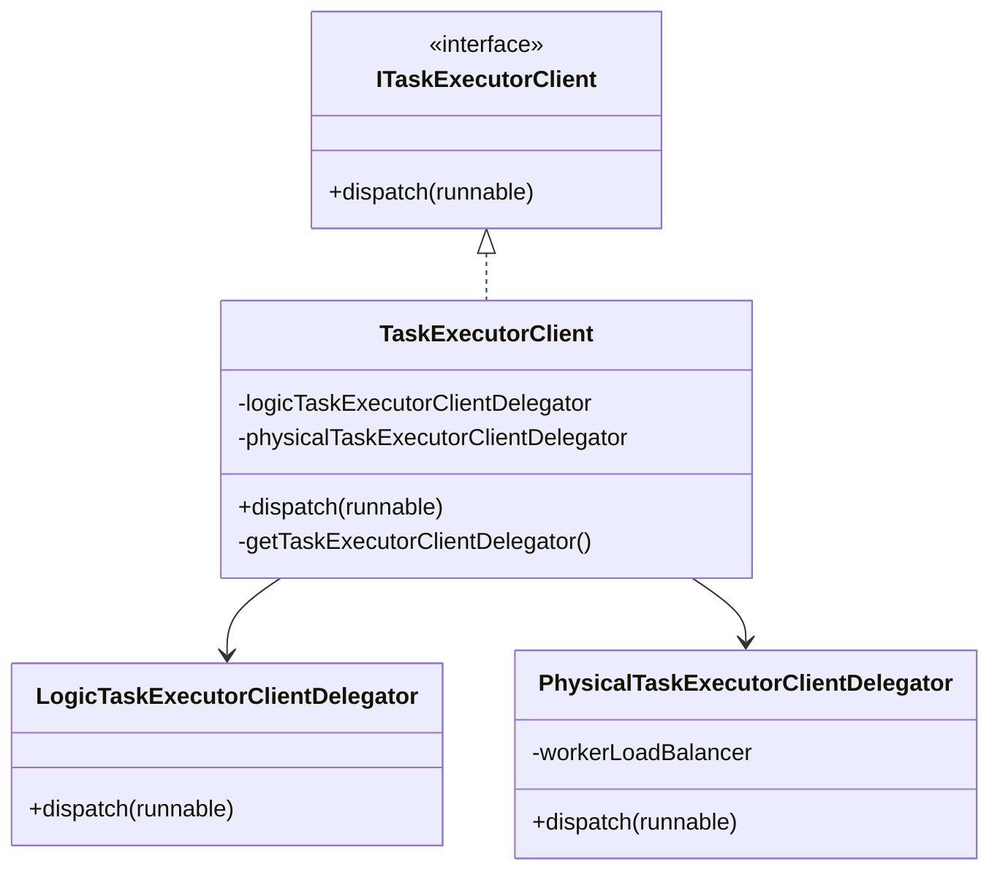

#### 物理任务分发 (PhysicalTaskExecutorClientDelegator)

物理任务是指需要在 Worker 节点上执行的任务（如 Shell、Python、Spark 等）：

```java
@Override
public void dispatch(final ITaskExecutionRunnable taskExecutionRunnable) {
    final TaskExecutionContext taskExecutionContext = taskExecutionRunnable.getTaskExecutionContext();
    final String taskName = taskExecutionContext.getTaskName();
    
    // 1. 使用负载均衡器选择 Worker 节点
    final String physicalTaskExecutorAddress = workerLoadBalancer
        .select(taskExecutionContext.getWorkerGroup())
        .map(Host::of)
        .map(Host::getAddress)
        .orElseThrow(() -> new TaskDispatchException(
            String.format("Cannot find the host to dispatch Task[id=%s, name=%s, workerGroup=%s]",
                taskExecutionContext.getTaskInstanceId(), taskName,
                taskExecutionContext.getWorkerGroup())));
    
    // 2. 设置任务执行主机地址
    taskExecutionContext.setHost(physicalTaskExecutorAddress);
    taskExecutionRunnable.getTaskInstance().setHost(physicalTaskExecutorAddress);
    
    try {
        // 3. 通过 RPC 调用 Worker 节点分发任务
        final TaskExecutorDispatchResponse taskExecutorDispatchResponse = Clients
            .withService(IPhysicalTaskExecutorOperator.class)
            .withHost(physicalTaskExecutorAddress)
            .dispatchTask(TaskExecutorDispatchRequest.of(taskExecutionContext));
        
        // 4. 检查分发结果
        if (!taskExecutorDispatchResponse.isDispatchSuccess()) {
            throw new TaskDispatchException(
                "Dispatch task: " + taskName + " to " + physicalTaskExecutorAddress + " failed: "
                    + taskExecutorDispatchResponse);
        }
    } catch (TaskDispatchException e) {
        throw e;
    } catch (Exception e) {
        throw new TaskDispatchException(
            "Dispatch task: " + taskName + " to " + physicalTaskExecutorAddress + " failed", e);
    }
}
```

**关键步骤**：
1. 根据 Worker Group 使用负载均衡器选择 Worker 节点
2. 设置任务实例的主机地址
3. 通过 RPC 调用 `IPhysicalTaskExecutorOperator.dispatchTask()` 发送任务
4. 检查响应结果，失败则抛出异常

#### 逻辑任务分发 (LogicTaskExecutorClientDelegator)

逻辑任务是指在 Master 节点上执行的任务（如条件分支、子工作流等）：

```java
@Override
public void dispatch(final ITaskExecutionRunnable taskExecutionRunnable) {
    // 1. 逻辑任务使用 Master 地址作为执行节点
    final String logicTaskExecutorAddress = masterConfig.getMasterAddress();
    final TaskExecutionContext taskExecutionContext = taskExecutionRunnable.getTaskExecutionContext();
    
    // 2. 设置任务执行主机地址为 Master
    taskExecutionContext.setHost(logicTaskExecutorAddress);
    taskExecutionRunnable.getTaskInstance().setHost(logicTaskExecutorAddress);
    
    // 3. 通过 RPC 调用 Master 的逻辑任务执行器
    final TaskExecutorDispatchResponse logicTaskDispatchResponse = Clients
        .withService(ILogicTaskExecutorOperator.class)
        .withHost(logicTaskExecutorAddress)
        .dispatchTask(TaskExecutorDispatchRequest.of(taskExecutionContext));
    
    // 4. 检查分发结果
    if (!logicTaskDispatchResponse.isDispatchSuccess()) {
        throw new TaskDispatchException(
            String.format("Dispatch LogicTask to %s failed, response is: %s",
                taskExecutionContext.getHost(), logicTaskDispatchResponse));
    }
}
```

**关键特点**：
- 逻辑任务直接在 Master 节点执行，不需要 Worker 节点
- 使用 `ILogicTaskExecutorOperator` 接口进行分发
- 不需要负载均衡，直接使用 Master 地址

### 5.4 任务分发失败重试机制

当任务分发失败时，系统会实现指数退避的重试机制：

```java
// 在 doDispatch() 的 catch 块中
catch (Exception e) {
    // 增加失败次数，并计算重试延迟时间
    long waitingTimeMills = Math.min(
        taskExecutionRunnable.getTaskExecutionContext()
            .increaseDispatchFailTimes() * 1_000L,  // 失败次数 * 1秒
        60_000L);  // 最大延迟 60 秒
    
    // 重新入队，等待指定时间后重试
    globalTaskDispatchWaitingQueue.dispatchTaskExecuteRunnableWithDelay(
        taskExecutionRunnable, waitingTimeMills);
    
    log.error("Dispatch Task: {} failed will retry after: {}/ms", 
              taskInstance.getName(), waitingTimeMills, e);
}
```

**重试策略**：
- 第 1 次失败：延迟 1 秒后重试
- 第 2 次失败：延迟 2 秒后重试
- 第 3 次失败：延迟 3 秒后重试
- ...
- 最大延迟：60 秒（即使失败次数更多）

这样可以避免在 Worker 节点暂时不可用时频繁重试导致系统负载过高。

## 6. Worker 执行任务详细流程

任务通过RPC调用到达Worker节点后，Worker会经过一系列组件处理最终执行任务。本节详细描述从接收RPC请求到任务执行完成的完整流程。

### 6.1 Worker执行任务详细流程

#### 6.1.1 完整执行流程时序图

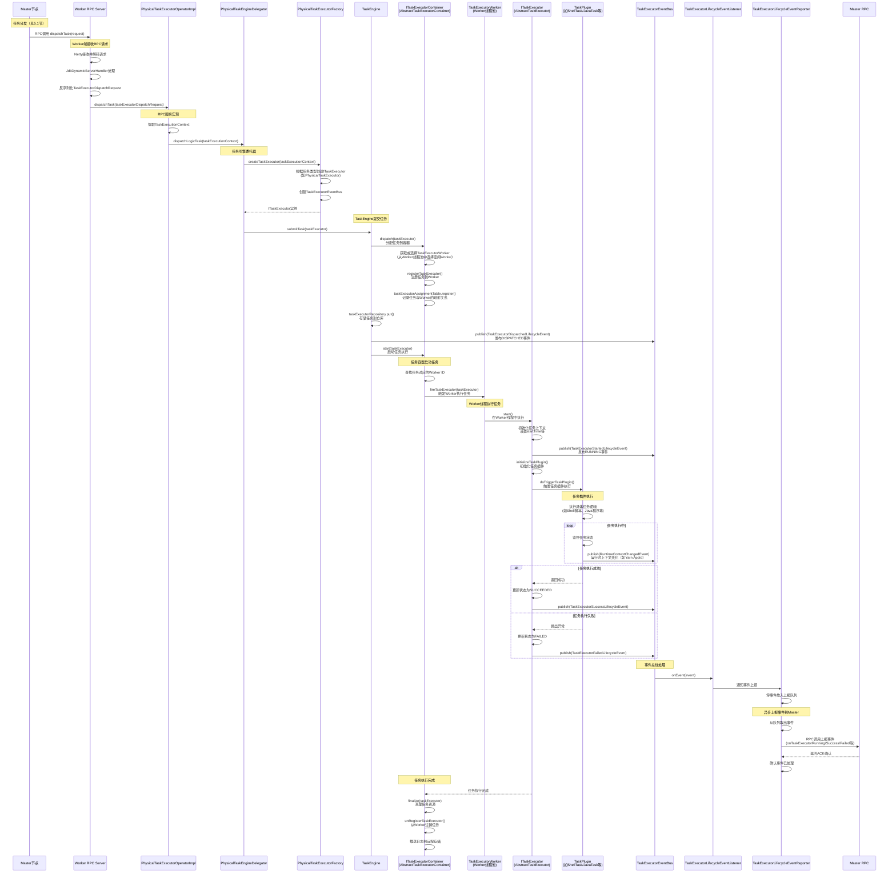

#### 6.1.2 核心组件类关系图

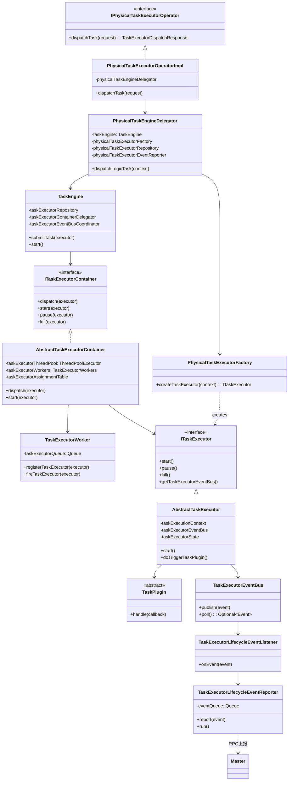

#### 6.1.3 Worker端架构图

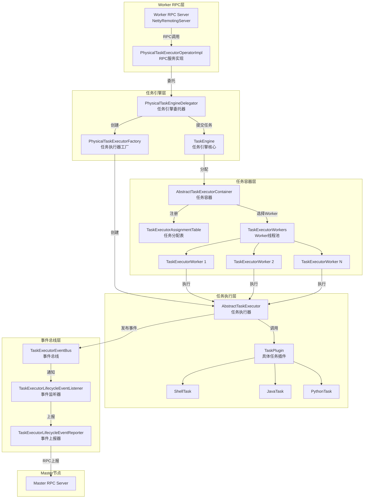

#### 6.1.4 关键调用链

**完整调用路径**：

```
PhysicalTaskExecutorOperatorImpl.dispatchTask()
  └─> PhysicalTaskEngineDelegator.dispatchLogicTask()
      └─> PhysicalTaskExecutorFactory.createTaskExecutor()
          └─> 创建ITaskExecutor实例（如PhysicalTaskExecutor）
              └─> 创建TaskExecutorEventBus
      
      └─> TaskEngine.submitTask()
          ├─> ITaskExecutorContainer.dispatch()
          │   └─> AbstractTaskExecutorContainer.dispatch()
          │       ├─> getTaskExecutorWorkerCandidate()
          │       │   └─> 从TaskExecutorWorkers中选择空闲Worker
          │       ├─> TaskExecutorWorker.registerTaskExecutor()
          │       └─> TaskExecutorAssignmentTable.register()
          │
          ├─> TaskExecutorRepository.put()
          │
          ├─> TaskExecutorEventBus.publish(DISPATCHED)
          │
          └─> ITaskExecutorContainer.start()
              └─> AbstractTaskExecutorContainer.start()
                  └─> TaskExecutorWorker.fireTaskExecutor()
                      └─> ITaskExecutor.start() [在Worker线程中执行]
                          └─> AbstractTaskExecutor.start()
                              ├─> initializeTaskContext()
                              ├─> publishTaskRunningEvent()
                              │   └─> TaskExecutorEventBus.publish(RUNNING)
                              ├─> initializeTaskPlugin()
                              └─> doTriggerTaskPlugin()
                                  └─> TaskPlugin.handle()
                                      └─> 具体任务逻辑执行
                                          ├─> ShellTask: 执行Shell脚本
                                          ├─> JavaTask: 执行Java程序
                                          ├─> PythonTask: 执行Python脚本
                                          └─> 其他任务类型...
```

#### 6.1.5 关键组件说明

**1. PhysicalTaskExecutorOperatorImpl（RPC服务实现）**
- 实现`IPhysicalTaskExecutorOperator`接口，接收Master的RPC调用
- 提取`TaskExecutionContext`并委托给`PhysicalTaskEngineDelegator`处理
- 返回`TaskExecutorDispatchResponse`表示分发是否成功

**2. PhysicalTaskEngineDelegator（任务引擎委托器）**
- 管理`TaskEngine`实例
- 使用`PhysicalTaskExecutorFactory`创建任务执行器
- 将任务提交到`TaskEngine`执行

**3. TaskEngine（任务引擎核心）**
- 管理任务生命周期：提交、启动、暂停、杀死
- 维护任务仓库（`TaskExecutorRepository`）
- 管理任务容器（`ITaskExecutorContainer`）
- 协调事件总线（`TaskExecutorEventBusCoordinator`）

**4. AbstractTaskExecutorContainer（任务容器）**
- 管理Worker线程池：维护多个`TaskExecutorWorker`实例
- 任务分配：通过`TaskExecutorAssignmentTable`记录任务与Worker的映射关系
- 资源管理：确保每个Worker线程只执行一个任务（独占线程模式）

**5. TaskExecutorWorker（Worker线程）**
- 每个Worker是一个独立的线程，负责执行分配给它的任务
- 维护任务队列：每个Worker有自己的任务队列
- 执行任务：从队列中取出任务并调用`ITaskExecutor.start()`执行

**6. AbstractTaskExecutor（任务执行器）**
- 任务执行的抽象基类，定义了任务执行的标准流程
- 任务状态管理：维护任务状态（INITIALIZED、RUNNING、SUCCEEDED、FAILED等）
- 事件发布：通过`TaskExecutorEventBus`发布生命周期事件

**7. TaskPlugin（任务插件）**
- 具体任务类型的实现（如ShellTask、JavaTask、PythonTask等）
- 执行任务的实际逻辑：调用系统命令、执行脚本等
- 状态跟踪：监控任务执行状态并上报

**8. TaskExecutorEventBus（事件总线）**
- 管理任务生命周期事件的发布和订阅
- 事件类型：DISPATCHED、RUNNING、SUCCEEDED、FAILED、KILLED、PAUSED等
- 事件流转：事件发布后由`TaskExecutorLifecycleEventListener`监听处理

**9. TaskExecutorLifecycleEventReporter（事件上报器）**
- 监听任务生命周期事件
- 异步上报：将事件放入队列，由后台线程异步上报到Master
- RPC调用：通过RPC接口上报事件，等待Master的ACK确认

#### 6.1.6 任务执行关键流程

**1. 任务提交阶段**
- Master通过RPC调用`dispatchTask()`，Worker接收请求
- 创建`ITaskExecutor`实例，包含任务执行所需的所有上下文信息
- 将任务提交到`TaskEngine`

**2. 任务分配阶段**
- `TaskEngine`将任务分配给`ITaskExecutorContainer`
- Container从Worker线程池中选择一个空闲的`TaskExecutorWorker`
- 将任务注册到选中的Worker，并记录映射关系

**3. 任务启动阶段**
- Container调用Worker的`fireTaskExecutor()`方法触发任务执行
- Worker在线程中调用`ITaskExecutor.start()`
- 任务执行器初始化上下文、发布RUNNING事件、初始化任务插件

**4. 任务执行阶段**
- 调用任务插件的`handle()`方法执行具体任务逻辑
- 任务插件根据类型执行相应操作（如执行Shell脚本、运行Java程序等）
- 执行过程中可能会发布`RuntimeContextChangedEvent`事件（如Yarn Application ID）

**5. 任务完成阶段**
- 任务执行成功或失败后，更新任务状态
- 发布`TaskExecutorSuccessLifecycleEvent`或`TaskExecutorFailedLifecycleEvent`
- 事件通过事件总线流转，最终由`TaskExecutorLifecycleEventReporter`上报到Master

**6. 资源清理阶段**
- Container调用`finalize()`方法清理任务资源
- 从Worker注销任务，释放线程资源
- 推送任务日志到远程存储（如S3、HDFS等）

#### 6.1.7 线程模型

**Worker线程池模型**：
- 每个`TaskExecutorContainer`维护一个固定大小的线程池（`taskExecutorThreadPool`）
- 每个线程对应一个`TaskExecutorWorker`，独占执行一个任务
- 任务分配采用"一对一"模式：一个任务对应一个Worker线程，确保任务隔离

**事件处理线程模型**：
- 事件发布是同步的，但不会阻塞任务执行
- 事件上报是异步的，由`TaskExecutorLifecycleEventReporter`的后台线程处理
- RPC上报使用同步调用，等待Master的ACK确认

## 6.2 Worker 执行结果回调流程

任务分发到 Worker 节点后，Worker 会执行任务并通过事件总线报告执行状态：

### 6.2.1 执行结果回调时序图

#### 6.2.1.1 完整回调流程（以任务成功为例）

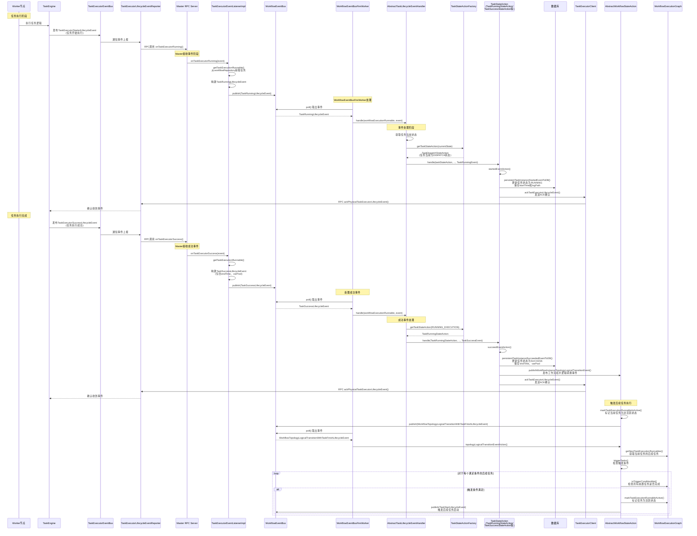

#### 6.2.1.2 关键步骤说明

**1. Worker端事件上报**
- Worker执行任务时，TaskEngine会通过`TaskExecutorEventBus`发布生命周期事件
- `TaskExecutorLifecycleEventReporter`负责将事件通过RPC上报到Master
- 支持的事件类型：RUNNING、SUCCESS、FAILED、KILLED、PAUSED、RUNTIME_CONTEXT_CHANGED等

**2. Master端RPC接收**
- `TaskExecutorEventListenerImpl`实现`ITaskExecutorEventListener`接口，接收Worker的RPC调用
- 根据事件类型调用对应方法：`onTaskExecutorRunning()`、`onTaskExecutorSuccess()`等
- 通过`workflowRepository.get(workflowInstanceId)`获取工作流实例
- 从工作流实例的`WorkflowExecutionGraph`中获取对应的`ITaskExecutionRunnable`
- 构建Master内部的`TaskLifecycleEvent`（如`TaskRunningLifecycleEvent`、`TaskSuccessLifecycleEvent`）
- 发布到`WorkflowEventBus`进行异步处理

**3. WorkflowEventBusFireWorker处理**
- `WorkflowEventBusFireWorker`持续从`WorkflowEventBus`中取出事件
- 调用对应的事件处理器（`AbstractTaskLifecycleEventHandler`）

**4. 事件处理器处理**
- `AbstractTaskLifecycleEventHandler`根据事件类型匹配对应的处理器
- 获取任务当前状态，通过`TaskStateActionFactory`获取对应的`TaskStateAction`
- 调用`TaskStateAction`的相应方法（如`startedEventAction()`、`succeedEventAction()`）

**5. TaskStateAction执行**
- 更新任务状态到数据库（如`persistentTaskInstanceStartedEventToDB()`、`persistentTaskInstanceSucceededEventToDB()`）
- 发送ACK确认给Worker，确认已收到事件
- 对于任务完成事件，调用`publishWorkflowInstanceTopologyLogicalTransitionEvent()`触发工作流拓扑逻辑转换

**6. 触发后续任务执行**
- `AbstractWorkflowStateAction.topologyLogicalTransitionEventAction()`处理拓扑逻辑转换
- 获取当前任务的后续任务列表
- 检查每个后续任务的触发条件（所有前置任务是否完成）
- 对于满足条件的任务，发布`TaskStartLifecycleEvent`触发任务启动
- 后续任务启动后会再次进入任务入队流程（见第3节）

#### 6.2.1.3 其他事件类型的处理流程

除了SUCCESS事件，其他事件类型的处理流程类似：

- **TaskRunningEvent**: 任务开始执行时上报，更新状态为RUNNING，保存开始时间和日志路径
- **TaskFailedEvent**: 任务执行失败时上报，更新状态为FAILED，触发后续任务的条件判断（根据失败策略决定是否继续执行）
- **TaskKilledEvent**: 任务被杀死时上报，更新状态为KILLED
- **TaskPausedEvent**: 任务被暂停时上报，更新状态为PAUSED
- **TaskRuntimeContextChangedEvent**: 任务运行时上下文变化时上报（如Yarn Application ID），更新任务的appLink字段

### 6.2.2 关键生命周期事件

Worker 节点会通过 `ITaskExecutorLifecycleEventReporter` 接口报告以下任务生命周期事件给 Master：

#### 6.2.2.1 事件类型列表

| 事件类型 | Worker端事件类 | Master端事件类 | Master端Handler | 主要操作 |
|---------|--------------|--------------|----------------|---------|
| **DISPATCHED** | `TaskExecutorDispatchedLifecycleEvent` | `TaskDispatchedLifecycleEvent` | `TaskDispatchedLifecycleEventHandler` | 更新任务状态为DISPATCH，记录执行主机地址，发送ACK |
| **RUNNING** | `TaskExecutorStartedLifecycleEvent` | `TaskRunningLifecycleEvent` | `TaskRunningLifecycleEventHandler` | 更新任务状态为RUNNING，保存startTime和logPath，发送ACK |
| **RUNTIME_CONTEXT_CHANGED** | `TaskExecutorRuntimeContextChangedLifecycleEvent` | `TaskRuntimeContextChangedEvent` | `TaskRuntimeContextChangedLifecycleEventHandler` | 更新任务的appLink（如Yarn Application ID），发送ACK |
| **SUCCESS** | `TaskExecutorSuccessLifecycleEvent` | `TaskSuccessLifecycleEvent` | `TaskSuccessLifecycleEventHandler` | 更新任务状态为SUCCESS，保存endTime和varPool，触发后续任务执行，发送ACK |
| **FAILED** | `TaskExecutorFailedLifecycleEvent` | `TaskFailedLifecycleEvent` | `TaskFailedLifecycleEventHandler` | 更新任务状态为FAILED，保存endTime，根据失败策略触发后续任务或工作流失败，发送ACK |
| **KILLED** | `TaskExecutorKilledLifecycleEvent` | `TaskKilledLifecycleEvent` | `TaskKilledLifecycleEventHandler` | 更新任务状态为KILLED，保存endTime，触发后续任务的条件判断，发送ACK |
| **PAUSED** | `TaskExecutorPausedLifecycleEvent` | `TaskPausedLifecycleEvent` | `TaskPausedLifecycleEventHandler` | 更新任务状态为PAUSED，触发后续任务的条件判断，发送ACK |

#### 6.2.2.2 事件上报机制

**Worker端**：
- Worker的`TaskEngine`在执行任务过程中会通过`TaskExecutorEventBus`发布事件
- `TaskExecutorLifecycleEventReporter`监听这些事件，并通过RPC调用Master的`ITaskExecutorEventListener`接口上报
- 事件上报是异步的，Worker不会阻塞等待Master的响应

**Master端**：
- `TaskExecutorEventListenerImpl`实现`ITaskExecutorEventListener`接口，作为RPC服务端接收事件
- 接收到事件后，转换为Master内部的`TaskLifecycleEvent`，发布到`WorkflowEventBus`
- `WorkflowEventBusFireWorker`从事件总线中取出事件并分发给对应的Handler处理
- Handler处理完成后，通过`TaskExecutorClient.ackTaskExecutorLifecycleEvent()`发送ACK确认给Worker

#### 6.2.2.3 事件处理特点

1. **状态机驱动**：事件处理通过`TaskStateActionFactory`根据任务当前状态获取对应的`TaskStateAction`，实现状态机模式
2. **数据库持久化**：所有状态变更都会持久化到数据库，确保数据一致性
3. **ACK确认机制**：Master处理完事件后发送ACK给Worker，Worker可以根据ACK确认事件是否成功处理
4. **异步处理**：事件处理是异步的，不会阻塞Worker的执行
5. **工作流推进**：任务完成事件会触发工作流拓扑逻辑转换，推进后续任务的执行

## 7. 关闭流程

### 7.1 关闭机制

`GlobalTaskDispatchWaitingQueueLooper` 实现了 `AutoCloseable` 接口，支持优雅关闭：

```java
@Override
public void close() throws Exception {
    if (RUNNING_FLAG.compareAndSet(true, false)) {
        log.info("GlobalTaskDispatchWaitingQueueLooper stopping...");
        // RUNNING_FLAG 变为 false 后，run() 方法中的循环会退出
        log.info("GlobalTaskDispatchWaitingQueueLooper stopped...");
    } else {
        log.error("GlobalTaskDispatchWaitingQueueLooper is not started");
    }
}
```

**关闭流程**：
1. 使用 CAS 操作将 `RUNNING_FLAG` 设置为 `false`
2. `run()` 方法中的 `while (RUNNING_FLAG.get())` 循环会退出
3. 线程自然结束

**注意**：
- 关闭时不会立即中断正在进行的 `doDispatch()` 操作
- 如果 `doDispatch()` 正在阻塞等待队列中的任务（`takeTaskExecuteRunnable()`），需要等待任务到达或中断线程才能完全关闭

## 8. 完整架构图

### 8.1 组件交互架构

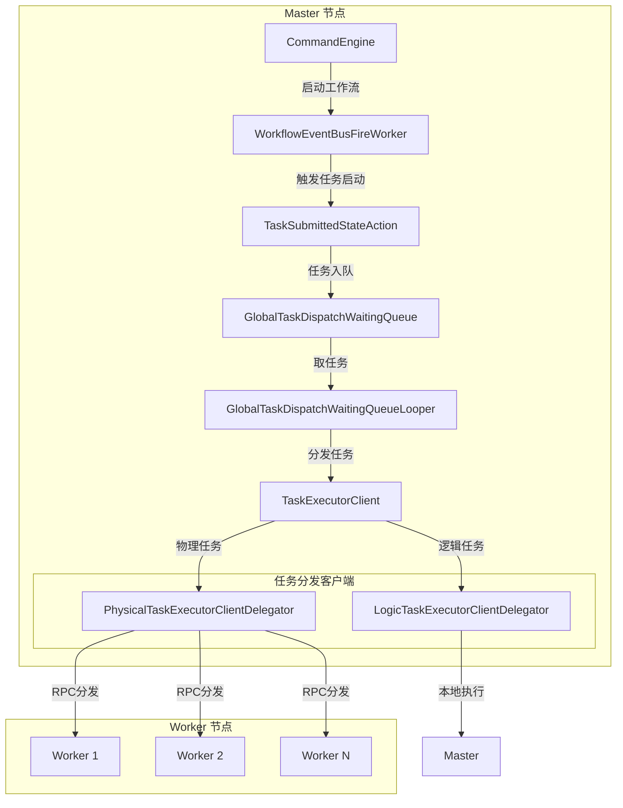

### 8.2 数据流架构

```mermaid
graph LR
    subgraph "入队阶段"
        A[任务启动事件] --> B[TaskDispatchLifecycleEvent]
        B --> C[GlobalTaskDispatchWaitingQueue]
    end
    
    subgraph "队列管理"
        C --> D[PriorityDelayQueue]
        D --> E[DelayEntry]
        E --> F[ITaskExecutionRunnable]
    end
    
    subgraph "出队分发"
        F --> G[GlobalTaskDispatchWaitingQueueLooper]
        G --> H[TaskExecutorClient]
        H --> I[Worker/Master]
    end
    
    subgraph "结果回调"
        I --> J[TaskExecutorLifecycleEvent]
        J --> K[Master事件处理]
    end
```

## 9. 关键设计要点

### 9.1 设计优势

1. **解耦设计**
    - 任务入队和出队解耦，通过队列缓冲任务
    - 分发逻辑和业务逻辑分离

2. **延迟执行支持**
    - 使用 `DelayQueue` 支持任务的延迟执行
    - 支持任务级别的延迟时间配置

3. **优先级支持**
    - 通过 `DelayEntry` 的 `compareTo` 方法实现优先级排序
    - 确保高优先级任务优先被分发

4. **重试机制**
    - 分发失败后自动重试
    - 指数退避策略避免系统过载

5. **线程安全**
    - 使用 `DelayQueue`（内部使用 `ReentrantLock`）保证线程安全
    - 使用 `AtomicBoolean` 控制线程启动/停止
    - `waitingTaskInstanceIds` Set 用于去重和状态跟踪

6. **资源管理**
    - 实现了 `AutoCloseable` 接口，支持优雅关闭
    - 守护线程设计，不会阻止 JVM 退出

### 9.2 注意事项

1. **阻塞等待**
    - `takeTaskExecuteRunnable()` 会阻塞等待，直到有任务到达或延迟时间到期
    - 关闭时需要确保能及时退出阻塞状态

2. **状态检查**
    - 分发前会检查任务状态，只有 `SUBMITTED_SUCCESS` 或 `DELAY_EXECUTION` 状态的任务才会被分发
    - 其他状态的任务会被跳过

3. **异常处理**
    - 分发失败会捕获异常并重新入队，不会导致循环器线程退出
    - 但需要注意异常日志，及时发现问题

4. **并发控制**
    - 使用 `synchronized` 关键字保护队列的入队和移除操作
    - `markTaskExecutionRunnableRemoved()` 使用双重检查确保任务被正确移除

## 10. 完整流程时序图

### 10.1 从任务入队到 Worker 执行完成的完整流程

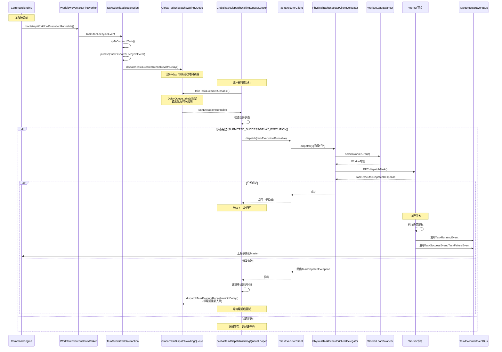

## 11. 关键代码路径

### 11.1 任务入队路径

```
CommandEngine.bootstrapWorkflowExecutionRunnable()
  └─> WorkflowEventBusFireWorker.doFireSingleEvent()
      └─> WorkflowStartLifecycleEventHandler.handle()
          └─> AbstractWorkflowStateAction.triggerTasks()
              └─> TaskStartLifecycleEventHandler.handle()
                  └─> TaskSubmittedStateAction.startEventAction()
                      └─> AbstractTaskStateAction.tryToDispatchTask()
                          └─> TaskDispatchLifecycleEventHandler.handle()
                              └─> TaskSubmittedStateAction.dispatchEventAction()
                                  └─> GlobalTaskDispatchWaitingQueue.dispatchTaskExecuteRunnableWithDelay()
```

### 11.2 任务出队分发路径

```
GlobalTaskDispatchWaitingQueueLooper.run()
  └─> GlobalTaskDispatchWaitingQueueLooper.doDispatch()
      └─> GlobalTaskDispatchWaitingQueue.takeTaskExecuteRunnable()
          └─> PriorityDelayQueue.take()
              └─> DelayQueue.take() [阻塞直到延迟到期]
      
      └─> TaskExecutorClient.dispatch()
          └─> TaskExecutorClient.getTaskExecutorClientDelegator()
              ├─> PhysicalTaskExecutorClientDelegator.dispatch() [物理任务]
              │   └─> IWorkerLoadBalancer.select()
              │   └─> IPhysicalTaskExecutorOperator.dispatchTask() [RPC]
              └─> LogicTaskExecutorClientDelegator.dispatch() [逻辑任务]
                  └─> ILogicTaskExecutorOperator.dispatchTask() [RPC]
```

### 11.3 重试路径

```
doDispatch() catch Exception
  └─> TaskExecutionContext.increaseDispatchFailTimes()
  └─> 计算重试延迟时间: min(失败次数 * 1秒, 60秒)
  └─> GlobalTaskDispatchWaitingQueue.dispatchTaskExecuteRunnableWithDelay()
      └─> PriorityDelayQueue.add(new DelayEntry(delayTime, runnable))
          └─> DelayQueue.put() [重新入队，等待延迟后重试]
```

## 12. 性能考虑

### 12.1 队列性能

- **DelayQueue 特性**：使用堆结构维护延迟队列，入队和出队的时间复杂度为 O(log n)
- **阻塞特性**：`take()` 方法会阻塞直到有可用元素，避免空转消耗 CPU
- **内存占用**：队列中存储的是任务对象的引用，内存占用相对较小

### 12.2 并发性能

- **单线程循环**：`GlobalTaskDispatchWaitingQueueLooper` 使用单线程循环分发，避免并发分发带来的状态管理复杂性
- **队列线程安全**：`DelayQueue` 内部使用 `ReentrantLock` 保证线程安全
- **Set 去重**：使用 `ConcurrentHashMap.newKeySet()` 实现线程安全的去重和状态跟踪

### 12.3 分发性能

- **同步 RPC**：任务分发使用同步 RPC 调用，确保分发结果可立即获知
- **负载均衡**：物理任务使用负载均衡器选择 Worker，分散任务到不同节点
- **失败重试**：使用指数退避策略，避免在 Worker 不可用时频繁重试

## 13. 监控与调试

### 13.1 关键指标

可以通过以下方式监控 `GlobalTaskDispatchWaitingQueueLooper` 的运行状态：

1. **队列大小**：`GlobalTaskDispatchWaitingQueue.getWaitingDispatchTaskNumber()` 获取等待分发的任务数量
2. **线程状态**：检查 `GlobalTaskDispatchWaitingQueueLooper` 线程的运行状态
3. **分发日志**：关注分发成功/失败的日志输出

### 13.2 常见问题

1. **任务长时间未分发**
   - 检查队列中是否有任务堆积
   - 检查任务状态是否符合分发条件
   - 检查 Worker 节点是否可用

2. **分发频繁失败**
   - 检查 Worker 节点状态和网络连接
   - 检查 Worker 负载是否过高
   - 查看详细异常日志定位问题

3. **队列堆积**
   - 检查是否有任务持续分发失败导致重试
   - 检查 Worker 节点容量是否足够
   - 考虑增加 Worker 节点数量

## 14. 总结

`GlobalTaskDispatchWaitingQueueLooper` 作为 DolphinScheduler Master 的核心组件，承担着全局任务分发的重要职责。它通过以下机制实现了高效、可靠的任务分发：

1. **队列缓冲**：使用优先级延迟队列缓冲待分发任务，支持延迟执行和优先级排序
2. **循环分发**：守护线程持续循环，从队列中取出任务并分发
3. **智能重试**：分发失败后使用指数退避策略重新入队（延迟时间 = min(失败次数 * 1秒, 60秒)）
4. **类型区分**：根据任务类型选择物理任务或逻辑任务的分发策略
5. **线程安全**：通过多种并发控制机制（DelayQueue、AtomicBoolean、synchronized）保证线程安全
6. **状态检查**：分发前检查任务状态，确保只分发符合条件 tasks
7. **优雅关闭**：实现 `AutoCloseable` 接口，支持优雅关闭

### 14.1 核心设计模式

- **生产者-消费者模式**：任务入队为生产者，循环器为消费者
- **策略模式**：根据任务类型选择不同的分发策略（物理任务 vs 逻辑任务）
- **模板方法模式**：`BaseDaemonThread` 定义线程模板，子类实现具体逻辑

### 14.2 与其他组件的协作

- **CommandEngine**：触发工作流执行，产生任务
- **WorkflowEventBusFireWorker**：事件驱动机制，触发任务启动
- **TaskStateAction**：状态机管理任务状态转换
- **TaskExecutorClient**：实际执行任务分发到 Worker
- **WorkerLoadBalancer**：负载均衡选择 Worker 节点

整个流程实现了从任务创建到 Worker 执行的完整链路，是 DolphinScheduler 任务调度系统的关键组成部分。