# 逻辑任务引擎委托者详细分析

## 1. 概述

`LogicTaskEngineDelegator` 是 DolphinScheduler Master 中负责逻辑任务执行的核心组件，它作为逻辑任务引擎的委托者，管理逻辑任务的生命周期（提交、执行、暂停、杀死等）。逻辑任务是指那些在 Master 节点本地执行的任务，不需要分发到 Worker 节点。

### 1.1 核心职责

- **任务提交**：将逻辑任务提交到 TaskEngine 执行
- **任务控制**：支持暂停、杀死逻辑任务
- **生命周期管理**：管理逻辑任务执行引擎的启动和关闭
- **事件处理**：接收和确认任务执行生命周期事件

### 1.2 逻辑任务 vs 物理任务

**逻辑任务（Logic Task）**：
- 在 Master 节点本地执行
- 不需要 Worker 节点的资源
- 任务类型包括：SUB_WORKFLOW（子工作流）、DEPENDENT（依赖任务）、CONDITIONS（条件任务）、SWITCH（分支任务）
- 执行逻辑判断、流程控制等轻量级操作

**物理任务（Physical Task）**：
- 需要分发到 Worker 节点执行
- 占用 Worker 节点的计算资源
- 任务类型包括：SHELL、SQL、SPARK、PYTHON、MR 等
- 执行具体的计算任务

### 1.3 类结构

```java
@Slf4j
@Component
public class LogicTaskEngineDelegator implements AutoCloseable {
    
    private final TaskEngine taskEngine;                              // 任务执行引擎
    private final LogicTaskExecutorFactory logicTaskExecutorFactory;  // 逻辑任务执行器工厂
    private final LogicTaskExecutorLifecycleEventReporter logicTaskExecutorEventReporter;  // 生命周期事件上报器
    
    // 启动引擎
    public void start()
    
    // 分发逻辑任务
    public void dispatchLogicTask(final TaskExecutionContext taskExecutionContext)
    
    // 杀死逻辑任务
    public void killLogicTask(final int taskInstanceId)
    
    // 暂停逻辑任务
    public void pauseLogicTask(final int taskInstanceId)
    
    // 确认任务执行事件
    public void ackLogicTaskExecutionEvent(final TaskExecutorLifecycleEventAck ack)
    
    // 关闭引擎
    @Override
    public void close()
}
```

## 2. 组件架构

### 2.1 类图

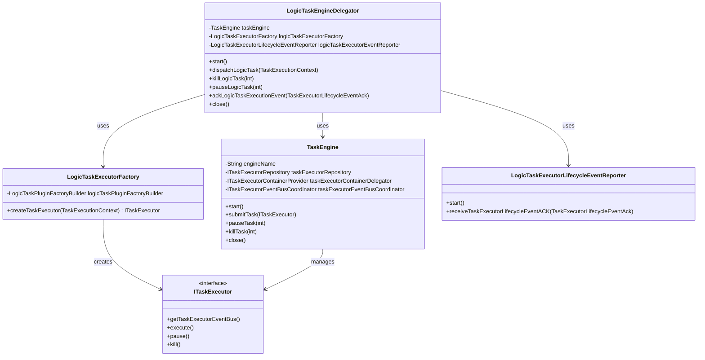

### 2.2 组件关系图

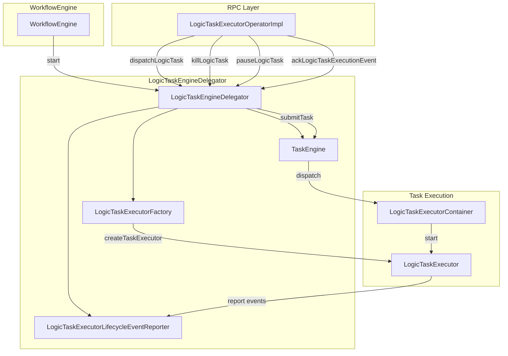

## 3. 启动流程

### 3.1 启动机制

`LogicTaskEngineDelegator` 在 `WorkflowEngine.start()` 方法的最后阶段启动，启动顺序如下：

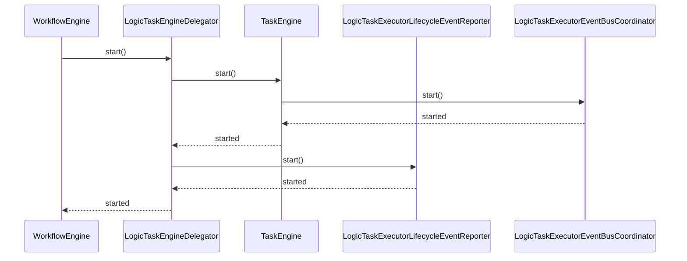

### 3.2 启动代码分析

```java
public void start() {
    taskEngine.start();                              // 1. 启动任务执行引擎
    logicTaskExecutorEventReporter.start();         // 2. 启动生命周期事件上报器
    log.info("LogicTaskEngineDelegator started");
}
```

**启动步骤详解**：

1. **TaskEngine.start()**
    - 启动 `TaskExecutorEventBusCoordinator`（任务执行器事件总线协调器）
    - 创建事件处理线程，用于处理任务执行过程中的生命周期事件

2. **LogicTaskExecutorLifecycleEventReporter.start()**
    - 启动事件上报线程
    - 该线程负责将任务执行的生命周期事件上报给 Master
    - 使用队列机制缓存待上报的事件，异步上报

### 3.3 为什么最后启动？

根据 `WorkflowEngine.start()` 的注释，`LogicTaskEngineDelegator` 之所以最后启动，是因为：

1. 它依赖于 `GlobalTaskDispatchWaitingQueueLooper`
2. 当任务分发到 `LogicTaskExecutorClientDelegator` 时，会调用 `LogicTaskEngineDelegator.dispatchLogicTask()`
3. 需要先启动任务分发循环器，确保逻辑任务可以正常分发和执行

**启动顺序**：
```
WorkflowEventBusCoordinator → CommandEngine → GlobalTaskDispatchWaitingQueueLooper → LogicTaskEngineDelegator
```

## 4. 核心方法详解

### 4.1 dispatchLogicTask - 分发逻辑任务

#### 4.1.1 方法签名

```java
public void dispatchLogicTask(final TaskExecutionContext taskExecutionContext)
```

#### 4.1.2 方法实现

```java
public void dispatchLogicTask(final TaskExecutionContext taskExecutionContext) {
    final ITaskExecutor taskExecutor = logicTaskExecutorFactory.createTaskExecutor(taskExecutionContext);
    taskEngine.submitTask(taskExecutor);
}
```

#### 4.1.3 执行流程

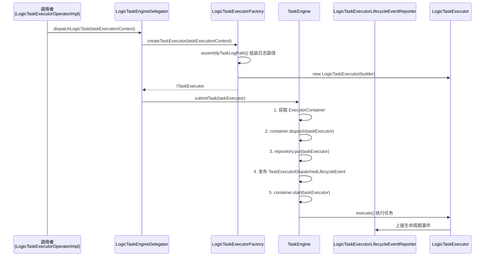

#### 4.1.4 关键步骤说明

1. **创建任务执行器**
    - `LogicTaskExecutorFactory.createTaskExecutor()` 根据 `TaskExecutionContext` 创建对应的 `ITaskExecutor` 实例
    - 组装任务的日志路径
    - 创建 `LogicTaskExecutor` 实例

2. **提交任务到引擎**
    - `TaskEngine.submitTask()` 将任务执行器提交到执行引擎
    - 引擎内部会：
        - 获取任务执行容器（ExecutorContainer）
        - 将任务分发到容器
        - 将任务存入仓库（Repository）以便后续查找
        - 发布任务已分发事件
        - 启动任务执行

### 4.2 killLogicTask - 杀死逻辑任务

#### 4.2.1 方法签名

```java
public void killLogicTask(final int taskInstanceId)
```

#### 4.2.2 方法实现

```java
public void killLogicTask(final int taskInstanceId) {
    taskEngine.killTask(taskInstanceId);
}
```

#### 4.2.3 执行流程

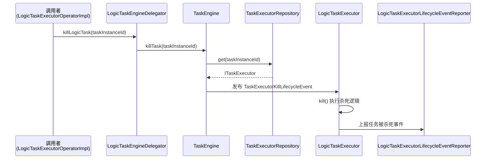

#### 4.2.4 关键步骤说明

1. **查找任务执行器**
    - `TaskEngine.killTask()` 从仓库中查找对应的任务执行器
    - 如果找不到，抛出 `TaskExecutorNotFoundException`

2. **发布杀死事件**
    - 通过任务执行器的事件总线发布 `TaskExecutorKillLifecycleEvent`
    - 任务执行器监听该事件，执行具体的杀死逻辑

3. **任务执行器响应**
    - `LogicTaskExecutor` 接收到杀死事件后，中断任务执行
    - 上报任务被杀死的事件给 Master

### 4.3 pauseLogicTask - 暂停逻辑任务

#### 4.3.1 方法签名

```java
public void pauseLogicTask(final int taskInstanceId)
```

#### 4.3.2 方法实现

```java
public void pauseLogicTask(final int taskInstanceId) {
    taskEngine.pauseTask(taskInstanceId);
}
```

#### 4.3.3 执行流程

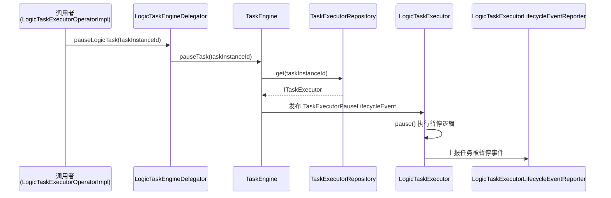

暂停任务的流程与杀死任务类似，只是发布的是 `TaskExecutorPauseLifecycleEvent` 事件。

### 4.4 ackLogicTaskExecutionEvent - 确认任务执行事件

#### 4.4.1 方法签名

```java
public void ackLogicTaskExecutionEvent(final ITaskExecutorLifecycleEventReporter.TaskExecutorLifecycleEventAck taskExecutorLifecycleEventAck)
```

#### 4.4.2 方法实现

```java
public void ackLogicTaskExecutionEvent(final ITaskExecutorLifecycleEventReporter.TaskExecutorLifecycleEventAck taskExecutorLifecycleEventAck) {
    logicTaskExecutorEventReporter.receiveTaskExecutorLifecycleEventACK(taskExecutorLifecycleEventAck);
}
```

#### 4.4.3 执行流程

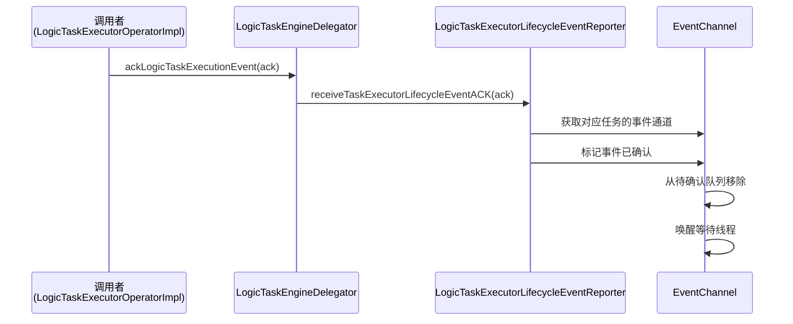

#### 4.4.4 关键步骤说明

1. **事件确认机制**
    - 当任务执行器上报生命周期事件后，Master 需要确认收到该事件
    - 确认后，事件上报器会从待确认队列中移除该事件
    - 这样可以确保事件上报的可靠性

2. **重试机制**
    - 如果事件长时间未确认，事件上报器会重试上报
    - 重试间隔默认为 3 分钟

### 4.5 close - 关闭引擎

#### 4.5.1 方法实现

```java
@Override
public void close() {
    try (
            final TaskEngine ignore1 = taskEngine;
            final LogicTaskExecutorLifecycleEventReporter ignore2 = logicTaskExecutorEventReporter) {
        log.info("LogicTaskEngineDelegator closed");
    }
}
```

#### 4.5.2 关闭流程

使用了 try-with-resources 语法，确保 `TaskEngine` 和 `LogicTaskExecutorLifecycleEventReporter` 都能正确关闭：

1. **TaskEngine.close()**
    - 关闭 `TaskExecutorEventBusCoordinator`
    - 停止事件处理线程

2. **LogicTaskExecutorLifecycleEventReporter.close()**
    - 停止事件上报线程
    - 清理事件通道

## 5. 调用链分析

### 5.1 任务分发调用链

逻辑任务的分发涉及多个组件协作：

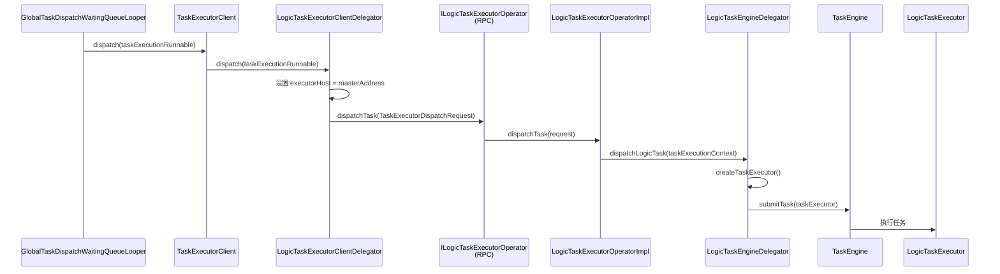

### 5.2 任务控制调用链（杀死/暂停）

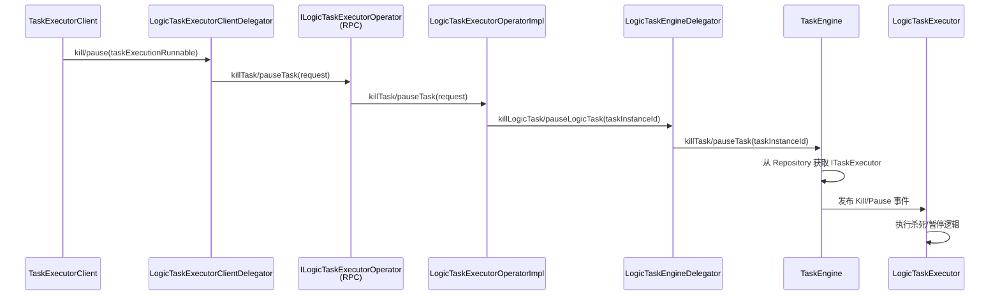

### 5.3 事件确认调用链

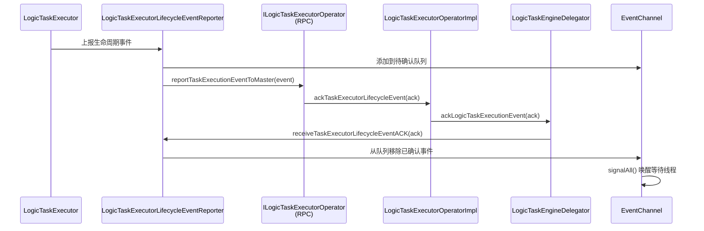

### 5.4 完整任务执行生命周期

从任务分发到完成的完整流程：

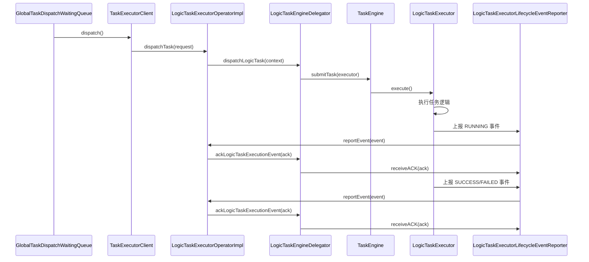

## 6. 事件流转机制

### 6.1 事件类型

逻辑任务执行过程中涉及以下生命周期事件：

1. **TaskExecutorDispatchedLifecycleEvent**：任务已分发到执行容器
2. **TaskExecutorRunningLifecycleEvent**：任务开始执行
3. **TaskExecutorSuccessLifecycleEvent**：任务执行成功
4. **TaskExecutorFailedLifecycleEvent**：任务执行失败
5. **TaskExecutorPauseLifecycleEvent**：任务被暂停
6. **TaskExecutorKillLifecycleEvent**：任务被杀死

### 6.2 事件上报流程

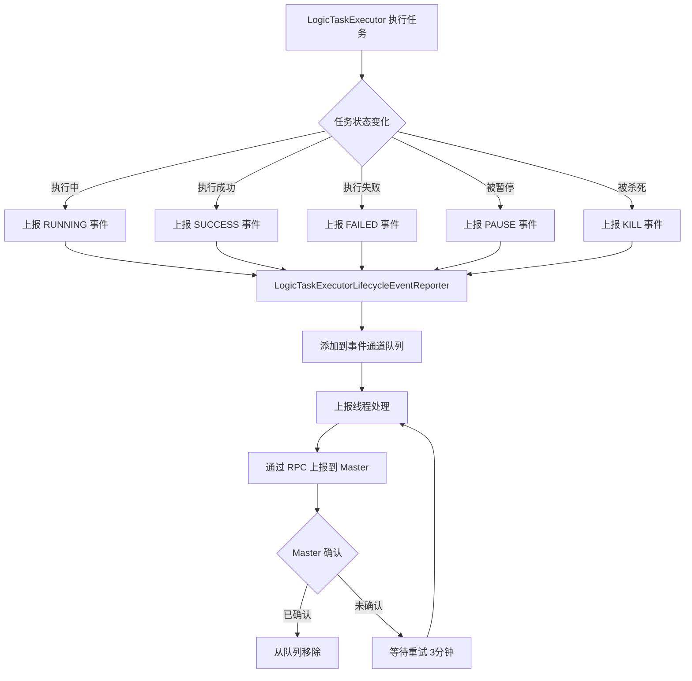

### 6.3 事件确认机制

**确认流程**：

1. **事件上报**：`LogicTaskExecutor` 执行任务时，状态变化触发事件上报
2. **事件缓存**：事件被添加到对应任务的事件通道（EventChannel）队列
3. **异步上报**：事件上报线程定期从队列中取出事件，通过 RPC 上报给 Master
4. **Master 确认**：Master 收到事件后，调用 `ackLogicTaskExecutionEvent()` 确认
5. **事件移除**：确认后，事件从待确认队列中移除
6. **重试机制**：如果事件长时间未确认（超过 3 分钟），会重新上报

**关键代码**：

```java
// 事件上报器接收确认
public void receiveTaskExecutorLifecycleEventACK(final TaskExecutorLifecycleEventAck eventAck) {
    final int taskExecutorId = eventAck.getTaskExecutorId();
    eventChannelsLock.lock();
    try {
        final ReportableTaskExecutorLifecycleEventChannel eventChannel = eventChannels.get(taskExecutorId);
        if (eventChannel == null) {
            return;
        }
        // 从队列移除已确认的事件
        final IReportableTaskExecutorLifecycleEvent removed =
                eventChannel.remove(eventAck.getTaskExecutorLifecycleEventType());
        if (removed != null) {
            log.info("Success removed {} by ack: {}", removed, eventAck);
        }
        // 如果通道为空，清理资源
        if (eventChannel.isEmpty()) {
            eventChannels.remove(taskExecutorId);
        }
        taskExecutionEventEmptyCondition.signalAll();
    } finally {
        eventChannelsLock.unlock();
    }
}
```

## 7. 与其他组件的关系

### 7.1 在 WorkflowEngine 中的位置

`LogicTaskEngineDelegator` 是 `WorkflowEngine` 的最后一个启动组件：

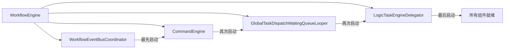

### 7.2 与任务分发器的协作

逻辑任务通过以下路径分发：

1. **GlobalTaskDispatchWaitingQueueLooper**：从全局等待队列取出任务
2. **TaskExecutorClient**：根据任务类型选择合适的客户端委托者
3. **LogicTaskExecutorClientDelegator**：判断为逻辑任务，设置 executorHost 为 Master 地址
4. **RPC 调用**：通过 `ILogicTaskExecutorOperator.dispatchTask()` 调用
5. **LogicTaskExecutorOperatorImpl**：RPC 服务实现，调用 `LogicTaskEngineDelegator`
6. **LogicTaskEngineDelegator**：创建并提交任务到 TaskEngine 执行

### 7.3 与物理任务执行器的对比

| 特性 | LogicTaskEngineDelegator | PhysicalTaskEngineDelegator |
|------|-------------------------|----------------------------|
| 执行位置 | Master 节点本地 | Worker 节点 |
| 任务类型 | SUB_WORKFLOW, DEPENDENT, CONDITIONS, SWITCH | SHELL, SQL, SPARK, PYTHON, MR 等 |
| 资源需求 | 低，主要是 CPU 和内存 | 高，需要 Worker 节点资源 |
| 网络通信 | 本地方法调用 | RPC 远程调用 |
| 适用场景 | 流程控制、逻辑判断 | 数据计算、脚本执行 |

## 8. 关键设计模式

### 8.1 委托模式（Delegation Pattern）

`LogicTaskEngineDelegator` 作为委托者，将任务执行的具体逻辑委托给 `TaskEngine`：

```java
public void dispatchLogicTask(final TaskExecutionContext taskExecutionContext) {
    final ITaskExecutor taskExecutor = logicTaskExecutorFactory.createTaskExecutor(taskExecutionContext);
    taskEngine.submitTask(taskExecutor);  // 委托给 TaskEngine
}
```

### 8.2 工厂模式（Factory Pattern）

使用 `LogicTaskExecutorFactory` 创建不同类型的任务执行器：

```java
public ITaskExecutor createTaskExecutor(final TaskExecutionContext taskExecutionContext) {
    // 根据 taskExecutionContext 创建对应的 LogicTaskExecutor
    return new LogicTaskExecutor(logicTaskExecutorBuilder);
}
```

### 8.3 观察者模式（Observer Pattern）

通过事件总线机制，任务执行器发布生命周期事件，事件监听器响应事件：

```java
// 发布事件
taskExecutor.getTaskExecutorEventBus().publish(TaskExecutorKillLifecycleEvent.of(taskExecutor));

// 监听事件
taskExecutorEventBusCoordinator.subscribe(eventType, eventListener);
```

### 8.4 资源管理模式（Resource Management Pattern）

使用 `AutoCloseable` 接口和 try-with-resources 语法确保资源正确释放：

```java
@Override
public void close() {
    try (
            final TaskEngine ignore1 = taskEngine;
            final LogicTaskExecutorLifecycleEventReporter ignore2 = logicTaskExecutorEventReporter) {
        log.info("LogicTaskEngineDelegator closed");
    }
}
```

## 9. 异常处理

### 9.1 任务执行异常

当任务执行失败时，`LogicTaskExecutor` 会捕获异常并上报失败事件：

```java
try {
    logicTask.start();
} catch (Exception e) {
    // 上报失败事件
    reportTaskExecutionEvent(TaskExecutorFailedLifecycleEvent.of(this));
    throw e;
}
```

### 9.2 任务查找异常

当尝试杀死或暂停一个不存在的任务时，`TaskEngine` 会抛出 `TaskExecutorNotFoundException`：

```java
private ITaskExecutor getTaskExecutor(final int taskId) throws TaskExecutorNotFoundException {
    return taskExecutorRepository.get(taskId)
            .orElseThrow(() -> new TaskExecutorNotFoundException(taskId));
}
```

### 9.3 事件上报异常

事件上报失败时会记录日志，并在重试间隔后重新上报：

```java
try {
    taskExecutorEventRemoteReporterClient.reportTaskExecutionEventToMaster(headEvent);
} catch (Exception ex) {
    log.error("Send TaskExecutionEvent: {} to master error will retry after {} mills",
            headEvent, DEFAULT_TASK_EXECUTOR_EVENT_RETRY_INTERVAL, ex);
    break; // 等待重试
}
```

## 10. 性能考虑

### 10.1 异步执行

- **任务执行**：任务在独立的线程池中异步执行，不会阻塞主线程
- **事件上报**：事件上报采用异步机制，使用队列缓存，不会阻塞任务执行

### 10.2 资源管理

- **事件通道**：每个任务有独立的事件通道，事件处理互不影响
- **自动清理**：任务完成后，事件通道会自动清理，避免内存泄漏

### 10.3 线程安全

- **并发控制**：使用 `ConcurrentHashMap` 存储事件通道，支持并发访问
- **锁机制**：使用 `ReentrantLock` 保护事件通道的修改操作

## 11. 使用场景

### 11.1 子工作流任务（SUB_WORKFLOW）

当工作流中包含子工作流节点时，使用逻辑任务引擎执行：

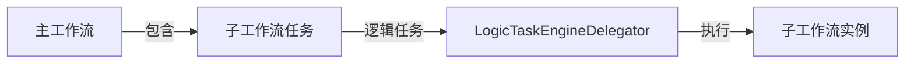

### 11.2 依赖任务（DEPENDENT）

依赖任务用于检查其他工作流或任务的执行状态：

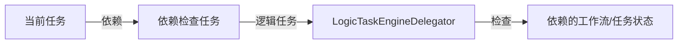

### 11.3 条件任务（CONDITIONS）

条件任务根据条件表达式判断执行哪个分支：

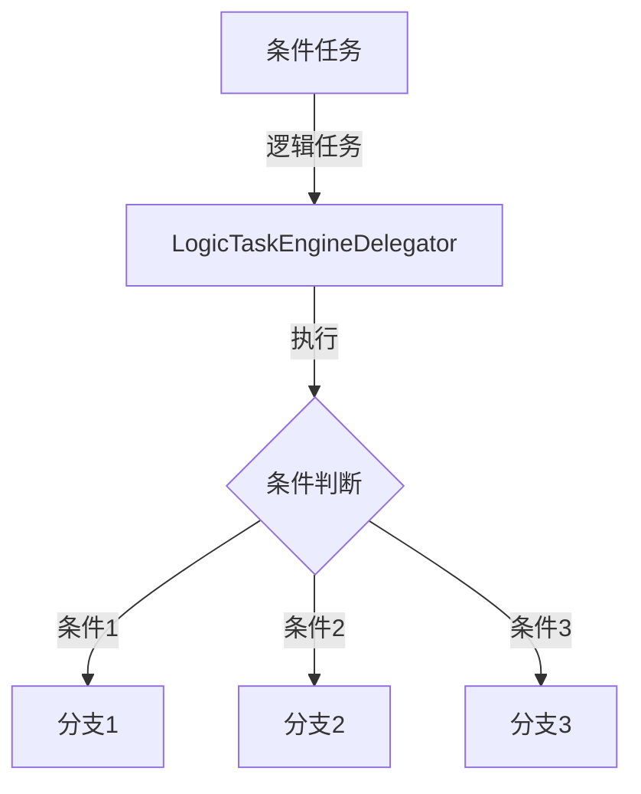

### 11.4 Switch 任务

Switch 任务类似条件任务，但支持多分支选择：

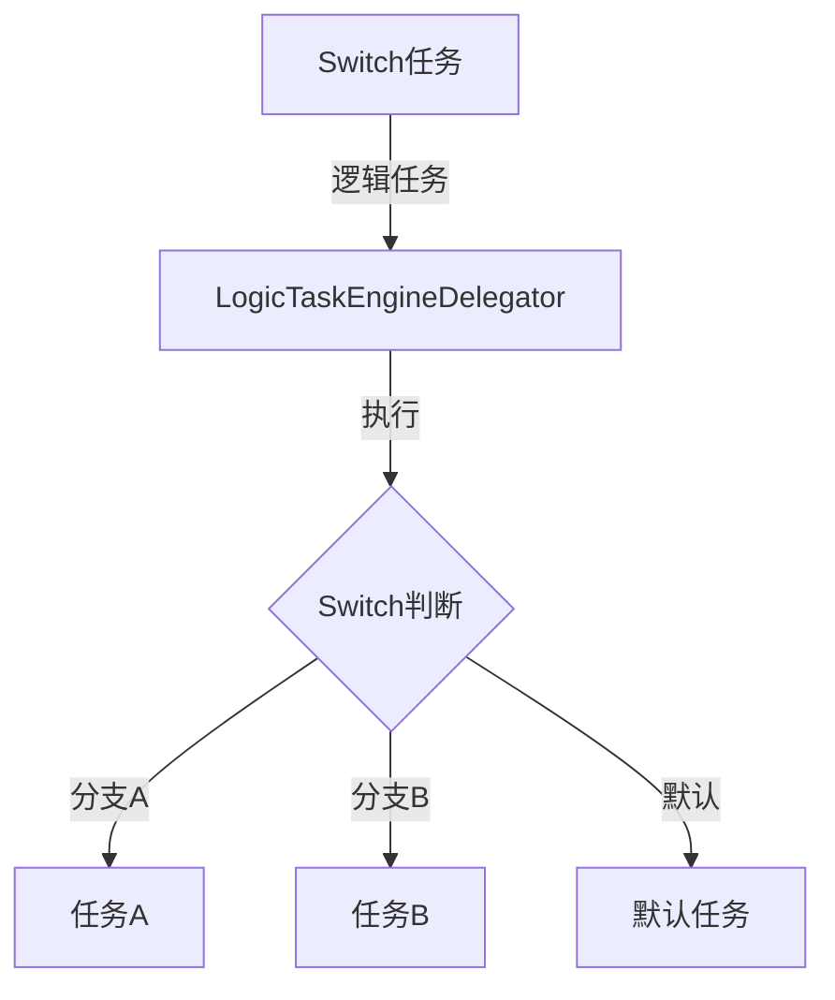

## 12. 关键代码片段

### 12.1 任务分发代码

```java
public void dispatchLogicTask(final TaskExecutionContext taskExecutionContext) {
    // 1. 创建任务执行器
    final ITaskExecutor taskExecutor = logicTaskExecutorFactory.createTaskExecutor(taskExecutionContext);
    // 2. 提交到引擎执行
    taskEngine.submitTask(taskExecutor);
}
```

### 12.2 任务控制代码

```java
// 杀死任务
public void killLogicTask(final int taskInstanceId) {
    taskEngine.killTask(taskInstanceId);
}

// 暂停任务
public void pauseLogicTask(final int taskInstanceId) {
    taskEngine.pauseTask(taskInstanceId);
}
```

### 12.3 事件确认代码

```java
public void ackLogicTaskExecutionEvent(final TaskExecutorLifecycleEventAck ack) {
    logicTaskExecutorEventReporter.receiveTaskExecutorLifecycleEventACK(ack);
}
```

## 13. 总结

### 13.1 核心要点

1. **职责明确**：`LogicTaskEngineDelegator` 作为逻辑任务执行的门面，统一管理逻辑任务的执行
2. **设计优雅**：采用委托模式，将具体执行逻辑委托给 `TaskEngine`，保持职责单一
3. **事件驱动**：通过事件总线机制实现组件间解耦，提高系统可扩展性
4. **可靠通信**：使用事件确认机制确保事件上报的可靠性

### 13.2 在系统中的作用

`LogicTaskEngineDelegator` 是 DolphinScheduler 任务执行体系中的重要组成部分：

- **执行位置**：负责在 Master 节点本地执行逻辑任务
- **任务类型**：处理流程控制类任务（子工作流、依赖、条件、分支等）
- **性能优势**：本地执行，无需网络通信，执行效率高
- **资源消耗**：轻量级任务，不占用 Worker 节点资源

### 13.3 与其他组件的协作

```
WorkflowEngine (工作流引擎)
    ├── WorkflowEventBusCoordinator (事件总线协调器)
    ├── CommandEngine (命令引擎)
    ├── GlobalTaskDispatchWaitingQueueLooper (任务分发循环器)
    └── LogicTaskEngineDelegator (逻辑任务引擎委托者) ← 本文档分析
            ├── TaskEngine (任务执行引擎)
            ├── LogicTaskExecutorFactory (任务执行器工厂)
            └── LogicTaskExecutorLifecycleEventReporter (生命周期事件上报器)
```

### 13.4 扩展性

`LogicTaskEngineDelegator` 的设计具有良好的扩展性：

- **新增任务类型**：通过实现 `ILogicTask` 接口，可以轻松添加新的逻辑任务类型
- **事件处理**：通过事件总线机制，可以方便地添加新的事件监听器
- **执行策略**：可以通过配置调整任务执行策略（线程池大小、重试策略等）

## 14. 参考文档

- [全局任务调度等待队列循环器分析](./8-3-全局任务调度等待队列循环器.md)
- [命令引擎分析](./8-2-1-命令引擎.md)
- [工作流引擎分析](../8-工作流引擎/README.md)

---

**文档版本**：v1.0  
**最后更新**：2024年  
**作者**：DolphinScheduler 社区