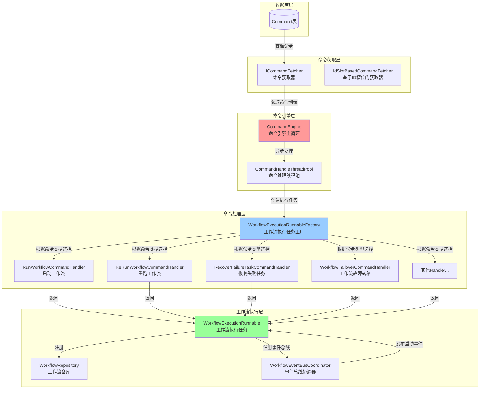
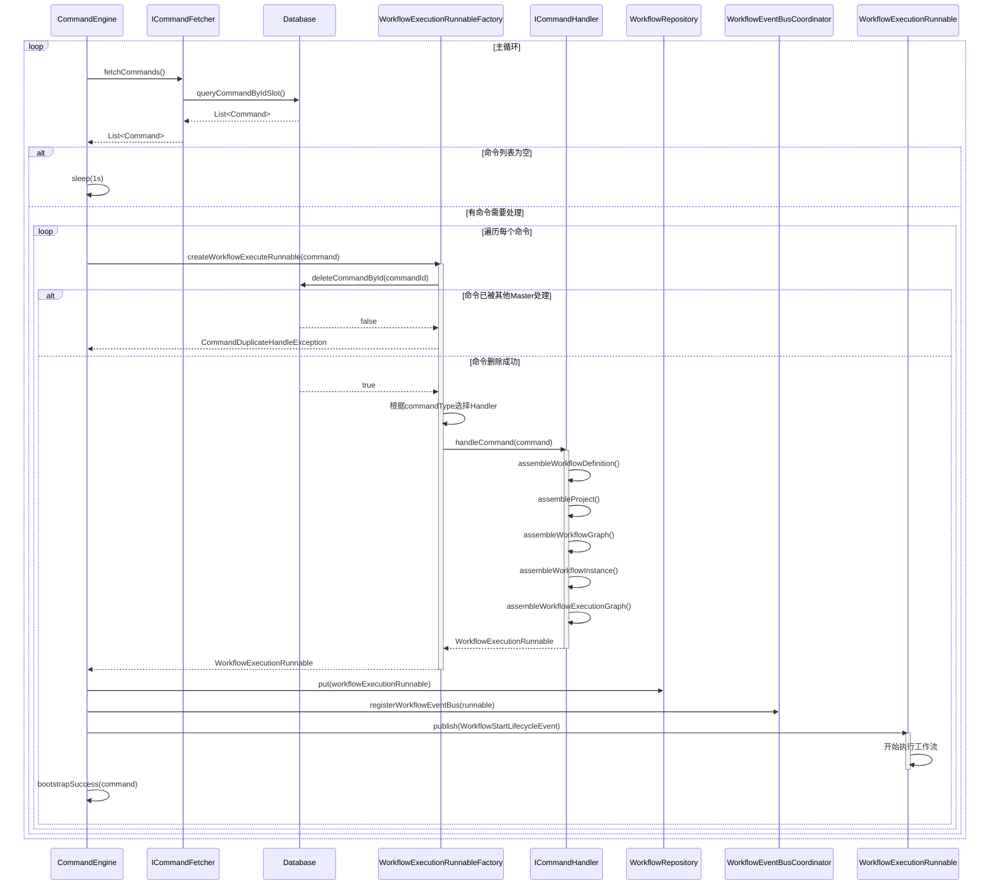
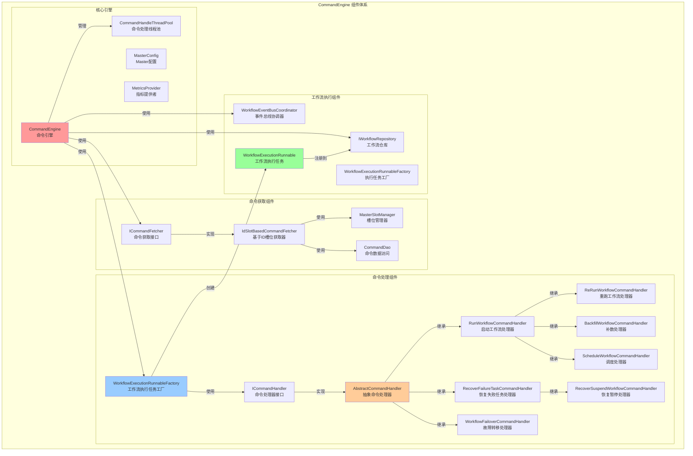
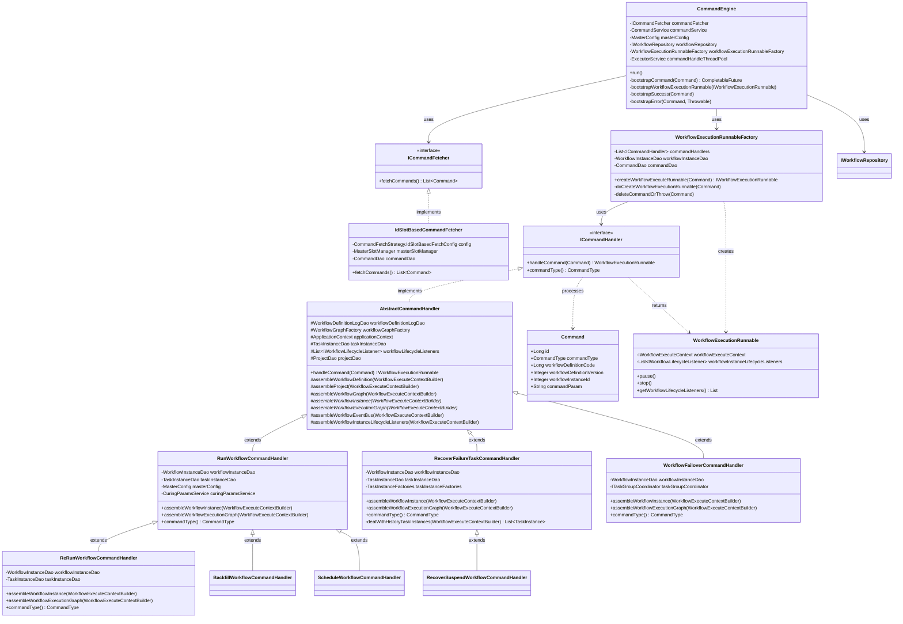
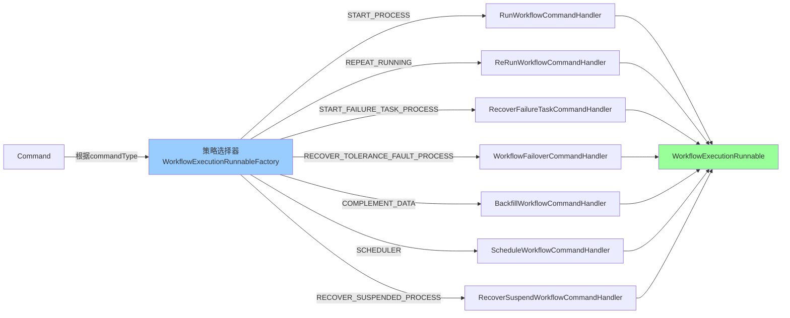
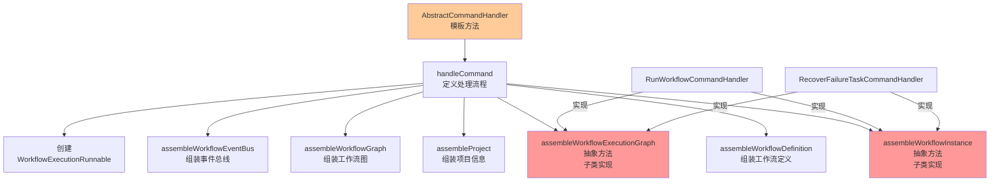
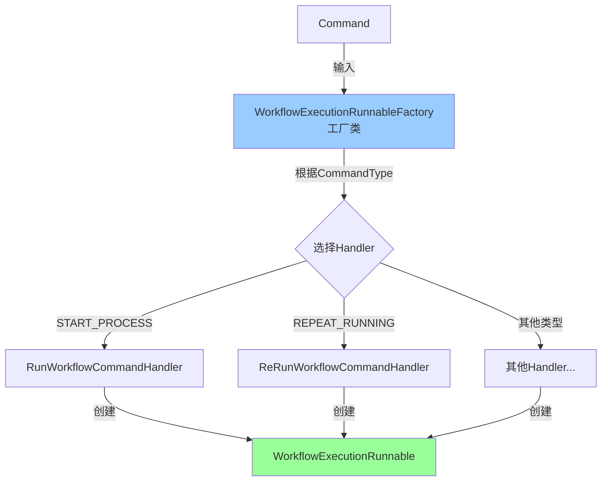

# CommandEngine 命令引擎详细分析文档

## 1. 概述

`CommandEngine` 是 Apache DolphinScheduler 中 Master 服务器的核心组件，负责从数据库消费命令（Command），并将这些命令转换为工作流执行任务（WorkflowExecutionRunnable）。它采用**命令模式（Command Pattern）**和**策略模式（Strategy Pattern）**，实现了灵活的命令处理机制。

## 2. 核心原理

### 2.1 工作原理

CommandEngine 采用**生产者-消费者模式**，工作流程如下：

1. **命令获取阶段**：通过 `ICommandFetcher` 从数据库获取待处理的命令列表
2. **命令处理阶段**：对每个命令，通过 `WorkflowExecutionRunnableFactory` 创建对应的 `WorkflowExecutionRunnable`
3. **工作流启动阶段**：将创建的工作流执行任务注册到 `WorkflowRepository`，并发布启动事件
4. **异步执行**：使用 `CompletableFuture` 实现异步并发处理多个命令

### 2.2 关键组件

- **CommandEngine**：命令引擎主循环，负责持续消费命令
- **ICommandFetcher**：命令获取器接口，负责从数据库获取命令
- **WorkflowExecutionRunnableFactory**：工作流执行任务工厂，负责根据命令类型选择合适的 Handler
- **ICommandHandler**：命令处理器接口，每种命令类型对应一个 Handler
- **AbstractCommandHandler**：抽象命令处理器，提供通用的处理模板
- **WorkflowExecutionRunnable**：工作流执行任务，封装了工作流实例的执行逻辑

## 3. 架构原理图



**原理图分析**：
- **数据流向**：从数据库的 Command 表开始，经过命令获取、处理、转换，最终生成工作流执行任务
- **分层架构**：采用清晰的分层设计，每层职责单一
- **策略选择**：工厂模式根据命令类型动态选择对应的 Handler
- **异步处理**：使用线程池实现并发处理，提高吞吐量

## 4. 时序图



**时序图分析**：
- **循环处理**：CommandEngine 在主循环中持续获取和处理命令
- **事务保证**：通过删除命令确保同一命令只被一个 Master 处理（分布式锁机制）
- **异步并发**：使用 CompletableFuture 实现多个命令的并发处理
- **事件驱动**：通过事件总线发布启动事件，触发工作流执行

## 5. 组件图



**组件图分析**：
- **核心引擎**：CommandEngine 是核心调度器，管理整个命令处理流程
- **命令获取**：通过策略模式支持不同的命令获取策略（当前主要是基于ID槽位）
- **命令处理**：采用模板方法模式和策略模式，AbstractCommandHandler 定义处理模板，具体Handler实现特定逻辑
- **继承层次**：Handler 采用继承复用，减少代码重复

## 6. 类关系图



**类关系图分析**：
- **接口抽象**：`ICommandFetcher` 和 `ICommandHandler` 定义了清晰的接口契约
- **模板方法模式**：`AbstractCommandHandler` 定义了命令处理的模板流程，子类实现特定步骤
- **继承层次**：Handler 采用继承复用，`ReRunWorkflowCommandHandler` 继承 `RunWorkflowCommandHandler` 复用启动逻辑
- **工厂模式**：`WorkflowExecutionRunnableFactory` 负责根据命令类型创建对应的 Handler
- **依赖注入**：所有组件通过 Spring 进行依赖注入，实现松耦合

## 7. ICommandHandler 设计模式分析

### 7.1 策略模式（Strategy Pattern）

`ICommandHandler` 接口及其实现类体现了**策略模式**的核心思想：



**策略模式分析**：
- **策略接口**：`ICommandHandler` 定义了统一的处理接口
- **具体策略**：每个 Handler 实现类对应一种命令类型的处理策略
- **策略选择**：`WorkflowExecutionRunnableFactory` 根据 `CommandType` 动态选择对应的 Handler
- **优势**：新增命令类型时，只需添加新的 Handler 实现，无需修改现有代码（开闭原则）

**代码示例**：
```java
// WorkflowExecutionRunnableFactory 中的策略选择逻辑
final ICommandHandler commandHandler = commandHandlers
    .stream()
    .filter(c -> c.commandType() == commandType)
    .findFirst()
    .orElseThrow(() -> new IllegalArgumentException(
        "Cannot find ICommandHandler for commandType: " + commandType));
```

### 7.2 模板方法模式（Template Method Pattern）

`AbstractCommandHandler` 体现了**模板方法模式**的核心思想：



**模板方法模式分析**：
- **模板类**：`AbstractCommandHandler` 定义了命令处理的固定流程
- **模板方法**：`handleCommand()` 方法定义了处理步骤的顺序
- **钩子方法**：`assembleWorkflowInstance()` 和 `assembleWorkflowExecutionGraph()` 是抽象方法，由子类实现特定逻辑
- **优势**：保证了所有 Handler 都遵循相同的处理流程，同时允许子类定制特定步骤

**代码示例**：
```java
// AbstractCommandHandler 中的模板方法
@Override
public WorkflowExecutionRunnable handleCommand(final Command command) {
    final WorkflowExecuteContextBuilder builder = WorkflowExecuteContext.builder()
            .withCommand(command);
    
    // 固定流程步骤
    assembleWorkflowDefinition(builder);
    assembleProject(builder);
    assembleWorkflowGraph(builder);
    assembleWorkflowInstance(builder);  // 抽象方法，子类实现
    assembleWorkflowInstanceLifecycleListeners(builder);
    assembleWorkflowEventBus(builder);
    assembleWorkflowExecutionGraph(builder);  // 抽象方法，子类实现
    
    return new WorkflowExecutionRunnable(builder.build());
}
```

### 7.3 工厂模式（Factory Pattern）

`WorkflowExecutionRunnableFactory` 体现了**工厂模式**的核心思想：



**工厂模式分析**：
- **工厂类**：`WorkflowExecutionRunnableFactory` 负责创建 `WorkflowExecutionRunnable`
- **产品创建**：根据 `CommandType` 选择合适的 Handler，由 Handler 创建产品
- **封装创建逻辑**：将复杂的创建逻辑封装在工厂中，客户端无需了解创建细节
- **事务保证**：在创建前先删除命令，确保分布式环境下的唯一性

**代码示例**：
```java
@Transactional
public IWorkflowExecutionRunnable createWorkflowExecuteRunnable(Command command) {
    // 1. 先删除命令，确保唯一性（分布式锁）
    deleteCommandOrThrow(command);
    // 2. 根据命令类型选择 Handler
    return doCreateWorkflowExecutionRunnable(command);
}
```

### 7.4 命令模式（Command Pattern）

整个 CommandEngine 体系体现了**命令模式**的核心思想：

```m
  