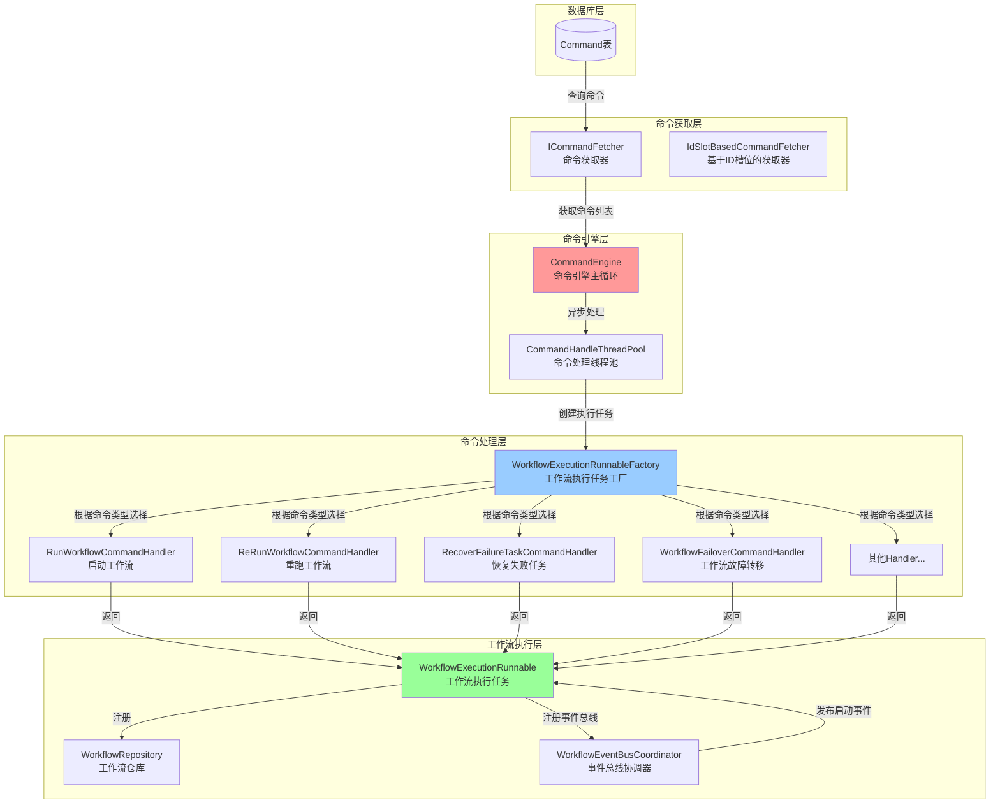
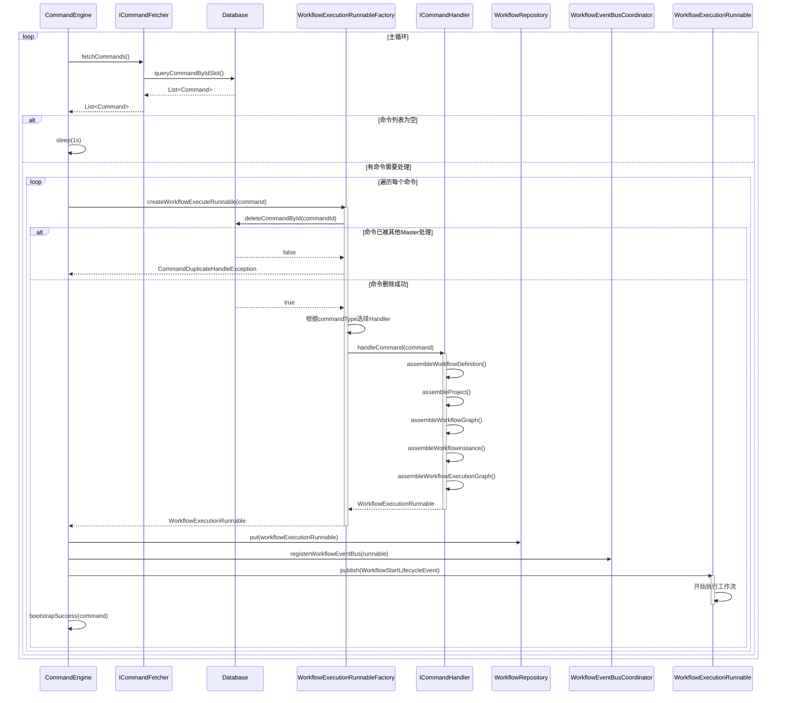
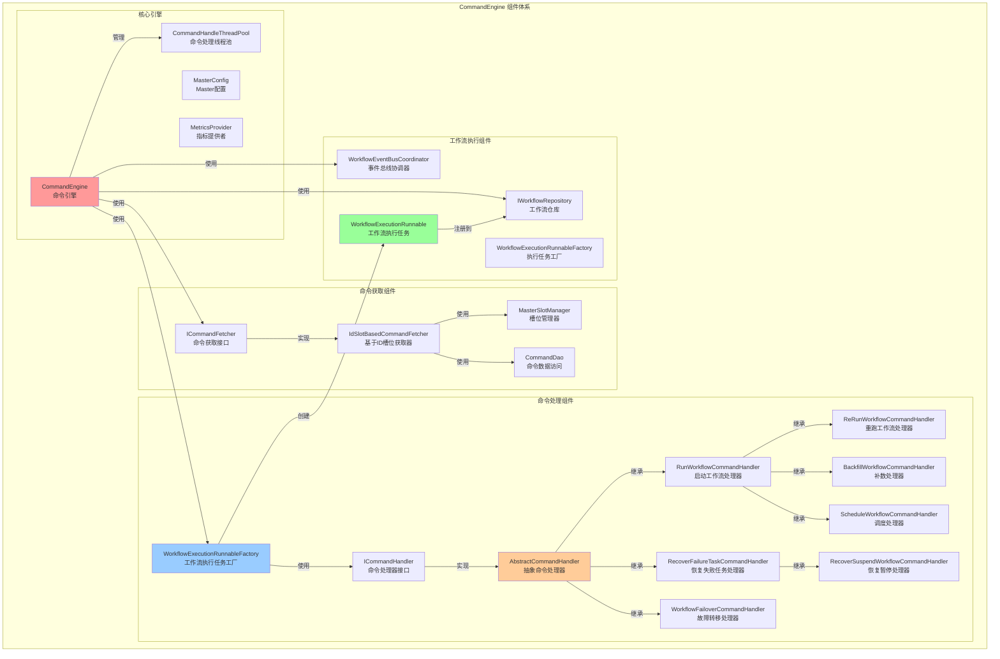
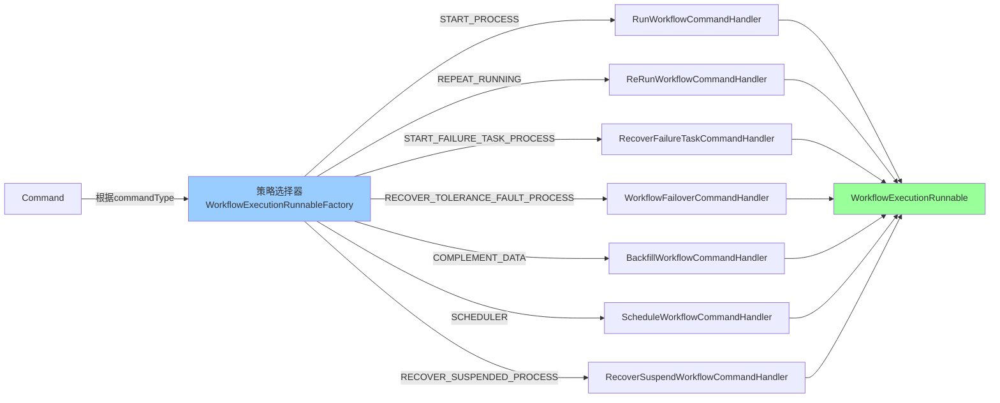
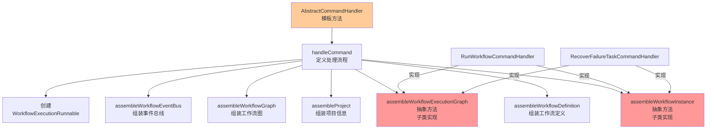
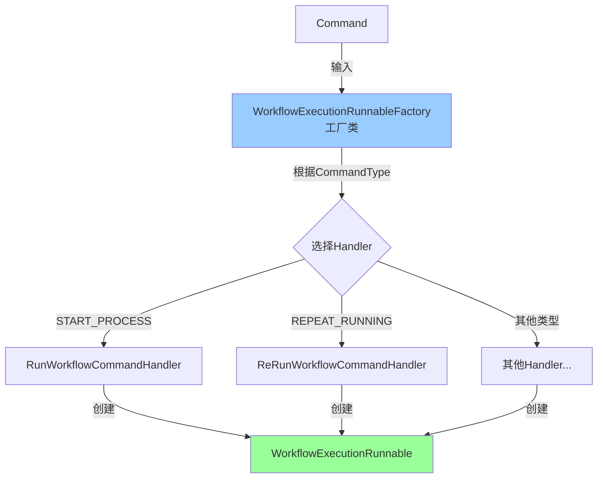
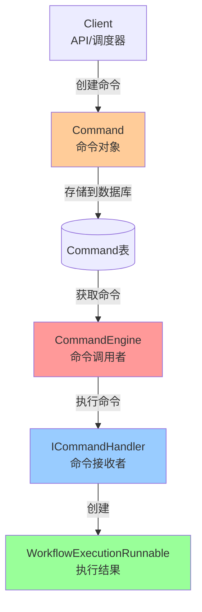
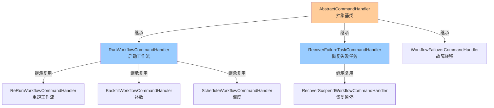
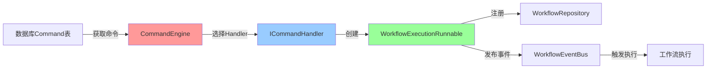

# CommandEngine 命令引擎详细分析文档

## 1. 概述

`CommandEngine` 是 Apache DolphinScheduler 中 Master 服务器的核心组件，负责从数据库消费命令（Command），并将这些命令转换为工作流执行任务（WorkflowExecutionRunnable）。它采用**命令模式（Command Pattern）**和**策略模式（Strategy Pattern）**，实现了灵活的命令处理机制。

## 2. 核心原理

### 2.1 工作原理

CommandEngine 采用**生产者-消费者模式**，工作流程如下：

1. **命令获取阶段**：通过 `ICommandFetcher` 从数据库获取待处理的命令列表
2. **命令处理阶段**：对每个命令，通过 `WorkflowExecutionRunnableFactory` 创建对应的 `WorkflowExecutionRunnable`
3. **工作流启动阶段**：将创建的工作流执行任务注册到 `WorkflowRepository`，并发布启动事件
4. **异步执行**：使用 `CompletableFuture` 实现异步并发处理多个命令

### 2.2 关键组件

- **CommandEngine**：命令引擎主循环，负责持续消费命令
- **ICommandFetcher**：命令获取器接口，负责从数据库获取命令
- **WorkflowExecutionRunnableFactory**：工作流执行任务工厂，负责根据命令类型选择合适的 Handler
- **ICommandHandler**：命令处理器接口，每种命令类型对应一个 Handler
- **AbstractCommandHandler**：抽象命令处理器，提供通用的处理模板
- **WorkflowExecutionRunnable**：工作流执行任务，封装了工作流实例的执行逻辑

## 3. 架构原理图



**原理图分析**：
- **数据流向**：从数据库的 Command 表开始，经过命令获取、处理、转换，最终生成工作流执行任务
- **分层架构**：采用清晰的分层设计，每层职责单一
- **策略选择**：工厂模式根据命令类型动态选择对应的 Handler
- **异步处理**：使用线程池实现并发处理，提高吞吐量

## 4. 时序图



**时序图分析**：
- **循环处理**：CommandEngine 在主循环中持续获取和处理命令
- **事务保证**：通过删除命令确保同一命令只被一个 Master 处理（分布式锁机制）
- **异步并发**：使用 CompletableFuture 实现多个命令的并发处理
- **事件驱动**：通过事件总线发布启动事件，触发工作流执行

## 5. 组件图



**组件图分析**：
- **核心引擎**：CommandEngine 是核心调度器，管理整个命令处理流程
- **命令获取**：通过策略模式支持不同的命令获取策略（当前主要是基于ID槽位）
- **命令处理**：采用模板方法模式和策略模式，AbstractCommandHandler 定义处理模板，具体Handler实现特定逻辑
- **继承层次**：Handler 采用继承复用，减少代码重复

## 6. 类关系图


**类关系图分析**：
- **接口抽象**：`ICommandFetcher` 和 `ICommandHandler` 定义了清晰的接口契约
- **模板方法模式**：`AbstractCommandHandler` 定义了命令处理的模板流程，子类实现特定步骤
- **继承层次**：Handler 采用继承复用，`ReRunWorkflowCommandHandler` 继承 `RunWorkflowCommandHandler` 复用启动逻辑
- **工厂模式**：`WorkflowExecutionRunnableFactory` 负责根据命令类型创建对应的 Handler
- **依赖注入**：所有组件通过 Spring 进行依赖注入，实现松耦合

## 7. ICommandHandler 设计模式分析

### 7.1 策略模式（Strategy Pattern）

`ICommandHandler` 接口及其实现类体现了**策略模式**的核心思想：



**策略模式分析**：
- **策略接口**：`ICommandHandler` 定义了统一的处理接口
- **具体策略**：每个 Handler 实现类对应一种命令类型的处理策略
- **策略选择**：`WorkflowExecutionRunnableFactory` 根据 `CommandType` 动态选择对应的 Handler
- **优势**：新增命令类型时，只需添加新的 Handler 实现，无需修改现有代码（开闭原则）

**代码示例**：
```java
// WorkflowExecutionRunnableFactory 中的策略选择逻辑
final ICommandHandler commandHandler = commandHandlers
    .stream()
    .filter(c -> c.commandType() == commandType)
    .findFirst()
    .orElseThrow(() -> new IllegalArgumentException(
        "Cannot find ICommandHandler for commandType: " + commandType));
```

### 7.2 模板方法模式（Template Method Pattern）

`AbstractCommandHandler` 体现了**模板方法模式**的核心思想：



**模板方法模式分析**：
- **模板类**：`AbstractCommandHandler` 定义了命令处理的固定流程
- **模板方法**：`handleCommand()` 方法定义了处理步骤的顺序
- **钩子方法**：`assembleWorkflowInstance()` 和 `assembleWorkflowExecutionGraph()` 是抽象方法，由子类实现特定逻辑
- **优势**：保证了所有 Handler 都遵循相同的处理流程，同时允许子类定制特定步骤

**代码示例**：
```java
// AbstractCommandHandler 中的模板方法
@Override
public WorkflowExecutionRunnable handleCommand(final Command command) {
    final WorkflowExecuteContextBuilder builder = WorkflowExecuteContext.builder()
            .withCommand(command);
    
    // 固定流程步骤
    assembleWorkflowDefinition(builder);
    assembleProject(builder);
    assembleWorkflowGraph(builder);
    assembleWorkflowInstance(builder);  // 抽象方法，子类实现
    assembleWorkflowInstanceLifecycleListeners(builder);
    assembleWorkflowEventBus(builder);
    assembleWorkflowExecutionGraph(builder);  // 抽象方法，子类实现
    
    return new WorkflowExecutionRunnable(builder.build());
}
```

### 7.3 工厂模式（Factory Pattern）

`WorkflowExecutionRunnableFactory` 体现了**工厂模式**的核心思想：



**工厂模式分析**：
- **工厂类**：`WorkflowExecutionRunnableFactory` 负责创建 `WorkflowExecutionRunnable`
- **产品创建**：根据 `CommandType` 选择合适的 Handler，由 Handler 创建产品
- **封装创建逻辑**：将复杂的创建逻辑封装在工厂中，客户端无需了解创建细节
- **事务保证**：在创建前先删除命令，确保分布式环境下的唯一性

**代码示例**：
```java
@Transactional
public IWorkflowExecutionRunnable createWorkflowExecuteRunnable(Command command) {
    // 1. 先删除命令，确保唯一性（分布式锁）
    deleteCommandOrThrow(command);
    // 2. 根据命令类型选择 Handler
    return doCreateWorkflowExecutionRunnable(command);
}
```

### 7.4 命令模式（Command Pattern）

整个 CommandEngine 体系体现了**命令模式**的核心思想：



**命令模式分析**：
- **命令对象**：`Command` 封装了工作流执行的请求信息
- **命令调用者**：`CommandEngine` 负责获取和执行命令
- **命令接收者**：`ICommandHandler` 及其实现类负责处理命令
- **解耦**：命令的创建和执行分离，支持命令的持久化和异步执行
- **可扩展**：新增命令类型只需添加新的 Handler，无需修改现有代码

**代码示例**：
```java
// Command 对象封装执行请求
public class Command {
    private Long id;
    private CommandType commandType;  // 命令类型
    private Long workflowDefinitionCode;
    private Integer workflowDefinitionVersion;
    private Integer workflowInstanceId;
    private String commandParam;  // 命令参数（JSON格式）
}
```

### 7.5 继承复用模式

Handler 继承体系体现了**代码复用**的设计思想：



**继承复用模式分析**：
- **基类复用**：`AbstractCommandHandler` 提供通用的处理模板和工具方法
- **功能复用**：`ReRunWorkflowCommandHandler` 继承 `RunWorkflowCommandHandler`，复用启动工作流的逻辑
- **优势**：减少代码重复，提高可维护性，子类只需实现差异化的逻辑

## 8. 各个 Handler 详细说明

### 8.1 RunWorkflowCommandHandler（启动工作流）

**功能**：处理 `START_PROCESS` 命令，启动新的工作流实例。

**关键逻辑**：
- 创建新的 `WorkflowInstance`，状态设置为 `RUNNING_EXECUTION`
- 合并命令参数和工作流全局参数
- 构建完整的 `WorkflowExecutionGraph`，包含所有任务节点
- 支持指定起始节点（通过 `RunWorkflowCommandParam`）

**代码特点**：
```java
// 合并命令参数和工作流参数
private String mergeCommandParamsWithWorkflowParams(Command command, WorkflowDefinition workflowDefinition) {
    // 命令参数优先级高于工作流参数
}
```

### 8.2 ReRunWorkflowCommandHandler（重跑工作流）

**功能**：处理 `REPEAT_RUNNING` 命令，重新运行已存在的工作流实例。

**关键逻辑**：
- 复用现有的 `WorkflowInstance`，但更新以下字段：
    - `state`: 设置为 `RUNNING_EXECUTION`
    - `restartTime`: 设置为当前时间
    - `runTimes`: 递增
    - `endTime`: 清空
- 将所有历史任务实例标记为无效
- 重新构建 `WorkflowExecutionGraph`

**继承关系**：继承 `RunWorkflowCommandHandler`，复用启动逻辑。

### 8.3 RecoverFailureTaskCommandHandler（恢复失败任务）

**功能**：处理 `START_FAILURE_TASK_PROCESS` 命令，恢复失败或暂停的任务。

**关键逻辑**：
- 处理历史任务实例：
  - 将 `FAILURE` 和 `KILL` 状态的任务标记为无效并重新创建
  - 将 `PAUSE` 状态的任务恢复执行
  - 如果任务的前置任务失败，则将该任务也标记为无效
- 重建 `WorkflowExecutionGraph`，只包含需要恢复的任务
- 清空工作流实例的变量池（`varPool`）

**代码特点**：
```java
// 判断任务是否需要重新创建
private boolean isTaskNeedRecreate(TaskInstance taskInstance) {
    return taskInstance.getState() == TaskExecutionStatus.FAILURE
            || taskInstance.getState() == TaskExecutionStatus.KILL;
}

// 判断任务是否可以恢复
private boolean isTaskCanRecover(TaskInstance taskInstance) {
    return taskInstance.getState() == TaskExecutionStatus.PAUSE;
}
```

### 8.4 WorkflowFailoverCommandHandler（工作流故障转移）

**功能**：处理 `RECOVER_TOLERANCE_FAULT_PROCESS` 命令，在 Master 节点故障后恢复工作流执行。

**关键逻辑**：
- 使用现有的 `WorkflowInstance`，根据 `WorkflowFailoverCommandParam` 更新状态
- 从数据库恢复所有有效的任务实例
- 重建 `WorkflowExecutionGraph`，保持原有的执行状态
- 不修改命令参数，保持原始命令参数不变

**使用场景**：Master 节点宕机后，其他 Master 节点接管并恢复工作流执行。

### 8.5 BackfillWorkflowCommandHandler（补数）

**功能**：处理 `COMPLEMENT_DATA` 命令，执行数据补数操作。

**关键逻辑**：
- 继承 `RunWorkflowCommandHandler`，复用启动工作流的逻辑
- 支持按时间范围补数，可以指定起始节点
- 适用于数据回填场景

**继承关系**：继承 `RunWorkflowCommandHandler`。

### 8.6 ScheduleWorkflowCommandHandler（调度）

**功能**：处理 `SCHEDULER` 命令，由调度器触发的定时任务。

**关键逻辑**：
- 继承 `RunWorkflowCommandHandler`，复用启动逻辑
- 通过 `SchedulerApi` 触发
- 支持定时调度场景

**继承关系**：继承 `RunWorkflowCommandHandler`。

### 8.7 RecoverSuspendWorkflowCommandHandler（恢复暂停）

**功能**：处理 `RECOVER_SUSPENDED_PROCESS` 命令，恢复被暂停的工作流。

**关键逻辑**：
- 继承 `RecoverFailureTaskCommandHandler`，复用恢复逻辑
- 专门处理暂停状态的工作流恢复
- 恢复暂停的任务实例

**继承关系**：继承 `RecoverFailureTaskCommandHandler`。

## 9. 关键技术细节

### 9.1 分布式锁机制

**实现方式**：通过删除命令实现分布式锁

```java
@Transactional
public IWorkflowExecutionRunnable createWorkflowExecuteRunnable(Command command) {
    // 先尝试删除命令，如果删除失败说明已被其他Master处理
    boolean deleteResult = commandDao.deleteById(command.getId());
    if (!deleteResult) {
        throw new CommandDuplicateHandleException(command);
    }
    return doCreateWorkflowExecutionRunnable(command);
}
```

**原理**：
- 使用数据库的 `DELETE` 操作作为分布式锁
- 在事务中执行，确保原子性
- 如果删除失败（返回 false），说明命令已被其他 Master 处理
- 避免了使用额外的分布式锁组件，简化了架构

### 9.2 命令获取策略

**基于ID槽位的获取策略**：

```java
// IdSlotBasedCommandFetcher 的实现
public List<Command> fetchCommands() {
    int currentSlotIndex = masterSlotManager.getCurrentMasterSlot();
    int totalSlot = masterSlotManager.getTotalMasterSlots();
    // 根据命令ID取模，分配到不同的槽位
    List<Command> commands = commandDao.queryCommandByIdSlot(
            currentSlotIndex,
            totalSlot,
            idSlotBasedFetchConfig.getIdStep(),
            idSlotBasedFetchConfig.getFetchSize());
    return commands;
}
```

**原理**：
- 使用命令ID对总槽位数取模，将命令分配到不同的槽位
- 每个Master节点负责处理特定槽位的命令
- 支持水平扩展，新增Master节点时自动重新分配槽位
- 避免了命令处理的冲突，提高了并发处理能力

**优势**：
- **负载均衡**：命令均匀分配到各个Master节点
- **可扩展性**：支持动态增加或减少Master节点
- **容错性**：单个Master节点故障不影响其他节点

### 9.3 异步并发处理

**实现方式**：使用 `CompletableFuture` 实现异步处理

```java
List<CompletableFuture<Void>> allCompleteFutures = new ArrayList<>();
for (Command command : commands) {
    CompletableFuture<Void> completableFuture = bootstrapCommand(command)
            .thenAccept(this::bootstrapWorkflowExecutionRunnable)
            .thenAccept((unused) -> bootstrapSuccess(command))
            .exceptionally(throwable -> bootstrapError(command, throwable));
    allCompleteFutures.add(completableFuture);
}
CompletableFuture.allOf(allCompleteFutures.toArray(new CompletableFuture[0])).join();
```

**处理流程**：
1. **bootstrapCommand**：在线程池中异步创建 `WorkflowExecutionRunnable`
2. **bootstrapWorkflowExecutionRunnable**：注册工作流并发布启动事件
3. **bootstrapSuccess**：记录成功指标
4. **bootstrapError**：处理异常，将命令移到错误表

**优势**：
- **并发处理**：多个命令可以同时处理，提高吞吐量
- **非阻塞**：使用异步方式，不会阻塞主循环
- **错误隔离**：单个命令处理失败不影响其他命令

### 9.4 线程池配置

**线程池创建**：

```java
this.commandHandleThreadPool = ThreadUtils.newDaemonFixedThreadExecutor(
        "MasterCommandHandleThreadPool",
        Runtime.getRuntime().availableProcessors());
```

**配置说明**：
- **线程数**：等于CPU核心数，充分利用多核性能
- **线程类型**：守护线程，JVM关闭时自动退出
- **命名**：便于监控和调试

**优化建议**：
- 根据实际负载调整线程数
- 监控线程池的队列大小和拒绝策略
- 考虑使用动态线程池，根据负载自动调整

### 9.5 负载保护机制

**实现方式**：通过 `MasterServerLoadProtection` 检查系统负载

```java
SystemMetrics systemMetrics = metricsProvider.getSystemMetrics();
if (serverLoadProtection.isOverload(systemMetrics)) {
    log.warn("The current server is overload, cannot consumes commands.");
    MasterServerMetrics.incMasterOverload();
    Thread.sleep(Constants.SLEEP_TIME_MILLIS);
    continue;
}
```

**保护机制**：
- **系统指标监控**：监控CPU、内存、磁盘等系统资源
- **过载检测**：当系统负载超过阈值时，暂停命令消费
- **自动恢复**：系统负载降低后自动恢复命令处理
- **指标记录**：记录过载次数，便于监控和告警

**优势**：
- **防止系统崩溃**：避免在高负载情况下继续处理命令导致系统崩溃
- **自我保护**：系统能够自动保护自己，避免资源耗尽
- **可配置**：负载阈值可以通过配置调整

### 9.6 错误处理机制

**错误分类**：

1. **命令重复处理异常**（`CommandDuplicateHandleException`）
  - **原因**：命令已被其他Master节点处理
  - **处理**：记录警告日志，不进行错误处理
  - **影响**：无影响，属于正常情况

2. **一般异常**
  - **原因**：命令处理过程中的各种异常
  - **处理**：记录错误日志，将命令移到错误表
  - **影响**：命令处理失败，需要人工介入

**错误处理代码**：

```java
private Void bootstrapError(Command command, Throwable throwable) {
    if (throwable instanceof CommandDuplicateHandleException) {
        log.warn("Handle command failed, the command: {} has been handled by other master",
                command, throwable);
        return null;
    }
    log.error("Failed bootstrap command {} ", JSONUtils.toPrettyJsonString(command), throwable);
    commandService.moveToErrorCommand(command, ExceptionUtils.getStackTrace(throwable));
    return null;
}
```

**错误恢复**：
- 错误命令会被移到错误表（error_command）
- 可以通过管理界面查看错误详情
- 支持手动重试或修复后重新提交

### 9.7 事件驱动机制

**事件发布流程**：

```java
// 注册事件总线
workflowEventBusCoordinator.registerWorkflowEventBus(workflowExecutionRunnable);

// 发布启动事件
workflowExecutionRunnable.getWorkflowEventBus()
        .publish(WorkflowStartLifecycleEvent.of(workflowExecutionRunnable));
```

**事件驱动优势**：
- **解耦**：命令处理和实际执行通过事件解耦
- **异步**：事件发布后立即返回，不阻塞命令处理
- **可扩展**：可以添加多个事件监听器，实现不同的功能
- **灵活性**：支持不同的事件类型，如启动、暂停、停止等

**事件类型**：
- `WorkflowStartLifecycleEvent`：工作流启动事件
- `WorkflowPauseLifecycleEvent`：工作流暂停事件
- `WorkflowStopLifecycleEvent`：工作流停止事件

## 10. 总结

### 10.1 核心设计思想

CommandEngine 的设计体现了以下核心思想：

1. **分层架构**：采用清晰的分层设计，每层职责单一，便于维护和扩展
2. **设计模式**：综合运用策略模式、模板方法模式、工厂模式、命令模式等多种设计模式
3. **异步并发**：使用 CompletableFuture 和线程池实现高效的并发处理
4. **分布式协调**：通过数据库删除操作实现分布式锁，避免命令重复处理
5. **事件驱动**：采用事件总线机制，实现组件间的解耦和异步通信
6. **可扩展性**：通过接口和抽象类，支持灵活扩展新的命令类型和处理逻辑

### 10.2 关键特性

- **高可用性**：支持多Master节点部署，单节点故障不影响整体服务
- **高性能**：异步并发处理，充分利用多核CPU资源
- **可扩展性**：新增命令类型只需添加新的Handler，无需修改现有代码
- **容错性**：完善的错误处理机制，异常命令自动移到错误表
- **负载保护**：系统负载过高时自动暂停命令消费，防止系统崩溃

### 10.3 工作流程总结



### 10.4 设计优势

1. **解耦设计**：
  - 命令的创建和执行分离
  - 通过事件总线实现组件解耦
  - 接口抽象实现依赖倒置

2. **可维护性**：
  - 清晰的类层次结构
  - 统一的处理模板
  - 完善的错误处理

3. **可扩展性**：
  - 策略模式支持新增命令类型
  - 模板方法模式支持定制处理流程
  - 工厂模式封装创建逻辑

4. **性能优化**：
  - 异步并发处理
  - 线程池资源管理
  - 负载保护机制

### 10.5 应用场景

CommandEngine 适用于以下场景：

1. **工作流启动**：通过API或调度器触发工作流执行
2. **工作流重跑**：重新执行已完成或失败的工作流
3. **任务恢复**：恢复失败或暂停的任务
4. **故障转移**：Master节点故障后恢复工作流执行
5. **数据补数**：按时间范围回填历史数据
6. **定时调度**：按计划执行定时任务

### 10.6 最佳实践

1. **命令处理**：
  - 确保命令参数格式正确
  - 合理设置命令获取批次大小
  - 监控命令处理耗时

2. **性能优化**：
  - 根据实际负载调整线程池大小
  - 监控系统资源使用情况
  - 合理配置负载保护阈值

3. **错误处理**：
  - 及时处理错误表中的命令
  - 分析错误原因并优化
  - 建立告警机制

4. **监控告警**：
  - 监控命令处理速率
  - 监控系统负载指标
  - 设置合理的告警阈值
  - 定期检查错误命令

5. **扩展开发**：
  - 新增命令类型时，实现对应的Handler
  - 遵循模板方法模式，复用基类逻辑
  - 保持Handler的单一职责原则
  - 编写完善的单元测试

### 10.7 技术亮点

1. **分布式锁创新**：
  - 使用数据库DELETE操作实现分布式锁
  - 避免了引入额外的分布式锁组件（如Zookeeper、Redis）
  - 简化了系统架构，降低了运维复杂度

2. **槽位分配策略**：
  - 基于命令ID的槽位分配，实现负载均衡
  - 支持动态扩缩容，无需手动配置
  - 天然避免了命令处理的冲突

3. **异步处理链**：
  - 使用CompletableFuture构建异步处理链
  - 支持链式错误处理
  - 实现了优雅的异常传播机制

4. **事件驱动架构**：
  - 通过事件总线实现组件解耦
  - 支持多种事件类型
  - 便于扩展和集成

### 10.8 未来优化方向

1. **性能优化**：
  - 优化命令获取SQL，减少数据库查询时间
  - 考虑使用缓存减少重复查询
  - 优化线程池配置，支持动态调整

2. **功能增强**：
  - 支持命令优先级处理
  - 支持命令批量处理优化
  - 增强负载保护机制的智能化

3. **可观测性**：
  - 增加更详细的指标监控
  - 支持分布式追踪
  - 完善日志记录和查询

4. **容错能力**：
  - 增强异常恢复机制
  - 支持命令重试策略
  - 优化故障转移流程

## 11. 相关代码文件

### 11.1 核心类文件

- `CommandEngine.java` - 命令引擎主类
- `ICommandFetcher.java` - 命令获取接口
- `IdSlotBasedCommandFetcher.java` - 基于ID槽位的命令获取器
- `WorkflowExecutionRunnableFactory.java` - 工作流执行任务工厂
- `ICommandHandler.java` - 命令处理器接口
- `AbstractCommandHandler.java` - 抽象命令处理器

### 11.2 Handler实现类

- `RunWorkflowCommandHandler.java` - 启动工作流处理器
- `ReRunWorkflowCommandHandler.java` - 重跑工作流处理器
- `RecoverFailureTaskCommandHandler.java` - 恢复失败任务处理器
- `WorkflowFailoverCommandHandler.java` - 工作流故障转移处理器
- `BackfillWorkflowCommandHandler.java` - 补数处理器
- `ScheduleWorkflowCommandHandler.java` - 调度处理器
- `RecoverSuspendWorkflowCommandHandler.java` - 恢复暂停处理器

### 11.3 相关接口和类

- `Command.java` - 命令实体类
- `CommandType.java` - 命令类型枚举
- `WorkflowExecutionRunnable.java` - 工作流执行任务
- `IWorkflowRepository.java` - 工作流仓库接口
- `WorkflowEventBusCoordinator.java` - 事件总线协调器
- `MasterSlotManager.java` - 槽位管理器
- `CommandDao.java` - 命令数据访问对象

## 12. 参考资料

### 12.1 设计模式

- **策略模式（Strategy Pattern）**：定义一系列算法，把它们封装起来，并且使它们可相互替换
- **模板方法模式（Template Method Pattern）**：定义一个操作中算法的骨架，而将一些步骤延迟到子类中
- **工厂模式（Factory Pattern）**：定义一个创建对象的接口，让子类决定实例化哪一个类
- **命令模式（Command Pattern）**：将一个请求封装成一个对象，从而使您可以用不同的请求对客户进行参数化

### 12.2 相关文档

- Apache DolphinScheduler 官方文档
- DolphinScheduler 架构设计文档
- Master 服务器启动流程文档
- 工作流执行引擎文档

### 12.3 关键概念

- **Command**：命令对象，封装了工作流执行的请求信息
- **CommandType**：命令类型，定义了不同的命令类型（启动、重跑、恢复等）
- **Handler**：命令处理器，负责处理特定类型的命令
- **WorkflowExecutionRunnable**：工作流执行任务，封装了工作流实例的执行逻辑
- **WorkflowExecutionGraph**：工作流执行图，表示工作流的执行状态和任务依赖关系
- **EventBus**：事件总线，用于组件间的事件通信
- **Slot**：槽位，用于分布式环境下的命令分配

## 13. 附录

### 13.1 命令类型说明

| CommandType | 说明 | Handler |
|------------|------|---------|
| START_PROCESS | 启动工作流 | RunWorkflowCommandHandler |
| REPEAT_RUNNING | 重跑工作流 | ReRunWorkflowCommandHandler |
| START_FAILURE_TASK_PROCESS | 恢复失败任务 | RecoverFailureTaskCommandHandler |
| RECOVER_TOLERANCE_FAULT_PROCESS | 故障转移 | WorkflowFailoverCommandHandler |
| COMPLEMENT_DATA | 数据补数 | BackfillWorkflowCommandHandler |
| SCHEDULER | 定时调度 | ScheduleWorkflowCommandHandler |
| RECOVER_SUSPENDED_PROCESS | 恢复暂停 | RecoverSuspendWorkflowCommandHandler |

### 13.2 关键配置参数

- **command.fetch.size**：每次获取的命令数量
- **command.fetch.id.step**：命令ID步长
- **master.command.thread.pool.size**：命令处理线程池大小（默认：CPU核心数）
- **master.server.load.protection.enabled**：是否启用负载保护
- **master.server.load.protection.cpu.max.usage**：CPU最大使用率阈值
- **master.server.load.protection.memory.max.usage**：内存最大使用率阈值

### 13.3 监控指标

- **master.consume.command**：Master消费命令数量
- **master.overload**：Master过载次数
- **command.query.time**：命令查询耗时
- **command.handle.time**：命令处理耗时

### 13.4 常见问题

1. **命令处理慢**
  - 检查系统负载是否过高
  - 检查数据库连接是否正常
  - 检查