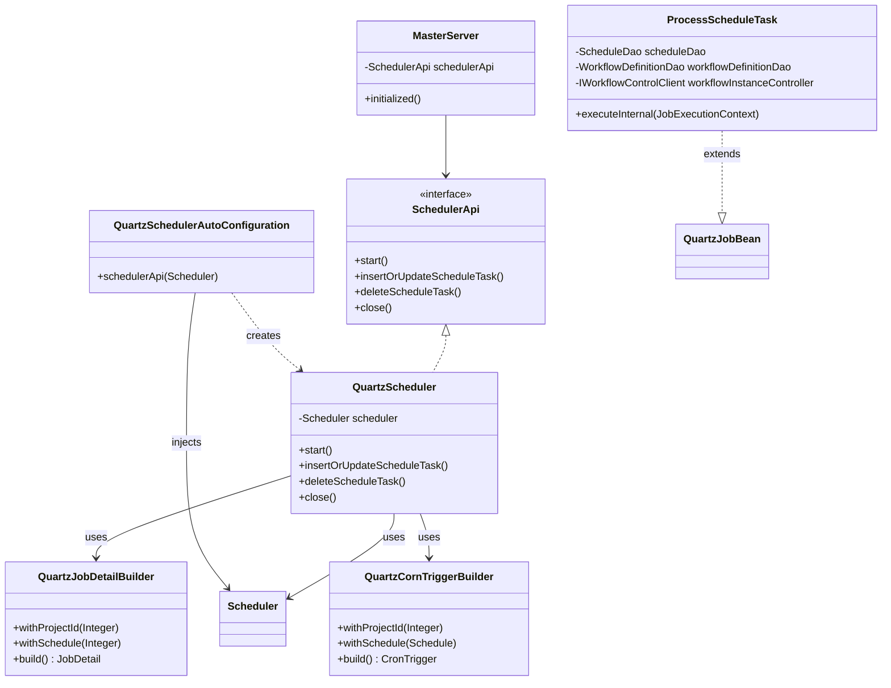
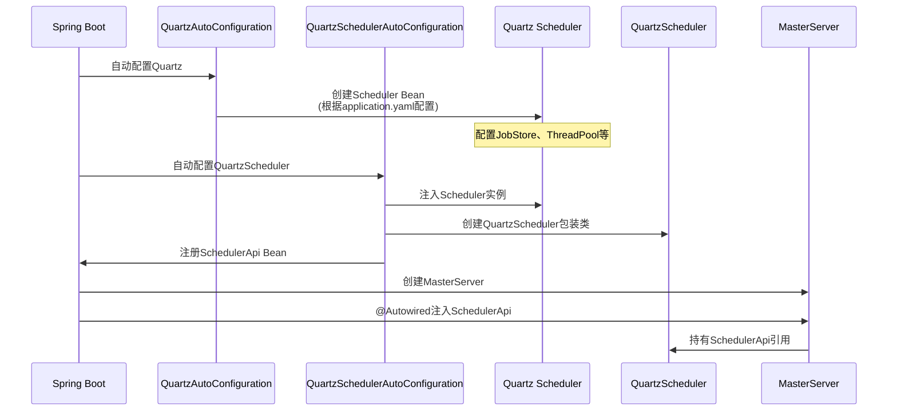
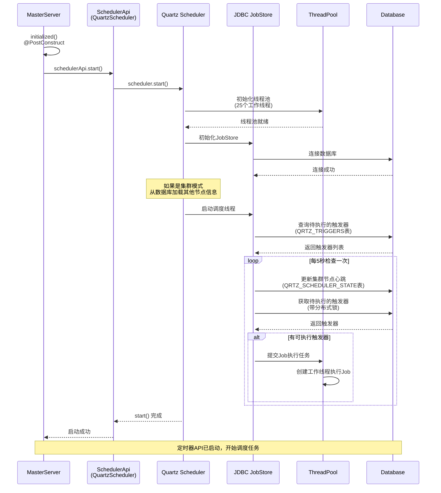
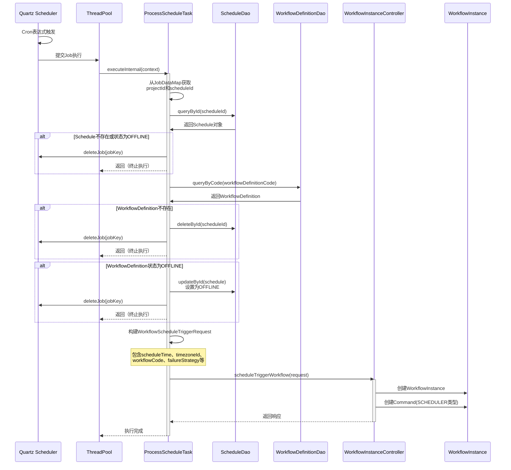
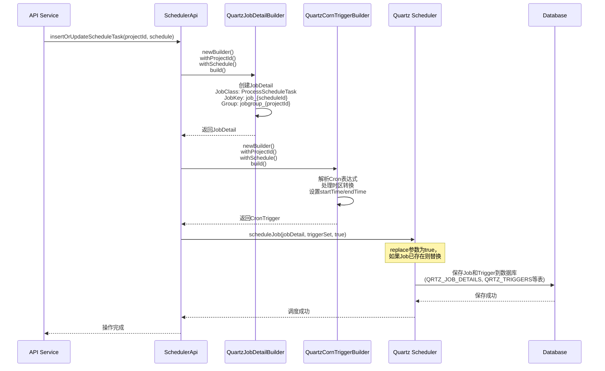
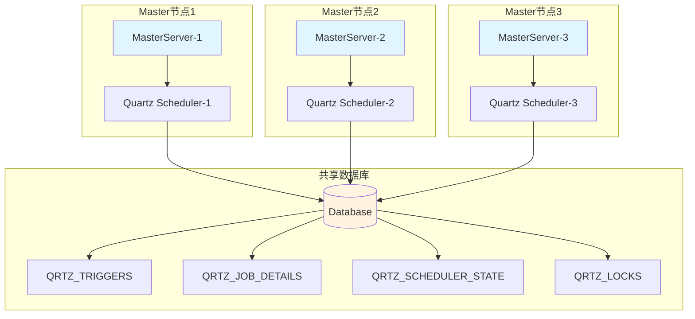
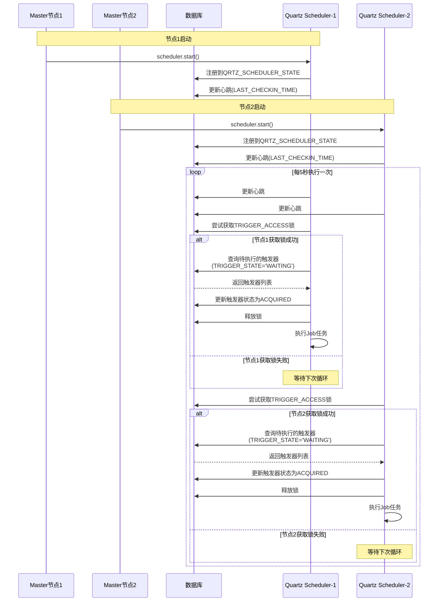
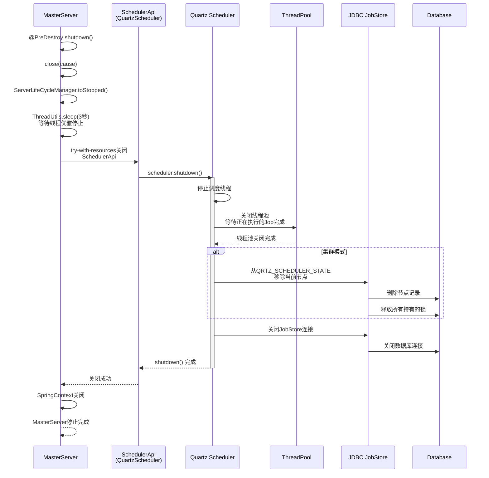
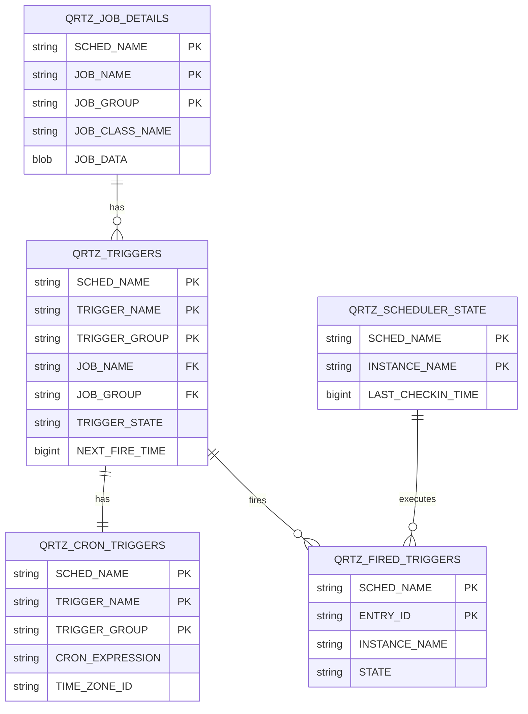

# 定时器API启动详细分析

## 1. 概述

定时器API（SchedulerApi）是DolphinScheduler中负责定时调度工作流的核心组件。它基于Quartz框架实现，支持集群模式下的分布式调度。在MasterServer启动时，定时器API的启动位于工作流引擎之后，是整个调度系统的关键一环。

### 1.1 调用位置

在 `MasterServer.initialized()` 方法中的调用顺序：

```java
this.workflowEngine.start();        // 工作流引擎启动
this.schedulerApi.start();          // 定时器API启动（第195行）
```

### 1.2 核心职责

- 启动Quartz Scheduler，开始执行定时任务
- 管理定时任务的添加、更新、删除
- 在集群模式下，通过JDBC JobStore实现分布式调度
- 将定时调度任务转换为工作流实例的触发

## 2. 架构设计

### 2.1 组件架构图

```mermaid
graph TB
    subgraph "Spring Boot 启动阶段"
        A[MasterServer] -->|@Autowired| B[SchedulerApi]
        C[QuartzAutoConfiguration] -->|创建| D[Quartz Scheduler]
        E[QuartzSchedulerAutoConfiguration] -->|包装| B
        D -->|注入| E
    end
    
    subgraph "SchedulerApi 接口层"
        B -->|实现| F[QuartzScheduler]
        F -->|持有| D
    end
    
    subgraph "Quartz 核心组件"
        D -->|使用| G[JobStore<br/>JDBC JobStore]
        D -->|使用| H[ThreadPool<br/>SimpleThreadPool]
        D -->|调度| I[ProcessScheduleTask]
    end
    
    subgraph "执行层"
        I -->|查询| J[ScheduleDao]
        I -->|查询| K[WorkflowDefinitionDao]
        I -->|触发| L[IWorkflowControlClient]
        L -->|创建| M[WorkflowInstance]
    end
    
    style A fill:#e1f5ff
    style B fill:#fff4e1
    style D fill:#e8f5e9
    style I fill:#fce4ec
```

### 2.2 类关系图



## 3. 初始化流程

### 3.1 Spring Bean 创建流程



### 3.2 Quartz Scheduler 初始化配置

根据 `application.yaml` 配置，Quartz Scheduler 使用以下关键配置：

```yaml
spring:
  quartz:
    job-store-type: jdbc                    # 使用JDBC存储
    properties:
      org.quartz.threadPool.class: org.quartz.simpl.SimpleThreadPool
      org.quartz.threadPool.threadCount: 25  # 25个工作线程
      org.quartz.threadPool.threadPriority: 5
      org.quartz.threadPool.makeThreadsDaemons: true
      org.quartz.jobStore.class: org.springframework.scheduling.quartz.LocalDataSourceJobStore
      org.quartz.jobStore.isClustered: true  # 集群模式
      org.quartz.jobStore.tablePrefix: QRTZ_
      org.quartz.jobStore.clusterCheckinInterval: 5000  # 集群检查间隔5秒
      org.quartz.jobStore.misfireThreshold: 60000       # 失火阈值60秒
      org.quartz.scheduler.instanceId: AUTO             # 自动生成实例ID
      org.quartz.scheduler.instanceName: DolphinScheduler
```

### 3.3 关键配置说明

| 配置项 | 说明 |
|--------|------|
| `job-store-type: jdbc` | 使用数据库持久化Job和Trigger信息 |
| `isClustered: true` | 启用集群模式，多个Master节点共享调度任务 |
| `threadCount: 25` | 工作线程池大小，用于并发执行定时任务 |
| `clusterCheckinInterval: 5000` | 集群节点心跳检查间隔，单位毫秒 |
| `misfireThreshold: 60000` | 触发器失火阈值，超过60秒未执行视为失火 |
| `acquireTriggersWithinLock: true` | 在锁内获取触发器，避免集群并发问题 |

## 4. 启动流程

### 4.1 启动时序图



### 4.2 启动代码分析

#### 4.2.1 MasterServer 启动调用

```java
// MasterServer.java:195
this.schedulerApi.start();
```

#### 4.2.2 QuartzScheduler.start() 实现

```java
@Override
public void start() throws SchedulerException {
    try {
        scheduler.start();  // 调用Quartz原生的Scheduler启动方法
    } catch (Exception e) {
        throw new SchedulerException(QuartzSchedulerExceptionEnum.QUARTZ_SCHEDULER_START_ERROR, e);
    }
}
```

#### 4.2.3 Quartz Scheduler 启动内部流程

当 `scheduler.start()` 被调用时，Quartz框架内部会执行以下步骤：

1. **初始化线程池**
    - 创建 `SimpleThreadPool`，包含25个工作线程
    - 所有线程设置为守护线程（daemon threads）
    - 线程优先级为5（普通优先级）

2. **初始化JobStore**
    - 创建 `LocalDataSourceJobStore` 实例
    - 连接到数据库（使用Spring DataSource）
    - 初始化数据库表（QRTZ_*）
    - 如果是集群模式，加载其他节点信息

3. **启动调度线程**
    - 创建主调度线程（scheduler thread）
    - 主线程开始循环：
        - 检查集群节点状态（clusterCheckinInterval）
        - 从数据库获取待执行的触发器
        - 提交Job到线程池执行
        - 处理失火（misfire）的触发器

4. **集群模式特殊处理**
    - 自动生成实例ID（instanceId: AUTO）
    - 在数据库注册当前节点
    - 通过数据库锁机制避免重复执行

## 5. 定时任务执行流程

### 5.1 Job执行时序图



### 5.2 ProcessScheduleTask 执行逻辑

```java
@Override
protected void executeInternal(JobExecutionContext context) {
    // 1. 从JobDataMap中提取调度信息
    final QuartzJobData quartzJobData = QuartzJobData.of(context.getJobDetail().getJobDataMap());
    final int projectId = quartzJobData.getProjectId();
    final int scheduleId = quartzJobData.getScheduleId();
    
    // 2. 获取计划执行时间和实际执行时间
    final Date scheduledFireTime = context.getScheduledFireTime();
    final Date fireTime = context.getFireTime();
    
    // 3. 验证Schedule是否存在且在线
    final Schedule schedule = scheduleDao.queryById(scheduleId);
    if (schedule == null || ReleaseState.OFFLINE == schedule.getReleaseState()) {
        deleteJob(context, projectId, scheduleId);
        return;
    }
    
    // 4. 验证工作流定义是否存在且在线
    final Optional<WorkflowDefinition> workflowDefinitionOptional =
            workflowDefinitionDao.queryByCode(schedule.getWorkflowDefinitionCode());
    if (!workflowDefinitionOptional.isPresent()) {
        scheduleDao.deleteById(scheduleId);
        deleteJob(context, projectId, scheduleId);
        return;
    }
    
    final WorkflowDefinition workflowDefinition = workflowDefinitionOptional.get();
    if (workflowDefinition.getReleaseState() == ReleaseState.OFFLINE) {
        schedule.setReleaseState(ReleaseState.OFFLINE);
        schedule.setUpdateTime(new Date());
        scheduleDao.updateById(schedule);
        deleteJob(context, projectId, scheduleId);
        return;
    }
    
    // 5. 构建触发请求并执行
    final WorkflowScheduleTriggerRequest scheduleTriggerRequest = WorkflowScheduleTriggerRequest.builder()
            .userId(schedule.getUserId())
            .scheduleTIme(scheduledFireTime)
            .timezoneId(schedule.getTimezoneId())
            .workflowCode(workflowDefinition.getCode())
            .workflowVersion(workflowDefinition.getVersion())
            .failureStrategy(schedule.getFailureStrategy())
            .taskDependType(TaskDependType.TASK_POST)
            .warningType(schedule.getWarningType())
            .warningGroupId(schedule.getWarningGroupId())
            .workflowInstancePriority(schedule.getWorkflowInstancePriority())
            .workerGroup(WorkerGroupUtils.getWorkerGroupOrDefault(schedule.getWorkerGroup()))
            .tenantCode(schedule.getTenantCode())
            .environmentCode(schedule.getEnvironmentCode())
            .dryRun(Flag.NO)
            .testFlag(Flag.NO)
            .build();
    
    // 6. 触发工作流实例创建
    workflowInstanceController.scheduleTriggerWorkflow(scheduleTriggerRequest);
}
```

## 6. 定时任务管理

### 6.1 添加/更新定时任务

当用户通过API或界面创建/更新定时调度时，会调用 `insertOrUpdateScheduleTask()` 方法：



### 6.2 删除定时任务

```java
@Override
public void deleteScheduleTask(int projectId, int scheduleId) throws SchedulerException {
    JobKey jobKey = QuartzJobKey.of(projectId, scheduleId).toJobKey();
    try {
        if (scheduler.checkExists(jobKey)) {
            scheduler.deleteJob(jobKey);  // 从数据库删除Job和关联的Trigger
        }
    } catch (Exception e) {
        throw new SchedulerException(QuartzSchedulerExceptionEnum.QUARTZ_DELETE_JOB_ERROR, e);
    }
}
```

## 7. JobKey 和 Trigger 命名规则

### 7.1 JobKey 生成规则

```java
// QuartzJobKey.java
public JobKey toJobKey() {
    String jobName = "job_" + schedulerId;           // 例如: job_123
    String jobGroup = "jobgroup_" + projectId;       // 例如: jobgroup_1
    return new JobKey(jobName, jobGroup);
}
```

- **Job名称**: `job_{scheduleId}`
- **Job组**: `jobgroup_{projectId}`
- **目的**: 支持按项目分组管理，便于查找和管理

### 7.2 Trigger 生成规则

```java
// QuartzCornTriggerBuilder.java
TriggerKey triggerKey = TriggerKey.triggerKey(jobKey.getName(), jobKey.getGroup());
// Trigger名称和组与Job相同
```

- **Trigger名称**: 与Job名称相同 (`job_{scheduleId}`)
- **Trigger组**: 与Job组相同 (`jobgroup_{projectId}`)
- **Cron表达式**: 来自Schedule表的crontab字段

### 7.3 时区处理

```java
// QuartzCornTriggerBuilder.java
Date startDate = DateUtils.transformTimezoneDate(schedule.getStartTime(), schedule.getTimezoneId());
Date endDate = DateUtils.transformTimezoneDate(schedule.getEndTime(), schedule.getTimezoneId());

// Cron表达式也需要考虑时区
CronScheduleBuilder.cronSchedule(schedule.getCrontab())
    .withMisfireHandlingInstructionIgnoreMisfires()
    .inTimeZone(DateUtils.getTimezone(schedule.getTimezoneId()))
```

**时区转换逻辑**：
- 数据库中存储的时间是UTC时间
- 创建Trigger时需要根据用户设置的时区转换为本地时间
- Cron表达式执行时使用指定的时区

## 8. 集群模式机制

### 8.1 集群模式架构



### 8.2 集群模式工作原理

#### 8.2.1 分布式锁机制

在集群模式下，Quartz使用数据库锁（`QRTZ_LOCKS`表）来确保同一时间只有一个节点执行定时任务：

1. **获取锁**：节点在执行任务前，先从数据库获取分布式锁
2. **执行任务**：获取锁成功后，执行定时任务
3. **释放锁**：任务执行完成后，释放锁供其他节点使用

#### 8.2.2 节点心跳机制

每个Master节点定期（`clusterCheckinInterval: 5000`）向数据库发送心跳：

- **QRTZ_SCHEDULER_STATE表**：存储节点状态信息
- **心跳字段**：`LAST_CHECKIN_TIME` - 最后心跳时间
- **实例ID**：`INSTANCE_NAME` - 自动生成的唯一标识



#### 8.2.3 触发器获取机制

在集群模式下，Quartz使用以下机制确保触发器不会被多个节点重复执行：

1. **触发器状态管理**
   - `WAITING`: 等待执行
   - `ACQUIRED`: 已被节点获取
   - `EXECUTING`: 正在执行
   - `COMPLETE`: 执行完成
   - `BLOCKED`: 阻塞状态

2. **锁类型**
   - `TRIGGER_ACCESS`: 用于获取触发器时的锁
   - `STATE_ACCESS`: 用于访问调度器状态时的锁

3. **批量获取配置**
   ```yaml
   org.quartz.scheduler.batchTriggerAcquisitionMaxCount: 1
   ```
   - 每次最多获取1个触发器，避免节点间负载不均衡

#### 8.2.4 故障转移机制

当某个Master节点异常退出时：

1. **心跳超时检测**：其他节点在下次检查时发现该节点心跳超时
2. **状态清理**：从`QRTZ_SCHEDULER_STATE`表中移除该节点记录
3. **触发器恢复**：将该节点未完成的触发器状态重置为`WAITING`
4. **重新分配**：其他活跃节点在下次循环中获取并执行这些触发器

## 9. 关闭流程

### 9.1 关闭时序图



### 9.2 关闭代码分析

#### 9.2.1 MasterServer 关闭流程

```java
// MasterServer.java:226-252
public void close(String cause) {
    // 1. 设置停止信号（仅执行一次）
    if (!ServerLifeCycleManager.toStopped()) {
        log.warn("MasterServer is already stopped, current cause: {}", cause);
        return;
    }
    
    // 2. 等待3秒，让线程优雅停止
    ThreadUtils.sleep(Constants.SERVER_CLOSE_WAIT_TIME.toMillis());
    
    // 3. 关闭默认调度器线程池
    MasterThreadFactory.getDefaultSchedulerThreadExecutor().shutdownNow();
    
    // 4. 使用try-with-resources自动关闭各个组件
    try (
            SystemEventBusFireWorker systemEventBusFireWorker1 = systemEventBusFireWorker;
            WorkflowEngine workflowEngine1 = workflowEngine;
            SchedulerApi closedSchedulerApi = schedulerApi;  // 触发close()
            // ... 其他组件
    ) {
        log.info("MasterServer is stopping, current cause : {}", cause);
    } catch (Exception e) {
        log.error("MasterServer stop failed, current cause: {}", cause, e);
    }
}
```

#### 9.2.2 QuartzScheduler.close() 实现

```java
// QuartzScheduler.java:86-93
@Override
public void close() {
    try {
        scheduler.shutdown();  // 关闭Quartz Scheduler
    } catch (Exception e) {
        throw new SchedulerException(QuartzSchedulerExceptionEnum.QUARTZ_SCHEDULER_SHOWDOWN_ERROR, e);
    }
}
```

#### 9.2.3 Quartz Scheduler 关闭内部流程

当 `scheduler.shutdown()` 被调用时，Quartz框架内部会执行：

1. **停止调度线程**：主调度线程停止循环检查触发器
2. **等待Job完成**：等待正在执行的Job完成（默认等待）
3. **关闭线程池**：关闭所有工作线程
4. **清理资源**：关闭数据库连接，清理内存中的Job和Trigger
5. **集群模式处理**：如果是集群模式，从`QRTZ_SCHEDULER_STATE`移除节点记录

## 10. 数据库表结构

### 10.1 核心表说明

#### QRTZ_JOB_DETAILS - Job详情表

存储Job的详细信息：

| 字段 | 说明 |
|------|------|
| `SCHED_NAME` | 调度器名称（DolphinScheduler） |
| `JOB_NAME` | Job名称（格式：`job_{scheduleId}`） |
| `JOB_GROUP` | Job组（格式：`jobgroup_{projectId}`） |
| `JOB_CLASS_NAME` | Job实现类（`ProcessScheduleTask`） |
| `IS_DURABLE` | 是否持久化 |
| `JOB_DATA` | Job数据（包含projectId和scheduleId） |

#### QRTZ_TRIGGERS - 触发器表

存储触发器的基本信息：

| 字段 | 说明 |
|------|------|
| `SCHED_NAME` | 调度器名称 |
| `TRIGGER_NAME` | 触发器名称（与Job名称相同） |
| `TRIGGER_GROUP` | 触发器组（与Job组相同） |
| `JOB_NAME` | 关联的Job名称 |
| `JOB_GROUP` | 关联的Job组 |
| `TRIGGER_STATE` | 触发器状态（WAITING/ACQUIRED/EXECUTING等） |
| `TRIGGER_TYPE` | 触发器类型（CRON） |
| `START_TIME` | 开始时间 |
| `END_TIME` | 结束时间 |
| `NEXT_FIRE_TIME` | 下次触发时间 |
| `PREV_FIRE_TIME` | 上次触发时间 |

#### QRTZ_CRON_TRIGGERS - Cron触发器表

存储Cron表达式的详细信息：

| 字段 | 说明 |
|------|------|
| `SCHED_NAME` | 调度器名称 |
| `TRIGGER_NAME` | 触发器名称 |
| `TRIGGER_GROUP` | 触发器组 |
| `CRON_EXPRESSION` | Cron表达式 |
| `TIME_ZONE_ID` | 时区ID |

#### QRTZ_SCHEDULER_STATE - 调度器状态表

存储集群中各调度器节点的状态信息：

| 字段 | 说明 |
|------|------|
| `SCHED_NAME` | 调度器名称 |
| `INSTANCE_NAME` | 节点实例名称（自动生成） |
| `LAST_CHECKIN_TIME` | 最后心跳时间（时间戳） |
| `CHECKIN_INTERVAL` | 心跳检查间隔（毫秒，默认5000） |

**用途**：
- 集群模式下，各节点通过此表相互感知
- 定期更新心跳时间，用于故障检测
- 节点异常退出时，其他节点根据心跳超时判断节点失效

#### QRTZ_LOCKS - 锁表

存储分布式锁信息：

| 字段 | 说明 |
|------|------|
| `SCHED_NAME` | 调度器名称 |
| `LOCK_NAME` | 锁名称（如：TRIGGER_ACCESS、STATE_ACCESS） |

**用途**：
- 集群模式下实现分布式锁
- 确保同一时间只有一个节点获取触发器
- 保证节点状态访问的互斥性

#### QRTZ_FIRED_TRIGGERS - 已触发触发器表

存储正在执行或已执行的触发器信息：

| 字段 | 说明 |
|------|------|
| `SCHED_NAME` | 调度器名称 |
| `ENTRY_ID` | 唯一标识符 |
| `TRIGGER_NAME` | 触发器名称 |
| `TRIGGER_GROUP` | 触发器组 |
| `INSTANCE_NAME` | 执行该触发器的节点实例名 |
| `FIRED_TIME` | 实际触发时间 |
| `SCHED_TIME` | 计划触发时间 |
| `STATE` | 状态（EXECUTING/COMPLETE/ERROR等） |
| `JOB_NAME` | 关联的Job名称 |
| `JOB_GROUP` | 关联的Job组 |
| `REQUESTS_RECOVERY` | 是否需要恢复 |

**用途**：
- 记录正在执行的Job
- 用于故障恢复（节点异常退出后，其他节点可以恢复执行）
- 监控和追踪任务执行情况

### 10.2 表关系图



## 11. 关键类详解

### 11.1 QuartzScheduler

`QuartzScheduler` 是 `SchedulerApi` 接口的Quartz实现类，负责封装Quartz Scheduler的操作。

**核心方法**：

- `start()`: 启动Quartz Scheduler
- `insertOrUpdateScheduleTask()`: 添加或更新定时任务
- `deleteScheduleTask()`: 删除定时任务
- `close()`: 关闭Scheduler

**设计模式**：
- **适配器模式**：将Quartz Scheduler适配为SchedulerApi接口
- **委托模式**：所有操作委托给内部的Quartz Scheduler实例

### 11.2 ProcessScheduleTask

`ProcessScheduleTask` 是Quartz Job的实现类，继承自 `QuartzJobBean`，负责执行定时触发的调度任务。

**执行流程**：
1. 从JobDataMap提取projectId和scheduleId
2. 验证Schedule和工作流定义的有效性
3. 构建触发请求
4. 调用WorkflowInstanceController触发工作流实例创建

**容错处理**：
- Schedule不存在或离线：删除Quartz Job
- 工作流定义不存在：删除Schedule和Quartz Job
- 工作流定义离线：更新Schedule状态并删除Quartz Job

### 11.3 QuartzJobDetailBuilder

`QuartzJobDetailBuilder` 是构建器模式的实现，用于构建Quartz JobDetail对象。

**特点**：
- 链式调用API（fluent API）
- 封装JobKey生成逻辑
- 封装JobDataMap构建逻辑

### 11.4 QuartzCornTriggerBuilder

`QuartzCornTriggerBuilder` 用于构建CronTrigger对象。

**核心功能**：
- 时区转换：将数据库中的UTC时间转换为用户指定的时区
- Cron表达式解析：支持标准的Cron表达式
- 时间范围设置：设置开始时间和结束时间
- 失火处理策略：配置misfire处理方式

### 11.5 QuartzJobKey

`QuartzJobKey` 是JobKey的封装类，提供统一的JobKey生成规则。

**命名规则**：
- Job名称：`job_{scheduleId}`
- Job组：`jobgroup_{projectId}`

**优势**：
- 按项目分组，便于管理
- 唯一性保证：projectId + scheduleId组合唯一
- 便于查询和过滤

### 11.6 QuartzJobData

`QuartzJobData` 封装Job执行时所需的数据（projectId和scheduleId）。

**功能**：
- JobDataMap与对象的相互转换
- 数据验证：确保必要字段不为null
- 类型安全：使用强类型而非字符串key

## 12. 配置参数详解

### 12.1 线程池配置

| 配置项 | 默认值 | 说明 |
|--------|--------|------|
| `org.quartz.threadPool.class` | `org.quartz.simpl.SimpleThreadPool` | 线程池实现类 |
| `org.quartz.threadPool.threadCount` | 25 | 工作线程数量 |
| `org.quartz.threadPool.threadPriority` | 5 | 线程优先级（1-10） |
| `org.quartz.threadPool.makeThreadsDaemons` | true | 是否创建守护线程 |

**调优建议**：
- 线程数应根据实际并发任务数调整
- 守护线程意味着JVM退出时不会等待这些线程完成
- 优先级5为普通优先级，适合大多数场景

### 12.2 JobStore配置

| 配置项 | 默认值 | 说明 |
|--------|--------|------|
| `org.quartz.jobStore.class` | `LocalDataSourceJobStore` | JobStore实现类 |
| `org.quartz.jobStore.isClustered` | true | 是否启用集群模式 |
| `org.quartz.jobStore.tablePrefix` | QRTZ_ | 数据库表前缀 |
| `org.quartz.jobStore.clusterCheckinInterval` | 5000 | 集群检查间隔（毫秒） |
| `org.quartz.jobStore.misfireThreshold` | 60000 | 失火阈值（毫秒） |
| `org.quartz.jobStore.acquireTriggersWithinLock` | true | 在锁内获取触发器 |

**关键说明**：
- `clusterCheckinInterval`：过短会增加数据库压力，过长会影响故障检测灵敏度
- `misfireThreshold`：超过此时间未执行的触发器视为失火
- `acquireTriggersWithinLock`：确保集群环境下触发器获取的原子性

### 12.3 调度器配置

| 配置项 | 默认值 | 说明 |
|--------|--------|------|
| `org.quartz.scheduler.instanceName` | DolphinScheduler | 调度器实例名称 |
| `org.quartz.scheduler.instanceId` | AUTO | 实例ID（AUTO表示自动生成） |
| `org.quartz.scheduler.batchTriggerAcquisitionMaxCount` | 1 | 批量获取触发器的最大数量 |
| `org.quartz.scheduler.makeSchedulerThreadDaemon` | true | 调度线程是否为守护线程 |

**集群模式说明**：
- `instanceId: AUTO`：自动生成唯一ID，格式通常为 `hostname_timestamp`
- `batchTriggerAcquisitionMaxCount: 1`：每次只获取1个触发器，避免节点间负载不均衡

## 13. 故障处理机制

### 13.1 Misfire处理

**什么是Misfire**：
当触发器应该执行但实际未执行时（例如系统重启、线程池满等），称为misfire。

**处理策略**：
DolphinScheduler使用 `withMisfireHandlingInstructionIgnoreMisfires()`，表示忽略失火，立即执行一次。

**配置说明**：
```yaml
org.quartz.jobStore.misfireThreshold: 60000  # 60秒内视为失火
```

### 13.2 节点故障恢复

**检测机制**：
- 各节点每5秒更新一次心跳时间
- 节点检查其他节点的心跳时间，如果超过 `CHECKIN_INTERVAL * 2` 视为失效

**恢复流程**：
1. 检测到节点失效
2. 从 `QRTZ_SCHEDULER_STATE` 删除失效节点记录
3. 将失效节点未完成的触发器状态重置为 `WAITING`
4. 将 `REQUESTS_RECOVERY=true` 的触发器标记为需要恢复
5. 其他活跃节点在下次循环中获取并执行这些触发器

### 13.3 数据库连接异常处理

**问题场景**：
- 数据库连接断开
- 数据库响应超时
- 数据库主从切换

**处理机制**：
- Quartz会记录异常日志
- 调度线程会重试连接
- 如果持续失败，JobStore会抛出异常，导致Scheduler停止

**建议**：
- 配置数据库连接池（如HikariCP）
- 配置连接池的自动重连机制
- 监控数据库连接状态

## 14. 监控和调试

### 14.1 日志监控

**关键日志位置**：
- Quartz调度日志：查看调度器启动、触发器获取、Job执行等
- ProcessScheduleTask日志：查看定时任务的执行情况
- 数据库日志：查看集群节点心跳、锁获取等

**日志级别**：
- INFO：正常调度信息
- WARN：Schedule或WorkflowDefinition状态异常
- ERROR：Job执行失败、数据库操作异常

### 14.2 数据库监控

**关键表查询**：

```sql
-- 查看所有调度器节点状态
SELECT * FROM QRTZ_SCHEDULER_STATE;

-- 查看待执行的触发器
SELECT * FROM QRTZ_TRIGGERS WHERE TRIGGER_STATE = 'WAITING';

-- 查看正在执行的Job
SELECT * FROM QRTZ_FIRED_TRIGGERS WHERE STATE = 'EXECUTING';

-- 查看所有定时任务
SELECT j.JOB_NAME, j.JOB_GROUP, t.TRIGGER_STATE, t.NEXT_FIRE_TIME
FROM QRTZ_JOB_DETAILS j
JOIN QRTZ_TRIGGERS t ON j.JOB_NAME = t.JOB_NAME AND j.JOB_GROUP = t.JOB_GROUP;
```

### 14.3 Metrics监控

DolphinScheduler使用Micrometer提供Metrics监控：

- `ds.master.quartz.job.executed`：Job执行次数（Counter）
- `ds.master.quartz.job.execution.time`：Job执行时间（Timer）

## 15. 总结

### 15.1 核心流程总结

定时器API启动的完整流程：

1. **初始化阶段**：
   - Spring Boot自动配置Quartz Scheduler Bean
   - QuartzSchedulerAutoConfiguration创建QuartzScheduler包装类
   - MasterServer注入SchedulerApi实例

2. **启动阶段**：
   - 调用 `schedulerApi.start()`
   - Quartz Scheduler初始化线程池、JobStore
   - 启动调度线程，开始循环检查触发器
   - 集群模式下注册节点并开始心跳

3. **运行阶段**：
   - 调度线程定期检查待执行的触发器
   - 获取分布式锁，避免重复执行
   - 提交Job到线程池执行
   - ProcessScheduleTask执行，触发工作流实例创建

4. **关闭阶段**：
   - 停止调度线程
   - 等待正在执行的Job完成
   - 关闭线程池和数据库连接
   - 集群模式下清理节点状态

### 15.2 关键特性

1. **集群支持**：
   - 基于JDBC JobStore实现分布式调度
   - 使用数据库锁确保任务不重复执行
   - 心跳机制实现故障检测和恢复

2. **高可用性**：
   - 节点故障自动检测
   - 任务自动恢复
   - 数据库持久化保证任务不丢失

3. **时区支持**：
   - 支持用户自定义时区
   - 正确转换UTC时间和本地时间
   - Cron表达式按指定时区执行

4. **灵活配置**：
   - 可配置线程池大小
   - 可调整集群检查间隔
   - 可设置失火处理策略

### 15.3 设计要点

1. **接口抽象**：
   - SchedulerApi接口定义统一的调度API
   - QuartzScheduler实现基于Quartz框架
   - 未来可扩展其他调度器实现（如XXL-Job等）

2. **构建器模式**：
   - QuartzJobDetailBuilder简化JobDetail创建
   - QuartzCornTriggerBuilder简化Trigger创建
   - 链式API提升代码可读性

3. **容错设计**：
   - ProcessScheduleTask中完善的异常处理
   - 自动清理无效的Schedule和Job
   - 状态验证确保数据一致性

4. **监控友好**：
   - Micrometer Metrics集成
   - 详细的日志记录
   - 数据库表便于监控和调试

### 15.4 注意事项

1. **数据库性能**：
   - 集群模式下数据库压力较大
   - 建议使用高性能数据库（如PostgreSQL）
   - 定期清理历史数据（QRTZ_FIRED_TRIGGERS）

2. **时间同步**：
   - 集群节点时间必须同步
   - 建议使用NTP同步时间
   - 时区配置要正确

3. **线程池配置**：
   - 线程数过多会浪费资源
   - 线程数过少可能导致任务延迟
   - 需要根据实际业务量调整

4. **集群节点数量**：
   - 节点过多会增加数据库压力
   - 节点过少可能影响可用性
   - 建议3-5个Master节点

### 15.5 相关文档

- [Quartz官方文档](http://www.quartz-scheduler.org/documentation/)
- [Spring Boot Quartz集成](https://docs.spring.io/spring-boot/docs/current/reference/html/io.html#io.quartz)
- [DolphinScheduler架构文档](../../../../docs/docs/zh/architecture/architecture.md)
  