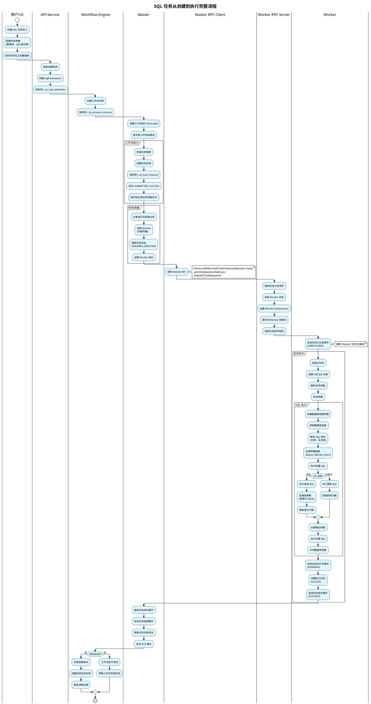
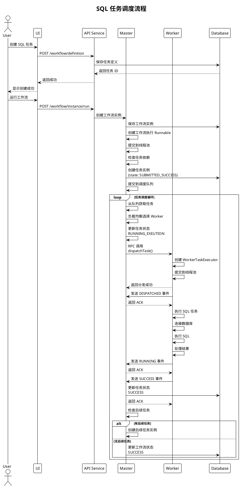
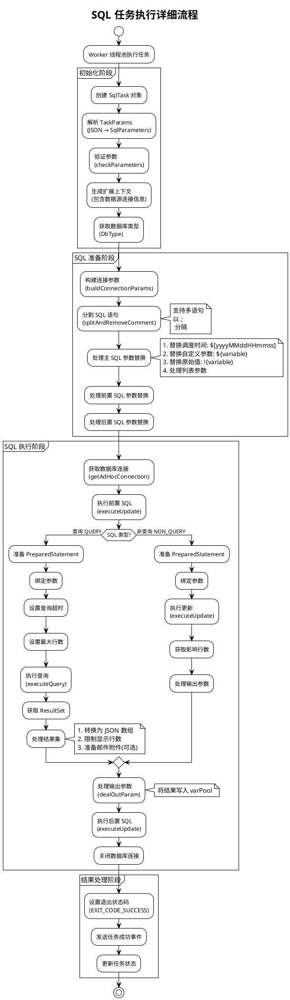
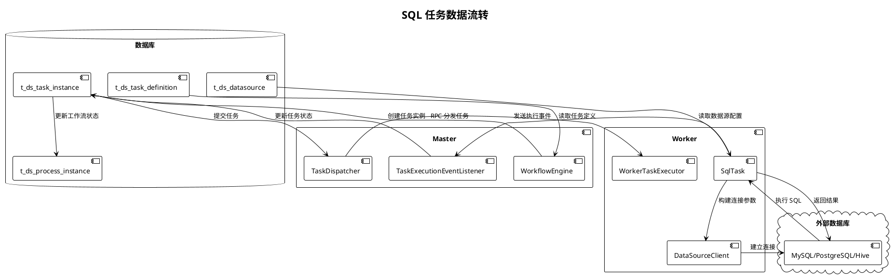

# SQL 任务从创建到执行完整流程分析

## 目录
1. [流程概览](#流程概览)
2. [阶段一：任务定义创建](#阶段一任务定义创建)
3. [阶段二：工作流实例创建](#阶段二工作流实例创建)
4. [阶段三：任务实例创建与提交](#阶段三任务实例创建与提交)
5. [阶段四：Master 调度任务](#阶段四master-调度任务)
6. [阶段五：Worker 接收任务](#阶段五worker-接收任务)
7. [阶段六：Worker 执行 SQL 任务](#阶段六worker-执行-sql-任务)
8. [阶段七：结果返回与状态更新](#阶段七结果返回与状态更新)
9. [PlantUML 流程图](#plantuml-流程图)

---

## 流程概览

SQL 任务从创建到执行的完整流程可以分为以下几个阶段：

```
1. 任务定义创建 (UI/API)
   ↓
2. 工作流实例创建 (手动触发/定时调度)
   ↓
3. 任务实例创建与提交 (Master)
   ↓
4. Master 调度任务 (选择 Worker)
   ↓
5. Worker 接收任务 (RPC 调用)
   ↓
6. Worker 执行 SQL 任务 (连接数据库、执行 SQL)
   ↓
7. 结果返回与状态更新 (Worker → Master → 数据库)
```

---

## 阶段一：任务定义创建

### 1.1 用户操作

**位置**: UI 界面 (`dolphinscheduler-ui`)

用户通过 UI 创建 SQL 任务：
1. 进入项目 → 工作流定义
2. 拖动 SQL 任务节点到画板
3. 配置任务参数：
   - 数据源选择
   - SQL 类型（查询/非查询）
   - SQL 语句
   - 前置 SQL
   - 后置 SQL
   - 自定义参数等

### 1.2 API 调用

**位置**: `WorkflowDefinitionServiceImpl.buildNormalSqlTaskDefinition()`

```java
private TaskDefinitionLog buildNormalSqlTaskDefinition(String taskName, DataSource dataSource, String sql) {
    TaskDefinitionLog taskDefinition = new TaskDefinitionLog();
    taskDefinition.setName(taskName);
    
    // 构建 SQL 参数
    SqlParameters sqlParameters = new SqlParameters();
    sqlParameters.setType(dataSource.getType().name());  // 数据库类型：MYSQL, POSTGRES, HIVE 等
    sqlParameters.setDatasource(dataSource.getId());     // 数据源 ID
    sqlParameters.setSql(sql);                            // SQL 语句
    sqlParameters.setSqlType(SqlType.NON_QUERY.ordinal()); // SQL 类型
    
    // 设置任务参数
    taskDefinition.setTaskParams(JSONUtils.toJsonString(sqlParameters));
    taskDefinition.setTaskType(SqlTaskChannelFactory.NAME); // "SQL"
    taskDefinition.setCode(CodeGenerateUtils.genCode());    // 生成任务编码
    
    return taskDefinition;
}
```

### 1.3 数据存储

任务定义保存到数据库：
- **表**: `t_ds_task_definition`
- **字段**: 
  - `code`: 任务编码（唯一标识）
  - `name`: 任务名称
  - `task_type`: "SQL"
  - `task_params`: JSON 格式的任务参数
  - `worker_group`: Worker 组
  - 其他配置信息

---

## 阶段二：工作流实例创建

### 2.1 触发方式

1. **手动触发**: 用户在 UI 点击"运行"
2. **定时调度**: 根据 Cron 表达式自动触发
3. **API 调用**: 通过 REST API 触发

### 2.2 工作流实例创建

**位置**: `WorkflowEngine` / `WorkflowExecutionRunnableFactory`

```java
// 创建工作流执行实例
WorkflowExecutionRunnable workflowRunnable = 
    workflowExecutionRunnableFactory.createWorkflowExecutionRunnable(workflowInstance);

// 提交到线程池执行
workflowExecutorThreadPool.submitWorkflowExecutionRunnable(workflowRunnable);
```

### 2.3 数据存储

工作流实例保存到数据库：
- **表**: `t_ds_process_instance`
- **字段**:
  - `id`: 工作流实例 ID
  - `process_definition_code`: 工作流定义编码
  - `state`: 状态（RUNNING, SUCCESS, FAILURE 等）
  - `start_time`: 开始时间
  - `run_times`: 运行次数

---

## 阶段三：任务实例创建与提交

### 3.1 任务实例创建

**位置**: `WorkflowExecutionRunnable` / `TaskInstanceDaoImpl`

当工作流执行到 SQL 任务节点时：

```java
// 创建任务实例
TaskInstance taskInstance = new TaskInstance();
taskInstance.setTaskCode(taskDefinition.getCode());
taskInstance.setTaskName(taskDefinition.getName());
taskInstance.setTaskType(taskDefinition.getTaskType());
taskInstance.setTaskParams(taskDefinition.getTaskParams());
taskInstance.setWorkflowInstanceId(workflowInstance.getId());
taskInstance.setState(TaskExecutionStatus.SUBMITTED_SUCCESS);

// 保存到数据库
taskInstanceDao.upsertTaskInstance(taskInstance);
```

### 3.2 任务提交到调度队列

**位置**: `GlobalTaskDispatchWaitingQueue`

```java
// 创建任务执行 Runnable
ITaskExecutionRunnable taskExecutionRunnable = 
    firstRunTaskInstanceFactory.createTaskExecutionRunnable(taskInstance);

// 提交到全局任务调度等待队列
globalTaskDispatchWaitingQueue.addTask(taskExecutionRunnable);
```

### 3.3 数据存储

任务实例保存到数据库：
- **表**: `t_ds_task_instance`
- **字段**:
  - `id`: 任务实例 ID
  - `task_code`: 任务编码
  - `process_instance_id`: 工作流实例 ID
  - `state`: 状态（SUBMITTED_SUCCESS, RUNNING_EXEUTION 等）
  - `submit_time`: 提交时间
  - `start_time`: 开始时间
  - `host`: Worker 地址（初始为 null）

---

## 阶段四：Master 调度任务

### 4.1 任务调度循环

**位置**: `GlobalTaskDispatchWaitingQueueLooper`

Master 定期从等待队列中取出任务进行调度：

```java
@Override
public void run() {
    while (!Thread.currentThread().isInterrupted()) {
        try {
            // 从等待队列获取任务
            ITaskExecutionRunnable taskExecutionRunnable = 
                globalTaskDispatchWaitingQueue.takeTask();
            
            // 调度任务
            taskDispatcher.dispatchTask(taskExecutionRunnable);
        } catch (Exception e) {
            log.error("Task dispatch error", e);
        }
    }
}
```

### 4.2 选择 Worker

**位置**: `WorkerTaskDispatcher.getTaskInstanceDispatchHost()`

```java
@Override
protected Optional<Host> getTaskInstanceDispatchHost(ITaskExecutionRunnable taskExecutionRunnable) {
    String workerGroup = taskExecutionRunnable.getTaskExecutionContext().getWorkerGroup();
    
    // 使用负载均衡器选择 Worker
    return workerLoadBalancer.select(workerGroup).map(Host::of);
}
```

**负载均衡策略**:
- 轮询（Round Robin）
- 随机（Random）
- 最少任务数（Least Task）
- 权重（Weight）

### 4.3 分发任务到 Worker

**位置**: `WorkerTaskDispatcher.doDispatch()`

```java
@Override
protected void doDispatch(ITaskExecutionRunnable taskExecutionRunnable) {
    final TaskExecutionContext taskExecutionContext = 
        taskExecutionRunnable.getTaskExecutionContext();
    final String workerAddress = taskExecutionContext.getHost();
    
    // 通过 RPC 调用 Worker
    final TaskInstanceDispatchResponse response = Clients
        .withService(ITaskInstanceOperator.class)
        .withHost(workerAddress)
        .dispatchTask(new TaskInstanceDispatchRequest(taskExecutionContext));
    
    if (!response.isDispatchSuccess()) {
        throw new TaskDispatchException("Dispatch task failed");
    }
}
```

### 4.4 更新任务状态

任务分发成功后，更新任务实例状态：
- `state`: SUBMITTED_SUCCESS → RUNNING_EXEUTION
- `host`: 设置为选中的 Worker 地址
- `start_time`: 设置为当前时间

---

## 阶段五：Worker 接收任务

### 5.1 RPC 接收请求

**位置**: `TaskInstanceDispatchOperationFunction.operate()`

Worker 的 RPC 服务器接收 Master 的请求：

```java
@Override
public TaskInstanceDispatchResponse operate(TaskInstanceDispatchRequest request) {
    TaskExecutionContext taskExecutionContext = request.getTaskExecutionContext();
    
    // 检查 Worker 状态
    if (!ServerLifeCycleManager.isRunning()) {
        return TaskInstanceDispatchResponse.failed(taskInstanceId, "server is not running");
    }
    
    // 设置日志路径
    taskExecutionContext.setLogPath(
        LogUtils.getTaskInstanceLogFullPath(taskExecutionContext));
    
    // 创建任务执行器
    WorkerTaskExecutor workerTaskExecutor = workerTaskExecutorFactoryBuilder
        .createWorkerTaskExecutorFactory(taskExecutionContext)
        .createWorkerTaskExecutor();
    
    // 提交到线程池执行
    if (workerTaskExecutorThreadPool.submitWorkerTaskExecutor(workerTaskExecutor)) {
        return TaskInstanceDispatchResponse.success(taskInstanceId);
    } else {
        return TaskInstanceDispatchResponse.failed(taskInstanceId, "Thread pool is full");
    }
}
```

### 5.2 创建任务执行器

**位置**: `WorkerTaskExecutorFactoryBuilder`

```java
// 根据任务类型创建对应的执行器工厂
TaskChannelFactory taskChannelFactory = 
    TaskPluginManager.getTaskChannelFactory(taskType);

// 创建 WorkerTaskExecutor
WorkerTaskExecutor executor = new DefaultWorkerTaskExecutor(
    taskExecutionContext, 
    taskChannelFactory);
```

对于 SQL 任务：
- `taskType`: "SQL"
- `taskChannelFactory`: `SqlTaskChannelFactory`
- `taskChannel`: `SqlTaskChannel`

### 5.3 发送任务已分发事件

**位置**: `WorkerTaskExecutor.initializeTask()`

任务提交到线程池后，发送事件通知 Master：

```java
// 发送任务已分发事件
workerMessageSender.sendMessageWithRetry(
    taskExecutionContext,
    ITaskExecutionEvent.TaskInstanceExecutionEventType.DISPATCHED);
```

---

## 阶段六：Worker 执行 SQL 任务

### 6.1 任务执行入口

**位置**: `WorkerTaskExecutor.run()`

```java
@Override
public void run() {
    try {
        // 1. 初始化任务
        initializeTask();
        
        // 2. 执行前处理
        beforeExecute();
        
        // 3. 执行任务
        executeTask(taskCallBack);
        
        // 4. 执行后处理
        afterExecute();
        
        // 5. 关闭日志
        closeLogAppender();
    } catch (Throwable ex) {
        afterThrowing(ex);
    }
}
```

### 6.2 创建 SQL 任务对象

**位置**: `SqlTaskChannel.createTask()`

```java
@Override
public AbstractTask createTask(TaskExecutionContext taskRequest) {
    return new SqlTask(taskRequest);
}
```

**位置**: `SqlTask` 构造函数

```java
public SqlTask(TaskExecutionContext taskRequest) {
    super(taskRequest);
    this.taskExecutionContext = taskRequest;
    
    // 解析任务参数
    this.sqlParameters = JSONUtils.parseObject(
        taskExecutionContext.getTaskParams(), 
        SqlParameters.class);
    
    // 验证参数
    if (sqlParameters == null || !sqlParameters.checkParameters()) {
        throw new TaskException("sql task params is not valid");
    }
    
    // 生成扩展上下文（包含数据源连接信息）
    sqlTaskExecutionContext = sqlParameters.generateExtendedContext(
        taskExecutionContext.getResourceParametersHelper());
    
    // 获取数据库类型
    dbType = DbType.valueOf(sqlParameters.getType());
}
```

### 6.3 执行 SQL 任务

**位置**: `SqlTask.handle()`

#### 6.3.1 准备数据源连接

```java
// 构建连接参数
baseConnectionParam = (BaseConnectionParam) DataSourceUtils.buildConnectionParams(
    dbType, 
    sqlTaskExecutionContext.getConnectionParams());
```

#### 6.3.2 解析 SQL 语句

```java
// 分割 SQL 语句（支持多语句，以 ;\n 分隔）
List<String> subSqls = DataSourceProcessorProvider
    .getDataSourceProcessor(dbType)
    .splitAndRemoveComment(sqlParameters.getSql());

// 处理参数替换
List<SqlBinds> mainStatementSqlBinds = subSqls.stream()
    .map(this::getSqlAndSqlParamsMap)
    .collect(Collectors.toList());
```

**参数替换流程**:
1. 替换调度时间变量：`$[yyyyMMddHHmmss]`
2. 替换自定义参数：`${variable}`
3. 替换原始值：`!{variable}`（不参与预编译）
4. 处理列表参数：展开为多个值

#### 6.3.3 执行 SQL

**位置**: `SqlTask.executeFuncAndSql()`

```java
public void executeFuncAndSql(
    List<SqlBinds> mainStatementsBinds,
    List<SqlBinds> preStatementsBinds,
    List<SqlBinds> postStatementsBinds) throws Exception {
    
    // 获取数据库连接
    try (Connection connection = DataSourceClientProvider.getAdHocConnection(
            DbType.valueOf(sqlParameters.getType()),
            baseConnectionParam)) {
        
        // 1. 执行前置 SQL
        executeUpdate(connection, preStatementsBinds, "pre");
        
        // 2. 执行主 SQL
        String result = null;
        if (sqlParameters.getSqlType() == SqlType.QUERY.ordinal()) {
            // 查询类型：执行查询，返回结果集
            result = executeQuery(connection, mainStatementsBinds.get(0), "main");
        } else if (sqlParameters.getSqlType() == SqlType.NON_QUERY.ordinal()) {
            // 非查询类型：执行更新，返回影响行数
            String updateResult = executeUpdate(connection, mainStatementsBinds, "main");
            result = setNonQuerySqlReturn(updateResult, sqlParameters.getLocalParams());
        }
        
        // 3. 处理输出参数
        sqlParameters.dealOutParam(result);
        
        // 4. 执行后置 SQL
        executeUpdate(connection, postStatementsBinds, "post");
    }
}
```

#### 6.3.4 执行查询 SQL

**位置**: `SqlTask.executeQuery()`

```java
private String executeQuery(Connection connection, SqlBinds sqlBinds, String handlerType) {
    try (PreparedStatement statement = prepareStatementAndBind(connection, sqlBinds)) {
        log.info("{} statement execute query, for sql: {}", handlerType, sqlBinds.getSql());
        
        // 执行查询
        ResultSet resultSet = statement.executeQuery();
        
        // 处理结果集
        return resultProcess(resultSet);
    }
}
```

**结果处理**:
1. 将 ResultSet 转换为 JSON 数组
2. 限制显示行数（默认 10000 行）
3. 如果配置了邮件通知，准备附件内容
4. 返回 JSON 格式的结果

#### 6.3.5 执行更新 SQL

**位置**: `SqlTask.executeUpdate()`

```java
private String executeUpdate(Connection connection, List<SqlBinds> statementsBinds, String handlerType) {
    int result = 0;
    for (SqlBinds sqlBind : statementsBinds) {
        try (PreparedStatement statement = prepareStatementAndBind(connection, sqlBind)) {
            // 执行更新
            result = statement.executeUpdate();
            log.info("{} statement execute update result: {}, for sql: {}", 
                handlerType, result, sqlBind.getSql());
        }
    }
    return String.valueOf(result);
}
```

### 6.4 发送任务运行中事件

**位置**: `WorkerTaskExecutor.executeTask()`

```java
// 发送任务运行中事件
workerMessageSender.sendMessageWithRetry(
    taskExecutionContext,
    ITaskExecutionEvent.TaskInstanceExecutionEventType.RUNNING);
```

---

## 阶段七：结果返回与状态更新

### 7.1 任务执行完成

**位置**: `WorkerTaskExecutor.run()`

```java
// 任务执行成功
taskExecutionContext.setCurrentExecutionStatus(TaskExecutionStatus.SUCCESS);
taskExecutionContext.setEndTime(System.currentTimeMillis());

// 发送任务成功事件
workerMessageSender.sendMessageWithRetry(
    taskExecutionContext,
    ITaskExecutionEvent.TaskInstanceExecutionEventType.SUCCESS);
```

### 7.2 Master 接收事件

**位置**: `TaskExecutionEventListenerImpl.onTaskInstanceExecutionSuccess()`

```java
@Override
public void onTaskInstanceExecutionSuccess(TaskExecutionSuccessEvent event) {
    // 获取任务执行器
    final ITaskExecutionRunnable taskExecutionRunnable = 
        getTaskExecutionRunnable(event);
    
    // 发布生命周期事件
    final TaskSuccessLifecycleEvent lifecycleEvent = TaskSuccessLifecycleEvent.builder()
        .taskExecutionRunnable(taskExecutionRunnable)
        .endTime(new Date(event.getEndTime()))
        .varPool(event.getVarPool())
        .build();
    
    taskExecutionRunnable.getWorkflowEventBus().publish(lifecycleEvent);
    
    // 发送 ACK 确认
    Clients
        .withService(ITaskInstanceExecutionEventAckListener.class)
        .withHost(event.getTaskInstanceHost())
        .handleTaskInstanceExecutionSuccessEventAck(
            TaskInstanceExecutionSuccessEventAck.success(event.getTaskInstanceId()));
}
```

### 7.3 更新任务状态

**位置**: `WorkflowExecutionRunnable` 处理生命周期事件

```java
// 更新任务实例状态
taskInstance.setState(TaskExecutionStatus.SUCCESS);
taskInstance.setEndTime(new Date());
taskInstanceDao.updateById(taskInstance);
```

### 7.4 继续工作流执行

如果任务执行成功，工作流引擎会：
1. 检查后续任务是否满足执行条件
2. 如果满足，创建并提交后续任务实例
3. 重复阶段三到阶段七的流程

---

## PlantUML 流程图

### 完整流程图



### 任务调度流程图



### SQL 执行详细流程图



### 数据流转图



---

## 关键组件说明

### 1. SqlParameters

SQL 任务的参数对象，包含：
- `type`: 数据库类型（MYSQL, POSTGRES, HIVE 等）
- `datasource`: 数据源 ID
- `sql`: SQL 语句
- `sqlType`: SQL 类型（QUERY/NON_QUERY）
- `preStatements`: 前置 SQL 列表
- `postStatements`: 后置 SQL 列表
- `localParams`: 自定义参数列表
- `limit`: 查询结果限制行数

### 2. SqlTask

SQL 任务的执行类，主要方法：
- `handle()`: 执行入口
- `executeFuncAndSql()`: 执行 SQL 的核心方法
- `executeQuery()`: 执行查询 SQL
- `executeUpdate()`: 执行更新 SQL
- `getSqlAndSqlParamsMap()`: 处理参数替换

### 3. TaskExecutionContext

任务执行上下文，包含：
- `taskInstanceId`: 任务实例 ID
- `workflowInstanceId`: 工作流实例 ID
- `taskParams`: 任务参数（JSON 字符串）
- `resourceParametersHelper`: 资源参数帮助类
- `prepareParamsMap`: 准备参数映射
- `varPool`: 变量池

### 4. SQLTaskExecutionContext

SQL 任务扩展上下文，包含：
- `connectionParams`: 数据源连接参数

---

## 关键流程点

### 1. 参数替换

SQL 语句中的参数替换顺序：
1. **调度时间变量**: `$[yyyyMMddHHmmss]` → 替换为实际调度时间
2. **自定义参数**: `${variable}` → 替换为变量值，参与预编译
3. **原始值替换**: `!{variable}` → 直接替换，不参与预编译
4. **列表参数**: 展开为多个值

### 2. SQL 执行顺序

```
前置 SQL → 主 SQL → 后置 SQL
```

### 3. 结果处理

- **查询类型**: 结果集转换为 JSON 数组，可配置邮件通知
- **非查询类型**: 返回影响行数，可配置输出参数

### 4. 事件通知

任务执行过程中会发送多个事件：
1. **DISPATCHED**: 任务已分发到 Worker
2. **RUNNING**: 任务开始执行
3. **SUCCESS/FAILURE**: 任务执行完成

每个事件都会等待 Master 的 ACK 确认，确保可靠传输。

---

## 总结

SQL 任务从创建到执行的完整流程涉及多个组件和阶段：

1. **创建阶段**: UI/API → 数据库
2. **调度阶段**: Master → Worker（RPC）
3. **执行阶段**: Worker → 数据库（JDBC）
4. **反馈阶段**: Worker → Master（事件）

整个过程采用事件驱动架构，通过 RPC 和事件机制实现 Master 和 Worker 之间的协调，确保任务可靠执行和状态同步。

