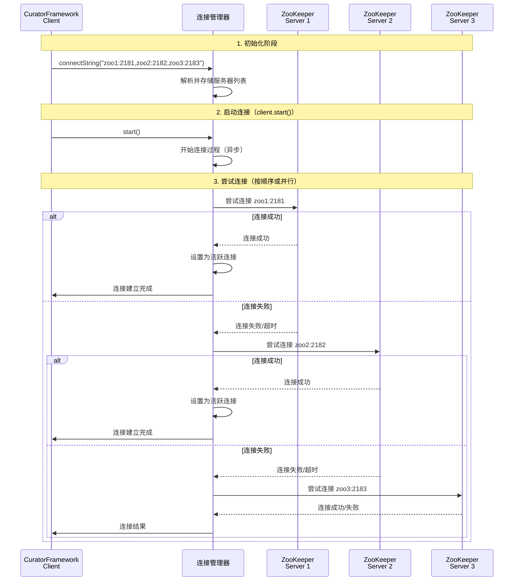
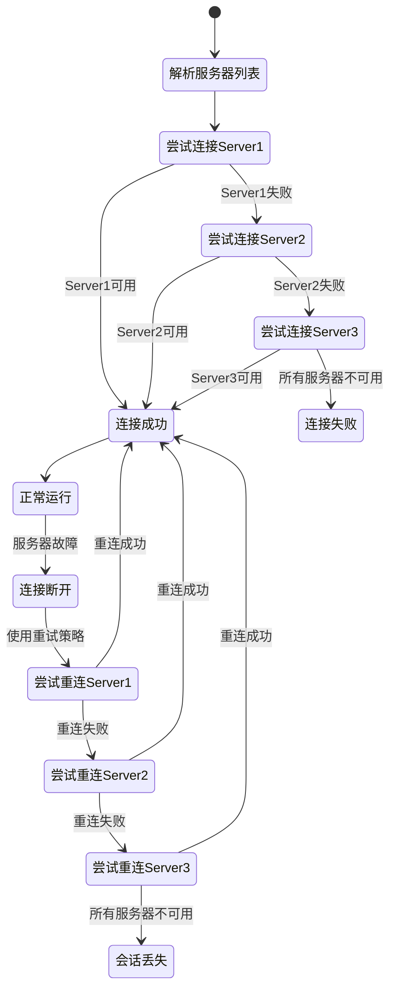
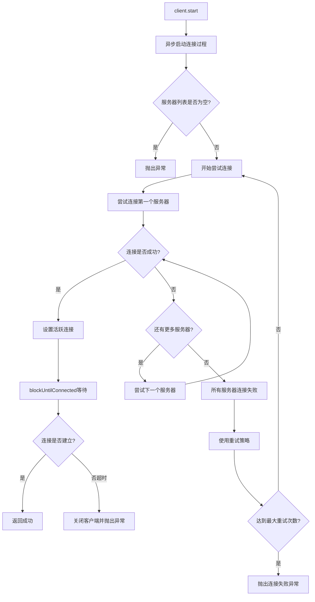
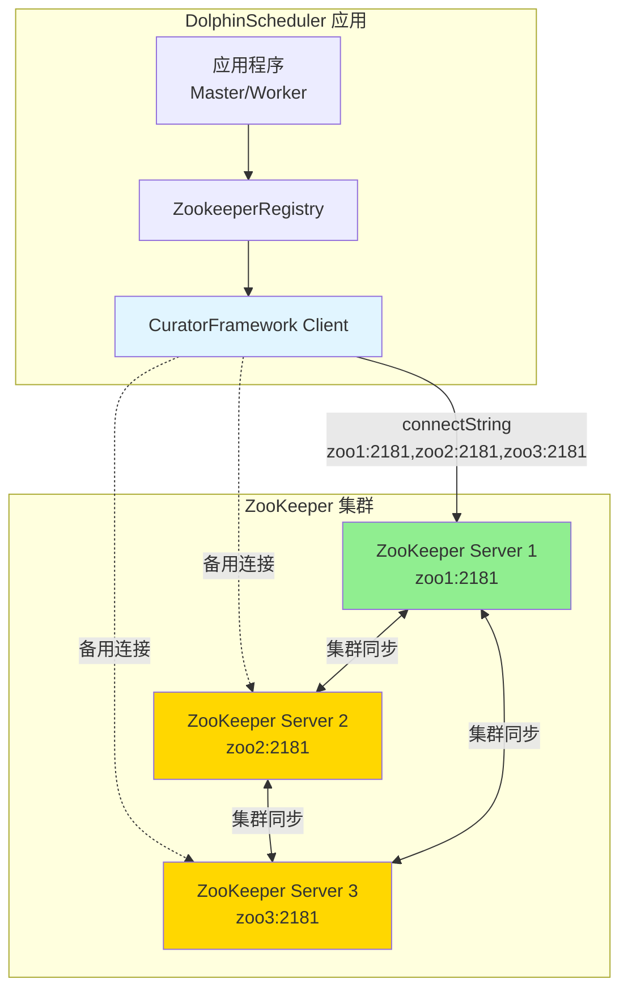
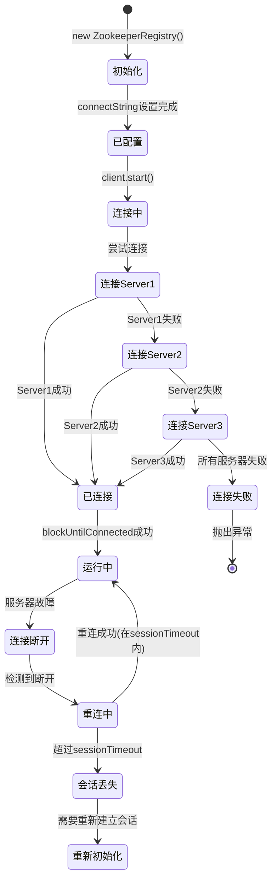

# CuratorFramework 客户端连接集群分析

## 目录

- [1. 代码位置](#1-代码位置)
- [2. 功能概述](#2-功能概述)
  - [2.1 核心作用](#21-核心作用)
- [3. 连接字符串格式](#3-连接字符串格式)
  - [3.1 基本格式](#31-基本格式)
  - [3.2 配置示例](#32-配置示例)
  - [3.3 解析过程](#33-解析过程)
- [4. CuratorFramework 集群连接机制](#4-curatorframework-集群连接机制)
  - [4.1 连接管理策略](#41-连接管理策略)
  - [4.2 连接建立流程](#42-连接建立流程)
  - [4.3 故障转移机制](#43-故障转移机制)
  - [4.4 重试策略与故障转移](#44-重试策略与故障转移)
- [5. 连接建立详细流程](#5-连接建立详细流程)
  - [5.1 start() 方法](#51-start-方法)
  - [5.2 连接建立步骤](#52-连接建立步骤)
  - [5.3 连接超时处理](#53-连接超时处理)
- [6. 高可用机制详解](#6-高可用机制详解)
  - [6.1 服务器列表的作用](#61-服务器列表的作用)
  - [6.2 会话保持机制](#62-会话保持机制)
  - [6.3 故障场景处理](#63-故障场景处理)
- [7. 配置参数影响](#7-配置参数影响)
  - [7.1 相关配置参数](#71-相关配置参数)
  - [7.2 参数对集群连接的影响](#72-参数对集群连接的影响)
  - [7.3 配置建议](#73-配置建议)
- [8. 实际代码流程](#8-实际代码流程)
  - [8.1 初始化流程](#81-初始化流程)
  - [8.2 连接建立流程](#82-连接建立流程)
  - [8.3 底层连接逻辑](#83-底层连接逻辑)
- [9. 集群连接架构图](#9-集群连接架构图)
  - [9.1 整体架构](#91-整体架构)
  - [9.2 连接状态转换](#92-连接状态转换)
- [10. 最佳实践](#10-最佳实践)
  - [10.1 生产环境配置建议](#101-生产环境配置建议)
  - [10.2 服务器列表配置建议](#102-服务器列表配置建议)
  - [10.3 故障排查](#103-故障排查)
- [11. 总结](#11-总结)
  - [11.1 关键要点](#111-关键要点)
  - [11.2 设计优势](#112-设计优势)
  - [11.3 适用场景](#113-适用场景)

---

## 1. 代码位置

**文件**: `ZookeeperRegistry.java`  
**行号**: 112

```java
.connectString(properties.getConnectString())//IP1:PORT1,IP2:PORT2
```

---

## 2. 功能概述

`connectString()` 方法用于配置 CuratorFramework 客户端与 ZooKeeper 集群的连接字符串。当配置为多个服务器地址时，CuratorFramework 会实现自动故障转移和高可用机制。

### 2.1 核心作用

- **集群连接**: 支持连接到 ZooKeeper 集群中的多个节点
- **故障转移**: 当前连接失败时，自动尝试连接其他节点
- **高可用性**: 确保在部分节点故障时仍能提供服务
- **负载均衡**: 客户端可以从多个可用节点中选择连接

---

## 3. 连接字符串格式

### 3.1 基本格式

连接字符串支持两种格式：

1. **单节点连接**
   ```
   host:port
   示例: localhost:2181
   ```

2. **集群连接（多节点）**
   ```
   host1:port1,host2:port2,host3:port3
   示例: zoo1:2181,zoo2:2182,zoo3:2183
   示例: 192.168.1.1:2181,192.168.1.2:2181,192.168.1.3:2181
   ```

### 3.2 配置示例

在 `application.yaml` 中的配置：

```yaml
registry:
  type: zookeeper
  zookeeper:
    connect-string: zoo1:2181,zoo2:2182,zoo3:2183
    # 或
    # connect-string: 192.168.1.1:2181,192.168.1.2:2181,192.168.1.3:2181
```

### 3.3 解析过程

CuratorFramework 内部会按照以下步骤解析连接字符串：

1. **字符串分割**: 使用逗号（`,`）分割字符串，得到多个服务器地址
2. **地址解析**: 对每个 `host:port` 进行解析，提取主机名和端口号
3. **地址列表构建**: 将所有解析后的地址添加到服务器列表中
4. **连接优先级**: 按照配置顺序尝试连接（但实际连接顺序可能由底层实现决定）

---

## 4. CuratorFramework 集群连接机制

### 4.1 连接管理策略

**重要特性**: CuratorFramework **只维护一个活跃连接**（通常是最先连接成功的节点），但通过以下机制实现高可用：

```
┌─────────────────────────────────────────────────────────┐
│              CuratorFramework Client                     │
│                                                          │
│  ┌──────────────────────────────────────────────────┐  │
│  │  连接管理器 (Connection Manager)                  │  │
│  │  - 维护服务器地址列表                              │  │
│  │  - 管理当前活跃连接                                │  │
│  │  - 监控连接状态                                    │  │
│  └──────────────────────────────────────────────────┘  │
│                        │                                 │
│                        │ (仅一个活跃连接)                 │
│                        ↓                                 │
└────────────────────────┼─────────────────────────────────┘
                         │
          ┌──────────────┼──────────────┐
          │              │              │
          ↓              ↓              ↓
    ┌─────────┐   ┌─────────┐   ┌─────────┐
    │ ZooKeeper│   │ ZooKeeper│   │ ZooKeeper│
    │ Server 1 │   │ Server 2 │   │ Server 3 │
    │ :2181    │   │ :2182    │   │ :2183    │
    └─────────┘   └─────────┘   └─────────┘
    (优先连接)     (备用)        (备用)
```

### 4.2 连接建立流程



### 4.3 故障转移机制

当当前连接的服务器出现故障时，CuratorFramework 会自动进行故障转移：



### 4.4 重试策略与故障转移

```java
final ExponentialBackoffRetry retryPolicy = new ExponentialBackoffRetry(
    (int) properties.getRetryPolicy().getBaseSleepTime().toMillis(),  // 初始等待时间：1秒
    properties.getRetryPolicy().getMaxRetries(),                       // 最大重试次数：3次
    (int) properties.getRetryPolicy().getMaxSleep().toMillis()         // 最大等待时间：3秒
);
```

**重试行为**:

1. **当前服务器重试**: 首先在当前连接的服务器上重试
2. **切换服务器**: 如果重试失败，切换到服务器列表中的下一个节点
3. **指数退避**: 重试间隔按指数增长（1s → 2s → 3s）
4. **循环尝试**: 在所有服务器间循环尝试，直到连接成功或达到最大重试次数

---

## 5. 连接建立详细流程

### 5.1 start() 方法

```java
@Override
public void start() {
    final StopWatch stopWatch = StopWatch.createStarted();
    // 异步非阻塞调用,后台开始连接过程
    client.start();
    try {
        // 同步等待连接建立，最多等待 blockUntilConnected 时间
        if (!client.blockUntilConnected(DurationUtils.toMillisInt(properties.getBlockUntilConnected()),
                MILLISECONDS)) {
            client.close();
            throw new RegistryException(
                    "zookeeper connect failed to: " + properties.getConnectString() + " in : "
                            + properties.getBlockUntilConnected() + "ms");
        }
        stopWatch.stop();
        log.info("ZookeeperRegistry started at: {}/ms", stopWatch.getTime());
    } catch (InterruptedException e) {
        Thread.currentThread().interrupt();
        throw new RegistryException("Zookeeper registry start failed", e);
    }
}
```

### 5.2 连接建立步骤



### 5.3 连接超时处理

**关键参数**:
- `connectionTimeout`: 每个服务器连接的超时时间（默认 15 秒）
- `blockUntilConnected`: 总体连接等待时间（默认 15 秒）

**行为说明**:
1. 每个服务器的连接尝试最多等待 `connectionTimeout` 时间
2. 如果在 `blockUntilConnected` 时间内未能建立连接，则抛出异常
3. 在 `blockUntilConnected` 时间内，会循环尝试所有服务器

---

## 6. 高可用机制详解

### 6.1 服务器列表的作用

当 `connectString` 配置为多个服务器时：

```
connectString: "zoo1:2181,zoo2:2182,zoo3:2183"
```

CuratorFramework 的行为：

1. **初始化阶段**: 解析并存储所有服务器地址
2. **连接阶段**: 尝试连接列表中的服务器（顺序或并行，由实现决定）
3. **运行阶段**: 只维护与一个服务器的活跃连接
4. **故障阶段**: 当连接断开时，从列表中尝试其他服务器

### 6.2 会话保持机制

ZooKeeper 的会话机制与连接字符串配合工作：

```
┌─────────────────────────────────────────────────────┐
│             客户端会话 (Session)                      │
│  Session ID: 0x1234567890abcdef                     │
│  Session Timeout: 60s                               │
└─────────────────────────────────────────────────────┘
                    │
                    │ 会话信息在所有服务器间共享
                    │
    ┌───────────────┼───────────────┐
    │               │               │
    ↓               ↓               ↓
┌─────────┐    ┌─────────┐    ┌─────────┐
│ Server1 │    │ Server2 │    │ Server3 │
│ (活跃)  │    │ (备用)  │    │ (备用)  │
└─────────┘    └─────────┘    └─────────┘
     │
     │ 连接断开后，会话在 sessionTimeout 内仍然有效
     │
     ↓
[重新连接到任意服务器]
     │
     │ 使用相同的 Session ID 恢复会话
     │
     ↓
┌─────────┐
│ Server2 │ (新连接)
│ (活跃)  │
└─────────┘
```

**关键点**:
- 会话信息在所有 ZooKeeper 服务器间共享
- 连接断开后，会话在 `sessionTimeout` 内仍然有效（默认 60 秒）
- 重连到任意服务器时，可以使用相同的 Session ID 恢复会话
- 只有在 `sessionTimeout` 内无法重连时，会话才会丢失

### 6.3 故障场景处理

#### 场景 1: 当前连接的服务器故障

```
时间轴：
T0: 连接到 Server1 (正常)
T1: Server1 故障，连接断开
T2: CuratorFramework 检测到断开
T3: 使用重试策略，尝试重连 Server1
T4: Server1 仍然不可用，切换到 Server2
T5: 成功连接到 Server2
T6: 会话恢复，继续正常工作
```

#### 场景 2: 多个服务器同时故障

```
时间轴：
T0: 连接到 Server1 (正常)
T1: Server1, Server2 同时故障
T2: 尝试重连 Server1 → 失败
T3: 尝试连接 Server2 → 失败
T4: 尝试连接 Server3 → 成功（如果 Server3 可用）
T5: 会话恢复（如果在 sessionTimeout 内）
```

#### 场景 3: 所有服务器不可达

```
时间轴：
T0: 连接到 Server1 (正常)
T1: 所有服务器不可达
T2: 尝试重连所有服务器 → 全部失败
T3: 持续重试（使用重试策略）
T4: 超过 sessionTimeout (60s)
T5: 会话丢失，状态变为 LOST
T6: 需要重新建立会话
```

---

## 7. 配置参数影响

### 7.1 相关配置参数

```java
.connectString(properties.getConnectString())                    // 连接字符串
.retryPolicy(retryPolicy)                                         // 重试策略
.sessionTimeoutMs(DurationUtils.toMillisInt(properties.getSessionTimeout()))  // 会话超时：60s
.connectionTimeoutMs(DurationUtils.toMillisInt(properties.getConnectionTimeout()))  // 连接超时：15s
```

### 7.2 参数对集群连接的影响

| 参数 | 默认值 | 对集群连接的影响 |
|-----|--------|-----------------|
| **connectString** | - | 服务器列表，决定可用的备用节点 |
| **connectionTimeout** | 15秒 | 每个服务器连接尝试的超时时间 |
| **sessionTimeout** | 60秒 | 会话保持时间，影响故障恢复窗口 |
| **blockUntilConnected** | 15秒 | 总体连接等待时间 |
| **baseSleepTime** | 1秒 | 重试策略的初始等待时间 |
| **maxRetries** | 3次 | 最大重试次数 |
| **maxSleep** | 3秒 | 重试策略的最大等待时间 |

### 7.3 配置建议

#### 单节点 vs 集群

**单节点配置**（仅用于开发测试）:
```yaml
registry:
  zookeeper:
    connect-string: localhost:2181
```

**集群配置**（生产环境推荐）:
```yaml
registry:
  zookeeper:
    connect-string: zoo1:2181,zoo2:2181,zoo3:2181
    # 或使用IP地址
    # connect-string: 192.168.1.10:2181,192.168.1.11:2181,192.168.1.12:2181
```

#### 参数调优建议

1. **connectionTimeout**: 
   - 建议值：10-30秒
   - 如果网络延迟较高，可以适当增加
   - 过小可能导致正常网络波动时连接失败

2. **sessionTimeout**:
   - 建议值：30-120秒
   - 需要在故障恢复时间和资源占用之间平衡
   - 过小可能导致频繁会话超时，过大可能导致故障检测延迟

3. **blockUntilConnected**:
   - 建议值：≥ connectionTimeout × 服务器数量
   - 确保有足够时间尝试所有服务器

4. **重试策略**:
   - 生产环境建议使用 `ExponentialBackoffRetry`
   - 根据网络状况调整 `maxRetries` 和 `maxSleep`

---

## 8. 实际代码流程

### 8.1 初始化流程

```java
// 1. 从配置文件读取连接字符串
String connectString = properties.getConnectString();
// 示例: "zoo1:2181,zoo2:2182,zoo3:2183"

// 2. 创建 CuratorFramework 构建器
CuratorFrameworkFactory.Builder builder = 
    CuratorFrameworkFactory.builder()
        .connectString(connectString)  // 设置连接字符串
        .retryPolicy(retryPolicy)      // 设置重试策略
        .sessionTimeoutMs(60000)       // 会话超时 60秒
        .connectionTimeoutMs(15000);   // 连接超时 15秒

// 3. 构建 CuratorFramework 实例（此时未连接）
CuratorFramework client = builder.build();
```

### 8.2 连接建立流程

```java
// 1. 启动客户端（异步，非阻塞）
client.start();

// 2. 同步等待连接建立
boolean connected = client.blockUntilConnected(15000, TimeUnit.MILLISECONDS);

if (!connected) {
    // 连接失败，关闭客户端
    client.close();
    throw new RegistryException("zookeeper connect failed");
}
```

### 8.3 底层连接逻辑（CuratorFramework 内部）

CuratorFramework 内部的连接逻辑大致如下（简化说明）：

1. **解析连接字符串**:
   ```java
   String[] servers = connectString.split(",");
   // servers = ["zoo1:2181", "zoo2:2182", "zoo3:2183"]
   ```

2. **尝试连接**:
   ```java
   for (String server : servers) {
       try {
           // 尝试连接到服务器
           connection = connectToServer(server, connectionTimeout);
           if (connection != null) {
               activeConnection = connection;
               break;  // 连接成功，退出循环
           }
       } catch (Exception e) {
           // 连接失败，尝试下一个
           continue;
       }
   }
   ```

3. **故障转移**:
   ```java
   if (activeConnection.isClosed()) {
       // 连接断开，尝试重新连接
       for (String server : servers) {
           if (tryReconnect(server)) {
               activeConnection = reconnectToServer(server);
               break;
           }
       }
   }
   ```

---

## 9. 集群连接架构图

### 9.1 整体架构



### 9.2 连接状态转换



---

## 10. 最佳实践

### 10.1 生产环境配置建议

```yaml
registry:
  type: zookeeper
  zookeeper:
    namespace: dolphinscheduler
    # 配置多个服务器，使用逗号分隔
    connect-string: zoo1:2181,zoo2:2181,zoo3:2181
    retry-policy:
      base-sleep-time: 1s
      max-sleep: 3s
      max-retries: 5
    session-timeout: 60s      # 根据网络状况调整
    connection-timeout: 15s   # 根据网络延迟调整
    block-until-connected: 30s  # 应该 >= connection-timeout × 服务器数量
```

### 10.2 服务器列表配置建议

1. **服务器数量**: 建议配置奇数个服务器（3、5、7等），遵循 ZooKeeper 集群的最佳实践
2. **服务器顺序**: 虽然顺序理论上不影响，但建议将最稳定的服务器放在前面
3. **网络隔离**: 确保客户端能够访问所有配置的服务器
4. **DNS vs IP**: 
   - 使用 DNS 名称便于维护，但需要确保 DNS 解析稳定
   - 使用 IP 地址更直接，但不利于服务器迁移

### 10.3 故障排查

#### 常见问题

1. **连接超时**
   - 检查网络连通性
   - 检查防火墙设置
   - 增加 `connectionTimeout` 值

2. **所有服务器连接失败**
   - 验证 `connectString` 格式正确
   - 检查服务器是否正常运行
   - 检查端口是否正确

3. **频繁断开重连**
   - 检查网络稳定性
   - 适当增加 `sessionTimeout`
   - 检查服务器负载

---

## 11. 总结

### 11.1 关键要点

1. **单连接机制**: CuratorFramework 只维护一个活跃连接，但通过服务器列表实现高可用
2. **自动故障转移**: 当前连接失败时，自动尝试连接列表中的其他服务器
3. **会话保持**: 利用 ZooKeeper 的会话机制，在 `sessionTimeout` 内可以恢复会话
4. **重试策略**: 使用指数退避重试策略，提高连接成功率
5. **配置灵活性**: 支持单节点和集群两种配置方式

### 11.2 设计优势

- **高可用性**: 多个服务器提供冗余，单个节点故障不影响服务
- **自动恢复**: 连接断开后自动重连，无需人工干预
- **简单配置**: 只需提供服务器列表，无需复杂的负载均衡配置
- **透明切换**: 客户端无需关心连接到哪个服务器，框架自动管理

### 11.3 适用场景

- ✅ **生产环境**: 必须使用集群配置，确保高可用性
- ✅ **开发测试**: 可以使用单节点配置，简化环境
- ✅ **故障恢复**: 需要快速故障转移的应用场景
- ✅ **网络不稳定**: 网络波动较大的环境，通过重试策略提高稳定性