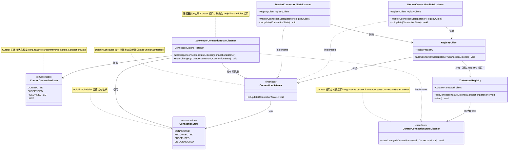
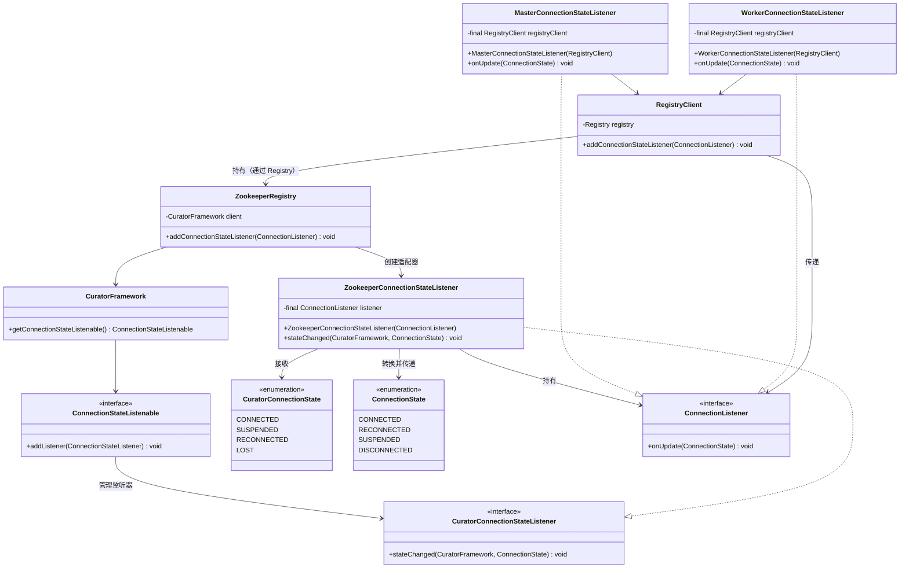
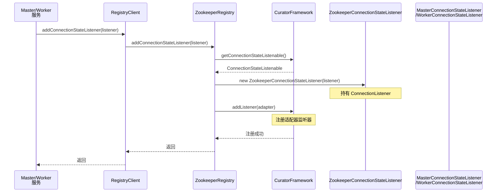
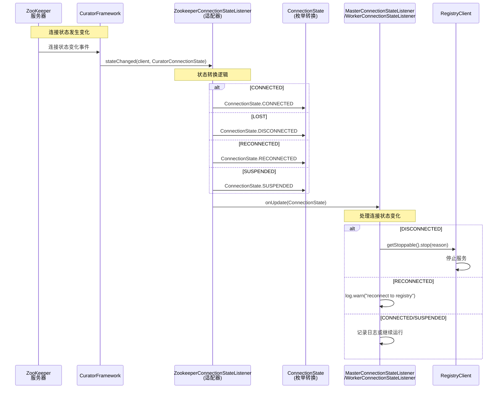
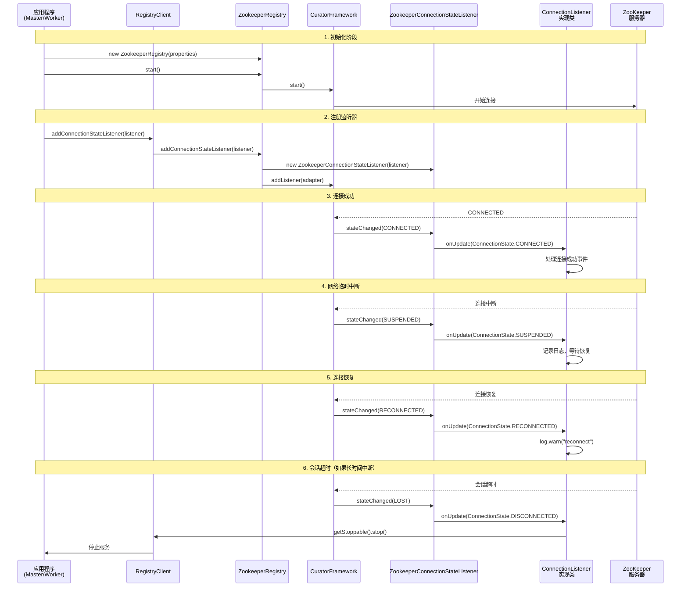

# ZookeeperRegistry.addConnectionStateListener 详细分析

## 目录

- [1. 代码位置](#1-代码位置)
- [2. 功能概述](#2-功能概述)
  - [2.1 核心作用](#21-核心作用)
- [3. 代码详细解析](#3-代码详细解析)
  - [3.1 方法调用链](#31-方法调用链)
  - [3.2 关键组件](#32-关键组件)
- [4. CuratorFramework 连接状态说明](#4-curatorframework-连接状态说明)
  - [4.1 Curator 连接状态类型](#41-curator-连接状态类型)
  - [4.2 状态转换流程](#42-状态转换流程)
- [5. 实际使用场景](#5-实际使用场景)
  - [5.1 Master 服务使用](#51-master-服务使用)
  - [5.2 Worker 服务使用](#52-worker-服务使用)
- [6. 设计模式分析](#6-设计模式分析)
  - [6.1 适配器模式（Adapter Pattern）](#61-适配器模式adapter-pattern)
  - [6.2 UML 类图](#62-uml-类图)
  - [6.3 UML 时序图](#63-uml-时序图)
- [7. 关键要点总结](#7-关键要点总结)
  - [7.1 监听器注册时机](#71-监听器注册时机)
  - [7.2 线程安全](#72-线程安全)
  - [7.3 状态处理建议](#73-状态处理建议)
  - [7.4 与会话超时的关系](#74-与会话超时的关系)
- [8. 相关配置](#8-相关配置)
  - [8.1 ZookeeperRegistry 构造参数](#81-zookeeperregistry-构造参数)
  - [8.2 连接状态变化触发条件](#82-连接状态变化触发条件)
- [9. 示例代码](#9-示例代码)
  - [9.1 完整使用流程](#91-完整使用流程)
  - [9.2 测试用例](#92-测试用例)
- [10. 总结](#10-总结)

---

## 1. 代码位置

**文件**: `ZookeeperRegistry.java`  
**行号**: 164-167

```java
@Override
public void addConnectionStateListener(ConnectionListener listener) {
    client.getConnectionStateListenable().addListener(new ZookeeperConnectionStateListener(listener));
}
```

---

## 2. 功能概述

该方法用于**注册连接状态监听器**，用于监听 CuratorFramework 客户端与 ZooKeeper 服务器之间的连接状态变化。

### 2.1 核心作用
- **实时监控**: 监听客户端与 ZooKeeper 的连接状态变化
- **状态通知**: 当连接状态发生变化时，通过回调通知上层应用
- **故障处理**: 帮助应用及时响应连接断开、重连等事件

---

## 3. 代码详细解析

### 3.1 方法调用链

```
ZookeeperRegistry.addConnectionStateListener()
    ↓
CuratorFramework.getConnectionStateListenable()
    ↓
ConnectionStateListenable.addListener()
    ↓
ZookeeperConnectionStateListener (适配器)
    ↓
ConnectionListener.onUpdate() (上层回调)
```

### 3.2 关键组件

#### ① `client.getConnectionStateListenable()`

- **类型**: `ConnectionStateListenable`
- **作用**: CuratorFramework 提供的连接状态监听器管理接口
- **功能**: 
  - 管理所有注册的 `ConnectionStateListener`
  - 当连接状态变化时，通知所有已注册的监听器

#### ② `ZookeeperConnectionStateListener`

**文件**: `ZookeeperConnectionStateListener.java`

这是一个**适配器（Adapter Pattern）**，用于将 Curator 的连接状态转换为 DolphinScheduler 的统一状态。

```java
@Slf4j
final class ZookeeperConnectionStateListener implements ConnectionStateListener {
    
    private final ConnectionListener listener;  // 上层回调接口
    
    @Override
    public void stateChanged(CuratorFramework client,
                             org.apache.curator.framework.state.ConnectionState newState) {
        switch (newState) {
            case CONNECTED:      // Curator 的 CONNECTED
                listener.onUpdate(ConnectionState.CONNECTED);  // 转换为 DolphinScheduler 的 CONNECTED
                break;
            case LOST:           // Curator 的 LOST
                listener.onUpdate(ConnectionState.DISCONNECTED);  // 转换为 DISCONNECTED
                break;
            case RECONNECTED:    // Curator 的 RECONNECTED
                listener.onUpdate(ConnectionState.RECONNECTED);
                break;
            case SUSPENDED:      // Curator 的 SUSPENDED
                listener.onUpdate(ConnectionState.SUSPENDED);
                break;
        }
    }
}
```

**状态映射关系**:

| Curator 状态 | DolphinScheduler 状态 | 说明 |
|-------------|---------------------|------|
| `CONNECTED` | `CONNECTED` | 首次连接成功 |
| `LOST` | `DISCONNECTED` | 连接丢失（会话超时或网络故障） |
| `RECONNECTED` | `RECONNECTED` | 重新连接成功 |
| `SUSPENDED` | `SUSPENDED` | 连接挂起（临时故障，可能恢复） |

#### ③ `ConnectionListener`

**文件**: `ConnectionListener.java`

```java
@FunctionalInterface
public interface ConnectionListener {
    void onUpdate(ConnectionState newState);
}
```

这是 DolphinScheduler 定义的**统一连接状态监听接口**，所有注册中心实现（ZooKeeper、Etcd、JDBC）都使用这个接口。

---

## 4. CuratorFramework 连接状态说明

### 4.1 Curator 连接状态类型

| 状态 | 说明 | 触发场景 |
|-----|------|---------|
| **CONNECTED** | 连接成功 | 首次连接建立或重新连接成功 |
| **SUSPENDED** | 连接挂起 | 网络临时中断，但会话未超时，可能自动恢复 |
| **RECONNECTED** | 重新连接 | 从 SUSPENDED 状态恢复连接 |
| **LOST** | 连接丢失 | 会话超时或长时间无法连接，需要重新建立会话 |

### 4.2 状态转换流程

```
启动客户端
    ↓
[CONNECTED] ←──────────┐
    ↓                  │
网络中断                │
    ↓                  │
[SUSPENDED]            │
    ↓                  │
恢复连接                │
    ↓                  │
[RECONNECTED]          │
    ↓                  │
继续使用                │
    ↓                  │
会话超时或长时间中断     │
    ↓                  │
[LOST] ────────────────┘
    ↓
需要重新初始化连接
```

---

## 5. 实际使用场景

### 5.1 Master 服务使用

**文件**: `MasterRegistryClient.java`

```java
registryClient.addConnectionStateListener(new MasterConnectionStateListener(registryClient));
```

**MasterConnectionStateListener 处理逻辑**:

```java
@Override
public void onUpdate(ConnectionState state) {
    switch (state) {
        case CONNECTED:
            // 连接成功，正常服务
            break;
        case SUSPENDED:
            // 连接挂起，等待恢复
            break;
        case RECONNECTED:
            // 重新连接，记录日志
            log.warn("Master reconnect to registry");
            break;
        case DISCONNECTED:
            // 连接断开，停止 Master 服务
            registryClient.getStoppable().stop("Master disconnected from registry, will stop myself");
            break;
    }
}
```

### 5.2 Worker 服务使用

**文件**: `WorkerRegistryClient.java`

```java
registryClient.addConnectionStateListener(new WorkerConnectionStateListener(registryClient));
```

**WorkerConnectionStateListener 处理逻辑**:

```java
@Override
public void onUpdate(ConnectionState state) {
    switch (state) {
        case DISCONNECTED:
            // Worker 断开连接时，停止服务
            registryClient.getStoppable().stop("Worker disconnected from registry, will stop myself");
            break;
        // ... 其他状态处理
    }
}
```

---

## 6. 设计模式分析

### 6.1 适配器模式（Adapter Pattern）

```
┌─────────────────────────────────────────┐
│   Curator ConnectionStateListener       │  (源接口)
│   (Curator 框架定义的接口)                │
└─────────────────────────────────────────┘
              ↑ 实现
┌─────────────────────────────────────────┐
│   ZookeeperConnectionStateListener      │  (适配器)
│   - 实现 Curator 的接口                   │
│   - 持有 DolphinScheduler 的 listener    │
│   - 进行状态转换                          │
└─────────────────────────────────────────┘
              ↓ 调用
┌─────────────────────────────────────────┐
│   ConnectionListener                    │  (目标接口)
│   (DolphinScheduler 统一接口)            │
└─────────────────────────────────────────┘
```

**优势**:
- **解耦**: DolphinScheduler 不直接依赖 Curator 的状态类型
- **统一**: 所有注册中心实现使用相同的 `ConnectionListener` 接口
- **可扩展**: 新增注册中心实现时，只需实现适配器即可

---

### 6.2 UML 类图

#### 6.2.1 类关系图



#### 6.2.2 详细类图（包含字段和方法）



---

### 6.3 UML 时序图

#### 6.3.1 监听器注册流程



#### 6.3.2 连接状态变化通知流程



#### 6.3.3 完整生命周期时序图



---

## 7. 关键要点总结

### 7.1 监听器注册时机

- **最佳实践**: 在客户端启动（`start()`）之后注册监听器
- **注意**: 如果先注册监听器再启动，可能错过初始连接事件

### 7.2 线程安全

- `ConnectionStateListenable.addListener()` 是线程安全的
- `ZookeeperConnectionStateListener.stateChanged()` 可能在不同线程中调用
- 确保 `ConnectionListener.onUpdate()` 的实现是线程安全的

### 7.3 状态处理建议

| 状态 | 建议处理方式 |
|-----|------------|
| **CONNECTED** | 正常提供服务，无需特殊处理 |
| **RECONNECTED** | 记录日志，可能需要重新注册服务 |
| **SUSPENDED** | 等待恢复，可记录日志但不停止服务 |
| **DISCONNECTED** | 停止服务，避免提供不可靠的服务 |

### 7.4 与会话超时的关系

- **SUSPENDED**: 会话仍有效（在 `sessionTimeout` 内）
- **LOST**: 会话已超时（超过 `sessionTimeout`），需要重新建立会话
- **sessionTimeout**: 在 `ZookeeperRegistry` 构造函数中配置，默认 60 秒

---

## 8. 相关配置

### 8.1 ZookeeperRegistry 构造参数

```java
.sessionTimeoutMs(DurationUtils.toMillisInt(properties.getSessionTimeout()))
// 会话超时时间，影响 SUSPENDED → LOST 的转换
```

### 8.2 连接状态变化触发条件

1. **CONNECTED**: 
   - `client.start()` 后首次连接成功
   - 从 LOST 状态重新连接成功

2. **SUSPENDED**:
   - 网络临时中断
   - 但仍在 `sessionTimeout` 范围内

3. **RECONNECTED**:
   - 从 SUSPENDED 状态恢复连接
   - 会话仍然有效

4. **LOST**:
   - 会话超时（超过 `sessionTimeout`）
   - 长时间无法连接 ZooKeeper 服务器

---

## 9. 示例代码

### 9.1 完整使用流程

```java
// 1. 创建 ZookeeperRegistry
ZookeeperRegistry registry = new ZookeeperRegistry(properties);

// 2. 启动客户端
registry.start();

// 3. 注册连接状态监听器
registry.addConnectionStateListener(new ConnectionListener() {
    @Override
    public void onUpdate(ConnectionState newState) {
        log.info("Connection state changed to: {}", newState);
        switch (newState) {
            case CONNECTED:
                // 处理连接成功
                break;
            case DISCONNECTED:
                // 处理连接断开
                break;
            // ...
        }
    }
});
```

### 9.2 测试用例

```java
AtomicReference<ConnectionState> connectionState = new AtomicReference<>();
registry.addConnectionStateListener(connectionState::set);

// 等待状态变化
// connectionState.get() 会包含最新的连接状态
```

---

## 10. 总结

`addConnectionStateListener` 方法通过适配器模式，将 CuratorFramework 的连接状态变化转换为 DolphinScheduler 的统一状态通知，实现了：

1. **解耦**: DolphinScheduler 与 Curator 框架解耦
2. **统一**: 所有注册中心实现统一的接口
3. **可监控**: 实时监控连接状态，及时响应故障
4. **可扩展**: 易于扩展新的注册中心实现

该机制对于分布式系统中服务的健康管理和故障恢复至关重要。
