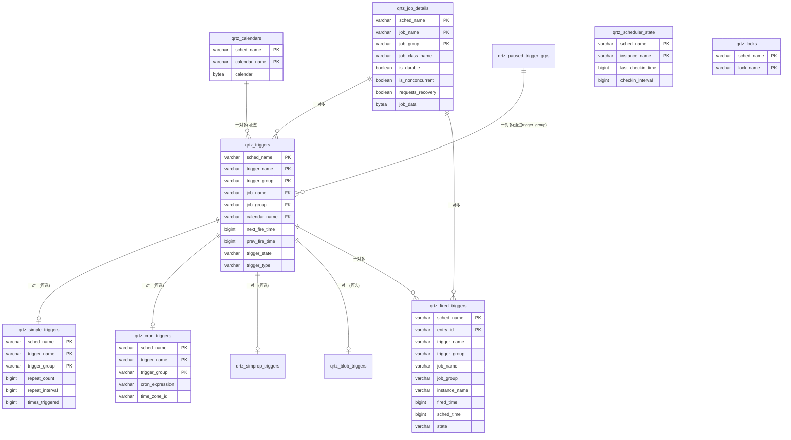
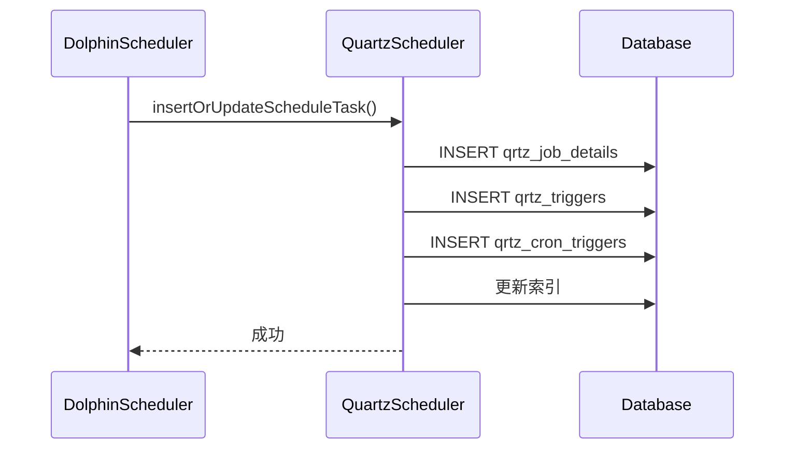
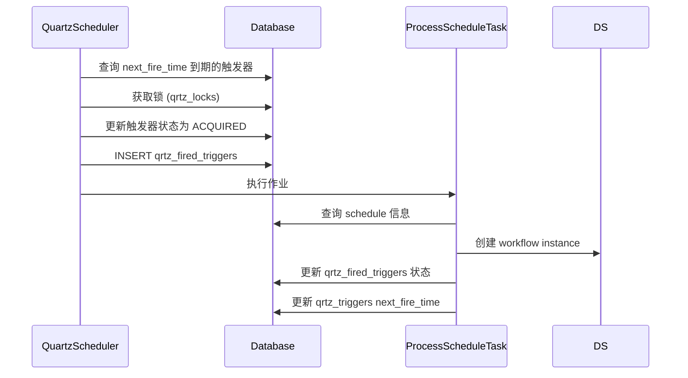
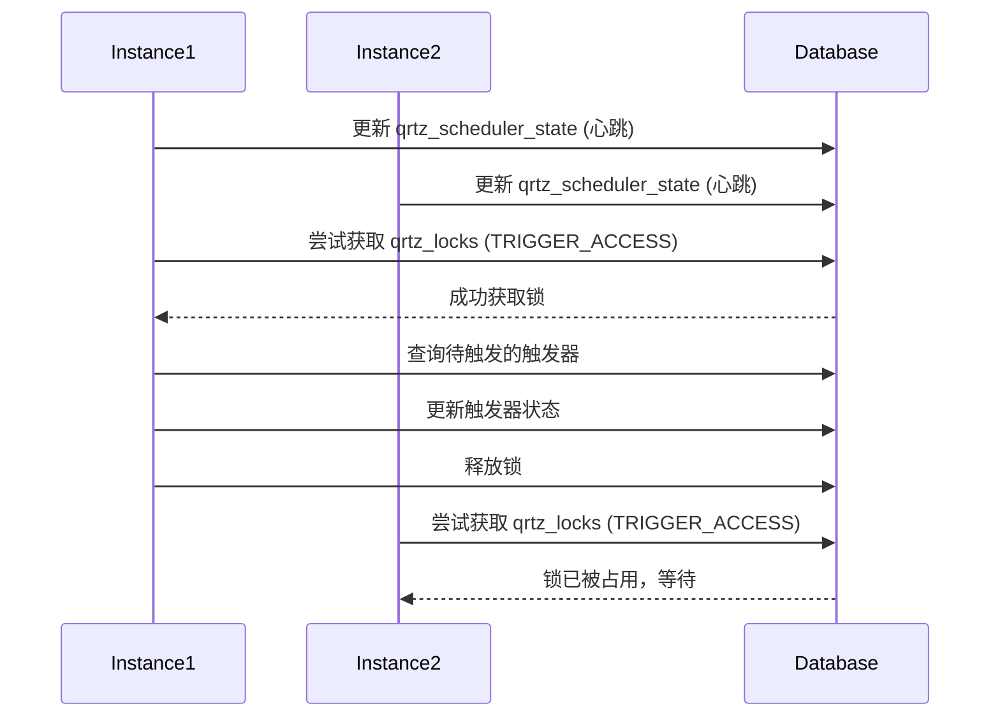

# Quartz 定时器表结构分析

## 1. 概述

本文档分析了 DolphinScheduler 项目中使用的 Quartz 定时器相关的数据库表结构。Quartz 是一个功能强大的开源作业调度框架，支持集群部署、持久化存储和多种触发器类型。

## 2. 表结构总览

Quartz 相关的表共 **11 张**，可以分为以下几个类别：

### 2.1 核心表
- **qrtz_job_details**: 作业详情表
- **qrtz_triggers**: 触发器表

### 2.2 触发器类型表
- **qrtz_simple_triggers**: 简单触发器表
- **qrtz_cron_triggers**: Cron触发器表
- **qrtz_simprop_triggers**: 属性触发器表
- **qrtz_blob_triggers**: Blob触发器表

### 2.3 辅助表
- **qrtz_calendars**: 日历表
- **qrtz_paused_trigger_grps**: 暂停的触发器组表
- **qrtz_fired_triggers**: 已触发的触发器表
- **qrtz_scheduler_state**: 调度器状态表
- **qrtz_locks**: 锁表

## 3. 表关系图

## 4. 核心表详细分析

### 4.1 qrtz_job_details (作业详情表)

**作用**: 存储所有作业的定义信息，是 Quartz 的核心表之一。

**关键字段**:
- `sched_name`: 调度器名称，用于多调度器环境
- `job_name` + `job_group`: 唯一标识一个作业
- `job_class_name`: 作业实现类的全限定名，DolphinScheduler 中使用的是 `ProcessScheduleTask`
- `is_durable`: 持久化标志，true 表示作业在调度器关闭后仍然存在
- `is_nonconcurrent`: 非并发标志，true 表示同一作业实例不能并发执行
- `requests_recovery`: 恢复标志，true 表示作业失败后需要恢复
- `job_data`: 存储序列化的作业参数

**索引**:
- 主键: `(sched_name, job_name, job_group)`
- `idx_qrtz_j_req_recovery`: 用于查找需要恢复的作业
- `idx_qrtz_j_grp`: 用于按组查询作业

### 4.2 qrtz_triggers (触发器表)

**作用**: 存储所有触发器的定义信息，关联到作业详情表。

**关键字段**:
- `trigger_name` + `trigger_group`: 唯一标识一个触发器
- `job_name` + `job_group`: 外键，关联到 `qrtz_job_details`
- `trigger_state`: 触发器状态
  - `WAITING`: 等待触发
  - `ACQUIRED`: 已获取，准备执行
  - `EXECUTING`: 正在执行
  - `COMPLETE`: 完成
  - `PAUSED`: 暂停
  - `BLOCKED`: 阻塞
  - `ERROR`: 错误
- `trigger_type`: 触发器类型
  - `SIMPLE`: 简单触发器
  - `CRON`: Cron触发器
  - `BLOB`: Blob触发器
  - `CAL_INT`: 日历间隔触发器
- `next_fire_time`: 下次触发时间（时间戳，毫秒）
- `prev_fire_time`: 上次触发时间（时间戳，毫秒）
- `calendar_name`: 关联的日历名称，用于排除特定日期
- `misfire_instr`: 错过触发时的处理策略

**索引**:
- 主键: `(sched_name, trigger_name, trigger_group)`
- `idx_qrtz_t_j`: 通过作业名称和组查询触发器
- `idx_qrtz_t_next_fire_time`: 用于查找下次触发时间
- `idx_qrtz_t_nft_st`: 组合索引，用于查找待触发的触发器
- `idx_qrtz_t_nft_st_misfire_grp`: 用于处理错过触发的触发器

## 5. 触发器类型表分析

### 5.1 qrtz_cron_triggers (Cron触发器表)

**作用**: 存储 Cron 触发器的特定属性，DolphinScheduler 主要使用此类型。

**关键字段**:
- `cron_expression`: Cron 表达式，定义触发时间规则
- `time_zone_id`: 时区ID，如 `Asia/Shanghai`

**关系**: 与 `qrtz_triggers` 表通过 `(sched_name, trigger_name, trigger_group)` 关联，是一对一关系。

**在 DolphinScheduler 中的使用**:
- DolphinScheduler 的调度任务使用 Cron 表达式定义执行时间
- 通过 `QuartzCornTriggerBuilder` 构建 Cron 触发器

### 5.2 qrtz_simple_triggers (简单触发器表)

**作用**: 存储简单触发器的特定属性，用于固定间隔的重复触发。

**关键字段**:
- `repeat_count`: 重复次数，-1 表示无限重复
- `repeat_interval`: 重复间隔（毫秒）
- `times_triggered`: 已触发次数

### 5.3 qrtz_simprop_triggers (属性触发器表)

**作用**: 存储带属性的简单触发器的扩展属性。

**关键字段**: 包含多种类型的属性字段（字符串、整数、长整数、小数、布尔值）。

### 5.4 qrtz_blob_triggers (Blob触发器表)

**作用**: 用于存储自定义触发器类型的序列化数据。

**关键字段**:
- `blob_data`: 二进制大对象数据，存储序列化的触发器对象

## 6. 辅助表分析

### 6.1 qrtz_calendars (日历表)

**作用**: 存储日历对象，用于在触发器中排除特定日期（如节假日）。

**关键字段**:
- `calendar_name`: 日历名称
- `calendar`: 序列化的日历对象

**关系**: 被 `qrtz_triggers` 表的 `calendar_name` 字段引用。

### 6.2 qrtz_paused_trigger_grps (暂停的触发器组表)

**作用**: 记录被暂停的触发器组。

**关键字段**:
- `trigger_group`: 暂停的触发器组名

**使用场景**: 当需要暂停某个组的所有触发器时，会在此表中记录。

### 6.3 qrtz_fired_triggers (已触发的触发器表)

**作用**: 记录所有已触发但尚未完成的触发器执行记录。

**关键字段**:
- `entry_id`: 条目ID，唯一标识一次触发
- `instance_name`: 调度器实例名称，用于集群环境
- `fired_time`: 触发时间
- `sched_time`: 调度时间
- `state`: 执行状态
- `job_name` + `job_group`: 关联的作业信息
- `trigger_name` + `trigger_group`: 关联的触发器信息
- `requests_recovery`: 是否需要恢复

**索引**:
- 多个索引用于快速查询不同维度的已触发记录
- `idx_qrtz_ft_inst_job_req_rcvry`: 用于查找需要恢复的作业

### 6.4 qrtz_scheduler_state (调度器状态表)

**作用**: 用于集群环境下记录各个调度器实例的心跳状态。

**关键字段**:
- `instance_name`: 调度器实例名称
- `last_checkin_time`: 最后检查时间
- `checkin_interval`: 检查间隔

**使用场景**: 
- 集群环境下，每个调度器实例定期更新此表
- 用于检测实例是否存活
- 用于故障转移

### 6.5 qrtz_locks (锁表)

**作用**: 用于集群环境下实现分布式锁，保证同一时间只有一个实例执行关键操作。

**关键字段**:
- `lock_name`: 锁名称
  - `STATE_ACCESS`: 状态访问锁
  - `TRIGGER_ACCESS`: 触发器访问锁

**使用场景**:
- 获取触发器时加锁
- 更新调度器状态时加锁
- 保证集群环境下的数据一致性

## 7. 数据流转过程

### 7.1 作业创建流程

### 7.2 触发器执行流程

### 7.3 集群环境下的工作流程

## 8. 关键索引分析

### 8.1 性能优化索引

1. **qrtz_triggers 表的组合索引**
   - `idx_qrtz_t_nft_st`: `(sched_name, trigger_state, next_fire_time)`
     - 用于快速查找待触发的触发器
     - 调度器定期扫描此索引获取需要触发的任务
   
   - `idx_qrtz_t_nft_st_misfire_grp`: `(sched_name, misfire_instr, next_fire_time, trigger_group, trigger_state)`
     - 用于处理错过触发的触发器
     - 支持按组处理

2. **qrtz_fired_triggers 表的索引**
   - `idx_qrtz_ft_inst_job_req_rcvry`: `(sched_name, instance_name, requests_recovery)`
     - 用于故障恢复时查找需要恢复的作业
     - 支持按实例查询

### 8.2 查询优化建议

1. **触发器查询**: 使用 `next_fire_time` 和 `trigger_state` 的组合索引
2. **作业恢复**: 使用 `requests_recovery` 和 `instance_name` 的组合索引
3. **集群心跳**: 定期更新 `qrtz_scheduler_state` 表，避免过期实例

## 9. DolphinScheduler 中的使用

### 9.1 关键类

1. **QuartzScheduler**: 实现 `SchedulerApi` 接口，封装 Quartz 操作
2. **ProcessScheduleTask**: 继承 `QuartzJobBean`，实际执行的作业类
3. **QuartzCornTriggerBuilder**: 构建 Cron 触发器
4. **QuartzJobDetailBuilder**: 构建作业详情

### 9.2 作业数据存储

在 `qrtz_job_details.job_data` 中存储：
- `projectId`: 项目ID
- `scheduleId`: 调度ID

在 `qrtz_triggers.job_data` 中存储：
- 触发器的额外参数

### 9.3 触发器命名规则

- Job Key: `{projectId}_{scheduleId}`
- Trigger Key: `{projectId}_{scheduleId}_trigger`

## 10. 总结

Quartz 表结构设计合理，支持：

1. **多种触发器类型**: 通过不同的触发器类型表支持不同的调度需求
2. **集群部署**: 通过锁表和状态表支持多实例部署
3. **故障恢复**: 通过 `requests_recovery` 标志和 `fired_triggers` 表支持作业恢复
4. **性能优化**: 通过合理的索引设计支持高效的查询

在 DolphinScheduler 中，主要使用 Cron 触发器来实现工作流的定时调度，通过 Quartz 的集群能力保证了高可用性。

