# Quartz 分布式调度器工作原理与配置分析

## 1. 概述

Quartz 是 DolphinScheduler 中用于实现定时调度的核心组件，负责根据 Cron 表达式定时触发工作流实例的创建。本文档详细分析 Quartz 在 DolphinScheduler 中的工作原理、配置方式以及集群部署机制。

### 1.1 Quartz 在 DolphinScheduler 中的作用

- **定时调度**: 根据用户配置的 Cron 表达式，定时触发工作流实例的创建
- **集群支持**: 支持多 Master 节点部署，通过数据库实现分布式锁和任务分发
- **持久化存储**: 所有调度任务信息存储在数据库中，支持故障恢复
- **高可用**: 通过集群机制实现故障转移和负载均衡

## 2. 架构设计

### 2.1 整体架构图

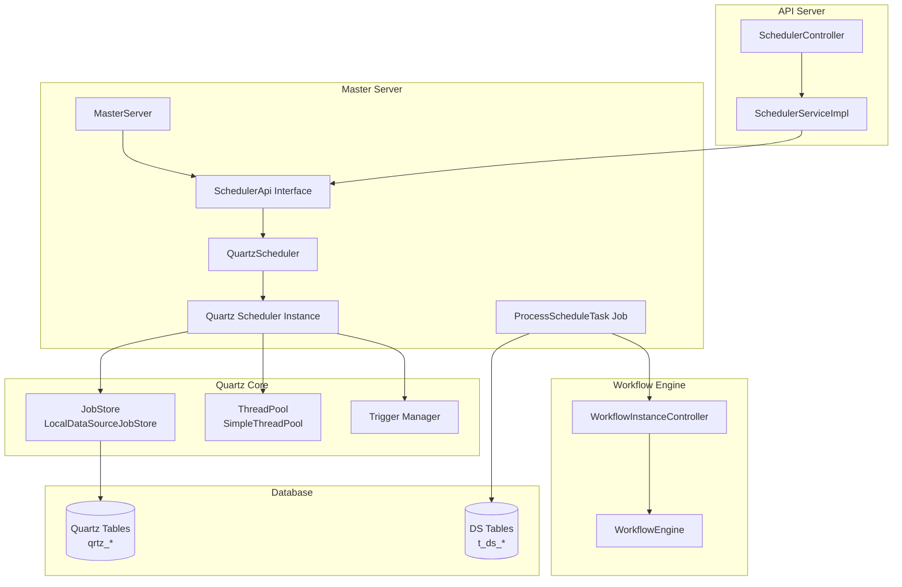
```mermaid
graph TB
    subgraph "API Server"
        API[SchedulerController]
        SchedulerService[SchedulerServiceImpl]
    end

    subgraph "Master Server"
        MasterServer[MasterServer]
        SchedulerApi[SchedulerApi Interface]
        QuartzScheduler[QuartzScheduler]
        QuartzSchedulerInstance[Quartz Scheduler Instance]
        ProcessScheduleTask[ProcessScheduleTask Job]
    end

    subgraph "Quartz Core"
        JobStore[JobStore<br/>LocalDataSourceJobStore]
        ThreadPool[ThreadPool<br/>SimpleThreadPool]
        TriggerManager[Trigger Manager]
    end

    subgraph "Database"
        QuartzTables[(Quartz Tables<br/>qrtz_*)]
        DSTables[(DS Tables<br/>t_ds_*)]
    end

    subgraph "Workflow Engine"
        WorkflowEngine[WorkflowEngine]
        WorkflowInstanceController[WorkflowInstanceController]
    end

    API --> SchedulerService
    SchedulerService --> SchedulerApi
    MasterServer --> SchedulerApi
    SchedulerApi --> QuartzScheduler
    QuartzScheduler --> QuartzSchedulerInstance
    QuartzSchedulerInstance --> JobStore
    QuartzSchedulerInstance --> ThreadPool
    QuartzSchedulerInstance --> TriggerManager
    JobStore --> QuartzTables
    ProcessScheduleTask --> DSTables
    ProcessScheduleTask --> WorkflowInstanceController
    WorkflowInstanceController --> WorkflowEngine
```

### 2.2 核心类图

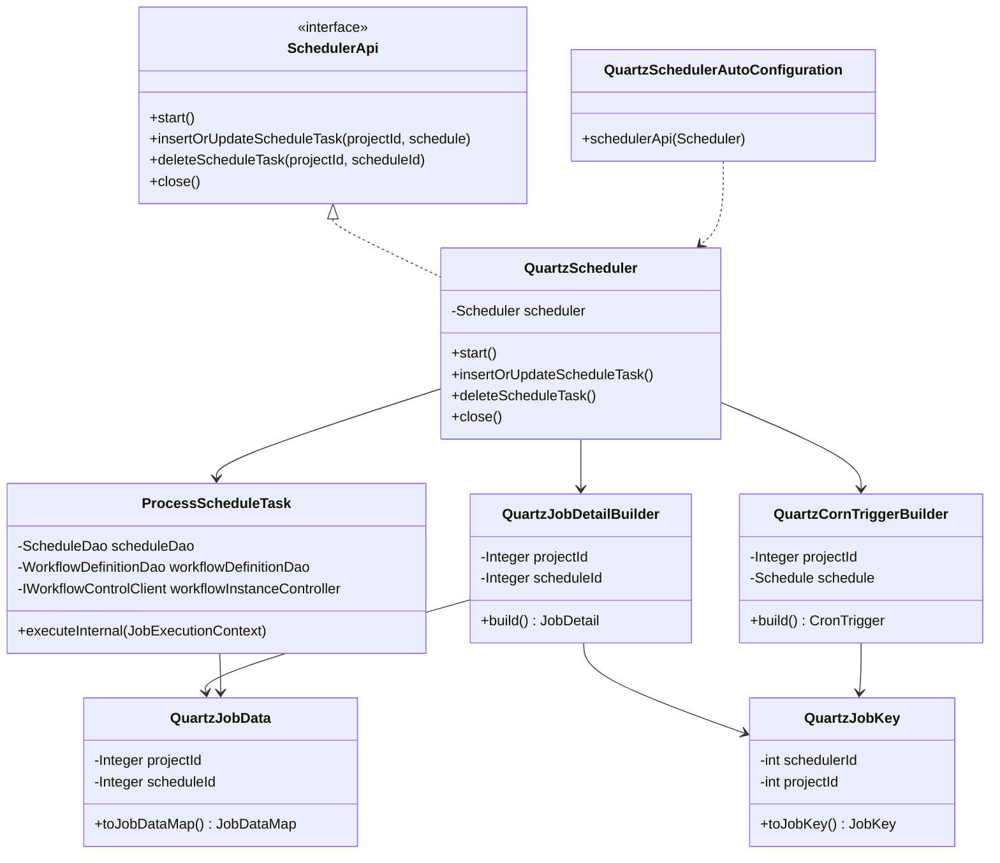
```mermaid
classDiagram
    class SchedulerApi {
        <<interface>>
        +start()
        +insertOrUpdateScheduleTask(projectId, schedule)
        +deleteScheduleTask(projectId, scheduleId)
        +close()
    }

    class QuartzScheduler {
        -Scheduler scheduler
        +start()
        +insertOrUpdateScheduleTask()
        +deleteScheduleTask()
        +close()
    }

    class QuartzSchedulerAutoConfiguration {
        +schedulerApi(Scheduler)
    }

    class ProcessScheduleTask {
        -ScheduleDao scheduleDao
        -WorkflowDefinitionDao workflowDefinitionDao
        -IWorkflowControlClient workflowInstanceController
        +executeInternal(JobExecutionContext)
    }

    class QuartzJobDetailBuilder {
        -Integer projectId
        -Integer scheduleId
        +build() JobDetail
    }

    class QuartzCornTriggerBuilder {
        -Integer projectId
        -Schedule schedule
        +build() CronTrigger
    }

    class QuartzJobKey {
        -int schedulerId
        -int projectId
        +toJobKey() JobKey
    }

    class QuartzJobData {
        -Integer projectId
        -Integer scheduleId
        +toJobDataMap() JobDataMap
    }

    SchedulerApi <|.. QuartzScheduler
    QuartzScheduler --> ProcessScheduleTask
    QuartzScheduler --> QuartzJobDetailBuilder
    QuartzScheduler --> QuartzCornTriggerBuilder
    QuartzJobDetailBuilder --> QuartzJobKey
    QuartzJobDetailBuilder --> QuartzJobData
    QuartzCornTriggerBuilder --> QuartzJobKey
    ProcessScheduleTask --> QuartzJobData
    QuartzSchedulerAutoConfiguration ..> QuartzScheduler
```

## 3. 配置详解

### 3.1 Master Server 配置

Master Server 中的 Quartz 配置位于 `application.yaml`:

```yaml
spring:
  quartz:
    job-store-type: jdbc                    # 使用 JDBC 存储
    jdbc:
      initialize-schema: never              # 不自动初始化表结构
    properties:
      # 线程池配置
      org.quartz.threadPool.class: org.quartz.simpl.SimpleThreadPool
      org.quartz.threadPool.threadCount: 25                    # 线程池大小
      org.quartz.threadPool.threadPriority: 5                   # 线程优先级
      org.quartz.threadPool.makeThreadsDaemons: true           # 守护线程

      # 调度器配置
      org.quartz.scheduler.instanceName: DolphinScheduler      # 调度器实例名称
      org.quartz.scheduler.instanceId: AUTO                     # 自动生成实例ID
      org.quartz.scheduler.makeSchedulerThreadDaemon: true      # 调度器线程为守护线程
      org.quartz.scheduler.batchTriggerAcquisitionMaxCount: 1   # 批量获取触发器最大数量

      # JobStore 配置
      org.quartz.jobStore.class: org.springframework.scheduling.quartz.LocalDataSourceJobStore
      org.quartz.jobStore.isClustered: true                     # 启用集群模式
      org.quartz.jobStore.tablePrefix: QRTZ_                    # 表前缀
      org.quartz.jobStore.useProperties: false                  # 不使用属性文件
      org.quartz.jobStore.acquireTriggersWithinLock: true       # 在锁内获取触发器
      org.quartz.jobStore.misfireThreshold: 60000               # 错过触发阈值（毫秒）
      org.quartz.jobStore.clusterCheckinInterval: 5000           # 集群检查间隔（毫秒）
      org.quartz.jobStore.driverDelegateClass: org.quartz.impl.jdbcjobstore.PostgreSQLDelegate
```

### 3.2 API Server 配置

API Server 中的 Quartz 配置（仅作为客户端，不执行任务）:

```yaml
spring:
  quartz:
    auto-startup: false                      # 不自动启动调度器
    job-store-type: jdbc
    jdbc:
      initialize-schema: never
    properties:
      # 使用零线程池（不执行任务）
      org.quartz.threadPool.class: org.apache.dolphinscheduler.scheduler.quartz.QuartzZeroSizeThreadPool
      # 其他配置与 Master Server 相同
      org.quartz.jobStore.isClustered: true
      org.quartz.jobStore.class: org.springframework.scheduling.quartz.LocalDataSourceJobStore
      # ...
```

### 3.3 配置参数说明

| 配置项 | 说明 | 默认值 | 重要性 |
|--------|------|--------|--------|
| `job-store-type` | 存储类型，jdbc 表示使用数据库存储 | jdbc | 高 |
| `threadPool.threadCount` | 线程池大小，决定并发执行的任务数 | 25 | 高 |
| `jobStore.isClustered` | 是否启用集群模式 | true | 高 |
| `jobStore.clusterCheckinInterval` | 集群心跳检查间隔 | 5000ms | 中 |
| `jobStore.misfireThreshold` | 错过触发阈值，超过此时间视为错过 | 60000ms | 中 |
| `scheduler.batchTriggerAcquisitionMaxCount` | 批量获取触发器数量 | 1 | 低 |
| `jobStore.acquireTriggersWithinLock` | 在锁内获取触发器，避免并发问题 | true | 高 |

## 4. 工作原理

### 4.1 启动流程

```mermaid
sequenceDiagram
    participant Spring as Spring Boot
    participant QAC as QuartzAutoConfiguration
    participant QSAC as QuartzSchedulerAutoConfiguration
    participant MS as MasterServer
    participant SA as SchedulerApi
    participant QS as QuartzScheduler
    participant Quartz as Quartz Scheduler

    Spring->>QAC: 自动配置 Quartz
    QAC->>Quartz: 创建 Scheduler 实例
    QAC->>Quartz: 配置 JobStore (LocalDataSourceJobStore)
    QAC->>Quartz: 配置 ThreadPool (SimpleThreadPool)
    QAC->>Quartz: 初始化数据库连接

    Spring->>QSAC: 创建 QuartzScheduler Bean
    QSAC->>QS: new QuartzScheduler(scheduler)
    QSAC-->>Spring: 返回 SchedulerApi Bean

    Spring->>MS: 启动 MasterServer
    MS->>MS: 初始化其他组件
    MS->>SA: schedulerApi.start()
    SA->>QS: start()
    QS->>Quartz: scheduler.start()
    Quartz->>Quartz: 启动调度线程
    Quartz->>Quartz: 从数据库加载作业和触发器
    Quartz->>Quartz: 开始扫描待触发的触发器
    Quartz-->>QS: 启动成功
```

### 4.2 作业创建流程

#### 4.2.1 整体流程时序图

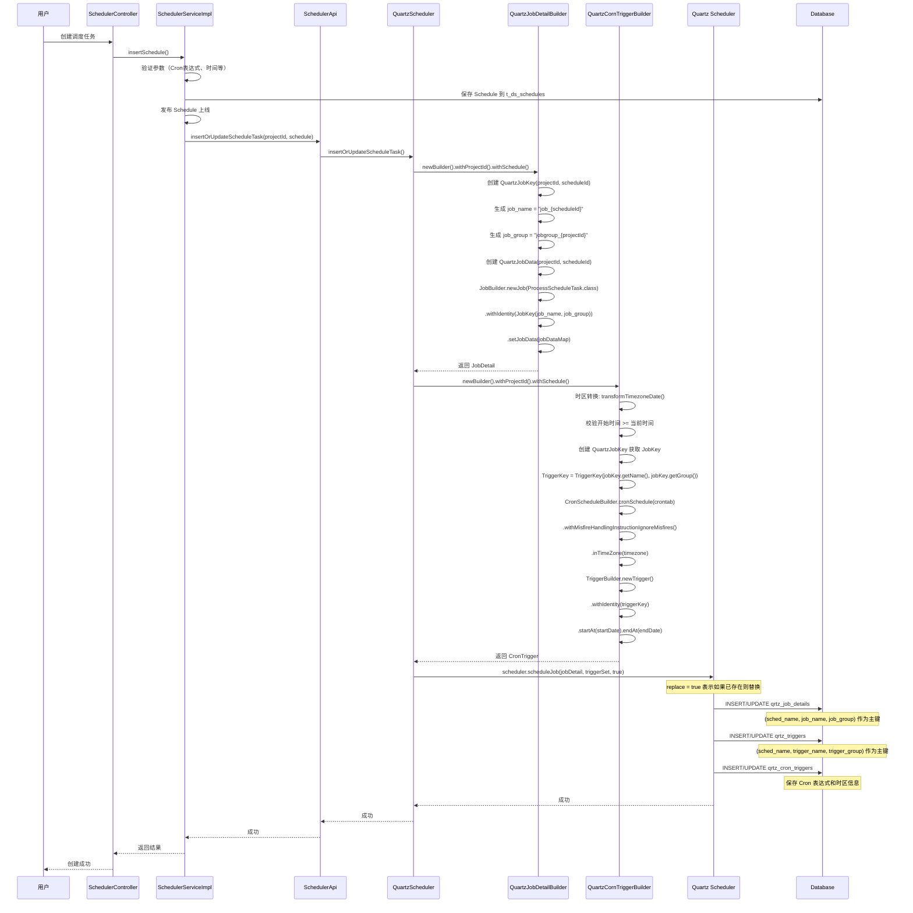
```mermaid
sequenceDiagram
    participant User as 用户
    participant API as SchedulerController
    participant SS as SchedulerServiceImpl
    participant SA as SchedulerApi
    participant QS as QuartzScheduler
    participant JDB as QuartzJobDetailBuilder
    participant CTB as QuartzCornTriggerBuilder
    participant Quartz as Quartz Scheduler
    participant DB as Database
    
    User->>API: 创建调度任务
    API->>SS: insertSchedule()
    SS->>SS: 验证参数（Cron表达式、时间等）
    SS->>DB: 保存 Schedule 到 t_ds_schedules
    SS->>SS: 发布 Schedule 上线
    SS->>SA: insertOrUpdateScheduleTask(projectId, schedule)
    
    SA->>QS: insertOrUpdateScheduleTask()
    
    QS->>JDB: newBuilder().withProjectId().withSchedule()
    JDB->>JDB: 创建 QuartzJobKey(projectId, scheduleId)
    JDB->>JDB: 生成 job_name = "job_{scheduleId}"
    JDB->>JDB: 生成 job_group = "jobgroup_{projectId}"
    JDB->>JDB: 创建 QuartzJobData(projectId, scheduleId)
    JDB->>JDB: JobBuilder.newJob(ProcessScheduleTask.class)
    JDB->>JDB: .withIdentity(JobKey(job_name, job_group))
    JDB->>JDB: .setJobData(jobDataMap)
    JDB-->>QS: 返回 JobDetail
    
    QS->>CTB: newBuilder().withProjectId().withSchedule()
    CTB->>CTB: 时区转换: transformTimezoneDate()
    CTB->>CTB: 校验开始时间 >= 当前时间
    CTB->>CTB: 创建 QuartzJobKey 获取 JobKey
    CTB->>CTB: TriggerKey = TriggerKey(jobKey.getName(), jobKey.getGroup())
    CTB->>CTB: CronScheduleBuilder.cronSchedule(crontab)
    CTB->>CTB: .withMisfireHandlingInstructionIgnoreMisfires()
    CTB->>CTB: .inTimeZone(timezone)
    CTB->>CTB: TriggerBuilder.newTrigger()
    CTB->>CTB: .withIdentity(triggerKey)
    CTB->>CTB: .startAt(startDate).endAt(endDate)
    CTB-->>QS: 返回 CronTrigger
    
    QS->>Quartz: scheduler.scheduleJob(jobDetail, triggerSet, true)
    Note over Quartz: replace = true 表示如果已存在则替换
    
    Quartz->>DB: INSERT/UPDATE qrtz_job_details
    Note over DB: (sched_name, job_name, job_group) 作为主键
    Quartz->>DB: INSERT/UPDATE qrtz_triggers
    Note over DB: (sched_name, trigger_name, trigger_group) 作为主键
    Quartz->>DB: INSERT/UPDATE qrtz_cron_triggers
    Note over DB: 保存 Cron 表达式和时区信息
    Quartz-->>QS: 成功
    QS-->>SA: 成功
    SA-->>SS: 成功
    SS-->>API: 返回结果
    API-->>User: 创建成功
```

#### 4.2.2 Key 设计架构

在 Quartz 中，Job 和 Trigger 都使用 Key 来唯一标识，Key 由 `name` 和 `group` 组成。DolphinScheduler 采用分层设计来组织这些 Key。

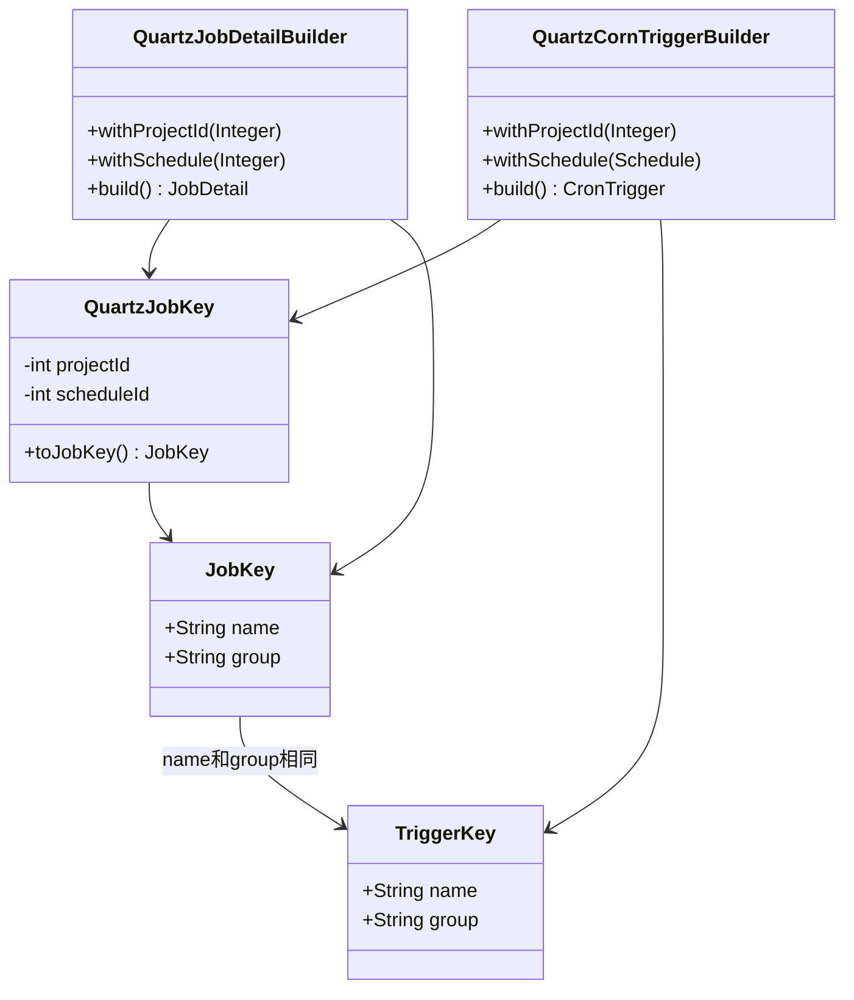
```mermaid
classDiagram
    class QuartzJobKey {
        -int projectId
        -int scheduleId
        +toJobKey() JobKey
    }
    
    class JobKey {
        +String name
        +String group
    }
    
    class TriggerKey {
        +String name
        +String group
    }
    
    class QuartzJobDetailBuilder {
        +withProjectId(Integer)
        +withSchedule(Integer)
        +build() JobDetail
    }
    
    class QuartzCornTriggerBuilder {
        +withProjectId(Integer)
        +withSchedule(Schedule)
        +build() CronTrigger
    }
    
    QuartzJobDetailBuilder --> QuartzJobKey
    QuartzJobDetailBuilder --> JobKey
    QuartzCornTriggerBuilder --> QuartzJobKey
    QuartzCornTriggerBuilder --> TriggerKey
    QuartzJobKey --> JobKey
    JobKey --> TriggerKey : name和group相同
```

#### 4.2.3 Key 构成规则

**JobDetail 的 Key 构成**:

| 属性 | 规则 | 示例 | 说明 |
|------|------|------|------|
| `job_name` | `"job_" + scheduleId` | `job_123` | 使用前缀 `job_` + 调度ID，确保唯一性 |
| `job_group` | `"jobgroup_" + projectId` | `jobgroup_1` | 使用前缀 `jobgroup_` + 项目ID，按项目分组 |

**CronTrigger 的 Key 构成**:

| 属性 | 规则 | 示例 | 说明 |
|------|------|------|------|
| `trigger_name` | **与 `job_name` 相同** | `job_123` | 保持 Job 和 Trigger 的一对一关系 |
| `trigger_group` | **与 `job_group` 相同** | `jobgroup_1` | 保持 Job 和 Trigger 在同一分组 |

**代码实现**:

```java
// QuartzJobKey.java
public JobKey toJobKey() {
    String jobName = "job" + "_" + schedulerId;      // job_123
    String jobGroup = "jobgroup" + "_" + projectId;  // jobgroup_1
    return new JobKey(jobName, jobGroup);
}

// QuartzCornTriggerBuilder.java
JobKey jobKey = QuartzJobKey.of(projectId, schedule.getId()).toJobKey();
TriggerKey triggerKey = TriggerKey.triggerKey(jobKey.getName(), jobKey.getGroup());
// trigger_name = job_123, trigger_group = jobgroup_1
```

#### 4.2.4 设计思路分析

##### 1. 分层分组设计

**为什么使用 `job_group` = `jobgroup_{projectId}` ？**

- **项目隔离**: 每个项目下的调度任务分组管理，便于权限控制和资源隔离
- **批量操作**: 可以按项目批量操作所有调度任务（暂停、恢复、删除）
- **查询优化**: 按项目ID查询任务更高效，符合业务场景

**为什么使用 `job_name` = `job_{scheduleId}` ？**

- **唯一性保证**: scheduleId 是数据库主键，确保全局唯一
- **易于识别**: 通过 job_name 可以直接知道对应的 scheduleId
- **简洁明了**: 避免使用过长的名称影响性能

##### 2. Job 和 Trigger 的一对一关系

**为什么 Trigger 的 name 和 group 与 Job 相同？**

- **强关联**: 一个 JobDetail 对应一个 CronTrigger，保持 Key 一致便于查找和管理
- **简化操作**: 删除 Job 时，Trigger 自动删除；查找 Job 时，可以直接通过相同的 name 查找 Trigger
- **符合 Quartz 设计**: Quartz 允许一个 Job 有多个 Trigger，但 DolphinScheduler 采用一对一模式，简化设计

##### 3. 命名规范的优势

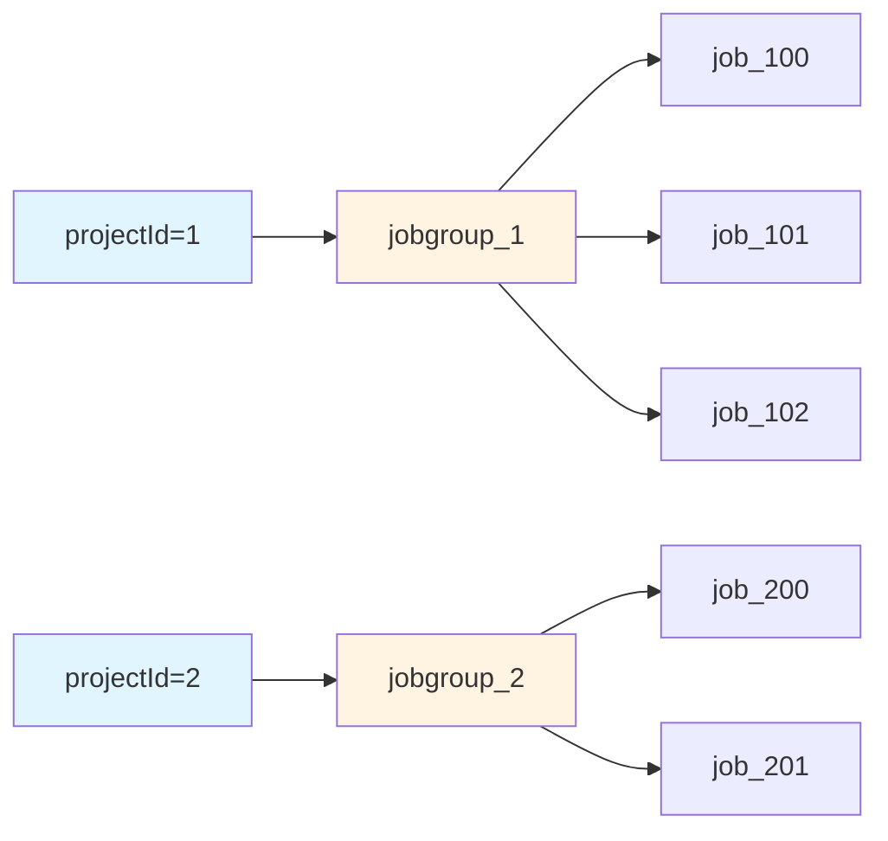
```mermaid
graph LR
    A[projectId=1] --> B[jobgroup_1]
    B --> C[job_100]
    B --> D[job_101]
    B --> E[job_102]
    
    F[projectId=2] --> G[jobgroup_2]
    G --> H[job_200]
    G --> I[job_201]
    
    style A fill:#e1f5ff
    style F fill:#e1f5ff
    style B fill:#fff4e1
    style G fill:#fff4e1
```

**优势**:
- ✅ **可读性强**: 一眼就能看出任务属于哪个项目
- ✅ **易于维护**: 前缀规范统一，便于代码维护
- ✅ **查询高效**: 按 group 查询可以使用索引优化

#### 4.2.5 JobDetail 详细创建流程

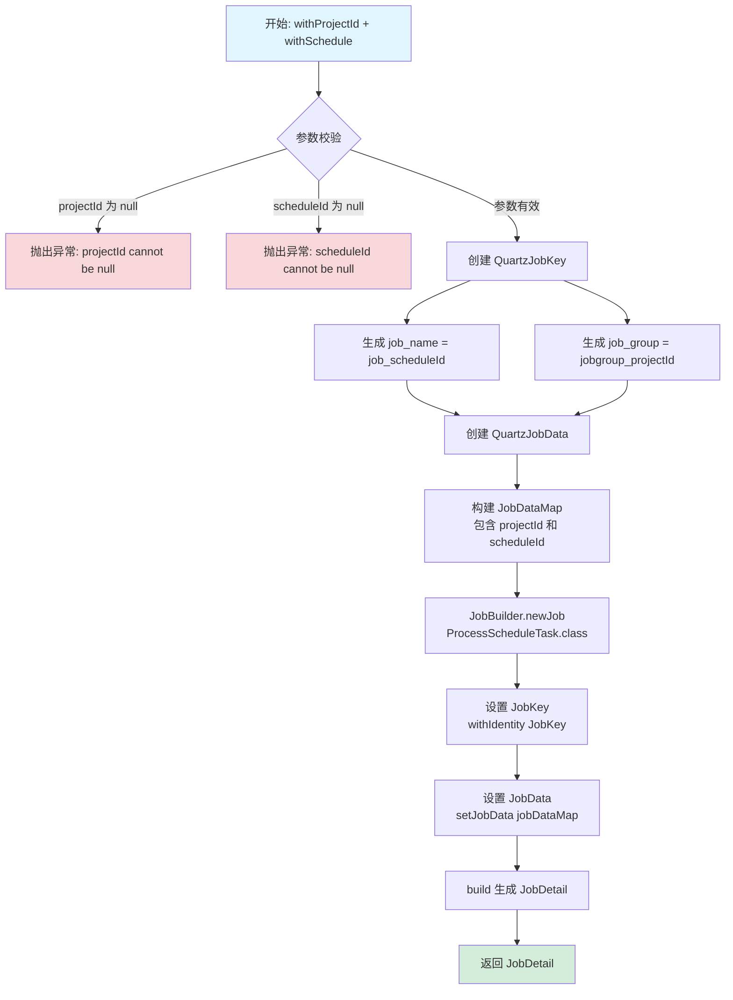
```mermaid
flowchart TD
    A[开始: withProjectId + withSchedule] --> B{参数校验}
    B -->|projectId 为 null| C[抛出异常: projectId cannot be null]
    B -->|scheduleId 为 null| D[抛出异常: scheduleId cannot be null]
    B -->|参数有效| E[创建 QuartzJobKey]
    
    E --> F[生成 job_name = job_scheduleId]
    E --> G[生成 job_group = jobgroup_projectId]
    
    F --> H[创建 QuartzJobData]
    G --> H
    
    H --> I[构建 JobDataMap<br/>包含 projectId 和 scheduleId]
    
    I --> J[JobBuilder.newJob<br/>ProcessScheduleTask.class]
    
    J --> K[设置 JobKey<br/>withIdentity JobKey]
    
    K --> L[设置 JobData<br/>setJobData jobDataMap]
    
    L --> M[build 生成 JobDetail]
    
    M --> N[返回 JobDetail]
    
    style A fill:#e1f5ff
    style N fill:#d4edda
    style C fill:#f8d7da
    style D fill:#f8d7da
```

**关键代码**:

```java
// QuartzJobDetailBuilder.java
public JobDetail build() {
    // 1. 参数校验
    if (projectId == null || scheduleId == null) {
        throw new IllegalArgumentException("参数不能为null");
    }
    
    // 2. 创建 JobData，存储业务数据
    QuartzJobData quartzJobData = QuartzJobData.of(projectId, scheduleId);
    
    // 3. 构建 JobDetail
    return JobBuilder.newJob(ProcessScheduleTask.class)  // 指定执行类
            .withIdentity(QuartzJobKey.of(projectId, scheduleId).toJobKey())  // 设置 Key
            .setJobData(quartzJobData.toJobDataMap())  // 设置数据
            .build();
}
```

**JobDetail 属性说明**:

| 属性 | 值 | 说明 |
|------|-----|------|
| `jobClass` | `ProcessScheduleTask.class` | 作业执行类，继承自 `QuartzJobBean` |
| `jobName` | `job_{scheduleId}` | 作业名称，如 `job_123` |
| `jobGroup` | `jobgroup_{projectId}` | 作业组，如 `jobgroup_1` |
| `jobDataMap` | `{projectId: 1, scheduleId: 123}` | 作业数据，传递给执行类 |
| `durability` | `true` (默认) | 持久化，调度器关闭后仍然存在 |
| `requestsRecovery` | `false` (默认) | 是否请求恢复 |

#### 4.2.6 CronTrigger 详细创建流程

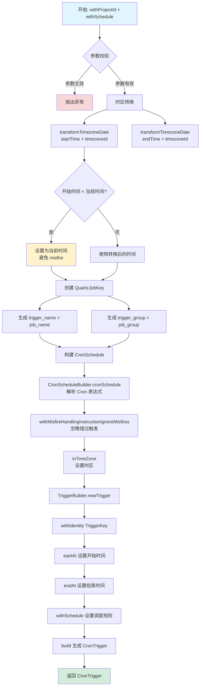
```mermaid
flowchart TD
    A[开始: withProjectId + withSchedule] --> B{参数校验}
    B -->|参数无效| C[抛出异常]
    B -->|参数有效| D[时区转换]
    
    D --> E[transformTimezoneDate<br/>startTime + timezoneId]
    D --> F[transformTimezoneDate<br/>endTime + timezoneId]
    
    E --> G{开始时间 < 当前时间?}
    G -->|是| H[设置为当前时间<br/>避免 misfire]
    G -->|否| I[使用转换后的时间]
    
    H --> J[创建 QuartzJobKey]
    I --> J
    
    J --> K[生成 trigger_name = job_name]
    J --> L[生成 trigger_group = job_group]
    
    K --> M[构建 CronSchedule]
    L --> M
    
    M --> N[CronScheduleBuilder.cronSchedule<br/>解析 Cron 表达式]
    N --> O[withMisfireHandlingInstructionIgnoreMisfires<br/>忽略错过触发]
    O --> P[inTimeZone<br/>设置时区]
    
    P --> Q[TriggerBuilder.newTrigger]
    Q --> R[withIdentity TriggerKey]
    R --> S[startAt 设置开始时间]
    S --> T[endAt 设置结束时间]
    T --> U[withSchedule 设置调度规则]
    U --> V[build 生成 CronTrigger]
    
    V --> W[返回 CronTrigger]
    
    style A fill:#e1f5ff
    style W fill:#d4edda
    style C fill:#f8d7da
    style H fill:#fff3cd
```

**关键代码**:

```java
// QuartzCornTriggerBuilder.java
public CronTrigger build() {
    // 1. 时区转换（重要！）
    // 数据库存储的时间是 UTC 时区，需要转换为用户配置的时区
    Date startDate = DateUtils.transformTimezoneDate(
        schedule.getStartTime(), 
        schedule.getTimezoneId()
    );
    Date endDate = DateUtils.transformTimezoneDate(
        schedule.getEndTime(), 
        schedule.getTimezoneId()
    );
    
    // 2. 校验开始时间，避免 misfire
    Date now = new Date();
    if (startDate.before(now)) {
        startDate = now;  // 如果开始时间已过，设置为当前时间
    }
    
    // 3. 创建 TriggerKey（与 JobKey 相同）
    JobKey jobKey = QuartzJobKey.of(projectId, schedule.getId()).toJobKey();
    TriggerKey triggerKey = TriggerKey.triggerKey(
        jobKey.getName(),    // trigger_name = job_123
        jobKey.getGroup()    // trigger_group = jobgroup_1
    );
    
    // 4. 构建 CronTrigger
    return TriggerBuilder.newTrigger()
            .withIdentity(triggerKey)
            .startAt(startDate)
            .endAt(endDate)
            .withSchedule(
                CronScheduleBuilder.cronSchedule(schedule.getCrontab())
                    .withMisfireHandlingInstructionIgnoreMisfires()  // 错过触发处理策略
                    .inTimeZone(DateUtils.getTimezone(schedule.getTimezoneId()))  // 设置时区
            )
            .build();
}
```

**CronTrigger 属性说明**:

| 属性 | 值 | 说明 |
|------|-----|------|
| `triggerName` | `job_{scheduleId}` | 触发器名称，与 JobName 相同 |
| `triggerGroup` | `jobgroup_{projectId}` | 触发器组，与 JobGroup 相同 |
| `jobName` | `job_{scheduleId}` | 关联的 Job 名称 |
| `jobGroup` | `jobgroup_{projectId}` | 关联的 Job 组 |
| `cronExpression` | 用户配置的 Cron 表达式 | 如 `0 0 12 * * ?` |
| `timeZone` | 用户配置的时区 | 如 `Asia/Shanghai` |
| `startTime` | 转换后的开始时间 | 考虑了时区和当前时间 |
| `endTime` | 转换后的结束时间 | 可能为 null（无结束时间） |
| `misfireInstruction` | `IGNORE_MISFIRE_POLICY` | 忽略错过触发，继续按计划执行 |

#### 4.2.7 时区处理设计

**为什么需要时区转换？**

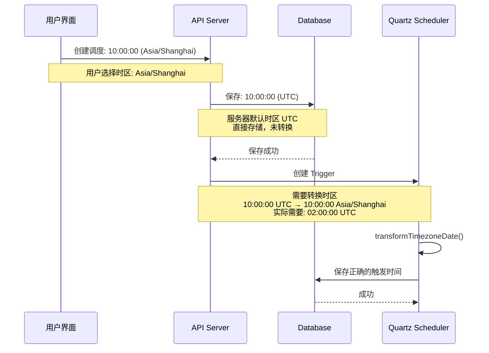
```mermaid
sequenceDiagram
    participant User as 用户界面
    participant API as API Server
    participant DB as Database
    participant Quartz as Quartz Scheduler
    
    User->>API: 创建调度: 10:00:00 (Asia/Shanghai)
    Note over User,API: 用户选择时区: Asia/Shanghai
    API->>DB: 保存: 10:00:00 (UTC)
    Note over API,DB: 服务器默认时区 UTC<br/>直接存储，未转换
    DB-->>API: 保存成功
    
    API->>Quartz: 创建 Trigger
    Note over API,Quartz: 需要转换时区<br/>10:00:00 UTC → 10:00:00 Asia/Shanghai<br/>实际需要: 02:00:00 UTC
    Quartz->>Quartz: transformTimezoneDate()
    Quartz->>DB: 保存正确的触发时间
    DB-->>Quartz: 成功
```

**转换逻辑**:

```java
// DateUtils.transformTimezoneDate()
// 将 UTC 时区的时间转换为目标时区的时间
// 例如: 2022-04-28 10:00:00 UTC → 2022-04-28 10:00:00 Asia/Shanghai
// 实际上就是: 2022-04-28 02:00:00 UTC = 2022-04-28 10:00:00 Asia/Shanghai
Date startDate = DateUtils.transformTimezoneDate(
    schedule.getStartTime(),    // UTC 时区的时间
    schedule.getTimezoneId()    // 目标时区: Asia/Shanghai
);
```

#### 4.2.8 数据库存储结构

创建后的数据在数据库中的存储：

**qrtz_job_details 表**:

| sched_name | job_name | job_group | job_class_name | job_data |
|------------|----------|-----------|----------------|----------|
| DolphinScheduler | job_123 | jobgroup_1 | ProcessScheduleTask | {projectId:1, scheduleId:123} |

**qrtz_triggers 表**:

| sched_name | trigger_name | trigger_group | job_name | job_group | trigger_state | next_fire_time |
|------------|--------------|---------------|----------|-----------|---------------|----------------|
| DolphinScheduler | job_123 | jobgroup_1 | job_123 | jobgroup_1 | WAITING | 1672531200000 |

**qrtz_cron_triggers 表**:

| sched_name | trigger_name | trigger_group | cron_expression | time_zone_id |
|------------|--------------|---------------|-----------------|--------------|
| DolphinScheduler | job_123 | jobgroup_1 | 0 0 12 * * ? | Asia/Shanghai |

### 4.3 触发器执行流程

#### 4.3.1 完整执行流程时序图

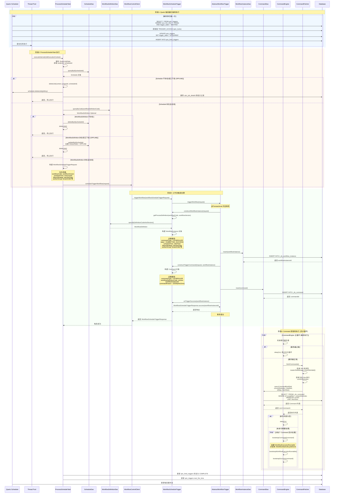
```mermaid
sequenceDiagram
    participant Quartz as Quartz Scheduler
    participant ThreadPool as Thread Pool
    participant PST as ProcessScheduleTask
    participant SD as ScheduleDao
    participant WDD as WorkflowDefinitionDao
    participant WIC as WorkflowControlClient
    participant WST as WorkflowScheduleTrigger
    participant AWT as AbstractWorkflowTrigger
    participant WID as WorkflowInstanceDao
    participant CD as CommandDao
    participant CE as CommandEngine
    participant CF as CommandFetcher
    participant DB as Database
    
    rect rgb(240, 248, 255)
        Note over Quartz,DB: 阶段1: Quartz 触发器扫描和执行
        loop 每秒钟扫描一次
            Quartz->>DB: SELECT * FROM qrtz_triggers<br/>WHERE next_fire_time <= NOW()<br/>AND trigger_state = 'WAITING'
            Quartz->>DB: 获取锁 TRIGGER_ACCESS (qrtz_locks)
            Quartz->>DB: UPDATE qrtz_triggers<br/>SET trigger_state = 'ACQUIRED'
            Quartz->>DB: INSERT INTO qrtz_fired_triggers
            Quartz->>ThreadPool: 提交任务执行
        end
    end
    
    rect rgb(255, 248, 240)
        Note over ThreadPool,PST: 阶段2: ProcessScheduleTask 执行
        ThreadPool->>PST: executeInternal(JobExecutionContext)
        PST->>PST: 解析 QuartzJobData<br/>获取 projectId, scheduleId
        
        PST->>SD: queryById(scheduleId)
        SD-->>PST: Schedule 对象
        
        alt Schedule 不存在或已下线 (OFFLINE)
            PST->>PST: deleteJob(context, projectId, scheduleId)
            PST->>Quartz: scheduler.deleteJob(jobKey)
            PST->>DB: 删除 qrtz_job_details 和相关记录
            PST-->>ThreadPool: 返回，终止执行
        else Schedule 存在且在线
            PST->>WDD: queryByCode(workflowDefinitionCode)
            WDD-->>PST: WorkflowDefinition Optional
            
            alt WorkflowDefinition 不存在
                PST->>SD: deleteById(scheduleId)
                PST->>PST: deleteJob()
                PST-->>ThreadPool: 返回，终止执行
            else WorkflowDefinition 存在但已下线 (OFFLINE)
                PST->>SD: updateById(schedule)<br/>设置 releaseState = OFFLINE
                PST->>PST: deleteJob()
                PST-->>ThreadPool: 返回，终止执行
            else WorkflowDefinition 存在且在线
                PST->>PST: 构建 WorkflowScheduleTriggerRequest
                Note over PST: 包含参数:<br/>workflowCode, workflowVersion<br/>scheduleTime, timezoneId<br/>failureStrategy, warningType<br/>workerGroup, tenantCode 等
                PST->>WIC: scheduleTriggerWorkflow(request)
            end
        end
    end
    
    rect rgb(248, 255, 248)
        Note over WIC,AWT: 阶段3: 工作流触发处理
        WIC->>WST: triggerWorkflow(workflowScheduleTriggerRequest)
        
        WST->>AWT: triggerWorkflow(request)
        Note over AWT: @Transactional 开启事务
        
        AWT->>WST: constructWorkflowInstance(request)
        WST->>WST: getProcessDefinition(workflowCode, workflowVersion)
        WST->>WDD: queryByDefinitionCodeAndVersion()
        WDD-->>WST: WorkflowDefinition
        
        WST->>WST: 构建 WorkflowInstance 对象
        Note over WST: 设置属性:<br/>commandType = SCHEDULER<br/>state = SUBMITTED_SUCCESS<br/>scheduleTime, startTime<br/>failureStrategy, warningType<br/>workerGroup, tenantCode 等
        
        AWT->>WID: insert(workflowInstance)
        WID->>DB: INSERT INTO t_ds_workflow_instance
        DB-->>WID: 返回 workflowInstanceId
        
        AWT->>WST: constructTriggerCommand(request, workflowInstance)
        WST->>WST: 构建 Command 对象
        Note over WST: 设置属性:<br/>commandType = SCHEDULER<br/>workflowDefinitionCode, version<br/>workflowInstanceId<br/>commandParam = JSON(timeZone)
        
        AWT->>CD: insert(command)
        CD->>DB: INSERT INTO t_ds_command
        DB-->>CD: 返回 commandId
        
        AWT->>WST: onTriggerSuccess(workflowInstance)
        WST-->>AWT: WorkflowScheduleTriggerResponse.success(workflowInstanceId)
        AWT-->>WST: 返回响应
        Note over AWT: 事务提交
        
        WST-->>WIC: 返回 WorkflowScheduleTriggerResponse
        WIC-->>PST: 触发成功
    end
    
    rect rgb(255, 255, 240)
        Note over CE,CF: 阶段4: Command 获取和执行 (异步循环)
        loop CommandEngine 主循环 (每秒执行)
            CE->>CE: 检查服务器负载
            alt 服务器过载
                CE->>CE: sleep(1s), 跳过本次循环
            else 服务器正常
                CE->>CF: fetchCommands()
                
                CF->>CF: 检查 Slot 有效性<br/>masterSlotManager.checkSlotValid()
                CF->>CF: 获取当前 Slot 索引<br/>currentSlotIndex
                CF->>CD: queryCommandByIdSlot(<br/>  currentSlotIndex, totalSlot,<br/>  idStep, fetchSize)
                CD->>DB: SELECT * FROM t_ds_command<br/>WHERE id % totalSlot = currentSlotIndex<br/>ORDER BY id ASC<br/>LIMIT fetchSize
                DB-->>CD: 返回 Command 列表
                CD-->>CF: 返回 List<Command>
                CF-->>CE: 返回命令列表
                
                alt 命令列表为空
                    CE->>CE: sleep(1s)
                else 有命令需要处理
                    loop 对每个 Command 异步处理
                        CE->>CE: bootstrapCommand(command)
                        Note over CE: 创建 WorkflowExecutionRunnable<br/>并发布 WorkflowStartLifecycleEvent
                        CE->>CE: bootstrapWorkflowExecutionRunnable()
                        CE->>CE: bootstrapSuccess(command)
                    end
                end
            end
        end
    end
    
    PST->>DB: 更新 qrtz_fired_triggers 状态为 COMPLETE
    PST->>DB: 更新 qrtz_triggers next_fire_time
    Quartz->>DB: 更新触发器状态
```

#### 4.3.2 核心类设计

**类层次结构**:

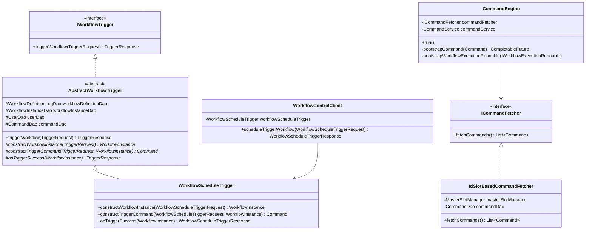
```mermaid
classDiagram
    class IWorkflowTrigger {
        <<interface>>
        +triggerWorkflow(TriggerRequest) TriggerResponse
    }
    
    class AbstractWorkflowTrigger {
        <<abstract>>
        #WorkflowDefinitionLogDao workflowDefinitionDao
        #WorkflowInstanceDao workflowInstanceDao
        #UserDao userDao
        #CommandDao commandDao
        +triggerWorkflow(TriggerRequest) TriggerResponse
        #constructWorkflowInstance(TriggerRequest) WorkflowInstance*
        #constructTriggerCommand(TriggerRequest, WorkflowInstance) Command*
        #onTriggerSuccess(WorkflowInstance) TriggerResponse*
    }
    
    class WorkflowScheduleTrigger {
        +constructWorkflowInstance(WorkflowScheduleTriggerRequest) WorkflowInstance
        +constructTriggerCommand(WorkflowScheduleTriggerRequest, WorkflowInstance) Command
        +onTriggerSuccess(WorkflowInstance) WorkflowScheduleTriggerResponse
    }
    
    class WorkflowControlClient {
        -WorkflowScheduleTrigger workflowScheduleTrigger
        +scheduleTriggerWorkflow(WorkflowScheduleTriggerRequest) WorkflowScheduleTriggerResponse
    }
    
    class ICommandFetcher {
        <<interface>>
        +fetchCommands() List~Command~
    }
    
    class IdSlotBasedCommandFetcher {
        -MasterSlotManager masterSlotManager
        -CommandDao commandDao
        +fetchCommands() List~Command~
    }
    
    class CommandEngine {
        -ICommandFetcher commandFetcher
        -CommandService commandService
        +run()
        -bootstrapCommand(Command) CompletableFuture
        -bootstrapWorkflowExecutionRunnable(IWorkflowExecutionRunnable)
    }
    
    IWorkflowTrigger <|.. AbstractWorkflowTrigger
    AbstractWorkflowTrigger <|-- WorkflowScheduleTrigger
    WorkflowControlClient --> WorkflowScheduleTrigger
    ICommandFetcher <|.. IdSlotBasedCommandFetcher
    CommandEngine --> ICommandFetcher
```

#### 4.3.3 WorkflowControlClient 设计

**WorkflowControlClient** 是 RPC 服务实现类，负责接收 Quartz 触发的调度请求：

```java
@Service
public class WorkflowControlClient implements IWorkflowControlClient {
    
    @Autowired
    private WorkflowScheduleTrigger workflowScheduleTrigger;
    
    @Override
    public WorkflowScheduleTriggerResponse scheduleTriggerWorkflow(
            final WorkflowScheduleTriggerRequest workflowScheduleTriggerRequest) {
        try {
            // 委托给 WorkflowScheduleTrigger 处理
            return workflowScheduleTrigger.triggerWorkflow(workflowScheduleTriggerRequest);
        } catch (Exception ex) {
            log.error("Handle workflowScheduleTriggerRequest: {} failed", 
                     workflowScheduleTriggerRequest, ex);
            return WorkflowScheduleTriggerResponse
                    .fail("Schedule trigger workflow failed: " + ExceptionUtils.getMessage(ex));
        }
    }
}
```

**设计要点**:
- **单一职责**: 仅负责接收请求和异常处理
- **委托模式**: 将具体逻辑委托给 `WorkflowScheduleTrigger`
- **异常封装**: 将异常转换为响应对象

#### 4.3.4 AbstractWorkflowTrigger 模板方法设计

**AbstractWorkflowTrigger** 采用模板方法模式，定义了触发工作流的通用流程：

```java
@Transactional
public TriggerResponse triggerWorkflow(final TriggerRequest triggerRequest) {
    // 1. 构建 WorkflowInstance (子类实现)
    final WorkflowInstance workflowInstance = constructWorkflowInstance(triggerRequest);
    workflowInstanceDao.insert(workflowInstance);
    
    // 2. 构建 Command (子类实现)
    final Command command = constructTriggerCommand(triggerRequest, workflowInstance);
    commandDao.insert(command);
    
    // 3. 返回成功响应 (子类实现)
    return onTriggerSuccess(workflowInstance);
}
```

**模板方法模式的优势**:
- **代码复用**: 公共逻辑在父类中实现
- **扩展性强**: 子类只需实现特定步骤
- **事务管理**: `@Transactional` 确保数据一致性

**关键步骤说明**:

| 步骤 | 方法 | 说明 |
|------|------|------|
| 1 | `constructWorkflowInstance()` | 构建工作流实例，设置初始状态为 `SUBMITTED_SUCCESS` |
| 2 | `workflowInstanceDao.insert()` | 保存工作流实例到数据库 |
| 3 | `constructTriggerCommand()` | 构建命令对象，关联工作流实例 |
| 4 | `commandDao.insert()` | 保存命令到数据库，等待 CommandEngine 处理 |
| 5 | `onTriggerSuccess()` | 返回成功响应，包含工作流实例ID |

#### 4.3.5 WorkflowScheduleTrigger 实现细节

**constructWorkflowInstance()** - 构建工作流实例:

```java
protected WorkflowInstance constructWorkflowInstance(
        WorkflowScheduleTriggerRequest scheduleTriggerRequest) {
    // 1. 获取工作流定义
    final WorkflowDefinition workflowDefinition = getProcessDefinition(
        scheduleTriggerRequest.getWorkflowCode(),
        scheduleTriggerRequest.getWorkflowVersion()
    );
    
    // 2. 构建 WorkflowInstance
    final WorkflowInstance workflowInstance = new WorkflowInstance();
    workflowInstance.setWorkflowDefinitionCode(workflowDefinition.getCode());
    workflowInstance.setWorkflowDefinitionVersion(workflowDefinition.getVersion());
    workflowInstance.setCommandType(CommandType.SCHEDULER);
    workflowInstance.setStateWithDesc(
        WorkflowExecutionStatus.SUBMITTED_SUCCESS,  // 初始状态
        CommandType.SCHEDULER.name()
    );
    workflowInstance.setScheduleTime(scheduleTriggerRequest.getScheduleTIme());
    workflowInstance.setStartTime(new Date());
    workflowInstance.setFailureStrategy(scheduleTriggerRequest.getFailureStrategy());
    workflowInstance.setWarningType(scheduleTriggerRequest.getWarningType());
    workflowInstance.setWorkerGroup(scheduleTriggerRequest.getWorkerGroup());
    workflowInstance.setTenantCode(scheduleTriggerRequest.getTenantCode());
    // ... 设置其他属性
    
    return workflowInstance;
}
```

**constructTriggerCommand()** - 构建命令:

```java
protected Command constructTriggerCommand(
        WorkflowScheduleTriggerRequest scheduleTriggerRequest,
        WorkflowInstance workflowInstance) {
    // 构建命令参数
    final ScheduleWorkflowCommandParam scheduleWorkflowCommandParam = 
        ScheduleWorkflowCommandParam.builder()
            .timeZone(scheduleTriggerRequest.getTimezoneId())
            .build();
    
    // 构建 Command 对象
    return Command.builder()
            .commandType(CommandType.SCHEDULER)
            .workflowDefinitionCode(scheduleTriggerRequest.getWorkflowCode())
            .workflowDefinitionVersion(scheduleTriggerRequest.getWorkflowVersion())
            .workflowInstanceId(workflowInstance.getId())  // 关联工作流实例
            .workflowInstancePriority(workflowInstance.getWorkflowInstancePriority())
            .commandParam(JSONUtils.toJsonString(scheduleWorkflowCommandParam))
            .build();
}
```

**关键设计点**:
- **状态设计**: WorkflowInstance 初始状态为 `SUBMITTED_SUCCESS`，等待 CommandEngine 处理
- **关联设计**: Command 通过 `workflowInstanceId` 关联到 WorkflowInstance
- **参数传递**: 通过 `commandParam` JSON 字符串传递时区等参数

#### 4.3.6 CommandEngine 命令获取和执行

**CommandEngine** 是主调度循环，负责从数据库获取命令并执行：

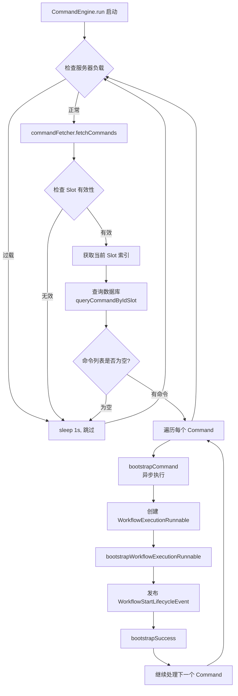
```mermaid
flowchart TD
    A[CommandEngine.run 启动] --> B{检查服务器负载}
    B -->|过载| C[sleep 1s, 跳过]
    B -->|正常| D[commandFetcher.fetchCommands]
    
    D --> E{检查 Slot 有效性}
    E -->|无效| C
    E -->|有效| F[获取当前 Slot 索引]
    
    F --> G[查询数据库<br/>queryCommandByIdSlot]
    G --> H{命令列表是否为空?}
    
    H -->|为空| C
    H -->|有命令| I[遍历每个 Command]
    
    I --> J[bootstrapCommand<br/>异步执行]
    J --> K[创建 WorkflowExecutionRunnable]
    K --> L[bootstrapWorkflowExecutionRunnable]
    L --> M[发布 WorkflowStartLifecycleEvent]
    M --> N[bootstrapSuccess]
    
    N --> O[继续处理下一个 Command]
    O --> I
    
    C --> B
    I --> B
```

**关键代码逻辑**:

```java
@Override
public void run() {
    while (flag) {
        try {
            // 1. 检查服务器负载
            if (serverLoadProtection.isOverload(systemMetrics)) {
                Thread.sleep(Constants.SLEEP_TIME_MILLIS);
                continue;
            }
            
            // 2. 获取命令列表
            List<Command> commands = commandFetcher.fetchCommands();
            if (CollectionUtils.isEmpty(commands)) {
                Thread.sleep(Constants.SLEEP_TIME_MILLIS);
                continue;
            }
            
            // 3. 异步处理每个命令
            List<CompletableFuture<Void>> allCompleteFutures = new ArrayList<>();
            for (Command command : commands) {
                CompletableFuture<Void> completableFuture = 
                    bootstrapCommand(command)
                        .thenAccept(this::bootstrapWorkflowExecutionRunnable)
                        .thenAccept((unused) -> bootstrapSuccess(command))
                        .exceptionally(throwable -> bootstrapError(command, throwable));
                allCompleteFutures.add(completableFuture);
            }
            CompletableFuture.allOf(allCompleteFutures.toArray(new CompletableFuture[0])).join();
        } catch (Exception e) {
            log.error("Master schedule workflow error", e);
            ThreadUtils.sleep(Constants.SLEEP_TIME_MILLIS);
        }
    }
}
```

#### 4.3.7 ICommandFetcher 命令获取策略

**IdSlotBasedCommandFetcher** 基于 ID 和 Slot 的命令获取策略：

`CommandEngine` 会定期调用 `ICommandFetcher.fetchCommands()` 从数据库获取待处理的 Command 列表。`IdSlotBasedCommandFetcher` 使用基于 Slot 的分片策略来实现 Master 集群的负载均衡。

**实现代码**:

```java
@Override
@Transactional  // 确保在 master/slave 模式下路由到主库
public List<Command> fetchCommands() {
    long scheduleStartTime = System.currentTimeMillis();
    
    // 1. 检查 Slot 是否有效
    if (!masterSlotManager.checkSlotValid()) {
        log.warn("MasterSlotManager check slot ({} -> {})is invalidated.",
                masterSlotManager.getCurrentMasterSlot(), 
                masterSlotManager.getTotalMasterSlots());
        return Collections.emptyList();
    }
    
    // 2. 获取当前 Master 的 Slot 索引和总 Slot 数
    int currentSlotIndex = masterSlotManager.getCurrentMasterSlot();
    int totalSlot = masterSlotManager.getTotalMasterSlots();
    
    // 3. 基于 Slot 分片查询 Command
    // 查询条件: id % totalSlot == currentSlotIndex
    // 这样可以确保每个 Master 只处理属于自己 Slot 的 Command
    List<Command> commands = commandDao.queryCommandByIdSlot(
            currentSlotIndex,        // 当前 Slot 索引
            totalSlot,               // 总 Slot 数
            idSlotBasedFetchConfig.getIdStep(),    // ID 步长，默认 1
            idSlotBasedFetchConfig.getFetchSize()); // 每次获取数量，默认 10
    
    long cost = System.currentTimeMillis() - scheduleStartTime;
    log.debug("[Slot-{}/{}] Fetch {} commands in {}ms.", 
              currentSlotIndex, totalSlot, commands.size(), cost);
    WorkflowInstanceMetrics.recordCommandQueryTime(cost);
    
    return commands;
}
```

**Slot 分片策略说明**:

| 参数 | 说明 | 默认值 | 作用 |
|------|------|--------|------|
| `currentSlotIndex` | 当前 Master 的 Slot 索引 | 0~N-1 | 标识当前 Master 在集群中的位置 |
| `totalSlot` | 总 Slot 数 | 等于 Master 节点数 | 决定分片数量 |
| `idStep` | ID 步长 | 1 | 查询时的 ID 间隔 |
| `fetchSize` | 每次获取数量 | 10 | 控制批量大小 |

**SQL 查询逻辑**:

```sql
-- 基于 Slot 分片的 Command 查询
SELECT * FROM t_ds_command
WHERE id % totalSlot = currentSlotIndex  -- Slot 分片条件
  AND id >= (SELECT COALESCE(MAX(id), 0) FROM t_ds_command WHERE id % totalSlot = currentSlotIndex)
ORDER BY id ASC
LIMIT fetchSize;
```

**Slot 分片示例**:

假设有 3 个 Master 节点（totalSlot = 3）:

- **Master1** (slotIndex = 0): 处理 Command.id % 3 = 0 的命令
- **Master2** (slotIndex = 1): 处理 Command.id % 3 = 1 的命令  
- **Master3** (slotIndex = 2): 处理 Command.id % 3 = 2 的命令

这样可以将 Command 均匀分配到不同的 Master 节点，实现负载均衡。

#### 4.3.8 CommandEngine 命令处理循环

`CommandEngine` 是 Master 的核心调度线程，持续循环执行以下流程：

**CommandEngine.run()** 主循环：

```java
@Override
public void run() {
    MasterServerLoadProtection serverLoadProtection = masterConfig.getServerLoadProtection();
    while (flag) {
        try {
            // 1. 检查服务器负载
            SystemMetrics systemMetrics = metricsProvider.getSystemMetrics();
            if (serverLoadProtection.isOverload(systemMetrics)) {
                log.warn("The current server is overload, cannot consumes commands.");
                MasterServerMetrics.incMasterOverload();
                Thread.sleep(Constants.SLEEP_TIME_MILLIS);
                continue;
            }
            
            // 2. 从数据库获取 Command 列表（基于 Slot 分片）
            List<Command> commands = commandFetcher.fetchCommands();
            if (CollectionUtils.isEmpty(commands)) {
                Thread.sleep(Constants.SLEEP_TIME_MILLIS);  // 无命令时休眠 1 秒
                continue;
            }
            
            // 3. 异步处理每个 Command
            List<CompletableFuture<Void>> allCompleteFutures = new ArrayList<>();
            for (Command command : commands) {
                CompletableFuture<Void> completableFuture = 
                    bootstrapCommand(command)           // 创建 WorkflowExecutionRunnable
                        .thenAccept(this::bootstrapWorkflowExecutionRunnable)  // 发布 WorkflowStartLifecycleEvent
                        .thenAccept((unused) -> bootstrapSuccess(command))     // 处理成功
                        .exceptionally(throwable -> bootstrapError(command, throwable));  // 处理异常
                allCompleteFutures.add(completableFuture);
            }
            
            // 4. 等待所有 Command 处理完成
            CompletableFuture.allOf(allCompleteFutures.toArray(new CompletableFuture[0])).join();
            
        } catch (InterruptedException e) {
            Thread.currentThread().interrupt();
            break;
        } catch (Exception e) {
            log.error("Master schedule workflow error", e);
            ThreadUtils.sleep(Constants.SLEEP_TIME_MILLIS);
        }
    }
}
```

**Slot 分片原理图**:

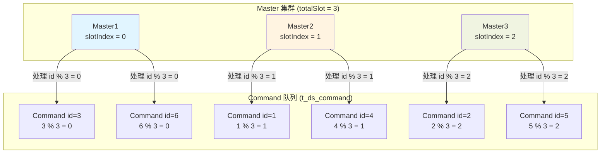
```mermaid
graph TB
    subgraph "Master 集群 (totalSlot = 3)"
        M1[Master1<br/>slotIndex = 0]
        M2[Master2<br/>slotIndex = 1]
        M3[Master3<br/>slotIndex = 2]
    end
    
    subgraph "Command 队列 (t_ds_command)"
        C1[Command id=1<br/>1 % 3 = 1]
        C2[Command id=2<br/>2 % 3 = 2]
        C3[Command id=3<br/>3 % 3 = 0]
        C4[Command id=4<br/>4 % 3 = 1]
        C5[Command id=5<br/>5 % 3 = 2]
        C6[Command id=6<br/>6 % 3 = 0]
    end
    
    M1 -->|处理 id % 3 = 0| C3
    M1 -->|处理 id % 3 = 0| C6
    
    M2 -->|处理 id % 3 = 1| C1
    M2 -->|处理 id % 3 = 1| C4
    
    M3 -->|处理 id % 3 = 2| C2
    M3 -->|处理 id % 3 = 2| C5
    
    style M1 fill:#e1f5ff
    style M2 fill:#fff4e1
    style M3 fill:#f0f4e1
```

**优势**:
- ✅ **负载均衡**: Command 按 ID 均匀分配到各个 Master
- ✅ **无冲突**: 每个 Master 只处理自己 Slot 的命令，避免重复处理
- ✅ **故障隔离**: 单个 Master 故障不影响其他 Master
- ✅ **易于扩展**: 新增 Master 节点时，重新分配 Slot 即可

**注意事项**:
- ⚠️ **ID 分布**: 当 Command ID 连续且分布均匀时效果最好
- ⚠️ **Slot 分配**: Master 节点数量变化时，需要重新分配 Slot
- ⚠️ **事务保证**: `@Transactional` 确保在 master/slave 模式下查询主库

#### 4.3.9 完整流程总结

**从 Quartz 触发器到工作流执行的完整链路**:

```
Quartz Trigger (Cron 表达式触发)
    ↓
ProcessScheduleTask.executeInternal()
    ↓
WorkflowControlClient.scheduleTriggerWorkflow()
    ↓
WorkflowScheduleTrigger.triggerWorkflow() (@Transactional)
    ├── constructWorkflowInstance() → 创建 WorkflowInstance (状态: SUBMITTED_SUCCESS)
    ├── workflowInstanceDao.insert() → 保存到 t_ds_workflow_instance
    ├── constructTriggerCommand() → 创建 Command (commandType: SCHEDULER)
    └── commandDao.insert() → 保存到 t_ds_command
    ↓
CommandEngine.run() (异步循环)
    ↓
IdSlotBasedCommandFetcher.fetchCommands() (基于 Slot 分片)
    ↓
queryCommandByIdSlot() → 从数据库获取 Command 列表
    ↓
bootstrapCommand() → 创建 WorkflowExecutionRunnable
    ↓
bootstrapWorkflowExecutionRunnable() → 发布 WorkflowStartLifecycleEvent
    ↓
WorkflowStartLifecycleEventHandler → 处理工作流启动事件
    ↓
工作流状态流转 → SUBMITTED_SUCCESS → RUNNING_EXECUTION → ...
    ↓
任务执行 → TaskStartLifecycleEvent → TaskExecutionRunnable
```

**关键数据流转**:

| 阶段 | 数据 | 状态 | 说明 |
|------|------|------|------|
| 1. Quartz 触发 | `qrtz_triggers` | WAITING → ACQUIRED | 触发器状态变更 |
| 2. ProcessScheduleTask | `t_ds_schedules` | 查询 Schedule | 验证调度配置 |
| 3. WorkflowTrigger | `t_ds_workflow_instance` | SUBMITTED_SUCCESS | 创建工作流实例 |
| 4. WorkflowTrigger | `t_ds_command` | 插入 Command | 等待处理 |
| 5. CommandFetcher | `t_ds_command` | 查询 Command | 基于 Slot 分片 |
| 6. CommandEngine | `t_ds_workflow_instance` | RUNNING_EXECUTION | 更新工作流状态 |

### 4.4 集群工作机制

Quartz 集群模式通过数据库实现分布式协调，确保多个 Master 节点之间不会重复执行任务。

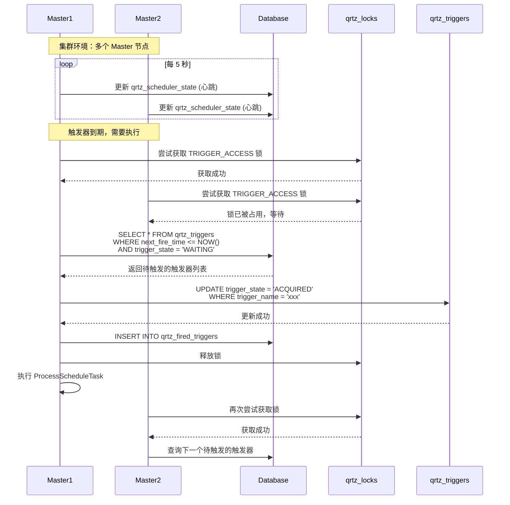
```mermaid
sequenceDiagram
    participant M1 as Master1
    participant M2 as Master2
    participant DB as Database
    participant Lock as qrtz_locks
    participant Trigger as qrtz_triggers
    
    Note over M1, M2: 集群环境：多个 Master 节点
    
    loop 每 5 秒
        M1->>DB: 更新 qrtz_scheduler_state (心跳)
        M2->>DB: 更新 qrtz_scheduler_state (心跳)
    end
    
    Note over M1, M2: 触发器到期，需要执行
    
    M1->>Lock: 尝试获取 TRIGGER_ACCESS 锁
    Lock-->>M1: 获取成功
    
    M2->>Lock: 尝试获取 TRIGGER_ACCESS 锁
    Lock-->>M2: 锁已被占用，等待
    
    M1->>DB: SELECT * FROM qrtz_triggers<br/>WHERE next_fire_time <= NOW()<br/>AND trigger_state = 'WAITING'
    DB-->>M1: 返回待触发的触发器列表
    
    M1->>Trigger: UPDATE trigger_state = 'ACQUIRED'<br/>WHERE trigger_name = 'xxx'
    Trigger-->>M1: 更新成功
    
    M1->>DB: INSERT INTO qrtz_fired_triggers
    M1->>Lock: 释放锁
    
    M1->>M1: 执行 ProcessScheduleTask
    
    M2->>Lock: 再次尝试获取锁
    Lock-->>M2: 获取成功
    M2->>DB: 查询下一个待触发的触发器
```

### 4.5 故障恢复机制

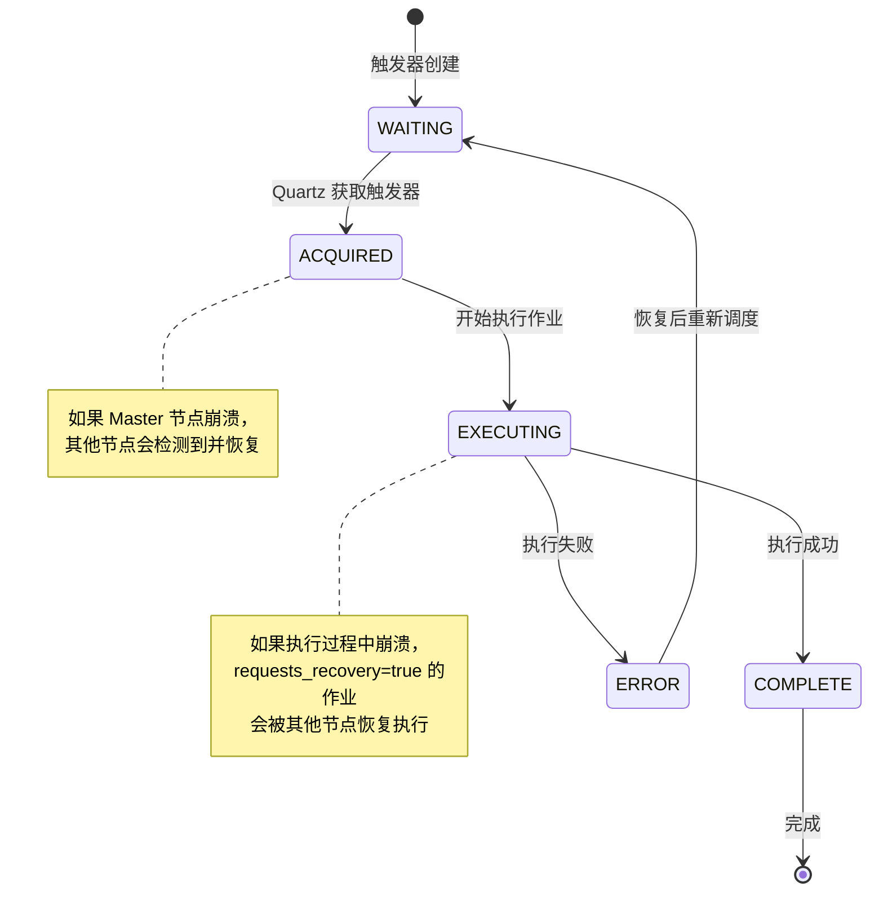
```mermaid
stateDiagram-v2
    [*] --> WAITING: 触发器创建
    WAITING --> ACQUIRED: Quartz 获取触发器
    ACQUIRED --> EXECUTING: 开始执行作业
    EXECUTING --> COMPLETE: 执行成功
    EXECUTING --> ERROR: 执行失败
    ERROR --> WAITING: 恢复后重新调度
    COMPLETE --> [*]: 完成
    
    note right of ACQUIRED
        如果 Master 节点崩溃，
        其他节点会检测到并恢复
    end note
    
    note right of EXECUTING
        如果执行过程中崩溃，
        requests_recovery=true 的作业
        会被其他节点恢复执行
    end note
```

### 4.6 作业删除流程

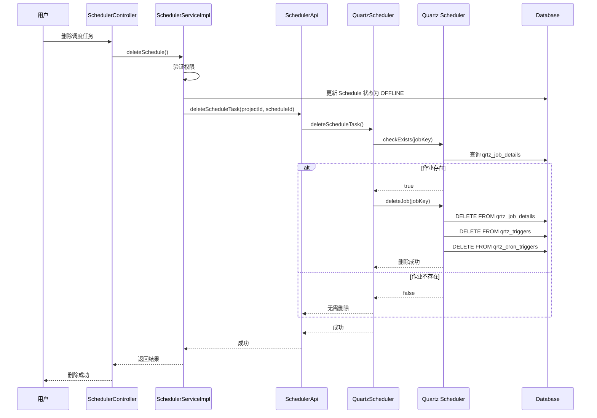
```mermaid
sequenceDiagram
    participant User as 用户
    participant API as SchedulerController
    participant SS as SchedulerServiceImpl
    participant SA as SchedulerApi
    participant QS as QuartzScheduler
    participant Quartz as Quartz Scheduler
    participant DB as Database
    
    User->>API: 删除调度任务
    API->>SS: deleteSchedule()
    SS->>SS: 验证权限
    SS->>DB: 更新 Schedule 状态为 OFFLINE
    SS->>SA: deleteScheduleTask(projectId, scheduleId)
    
    SA->>QS: deleteScheduleTask()
    QS->>Quartz: checkExists(jobKey)
    Quartz->>DB: 查询 qrtz_job_details
    
    alt 作业存在
        Quartz-->>QS: true
        QS->>Quartz: deleteJob(jobKey)
        Quartz->>DB: DELETE FROM qrtz_job_details
        Quartz->>DB: DELETE FROM qrtz_triggers
        Quartz->>DB: DELETE FROM qrtz_cron_triggers
        Quartz-->>QS: 删除成功
    else 作业不存在
        Quartz-->>QS: false
        QS-->>SA: 无需删除
    end
    
    QS-->>SA: 成功
    SA-->>SS: 成功
    SS-->>API: 返回结果
    API-->>User: 删除成功
```

## 5. 核心组件详解

### 5.1 QuartzScheduler

`QuartzScheduler` 是 `SchedulerApi` 接口的实现类，封装了 Quartz 的核心操作。

**主要方法**:
- `start()`: 启动 Quartz 调度器
- `insertOrUpdateScheduleTask()`: 创建或更新调度任务
- `deleteScheduleTask()`: 删除调度任务
- `close()`: 关闭调度器

**关键实现**:
```java
// 使用 scheduleJob 的第三个参数 true 表示如果作业已存在则更新
scheduler.scheduleJob(jobDetail, Sets.newHashSet(cornTrigger), true);
```

### 5.2 ProcessScheduleTask

`ProcessScheduleTask` 是实际执行调度任务的作业类，继承自 `QuartzJobBean`。

**执行流程**:
1. 从 `JobExecutionContext` 中获取 `projectId` 和 `scheduleId`
2. 查询 `Schedule` 对象，验证是否存在且在线
3. 查询 `WorkflowDefinition`，验证是否存在且在线
4. 构建 `WorkflowScheduleTriggerRequest` 并触发工作流实例创建
5. 如果验证失败，自动清理无效的 Quartz 作业

**异常处理**:
- Schedule 不存在或已下线 → 删除 Quartz 作业
- WorkflowDefinition 不存在 → 删除 Schedule 和 Quartz 作业
- WorkflowDefinition 已下线 → 更新 Schedule 状态并删除 Quartz 作业

### 5.3 QuartzJobKey

用于生成 Quartz 的 `JobKey`，命名规则：
- Job Name: `job_{scheduleId}`
- Job Group: `jobgroup_{projectId}`

这样设计的好处：
- 通过 `projectId` 分组，便于管理
- 通过 `scheduleId` 唯一标识作业

### 5.4 QuartzJobData

存储作业执行时需要的参数：
- `projectId`: 项目ID
- `scheduleId`: 调度ID

这些数据存储在 `qrtz_job_details.job_data` 字段中（序列化的 bytea）。

### 5.5 QuartzCornTriggerBuilder

构建 Cron 触发器的关键逻辑：

1. **时区转换**: 
   ```java
   Date startDate = DateUtils.transformTimezoneDate(schedule.getStartTime(), schedule.getTimezoneId());
   ```
   将服务器时区转换为调度任务的时区

2. **开始时间校验**:
   ```java
   if (startDate.before(now)) {
       startDate = now;  // 避免触发大量错过触发的任务
   }
   ```

3. **Misfire 策略**:
   ```java
   .withMisfireHandlingInstructionIgnoreMisfires()
   ```
   忽略错过的触发，直接按下次时间触发

## 6. 集群部署机制

### 6.1 集群配置要求

1. **共享数据库**: 所有 Master 节点必须连接到同一个数据库
2. **相同配置**: 所有节点的 Quartz 配置必须一致
3. **时钟同步**: 节点之间的系统时钟必须同步（建议使用 NTP）

### 6.2 集群工作原理

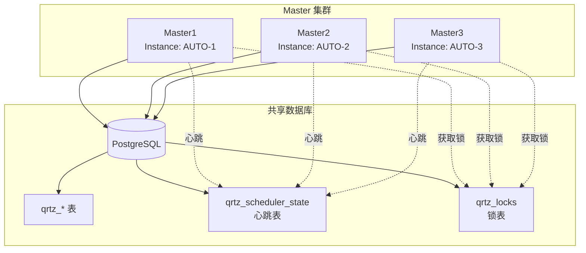
```mermaid
graph TB
    subgraph "Master 集群"
        M1[Master1<br/>Instance: AUTO-1]
        M2[Master2<br/>Instance: AUTO-2]
        M3[Master3<br/>Instance: AUTO-3]
    end
    
    subgraph "共享数据库"
        DB[(PostgreSQL)]
        QT[qrtz_* 表]
        ST[qrtz_scheduler_state<br/>心跳表]
        LT[qrtz_locks<br/>锁表]
    end
    
    M1 --> DB
    M2 --> DB
    M3 --> DB
    
    DB --> QT
    DB --> ST
    DB --> LT
    
    M1 -.心跳.-> ST
    M2 -.心跳.-> ST
    M3 -.心跳.-> ST
    
    M1 -.获取锁.-> LT
    M2 -.获取锁.-> LT
    M3 -.获取锁.-> LT
```

### 6.3 分布式锁机制

Quartz 使用数据库锁实现分布式协调：

1. **锁类型**:
   - `TRIGGER_ACCESS`: 获取触发器时使用
   - `STATE_ACCESS`: 更新状态时使用

2. **锁实现**:
   ```sql
   -- 获取锁（PostgreSQL）
   INSERT INTO qrtz_locks (sched_name, lock_name) 
   VALUES ('DolphinScheduler', 'TRIGGER_ACCESS');
   ```
   如果插入成功，表示获取到锁；如果失败（唯一约束），表示锁已被占用

3. **锁释放**:
   事务提交时自动释放（通过数据库事务机制）

### 6.4 心跳机制

每个 Master 节点每 5 秒更新一次心跳：

```sql
UPDATE qrtz_scheduler_state 
SET last_checkin_time = NOW() 
WHERE sched_name = 'DolphinScheduler' 
  AND instance_name = 'AUTO-1';
```

如果节点崩溃，其他节点会检测到心跳超时（超过 `checkin_interval * 2`），并接管该节点的任务。

### 6.5 故障转移

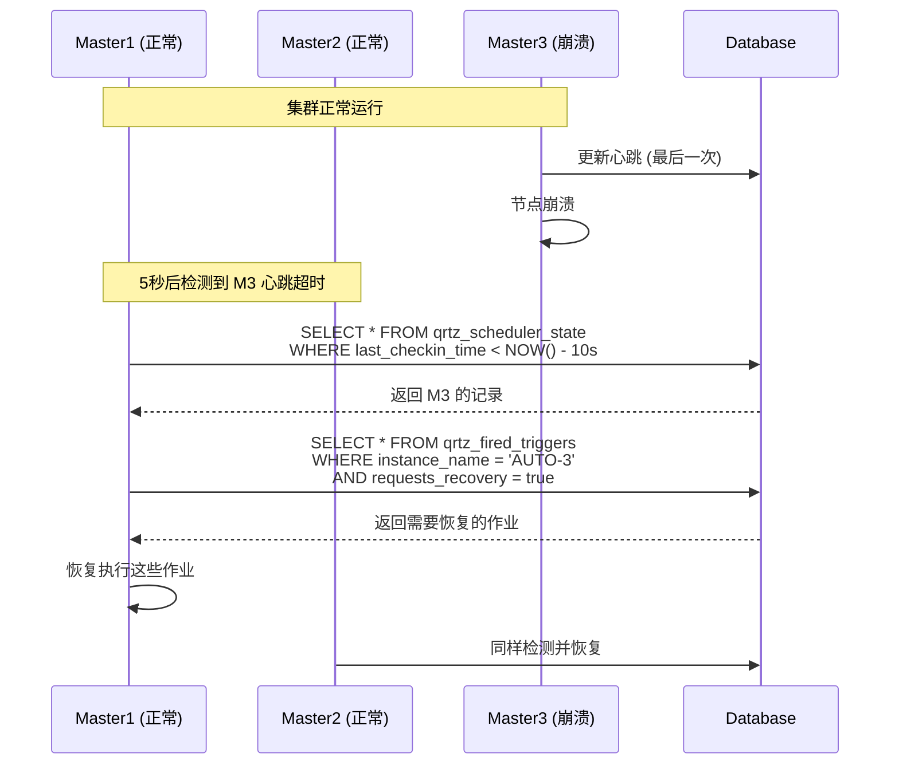
```mermaid
sequenceDiagram
    participant M1 as Master1 (正常)
    participant M2 as Master2 (正常)
    participant M3 as Master3 (崩溃)
    participant DB as Database
    
    Note over M1, M3: 集群正常运行
    
    M3->>DB: 更新心跳 (最后一次)
    M3->>M3: 节点崩溃
    
    Note over M1, M2: 5秒后检测到 M3 心跳超时
    
    M1->>DB: SELECT * FROM qrtz_scheduler_state<br/>WHERE last_checkin_time < NOW() - 10s
    DB-->>M1: 返回 M3 的记录
    
    M1->>DB: SELECT * FROM qrtz_fired_triggers<br/>WHERE instance_name = 'AUTO-3'<br/>AND requests_recovery = true
    DB-->>M1: 返回需要恢复的作业
    
    M1->>M1: 恢复执行这些作业
    
    M2->>DB: 同样检测并恢复
```

## 7. 性能优化

### 7.1 索引优化

Quartz 表的关键索引：

1. **qrtz_triggers**:
   - `idx_qrtz_t_nft_st`: `(sched_name, trigger_state, next_fire_time)`
     - 用于快速查找待触发的触发器
   - `idx_qrtz_t_nft_st_misfire_grp`: 用于处理错过触发的触发器

2. **qrtz_fired_triggers**:
   - `idx_qrtz_ft_inst_job_req_rcvry`: `(sched_name, instance_name, requests_recovery)`
     - 用于故障恢复时快速查找需要恢复的作业

### 7.2 批量获取优化

配置 `batchTriggerAcquisitionMaxCount: 1` 表示每次只获取一个触发器，这样可以：
- 减少数据库锁的持有时间
- 提高并发性能
- 避免大量触发器被单个节点获取

### 7.3 线程池配置

- **线程数**: 默认 25，可根据实际任务量调整
- **守护线程**: `makeThreadsDaemons: true`，确保 JVM 关闭时线程能正常退出
- **优先级**: `threadPriority: 5`（中等优先级）

## 8. 监控与调试

### 8.1 关键指标

通过 Micrometer 监控的指标：
- `ds.master.quartz.job.executed`: 作业执行次数
- `ds.master.quartz.job.execution.time`: 作业执行时间（包含分位数）


### 8.2 日志分析

关键日志位置：

1. **作业创建**: `QuartzScheduler.insertOrUpdateScheduleTask()`
   - 成功日志: `"Success scheduleJob: {} with trigger: {} at quartz"`
   - 失败日志: `"Failed to add scheduler task, projectId: {}, scheduler: {}"`

2. **作业执行**: `ProcessScheduleTask.executeInternal()`
   - 触发日志: `"Scheduler: {} fired expect fire time is {}, actual fire time is {}"`
   - Schedule 不存在: `"Scheduler: {} does not exist in db，will delete job in quartz"`
   - WorkflowDefinition 不存在: `"Scheduler: {} bind workflow: {} does not exist in db，will delete the schedule and delete schedule job in quartz"`
   - WorkflowDefinition 已下线: `"Scheduler: {} bind workflow: {} state is OFFLINE，will update the schedule status to OFFLINE and delete schedule job in quartz"`

3. **作业删除**: `QuartzScheduler.deleteScheduleTask()` / `ProcessScheduleTask.deleteJob()`
   - 删除日志: `"Try to delete scheduler task, projectId: {}, schedulerId: {}"` 或 `"Try to delete job: {}, projectId: {}, schedulerId: {}"`
   - 删除失败: `"Failed to delete scheduler task, projectId: {}, schedulerId: {}"` 或 `"Failed to delete job: {}"`

4. **调度器启动**: `QuartzScheduler.start()`
   - 启动成功: 通过 `scheduler.start()` 无异常即为成功
   - 启动失败: 抛出 `SchedulerException(QUARTZ_SCHEDULER_START_ERROR)`

5. **调度器关闭**: `QuartzScheduler.close()`
   - 关闭失败: 抛出 `SchedulerException(QUARTZ_SCHEDULER_SHOWDOWN_ERROR)`

### 8.3 日志查看建议

**查看调度任务执行情况**:
```bash
# 查看作业执行日志
grep "Scheduler: .* fired" logs/master.log

# 查看作业创建日志
grep "Success scheduleJob" logs/master.log

# 查看错误日志
grep "Failed to" logs/master.log
```

**查看 Quartz 相关异常**:
```bash
# 查看 SchedulerException
grep "SchedulerException" logs/master.log

# 查看作业删除相关日志
grep "delete.*job\|delete.*scheduler task" logs/master.log
```

### 8.4 常见问题排查

**问题1: 作业不执行**
- 检查调度器是否已启动: 查看 MasterServer 启动日志
- 检查 Schedule 状态: 确认 `release_state = ONLINE`
- 检查 WorkflowDefinition 状态: 确认工作流已上线
- 检查 Cron 表达式: 使用 `CronUtils.isValidExpression()` 验证
- 检查数据库连接: 确认能够访问 `qrtz_*` 表

**问题2: 集群环境下任务重复执行**
- 检查 `org.quartz.jobStore.isClustered` 配置: 应为 `true`
- 检查 `org.quartz.jobStore.clusterCheckinInterval`: 建议 5000ms
- 检查数据库锁表: `SELECT * FROM qrtz_locks`
- 检查调度器实例ID: `SELECT * FROM qrtz_scheduler_state`

**问题3: 任务执行时间不准确**
- 检查时区配置: 确认 `timezoneId` 配置正确
- 检查服务器时区: 确认服务器时区与配置一致
- 查看实际触发时间: 日志中的 `actual fire time`

**问题4: 错过触发 (Misfire)**
- 检查 `org.quartz.jobStore.misfireThreshold`: 默认 60000ms
- 检查服务器负载: 可能是线程池资源不足
- 检查数据库性能: 可能是数据库查询慢导致
- 查看触发器状态: `SELECT * FROM qrtz_triggers WHERE trigger_state = 'ERROR'`