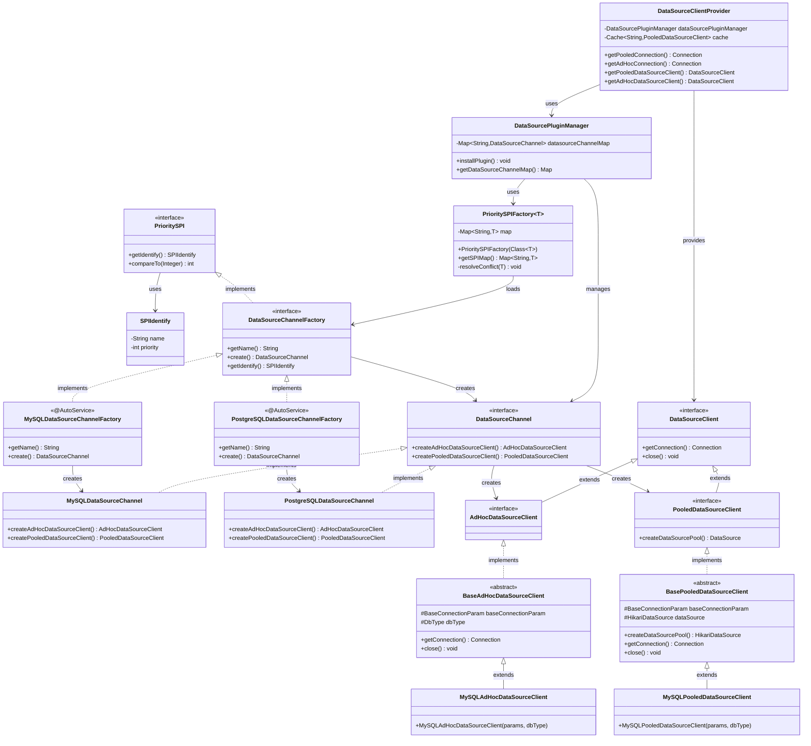
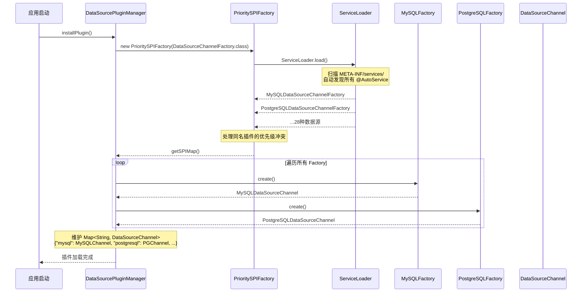
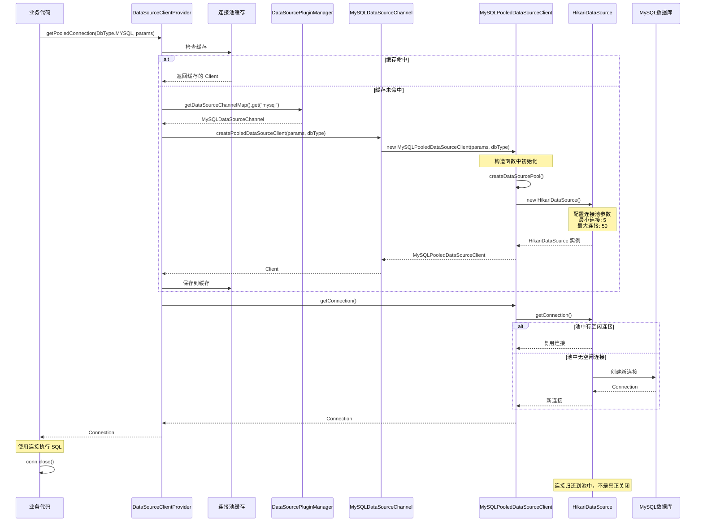
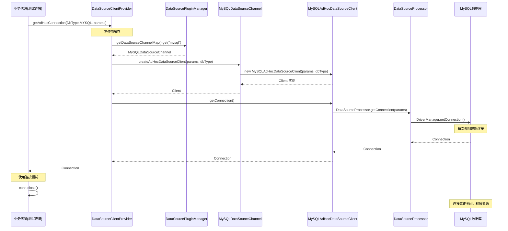

# DolphinScheduler SPI 架构图

## 📋 目录
1. [完整架构图（Mermaid）](#一完整架构图mermaid)
2. [类关系图（PlantUML）](#二类关系图plantuml)
3. [调用流程图（Mermaid）](#三调用流程图mermaid)
4. [简化架构图（ASCII）](#四简化架构图ascii)

---

## 一、完整架构图（Mermaid）

可以直接在 GitHub、Typora 等支持 Mermaid 的工具中查看。



---

## 二、类关系图（PlantUML）

将以下内容保存为 `.puml` 文件，使用 PlantUML 工具生成图片。

```plantuml
@startuml DolphinScheduler-SPI-Architecture

!define LIGHTORANGE #FFE4B5
!define LIGHTBLUE #E0F2F7
!define LIGHTGREEN #E8F5E9
!define LIGHTPURPLE #F3E5F5
!define LIGHTYELLOW #FFFDE7

skinparam packageStyle rectangle
skinparam backgroundColor white
skinparam shadowing false

' SPI 基础层
package "SPI 基础层" LIGHTYELLOW {
    interface PrioritySPI {
        + getIdentify(): SPIIdentify
        + compareTo(Integer): int
    }
    
    class SPIIdentify {
        - name: String
        - priority: int
    }
    
    class "PrioritySPIFactory<T>" as PrioritySPIFactory {
        - map: Map<String, T>
        + PrioritySPIFactory(Class<T>)
        + getSPIMap(): Map<String, T>
        - resolveConflict(T): void
    }
}

' 工厂层
package "工厂层 (SPI 扩展点)" LIGHTBLUE {
    interface DataSourceChannelFactory {
        + getName(): String
        + create(): DataSourceChannel
        + getIdentify(): SPIIdentify
    }
    
    class MySQLDataSourceChannelFactory <<@AutoService>> {
        + getName(): String
        + create(): DataSourceChannel
    }
    
    class PostgreSQLDataSourceChannelFactory <<@AutoService>> {
        + getName(): String
        + create(): DataSourceChannel
    }
    
    class "...28种数据源Factory" as OtherFactories
}

' 通道层
package "通道层" LIGHTGREEN {
    interface DataSourceChannel {
        + createAdHocDataSourceClient(): AdHocDataSourceClient
        + createPooledDataSourceClient(): PooledDataSourceClient
    }
    
    class MySQLDataSourceChannel {
        + createAdHocDataSourceClient(): AdHocDataSourceClient
        + createPooledDataSourceClient(): PooledDataSourceClient
    }
    
    class PostgreSQLDataSourceChannel {
        + createAdHocDataSourceClient(): AdHocDataSourceClient
        + createPooledDataSourceClient(): PooledDataSourceClient
    }
    
    class "...其他Channel" as OtherChannels
}

' 客户端层
package "客户端层" LIGHTPURPLE {
    interface DataSourceClient {
        + getConnection(): Connection
        + close(): void
    }
    
    interface AdHocDataSourceClient {
    }
    
    interface PooledDataSourceClient {
        + createDataSourcePool(): DataSource
    }
    
    abstract class BaseAdHocDataSourceClient {
        # baseConnectionParam: BaseConnectionParam
        # dbType: DbType
        + getConnection(): Connection
        + close(): void
    }
    
    abstract class BasePooledDataSourceClient {
        # baseConnectionParam: BaseConnectionParam
        # dataSource: HikariDataSource
        + createDataSourcePool(): HikariDataSource
        + getConnection(): Connection
        + close(): void
    }
    
    class MySQLAdHocDataSourceClient
    class MySQLPooledDataSourceClient
    class "...其他Client" as OtherClients
}

' 管理层
package "管理层" LIGHTORANGE {
    class DataSourcePluginManager {
        - datasourceChannelMap: Map<String, DataSourceChannel>
        + installPlugin(): void
        + getDataSourceChannelMap(): Map
    }
    
    class DataSourceClientProvider {
        - dataSourcePluginManager: DataSourcePluginManager
        - POOLED_DATASOURCE_CLIENT_CACHE: Cache
        + getPooledConnection(): Connection
        + getAdHocConnection(): Connection
        + getPooledDataSourceClient(): DataSourceClient
        + getAdHocDataSourceClient(): DataSourceClient
    }
}

' 关系定义
PrioritySPI <|.. DataSourceChannelFactory
PrioritySPI --> SPIIdentify

DataSourceChannelFactory <|.. MySQLDataSourceChannelFactory
DataSourceChannelFactory <|.. PostgreSQLDataSourceChannelFactory
DataSourceChannelFactory <|.. OtherFactories

DataSourceChannelFactory ..> DataSourceChannel : <<creates>>
MySQLDataSourceChannelFactory ..> MySQLDataSourceChannel : <<creates>>
PostgreSQLDataSourceChannelFactory ..> PostgreSQLDataSourceChannel : <<creates>>

DataSourceChannel <|.. MySQLDataSourceChannel
DataSourceChannel <|.. PostgreSQLDataSourceChannel
DataSourceChannel <|.. OtherChannels

DataSourceChannel ..> AdHocDataSourceClient : <<creates>>
DataSourceChannel ..> PooledDataSourceClient : <<creates>>

DataSourceClient <|-- AdHocDataSourceClient
DataSourceClient <|-- PooledDataSourceClient

AdHocDataSourceClient <|.. BaseAdHocDataSourceClient
PooledDataSourceClient <|.. BasePooledDataSourceClient

BaseAdHocDataSourceClient <|-- MySQLAdHocDataSourceClient
BasePooledDataSourceClient <|-- MySQLPooledDataSourceClient
BaseAdHocDataSourceClient <|-- OtherClients
BasePooledDataSourceClient <|-- OtherClients

PrioritySPIFactory ..> DataSourceChannelFactory : <<loads>>
DataSourcePluginManager --> PrioritySPIFactory : uses
DataSourcePluginManager --> DataSourceChannel : manages
DataSourceClientProvider --> DataSourcePluginManager : uses
DataSourceClientProvider ..> DataSourceClient : <<provides>>

note right of PrioritySPI
  所有 SPI 插件的基础接口
  提供身份标识和优先级能力
end note

note right of DataSourceChannelFactory
  SPI 扩展点
  每个数据源实现此接口
  通过 @AutoService 自动注册
end note

note right of DataSourceChannel
  抽象工厂
  创建两种策略的客户端
end note

note right of AdHocDataSourceClient
  即用即销毁
  每次创建新连接
  适合测试、低频场景
end note

note right of PooledDataSourceClient
  连接池化
  复用连接
  适合高频、生产环境
end note

@enduml
```



---

## 三、调用流程图（Mermaid）

### 3.1 系统启动流程



### 3.2 业务使用流程（Pooled）



### 3.3 业务使用流程（AdHoc）



---

## 四、简化架构图（ASCII）

### 4.1 完整分层架构

```
┌─────────────────────────────────────────────────────────────────────┐
│                          【应用层】                                   │
│  ┌───────────────────────────────────────────────────────────────┐ │
│  │  DataSourceClientProvider                                     │ │
│  │  • getPooledConnection()   ← 业务代码统一入口                  │ │
│  │  • getAdHocConnection()                                       │ │
│  └───────────────────────────┬───────────────────────────────────┘ │
└──────────────────────────────┼──────────────────────────────────────┘
                               │
┌──────────────────────────────▼──────────────────────────────────────┐
│                        【管理层】                                     │
│  ┌───────────────────────────────────────────────────────────────┐ │
│  │  DataSourcePluginManager                                      │ │
│  │  • Map<String, DataSourceChannel> datasourceChannelMap       │ │
│  │  • installPlugin()  ← 系统启动时加载所有插件                   │ │
│  └───────────────────────────┬───────────────────────────────────┘ │
└──────────────────────────────┼──────────────────────────────────────┘
                               │ uses
┌──────────────────────────────▼──────────────────────────────────────┐
│                      【SPI 管理层】                                   │
│  ┌───────────────────────────────────────────────────────────────┐ │
│  │  PrioritySPIFactory<DataSourceChannelFactory>                 │ │
│  │  • 通过 ServiceLoader 自动发现所有插件                         │ │
│  │  • 处理优先级冲突                                              │ │
│  └───────────────────────────┬───────────────────────────────────┘ │
└──────────────────────────────┼──────────────────────────────────────┘
                               │ loads
┌──────────────────────────────▼──────────────────────────────────────┐
│                      【SPI 基础层】                                   │
│  ┌───────────────────────────────────────────────────────────────┐ │
│  │  PrioritySPI (interface)                                      │ │
│  │  • 所有 SPI 插件的基础契约                                      │ │
│  └───────────────────────────┬───────────────────────────────────┘ │
│                              │ extends                               │
│  ┌───────────────────────────▼───────────────────────────────────┐ │
│  │  DataSourceChannelFactory (interface) 【SPI 扩展点】          │ │
│  │  + getName(): String                                          │ │
│  │  + create(): DataSourceChannel                                │ │
│  └───────────────────────────┬───────────────────────────────────┘ │
└──────────────────────────────┼──────────────────────────────────────┘
                               │ implements
          ┌────────────────────┼────────────────────┐
          │                    │                    │
┌─────────▼────────┐  ┌────────▼────────┐  ┌──────▼─────────┐
│ @AutoService     │  │ @AutoService    │  │  @AutoService  │
│ MySQLDataSource  │  │ PostgreSQLData  │  │  SSHDataSource │
│ ChannelFactory   │  │ SourceChannel   │  │  ChannelFactory│
│                  │  │ Factory         │  │                │
└─────────┬────────┘  └────────┬────────┘  └──────┬─────────┘
          │ create()           │ create()          │ create()
          └────────────────────┼───────────────────┘
                               │
┌──────────────────────────────▼──────────────────────────────────────┐
│                        【通道层】                                     │
│  ┌───────────────────────────────────────────────────────────────┐ │
│  │  DataSourceChannel (interface)                                │ │
│  │  + createAdHocDataSourceClient()   ← 创建临时客户端            │ │
│  │  + createPooledDataSourceClient()  ← 创建池化客户端            │ │
│  └───────────────────────────┬───────────────────────────────────┘ │
│                              │ implements                            │
│         ┌────────────────────┼────────────────────┐                 │
│         │                    │                    │                 │
│  ┌──────▼──────┐   ┌─────────▼────────┐   ┌──────▼──────┐         │
│  │  MySQLData  │   │  PostgreSQLData  │   │  SSHData    │         │
│  │  Source     │   │  SourceChannel   │   │  Source     │         │
│  │  Channel    │   │                  │   │  Channel    │         │
│  └──────┬──────┘   └─────────┬────────┘   └──────┬──────┘         │
└─────────┼────────────────────┼────────────────────┼─────────────────┘
          │                    │                    │
          │ creates            │                    │
          ▼                    ▼                    ▼
┌─────────────────────────────────────────────────────────────────────┐
│                        【客户端层】                                   │
│  ┌───────────────────────────────────────────────────────────────┐ │
│  │  DataSourceClient (interface)                                 │ │
│  │  + getConnection(): Connection                                │ │
│  │  + close(): void                                              │ │
│  └───────────────┬───────────────────────┬───────────────────────┘ │
│                  │ extends               │ extends                 │
│     ┌────────────▼─────────────┐  ┌──────▼──────────────────────┐ │
│     │ AdHocDataSourceClient    │  │ PooledDataSourceClient      │ │
│     │ 【即用即销毁】            │  │ 【连接池化 - HikariCP】      │ │
│     └────────────┬─────────────┘  └──────┬──────────────────────┘ │
│                  │ implements            │ implements              │
│     ┌────────────▼─────────────┐  ┌──────▼──────────────────────┐ │
│     │ BaseAdHocDataSource      │  │ BasePooledDataSource        │ │
│     │ Client (abstract)        │  │ Client (abstract)           │ │
│     │ • 每次创建新连接          │  │ • 维护 HikariDataSource     │ │
│     └────────────┬─────────────┘  └──────┬──────────────────────┘ │
│                  │ extends               │ extends                 │
│       ┌──────────┼──────────┐   ┌────────┼──────────┐             │
│       │          │          │   │        │          │             │
│  ┌────▼───┐ ┌───▼────┐ ┌───▼───▼┐ ┌─────▼────┐ ┌──▼─────┐       │
│  │ MySQL  │ │Postgre │ │  SSH   │ │ MySQL    │ │Postgre │       │
│  │ AdHoc  │ │SQL     │ │  AdHoc │ │ Pooled   │ │SQL     │       │
│  │ Client │ │AdHoc   │ │ Client │ │ Client   │ │Pooled  │       │
│  └────────┘ └────────┘ └────────┘ └──────────┘ └────────┘       │
└─────────────────────────────────────────────────────────────────────┘
```

### 4.2 核心调用链路

```
业务代码
    │
    ├─► DataSourceClientProvider
    │       │
    │       ├─► getPooledConnection(DbType.MYSQL, params)
    │       │       │
    │       │       ├─► 检查缓存 POOLED_DATASOURCE_CLIENT_CACHE
    │       │       │
    │       │       ├─► DataSourcePluginManager.get("mysql")
    │       │       │       │
    │       │       │       └─► 返回 MySQLDataSourceChannel
    │       │       │
    │       │       ├─► channel.createPooledDataSourceClient(...)
    │       │       │       │
    │       │       │       └─► new MySQLPooledDataSourceClient()
    │       │       │               │
    │       │       │               ├─► createDataSourcePool()
    │       │       │               │       │
    │       │       │               │       └─► new HikariDataSource()
    │       │       │               │
    │       │       │               └─► 保存到缓存
    │       │       │
    │       │       └─► client.getConnection()
    │       │               │
    │       │               └─► pool.getConnection() ← 从连接池获取
    │       │
    │       └─► getAdHocConnection(DbType.MYSQL, params)
    │               │
    │               ├─► DataSourcePluginManager.get("mysql")
    │               │
    │               ├─► channel.createAdHocDataSourceClient(...)
    │               │       │
    │               │       └─► new MySQLAdHocDataSourceClient()
    │               │
    │               └─► client.getConnection()
    │                       │
    │                       └─► DriverManager.getConnection() ← 每次新建
    │
    └─► 使用 Connection 执行 SQL
```

### 4.3 两种客户端对比

```
┌─────────────────────────────────────────────────────────────────┐
│                     AdHoc vs Pooled                              │
├─────────────────────────────────────────────────────────────────┤
│                                                                  │
│  ┌───────────────────────────┐   ┌───────────────────────────┐ │
│  │  AdHocDataSourceClient    │   │  PooledDataSourceClient   │ │
│  ├───────────────────────────┤   ├───────────────────────────┤ │
│  │                           │   │                           │ │
│  │  🔸 每次创建新连接         │   │  🔸 连接池复用            │ │
│  │  🔸 用完即销毁            │   │  🔸 维护 HikariDataSource │ │
│  │  🔸 不占用长期资源         │   │  🔸 最小连接: 5           │ │
│  │  🔸 性能较低              │   │  🔸 最大连接: 50          │ │
│  │                           │   │  🔸 性能高                │ │
│  │  适用场景:                │   │                           │ │
│  │  • 测试连接               │   │  适用场景:                │ │
│  │  • 偶尔查询               │   │  • 生产环境               │ │
│  │  • 一次性操作             │   │  • 高频访问               │ │
│  │                           │   │  • 长期运行               │ │
│  │  实现:                    │   │                           │ │
│  │  DriverManager           │   │  实现:                    │ │
│  │  .getConnection()        │   │  pool.getConnection()     │ │
│  │                           │   │                           │ │
│  └───────────────────────────┘   └───────────────────────────┘ │
└─────────────────────────────────────────────────────────────────┘
```

### 4.4 设计模式应用图

```
┌─────────────────────────────────────────────────────────────────┐
│                      设计模式应用                                 │
└─────────────────────────────────────────────────────────────────┘

1. SPI 模式
   ServiceLoader + @AutoService
   ────────────────────────────────
   PrioritySPI ──► @AutoService ──► 自动发现


2. 工厂模式
   ────────────────────────────────
   DataSourceChannelFactory.create() ──► DataSourceChannel
   DataSourceChannel.createXxxClient() ──► DataSourceClient


3. 抽象工厂模式
   ────────────────────────────────
   MySQLDataSourceChannel (工厂)
       ├── createAdHocClient() ──► MySQLAdHocClient
       └── createPooledClient() ──► MySQLPooledClient


4. 策略模式
   ────────────────────────────────
   DataSourceClient (接口)
       ├── AdHocStrategy (即用即销毁)
       └── PooledStrategy (连接池复用)


5. 单例模式
   ────────────────────────────────
   • DataSourcePluginManager (全局唯一)
   • POOLED_DATASOURCE_CLIENT_CACHE (全局缓存)


6. 模板方法模式
   ────────────────────────────────
   BasePooledDataSourceClient (模板)
       ├── 定义算法骨架
       └── 子类扩展钩子方法


7. 适配器模式
   ────────────────────────────────
   DataSourceProcessor (适配器)
       ├── MySQLProcessor (适配 MySQL)
       ├── PostgreSQLProcessor (适配 PostgreSQL)
       └── OracleProcessor (适配 Oracle)


8. 代理模式
   ────────────────────────────────
   HikariDataSource (代理)
       ├── 连接复用
       ├── 连接验证
       └── 超时处理
```

---

## 五、关键理解要点

### 5.1 核心类职责

```
┌─────────────────────────────────────────────────────────────┐
│ 类名                          │ 角色       │ 类比           │
├─────────────────────────────────────────────────────────────┤
│ PrioritySPI                   │ 身份证     │ 员工工牌       │
│ PrioritySPIFactory            │ 加载器     │ 人事经理       │
│ DataSourceChannelFactory      │ 工厂       │ 厂长           │
│ DataSourceChannel             │ 通道       │ 生产线         │
│ DataSourceClient              │ 客户端     │ 实际工人       │
│   ├─ AdHocDataSourceClient    │ 临时工     │ 临时工         │
│   └─ PooledDataSourceClient   │ 正式工     │ 正式员工       │
└─────────────────────────────────────────────────────────────┘
```

### 5.2 数据流转

```
用户连接参数 (BaseConnectionParam)
    │
    ├─► DbType (数据源类型, 如 "mysql")
    │
    ├─► DataSourcePluginManager.get(dbType)
    │       │
    │       └─► DataSourceChannel
    │
    ├─► channel.createXxxClient(params, dbType)
    │       │
    │       └─► DataSourceClient
    │
    ├─► client.getConnection()
    │       │
    │       └─► java.sql.Connection
    │
    └─► 业务代码执行 SQL
```

---

## 六、使用建议

### 在线预览 Mermaid 图
- GitHub 直接支持 Mermaid 渲染
- 访问 https://mermaid.live/ 在线预览和编辑
- Typora、VS Code (Markdown Preview Enhanced) 支持

### 生成 PlantUML 图片
```bash
# 安装 PlantUML
brew install plantuml  # macOS
apt-get install plantuml  # Ubuntu

# 生成图片
plantuml SPI架构图.md
```

### 推荐工具
- **Mermaid**: 简单易用，GitHub 原生支持
- **PlantUML**: 功能强大，适合复杂架构图
- **Draw.io**: 可视化编辑，导出多种格式

---

希望这些架构图能帮助您更好地理解 DolphinScheduler SPI 的设计！🎉

