# Worker RPC 服务启动流程详细分析

## 一、概述

本文档详细分析 DolphinScheduler Worker 服务启动时的 RPC 服务启动流程，以及基于 Netty 的 RPC 框架实现原理。从 [`WorkerServer.run()`](dolphinscheduler-worker/src/main/java/org/apache/dolphinscheduler/server/worker/WorkerServer.java:81) 方法中的 `this.workerRpcServer.start()` 调用开始，深入分析整个 RPC 服务启动过程。

## 二、RPC 服务启动流程

### 2.1 入口：WorkerServer.run()

在 `WorkerServer` 类的 `@PostConstruct` 方法 `run()` 中，首先调用 RPC 服务器的启动方法：

```java
// dolphinscheduler-worker/src/main/java/org/apache/dolphinscheduler/server/worker/WorkerServer.java:81
this.workerRpcServer.start();
```

**完整启动流程：**

```java
@PostConstruct
public void run() {
    ServerLifeCycleManager.toRunning();
    
    this.workerRpcServer.start();  // ← RPC 服务启动入口
    
    TaskPluginManager.loadTaskPlugin();
    DataSourceProcessorProvider.initialize();
    this.workerRegistryClient.setRegistryStoppable(this);
    this.workerRegistryClient.start();
    this.physicalTaskEngineDelegator.start();
    // ... 其他初始化
}
```

### 2.2 类继承关系

```
WorkerRpcServer
    ↓ extends
SpringServerMethodInvokerDiscovery
    ↓ extends
RpcServer
    ↓ contains
NettyRemotingServer
    ↓ uses
JdkDynamicServerHandler
```

### 2.3 完整启动流程时序图

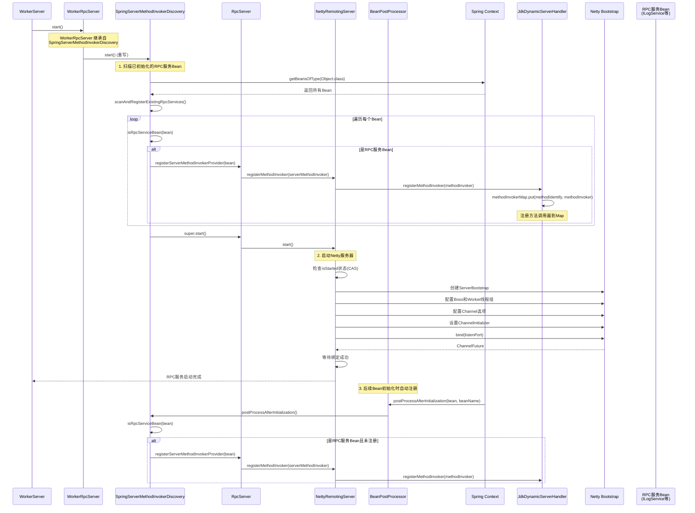

### 2.4 详细流程分析

#### 2.4.1 WorkerRpcServer 初始化

```java
// dolphinscheduler-worker/src/main/java/org/apache/dolphinscheduler/server/worker/rpc/WorkerRpcServer.java:34-37
public WorkerRpcServer(WorkerConfig workerConfig) {
    super(NettyServerConfig.builder()
            .serverName("WorkerRpcServer")
            .listenPort(workerConfig.getListenPort())  // 默认1234
            .build());
}
```

**关键点：**
- `WorkerRpcServer` 继承 [`SpringServerMethodInvokerDiscovery`](dolphinscheduler-extract/dolphinscheduler-extract-base/src/main/java/org/apache/dolphinscheduler/extract/base/server/SpringServerMethodInvokerDiscovery.java)
- 通过构造函数传入 [`NettyServerConfig`](dolphinscheduler-extract/dolphinscheduler-extract-base/src/main/java/org/apache/dolphinscheduler/extract/base/config/NettyServerConfig.java)，配置服务器名称和监听端口
- Spring 容器自动注入 [`WorkerConfig`](dolphinscheduler-worker/src/main/java/org/apache/dolphinscheduler/server/worker/config/WorkerConfig.java:43)，获取配置的监听端口（默认 1234）

#### 2.4.2 SpringServerMethodInvokerDiscovery.start()

```java
// dolphinscheduler-extract/dolphinscheduler-extract-base/src/main/java/org/apache/dolphinscheduler/extract/base/server/SpringServerMethodInvokerDiscovery.java:99-108
@Override
public void start() {
    // 在启动前扫描并注册所有已初始化的RPC服务Bean
    if (applicationContext != null) {
        scanAndRegisterExistingRpcServices();
    }
    super.start();  // 调用父类RpcServer的start()方法
}
```

**为什么需要 scanAndRegisterExistingRpcServices()？**

Spring 的 Bean 初始化顺序：
1. 先初始化所有 `BeanPostProcessor`（包括 `SpringServerMethodInvokerDiscovery`）
2. 再初始化其他 bean（如 `WorkerLogServiceImpl`、`PhysicalTaskExecutorOperatorImpl` 等）
3. 每个 bean 初始化完成后，调用所有 `BeanPostProcessor` 的 `postProcessAfterInitialization`
4. 所有 bean 初始化完成后，才调用所有 bean 的 `@PostConstruct`（如 `WorkerServer.run()`）

**问题场景：**
- 如果某个 RPC 服务 Bean 在 `workerRpcServer.start()` 之后才初始化，启动时它还未注册
- 需要双重保障机制：启动时扫描 + BeanPostProcessor 监听

**scanAndRegisterExistingRpcServices() 实现：**

```java
// dolphinscheduler-extract/dolphinscheduler-extract-base/src/main/java/org/apache/dolphinscheduler/extract/base/server/SpringServerMethodInvokerDiscovery.java:131-153
private void scanAndRegisterExistingRpcServices() {
    Map<String, Object> allBeans = applicationContext.getBeansOfType(Object.class);
    int registeredCount = 0;
    for (Map.Entry<String, Object> entry : allBeans.entrySet()) {
        Object bean = entry.getValue();
        if (bean == this) {
            continue;  // 跳过自身
        }
        // 检查是否为RPC服务Bean且未注册
        if (isRpcServiceBean(bean) && !registeredBeans.contains(bean)) {
            registerServerMethodInvokerProvider(bean);  // 注册方法调用器
            registeredBeans.add(bean);
            registeredCount++;
        }
    }
    if (registeredCount > 0) {
        log.info("Registered {} existing RPC service bean(s) before starting RPC server", registeredCount);
    }
}
```

#### 2.4.3 RPC 服务 Bean 识别

**isRpcServiceBean() 方法：**

```java
// dolphinscheduler-extract/dolphinscheduler-extract-base/src/main/java/org/apache/dolphinscheduler/extract/base/server/SpringServerMethodInvokerDiscovery.java:160-167
private boolean isRpcServiceBean(Object bean) {
    for (Class<?> anInterface : bean.getClass().getInterfaces()) {
        if (anInterface.getAnnotation(RpcService.class) != null) {
            return true;
        }
    }
    return false;
}
```

**Worker 提供的 RPC 服务接口：**

1. **ILogService** - 日志服务
    - 接口定义：[`ILogService`](dolphinscheduler-extract/dolphinscheduler-extract-common/src/main/java/org/apache/dolphinscheduler/extract/common/ILogService.java)
    - 实现类：[`WorkerLogServiceImpl`](dolphinscheduler-worker/src/main/java/org/apache/dolphinscheduler/server/worker/rpc/WorkerLogServiceImpl.java)

2. **IPhysicalTaskExecutorOperator** - 物理任务执行器操作
    - 接口定义：[`IPhysicalTaskExecutorOperator`](dolphinscheduler-extract/dolphinscheduler-extract-worker/src/main/java/org/apache/dolphinscheduler/extract/worker/IPhysicalTaskExecutorOperator.java)
    - 实现类：[`PhysicalTaskExecutorOperatorImpl`](dolphinscheduler-worker/src/main/java/org/apache/dolphinscheduler/server/worker/rpc/PhysicalTaskExecutorOperatorImpl.java)

3. **IStreamingTaskInstanceOperator** - 流式任务实例操作
    - 接口定义：[`IStreamingTaskInstanceOperator`](dolphinscheduler-extract/dolphinscheduler-extract-worker/src/main/java/org/apache/dolphinscheduler/extract/worker/IStreamingTaskInstanceOperator.java)
    - 实现类：[`StreamingTaskInstanceOperatorImpl`](dolphinscheduler-worker/src/main/java/org/apache/dolphinscheduler/server/worker/rpc/StreamingTaskInstanceOperatorImpl.java)

**RPC 服务接口示例：**

```java
// dolphinscheduler-extract/dolphinscheduler-extract-common/src/main/java/org/apache/dolphinscheduler/extract/common/ILogService.java
@RpcService
public interface ILogService {
    @RpcMethod
    TaskInstanceLogFileDownloadResponse getTaskInstanceWholeLogFileBytes(TaskInstanceLogFileDownloadRequest request);
    
    @RpcMethod
    TaskInstanceLogPageQueryResponse pageQueryTaskInstanceLog(TaskInstanceLogPageQueryRequest request);
    
    @RpcMethod
    void removeTaskInstanceLog(String taskInstanceLogAbsolutePath);
}
```

#### 2.4.4 方法注册流程：registerServerMethodInvokerProvider()

```java
// dolphinscheduler-extract/dolphinscheduler-extract-base/src/main/java/org/apache/dolphinscheduler/extract/base/server/RpcServer.java:51-70
@Override
public void registerServerMethodInvokerProvider(Object serverMethodInvokerProviderBean) {
    // 1. 获取bean对应的接口
    for (Class<?> anInterface : serverMethodInvokerProviderBean.getClass().getInterfaces()) {
        if (anInterface.getAnnotation(RpcService.class) == null) {
            continue;
        }
        // 2. 遍历接口的方法
        for (Method method : anInterface.getDeclaredMethods()) {
            RpcMethod rpcMethod = method.getAnnotation(RpcMethod.class);
            if (rpcMethod == null) {
                continue;
            }
            // 3. 创建ServerMethodInvoker
            ServerMethodInvoker serverMethodInvoker =
                    new ServerMethodInvokerImpl(serverMethodInvokerProviderBean, method);
            // 4. 注册到NettyRemotingServer
            nettyRemotingServer.registerMethodInvoker(serverMethodInvoker);
        }
    }
}
```

**ServerMethodInvokerImpl 实现：**

```java
// dolphinscheduler-extract/dolphinscheduler-extract-base/src/main/java/org/apache/dolphinscheduler/extract/base/server/ServerMethodInvokerImpl.java
class ServerMethodInvokerImpl implements ServerMethodInvoker {
    private final Object serviceBean;      // RPC服务Bean实例
    private final Method method;            // 要调用的方法
    private final String methodIdentify;    // 方法标识：method.toGenericString()
    
    @Override
    public Object invoke(Object... args) throws Throwable {
        return method.invoke(serviceBean, args);  // 反射调用
    }
    
    @Override
    public String getMethodIdentify() {
        return methodIdentify;  // 例如：public abstract org.apache.dolphinscheduler.extract.common.transportor.TaskInstanceLogFileDownloadResponse org.apache.dolphinscheduler.extract.common.ILogService.getTaskInstanceWholeLogFileBytes(org.apache.dolphinscheduler.extract.common.transportor.TaskInstanceLogFileDownloadRequest)
    }
}
```

**注册到 Handler：**

```java
// dolphinscheduler-extract/dolphinscheduler-extract-base/src/main/java/org/apache/dolphinscheduler/extract/base/server/NettyRemotingServer.java:162-164
void registerMethodInvoker(ServerMethodInvoker methodInvoker) {
    channelHandler.registerMethodInvoker(methodInvoker);
}

// dolphinscheduler-extract/dolphinscheduler-extract-base/src/main/java/org/apache/dolphinscheduler/extract/base/server/JdkDynamicServerHandler.java:72-77
public void registerMethodInvoker(ServerMethodInvoker methodInvoker) {
    checkNotNull(methodInvoker);
    checkNotNull(methodInvoker.getMethodIdentify());
    // 将方法标识符和调用器存入Map，用于后续请求路由
    methodInvokerMap.put(methodInvoker.getMethodIdentify(), methodInvoker);
}
```

**注册结果：**
- `methodInvokerMap` 是一个 `ConcurrentHashMap<String, ServerMethodInvoker>`
- Key: 方法标识符（`method.toGenericString()`）
- Value: `ServerMethodInvoker` 实例，包含服务Bean和方法信息

#### 2.4.5 NettyRemotingServer 启动

```java
// dolphinscheduler-extract/dolphinscheduler-extract-base/src/main/java/org/apache/dolphinscheduler/extract/base/server/NettyRemotingServer.java:97-135
void start() {
    if (isStarted.compareAndSet(false, true)) {  // CAS保证只启动一次
        // 1. 创建ServerBootstrap
        ServerBootstrap serverBootstrap = new ServerBootstrap()
                .group(this.bossGroup, this.workGroup)  // 设置线程组
                .channel(NettyUtils.getServerSocketChannelClass())  // NIO或Epoll
                .option(ChannelOption.SO_REUSEADDR, true)
                .option(ChannelOption.SO_BACKLOG, serverConfig.getSoBacklog())  // 1024
                .childOption(ChannelOption.SO_KEEPALIVE, serverConfig.isSoKeepalive())  // true
                .childOption(ChannelOption.TCP_NODELAY, serverConfig.isTcpNoDelay())  // true
                .childOption(ChannelOption.SO_SNDBUF, serverConfig.getSendBufferSize())  // 65535
                .childOption(ChannelOption.SO_RCVBUF, serverConfig.getReceiveBufferSize())  // 65535
                .childHandler(new ChannelInitializer<SocketChannel>() {
                    @Override
                    protected void initChannel(SocketChannel ch) {
                        initNettyChannel(ch);  // 初始化Channel Pipeline
                    }
                });
        
        // 2. 绑定端口
        final ChannelFuture channelFuture = serverBootstrap.bind(serverConfig.getListenPort()).sync();
        if (channelFuture.isSuccess()) {
            log.info("{} bind success at port: {}", serverConfig.getServerName(), serverConfig.getListenPort());
            this.serverBootstrapChannel = channelFuture.channel();
        }
    }
}
```

#### 2.4.6 Netty Channel Pipeline 初始化

```java
// dolphinscheduler-extract/dolphinscheduler-extract-base/src/main/java/org/apache/dolphinscheduler/extract/base/server/NettyRemotingServer.java:149-160
private void initNettyChannel(SocketChannel ch) {
    ch.pipeline()
            .addLast("encoder", new TransporterEncoder())      // 出站：对象→字节
            .addLast("decoder", new TransporterDecoder())      // 入站：字节→对象
            .addLast("server-idle-handle",
                    new IdleStateHandler(
                            serverConfig.getConnectionIdleTime(),  // 60秒
                            0, 
                            0, 
                            TimeUnit.MILLISECONDS))              // 空闲检测
            .addLast("handler", channelHandler);                 // 业务处理器
}
```

**Pipeline 结构：**

```
┌─────────────────────────────────────────────────────────────┐
│                    Channel Pipeline                         │
├─────────────────────────────────────────────────────────────┤
│                                                             │
│  Inbound (接收数据流向)                                      │
│  ────────────────────────────────────────────────>         │
│                                                             │
│  [TransporterDecoder] → [IdleStateHandler] → [Handler]    │
│                                                             │
│  <────────────────────────────────────────────────          │
│  Outbound (发送数据流向)                                     │
│                                                             │
│  [TransporterEncoder]                                       │
│                                                             │
└─────────────────────────────────────────────────────────────┘
```

**注意：** `initNettyChannel()` 不是服务启动时调用，而是新的客户端连接时调用，为每个连接创建独立的 Pipeline。

#### 2.4.7 EventLoopGroup 初始化

```java
// dolphinscheduler-extract/dolphinscheduler-extract-base/src/main/java/org/apache/dolphinscheduler/extract/base/server/NettyRemotingServer.java:74-95
NettyRemotingServer(final NettyServerConfig serverConfig) {
    this.serverConfig = serverConfig;
    this.serverName = serverConfig.getServerName();
    
    // 1. 创建方法调用线程池
    this.methodInvokerExecutor = ThreadUtils.newDaemonFixedThreadExecutor(
            serverName + "-methodInvoker-%d", 
            Runtime.getRuntime().availableProcessors() * 2 + 1);
    
    // 2. 创建ChannelHandler
    this.channelHandler = new JdkDynamicServerHandler(methodInvokerExecutor);
    
    // 3. 创建Boss线程组（接收连接）
    ThreadFactory bossThreadFactory = ThreadUtils.newDaemonThreadFactory(serverName + "-boss-%d");
    
    // 4. 创建Worker线程组（处理I/O）
    ThreadFactory workerThreadFactory = ThreadUtils.newDaemonThreadFactory(serverName + "-worker-%d");
    
    // 5. 根据操作系统选择NIO或Epoll
    if (Epoll.isAvailable()) {  // Linux系统且epoll可用
        this.bossGroup = new EpollEventLoopGroup(1, bossThreadFactory);
        this.workGroup = new EpollEventLoopGroup(serverConfig.getWorkerThread(), workerThreadFactory);
    } else {  // 其他系统使用NIO
        this.bossGroup = new NioEventLoopGroup(1, bossThreadFactory);
        this.workGroup = new NioEventLoopGroup(serverConfig.getWorkerThread(), workerThreadFactory);
    }
}
```

**线程模型：**

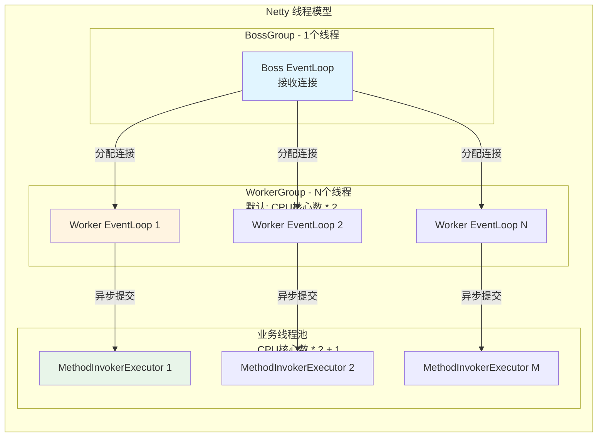

### 2.5 BeanPostProcessor 机制（后续注册）

`SpringServerMethodInvokerDiscovery` 实现了 `BeanPostProcessor` 接口，在 Spring 容器初始化其他 Bean 时会自动调用：

```java
// dolphinscheduler-extract/dolphinscheduler-extract-base/src/main/java/org/apache/dolphinscheduler/extract/base/server/SpringServerMethodInvokerDiscovery.java:169-182
@Nullable
@Override
public Object postProcessAfterInitialization(Object bean, String beanName) throws BeansException {
    // 自动注册RPC服务Bean（处理在RPC服务器启动后才初始化的Bean）
    if (isRpcServiceBean(bean) && !registeredBeans.contains(bean)) {
        registerServerMethodInvokerProvider(bean);
        registeredBeans.add(bean);
        log.debug("Registered RPC service bean via BeanPostProcessor: {}", beanName);
    }
    return bean;
}
```

**双重注册机制总结：**

1. **启动时扫描**：`scanAndRegisterExistingRpcServices()` 处理在 RPC 服务器启动前已初始化的 Bean
2. **动态注册**：`postProcessAfterInitialization()` 处理在 RPC 服务器启动后才初始化的 Bean

这样确保所有 RPC 服务 Bean 都被正确注册，无论初始化顺序如何。

## 三、Worker 提供的 RPC 服务

### 3.1 ILogService - 日志服务

**接口定义：** [`ILogService`](dolphinscheduler-extract/dolphinscheduler-extract-common/src/main/java/org/apache/dolphinscheduler/extract/common/ILogService.java)

**实现类：** [`WorkerLogServiceImpl`](dolphinscheduler-worker/src/main/java/org/apache/dolphinscheduler/server/worker/rpc/WorkerLogServiceImpl.java)

**提供的方法：**

1. `getTaskInstanceWholeLogFileBytes()` - 获取任务实例完整日志文件字节
2. `pageQueryTaskInstanceLog()` - 分页查询任务实例日志
3. `removeTaskInstanceLog()` - 删除任务实例日志

**使用场景：**
- Master 或 API Server 需要查看 Worker 上任务执行的日志
- 支持日志下载和分页查询

### 3.2 IPhysicalTaskExecutorOperator - 物理任务执行器操作

**接口定义：** [`IPhysicalTaskExecutorOperator`](dolphinscheduler-extract/dolphinscheduler-extract-worker/src/main/java/org/apache/dolphinscheduler/extract/worker/IPhysicalTaskExecutorOperator.java)

**实现类：** [`PhysicalTaskExecutorOperatorImpl`](dolphinscheduler-worker/src/main/java/org/apache/dolphinscheduler/server/worker/rpc/PhysicalTaskExecutorOperatorImpl.java)

**提供的方法：**

1. `dispatchTask()` - 分发任务到 Worker 执行
2. `killTask()` - 杀死正在执行的任务
3. `pauseTask()` - 暂停正在执行的任务
4. `reassignWorkflowInstanceHost()` - 重新分配工作流实例的主机
5. `ackPhysicalTaskExecutorLifecycleEvent()` - 确认物理任务执行器生命周期事件

**使用场景：**
- Master 向 Worker 下发任务执行请求
- Master 控制 Worker 上任务的执行（暂停、杀死等）
- 任务执行器生命周期管理

### 3.3 IStreamingTaskInstanceOperator - 流式任务实例操作

**接口定义：** [`IStreamingTaskInstanceOperator`](dolphinscheduler-extract/dolphinscheduler-extract-worker/src/main/java/org/apache/dolphinscheduler/extract/worker/IStreamingTaskInstanceOperator.java)

**实现类：** [`StreamingTaskInstanceOperatorImpl`](dolphinscheduler-worker/src/main/java/org/apache/dolphinscheduler/server/worker/rpc/StreamingTaskInstanceOperatorImpl.java)

**提供的方法：**

1. `triggerSavepoint()` - 触发流式任务的保存点

**使用场景：**
- 流式任务（如 Flink）的保存点操作
- 支持流式任务的容错和恢复

### 3.4 RPC 服务注册关系图

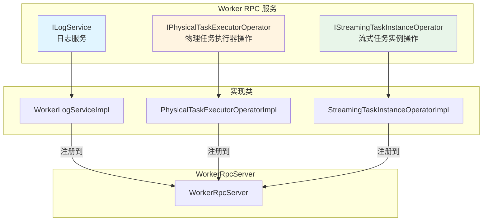

## 四、Netty 核心技术深度解析

### 4.1 类图关系

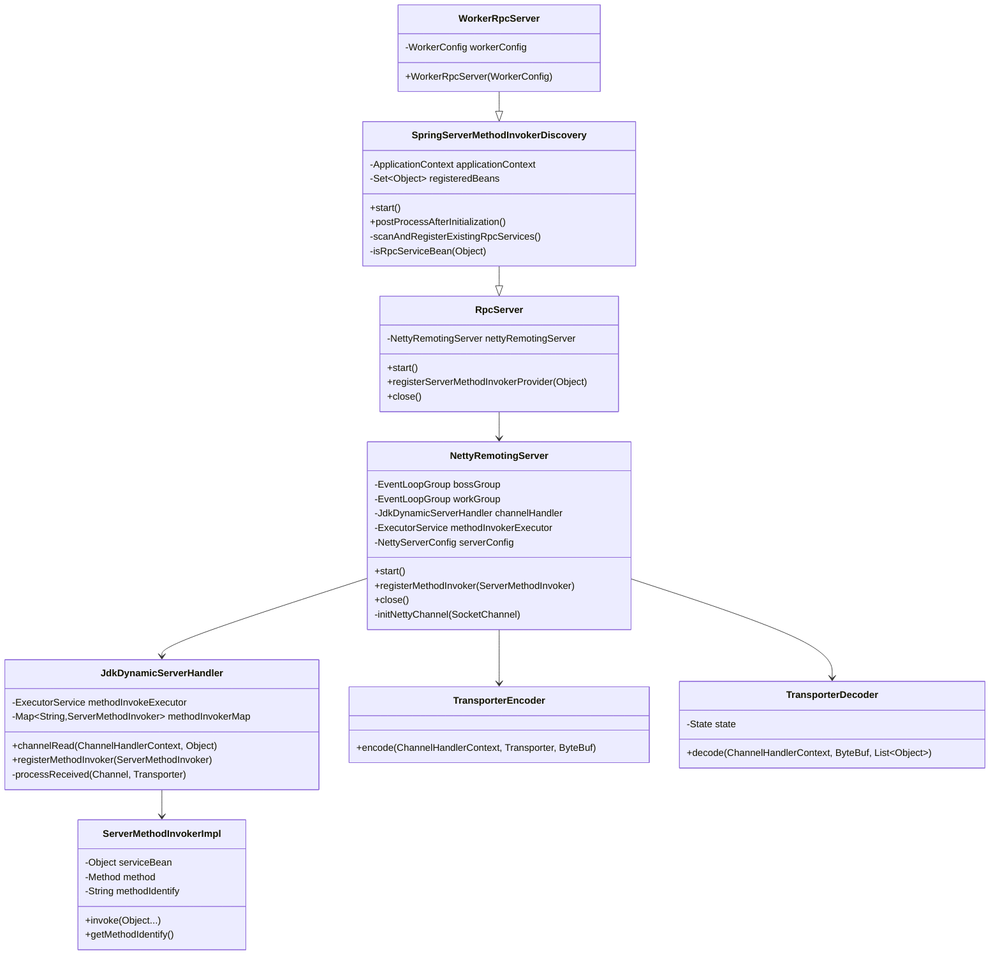

### 4.2 多路复用（I/O Multiplexing）详解

#### 4.2.1 多路复用的核心体现

**1. EventLoopGroup - 线程池复用**

```java
// dolphinscheduler-extract/dolphinscheduler-extract-base/src/main/java/org/apache/dolphinscheduler/extract/base/server/NettyRemotingServer.java:88-94
if (Epoll.isAvailable()) {
    this.bossGroup = new EpollEventLoopGroup(1, bossThreadFactory);
    // 默认：CPU核心数 * 2 个线程
    this.workGroup = new EpollEventLoopGroup(serverConfig.getWorkerThread(), workerThreadFactory);
} else {
    this.bossGroup = new NioEventLoopGroup(1, bossThreadFactory);
    this.workGroup = new NioEventLoopGroup(serverConfig.getWorkerThread(), workerThreadFactory);
}
```

**多路复用架构图：**

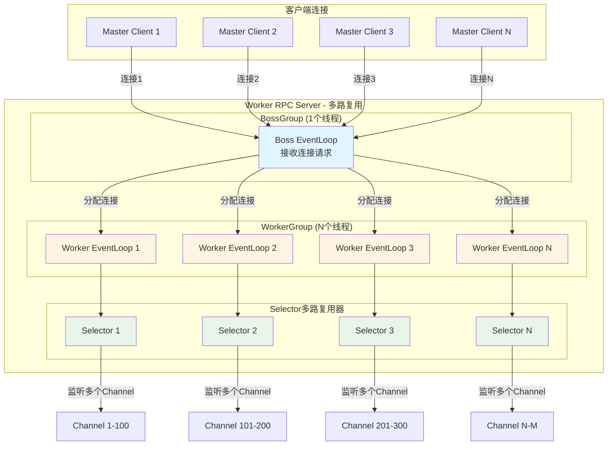

**多路复用原理：**

1. **一个 EventLoop 管理多个 Channel**
    - 每个 Worker EventLoop 绑定一个 Selector（多路复用器）
    - 一个 Selector 可以同时监听多个 Channel 的 I/O 事件（读、写、连接等）
    - 避免了传统 BIO 模式下一个线程对应一个连接的资源浪费

2. **事件驱动模型**
   ```java
   // Netty内部实现（简化）
   while (true) {
       // 一次 select() 可以检测到多个 Channel 的 I/O 事件
       int readyChannels = selector.select();
       Set<SelectionKey> selectedKeys = selector.selectedKeys();
       
       for (SelectionKey key : selectedKeys) {
           if (key.isReadable()) {
               // 处理读事件 - 可能是多个Channel的数据到达
               handleRead(key);
           }
           if (key.isWritable()) {
               // 处理写事件 - 可能是多个Channel的写就绪
               handleWrite(key);
           }
       }
   }
   ```

3. **资源利用率对比**

```
传统BIO模型（每连接一线程）：
┌─────────┐
│ Master1 │ ──→ ┌──────────┐
└─────────┘     │ Thread 1 │
┌─────────┐     └──────────┘
│ Master2 │ ──→ ┌──────────┐
└─────────┘     │ Thread 2 │
┌─────────┐     └──────────┘
│ Master3 │ ──→ ┌──────────┐
└─────────┘     │ Thread 3 │
                └──────────┘
问题：1000个连接 = 1000个线程（内存开销大，上下文切换频繁）

Netty NIO模型（多路复用）：
┌─────────┐
│ Master1 │ ─┐
└─────────┘  │
┌─────────┐  ├──→ ┌────────────────┐
│ Master2 │ ─┤    │ Worker Thread   │ ──→ Selector (监听1000个Channel)
└─────────┘  │    │ (EventLoop)     │
┌─────────┐  │    └────────────────┘
│ Master3 │ ─┤
└─────────┘  │
    ...      │
┌─────────┐  │
│Master100│ ─┘
└─────────┘
优势：1000个连接 ≈ 4-8个线程（资源占用少，性能高）
```

#### 4.2.2 Epoll vs NIO 的选择

**Epoll 优势（Linux系统）：**
- **O(1) 时间复杂度**：epoll 使用事件通知机制，不随连接数线性增长
- **边缘触发（ET）模式**：更高效的事件通知
- **无文件描述符限制**：可以处理大量并发连接
- **零拷贝支持**：更好的性能

**性能对比：**
```
连接数       NIO Selector          Epoll
1000        ~10ms                ~1ms
10000       ~100ms               ~5ms
100000      ~1000ms (性能下降)    ~20ms (性能稳定)
```

### 4.3 双工通信（Full-Duplex Communication）详解

#### 4.3.1 TCP 双工通信的本质

TCP 连接是全双工的，意味着：
- **双向数据流**：同一连接可以同时发送和接收数据
- **独立缓冲区**：发送和接收有独立的缓冲区
- **无需等待**：发送数据时不需要等待接收完成

#### 4.3.2 Netty 中的双工通信体现

**1. Pipeline 双向处理**

```java
// dolphinscheduler-extract/dolphinscheduler-extract-base/src/main/java/org/apache/dolphinscheduler/extract/base/server/NettyRemotingServer.java:149-160
private void initNettyChannel(SocketChannel ch) {
    ch.pipeline()
            .addLast("encoder", new TransporterEncoder())      // 出站：发送数据编码
            .addLast("decoder", new TransporterDecoder())      // 入站：接收数据解码
            .addLast("server-idle-handle", new IdleStateHandler(...))
            .addLast("handler", channelHandler);                 // 双向处理
}
```

**Pipeline 双向数据流：**

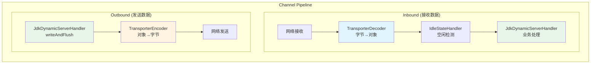

**2. 请求-响应在同一 Channel 中**

```java
// dolphinscheduler-extract/dolphinscheduler-extract-base/src/main/java/org/apache/dolphinscheduler/extract/base/server/JdkDynamicServerHandler.java:79-139
private void processReceived(final Channel channel, final Transporter transporter) {
    // 1. 接收请求（Inbound）
    final String methodIdentifier = transporter.getHeader().getMethodIdentifier();
    ServerMethodInvoker methodInvoker = methodInvokerMap.get(methodIdentifier);
    
    // 2. 异步处理（避免阻塞EventLoop线程）
    methodInvokeExecutor.execute(() -> {
        try {
            // 3. 反序列化请求参数
            StandardRpcRequest standardRpcRequest =
                    JsonSerializer.deserialize(transporter.getBody(), StandardRpcRequest.class);
            Object[] args = deserializeArgs(standardRpcRequest);
            
            // 4. 执行业务方法
            Object result = methodInvoker.invoke(args);
            
            // 5. 构建响应
            StandardRpcResponse iRpcResponse = StandardRpcResponse.success(
                    JsonSerializer.serialize(result), result.getClass());
            TransporterHeader transporterHeader =
                    TransporterHeader.of(transporter.getHeader().getOpaque(), methodIdentifier);
            Transporter response = Transporter.of(transporterHeader, iRpcResponse);
            
            // 6. 发送响应（Outbound） - 使用接收请求的同一个channel
            channel.writeAndFlush(response);
        } catch (Throwable e) {
            // 错误响应也通过同一channel返回
            StandardRpcResponse iRpcResponse = StandardRpcResponse.fail(e.getMessage());
            TransporterHeader transporterHeader =
                    TransporterHeader.of(transporter.getHeader().getOpaque(), methodIdentifier);
            Transporter response = Transporter.of(transporterHeader, iRpcResponse);
            channel.writeAndFlush(response);
        }
    });
}
```

**双工通信架构图：**

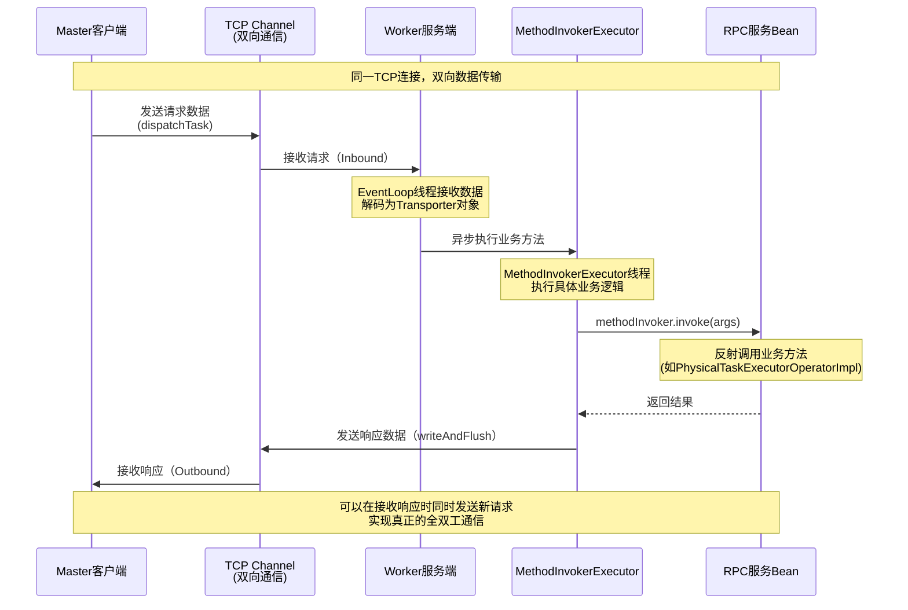

**双工通信的优势：**

1. **连接复用**：同一个TCP连接可以发送多个请求，无需为每个请求建立新连接
2. **双向数据传输**：服务端可以在处理请求的过程中主动推送数据给客户端
3. **低延迟**：避免了连接建立和断开的开销
4. **长连接支持**：支持心跳机制，保持连接活跃

### 4.4 RPC 完整调用流程

#### 4.4.1 RPC 调用时序图

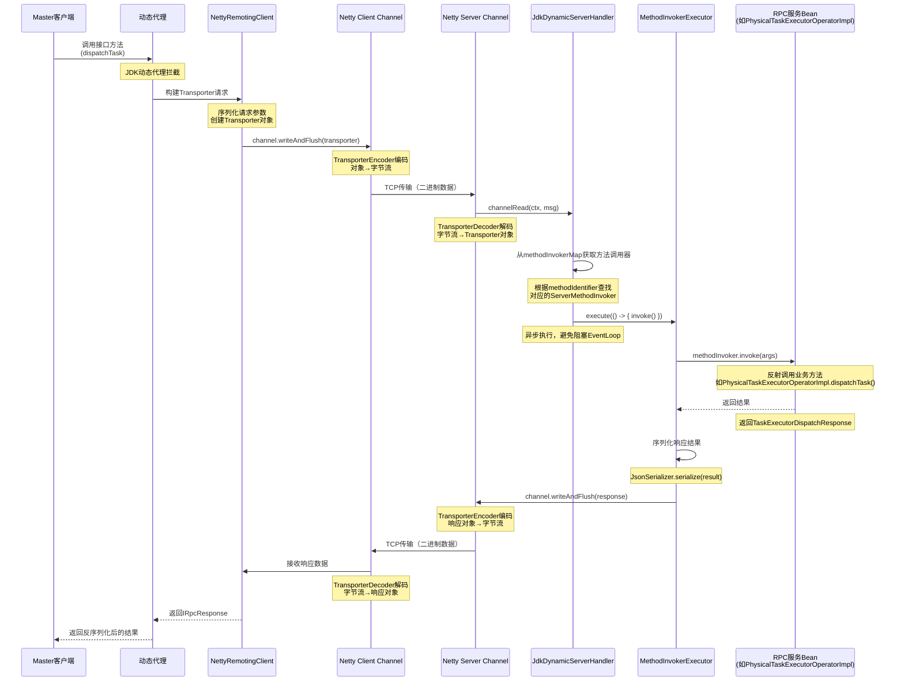

#### 4.4.2 数据编码解码流程

**编码流程（发送数据）：**

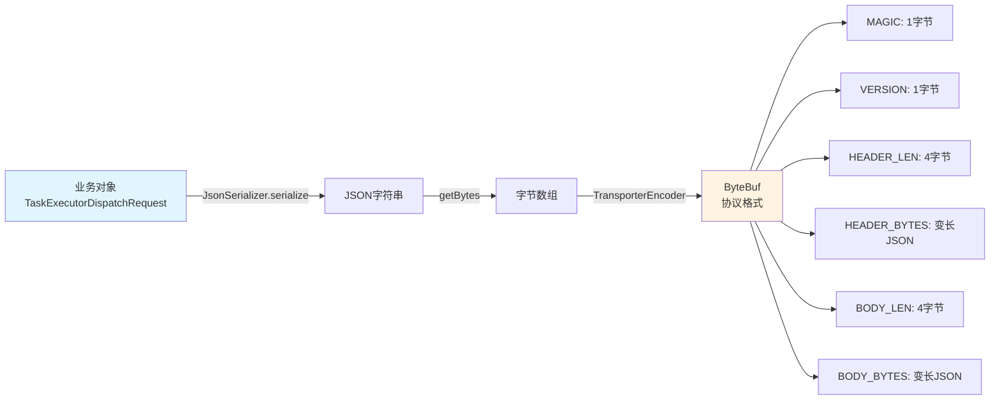

**解码流程（接收数据）：**

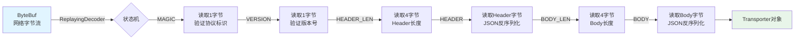

**协议格式详解：**

```
ByteBuf 协议格式：
┌──────┬─────────┬──────────────┬──────────────────┬──────────────┬──────────────────┐
│ MAGIC│ VERSION │ HEADER_LEN   │ HEADER_BYTES      │ BODY_LEN     │ BODY_BYTES       │
│(1字节)│(1字节)  │  (4字节)     │ (变长，JSON)      │  (4字节)     │ (变长，JSON)     │
└──────┴─────────┴──────────────┴──────────────────┴──────────────┴──────────────────┘

Header 内容（JSON）：
{
  "methodIdentifier": "public abstract ... dispatchTask(...)",
  "opaque": 1234567890  // 请求唯一标识
}

Body 内容（JSON）：
StandardRpcRequest {
  "args": [TaskExecutorDispatchRequest对象序列化],
  "argsTypes": ["org.apache.dolphinscheduler.task.executor.operations.TaskExecutorDispatchRequest"]
}
```

### 4.5 线程模型与异步处理

#### 4.5.1 Netty 线程模型

**Worker RPC 服务器的线程架构：**


**线程职责划分：**

1. **Boss EventLoop**：负责接收客户端连接
2. **Worker EventLoop**：负责IO读写、编解码、Pipeline处理
3. **MethodInvokerExecutor**：负责执行业务逻辑，避免阻塞EventLoop

**关键代码：**

```java
// dolphinscheduler-extract/dolphinscheduler-extract-base/src/main/java/org/apache/dolphinscheduler/extract/base/server/NettyRemotingServer.java:74-95
// 1. Worker线程数：CPU核心数 * 2
this.workGroup = new NioEventLoopGroup(serverConfig.getWorkerThread(), workerThreadFactory);

// 2. 业务线程池：CPU核心数 * 2 + 1
this.methodInvokerExecutor = ThreadUtils.newDaemonFixedThreadExecutor(
    serverName + "-methodInvoker-%d", 
    Runtime.getRuntime().availableProcessors() * 2 + 1
);

// dolphinscheduler-extract/dolphinscheduler-extract-base/src/main/java/org/apache/dolphinscheduler/extract/base/server/JdkDynamicServerHandler.java:100-129
methodInvokeExecutor.execute(() -> {
    // 业务逻辑在独立线程池执行，不阻塞EventLoop
    Object result = methodInvoker.invoke(args);
    channel.writeAndFlush(response);
});
```

#### 4.5.2 异步处理的优势

**同步 vs 异步处理对比：**

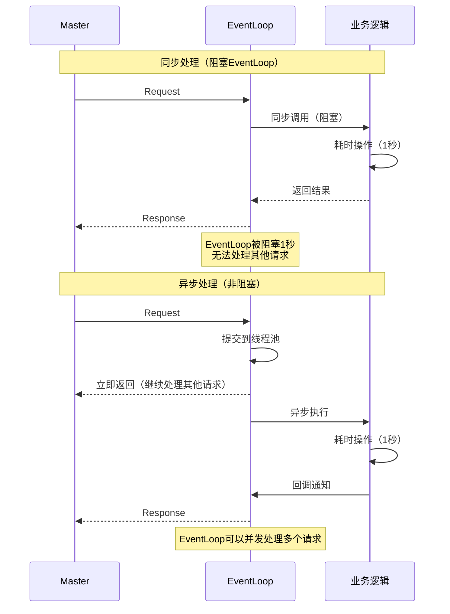

## 五、核心组件架构图

### 5.1 Worker RPC 服务器架构

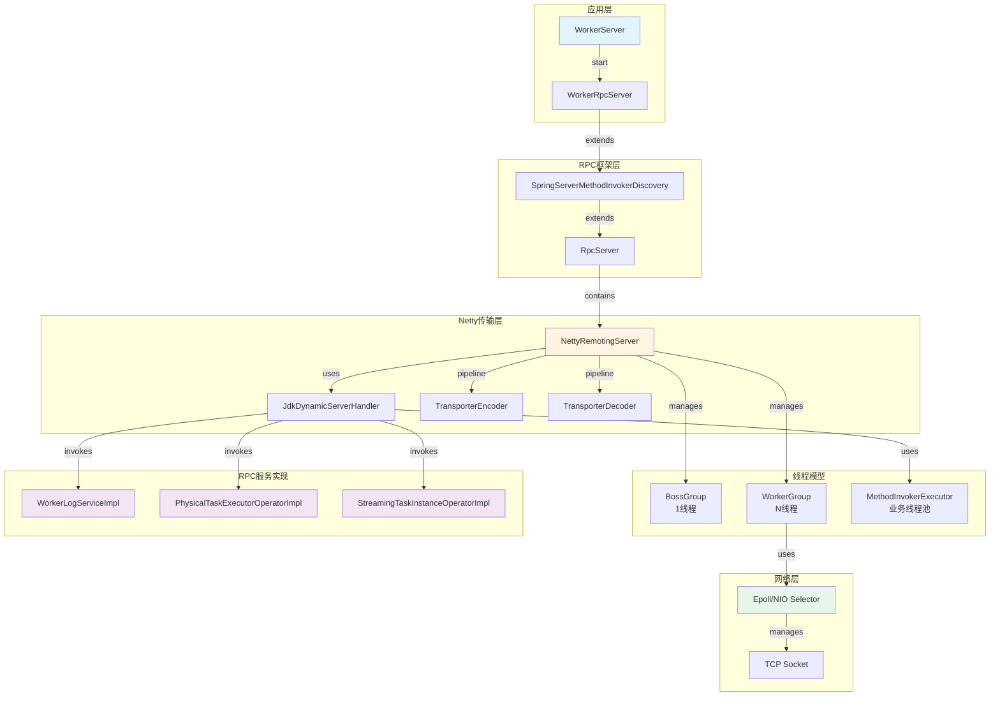

### 5.2 数据流转架构

```mermaid
graph LR
    subgraph "Master客户端"
        CP[Client Proxy]
        NRC[NettyRemotingClient]
        NCC[Netty Client Channel]
    end
    
    subgraph "网络传输"
        TCP[TCP/IP 协议栈]
    end
    
    subgraph "Worker服务端"
        NSC[Netty Server Channel]
        JDSH[JdkDynamicServerHandler]
        SI[ServerMethodInvoker]
        SB[Service Bean]
    end
    
    CP -->|1. 调用方法| NRC
    NRC -->|2. 序列化| NCC
    NCC -->|3. TCP传输| TCP
    TCP -->|4. TCP接收| NSC
    NSC -->|5. 解码| JDSH
    JDSH -->|6. 路由| SI
    SI -->|7. 反射调用| SB
    
    SB -->|8. 返回结果| SI
    SI -->|9. 序列化| JDSH
    JDSH -->|10. 编码| NSC
    NSC -->|11. TCP传输| TCP
    TCP -->|12. TCP接收| NCC
    NCC -->|13. 解码| NRC
    NRC -->|14. 返回结果| CP
    
    style CP fill:#e1f5ff
    style NSC fill:#fff4e1
    style SB fill:#e8f5e9
```

### 5.3 RPC 调用完整流程图

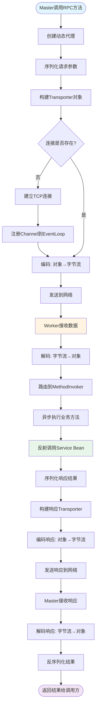

## 六、Worker RPC 服务详细说明

### 6.1 ILogService - 日志服务

**接口定义：** [`ILogService`](dolphinscheduler-extract/dolphinscheduler-extract-common/src/main/java/org/apache/dolphinscheduler/extract/common/ILogService.java)

**实现类：** [`WorkerLogServiceImpl`](dolphinscheduler-worker/src/main/java/org/apache/dolphinscheduler/server/worker/rpc/WorkerLogServiceImpl.java)

**方法详情：**

1. **getTaskInstanceWholeLogFileBytes()** - 获取任务实例完整日志文件字节
   ```java
   // dolphinscheduler-worker/src/main/java/org/apache/dolphinscheduler/server/worker/rpc/WorkerLogServiceImpl.java:38-44
   @Override
   public TaskInstanceLogFileDownloadResponse getTaskInstanceWholeLogFileBytes(
           TaskInstanceLogFileDownloadRequest taskInstanceLogFileDownloadRequest) {
       byte[] bytes = LogUtils.getFileContentBytes(
               taskInstanceLogFileDownloadRequest.getTaskInstanceLogAbsolutePath());
       return new TaskInstanceLogFileDownloadResponse(bytes);
   }
   ```

2. **pageQueryTaskInstanceLog()** - 分页查询任务实例日志
   ```java
   // dolphinscheduler-worker/src/main/java/org/apache/dolphinscheduler/server/worker/rpc/WorkerLogServiceImpl.java:46-55
   @Override
   public TaskInstanceLogPageQueryResponse pageQueryTaskInstanceLog(
           TaskInstanceLogPageQueryRequest taskInstanceLogPageQueryRequest) {
       List<String> lines = LogUtils.readPartFileContent(
               taskInstanceLogPageQueryRequest.getTaskInstanceLogAbsolutePath(),
               taskInstanceLogPageQueryRequest.getSkipLineNum(),
               taskInstanceLogPageQueryRequest.getLimit());
       String logContent = LogUtils.rollViewLogLines(lines);
       return new TaskInstanceLogPageQueryResponse(logContent);
   }
   ```

3. **removeTaskInstanceLog()** - 删除任务实例日志
   ```java
   // dolphinscheduler-worker/src/main/java/org/apache/dolphinscheduler/server/worker/rpc/WorkerLogServiceImpl.java:57-60
   @Override
   public void removeTaskInstanceLog(String taskInstanceLogAbsolutePath) {
       FileUtils.deleteFile(taskInstanceLogAbsolutePath);
   }
   ```

### 6.2 IPhysicalTaskExecutorOperator - 物理任务执行器操作

**接口定义：** [`IPhysicalTaskExecutorOperator`](dolphinscheduler-extract/dolphinscheduler-extract-worker/src/main/java/org/apache/dolphinscheduler/extract/worker/IPhysicalTaskExecutorOperator.java)

**实现类：** [`PhysicalTaskExecutorOperatorImpl`](dolphinscheduler-worker/src/main/java/org/apache/dolphinscheduler/server/worker/rpc/PhysicalTaskExecutorOperatorImpl.java)

**方法详情：**

1. **dispatchTask()** - 分发任务到 Worker 执行
   ```java
   // dolphinscheduler-worker/src/main/java/org/apache/dolphinscheduler/server/worker/rpc/PhysicalTaskExecutorOperatorImpl.java:47-59
   @Override
   public TaskExecutorDispatchResponse dispatchTask(final TaskExecutorDispatchRequest taskExecutorDispatchRequest) {
       log.info("Receive TaskExecutorDispatchResponse: {}", taskExecutorDispatchRequest);
       final TaskExecutionContext taskExecutionContext = taskExecutorDispatchRequest.getTaskExecutionContext();
       try {
           physicalTaskEngineDelegator.dispatchLogicTask(taskExecutionContext);
           log.info("Handle TaskExecutorDispatchResponse: {} success", taskExecutorDispatchRequest);
           return TaskExecutorDispatchResponse.success();
       } catch (Throwable throwable) {
           log.error("Handle TaskExecutorDispatchResponse: {} failed", taskExecutorDispatchRequest, throwable);
           return TaskExecutorDispatchResponse.failed(ExceptionUtils.getMessage(throwable));
       }
   }
   ```

2. **killTask()** - 杀死正在执行的任务
   ```java
   // dolphinscheduler-worker/src/main/java/org/apache/dolphinscheduler/server/worker/rpc/PhysicalTaskExecutorOperatorImpl.java:61-73
   @Override
   public TaskExecutorKillResponse killTask(final TaskExecutorKillRequest taskExecutorKillRequest) {
       log.info("Receive TaskExecutorKillRequest: {}", taskExecutorKillRequest);
       final int taskInstanceId = taskExecutorKillRequest.getTaskInstanceId();
       try {
           physicalTaskEngineDelegator.killLogicTask(taskInstanceId);
           log.info("Handle TaskExecutorKillRequest: {} success", taskExecutorKillRequest);
           return TaskExecutorKillResponse.success();
       } catch (Throwable throwable) {
           log.error("Handle TaskExecutorKillRequest: {} failed", taskExecutorKillRequest, throwable);
           return TaskExecutorKillResponse.fail(ExceptionUtils.getMessage(throwable));
       }
   }
   ```

3. **pauseTask()** - 暂停正在执行的任务
   ```java
   // dolphinscheduler-worker/src/main/java/org/apache/dolphinscheduler/server/worker/rpc/PhysicalTaskExecutorOperatorImpl.java:75-87
   @Override
   public TaskExecutorPauseResponse pauseTask(final TaskExecutorPauseRequest taskPauseRequest) {
       log.info("Receive TaskExecutorPauseRequest: {}", taskPauseRequest);
       final int taskInstanceId = taskPauseRequest.getTaskInstanceId();
       try {
           physicalTaskEngineDelegator.pauseLogicTask(taskInstanceId);
           log.info("Handle TaskExecutorPauseRequest: {} success", taskPauseRequest);
           return TaskExecutorPauseResponse.success();
       } catch (Throwable throwable) {
           log.error("Handle TaskExecutorPauseRequest: {} failed", taskPauseRequest, throwable);
           return TaskExecutorPauseResponse.fail(ExceptionUtils.getMessage(throwable));
       }
   }
   ```

4. **reassignWorkflowInstanceHost()** - 重新分配工作流实例的主机
   ```java
   // dolphinscheduler-worker/src/main/java/org/apache/dolphinscheduler/server/worker/rpc/PhysicalTaskExecutorOperatorImpl.java:89-97
   @Override
   public TaskExecutorReassignMasterResponse reassignWorkflowInstanceHost(
           final TaskExecutorReassignMasterRequest taskExecutorReassignMasterRequest) {
       boolean success = physicalTaskEngineDelegator.reassignWorkflowInstanceHost(
               taskExecutorReassignMasterRequest);
       if (success) {
           return TaskExecutorReassignMasterResponse.success();
       }
       return TaskExecutorReassignMasterResponse.failed("Reassign master host failed");
   }
   ```

5. **ackPhysicalTaskExecutorLifecycleEvent()** - 确认物理任务执行器生命周期事件
   ```java
   // dolphinscheduler-worker/src/main/java/org/apache/dolphinscheduler/server/worker/rpc/PhysicalTaskExecutorOperatorImpl.java:99-104
   @Override
   public void ackPhysicalTaskExecutorLifecycleEvent(
           final ITaskExecutorLifecycleEventReporter.TaskExecutorLifecycleEventAck taskExecutorLifecycleEventAck) {
       log.info("Receive TaskExecutorLifecycleEventAck: {}", taskExecutorLifecycleEventAck);
       physicalTaskEngineDelegator.ackPhysicalTaskExecutorLifecycleEventACK(taskExecutorLifecycleEventAck);
   }
   ```

### 6.3 IStreamingTaskInstanceOperator - 流式任务实例操作

**接口定义：** [`IStreamingTaskInstanceOperator`](dolphinscheduler-extract/dolphinscheduler-extract-worker/src/main/java/org/apache/dolphinscheduler/extract/worker/IStreamingTaskInstanceOperator.java)

**实现类：** [`StreamingTaskInstanceOperatorImpl`](dolphinscheduler-worker/src/main/java/org/apache/dolphinscheduler/server/worker/rpc/StreamingTaskInstanceOperatorImpl.java)

**方法详情：**

1. **triggerSavepoint()** - 触发流式任务的保存点
   ```java
   // dolphinscheduler-worker/src/main/java/org/apache/dolphinscheduler/server/worker/rpc/StreamingTaskInstanceOperatorImpl.java:44-76
   @Override
   public TaskInstanceTriggerSavepointResponse triggerSavepoint(
           TaskInstanceTriggerSavepointRequest taskInstanceTriggerSavepointRequest) {
       log.info("Receive triggerSavepoint request: {}", taskInstanceTriggerSavepointRequest);
       
       try {
           int taskInstanceId = taskInstanceTriggerSavepointRequest.getTaskInstanceId();
           LogUtils.setTaskInstanceIdMDC(taskInstanceId);
           final Optional<ITaskExecutor> taskExecutorOptional = 
                   physicalTaskExecutorRepository.get(taskInstanceId);
           
           if (!taskExecutorOptional.isPresent()) {
               log.error("Cannot find WorkerTaskExecutor for taskInstance: {}", taskInstanceId);
               return TaskInstanceTriggerSavepointResponse.fail("Cannot find TaskExecutionContext");
           }
           
           final PhysicalTaskExecutor taskExecutor = (PhysicalTaskExecutor) taskExecutorOptional.get();
           AbstractTask task = taskExecutor.getPhysicalTask();
           
           if (task == null || !(task instanceof StreamTask)) {
               return TaskInstanceTriggerSavepointResponse.fail("The taskInstance is not StreamTask");
           }
           
           try {
               ((StreamTask) task).savePoint();
               return TaskInstanceTriggerSavepointResponse.success();
           } catch (Exception e) {
               log.error("StreamTask: {} call savePoint error", taskInstanceId, e);
               return TaskInstanceTriggerSavepointResponse.fail("StreamTask call savePoint error: " + e.getMessage());
           }
       } finally {
           LogUtils.removeTaskInstanceIdMDC();
       }
   }
   ```

## 七、关键代码位置

### 7.1 RPC 服务启动相关代码

```
dolphinscheduler-worker/src/main/java/org/apache/dolphinscheduler/server/worker/
├── WorkerServer.java                          # 入口：workerRpcServer.start()
└── rpc/
    ├── WorkerRpcServer.java                   # Worker RPC 服务器
    ├── WorkerLogServiceImpl.java               # 日志服务实现
    ├── PhysicalTaskExecutorOperatorImpl.java   # 物理任务执行器操作实现
    └── StreamingTaskInstanceOperatorImpl.java  # 流式任务实例操作实现

dolphinscheduler-extract/dolphinscheduler-extract-base/src/main/java/org/apache/dolphinscheduler/extract/base/
├── server/
│   ├── SpringServerMethodInvokerDiscovery.java  # Spring Bean 自动发现
│   ├── RpcServer.java                           # RPC 服务器基类
│   ├── NettyRemotingServer.java                 # Netty 服务器实现
│   ├── JdkDynamicServerHandler.java             # 请求处理器
│   ├── ServerMethodInvokerImpl.java             # 方法调用器实现
│   ├── TransporterEncoder.java                  # 编码器
│   └── TransporterDecoder.java                  # 解码器
└── config/
    └── NettyServerConfig.java                   # Netty 服务器配置
```

### 7.2 RPC 服务接口定义

```
dolphinscheduler-extract/dolphinscheduler-extract-common/src/main/java/org/apache/dolphinscheduler/extract/common/
└── ILogService.java                            # 日志服务接口

dolphinscheduler-extract/dolphinscheduler-extract-worker/src/main/java/org/apache/dolphinscheduler/extract/worker/
├── IPhysicalTaskExecutorOperator.java           # 物理任务执行器操作接口
└── IStreamingTaskInstanceOperator.java          # 流式任务实例操作接口
```

## 八、总结

### 8.1 Worker RPC 服务启动流程总结

**完整流程：**

1. **初始化阶段**
   - `WorkerRpcServer` 继承 `SpringServerMethodInvokerDiscovery`
   - 通过构造函数传入 `NettyServerConfig`，配置服务器名称和监听端口（默认 1234）
   - 创建 `NettyRemotingServer` 实例

2. **服务注册阶段**
   - `start()` 方法触发服务注册
   - `scanAndRegisterExistingRpcServices()` 扫描已初始化的 RPC 服务 Bean
   - `BeanPostProcessor` 机制动态注册后续初始化的 Bean
   - 方法调用器注册到 `methodInvokerMap`

3. **Netty 启动阶段**
   - 创建 `BossGroup` 和 `WorkerGroup` 线程组
   - 配置 Channel Pipeline（编码器、解码器、Handler）
   - 绑定监听端口，启动服务器

4. **请求处理阶段**
   - Master 客户端连接，创建 Channel
   - 接收请求，解码为 `Transporter` 对象
   - 路由到对应的 `ServerMethodInvoker`
   - 异步执行业务方法
   - 编码响应，通过同一 Channel 返回

### 8.2 Worker 提供的 RPC 服务总结

| 服务接口 | 实现类 | 主要功能 | 调用方 |
|---------|--------|---------|--------|
| ILogService | WorkerLogServiceImpl | 日志查询、下载、删除 | Master、API Server |
| IPhysicalTaskExecutorOperator | PhysicalTaskExecutorOperatorImpl | 任务分发、控制（暂停、杀死） | Master |
| IStreamingTaskInstanceOperator | StreamingTaskInstanceOperatorImpl | 流式任务保存点操作 | Master |

### 8.3 Netty 核心技术要点

**1. 多路复用（I/O Multiplexing）**
- ✅ 一个 EventLoop 管理多个 Channel
- ✅ 使用 Selector（NIO）或 Epoll（Linux）实现事件驱动
- ✅ 资源利用率高，支持大量并发连接

**2. 双工通信（Full-Duplex）**
- ✅ TCP 全双工特性：同一连接双向数据传输
- ✅ Pipeline 双向处理：Inbound 和 Outbound 分离
- ✅ 请求-响应在同一 Channel 中完成

**3. 异步非阻塞**
- ✅ EventLoop 线程负责 I/O 操作
- ✅ 业务逻辑在独立线程池执行
- ✅ 避免阻塞，提高并发性能

**4. 线程模型**
- ✅ BossGroup：1 个线程，负责接收连接
- ✅ WorkerGroup：N 个线程（CPU核心数 * 2），负责 I/O 处理
- ✅ MethodInvokerExecutor：业务线程池（CPU核心数 * 2 + 1），执行具体逻辑

### 8.4 学习要点

1. **理解 Worker RPC 服务的职责**
   - Worker 作为服务端，接收 Master 的 RPC 调用
   - 提供任务执行、日志查询、任务控制等服务

2. **理解 Netty 的多路复用机制**
   - EventLoop 和 Selector 的关系
   - 一个线程如何管理多个 Channel

3. **理解双工通信的本质**
   - TCP 全双工特性
   - Pipeline 的双向处理
   - 请求-响应的关联机制

4. **理解异步非阻塞模型**
   - EventLoop 线程的职责
   - 业务线程池的作用
   - 为什么不能阻塞 EventLoop

通过深入分析 DolphinScheduler Worker 的 RPC 服务启动流程，我们可以更好地理解基于 Netty 的高性能 RPC 框架在 Worker 端的实现原理，以及 Worker 如何为 Master 提供任务执行、日志查询等服务。
    