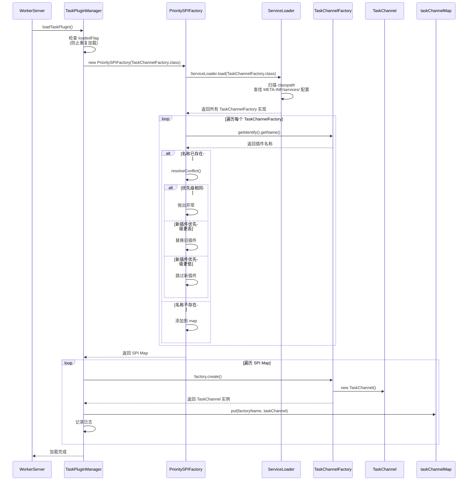
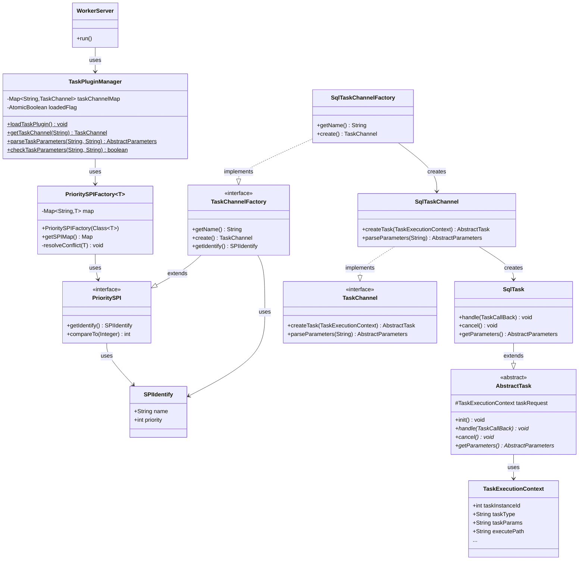
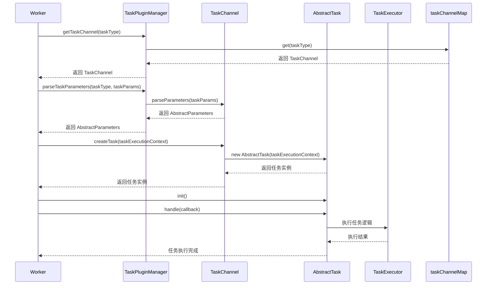

# Worker 任务插件加载详细分析

## 1. 概述

DolphinScheduler Worker 服务在启动时需要加载所有可用的任务插件，以便能够执行各种类型的任务。任务插件系统采用微内核 + 插件化的架构设计，基于 Java SPI（Service Provider Interface）机制实现动态加载和扩展。

本文档详细分析 Worker 服务中任务插件的加载流程、设计架构、SPI 机制以及相关核心组件。

## 2. 任务插件加载入口

### 2.1 WorkerServer 启动流程

Worker 服务的启动入口位于 `WorkerServer.run()` 方法中，该方法使用 `@PostConstruct` 注解，在 Spring 容器初始化完成后自动执行：

```java:dolphinscheduler-worker/src/main/java/org/apache/dolphinscheduler/server/worker/WorkerServer.java
@PostConstruct
public void run() {
    ServerLifeCycleManager.toRunning();

    this.workerRpcServer.start();

    TaskPluginManager.loadTaskPlugin();

    DataSourceProcessorProvider.initialize();

    this.workerRegistryClient.setRegistryStoppable(this);
    this.workerRegistryClient.start();

    this.physicalTaskEngineDelegator.start();
    
    // ... 指标注册代码 ...
}
```

**关键代码位置**：[dolphinscheduler-worker/src/main/java/org/apache/dolphinscheduler/server/worker/WorkerServer.java:83](dolphinscheduler-worker/src/main/java/org/apache/dolphinscheduler/server/worker/WorkerServer.java)

**调用时机**：
- Worker RPC 服务启动之后
- 数据源处理器初始化之前
- 服务注册到注册中心之前

**调用顺序**：
1. 设置服务器生命周期为运行状态
2. 启动 Worker RPC 服务
3. **加载任务插件** ← 本文重点分析
4. 初始化数据源处理器
5. 启动服务注册客户端
6. 启动物理任务引擎委托器

### 2.2 为什么需要加载任务插件？

Worker 服务需要加载任务插件的原因：

1. **任务执行能力**：Worker 必须能够识别和执行各种类型的任务（SQL、Shell、Python、Java、K8s 等）
2. **动态扩展**：通过插件机制，可以在不修改核心代码的情况下添加新的任务类型
3. **解耦设计**：任务执行逻辑与 Worker 核心逻辑解耦，便于维护和扩展
4. **统一接口**：所有任务插件都实现统一的接口，便于管理和调用

## 3. TaskPluginManager 核心实现

### 3.1 类结构

`TaskPluginManager` 是一个单例工具类，负责管理所有任务插件：

```java:dolphinscheduler-task-plugin/dolphinscheduler-task-api/src/main/java/org/apache/dolphinscheduler/plugin/task/api/TaskPluginManager.java
@Slf4j
public class TaskPluginManager {

    private static final Map<String, TaskChannel> taskChannelMap = new HashMap<>();

    private static final AtomicBoolean loadedFlag = new AtomicBoolean(false);

    static {
        loadTaskPlugin();
    }

    public static void loadTaskPlugin() {
        // ... 加载逻辑
    }

    public static TaskChannel getTaskChannel(String type) {
        // ... 获取逻辑
    }

    public static boolean checkTaskParameters(String taskType, String taskParams) {
        // ... 校验逻辑
    }

    public static AbstractParameters parseTaskParameters(String taskType, String taskParams) {
        // ... 解析逻辑
    }
}
```

**关键代码位置**：[dolphinscheduler-task-plugin/dolphinscheduler-task-api/src/main/java/org/apache/dolphinscheduler/plugin/task/api/TaskPluginManager.java](dolphinscheduler-task-plugin/dolphinscheduler-task-api/src/main/java/org/apache/dolphinscheduler/plugin/task/api/TaskPluginManager.java)

**核心成员变量**：
- `taskChannelMap`：存储已加载的任务通道，key 为任务类型名称（如 "SQL"、"SHELL"），value 为对应的 `TaskChannel` 实例
- `loadedFlag`：使用 `AtomicBoolean` 确保插件只加载一次，防止重复加载

**注意**：类中有一个静态代码块，在类首次加载时会自动调用 `loadTaskPlugin()`。但在 WorkerServer 中显式调用是为了确保在正确的时机加载，并可以记录日志。

### 3.2 loadTaskPlugin() 方法详解

```java:dolphinscheduler-task-plugin/dolphinscheduler-task-api/src/main/java/org/apache/dolphinscheduler/plugin/task/api/TaskPluginManager.java
public static void loadTaskPlugin() {
    if (!loadedFlag.compareAndSet(false, true)) {
        log.warn("The task plugin has already been loaded");
        return;
    }
    PrioritySPIFactory<TaskChannelFactory> prioritySPIFactory = new PrioritySPIFactory<>(TaskChannelFactory.class);
    for (Map.Entry<String, TaskChannelFactory> entry : prioritySPIFactory.getSPIMap().entrySet()) {
        String factoryName = entry.getKey();
        TaskChannelFactory factory = entry.getValue();

        taskChannelMap.put(factoryName, factory.create());
        log.info("Success register task plugin: {}", factoryName);
    }
}
```

**关键代码位置**：[dolphinscheduler-task-plugin/dolphinscheduler-task-api/src/main/java/org/apache/dolphinscheduler/plugin/task/api/TaskPluginManager.java:42-56](dolphinscheduler-task-plugin/dolphinscheduler-task-api/src/main/java/org/apache/dolphinscheduler/plugin/task/api/TaskPluginManager.java)

**执行流程**：

1. **线程安全检查**：
    - 使用 `AtomicBoolean.compareAndSet(false, true)` 原子操作
    - 如果已经加载过，直接返回并记录警告日志
    - 确保在多线程环境下只加载一次

2. **创建 SPI 工厂**：
    - 创建 `PrioritySPIFactory<TaskChannelFactory>` 实例
    - 传入 `TaskChannelFactory.class` 作为 SPI 接口类型
    - 工厂会自动扫描并加载所有实现了 `TaskChannelFactory` 接口的类

3. **遍历并注册插件**：
    - 遍历 `prioritySPIFactory.getSPIMap()` 返回的所有工厂
    - 对每个工厂：
        - 获取工厂名称（插件名称）
        - 调用 `factory.create()` 创建 `TaskChannel` 实例
        - 将 `TaskChannel` 存入 `taskChannelMap` 缓存
        - 记录成功注册的日志

### 3.3 其他核心方法

#### 3.3.1 getTaskChannel() - 获取任务通道

```java:dolphinscheduler-task-plugin/dolphinscheduler-task-api/src/main/java/org/apache/dolphinscheduler/plugin/task/api/TaskPluginManager.java
public static TaskChannel getTaskChannel(String type) {
    checkNotNull(type, "type cannot be null");
    TaskChannel taskChannel = taskChannelMap.get(type);
    if (taskChannel == null) {
        throw new IllegalArgumentException("Cannot find TaskChannel for : " + type);
    }
    return taskChannel;
}
```

**用途**：根据任务类型名称获取对应的 `TaskChannel` 实例

**使用场景**：在 Worker 执行任务时，需要根据任务类型获取对应的通道来创建任务实例

#### 3.3.2 parseTaskParameters() - 解析任务参数

```java:dolphinscheduler-task-plugin/dolphinscheduler-task-api/src/main/java/org/apache/dolphinscheduler/plugin/task/api/TaskPluginManager.java
public static AbstractParameters parseTaskParameters(String taskType, String taskParams) {
    checkNotNull(taskType, "taskType cannot be null");
    TaskChannel taskChannel = getTaskChannel(taskType);
    AbstractParameters abstractParameters = taskChannel.parseParameters(taskParams);
    if (abstractParameters == null) {
        throw new IllegalArgumentException("Cannot parse task parameters: " + taskParams + " for : " + taskType);
    }
    return abstractParameters;
}
```

**用途**：将 JSON 字符串格式的任务参数解析为对应的参数对象

**工作流程**：
1. 根据任务类型获取 `TaskChannel`
2. 调用 `TaskChannel.parseParameters()` 解析参数
3. 返回解析后的 `AbstractParameters` 对象

#### 3.3.3 checkTaskParameters() - 校验任务参数

```java:dolphinscheduler-task-plugin/dolphinscheduler-task-api/src/main/java/org/apache/dolphinscheduler/plugin/task/api/TaskPluginManager.java
public static boolean checkTaskParameters(String taskType, String taskParams) {
    AbstractParameters abstractParameters = parseTaskParameters(taskType, taskParams);
    return abstractParameters.checkParameters();
}
```

**用途**：校验任务参数是否合法

**工作流程**：
1. 先解析参数
2. 调用参数对象的 `checkParameters()` 方法进行校验

## 4. SPI 机制详解

### 4.1 Java SPI 机制

DolphinScheduler 使用 Java SPI（Service Provider Interface）机制来实现插件动态加载。SPI 是 Java 提供的一种服务发现机制，可以在运行时动态加载实现类。

**SPI 工作原理**：
1. 定义服务接口（如 `TaskChannelFactory`）
2. 提供方实现接口并配置在 `META-INF/services/` 目录下
3. 使用方通过 `ServiceLoader` 加载所有实现

### 4.2 PrioritySPIFactory 实现

DolphinScheduler 在标准 SPI 基础上，增加了优先级和冲突解决机制，封装为 `PrioritySPIFactory`：

```java:dolphinscheduler-spi/src/main/java/org/apache/dolphinscheduler/spi/plugin/PrioritySPIFactory.java
@Slf4j
public class PrioritySPIFactory<T extends PrioritySPI> {

    private final Map<String, T> map = new HashMap<>();

    public PrioritySPIFactory(Class<T> spiClass) {
        for (T t : ServiceLoader.load(spiClass)) {
            if (map.containsKey(t.getIdentify().getName())) {
                resolveConflict(t);
            } else {
                map.put(t.getIdentify().getName(), t);
            }
        }
    }

    public Map<String, T> getSPIMap() {
        return Collections.unmodifiableMap(map);
    }

    private void resolveConflict(T newSPI) {
        SPIIdentify identify = newSPI.getIdentify();
        T oldSPI = map.get(identify.getName());

        if (newSPI.compareTo(oldSPI.getIdentify().getPriority()) == 0) {
            throw new IllegalArgumentException(
                    String.format("These two spi plugins has conflict identify name with the same priority: %s, %s",
                            oldSPI.getIdentify(), newSPI.getIdentify()));
        } else if (newSPI.compareTo(oldSPI.getIdentify().getPriority()) > 0) {
            log.info("The {} plugin has high priority, will override {}", newSPI.getIdentify(), oldSPI);
            map.put(identify.getName(), newSPI);
        } else {
            log.info("The low plugin {} will be skipped", newSPI);
        }
    }
}
```

**关键代码位置**：[dolphinscheduler-spi/src/main/java/org/apache/dolphinscheduler/spi/plugin/PrioritySPIFactory.java](dolphinscheduler-spi/src/main/java/org/apache/dolphinscheduler/spi/plugin/PrioritySPIFactory.java)

**核心特性**：

1. **自动发现**：
    - 使用 `ServiceLoader.load(spiClass)` 自动加载所有 SPI 实现
    - 扫描 classpath 中所有 `META-INF/services/` 目录下的配置文件

2. **优先级机制**：
    - 每个 SPI 实现通过 `getIdentify()` 返回 `SPIIdentify`，包含名称和优先级
    - 如果存在同名插件，比较优先级，保留优先级高的

3. **冲突解决**：
    - 同名且同优先级：抛出 `IllegalArgumentException`
    - 同名但不同优先级：保留优先级高的，跳过优先级低的

4. **不可变返回**：
    - `getSPIMap()` 返回不可修改的 Map，防止外部修改内部状态

### 4.3 PrioritySPI 接口

```java:dolphinscheduler-spi/src/main/java/org/apache/dolphinscheduler/spi/plugin/PrioritySPI.java
public interface PrioritySPI extends Comparable<Integer> {

    /**
     * The SPI identify, if the two plugin has the same name, will load the high priority.
     * If the priority and name is all same, will throw <code>IllegalArgumentException</code>
     * @return
     */
    SPIIdentify getIdentify();

    @Override
    default int compareTo(Integer o) {
        return Integer.compare(getIdentify().getPriority(), o);
    }
}
```

**关键代码位置**：[dolphinscheduler-spi/src/main/java/org/apache/dolphinscheduler/spi/plugin/PrioritySPI.java](dolphinscheduler-spi/src/main/java/org/apache/dolphinscheduler/spi/plugin/PrioritySPI.java)

### 4.4 SPIIdentify 类

```java:dolphinscheduler-spi/src/main/java/org/apache/dolphinscheduler/spi/plugin/SPIIdentify.java
@Data
@Builder
@AllArgsConstructor
public class SPIIdentify {

    private static final int DEFAULT_PRIORITY = 0;

    private String name;

    @Builder.Default
    private int priority = DEFAULT_PRIORITY;
}
```

**关键代码位置**：[dolphinscheduler-spi/src/main/java/org/apache/dolphinscheduler/spi/plugin/SPIIdentify.java](dolphinscheduler-spi/src/main/java/org/apache/dolphinscheduler/spi/plugin/SPIIdentify.java)

**属性说明**：
- `name`：插件名称，必须唯一（除非优先级不同）
- `priority`：优先级，数值越大优先级越高，默认为 0

## 5. TaskChannelFactory 接口

### 5.1 接口定义

`TaskChannelFactory` 是任务插件工厂接口，所有任务插件都需要实现此接口：

```java:dolphinscheduler-task-plugin/dolphinscheduler-task-api/src/main/java/org/apache/dolphinscheduler/plugin/task/api/TaskChannelFactory.java
public interface TaskChannelFactory extends PrioritySPI {

    default SPIIdentify getIdentify() {
        return SPIIdentify.builder()
                .name(getName())
                .build();
    }

    String getName();

    TaskChannel create();
}
```

**关键代码位置**：[dolphinscheduler-task-plugin/dolphinscheduler-task-api/src/main/java/org/apache/dolphinscheduler/plugin/task/api/TaskChannelFactory.java](dolphinscheduler-task-plugin/dolphinscheduler-task-api/src/main/java/org/apache/dolphinscheduler/plugin/task/api/TaskChannelFactory.java)

**接口职责**：
- 继承 `PrioritySPI`，支持优先级机制
- 提供默认的 `getIdentify()` 实现，使用 `getName()` 作为标识名称
- `getName()`：返回任务类型名称（如 "SQL"、"SHELL"、"PYTHON"）
- `create()`：创建并返回对应的 `TaskChannel` 实例

### 5.2 实现示例：SqlTaskChannelFactory

以 SQL 任务插件为例，展示如何实现 `TaskChannelFactory`：

```java:dolphinscheduler-task-plugin/dolphinscheduler-task-sql/src/main/java/org/apache/dolphinscheduler/plugin/task/sql/SqlTaskChannelFactory.java
@AutoService(TaskChannelFactory.class)
public class SqlTaskChannelFactory implements TaskChannelFactory {

    public static final String NAME = "SQL";

    @Override
    public String getName() {
        return NAME;
    }

    @Override
    public TaskChannel create() {
        return new SqlTaskChannel();
    }
}
```

**关键代码位置**：[dolphinscheduler-task-plugin/dolphinscheduler-task-sql/src/main/java/org/apache/dolphinscheduler/plugin/task/sql/SqlTaskChannelFactory.java](dolphinscheduler-task-plugin/dolphinscheduler-task-sql/src/main/java/org/apache/dolphinscheduler/plugin/task/sql/SqlTaskChannelFactory.java)

**关键点**：
1. **@AutoService 注解**：使用 Google Auto Service 自动生成 SPI 配置文件
    - 编译时会在 `META-INF/services/org.apache.dolphinscheduler.plugin.task.api.TaskChannelFactory` 文件中注册该类
2. **任务类型名称**：返回 "SQL"，这个名称会作为 key 存储在 `taskChannelMap` 中
3. **创建通道**：每次调用 `create()` 都创建新的 `SqlTaskChannel` 实例

## 6. TaskChannel 接口

### 6.1 接口定义

`TaskChannel` 是任务通道接口，负责创建任务实例和解析任务参数：

```java:dolphinscheduler-task-plugin/dolphinscheduler-task-api/src/main/java/org/apache/dolphinscheduler/plugin/task/api/TaskChannel.java
public interface TaskChannel {

    AbstractTask createTask(TaskExecutionContext taskRequest);

    AbstractParameters parseParameters(String taskParams);
}
```

**关键代码位置**：[dolphinscheduler-task-plugin/dolphinscheduler-task-api/src/main/java/org/apache/dolphinscheduler/plugin/task/api/TaskChannel.java](dolphinscheduler-task-plugin/dolphinscheduler-task-api/src/main/java/org/apache/dolphinscheduler/plugin/task/api/TaskChannel.java)

**接口职责**：
- `createTask()`：根据任务执行上下文创建具体的任务实例
- `parseParameters()`：将 JSON 格式的任务参数字符串解析为参数对象

### 6.2 实现示例：SqlTaskChannel

```java:dolphinscheduler-task-plugin/dolphinscheduler-task-sql/src/main/java/org/apache/dolphinscheduler/plugin/task/sql/SqlTaskChannel.java
public class SqlTaskChannel implements TaskChannel {

    @Override
    public AbstractTask createTask(TaskExecutionContext taskRequest) {
        return new SqlTask(taskRequest);
    }

    @Override
    public AbstractParameters parseParameters(String taskParams) {
        return JSONUtils.parseObject(taskParams, SqlParameters.class);
    }
}
```

**关键代码位置**：[dolphinscheduler-task-plugin/dolphinscheduler-task-sql/src/main/java/org/apache/dolphinscheduler/plugin/task/sql/SqlTaskChannel.java](dolphinscheduler-task-plugin/dolphinscheduler-task-sql/src/main/java/org/apache/dolphinscheduler/plugin/task/sql/SqlTaskChannel.java)

**工作流程**：
1. `createTask()`：创建 `SqlTask` 实例，传入任务执行上下文
2. `parseParameters()`：使用 JSON 工具将字符串解析为 `SqlParameters` 对象

### 6.3 TaskChannel 的特殊类型

#### 6.3.1 ILogicTaskChannel - 逻辑任务通道

```java:dolphinscheduler-task-plugin/dolphinscheduler-task-api/src/main/java/org/apache/dolphinscheduler/plugin/task/api/ILogicTaskChannel.java
/**
 * Used to mark a task channel as a logic task channel, the logic task channel is a special task channel that will be executed at master.
 */
public interface ILogicTaskChannel extends TaskChannel {
}
```

**用途**：标记逻辑任务通道，逻辑任务在 Master 端执行，不在 Worker 端执行

**关键代码位置**：[dolphinscheduler-task-plugin/dolphinscheduler-task-api/src/main/java/org/apache/dolphinscheduler/plugin/task/api/ILogicTaskChannel.java](dolphinscheduler-task-plugin/dolphinscheduler-task-api/src/main/java/org/apache/dolphinscheduler/plugin/task/api/ILogicTaskChannel.java)

#### 6.3.2 StreamTaskChannel - 流式任务通道

```java:dolphinscheduler-task-plugin/dolphinscheduler-task-api/src/main/java/org/apache/dolphinscheduler/plugin/task/api/stream/StreamTaskChannel.java
public interface StreamTaskChannel extends TaskChannel {
}
```

**用途**：标记流式任务通道，用于流式数据处理任务

**关键代码位置**：[dolphinscheduler-task-plugin/dolphinscheduler-task-api/src/main/java/org/apache/dolphinscheduler/plugin/task/api/stream/StreamTaskChannel.java](dolphinscheduler-task-plugin/dolphinscheduler-task-api/src/main/java/org/apache/dolphinscheduler/plugin/task/api/stream/StreamTaskChannel.java)

## 7. AbstractTask 抽象类

### 7.1 类定义

所有具体任务类都继承自 `AbstractTask`：

```java:dolphinscheduler-task-plugin/dolphinscheduler-task-api/src/main/java/org/apache/dolphinscheduler/plugin/task/api/AbstractTask.java
@Slf4j
public abstract class AbstractTask {

    protected TaskExecutionContext taskRequest;
    protected int processId;
    protected String appIds;
    protected volatile int exitStatusCode = -1;
    protected boolean needAlert = false;
    protected TaskAlertInfo taskAlertInfo;

    protected AbstractTask(TaskExecutionContext taskExecutionContext) {
        this.taskRequest = taskExecutionContext;
    }

    public void init() {
    }

    public abstract void handle(TaskCallBack taskCallBack) throws TaskException;

    public abstract void cancel() throws TaskException;

    public abstract AbstractParameters getParameters();
}
```

**关键代码位置**：[dolphinscheduler-task-plugin/dolphinscheduler-task-api/src/main/java/org/apache/dolphinscheduler/plugin/task/api/AbstractTask.java](dolphinscheduler-task-plugin/dolphinscheduler-task-api/src/main/java/org/apache/dolphinscheduler/plugin/task/api/AbstractTask.java)

**核心属性**：
- `taskRequest`：任务执行上下文，包含任务的所有运行时信息
- `processId`：进程 ID（对于 SHELL 等任务）
- `appIds`：应用 ID（对于 YARN、K8s 等任务）
- `exitStatusCode`：退出状态码
- `needAlert`：是否需要告警
- `taskAlertInfo`：告警信息

**核心方法**：
- `init()`：初始化任务，可以被子类覆盖
- `handle()`：执行任务的主要逻辑，必须实现
- `cancel()`：取消任务，必须实现
- `getParameters()`：获取任务参数，必须实现

### 7.2 TaskExecutionContext - 任务执行上下文

`TaskExecutionContext` 包含了任务执行所需的所有信息：

```java:dolphinscheduler-task-plugin/dolphinscheduler-task-api/src/main/java/org/apache/dolphinscheduler/plugin/task/api/TaskExecutionContext.java
@Data
@Builder
@NoArgsConstructor
@AllArgsConstructor
public class TaskExecutionContext implements Serializable {

    private int taskInstanceId;
    private String taskName;
    private String taskType;
    private String taskParams;
    private String executePath;
    private String logPath;
    private String tenantCode;
    private String workerGroup;
    private Map<String, String> definedParams;
    private Map<String, Property> prepareParamsMap;
    private ResourceParametersHelper resourceParametersHelper;
    // ... 更多字段
}
```

**关键代码位置**：[dolphinscheduler-task-plugin/dolphinscheduler-task-api/src/main/java/org/apache/dolphinscheduler/plugin/task/api/TaskExecutionContext.java](dolphinscheduler-task-plugin/dolphinscheduler-task-api/src/main/java/org/apache/dolphinscheduler/plugin/task/api/TaskExecutionContext.java)

**关键字段**：
- `taskInstanceId`：任务实例 ID
- `taskName`：任务名称
- `taskType`：任务类型（如 "SQL"、"SHELL"）
- `taskParams`：任务参数字符串（JSON 格式）
- `executePath`：任务执行路径
- `logPath`：日志路径
- `tenantCode`：租户代码
- `workerGroup`：Worker 组
- `resourceParametersHelper`：资源参数帮助类

## 8. 任务插件加载流程图



## 9. 任务插件架构类图



## 10. SPI 插件注册机制

### 10.1 @AutoService 注解

DolphinScheduler 使用 Google Auto Service 来自动生成 SPI 配置文件。插件实现类只需添加 `@AutoService(TaskChannelFactory.class)` 注解：

```java
@AutoService(TaskChannelFactory.class)
public class SqlTaskChannelFactory implements TaskChannelFactory {
    // ...
}
```

**工作原理**：
1. 编译时，Auto Service 注解处理器会扫描所有标注了 `@AutoService` 的类
2. 自动生成 `META-INF/services/org.apache.dolphinscheduler.plugin.task.api.TaskChannelFactory` 文件
3. 文件中包含所有实现类的全限定名，如：
   ```
   org.apache.dolphinscheduler.plugin.task.sql.SqlTaskChannelFactory
   org.apache.dolphinscheduler.plugin.task.shell.ShellTaskChannelFactory
   org.apache.dolphinscheduler.plugin.task.python.PythonTaskChannelFactory
   ```

### 10.2 手动注册方式（不推荐）

如果不使用 `@AutoService`，也可以手动创建配置文件：

**文件路径**：`src/main/resources/META-INF/services/org.apache.dolphinscheduler.plugin.task.api.TaskChannelFactory`

**文件内容**：
```
org.apache.dolphinscheduler.plugin.task.sql.SqlTaskChannelFactory
org.apache.dolphinscheduler.plugin.task.shell.ShellTaskChannelFactory
```

### 10.3 可用的任务插件类型

DolphinScheduler 内置了多种任务插件，部分列表如下：

| 插件名称 | Factory 类 | 说明 |
|---------|-----------|------|
| SQL | `SqlTaskChannelFactory` | SQL 任务 |
| SHELL | `ShellTaskChannelFactory` | Shell 脚本任务 |
| PYTHON | `PythonTaskChannelFactory` | Python 脚本任务 |
| JAVA | `JavaTaskChannelFactory` | Java 任务 |
| HTTP | `HttpTaskChannelFactory` | HTTP 请求任务 |
| K8S | `K8sTaskChannelFactory` | Kubernetes 任务 |
| DINKY | `DinkyTaskChannelFactory` | Dinky 任务 |
| EMR | `EmrTaskChannelFactory` | AWS EMR 任务 |

## 11. 任务插件使用流程

### 11.1 Worker 执行任务时的插件使用

当 Worker 接收到任务执行请求时，会使用已加载的插件：



### 11.2 代码示例

在实际执行任务时，Worker 会这样使用插件：

```java
// 1. 获取任务通道
TaskChannel taskChannel = TaskPluginManager.getTaskChannel(taskType);

// 2. 解析任务参数
AbstractParameters parameters = taskChannel.parseParameters(taskParams);

// 3. 校验参数
if (!parameters.checkParameters()) {
    throw new IllegalArgumentException("Invalid task parameters");
}

// 4. 创建任务实例
AbstractTask task = taskChannel.createTask(taskExecutionContext);

// 5. 初始化任务
task.init();

// 6. 执行任务
task.handle(new TaskCallBack() {
    @Override
    public void updateTaskExecutionStatus(TaskExecutionStatus status) {
        // 更新任务状态
    }
});
```

## 12. 关键设计点分析

### 12.1 单例模式

`TaskPluginManager` 使用静态方法和静态变量，实现了单例模式：

**优点**：
- 全局唯一实例，所有插件集中管理
- 避免重复加载，节省资源
- 访问简单，无需依赖注入

**缺点**：
- 不利于单元测试（静态依赖）
- 不便于扩展和替换

### 12.2 工厂模式

插件系统采用了工厂模式：

- `TaskChannelFactory`：工厂接口，负责创建 `TaskChannel`
- `TaskChannel`：产品接口，负责创建 `AbstractTask`

**优点**：
- 解耦创建逻辑和使用逻辑
- 便于扩展新的任务类型
- 符合开闭原则

### 12.3 SPI 机制

使用 SPI 机制实现插件动态加载：

**优点**：
- 插件与核心代码解耦
- 运行时动态发现和加载
- 符合依赖倒置原则
- 便于第三方扩展

**缺点**：
- 所有插件都会被加载，无法按需加载
- 类路径中必须有插件 jar 包

### 12.4 优先级机制

通过 `PrioritySPI` 实现插件优先级：

**应用场景**：
- 当存在同名插件时，选择优先级高的
- 允许用户自定义插件覆盖系统默认插件
- 支持插件版本升级和替换

**默认优先级**：所有插件的默认优先级为 0

### 12.5 线程安全

插件加载使用 `AtomicBoolean` 确保线程安全：

```java
if (!loadedFlag.compareAndSet(false, true)) {
    log.warn("The task plugin has already been loaded");
    return;
}
```

**原因**：
- WorkerServer 可能在多线程环境下启动
- 静态代码块和显式调用可能并发执行
- 使用原子操作避免重复加载和竞态条件

## 13. 常见问题分析

### 13.1 插件加载失败

**可能原因**：
1. 插件 jar 包不在 classpath 中
2. `META-INF/services/` 配置文件缺失或格式错误
3. 插件实现类缺少无参构造函数
4. 插件实现类初始化失败（静态代码块或构造函数异常）

**排查方法**：
1. 检查日志中的错误信息
2. 确认插件 jar 包是否在依赖中
3. 检查 SPI 配置文件是否存在
4. 确认插件实现类是否正确实现接口

### 13.2 插件冲突

**场景**：两个插件使用相同的名称

**解决机制**：
- 如果优先级相同：抛出异常，启动失败
- 如果优先级不同：保留优先级高的插件

**建议**：
- 自定义插件使用唯一的名称
- 如需覆盖系统插件，设置更高的优先级

### 13.3 插件未生效

**可能原因**：
1. 插件名称不匹配（TaskChannelFactory.getName() 返回的名称与任务类型不一致）
2. 插件加载顺序问题（同名插件被优先级更高的覆盖）
3. 插件未正确注册到 SPI 系统

**排查方法**：
1. 检查日志中是否有 "Success register task plugin" 记录
2. 确认插件名称是否正确
3. 检查是否存在同名插件冲突

## 14. 总结

Worker 任务插件加载机制是 DolphinScheduler 的核心特性之一，通过以下方式实现了灵活的任务执行架构：

1. **插件化设计**：基于 SPI 机制，支持动态加载和扩展
2. **统一接口**：所有任务插件实现统一的接口，便于管理
3. **优先级机制**：支持插件覆盖和版本管理
4. **线程安全**：确保在多线程环境下正确加载
5. **工厂模式**：解耦创建逻辑，便于扩展

该机制使得 DolphinScheduler 能够支持多种任务类型，并且便于第三方开发者扩展自定义任务类型，是一个优秀的插件化架构实现。

## 15. 相关链接

### 15.1 核心类文件

- [WorkerServer.java](dolphinscheduler-worker/src/main/java/org/apache/dolphinscheduler/server/worker/WorkerServer.java) - Worker 服务主类
- [TaskPluginManager.java](dolphinscheduler-task-plugin/dolphinscheduler-task-api/src/main/java/org/apache/dolphinscheduler/plugin/task/api/TaskPluginManager.java) - 任务插件管理器
- [PrioritySPIFactory.java](dolphinscheduler-spi/src/main/java/org/apache/dolphinscheduler/spi/plugin/PrioritySPIFactory.java) - SPI 工厂类
- [TaskChannelFactory.java](dolphinscheduler-task-plugin/dolphinscheduler-task-api/src/main/java/org/apache/dolphinscheduler/plugin/task/api/TaskChannelFactory.java) - 任务通道工厂接口
- [TaskChannel.java](dolphinscheduler-task-plugin/dolphinscheduler-task-api/src/main/java/org/apache/dolphinscheduler/plugin/task/api/TaskChannel.java) - 任务通道接口
- [AbstractTask.java](dolphinscheduler-task-plugin/dolphinscheduler-task-api/src/main/java/org/apache/dolphinscheduler/plugin/task/api/AbstractTask.java) - 抽象任务类
- [TaskExecutionContext.java](dolphinscheduler-task-plugin/dolphinscheduler-task-api/src/main/java/org/apache/dolphinscheduler/plugin/task/api/TaskExecutionContext.java) - 任务执行上下文
- [PrioritySPI.java](dolphinscheduler-spi/src/main/java/org/apache/dolphinscheduler/spi/plugin/PrioritySPI.java) - 优先级 SPI 接口
- [SPIIdentify.java](dolphinscheduler-spi/src/main/java/org/apache/dolphinscheduler/spi/plugin/SPIIdentify.java) - SPI 标识类

### 15.2 示例实现

- [SqlTaskChannelFactory.java](dolphinscheduler-task-plugin/dolphinscheduler-task-sql/src/main/java/org/apache/dolphinscheduler/plugin/task/sql/SqlTaskChannelFactory.java) - SQL 任务工厂
- [SqlTaskChannel.java](dolphinscheduler-task-plugin/dolphinscheduler-task-sql/src/main/java/org/apache/dolphinscheduler/plugin/task/sql/SqlTaskChannel.java) - SQL 任务通道
- [ShellTaskChannelFactory.java](dolphinscheduler-task-plugin/dolphinscheduler-task-shell/src/main/java/org/apache/dolphinscheduler/plugin/task/shell/ShellTaskChannelFactory.java) - Shell 任务工厂
- [PythonTaskChannelFactory.java](dolphinscheduler-task-plugin/dolphinscheduler-task-python/src/main/java/org/apache/dolphinscheduler/plugin/task/python/PythonTaskChannelFactory.java) - Python 任务工厂

### 15.3 Worker 相关分析文档

Worker 服务启动流程中的其他关键步骤：

- [RPC 服务启动分析](dolphinscheduler-worker/analyze/1-RPC服务启动/1-1-RPC.md) - Worker RPC 服务启动流程
- [数据源加载分析](dolphinscheduler-worker/analyze/3-数据源加载/3-1-数据源加载.md) - 数据源处理器初始化流程
- [Worker 服务注册 Zookeeper](dolphinscheduler-worker/analyze/4-worker服务注册zookeeper/4-1-worker服务注册zk.md) - Worker 注册到注册中心流程
- [物理任务引擎委托器](dolphinscheduler-worker/analyze/5-物理任务引擎委托器/5-1-任务引擎.md) - 任务执行引擎分析

### 15.4 Master 端对比文档

了解 Master 端任务插件加载机制，对比 Worker 端的差异：

- [Master 端任务插件加载分析](dolphinscheduler-master/analyze/master启动/2-任务插件加载/任务插件加载.md) - Master 服务中任务插件的加载和使用
- [Master 端服务注册分析](dolphinscheduler-master/analyze/master启动/4-服务注册/4-1-服务注册.md) - Master 服务注册机制
- [Master 端 RPC 服务注册](dolphinscheduler-master/analyze/master启动/1-注册RPC服务/RPC服务注册.md) - Master RPC 服务启动流程

### 15.5 SPI 插件开发文档

了解 DolphinScheduler 的 SPI 插件开发机制：

- **任务插件开发**：
  - [中文文档](docs/docs/zh/contribute/backend/spi/task.md) - 任务插件开发指南
  - [English Documentation](docs/docs/en/contribute/backend/spi/task.md) - Task Plugin Development Guide

- **数据源插件开发**：
  - [中文文档](docs/docs/zh/contribute/backend/spi/datasource.md) - 数据源插件开发指南
  - [English Documentation](docs/docs/en/contribute/backend/spi/datasource.md) - Datasource Plugin Development Guide

- **告警插件开发**：
  - [中文文档](docs/docs/zh/contribute/backend/spi/alert.md) - 告警插件开发指南
  - [English Documentation](docs/docs/en/contribute/backend/spi/alert.md) - Alert Plugin Development Guide

- **注册中心插件开发**：
  - [中文文档](docs/docs/zh/contribute/backend/spi/registry.md) - 注册中心插件开发指南
  - [English Documentation](docs/docs/en/contribute/backend/spi/registry.md) - Registry Plugin Development Guide

### 15.6 核心 SPI 机制文档

深入了解 DolphinScheduler 的 SPI 架构设计：

- [SPI 模块源码](dolphinscheduler-spi/src/main/java/org/apache/dolphinscheduler/spi/plugin/) - SPI 核心实现代码
- [PrioritySPI 接口](dolphinscheduler-spi/src/main/java/org/apache/dolphinscheduler/spi/plugin/PrioritySPI.java) - 带优先级的 SPI 接口定义
- [PrioritySPIFactory 实现](dolphinscheduler-spi/src/main/java/org/apache/dolphinscheduler/spi/plugin/PrioritySPIFactory.java) - SPI 工厂实现，支持优先级和冲突解决

### 15.7 任务插件实现示例

参考现有的任务插件实现：

- [SQL 任务插件](dolphinscheduler-task-plugin/dolphinscheduler-task-sql/) - SQL 任务完整实现
- [Shell 任务插件](dolphinscheduler-task-plugin/dolphinscheduler-task-shell/) - Shell 脚本任务实现
- [Python 任务插件](dolphinscheduler-task-plugin/dolphinscheduler-task-python/) - Python 脚本任务实现
- [K8s 任务插件](dolphinscheduler-task-plugin/dolphinscheduler-task-k8s/) - Kubernetes 任务实现
- [HTTP 任务插件](dolphinscheduler-task-plugin/dolphinscheduler-task-http/) - HTTP 请求任务实现

### 15.8 相关技术文档

- [Java SPI 机制](https://docs.oracle.com/javase/tutorial/ext/basics/spi.html) - Oracle 官方 SPI 文档
- [Google Auto Service](https://github.com/google/auto/tree/master/service) - 自动生成 SPI 配置文件的注解库
- [Maven Shade Plugin](https://maven.apache.org/plugins/maven-shade-plugin/) - 解决插件类冲突的工具
