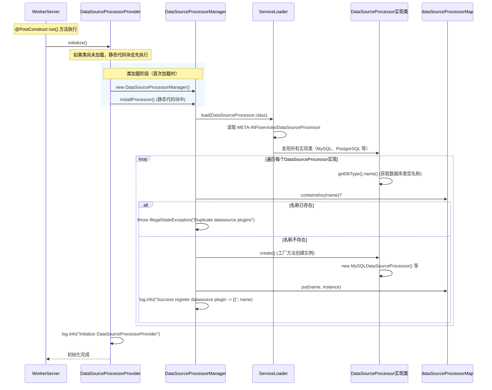
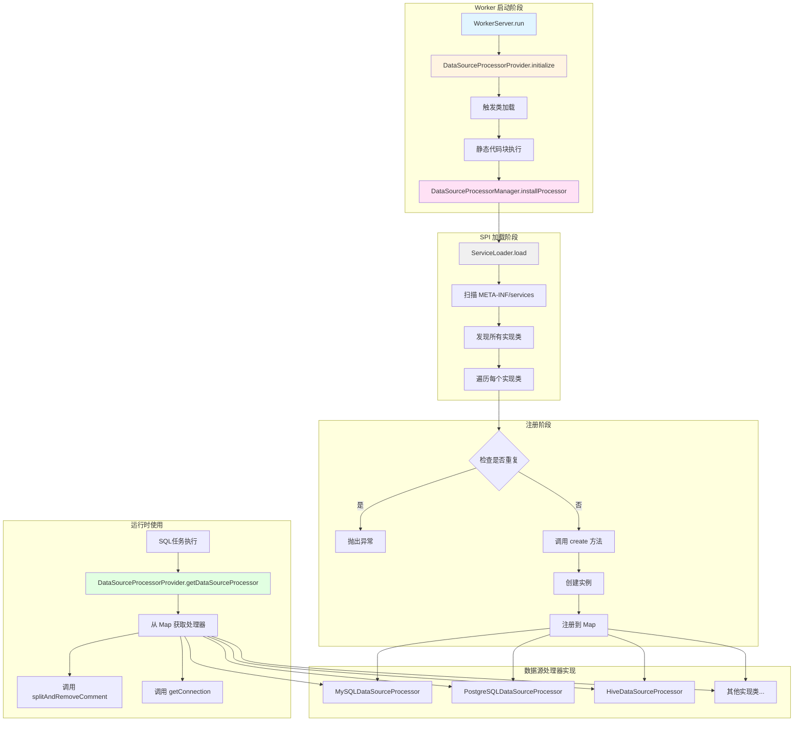

# Worker 数据源处理器加载详细分析

## 目录

1. [概述](#1-概述)
2. [初始化流程](#2-初始化流程)
3. [核心组件分析](#3-核心组件分析)
4. [SPI 机制详解](#4-spi-机制详解)
5. [时序图](#5-时序图)
6. [类图设计](#6-类图设计)
7. [组件交互图](#7-组件交互图)
8. [Worker 使用场景](#8-worker-使用场景)
9. [关键代码分析](#9-关键代码分析)
10. [总结](#10-总结)

---

## 1. 概述

DolphinScheduler Worker 服务采用了插件化的数据源管理架构，通过 `DataSourceProcessorProvider` 统一管理和提供各种数据源处理器。Worker 服务在启动时会初始化数据源处理器提供者，使得 Worker 能够支持多种数据源类型（如 MySQL、PostgreSQL、Hive、Oracle 等）的连接和操作。

本文档详细分析 Worker 服务中数据源处理器的加载流程、设计架构以及在任务执行中的使用方式。

### 1.1 核心组件关系

```
WorkerServer (Worker 服务入口)
    └─→ DataSourceProcessorProvider (数据源处理器提供者)
            └─→ DataSourceProcessorManager (数据源处理器管理器)
                    └─→ ServiceLoader (SPI 加载器)
                            └─→ DataSourceProcessor 实现类 (MySQL、PostgreSQL 等)
```

### 1.2 关键代码入口

- **WorkerServer 启动入口**：[WorkerServer.java:85](dolphinscheduler-worker/src/main/java/org/apache/dolphinscheduler/server/worker/WorkerServer.java#L85)
- **DataSourceProcessorProvider 初始化**：[DataSourceProcessorProvider.java:40](dolphinscheduler-datasource-plugin/dolphinscheduler-datasource-api/src/main/java/org/apache/dolphinscheduler/plugin/datasource/api/plugin/DataSourceProcessorProvider.java#L40)
- **DataSourceProcessorManager 安装处理器**：[DataSourceProcessorManager.java:40](dolphinscheduler-datasource-plugin/dolphinscheduler-datasource-api/src/main/java/org/apache/dolphinscheduler/plugin/datasource/api/plugin/DataSourceProcessorManager.java#L40)

---

## 2. 初始化流程

### 2.1 初始化入口

数据源处理器的初始化入口位于 `WorkerServer.run()` 方法中：

```java:dolphinscheduler-worker/src/main/java/org/apache/dolphinscheduler/server/worker/WorkerServer.java
@PostConstruct
public void run() {
    ServerLifeCycleManager.toRunning();

    this.workerRpcServer.start();

    TaskPluginManager.loadTaskPlugin();

    DataSourceProcessorProvider.initialize();  // 数据源处理器初始化

    this.workerRegistryClient.setRegistryStoppable(this);
    this.workerRegistryClient.start();

    this.physicalTaskEngineDelegator.start();
    // ... 后续代码 ...
}
```

**调用位置**：[WorkerServer.java:85](dolphinscheduler-worker/src/main/java/org/apache/dolphinscheduler/server/worker/WorkerServer.java#L85)

**调用时机**：Worker 服务启动时，在 RPC 服务启动和任务插件加载之后，注册中心连接之前

**调用顺序**：
1. 设置服务状态为运行中 (`ServerLifeCycleManager.toRunning()`)
2. RPC 服务启动 (`workerRpcServer.start()`)
3. 任务插件加载 (`TaskPluginManager.loadTaskPlugin()`)
4. **数据源处理器初始化** (`DataSourceProcessorProvider.initialize()`)
5. 注册中心连接 (`workerRegistryClient.start()`)
6. 物理任务引擎启动 (`physicalTaskEngineDelegator.start()`)

### 2.2 初始化流程详解

#### 2.2.1 DataSourceProcessorProvider.initialize() 方法

```java:dolphinscheduler-datasource-plugin/dolphinscheduler-datasource-api/src/main/java/org/apache/dolphinscheduler/plugin/datasource/api/plugin/DataSourceProcessorProvider.java
@Slf4j
public class DataSourceProcessorProvider {

    private static final DataSourceProcessorManager dataSourcePluginManager = new DataSourceProcessorManager();

    static {
        dataSourcePluginManager.installProcessor();  // 静态代码块中执行安装
    }

    private DataSourceProcessorProvider() {
    }

    public static void initialize() {
        log.info("Initialize DataSourceProcessorProvider");
    }

    public static DataSourceProcessor getDataSourceProcessor(@NonNull DbType dbType) {
        return dataSourcePluginManager.getDataSourceProcessorMap().get(dbType.name());
    }

    public static Map<String, DataSourceProcessor> getDataSourceProcessorMap() {
        return dataSourcePluginManager.getDataSourceProcessorMap();
    }
}
```

**关键点**：
1. **单例模式**：`DataSourceProcessorProvider` 使用私有构造函数，提供静态方法访问
2. **静态初始化**：在类的静态代码块中执行 `installProcessor()`，确保在类加载时就完成数据源处理器的安装
3. **初始化方法**：`initialize()` 方法实际上只是记录日志，真正的初始化工作在静态代码块中完成
4. **延迟加载特性**：由于静态代码块在类首次加载时执行，`initialize()` 方法主要用于明确标识初始化时机，确保在 Worker 启动的合适时机触发类加载

#### 2.2.2 DataSourceProcessorManager.installProcessor() 方法

```java:dolphinscheduler-datasource-plugin/dolphinscheduler-datasource-api/src/main/java/org/apache/dolphinscheduler/plugin/datasource/api/plugin/DataSourceProcessorManager.java
@Slf4j
public class DataSourceProcessorManager {

    private static final Map<String, DataSourceProcessor> dataSourceProcessorMap = new ConcurrentHashMap<>();

    public Map<String, DataSourceProcessor> getDataSourceProcessorMap() {
        return Collections.unmodifiableMap(dataSourceProcessorMap);
    }

    public void installProcessor() {
        ServiceLoader.load(DataSourceProcessor.class).forEach(factory -> {
            final String name = factory.getDbType().name();

            if (dataSourceProcessorMap.containsKey(name)) {
                throw new IllegalStateException(format("Duplicate datasource plugins named '%s'", name));
            }
            loadDatasourceClient(factory);
            log.info("Success register datasource plugin -> {}", name);
        });
    }

    private void loadDatasourceClient(DataSourceProcessor processor) {
        DataSourceProcessor instance = processor.create();
        dataSourceProcessorMap.put(processor.getDbType().name(), instance);
    }
}
```

**工作流程**：
1. **ServiceLoader 加载**：使用 Java 标准的 `ServiceLoader.load(DataSourceProcessor.class)` 加载所有 `DataSourceProcessor` 接口的实现类
2. **遍历注册**：对每个找到的数据源处理器实现进行遍历
3. **名称提取**：通过 `factory.getDbType().name()` 获取数据库类型名称作为唯一标识（如 "MYSQL"、"POSTGRESQL"）
4. **重复检查**：检查是否已经存在相同名称的数据源处理器，如果存在则抛出 `IllegalStateException`（防止重复注册）
5. **实例化**：调用 `processor.create()` 创建数据源处理器实例（工厂方法模式）
6. **注册缓存**：将实例存储到 `dataSourceProcessorMap` 中，以数据库类型名称为 key

**存储结构**：
- **Key**：数据库类型名称（如 "MYSQL"、"POSTGRESQL"、"HIVE" 等）
- **Value**：对应的 `DataSourceProcessor` 实例
- **线程安全**：使用 `ConcurrentHashMap` 保证并发安全
- **只读视图**：通过 `Collections.unmodifiableMap()` 返回不可修改的 Map，防止外部修改

---

## 3. 核心组件分析

### 3.1 DataSourceProcessor 接口

**位置**：[DataSourceProcessor.java](dolphinscheduler-datasource-plugin/dolphinscheduler-datasource-api/src/main/java/org/apache/dolphinscheduler/plugin/datasource/api/datasource/DataSourceProcessor.java)

**核心职责**：
- 定义数据源处理器的标准接口
- 提供数据源参数转换、验证、连接创建等功能
- 支持不同数据库类型的定制化实现

**关键方法**：
1. **参数处理**：
    - `castDatasourceParamDTO(String paramJson)`: 将 JSON 转换为数据源参数 DTO
    - `createDatasourceParamDTO(String connectionJson)`: 从连接 JSON 创建数据源参数 DTO
    - `createConnectionParams(BaseDataSourceParamDTO datasourceParam)`: 从 DTO 创建连接参数对象
    - `createConnectionParams(String connectionJson)`: 从 JSON 创建连接参数对象

2. **连接管理**：
    - `getConnection(ConnectionParam connectionParam)`: 获取数据库连接
    - `checkDataSourceConnectivity(ConnectionParam connectionParam)`: 检查数据源连接性
    - `getJdbcUrl(ConnectionParam connectionParam)`: 获取 JDBC URL（可能包含额外参数）

3. **工具方法**：
    - `getDatasourceDriver()`: 获取驱动类名
    - `getValidationQuery()`: 获取验证查询语句
    - `splitAndRemoveComment(String sql)`: 分割 SQL 并移除注释
    - `getDbType()`: 获取数据库类型枚举
    - `create()`: 工厂方法，创建处理器实例

### 3.2 AbstractDataSourceProcessor 抽象类

**位置**：[AbstractDataSourceProcessor.java](dolphinscheduler-datasource-plugin/dolphinscheduler-datasource-api/src/main/java/org/apache/dolphinscheduler/plugin/datasource/api/datasource/AbstractDataSourceProcessor.java)

**核心职责**：
- 提供数据源处理器的通用实现
- 实现参数验证逻辑（主机名、数据库名、其他参数）
- 提供安全检查和通用功能

**安全特性**：
- **主机名验证**：使用正则表达式验证 IPv4/IPv6 地址和主机名格式，防止注入攻击
- **数据库名验证**：防止 SQL 注入，只允许特定字符（字母、数字、下划线、连字符、点号）
- **参数验证**：检查其他参数，防止恶意键值对（如 `allowLoadLocalInfile`）

```java:dolphinscheduler-datasource-plugin/dolphinscheduler-datasource-api/src/main/java/org/apache/dolphinscheduler/plugin/datasource/api/datasource/AbstractDataSourceProcessor.java
@Override
public void checkDatasourceParam(BaseDataSourceParamDTO baseDataSourceParamDTO) {
    if (!baseDataSourceParamDTO.getType().equals(DbType.REDSHIFT)) {
        // due to redshift use not regular hosts
        checkHost(baseDataSourceParamDTO.getHost());
    }
    checkDatabasePatter(baseDataSourceParamDTO.getDatabase());
    checkOther(baseDataSourceParamDTO.getOther());
}
```

### 3.3 MySQLDataSourceProcessor 实现示例

**位置**：[MySQLDataSourceProcessor.java](dolphinscheduler-datasource-plugin/dolphinscheduler-datasource-mysql/src/main/java/org/apache/dolphinscheduler/plugin/datasource/mysql/param/MySQLDataSourceProcessor.java)

**核心特性**：
1. **SQL 解析**：使用 Druid SQL 解析器，支持 MySQL 特定的 SQL 语法和注释处理
2. **安全连接**：过滤危险连接参数（如 `autoDeserialize`、`allowLoadLocalInfile`），防止安全漏洞
3. **连接属性管理**：设置安全的连接属性，强制禁用不安全的特性

```java:dolphinscheduler-datasource-plugin/dolphinscheduler-datasource-mysql/src/main/java/org/apache/dolphinscheduler/plugin/datasource/mysql/param/MySQLDataSourceProcessor.java
@Override
public Connection getConnection(ConnectionParam connectionParam) throws ClassNotFoundException, SQLException {
    MySQLConnectionParam mysqlConnectionParam = (MySQLConnectionParam) connectionParam;
    Class.forName(getDatasourceDriver());
    String user = mysqlConnectionParam.getUser();
    if (user.contains(AUTO_DESERIALIZE)) {
        log.warn("sensitive param : {} in username field is filtered", AUTO_DESERIALIZE);
        user = user.replace(AUTO_DESERIALIZE, "");
    }
    String password = PasswordUtils.decodePassword(mysqlConnectionParam.getPassword());
    // ... 密码安全检查 ...
    Properties connectionProperties = getConnectionProperties(mysqlConnectionParam, user, password);
    return DriverManager.getConnection(getJdbcUrl(connectionParam), connectionProperties);
}

@Override
public List<String> splitAndRemoveComment(String sql) {
    String cleanSQL = SQLParserUtils.removeComment(sql, com.alibaba.druid.DbType.mysql);
    return SQLParserUtils.split(cleanSQL, com.alibaba.druid.DbType.mysql);
}
```

### 3.4 DataSourceProcessorProvider 提供者类

**位置**：[DataSourceProcessorProvider.java](dolphinscheduler-datasource-plugin/dolphinscheduler-datasource-api/src/main/java/org/apache/dolphinscheduler/plugin/datasource/api/plugin/DataSourceProcessorProvider.java)

**设计模式**：单例模式（通过私有构造函数）+ 静态工厂方法

**核心方法**：
- `initialize()`: 初始化方法，触发类加载并记录日志
- `getDataSourceProcessor(DbType dbType)`: 根据数据库类型获取对应的处理器
- `getDataSourceProcessorMap()`: 获取所有已注册的处理器映射

---

## 4. SPI 机制详解

数据源处理器通过 Java SPI（Service Provider Interface）机制自动发现和加载。每个数据源处理器实现类使用 `@AutoService` 注解进行注册：

```java:dolphinscheduler-datasource-plugin/dolphinscheduler-datasource-mysql/src/main/java/org/apache/dolphinscheduler/plugin/datasource/mysql/param/MySQLDataSourceProcessor.java
@AutoService(DataSourceProcessor.class)
@Slf4j
public class MySQLDataSourceProcessor extends AbstractDataSourceProcessor {
    // ... 实现代码 ...
}
```

**SPI 机制工作原理**：
1. **编译时处理**：`@AutoService` 注解（来自 Google Auto Service）在编译时会自动生成 `META-INF/services/org.apache.dolphinscheduler.plugin.datasource.api.datasource.DataSourceProcessor` 文件
2. **文件内容**：该文件包含所有实现类的全限定名，每行一个（例如：`org.apache.dolphinscheduler.plugin.datasource.mysql.param.MySQLDataSourceProcessor`）
3. **运行时加载**：`ServiceLoader.load()` 读取该文件，通过反射实例化所有实现类
4. **自动发现**：无需手动注册，添加新的数据源处理器只需实现接口并添加 `@AutoService` 注解

**支持的数据源类型**（参考 `DbType` 枚举）：
- 关系型数据库：MYSQL, POSTGRESQL, ORACLE, SQLSERVER, DB2, H2
- 大数据引擎：HIVE, SPARK, PRESTO, TRINO, STARROCKS, CLICKHOUSE
- 云数据库：REDSHIFT, ATHENA, AZURESQL, SNOWFLAKE, OCEANBASE
- 其他：DAMENG, SSH, KYUUBI, DATABEND, VERTICA, HANA, DORIS, ZEPPELIN, SAGEMAKER, K8S, ALIYUN_SERVERLESS_SPARK

---

## 5. 时序图



**关键时序说明**：
1. **类加载时机**：`DataSourceProcessorProvider` 类首次被引用时，JVM 会加载该类，静态代码块随之执行
2. **静态初始化优先**：静态代码块中的 `installProcessor()` 会在 `initialize()` 方法执行前完成
3. **ServiceLoader 延迟加载**：ServiceLoader 使用懒加载机制，只有在迭代时才真正加载实现类
4. **线程安全**：整个过程在类加载阶段完成，后续访问通过 `ConcurrentHashMap` 保证线程安全

---

## 6. 类图设计

```mermaid
classDiagram
    class DataSourceProcessor {
        <<interface>>
        +castDatasourceParamDTO(String paramJson) BaseDataSourceParamDTO
        +checkDatasourceParam(BaseDataSourceParamDTO datasourceParam) void
        +getDatasourceUniqueId(ConnectionParam connectionParam, DbType dbType) String
        +createDatasourceParamDTO(String connectionJson) BaseDataSourceParamDTO
        +createConnectionParams(BaseDataSourceParamDTO datasourceParam) ConnectionParam
        +createConnectionParams(String connectionJson) ConnectionParam
        +getDatasourceDriver() String
        +getValidationQuery() String
        +getJdbcUrl(ConnectionParam connectionParam) String
        +getConnection(ConnectionParam connectionParam) Connection
        +checkDataSourceConnectivity(ConnectionParam connectionParam) boolean
        +getDbType() DbType
        +create() DataSourceProcessor
        +splitAndRemoveComment(String sql) List~String~
    }
    
    class AbstractDataSourceProcessor {
        <<abstract>>
        #checkHost(String host) void
        #checkDatabasePatter(String database) void
        #checkOther(Map~String,String~ other) void
        #transformOtherParamToMap(String other) Map~String,String~
        +checkDatasourceParam(BaseDataSourceParamDTO datasourceParamDTO) void
        +getDatasourceUniqueId(ConnectionParam connectionParam, DbType dbType) String
        +checkDataSourceConnectivity(ConnectionParam connectionParam) boolean
        +splitAndRemoveComment(String sql) List~String~
    }
    
    class MySQLDataSourceProcessor {
        +castDatasourceParamDTO(String paramJson) BaseDataSourceParamDTO
        +createDatasourceParamDTO(String connectionJson) BaseDataSourceParamDTO
        +createConnectionParams(BaseDataSourceParamDTO dataSourceParam) BaseConnectionParam
        +createConnectionParams(String connectionJson) ConnectionParam
        +getDatasourceDriver() String
        +getValidationQuery() String
        +getJdbcUrl(ConnectionParam connectionParam) String
        +getConnection(ConnectionParam connectionParam) Connection
        +getDbType() DbType
        +create() DataSourceProcessor
        +splitAndRemoveComment(String sql) List~String~
        -getConnectionProperties(MySQLConnectionParam, String, String) Properties
        -checkKeyIsLegitimate(String key) boolean
        -transformOther(Map~String,String~) String
    }
    
    class PostgreSQLDataSourceProcessor {
        +getDbType() DbType
        +create() DataSourceProcessor
        +getConnection(ConnectionParam connectionParam) Connection
        # 其他方法...
    }
    
    class DataSourceProcessorProvider {
        -dataSourcePluginManager DataSourceProcessorManager
        +{static} initialize() void
        +{static} getDataSourceProcessor(DbType dbType) DataSourceProcessor
        +{static} getDataSourceProcessorMap() Map~String,DataSourceProcessor~
    }
    
    class DataSourceProcessorManager {
        -dataSourceProcessorMap Map~String,DataSourceProcessor~
        +getDataSourceProcessorMap() Map~String,DataSourceProcessor~
        +installProcessor() void
        -loadDatasourceClient(DataSourceProcessor processor) void
    }
    
    class WorkerServer {
        +run() void
        +close(String cause) void
        +stop(String cause) void
    }
    
    DataSourceProcessor <|.. AbstractDataSourceProcessor
    AbstractDataSourceProcessor <|-- MySQLDataSourceProcessor
    AbstractDataSourceProcessor <|-- PostgreSQLDataSourceProcessor
    AbstractDataSourceProcessor <|-- HiveDataSourceProcessor
    AbstractDataSourceProcessor <|-- OracleDataSourceProcessor
    AbstractDataSourceProcessor <|.. 其他DataSourceProcessor实现
    
    DataSourceProcessorProvider --> DataSourceProcessorManager : uses
    DataSourceProcessorManager --> DataSourceProcessor : manages
    DataSourceProcessorManager --> DataSourceProcessor : contains
    
    WorkerServer ..> DataSourceProcessorProvider : calls initialize()
    DataSourceProcessorProvider ..> DataSourceProcessor : provides getDataSourceProcessor()
```

**设计模式说明**：
1. **工厂方法模式**：`DataSourceProcessor.create()` 方法用于创建处理器实例
2. **单例模式**：`DataSourceProcessorProvider` 通过私有构造函数和静态方法实现单例
3. **模板方法模式**：`AbstractDataSourceProcessor` 定义了通用算法骨架，子类实现特定步骤
4. **SPI 模式**：通过 ServiceLoader 实现插件化架构，支持动态扩展

---

## 7. 组件交互图



---

## 8. Worker 使用场景

### 8.1 SQL 任务执行

Worker 在执行 SQL 任务时，需要根据数据源类型获取对应的处理器来解析 SQL 语句和执行数据库操作。

**使用场景**：
- **SQL 解析**：将 SQL 语句按照分号分割，并移除注释
- **连接管理**：创建和管理数据库连接
- **参数验证**：验证数据源连接参数的有效性

**典型调用链**：
```
SQL任务执行
    └─→ 获取数据源信息
        └─→ DataSourceProcessorProvider.getDataSourceProcessor(DbType)
            └─→ 从 Map 中获取对应的处理器
                └─→ 调用处理器的 splitAndRemoveComment() 解析 SQL
                └─→ 调用处理器的 getConnection() 获取连接
```

### 8.2 数据源连接测试

Worker 可能需要测试数据源连接的有效性，此时会使用数据源处理器进行连接性检查。

**使用方式**：
```java
DataSourceProcessor processor = DataSourceProcessorProvider.getDataSourceProcessor(DbType.MYSQL);
boolean isConnected = processor.checkDataSourceConnectivity(connectionParam);
```

### 8.3 参数转换和验证

Worker 在处理数据源参数时，需要使用处理器进行参数格式转换和验证。

**使用方式**：
```java
DataSourceProcessor processor = DataSourceProcessorProvider.getDataSourceProcessor(dbType);
BaseDataSourceParamDTO paramDTO = processor.createDatasourceParamDTO(connectionJson);
processor.checkDatasourceParam(paramDTO);  // 验证参数
ConnectionParam connectionParam = processor.createConnectionParams(paramDTO);
```

---

## 9. 关键代码分析

### 9.1 WorkerServer 初始化调用

```java:dolphinscheduler-worker/src/main/java/org/apache/dolphinscheduler/server/worker/WorkerServer.java
@PostConstruct
public void run() {
    ServerLifeCycleManager.toRunning();

    this.workerRpcServer.start();

    TaskPluginManager.loadTaskPlugin();

    DataSourceProcessorProvider.initialize();  // 第85行

    this.workerRegistryClient.setRegistryStoppable(this);
    this.workerRegistryClient.start();
    // ...
}
```

**分析**：
- `@PostConstruct` 注解确保在 Spring Bean 初始化完成后执行
- 初始化顺序保证了依赖关系：先加载任务插件，再初始化数据源处理器
- 数据源处理器初始化必须在注册中心连接之前完成，以便后续任务执行时能够使用

### 9.2 静态代码块初始化机制

```java:dolphinscheduler-datasource-plugin/dolphinscheduler-datasource-api/src/main/java/org/apache/dolphinscheduler/plugin/datasource/api/plugin/DataSourceProcessorProvider.java
private static final DataSourceProcessorManager dataSourcePluginManager = new DataSourceProcessorManager();

static {
    dataSourcePluginManager.installProcessor();  // 类加载时执行
}
```

**分析**：
- 静态代码块在类首次加载时执行，保证只初始化一次
- 使用静态变量存储管理器实例，实现单例效果
- 即使 `initialize()` 方法未被调用，类加载时也会完成初始化（如果类被引用）

### 9.3 ServiceLoader 加载机制

```java:dolphinscheduler-datasource-plugin/dolphinscheduler-datasource-api/src/main/java/org/apache/dolphinscheduler/plugin/datasource/api/plugin/DataSourceProcessorManager.java
public void installProcessor() {
    ServiceLoader.load(DataSourceProcessor.class).forEach(factory -> {
        final String name = factory.getDbType().name();

        if (dataSourceProcessorMap.containsKey(name)) {
            throw new IllegalStateException(format("Duplicate datasource plugins named '%s'", name));
        }
        loadDatasourceClient(factory);
        log.info("Success register datasource plugin -> {}", name);
    });
}
```

**分析**：
- `ServiceLoader.load()` 使用当前线程的上下文类加载器加载服务
- `forEach()` 方法触发懒加载，只有在迭代时才真正实例化实现类
- 重复检查机制防止同一个数据库类型注册多个处理器
- 日志记录帮助排查加载问题

### 9.4 工厂方法创建实例

```java:dolphinscheduler-datasource-plugin/dolphinscheduler-datasource-api/src/main/java/org/apache/dolphinscheduler/plugin/datasource/api/plugin/DataSourceProcessorManager.java
private void loadDatasourceClient(DataSourceProcessor processor) {
    DataSourceProcessor instance = processor.create();  // 工厂方法
    dataSourceProcessorMap.put(processor.getDbType().name(), instance);
}
```

**分析**：
- 使用工厂方法模式，让每个处理器自己决定如何创建实例
- 可以实现单例、原型等不同的创建策略
- 解耦实例创建逻辑，便于扩展

### 9.5 MySQL 处理器实现示例

```java:dolphinscheduler-datasource-plugin/dolphinscheduler-datasource-mysql/src/main/java/org/apache/dolphinscheduler/plugin/datasource/mysql/param/MySQLDataSourceProcessor.java
@AutoService(DataSourceProcessor.class)
@Slf4j
public class MySQLDataSourceProcessor extends AbstractDataSourceProcessor {
    
    @Override
    public DataSourceProcessor create() {
        return new MySQLDataSourceProcessor();  // 每次创建新实例
    }
    
    @Override
    public DbType getDbType() {
        return DbType.MYSQL;
    }
    
    @Override
    public List<String> splitAndRemoveComment(String sql) {
        String cleanSQL = SQLParserUtils.removeComment(sql, com.alibaba.druid.DbType.mysql);
        return SQLParserUtils.split(cleanSQL, com.alibaba.druid.DbType.mysql);
    }
}
```

**分析**：
- `@AutoService` 注解自动注册到 SPI
- `create()` 方法每次创建新实例（可根据需要改为单例）
- 使用 Druid SQL 解析器处理 MySQL 特定的 SQL 语法

---

## 10. 总结

### 10.1 初始化流程总结

Worker 服务的数据源处理器加载流程遵循以下步骤：

1. **触发阶段**：`WorkerServer.run()` 方法调用 `DataSourceProcessorProvider.initialize()`
2. **类加载阶段**：如果类尚未加载，JVM 加载 `DataSourceProcessorProvider` 类，静态代码块执行
3. **安装阶段**：`DataSourceProcessorManager.installProcessor()` 通过 ServiceLoader 发现所有实现类
4. **注册阶段**：遍历每个实现类，创建实例并注册到 Map 中
5. **完成阶段**：记录初始化日志，流程完成

### 10.2 设计特点

1. **插件化架构**：通过 SPI 机制实现数据源处理器的动态扩展，无需修改核心代码
2. **线程安全**：使用 `ConcurrentHashMap` 存储处理器实例，支持并发访问
3. **延迟加载**：ServiceLoader 使用懒加载机制，只有在需要时才实例化实现类
4. **单例提供者**：`DataSourceProcessorProvider` 使用单例模式，统一管理所有处理器
5. **类型安全**：通过 `DbType` 枚举确保类型安全，避免字符串错误

### 10.3 Worker 与 Master 的区别

Worker 和 Master 都使用相同的数据源处理器加载机制，但使用场景略有不同：

- **Master**：主要用于数据源管理、验证和 SQL 任务调度
- **Worker**：主要用于 SQL 任务的实际执行、连接管理和 SQL 解析

两者的初始化流程完全相同，确保了整个系统的一致性。

### 10.4 扩展新数据源

要添加新的数据源支持，只需要：

1. 创建新的 `DataSourceProcessor` 实现类
2. 继承 `AbstractDataSourceProcessor` 或实现 `DataSourceProcessor` 接口
3. 添加 `@AutoService(DataSourceProcessor.class)` 注解
4. 实现必要的方法（`getDbType()`, `create()`, `getConnection()` 等）
5. 编译时自动生成 SPI 配置文件
6. 无需修改核心代码，自动被加载和注册

这种设计使得 DolphinScheduler 能够轻松支持各种数据源类型，具有良好的可扩展性。

