# Worker 服务注册到 Zookeeper 详细分析

## 目录

1. [概述](#1-概述)
2. [架构设计](#2-架构设计)
3. [服务注册流程](#3-服务注册流程)
4. [心跳机制详解](#4-心跳机制详解)
5. [连接状态监听与回调流程](#5-连接状态监听与回调流程)
6. [CuratorFramework 架构](#6-curatorframework-架构)
7. [异常处理机制](#7-异常处理机制)
8. [总结](#8-总结)

---

## 1. 概述

Worker 服务注册是 DolphinScheduler 集群管理的核心机制，通过 Zookeeper 实现服务发现、心跳维护和故障检测。本文档详细分析 Worker 服务注册到 Zookeeper 的完整流程，包括：

- **服务注册流程**：从启动到注册成功的完整过程
- **心跳机制**：服务层心跳和应用层心跳的区别与关系
- **连接状态监听**：连接状态变化时的回调处理流程
- **CuratorFramework 架构**：Zookeeper 客户端的封装和使用
- **异常处理**：连接断开、故障转移等异常情况的处理

### 1.1 核心组件关系

```
WorkerServer (应用层)
    └─→ WorkerRegistryClient (服务注册客户端)
            ├─→ WorkerHeartBeatTask (应用层心跳任务)
            └─→ RegistryClient (注册中心门面)
                    └─→ ZookeeperRegistry (Zookeeper 实现)
                            └─→ CuratorFramework (Zookeeper 客户端框架)
                                    └─→ ZooKeeper (原生客户端)
```

### 1.2 关键代码入口

- **WorkerServer 启动入口**：[WorkerServer.java:87-88](dolphinscheduler-worker/src/main/java/org/apache/dolphinscheduler/server/worker/WorkerServer.java#L87-L88)
- **WorkerRegistryClient 启动**：[WorkerRegistryClient.java:78](dolphinscheduler-worker/src/main/java/org/apache/dolphinscheduler/server/worker/registry/WorkerRegistryClient.java#L78)
- **WorkerHeartBeatTask 创建**：[WorkerRegistryClient.java:71-75](dolphinscheduler-worker/src/main/java/org/apache/dolphinscheduler/server/worker/registry/WorkerRegistryClient.java#L71-L75)
- **ZookeeperRegistry 初始化**：[ZookeeperRegistry.java:76](dolphinscheduler-registry/dolphinscheduler-registry-plugins/dolphinscheduler-registry-zookeeper/src/main/java/org/apache/dolphinscheduler/plugin/registry/zookeeper/ZookeeperRegistry.java#L76)

---

## 2. 架构设计

### 2.1 分层架构

DolphinScheduler 的注册中心采用分层设计，通过 SPI 机制支持多种注册中心实现：

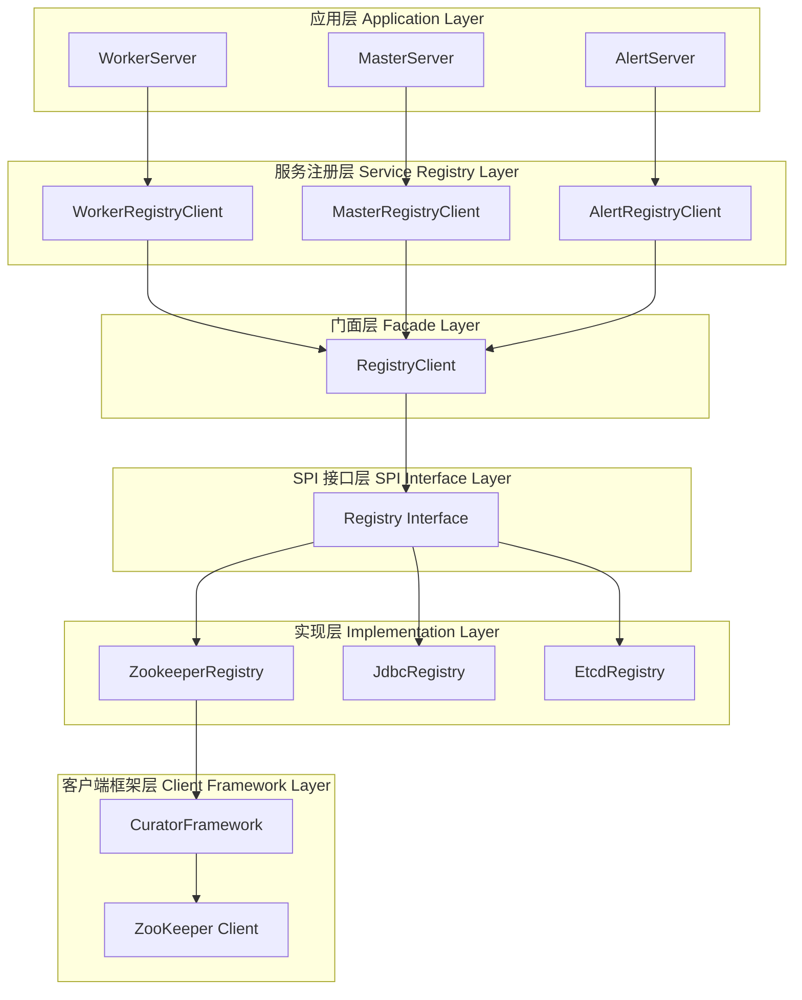
```mermaid
graph TB
    subgraph "应用层 Application Layer"
        A[WorkerServer]
        B[MasterServer]
        C[AlertServer]
    end
    
    subgraph "服务注册层 Service Registry Layer"
        D[WorkerRegistryClient]
        E[MasterRegistryClient]
        F[AlertRegistryClient]
    end
    
    subgraph "门面层 Facade Layer"
        G[RegistryClient]
    end
    
    subgraph "SPI 接口层 SPI Interface Layer"
        H[Registry Interface]
    end
    
    subgraph "实现层 Implementation Layer"
        I[ZookeeperRegistry]
        J[JdbcRegistry]
        K[EtcdRegistry]
    end
    
    subgraph "客户端框架层 Client Framework Layer"
        L[CuratorFramework]
        M[ZooKeeper Client]
    end
    
    A --> D
    B --> E
    C --> F
    D --> G
    E --> G
    F --> G
    G --> H
    H --> I
    H --> J
    H --> K
    I --> L
    L --> M
```

### 2.2 设计模式

1. **门面模式（Facade Pattern）**：`RegistryClient` 封装 `Registry` 接口，提供统一的 API
2. **SPI 机制（Service Provider Interface）**：`Registry` 为 SPI 接口，支持插件化实现
3. **策略模式（Strategy Pattern）**：不同 `Registry` 实现可替换
4. **模板方法模式（Template Method Pattern）**：`BaseHeartBeatTask` 定义心跳任务骨架
5. **适配器模式（Adapter Pattern）**：`ZookeeperConnectionStateListener` 适配 Curator 状态到统一状态

### 2.3 核心类图

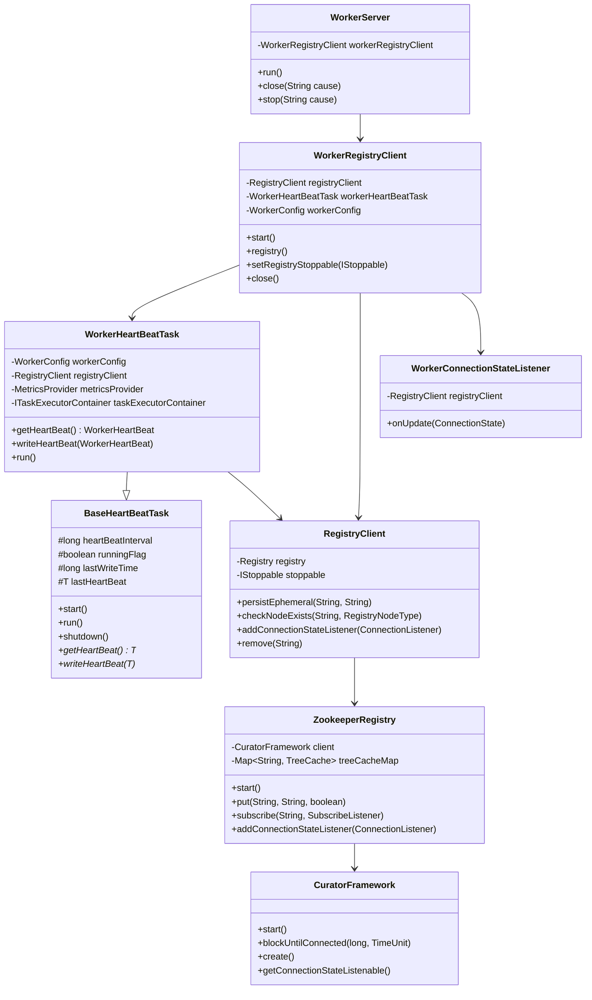
```mermaid
classDiagram
    class WorkerServer {
        -WorkerRegistryClient workerRegistryClient
        +run()
        +close(String cause)
        +stop(String cause)
    }
    
    class WorkerRegistryClient {
        -RegistryClient registryClient
        -WorkerHeartBeatTask workerHeartBeatTask
        -WorkerConfig workerConfig
        +start()
        +registry()
        +setRegistryStoppable(IStoppable)
        +close()
    }
    
    class WorkerHeartBeatTask {
        -WorkerConfig workerConfig
        -RegistryClient registryClient
        -MetricsProvider metricsProvider
        -ITaskExecutorContainer taskExecutorContainer
        +getHeartBeat() WorkerHeartBeat
        +writeHeartBeat(WorkerHeartBeat)
        +run()
    }
    
    class BaseHeartBeatTask {
        #long heartBeatInterval
        #boolean runningFlag
        #long lastWriteTime
        #T lastHeartBeat
        +start()
        +run()
        +shutdown()
        +getHeartBeat()* T
        +writeHeartBeat(T)*
    }
    
    class RegistryClient {
        -Registry registry
        -IStoppable stoppable
        +persistEphemeral(String, String)
        +checkNodeExists(String, RegistryNodeType)
        +addConnectionStateListener(ConnectionListener)
        +remove(String)
    }
    
    class ZookeeperRegistry {
        -CuratorFramework client
        -Map~String, TreeCache~ treeCacheMap
        +start()
        +put(String, String, boolean)
        +subscribe(String, SubscribeListener)
        +addConnectionStateListener(ConnectionListener)
    }
    
    class WorkerConnectionStateListener {
        -RegistryClient registryClient
        +onUpdate(ConnectionState)
    }
    
    class CuratorFramework {
        +start()
        +blockUntilConnected(long, TimeUnit)
        +create()
        +getConnectionStateListenable()
    }
    
    WorkerServer --> WorkerRegistryClient
    WorkerRegistryClient --> WorkerHeartBeatTask
    WorkerRegistryClient --> RegistryClient
    WorkerHeartBeatTask --|> BaseHeartBeatTask
    WorkerRegistryClient --> WorkerConnectionStateListener
    RegistryClient --> ZookeeperRegistry
    ZookeeperRegistry --> CuratorFramework
    WorkerHeartBeatTask --> RegistryClient
```

---

## 3. 服务注册流程

### 3.1 完整注册时序图

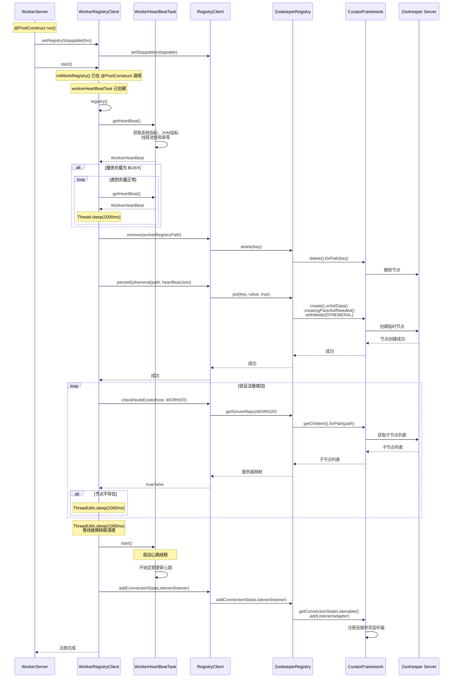
```mermaid
sequenceDiagram
    participant WS as WorkerServer
    participant WRC as WorkerRegistryClient
    participant WHT as WorkerHeartBeatTask
    participant RC as RegistryClient
    participant ZR as ZookeeperRegistry
    participant CF as CuratorFramework
    participant ZK as ZooKeeper Server
    
    Note over WS: @PostConstruct run()
    WS->>WRC: setRegistryStoppable(this)
    WRC->>RC: setStoppable(stoppable)
    
    WS->>WRC: start()
    
    Note over WRC: initWorkRegistry() 已在 @PostConstruct 调用
    Note over WRC: workerHeartBeatTask 已创建
    
    WRC->>WRC: registry()
    
    WRC->>WHT: getHeartBeat()
    WHT->>WHT: 获取系统指标、JVM指标<br/>线程池使用率等
    WHT-->>WRC: WorkerHeartBeat
    
    alt 服务负载为 BUSY
        loop 直到负载正常
            WRC->>WHT: getHeartBeat()
            WHT-->>WRC: WorkerHeartBeat
            Note over WRC: Thread.sleep(1000ms)
        end
    end
    
    WRC->>RC: remove(workerRegistryPath)
    RC->>ZR: delete(key)
    ZR->>CF: delete().forPath(key)
    CF->>ZK: 删除节点
    
    WRC->>RC: persistEphemeral(path, heartBeatJson)
    RC->>ZR: put(key, value, true)
    ZR->>CF: create().orSetData()<br/>.creatingParentsIfNeeded()<br/>.withMode(EPHEMERAL)
    CF->>ZK: 创建临时节点
    ZK-->>CF: 节点创建成功
    CF-->>ZR: 成功
    ZR-->>RC: 成功
    RC-->>WRC: 成功
    
    loop 验证注册成功
        WRC->>RC: checkNodeExists(host, WORKER)
        RC->>ZR: getServerMaps(WORKER)
        ZR->>CF: getChildren().forPath(path)
        CF->>ZK: 获取子节点列表
        ZK-->>CF: 子节点列表
        CF-->>ZR: 子节点列表
        ZR-->>RC: 服务器映射
        RC-->>WRC: true/false
        alt 节点不存在
            Note over WRC: ThreadUtils.sleep(1000ms)
        end
    end
    
    Note over WRC: ThreadUtils.sleep(1000ms)<br/>等待故障转移清理
    
    WRC->>WHT: start()
    Note over WHT: 启动心跳线程
    WHT->>WHT: 开始定期更新心跳
    
    WRC->>RC: addConnectionStateListener(listener)
    RC->>ZR: addConnectionStateListener(listener)
    ZR->>CF: getConnectionStateListenable()<br/>.addListener(adapter)
    CF->>CF: 注册连接状态监听器
    
    WRC-->>WS: 注册完成
```

### 3.2 注册流程详细步骤

#### 步骤 1：设置 Stoppable

**代码位置**：[WorkerServer.java:87](dolphinscheduler-worker/src/main/java/org/apache/dolphinscheduler/server/worker/WorkerServer.java#L87)

```java
this.workerRegistryClient.setRegistryStoppable(this);
```

**目的**：
- 将 `WorkerServer` 设置为可停止对象，当连接断开或发生故障转移时，可以通过 `RegistryClient` 调用 `WorkerServer.stop()` 方法停止服务
- 实现位置：[WorkerRegistryClient.java:121-123](dolphinscheduler-worker/src/main/java/org/apache/dolphinscheduler/server/worker/registry/WorkerRegistryClient.java#L121-L123)

#### 步骤 2：初始化心跳任务

**代码位置**：[WorkerRegistryClient.java:69-76](dolphinscheduler-worker/src/main/java/org/apache/dolphinscheduler/server/worker/registry/WorkerRegistryClient.java#L69-L76)

```java
@PostConstruct
public void initWorkRegistry() {
    this.workerHeartBeatTask = new WorkerHeartBeatTask(
            workerConfig,
            metricsProvider,
            registryClient,
            physicalTaskExecutorContainerDelegator.getExecutorContainer());
}
```

**关键点**：
- 心跳任务在 `@PostConstruct` 方法中创建，在注册前就已初始化
- 需要先创建任务以获取心跳数据用于负载检查
- 使用构造函数注入依赖，而非 Spring 依赖注入（原因：需要在注册时获取心跳数据，但线程尚未启动）

#### 步骤 3：启动注册流程

**代码位置**：[WorkerRegistryClient.java:78-85](dolphinscheduler-worker/src/main/java/org/apache/dolphinscheduler/server/worker/registry/WorkerRegistryClient.java#L78-L85)

```java
public void start() {
    try {
        registry();
        registryClient.addConnectionStateListener(new WorkerConnectionStateListener(registryClient));
    } catch (Exception ex) {
        throw new RegistryException("Worker registry client start up error", ex);
    }
}
```

**流程说明**：
1. 调用 `registry()` 方法执行注册
2. 注册连接状态监听器，监控连接状态变化

#### 步骤 4：负载检查

**代码位置**：[WorkerRegistryClient.java:87-93](dolphinscheduler-worker/src/main/java/org/apache/dolphinscheduler/server/worker/registry/WorkerRegistryClient.java#L87-L93)

```java
private void registry() throws InterruptedException {
    WorkerHeartBeat workerHeartBeat = workerHeartBeatTask.getHeartBeat();
    while (ServerStatus.BUSY.equals(workerHeartBeat.getServerStatus())) {
        log.warn("Worker node is BUSY: {}", workerHeartBeat);
        workerHeartBeat = workerHeartBeatTask.getHeartBeat();
        Thread.sleep(SLEEP_TIME_MILLIS);
    }
```

**目的**：
- 注册前检查服务负载状态
- 如果服务处于 BUSY 状态，等待直到状态变为 NORMAL
- 避免高负载时注册到注册中心，影响集群稳定性

**负载判断逻辑**：[WorkerHeartBeatTask.java:108-116](dolphinscheduler-worker/src/main/java/org/apache/dolphinscheduler/server/worker/task/WorkerHeartBeatTask.java#L108-L116)

```java
private ServerStatus getServerStatus(SystemMetrics systemMetrics,
                                     WorkerConfig workerConfig,
                                     ITaskExecutorContainer taskExecutorContainer) {
    if (taskExecutorContainer.slotUsage() == 1) {
        return ServerStatus.BUSY;  // 线程池已满
    }
    WorkerServerLoadProtection serverLoadProtection = workerConfig.getServerLoadProtection();
    return serverLoadProtection.isOverload(systemMetrics) ? ServerStatus.BUSY : ServerStatus.NORMAL;
}
```

**判断条件**：
1. **线程池使用率 = 1.0**：所有执行槽位都被占用，返回 BUSY
2. **系统负载保护检查**：通过 `WorkerServerLoadProtection.isOverload()` 检查 CPU、内存、磁盘等系统指标

#### 步骤 5：获取心跳数据

**代码位置**：[WorkerHeartBeatTask.java:63-84](dolphinscheduler-worker/src/main/java/org/apache/dolphinscheduler/server/worker/task/WorkerHeartBeatTask.java#L63-L84)

```java
@Override
public WorkerHeartBeat getHeartBeat() {
    SystemMetrics systemMetrics = metricsProvider.getSystemMetrics();
    ServerStatus serverStatus = getServerStatus(systemMetrics, workerConfig, taskExecutorContainer);

    return WorkerHeartBeat.builder()
            .startupTime(ServerLifeCycleManager.getServerStartupTime())
            .reportTime(System.currentTimeMillis())
            .jvmCpuUsage(systemMetrics.getJvmCpuUsagePercentage())
            .cpuUsage(systemMetrics.getSystemCpuUsagePercentage())
            .jvmMemoryUsage(systemMetrics.getJvmMemoryUsedPercentage())
            .memoryUsage(systemMetrics.getSystemMemoryUsedPercentage())
            .diskUsage(systemMetrics.getDiskUsedPercentage())
            .processId(processId)
            .workerHostWeight(workerConfig.getHostWeight())
            .threadPoolUsage(taskExecutorContainer.slotUsage())
            .serverStatus(serverStatus)
            .host(NetUtils.getHost())
            .port(workerConfig.getListenPort())
            .workerGroup(workerConfig.getGroup())
            .build();
}
```

**心跳数据包含**：
- **系统指标**：CPU、内存、磁盘使用率
- **JVM 指标**：JVM CPU、内存使用率
- **服务信息**：启动时间、报告时间、进程ID、主机地址、端口、Worker组
- **服务状态**：NORMAL/BUSY
- **资源信息**：Worker主机权重、线程池使用率

#### 步骤 6：删除旧节点

**代码位置**：[WorkerRegistryClient.java:94-96](dolphinscheduler-worker/src/main/java/org/apache/dolphinscheduler/server/worker/registry/WorkerRegistryClient.java#L94-L96)

```java
String workerRegistryPath = workerConfig.getWorkerRegistryPath();
// remove before persist
registryClient.remove(workerRegistryPath);
```

**目的**：先删除旧节点（如果存在），避免重复注册或数据不一致

**实现链**：
1. `RegistryClient.remove()` → [RegistryClient.java:185-187](dolphinscheduler-registry/dolphinscheduler-registry-api/src/main/java/org/apache/dolphinscheduler/registry/api/RegistryClient.java#L185-L187)
2. `ZookeeperRegistry.delete()` → [ZookeeperRegistry.java:361-372](dolphinscheduler-registry/dolphinscheduler-registry-plugins/dolphinscheduler-registry-zookeeper/src/main/java/org/apache/dolphinscheduler/plugin/registry/zookeeper/ZookeeperRegistry.java#L361-L372)

#### 步骤 7：创建临时节点

**代码位置**：[WorkerRegistryClient.java:97](dolphinscheduler-worker/src/main/java/org/apache/dolphinscheduler/server/worker/registry/WorkerRegistryClient.java#L97)

```java
registryClient.persistEphemeral(workerRegistryPath, JSONUtils.toJsonString(workerHeartBeat));
```

**实现链**：
1. `RegistryClient.persistEphemeral()` → [RegistryClient.java:176-178](dolphinscheduler-registry/dolphinscheduler-registry-api/src/main/java/org/apache/dolphinscheduler/registry/api/RegistryClient.java#L176-L178)
    - 调用 `registry.put(key, value, true)`，`deleteOnDisconnect = true` 表示创建临时节点
2. `ZookeeperRegistry.put()` → [ZookeeperRegistry.java:332-347](dolphinscheduler-registry/dolphinscheduler-registry-plugins/dolphinscheduler-registry-zookeeper/src/main/java/org/apache/dolphinscheduler/plugin/registry/zookeeper/ZookeeperRegistry.java#L332-L347)
    - 根据 `deleteOnDisconnect` 参数决定节点类型：`true` → `CreateMode.EPHEMERAL`，`false` → `CreateMode.PERSISTENT`
3. `CuratorFramework.create()` → [ZookeeperRegistry.java:336-343](dolphinscheduler-registry/dolphinscheduler-registry-plugins/dolphinscheduler-registry-zookeeper/src/main/java/org/apache/dolphinscheduler/plugin/registry/zookeeper/ZookeeperRegistry.java#L336-L343)
    - `.orSetData()`：如果节点存在则更新数据，不存在则创建
    - `.creatingParentsIfNeeded()`：如果父节点不存在则自动创建
    - `.withMode(CreateMode.EPHEMERAL)`：创建临时节点，客户端断开连接后自动删除
    - `.forPath(key, value.getBytes(StandardCharsets.UTF_8))`：设置节点路径和数据

**临时节点特性**：
- **自动删除**：当客户端与 Zookeeper 服务器断开连接（会话超时）时，临时节点会自动删除
- **会话绑定**：临时节点与客户端会话绑定，会话有效期间节点存在
- **故障检测**：其他节点可以通过临时节点的存在与否判断服务是否在线

**节点路径格式**：
- 路径格式：`/dolphinscheduler/nodes/worker/{host}:{port}`
- 例如：`/dolphinscheduler/nodes/worker/192.168.1.100:1234`

#### 步骤 8：验证注册成功

**代码位置**：[WorkerRegistryClient.java:101-103](dolphinscheduler-worker/src/main/java/org/apache/dolphinscheduler/server/worker/registry/WorkerRegistryClient.java#L101-L103)

```java
while (!registryClient.checkNodeExists(workerConfig.getWorkerAddress(), RegistryNodeType.WORKER)) {
    ThreadUtils.sleep(SLEEP_TIME_MILLIS);
}
```

**目的**：
- 验证节点是否已成功写入注册中心
- 处理可能的同步延迟问题（Zookeeper 的最终一致性）

**验证流程**：
1. `checkNodeExists()` → [RegistryClient.java:166-170](dolphinscheduler-registry/dolphinscheduler-registry-api/src/main/java/org/apache/dolphinscheduler/registry/api/RegistryClient.java#L166-L170)
2. `getServerMaps()` → [RegistryClient.java:152-164](dolphinscheduler-registry/dolphinscheduler-registry-api/src/main/java/org/apache/dolphinscheduler/registry/api/RegistryClient.java#L152-L164)
3. `getServerNodes()` → [RegistryClient.java:236](dolphinscheduler-registry/dolphinscheduler-registry-api/src/main/java/org/apache/dolphinscheduler/registry/api/RegistryClient.java#L236)
4. `getChildrenKeys()` → [RegistryClient.java:224](dolphinscheduler-registry/dolphinscheduler-registry-api/src/main/java/org/apache/dolphinscheduler/registry/api/RegistryClient.java#L224)
5. `ZookeeperRegistry.children()` → [ZookeeperRegistry.java:350-358](dolphinscheduler-registry/dolphinscheduler-registry-plugins/dolphinscheduler-registry-zookeeper/src/main/java/org/apache/dolphinscheduler/plugin/registry/zookeeper/ZookeeperRegistry.java#L350-L358)

#### 步骤 9：等待故障转移清理

**代码位置**：[WorkerRegistryClient.java:105-106](dolphinscheduler-worker/src/main/java/org/apache/dolphinscheduler/server/worker/registry/WorkerRegistryClient.java#L105-L106)

```java
// sleep 1s, waiting master failover remove
ThreadUtils.sleep(Constants.SLEEP_TIME_MILLIS);
```

**目的**：
- 等待可能的故障转移清理完成
- 避免与故障转移流程冲突
- 确保服务注册的稳定性

#### 步骤 10：启动心跳任务

**代码位置**：[WorkerRegistryClient.java:108](dolphinscheduler-worker/src/main/java/org/apache/dolphinscheduler/server/worker/registry/WorkerRegistryClient.java#L108)

```java
workerHeartBeatTask.start();
```

**关键点**：
- 心跳任务线程在注册验证完成后才启动
- 启动后开始定期更新注册中心的心跳数据
- 心跳任务使用守护线程，不会阻止 JVM 退出
- 实现位置：[BaseHeartBeatTask.java:53-58](dolphinscheduler-common/src/main/java/org/apache/dolphinscheduler/common/model/BaseHeartBeatTask.java#L53-L58)

#### 步骤 11：注册连接状态监听器

**代码位置**：[WorkerRegistryClient.java:81](dolphinscheduler-worker/src/main/java/org/apache/dolphinscheduler/server/worker/registry/WorkerRegistryClient.java#L81)

```java
registryClient.addConnectionStateListener(new WorkerConnectionStateListener(registryClient));
```

**目的**：
- 监听与注册中心的连接状态变化
- 当连接断开时，主动停止服务以避免提供不可靠的服务

**实现链**：
1. `RegistryClient.addConnectionStateListener()` → [RegistryClient.java:197-199](dolphinscheduler-registry/dolphinscheduler-registry-api/src/main/java/org/apache/dolphinscheduler/registry/api/RegistryClient.java#L197-L199)
2. `ZookeeperRegistry.addConnectionStateListener()` → [ZookeeperRegistry.java:201](dolphinscheduler-registry/dolphinscheduler-registry-plugins/dolphinscheduler-registry-zookeeper/src/main/java/org/apache/dolphinscheduler/plugin/registry/zookeeper/ZookeeperRegistry.java#L201)
3. `CuratorFramework.getConnectionStateListenable().addListener()` → 注册适配器监听器
4. `ZookeeperConnectionStateListener` → [ZookeeperConnectionStateListener.java:29](dolphinscheduler-registry/dolphinscheduler-registry-plugins/dolphinscheduler-registry-zookeeper/src/main/java/org/apache/dolphinscheduler/plugin/registry/zookeeper/ZookeeperConnectionStateListener.java#L29)
    - 将 Curator 的连接状态转换为 DolphinScheduler 统一的 `ConnectionState` 枚举

---

## 4. 心跳机制详解

### 4.1 双层心跳架构

DolphinScheduler 采用双层心跳架构，包括**服务层心跳**和**应用层心跳**：

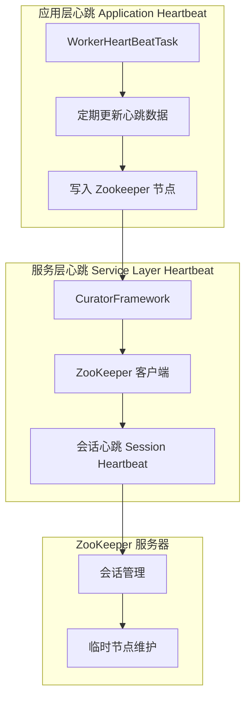
```mermaid
graph TB
    subgraph "应用层心跳 Application Heartbeat"
        A[WorkerHeartBeatTask]
        B[定期更新心跳数据]
        C[写入 Zookeeper 节点]
    end
    
    subgraph "服务层心跳 Service Layer Heartbeat"
        D[CuratorFramework]
        E[ZooKeeper 客户端]
        F[会话心跳 Session Heartbeat]
    end
    
    subgraph "ZooKeeper 服务器"
        G[会话管理]
        H[临时节点维护]
    end
    
    A --> B
    B --> C
    C --> D
    D --> E
    E --> F
    F --> G
    G --> H
```

### 4.2 应用层心跳（Application Heartbeat）

**定义**：应用层心跳是 DolphinScheduler 业务层面的心跳机制，用于定期更新服务的业务状态信息到注册中心。

**实现类**：[WorkerHeartBeatTask.java](dolphinscheduler-worker/src/main/java/org/apache/dolphinscheduler/server/worker/task/WorkerHeartBeatTask.java)

**心跳数据内容**：已在步骤 5 中详细说明

**写入逻辑**：[WorkerHeartBeatTask.java:86-106](dolphinscheduler-worker/src/main/java/org/apache/dolphinscheduler/server/worker/task/WorkerHeartBeatTask.java#L86-L106)

```java
@Override
public void writeHeartBeat(final WorkerHeartBeat workerHeartBeat) {
    final String failoverNodePath = RegistryUtils.getFailoveredNodePath(workerHeartBeat);
    if (registryClient.exists(failoverNodePath)) {
        log.warn("The worker: {} is under {}, means it has been failover will close myself",
                workerHeartBeat,
                failoverNodePath);
        registryClient
                .getStoppable()
                .stop("The worker exist: " + failoverNodePath + ", means it has been failover will close myself");
        return;
    }
    String workerHeartBeatJson = JSONUtils.toJsonString(workerHeartBeat);
    String workerRegistryPath = workerConfig.getWorkerRegistryPath();
    registryClient.persistEphemeral(workerRegistryPath, workerHeartBeatJson);
    WorkerServerMetrics.incWorkerHeartbeatCount();
    log.debug(
            "Success write worker group heartBeatInfo into registry, workerRegistryPath: {} workerHeartBeatInfo: {}",
            workerRegistryPath,
            workerHeartBeatJson);
}
```

**关键特性**：
- **故障转移检测**：每次写入前检查是否存在故障转移节点，如果存在则停止服务
- **持久化临时节点**：使用 `persistEphemeral` 更新节点数据

**心跳执行机制**：[BaseHeartBeatTask.java:60-105](dolphinscheduler-common/src/main/java/org/apache/dolphinscheduler/common/model/BaseHeartBeatTask.java#L60-L105)

**心跳执行机制**：[BaseHeartBeatTask.java:60-105](dolphinscheduler-common/src/main/java/org/apache/dolphinscheduler/common/model/BaseHeartBeatTask.java#L60-L105)

```java
@Override
public void run() {
    /**
     * 1. 为什么不会导致内存溢出和CPU飙高？
     *    a. CPU方面：
     *       - Thread.sleep(1000) 让线程每次循环休眠 1 秒，避免 while 循环空转占用 CPU
     *       - 如果没有 sleep，while 循环会空转，导致 CPU 使用率接近 100%（单核）
     *    b. 内存方面：
     *       - 每次循环都会调用 getHeartBeat() 创建新的 heartBeat 对象（局部变量）
     *       - 如果满足写入条件：heartBeat 赋值给 lastHeartBeat（成员变量），替换旧引用
     *       - 如果不满足条件：heartBeat 是局部变量，循环结束后变成垃圾对象，可被 GC 回收
     *       - 最多只有一个 heartBeat 对象存活（lastHeartBeat 指向的），不会有对象积累
     *       - Thread.sleep 降低了对象创建频率，给 GC 充分的回收时间
     * 
     * 2. 为什么 runningFlag=false 时线程会退出？
     *    a. while (runningFlag) 是条件循环，当 runningFlag 为 false 时循环条件不满足，循环退出
     *    b. 循环退出后，run() 方法执行完毕，线程结束
     *    c. shutdown() 方法会在服务器关闭时被调用（如 WorkerRegistryClient.close()），将 runningFlag 设置为 false
     *
     * 心跳线程模式：通过 sleep 控制 CPU 使用和对象创建频率，通过标志位实现优雅退出
     *
     * 定期写入：距离上次写入时间 >= heartBeatInterval（默认 10 秒）
     * 状态变化时立即写入：serverStatus 发生变化时立即写入
     */
    while (runningFlag) {
        try {
            T heartBeat = getHeartBeat();
            // if first time or heartBeat status changed, write heartBeatInfo into registry
            if (System.currentTimeMillis() - lastWriteTime >= heartBeatInterval
                    || !lastHeartBeat.getServerStatus().equals(heartBeat.getServerStatus())) {
                lastHeartBeat = heartBeat;
                writeHeartBeat(heartBeat);
                lastWriteTime = System.currentTimeMillis();
            }
        } catch (Exception ex) {
            log.error("{} task execute failed", threadName, ex);
        } finally {
            try {
                Thread.sleep(DEFAULT_HEARTBEAT_SCAN_INTERVAL); // 固定 1 秒扫描间隔
            } catch (InterruptedException e) {
                handleInterruptException(e);
            }
        }
    }
}
```

**关键特性**：
- **扫描间隔**：固定 1 秒（`DEFAULT_HEARTBEAT_SCAN_INTERVAL`）
- **写入间隔**：由配置决定（`workerConfig.getMaxHeartbeatInterval()`，默认 10 秒）
- **状态变化立即写入**：当服务状态从 NORMAL 变为 BUSY 或反之，立即写入，不等待间隔
- **故障转移检测**：每次写入前检查是否存在故障转移节点，如果存在则停止服务

### 4.3 服务层心跳（Service Layer Heartbeat）

**定义**：服务层心跳是 Zookeeper 客户端框架（CuratorFramework）与 Zookeeper 服务器之间的底层会话心跳，用于维持客户端会话的有效性。

**实现机制**：
- **CuratorFramework** 自动管理会话心跳
- **ZooKeeper 客户端** 定期向服务器发送心跳包（PING）
- **会话超时**：如果客户端在 `sessionTimeout` 时间内未发送心跳，服务器会认为会话失效

**配置位置**：[ZookeeperRegistry.java:115](dolphinscheduler-registry/dolphinscheduler-registry-plugins/dolphinscheduler-registry-zookeeper/src/main/java/org/apache/dolphinscheduler/plugin/registry/zookeeper/ZookeeperRegistry.java#L115)

```java
.sessionTimeoutMs(DurationUtils.toMillisInt(properties.getSessionTimeout())) // 默认 60 秒
```

**会话心跳机制**：
1. **自动发送**：CuratorFramework 内部线程自动发送心跳，无需应用层干预
2. **心跳间隔**：通常为 `sessionTimeout / 3`，例如 sessionTimeout=60s，心跳间隔约为 20s
3. **会话保持**：只要在 `sessionTimeout` 时间内收到心跳，会话就保持有效
4. **临时节点维护**：会话有效期间，临时节点保持存在；会话失效时，临时节点自动删除

### 4.4 服务层心跳与应用层心跳的关系

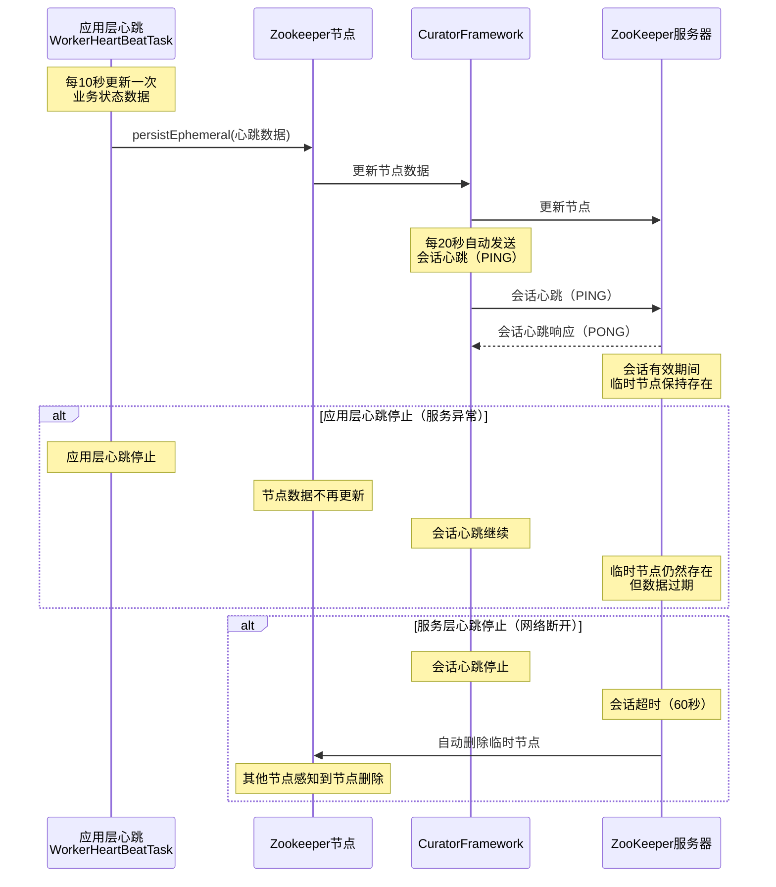
```mermaid
sequenceDiagram
    participant App as 应用层心跳<br/>WorkerHeartBeatTask
    participant ZK as Zookeeper节点
    participant CF as CuratorFramework
    participant ZKS as ZooKeeper服务器
    
    Note over App: 每10秒更新一次<br/>业务状态数据
    App->>ZK: persistEphemeral(心跳数据)
    ZK->>CF: 更新节点数据
    CF->>ZKS: 更新节点
    
    Note over CF: 每20秒自动发送<br/>会话心跳（PING）
    CF->>ZKS: 会话心跳（PING）
    ZKS-->>CF: 会话心跳响应（PONG）
    
    Note over ZKS: 会话有效期间<br/>临时节点保持存在
    
    alt 应用层心跳停止（服务异常）
        Note over App: 应用层心跳停止
        Note over ZK: 节点数据不再更新
        Note over CF: 会话心跳继续
        Note over ZKS: 临时节点仍然存在<br/>但数据过期
    end
    
    alt 服务层心跳停止（网络断开）
        Note over CF: 会话心跳停止
        Note over ZKS: 会话超时（60秒）
        ZKS->>ZK: 自动删除临时节点
        Note over ZK: 其他节点感知到节点删除
    end
```

**关系说明**：

1. **独立性**：
   - 应用层心跳和服务层心跳是**相互独立**的
   - 应用层心跳停止不影响服务层心跳
   - 服务层心跳停止会导致会话失效，临时节点被删除

2. **依赖关系**：
   - 应用层心跳**依赖**服务层心跳
   - 如果服务层心跳停止（连接断开），应用层心跳无法写入数据
   - 服务层心跳正常是应用层心跳正常工作的前提

3. **作用范围**：
   - **应用层心跳**：更新业务状态数据，供其他节点读取和判断
   - **服务层心跳**：维持会话有效性，保证临时节点存在

4. **故障检测**：
   - **应用层心跳超时**：其他节点可以通过读取心跳数据的 `reportTime` 判断服务是否正常
   - **服务层心跳超时**：Zookeeper 自动删除临时节点，其他节点立即感知服务下线

5. **配置关系**：
   - **应用层心跳间隔**：`worker.max-heartbeat-interval`（默认 10 秒）
   - **服务层心跳间隔**：自动计算，约为 `sessionTimeout / 3`（默认约 20 秒）
   - **会话超时**：`registry.zookeeper.session-timeout`（默认 60 秒）

**最佳实践**：
- 应用层心跳间隔应**小于**会话超时的 1/3，确保即使应用层心跳失败，服务层心跳仍能维持会话
- 例如：sessionTimeout=60s，应用层心跳间隔应 ≤ 20s（实际配置为 10s）

---

## 5. 连接状态监听与回调流程

### 5.1 连接状态监听概述

**连接状态监听**用于监听 Worker 与 Zookeeper 注册中心之间的连接状态变化，当连接状态发生变化时，会触发相应的回调处理。

**监听器注册位置**：[WorkerRegistryClient.java:81](dolphinscheduler-worker/src/main/java/org/apache/dolphinscheduler/server/worker/registry/WorkerRegistryClient.java#L81)

```java
registryClient.addConnectionStateListener(new WorkerConnectionStateListener(registryClient));
```

**关键点**：
- 监听器在服务注册成功后注册，确保连接已建立
- 监听器在整个服务生命周期内保持活跃，直到服务关闭

### 5.2 连接状态枚举

**连接状态定义**：[ConnectionState.java](dolphinscheduler-registry/dolphinscheduler-registry-api/src/main/java/org/apache/dolphinscheduler/registry/api/ConnectionState.java)

```java
public enum ConnectionState {
    CONNECTED,      // 首次连接成功或重新连接成功
    RECONNECTED,    // 从 SUSPENDED 状态恢复连接
    SUSPENDED,      // 连接挂起（网络临时中断，但会话未超时，可能自动恢复）
    DISCONNECTED    // 连接丢失（会话超时或长时间无法连接，需要重新建立会话）
}
```

### 5.3 Worker 连接状态监听器

**实现类**：[WorkerConnectionStateListener.java](dolphinscheduler-worker/src/main/java/org/apache/dolphinscheduler/server/worker/registry/WorkerConnectionStateListener.java)

```java
@Slf4j
public class WorkerConnectionStateListener implements ConnectionListener {

    private final RegistryClient registryClient;

    public WorkerConnectionStateListener(final RegistryClient registryClient) {
        this.registryClient = registryClient;
    }

    @Override
    public void onUpdate(ConnectionState state) {
        log.info("Worker received a {} event from registry, the current server state is {}", state,
                ServerLifeCycleManager.getServerStatus());
        switch (state) {
            case CONNECTED:
                // 连接成功，服务正常运行，无需特殊处理
                break;
            case SUSPENDED:
                // 连接挂起，网络临时中断但会话未超时，可能自动恢复，暂时不处理
                break;
            case RECONNECTED:
                // 从 SUSPENDED 状态恢复连接，会话仍然有效，记录日志
                log.warn("Worker reconnect to registry");
                break;
            case DISCONNECTED:
                // 连接丢失，会话超时或长时间无法连接，临时节点已被删除
                // 主动停止服务，避免提供不可靠的服务
                registryClient.getStoppable().stop("Worker disconnected from registry, will stop myself");
            default:
        }
    }
}
```

**状态处理逻辑**：

| 状态 | 含义 | 处理方式 |
|------|------|---------|
| CONNECTED | 首次连接成功或重新连接成功 | 无需处理，服务正常运行 |
| SUSPENDED | 网络临时中断，但会话未超时 | 不处理，等待自动恢复 |
| RECONNECTED | 从 SUSPENDED 状态恢复连接 | 记录日志，会话仍然有效 |
| DISCONNECTED | 连接丢失，会话超时 | **主动停止服务**，调用 `stop()` 方法 |

### 5.4 连接状态流转图

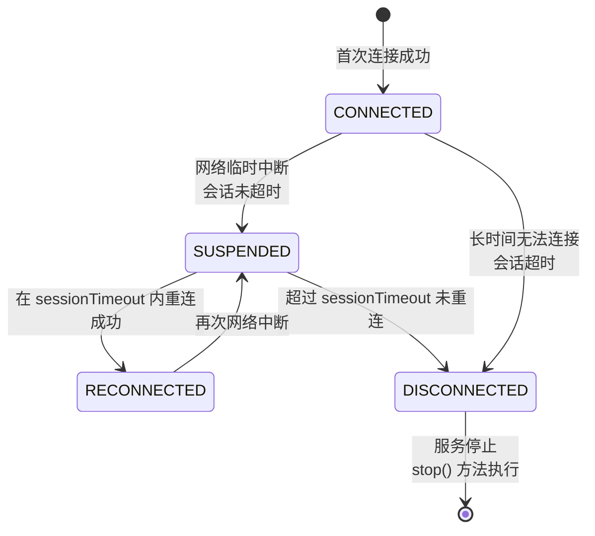
```mermaid
stateDiagram-v2
    [*] --> CONNECTED: 首次连接成功
    CONNECTED --> SUSPENDED: 网络临时中断<br/>会话未超时
    SUSPENDED --> RECONNECTED: 在 sessionTimeout 内重连成功
    SUSPENDED --> DISCONNECTED: 超过 sessionTimeout 未重连
    RECONNECTED --> SUSPENDED: 再次网络中断
    CONNECTED --> DISCONNECTED: 长时间无法连接<br/>会话超时
    DISCONNECTED --> [*]: 服务停止<br/>stop() 方法执行
```

### 5.5 连接状态监听回调流程

**完整回调流程时序图**：

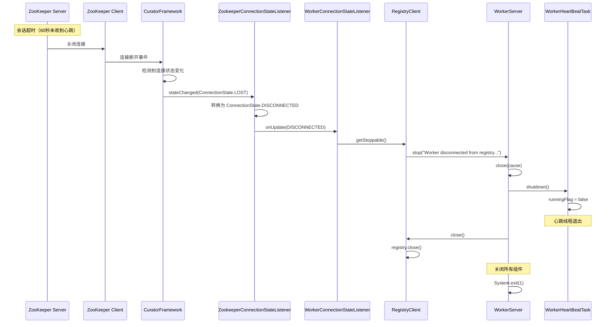
```mermaid
sequenceDiagram
    participant ZKS as ZooKeeper Server
    participant ZKC as ZooKeeper Client
    participant CF as CuratorFramework
    participant ZCSL as ZookeeperConnectionStateListener
    participant WCSL as WorkerConnectionStateListener
    participant RC as RegistryClient
    participant WS as WorkerServer
    participant WHT as WorkerHeartBeatTask
    
    Note over ZKS: 会话超时（60秒未收到心跳）
    ZKS->>ZKC: 关闭连接
    ZKC->>CF: 连接断开事件
    CF->>CF: 检测到连接状态变化
    CF->>ZCSL: stateChanged(ConnectionState.LOST)
    
    ZCSL->>ZCSL: 转换为 ConnectionState.DISCONNECTED
    ZCSL->>WCSL: onUpdate(DISCONNECTED)
    
    WCSL->>RC: getStoppable()
    RC->>WS: stop("Worker disconnected from registry...")
    
    WS->>WS: close(cause)
    WS->>WHT: shutdown()
    WHT->>WHT: runningFlag = false
    Note over WHT: 心跳线程退出
    
    WS->>RC: close()
    RC->>RC: registry.close()
    Note over WS: 关闭所有组件
    
    WS->>WS: System.exit(1)
```

**回调链路说明**：

1. **Zookeeper 服务器层**：
   - Zookeeper 服务器检测到会话超时（默认 60 秒未收到心跳）
   - 服务器关闭连接并删除临时节点

2. **Zookeeper 客户端层**：
   - ZooKeeper Client 检测到连接断开
   - 通知 CuratorFramework 连接状态变化

3. **CuratorFramework 层**：
   - CuratorFramework 检测到连接状态变化（`ConnectionState.LOST`）
   - 调用所有注册的连接状态监听器

4. **适配器层**（ZookeeperConnectionStateListener）：
   - 代码位置：[ZookeeperConnectionStateListener.java:37-60](dolphinscheduler-registry/dolphinscheduler-registry-plugins/dolphinscheduler-registry-zookeeper/src/main/java/org/apache/dolphinscheduler/plugin/registry/zookeeper/ZookeeperConnectionStateListener.java#L37-L60)
   - 将 Curator 的连接状态转换为统一的 `ConnectionState` 枚举
   - 调用应用层监听器的 `onUpdate()` 方法

5. **应用层监听器**（WorkerConnectionStateListener）：
   - 代码位置：[WorkerConnectionStateListener.java:36-52](dolphinscheduler-worker/src/main/java/org/apache/dolphinscheduler/server/worker/registry/WorkerConnectionStateListener.java#L36-L52)
   - 根据连接状态执行相应的处理逻辑
   - 当状态为 `DISCONNECTED` 时，调用 `RegistryClient.getStoppable().stop()` 停止服务

6. **服务停止流程**：
   - `WorkerServer.stop()` → [WorkerServer.java:134-141](dolphinscheduler-worker/src/main/java/org/apache/dolphinscheduler/server/worker/WorkerServer.java#L134-L141)
   - `WorkerServer.close()` → [WorkerServer.java:115-132](dolphinscheduler-worker/src/main/java/org/apache/dolphinscheduler/server/worker/WorkerServer.java#L115-L132)
   - 关闭心跳任务、RPC 服务、注册客户端等所有组件
   - 调用 `System.exit(1)` 退出进程

### 5.6 不同状态的回调处理详解

#### 5.6.1 CONNECTED 状态

**触发时机**：
- 首次连接成功
- 从 DISCONNECTED 状态重新连接成功

**处理逻辑**：
- 无需特殊处理，服务正常运行
- 临时节点已创建或恢复，心跳正常发送

**代码位置**：[WorkerConnectionStateListener.java:41-42](dolphinscheduler-worker/src/main/java/org/apache/dolphinscheduler/server/worker/registry/WorkerConnectionStateListener.java#L41-L42)

```java
case CONNECTED:
    break; // 无需处理
```

#### 5.6.2 SUSPENDED 状态

**触发时机**：
- 网络临时中断，但会话未超时
- 可能自动恢复

**处理逻辑**：
- 不处理，等待自动恢复
- 会话仍然有效，临时节点仍然存在

**代码位置**：[WorkerConnectionStateListener.java:43-44](dolphinscheduler-worker/src/main/java/org/apache/dolphinscheduler/server/worker/registry/WorkerConnectionStateListener.java#L43-L44)

```java
case SUSPENDED:
    break; // 不处理，等待自动恢复
```

#### 5.6.3 RECONNECTED 状态

**触发时机**：
- 从 SUSPENDED 状态恢复连接
- 在 `sessionTimeout` 时间内重连成功

**处理逻辑**：
- 记录日志
- 会话仍然有效，临时节点未删除，服务继续正常运行

**代码位置**：[WorkerConnectionStateListener.java:45-47](dolphinscheduler-worker/src/main/java/org/apache/dolphinscheduler/server/worker/registry/WorkerConnectionStateListener.java#L45-L47)

```java
case RECONNECTED:
    log.warn("Worker reconnect to registry");
    break;
```

#### 5.6.4 DISCONNECTED 状态

**触发时机**：
- 会话超时（默认 60 秒未收到心跳）
- 网络长时间中断，超过 `sessionTimeout` 时间
- Zookeeper 服务器主动关闭连接

**处理逻辑**：
- **主动停止服务**，调用 `RegistryClient.getStoppable().stop()` 方法
- 临时节点已被 Zookeeper 服务器自动删除
- 其他节点已感知到服务下线

**代码位置**：[WorkerConnectionStateListener.java:48-49](dolphinscheduler-worker/src/main/java/org/apache/dolphinscheduler/server/worker/registry/WorkerConnectionStateListener.java#L48-L49)

```java
case DISCONNECTED:
    registryClient.getStoppable().stop("Worker disconnected from registry, will stop myself");
```

**停止服务流程**：

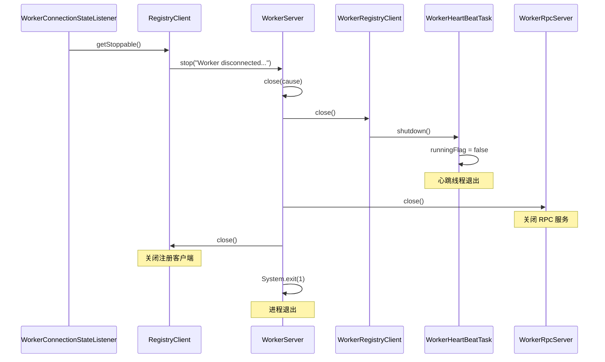
```mermaid
sequenceDiagram
    participant WCSL as WorkerConnectionStateListener
    participant RC as RegistryClient
    participant WS as WorkerServer
    participant WRC as WorkerRegistryClient
    participant WHT as WorkerHeartBeatTask
    participant WRPC as WorkerRpcServer
    
    WCSL->>RC: getStoppable()
    RC->>WS: stop("Worker disconnected...")
    
    WS->>WS: close(cause)
    
    WS->>WRC: close()
    WRC->>WHT: shutdown()
    WHT->>WHT: runningFlag = false
    Note over WHT: 心跳线程退出
    
    WS->>WRPC: close()
    Note over WRPC: 关闭 RPC 服务
    
    WS->>RC: close()
    Note over RC: 关闭注册客户端
    
    WS->>WS: System.exit(1)
    Note over WS: 进程退出
```

**为什么需要主动停止服务**：

1. **状态一致性**：
   - 临时节点已被删除，其他节点已感知服务下线
   - 如果服务继续运行，可能导致状态不一致

2. **避免资源浪费**：
   - 服务已无法与注册中心通信，无法接收新任务
   - 继续运行会占用系统资源

3. **快速故障恢复**：
   - 主动停止后，可以通过外部监控（如 Kubernetes、systemd）自动重启
   - 重启后重新注册到注册中心

### 5.7 状态监听器注册链路

**完整注册链路时序图**：

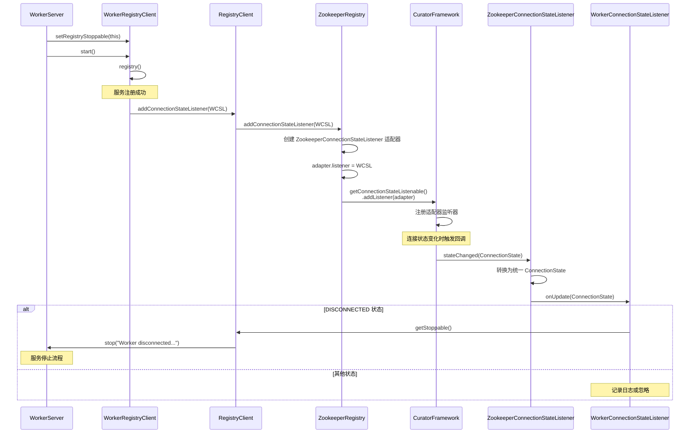
```mermaid
sequenceDiagram
    participant WS as WorkerServer
    participant WRC as WorkerRegistryClient
    participant RC as RegistryClient
    participant ZR as ZookeeperRegistry
    participant CF as CuratorFramework
    participant ZCSL as ZookeeperConnectionStateListener
    participant WCSL as WorkerConnectionStateListener
    
    WS->>WRC: setRegistryStoppable(this)
    WS->>WRC: start()
    
    WRC->>WRC: registry()
    Note over WRC: 服务注册成功
    
    WRC->>RC: addConnectionStateListener(WCSL)
    RC->>ZR: addConnectionStateListener(WCSL)
    
    ZR->>ZR: 创建 ZookeeperConnectionStateListener 适配器
    ZR->>ZR: adapter.listener = WCSL
    
    ZR->>CF: getConnectionStateListenable()<br/>.addListener(adapter)
    CF->>CF: 注册适配器监听器
    
        Note over CF: 连接状态变化时触发回调
    
    CF->>ZCSL: stateChanged(ConnectionState)
    ZCSL->>ZCSL: 转换为统一 ConnectionState
    ZCSL->>WCSL: onUpdate(ConnectionState)
    
    alt DISCONNECTED 状态
        WCSL->>RC: getStoppable()
        RC->>WS: stop("Worker disconnected...")
        Note over WS: 服务停止流程
    else 其他状态
        Note over WCSL: 记录日志或忽略
    end
```

**代码实现位置**：

1. **WorkerRegistryClient 注册监听器**：[WorkerRegistryClient.java:81](dolphinscheduler-worker/src/main/java/org/apache/dolphinscheduler/server/worker/registry/WorkerRegistryClient.java#L81)

```java
registryClient.addConnectionStateListener(new WorkerConnectionStateListener(registryClient));
```

2. **ZookeeperRegistry 添加监听器**：[ZookeeperRegistry.java:199](dolphinscheduler-registry/dolphinscheduler-registry-plugins/dolphinscheduler-registry-zookeeper/src/main/java/org/apache/dolphinscheduler/plugin/registry/zookeeper/ZookeeperRegistry.java#L199)

```java
@Override
public void addConnectionStateListener(ConnectionListener listener) {
    client.getConnectionStateListenable().addListener(
        new ZookeeperConnectionStateListener(listener));
}
```

3. **ZookeeperConnectionStateListener 适配器**：[ZookeeperConnectionStateListener.java:37-60](dolphinscheduler-registry/dolphinscheduler-registry-plugins/dolphinscheduler-registry-zookeeper/src/main/java/org/apache/dolphinscheduler/plugin/registry/zookeeper/ZookeeperConnectionStateListener.java#L37-L60)

```java
@Override
public void stateChanged(CuratorFramework client,
                         org.apache.curator.framework.state.ConnectionState newState) {
    switch (newState) {
        case CONNECTED:
            listener.onUpdate(ConnectionState.CONNECTED);
            break;
        case LOST:
            listener.onUpdate(ConnectionState.DISCONNECTED);
            break;
        case RECONNECTED:
            listener.onUpdate(ConnectionState.RECONNECTED);
            break;
        case SUSPENDED:
            listener.onUpdate(ConnectionState.SUSPENDED);
            break;
    }
}
```

4. **WorkerConnectionStateListener 处理回调**：[WorkerConnectionStateListener.java:36-52](dolphinscheduler-worker/src/main/java/org/apache/dolphinscheduler/server/worker/registry/WorkerConnectionStateListener.java#L36-L52)

```java
@Override
public void onUpdate(ConnectionState state) {
    log.info("Worker received a {} event from registry, the current server state is {}", 
            state, ServerLifeCycleManager.getServerStatus());
    switch (state) {
        case CONNECTED:
            break;
        case SUSPENDED:
            break;
        case RECONNECTED:
            log.warn("Worker reconnect to registry");
            break;
        case DISCONNECTED:
            registryClient.getStoppable().stop("Worker disconnected from registry, will stop myself");
        default:
    }
}
```

**监听器注册的关键点**：

1. **适配器模式**：`ZookeeperConnectionStateListener` 作为适配器，将 Curator 的连接状态转换为 DolphinScheduler 统一的 `ConnectionState` 枚举
2. **注册时机**：在服务注册成功后注册监听器，确保不会错过后续的状态变化
3. **链式调用**：状态变化通过监听器链从底层（CuratorFramework）传递到应用层（WorkerConnectionStateListener）

---

## 6. CuratorFramework 架构

### 6.1 CuratorFramework 简介

**CuratorFramework** 是 Apache Curator 提供的 Zookeeper 客户端高级封装框架，提供了比原生 Zookeeper 客户端更易用、更可靠的 API。

**核心特性**：
- **自动重连**：连接断开后自动重连
- **会话管理**：自动管理会话生命周期
- **重试策略**：提供多种重试策略（指数退避、固定间隔等）
- **高级功能**：分布式锁、选举、缓存等
- **连接状态监听**：提供连接状态变化通知

**在 DolphinScheduler 中的使用**：
- **封装位置**：[ZookeeperRegistry.java:64](dolphinscheduler-registry/dolphinscheduler-registry-plugins/dolphinscheduler-registry-zookeeper/src/main/java/org/apache/dolphinscheduler/plugin/registry/zookeeper/ZookeeperRegistry.java#L64)
- **初始化位置**：[ZookeeperRegistry.java:76-136](dolphinscheduler-registry/dolphinscheduler-registry-plugins/dolphinscheduler-registry-zookeeper/src/main/java/org/apache/dolphinscheduler/plugin/registry/zookeeper/ZookeeperRegistry.java#L76-L136)

### 6.2 CuratorFramework 初始化

**初始化流程**：

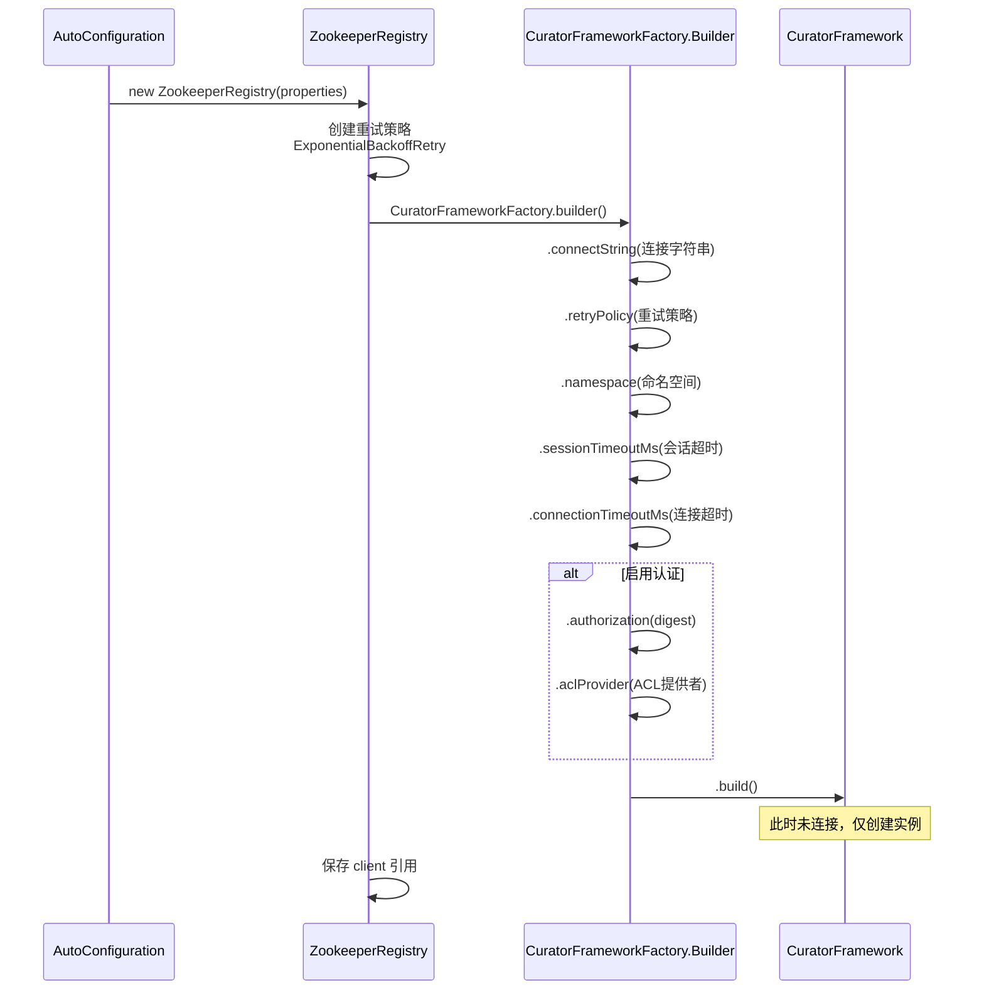
```mermaid
sequenceDiagram
    participant AC as AutoConfiguration
    participant ZR as ZookeeperRegistry
    participant CFB as CuratorFrameworkFactory.Builder
    participant CF as CuratorFramework
    
    AC->>ZR: new ZookeeperRegistry(properties)
    ZR->>ZR: 创建重试策略<br/>ExponentialBackoffRetry
    ZR->>CFB: CuratorFrameworkFactory.builder()
    CFB->>CFB: .connectString(连接字符串)
    CFB->>CFB: .retryPolicy(重试策略)
    CFB->>CFB: .namespace(命名空间)
    CFB->>CFB: .sessionTimeoutMs(会话超时)
    CFB->>CFB: .connectionTimeoutMs(连接超时)
    alt 启用认证
        CFB->>CFB: .authorization(digest)
        CFB->>CFB: .aclProvider(ACL提供者)
    end
    CFB->>CF: .build()
    Note over CF: 此时未连接，仅创建实例
    ZR->>ZR: 保存 client 引用
```

**初始化代码**：[ZookeeperRegistry.java:76-136](dolphinscheduler-registry/dolphinscheduler-registry-plugins/dolphinscheduler-registry-zookeeper/src/main/java/org/apache/dolphinscheduler/plugin/registry/zookeeper/ZookeeperRegistry.java#L76-L136)

```java
ZookeeperRegistry(ZookeeperRegistryProperties registryProperties) {
    properties = registryProperties.getZookeeper();
    
    // 1. 创建指数退避重试策略
    final ExponentialBackoffRetry retryPolicy = new ExponentialBackoffRetry(
            (int) properties.getRetryPolicy().getBaseSleepTime().toMillis(),  // 默认 1 秒
            properties.getRetryPolicy().getMaxRetries(),                      // 默认 3 次
            (int) properties.getRetryPolicy().getMaxSleep().toMillis());    // 默认 3 秒
    
    // 2. 构建 CuratorFramework 实例
    CuratorFrameworkFactory.Builder builder =
            CuratorFrameworkFactory.builder()
                    .connectString(properties.getConnectString())           // 连接字符串
                    .retryPolicy(retryPolicy)                               // 重试策略
                    .namespace(properties.getNamespace())                    // 命名空间（默认 dolphinscheduler）
                    .sessionTimeoutMs(DurationUtils.toMillisInt(properties.getSessionTimeout()))  // 会话超时（默认 60 秒）
                    .connectionTimeoutMs(DurationUtils.toMillisInt(properties.getConnectionTimeout())); // 连接超时（默认 15 秒）
    
    // 3. 如果启用认证，配置 ACL
    final String digest = properties.getDigest();
    if (!Strings.isNullOrEmpty(digest)) {
        builder.authorization("digest", digest.getBytes(StandardCharsets.UTF_8))
                .aclProvider(new ACLProvider() {
                    @Override
                    public List<ACL> getDefaultAcl() {
                        return ZooDefs.Ids.CREATOR_ALL_ACL;
                    }
                    @Override
                    public List<ACL> getAclForPath(final String path) {
                        return ZooDefs.Ids.CREATOR_ALL_ACL;
                    }
                });
    }
    
    // 4. 构建实例（此时未连接）
    client = builder.build();
}
```

**重试策略详解**：

| 重试次数 | 计算公式 | 计算值 | 实际等待时间 | 说明 |
|---------|---------|--------|------------|------|
| 第1次重试 | 1000ms × 2⁰ = 1000ms | 1000ms | 1秒 | 初始等待时间 |
| 第2次重试 | 1000ms × 2¹ = 2000ms | 2000ms | 2秒 | 指数增长 |
| 第3次重试 | 1000ms × 2² = 4000ms | 4000ms | 3秒 | 达到 maxSleep，被限制为 3秒 |
| 第4次重试 | - | - | 3秒 | 继续保持 maxSleep |

**公式**：`waitTime = baseSleepTime × 2^(retryCount-1)`  
**限制**：`实际等待时间 = min(计算值, maxSleepMs)`

### 6.3 连接建立

**启动流程**：[ZookeeperRegistry.java:142-162](dolphinscheduler-registry/dolphinscheduler-registry-plugins/dolphinscheduler-registry-zookeeper/src/main/java/org/apache/dolphinscheduler/plugin/registry/zookeeper/ZookeeperRegistry.java#L142-L162)

```java
@Override
public void start() {
    final StopWatch stopWatch = StopWatch.createStarted();
    // 异步非阻塞调用，后台开始连接过程，不会等待连接成功就返回
    client.start();
    try {
        // 同步等待连接建立，最多等待 blockUntilConnected 时间
        if (!client.blockUntilConnected(DurationUtils.toMillisInt(properties.getBlockUntilConnected()),
                MILLISECONDS)) {
            client.close();
            throw new RegistryException(
                    "zookeeper connect failed to: " + properties.getConnectString() + " in : "
                            + properties.getBlockUntilConnected() + "ms");
        }
        stopWatch.stop();
        log.info("ZookeeperRegistry started at: {}/ms", stopWatch.getTime());
    } catch (InterruptedException e) {
        Thread.currentThread().interrupt();
        throw new RegistryException("Zookeeper registry start failed", e);
    }
}
```

**连接建立时序图**：

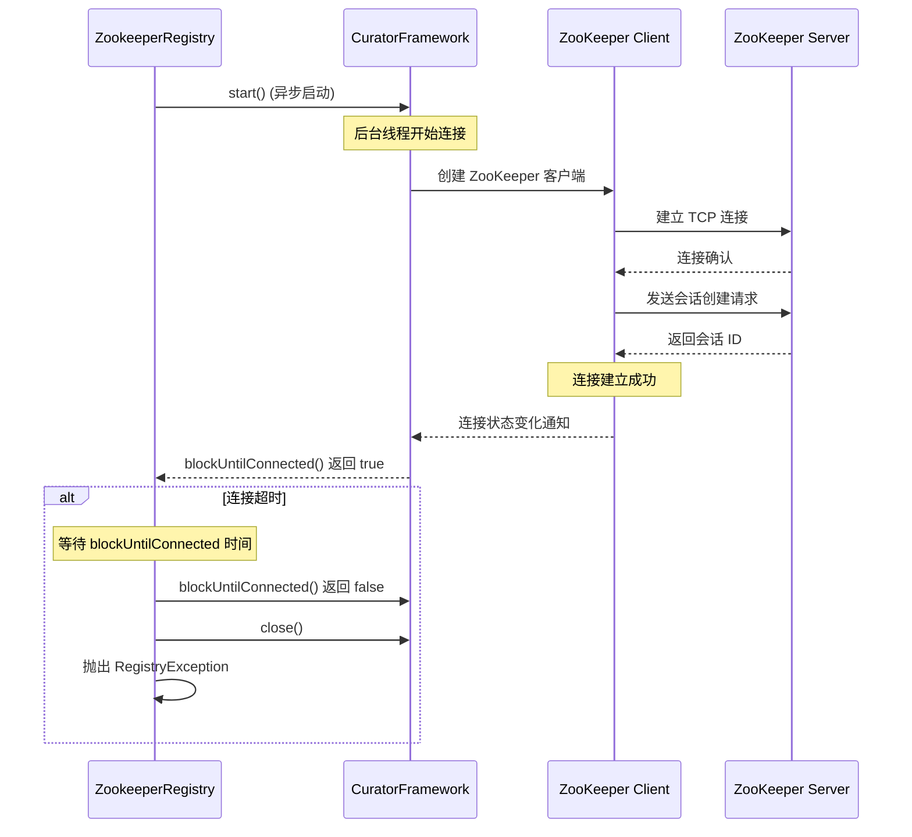
```mermaid
sequenceDiagram
    participant ZR as ZookeeperRegistry
    participant CF as CuratorFramework
    participant ZKC as ZooKeeper Client
    participant ZKS as ZooKeeper Server
    
    ZR->>CF: start() (异步启动)
    Note over CF: 后台线程开始连接
    CF->>ZKC: 创建 ZooKeeper 客户端
    ZKC->>ZKS: 建立 TCP 连接
    ZKS-->>ZKC: 连接确认
    ZKC->>ZKS: 发送会话创建请求
    ZKS-->>ZKC: 返回会话 ID
    Note over ZKC: 连接建立成功
    ZKC-->>CF: 连接状态变化通知
    CF-->>ZR: blockUntilConnected() 返回 true
    
    alt 连接超时
        Note over ZR: 等待 blockUntilConnected 时间
        ZR->>CF: blockUntilConnected() 返回 false
        ZR->>CF: close()
        ZR->>ZR: 抛出 RegistryException
    end
```

**关键配置**：
- **连接超时**：`connectionTimeout`（默认 15 秒）- 建立 TCP 连接的最大等待时间
- **阻塞等待时间**：`blockUntilConnected`（默认 15 秒）- 等待连接建立的最大时间
- **会话超时**：`sessionTimeout`（默认 60 秒）- 会话保持的有效时间

### 6.4 会话管理

**会话（Session）** 是 Zookeeper 客户端与服务器之间的逻辑连接，用于标识客户端身份和维持连接状态。

**会话特性**：
- **唯一标识**：每个会话有唯一的会话 ID（Session ID）
- **超时机制**：如果客户端在 `sessionTimeout` 时间内未发送心跳，会话失效
- **临时节点绑定**：临时节点与会话绑定，会话失效时临时节点自动删除
- **自动重连**：连接断开后，如果在 `sessionTimeout` 时间内重连，会话仍然有效

**会话状态流转图**：

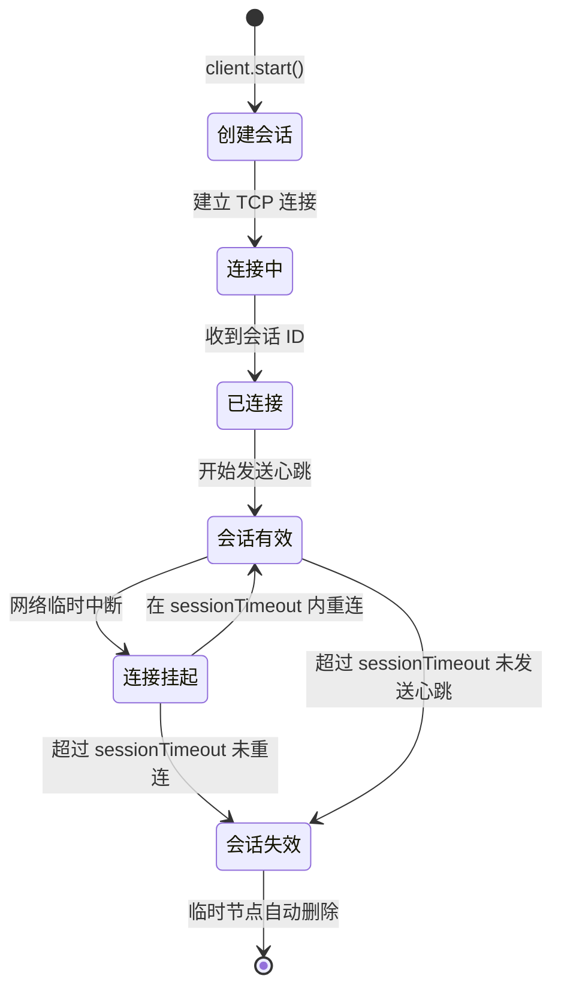
```mermaid
stateDiagram-v2
    [*] --> 创建会话: client.start()
    创建会话 --> 连接中: 建立 TCP 连接
    连接中 --> 已连接: 收到会话 ID
    已连接 --> 会话有效: 开始发送心跳
    会话有效 --> 连接挂起: 网络临时中断
    连接挂起 --> 会话有效: 在 sessionTimeout 内重连
    连接挂起 --> 会话失效: 超过 sessionTimeout 未重连
    会话有效 --> 会话失效: 超过 sessionTimeout 未发送心跳
    会话失效 --> [*]: 临时节点自动删除
```

**会话管理代码位置**：
- **会话超时配置**：[ZookeeperRegistry.java:115](dolphinscheduler-registry/dolphinscheduler-registry-plugins/dolphinscheduler-registry-zookeeper/src/main/java/org/apache/dolphinscheduler/plugin/registry/zookeeper/ZookeeperRegistry.java#L115)
- **会话状态监听**：[ZookeeperConnectionStateListener.java:37-60](dolphinscheduler-registry/dolphinscheduler-registry-plugins/dolphinscheduler-registry-zookeeper/src/main/java/org/apache/dolphinscheduler/plugin/registry/zookeeper/ZookeeperConnectionStateListener.java#L37-L60)

### 6.5 心跳机制

**服务层心跳（Session Heartbeat）** 是 CuratorFramework 自动管理的底层心跳机制，用于维持 Zookeeper 会话的有效性。

**心跳机制详解**：

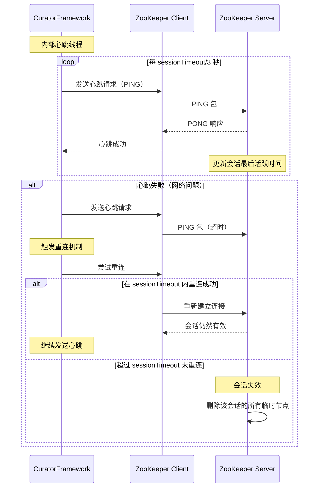
```mermaid
sequenceDiagram
    participant CF as CuratorFramework
    participant ZKC as ZooKeeper Client
    participant ZKS as ZooKeeper Server
    
    Note over CF: 内部心跳线程
    loop 每 sessionTimeout/3 秒
        CF->>ZKC: 发送心跳请求（PING）
        ZKC->>ZKS: PING 包
        ZKS-->>ZKC: PONG 响应
        ZKC-->>CF: 心跳成功
        Note over ZKS: 更新会话最后活跃时间
    end
    
    alt 心跳失败（网络问题）
        CF->>ZKC: 发送心跳请求
        ZKC->>ZKS: PING 包（超时）
        Note over CF: 触发重连机制
        CF->>ZKC: 尝试重连
        alt 在 sessionTimeout 内重连成功
            ZKC->>ZKS: 重新建立连接
            ZKS-->>ZKC: 会话仍然有效
            Note over CF: 继续发送心跳
        else 超过 sessionTimeout 未重连
            Note over ZKS: 会话失效
            ZKS->>ZKS: 删除该会话的所有临时节点
        end
    end
```

**心跳参数**：
- **心跳间隔**：自动计算，通常为 `sessionTimeout / 3`
   - 例如：`sessionTimeout = 60s`，心跳间隔约为 `20s`
- **会话超时**：`sessionTimeout`（默认 60 秒）
   - 如果 `sessionTimeout` 时间内未收到心跳，会话失效
- **心跳线程**：CuratorFramework 内部线程自动管理，无需应用层干预

**心跳与临时节点的关系**：
- **会话有效**：临时节点存在
- **会话失效**：临时节点自动删除
- **其他节点感知**：通过监听临时节点的删除事件，立即感知服务下线

---

## 7. 异常处理机制

### 7.1 异常场景分类

**异常场景**：

1. **连接断开**：网络中断、Zookeeper 服务器故障
2. **会话超时**：长时间未发送心跳，会话失效
3. **故障转移**：其他节点检测到当前节点异常，标记为故障转移
4. **负载过高**：服务负载过高，无法正常提供服务

### 7.2 异常处理流程

**异常处理流程图**：

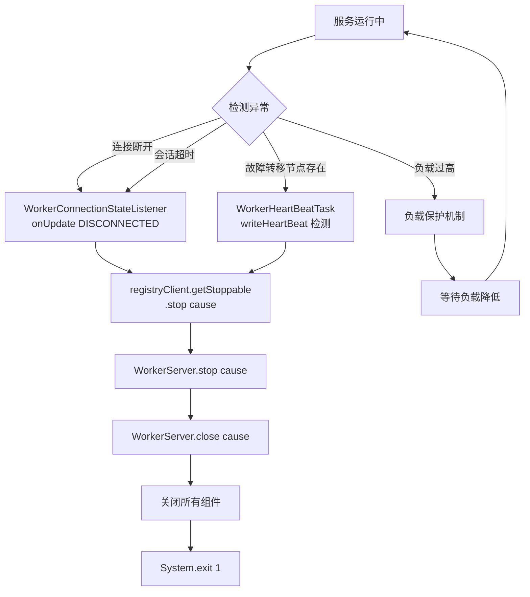
```mermaid
flowchart TD
    A[服务运行中] --> B{检测异常}
    B -->|连接断开| C[WorkerConnectionStateListener<br/>onUpdate DISCONNECTED]
    B -->|会话超时| C
    B -->|故障转移节点存在| D[WorkerHeartBeatTask<br/>writeHeartBeat 检测]
    B -->|负载过高| E[负载保护机制]
    
    C --> F[registryClient.getStoppable<br/>.stop cause]
    D --> F
    E --> G[等待负载降低]
    G --> A
    
    F --> H[WorkerServer.stop cause]
    H --> I[WorkerServer.close cause]
    I --> J[关闭所有组件]
    J --> K[System.exit 1]
```

### 7.3 连接断开处理

**处理代码**：[WorkerConnectionStateListener.java:48-49](dolphinscheduler-worker/src/main/java/org/apache/dolphinscheduler/server/worker/registry/WorkerConnectionStateListener.java#L48-L49)

```java
case DISCONNECTED:
    registryClient.getStoppable().stop("Worker disconnected from registry, will stop myself");
```

**处理流程**：
1. **检测断开**：CuratorFramework 检测到连接断开
2. **状态通知**：通过监听器链通知应用层
3. **主动停止**：调用 `WorkerServer.stop()` 主动停止服务
4. **资源清理**：关闭所有组件，释放资源
5. **进程退出**：调用 `System.exit(1)` 确保进程退出

### 7.4 故障转移检测

**检测代码**：[WorkerHeartBeatTask.java:88-96](dolphinscheduler-worker/src/main/java/org/apache/dolphinscheduler/server/worker/task/WorkerHeartBeatTask.java#L88-L96)

```java
@Override
public void writeHeartBeat(final WorkerHeartBeat workerHeartBeat) {
    final String failoverNodePath = RegistryUtils.getFailoveredNodePath(workerHeartBeat);
    if (registryClient.exists(failoverNodePath)) {
        log.warn("The worker: {} is under {}, means it has been failover will close myself",
                workerHeartBeat, failoverNodePath);
        registryClient.getStoppable()
                .stop("The worker exist: " + failoverNodePath + ", means it has been failover will close myself");
        return;
    }
    // ... 继续写入心跳
}
```

**检测流程**：
1. **检查故障转移节点**：每次写入心跳前检查是否存在故障转移节点
2. **节点路径**：`/dolphinscheduler/failover-finish-nodes/worker/{host}:{port}`
3. **如果存在**：说明已被其他节点标记为故障转移，主动停止服务
4. **停止服务**：调用 `WorkerServer.stop()` 停止服务

### 7.5 负载过高处理

**处理代码**：[WorkerRegistryClient.java:89-93](dolphinscheduler-worker/src/main/java/org/apache/dolphinscheduler/server/worker/registry/WorkerRegistryClient.java#L89-L93)

```java
while (ServerStatus.BUSY.equals(workerHeartBeat.getServerStatus())) {
    log.warn("Worker node is BUSY: {}", workerHeartBeat);
    workerHeartBeat = workerHeartBeatTask.getHeartBeat();
    Thread.sleep(SLEEP_TIME_MILLIS);
}
```

**处理流程**：
1. **注册前检查**：在注册到注册中心前检查服务负载状态
2. **等待负载降低**：如果服务处于 BUSY 状态，等待直到状态变为 NORMAL
3. **避免高负载注册**：避免在高负载时注册到注册中心，影响集群稳定性

**负载判断逻辑**：[WorkerHeartBeatTask.java:108-116](dolphinscheduler-worker/src/main/java/org/apache/dolphinscheduler/server/worker/task/WorkerHeartBeatTask.java#L108-L116)

```java
private ServerStatus getServerStatus(SystemMetrics systemMetrics,
                                     WorkerConfig workerConfig,
                                     ITaskExecutorContainer taskExecutorContainer) {
    if (taskExecutorContainer.slotUsage() == 1) {
        return ServerStatus.BUSY;
    }
    WorkerServerLoadProtection serverLoadProtection = workerConfig.getServerLoadProtection();
    return serverLoadProtection.isOverload(systemMetrics) ? ServerStatus.BUSY : ServerStatus.NORMAL;
}
```

**负载判断逻辑说明**：

1. **线程池使用率检查**：
   - 如果 `taskExecutorContainer.slotUsage() == 1`，表示线程池已满（使用率 100%）
   - 直接返回 `ServerStatus.BUSY`，避免接受新任务

2. **系统负载保护检查**：
   - 通过 `WorkerServerLoadProtection.isOverload()` 检查系统负载
   - 检查的指标包括：
      - **系统 CPU 使用率**：`max-system-cpu-usage-percentage-thresholds`（默认 0.9，即 90%）
      - **JVM CPU 使用率**：`max-jvm-cpu-usage-percentage-thresholds`（默认 0.9，即 90%）
      - **系统内存使用率**：`max-system-memory-usage-percentage-thresholds`（默认 0.9，即 90%）
      - **磁盘使用率**：`max-disk-usage-percentage-thresholds`（默认 0.9，即 90%）
   - 如果任一指标超过阈值，返回 `ServerStatus.BUSY`

3. **负载保护配置**：
   - 配置位置：[application.yaml:51-61](dolphinscheduler-worker/src/main/resources/application.yaml#L51-L61)
   - `server-load-protection.enabled`：是否启用负载保护（默认 true）
   - 如果 `enabled=false`，负载保护检查始终返回 `false`（不超载）

**负载保护实现**：[WorkerServerLoadProtection.java](dolphinscheduler-worker/src/main/java/org/apache/dolphinscheduler/server/worker/config/WorkerServerLoadProtection.java)

```java
@Slf4j
public class WorkerServerLoadProtection extends BaseServerLoadProtection {
    // 继承 BaseServerLoadProtection 的负载保护逻辑
}
```

**BaseServerLoadProtection 负载检查逻辑**：

- 检查系统 CPU、JVM CPU、系统内存、磁盘使用率是否超过配置的阈值
- 如果任一指标超过阈值，返回 `true`（超载）
- 如果所有指标都在阈值内，返回 `false`（正常）

**负载状态流转图**：

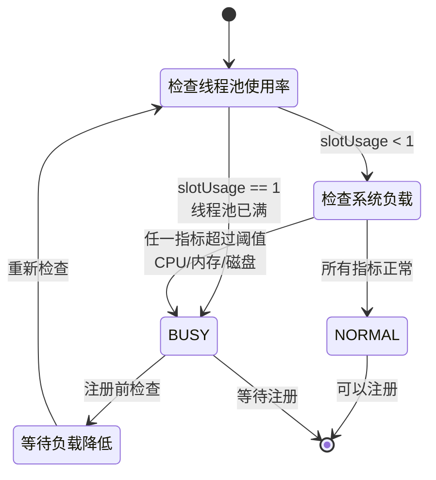
```mermaid
stateDiagram-v2
    [*] --> 检查线程池使用率
    检查线程池使用率 --> BUSY: slotUsage == 1<br/>线程池已满
    检查线程池使用率 --> 检查系统负载: slotUsage < 1
    
    检查系统负载 --> BUSY: 任一指标超过阈值<br/>CPU/内存/磁盘
    检查系统负载 --> NORMAL: 所有指标正常
    
    BUSY --> 等待负载降低: 注册前检查
    等待负载降低 --> 检查线程池使用率: 重新检查
    
    NORMAL --> [*]: 可以注册
    BUSY --> [*]: 等待注册
```

---

## 8. 异常处理机制

### 8.1 异常场景分类

**Worker 服务注册过程中可能遇到的异常场景**：

1. **连接断开**：网络中断、Zookeeper 服务器故障
2. **会话超时**：长时间未发送心跳，会话失效
3. **故障转移**：其他节点检测到当前节点异常，标记为故障转移
4. **负载过高**：服务负载过高，无法正常提供服务
5. **注册验证失败**：注册后验证节点存在失败

### 8.2 异常处理流程

**异常处理流程图**：

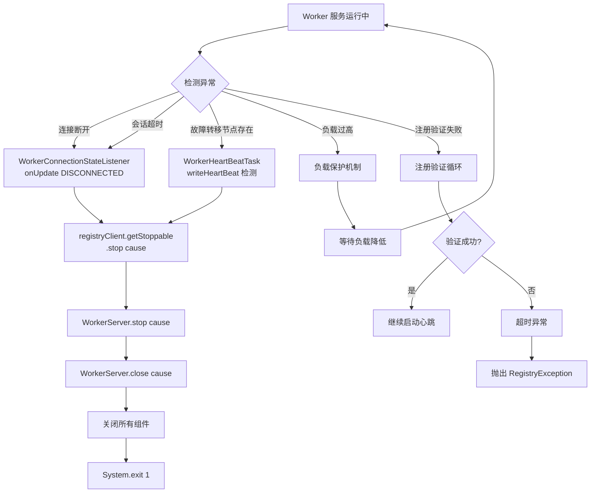
```mermaid
flowchart TD
    A[Worker 服务运行中] --> B{检测异常}
    B -->|连接断开| C[WorkerConnectionStateListener<br/>onUpdate DISCONNECTED]
    B -->|会话超时| C
    B -->|故障转移节点存在| D[WorkerHeartBeatTask<br/>writeHeartBeat 检测]
    B -->|负载过高| E[负载保护机制]
    B -->|注册验证失败| F[注册验证循环]
    
    C --> G[registryClient.getStoppable<br/>.stop cause]
    D --> G
    E --> H[等待负载降低]
    H --> A
    F --> I{验证成功?}
    I -->|是| J[继续启动心跳]
    I -->|否| K[超时异常]
    K --> L[抛出 RegistryException]
    
    G --> M[WorkerServer.stop cause]
    M --> N[WorkerServer.close cause]
    N --> O[关闭所有组件]
    O --> P[System.exit 1]
```

### 8.3 连接断开处理

**处理代码**：[WorkerConnectionStateListener.java:48-49](dolphinscheduler-worker/src/main/java/org/apache/dolphinscheduler/server/worker/registry/WorkerConnectionStateListener.java#L48-L49)

```java
case DISCONNECTED:
    registryClient.getStoppable().stop("Worker disconnected from registry, will stop myself");
```

**处理流程**：
1. **检测断开**：CuratorFramework 检测到连接断开
2. **状态通知**：通过监听器链通知应用层
3. **主动停止**：调用 `WorkerServer.stop()` 主动停止服务
4. **资源清理**：关闭所有组件，释放资源
5. **进程退出**：调用 `System.exit(1)` 确保进程退出

### 8.4 故障转移检测

**检测代码**：[WorkerHeartBeatTask.java:87-96](dolphinscheduler-worker/src/main/java/org/apache/dolphinscheduler/server/worker/task/WorkerHeartBeatTask.java#L87-L96)

```java
@Override
public void writeHeartBeat(final WorkerHeartBeat workerHeartBeat) {
    final String failoverNodePath = RegistryUtils.getFailoveredNodePath(workerHeartBeat);
    if (registryClient.exists(failoverNodePath)) {
        log.warn("The worker: {} is under {}, means it has been failover will close myself",
                workerHeartBeat, failoverNodePath);
        registryClient.getStoppable()
                .stop("The worker exist: " + failoverNodePath + ", means it has been failover will close myself");
        return;
    }
    // ... 继续写入心跳
}
```

**检测流程**：
1. **检查故障转移节点**：每次写入心跳前检查是否存在故障转移节点
2. **节点路径**：`/dolphinscheduler/failover-finish-nodes/worker/{host}:{port}`
3. **如果存在**：说明已被其他节点标记为故障转移，主动停止服务
4. **停止服务**：调用 `WorkerServer.stop()` 停止服务

### 8.5 负载过高处理

**处理代码**：[WorkerRegistryClient.java:89-93](dolphinscheduler-worker/src/main/java/org/apache/dolphinscheduler/server/worker/registry/WorkerRegistryClient.java#L89-L93)

```java
while (ServerStatus.BUSY.equals(workerHeartBeat.getServerStatus())) {
    log.warn("Worker node is BUSY: {}", workerHeartBeat);
    workerHeartBeat = workerHeartBeatTask.getHeartBeat();
    Thread.sleep(SLEEP_TIME_MILLIS);
}
```

**处理流程**：
1. **注册前检查**：在注册到注册中心前检查服务负载状态
2. **等待负载降低**：如果服务处于 BUSY 状态，等待直到状态变为 NORMAL
3. **避免高负载注册**：避免在高负载时注册到注册中心，影响集群稳定性

### 8.6 注册验证失败处理

**处理代码**：[WorkerRegistryClient.java:101-103](dolphinscheduler-worker/src/main/java/org/apache/dolphinscheduler/server/worker/registry/WorkerRegistryClient.java#L101-L103)

```java
while (!registryClient.checkNodeExists(workerConfig.getWorkerAddress(), RegistryNodeType.WORKER)) {
    ThreadUtils.sleep(SLEEP_TIME_MILLIS);
}
```

**处理流程**：
1. **注册后验证**：注册节点后，验证节点是否在注册中心存在
2. **循环检查**：如果节点不存在，循环检查直到节点出现
3. **潜在问题**：如果节点一直不存在，可能导致无限等待（实际应该有超时保护）

---

## 9. 总结

### 9.1 核心流程总结

Worker 服务注册到 Zookeeper 的完整流程包括：

1. **初始化阶段**：
   - 创建 `WorkerHeartBeatTask` 心跳任务（线程未启动）
   - 设置 `IStoppable` 回调接口

2. **服务注册阶段**：
   - 负载检查：检查服务负载状态，如果 BUSY 则等待
   - 删除旧节点：先删除可能存在的旧节点
   - 创建临时节点：使用 `persistEphemeral` 创建临时节点
   - 验证注册成功：循环检查节点是否存在
   - 等待故障转移清理：等待 1 秒，避免与故障转移流程冲突
   - 启动心跳任务：启动心跳线程，开始定期更新心跳数据

3. **连接状态监听**：
   - 注册连接状态监听器：监听连接状态变化
   - 监听连接状态变化：CONNECTED、SUSPENDED、RECONNECTED、DISCONNECTED
   - 连接断开时主动停止服务，避免提供不可靠服务
   - 监听器实现：[WorkerConnectionStateListener.java](dolphinscheduler-worker/src/main/java/org/apache/dolphinscheduler/server/worker/registry/WorkerConnectionStateListener.java)
   - 状态适配器：[ZookeeperConnectionStateListener.java](dolphinscheduler-registry/dolphinscheduler-registry-plugins/dolphinscheduler-registry-zookeeper/src/main/java/org/apache/dolphinscheduler/plugin/registry/zookeeper/ZookeeperConnectionStateListener.java)

4. **心跳维护阶段**：
   - 应用层心跳：每 10 秒更新一次业务状态数据
   - 服务层心跳：CuratorFramework 自动管理会话心跳（约每 20 秒）
   - 故障转移检测：每次写入心跳前检测故障转移节点

5. **异常处理机制**：
   - 连接断开处理：通过 `IStoppable` 回调机制主动停止服务
   - 故障转移检测：心跳写入前检测故障转移节点，存在则停止服务
   - 故障转移检测代码：[WorkerHeartBeatTask.java:87-96](dolphinscheduler-worker/src/main/java/org/apache/dolphinscheduler/server/worker/task/WorkerHeartBeatTask.java#L87-L96)

### 9.2 架构设计特点

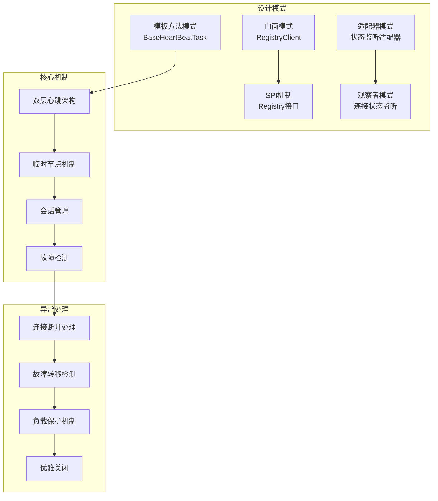
```mermaid
graph TB
    subgraph "设计模式"
        A[门面模式<br/>RegistryClient]
        B[SPI机制<br/>Registry接口]
        C[模板方法模式<br/>BaseHeartBeatTask]
        D[适配器模式<br/>状态监听适配器]
        E[观察者模式<br/>连接状态监听]
    end
    
    subgraph "核心机制"
        F[双层心跳架构]
        G[临时节点机制]
        H[会话管理]
        I[故障检测]
    end
    
    subgraph "异常处理"
        J[连接断开处理]
        K[故障转移检测]
        L[负载保护机制]
        M[优雅关闭]
    end
    
    A --> B
    C --> F
    D --> E
    F --> G
    G --> H
    H --> I
    I --> J
    J --> K
    K --> L
    L --> M
```

### 9.3 关键配置参数

**应用层心跳配置**：
- `worker.max-heartbeat-interval`：应用层心跳间隔（默认 10 秒）
- 配置位置：[application.yaml:46](dolphinscheduler-worker/src/main/resources/application.yaml#L46)

**服务层心跳配置**：
- `registry.zookeeper.session-timeout`：会话超时时间（默认 60 秒）
- `registry.zookeeper.connection-timeout`：连接超时时间（默认 15 秒）
- 配置位置：[application.yaml:37-38](dolphinscheduler-worker/src/main/resources/application.yaml#L37-L38)

**负载保护配置**：
- `worker.server-load-protection.enabled`：是否启用负载保护（默认 true）
- `worker.server-load-protection.max-system-cpu-usage-percentage-thresholds`：系统 CPU 阈值（默认 0.9）
- `worker.server-load-protection.max-jvm-cpu-usage-percentage-thresholds`：JVM CPU 阈值（默认 0.9）
- `worker.server-load-protection.max-system-memory-usage-percentage-thresholds`：系统内存阈值（默认 0.9）
- `worker.server-load-protection.max-disk-usage-percentage-thresholds`：磁盘使用率阈值（默认 0.9）
- 配置位置：[application.yaml:51-61](dolphinscheduler-worker/src/main/resources/application.yaml#L51-L61)

**重试策略配置**：
- `registry.zookeeper.retry-policy.base-sleep-time`：基础重试时间（默认 1 秒）
- `registry.zookeeper.retry-policy.max-retries`：最大重试次数（默认 3 次）
- `registry.zookeeper.retry-policy.max-sleep`：最大重试间隔（默认 3 秒）
- 配置位置：[application.yaml:76-79](dolphinscheduler-worker/src/main/resources/application.yaml#L76-L79)

### 9.4 最佳实践

1. **心跳间隔配置**：
   - 应用层心跳间隔应小于会话超时的 1/3
   - 例如：`sessionTimeout=60s`，应用层心跳间隔应 ≤ 20s（实际配置为 10s）
   - 确保即使应用层心跳失败，服务层心跳仍能维持会话

2. **会话超时配置**：
   - 会话超时时间应根据网络环境调整
   - 网络不稳定时适当增大 `sessionTimeout`，避免频繁断开
   - 参考配置：[application.yaml:37](dolphinscheduler-worker/src/main/resources/application.yaml#L37)

3. **负载保护配置**：
   - 根据实际硬件资源调整负载保护阈值
   - 启用负载保护可以避免在高负载时注册到注册中心，影响集群稳定性
   - 当 Worker 负载过高时，会等待负载降低后再注册
   - 负载判断包括：线程池使用率、系统 CPU、JVM CPU、系统内存、磁盘使用率
   - 参考配置：[application.yaml:51-61](dolphinscheduler-worker/src/main/resources/application.yaml#L51-L61)

4. **故障检测**：
   - 依赖临时节点的自动删除机制实现快速故障检测
   - 通过应用层心跳的 `reportTime` 判断服务是否正常响应
   - 故障转移节点机制确保故障 Worker 主动停止
   - 代码位置：[WorkerHeartBeatTask.java:87-97](dolphinscheduler-worker/src/main/java/org/apache/dolphinscheduler/server/worker/task/WorkerHeartBeatTask.java#L87-L97)

5. **异常处理**：
   - 连接断开时主动停止服务，避免提供不可靠服务
   - 检测到故障转移节点时立即停止，避免数据不一致
   - 通过 `IStoppable` 接口统一管理停止逻辑
   - 代码位置：[WorkerConnectionStateListener.java:48-49](dolphinscheduler-worker/src/main/java/org/apache/dolphinscheduler/server/worker/registry/WorkerConnectionStateListener.java#L48-L49)

### 9.5 相关代码链接

**核心类**：
- [WorkerServer.java](dolphinscheduler-worker/src/main/java/org/apache/dolphinscheduler/server/worker/WorkerServer.java) - Worker 服务器主类
- [WorkerRegistryClient.java](dolphinscheduler-worker/src/main/java/org/apache/dolphinscheduler/server/worker/registry/WorkerRegistryClient.java) - Worker 注册客户端
- [WorkerHeartBeatTask.java](dolphinscheduler-worker/src/main/java/org/apache/dolphinscheduler/server/worker/task/WorkerHeartBeatTask.java) - Worker 心跳任务
- [BaseHeartBeatTask.java](dolphinscheduler-common/src/main/java/org/apache/dolphinscheduler/common/model/BaseHeartBeatTask.java) - 心跳任务基类

**注册中心相关**：
- [RegistryClient.java](dolphinscheduler-registry/dolphinscheduler-registry-api/src/main/java/org/apache/dolphinscheduler/registry/api/RegistryClient.java) - 注册中心客户端门面
- [Registry.java](dolphinscheduler-registry/dolphinscheduler-registry-api/src/main/java/org/apache/dolphinscheduler/registry/api/Registry.java) - 注册中心 SPI 接口
- [ZookeeperRegistry.java](dolphinscheduler-registry/dolphinscheduler-registry-plugins/dolphinscheduler-registry-zookeeper/src/main/java/org/apache/dolphinscheduler/plugin/registry/zookeeper/ZookeeperRegistry.java) - Zookeeper 实现

**连接状态管理**：
- [WorkerConnectionStateListener.java](dolphinscheduler-worker/src/main/java/org/apache/dolphinscheduler/server/worker/registry/WorkerConnectionStateListener.java) - Worker 连接状态监听器
- [ZookeeperConnectionStateListener.java](dolphinscheduler-registry/dolphinscheduler-registry-plugins/dolphinscheduler-registry-zookeeper/src/main/java/org/apache/dolphinscheduler/plugin/registry/zookeeper/ZookeeperConnectionStateListener.java) - Zookeeper 连接状态适配器
- [ConnectionState.java](dolphinscheduler-registry/dolphinscheduler-registry-api/src/main/java/org/apache/dolphinscheduler/registry/api/ConnectionState.java) - 连接状态枚举

**配置相关**：
- [WorkerConfig.java](dolphinscheduler-worker/src/main/java/org/apache/dolphinscheduler/server/worker/config/WorkerConfig.java) - Worker 配置类
- [WorkerServerLoadProtection.java](dolphinscheduler-worker/src/main/java/org/apache/dolphinscheduler/server/worker/config/WorkerServerLoadProtection.java) - Worker 负载保护配置
- [BaseServerLoadProtection.java](dolphinscheduler-meter/src/main/java/org/apache/dolphinscheduler/meter/metrics/BaseServerLoadProtection.java) - 负载保护基类

**工具类**：
- [RegistryUtils.java](dolphinscheduler-registry/dolphinscheduler-registry-api/src/main/java/org/apache/dolphinscheduler/registry/api/utils/RegistryUtils.java) - 注册中心工具类

---

*文档最后更新时间：2024年*