# 任务引擎详细分析

## 一、概述

任务引擎（TaskEngine）是 DolphinScheduler Worker 中负责管理和执行任务的核心组件。本文档详细分析任务引擎的启动流程、架构设计、组件交互和状态流转。

### 1.1 核心代码位置

- **任务引擎启动入口**: [PhysicalTaskEngineDelegator.java:53](../../../src/main/java/org/apache/dolphinscheduler/server/worker/executor/PhysicalTaskEngineDelegator.java#L53)
- **任务引擎实现**: [TaskEngine.java](../../../../dolphinscheduler-task-executor/src/main/java/org/apache/dolphinscheduler/task/executor/TaskEngine.java)
- **任务引擎接口**: [ITaskEngine.java](../../../../dolphinscheduler-task-executor/src/main/java/org/apache/dolphinscheduler/task/executor/ITaskEngine.java)

## 二、任务引擎启动流程

### 2.1 启动时序图

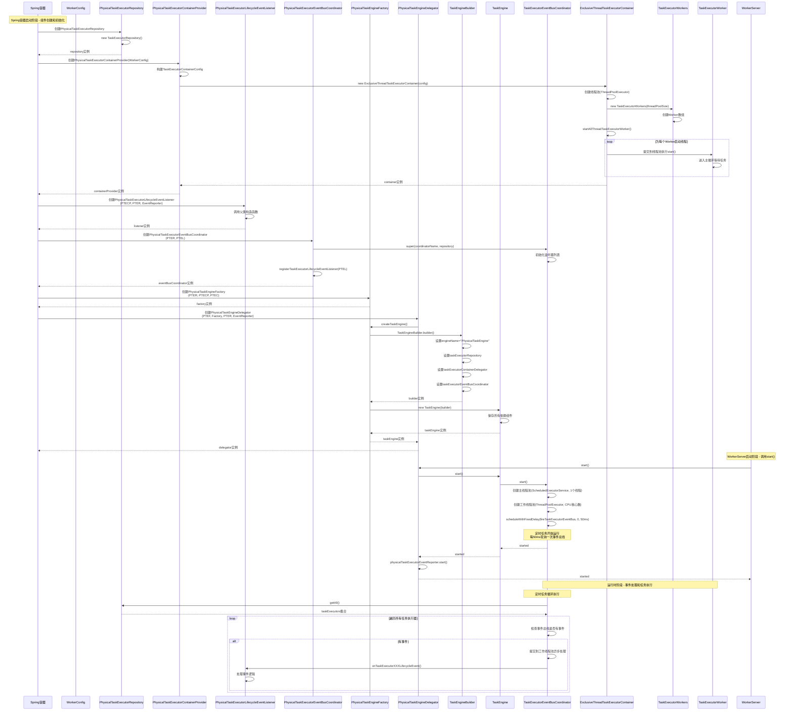
```mermaid
sequenceDiagram
    participant Spring as Spring容器
    participant WC as WorkerConfig
    participant PTER as PhysicalTaskExecutorRepository
    participant PTECP as PhysicalTaskExecutorContainerProvider
    participant PTEL as PhysicalTaskExecutorLifecycleEventListener
    participant PTEC as PhysicalTaskExecutorEventBusCoordinator
    participant PTEF as PhysicalTaskEngineFactory
    participant PTED as PhysicalTaskEngineDelegator
    participant TEB as TaskEngineBuilder
    participant TE as TaskEngine
    participant TEC as TaskExecutorEventBusCoordinator
    participant ETC as ExclusiveThreadTaskExecutorContainer
    participant TEW as TaskExecutorWorkers
    participant TEWorker as TaskExecutorWorker
    participant WS as WorkerServer

    Note over Spring: Spring容器启动阶段 - 组件创建和初始化
    
    Spring->>PTER: 创建PhysicalTaskExecutorRepository
    PTER->>PTER: new TaskExecutorRepository()
    PTER-->>Spring: repository实例
    
    Spring->>PTECP: 创建PhysicalTaskExecutorContainerProvider(WorkerConfig)
    PTECP->>PTECP: 构建TaskExecutorContainerConfig
    PTECP->>ETC: new ExclusiveThreadTaskExecutorContainer(config)
    ETC->>ETC: 创建线程池(ThreadPoolExecutor)
    ETC->>TEW: new TaskExecutorWorkers(threadPoolSize)
    TEW->>TEW: 创建Worker数组
    ETC->>ETC: startAllThreadTaskExecutorWorker()
    loop 为每个Worker启动线程
        ETC->>TEWorker: 提交到线程池执行start()
        TEWorker->>TEWorker: 进入主循环等待任务
    end
    ETC-->>PTECP: container实例
    PTECP-->>Spring: containerProvider实例
    
    Spring->>PTEL: 创建PhysicalTaskExecutorLifecycleEventListener<br/>(PTECP, PTER, EventReporter)
    PTEL->>PTEL: 调用父类构造函数
    PTEL-->>Spring: listener实例
    
    Spring->>PTEC: 创建PhysicalTaskExecutorEventBusCoordinator<br/>(PTER, PTEL)
    PTEC->>TEC: super(coordinatorName, repository)
    TEC->>TEC: 初始化监听器列表
    PTEC->>PTEC: registerTaskExecutorLifecycleEventListener(PTEL)
    PTEC-->>Spring: eventBusCoordinator实例
    
    Spring->>PTEF: 创建PhysicalTaskEngineFactory<br/>(PTER, PTECP, PTEC)
    PTEF-->>Spring: factory实例
    
    Spring->>PTED: 创建PhysicalTaskEngineDelegator<br/>(PTEF, Factory, PTER, EventReporter)
    PTED->>PTEF: createTaskEngine()
    PTEF->>TEB: TaskEngineBuilder.builder()
    TEB->>TEB: 设置engineName="PhysicalTaskEngine"
    TEB->>TEB: 设置taskExecutorRepository
    TEB->>TEB: 设置taskExecutorContainerDelegator
    TEB->>TEB: 设置taskExecutorEventBusCoordinator
    TEB-->>PTEF: builder实例
    PTEF->>TE: new TaskEngine(builder)
    TE->>TE: 保存所有依赖组件
    TE-->>PTEF: taskEngine实例
    PTEF-->>PTED: taskEngine实例
    PTED-->>Spring: delegator实例
    
    Note over WS: WorkerServer启动阶段 - 调用start()
    
    WS->>PTED: start()
    PTED->>TE: start()
    TE->>TEC: start()
    TEC->>TEC: 创建主线程池(ScheduledExecutorService, 1个线程)
    TEC->>TEC: 创建工作线程池(ThreadPoolExecutor, CPU核心数)
    TEC->>TEC: scheduleWithFixedDelay(fireTaskExecutorEventBus, 0, 50ms)
    Note over TEC: 定时任务开始运行<br/>每50ms轮询一次事件总线
    TEC-->>TE: started
    TE-->>PTED: started
    PTED->>PTED: physicalTaskExecutorEventReporter.start()
    PTED-->>WS: started
    
    Note over TEC,TEWorker: 运行时阶段 - 事件处理和任务执行
    Note over TEC: 定时任务循环执行
    TEC->>PTER: getAll()
    PTER-->>TEC: taskExecutors集合
    loop 遍历所有任务执行器
        TEC->>TEC: 检查事件总线是否有事件
        alt 有事件
            TEC->>TEC: 提交到工作线程池异步处理
            TEC->>PTEL: onTaskExecutorXXXLifecycleEvent()
            PTEL->>PTEL: 处理事件逻辑
        end
    end
```

### 2.2 doFireTaskExecutorEventBus 方法详细分析

`doFireTaskExecutorEventBus` 是事件总线协调器的核心方法，负责从任务执行器的事件总线中取出生命周期事件，并根据事件类型触发相应的监听器处理业务逻辑。

**代码位置**: [TaskExecutorEventBusCoordinator.java:474-567](../../../../dolphinscheduler-task-executor/src/main/java/org/apache/dolphinscheduler/task/executor/eventbus/TaskExecutorEventBusCoordinator.java#L474-L567)

#### 2.2.1 方法职责

该方法由工作线程池异步调用，负责：

1. **设置MDC上下文**: 为日志追踪设置任务执行器的上下文信息
2. **获取事件**: 从任务执行器的事件总线中取出一个生命周期事件（FIFO队列）
3. **事件分发**: 根据事件类型（switch-case）匹配相应的监听器方法
4. **触发监听器**: 遍历所有注册的监听器，依次调用对应的处理方法
5. **记录日志**: 记录事件处理的成功或失败日志

#### 2.2.2 方法执行流程

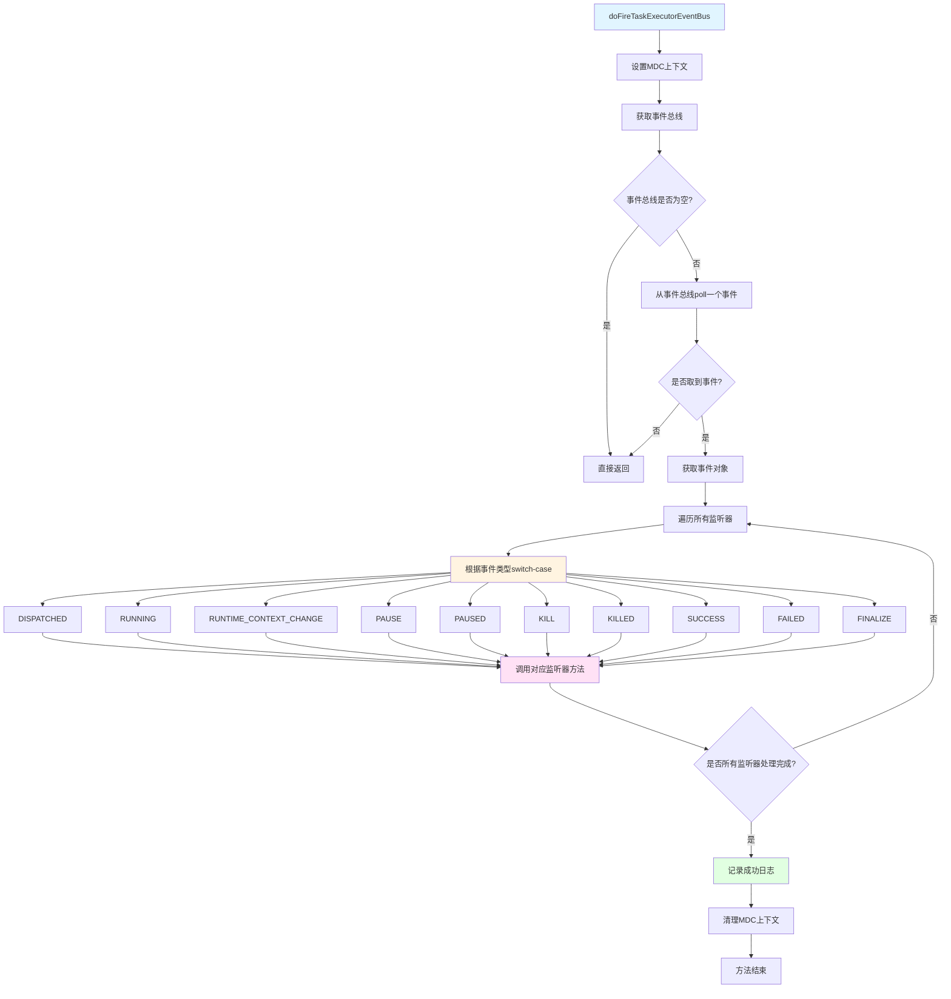
```mermaid
flowchart TD
    A[doFireTaskExecutorEventBus] --> B[设置MDC上下文]
    B --> C[获取事件总线]
    C --> D{事件总线是否为空?}
    D -->|是| E[直接返回]
    D -->|否| F[从事件总线poll一个事件]
    F --> G{是否取到事件?}
    G -->|否| E
    G -->|是| H[获取事件对象]
    H --> I[遍历所有监听器]
    I --> J[根据事件类型switch-case]
    J --> K1[DISPATCHED]
    J --> K2[RUNNING]
    J --> K3[RUNTIME_CONTEXT_CHANGE]
    J --> K4[PAUSE]
    J --> K5[PAUSED]
    J --> K6[KILL]
    J --> K7[KILLED]
    J --> K8[SUCCESS]
    J --> K9[FAILED]
    J --> K10[FINALIZE]
    K1 --> L[调用对应监听器方法]
    K2 --> L
    K3 --> L
    K4 --> L
    K5 --> L
    K6 --> L
    K7 --> L
    K8 --> L
    K9 --> L
    K10 --> L
    L --> M{是否所有监听器处理完成?}
    M -->|否| I
    M -->|是| N[记录成功日志]
    N --> O[清理MDC上下文]
    O --> P[方法结束]
    
    style A fill:#e1f5ff
    style J fill:#fff4e1
    style L fill:#ffe1f5
    style N fill:#e1ffe1
```

#### 2.2.3 事件类型与监听器方法映射

**事件类型枚举**: [TaskExecutorLifecycleEventType.java](../../../../dolphinscheduler-task-executor/src/main/java/org/apache/dolphinscheduler/task/executor/events/TaskExecutorLifecycleEventType.java)

| 事件类型 | 监听器方法 | 事件类 | 说明 |
|---------|-----------|--------|------|
| DISPATCHED | `onTaskExecutorDispatchedLifecycleEvent` | [TaskExecutorDispatchedLifecycleEvent](../../../../dolphinscheduler-task-executor/src/main/java/org/apache/dolphinscheduler/task/executor/events/TaskExecutorDispatchedLifecycleEvent.java) | 任务已分发到容器 |
| RUNNING | `onTaskExecutorStartedLifecycleEvent` | [TaskExecutorStartedLifecycleEvent](../../../../dolphinscheduler-task-executor/src/main/java/org/apache/dolphinscheduler/task/executor/events/TaskExecutorStartedLifecycleEvent.java) | 任务开始执行 |
| RUNTIME_CONTEXT_CHANGE | `onTaskExecutorRuntimeContextChangedEvent` | [TaskExecutorRuntimeContextChangedLifecycleEvent](../../../../dolphinscheduler-task-executor/src/main/java/org/apache/dolphinscheduler/task/executor/events/TaskExecutorRuntimeContextChangedLifecycleEvent.java) | 运行时上下文变更 |
| PAUSE | `onTaskExecutorPauseLifecycleEvent` | [TaskExecutorPauseLifecycleEvent](../../../../dolphinscheduler-task-executor/src/main/java/org/apache/dolphinscheduler/task/executor/events/TaskExecutorPauseLifecycleEvent.java) | 暂停请求 |
| PAUSED | `onTaskExecutorPausedLifecycleEvent` | [TaskExecutorPausedLifecycleEvent](../../../../dolphinscheduler-task-executor/src/main/java/org/apache/dolphinscheduler/task/executor/events/TaskExecutorPausedLifecycleEvent.java) | 任务已暂停 |
| KILL | `onTaskExecutorKillLifecycleEvent` | [TaskExecutorKillLifecycleEvent](../../../../dolphinscheduler-task-executor/src/main/java/org/apache/dolphinscheduler/task/executor/events/TaskExecutorKillLifecycleEvent.java) | 杀死请求 |
| KILLED | `onTaskExecutorKilledLifecycleEvent` | [TaskExecutorKilledLifecycleEvent](../../../../dolphinscheduler-task-executor/src/main/java/org/apache/dolphinscheduler/task/executor/events/TaskExecutorKilledLifecycleEvent.java) | 任务已杀死 |
| SUCCESS | `onTaskExecutorSuccessLifecycleEvent` | [TaskExecutorSuccessLifecycleEvent](../../../../dolphinscheduler-task-executor/src/main/java/org/apache/dolphinscheduler/task/executor/events/TaskExecutorSuccessLifecycleEvent.java) | 任务执行成功 |
| FAILED | `onTaskExecutorFailLifecycleEvent` | [TaskExecutorFailedLifecycleEvent](../../../../dolphinscheduler-task-executor/src/main/java/org/apache/dolphinscheduler/task/executor/events/TaskExecutorFailedLifecycleEvent.java) | 任务执行失败 |
| FINALIZE | `onTaskExecutorFinalizeLifecycleEvent` | [TaskExecutorFinalizeLifecycleEvent](../../../../dolphinscheduler-task-executor/src/main/java/org/apache/dolphinscheduler/task/executor/events/TaskExecutorFinalizeLifecycleEvent.java) | 任务终结 |

#### 2.2.4 完整执行时序图

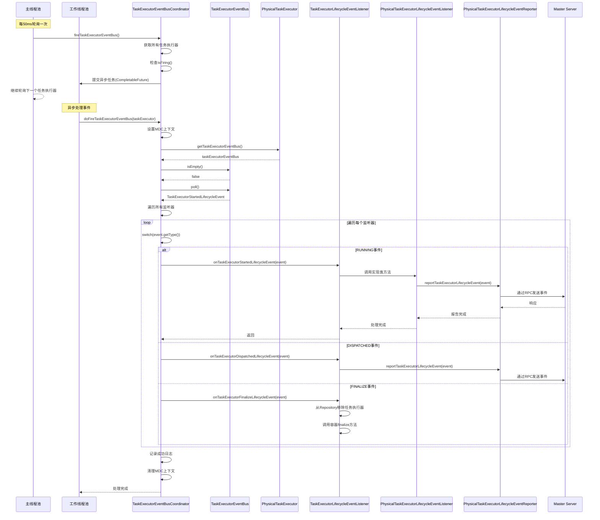
```mermaid
sequenceDiagram
    participant MainThread as 主线程池
    participant WorkerThread as 工作线程池
    participant TEC as TaskExecutorEventBusCoordinator
    participant TEB as TaskExecutorEventBus
    participant PTE as PhysicalTaskExecutor
    participant Listener as TaskExecutorLifecycleEventListener
    participant PTEL as PhysicalTaskExecutorLifecycleEventListener
    participant Reporter as PhysicalTaskExecutorLifecycleEventReporter
    participant Master as Master Server

    Note over MainThread: 每50ms轮询一次
    MainThread->>TEC: fireTaskExecutorEventBus()
    TEC->>TEC: 获取所有任务执行器
    TEC->>TEC: 检查isFiring()
    TEC->>WorkerThread: 提交异步任务(CompletableFuture)
    MainThread-->>MainThread: 继续轮询下一个任务执行器

    Note over WorkerThread: 异步处理事件
    WorkerThread->>TEC: doFireTaskExecutorEventBus(taskExecutor)
    TEC->>TEC: 设置MDC上下文
    TEC->>PTE: getTaskExecutorEventBus()
    PTE-->>TEC: taskExecutorEventBus
    TEC->>TEB: isEmpty()
    TEB-->>TEC: false
    TEC->>TEB: poll()
    TEB-->>TEC: TaskExecutorStartedLifecycleEvent
    
    TEC->>TEC: 遍历所有监听器
    loop 遍历每个监听器
        TEC->>TEC: switch(event.getType())
        alt RUNNING事件
            TEC->>Listener: onTaskExecutorStartedLifecycleEvent(event)
            Listener->>PTEL: 调用实现类方法
            PTEL->>Reporter: reportTaskExecutorLifecycleEvent(event)
            Reporter->>Master: 通过RPC发送事件
            Master-->>Reporter: 响应
            Reporter-->>PTEL: 报告完成
            PTEL-->>Listener: 处理完成
            Listener-->>TEC: 返回
        else DISPATCHED事件
            TEC->>Listener: onTaskExecutorDispatchedLifecycleEvent(event)
            Listener->>Reporter: reportTaskExecutorLifecycleEvent(event)
            Reporter->>Master: 通过RPC发送事件
        else FINALIZE事件
            TEC->>Listener: onTaskExecutorFinalizeLifecycleEvent(event)
            Listener->>Listener: 从Repository移除任务执行器
            Listener->>Listener: 调用容器finalize方法
        end
    end
    
    TEC->>TEC: 记录成功日志
    TEC->>TEC: 清理MDC上下文
    TEC-->>WorkerThread: 处理完成
```

#### 2.2.5 监听器处理逻辑

**监听器接口**: [ITaskExecutorLifecycleEventListener.java](../../../../dolphinscheduler-task-executor/src/main/java/org/apache/dolphinscheduler/task/executor/listener/ITaskExecutorLifecycleEventListener.java)

**监听器实现**: [TaskExecutorLifecycleEventListener.java](../../../../dolphinscheduler-task-executor/src/main/java/org/apache/dolphinscheduler/task/executor/listener/TaskExecutorLifecycleEventListener.java)

**Worker实现**: [PhysicalTaskExecutorLifecycleEventListener.java](../../../src/main/java/org/apache/dolphinscheduler/server/worker/executor/PhysicalTaskExecutorLifecycleEventListener.java)

##### 2.2.5.1 各事件类型的处理逻辑

**DISPATCHED / RUNNING / RUNTIME_CONTEXT_CHANGE**:
- **处理逻辑**: 调用 `reportTaskExecutorLifecycleEventToMaster()` 向 Master 报告事件
- **代码位置**: [TaskExecutorLifecycleEventListener.java:60-72](../../../../dolphinscheduler-task-executor/src/main/java/org/apache/dolphinscheduler/task/executor/listener/TaskExecutorLifecycleEventListener.java#L60-L72)

**PAUSE**:
- **处理逻辑**: 获取任务执行器，调用 `taskExecutor.pause()` 暂停任务
- **代码位置**: [TaskExecutorLifecycleEventListener.java:75-78](../../../../dolphinscheduler-task-executor/src/main/java/org/apache/dolphinscheduler/task/executor/listener/TaskExecutorLifecycleEventListener.java#L75-L78)

**PAUSED / KILLED / SUCCESS / FAILED**:
- **处理逻辑**: 调用 `reportTaskExecutorLifecycleEvent()` 向 Master 报告事件
- **代码位置**: [TaskExecutorLifecycleEventListener.java:81-104](../../../../dolphinscheduler-task-executor/src/main/java/org/apache/dolphinscheduler/task/executor/listener/TaskExecutorLifecycleEventListener.java#L81-L104)

**KILL**:
- **处理逻辑**: 获取任务执行器，调用 `taskExecutor.kill()` 杀死任务
- **代码位置**: [TaskExecutorLifecycleEventListener.java:86-89](../../../../dolphinscheduler-task-executor/src/main/java/org/apache/dolphinscheduler/task/executor/listener/TaskExecutorLifecycleEventListener.java#L86-L89)

**FINALIZE**:
- **处理逻辑**:
    1. 从 Repository 中移除任务执行器
    2. 调用容器的 `finalize()` 方法清理资源
- **代码位置**: [TaskExecutorLifecycleEventListener.java:107-115](../../../../dolphinscheduler-task-executor/src/main/java/org/apache/dolphinscheduler/task/executor/listener/TaskExecutorLifecycleEventListener.java#L107-L115)

#### 2.2.6 组件交互图

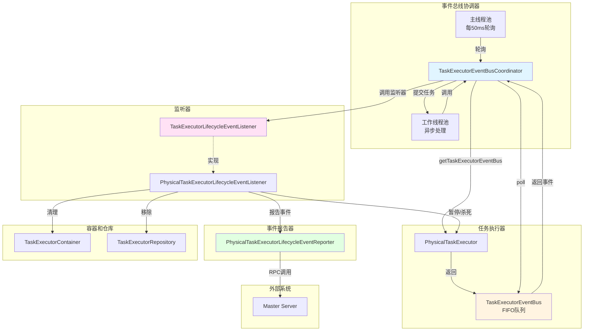
```mermaid
graph TB
    subgraph "事件总线协调器"
        TEC[TaskExecutorEventBusCoordinator]
        TEC_Main[主线程池<br/>每50ms轮询]
        TEC_Worker[工作线程池<br/>异步处理]
    end
    
    subgraph "任务执行器"
        PTE[PhysicalTaskExecutor]
        TEB[TaskExecutorEventBus<br/>FIFO队列]
    end
    
    subgraph "监听器"
        Listener[TaskExecutorLifecycleEventListener]
        PTEL[PhysicalTaskExecutorLifecycleEventListener]
    end
    
    subgraph "事件报告器"
        Reporter[PhysicalTaskExecutorLifecycleEventReporter]
    end
    
    subgraph "容器和仓库"
        Container[TaskExecutorContainer]
        Repository[TaskExecutorRepository]
    end
    
    subgraph "外部系统"
        Master[Master Server]
    end
    
    TEC_Main -->|轮询| TEC
    TEC -->|提交任务| TEC_Worker
    TEC_Worker -->|调用| TEC
    TEC -->|getTaskExecutorEventBus| PTE
    PTE -->|返回| TEB
    TEC -->|poll| TEB
    TEB -->|返回事件| TEC
    TEC -->|调用监听器| Listener
    Listener -.->|实现| PTEL
    PTEL -->|报告事件| Reporter
    Reporter -->|RPC调用| Master
    PTEL -->|暂停/杀死| PTE
    PTEL -->|移除| Repository
    PTEL -->|清理| Container
    
    style TEC fill:#e1f5ff
    style TEB fill:#fff4e1
    style Listener fill:#ffe1f5
    style Reporter fill:#e1ffe1
```

#### 2.2.7 事件处理状态流转图

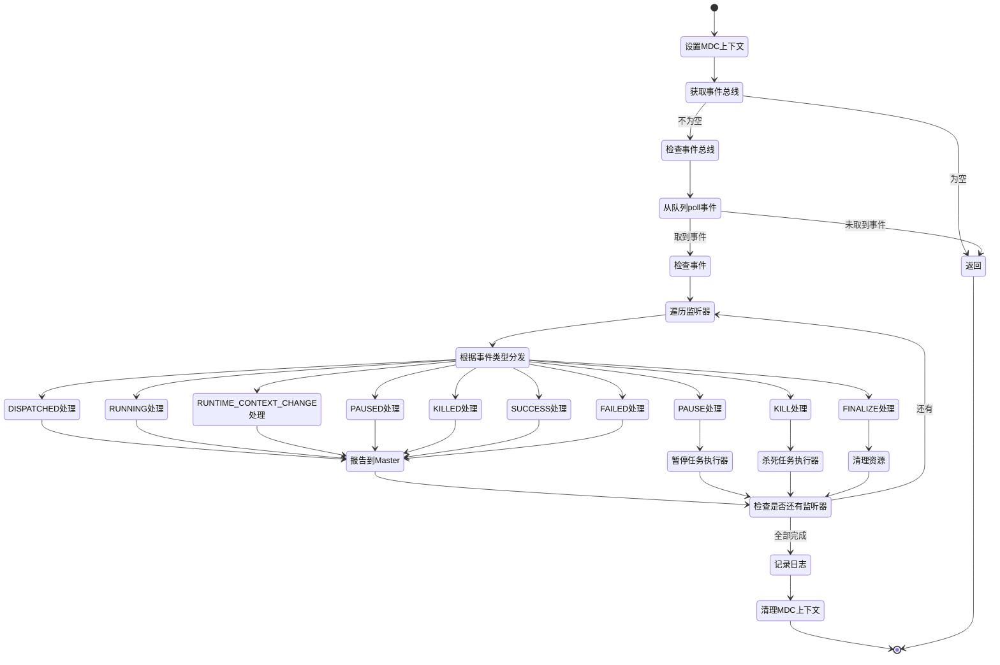
```mermaid
stateDiagram-v2
    [*] --> 设置MDC上下文
    设置MDC上下文 --> 获取事件总线
    获取事件总线 --> 检查事件总线: 不为空
    获取事件总线 --> 返回: 为空
    检查事件总线 --> 从队列poll事件
    从队列poll事件 --> 检查事件: 取到事件
    从队列poll事件 --> 返回: 未取到事件
    检查事件 --> 遍历监听器
    遍历监听器 --> 根据事件类型分发
    
    根据事件类型分发 --> DISPATCHED处理
    根据事件类型分发 --> RUNNING处理
    根据事件类型分发 --> RUNTIME_CONTEXT_CHANGE处理
    根据事件类型分发 --> PAUSE处理
    根据事件类型分发 --> PAUSED处理
    根据事件类型分发 --> KILL处理
    根据事件类型分发 --> KILLED处理
    根据事件类型分发 --> SUCCESS处理
    根据事件类型分发 --> FAILED处理
    根据事件类型分发 --> FINALIZE处理
    
    DISPATCHED处理 --> 报告到Master
    RUNNING处理 --> 报告到Master
    RUNTIME_CONTEXT_CHANGE处理 --> 报告到Master
    PAUSE处理 --> 暂停任务执行器
    PAUSED处理 --> 报告到Master
    KILL处理 --> 杀死任务执行器
    KILLED处理 --> 报告到Master
    SUCCESS处理 --> 报告到Master
    FAILED处理 --> 报告到Master
    FINALIZE处理 --> 清理资源
    
    报告到Master --> 检查是否还有监听器
    暂停任务执行器 --> 检查是否还有监听器
    杀死任务执行器 --> 检查是否还有监听器
    清理资源 --> 检查是否还有监听器
    
    检查是否还有监听器 --> 遍历监听器: 还有
    检查是否还有监听器 --> 记录日志: 全部完成
    记录日志 --> 清理MDC上下文
    清理MDC上下文 --> [*]
    返回 --> [*]
```

#### 2.2.8 关键设计点

##### 2.2.8.1 每次只处理一个事件

```java
Optional<AbstractTaskExecutorLifecycleEvent> headEventOptional = taskExecutorEventBus.poll();
```

- **原因**: 确保事件按顺序处理（FIFO队列）
- **优势**: 避免事件处理顺序混乱，保证状态一致性
- **注意**: 如果事件处理时间过长，可能影响后续事件的及时处理

##### 2.2.8.2 多监听器支持

```java
for (final ITaskExecutorLifecycleEventListener taskExecutorLifecycleEventListener : taskExecutorLifecycleEventListeners) {
    // 调用监听器方法
}
```

- **特点**: 一个事件可以被多个监听器处理
- **优势**: 支持不同监听器处理不同的业务逻辑（如：一个更新数据库，另一个发送RPC响应）
- **执行顺序**: 按照注册顺序依次执行

##### 2.2.8.3 异常隔离

```java
try {
    // 事件处理逻辑
} catch (Exception e) {
    log.error("Fire TaskExecutorLifecycleEvent: {} error", taskExecutorLifecycleEvent, e);
}
```

- **特点**: 单个监听器的异常不会影响其他监听器的执行
- **优势**: 提高系统的容错性，单个监听器失败不会导致整个事件处理失败
- **注意**: 异常会被记录日志，但不会中断其他监听器的执行

##### 2.2.8.4 MDC上下文管理

在 `doFireTaskExecutorEventBus()` 方法中，使用 MDC（Mapped Diagnostic Context）来管理日志上下文，确保事件处理过程中的日志能够写入到对应的任务日志文件。

**代码位置**: [TaskExecutorEventBusCoordinator.java:474-476](../../../../dolphinscheduler-task-executor/src/main/java/org/apache/dolphinscheduler/task/executor/eventbus/TaskExecutorEventBusCoordinator.java#L474-L476)

```java
private void doFireTaskExecutorEventBus(final ITaskExecutor taskExecutor) {
    // 设置MDC上下文，用于日志追踪（包含任务执行器ID、名称等信息）
    try (final TaskExecutorMDCUtils.MDCAutoClosable ignored = TaskExecutorMDCUtils.logWithMDC(taskExecutor)) {
        // 在这个代码块内，所有日志都会写入到taskExecutor.getLogPath()对应的文件
        // ...
    } // 自动清理MDC
}
```

**工作原理**:
1. **设置MDC**: `TaskExecutorMDCUtils.logWithMDC(taskExecutor)` 将任务执行器的 logPath 和 taskInstanceId 放入当前线程的 MDC（Mapped Diagnostic Context）
2. **日志路由**: 在 try 块内，所有日志调用（log.info、log.error等）都会自动使用 MDC 中的 logPath，通过 Logback 的 SiftingAppender 路由到对应的任务日志文件
3. **自动清理**: try-with-resources 确保在代码块结束时自动清理 MDC，避免影响其他任务的事件处理

**关键点**:
- **线程本地存储**: MDC 使用 ThreadLocal 实现，每个线程有独立的 MDC 副本，多任务并发处理时互不干扰
- **自动路由**: Logback 的 SiftingAppender 根据 MDC 中的 logPath 动态创建或查找对应的 FileAppender，将日志写入正确的文件
- **异常安全**: 即使事件处理过程中发生异常，try-with-resources 也会确保清理 MDC，避免内存泄漏和日志混乱

**详细说明**: 参见 [11.8 MDC 自动清理机制详解](#118-mdc-自动清理机制详解) 和 [11.3 日志写入对应目录的实现机制](#113-日志写入对应目录的实现机制)

### 2.3 启动流程详细说明

#### 2.3.1 Spring 容器初始化阶段

在 WorkerServer 启动之前，Spring 容器会先创建和初始化所有 `@Component` 组件。以下是任务引擎相关组件的创建顺序：

##### 2.3.1.1 PhysicalTaskExecutorRepository 创建

`PhysicalTaskExecutorRepository` 继承自 `TaskExecutorRepository`，用于存储和管理所有任务执行器实例。

**创建过程**:
- Spring 容器创建 `PhysicalTaskExecutorRepository` 实例
- 调用父类 `TaskExecutorRepository` 构造函数，初始化内部的 `ConcurrentHashMap`

**代码位置**: [PhysicalTaskExecutorRepository.java](../../../src/main/java/org/apache/dolphinscheduler/server/worker/executor/PhysicalTaskExecutorRepository.java)

##### 2.3.1.2 PhysicalTaskExecutorContainerProvider 创建

`PhysicalTaskExecutorContainerProvider` 负责提供任务执行器容器实例。

**创建过程**:
1. Spring 容器注入 `WorkerConfig` 配置
2. 构建 `TaskExecutorContainerConfig`，包含容器名称和线程池大小
3. 创建 `ExclusiveThreadTaskExecutorContainer` 实例
4. 在容器构造函数中：
   - 创建线程池（`ThreadPoolExecutor`）
   - 创建 `TaskExecutorWorkers`，包含多个 `TaskExecutorWorker`
   - 调用 `startAllThreadTaskExecutorWorker()` 为每个 Worker 启动线程
   - 每个 Worker 线程进入主循环，等待任务分配

**代码位置**: 
- [PhysicalTaskExecutorContainerProvider.java](../../../src/main/java/org/apache/dolphinscheduler/server/worker/executor/PhysicalTaskExecutorContainerProvider.java)
- [AbstractTaskExecutorContainer.java:47-54](../../../../dolphinscheduler-task-executor/src/main/java/org/apache/dolphinscheduler/task/executor/container/AbstractTaskExecutorContainer.java#L47-L54)

##### 2.3.1.3 PhysicalTaskExecutorLifecycleEventListener 创建

`PhysicalTaskExecutorLifecycleEventListener` 是任务执行器生命周期事件的监听器。

**创建过程**:
- Spring 容器注入依赖：`PhysicalTaskExecutorContainerProvider`、`PhysicalTaskExecutorRepository`、`PhysicalTaskExecutorLifecycleEventReporter`
- 调用父类 `TaskExecutorLifecycleEventListener` 构造函数

**代码位置**: [PhysicalTaskExecutorLifecycleEventListener.java](../../../src/main/java/org/apache/dolphinscheduler/server/worker/executor/PhysicalTaskExecutorLifecycleEventListener.java)

##### 2.3.1.4 PhysicalTaskExecutorEventBusCoordinator 创建

`PhysicalTaskExecutorEventBusCoordinator` 是事件总线协调器，负责定期轮询并处理任务执行器的生命周期事件。

**创建过程**:
1. Spring 容器注入依赖：`PhysicalTaskExecutorRepository`、`PhysicalTaskExecutorLifecycleEventListener`
2. 调用父类 `TaskExecutorEventBusCoordinator` 构造函数，传入协调器名称和仓库实例
3. 调用 `registerTaskExecutorLifecycleEventListener()` 注册事件监听器

**注意**: 此时只是创建了协调器实例，但还没有启动定时任务。定时任务在 `start()` 方法中启动。

**代码位置**: [PhysicalTaskExecutorEventBusCoordinator.java](../../../src/main/java/org/apache/dolphinscheduler/server/worker/executor/PhysicalTaskExecutorEventBusCoordinator.java)

##### 2.3.1.5 PhysicalTaskEngineFactory 创建

`PhysicalTaskEngineFactory` 负责创建 `TaskEngine` 实例。

**创建过程**:
- Spring 容器注入依赖：`PhysicalTaskExecutorRepository`、`PhysicalTaskExecutorContainerProvider`、`PhysicalTaskExecutorEventBusCoordinator`

**代码位置**: [PhysicalTaskEngineFactory.java](../../../src/main/java/org/apache/dolphinscheduler/server/worker/executor/PhysicalTaskEngineFactory.java)

##### 2.3.1.6 PhysicalTaskEngineDelegator 创建

`PhysicalTaskEngineDelegator` 是任务引擎的委托器，在构造函数中创建 `TaskEngine` 实例。

**创建过程**:
1. Spring 容器注入依赖：`PhysicalTaskEngineFactory`、`PhysicalTaskExecutorFactory`、`PhysicalTaskExecutorRepository`、`PhysicalTaskExecutorLifecycleEventReporter`
2. 调用 `physicalTaskEngineFactory.createTaskEngine()` 创建任务引擎：
   - 使用 `TaskEngineBuilder` 构建器模式创建 `TaskEngineBuilder`
   - 设置引擎名称、仓库、容器提供者、事件总线协调器
   - 创建 `TaskEngine` 实例并保存所有依赖组件

**代码位置**: 
- [PhysicalTaskEngineDelegator.java:42-50](../../../src/main/java/org/apache/dolphinscheduler/server/worker/executor/PhysicalTaskEngineDelegator.java#L42-L50)
- [PhysicalTaskEngineFactory.java:38-46](../../../src/main/java/org/apache/dolphinscheduler/server/worker/executor/PhysicalTaskEngineFactory.java#L38-L46)

#### 2.3.2 WorkerServer 启动任务引擎

在 WorkerServer 的 `run()` 方法中，按以下顺序启动组件：

1. **启动 RPC 服务**: `workerRpcServer.start()`
2. **加载任务插件**: `TaskPluginManager.loadTaskPlugin()`
3. **初始化数据源**: `DataSourceProcessorProvider.initialize()`
4. **启动注册中心客户端**: `workerRegistryClient.start()`
5. **启动任务引擎委托器**: `physicalTaskEngineDelegator.start()` ← **本文档重点**

**代码位置**: [WorkerServer.java:90](../../../src/main/java/org/apache/dolphinscheduler/server/worker/WorkerServer.java#L90)

#### 2.3.3 PhysicalTaskEngineDelegator 启动

`PhysicalTaskEngineDelegator` 是任务引擎的委托器，负责协调任务引擎的启动和任务分发。

**启动步骤**:
1. 调用 `taskEngine.start()` 启动任务引擎
2. 调用 `physicalTaskExecutorEventReporter.start()` 启动事件报告器

**代码位置**: [PhysicalTaskEngineDelegator.java:52-56](../../../src/main/java/org/apache/dolphinscheduler/server/worker/executor/PhysicalTaskEngineDelegator.java#L52-L56)

#### 2.3.4 TaskEngine 启动

`TaskEngine` 的 `start()` 方法主要启动事件总线协调器：

```java
@Override
public void start() {
    taskExecutorEventBusCoordinator.start();
    log.info("{} started", engineName);
}
```

**代码位置**: [TaskEngine.java:50-54](../../../../dolphinscheduler-task-executor/src/main/java/org/apache/dolphinscheduler/task/executor/TaskEngine.java#L50-L54)

#### 2.3.5 TaskExecutorEventBusCoordinator 启动

事件总线协调器负责定期轮询并处理任务执行器的生命周期事件。

**启动步骤**:
1. 创建主线程池（ScheduledExecutorService，1个线程）
2. 创建工作线程池（ThreadPoolExecutor，线程数 = CPU核心数）
3. 安排定时任务，每 50ms 执行一次 `fireTaskExecutorEventBus()`

**代码位置**: [TaskExecutorEventBusCoordinator.java:82-95](../../../../dolphinscheduler-task-executor/src/main/java/org/apache/dolphinscheduler/task/executor/eventbus/TaskExecutorEventBusCoordinator.java#L82-L95)

**代码位置**: [TaskExecutorEventBusCoordinator.java:82-95](../../../../dolphinscheduler-task-executor/src/main/java/org/apache/dolphinscheduler/task/executor/eventbus/TaskExecutorEventBusCoordinator.java#L82-L95)

### 2.4 任务分发完整流程：从Master到Worker执行

本节详细分析从Master端的任务分发队列到Worker端任务执行的完整流程，包括RPC调用、任务创建、任务提交和任务启动的全过程。

#### 2.4.1 流程概述

任务分发流程跨越Master和Worker两个节点，涉及多个组件的协作：

1. **Master端**: 从分发队列取出任务 → 负载均衡选择Worker → RPC调用
2. **Worker端**: RPC接收 → 创建任务执行器 → 提交到任务引擎 → 分发到容器 → 启动执行

**完整调用链**:
```
Master: GlobalTaskDispatchWaitingQueueLooper.doDispatch()
  → ITaskExecutorClient.dispatch()
  → TaskExecutorClient.dispatch()
  → PhysicalTaskExecutorClientDelegator.dispatch()
  → 负载均衡选择Worker
  → RPC调用: Clients.withService(IPhysicalTaskExecutorOperator.class).dispatchTask()
  
Worker: PhysicalTaskExecutorOperatorImpl.dispatchTask()
  → PhysicalTaskEngineDelegator.dispatchLogicTask()
  → PhysicalTaskExecutorFactory.createTaskExecutor()
  → TaskEngine.submitTask()
  → ExclusiveThreadTaskExecutorContainer.dispatch()
  → TaskExecutorWorker.registerTaskExecutor()
  → TaskExecutorWorker.fireTaskExecutor()
  → PhysicalTaskExecutor.start()
```

#### 2.4.2 完整时序图

**说明**：本时序图展示了从Master端任务分发队列到Worker端任务执行的完整流程，包括：
1. Master端任务分发流程
2. Worker端RPC接收和任务提交流程
3. **TaskExecutorDispatchedLifecycleEvent发布后的Master端事件处理**（包括TaskDispatchedLifecycleEventHandler、TaskDispatchStateAction、ACK确认等）
4. **PhysicalTaskExecutor.start()的详细执行流程**（包括初始化、发布RUNNING事件、日志头、插件初始化、任务触发等）

**关键代码位置**:
- TaskDispatchedLifecycleEventHandler: [TaskDispatchedLifecycleEventHandler.java](../../../../dolphinscheduler-master/src/main/java/org/apache/dolphinscheduler/server/master/engine/task/lifecycle/handler/TaskDispatchedLifecycleEventHandler.java)
- TaskDispatchStateAction: [TaskDispatchStateAction.java:85-103](../../../../dolphinscheduler-master/src/main/java/org/apache/dolphinscheduler/server/master/engine/task/statemachine/TaskDispatchStateAction.java#L85-L103)
- AbstractTaskStateAction.dispatchedEventAction: [AbstractTaskStateAction.java:97-104](../../../../dolphinscheduler-master/src/main/java/org/apache/dolphinscheduler/server/master/engine/task/statemachine/AbstractTaskStateAction.java#L97-L104)
- PhysicalTaskExecutor.start: [AbstractTaskExecutor.java:57-81](../../../../dolphinscheduler-task-executor/src/main/java/org/apache/dolphinscheduler/task/executor/AbstractTaskExecutor.java#L57-L81)
- PhysicalTaskExecutor.initializeTaskContext: [PhysicalTaskExecutor.java:108-132](../../../src/main/java/org/apache/dolphinscheduler/server/worker/executor/PhysicalTaskExecutor.java#L108-L132)
- PhysicalTaskExecutor.initializeTaskPlugin: [PhysicalTaskExecutor.java:61-70](../../../src/main/java/org/apache/dolphinscheduler/server/worker/executor/PhysicalTaskExecutor.java#L61-L70)
- PhysicalTaskPluginFactory.createPhysicalTask: [PhysicalTaskPluginFactory.java:29-32](../../../src/main/java/org/apache/dolphinscheduler/server/worker/executor/PhysicalTaskPluginFactory.java#L29-L32)
- TaskPluginManager.getTaskChannel: [TaskPluginManager.java:63-70](../../../../dolphinscheduler-task-plugin/dolphinscheduler-task-api/src/main/java/org/apache/dolphinscheduler/plugin/task/api/TaskPluginManager.java#L63-L70)
- TaskChannel接口: [TaskChannel.java](../../../../dolphinscheduler-task-plugin/dolphinscheduler-task-api/src/main/java/org/apache/dolphinscheduler/plugin/task/api/TaskChannel.java)
- ShellTaskChannel示例: [ShellTaskChannel.java](../../../../dolphinscheduler-task-plugin/dolphinscheduler-task-shell/src/main/java/org/apache/dolphinscheduler/plugin/task/shell/ShellTaskChannel.java)
- ShellTask.init示例: [ShellTask.java:67-75](../../../../dolphinscheduler-task-plugin/dolphinscheduler-task-shell/src/main/java/org/apache/dolphinscheduler/plugin/task/shell/ShellTask.java#L67-L75)
- PhysicalTaskExecutor.doTriggerTaskPlugin: [PhysicalTaskExecutor.java:73-88](../../../src/main/java/org/apache/dolphinscheduler/server/worker/executor/PhysicalTaskExecutor.java#L73-L88)
- TaskCallBack接口: [TaskCallBack.java](../../../../dolphinscheduler-task-plugin/dolphinscheduler-task-api/src/main/java/org/apache/dolphinscheduler/plugin/task/api/TaskCallBack.java)
- ShellTask.handle示例: [ShellTask.java:79-99](../../../../dolphinscheduler-task-plugin/dolphinscheduler-task-shell/src/main/java/org/apache/dolphinscheduler/plugin/task/shell/ShellTask.java#L79-L99)
- AbstractCommandExecutor.run: [AbstractCommandExecutor.java:104-208](../../../../dolphinscheduler-task-plugin/dolphinscheduler-task-api/src/main/java/org/apache/dolphinscheduler/plugin/task/api/AbstractCommandExecutor.java#L104-L208)


```mermaid
sequenceDiagram
    participant Queue as GlobalTaskDispatchWaitingQueue
    participant Looper as GlobalTaskDispatchWaitingQueueLooper
    participant Client as TaskExecutorClient
    participant Delegator as PhysicalTaskExecutorClientDelegator
    participant LB as IWorkerLoadBalancer
    participant RPC as RPC Client
    participant WorkerRPC as PhysicalTaskExecutorOperatorImpl
    participant PTED as PhysicalTaskEngineDelegator
    participant PTEF as PhysicalTaskExecutorFactory
    participant TE as TaskEngine
    participant ETC as ExclusiveThreadTaskExecutorContainer
    participant TEW as TaskExecutorWorker
    participant PTE as PhysicalTaskExecutor
    participant TER as TaskExecutorRepository
    participant TEB as TaskExecutorEventBus
    participant PTFactory as PhysicalTaskPluginFactory
    participant TaskPluginManager as TaskPluginManager
    participant TaskChannel as TaskChannel
    participant PhysicalTask as PhysicalTask

    Note over Queue: Master端 - 任务分发队列
    Queue->>Looper: takeTaskExecuteRunnable()<br/>从队列取出任务
    Looper->>Looper: 检查任务状态<br/>(SUBMITTED_SUCCESS/DELAY_EXECUTION)
    
    Looper->>Client: dispatch(taskExecutionRunnable)
    Client->>Delegator: dispatch(taskExecutionRunnable)
    
    Note over Delegator: 负载均衡选择Worker
    Delegator->>LB: select(workerGroup)
    LB-->>Delegator: workerAddress
    
    Delegator->>Delegator: 设置taskExecutionContext.host<br/>设置taskInstance.host
    
    Note over RPC: RPC调用Worker
    Delegator->>RPC: Clients.withService(IPhysicalTaskExecutorOperator)<br/>.withHost(workerAddress)<br/>.dispatchTask(request)
    
    Note over WorkerRPC: Worker端 - RPC接收
    RPC->>WorkerRPC: dispatchTask(TaskExecutorDispatchRequest)
    WorkerRPC->>WorkerRPC: 提取TaskExecutionContext
    
    WorkerRPC->>PTED: dispatchLogicTask(taskExecutionContext)
    
    Note over PTEF: 创建任务执行器
    PTED->>PTEF: createTaskExecutor(taskExecutionContext)
    PTEF->>PTEF: assemblyTaskLogPath()<br/>设置logPath
    PTEF->>PTE: new PhysicalTaskExecutor(builder)
    PTEF-->>PTED: taskExecutor
    
    Note over TE: 提交到任务引擎
    PTED->>TE: submitTask(taskExecutor)
    
    Note over TE: 设置MDC上下文
    TE->>TE: TaskExecutorMDCUtils.logWithMDC(taskExecutor)
    
    Note over ETC: 分发到容器
    TE->>ETC: getExecutorContainer()
    ETC-->>TE: container
    TE->>ETC: dispatch(taskExecutor)
    ETC->>ETC: selectIdleWorker()
    ETC->>TEW: registerTaskExecutor(taskExecutor)
    TEW->>TEW: 添加到registeredTaskExecutors
    ETC-->>TE: dispatched
    
    Note over TER: 存储到仓库
    TE->>TER: put(taskExecutor)
    TER-->>TE: stored
    
    Note over TEB: 发布DISPATCHED事件
    TE->>TEB: publish(TaskExecutorDispatchedLifecycleEvent)
    TEB-->>TE: event published
    
    Note over Master: Master端事件处理（异步）
    rect rgb(240, 248, 255)
        Note over Master: Worker事件通过RPC上报到Master
        TEB-.->>Master: TaskExecutorDispatchedLifecycleEvent<br/>(通过RPC上报)
        
        Note over Master: Master端事件总线处理
        Master->>Master: WorkflowEventBusFireWorker<br/>doFireSingleEvent()
        Master->>Master: TaskDispatchedLifecycleEventHandler<br/>handle()
        Master->>Master: TaskStateActionFactory<br/>getTaskStateAction(DISPATCH)
        Master->>Master: 返回TaskDispatchStateAction
        
        Note over Master: 执行状态动作
        Master->>Master: TaskDispatchStateAction<br/>dispatchedEventAction()
        Master->>Master: AbstractTaskStateAction<br/>dispatchedEventAction()
        Master->>Master: 更新数据库状态为DISPATCH<br/>设置host地址
        Master->>Master: taskInstanceDao.updateById()
        
        Note over Master: 发送ACK到Worker
        Master->>Master: taskExecutorClient<br/>ackTaskExecutorLifecycleEvent()
        Master->>Client: PhysicalTaskExecutorClientDelegator<br/>ackTaskExecutorLifecycleEvent()
        Client->>WorkerRPC: RPC调用ackPhysicalTaskExecutorLifecycleEvent()
        WorkerRPC->>WorkerRPC: PhysicalTaskExecutorLifecycleEventReporter<br/>receiveTaskExecutorLifecycleEventACK()
    end
    
    Note over TEW: 启动任务
    TE->>ETC: start(taskExecutor)
    ETC->>TEW: fireTaskExecutor(taskExecutor)
    TEW->>TEW: 添加到activeTaskExecutors
    TEW->>TEW: 唤醒等待线程
    TEW->>PTE: start()
    
    Note over PTE: 任务开始执行（详细流程）
    rect rgb(255, 248, 240)
        Note over PTE: 1. 初始化阶段
        PTE->>PTE: 检查startFlag（防止重复启动）
        PTE->>PTE: printInitializeTaskContextHeader()<br/>打印初始化日志头
        PTE->>PTE: initializeTaskContext()<br/>初始化任务上下文
        Note over PTE: - 设置startTime<br/>- 设置taskAppId<br/>- 设置tenantCode<br/>- 创建工作目录<br/>- 下载资源文件<br/>- 下载上游文件
        PTE->>PTE: PhysicalTaskExecutor<br/>initializeTaskContext()
        PTE->>PTE: super.initializeTaskContext()
        
        Note over PTE: 2. 发布RUNNING事件
        PTE->>PTE: publishTaskRunningEvent()<br/>发布TaskExecutorStartedLifecycleEvent
        PTE->>PTE: transitTaskExecutorState(RUNNING)
        PTE->>TEB: publish(TaskExecutorStartedLifecycleEvent)
        TEB-->>PTE: event published
        
        Note over PTE: 3. 初始化任务插件
        PTE->>PTE: printLoadTaskInstancePluginHeader()<br/>打印加载插件日志头
        PTE->>PTE: initializeTaskPlugin()<br/>初始化任务插件
        
        Note over PTE,PTFactory: 创建PhysicalTask实例（详细流程）
        rect rgb(240, 255, 240)
            PTE->>PTFactory: physicalTaskPluginFactory<br/>createPhysicalTask(this)
            
            Note over PTFactory: 获取TaskChannel
            PTFactory->>PTFactory: getTaskChannel(physicalTaskExecutor)
            PTFactory->>PTFactory: 从taskExecutionContext获取taskType<br/>（如"SHELL"、"JAVA"等）
            PTFactory->>TaskPluginManager: TaskPluginManager<br/>getTaskChannel(taskType)
            
            Note over TaskPluginManager: 从taskChannelMap查找TaskChannel<br/>（在类加载时通过SPI机制加载所有TaskChannelFactory创建）
            TaskPluginManager->>TaskPluginManager: taskChannelMap.get(taskType)
            TaskPluginManager-->>PTFactory: 返回TaskChannel<br/>（如ShellTaskChannel、JavaTaskChannel等）
            
            Note over PTFactory,TaskChannel: 创建具体的任务实例
            PTFactory->>TaskChannel: taskChannel.createTask<br/>(taskExecutionContext)
            Note over TaskChannel: 根据任务类型创建对应的任务实例<br/>- SHELL -> new ShellTask(taskExecutionContext)<br/>- JAVA -> new JavaTask(taskExecutionContext)<br/>- PYTHON -> new PythonTask(taskExecutionContext)<br/>等等
            TaskChannel->>PhysicalTask: new ShellTask(taskExecutionContext)<br/>（以ShellTask为例）
            PhysicalTask->>PhysicalTask: 调用构造函数<br/>- 设置taskRequest<br/>- 创建ShellCommandExecutor等
            PhysicalTask-->>TaskChannel: 返回ShellTask实例
            TaskChannel-->>PTFactory: 返回AbstractTask实例
            PTFactory-->>PTE: 返回physicalTask
        end
        
        Note over PTE,PhysicalTask: 初始化任务插件
        PTE->>PhysicalTask: physicalTask.init()
        Note over PhysicalTask: - 解析任务参数（JSONUtils.parseObject）<br/>- 验证参数有效性（checkParameters）<br/>- 初始化插件特定资源（如创建客户端等）
        PhysicalTask->>PhysicalTask: 解析taskParams为具体参数类<br/>（如ShellParameters、JavaParameters等）
        PhysicalTask->>PhysicalTask: 验证参数有效性<br/>checkParameters()
        PhysicalTask-->>PTE: init()完成
        
        Note over PTE: 设置变量池
        PTE->>PTE: physicalTask.getParameters()<br/>.setVarPool(taskExecutionContext.getVarPool())
        PTE->>PTE: 设置任务变量池
        
        Note over PTE: 4. 执行任务插件
        PTE->>PTE: printExecuteTaskHeader()<br/>打印执行任务日志头
        PTE->>PTE: 检查dryRun标志
        alt dryRun模式
            PTE->>PTE: 跳过执行，直接标记为SUCCEEDED
        else 正常执行
            PTE->>PTE: doTriggerTaskPlugin()<br/>触发任务插件执行
            Note over PTE: - 调用physicalTask.handle()<br/>- 传入TaskCallBack回调<br/>- 实际执行任务逻辑
            PTE->>PTE: PhysicalTaskExecutor<br/>doTriggerTaskPlugin()
            PTE->>PhysicalTask: physicalTask.handle(TaskCallBack)
            
            Note over PhysicalTask: 任务插件执行（以ShellTask为例）
            rect rgb(255, 240, 245)
                PhysicalTask->>PhysicalTask: 构建执行命令<br/>（ShellCommandExecutor/AbstractCommandExecutor）
                PhysicalTask->>PhysicalTask: 设置执行环境<br/>（工作目录、环境变量、租户等）
                PhysicalTask->>PhysicalTask: 执行命令/提交应用<br/>（阻塞执行或提交到远程集群）
                Note over PhysicalTask: - Shell任务：执行Shell命令<br/>- YARN任务：提交到YARN集群<br/>- K8s任务：提交到K8s集群
                
                alt 任务执行过程中需要更新信息
                    PhysicalTask->>TaskCallBack: updateRemoteApplicationInfo()<br/>更新远程应用ID（如YARN appId）
                    TaskCallBack->>PTE: 设置taskExecutionContext.appIds
                    TaskCallBack->>TEB: publish(TaskExecutorRuntimeContextChangedLifecycleEvent)<br/>发布运行时上下文变更事件
                    TEB-->>TaskCallBack: event published
                end
                
                PhysicalTask->>PhysicalTask: 等待任务执行完成<br/>（阻塞或轮询状态）
                PhysicalTask->>PhysicalTask: 设置exitStatusCode<br/>（0=成功，非0=失败）
                PhysicalTask->>PhysicalTask: 设置processId/appIds等
            end
            PhysicalTask-->>PTE: handle()方法返回<br/>（exitStatusCode已设置）
            
            Note over PTE: 任务执行完成
            PTE->>PTE: doTriggerTaskPlugin()返回<br/>任务状态通过trackTaskExecutorState()跟踪
            Note over PTE: TaskExecutorWorker会定期调用<br/>trackTaskExecutorState()检查任务状态
        end
    end
    
    WorkerRPC-->>RPC: TaskExecutorDispatchResponse.success()
    RPC-->>Delegator: response
    Delegator-->>Client: dispatch完成
    Client-->>Looper: dispatch完成
    Looper-->>Queue: 继续处理下一个任务
```

#### 2.4.3 Master端详细流程

##### 2.4.3.1 GlobalTaskDispatchWaitingQueueLooper.doDispatch()

**代码位置**: [GlobalTaskDispatchWaitingQueueLooper.java:106-126](../../../../dolphinscheduler-master/src/main/java/org/apache/dolphinscheduler/server/master/runner/GlobalTaskDispatchWaitingQueueLooper.java#L106-L126)

**职责**: 从全局任务分发等待队列中取出任务并分发

**执行步骤**:
1. **从队列取出任务**: `globalTaskDispatchWaitingQueue.takeTaskExecuteRunnable()` - 阻塞等待，直到有任务可分发
2. **检查任务状态**: 只分发状态为 `SUBMITTED_SUCCESS` 或 `DELAY_EXECUTION` 的任务
3. **调用分发方法**: `taskExecutorClient.dispatch(taskExecutionRunnable)`
4. **异常处理**: 如果分发失败，将任务重新放回队列，延迟重试（延迟时间递增，最多60秒）

**关键代码**:
```java
void doDispatch() {
    final ITaskExecutionRunnable taskExecutionRunnable = globalTaskDispatchWaitingQueue.takeTaskExecuteRunnable();
    final TaskInstance taskInstance = taskExecutionRunnable.getTaskInstance();
    try {
        final TaskExecutionStatus status = taskInstance.getState();
        if (status != TaskExecutionStatus.SUBMITTED_SUCCESS && status != TaskExecutionStatus.DELAY_EXECUTION) {
            log.warn("The TaskInstance {} state is : {}, will not dispatch", taskInstance.getName(), status);
            return;
        }
        taskExecutorClient.dispatch(taskExecutionRunnable);
    } catch (Exception e) {
        // 分发失败，延迟重试
        long waitingTimeMills = Math.min(
                taskExecutionRunnable.getTaskExecutionContext().increaseDispatchFailTimes() * 1_000L, 60_000L);
        globalTaskDispatchWaitingQueue.dispatchTaskExecuteRunnableWithDelay(taskExecutionRunnable, waitingTimeMills);
    }
}
```

##### 2.4.3.2 TaskExecutorClient.dispatch()

**代码位置**: [TaskExecutorClient.java:52-61](../../../../dolphinscheduler-master/src/main/java/org/apache/dolphinscheduler/server/master/engine/task/client/TaskExecutorClient.java#L52-L61)

**职责**: 根据任务类型选择对应的委托器（物理任务或逻辑任务）

**执行步骤**:
1. **判断任务类型**: 根据 `taskExecutionRunnable` 的类型选择委托器
2. **调用委托器**: 调用 `PhysicalTaskExecutorClientDelegator` 或 `LogicTaskExecutorClientDelegator` 的 `dispatch()` 方法

##### 2.4.3.3 PhysicalTaskExecutorClientDelegator.dispatch()

**代码位置**: [PhysicalTaskExecutorClientDelegator.java:59-90](../../../../dolphinscheduler-master/src/main/java/org/apache/dolphinscheduler/server/master/engine/task/client/PhysicalTaskExecutorClientDelegator.java#L59-L90)

**职责**: 负载均衡选择Worker节点，并通过RPC调用分发任务

**执行步骤**:
1. **负载均衡选择Worker**:
   ```java
   final String physicalTaskExecutorAddress = workerLoadBalancer
           .select(taskExecutionContext.getWorkerGroup())
           .map(Host::of)
           .map(Host::getAddress)
           .orElseThrow(() -> new TaskDispatchException(...));
   ```
2. **设置Worker地址**:
    - `taskExecutionContext.setHost(physicalTaskExecutorAddress)`
    - `taskExecutionRunnable.getTaskInstance().setHost(physicalTaskExecutorAddress)`
3. **RPC调用Worker**:
   ```java
   final TaskExecutorDispatchResponse taskExecutorDispatchResponse = Clients
           .withService(IPhysicalTaskExecutorOperator.class)
           .withHost(physicalTaskExecutorAddress)
           .dispatchTask(TaskExecutorDispatchRequest.of(taskExecutionContext));
   ```
4. **检查响应**: 如果分发失败，抛出 `TaskDispatchException`

#### 2.4.4 Worker端详细流程

##### 2.4.4.1 PhysicalTaskExecutorOperatorImpl.dispatchTask()

**代码位置**: [PhysicalTaskExecutorOperatorImpl.java:48-59](../../../src/main/java/org/apache/dolphinscheduler/server/worker/rpc/PhysicalTaskExecutorOperatorImpl.java#L48-L59)

**职责**: RPC服务端接收Master的分发请求

**执行步骤**:
1. **接收RPC请求**: 从 `TaskExecutorDispatchRequest` 中提取 `TaskExecutionContext`
2. **调用委托器**: `physicalTaskEngineDelegator.dispatchLogicTask(taskExecutionContext)`
3. **返回响应**: 成功返回 `TaskExecutorDispatchResponse.success()`，失败返回错误信息

**关键代码**:
```java
public TaskExecutorDispatchResponse dispatchTask(final TaskExecutorDispatchRequest taskExecutorDispatchRequest) {
    log.info("Receive TaskExecutorDispatchResponse: {}", taskExecutorDispatchRequest);
    final TaskExecutionContext taskExecutionContext = taskExecutorDispatchRequest.getTaskExecutionContext();
    try {
        physicalTaskEngineDelegator.dispatchLogicTask(taskExecutionContext);
        log.info("Handle TaskExecutorDispatchResponse: {} success", taskExecutorDispatchRequest);
        return TaskExecutorDispatchResponse.success();
    } catch (Throwable throwable) {
        log.error("Handle TaskExecutorDispatchResponse: {} failed", taskExecutorDispatchRequest, throwable);
        return TaskExecutorDispatchResponse.failed(ExceptionUtils.getMessage(throwable));
    }
}
```

##### 2.4.4.2 PhysicalTaskEngineDelegator.dispatchLogicTask()

**代码位置**: [PhysicalTaskEngineDelegator.java:79-82](../../../src/main/java/org/apache/dolphinscheduler/server/worker/executor/PhysicalTaskEngineDelegator.java#L79-L82)

**职责**: 创建任务执行器并提交到任务引擎

**执行步骤**:
1. **创建任务执行器**: `physicalTaskExecutorFactory.createTaskExecutor(taskExecutionContext)`
2. **提交到引擎**: `taskEngine.submitTask(taskExecutor)`

**关键代码**:
```java
public void dispatchLogicTask(final TaskExecutionContext taskExecutionContext) {
    final ITaskExecutor taskExecutor = physicalTaskExecutorFactory.createTaskExecutor(taskExecutionContext);
    taskEngine.submitTask(taskExecutor);
}
```

##### 2.4.4.3 PhysicalTaskExecutorFactory.createTaskExecutor()

**代码位置**: [PhysicalTaskExecutorFactory.java:50-60](../../../src/main/java/org/apache/dolphinscheduler/server/worker/executor/PhysicalTaskExecutorFactory.java#L50-L60)

**职责**: 创建 `PhysicalTaskExecutor` 实例

**执行步骤**:
1. **设置日志路径**: `assemblyTaskLogPath(taskExecutionContext)` - 调用 `LogUtils.getTaskInstanceLogFullPath()` 生成完整日志路径
2. **构建任务执行器**: 使用 `PhysicalTaskExecutorBuilder` 构建器模式创建 `PhysicalTaskExecutor`

**关键代码**:
```java
public ITaskExecutor createTaskExecutor(final TaskExecutionContext taskExecutionContext) {
    assemblyTaskLogPath(taskExecutionContext);  // 设置logPath
    
    final PhysicalTaskExecutorBuilder physicalTaskExecutorBuilder = PhysicalTaskExecutorBuilder.builder()
            .taskExecutionContext(taskExecutionContext)
            .workerConfig(workerConfig)
            .storageOperator(storageOperator)
            .physicalTaskPluginFactory(physicalTaskPluginFactory)
            .build();
    return new PhysicalTaskExecutor(physicalTaskExecutorBuilder);
}
```

##### 2.4.4.4 TaskEngine.submitTask()

**代码位置**: [TaskEngine.java:57-65](../../../../dolphinscheduler-task-executor/src/main/java/org/apache/dolphinscheduler/task/executor/TaskEngine.java#L57-L65)

**职责**: 将任务执行器提交到任务引擎，完成分发、存储、事件发布和启动

**执行步骤**:
1. **设置MDC上下文**: `TaskExecutorMDCUtils.logWithMDC(taskExecutor)` - 用于日志追踪
2. **获取容器**: `taskExecutorContainerDelegator.getExecutorContainer()`
3. **分发到容器**: `executorContainer.dispatch(taskExecutor)` - 将任务分发到空闲Worker
4. **存储到仓库**: `taskExecutorRepository.put(taskExecutor)` - 存储任务执行器实例
5. **发布DISPATCHED事件**: `taskExecutor.getTaskExecutorEventBus().publish(TaskExecutorDispatchedLifecycleEvent.of(taskExecutor))`
6. **启动任务**: `executorContainer.start(taskExecutor)` - 触发任务执行

**关键代码**:
```java
public void submitTask(final ITaskExecutor taskExecutor) throws TaskExecutorRuntimeException {
    try (final TaskExecutorMDCUtils.MDCAutoClosable ignore = TaskExecutorMDCUtils.logWithMDC(taskExecutor)) {
        final ITaskExecutorContainer executorContainer = taskExecutorContainerDelegator.getExecutorContainer();
        executorContainer.dispatch(taskExecutor);  // 分发到容器
        taskExecutorRepository.put(taskExecutor);  // 存储到仓库
        taskExecutor.getTaskExecutorEventBus().publish(TaskExecutorDispatchedLifecycleEvent.of(taskExecutor));  // 发布事件
        executorContainer.start(taskExecutor);  // 启动任务
    }
}
```

##### 2.4.4.5 ExclusiveThreadTaskExecutorContainer.dispatch()

**代码位置**: [AbstractTaskExecutorContainer.java:57-69](../../../../dolphinscheduler-task-executor/src/main/java/org/apache/dolphinscheduler/task/executor/container/AbstractTaskExecutorContainer.java#L57-L69)

**职责**: 将任务执行器分发到空闲的Worker线程

**执行步骤**:
1. **选择空闲Worker**: `selectIdleWorker()` - 从 `TaskExecutorWorkers` 中选择一个空闲的Worker
2. **注册任务**: `worker.registerTaskExecutor(taskExecutor)` - 将任务注册到Worker
3. **记录映射**: `taskExecutorAssignmentTable.registerTaskExecutor(taskExecutor, worker)` - 记录任务执行器与Worker的映射关系

##### 2.4.4.6 TaskExecutorWorker.fireTaskExecutor()

**代码位置**: [AbstractTaskExecutorContainer.java:72-80](../../../../dolphinscheduler-task-executor/src/main/java/org/apache/dolphinscheduler/task/executor/container/AbstractTaskExecutorContainer.java#L72-L80)

**职责**: 触发Worker线程执行任务

**执行步骤**:
1. **添加到激活列表**: `worker.fireTaskExecutor(taskExecutor)` - 将任务添加到 `activeTaskExecutors`
2. **唤醒Worker线程**: `activeTaskExecutorsChangeLock.signalAll()` - 唤醒等待的Worker线程

##### 2.4.4.7 PhysicalTaskExecutor.start()

**代码位置**: [AbstractTaskExecutor.java:57-69](../../../../dolphinscheduler-task-executor/src/main/java/org/apache/dolphinscheduler/task/executor/AbstractTaskExecutor.java#L57-L69)

**职责**: 启动任务执行器，开始执行任务

**执行步骤**:
1. **初始化任务上下文**: `initializeTaskContext()` - 设置开始时间
2. **发布RUNNING事件**: `publishTaskRunningEvent()` - 发布任务开始执行事件
3. **初始化任务插件**: `initializeTaskPlugin()` - 初始化任务插件
4. **触发任务插件**: `doTriggerTaskPlugin()` - 开始执行任务逻辑

#### 2.4.5 组件交互图

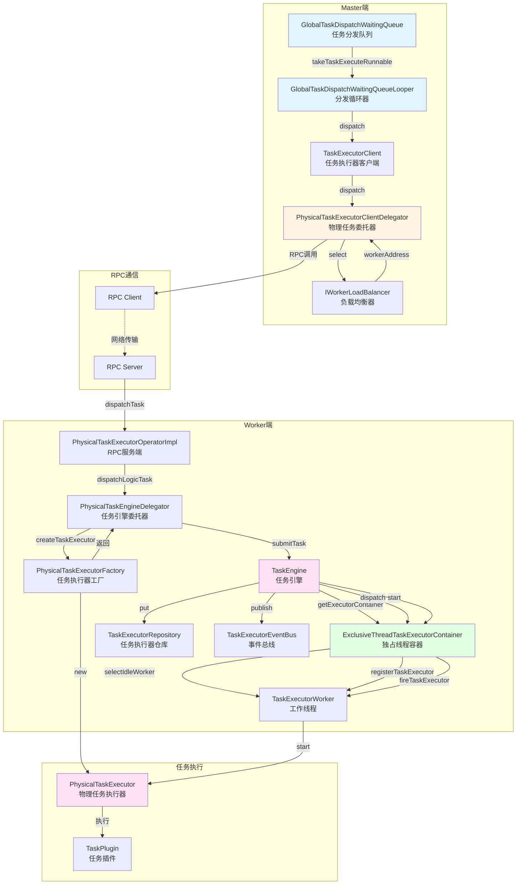
```mermaid
graph TB
    subgraph "Master端"
        Queue[GlobalTaskDispatchWaitingQueue<br/>任务分发队列]
        Looper[GlobalTaskDispatchWaitingQueueLooper<br/>分发循环器]
        Client[TaskExecutorClient<br/>任务执行器客户端]
        Delegator[PhysicalTaskExecutorClientDelegator<br/>物理任务委托器]
        LB[IWorkerLoadBalancer<br/>负载均衡器]
    end
    
    subgraph "RPC通信"
        RPCClient[RPC Client]
        RPCServer[RPC Server]
    end
    
    subgraph "Worker端"
        WorkerRPC[PhysicalTaskExecutorOperatorImpl<br/>RPC服务端]
        PTED[PhysicalTaskEngineDelegator<br/>任务引擎委托器]
        PTEF[PhysicalTaskExecutorFactory<br/>任务执行器工厂]
        TE[TaskEngine<br/>任务引擎]
        ETC[ExclusiveThreadTaskExecutorContainer<br/>独占线程容器]
        TEW[TaskExecutorWorker<br/>工作线程]
        TER[TaskExecutorRepository<br/>任务执行器仓库]
        TEB[TaskExecutorEventBus<br/>事件总线]
    end
    
    subgraph "任务执行"
        PTE[PhysicalTaskExecutor<br/>物理任务执行器]
        Plugin[TaskPlugin<br/>任务插件]
    end
    
    Queue -->|takeTaskExecuteRunnable| Looper
    Looper -->|dispatch| Client
    Client -->|dispatch| Delegator
    Delegator -->|select| LB
    LB -->|workerAddress| Delegator
    Delegator -->|RPC调用| RPCClient
    RPCClient -.->|网络传输| RPCServer
    RPCServer -->|dispatchTask| WorkerRPC
    WorkerRPC -->|dispatchLogicTask| PTED
    PTED -->|createTaskExecutor| PTEF
    PTEF -->|new| PTE
    PTEF -->|返回| PTED
    PTED -->|submitTask| TE
    TE -->|getExecutorContainer| ETC
    TE -->|dispatch| ETC
    ETC -->|selectIdleWorker| TEW
    ETC -->|registerTaskExecutor| TEW
    TE -->|put| TER
    TE -->|publish| TEB
    TE -->|start| ETC
    ETC -->|fireTaskExecutor| TEW
    TEW -->|start| PTE
    PTE -->|执行| Plugin
    
    style Queue fill:#e1f5ff
    style Looper fill:#e1f5ff
    style Delegator fill:#fff4e1
    style TE fill:#ffe1f5
    style ETC fill:#e1ffe1
    style PTE fill:#ffe1f5
```

#### 2.4.6 任务状态流转图

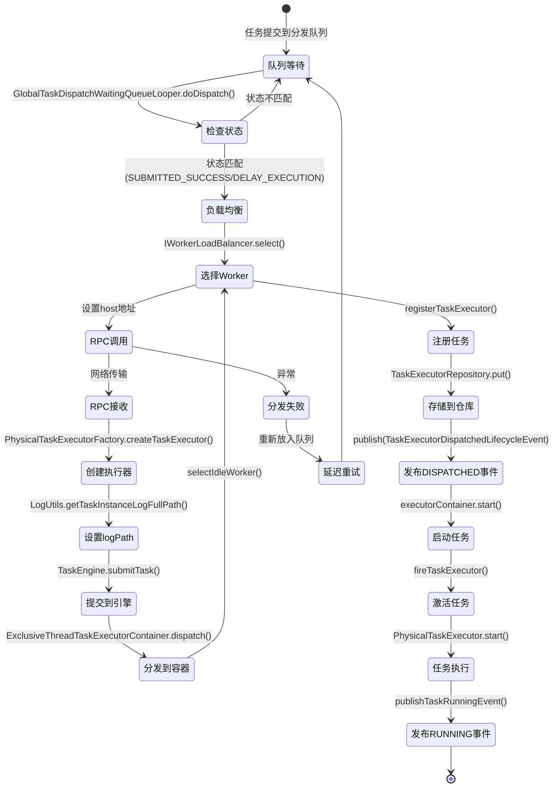
```mermaid
stateDiagram-v2
    [*] --> 队列等待: 任务提交到分发队列
    队列等待 --> 检查状态: GlobalTaskDispatchWaitingQueueLooper.doDispatch()
    检查状态 --> 队列等待: 状态不匹配
    检查状态 --> 负载均衡: 状态匹配(SUBMITTED_SUCCESS/DELAY_EXECUTION)
    负载均衡 --> 选择Worker: IWorkerLoadBalancer.select()
    选择Worker --> RPC调用: 设置host地址
    RPC调用 --> RPC接收: 网络传输
    RPC接收 --> 创建执行器: PhysicalTaskExecutorFactory.createTaskExecutor()
    创建执行器 --> 设置logPath: LogUtils.getTaskInstanceLogFullPath()
    设置logPath --> 提交到引擎: TaskEngine.submitTask()
    提交到引擎 --> 分发到容器: ExclusiveThreadTaskExecutorContainer.dispatch()
    分发到容器 --> 选择Worker: selectIdleWorker()
    选择Worker --> 注册任务: registerTaskExecutor()
    注册任务 --> 存储到仓库: TaskExecutorRepository.put()
    存储到仓库 --> 发布DISPATCHED事件: publish(TaskExecutorDispatchedLifecycleEvent)
    发布DISPATCHED事件 --> 启动任务: executorContainer.start()
    启动任务 --> 激活任务: fireTaskExecutor()
    激活任务 --> 任务执行: PhysicalTaskExecutor.start()
    任务执行 --> 发布RUNNING事件: publishTaskRunningEvent()
    发布RUNNING事件 --> [*]
    
    RPC调用 --> 分发失败: 异常
    分发失败 --> 延迟重试: 重新放入队列
    延迟重试 --> 队列等待
```

#### 2.4.7 关键设计点

##### 2.4.7.1 负载均衡选择Worker

**实现**: `IWorkerLoadBalancer.select(workerGroup)`

**策略**: 根据Worker组（workerGroup）选择可用的Worker节点

**代码位置**: [PhysicalTaskExecutorClientDelegator.java:62-69](../../../../dolphinscheduler-master/src/main/java/org/apache/dolphinscheduler/server/master/engine/task/client/PhysicalTaskExecutorClientDelegator.java#L62-L69)

##### 2.4.7.2 异步RPC调用

**特点**: Master端通过RPC异步调用Worker，不阻塞分发循环

**优势**:
- 提高吞吐量：Master可以快速分发多个任务
- 非阻塞：单个任务分发失败不影响其他任务

##### 2.4.7.3 任务执行器创建时机

**时机**: 在Worker端RPC接收时创建，而不是在Master端

**优势**:
- **延迟创建**: 只有在Worker确认接收任务时才创建，避免资源浪费
- **Worker本地**: 任务执行器在Worker本地创建，包含Worker特定的配置和资源

##### 2.4.7.4 日志路径设置

**时机**: 在创建任务执行器时设置（`PhysicalTaskExecutorFactory.createTaskExecutor()`）

**位置**: [PhysicalTaskExecutorFactory.java:62-64](../../../src/main/java/org/apache/dolphinscheduler/server/worker/executor/PhysicalTaskExecutorFactory.java#L62-L64)

**作用**: 确保任务执行时的日志写入到正确的文件

##### 2.4.7.5 事件驱动机制

**DISPATCHED事件**: 任务分发到容器后立即发布，通知Master任务已分发

**RUNNING事件**: 任务开始执行时发布，通知Master任务已开始运行

**优势**: 解耦任务执行和状态同步，Master可以异步接收任务状态更新

#### 2.4.8 异常处理和重试机制

##### 2.4.8.1 Master端异常处理

**位置**: [GlobalTaskDispatchWaitingQueueLooper.java:116-125](../../../../dolphinscheduler-master/src/main/java/org/apache/dolphinscheduler/server/master/runner/GlobalTaskDispatchWaitingQueueLooper.java#L116-L125)

**机制**:
- **延迟重试**: 分发失败后，将任务重新放入队列，延迟时间递增
- **最大延迟**: 延迟时间不超过60秒
- **重试次数**: 通过 `increaseDispatchFailTimes()` 记录失败次数

**代码**:
```java
catch (Exception e) {
    long waitingTimeMills = Math.min(
            taskExecutionRunnable.getTaskExecutionContext().increaseDispatchFailTimes() * 1_000L, 60_000L);
    globalTaskDispatchWaitingQueue.dispatchTaskExecuteRunnableWithDelay(taskExecutionRunnable, waitingTimeMills);
    log.error("Dispatch Task: {} failed will retry after: {}/ms", taskInstance.getName(), waitingTimeMills, e);
}
```

##### 2.4.8.2 Worker端异常处理

**位置**: [PhysicalTaskExecutorOperatorImpl.java:55-58](../../../src/main/java/org/apache/dolphinscheduler/server/worker/rpc/PhysicalTaskExecutorOperatorImpl.java#L55-L58)

**机制**:
- **捕获异常**: 捕获所有 `Throwable` 异常
- **返回错误响应**: 返回 `TaskExecutorDispatchResponse.failed()`，包含错误信息
- **记录日志**: 记录详细的错误日志

#### 2.4.9 完整流程图

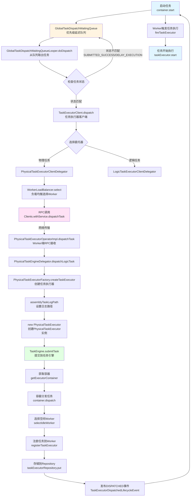
```mermaid
flowchart TD
    Start([任务提交到分发队列]) --> Queue[GlobalTaskDispatchWaitingQueue<br/>优先级延迟队列]
    Queue --> Looper[GlobalTaskDispatchWaitingQueueLooper.doDispatch<br/>从队列取出任务]
    Looper --> CheckState{检查任务状态}
    CheckState -->|状态不匹配<br/>SUBMITTED_SUCCESS/DELAY_EXECUTION| Queue
    CheckState -->|状态匹配| Client[TaskExecutorClient.dispatch<br/>任务执行器客户端]
    Client --> Delegator{选择委托器}
    Delegator -->|物理任务| PhysicalDelegator[PhysicalTaskExecutorClientDelegator]
    Delegator -->|逻辑任务| LogicDelegator[LogicTaskExecutorClientDelegator]
    PhysicalDelegator --> LoadBalancer[WorkerLoadBalancer.select<br/>负载均衡选择Worker]
    LoadBalancer --> RPC[RPC调用<br/>Clients.withService.dispatchTask]
    RPC -->|网络传输| WorkerRPC[PhysicalTaskExecutorOperatorImpl.dispatchTask<br/>Worker端RPC接收]
    WorkerRPC --> WorkerDelegator[PhysicalTaskEngineDelegator.dispatchLogicTask]
    WorkerDelegator --> Factory[PhysicalTaskExecutorFactory.createTaskExecutor<br/>创建任务执行器]
    Factory --> SetLogPath[assemblyTaskLogPath<br/>设置日志路径]
    SetLogPath --> CreateExecutor[new PhysicalTaskExecutor<br/>创建PhysicalTaskExecutor实例]
    CreateExecutor --> Engine[TaskEngine.submitTask<br/>提交到任务引擎]
    Engine --> GetContainer[获取容器<br/>getExecutorContainer]
    GetContainer --> Dispatch[容器分发任务<br/>container.dispatch]
    Dispatch --> SelectWorker[选择空闲Worker<br/>selectIdleWorker]
    SelectWorker --> Register[注册任务到Worker<br/>registerTaskExecutor]
    Register --> Store[存储到Repository<br/>taskExecutorRepository.put]
    Store --> PublishEvent[发布DISPATCHED事件<br/>TaskExecutorDispatchedLifecycleEvent]
    PublishEvent --> Start[启动任务<br/>container.start]
    Start --> Fire[Worker触发任务执行<br/>fireTaskExecutor]
    Fire --> Execute[任务开始执行<br/>taskExecutor.start]
    
    style Start fill:#e1f5ff
    style Queue fill:#fff4e1
    style RPC fill:#ffe1f5
    style Engine fill:#e1ffe1
    style Execute fill:#e1f5ff
```

**代码位置**:
- Master端队列: [GlobalTaskDispatchWaitingQueue.java](../../../../dolphinscheduler-master/src/main/java/org/apache/dolphinscheduler/server/master/runner/GlobalTaskDispatchWaitingQueue.java)
- Master端分发: [GlobalTaskDispatchWaitingQueueLooper.java:106](../../../../dolphinscheduler-master/src/main/java/org/apache/dolphinscheduler/server/master/runner/GlobalTaskDispatchWaitingQueueLooper.java#L106)
- Master端客户端: [TaskExecutorClient.java](../../../../dolphinscheduler-master/src/main/java/org/apache/dolphinscheduler/server/master/engine/task/client/TaskExecutorClient.java)
- Master端委托器: [PhysicalTaskExecutorClientDelegator.java:59](../../../../dolphinscheduler-master/src/main/java/org/apache/dolphinscheduler/server/master/engine/task/client/PhysicalTaskExecutorClientDelegator.java#L59)
- Worker端RPC: [PhysicalTaskExecutorOperatorImpl.java:48](../../../src/main/java/org/apache/dolphinscheduler/server/worker/rpc/PhysicalTaskExecutorOperatorImpl.java#L48)
- Worker端委托器: [PhysicalTaskEngineDelegator.java:79](../../../src/main/java/org/apache/dolphinscheduler/server/worker/executor/PhysicalTaskEngineDelegator.java#L79)
- Worker端工厂: [PhysicalTaskExecutorFactory.java:50](../../../src/main/java/org/apache/dolphinscheduler/server/worker/executor/PhysicalTaskExecutorFactory.java#L50)
- 任务引擎提交: [TaskEngine.java:57](../../../../dolphinscheduler-task-executor/src/main/java/org/apache/dolphinscheduler/task/executor/TaskEngine.java#L57)

## 三、任务引擎架构

### 3.1 架构图

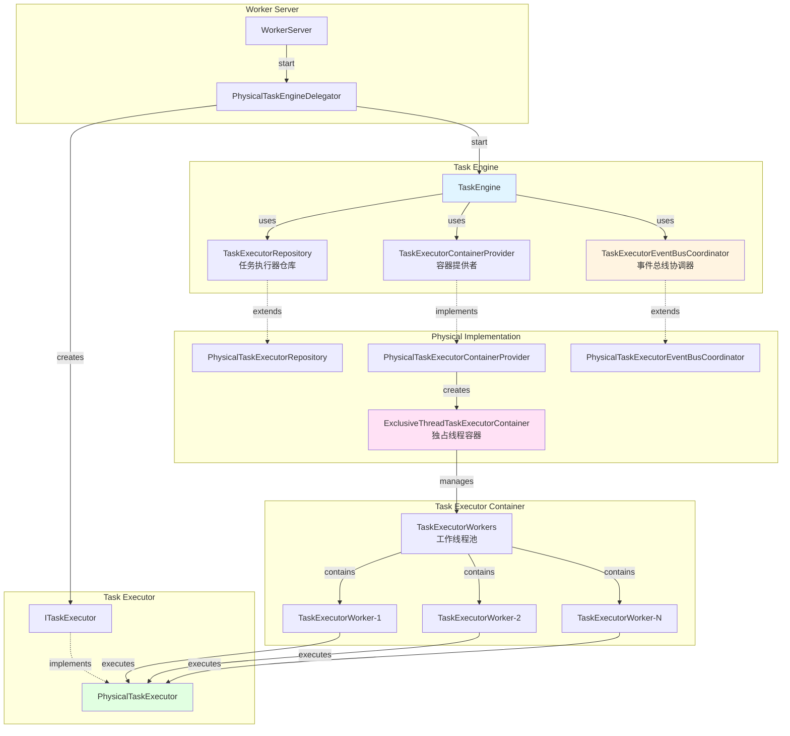
```mermaid
graph TB
    subgraph "Worker Server"
        WS[WorkerServer]
        PTED[PhysicalTaskEngineDelegator]
    end

    subgraph "Task Engine"
        TE[TaskEngine]
        TER[TaskExecutorRepository<br/>任务执行器仓库]
        TECP[TaskExecutorContainerProvider<br/>容器提供者]
        TEC[TaskExecutorEventBusCoordinator<br/>事件总线协调器]
    end

    subgraph "Physical Implementation"
        PTER[PhysicalTaskExecutorRepository]
        PTECP[PhysicalTaskExecutorContainerProvider]
        PTEC[PhysicalTaskExecutorEventBusCoordinator]
        ETC[ExclusiveThreadTaskExecutorContainer<br/>独占线程容器]
    end

    subgraph "Task Executor Container"
        TEW[TaskExecutorWorkers<br/>工作线程池]
        TEW1[TaskExecutorWorker-1]
        TEW2[TaskExecutorWorker-2]
        TEWN[TaskExecutorWorker-N]
    end

    subgraph "Task Executor"
        ITE[ITaskExecutor]
        PTE[PhysicalTaskExecutor]
    end

    WS -->|start| PTED
    PTED -->|start| TE
    TE -->|uses| TER
    TE -->|uses| TECP
    TE -->|uses| TEC

    TER -.->|extends| PTER
    TECP -.->|implements| PTECP
    TEC -.->|extends| PTEC

    PTECP -->|creates| ETC
    ETC -->|manages| TEW
    TEW -->|contains| TEW1
    TEW -->|contains| TEW2
    TEW -->|contains| TEWN

    PTED -->|creates| ITE
    ITE -.->|implements| PTE

    TEW1 -->|executes| PTE
    TEW2 -->|executes| PTE
    TEWN -->|executes| PTE

    style TE fill:#e1f5ff
    style TEC fill:#fff4e1
    style ETC fill:#ffe1f5
    style PTE fill:#e1ffe1
```

### 3.2 核心组件说明

#### 3.2.1 TaskEngine（任务引擎）

**职责**:
- 管理任务执行器的生命周期（提交、暂停、杀死）
- 协调任务执行器容器、仓库和事件总线

**核心方法**:
- `start()`: 启动任务引擎
- `submitTask(ITaskExecutor)`: 提交任务执行器
- `pauseTask(int)`: 暂停任务
- `killTask(int)`: 杀死任务
- `close()`: 关闭任务引擎

**代码位置**: [TaskEngine.java](../../../../dolphinscheduler-task-executor/src/main/java/org/apache/dolphinscheduler/task/executor/TaskEngine.java)

#### 3.2.2 TaskExecutorRepository（任务执行器仓库）

**职责**:
- 存储和管理所有任务执行器实例
- 提供任务执行器的查询、添加、删除功能

**核心方法**:
- `put(ITaskExecutor)`: 添加任务执行器
- `get(Integer)`: 根据ID获取任务执行器
- `getAll()`: 获取所有任务执行器
- `remove(Integer)`: 移除任务执行器

**代码位置**:
- 接口: [ITaskExecutorRepository.java](../../../../dolphinscheduler-task-executor/src/main/java/org/apache/dolphinscheduler/task/executor/ITaskExecutorRepository.java)
- 实现: [PhysicalTaskExecutorRepository.java](../../../src/main/java/org/apache/dolphinscheduler/server/worker/executor/PhysicalTaskExecutorRepository.java)

#### 3.2.3 TaskExecutorContainerProvider（任务执行器容器提供者）

**职责**:
- 提供任务执行器容器实例
- 物理任务使用 `ExclusiveThreadTaskExecutorContainer`（独占线程容器）

**代码位置**:
- 接口: [ITaskExecutorContainerProvider.java](../../../../dolphinscheduler-task-executor/src/main/java/org/apache/dolphinscheduler/task/executor/container/ITaskExecutorContainerProvider.java)
- 实现: [PhysicalTaskExecutorContainerProvider.java](../../../src/main/java/org/apache/dolphinscheduler/server/worker/executor/PhysicalTaskExecutorContainerProvider.java)

#### 3.2.4 ExclusiveThreadTaskExecutorContainer（独占线程容器）

**职责**:
- 为每个任务执行器分配一个独占的工作线程
- 管理任务执行器的分发、启动、暂停、杀死和终结

**核心方法**:
- `dispatch(ITaskExecutor)`: 分发任务执行器到空闲Worker
- `start(ITaskExecutor)`: 启动任务执行器
- `pause(ITaskExecutor)`: 暂停任务执行器
- `kill(ITaskExecutor)`: 杀死任务执行器
- `finalize(ITaskExecutor)`: 终结任务执行器

**代码位置**:
- 抽象类: [AbstractTaskExecutorContainer.java](../../../../dolphinscheduler-task-executor/src/main/java/org/apache/dolphinscheduler/task/executor/container/AbstractTaskExecutorContainer.java)
- 实现: [ExclusiveThreadTaskExecutorContainer.java](../../../../dolphinscheduler-task-executor/src/main/java/org/apache/dolphinscheduler/task/executor/container/ExclusiveThreadTaskExecutorContainer.java)

#### 3.2.5 TaskExecutorEventBusCoordinator（事件总线协调器）

**职责**:
- 定期轮询所有任务执行器的事件总线
- 触发任务执行器的生命周期事件监听器

**工作原理**:
1. 主线程每 50ms 执行一次 `fireTaskExecutorEventBus()`
2. 遍历所有任务执行器，检查是否有待处理事件
3. 将事件处理任务提交到工作线程池异步执行
4. 根据事件类型调用相应的生命周期事件监听器

**代码位置**: [TaskExecutorEventBusCoordinator.java](../../../../dolphinscheduler-task-executor/src/main/java/org/apache/dolphinscheduler/task/executor/eventbus/TaskExecutorEventBusCoordinator.java)

## 四、任务提交流程

### 4.1 任务提交时序图

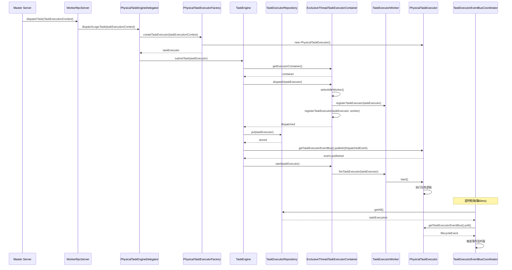
```mermaid
sequenceDiagram
    participant Master as Master Server
    participant WRPC as WorkerRpcServer
    participant PTED as PhysicalTaskEngineDelegator
    participant PTEF as PhysicalTaskExecutorFactory
    participant TE as TaskEngine
    participant TER as TaskExecutorRepository
    participant ETC as ExclusiveThreadTaskExecutorContainer
    participant TEW as TaskExecutorWorker
    participant PTE as PhysicalTaskExecutor
    participant TEC as TaskExecutorEventBusCoordinator

    Master->>WRPC: dispatchTask(TaskExecutionContext)
    WRPC->>PTED: dispatchLogicTask(taskExecutionContext)
    PTED->>PTEF: createTaskExecutor(taskExecutionContext)
    PTEF->>PTE: new PhysicalTaskExecutor()
    PTEF-->>PTED: taskExecutor

    PTED->>TE: submitTask(taskExecutor)
    TE->>ETC: getExecutorContainer()
    ETC-->>TE: container
    TE->>ETC: dispatch(taskExecutor)
    ETC->>ETC: selectIdleWorker()
    ETC->>TEW: registerTaskExecutor(taskExecutor)
    ETC->>ETC: registerTaskExecutor(taskExecutor, worker)
    ETC-->>TE: dispatched

    TE->>TER: put(taskExecutor)
    TER-->>TE: stored
    TE->>PTE: getTaskExecutorEventBus().publish(DispatchedEvent)
    PTE-->>TE: event published
    TE->>ETC: start(taskExecutor)
    ETC->>TEW: fireTaskExecutor(taskExecutor)
    TEW->>PTE: start()
    PTE->>PTE: 执行任务逻辑

    Note over TEC: 定时轮询(每50ms)
    TEC->>TER: getAll()
    TER-->>TEC: taskExecutors
    TEC->>PTE: getTaskExecutorEventBus().poll()
    PTE-->>TEC: lifecycleEvent
    TEC->>TEC: 触发事件监听器
```

### 4.2 任务提交详细流程

#### 4.2.1 Master 分发任务到 Worker

Master 通过 RPC 调用 Worker 的 `dispatchTask()` 方法，传递 `TaskExecutionContext`。

**代码位置**: [PhysicalTaskEngineDelegator.java:58-61](../../../src/main/java/org/apache/dolphinscheduler/server/worker/executor/PhysicalTaskEngineDelegator.java#L58-L61)

#### 4.2.2 创建任务执行器

`PhysicalTaskExecutorFactory` 根据 `TaskExecutionContext` 创建 `PhysicalTaskExecutor` 实例。

**代码位置**: [PhysicalTaskExecutorFactory.java:49-60](../../../src/main/java/org/apache/dolphinscheduler/server/worker/executor/PhysicalTaskExecutorFactory.java#L49-L60)

#### 4.2.3 提交任务到引擎

`TaskEngine.submitTask()` 执行以下步骤：

1. **获取容器**: 从 `TaskExecutorContainerProvider` 获取容器
2. **分发任务**: 调用容器的 `dispatch()` 方法，将任务分发到空闲Worker
3. **存储任务**: 将任务执行器添加到 `TaskExecutorRepository`
4. **发布事件**: 发布 `TaskExecutorDispatchedLifecycleEvent`
5. **启动任务**: 调用容器的 `start()` 方法启动任务执行器

**代码位置**: [TaskEngine.java:57-65](../../../../dolphinscheduler-task-executor/src/main/java/org/apache/dolphinscheduler/task/executor/TaskEngine.java#L57-L65)

#### 4.2.4 容器分发任务

`ExclusiveThreadTaskExecutorContainer.dispatch()` 执行以下步骤：

1. **选择空闲Worker**: 调用 `selectIdleWorker()` 选择一个空闲的 `TaskExecutorWorker`
2. **注册任务**: 将任务执行器注册到选中的Worker
3. **记录映射**: 在 `TaskExecutorAssignmentTable` 中记录任务执行器与Worker的映射关系

**代码位置**: [AbstractTaskExecutorContainer.java:57-69](../../../../dolphinscheduler-task-executor/src/main/java/org/apache/dolphinscheduler/task/executor/container/AbstractTaskExecutorContainer.java#L57-L69)

#### 4.2.5 Worker 启动任务

`TaskExecutorWorker.fireTaskExecutor()` 触发任务执行器的 `start()` 方法，任务开始执行。

**代码位置**: [AbstractTaskExecutorContainer.java:72-80](../../../../dolphinscheduler-task-executor/src/main/java/org/apache/dolphinscheduler/task/executor/container/AbstractTaskExecutorContainer.java#L72-L80)

## 五、任务执行器生命周期事件

### 5.1 事件类型

任务执行器在生命周期中会发布以下事件：

1. **DISPATCHED**: 任务已分发到容器
2. **RUNNING**: 任务开始执行
3. **RUNTIME_CONTEXT_CHANGE**: 运行时上下文变更（如应用链接）
4. **PAUSE**: 暂停请求
5. **PAUSED**: 任务已暂停
6. **KILL**: 杀死请求
7. **KILLED**: 任务已杀死
8. **SUCCESS**: 任务执行成功
9. **FAILED**: 任务执行失败
10. **FINALIZE**: 任务终结

### 5.2 事件流转图

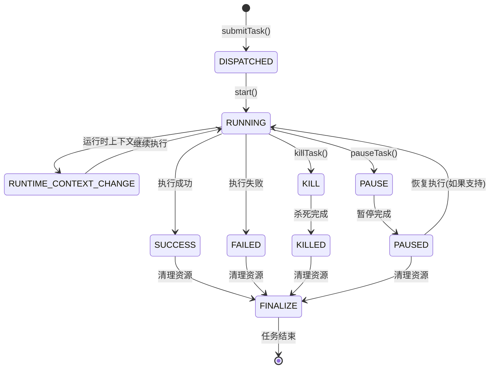
```mermaid
stateDiagram-v2
    [*] --> DISPATCHED: submitTask()
    DISPATCHED --> RUNNING: start()
    RUNNING --> RUNTIME_CONTEXT_CHANGE: 运行时上下文变更
    RUNTIME_CONTEXT_CHANGE --> RUNNING: 继续执行
    RUNNING --> PAUSE: pauseTask()
    PAUSE --> PAUSED: 暂停完成
    PAUSED --> RUNNING: 恢复执行(如果支持)
    RUNNING --> KILL: killTask()
    KILL --> KILLED: 杀死完成
    RUNNING --> SUCCESS: 执行成功
    RUNNING --> FAILED: 执行失败
    SUCCESS --> FINALIZE: 清理资源
    FAILED --> FINALIZE: 清理资源
    KILLED --> FINALIZE: 清理资源
    PAUSED --> FINALIZE: 清理资源
    FINALIZE --> [*]: 任务结束
```

### 5.3 事件处理流程

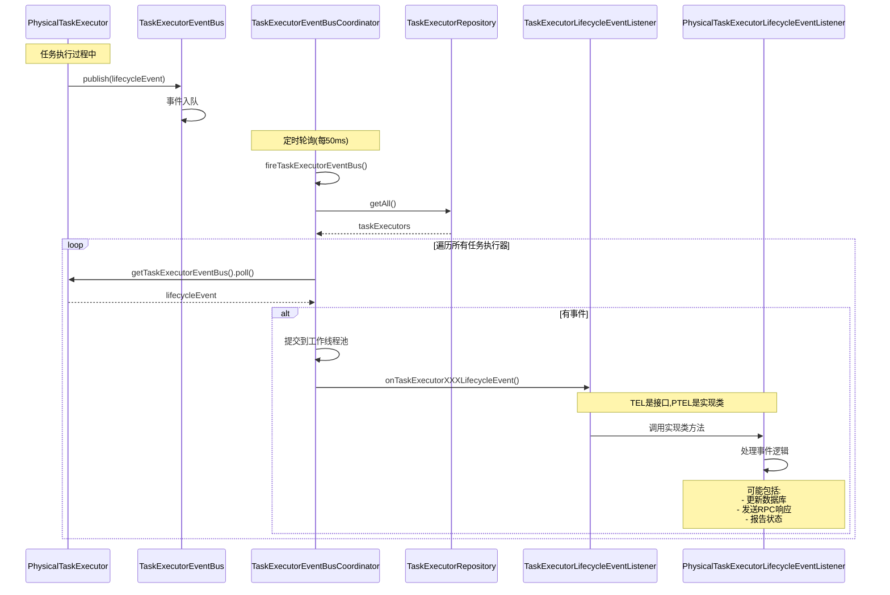
```mermaid
sequenceDiagram
    participant PTE as PhysicalTaskExecutor
    participant TEB as TaskExecutorEventBus
    participant TEC as TaskExecutorEventBusCoordinator
    participant TER as TaskExecutorRepository
    participant TEL as TaskExecutorLifecycleEventListener
    participant PTEL as PhysicalTaskExecutorLifecycleEventListener

    Note over PTE: 任务执行过程中
    PTE->>TEB: publish(lifecycleEvent)
    TEB->>TEB: 事件入队

    Note over TEC: 定时轮询(每50ms)
    TEC->>TEC: fireTaskExecutorEventBus()
    TEC->>TER: getAll()
    TER-->>TEC: taskExecutors
    loop 遍历所有任务执行器
        TEC->>PTE: getTaskExecutorEventBus().poll()
        PTE-->>TEC: lifecycleEvent
        alt 有事件
            TEC->>TEC: 提交到工作线程池
            TEC->>TEL: onTaskExecutorXXXLifecycleEvent()
            Note over TEL,PTEL: TEL是接口,PTEL是实现类
            TEL->>PTEL: 调用实现类方法
            PTEL->>PTEL: 处理事件逻辑
            Note over PTEL: 可能包括:<br/>- 更新数据库<br/>- 发送RPC响应<br/>- 报告状态
        end
    end
```

**代码位置**: [TaskExecutorEventBusCoordinator.java:109-197](../../../../dolphinscheduler-task-executor/src/main/java/org/apache/dolphinscheduler/task/executor/eventbus/TaskExecutorEventBusCoordinator.java#L109-L197)

## 六、类图

### 6.1 核心类关系图

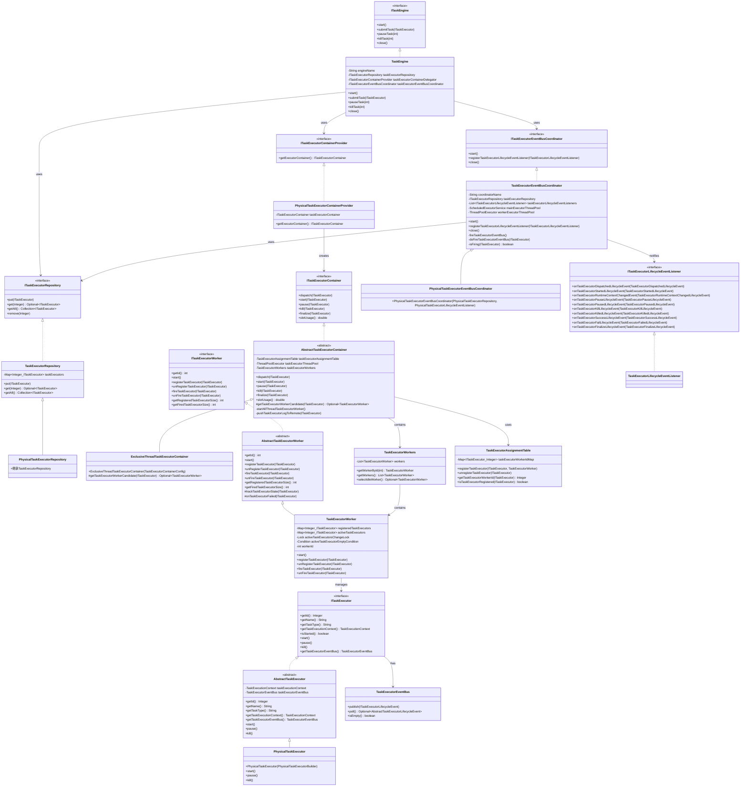
```mermaid
classDiagram
    class ITaskEngine {
        <<interface>>
        +start()
        +submitTask(ITaskExecutor)
        +pauseTask(int)
        +killTask(int)
        +close()
    }

    class TaskEngine {
        -String engineName
        -ITaskExecutorRepository taskExecutorRepository
        -ITaskExecutorContainerProvider taskExecutorContainerDelegator
        -ITaskExecutorEventBusCoordinator taskExecutorEventBusCoordinator
        +start()
        +submitTask(ITaskExecutor)
        +pauseTask(int)
        +killTask(int)
        +close()
    }

    class ITaskExecutorRepository {
        <<interface>>
        +put(ITaskExecutor)
        +get(Integer) Optional~ITaskExecutor~
        +getAll() Collection~ITaskExecutor~
        +remove(Integer)
    }

    class TaskExecutorRepository {
        -Map~Integer_ITaskExecutor~ taskExecutors
        +put(ITaskExecutor)
        +get(Integer) Optional~ITaskExecutor~
        +getAll() Collection~ITaskExecutor~
    }

    class PhysicalTaskExecutorRepository {
        +继承TaskExecutorRepository
    }

    class ITaskExecutorContainerProvider {
        <<interface>>
        +getExecutorContainer() ITaskExecutorContainer
    }

    class PhysicalTaskExecutorContainerProvider {
        -ITaskExecutorContainer taskExecutorContainer
        +getExecutorContainer() ITaskExecutorContainer
    }

    class ITaskExecutorContainer {
        <<interface>>
        +dispatch(ITaskExecutor)
        +start(ITaskExecutor)
        +pause(ITaskExecutor)
        +kill(ITaskExecutor)
        +finalize(ITaskExecutor)
        +slotUsage() double
    }

    class AbstractTaskExecutorContainer {
        <<abstract>>
        -TaskExecutorAssignmentTable taskExecutorAssignmentTable
        -ThreadPoolExecutor taskExecutorThreadPool
        -TaskExecutorWorkers taskExecutorWorkers
        +dispatch(ITaskExecutor)
        +start(ITaskExecutor)
        +pause(ITaskExecutor)
        +kill(ITaskExecutor)
        +finalize(ITaskExecutor)
        +slotUsage() double
        #getTaskExecutorWorkerCandidate(ITaskExecutor) Optional~TaskExecutorWorker~
        -startAllThreadTaskExecutorWorker()
        -pushTaskExecutorLogToRemote(ITaskExecutor)
    }

    class ExclusiveThreadTaskExecutorContainer {
        +ExclusiveThreadTaskExecutorContainer(TaskExecutorContainerConfig)
        #getTaskExecutorWorkerCandidate(ITaskExecutor) Optional~TaskExecutorWorker~
    }

    class ITaskExecutorWorker {
        <<interface>>
        +getId() int
        +start()
        +registerTaskExecutor(ITaskExecutor)
        +unRegisterTaskExecutor(ITaskExecutor)
        +fireTaskExecutor(ITaskExecutor)
        +unFireTaskExecutor(ITaskExecutor)
        +getRegisteredTaskExecutorSize() int
        +getFiredTaskExecutorSize() int
    }

    class AbstractTaskExecutorWorker {
        <<abstract>>
        +getId() int
        +start()
        +registerTaskExecutor(ITaskExecutor)
        +unRegisterTaskExecutor(ITaskExecutor)
        +fireTaskExecutor(ITaskExecutor)
        +unFireTaskExecutor(ITaskExecutor)
        +getRegisteredTaskExecutorSize() int
        +getFiredTaskExecutorSize() int
        #trackTaskExecutorState(ITaskExecutor)
        #onTaskExecutorFailed(ITaskExecutor)
    }

    class TaskExecutorWorker {
        -Map~Integer_ITaskExecutor~ registeredTaskExecutors
        -Map~Integer_ITaskExecutor~ activeTaskExecutors
        -Lock activeTaskExecutorsChangeLock
        -Condition activeTaskExecutorEmptyCondition
        -int workerId
        +start()
        +registerTaskExecutor(ITaskExecutor)
        +unRegisterTaskExecutor(ITaskExecutor)
        +fireTaskExecutor(ITaskExecutor)
        +unFireTaskExecutor(ITaskExecutor)
    }

    class TaskExecutorWorkers {
        -List~TaskExecutorWorker~ workers
        +getWorkerById(int) TaskExecutorWorker
        +getWorkers() List~TaskExecutorWorker~
        +selectIdleWorker() Optional~TaskExecutorWorker~
    }

    class TaskExecutorAssignmentTable {
        -Map~ITaskExecutor_Integer~ taskExecutorWorkerIdMap
        +registerTaskExecutor(ITaskExecutor, TaskExecutorWorker)
        +unregisterTaskExecutor(ITaskExecutor)
        +getTaskExecutorWorkerId(ITaskExecutor) Integer
        +isTaskExecutorRegistered(ITaskExecutor) boolean
    }

    class ITaskExecutor {
        <<interface>>
        +getId() Integer
        +getName() String
        +getTaskType() String
        +getTaskExecutionContext() TaskExecutionContext
        +isStarted() boolean
        +start()
        +pause()
        +kill()
        +getTaskExecutorEventBus() TaskExecutorEventBus
    }

    class AbstractTaskExecutor {
        <<abstract>>
        -TaskExecutionContext taskExecutionContext
        -TaskExecutorEventBus taskExecutorEventBus
        +getId() Integer
        +getName() String
        +getTaskType() String
        +getTaskExecutionContext() TaskExecutionContext
        +getTaskExecutorEventBus() TaskExecutorEventBus
        +start()
        +pause()
        +kill()
    }

    class PhysicalTaskExecutor {
        +PhysicalTaskExecutor(PhysicalTaskExecutorBuilder)
        +start()
        +pause()
        +kill()
    }

    class ITaskExecutorEventBusCoordinator {
        <<interface>>
        +start()
        +registerTaskExecutorLifecycleEventListener(ITaskExecutorLifecycleEventListener)
        +close()
    }

    class TaskExecutorEventBusCoordinator {
        -String coordinatorName
        -ITaskExecutorRepository taskExecutorRepository
        -List~ITaskExecutorLifecycleEventListener~ taskExecutorLifecycleEventListeners
        -ScheduledExecutorService mainExecutorThreadPool
        -ThreadPoolExecutor workerExecutorThreadPool
        +start()
        +registerTaskExecutorLifecycleEventListener(ITaskExecutorLifecycleEventListener)
        +close()
        -fireTaskExecutorEventBus()
        -doFireTaskExecutorEventBus(ITaskExecutor)
        -isFiring(ITaskExecutor) boolean
    }

    class PhysicalTaskExecutorEventBusCoordinator {
        +PhysicalTaskExecutorEventBusCoordinator(PhysicalTaskExecutorRepository, PhysicalTaskExecutorLifecycleEventListener)
    }

    class ITaskExecutorLifecycleEventListener {
        <<interface>>
        +onTaskExecutorDispatchedLifecycleEvent(TaskExecutorDispatchedLifecycleEvent)
        +onTaskExecutorStartedLifecycleEvent(TaskExecutorStartedLifecycleEvent)
        +onTaskExecutorRuntimeContextChangedEvent(TaskExecutorRuntimeContextChangedLifecycleEvent)
        +onTaskExecutorPauseLifecycleEvent(TaskExecutorPauseLifecycleEvent)
        +onTaskExecutorPausedLifecycleEvent(TaskExecutorPausedLifecycleEvent)
        +onTaskExecutorKillLifecycleEvent(TaskExecutorKillLifecycleEvent)
        +onTaskExecutorKilledLifecycleEvent(TaskExecutorKilledLifecycleEvent)
        +onTaskExecutorSuccessLifecycleEvent(TaskExecutorSuccessLifecycleEvent)
        +onTaskExecutorFailLifecycleEvent(TaskExecutorFailedLifecycleEvent)
        +onTaskExecutorFinalizeLifecycleEvent(TaskExecutorFinalizeLifecycleEvent)
    }

    class TaskExecutorEventBus {
        +publish(ITaskExecutorLifecycleEvent)
        +poll() Optional~AbstractTaskExecutorLifecycleEvent~
        +isEmpty() boolean
    }

    %% 类关系
    ITaskEngine <|.. TaskEngine
    ITaskExecutorRepository <|.. TaskExecutorRepository
    TaskExecutorRepository <|-- PhysicalTaskExecutorRepository
    ITaskExecutorContainerProvider <|.. PhysicalTaskExecutorContainerProvider
    ITaskExecutorContainer <|.. AbstractTaskExecutorContainer
    AbstractTaskExecutorContainer <|-- ExclusiveThreadTaskExecutorContainer
    ITaskExecutorWorker <|.. AbstractTaskExecutorWorker
    AbstractTaskExecutorWorker <|-- TaskExecutorWorker
    ITaskExecutor <|.. AbstractTaskExecutor
    AbstractTaskExecutor <|-- PhysicalTaskExecutor
    ITaskExecutorEventBusCoordinator <|.. TaskExecutorEventBusCoordinator
    TaskExecutorEventBusCoordinator <|-- PhysicalTaskExecutorEventBusCoordinator
    ITaskExecutorLifecycleEventListener <|.. TaskExecutorLifecycleEventListener

    TaskEngine --> ITaskExecutorRepository : uses
    TaskEngine --> ITaskExecutorContainerProvider : uses
    TaskEngine --> ITaskExecutorEventBusCoordinator : uses
    PhysicalTaskExecutorContainerProvider --> ITaskExecutorContainer : creates
    AbstractTaskExecutorContainer --> TaskExecutorWorkers : contains
    AbstractTaskExecutorContainer --> TaskExecutorAssignmentTable : uses
    TaskExecutorWorkers --> TaskExecutorWorker : contains
    TaskExecutorWorker --> ITaskExecutor : manages
    TaskExecutorEventBusCoordinator --> ITaskExecutorRepository : uses
    TaskExecutorEventBusCoordinator --> ITaskExecutorLifecycleEventListener : notifies
    ITaskExecutor --> TaskExecutorEventBus : has
```

**代码位置**:
- [AbstractTaskExecutorContainer.java](../../../../dolphinscheduler-task-executor/src/main/java/org/apache/dolphinscheduler/task/executor/container/AbstractTaskExecutorContainer.java)
- [ExclusiveThreadTaskExecutorContainer.java](../../../../dolphinscheduler-task-executor/src/main/java/org/apache/dolphinscheduler/task/executor/container/ExclusiveThreadTaskExecutorContainer.java)
- [TaskExecutorWorker.java](../../../../dolphinscheduler-task-executor/src/main/java/org/apache/dolphinscheduler/task/executor/worker/TaskExecutorWorker.java)
- [ITaskExecutor.java](../../../../dolphinscheduler-task-executor/src/main/java/org/apache/dolphinscheduler/task/executor/ITaskExecutor.java)
- [TaskExecutorEventBusCoordinator.java](../../../../dolphinscheduler-task-executor/src/main/java/org/apache/dolphinscheduler/task/executor/eventbus/TaskExecutorEventBusCoordinator.java)

## 七、组件交互详细分析

### 7.1 任务执行器容器工作流程

#### 7.1.1 容器初始化

当 `PhysicalTaskExecutorContainerProvider` 创建容器时：

1. **创建线程池**: 根据配置创建固定大小的线程池
   - **代码位置**: [AbstractTaskExecutorContainer.java:47-54](../../../../dolphinscheduler-task-executor/src/main/java/org/apache/dolphinscheduler/task/executor/container/AbstractTaskExecutorContainer.java#L47-L54)

2. **创建工作线程集合**: 创建 `TaskExecutorWorkers`，包含多个 `TaskExecutorWorker`
   - **代码位置**: [AbstractTaskExecutorContainer.java:51](../../../../dolphinscheduler-task-executor/src/main/java/org/apache/dolphinscheduler/task/executor/container/AbstractTaskExecutorContainer.java#L51)

3. **启动所有Worker线程**: 为每个Worker提交启动任务到线程池
   - **代码位置**: [AbstractTaskExecutorContainer.java:123-127](../../../../dolphinscheduler-task-executor/src/main/java/org/apache/dolphinscheduler/task/executor/container/AbstractTaskExecutorContainer.java#L123-L127)

#### 7.1.2 任务分发流程

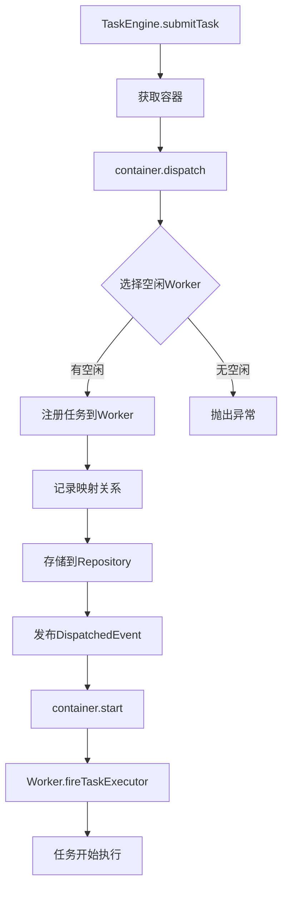
```mermaid
flowchart TD
    A[TaskEngine.submitTask] --> B[获取容器]
    B --> C[container.dispatch]
    C --> D{选择空闲Worker}
    D -->|有空闲| E[注册任务到Worker]
    D -->|无空闲| F[抛出异常]
    E --> G[记录映射关系]
    G --> H[存储到Repository]
    H --> I[发布DispatchedEvent]
    I --> J[container.start]
    J --> K[Worker.fireTaskExecutor]
    K --> L[任务开始执行]
```

**代码位置**: 
- [AbstractTaskExecutorContainer.java:57-69](../../../../dolphinscheduler-task-executor/src/main/java/org/apache/dolphinscheduler/task/executor/container/AbstractTaskExecutorContainer.java#L57-L69)
- [ExclusiveThreadTaskExecutorContainer.java:39-41](../../../../dolphinscheduler-task-executor/src/main/java/org/apache/dolphinscheduler/task/executor/container/ExclusiveThreadTaskExecutorContainer.java#L39-L41)

#### 7.1.3 Worker 执行任务流程

`TaskExecutorWorker` 的主循环逻辑：

1. **检查已激活任务**: 遍历 `activeTaskExecutors` 中的所有任务
2. **启动未启动任务**: 如果任务未启动，调用 `taskExecutor.start()`
3. **跟踪任务状态**: 调用 `trackTaskExecutorState()` 跟踪任务状态
4. **等待条件**: 如果没有激活任务，等待条件信号；否则等待最小跟踪延迟时间

**代码位置**: [TaskExecutorWorker.java:58-95](../../../../dolphinscheduler-task-executor/src/main/java/org/apache/dolphinscheduler/task/executor/worker/TaskExecutorWorker.java#L58-L95)

### 7.2 事件总线协调器工作流程

#### 7.2.1 事件轮询机制

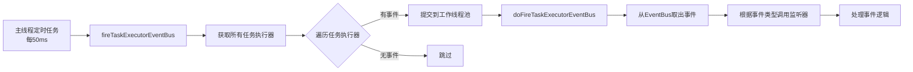
```mermaid
flowchart LR
    A[主线程定时任务<br/>每50ms] --> B[fireTaskExecutorEventBus]
    B --> C[获取所有任务执行器]
    C --> D{遍历任务执行器}
    D -->|有事件| E[提交到工作线程池]
    D -->|无事件| F[跳过]
    E --> G[doFireTaskExecutorEventBus]
    G --> H[从EventBus取出事件]
    H --> I[根据事件类型调用监听器]
    I --> J[处理事件逻辑]
```

**代码位置**: [TaskExecutorEventBusCoordinator.java:82-95](../../../../dolphinscheduler-task-executor/src/main/java/org/apache/dolphinscheduler/task/executor/eventbus/TaskExecutorEventBusCoordinator.java#L82-L95)

#### 7.2.2 事件处理流程

事件处理采用异步方式，避免阻塞主轮询线程：

1. **主线程**: 每50ms轮询一次，检查所有任务执行器的事件总线
2. **工作线程池**: 将事件处理任务提交到工作线程池异步执行
3. **事件分发**: 根据事件类型（DISPATCHED、RUNNING、SUCCESS等）调用相应的监听器方法

**代码位置**: [TaskExecutorEventBusCoordinator.java:109-197](../../../../dolphinscheduler-task-executor/src/main/java/org/apache/dolphinscheduler/task/executor/eventbus/TaskExecutorEventBusCoordinator.java#L109-L197)

## 八、关键设计模式

### 8.1 策略模式

- **ITaskExecutorContainerProvider**: 提供不同的容器实现策略
- **ITaskExecutorFactory**: 提供不同的任务执行器创建策略

### 8.2 观察者模式

- **TaskExecutorEventBus**: 任务执行器发布生命周期事件
- **ITaskExecutorLifecycleEventListener**: 监听器订阅并处理事件

### 8.3 模板方法模式

- **AbstractTaskExecutorContainer**: 定义容器操作的模板方法
- **AbstractTaskExecutorWorker**: 定义Worker执行的模板方法

### 8.4 工厂模式

- **PhysicalTaskEngineFactory**: 创建任务引擎实例
- **PhysicalTaskExecutorFactory**: 创建任务执行器实例

## 九、总结

任务引擎是 DolphinScheduler Worker 的核心组件，负责：

1. **任务管理**: 通过 `TaskExecutorRepository` 管理所有任务执行器
2. **任务执行**: 通过 `ExclusiveThreadTaskExecutorContainer` 为每个任务分配独占线程
3. **事件处理**: 通过 `TaskExecutorEventBusCoordinator` 异步处理任务生命周期事件
4. **资源隔离**: 每个任务在独立的线程中执行，互不干扰

这种设计确保了任务执行的可靠性和可扩展性，同时通过事件驱动机制实现了组件间的解耦。

## 十、设计模式深度分析：为什么使用构造函数注入而非Spring依赖注入

### 10.1 问题背景

在 `PhysicalTaskEngineFactory.createTaskEngine()` 方法中，`TaskEngine` 通过有参构造函数初始化，而不是直接在 `TaskEngine` 类中使用 `@Autowired` 进行依赖注入。这种设计有其深层的架构考虑。

**代码位置**: [PhysicalTaskEngineFactory.java:38-46](../../../src/main/java/org/apache/dolphinscheduler/server/worker/executor/PhysicalTaskEngineFactory.java#L38-L46)

### 10.2 设计对比

#### 10.2.1 当前设计（构造函数注入）

```java
// TaskEngine - 纯POJO类，无Spring注解
public class TaskEngine implements ITaskEngine {
    private final ITaskExecutorRepository taskExecutorRepository;
    private final ITaskExecutorContainerProvider taskExecutorContainerDelegator;
    private final ITaskExecutorEventBusCoordinator taskExecutorEventBusCoordinator;
    
    public TaskEngine(final TaskEngineBuilder taskEngineBuilder) {
        this.taskExecutorRepository = taskEngineBuilder.getTaskExecutorRepository();
        // ...
    }
}

// PhysicalTaskEngineFactory - Spring组件
@Component
public class PhysicalTaskEngineFactory {
    @Autowired
    private PhysicalTaskExecutorRepository physicalTaskExecutorRepository;
    
    public TaskEngine createTaskEngine() {
        return new TaskEngine(TaskEngineBuilder.builder()
            .taskExecutorRepository(physicalTaskExecutorRepository)
            .build());
    }
}
```

#### 10.2.2 替代方案（Spring依赖注入）

```java
// 如果使用Spring依赖注入
@Component
public class TaskEngine implements ITaskEngine {
    @Autowired
    private ITaskExecutorRepository taskExecutorRepository;
    
    @Autowired
    private ITaskExecutorContainerProvider taskExecutorContainerDelegator;
    
    @Autowired
    private ITaskExecutorEventBusCoordinator taskExecutorEventBusCoordinator;
}
```

### 10.3 设计优势分析

#### 10.3.1 框架解耦（Framework Independence）

**优势**: `TaskEngine` 不依赖 Spring 框架，是一个纯 POJO 类。

**原因**:
- `TaskEngine` 位于 `dolphinscheduler-task-executor` 模块，这是一个核心业务模块
- 该模块应该保持框架无关性，可以在不同的框架环境中使用
- 如果未来需要支持其他依赖注入框架（如 Guice、Dagger），无需修改 `TaskEngine` 代码

**代码证据**: [TaskEngine.java](../../../../dolphinscheduler-task-executor/src/main/java/org/apache/dolphinscheduler/task/executor/TaskEngine.java) - 没有任何 Spring 注解

#### 10.3.2 多实现支持（Multiple Implementations）

**优势**: 同一个 `TaskEngine` 类可以有不同的实现配置。

**实际案例**:
- **PhysicalTaskEngine**: Worker 节点使用，处理物理任务执行
  - 使用 `PhysicalTaskExecutorRepository`
  - 使用 `PhysicalTaskExecutorContainerProvider`
  - 使用 `PhysicalTaskExecutorEventBusCoordinator`
  
- **LogicTaskEngine**: Master 节点使用，处理逻辑任务执行
  - 使用 `LogicTaskExecutorRepository`
  - 使用 `LogicTaskExecutorContainerProvider`
  - 使用 `LogicTaskExecutorEventBusCoordinator`

**代码位置**:
- [PhysicalTaskEngineFactory.java](../../../src/main/java/org/apache/dolphinscheduler/server/worker/executor/PhysicalTaskEngineFactory.java)
- [LogicTaskEngineFactory.java](../../../../dolphinscheduler-master/src/main/java/org/apache/dolphinscheduler/server/master/engine/executor/LogicTaskEngineFactory.java)

**如果使用 Spring 依赖注入的问题**:
- Spring 默认是单例模式，只能有一个 `TaskEngine` 实例
- 无法同时支持 Physical 和 Logic 两种不同的配置
- 需要复杂的条件注解（`@ConditionalOnProperty`）来区分，代码复杂度增加

#### 10.3.3 可测试性（Testability）

**优势**: 更容易进行单元测试，可以手动注入 Mock 对象。

**测试场景**:
```java
// 使用构造函数注入，可以轻松创建测试实例
@Test
public void testTaskEngine() {
    ITaskExecutorRepository mockRepository = Mockito.mock(ITaskExecutorRepository.class);
    ITaskExecutorContainerProvider mockProvider = Mockito.mock(ITaskExecutorContainerProvider.class);
    ITaskExecutorEventBusCoordinator mockCoordinator = Mockito.mock(ITaskExecutorEventBusCoordinator.class);
    
    TaskEngine taskEngine = new TaskEngine(TaskEngineBuilder.builder()
        .taskExecutorRepository(mockRepository)
        .taskExecutorContainerDelegator(mockProvider)
        .taskExecutorEventBusCoordinator(mockCoordinator)
        .build());
    
    // 进行测试...
}
```

**如果使用 Spring 依赖注入的问题**:
- 需要启动 Spring 容器（`@SpringBootTest`），测试启动慢
- 需要配置测试配置类，测试代码复杂
- 难以隔离测试，容易受到其他 Bean 的影响

#### 10.3.4 依赖明确性（Explicit Dependencies）

**优势**: 构造函数强制要求所有依赖，编译时就能发现缺失的依赖。

**构造函数注入的特点**:
- 所有依赖必须在创建时提供，无法遗漏
- 使用 `final` 字段，确保不可变性
- 编译时检查，避免运行时 `NullPointerException`

**代码证据**: [TaskEngine.java:43-48](../../../../dolphinscheduler-task-executor/src/main/java/org/apache/dolphinscheduler/task/executor/TaskEngine.java#L43-L48)

```java
public TaskEngine(final TaskEngineBuilder taskEngineBuilder) {
    this.engineName = taskEngineBuilder.getEngineName();
    this.taskExecutorContainerDelegator = taskEngineBuilder.getTaskExecutorContainerDelegator();
    this.taskExecutorRepository = taskEngineBuilder.getTaskExecutorRepository();
    this.taskExecutorEventBusCoordinator = taskEngineBuilder.getTaskExecutorEventBusCoordinator();
    // 所有字段都是 final，必须在构造函数中初始化
}
```

#### 10.3.5 控制创建时机（Controlled Creation）

**优势**: 可以在需要时才创建 `TaskEngine` 实例，而不是 Spring 容器启动时。

**当前实现**:
- `TaskEngine` 在 `PhysicalTaskEngineDelegator` 构造函数中创建
- 可以延迟到真正需要时才创建
- 可以基于运行时条件创建不同的配置

**代码位置**: [PhysicalTaskEngineDelegator.java:61-69](../../../src/main/java/org/apache/dolphinscheduler/server/worker/executor/PhysicalTaskEngineDelegator.java#L61-L69)

#### 10.3.6 多实例支持（Multiple Instances）

**优势**: 理论上可以创建多个 `TaskEngine` 实例，每个实例有不同的配置。

**使用场景**:
- 可以为不同的租户创建独立的 `TaskEngine` 实例
- 可以为不同的任务类型创建专门的 `TaskEngine` 实例
- 支持更细粒度的资源隔离

**如果使用 Spring 依赖注入的问题**:
- Spring 默认单例，需要额外配置才能支持多实例
- 使用 `@Scope("prototype")` 会增加复杂度
- 难以管理多个实例的生命周期

### 10.4 设计模式应用

#### 10.4.1 工厂模式（Factory Pattern）

`PhysicalTaskEngineFactory` 和 `LogicTaskEngineFactory` 实现了工厂模式：
- 封装了 `TaskEngine` 的创建逻辑
- 隐藏了复杂的构建过程
- 提供了统一的创建接口

#### 10.4.2 建造者模式（Builder Pattern）

`TaskEngineBuilder` 实现了建造者模式：
- 提供了流畅的 API
- 支持可选参数
- 确保构建过程的正确性

**代码位置**: [TaskEngineBuilder.java](../../../../dolphinscheduler-task-executor/src/main/java/org/apache/dolphinscheduler/task/executor/TaskEngineBuilder.java)

#### 10.4.3 依赖注入模式（Dependency Injection）

虽然不使用 Spring 的自动注入，但实现了手动依赖注入：
- 通过构造函数注入依赖
- 依赖关系清晰明确
- 支持依赖替换和测试

### 10.5 总结

使用构造函数注入而非 Spring 依赖注入的设计决策，主要基于以下考虑：

1. **架构清晰**: 核心业务模块不依赖框架，保持可移植性
2. **灵活扩展**: 支持多种实现（Physical/Logic），易于扩展
3. **易于测试**: 无需 Spring 容器，测试简单快速
4. **依赖明确**: 编译时检查，避免运行时错误
5. **控制力强**: 可以精确控制创建时机和实例数量

这种设计体现了**关注点分离**和**依赖倒置**的原则，是面向对象设计的最佳实践。

## 十一、任务日志机制分析

### 11.1 概述

DolphinScheduler 使用 Logback 的 SiftingAppender 和 MDC（Mapped Diagnostic Context）机制，实现了每个任务实例有独立日志文件的功能。日志文件路径与任务信息对应，便于日志管理和问题排查。

### 11.2 logPath 设置时机和流程

#### 11.2.1 logPath 设置流程

任务的 logPath 在 Worker 端创建 PhysicalTaskExecutor 时设置，然后通过事件机制传递回 Master 端并更新到数据库。

**完整流程**:

```
Master端创建TaskInstance
    ↓ logPath = null
Master端构建TaskExecutionContext
    ↓ logPath = null (从TaskInstance获取)
Master端发送任务到Worker
    ↓
Worker端创建PhysicalTaskExecutor
    ↓ assemblyTaskLogPath()
    ↓ LogUtils.getTaskInstanceLogFullPath()
    ↓ logPath = "/logs/20240101/123456/1/100/200.log"  ← 在这里设置！
    ↓
任务开始执行
    ↓ publishTaskRunningEvent()
    ↓ TaskExecutorStartedLifecycleEvent.of(this)
    ↓ 事件包含logPath
    ↓
Worker端通过RPC发送事件到Master
    ↓
Master端接收TaskRunningLifecycleEvent
    ↓ persistentTaskInstanceStartedEventToDB()
    ↓ taskInstance.setLogPath(taskRunningEvent.getLogPath())
    ↓ 更新到数据库
```

#### 11.2.2 关键代码位置

1. **Master端创建TaskInstance时（初始化为null）**
   - **位置**: [FirstRunTaskInstanceFactory.java:62](../../../../dolphinscheduler-master/src/main/java/org/apache/dolphinscheduler/server/master/engine/task/runnable/FirstRunTaskInstanceFactory.java#L62)
   ```java
   taskInstance.setLogPath(null);  // 初始化为null
   ```

2. **Master端构建TaskExecutionContext时（从TaskInstance获取，仍为null）**
   - **位置**: [TaskExecutionContextBuilder.java:67](../../../../dolphinscheduler-master/src/main/java/org/apache/dolphinscheduler/server/master/engine/task/runnable/TaskExecutionContextBuilder.java#L67)
   ```java
   taskExecutionContext.setLogPath(taskInstance.getLogPath());  // 此时为null
   ```

3. **Worker端创建PhysicalTaskExecutor时（设置完整路径）** ⭐ **关键位置**
   - **位置**: [PhysicalTaskExecutorFactory.java:50-64](../../../src/main/java/org/apache/dolphinscheduler/server/worker/executor/PhysicalTaskExecutorFactory.java#L50-L64)
   ```java
   @Override
   public ITaskExecutor createTaskExecutor(final TaskExecutionContext taskExecutionContext) {
       assemblyTaskLogPath(taskExecutionContext);  // 在这里设置logPath
       // ...
   }
   
   private void assemblyTaskLogPath(final TaskExecutionContext taskExecutionContext) {
       taskExecutionContext.setLogPath(LogUtils.getTaskInstanceLogFullPath(taskExecutionContext));
   }
   ```

4. **logPath生成规则**
   - **位置**: [LogUtils.java:89-127](../../../../dolphinscheduler-task-plugin/dolphinscheduler-task-api/src/main/java/org/apache/dolphinscheduler/plugin/task/api/utils/LogUtils.java#L89-L127)
   - **路径格式**: `{log.base}/{taskSubmitTime}/{workflowDefinitionCode}/{workflowDefinitionVersion}/{workflowInstanceId}/{taskInstanceId}.log`
   - **示例**: `/logs/20240101/123456/1/100/200.log`

5. **任务开始执行时（发布事件，包含logPath）**
   - **位置**: [AbstractTaskExecutor.java:133-136](../../../../dolphinscheduler-task-executor/src/main/java/org/apache/dolphinscheduler/task/executor/AbstractTaskExecutor.java#L133-L136)
   ```java
   private void publishTaskRunningEvent() {
       transitTaskExecutorState(TaskExecutorState.RUNNING);
       taskExecutorEventBus.publish(TaskExecutorStartedLifecycleEvent.of(this));  // 事件中包含logPath
   }
   ```

6. **Master端接收事件并更新数据库（持久化logPath）**
   - **位置**: [AbstractTaskStateAction.java:117-124](../../../../dolphinscheduler-master/src/main/java/org/apache/dolphinscheduler/server/master/engine/task/statemachine/AbstractTaskStateAction.java#L117-L124)
   ```java
   protected void persistentTaskInstanceStartedEventToDB(final ITaskExecutionRunnable taskExecutionRunnable,
                                                       final TaskRunningLifecycleEvent taskRunningEvent) {
       final TaskInstance taskInstance = taskExecutionRunnable.getTaskInstance();
       taskInstance.setLogPath(taskRunningEvent.getLogPath());  // 更新到数据库
       taskInstanceDao.updateById(taskInstance);
   }
   ```

### 11.3 日志写入对应目录的实现机制

#### 11.3.1 核心原理

使用 **Logback SiftingAppender + MDC（Mapped Diagnostic Context）** 机制：
- **SiftingAppender**: 根据 MDC 中的路径值动态创建不同的 FileAppender
- **MDC**: 线程本地存储，每个线程有独立的上下文
- **TaskLogDiscriminator**: 从 MDC 中获取路径作为区分值
- **TaskLogFilter**: 过滤掉没有设置 MDC 的日志

#### 11.3.2 Logback 配置

**位置**: [logback-spring.xml:35-53](../../../src/main/resources/logback-spring.xml#L35-L53)

```xml
<appender name="TASKLOGFILE" class="ch.qos.logback.classic.sift.SiftingAppender">
    <!-- 过滤器：只处理设置了MDC的日志 -->
    <filter class="org.apache.dolphinscheduler.plugin.task.api.log.TaskLogFilter"/>
    
    <!-- 区分器：从MDC中获取taskInstanceLogFullPath作为区分值 -->
    <Discriminator class="org.apache.dolphinscheduler.plugin.task.api.log.TaskLogDiscriminator">
        <key>taskInstanceLogFullPath</key>
        <logBase>${log.base}</logBase>
    </Discriminator>
    
    <!-- 动态创建FileAppender，文件名来自MDC中的taskInstanceLogFullPath -->
    <sift>
        <appender name="FILE-${taskInstanceLogFullPath}" class="ch.qos.logback.core.FileAppender">
            <file>${taskInstanceLogFullPath}</file>  <!-- 使用MDC中的完整路径 -->
            <encoder>
                <pattern>%date{yyyy-MM-dd HH:mm:ss.SSS} %-5level [%thread] - %message%n</pattern>
                <charset>UTF-8</charset>
            </encoder>
            <append>true</append>
        </appender>
    </sift>
</appender>
```

#### 11.3.3 TaskLogDiscriminator（从MDC获取路径）

**位置**: [TaskLogDiscriminator.java:39-46](../../../../dolphinscheduler-task-plugin/dolphinscheduler-task-api/src/main/java/org/apache/dolphinscheduler/plugin/task/api/log/TaskLogDiscriminator.java#L39-L46)

```java
@Override
public String getDiscriminatingValue(ILoggingEvent event) {
    // 从MDC中获取taskInstanceLogFullPath
    String taskInstanceLogPath = MDC.get(LogUtils.TASK_INSTANCE_LOG_FULL_PATH_MDC_KEY);
    if (taskInstanceLogPath == null) {
        log.error("The task instance log path is null, please check the logback configuration, log: {}", event);
    }
    return taskInstanceLogPath;  // 返回路径，SiftingAppender会根据这个值创建对应的FileAppender
}
```

#### 11.3.4 TaskLogFilter（过滤非任务日志）

**位置**: [TaskLogFilter.java:36-39](../../../../dolphinscheduler-task-plugin/dolphinscheduler-task-api/src/main/java/org/apache/dolphinscheduler/plugin/task/api/log/TaskLogFilter.java#L36-L39)

```java
@Override
public FilterReply decide(ILoggingEvent event) {
    // 如果MDC中没有taskInstanceLogFullPath，拒绝该日志（不写入任务日志文件）
    return MDC.get(LogUtils.TASK_INSTANCE_LOG_FULL_PATH_MDC_KEY) == null 
        ? FilterReply.DENY 
        : FilterReply.ACCEPT;
}
```

#### 11.3.5 设置MDC（在任务执行时）

**位置**: [TaskExecutorMDCUtils.java:38-50](../../../../dolphinscheduler-task-executor/src/main/java/org/apache/dolphinscheduler/task/executor/log/TaskExecutorMDCUtils.java#L38-L50)

```java
public static MDCAutoClosable logWithMDC(final int taskExecutorId, final String logPath) {
    // 将logPath放入MDC（线程本地存储）
    if (logPath != null) {
        MDC.put(TASK_INSTANCE_LOG_FULL_PATH_MDC_KEY, logPath);
    }
    
    MDC.put(Constants.TASK_INSTANCE_ID_MDC_KEY, String.valueOf(taskExecutorId));
    
    // 返回AutoCloseable，在try-with-resources结束时自动清理MDC
    return () -> {
        MDC.remove(TASK_INSTANCE_LOG_FULL_PATH_MDC_KEY);
        MDC.remove(Constants.TASK_INSTANCE_ID_MDC_KEY);
    };
}
```

#### 11.3.6 MDC使用位置

##### 11.3.6.1 TaskExecutorWorker（任务执行线程）

**位置**: [TaskExecutorWorker.java:62](../../../../dolphinscheduler-task-executor/src/main/java/org/apache/dolphinscheduler/task/executor/worker/TaskExecutorWorker.java#L62)

```java
try (final MDCAutoClosable closable = TaskExecutorMDCUtils.logWithMDC(taskExecutor)) {
    // 在这个代码块内，所有日志都会写入到taskExecutor.getLogPath()对应的文件
    taskExecutor.start();
    trackTaskExecutorState(taskExecutor);
    // ...
} // 自动清理MDC
```

##### 11.3.6.2 TaskExecutorEventBusCoordinator（事件处理）

**位置**: [TaskExecutorEventBusCoordinator.java:476](../../../../dolphinscheduler-task-executor/src/main/java/org/apache/dolphinscheduler/task/executor/eventbus/TaskExecutorEventBusCoordinator.java#L476)

```java
try (final TaskExecutorMDCUtils.MDCAutoClosable ignored = TaskExecutorMDCUtils.logWithMDC(taskExecutor)) {
    // 处理事件时的日志也会写入到对应的任务日志文件
    doFireTaskExecutorEventBus(taskExecutor);
}
```

##### 11.3.6.3 AbstractCommandExecutor（命令执行器）

**位置**: [AbstractCommandExecutor.java:295](../../../../dolphinscheduler-task-plugin/dolphinscheduler-task-api/src/main/java/org/apache/dolphinscheduler/plugin/task/api/AbstractCommandExecutor.java#L295)

```java
LogUtils.setTaskInstanceLogFullPathMDC(taskRequest.getLogPath());
// 处理任务输出时的日志写入对应文件
```

### 11.4 日志写入完整流程图

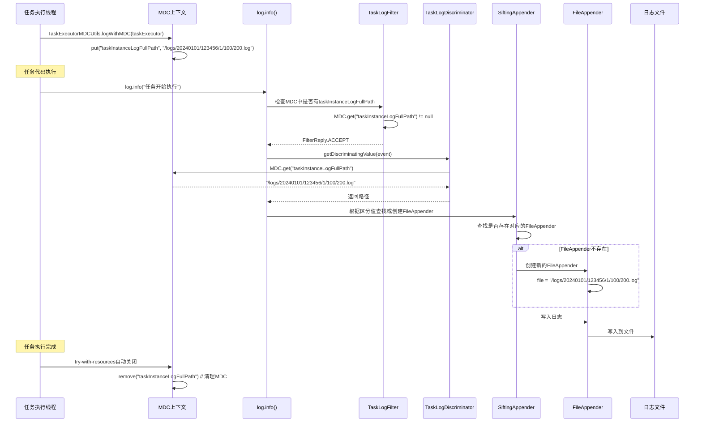
```mermaid
sequenceDiagram
    participant Task as 任务执行线程
    participant MDC as MDC上下文
    participant Log as log.info()
    participant Filter as TaskLogFilter
    participant Discriminator as TaskLogDiscriminator
    participant SiftingAppender as SiftingAppender
    participant FileAppender as FileAppender
    participant File as 日志文件

    Task->>MDC: TaskExecutorMDCUtils.logWithMDC(taskExecutor)
    MDC->>MDC: put("taskInstanceLogFullPath", "/logs/20240101/123456/1/100/200.log")
    
    Note over Task: 任务代码执行
    Task->>Log: log.info("任务开始执行")
    
    Log->>Filter: 检查MDC中是否有taskInstanceLogFullPath
    Filter->>Filter: MDC.get("taskInstanceLogFullPath") != null
    Filter-->>Log: FilterReply.ACCEPT
    
    Log->>Discriminator: getDiscriminatingValue(event)
    Discriminator->>MDC: MDC.get("taskInstanceLogFullPath")
    MDC-->>Discriminator: "/logs/20240101/123456/1/100/200.log"
    Discriminator-->>Log: 返回路径
    
    Log->>SiftingAppender: 根据区分值查找或创建FileAppender
    SiftingAppender->>SiftingAppender: 查找是否存在对应的FileAppender
    alt FileAppender不存在
        SiftingAppender->>FileAppender: 创建新的FileAppender
        FileAppender->>FileAppender: file = "/logs/20240101/123456/1/100/200.log"
    end
    
    SiftingAppender->>FileAppender: 写入日志
    FileAppender->>File: 写入到文件
    
    Note over Task: 任务执行完成
    Task->>MDC: try-with-resources自动关闭
    MDC->>MDC: remove("taskInstanceLogFullPath")  // 清理MDC
```

### 11.5 日志文件路径结构

```
logs/
  └── 20240101/              # 任务首次提交日期 (YYYYMMDD)
      └── 123456/            # workflowDefinitionCode (工作流定义编码)
          └── 1/             # workflowDefinitionVersion (工作流定义版本)
              └── 100/       # workflowInstanceId (工作流实例ID)
                  └── 200.log # taskInstanceId.log (任务实例ID.log)
```

**路径生成代码**: [LogUtils.java:109-127](../../../../dolphinscheduler-task-plugin/dolphinscheduler-task-api/src/main/java/org/apache/dolphinscheduler/plugin/task/api/utils/LogUtils.java#L109-L127)

### 11.6 关键设计点

#### 11.6.1 线程本地存储（MDC）

- **特点**: 每个线程有独立的 MDC，不同任务线程互不影响
- **优势**: 多任务并发执行时，日志不会混淆
- **清理**: 使用 try-with-resources 确保 MDC 在使用后自动清理，避免内存泄漏

#### 11.6.2 动态 Appender

- **特点**: SiftingAppender 根据 MDC 值动态创建 FileAppender
- **优势**: 每个任务有独立的日志文件，无需预先配置
- **性能**: 首次创建 FileAppender 后，后续日志直接写入，性能开销小

#### 11.6.3 过滤机制

- **特点**: TaskLogFilter 确保只有设置了 MDC 的日志才写入任务日志文件
- **优势**: 系统日志和任务日志分离，避免任务日志文件包含无关信息
- **实现**: 通过检查 MDC 中是否存在 `taskInstanceLogFullPath` 来决定是否接受日志

#### 11.6.4 自动清理

- **特点**: 使用 try-with-resources 和 AutoCloseable 接口
- **优势**: 确保 MDC 在使用后自动清理，避免线程池复用导致的日志混乱
- **实现**: `TaskExecutorMDCUtils.logWithMDC()` 返回 `MDCAutoClosable`，在 try 块结束时自动调用 `close()`

### 11.7 日志机制总结

DolphinScheduler 的日志机制实现了以下目标：

1. **独立日志文件**: 每个任务实例有独立的日志文件，路径与任务信息对应
2. **自动路径生成**: logPath 在 Worker 端自动生成，无需手动配置
3. **动态文件创建**: 根据任务执行时设置的 MDC 值，动态创建对应的日志文件
4. **线程安全**: 使用线程本地存储（MDC），多任务并发执行时互不干扰
5. **自动清理**: 任务执行完成后自动清理 MDC，避免内存泄漏和日志混乱

这种设计确保了日志管理的可靠性和可维护性，同时通过 MDC 机制实现了日志写入的自动化和透明化。

### 11.8 MDC 自动清理机制详解

#### 11.8.1 为什么需要自动清理 MDC？

MDC 使用 ThreadLocal 实现线程本地存储，如果不及时清理，会导致以下问题：

1. **内存泄漏**: ThreadLocal 中的值会一直存在，直到线程销毁或显式清理
2. **日志混乱**: 线程池复用线程时，前一个任务的 MDC 值会影响后续任务
3. **线程安全**: 多任务并发执行时，如果 MDC 未清理，可能导致日志写入错误的文件

#### 11.8.2 TaskExecutorMDCUtils 的自动清理实现

**位置**: [TaskExecutorMDCUtils.java:38-50](../../../../dolphinscheduler-task-executor/src/main/java/org/apache/dolphinscheduler/task/executor/log/TaskExecutorMDCUtils.java#L38-L50)

```java
public static MDCAutoClosable logWithMDC(final int taskExecutorId, final String logPath) {
    // 设置 MDC
    if (logPath != null) {
        MDC.put(TASK_INSTANCE_LOG_FULL_PATH_MDC_KEY, logPath);
    }
    MDC.put(Constants.TASK_INSTANCE_ID_MDC_KEY, String.valueOf(taskExecutorId));
    
    // 返回 Lambda 表达式，实现 AutoCloseable 接口
    return () -> {
        MDC.remove(TASK_INSTANCE_LOG_FULL_PATH_MDC_KEY);
        MDC.remove(Constants.TASK_INSTANCE_ID_MDC_KEY);
    };
}
```

#### 11.8.3 Lambda 表达式的工作原理

**关键代码**: [TaskExecutorMDCUtils.java:46-49](../../../../dolphinscheduler-task-executor/src/main/java/org/apache/dolphinscheduler/task/executor/log/TaskExecutorMDCUtils.java#L46-L49)

这个 Lambda 表达式实现了 `MDCAutoClosable` 接口（继承自 `AutoCloseable`），工作原理如下：

##### 11.8.3.1 接口定义

```java
public interface MDCAutoClosable extends AutoCloseable {
    @Override
    void close();
}
```

##### 11.8.3.2 Lambda 表达式实现

```java
return () -> {
    MDC.remove(TASK_INSTANCE_LOG_FULL_PATH_MDC_KEY);
    MDC.remove(Constants.TASK_INSTANCE_ID_MDC_KEY);
};
```

这个 Lambda 表达式等价于：

```java
return new MDCAutoClosable() {
    @Override
    public void close() {
        MDC.remove(TASK_INSTANCE_LOG_FULL_PATH_MDC_KEY);
        MDC.remove(Constants.TASK_INSTANCE_ID_MDC_KEY);
    }
};
```

##### 11.8.3.3 try-with-resources 自动调用

```java
try (final MDCAutoClosable closable = TaskExecutorMDCUtils.logWithMDC(taskExecutor)) {
    // MDC 已设置
    taskExecutor.start();
    trackTaskExecutorState(taskExecutor);
} // 自动调用 closable.close()
  // → 执行 Lambda 表达式
  // → MDC.remove("taskInstanceLogFullPath")
  // → MDC.remove("taskInstanceId")
```

#### 11.8.4 执行时机和流程

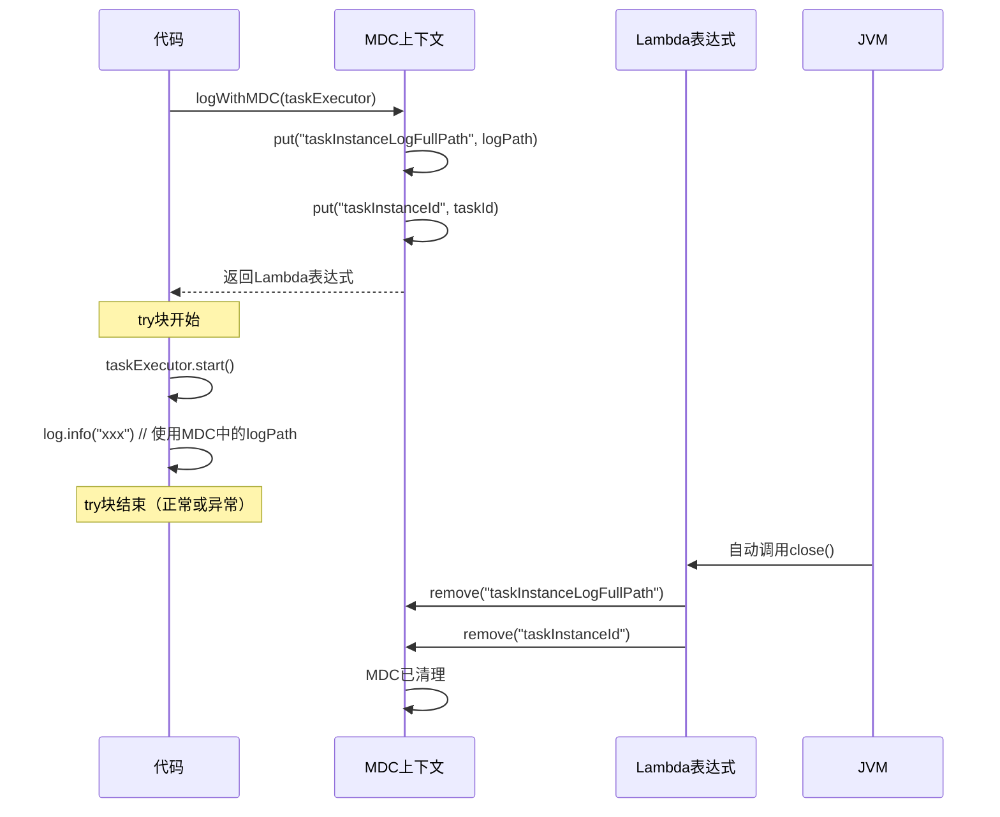
```mermaid
sequenceDiagram
    participant Code as 代码
    participant MDC as MDC上下文
    participant Lambda as Lambda表达式
    participant JVM as JVM

    Code->>MDC: logWithMDC(taskExecutor)
    MDC->>MDC: put("taskInstanceLogFullPath", logPath)
    MDC->>MDC: put("taskInstanceId", taskId)
    MDC-->>Code: 返回Lambda表达式
    
    Note over Code: try块开始
    Code->>Code: taskExecutor.start()
    Code->>Code: log.info("xxx")  // 使用MDC中的logPath
    
    Note over Code: try块结束（正常或异常）
    JVM->>Lambda: 自动调用close()
    Lambda->>MDC: remove("taskInstanceLogFullPath")
    Lambda->>MDC: remove("taskInstanceId")
    MDC->>MDC: MDC已清理
```

#### 11.8.5 为什么使用 Lambda 表达式？

##### 优势

1. **代码简洁**: Lambda 表达式比匿名内部类更简洁
2. **延迟执行**: 清理逻辑只在需要时执行（try 块结束时）
3. **自动调用**: try-with-resources 确保即使发生异常也会清理
4. **类型安全**: 编译时检查，确保实现了 AutoCloseable 接口

##### 对比传统方式

**传统方式（容易遗漏清理）**:
```java
MDC.put("taskInstanceLogFullPath", logPath);
try {
    taskExecutor.start();
} finally {
    MDC.remove("taskInstanceLogFullPath");  // 容易忘记
}
```

**使用 Lambda + try-with-resources（自动清理）**:
```java
try (final MDCAutoClosable closable = TaskExecutorMDCUtils.logWithMDC(taskExecutor)) {
    taskExecutor.start();
} // 自动清理，不会遗漏
```

#### 11.8.6 线程池复用场景下的重要性

在 `TaskExecutorWorker` 中，线程池会复用线程执行多个任务：

```java
// TaskExecutorWorker 的线程池
ThreadPoolExecutor taskExecutorThreadPool = ...;

// 线程1执行任务A
taskExecutorThreadPool.submit(() -> {
    try (MDCAutoClosable closable = logWithMDC(taskA)) {
        taskA.start();  // MDC: logPath = "/logs/.../taskA.log"
    } // 自动清理 MDC
});

// 线程1复用，执行任务B
taskExecutorThreadPool.submit(() -> {
    try (MDCAutoClosable closable = logWithMDC(taskB)) {
        taskB.start();  // MDC: logPath = "/logs/.../taskB.log"
    } // 自动清理 MDC
});
```

**如果没有自动清理**:
- 任务A执行后，MDC 中仍保留 taskA 的 logPath
- 线程复用执行任务B时，如果忘记设置 MDC，日志会写入 taskA 的日志文件
- 导致日志混乱，难以排查问题

**使用自动清理**:
- 任务A执行完成后，MDC 自动清理
- 任务B执行时，重新设置 MDC
- 确保每个任务的日志写入正确的文件

#### 11.8.7 异常情况下的清理保证

try-with-resources 确保即使发生异常，MDC 也会被清理：

```java
try (final MDCAutoClosable closable = TaskExecutorMDCUtils.logWithMDC(taskExecutor)) {
    taskExecutor.start();  // 可能抛出异常
    trackTaskExecutorState(taskExecutor);  // 可能抛出异常
} catch (Throwable e) {
    log.error("执行失败", e);
} // 无论是否发生异常，都会调用 closable.close() 清理 MDC
```

**JVM 保证**:
- try-with-resources 会在 try 块结束时（正常或异常）自动调用 `close()` 方法
- 即使 `close()` 方法本身抛出异常，也会先执行清理逻辑

#### 11.8.8 使用示例

##### 示例1：TaskExecutorWorker 中的使用

**位置**: [TaskExecutorWorker.java:62-79](../../../../dolphinscheduler-task-executor/src/main/java/org/apache/dolphinscheduler/task/executor/worker/TaskExecutorWorker.java#L62-L79)

```java
for (final ITaskExecutor taskExecutor : activeTaskExecutors.values()) {
    try (final MDCAutoClosable closable = TaskExecutorMDCUtils.logWithMDC(taskExecutor)) {
        if (!taskExecutor.isStarted()) {
            taskExecutor.start();  // 日志写入 taskExecutor.getLogPath()
        }
        trackTaskExecutorState(taskExecutor);  // 日志写入 taskExecutor.getLogPath()
    } // 自动清理 MDC
}
```

##### 示例2：TaskExecutorEventBusCoordinator 中的使用

**位置**: [TaskExecutorEventBusCoordinator.java:476](../../../../dolphinscheduler-task-executor/src/main/java/org/apache/dolphinscheduler/task/executor/eventbus/TaskExecutorEventBusCoordinator.java#L476)

```java
try (final TaskExecutorMDCUtils.MDCAutoClosable ignored = TaskExecutorMDCUtils.logWithMDC(taskExecutor)) {
    doFireTaskExecutorEventBus(taskExecutor);  // 事件处理日志写入对应文件
} // 自动清理 MDC
```

#### 11.8.9 总结

MDC 自动清理机制通过以下方式实现：

1. **Lambda 表达式**: 返回一个实现了 `AutoCloseable` 接口的 Lambda，包含清理逻辑
2. **try-with-resources**: 确保在代码块结束时自动调用 `close()` 方法
3. **线程安全**: 每个线程有独立的 MDC，清理操作只影响当前线程
4. **异常安全**: 即使发生异常，也会确保清理 MDC

这种设计确保了：
- ✅ **内存安全**: 避免 ThreadLocal 内存泄漏
- ✅ **日志准确**: 每个任务的日志写入正确的文件
- ✅ **线程安全**: 多任务并发执行时互不干扰
- ✅ **代码简洁**: 使用 try-with-resources，无需手动清理