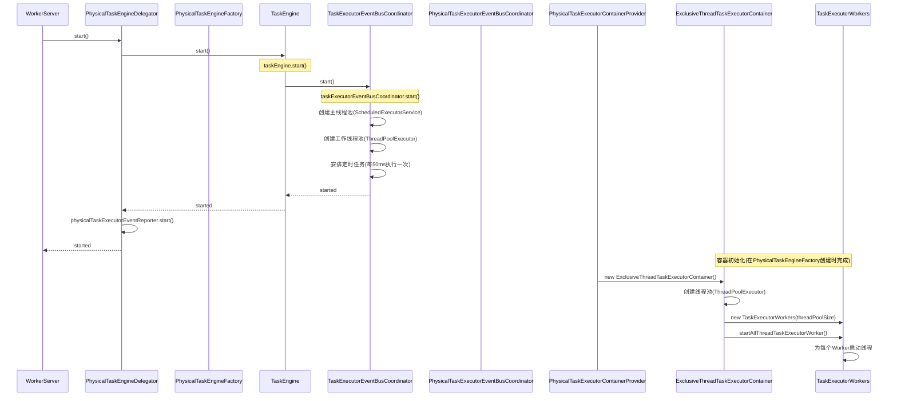
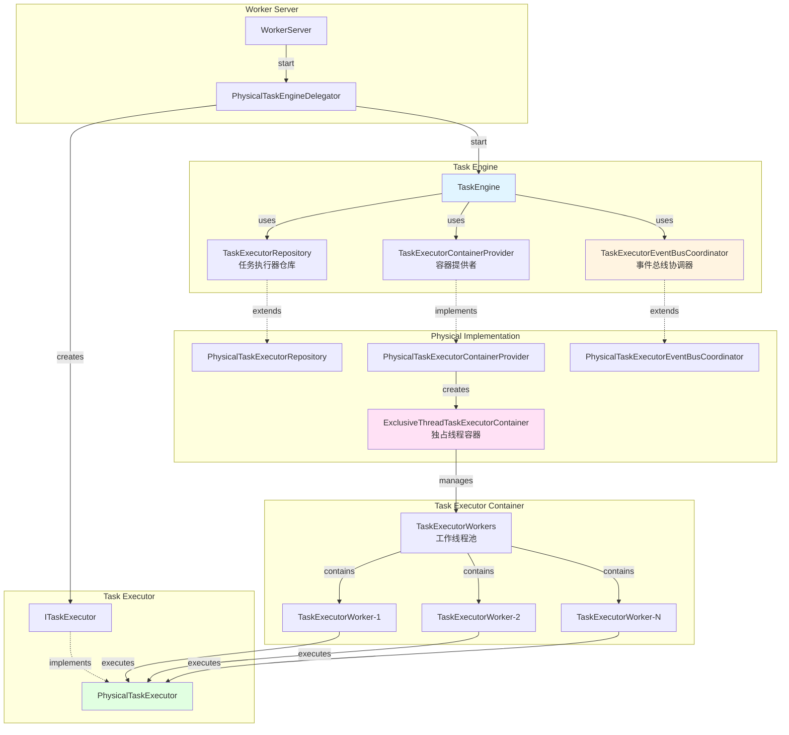
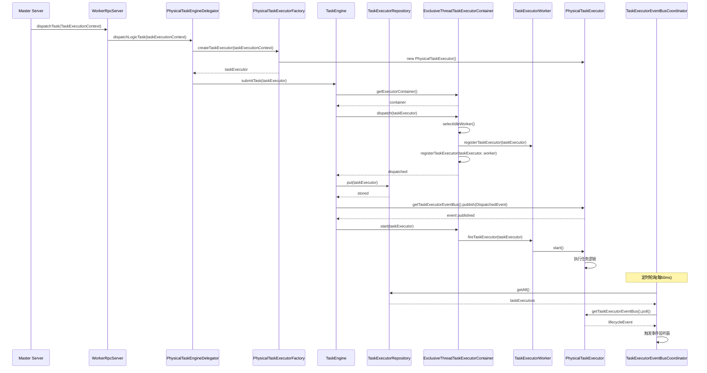
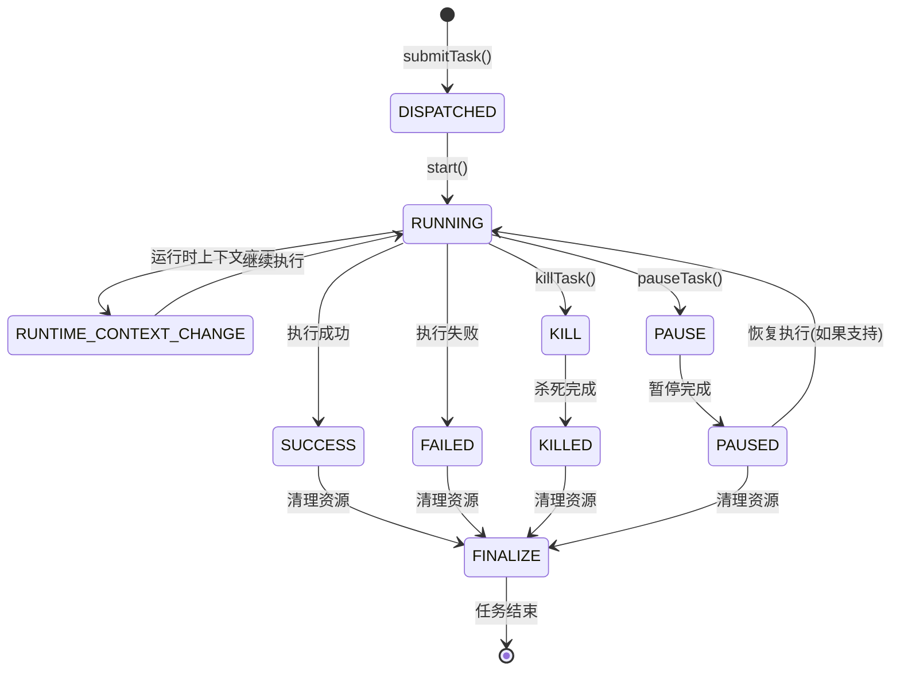
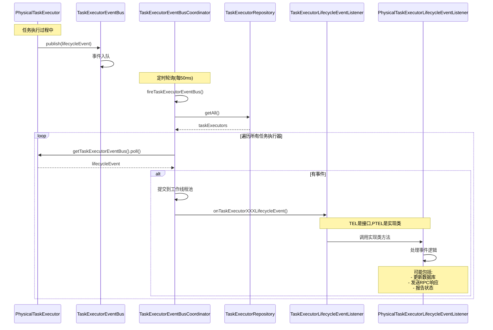
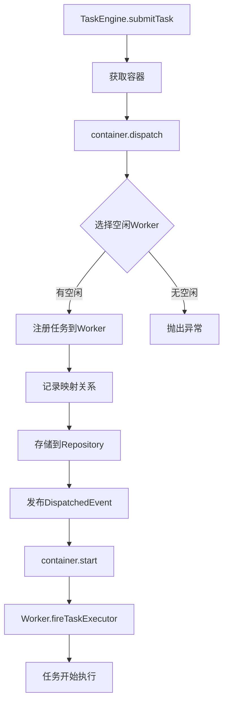
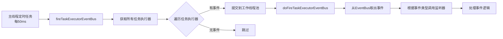

# 任务引擎详细分析

## 一、概述

任务引擎（TaskEngine）是 DolphinScheduler Worker 中负责管理和执行任务的核心组件。本文档详细分析任务引擎的启动流程、架构设计、组件交互和状态流转。

### 1.1 核心代码位置

- **任务引擎启动入口**: [PhysicalTaskEngineDelegator.java:53](../../../src/main/java/org/apache/dolphinscheduler/server/worker/executor/PhysicalTaskEngineDelegator.java#L53)
- **任务引擎实现**: [TaskEngine.java](../../../../dolphinscheduler-task-executor/src/main/java/org/apache/dolphinscheduler/task/executor/TaskEngine.java)
- **任务引擎接口**: [ITaskEngine.java](../../../../dolphinscheduler-task-executor/src/main/java/org/apache/dolphinscheduler/task/executor/ITaskEngine.java)

## 二、任务引擎启动流程

### 2.1 启动时序图



### 2.2 启动流程详细说明

#### 2.2.1 WorkerServer 启动任务引擎

在 WorkerServer 的 `run()` 方法中，按以下顺序启动组件：

1. **启动 RPC 服务**: `workerRpcServer.start()`
2. **加载任务插件**: `TaskPluginManager.loadTaskPlugin()`
3. **初始化数据源**: `DataSourceProcessorProvider.initialize()`
4. **启动注册中心客户端**: `workerRegistryClient.start()`
5. **启动任务引擎委托器**: `physicalTaskEngineDelegator.start()` ← **本文档重点**

**代码位置**: [WorkerServer.java:90](../../../src/main/java/org/apache/dolphinscheduler/server/worker/WorkerServer.java#L90)

#### 2.2.2 PhysicalTaskEngineDelegator 启动

`PhysicalTaskEngineDelegator` 是任务引擎的委托器，负责协调任务引擎的启动和任务分发。

**启动步骤**:
1. 调用 `taskEngine.start()` 启动任务引擎
2. 调用 `physicalTaskExecutorEventReporter.start()` 启动事件报告器

**代码位置**: [PhysicalTaskEngineDelegator.java:52-56](../../../src/main/java/org/apache/dolphinscheduler/server/worker/executor/PhysicalTaskEngineDelegator.java#L52-L56)

#### 2.2.3 TaskEngine 启动

`TaskEngine` 的 `start()` 方法主要启动事件总线协调器：

```java
@Override
public void start() {
    taskExecutorEventBusCoordinator.start();
    log.info("{} started", engineName);
}
```

**代码位置**: [TaskEngine.java:50-54](../../../../dolphinscheduler-task-executor/src/main/java/org/apache/dolphinscheduler/task/executor/TaskEngine.java#L50-L54)

#### 2.2.4 TaskExecutorEventBusCoordinator 启动

事件总线协调器负责定期轮询并处理任务执行器的生命周期事件。

**启动步骤**:
1. 创建主线程池（ScheduledExecutorService，1个线程）
2. 创建工作线程池（ThreadPoolExecutor，线程数 = CPU核心数）
3. 安排定时任务，每 50ms 执行一次 `fireTaskExecutorEventBus()`

**代码位置**: [TaskExecutorEventBusCoordinator.java:82-95](../../../../dolphinscheduler-task-executor/src/main/java/org/apache/dolphinscheduler/task/executor/eventbus/TaskExecutorEventBusCoordinator.java#L82-L95)

## 三、任务引擎架构

### 3.1 架构图



### 3.2 核心组件说明

#### 3.2.1 TaskEngine（任务引擎）

**职责**:
- 管理任务执行器的生命周期（提交、暂停、杀死）
- 协调任务执行器容器、仓库和事件总线

**核心方法**:
- `start()`: 启动任务引擎
- `submitTask(ITaskExecutor)`: 提交任务执行器
- `pauseTask(int)`: 暂停任务
- `killTask(int)`: 杀死任务
- `close()`: 关闭任务引擎

**代码位置**: [TaskEngine.java](../../../../dolphinscheduler-task-executor/src/main/java/org/apache/dolphinscheduler/task/executor/TaskEngine.java)

#### 3.2.2 TaskExecutorRepository（任务执行器仓库）

**职责**:
- 存储和管理所有任务执行器实例
- 提供任务执行器的查询、添加、删除功能

**核心方法**:
- `put(ITaskExecutor)`: 添加任务执行器
- `get(Integer)`: 根据ID获取任务执行器
- `getAll()`: 获取所有任务执行器
- `remove(Integer)`: 移除任务执行器

**代码位置**:
- 接口: [ITaskExecutorRepository.java](../../../../dolphinscheduler-task-executor/src/main/java/org/apache/dolphinscheduler/task/executor/ITaskExecutorRepository.java)
- 实现: [PhysicalTaskExecutorRepository.java](../../../src/main/java/org/apache/dolphinscheduler/server/worker/executor/PhysicalTaskExecutorRepository.java)

#### 3.2.3 TaskExecutorContainerProvider（任务执行器容器提供者）

**职责**:
- 提供任务执行器容器实例
- 物理任务使用 `ExclusiveThreadTaskExecutorContainer`（独占线程容器）

**代码位置**:
- 接口: [ITaskExecutorContainerProvider.java](../../../../dolphinscheduler-task-executor/src/main/java/org/apache/dolphinscheduler/task/executor/container/ITaskExecutorContainerProvider.java)
- 实现: [PhysicalTaskExecutorContainerProvider.java](../../../src/main/java/org/apache/dolphinscheduler/server/worker/executor/PhysicalTaskExecutorContainerProvider.java)

#### 3.2.4 ExclusiveThreadTaskExecutorContainer（独占线程容器）

**职责**:
- 为每个任务执行器分配一个独占的工作线程
- 管理任务执行器的分发、启动、暂停、杀死和终结

**核心方法**:
- `dispatch(ITaskExecutor)`: 分发任务执行器到空闲Worker
- `start(ITaskExecutor)`: 启动任务执行器
- `pause(ITaskExecutor)`: 暂停任务执行器
- `kill(ITaskExecutor)`: 杀死任务执行器
- `finalize(ITaskExecutor)`: 终结任务执行器

**代码位置**:
- 抽象类: [AbstractTaskExecutorContainer.java](../../../../dolphinscheduler-task-executor/src/main/java/org/apache/dolphinscheduler/task/executor/container/AbstractTaskExecutorContainer.java)
- 实现: [ExclusiveThreadTaskExecutorContainer.java](../../../../dolphinscheduler-task-executor/src/main/java/org/apache/dolphinscheduler/task/executor/container/ExclusiveThreadTaskExecutorContainer.java)

#### 3.2.5 TaskExecutorEventBusCoordinator（事件总线协调器）

**职责**:
- 定期轮询所有任务执行器的事件总线
- 触发任务执行器的生命周期事件监听器

**工作原理**:
1. 主线程每 50ms 执行一次 `fireTaskExecutorEventBus()`
2. 遍历所有任务执行器，检查是否有待处理事件
3. 将事件处理任务提交到工作线程池异步执行
4. 根据事件类型调用相应的生命周期事件监听器

**代码位置**: [TaskExecutorEventBusCoordinator.java](../../../../dolphinscheduler-task-executor/src/main/java/org/apache/dolphinscheduler/task/executor/eventbus/TaskExecutorEventBusCoordinator.java)

## 四、任务提交流程

### 4.1 任务提交时序图



### 4.2 任务提交详细流程

#### 4.2.1 Master 分发任务到 Worker

Master 通过 RPC 调用 Worker 的 `dispatchTask()` 方法，传递 `TaskExecutionContext`。

**代码位置**: [PhysicalTaskEngineDelegator.java:58-61](../../../src/main/java/org/apache/dolphinscheduler/server/worker/executor/PhysicalTaskEngineDelegator.java#L58-L61)

#### 4.2.2 创建任务执行器

`PhysicalTaskExecutorFactory` 根据 `TaskExecutionContext` 创建 `PhysicalTaskExecutor` 实例。

**代码位置**: [PhysicalTaskExecutorFactory.java:49-60](../../../src/main/java/org/apache/dolphinscheduler/server/worker/executor/PhysicalTaskExecutorFactory.java#L49-L60)

#### 4.2.3 提交任务到引擎

`TaskEngine.submitTask()` 执行以下步骤：

1. **获取容器**: 从 `TaskExecutorContainerProvider` 获取容器
2. **分发任务**: 调用容器的 `dispatch()` 方法，将任务分发到空闲Worker
3. **存储任务**: 将任务执行器添加到 `TaskExecutorRepository`
4. **发布事件**: 发布 `TaskExecutorDispatchedLifecycleEvent`
5. **启动任务**: 调用容器的 `start()` 方法启动任务执行器

**代码位置**: [TaskEngine.java:57-65](../../../../dolphinscheduler-task-executor/src/main/java/org/apache/dolphinscheduler/task/executor/TaskEngine.java#L57-L65)

#### 4.2.4 容器分发任务

`ExclusiveThreadTaskExecutorContainer.dispatch()` 执行以下步骤：

1. **选择空闲Worker**: 调用 `selectIdleWorker()` 选择一个空闲的 `TaskExecutorWorker`
2. **注册任务**: 将任务执行器注册到选中的Worker
3. **记录映射**: 在 `TaskExecutorAssignmentTable` 中记录任务执行器与Worker的映射关系

**代码位置**: [AbstractTaskExecutorContainer.java:57-69](../../../../dolphinscheduler-task-executor/src/main/java/org/apache/dolphinscheduler/task/executor/container/AbstractTaskExecutorContainer.java#L57-L69)

#### 4.2.5 Worker 启动任务

`TaskExecutorWorker.fireTaskExecutor()` 触发任务执行器的 `start()` 方法，任务开始执行。

**代码位置**: [AbstractTaskExecutorContainer.java:72-80](../../../../dolphinscheduler-task-executor/src/main/java/org/apache/dolphinscheduler/task/executor/container/AbstractTaskExecutorContainer.java#L72-L80)

## 五、任务执行器生命周期事件

### 5.1 事件类型

任务执行器在生命周期中会发布以下事件：

1. **DISPATCHED**: 任务已分发到容器
2. **RUNNING**: 任务开始执行
3. **RUNTIME_CONTEXT_CHANGE**: 运行时上下文变更（如应用链接）
4. **PAUSE**: 暂停请求
5. **PAUSED**: 任务已暂停
6. **KILL**: 杀死请求
7. **KILLED**: 任务已杀死
8. **SUCCESS**: 任务执行成功
9. **FAILED**: 任务执行失败
10. **FINALIZE**: 任务终结

### 5.2 事件流转图



### 5.3 事件处理流程



**代码位置**: [TaskExecutorEventBusCoordinator.java:109-197](../../../../dolphinscheduler-task-executor/src/main/java/org/apache/dolphinscheduler/task/executor/eventbus/TaskExecutorEventBusCoordinator.java#L109-L197)

## 六、类图

### 6.1 核心类关系图


**代码位置**:
- [AbstractTaskExecutorContainer.java](../../../../dolphinscheduler-task-executor/src/main/java/org/apache/dolphinscheduler/task/executor/container/AbstractTaskExecutorContainer.java)
- [ExclusiveThreadTaskExecutorContainer.java](../../../../dolphinscheduler-task-executor/src/main/java/org/apache/dolphinscheduler/task/executor/container/ExclusiveThreadTaskExecutorContainer.java)
- [TaskExecutorWorker.java](../../../../dolphinscheduler-task-executor/src/main/java/org/apache/dolphinscheduler/task/executor/worker/TaskExecutorWorker.java)
- [ITaskExecutor.java](../../../../dolphinscheduler-task-executor/src/main/java/org/apache/dolphinscheduler/task/executor/ITaskExecutor.java)
- [TaskExecutorEventBusCoordinator.java](../../../../dolphinscheduler-task-executor/src/main/java/org/apache/dolphinscheduler/task/executor/eventbus/TaskExecutorEventBusCoordinator.java)

## 七、组件交互详细分析

### 7.1 任务执行器容器工作流程

#### 7.1.1 容器初始化

当 `PhysicalTaskExecutorContainerProvider` 创建容器时：

1. **创建线程池**: 根据配置创建固定大小的线程池
   - **代码位置**: [AbstractTaskExecutorContainer.java:47-54](../../../../dolphinscheduler-task-executor/src/main/java/org/apache/dolphinscheduler/task/executor/container/AbstractTaskExecutorContainer.java#L47-L54)

2. **创建工作线程集合**: 创建 `TaskExecutorWorkers`，包含多个 `TaskExecutorWorker`
   - **代码位置**: [AbstractTaskExecutorContainer.java:51](../../../../dolphinscheduler-task-executor/src/main/java/org/apache/dolphinscheduler/task/executor/container/AbstractTaskExecutorContainer.java#L51)

3. **启动所有Worker线程**: 为每个Worker提交启动任务到线程池
   - **代码位置**: [AbstractTaskExecutorContainer.java:123-127](../../../../dolphinscheduler-task-executor/src/main/java/org/apache/dolphinscheduler/task/executor/container/AbstractTaskExecutorContainer.java#L123-L127)

#### 7.1.2 任务分发流程



**代码位置**: 
- [AbstractTaskExecutorContainer.java:57-69](../../../../dolphinscheduler-task-executor/src/main/java/org/apache/dolphinscheduler/task/executor/container/AbstractTaskExecutorContainer.java#L57-L69)
- [ExclusiveThreadTaskExecutorContainer.java:39-41](../../../../dolphinscheduler-task-executor/src/main/java/org/apache/dolphinscheduler/task/executor/container/ExclusiveThreadTaskExecutorContainer.java#L39-L41)

#### 7.1.3 Worker 执行任务流程

`TaskExecutorWorker` 的主循环逻辑：

1. **检查已激活任务**: 遍历 `activeTaskExecutors` 中的所有任务
2. **启动未启动任务**: 如果任务未启动，调用 `taskExecutor.start()`
3. **跟踪任务状态**: 调用 `trackTaskExecutorState()` 跟踪任务状态
4. **等待条件**: 如果没有激活任务，等待条件信号；否则等待最小跟踪延迟时间

**代码位置**: [TaskExecutorWorker.java:58-95](../../../../dolphinscheduler-task-executor/src/main/java/org/apache/dolphinscheduler/task/executor/worker/TaskExecutorWorker.java#L58-L95)

### 7.2 事件总线协调器工作流程

#### 7.2.1 事件轮询机制



**代码位置**: [TaskExecutorEventBusCoordinator.java:82-95](../../../../dolphinscheduler-task-executor/src/main/java/org/apache/dolphinscheduler/task/executor/eventbus/TaskExecutorEventBusCoordinator.java#L82-L95)

#### 7.2.2 事件处理流程

事件处理采用异步方式，避免阻塞主轮询线程：

1. **主线程**: 每50ms轮询一次，检查所有任务执行器的事件总线
2. **工作线程池**: 将事件处理任务提交到工作线程池异步执行
3. **事件分发**: 根据事件类型（DISPATCHED、RUNNING、SUCCESS等）调用相应的监听器方法

**代码位置**: [TaskExecutorEventBusCoordinator.java:109-197](../../../../dolphinscheduler-task-executor/src/main/java/org/apache/dolphinscheduler/task/executor/eventbus/TaskExecutorEventBusCoordinator.java#L109-L197)

## 八、关键设计模式

### 8.1 策略模式

- **ITaskExecutorContainerProvider**: 提供不同的容器实现策略
- **ITaskExecutorFactory**: 提供不同的任务执行器创建策略

### 8.2 观察者模式

- **TaskExecutorEventBus**: 任务执行器发布生命周期事件
- **ITaskExecutorLifecycleEventListener**: 监听器订阅并处理事件

### 8.3 模板方法模式

- **AbstractTaskExecutorContainer**: 定义容器操作的模板方法
- **AbstractTaskExecutorWorker**: 定义Worker执行的模板方法

### 8.4 工厂模式

- **PhysicalTaskEngineFactory**: 创建任务引擎实例
- **PhysicalTaskExecutorFactory**: 创建任务执行器实例

## 九、总结

任务引擎是 DolphinScheduler Worker 的核心组件，负责：

1. **任务管理**: 通过 `TaskExecutorRepository` 管理所有任务执行器
2. **任务执行**: 通过 `ExclusiveThreadTaskExecutorContainer` 为每个任务分配独占线程
3. **事件处理**: 通过 `TaskExecutorEventBusCoordinator` 异步处理任务生命周期事件
4. **资源隔离**: 每个任务在独立的线程中执行，互不干扰

这种设计确保了任务执行的可靠性和可扩展性，同时通过事件驱动机制实现了组件间的解耦。